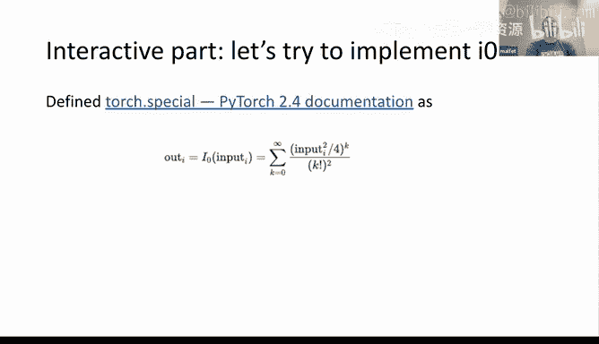
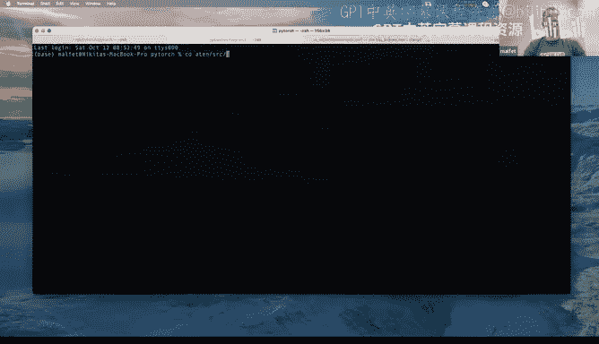
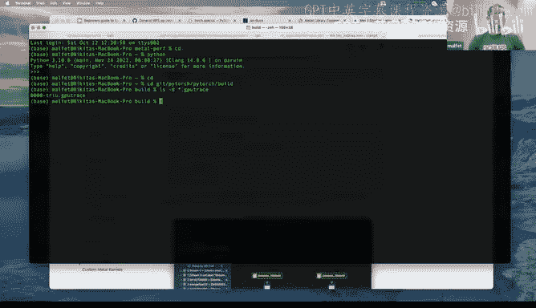
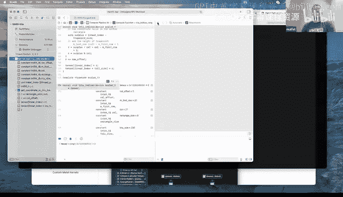
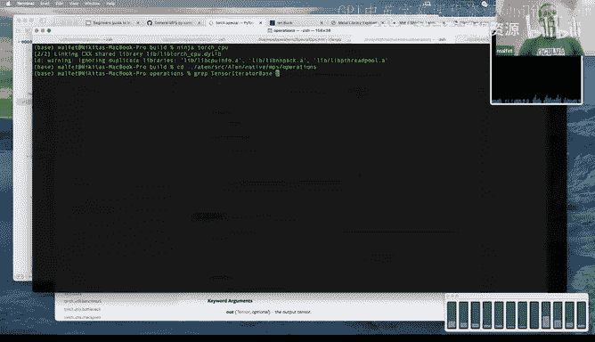

# GPU MODE《CUDA、GPU编程1-53课｜GPU MODE》中英字幕（deepseek-v3.2 - P34：-20241014-Lecture 31_ Beginners Guide to Metal.zh_en - GPT中英字幕课程资源 - BV1QZ421N7pT

Alright， I think we have enough people to get started。 All right， everyone。

 welcome to lecture 31 for GPU mode。 So very much I sort of in line with the rebrand。

 I'm really glad we have like Nikkito Sga， who goes by Malitt on Gitth up here to give us a beginner's guide to writing metal kernels。

😊，So actually so I first met Nikkira like just about like when I joined Pytorch。

 I think to this day he's still like the the second biggest contributor to Pythch with like 20 plus commrs。

 So so like someone like highly productive I really admire at work and I personally learned a lot like looking over his shoulder like while he's coding so I'm hoping we can have sort of something very much in that vibe So yeah without further ado Nikkita go ahead and get started take you for an introduction mark so first of all。

 the disclaimer so this is a beginner guides to metal kernels it's not because like I'm an advanced engineer I want to give you some basics I also don't know what I'm talking about I'm just writing code right so beginner's guide to metal kernels is sort of a little bit of a summary of my own learning So GPU programming and learning how to program metal。

So let's begin。O sorry so scramblemble why we're talking about this laptop just slide the stream from is a pretty powerful machine。

 but if you compare the CPU performance to GPU performance again I did an napkin mass I didn't measure it。

 but like this one have eight core running at 35 3。

5 gigahertz so that gives us about and it can execute four floating point operations per second so that gives us about 110 gigaplops。

On the other hand， this machine have like a 19 core GPU， which again。

 like if you do an napkin mass that gives you roughly seven teroflos of GPU performance。

 I don't know if it's possible to achieve this theoretical throwput I haven't been able to。

 but at least thats a theory a lot of those GPUs are not good capable because。

They manufactured by Apple and they。Have a very different architectures and Kud kernels and also co is very specific to NVG so we couldn't use it right away with any ML applications again a little bit of a history so MP backend was first released and Pytorch funded。

12 to expose more hardware features， unfortunately doesn't cover all the operators that one might need to run the kernels。

 especially in the early stages we run into lots of situations when we wish something was working。

 but it wasn't and also on the other hand MP which sensor metal performance shaders interpo nicely with metals so MP is actually nothing more than metal。

 well some professionally written metal kernels so like the ones you're going to see today。

So it must be it must be fun to code some and again。

 like if you know KUDa you probably already know 75% of metals because all GPU languages are alike。

Let's go with a little bit more history so how all this like GPU program started because it feels like you know you have a game in PC and you want to see graphics of why do you want to do machine learning on it as well。

So openG was raised 90 by the way， all the illustrations here except for the screenshots was generated by ChGP2。

 so the typography is as amazing as it is。So in 92， OpenG 1。

0 was released to accelerate graphics rendering but unfortunately have only fixed pipelines。

 but does it mean it means that if you want to render something you need to submit number of triangles。

 say how those triangles bind textures and specify where your light sources are and you can have up to three light sources if you have like a consumer GPU and I think in 95 you can have up to 16 for professional bonds。

But you cannot' do much without it and people realize very quickly that they want to have shadows。

 they want to have transparency and you can't really do it with fixed pipeline so around open rail 1。

4 somethingsung called Ab which is。Application， I keep forgetting。

 but essentially it's an open jail extension was introduced。

 introduced something called GSL before that it was AB ASM and finally in 2004 something called OpenG to the zero was released。

That have a programmable trader still we pretty far away from ML program and it's just a generic graphic traders they have three precisions mode low medium and high。

 but I don't think any one of them was actually a P32 precision well maybe around the same time people notices that using something called fragment shader you can。

Accelrate scientific computations by a lot， so some of the GPUs have a proper flow 32 in the high precision mode。

Optimization and Ian Buck， who is one of the authors of the K language。

 wrote a thesis about that when he measured how he can accelerate some。I forget the theme。

 but it wasn't like anything about ML it was computational physics。

 so in 2007 I think KD 110 was released。An open CL， which was originallyly authored by Apple。

 but right now owned by Kron's Group， was published。Two years later。

 so around 2009 where I think could three was rage and in 2014， 2015。

 like metal replaced open jail and Op seal across like languages across all apple surfaces why didn't people want to continue right in metal because metal sorry open jail open jail was written back in 1990s where CPUs was really not multi-threaded and not even the multicore so all the open jail pipeline was like a single pipeline that executes all the commands and in modern。

AtBoth ML and gaming applications you want to have multiple streams communicating the graphic pipeline and executing some sort of operations。

Anyway， so we done with a history and let's go a little bit into prerequisites so because we're talking about Apple or system。

 unfortunately fortunate in order to be able to write metal shaders for any of the Apple devices you need a Macs with developer tools installed and another thing is to interface。

By the way， if you have any questions， I don't know。It's a bit hard for me to keep an eye on the。

Slack at the same sorry on the Discord at the same time， but if Mark。

 you have any questions posted anywhere， feel free to interrupt。Yes。

 oh thank you for the correction so yes it was published in 2007 was created yeah five to six。

 but yeah the thesis was published in I think 2007， but yeah like all the work was done before that。

Thank you for the correction。No， you can't。 I didn't mut Mark。 So I don't know how to。え。Do anything。

Okay， thank you。啊。So anyway， because we're talking about Apple ecosystem。

 one have to be a little bit familiar with objective C or Swift to be able to dispatch this metal shader execution sorry。

我开。Sureir。And you need to be able to write metal shade language or like read metal shade language and eventually write to like dispatch something into GPU。

 So the screenshot kind of shows the left part how old school objective C looks like。

 I don't want to go into Swif because if most of the people familiar with C plus plus syntax Swift is a little bit。

Further away than objective C。 so let's stick to objective C。 and on the right。

 you see how metal shaders looks like they are very much like both of those languages are。

Kind of look very similar to I would say P++， in particular。

 a metrotraial language says that it's compliant with C++ fortune specg。

 but not P++ fortune standard library。A little bit of a terminology because I think I kind of do a little bit of a like alphabet soup。

 so metal shader is the thing that runs on GPU it is very similar to Kuda kernel。

Well I think in that case it should be metal kernel to kuda kernel so metal buffer is just GPU memory interesting aspect of the Apple ecosystem is in majority of the devices that was released recently since GP and CPU are on the same dyes they share the same memory and it can be shared without almost any performance penalties which creates a lot of interest in applications we can talk a little bit more about it later so common buffer is more or less the same as cool stream sorry I typed as I thought I'm typing but I typed something different metal performance shader is a collection of optimized pop shaders that was written by people who know what they doing like me so Apple like released metal performance shaders framework and you can call them again using objective CSwift。

To execute the highly optimized operations on the GPU and finally metaper shaders graph AK and PS graph is like graphlike compiler where you canfuse well it can fuse multiple operations and there's a whoever it chooses to it might not and this is a default interface that Pytoche uses to access GPU。

 maybe interesting thing to mention that metal performance shaders even though it says it's only runs on metals and oh sorry metal performance shader graph library even though it says it runs on GPU it can also sometimes dispatch to Apple neural engine。

 but like there are no documentation when it does so but you can observe sometimes that AE is utilized。

啊。Now， I think a little bit kind of away from our long preambles and into how to do something。

Practical for pytorch。 So if you want to write a metal shader as a Pytorch extension or just a regular8 and kernel please use metal shader library class。

 which is defined in the MP operation utilities to J compileile your kernel source and then kernel in from8 and looks at something that I screenshot it below right so this is from the cross kernel I will go and post like I will go will we will have an opportunity to read code later So I will probably like go through the slides and then it will become much more。

Interactiveive， all。Okay， let me read so but how does unified memory model and coulda compare to the unified memory model in metal with he series chips that's a very interesting question again I'm not an expert so。

It is my own observations。 It's not like authorative answers that it's always like that。

 So first of all， like。Both kuda and metal are different。

 so if you if you're looking about like chaar devices so what is it in VDS or in where you have an arm chip with GPU。

 it is very similar to Apple silicon when memory is actually physically shared， right。

On GPUs it's very different but like on traditional GPUs when you have like big 66 CPUU and then you have your GPU seat on the PCIEB like your GPU device is a bus master so there is no really way to share the CPU memory to GPU other than say that like GPU can read CPU memory just like you because it's a bus master device it can make a request to the memory bus and read the memory and similarly GPU can map part of its own memory onto the CPU and CPU can read it so I think those bike。

There is something called host pinned memory， so this is indeed that when you allocate something on the GPU and。

You can seize this memory from the CPU， but you will pay performance penalty every time you do so and also don't forget that。

GPU caches， even okay， even in case of the Apple silicon GPU caches and CPU caches are not synchronized。

 so if you want to see some GP memory from CPU， make sure to clean your caches if after you read it because of GPU modifies the memory you will be hitting the same like memory cache rather than actual gradient from a memory。

啊。But like going back to the hostsp memory， so the benefit of having of GPU having a dedicated memory is that when you run in the kernel。

 you like guaranteed that no one elses accessing this memory。

 so GPU have a full memory throughput with the system like Apple siliconon or inGtegra or I guess again I have it seen them like this Gracehopper devices is that memory bandwidth is shared between CPU and GPU。

 so if your CPU is utilizing the memory， your GPU have a less bandwidth because it' accessing the same memory。

 so it will be slower。哦。And the cost of asked the question about specific scenarios when Ns get scheduled。

 I don't think it's ever。Documented when it gets scheduled， but yes， as somebody pointed out。

 you can say that you never want to schedule it on NPUAEs and sometimes it might be scheduled。

 but again nothing is guaranteed right so you can you hope it will get scheduled but API is written in a way that its you indicate your intentions that you wanted to run on any if possible but runtime like。

Whatever。It is there like not metal runtime so if you write a metal shader。

 it will always be executed on GPU， but shader graph can choose to call any if matrix shapes sorry tensor shapes or operation types are sufficient or if you're running in the correct like power mode。

 so sometimes it might say well， it makes no sense to run on any because。Well。

 Annie is not always faster， it's much more memory efficient。

Andrew have interesting observations so yes like why we want to write metal shaders。

 even if your kernels are memory bound so I don't know if people are familiar so if for any applications because systems like both CPUs and GPUs now on balance systems so they have more performance than memory bandwidth other way around so you want to perform more operations on the registers which also called local memory and GPUs like。

GPUs have higher memory throughputs than CPUs， so even if you like memory bound it's still beneficial to run your applications on GPUs because they will have like well depending on the particular M chip so I think that's a difference between。

Like basic Pro and ultraltra is that basic how like in basic machines CPU memory throughput and GPU memory throughput is the same on pro I think GPUs have 2 x more and on ultratras maybe four maybe three I don't know the exact specs and I guess it changes from generation to generation but please don't quote on that like I read it at some point I cant guarantee that this is exactly the numbers but yes this is the reason why like even though they share memory GPUs have more memory controllers so like more lines to access memory and CPUs。

coolol， let's。Go to the next topic， so how to profile de bugg metal kernels。Unfortunately or， again。

 ons there are no better tools than Xcode， and that's the only tool that you have。

To capture the kernel behavior， you can use ML capture enabled environment variable， which allows。

GPU in a capture mode which switches GPU in the capture mode and then you need to decorate your kernel ins with like special instructions and then you can open GPU traces and see what's going on the same GPU trace can be used to debug kernel I will demonstrate it later or if people want to switch we can do it now。

But， you know， if you really want to profile your metal kernel， what can you do well。

 unfortunately you can also there is no public APIs right now that allow you to collect any。

Real metrics about what's going on on the。GPU on metal GPU。

 but you can measure CPU voltagelog time to estimate your kernel performance。

 so obviously it only well。You better do it while running a large kernel。

 so you will know because some of the time that you will be collecting is the time it takes to dispatch workflow to the GPU and wait for the GPU to。

Finish the worldflow。And make sure to sync your pipeline at the end otherwise it'll be just measuring the time it takes to dispatch something into the GPU so for example sees a benchmark Uniary example which use a standard like Dorsch U's benchmark timer primitives to benchmark GPU like MP execution time and I rolled this example so it can both be utilized on CPUs on Pua or on metal or MP right but it's important to put a synchronization comment at the end again can I don't know like do people want me to continue with the slide and then go into interactive examples or should they go and like kind of show how it runs or whatever。

Okay， let me continue with the slides unless Mark do have a preference。

I think whatever feels right to you like okay， let's continue with the slides and then we kind of jump into the examples。

So how to debug metal from command line again， it's not really a good idea。

 but you can use some sort of an environment variables which is documented on which are much better documented on a man page called metal validation if you're on your like Apple laptop but the same environment variables are mentioned on。

Apple documentation website and you can see I made like an obvious mistake when I have an out of bound bright in my kernel。

 if I do it without validation will just succeed， but if I define metal shader validation equals to one and then say want to see the report to standard error。

 it will print this message that execution function have an invalid right。Which again not ideal。

 but at least you know， you're doing something wrong， it kind of highlights a line number。

Which is also kind of a useful thing to have。So I don't know。

 like now I'm going to do with a case study。 So one is accelerating Gen V。

 So gem V is matrix vector multiplication operation。

 why it's interesting to accelerate it because it's very important for LLMs when you。

Feeds are talking and want to produce next talking it's mostly GMV operations I think 70% of all the compute time is spent on GV。

And a little bit of an interviewed by or intermission over whatever。

Is AI ready to replace software engineers？I did it a few months back when Lama 2 was released and I asked the question to write me a fast matrix vector multiplication kernel。

Using metal so first of all it ignored my request about metal and just wrote an open seal kernel。

 which almost the same thing we talk a little bit about the distinctions。

 but this is what it wrote to anyone who can read the code。It's not going to be performant。

So so actually I have a fun story， does anyone do you know what open CL stands for what the CL stands for Comp language that's not right。

 actually it stands for open Chris Luner。So yeah， I'll let you get back to serious stuff。😊。

I didn't know that， is it true？Or is it a meme Na all it's true like he told me this So like it blew my mind when he brought it up because I think it's one of people seem to recognize him by LLVM M LIR and so。

 but like he was also one of the authors for open C。 So I think that's why he picked the C name。😊。

Interesting， cool， I didn't know that thank you for the manecdote。So yeah。

 it's a very naive implementationation and so we will have probably two or three years of writing and metal kernels before AI catches up and replaces us all。

嗯。So the very few things that。Like AI did not pick up is if you want to do a better matrix vector multiplication。

 you should use， even though like GP is already massively parallel。

 you should still use single instruction， multiple data paradigm。 So on GPUus， like whether it's sca。

 whether it's Apple silicon， even if you write an all open jail shaders。

 there is always this like float 2 float 3 float four types。

 which again originate from the graphical nature of those pipelines because when you do graphic computations。

 It's very important to have four dimensional vectors and four dimensional mattresses。

 if you want to read about peterns and graphics， that's a very exciting stuff。

 But let's not talk about that。 So a very easy way to accelerate your performance by 2 x or 3 x is if you have a dense data。

Use float for and then you can perform the same computation the same computation is kind of a one operation right and also again because we are in the like graphic pipeline world the very easy way to reduce two float for vectors is to do a dot operation right it does a multiplication in sum so like code on the left is equivalent to code on the right but the loop size is four times smaller and it runs to three times faster。

啱。Second one is。Like。To use another vectorized type called matrix 4 by4， of which is like。Again。

 if you're using peternionss， mattresses are very important and the the GPus usually have a specialized silicon to perform matrix computation。

 So again， on our left， we see the like a very simple vectorized kernel， right when we use。

Oh I missed the parts that they are float force， but we're reducing flood force。

 but if we using we if we multiply float4 by4 on the float flowtensor。

 again it's in operations and can be performed。As a single operation and it gives us the same results much faster。

And the third step is to max optimize memory access So sorry if you this float4 by four， like。

 is it just that like metal supports like varietyatic types， like。

 is it sort of like arbitrary X by Y or is this just like 4 by 4。

 because it seems like it's a10 circle or like。Destruction here。

So open jail supports well so four is maximum I know there are three by four mattresses because again sometimes you don't care about peters you just want to rotate your triangles and there are three by three mattresses right I know that there are two by two probably but I don't know if there is like if it's fair to say that like。

Your GPU throughput if you do float two by two computation will be what is that four times more than four by four computation I'm not sure so probably like floataw two by like all of them are mapped to the same like four by four registers and they just discard the results。

That's something I don't know， but the language itself allows one to have like floor three by four floor two by two。

I'm not sure if you can have like one by four or is it like always flawed four and then you need to transpose。

Iteresting， okay， thank you。Oh， okay， so yeah， two， three， four。And half2 3，4。 Yes。

 and also beef flow to。Yes， there is a before2 three，4。So yeah。

 and the third step is you GPU is very memory hungry and being able to show that you can preload the data using the big reads and then reuse it allows one to。

Like implement a much faster kernels。 I will point you to the repositories that implements all the three steps later。

 and the results I've collected again。 it was a while back。 So very naive implementation that。

Artificial intelligence gave me resulted in eight gigap flops。

 so we're not talking about ch flops at all， right using this flaw force immediately gives us 35。

And using Mar 4 jump it again to 147， and if you do a little bit of pre。

 you can again almost double your performance to show2 shows1。No。

 interesting so there are no befflowawed mattresses types。

I wonder if it's coming in the next era of the metal。嗯。

So that's kind of the first case study and that's some local links to like well how to get started with spytor。

 maybe probably cross operation well I think the first one was a bit wise ops but not interest cross kernel was the first。

Metal kernel added to Pythtors。For an example， for a good GM kernel implementation。

 please look at MLX。The examples with one of the kernels that I mentioned here are in like my re repository。

 so feel free to check it out。Trad and language specification。

 that's a very very big issue that people request that was created in 2022。

 I think it's probably right now most people keep requesting operations that was implemented the while back。

 but they are a really old version of Python。And I guess last but not least metal puzzles。

 So to get your hands dirty because I think metal puzzles。

 they like MLlx have a much more lightweight API to allow you to write kernels as part of your。

Python notebooks， which is pretty nice， though Pythtorarch have a very similar idea that I can show in a bit。

 that's all with the slides。 I'm ready to move to a more interactive session and try to maybe implement。

Special I zero operator。But we can also like answer some questions。Take question。

If I writeomic metal， is it always guaranteed to run on NPU and GPU and never on CPU or can it also work on CPUator？

So， metal。That's a good question。 So opense originally can run on CPU and a like other accelerators。

 I'm not sure if you can create a metal CPU device。 So like if you look at this。

Let me go somewhere here。😔。

Like metal benchmarks， right if you look at the very simple soil。I wrote a very simple kernel and。

To get the devices， there is something called metal copy all devices。

 and I think this one just gives you one device by default on Apple Sil which will be your GP so no I don't think it will dispatch to CPU。

嗯。So I may not be able to do either the CPU or a GP， I mean。

 there is no way there would be a sous execution of CPU and GPU then。Like for instance。

 I want to do a offload job to a CPU work， like zero offload or any of those and probably not able to work。

So you can do it right now right with Pytorch like if you think about something like that you know of course you can do it over the Pych but there there's no clear way to do it in metal right if you want to run somethings on CPU you can like again。

 you have multit and you can create a thread and run something on CPU while you dispatch your work so like。

I didn't talk a lot about the main loop， right， but the main loop is you。

You have a common queue which is your coolest stream right you dispatch your job to the common queue says and and Colian so when you do commit it actually sends us to the GPU and then you can skip wait until like completed do some computations and wait until completed and then like you kind of parallellyze CPU and GPU implementation to an extent right like not a very clear like programming model。

 but it works。Thank。And Andrew mentions that MLX have a nice API for launch and GPU capture tool。

 so yes， there is something like that， I think it's called verbose mode。In Pytorch。

 I did something similar， so I hide it behind the flag。But if you use。If you look at this one。

 so I've like extended MP Pror to have capture enable and start capture and capture that allows one to capture the shaders of humanium。

So I don't know why I'm hiding it behind the compilation flag。

 maybe we can just enable it by default， but I'm unsure about the performance overhead。And with that。

 if you enable this MP captureture enabled environment variable。

 it will dump the things and print them into the。Like in the GPU trace。

 which I guess similar to the metal debugger， yes， so it will do the same thing。

Oh I see they just explicitly expose start capture and capture that's a good idea if anyone wants to propose a PR that explicitly that exposes this functionality like binds it to the Python。

 that'll be a good thing to do。So let me bring you sorry。Didn't pop it in the right browser。Yes。Yet。

So this is the link that under how you can do this。

Right and this is like a similar idea how you can do it in Pythtorarch。Right， I mean。

 but there is no currently public bindings， and it would be nice to。By expos them to Python。

 so feel free to author the PR。If anyone wants to do that and then the traces looks。

Do I have a trace here somewhere？😔，Okay， I have some choice。

I can probably open it and that's a simple tree operation。

So I guess we don't see a lot of interesting results because also interesting thing about all the tools is that they really bad when you do the video stream because you're using the same GPU。

 I might not be able to show you anything of how to debug it interactively。

Because I'm also streaming。 so I run into it in the past。

 and I have to warn you that it might be the same thing again。 let's try。Oh no。

 at least I can't debug。Right， so at least you can use like a tensor debugger and select any kernel and then like at every step it just records of a value of all the variables。

Which is nice。

Like there are all function calls and whatever。Any other questions？Okay， then let's if。

 if people are interested， let's try to。Caode I0 special maybe another interesting aspect speaking of data types。

 So the big difference between hda and metal is metal doesn't have support for double precision。哦。

Flot and point data type its I only have a float precision half precision and B float and surprisingly to the best of my knowledge again。

 like。And2 does not have a hardware support for BF 16。

 but somehow it is faster than used F 16 so even though it's simulated again。

 if you think about it like you can convert from F 16 to B flow 16 by just shifting to the left and right and I guess that's what happens after under the hood and the operations is just like performed overflow 32 but still somehow those computations are faster if you use BF 16 in the simulated mode than if you use F 16。

Let's try to code this one。I just tried to enable some testing and I notice that there is no such thing on MPps。

Right，And we can probably just we create check that it is indeed the case。So Pythonrch。

This one works， but if I say。Otherwise is it yes it will fail。Right。

 so very first thing to do is you need to implement an data an operator。For MPs and you can do it by。

Unless people have questions， though。Well， this is super interesting。

 just like if you are for questions， like we can interrupt you。 So just keep going。 Sounds good。

 Okay， so first thing I'm going to do is I'm going to add like a native function。

RightSo let's search for I0。Point twice， point twice， though we have。😔，CPU cooler， but no MP S。

 So let's start an MP S here。哦。And try to compile it。要。First for clarification。

 I already have like a Pytorch pre installed and I installed Pytorch in something calledDevelop mode so essentially what it means is see if I'm。

If I'm anywhere and I do import torch， then torch file points to like my GitHub repository。

 so it makes it very convenient to interactively debug and develop。So I added another。At an operator。

 it runs a little bit of a cogen and it compiles a few things and it will fail to link right now because now it says you need to call your MP operator and I didn't implement anything。

So I suspect when we compile this one， it should crash， oh well， it should fail to compile。It sorry。

 it will compile， but it will not think。I think you're the first speaker who's attempted to like build a library from source on live。

 very brief。Now， if there will be a blue screen of jazz， I'm not maintaining maintaining macros。

 so I will not be responsible， but I'm not sure why it's taken a while。Let's bring some things here。

😔，Just for。Sounds like that。It's still components。I'm surprised。U is much faster。So Simon's asking。

 is there somewhere documented how to make Pyro linked to your Gi repo？Yes， if you go to。I developer。

 like I think it's some contributing M contributing it。Yes， so tips and debugging。

Right so you do this， set up develop and then you can do this。

 but actually since then I've wrote a really nice tool so I very often have to debug something I can probablyulate。

Show you how it's going on。Once it finishes。I don't know what it does。There's something we going on。

I haven't updated my Mac recently， so I should be fine。So I've wrote this tool called。嗯。

Bilt with debug information which allows one to rebuild just one file we will probably use the tool later on and it creates the similar for you so I can post this link here。

 but they probably need to update it there so you don't need to do it anymore because there is a dedicated tool that can do it for you unless you are doing it on Windows sorry Windows is hard to support。

So。Oh， sorry， on this one， I don't know like how can paste it in work。Oh， interesting。

Faiil to launch。It doesn't。Very interesting。你说。Once。你我的时 jump步。Okay。

So dispatch mission for Car and P nice， so that's a good sign。

 we change the error message from not implemented to dispatch mission now let's implement a dispatch。

 but first that's fine where it's implemented in the。It and associate and native。CPU specials。No。

 let's see in quota quo them。😔，You know special os？

Here we go and let's create something similar native MP oh sorry I don't like people usually do visual Studio。

 I don't know how to use visual Studio。はい、気。Very special up。And。We do want to do I0， right。

 so we registered disclosure here。嗯。嗯。The tenator。I don't like ten0 orator， Well。

 I like  ten0 orerators and just likes them。But let's try it。

 so I think this will just printer zeros unless I'm forgot to include something。嗯。No， thank you。

 I used to use Emax I。Okay， by zero ms， it must be static。😔，Sure， why not。Now。

 if we're on the same thing， it will just give us zeros。But it gives us as many zeros as we want。

Which is really great progress。下。So I si容啊。And all it does is called something called cca 0。

Which is a very。Simple function， I think it should be implemented somewhere here。哦，没气。好的。😔，Oh。

And yes， calculation of a0 is very simple again。I don't know why we do as scalrs then， but。

So let's create a0 dot metal and try to copy and paste the thing。So I don't need。

Startick I don't need a line and unfortunately nohole device so I think the big difference between like metal and Ka is that metal is purely GPU or Nhole device functions。

嗯。So so Nikkira， like is this like did you sort of imply here that when in Pythtorch and Python line when we're calling2 MP。

 it's kind of like a fake operation in some sense， like you're not actually ever sending to the device it's always running on the device。

Is that accurate No well？So2 MP still does something to the tensor。 it converts it like。Well。

 too coola doesn't actually， well， it does send it too cooler。

We we still use the separate memory right now for MP and good and CPU but you can read technically。

 So all of our MP tenss are mapped to CPU， you can read them the problem is when CPU tries to write them。

 So like in Python， we don't have a really good API for invalidating caches So having Samsung like copy and right because if you just map the tensor。

To CPU， it will not be visible from the start。Anyway， that doesn't make sense。It does yeah。

 thank you so like I don't know if I am to demonstrate。When yes。storage。回知。Itll have storage， yes。嗯。

Theres a pointer or something。😔，嗯。Here go。Sorry， I'm a bit confused at me。😔，I like something。Sorry。

 I always forget all this。😔，Type storage。😔，We can create a tenor self storage。😔，Slish points。嗯。你个只嗰个。

No， I don't use Copit， I just use a very old plugin and called you completete me。

 which is just a little front end。哦。It does have compiled so surprisingly。

So I was always there it's data pointer now it's no data pointer。Is just X have a data pointer？Yes。

 X have a data pointer and y have a data pointer， so you can see there are two different data pointers。

 unfortunately there are two different storage types。

But like you can create a by object from this data point and actually you can read an MP memory。

 but like if I'm going to modify it， it will not be reflected so it's better to copy。嗯。Anyway。

 what was it？Here。So I have Cal I10， I need Chabosh coefficients。😔，I need both of some ideas。

No he hello生边。Unsurprisly。Thompson tells me that's probably all I need to be able to。Part thing。

 so let's try to compile and see how bad I am。And I also probably need。你 keep forgett on。Yes。

 I need to include metal standard library。W line is to Til。 I'm not sure if we have Til in the。まず強とか。

So the metal compiler is unsurprisingly called metal。

 but unlike host compiler visualual Studio does sorry。

 Xcode does not expose it as a regular command line。

 but you need to prefix this with something called Xron， which stands for Xcode run。没と。

And zero foot metal yeah， so there is no STD。And。I don't know if metal indeed supports sts。😔。

And I found them do trouble。My mightphone to give with a try。YeahhuNo triple。哦。We can implement your。

嗯。Should we implement people or do something simpler？슨큐。Who stops us？嗯。Qut。嗯。Okay， and pointers， yes。

 that's an interesting thing about。哦。Metal， unlike gooder you need to have。Thanks。ち通。

Moreables and functions cook cannot not be declared static， Yes， welcome to metal。诶。

So let's make it a little bit more ugly， let's just say that they have float arguments because we can have them as doubles and we'll be downcasting them。

嗯。Oh con is constant。I meanI should like which C plus plus version should people be using if they're using metal like。

Now it's something like C plus plus 14， but again， like it have all the C+ plus  fortune language primitives。

 but it doesn't have the C plus plus 14 standard library。

By city hub you can't include it right so you have metal SD you leave so。I don't know if that。

answerer makes us much sense。 It does。 I'm just， it's an interesting choice， though。累。

Like why do this if you're Apple versus just implementing the standard？

Because why do you want to implement a standard library when you don't have to？Fair enough。あち。😊。

The same。唔系。Can we use this function。It on implementation。No。

 there is a Gerator implementation probably should have followed this one。

We just copy and paste this one。 It's much faster。And it will probably works as is without any optimizations。

Okay， this one compiles。 We just now need to write the。

A kernel which takes input an output and calls this function。And I assume that。

I0 is always one dimensional kernels， right？😔，嗯不到不知。😔，For each element of z， but do I see so。

Interesting。嗯。Well， I think during this recording， we will implement it for one dimensional tensors and then I'll later extend it to the multidisal tensors。

啊。So let me write a colonel。😔，Let's write the floating kernel I'm kind of fling。我我。I will write。我是。嗯。

你费。Okay。嗯。I need。Input output then I need a linear index that's it right let's again this is even simpler so like unfortunately Pytorch is a little bit convoluted it needs a lot of assumptions so if we do something like that。

It still can compile。Right啊。oppo so。And that's signals。😔，系笑嗯。嗯。Yeah， it works， so we have a kernel。

 we just need to connect it back to our。哦。Bffer here， so。I need now， I guess， for comparison。😔。

Yes operations， what would be the simple。Candops is pretty simple。So we take shaders here。嗯。嗯哼。嗯，😊。

Well Pytoch have a lot of weirdered operations， I think I forget why we need these bes functions。

 I think one of the normalizationchemas requires one。But it's not the most popular op right。

 but it's a very simple to implement so anyway。Right we just takes implementation from here and post here。

Now， we want to。You'll call the tunnel on the materator。哦。So is your kernelel？This is from slide two。

I oh， it's just called a zeros and word float。😔，I need to。 So we we。

Here we finally will compile it at the wrong time。Get the current stream。And let's just pull it。Na。

 you mind taking a few questions， or you want to just show So I have three， at least。 So first off。

 when I see this dispatch sink with re throw。Like what is this really doing it's basically okay good point I forgot to mention about it so。

Like Macos have an interestingian paradigm called dispatch Grand central dispatch so instead of creating a classical thread you can create so-called dispatch Q and then the Qs can be parallel and synchronous and when you say dispatch think with retro it says that the block within like from here to here right so similar to C plus plus lambda so C plus plus lambda period if I'm not mistaked in like c plus plus 11 but like objective C have the paradigm of blocks for a while back it's very similar to lambda it say capture everything right and here is your lambda and this function dispatch thing so with rerow is our implementation that throws C plus plus exception captures and rerow c plus+ exception to the original one but this might execute in the context of a different thread or whatever but what this guarantees that like only one block can run。

Because we want we。Like嗯。You see here I ask， I create something called command encoder。

 right and I make these commands and those commands must be executed sequentially。

 right because GPU does not know what happens in between。

So what I'm saying here is that I want to guarantee that those one2 three four five commands will be executed sequentially no one else can execute any commands to the GPU at this time dispatch any commands to the GPU so GPU can be run in something right in the background it could be other GPU threads but I'm saying that within this stream this is the commands I'm executing with the coa you need to do something similar right there is a coa guards but like on Macos or if it's metal you can just guarantee like that like essentially a program and API requires use that only one thread at a time can dispatch commands to one stream and dispatch saying just guarantees that if you like this is a standard。

Part of the macro operating system schedules block for execution。

 most of the time if you're called this sequential it's snow operation。Right， it doesn't do anything。

 So if you only have one thread， you can like in all of my examples and like if anyone checked out my。

I see yes so so like if you are just like a metal author， you might not have to worry about this。

 but because you're merging your code within the Pth's library。

 it might be scheduling other like most of the times would not do anything。

 but if you're doing something weird or especially like if it's like backward propagation or something that happens asynchrony you need to synchronize but。

Its not doesn't really happen another thing auto release cool。

 it's another language of objective C so objective C is a very strange language that has a lot of interesting syntax。

 apocry theory is that when Apple first needed to implement something like objective C they didn't have a compiler engineers and the first implementation of objective C was just a preprocessor and so they wanted a construct that would never be encountered in normal C code so they do this add auto release or this very weird like。

Brackets as first operation on the string， which means like invoke objects sorry invoke method of the objective C class and and so speaking of objective C。

 there's no limitation on us like this could have been like swift code if you wanted it to right you can write swift。

 you can write objective C is just like。Yeah， in Pytorch。

 we just choose to do the objective C because swift runtime is much a little bit more involved。

 So like the great thing about objective seat have a zero runtime overhead sorry。

Zero like runtime that you need to link into your application。

 it's all part of the operating system with Swift because Swif Laish evolves a little bit faster whenever you compile you need to bundle three parts of the swift runtime into your application。

 this is why we decided not to use it but at some point if people feel strong so it'st re right to Sw。

Okay， got it。 Thank you。嗯。Yeah， I need input an output tens。 I'm trying to recall。How to do it。

 I guess， like input content I can do how。嗯。Get out science。Now， Tensortra base is not defined。😔。

Sorry。嗯。Now， it will be a bit better。听。😔，嗯唔确。Now let's see how bad dynamic rise in code。Pretty bad。

What do they do wrong， or this change has depends on your native function at the Yao。

Consider a change should be better placed than another a file more specific。😔，可。😊。

It just doesn't work。I'd be very surprised if I didn't make any bos anywhere， but let's see。Well。

 it prints once。I don't think that's what we expect to see here。

But that means that it's likely working。嗯。Maybe very confusedfuse the inputs and outputs。

And now let's use this。Validation。Or we can maybe capture zone。

So let's see if we do any out of bounds rights。By any chance。No， it just wants。

 so what am I doing wrong？X is less than8。😔，Exponent of Chabershaev Y searching。😔，Otherwise。

 with dos and the exponent of shebershev P25。😔，Moson is correct。

And input this first start put a second。😔，Output of index equals input of index。

When you say MTL said buffer， like what is0 and one referring to， it's an index as a function。

 So you can be really ver and write something like that。Thank you for welcome to any other。

Like you can specify which indexes， but essentially like this is argument this is like a first size argument but so let me try to。

Find something theator based in like MP code， maybe I。On copy signs example。

So you see usually it with specify just buffers like that。

Right， so let's see how we implement copy sign。😔，B may implementation。So input zero。

 input one and just output。Oh， they both outputs， that explains what I did wrong。let's see。

And we get the expected results， so it just works， is are the expected results。

 let's compare to the CPU。And that seems to be the case so you see we've wrote I0 I think it will fail as soon as you try to pass a noncontuous ten and this is something that I need to fix but let's try to run the test that should expose the problem or I don't know I can create a PR and post it for the people to observe and then we can continue inter iterate on the PR that will work as well。

Let's probably do that。嗯。Because I think the questions people very often ask is how to test it。

Luckily in Pytorch， we have something called operator information and what we usually do when we implement operators for accelerator。

 we compare them against CPU implementation。Right so if I do something like this， that than P。哦。

And I'll try to run a zero test， it will， well， it even crashes everything。

 so I means that I'm doing something really， really bad。

Let's try to figure out what we're doing better。嗯。And default MP January。Oh。

 because we indeed corrupted memory。I suspect we。Let's try it again。😔，No。Okay。

 I'm a little bit confused。Let's modify our implementation to just throw an error。

Without trying to do anything， just return， right？Because if we just return。

 we can't corrupt the memory。And it should just work。No。Oh。Iue I didn't repe my python binary， yes。

 sorry that explains what's going on。Well we're waiting for that。

 any other questions about what's going on？And I think did I create a PR？I think yeah， maybe。

 maybe a kid， maybe now's a good time for。cause I one thing I noticed is as you're going through this。

 you're like copy pasting a lot of your own code。 you had a lot of like。

Like tools that you're using that you found helpful and I think like basically the main theme people are curious about is like great like how do I just do what you did now for like another app so maybe maybe be helpful to sort of like show people what are the options available to them。

哦。Sure， so indeed， like the workflow， as I think I mentioned on。我。

The slide workflow should be something like that。 You implement your kernel， you compile your kernel。

 making sure it works。 You wrap it with。Metal shader library。

 right so if we go back to wireless compiles。Right， so。

Metadal Australia Library is a class that just compiles a metal shader and makes it available to your application。

Right， and then you can do leap get function。get pipeline name for function and it creates a pipeline object that essentially binds a function to the kernel。

哦。And then you can invoke it。So like you said the buffer and whatever the thing that you need to remember is indeed how to like put a sensortens itator。

 so I think to write by torch。Paon operators， you need to know certain things。

 which I think you also need to know when you write a code of tensors if tensor iterator for some reason doesn't work for you。

So， but this is essentially like。Or of a。Operator implementation。

 I plan to add something that will make it a little bit more similar to， but it's not done yet。

 So if anyone wants to help me with this refactor， but I plan to add something similar to。

What MLX is doing when you can just implement a shader and provide function signature and we've write as a boilerplate code for you because all of that is a boilerplate right there is no real logic well the logic starts a little bit here so all like when you're talking about binary operators a unary operators。

 sorry just for any element wise operators you can always treat them as a onedial job right so you have some operations that you perform with element X or element element X and y and you save them to element Z。

RightAnd you can always treat them as a one dimensionsal job。

 there is nothing you need to know about Tens geometry。

 but when you try to do something more involved like matrix multiplication。

 you want to dispatch your two dimensional or three dimensional jobs when you can organize your threads in a nice thread groups and they can use shared memory。

Right， so this is something we didn't touch because it's a beginner of like metal。

 It's not an advanced one。 we didn't touch and talked about anything related to。好。

Like organizing thread in different directions， but if you want to implement like Uniary kernels。

 then one dimensional job is what you want to do。I guess like I can probably answer better if you trod me with some like or anyone probed me with the most specific questions。

 what you want to know about a specific part of this code。Yes。

 so I like my senses pointwise ops are like a better like starter starter task。

 So maybe the the tracker that like Alvin had up has like enough like good pointwise ops and maybe people switch just start with does indeed indeed it does Yeah。

 and like for all the pointwise ops again I'm apologies for a lot of boilplate code but this is nothing but it like I think the parts that we haven't touched yet。

 So when it finishes compilation and it does So now let's see that I0 should just fail because。

Everything works。 yes， expected failures。And if we common this one。

So the things that is currently mentioned so you see this one scalar tomato metal type so right now I implemented it only for float。

 but I probably want to implement it very similar for half and B float。

And I can just copy and paste so I can use templates to do that This operator is so trivial that like copy and paste and templates sounds a reasonable thing to do。

 but sometimes you want to do something like that。And you see it in a lot of。Fer。Colonel's right is。

People do something like that。Some you give template plates don' know。😔，It's the host name。冇似你。

My zero floats。😔，And then just like it explicitly specialize it and we very often do it through。喂。😔。

this type through this type of like the processorces macro。Let's see if this works。😔。

So this is identical to what they've recently before。

Maybe I made it by purchase and I don not for anymore。No， thank you， yes indeed。

 there are lots of tutorials of how to do that， so if you want to just be a bit more familiar with the basic。

Implementation， you're more than welcome to try following those。And I made a mistake again somewhere。

Oh， because I'm still returning。No I didn't make any mistakes interesting。

 so let's see what will happen so if instead of float here the2 fold trip flow 16。

 we should see an exception saying that I0 float 16 could not be found right。

 cannot create a function state object for a02。Right， and so what do I want to write here is。Right。

Mo to world for half precision types。嗯。But I don't know， Mike。

I can continue implementing this or do people have some other questions because I think it might be a bit boring and I might need to answer some like practical questions。

Yeah， I think probably now is like a good time to start wrapping up so yeah like I guess if folks have any questions to Maffat Nikkito hes egos by MoF on the server as well and otherwise yeah。

 let's just take the last couple of questions I see Simons asking can you also show the tool you talked about earlier although let's do that that's indeed an interesting one so like let's look at this again you can use visual studio if you want to dubug anything but I'm a bit lazy right so。

Like。Let's do this， right so and we know that we implemented it for float 16， let's start B float 16。

 right because we haven't。And if we run it， it will throw an exception。And你发。四。

That I want to stop on a C++ exceptions。It stops in simple++ exception。

 but my back trace is not very informative， right？Like I don't know what i'm doing right I don't see anything and I want to see the line information so what they can do it I can use this。

To called built with thebu form。And say I want to， I don't want to like boil the ocean。

 I don't want to rebuild So like why not build Pyth with debug information by default。 First of all。

 every time you link， it will take like five minutes because your Pythtor binary will be huge And if you build everything with debug your binaries will also be very large and very slow and like it will affect how you can run some things。

 But if you know that you want to debug like a specific thing and you know that this I don't know function is implemented in because we just added it right So we know that it ist spectral ops So I do this right I call Python tools built with debug information and just say this one file please。

And it reveals just one file with debug information and now if I repeat the same exercise。

Right and want to see the breakpoint I can see the nice line information I can see all the variables or whatever I want。

 so Cx Atro I cannot。But here is my line information here and I'm going back here and I can see everything right here is my curator。

Here my input tensor。Here's my openpener。Like this is my stream。Right， and I think。

I keep the kitchen。This is good right so if you don't know LB or nice debugger that you can use。

 but again， like you see so let's go down like suppose for whatever reason we want to go down and we see well。

 you know what this one is not。So we have the debug information here， but we don't have it here。

 right which is like where is this Gi pipeline state implemented？Right you can do it with Gr。

 but I know ahead of time that it is implemented here， so I say A native MP operation utilities。

Now I compile two files with debug information。哦。And I will see moreline information as they go through the code。

And again， it allows me to set breakpoints by line numbers and all that stuff without like recompil and it should work for your ke as well。

I don't remember yeah you see so now I recompile operation utilities with debug information and I know exactly where I am and again I can like yeah well here's my code this is what I did so far。

So it will work for code as well， I don't remember if I add the capital G so maybe the thing that I didn't kind of mention that in Pythtor right now with the reliance are called Git compils so with J compile all the tensors sorry all the metal traders this will change in the future but in Qda we usually precompile it and when you compile Kda shader you have like two options you can compile CPUU code with debug information but you also can compile GPU code with debug information and you need to use Kuda GDP or somethings。

And in that case。Like， yeah， you need a dash capital G so there' lowercase G when you do NVCC。

 there' G will insert debu information for your host code。

 dash capital G will insert debug information for your device code。All right， well。

 thank you Nikkita， I think no that might be a good time to like end。

Thank you so much for coming on I think yeah， like I said everyone like and Aquito goes by MalF on the server and on Gitthub as well so if you're like looking to get your first like model kernelel Mer you know who to tag thank you so much toquito so next week we're going have like Daniel Han who's going to be talking about like Un slotth So yeah look forward to see everyone next week thank。

