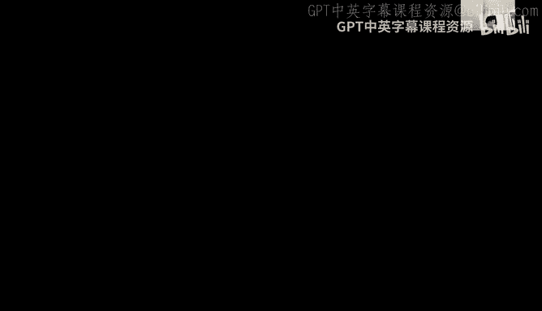
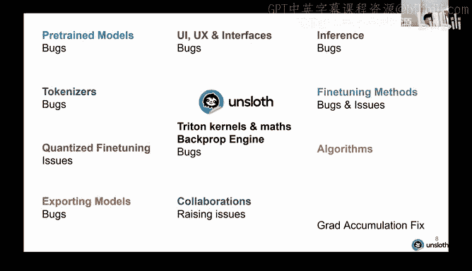
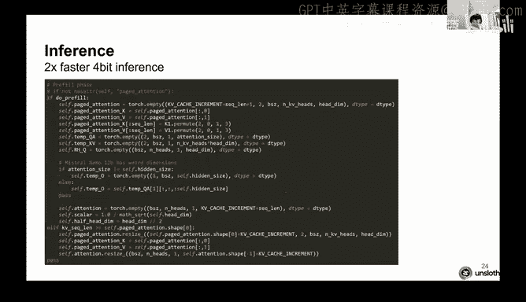
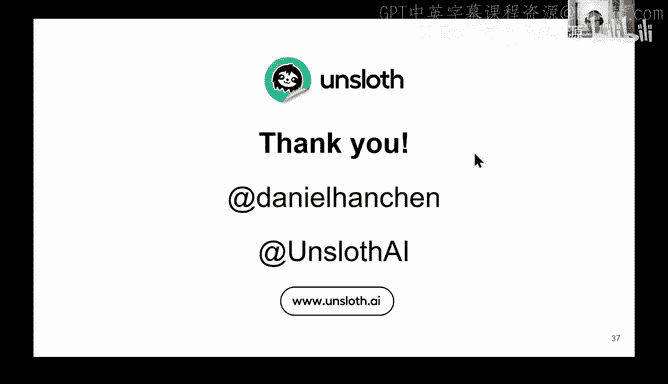
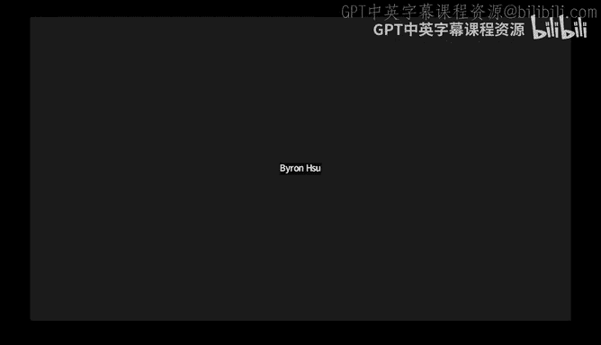

# GPU MODE《CUDA、GPU编程1-53课｜GPU MODE》中英字幕（deepseek-v3.2 - P35：-20241021-Lecture 32_ Unsloth.zh_en - GPT中英字幕课程资源 - BV1QZ421N7pT

Okay， hellello everyone， welcome to lecture 32， I believe of GPU mode today。

 like I'm really thrilled that we have like the Daniel。

 the Han Brothers Daniel and Mike to here to talk to us about unslaught I think the first time like I'd heard about you guys was like for the N Yorks Llum efficiency competition from last year y'all were like so already some really cool stuff and some very sort of precise performance work and you know it's kind of been very obvious to me meeting both of you like that you both really love what you do so like your enthusiasm is pretty infectious so I'm really glad you're here in the server So yeah like if yall throughout the chat。

 if you throughout to talk if you have any questions post them in the Q andA here on Zoom and we'll occasionally read them out to Daniel So thank you Yeah Daniel。

 please take it away。😊，Yeah thanks Mark for like inviting and like thanks to everyone and the GP mood server we used to recruit it but like yes yeah like we started off with an LLM efficiency challenge way back last year and then yeah so like we did unsolve as like a side project but yeah okayll I'll share my screen。

😊。

And you guys see that is that oh it for a slidehow？Yeah， we we see。 it's not in slideshow show yeah。

 but we we just see， yeah， it's it's， it's gonna。Okay cool so I was like thinking what should I talk about today it was going to be about like Triton Puda like everything so there will be like half of the talk will be about that but then I also wanted to talk about like general systems engineering because when we first started unsoft it was like we first made it as an optimization library like you know making finetning faster reducing memory usage but we do not expect all the extra stuff that came with it such as fixing bugs in models and stuff like that。

😡，So some of you might know me from like Twitter as well so we fix bugs for example in GeMma so me and my brother like you know it's currently just three people in the startup but like essentially we fix bugs in Gema there was like some VOS token issues some root issues layor issues sweetoo yeah and like just activation function issues also we do like model analysis as well so like for example G we post like these I don't know if you guys like see this but like we post like these stacked like you know fully packed paint images I use like paint to do all these analysis it's very fun sometimes it can get a bit tough and confusing when the model architecture is very different and sometimes they do mistakes as well for example in G I think I did a mistake with the I think the10h part I think I did division but it' was actually supposed multiplication so yeah there are some mistakes in my model analysis as well but it's fun。

Also like for example like you know NviDious Nemoron。

3 40 billion and just some analysis on that and also like you know torkkenization issues。

 there's a lot of torkkenization problems in language models。

 so that's also very fun to provide to the community as well。😊，And you know recently。

 if you guys have been following there was a gradient accumulation bug and so like we showed that so someone else。

 sub Benjamen posted about the bug one week could go or something and this blog has been in you know most trainers for like four years and essentially the gradient accumulation was theized to be equivalent to full batch training but it actually was't and you know like Ill talk about that today as well。

 mainly so Joe like posted about a you know very cool picture so we showcasing the main issue of gradient accumulation。

 mainly the denominator was not correct in the crosscentur loss calculation。

And yeah so we have like a GithHub package as well so like we post for our fine tuning our you know our fixes。

 our bug fixes， kuder kernels well we use Tri to actually we try turn kernels all in our GiHub package as well so definitely check that out。

😊，So yeah， in terms of like a backst， we first started unsve as like with triton kernels， some maps。

 we had like our own back propagation engine and the goal at the beginning was to make LLM fine tuning like Lama me jamA actually it was just Lama。

 it was just Lama two fine tuning two times faster at the very start so it was this was around December and this you know launched after the LLM efficiency challenge and we reduced rearRA usage by 70%。

😡，That was like at the beginning。But we do not know that there is actually lots of extra stuff that you have to like put together with the package in order to make a work so I'll be talking about like most of these things。

 for example like you know tokenizer problems pretrain model issues exporting models to like VLLM you know collaborations of different entities and companies or organizations you know making inference better doing fine tuning DO orpo best practices for Laura and also like many algorithms。

 chunked cross entropy， long contact fine tuning chain matrix application training and completions and the gradientd accumulation bug phase so yeah the goal is like it's not just about making the triton kernels better and you know writing optimizeized libraries that's actually very important but that was actually just the beginning of making like a full-fledged training library。

😡，And yes the solve bugs and issues the every single one so that was the unexpected part so yeah so like we essentially have to like notice okay even if you make like you know like implement for example we did not support myal models back when we first started so you know we have to support myal models or sliding window attention and then Gema came along and there was like interleaved sliding window attention and like global attention so that was like another new thing and so like there's always like these new things that come out and so we have to implement them in unsve yeah so it was very interesting like many all of these parts of the stack kind of had like bugs and issues。

Yeah， so by going back to like our first release， essentially we took the transformer architecture like the decoder Lama style transformer architecture。

 and we like essentially like wrote it back， wrote it down in like all of maths， you know。

 just try to like make it as like into like one page of maths and then we noticed like okay。😡。

We could like tritonize every single portion you know like do some back propagation tricks like you know doing gradients。

 derive all the gradients， do calculus， do matrix calculus and then like we essentially like make the entire process fully triton so our theory was okay。

 this will make traininging somewhat faster and reduce memory usage。😡，So for example。

 the RMS Laor kernel that we were it's cited in many packages as well we posted these kernels were like our beginning kernels that we posted around December sometimestime we worked at them around like November。

 December， October ruin the LLM efficiency challenge as well and we like perfected them and like we release them around December I think the simple one not we can't remember the release it but yeah so these are RMS Le norm kernels you can see that we commented out you some of these like upcasting and downcasting things this is actually for pro and error that we did especially like the backward kernels we had to like upcast everything to float 32 we actually spent a lot of time and energy trying to like exactly you know copy the exact methodologies of like the correct gradients and the correct upcasting and downcasting is' actually very painful because like for example the RMS Laor kernel that's like not that much casting and downcasting to do but the other kernels you will see we gets more complicated。

So so that a like I've been recently like sort of doing like a Github scan of like Trident kernels that exist and I feel like RMS norm is like by far the most popular Trident kernel on the Internet do you have some sense as to like why like like relative to all the other kernels people possibly right？

That's a great question I think R Lam is like the first kernel probably is like not that complicated but not that easy so it's like medium difficulty you don't need to do like some interesting there's not that much maths that you have to do for the like derivative for the back part it's not that complicated to derive the derivative so my view is like R Laorm is like the first kernel people will try that is like not that easy like you know addition is going to be very easy but I think it's the difficulty that was reasonable for people to like try it out that's my view if that's the question yeah。

😡，It does， yeah， thank you。Does R have a question？It's okay。

 like I think it's going to be hard for us to do hand raises。 So Ray。

 if you have a question just posted in chat then we can do like a cute live answers near the end。

But yeah yeah， Ill do Q and a yeah， okay。So the next kernel that we did was like rope embeddings this is actually more involved the main reason why the rope embeddings was more involved is because now you have to like actually derive the derivative and it was actually unclear what the derivative was and so we did like some maths and we noticed that you know in Lama they use the function quat half。

😡，Rotate half might sound confusing but like essentially they like divided the tensor into two。

 they moved the right tensor to the left， they moved the left tensor to the right and then put a like you know minus sign and stuff like that and it's interesting and so like we so the derivative was complicated and then we noticed that actually it's just a rotation matrix and if you do the transpose it's just literally just transpose it and you just the transpose it' just you just put a negative sign and so like that was interesting and so you can see like for example this line if backward pass it's just sign is equal to minus sign so like essentially。

😡，The most hardest part of it was like deriving the derivatives The rest is actually not that hard I think there are like some implementations of rope kernel which is like they don't actually utilize you don't actually know that the layout of the kernels was the most important and so like we essentially fuse we essentially like wrote a kernel which are like essentially consider the layout of the matrix onplications as well and so like you don't need to the multiplication not matrix multiplications but like you don't need to like know write a very complicated kernel if you just consider that okay if you if you draw if you like draw on a piece of paper a layout of the rope kernel when you do the actual multiplications you can actually see that you don't actually need to complicatedly write the kernel and just like step by step write all of these lines of code so。

😡，When we write kernels， you have to like write them on a piece of paper and you will see that， okay。

 it's not as complicated as people think。😡，The next thing it's not really triton kernels but like we do have like a you know efficient flash attention inside of our package one of the fundamental problems though is we had to use three different implementations of flash attention this was launched back in December though so that's probably why now I think people will I guess you can just use scale dot product attention from Pytorch I think PyTch 2。

5 just had the know Hopper architecture much faster so like yeah I would suggest people to just use Pytorchs version but know once we when we launch back in December we had to like include three different implementations one from Xers one from the actual flash attention repo from TrudeD and like the actual Pytorch scale dot product attention and we're going implement flex attention as well into unsve but one of the problems was。

We couldn't use flash attention because you know the Tesla T for GPUs did not have B floatlo 16 support and so also scale product attention did not have Bflowloat 16 support during December and so like we had to use exformers as a temporary measure in order to support floatlo 16 you know flash attention on GPUs so that's one of the reasons why we had to use exers yeah。

😡，嗯。Thank you发出嚟。It was you know gemma has like Ge glue and like other things but like at the very beginning Swig glue it was okay to write down the derivatives and do all differentiation it was okay but I think the biggest the biggest problem was again the casting and the downcasting so like you can see like okay why did we comment out you know Dw's upcast right E has like an upcast the G we had to like comment out the upcast and so like this was like do you know we used many ways to like check out the accuracy of all the kernels and so like this is actually the correct way to do it know now we can like utilize you know like when you compile you can like generate triton kernels and that's much more helpful right you don't have to like manually test which one is the correct method you can like generate the triton kernels and look which upcast is correct so that's how we normally normally do it out no more like pain of。

Trying to try every single combination。We also released crossenttropy loss kernels it's a bit the code is a bit like combined together so like I could screenshot it but the crossentropy loss was very interesting as well it was mainly it was mainly about like you have to understand the maps behind it like you know how do we actually derive the derivatives how do I like do this efficiently and so like we provided some of this in kernels during you know like when new models got released we had to like add soft caping logict soft caping through Gema we added like logict scaling for the cohere model so we had to like edit the crosscenttropy loss kernels to make those work as well。

And we also like one of the biggest importance was like we moved the casting of like you know the linear layer for like float like when you finish the when you do X times w like the LM hair so you have to like upcast it to float 32 instead you can like move it into the actual cross entropy loss kind of to like reduce memory usage dramatically so logics you know you just cast it dynamically inside the actual kernel。

😡，So yeah so like now' going move over to like pretrain models so there's many models that got released Lama Mtro gemma fee you knowquin cohere models。

 many， many models from different companies and organizations one of the things that we found was there's lots of bugs in them and it's not really the model creators fault I would say that when when you do pretraining of a large model there's always going to be issues because the organization that like created a model you know is very large and big and so like there's always going to be some sort of issue that can't be like solved with like you know the whole organization you have to like have like one person to look through the whole photob and look through the whole system to see like if there are any issues so like for example like GeA we found this was actually our first bug fix that we ever did to like support Gema and we found that actually GeMma have like some issues with using the approximate value and you know you supposed to use approximate valuely not exact。

For example like also we found a rope fix at the same time and so like rope was not done in float 32 and it was actually done in beat float 16 and floatlo 16 and we found that actually Lama Gema implementations should not use you know lower precision rope kernels if you do that then you will lose accuracy at long context front so definitely do not do that so yeah we posted like around seven or eight bug fixes for Gema this is yeah this is around like March this year quite a while back yeah。

😡，So so Dan， I'm sure like a lot of people have been curious about asking you， like these seem like。

 I mean， the way to solve these would be like a guess and I'm sort of curious how you went about like finding finding these in the first place。

Yeah， that's a great question。I think。😊，It's interesting。

 So like the first thing you have to do is like you have to read the codebase for you know when they release like a model implementation。

 we just take like a ski for it like okay is there anything interesting in this model architecture So like that's why we do like these model analysis like know we also analyze models and then we like close them And so like once you go through the analysis you're like wait a second Why is this like line over here like why is like for example。

 why is the careas implementation approximate is equal to true But then the piet implementation is false like know why is it like that and so like we essentially read every single implementation that the company is like transformers or any single organization launches and then we compare all the implementations and then when we like compare side by side these implementations we see that okay they're not why is this line like different from the other one And so like after you do all these analysis and then we like write up a correct version。

So we actually have to hypothesize the correct version and then we like once you like hypothesize that this is the correct version we then test okay like is there like errors like you know what is the out norm between the between each implementation and so like it is a long process but in general if you can like read through different implementations and like see which line is like wrong you will then like find all these bug so it she not how complicated I think that like once you get used to reading lots of code transformers you will see these little issues I think like yeah the search space is bounded I think it's interesting okay so so there is like one long question in the Q&A I think it might be best if you read it instead of me maybe let's just go over that one。

Okay， maybe youve got my， I don't know， that that it's a Q&A。

in the chat oh it's in a Q and a wait wait wait okay maybe maybe let me just read it for you then okay oh yeah yeah I'm a bit confused about this partial upcasting inside kernels if you have cast only one of the two operators I'm pretty sure the compiler automatically input upcast anyway。

Oh yes okay interesting point so sometimes if you upcast or downcast it's fine。

 but sometimes the operations don't actually work so。😡，I think like so for example。

 if you go back to the wait， let's go back to the thing， where is it？😡，Yeah right yeah。

 so for example， if you upcast for example， this one right if because they were originally in float 16 right so they're originally in B float 16 or float 16 because we're using mixed precision training。

 all of these like tenor all of these like things are in F 16 B float 16 right so like you have to manually upcast them to float 32 for example Sig is fine Sig you must upcast float 32 because there's no operation to exist in float 16 So actually I think I'm not sure if like new triton versions。

 but you must upcast this to float 32 I think otherwise your triton kernel will crash I'm not 100% but like you must upcast this the 32 but I think the other one general matrix general multiplications it's not actually in float 32 So you have to actually force the like force the Triton compiler to tell them okay you must upcast this or downcast this right so like some of them we don't actually upcast so me the main point is like during the kernel because we're using mixed。

😡，All of the tensors are in F float 16 B floatloat 16。

 and so you must upcast manually F 32 if that answer the question。😡，Continuing on， okay， here。

When Lama got released was also very interesting， this is around April and I sure guys remember Lama was just April but you know that was very cool we also had some issues in it as well for example。

 like we noticed that so there's like a base model and there's an instructorstruct model we noticed that the base model actually had untrained tokens so the Lama team probably accidentally set some tokens to like zero so during fine tuning it's probably not a good idea to set tokens to zero because like some people when you do fine tuning the fine tunes actually don't know that some tokens are zero and so sometimes the people do they shouldn't actually do this as's more like a user error it's like they use the base model and then they use the Lama3 chat template to fine tune the base model and so we notice that actually you're not allowed to do that because the EO like the end of turn tokens the start header tokens are actually all zero in the actual base model and so if you do that your gradients will become N so don't do that and so like。

For example in unsolve we actually warned the user but actually we error out we just error out and we told the user that okay if you're using the Lama 3 template on the base model you will get non gradients so definitely do not do that yeah so we also like provide like a check for all models now so if there's like a Lama meal Ge fee any single pretrained model we now check internally an unsolved that you know like you're using like you know these untrained tokens please do not do this yeah so this is not a problem just for Lama it's actually a problem for many pretrained models。

😡，When V got released there was also like an issue with V the sliding window was 2047 but it's actually supposed to be 2048 know like it might not sound very silly like you know it's just plus one but it actually could affect some fine training runs so definitely fix that I'm not sure if they still fix it now but like essentially from what I understand is like it was they had like plus one in their code base so it 2047 plus one in their codebase but actually in the transformers implementation they did not actually copy paste the exact code and so like the transformers implementation you must use a power of two well in this case a power of two it might be like coincident but actually it was 2048 so we verified with the fee team5 team that actually is 2048 and also like for fee you have to we noticed that they used a very interesting architecture so when you do they fused all the MLP layers like the MLP weights and it also  fused the QKV into one。

Into one large matrix， so we found that if you do lower fine tuning or fine tuning you need to actually unfuse them so you need to unfuse theqKV into like separate three matrices and if you don't do that your accuracy will be lower than if you use if you fine tune a unfuseed model the reason is because。

😡，When you fuse the matrices into three， when you do Laura fine'm tuning your're。😡，A matrix。

 so when you do Laurara， your a matrix there'll be only one and the B matrix will be fine。

 but during Laura you must like each of the QK and Vs must have separate A matrices so definitely unfuse them。

😡，So child templates were also a problem that we found so know Lama Mistral and many other pretrained models even like you know they all have these issues of tokenizations you know tokenizers are a bit unfortunate for language models I think like that's probably the biggest issues for language models currently is like tokenizers are tokenizers are like a good temporary fix to like most issues like it's relatively hard to get like a piece of text and how do you like chunk them into pieces you could do like you know like character level that's probably not a good idea and you could do it like by level or you could use like the current tokenization methods like you know BpeE and stuff like that so it's a very good temporary。

😡，It's probably not going to be the future maybe it's not going to be for the future but the main issue is because there's so many tokenization problems in current pretrain models so for example on the left the sun picture is like spaces so the Sun emoji showcases spaces in each tokenization you can see Lama two is like a bit different from Mr one Mr two had like a different hook tokenization Mr three had like different ones and so like。

😡，The goal is like you know which one is correct because like if you don't selected the correct tokenizer during the tokenization stage you could like to screw up the fine tune so like definitely you need to like look at the tokenizer look at which one is the correct one and yeah so like there is a lot of issues in tokenization and chat templates as well and it gets like more complicated when you want to export to GG GGW has like Lama EP Lama CP has their own tokenization thing and so like that also causes even more problems as well yeah so like definitely look at that as well。

😡，Yeah so more tokenization problems we found， for example when Lama 3。

1 got released we noticed that the tokenisizer did not add a BOS token by default so this was like a few hours it' of its release so we worked hugging page to like add a BOS token by default and Lama 3。

1 I think it's yeah you're supposed to add a BOS token by default and youre also like my Nemo also had some untrained token problems yeah and also it was very fun when we were posting these like model analysis on Twitter you can see both Lama and mystral that was like packed full of information it was very tough in paint trying to like squeeze everything in into the actual you know model analysis but it was very fun。

😡，Yeah so now moving on to like bits and bytes so in unslve we provide quantized we provide Qra and we make that two times faster and use 70% less memory and the trick is we also have to like consider that okay people are going to download the float 16 weights and you know like we need to like somehow make this process better and so we decided to like start uploading models to hugging face and so we upload like for example prequentantized bits and bytes models we upload like GGWs and we upload like many models from different model providers and so like we do this ourselves as well and so like we find that you know users when they use unslve it becomes much easier if we provide our own uploads as well and also a very big issue that's currently we're trying to solve is。

😡，When you finish fine treating with Qlora。😡，You have like the NF4 weights。

 you know like the weights get quantized down to like NF4 it's a data format and the biggest issue is when you serve these models。

 we tell people to upcast the NF4 weights to float 16 and then we add in back the lower weights there is another another method that we know some people do is like they take the actual float 16 weights like and then you add in back the Laura adapters directly right so like you don't actually do the upcasting for ST we're still investigating which ones better and you know there are like two methods you could do we find that maybe the first one might be a bit less ideal the main reason is during NF4 conversion there are like some large outliers which like you know language models have like large outliers according to the bitsom bytes paper and so like we find that if you don't the Qlora paper and so like if if you cast it。

😡，You know， you might screw up the outliers and so we find that actually maybe if you do the float 16 just you take the float 16 weights like the actual untrained float 16 weights。

 the base model and just literally add on the Laura adapters that might actually increase accuracy so we're going to push that out to unsolve maybe like in a few weekss。

😡，So after fine tuning we notice that you know people have lots of issues with exporting models so you know we don't when you do the fine tu process that's okay but then like how do we actually run the models you know after the fine tune process so we allow people to like run the models in native transformers we also like allow people to run the model in VlLM Lama C or Lama and more we found actually that if you use like a coabab if you save to save tens it's actually going make the saving process five times slower so you actually you have to save to Pytorch bin style so that was actually very interesting so this's actually made saving like much faster so we also provide like different quantization methods for people to like push push to like hugging face as well and so that was like a very highly highly requested feature pushing to hugging face which we also added we also like allow you to like push multiple quantization methods for example like Lama CPP those like different different precision into8。

and stuff like that so we allow people to like push different versions of the model to like hugging base as well。

 and we also like work with Oma to like you know now you can like fly through a model and export it to Oama and use that on your local computer as well。

😡，So we also provide I think our biggest difference with other training packages is like we actually provide collabs and cars notebooks to people to use for example Lama 3。

2 we have a collab notebook and a cargo notebook for people to use P gemma for example Mral small Mral small 22 billion actually fits in a collab interestingly enough so 22 billion actually fits exactly in a 16 GBBE card so all of these actually fit in 16 GBb cards you can do GPO you can do oppo and many other methods and these all fit in 16G cards Yeah so like our collab notebooks we provide all of this to the community and we also provide cargo notebooks as well for people to use。

😡，Yes， so for more code， we asked。😡，Interestingly， people were complaining to us that， you know。

 like when you finish fine tu。😡，How do you actually run the model inside of unsve We didn't actually have inference type code inside of unsve。

 but I think it's around January or February that we decided to add inference directly inside of unsof so generally we would suggest people to usech compile now for like faster inference but in general when we launched like can like when we provided inference back in like January or February this is around two times faster than native four bit inference inside of transformers and I think I last checked its around 20 to 30% faster than torch compile still so like essentially we make the four bit inference much faster for people and we leverage ideas from like page attention we like we do like the prefeing stage and then we do the decoding stage separately so we leverage ideas from VLLm and we preallocate the Kvc as well so we can do many things use torch in- place operations to make it much faster and so like this was also very interesting and it's very different from a fine tuning optimizations so essentially。

Solt is not just like a fine tuning faster library。

 we also have faster inference as well inside of Unsoft as well。😡。

We also provide like fine tuning best practices so in uns we noticed that actually you can do continued pretraining so there was like a paper talking about Laura learns less and forgets less I'm not sure if you guys saw that but essentially the paper was trying to say that Laura if you do Laura it will forget less than if you do full fine tuning we also showed that if you can do two times the rank or like know if you make alpha if' equal to the rank in Laura fine tuning this actually can increase accuracy dramatically and this will essentially allow you to like reach full fine tuning capabilities if you make the rank go to like all the way to like 496 for example if you make the rank 4096 know you have to make alpha also 4096 I think most people when they did fine tuning that would set alpha to 128 so that's actually not good and so we found that if you set alpha is equal to the rank you can get much high accuracies for fine tuning。

We also showed that you can actually do continue pretraining with Q Lauraura maybe the namings all very correct。

 but essentially what you do is we notice that actually if you train if you actually fine tu the LM head and the embed tokens you't fine tu the layer norm but if you do that you can actually mimic full fine tuning one of the biggest problems when people do full fine tuning is they train all the layers right including the LM head including the embed tokens RMS layer norm kernels and you know they train all of the layers but in Q Laurara you don't actually train the LM head and embed tokens so we show that in some some research that we did is like if you train the LM head and the embed tokens you can actually mimic full fine tuning as well but one of the issues is this will actually increase memory usage so just be careful of that。

😡，So in terms of more algorithms that we provided， so one of the biggest things that we did during Florra and Qlora fine tuning was something or chain made for a multiplication。

 so we showed that actually when you do Laurara you do x times you do x times you do X times a times B and actually if the ordering of the X times a times B can actually make a difference in the number of flops that you use so we showed that actually if you bracket it correctly during the backward pass and forward pass you can actually reduce actual flops so this does not reduce actual accuracy the result of x times a times B depending on how you bracket it is always going to be like very similar there's obviously some numerical precision issues but it's like so small that we just make them the same and so during the backward pass we fuse all the operations we show that during Laurara and Q Lauraura that if you like manually fuse all the operations correctly you can actually make training much faster and also reduce the memory usage。

So we showed for some maps that you can actually show in maps that doing these methods actually makes them much faster as well。

😡，We also like release something called uns subgrading checkpointing or like offloaded grading checkpointing we showed that this I'm not sure when we release this but this was like maybe。

😡，I think it was April or something or March we showed that if you offload the activations during gradientding checkpointing to system RamM asynchronously。

 you can actually produce the BRAM use it a lot and actually you can this will only increase the training you know this will only increase the training run time but like maybe one or three% so actually it was a very good it was a good it was reasonably okay to increase the training run the time spent by like one to3%。

😡，But like I think the benefit was like you're going to reduce ream dramatically。😡。

We showed that actually if you use if you use unsofve gradient checkpointing and like other methods。

 you can actually fine tune number 70 billion in a 48GB card and we're trying to make that go to 40Gb as well but like essentially you can show that fine tuning 70 billion you only need like an RTx A6000 right you don't need to use H100s and we also showed that you can actually have six times longer contact lamps if you use uploadloaded gradient checkpointing。

😡，I think one of the surprise that I found when we talked to people about litating checkpointing is like the code wasn't that long。

 it was reasonably short and so like you don't need to write that much code to make this happen but I think it was a bit of a surprise that people didn't actually notice that you can just offload it to like system Ram asynchronously and it seems to work so I think the biggest interesting takes was this actually works and so like yeah so I know this is like in many implementations now yeah so like this was like one of our popular implementation algorithms in Unslve。

😡，We also like we also were to like implement something called chunked cross entropy when Ge when GeEma got released one of the issues of GeEma was that they increased the vocabulary size to quite large and so we noticed that actually you can't just use our old crossenttropy loss kernel it does not work anymore when GeEma got released you know like we were trying to like see if we can just use our old kernels but it actually did not work because the maximum block size for in Kuda was like65 yeah it was like two to the power of 16 and we have to actually be careful of that and so like65536 I think and so like so essentially when the vab size was larger than two to the power of 16 we had to like split the kernel into like multiple blocks in order to do them separately and so we had to like invent like maybe it's in like other kernels but we had to essentially rewrite to the crossenttropy loss kernel to account for large vocabulary sizes and so we call this like chunked crossenttropy loss。

😡，And so like we do each of the crosscent lost calculations separately in chunks and then this essentially also made interestingly this made it faster as well。

 and so we also yeah so we wrote some kernels for this。😡。

We also like wrote this is not a tri to counter anymore but like we also like training and completions and training responses this was actually one of our largest requests that we did not have in unsoft was like how do we like mask out the how do we mask out the instruction of the input tokens effectively and one of the biggest issues was we were trying to write like an effective like a fast implementation of doing this and we just decided to use pure Python this seems to work well so it's around like 2000 tokens per second it's。

😡，Yeah it's not a 2000 iteration per second so like 2000 examples per second so it's reasonably fast we know other implementations don't do this effectively。

 they actually have to like tokenize each sentence separately and like see which sentence like okay is there like a you know is does this sentence have like a instruction does this sentence have like response and then they have to do this separately the trick that we did is you don't need to do that anymore you can just tokenize in one in one shot like just tokenize it and then we fix fix the labels afterwards so that was one interesting thing that we do we also support like multi turn conversations so I think the hugging face implementation doesn't yet support multi turn conversations so like that's another thing that we provided is's like this works on like multi turn conversations like ShaGBT。

😡，Yeah so like a recent algorithm fix I don't know if you guys have been following it's a great accumulation fix so Joey posted like a nice picture showcasing what that issue was so like as a as like a historic what's really historic but like generally speaking the theory was。

😡，People believed that gradient accumulation was mathematically equivalent to full batch training so what is gradient accumulation the trick is gradient accumulation allows you to produce the rearRA usage by chunking up the chunk up the batch into like smaller components and putting smaller components through the model through the language model and you can like essentially get the gradients on the fly and you can do like in place addition to the gradients to produce rearRA usage but one of the problems that Benjamin poster so Benjamin was the one who found the bug actually this bug was reported four years ago but we found that actually you have to actually do the denominator correctly so during the crossenttropy Los kernel the denominator was actually not correct and so we showed so if you see over here like on the right the losses was much higher than if you use know full batch training。

😡，So during brainian accumulation so what is brainian accumulation so on the left hand side if you do four batchcher training it's actually very simple。

 you take like you know four four sequences， you sho through the network。😡。

You get the gradients and that you do to optimize the step right so not not that complicated。😡。

But the problem is this will use much more memory so the trick for gradient accumulation is you you separate each mini batch into like unit steps。

 you do text1 first right you get the gradients for text1 and then you go to text2 you get the gradients and then the trick is you get the gradients of text2 and you add to the gradients black to text1 right so you do in place you do in place edition of the all the gradients and then once you do the gradient accumulation so you like the accumulate all the gradients you then do like some math tricks and then you do the optimize the state and so so gradient accumulation is extremely popular for especially for GPU poor people because this allows you to like do mimic full batch training without increasing VR usage at all。

😡，But one of the problems was， you know， during the cross entrytro B loss calculation。

 the denominator was not correctly implemented。😡，嗯。

So we found that actually if you do the ultraor analysis。

 you know the difference between fine tuning fine tuning on like know batch size8。

 gradient accumulation 2， batch size4 gradient accumulation4 and so on。

 this needs to match up exactly to batch size 16 gradient accumulation one right so like because gradient accumulation is supposed to be similar to full batch training。

 batch size times the gradient accumulation steps must be held constant and so like we found that actually if you do standard the gradient accumulation。

 the loss the error as actually increases if you use more gradient accumulation steps and if you fix it we can then reduce the error to like very small there is still some error though because when you do accumulation of gradients there is some precision issues and so that's the only problem there are like some small little precision issues but essentially you can reduce the error by by a lot if you do this fix。

😡，So we this is currently an already in hugging phase so they push we worked with the hugging F team to like fix the gradient in bug and at first when I posted about for isn' that serious of a problem。

 then after we did more experiments we found that actually it's very problematic so for example。

 if you have the gradient accumulation fix on the left， these are the training losses for Lama 。3。

2 I think a 3 billion or 1 billion。😡，We showed that on the Wiki textext data we showed that if you don't add the fix and you do a gradient accumulation steps of 32 and a batch size of one。

 the training loss actually goes haywire it's really bad and so it's around 1000 times larger if you do the training losses and this will actually screw up the training process and if you do the fix right if you do the fix you can get the left hand side right the right hand side the batch size of 32 is the desired actually so this is actually what you're supposed to get and if you don't fix that you will get large training losses。

😡，So essentially the problem was much larger than expected and yeah so like we're working with many trainers to like fix this issue so Huing face already has this issue has already has this fix and stuff already has this fixed we know like some other trainers have this problem as well and so we're more than happy to like work with them to like solve these issues as well。

😡，So like if you graph out the actual training losses the gradient accumulation problem is really bad so this is not scaled so this is sure loss and so the red line is the one if you use the broken gradient accumulation and the yellow line and the blue line are the ones if you use the correct。

😡，Correct fixes and also so the blue line is the gradient accumulation if you use gradient accumulation of 32 and the yellow line is if you use just a batch size of 32 right no gradient accumulation you can see that the yellow line like stops that's because it was so if you use a batch size of 32 you will get out of memory because you know you're using the GPU resources to use for you know batch size of 32 is very large so the trick is now instead of using a batch size of 32 and getting ooms you can use gradient accumulation to mathematically equivalently you know simulates for batch training。

😡，Another one we know that some trainees what they did is they use a normalized a normalizedized loss this also works so this also removes the gradient accumulation problem one of the problems is you know the loss goes hairwi so probably don't do that yeah don't provide like a don't use a normalized loss in your training once this does show that if you do a normalized loss if you remove the denominator from the equation or of the loss goes measure which is as expected right this is correct but you don't want the you know you don't want the cross entrytropy loss to be like you know 12000 or 14000 right so like don't use a normalizedized loss yeah。

😡，Yeah so like we also do collaborations， events and organization you know we collaborate with lots of people I do have like a we did like a AI engineers World fair talk about lowle technical of LLMs talking like it's quite long it's like three hours we also like you know we went to the Pytorch conference that was very fun talking about like you know making stuff faster talking about like LLMs and the future of LLMMS as well so we also do like collaborations and events and organizations we do we like communicate with like the Pytorch team we're trying to get like Torch air into like unsolve we're trying to get like you know flex attention in as well and we really like collaborating with the entire community。

And yeah like we have a Github package that you know please check that out you know we provide code on notebookbooks you know we have like a Discord channel as well if you want to like ask questions and everything on there and yeah so like yeah two has finished for like thank you a lot for inviting us Yeah so I'm on Twitter Daniel hand Sha on Twitter I post a lot about bottle bugg fixes like making stuff faster yeah we also have like official company page called unsl AI and my brother so it's actually kind of like a twoper team now so it's just me and my brother still so if you guys want to like know fun know writing panel you know finding bugs and issues we're looking for you know people to like join us on the fun as well those are the those are the slides thanks a lot。

Sweet thank you so much Daniel， I guess if people have any questions to Daniel like please start typing them in in the Q&A in the meantime I'll start reading some and ask my own so so there's two questions around tokenization which is like why don't people train some tokens for the base model and can't you basically like I continues to also asking like when you're working with an even larger data set。

 how can we scale a custom tokenization function which could work best for our specific data？

Yeah， so the for the first question。Technically， if I had to like give advice to like model trains yes for base models。

 you should train the chat template that you're going to use for the in model because it's more like a user error is like most people will use the base model and use the chat template that the model providers provide and so like you should train the tokens used for the instructor model inside the actual base model but it's not necessary So like the main reason why people don't like the model trains don't train the tokens in the chat template for the base model is because base model is not for not for chat it's not an instructor model and so you actually have to train the the tokens so it's not necessary but as like caution for like users like we provide like a check in uns but like in general I would suggest maybe the model train is like okay maybe just train some of the maybe train some of the tokens make it like not zero so one of the issues is like just setting it to zero maybe like a compromise is to set it to the mean maybe that's one way set it to the mean of all the L head tokens and the inbed tokens。

😡，I think the second the second point was。I think the second point was like about like tokenization like should we do like custom tokenizer is that the question like is that the main just like add tokens back into the model yes yes my understanding yes so like I think we suggest people not to add tokens to the actual fine training run one of the problems of adding tokens is this will increase memory usage dramatically if you add tokens you must train the Lm head and the embed tokens right so like if you do that now you have to like get gradients for like you have to upcast float you have to upcast the Lm head and the embed tokens to float 32 and this will dramatically increase V Ram usage so we don't suggest people to do that and another problem is this will actually screw up screw up the other you will actually destroy the model as well because this might actually reduce this will actually change this will change the behavior of the model by actually change the distribution of the actual tokens so like maybe some of the tokens in the actual instruct model you're like reducing the impact of it but when you do the gradient update。

You have to update all of the tokens so like maybe don't do that and so we normally suggest people to like don't add tokens to the model just use the bitete back because like all of these models now use BE and there is Bte level fallback right so like essentially if you have like some new language just just use the tokenizer itself to tokenizer this will increase like this will not be very efficient right you're using more tokens but in general I would suggest people not to train more tokens yeah。

😡，Got it， so Sam is asking like what's the compromise for gradient accumulation is there a performance？

呃，呀。Yeah， so when we first， we so when Benjamin posted the gradient accumulation problem on Twitter。

 we like four。😡，Dontna be that serious It's not as serious as we thought like you know at the very beginning we thought it was not that serious as we thought。

 but then once we more investigated like you know we werent hack phase to solve the problem。

 it was actually much more serious than we thought one of the problems we found is if you do varying sequence lens so during fine tuning runs that could be very long sequences and it could be very short sequences because you know when when you chat when you chat with the language model。

 most people chat with like very short but some people really use the language model like it goes very very long and so main problem we found is during the gradientding accumulation problem。

 long long sequence lens were penalized but essentially like we' underweighting the long sequence conversations and overweighting the short sequence conversations and so we found that actually maybe this could be one of the reasons why when you do fine tuning on like models long context fine tuning was not very effective one of the problems was when people use gradientding accumulation。

 the long the long sequences。Essentially not even in the fine shooting front and so like essentially that is why you must fix fix this issue。

 especially for long contact fine shooting in terms of like a compromise fix。😡。

The only compromise fix that we found was like you can unormalize you can use unnormalized cross entropy loss that's one way but this will screw up the fine tuning run so you need to actually divide the learning rate by like a large amount and so like probably not a good idea to do it yeah so I guess what I found interesting about your grain accumulation bug is like if I were to compare it to some other bugs you found like for example some of the gemma bugs those to me seem like a bit more innocuous because like one there's like how many people are actually downloading the model a few days after the release to then also later fine tune and then yes there's sort of like this thing that's but this seemed to be like an issue that was like hidden in plain sight yeah it's like so far reaching that it's kind of easy to imagine it should have been caught a long time ago so I know there's like maybe some speculation and your answer but I'm curious if you could speak more to that as well。

Yeah， so I think this is。Yeah so this is one of our first bug fixes which is like ever like you know it kind of affected many trainers it wasn't so this is not just a transformers problem right this affected many trainers throughout the entire ecosystem so this was the theory was at the very beginning was the theory I think there was a paper that was released in 2017 the big technique impose about a paper and so the paper showed that you can use gradient accumulation even inside the paper it was kind of wrong so they show that an approximation you can get grade you can accumulate the gradients and divide by one over the number of gradient accumulation steps and if you do this you can kind of approximate full batch training but the biggest issue was。

😡，We didn't expect to use gradientdian accumulation for language models。😡。

And sequence models like language models have varying sequence lens and that was actually the biggest difference it' like it was an uncourt bug for like I think four years or something so some people have reported about this issue on transformers you know four years ago and the biggest difference is no one bothered to check that actually wait a second okay if if you do this for like CNNns or like you old style you know not old style not models that are not language models not language models you know this problem is fine right there is no problem in like you know not language models but if you do this for language models the problem exists and I think people which just didn't really bother to check wait a second you know like why is why the error know why the error why the error logs not matching so like I think it wasn't like a。

😡，I think it's more like a。I think it's when people first wrote to the transformer like implementation when people wrote the training code for like other trainers as well we just took it as like gospel like okay this should be fine and so like I think no one bothered to like actually check that actually wait a second there is one part of the equation which is like incorrect so I wouldn't blame this one anyone it's not really anyone's fault it's more like just。

😡，It's more like just common it was a common misconception that you know gradient accumulation was equivalent。

 but actually it was not， but now it is right so after the fix actually it is equivalent by mathematically equivalent。

😡，Yeah， if that kind of makes sense yeah， it does like I think there seems to be like a lot of value in like writing out the math and I think you seem to do this like quite a bit to sort of guide the intuition okay。

 so so so so Mark Mark from his iPhone is asking they're trying to speed up a attention for a model they're not doing anything fancy no research should they stick with flash attention or should they try flux attention。

😊，Yeah so if you're not doing anything fancy just use scale dot product attention from you know Pythont does I think for I think for the new Pythtch 2。

5 release they provide you know they can use QDNN's fast implementation so like definitely use scale dot product attention if you're to any this fancy probably just use that flash attention's fine。

😡，The biggest issue of flash attention is the dependency hell so like when you install it it's complicated to we find lots of users have problems installing that's problem so I would suggest people to just use scale job product attention flex attention is another very good option so that's also that's highly suggested as well so you can also customize the attention mechanism as well inside of flex attention so definitely do that as well but if you want like a you know if you don't have any customizations just use scale job product attention。

😡，Yeah， like I think I have a pain point near and dear to my heart。

 which is like building kuta extensions on multiple Python and kuda versions and OSss is just like kind of like a lottery so at least like a big part of what makes this work in the Pyrus C is we basically build it on everything。

Speaking of is this one of the reasons why like because I know you you worked that Nvidia briefly。

 how come when you were picking up onsloaught like this Trident was newer， I guess。

 And so I'm sort of curious was building a big part of the one of your motivations for using Kuda or was it more like the user experience。

 So for using Trident or is it more the user experience。 So curious we speak of one to the other。😊。

Yeah， that's a great question Yeah， so back in NviDdia it was fun writing Ker kernels So actually when I joined Nvidia。

 I actually did not know how to write Ker kernels I knew how to like call Kubla operations or like Co fast operations but literally know how to write Kud So actually I spent like a few months trying to just learn and to write Kuda it was painful at the beginning。

 but I think the learnings that we got from writing and Kuda was very important So like I think there was like a common misconceptions like know Triton is very easy it is relatively easy but I think it's good to have like a Kuder experience before you start writing Triton and I think we chose Triton the main reason why we chose Triton was because we were unsure if know like Nvidia GPus would always be here So obviously for now it's very NviDdia is like everyone's using NviD GPs but we were unsure so could there be like some new hardware or like or like Intel or like some other new hardware and so the goal was we selected Triton as like。

Intermediary method to like not do just kuda， but like do like a general language for like know Triton programming is like you know it compiles down to like all of the other stick。

 So like we don't actually have to write like just kuda code I think if you write kuda code this will still you can get like more speedups like maybe like 1020% more maybe but like I think Triton is good enough we generally rely on like know Torch compile we rely on like you know the Triton teams。

 they will definitely put all the optimizations back and like make the compiler better。

 So it's more like a。😡，Yeah， it was more like a course that we made that。

It should be good for like future briefing kind of yeah I it's easy to yeah like it sort of makes sense because like I think a lot of the optimizations you really talked about like are also algorithmic in nature they're not purely systems level optimizations yeah and so if you're doing like math than like sticking to Python seems like like an easier easier choice。

All right， so this is more gossip， I guess， as Ccha is going towards gossip now。

 so have you been watching the sampling methods that XJ DR is exploring with the antroic code base。😊。

Oh yes， I saw something like this on Twitter。 I've not actually exploded， but it's very interesting。

 I think there was like I think from Opdi LLM they posted on Twitter how I think like it's it still does worst and like you know chain of thought I did investigated a little bit。

 but I have not really investigated that much I think I'm gonna do that over the weekend but yes I did see it's relatively interesting。

 It does increase accuracy a lot So very interesting That's all I can say So I'm not the best person to ask about that yeah。

😡，All right， so。Eric， okay， we have Warren who's saying he's been working on it。 Yeah， Warren。

 if you have any comments like feel Peter posted it in chat， Eric， Eric again is asking。

 I haven't really looked at the math yet。 but if grad accumulation is not equal to mini batch。

 do we also get that the expectation of the mini batch is not equal to the full dataset set gradient。

Yeah so。Okay there are like two I think there are two points of the question I think if you do mini batch if you do mini batch training do wait does the question mean like if you do like full batch like the whole data set like sleep gradient descent or like okay。

 wait， wait， okay， maybe a backtrack before when you do gradient accumulation。😡。

The the theory was it was equivalent to full batch training。

 so if you use like a batch size of like 128， you know just a full batch size of 128。

 the theory was this would be the same as if you use gradient accumulation steps of 128 at batch size of one that was the theory。

😡，But actually it's incorrect right so like if if you use old gradienting accumulation methods this was actually not equivalent to full batch training so definitely that's not correct but after the fix if you actually divide by the correct denominator so it is equivalent except for like some floating point errors there is like we do show there is like floating point accumulation errors of like 0。

01 something all around there so there is like an L2 norm of like 0。

01 so there is that issue but if you use float 32 but if you just use float 32 then gradienting after the fix it is equivalent but before the fix it was not equivalent so I think that's trying to answer the question I think the other part of the question was like。

😡，The difference between like actual fullback training like if you sho the whole data set in I think some people do that like you know I don't think some people like sho all 1 trillion tokens like train like do like make that as the back size I do think some people who do that the main reason is mainly like speed and you're not gonna to get any grading updates if you like shoov in one batch the whole back size the model probably would have been trained that well so definitely you have to like shrink the back sizes to like know I think Lama was like1 million back size I think so don't use two large batch sizes otherwise your model1 training I don't Yeah for what it there's like some other hardware vendors like when I worked at Gracor like the research team there was investigating how it like much you get much better convergence if you can do like batch size wine training is just that like on GPU that not a very good choice I thinkn was sort of like one some of this work All right more questions you have a lot of questions whether。

So Art is asking， are we supposed to use graded accumulation from Huging face now if we want to get checkpointing plus1DB logging to work in the training ags。

 I never used unslt， but are the1 DB logging and checkpointing in there if I change the unst trainer？

Yeah so we implemented the fix of Huging face a few days ago so if you installed the nightly branch of hugb transformers。

 the fix should be there for unslft， we provided the fix on day one we did not it was like just pure Pythtch code so there was no like one to be like logging and any logging things there was none but now in unslt I think I pushed a commit yesterday to like install the nightly transformers version and so now there was like logging so you can now use transformers directly inside of unslve as well so this fix is a nightly transformers so yeah no need to like it's not to use our trainer but if you want like faster training and stuff like that we do have to fix internally I think there are like some issues for so if you just used a transformers code I think there are still some issues so were still working with the hugb team to fix it so if you do want like a stable version of gradient accumulation then for now you should probably use unsolve' trainer for now。

I think we're still working with the hug face team to like fix all the issues yeah。

 but it's not just a hug face problem， so if you use like other trainers，😡。

I don't know if they're fixed so do not like you know don't don't like ask me if the train is fixed or not like I don't know so like some I know a lot of people like you know there are a lot and does a lot of training libraries and if they all implement gradientd accumulation they will all have this problem and so like were not all trainers but like most trainers will have this problem so i'm uncertain if other packages have fixed it I do know like firsthand that transformers have fixed it you know because we worked with them to fix it I do not know about other packages yeah obviously unslopped has a fixed as well but like yes I'm unsure about other packages yeah。

😡，So Tenishia is asking， have you checked Binet CPP and what are your thoughts on it？Yeah。

 so was this released yesterday， I think was released yesterday yeah。😊。

Yeah it's pretty cool so I think they also released the models I think as well So they one maybe did they ever release the 1。

58 bit models I think I think they also release the models as well together with it I think the more interesting part was I think so maybe did they released the models before I'm actually uncertain I think they didn't release anything it could run up until yesterday it was my understanding actually it was the models it was more interesting they use the models but I think that was my view was like wait a second they actually released the models that they like did you know the training runs with this 1。

58 bit thing so like yes， it's very interesting that they released the models and they did show that actually accuracy is very similar so like it's very interesting actually and I think in general。

I think。So yeah， because this is I think this is CPU only I haven't actually checked it too much。

 but this is CPU only for now， is it correct， or maybe I'm miss misrepresenting it is it it's typically Yeah so like I think obviously this would be very interesting if this is GPU as well but like I think for now it's relatively complicated to like do it on GP because like you know you're not averaging the。

😡，I guess you could like。Maybe of cost somehow in the tenstacles。

 but like it's probably not know it's probably not going be that effective in GPUs maybe if invidia like know ads like support for this in like their new hardware maybe but I would fall back to like float for float for in the new likewell chips is very interesting It could be like intermediate like a temporary solution but I think that 1。

58 bit is actually very interesting you can essentially fit very large parameter models and like fit this on like CPUs only and the training losses don't seem that bad obviously there is like there is a gap there is a gap between full float 16 training even float training with the extra 1。

58 bit and we're not exactly sure about the actual true capabilities of it like' not like is this going to be actually useful like for example long context long conversation runs is this going to be useful is it going to like forget some things we're not sure yet so I think it's very good for the teams to like release this out to the wild and so I guess it remains。

I will be trying this out over the weekend as well， so let's see if this is very useful。

 but I think it is I think the biggest。Imance was they actually release the model and so I was actually expected them not to release the model so like you know like why is there such a long。

 you know， like why is this taking so long for them to release the model right so like and finally they released it so that was yeah。

 that was very insightful yeah。😡，So if anyone is interested in pretraining like Binet models on GPU。

 like goers has like an implementation and Torgeo， it's very experimental。

 We're also not sure how useful it is， but if if again if you your case about experimenting Okay。

 I will take like maybe three more questions and I will let like Daniel get back to work So so Mark is also asking like have you seen Locas and would this be something you're interested in integrating into onslaw。

Is this the I should probably just check it's it's the it's the linearizing linearizing LLMs the linearizing attention and oh yes I remember that one the one yeah yeah。

😊，Maybe maybe I put a feature request， I think like。

I think we might maybe I'm not i'm not exactly sure yet I think for now we want to like focus on getting more model support So actually one of our things that I was on a road is like making Apple support we do need help on that's one of the things that we have to have but like once we get like Apple support done write like a UI do some extra stuff on like fine tuning making vision support maybe we'll add maybe that so maybe someone should like make that as a feature request first Ill look into I think I did like like a Twitter post about it I do not like investigate the package yet but I think's I also write write that as like a to do list it's a lot to do in the weekend but I think I did read about it on Twitter it's actually very interesting linearizing attention。

😡，I think my take is I still think attention is still going to be here to say I think the trick is attention as like you know you can see the entire context in one go and if you linearize attention you definitely lose some you lose something right so like we can really say what you lose but I think for like you know the experiments show that generally it's fine but I think in general I think through like for example on local Lama and Reddit on Twitter when people try these linearized attention type mechanisms equality just seems to be worse in general than full attention I think the trick。

For example， people read the character AI blog about the you know how they did like faster inference instead you should use like you know interleaved attention right so like six sliding window attentions very small you know very very very small you know sliding window like 2048 or 1024 and then some sort of like large global attention that seems to work very well and so like I think maybe you could like do combination linearized attention but then add one global attention could work so like I think you need to add global attention somewhere and yeah that's that's my take I think your instinct is correct and I think even the same lab from a hazy research like basically later published work saying exactly what you're saying which was basically you need the global cluster the sliding and that's like outcomp most sort of like linear attention variant so maybe I'll ask my own question then here so something something kind of interesting is like you know you don't have control over how large。

Labbs train their models and they may make certain choices let's say in training that makes like fine tuning or inference like slower and so like one piece of work I'm seeing is sort of like the sort of model surgery where you like later fine tuna model to recover like some of the accuracy degradation and I'm wondering if this is like something you've explored and if not why not。

Yeah， so is this like， for example， like you quantize for example。

 like quantize the weights down to like one one bit or two bit and then you train like coore adapters is that no。

 no it's more like for example， you change like the norm pattern from a model and then you you find unit to recover the accuracy laws。

 you change the activations you change the kind of attention like it's sort of like like actual model sort interesting。

Yes so I think there are some people in the unsolved community who have tried this out I have not tried this out personally。

 so like you mean like for example like changing like sig glue or like squared red probably not but like red instead something like that yes。

😡，Yeah that could work I think if so the trick is I think the trick people do is like there's two ways to like go about it。

 you can either train Q Lauraura you can train Laura adapters combined with a model I think someone actually release wass like a few days ago like someone actually release something about this they train Laura adapters as well one of the model releases did something like that you train Laura adapters together with the actual change that you did to the model and you can actually recover the accuracy back this also works for like if you quantize it if you use torch error for example you quantize it down and then use like for example mebius HQQ you quantize it down I torch error now but like anyways like if you use torch error in general the accuracy does degrade but if you train Laura adapters on top of it you can kind of like recover the accuracy back as well and so like I think if you do like if you train Laura adapters like if you edit parts of the model and if you do like continuously fine tune on the model you can recover the accuracy back Yeah I guess that's kind of interesting as well like know why。

he would work， I think it makes the lower adaptist I think makes sense for me personally if you like remove like if you swap out this sigg glue and like replace it like value like。

😡，It doesn't seem like it should work home。Like because like you're kind of like truncating all the small numbers to like zero it doesn't China doesn't seem to make sense。

 but I think it could be interesting yeah so I think experiments do show that kind of works maybe not all the time I think like some other things that people do is like they specify their network there were like some research papers which show that if you。

😡，Like you know set if you set like 99% of the small weights to zero and then if you do that。

 the accuracy is really， really， really bad。 But if you train like if you find you in a lower adapter on top of this changed model or you continuously fine tune in the model。

 you could recover back the accuracy。 So I think like。😡，Yes。

 I think it is relatively very interesting that this seems to work still like I guess the way I would understand the tuition you described is like Laura has typically thought of like something to adapt a model to a different task。

 but you could also think of it as something that adapts a model to basically pretend like it's a different architecture and okay I see so there's there's more questions I'm sorry than like we're goingre going have so so okay so is unslth used in federated learning context like Poland and hive mind petals open to localco style。

You don't think so so is panel way you mean like distributed learning is that I'm not actually not familiar is that yeah。

 like I think they mean that like the actual distributed learning， like the decentralized learning。

 I guess is what people are referring to here。嗯，回问。啊。Can you speak。Yes， sorry， is Daniel somehow？

Cohole Sc remove back sorry okay， all right， we're back way back you both crash， Yeah， sorry folks。😊。

Oh anyway's back what was a question let me see we're still recording yes。

 yes so so I think it was about decentralized training we basically yeah。😊。

So you could use like I guess you could use unslaw for like each device to like make a faster but I don't think so we don't have like a we don't have like an orchestration system to like do distributed training like you know like computer one computer two like you know do some sort of like communication between them we don't have that yet I didn' noA's research is working on that news research I always get the pronunciations wrong as well was it prime intellect they did something like that so like I think like yeah for now't we don't support that but yeah。

😡，Yes we about that yet maybe someone do a feature request as well maybe maybe this feels like a good community contribution to ever asked the question okay。

 so maybe the next question again so from Eric but like I think this is in reference to the the mini batch point it's like but the mini batch from theory should be an expectation be the same as the full data set。

😊，Yeah， so that's correct in expectation so like if you do like large batches in general for pre-training runs。

 it should be fine because like you're essentially moving out the denominator across all of the data。

 so it's generally okay but for fine tuning runs is definitely not good so like because your sequence your batch sizes like 32 or like 16 or 128 they're not large even batch size of 1024 they're generally not good so for smaller runs。

 this effect is much more pronounced but I think it definitely needs to be fixed right so like in expectation in the old the old theory was in expectation this was good so like but we show that actually it's not in expectation it's mathematically equivalent right so actually it is the same if you do this correctly so like in order to make it exactly the same you have to actually divide the denominator so like essentially this was like this was actually a hidden like a small little bug that was in all of transformers and all of the trainers that if you don't actually divide but the correct denominator you will get。

Yes， you only satisfy the in expectation part right so like large batches will be fine。

 but on smaller runs this effect is much much， much more problematic for example in DO。

 especially DO for example right DO people don't use large batches generally speaking DO you use like not you don't need to use like1 million batch sizes right so like you can use much smaller batch sizes and so in DO or like reward modeling or oppo this effect is much more problematic and so like I think so after the fix we show that it's not just an expectation anymore it is actually equivalent if that makes sense yeah。

😡，Okay， absolutely， so Patrick is asking， have you checked Deeppeak Janice。

 the unified multimodal understanding and generation？Yeah so interestingly。

 even the deepse models we do not sort it up the solve yet the deepse code type models so that is also means I will have to check that as well for multimodal specifically as well we're trying to get that out as soon as possible as well so Lama 3。

2 multimodal that is on our roadmap as well so we maybe next week I do not know so yes another thing that is on our to do list if people want to help on contributing that as well know but we're kind of like drowning in feature request now so like you know if anyone's to help out that will be much appreciated as well but yeah multimodal for Lama 3。

2 maybe next week maybe yeah it's more like how can we actually fit this in it like a T4 GPU that's the main question and so like that's so we're trying to do that as well yeah。

Any new suggestions on learning rates， depending on model sizes for fine tuning or do the older rules of thumbs still hold？

That is a great question I think。So the law learns less forgets less paper is very useful so we collaborated with them so like they cited some of the methods that we decided like know said that okay you should use like you know the rank needs to be equal to the alpha the learning rate needs to be much larger so we do show that some of the experiments that they showed is like you need to do some of the correct presets I think for fine tuning runs we generally tell people to use learning rates of like you know2 e minus4 to2 e minus5 somewhere around those ranges I think about pretraining runs you have to use like much smaller learning rates but I think for fine tuning generally you know you don't need to use very small learning rates model sizes。

I don't think there is a that's a very interesting question so I think maybe the question is like do smaller models can smaller models use like different learning rates and like larger models like Lama 70 billion  Lama 405 billion that is a great question I think maybe someone should run a research paper on that I don't think there's like any research on this like you know like you know can you fine tune small models and large models of the same learning rate maybe the large models you can use maybe the large models you can use a smaller learning rate maybe smaller one and in the small models you use like a larger learning rate maybe or the other way around I'm actually not sure。

😡，Yeah， to be honest， I don't know， yeah。Yeah， this very much feels like I' run the experiments kind of thing。

 Right， So， so some maybe next question from Gecko。

 Do you think torch compile will ever be as good as writing trident kernels by hand。😊。

Thats a good question I think we we chatted oh there's like a video of like the torch there was like a video we did like the torch team as well。

 So like I think in general， I think if it's just about fusing sussing torch compiles fine so definitely do that so Id also suggest people to like just use if you like a torch if you have a model literally like if you just write code and like code and ptorrch just add torch compile like I don't know why people don't do but like just add torch compile this makes your next P torch magically faster I think one of the goals maybe a pytorrch is to make this default maybe somehow like allow this to be so stable and so usable that you can just use torch compile everywhere so maybe that's one of the goals of Pytorch I'm not sure I'm not from P torch or maybe that's one of the goals but I think。

😡，Think the biggest difference though is like for the fusing components I think for flex attention now right so like flex attention does have like some handwritten tri kernels inside of actual Pytch and so then like they use this template to like know specialize the template for like different parts so like that's one thing I think for other algorithms there is like a lot of maths involved there are like for example chunked cross entropy was like a thing that we like you know had to like think about the maths and stuff like that I think maybe now that might be like that might be like place into torch compile but I think there's many other components that's like that do require lots of maths that's relatively hard for torch compile to do but I think poch compile can get you most of the way there there's like know there's like much more stuff that you have to do for the math component that's left maybe in the future I mean so what you're describing is also very in line like there's if people go on open review and check the reviews for the flash attention to paper reviewer number two left an interesting comment。

Whi was like， well， like why do we need this work Like can't compilers just do this And like I think attridas point was like no because like compilers won't like algorithmically change your math and make sure it's numerically equivalent。

 I guess once humans figure out those tricks， you can always template match them but like I don't think compilers are good at novel math like there's actually one area where maybe alums are a bit better。

 but like I think for now humans are still one。😊，Okay， I'm going to keep going with more questions。

 so do you think training Laura on B seems like a free lunch or does that not make sense to do？

Yeah yes， you could do that I think some people have actually asked us to support Bt inside of unslve we do not support that yet so one of the problems of Bt is like you know it's encoder style like it's a bit different from general you know like general decoder style models if we don't support that in unslve yet but yes I would suggest that yeah people could train lauras on that yeah I don't see why not but I think it's a bit different though I think。

😡，It's not different in terms of results I think the results will be still fine I think like Laura is not like a it's not just for decota style language models right Laura is using like you know sta diffusion models it's using you know image models is' used everywhere So like Laura' is like a general technique that can block so I guess yeah yes you should you should try it out for about I'm going ask you one last big question and it's a batch of like maybe five questions I see and chat people seem to really like your approach the way you go about like debugging and testing and talking about your work and people want to work more with you and they're trying to figure out like what does that actually look like how do I contribute to unslaught like what kind of research can I do on top of unslaught to be helpful to the unsaught community So where should people engage with you can I maybe potentially puts the server as like one place where you could also do this So yeah just like I guess one by good question for you。

Yeah definitely like yeah so we have like a Github package if anyone wants to like contribute on the Github issues there's a lot of issues some of them have not closed but there's a lot of issues like feature requests yeah so definitely that's one way to collaborate we have like a discord community ourselves and un but the GP mode could and rewrite it to GP but the GP mode definitely one place to collaborate as well I'm also on it as well like sometimes I will log around and so like if you want to collaborate on there that's also another way to collaborate know we also tweet on Twitter that's another way to I know people unfortunately some people DMm me on Twitter and linkednkedIn and email me for like fixing Github issues please just use a Github issues directly okay fine if you want an problem I would respond to that so if you want to collaborate through those channels like to be honest we can collaborate like if anyone wants to collaborate like any public any public forum will always answer scour like we essentially do like daily scouring or like everywhere so like we。

We will see your， yeahre more than happy to collaborate and we also we always welcome more contributors。

 yeah。😡，All right， well， I think that's probably like a good time to end this like Daniel。

 thank you so much for coming Michael， thank you also for being here with us。😊，So for next week。

 actually for the next two lectures， we're going to have like two two lectures on like little bit kernels so we're going have like Moby Cham and then we're going to have like lay from the bit B team MSR at MSR and so like is there to be a little bit galore for the next like two weeks so yeah if you care about efficiency and if you enjoy this lecture I'll bet you'll enjoy the ones coming next thanks again Daniel thank you Michael。

😊，Yeah， thanks a lot， Tom。