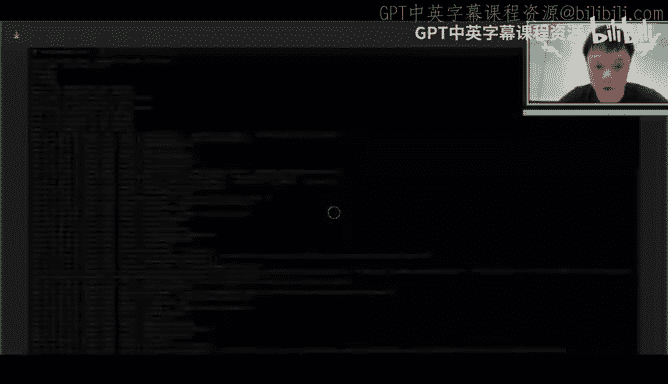
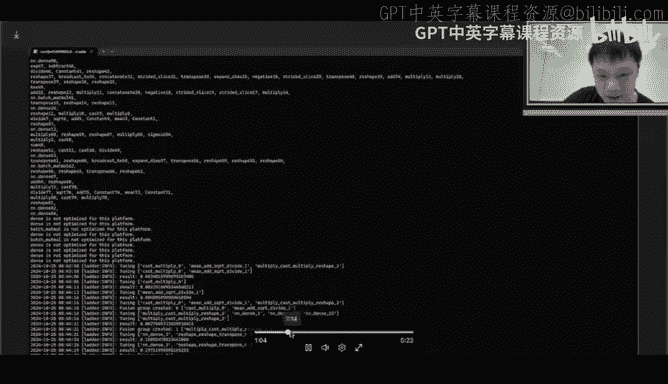
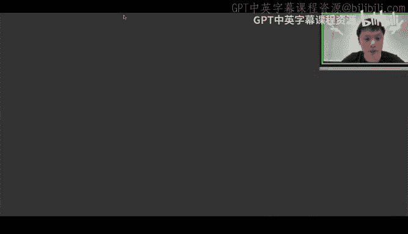
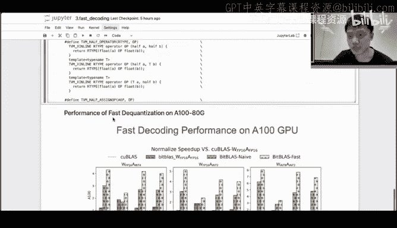
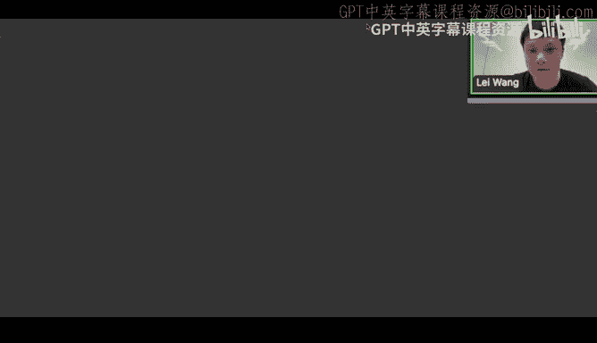
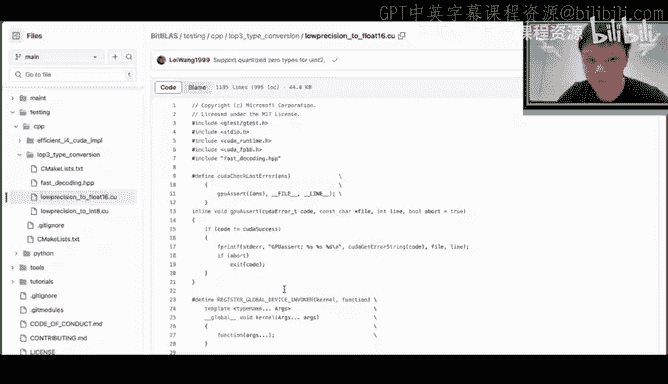
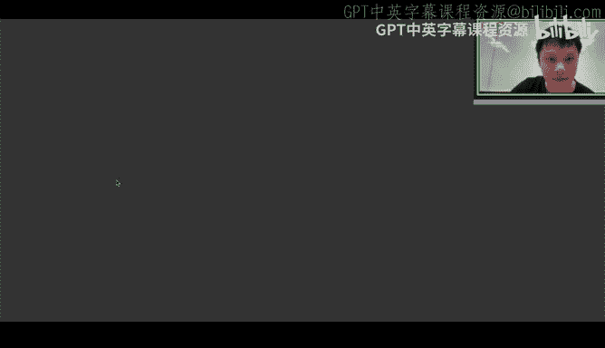
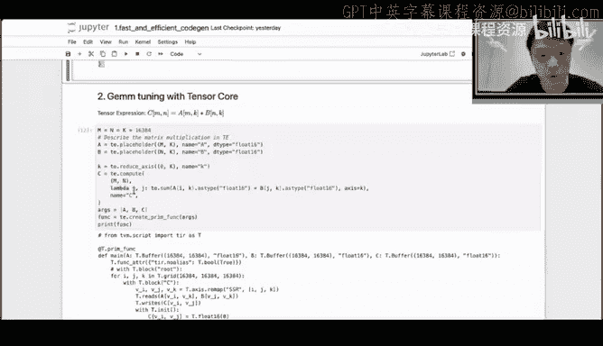
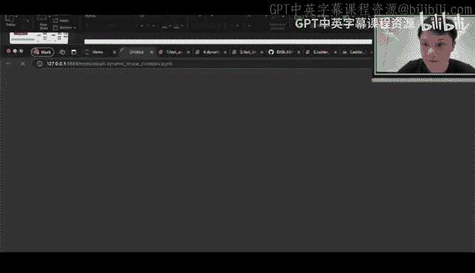
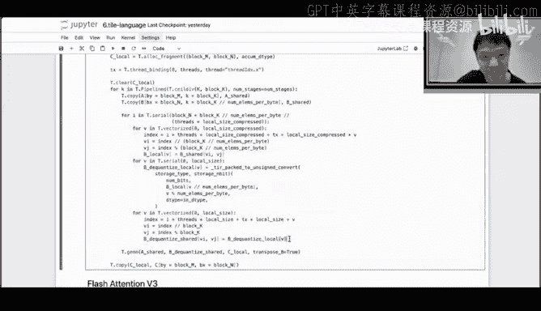

# GPU MODE《CUDA、GPU编程1-53课｜GPU MODE》中英字幕（deepseek-v3.2 - P36：-20241028-Lecture 33_ Bitblas.zh_en - GPT中英字幕课程资源 - BV1QZ421N7pT

Hey everyone I'm James Melvin welcome to GPU Mo lecture number 33 GPU mode going from strength to strength thanks for joining in this early or depending on your time zone well it is with immense pleasure that I invite you to join me in welcoming Wangleley Le is currently a research intern at the Microsoft Research he has his works published in conferences such as OSDI MLls S+ including representative work on Binet 1。

5 Bs TMac Bila Sda。So he was also awarded the best paper award at the Princ and practice of parallellet programming 2024 today he will be sharing his recent work on high performance mixed precision computing with bitB which is a kernelnel library and ladder end to end compiler in addition he will also introduce a new triton like programming language called T language with this amazing backdrop Le we are thrilled to hear more from you folks just a bit of housekeeping if you have any questions please message them on Zoom we will pick it up during the talk else at the end so Le the stage is all yours please take it away mate。

Yeah， so hello， everyone。 My name is Wang Lei in Chinese。 So you can call me Lei。

 I'm currently a system research intern at Microsoft Research Asia。

 and I'm excited to share with you our recent work about the machining combation。😊。

The title of my presentation is enabling efficient， low precision computing。

We are how to we word information， and English ist my first language。

 So I'm not going in the speaker。 So if I say anything unclear。

 please feel free to interrupt and ask questions。😊，So。

I will start by giving some background of mixed precision computing and then move on to the design and some insights of our systems。

 bitb and later。 And after that， I will share some experiment results that we conducted using Nvi and AMD GPUs。

 And finally， I will work by some Jupyter tutorials about the bitb later。

 which is entering compiler and tryton like language tile language to help us to write some mixed precision kernels。

😊，So。This first start with with with some background or mixed precision computing。嗯。Nowadays。

 from a model perspective， numerical precision is gradually shifting toward into a lower bit format。

 for example today， we have in 4 bit format or 4 point4 bit format。

 and at we can see in just one week over 200 new in4 bit models can be found adding added to the hack phase。

😊，But traditionally wind traditional quantization has been used to quant the model into a a lower precision to help us to utilize the hardware in low precision。

😊，Instructions like cancel code， but nowadays。But today， this。

 this trend has been shifted because as the model become larger。

The primary goal of the quantization is to save the memory for save the memory for the pre and devices。

 For example， Take take Lama， we have checkpoint size from the about 13 gig to about hundred gig。

 but we also have to save some we have we have to reserve some memories on the GPU for the activation and the cable cash。

😊，So it's very hard for the GPU to hold the entire model。 So today。

 we have some techniques named weight only quantization， like they only quant as the weight。

 and we can also get a better performance。 For example， if we quant the 1416 into the inte 4 bit。

 we can save about 34 GPU memories。😊，And some research have even pushed the boundaries into the。

Low bit。 for example， today， we even have2 beat， tendery beats and even 1 bit。嗯，台湾。

This introduce a new scenario in computing， in Q A M。😊。

Actation activations are typically in higher bids， for example，4 point16。

 while the weight are usually in a lower bid format， for example， in4 bit or or2 B。

This creates three major challenges。 The first challenge is that modern hardware in the software systems usually doesn't provide。

 doesn't provide such a precision format。 For example。

 M M 4 and some new new data types like M X F P。This is not supported by。

 I think most of the hardware and software system systems。And the second challenge is。

 most hardware doesn't support necessary computer instructions for the mix precision computing。

 Although hardware like video GPS is increasingly supportinging lower precision。 For example。

 emperor， we have integralte 8 to binary ten code and black wh。

 we have MP 4 and even MP 6 tele codes。发0。They are design for consistent competition。

 meaning both include A And B must be the same data type。

These make of operations like a flow point 16 multily the integral4 bit become become difficult to be mapped into the computation directly it instructions directly。

In the last。And lastly， the combination of the。Of the competition is very advanced。

 So making it making it difficult for developers to optimize all of them。

 because we have to implement all of the combinations for all of the back end。

 I think it's very hard， yeah。😊，So to address these challenges， we have some insights。We have， we。

 we have made several key observations and have some insights。

The first insight is that the memory system can store any data type by converting the custom data type into a into a fixed fixeder weight。

😊，OPEC data blockss and can be reinterpreted into various other data types on the software side。

And the second insight is that most customer type。Can be loosely converted into a wider and the standard data types。

 for example， integralte 4 bit。 We can be cover costly into the 1。 16 and 4。

32 to utilize the hardware existed instruction to perform the computation。

So by leveraging this insight， we can enable mixed percent compute computing hardware with limited instruction support through sensor transformations。

 Yeah， this。😊，So we want to pick some insight from machine compilers。

will know that the machinecomp like TBM or Triton。It separate the schedule and the the compute。

 The users only need to learn one single personyon like DSL。

 and the computer can help us to handle the code Jianian and optimizations for different hardwares。

So can we。Develop an abstraction like a machinechi compiler。 For example。

 our goal is the proposed general data type representation that can efficiently handle type formations and current core generation。

For example， that user doesn't need to be aware of how the data be converted into another data type and which instruction they use perform the computation。

 They only need to define the computation。 and we handle the type type transformation and the clinical generation。

However， when we， when we want to do this work， we find that existing machine learning compiler。

 including the TVM and the Triton。 They do not。 they， they do not have the good performance。

 even we under。A consistent computing。 we do not。 We do not need， do not need dequ。嗯。So， for example。

 in our development pro process， we evaluate computer systems like Mmos and TV and and and T C I L。😊。

They can。 They can only reach about 60 into，60 to 80 performance of the cool bus on the R T X 3019 on with with Ts code。

😊，This is mainly due to the challenge， with data layout。

A window media GPPUs are carefully designed so that when the tensor codes are running at peak throughput。

 each level of memory bandwidth is fully utilized。 So if。

 So if bandwidth is isn't used isn't used effect efficiently。

 they can both make the computation throughput， Every I window open my memory layout is very hard。

 That is because。😊，Each memory layers， they prefer different memory access。 For example。

 the global memory they expect collapse access and share memory。 they， they prefer the。😊。

Free bank conflict and register。Memory that should align the memory access with the instructions。

 For example， Po the code， the register， the the register should。

F she facial data from the X memory with such an older。And we usually have a fixed input。

 for example， we， the input A must be some must be row major。

 and the input B must be no major color major。That makes them。Oh might didn't be very hard。嗯，搜。

Recent N media had introduced。The concept of s。They carefully design the memory placement to maximize the performance of across different layers。

 but the strategy is very difficult to implement to implement effectively。 For example。

 if if the data is equivalent， the visual rule will be different and。So。So this， so this is。

 this is still a very hard problem。 So our insight is that if we want to design production and and to achieve high performance。

 we should consider the data layout。So with this， with this abstraction inside bear in mind。

 we defined， we we designed this。Tsor canceror central system abstractions。

The first key abstraction is is。Tile type， which is the general tail type that we can use to define our own data types。

And user can also define。Convert functions to to， to annotate how this。

 how this data type like integral 4 can be cast into another data type like inte like 4。16。

And we have a tensor abstractstruction， like。Tile。Wch a tensor。

 And we also have an abstract named the index map， which allocatenoted data layout for each tensor。

And we also provide for scheduling templates for scheduling primitives like slice， convert。

 pad and transform layouts to manipulate the Tt， which to transform a teat into another tt。

 So with abstract in primitives。 We can define tenor computation in a new par。 For example， we can。

 we can， we can annotate the output data type and the data type and each tenor data type。

 And finally， the the the program will be lower will be described as the as this scratch。😊。

Each tensor transformation can be can be can be defined within some transform functions。

 and each transform function are composed with the tensor primitives。And furthermore。

At the entry level。For example， Lama model can be finally lowered into a Tt graph。And。

This allows us to directly manipulate the tensor。And each tensor in the Tt graph is the tt。

And this allow us to， to manipulate the tension and。

To transform the cancersor across different memory layers and different operators。

And these abstractions can enable us open new design space for traditional machine learning calculations。

 for example。😊，Now what's the basic data layout for each tensors for each T across the T graph。

And which， which instruction should we utilize to perform the computation for the given cancersor expression。

 And when should the the quant happens。It may happens in the register。

 and it may happens behind in the go memory to share the memory and。

We discussed these topics in our paper that published as this year's ODI。

 so you can find some detail informations。And I will have a brief of these concepts。

I think the first challenge is。To find the right hardware instruction。

 they perform a specific computation。So oh， we developed。

 we first developed a bit near instruction machine。For example， we can cast integral for bit。

For example， we can cast integral 4 bit into the into flow point16 or into the flow point32。

 and for flow point16， we， we we have another we， we have several candidates for for computation。

 for example， H HM M2 for the Kco and H M M to for the ten。

 So which instruction should we use to perform the computation。嗯。

So we have some abstraction for the in for the instruction。For example， we， we define the slopes。

 the data type and the computation for each， for each instructions。And we were in the week。

We will match the， the instruction based on these T floats and data types。To to to to。

To determine which which use。So， but how can we know if dedicated tensor information can be。

 can be can use a specific tensor computer unit。So anyway， we implement。And solution， a bit。

 a bit of accommodation you plan for， so。Essentially。

 we use the iterator classification classification method to determine the best which map a computation to attack instructions。

 For example， we have the convol expression。 They have four spatial。Loop and three reduction loops。

 and our target， for example， our target instruction in the tensorco。 and we defined there。

 we have two special iteration and one reduction iteration。

 How can we map the conclusion into the tensor expression。

 So we use the iter basedfuse method to to to determine to to， to to。😊，Dedduce the base。M rule。

 And after this， after applying this organization， we can get a。transform to input and wait。

 And final And， And we have a compute kernel that is a technical map flow。

So I have simple to do about these functions。开 example。呃， like we can你 define我我 can define a。

AConvolution expressions。 and we can we can initialize the target。 For example。

 we usea Kudar a from the N video。😊，4019 GPUus， and we can utilize the function that we provided。

 Get tensorized function the text。😊，After apply this function， after apply this function， we can。

 we can get a teleized function。 If the teley function is not known。😊，That嗯。That if。Lets say way。

 this is， the convolution can be mapped by a target。T theical instruction。

And we can see the tensorized function。 We have some transformation to the pad and the weight。

And we have a cold code blockss to perform the T call line competition like Y batch M， N K。

 And and finally， we have a code block to recover the convol data layout layout。😊，啊，I think文宇轩。😊。

This is very interesting， because。With this method is it enable enable us to explore if a given custom inspiration。

 for example， convol and status， can it be tansorized by target instructions。😊，And as you can see。

 if we use the convolutions， the final the final map flow is turns out to be image column。😊，Yeah。So。

The first major challenge is to optimize data layout。

 So which is very difficult due to if you want to search the data layout， you can。

 you can find the search space is very large。And。And the， the third space in is。

It overlaps with search space for the competition。 tile confis。 for example， BM， B K and and B N。

And the。To address this， we develop method for ining memory layout layout that automatically align with the。

Layed with hardware instructions。嗯， for example。We first have a metric have a。Mmal expression。

 which is defined in high level DSL。And we can， we can determine the instructions that we used in each label。

 For example， the global load shared store shared load and compute。

And then we can deduce the base layout for the input。You finally have three computer kernels。

 The first two， the first two kernels。Change the layout for the input A and B。

 and the computer kernels is。With compute knows is， is perfect。Mintain the perfect memory access。

It doesn't have any con memory related issues like B conflict collapse。

 It it really just sequentially access the data。So。呃。

So we can effectively reduce the layout search space。

 But the limitation that we will introduce to several or two memory transformation kernels。

 we even though this is element wide kernel if and it's not very cost。So。But we can address。

 but we can eliminate this overhead to address these layouters。 We introduce a tele graph approach。

 which is proposed as O DI 23。嗯For example。With analyze operators， telegraph help us to fill at。

 at the register level。 and the， and if you can。If。

 if the two operators is computer intensive operators， for example， the meta and the Ma。

 the type of can help us to fill the kernels in the and reuse data in the shared memory。

 So with this approach。😊，We can propagate our layout across the tele。 For example。

 for the management location。 We can propagate the data layout into a last operators。

 And this operators just need to change the right back。😊，我ras。

And if the if the final operators is a constant weight。

 we can do some constant folding to apply the data layout。

And we also have some tutorial tourist for in in the。G notebook book and。

And we will discuss it at the final at the end of our talk。So。So we can deduce the layout。

 But how can we do the propag and why layout propag is hard。This is due。

 mainly due to three challenges。At first， the skin。

The scale of the problem and the available instruction are often beign because the instructions。

 the shaped instructions is is some is， it kind of。Fix value， for example， for example。

 the tele code usually is 16 multily 16 multi by 16， but the given computer probe compute is。

啊It's unbounded。The M N K can be any value。 And the second。There are several。

 there are several other computations outside the core M instructions。 So example。

 we can deduce the memory layout for the M A， But if we want to propagate the layout the layout into the weight。

We have several other operators like Dequant an image column that we need to handle this case。So。

 so to， to tackle this， we design， we designed a dedicated magazine。😊。

We first categorize layout into three types。 The first type is linear transformation。 for example。

 of the of the swizzling is linear transformation。The second tab involves the data compression。

That preserve that that even it preserves  one to1 inspirations， like decoization。But。嗯。

But we need to account for data comp during the propagation。 For example， we have。

 we have a given data that we propagated。 if we want to propagate we want the way to the Qit。

 the data allow should be transformed like this。And the third type that group was scaling。嗯。

Which results in the information load during the other propagation。

 which we which we can dis disrupt further propagation。 In this case。

 propag should be should be healthy。 So Billbu has defined a unique set of propag method for each。

 for each of these three types。嗯。就。So， so this related code can be found at them。嗯。唔 check。

So we have the function layout propagation chain， which which implement make that from that you have a layout from the target block to the photo source flow to a target block and it can deduce the layout and apply it the to a target block。

And。And we will also come across some conflicts with this large organization within within or between operators。

For example， the company within your operator can consider the as gym。

We pop the MM out into the weight。Which mount also applies these supers。Which。

 which actually requires a lot of transformation or weight transformation into the。Wait to B。

But if we want to maintain the correctness of the program。

 we also need to apply the same layout transformation to the scale。

 but I we discuss it at the last slide， the scale is group wide scaling。

 which misses which load some layout transformation layout which have missed some information is's difficult to or it's impossible to to proagate the layout。

 it's possible to apply FJK to the S。 So if we want to we if we want to make sure the program is correct。

 which should apply and inverse to the layout into the into the into the read stage of the scale。So。

嗯。Which is also。We can also come across some problems。Between operators， for example。

 considering inception structure in the renet model。 for example， the a node。

 the next of a node is convol node or the add node。For the conversionvol node。

 it used the tensor codes and it pop it it prefers the T T A for the add node it utilize the。😊。

Cak cold and prefers the T B。There are two different details。

 So the an will write two different tens to make sure the program is correct。So which we all lead to。

Extra memory， right back and。Some extra memory footprint。So to resolve this， we can。

 We can duplicate the T TL A from left to the right， and we can deduce the inverse to the T TL A。

 and we canfuse。This detail， this detail interferes into the ad that that the ad node only need to write back onetenors。

 and we can。Have comparable performance with T C R T， even with even you you you。

 you optimize for the video GPus。 So we have about 10 performance speeded up。😊。

So the key challenge is。Here is how to construct inverse layout transformation。So we introduce。

 we introduce a automatic di def differentiation method to address this。 So given a specific layout。

 we constructed the forward syn tree and defined differential parameters for for in the tree。

 for example。For， for this layout， we can construct synthetictry and for the float node and for the float mode。

 flow mode node the。The differential operators is is add for the full dive。

 The the differential operator is is multiply。Then we use the backward propagation with auto differentiation。

 We can get the inverse data out。 We can get the inverse data out。

 which we can apply this into the inverse function of scale and the inverse dial out out of the TL A。

😊，So this layout may may be complex。And the。The final design space revolves around deciding when to apply different。

For example， in a deco G M， we have， we have three choice to apply the decoization。

If you apply the deco in in the registers， it Ma， it will introduce the the much more compute overhead and significant memory access saving because。

😊，You can save the share memory space and share memory bandwidths。

 You can save the goal memory space and goal memory bandwidths， because。😊。

Both data in the same memory and the globe memory are integral for bit。 and in registers。

 you want to you， you have to do deation。 But each time when you fish into registers。

 you will do a decoation。 So the， so the de cost may， maybe a bit cost。

So if you ded that in the share memory， you can save the bandwidth and memory flow print of the global memory。

 but you will also to do some deco overhead。 So if if if you deed in the global memory。😊。

You won't save any memories。But you can s the de。Over， because you only need to defend what wants。

And sometimes in the some like M X LP to 4。32 is very cost。😊。

So this is a trade off between the memory and， memory saving and latencies。

So we designed the legacy orientedagin third policy to， to， to deduce。When should we。

Where should we put the put the de。嗯。So。So in the bit blast， we can， for example， take a look at the。

The minimal operators。啊，这。The schedule of memory prevention with cong was at with represents as in the。

De one as in the registers and the schedule memory preference will configured represent defined that in the shared memory。

 And if you want to define in the goal memory， we have。😊，Yeah。We can we， we just start another。

 another kernel to， to， to perform the deco。And。And based on these abstractions abstractions and and optimizations。

 we， we provided two different systems。嗯。The first system is later， which is used for N compilation。

 Use an enter compiler。It takes the titles。It takes the only file and input。

 And if you havequ linear， we will make customer produce in pys and and expose to an only file。

 And we take the only file into input and apply a lot of transform optimizations。

To generate efficient S cubeables for different device， for different devices。

And I also provide tutorial for the compiler later。And the code of later is。

Is at the。This branch in the middle plus。就。The usage is working import later。

 and we can take honest file with input。 I use a Lama 16 billion1 one single layer， as example。

I also to have video。It noted， we have 46，47。Operators， and we will explore。How do you feel seators。

For example， we。We will try to explore， for example， the cast main add and multi cast node 3。

3 operators。 We will try to explore whether these two operators can befusesed and can can confuse these two operators can get a better performance。

If we can， we can create afuse group of these two operators。 Well， we also can explore how。

 how two consecutive Ma operators can be fued together。😊，Dang。As you can see to Fung a Lama model。

 We take about4 and 5。

We about about 5 minutes。And。The poem is very impressive。

 and I will share some experiment experiment results in the experiment section。😊。

And the second system is big plus。 which is the run time library。As operator。

Yeah you can see we have worked hard to provide a very simple API that that abstract away the the tenor for the order variation。

 layout propagation and the type conversions。😊，嗯。And we now this library has been used in efficient Q A T。

 over GBQ and the VOM。And we also help the businessnet team to， to， to deploy their models。

And I also have something to do about like people us in the following in notebook sections。

And I also want to share about some。Of my then tricks for in in the bit bars for mix percent computing。

The first trick is a fast de conversion。😊，For example。

 the process of converting an integral 4 bit into a 1。6 B。嗯。In the standard defined flow。

8 integral4bi are compress into a integral 32。That type in the kernel we use bit shifting and bidwise operation to instruct each each integral 4 bit as integral 32 bit。

 And finally， we， we use the hardware instructions。

 the type convert instruction to convert the integral 32 into a 4。16。😊，This approach has some。

 however， this approach have some limitations。 It it lacks vectorizations。

 Each instruction can only de the one value at one time。

 and the certain depth and in the type convert instructions。

Sometimes hardware doesn't provide in this， this like convert instruction。 For example。

 if you want to de a 4。8 to a 4 point16 on a 100 on on a 100 GP U， you cannot be。U。Be， be applied。

 because。A 100 doesn't have the help convert instructions in the for from the 4。84。16。And。

So to address this issue， we we， we developed the fast defined techniques。

 which support conversion set an integral 4 bit。A B， a 2 B or1 B to  flow。8 B to or in 8 B of 1。16 B。

 We also pro， we also provide a vector de， for example， from  flow。8 to  flow。16。嗯。

So in the build glass， if you want to enable the。If you want to enable kernel to。

This is a simple example of how to utilize how do you generate efficient color code at bitbu。

 the code snap is from the quick start section at bitbus repository like you can define the MM M K and AW typem type all that type and define the group size if we have scaling。

 and we have zeros is the zeros quant zero or rescaling zero。 and we then can get。😊。

Effic could I code。 So let me start from a very simple case。 The A W type is 4。16。

 and double type and W data type is you in4。And if we disable fast decoding。

We can get the generation classes like like below。😊，As you can see， the de section in them。啊。

 this de this de has part。😊，Is she use some logic operator to shift the data into an in for bit and use an end。

Logic N to extract the data into a in。32。 and use the hardware。

Type convert instruction to convert the data type。And then。If we apply。The fast decoding。

Then we can get。Get this clock code。 as you can see in this cloud code。

 the deco load was warped into a device function， and。😊，And in one device function。

 it decoquantize them。8ight。8 elements， instead of one element。

And the department function can be seen at the。Here。This is the defined function。有三也就三分析呃。

The media GU instruction。Some P D X to to apply the。High performance。 time convert。

And this is very important for data center GPs。 And when the bit becomes lower， 2 B or even 1 B。

 the department overhead will be。Will be more cost。So。I can in the A1 in the A1 A 100 GPus。

 if we don't apply the， the Deization the the the faster decoding。

 we can only get about the three across speed up for this case。 And if we will。

 And if we will apply fastization， we can get better performance。

So we just have one question here from Obi Cham， how much faster is the fast decoding mode compared to the simple shift and bitways up？

Yeah啊。You can see in this。So， if you。If， if you simply do some some some some some combination like flame point 16。

 multi the integral for bit， This is this is very common。 the simple case in the game cards。

 like like。啊，14teen I of the呃13 I。嗯。Its， is， it may not be very， very different between。

With not applying the faster decoization， but it's very important。But even with the game card。

 if you push the boundaries， like push the bits into a 2 bit or 1 bit or even bit net with the integer 8 to multiply the integer 2 or or with in 1。

 the deization will be cost。So if you want， So in your case， if you apply the flame point。

You want you， if， if you want to generate high problem plug code for the1。16， multiply the inte 2 B。

 you need to apply the faster depositization because the cost will be。Oh oh。Yeah。

Will be considerable as my experience。 But even， but， but if you want to can。

嗯op open by your program on the A one a100 on the。Or the H H100 gPU。Even with the phone。 16。

 modify the integral 4。You have to do， you have to apply the fast de。 Otherwise， you won't get the。

 the theoretical speed up。The theoretical speed up， Yeah。

 but this only happens when your're when the。Where the kernel is is small。

 is is mainly intensive operators， for example the small ship， jam or the。G we。

 But if the kernel is compute bound。You， you you won it doesn't matter， I think。

So we have one more question that he'll take So Andrea is asking。

 will bitB fast dent work only on Apire plus GPU No oh actually we enable it on average GPU because applying fast foundation will be always based and doesn applied。

Yeah。And I can share with some of the some some of the code about the plastic。

 We have some C C plus taste for the degradation。😊。

Likeum。Like indigo 2 a4 to 1 be to 1。6 of 16 and2 in2 integers。嗯。啊。I hope this can help you。就调 o买就伙伴。

And then。ok。So the， the， the next question is how to。嗯。Apply faster efficient kernel co generation。

 I win a beauty kernel library。 I found it very hard。And challenging。

 because the shape of a lot of language models is dynamic。

So generating code for dynamic shape remains a difficult problem in machine comps。So， unfortunately。

因已。Largely in large language remote models。Only one dimension is the dynamic to handle this we generally code for different segments of the dimension M。

 And for and for each for each specific M， we search for the best tile configurations and store the results on the database you avoid without the tuning。

😊，This allows， this allows us to dispatch each segment to a to the optimal without repeating the opt process。

I。啊， for example。

我想。I think we， I think I should first introduce the static shape tool in Peterba us。Like when。

 employment improved。TheWfuls of the OI 22 roller。Roer。Which is the white box kernel tuning for。

 for given for， for given tense expressions。 For example， we can， we can import。

 We can first import bit bus。 Then we can define a computation like element I add。

This are MY cancer expressions， and we can get the。T T expression from DSL like it a multi1。

And we can。And we can in initial the quota target。 and the quota target has so many。😊，Hardway。

 hardware information， for example， the she membrane capacity and the work size and the the L to cage size and the transactions and even the the the bandwidths and some in and the instructions it supported。

And we can use the policy to， and we can use this hardware information to help us to generate a high performance space。

 For example， we want to top top top 20。Sched can。Then， we can。For example， we get we get this 20。

sAnd we then can。 then us will apply all of them and select the and select the base one。For example。

 in in the， in the base schedule， we can find the the schedule template of the。The。

 the schedule result of the completion。 and we can get the Q code of the item wise ad。W。

 we can see this the hyper performance and other kernel。And的。If you want to use T code， for example。

 can define the metric location computation。

And utilize get get function tag。 We can， we can utilize channel code。😊，You can see。

 We can recommend。20 high performances kernel candidates for each shape。

 And after applying and build， we can get a kernel that utilize the Tor cost。 For example， we have。

 we have。This will improve L to cash locality。 And， and we have high problems P T X to。To， to load。

 to load the data。 And we have the MA input the computation and right and right back to the tensor。

But this is the first static shape， right， So if for， so even for the dynamic shape。Okay。

So it for the dynamic shape。

Now membership is hard because for different shape， you， you must dispatch different kernels。

 So in blood， we utilize the functions， but we utilize the methods。

 like you can see the dynamic range。For the input， for example， we set the default value to one to。啊。

256。And if we do not apply hardware we， for example， we said the in2 force。

 we will get a default schedule for for every， for every， for every shape。And we can see the。

And we can see the kernel is， is， is like this。For every shape， we use the。We。

 we use the same kernel。AndIf we are playing hardware or we tu， we will tune every shape。

 We will tune tune one tire con for M equal to one for， for for for。1 tileu cong4 m equal to 6，16。

 And the finally， we can get the function like。😊，Dispatch function like this。开当铺。In the M equal to 1。

 we utilize them。co like SM I T for the for the ship between the 162 32， we use the。

We use different power configurations and different kernels。 So， and。

 and we also have database to avoid duplicated tu for different shapes。

So this is our solution to dynamic shape。Now，But this is， but this is a bit trick。 Like， for example。

 even the shape is2 is 20555。 I think， I think realize this kernel will be better。

 but we is pass to the M equal to1128。😊，So。家的啊。The the tricks for the fast。So。And， and。

Let's first check out the performance of the the compiler later。In our publications。

 I we evaluate the systems on four devices， for example， the。The paper we evaluate， we。

 we evaluated our systems on the V V 100 GPU on the A 100 GPU。

A 100 GPPUus and even gaming card a 160，0 and even on the MD GPPUus。And my 200 is 50， and。

Because we provide the type abstraction to open new design space for the compilers。嗯。为嗯。And， and。

 and， and we select about， and we select six models from the A M to the to the classic model。

 like relate and shuffle late。And。I couldn't see average。 we can get about。呃。

10% speed up over the weler and even even over the10th R T。

And we can support a lot of new new data precision。Like， we can also support Bate。

And from the kernel and the front operator side， buildbu can out perform vendor and develop handwriting kernels like Marlin。

😊，嗯。And often it， it offers much more flexibility in supporting a wider range of data formats。😊。

And even with a consistent format， like the 4。6 ten theco or integral 8 ten thecos。😊。

Our system can also have comparable performance or even have， in some case。

 have better performance in kas and kas。😊，And we also can can have about 60。

To 40 speed up then the rock blast on the M D GP P。 I think that is very fantastic。😊，And。And finally。

 we share a performance scale up with Lama 60 billion。

 So we scale the activation that have from the  floating。16 to the indi 4 bit。

 and we scale the weight from the indi 8 B to inte 2 B。😊，那 to应个 one bit。And we， we。

 we evaluate our this configuration on the Lama 16 Lama Lama 70 billion models just one layers。

 And we select two configurations and batch as one sequence one for the deco stage and batch batch as one sequence4 for4096 for the pre stage。

😊，And I， you can see the。Because the deco stage is memory intensive。

The speed of come come across memory bandwidth saving。 If we want to。

 if we realize lower precision tele format mass like for， for weight。

Because the pre is computer intensive。 I think the speed the the speed up is relevant to the activation data type。

 because we， if we activation become lower， we can utilize a more efficient。

 more efficient computer instructions。 for example， if we use the in。😊，Integ8 bit to the activation。

 We can realize integral8 codes。If we want to， if we， if we utilize that as in4 bit。

That type we can utilize is4 billion code， so。This is makes sense。And。

And the summary and our work have introduced several key innovations into improved sensorsor scheduling for machine compilers。

 and the first we proposed universal sensoror productionions and the schedule prim。

 which allows machine compilers to explore more flexible and optimize tensor scheduling strategies。

 This is complemented by our hardware aligned memory layout propagation strategy。😊。

Wehich should automate memory layout inference， including manual overhead and improved performance across different hardware platforms。

 We also developed businessaries instruction allowingwise strategy to autowise。

To order details the which instruction should we use to perform the computation。And additional。

 I would design later be the bus these two systems to help us to improve to for entry to end organization and current current organization。

But。We also have a lot challenges。嗯。The community has highlighted that kernel accumulation still takes too long。

 I couldn see even we can tune a static kernel or tune a。😊。

We can generate the hyper kernel for static shape in seconds。 But if if we fall dynamic shape。

 we should tune about the。呃。But 100 kernels for for A M。 This is very cost。 Even we have database。

 This may lead to some uncomfortable user experience。😊，And for。The Peterb schedule。

 The Peter Bu implementation is schedule based。Like I can make it hard for developers to to to10 with the boss。

And。I want to share with you some the some of the code of the bit bus。嗯， for example。

Peterbu first defined。你谂。嗯。It about first first defined operations。Operators。O piece。

的I think we also supportf attention。And like much physical publication。Currently， we， we。

 we describe the muroom modification of theantas in a single file it it just represents the computation logic of the of the expression。

 It doesn't contain any schedule or the coa or the ka related information。

 And then we get the competition。To get a computation and apply some schedule primitives like for example to to utilize T code。

To or to utilize the fast validation and to schedule to bind the thread。This is very conflict。

Complicated and make it hard for developers or even us to to extent。So。

 and it's also hard to introduce some very hacky schedule like S K or the Sp K， so。

So I was gonna to introduce some。The T language， I can see in the bit bus。

 we recently recently push some tile language related code。 For example。

 the the the the minimal expression。The meim operators， we have a backend named the T language。

 And in the Tha language， we have the。We， we have the talent。Right。For example呃。We can。

We can directly write the theantas kernel in a very simple way。For example。

 the general defined measure modification。And we， we， we consider all of the case within one kernel。

 like if you have scale， if have  two errors， if have， if， if you have lot， then the。

And we have some effects。Configuration to， to control whether we to enable some optimizations。

 and we will have a simplified path to remove the redundant A H T and or even the function argument from the from the from the code。

😊，Like this is very simple。 You can see we can copy A to share memory and copy B to the share memory。

 and we can apply， for example， faster differentiation。😊。

If we want to enable flash or we just use normal deization。

 then we apply trim and write back to the kernel。And then。I think， I think it's very cool， right。

Besides unlike this schedule template。 but this schedule template is is very powerful。

 It's also very powerful if you。If you are familiar with TBM。So I have another。

I have a entire language tutorial to introduce the T language， but this is not officially released。

 but you can use， you can， you can use T language to you can import big bars to use guys the T language。

不者 tell language。For example， you can use these three import。Import。

 import statement to to import high language。For example， if you want to define a jam。

Much the application operators。 you can use， you， you can use。Its very simple。

 We can define shared memory and local fragment。And。We have a context。

About how many read we are use and how many blockss we are launched。

And and we will automatically map the thread into the competition。The generally。

 they could call you the just sec sec Abul query of mut of mic， please。All right， thank you。Yeah。

 sorry late so。啊。It can also be inference from a toch tensor。

And we also provide some in some fancy features then like we can the data layout to apply some to or pad。

 For example， you the， the， the direct data layout may not be very perfect if you want to apply your own data layout。

 You can write the layout transform functions you can can help you to， to to。

 to transform the shared memory layout。😊，🤧嗯。And you can also improve the L2 locality with very simple。

With a very simple O syntax。 And you can also control the pipeline。 For example。

 if you want to apply the。Publine。P pipeline stage， and。And if you want。

 if you don't want to use T Tito copy， you can also use T parallel to automatically map the。

map the tenor to automatically write your own own copy statements， and we will。

Automaically inference the vectorization， the vectorization and the threat mapping to based on the context that we individual in this。

Canttain。And then。And also， if you want to implement your， your own decoizations like。For example。

 you can write your own deposit。Here， you just copy the。

Hang tie the be from the girl memory into the into the shadow memory。 and you can copy the different。

😊，Me from the X memory to the local memory to， to the registerers and apply dev into the registers and apply jam and apply the MM M technical。

From the retry and Xian memory。And doubt。And this might be a perfect schedule。 You can if。

 if you are perfect， if， if， if you are， if you have some expertise in the generalization or write cloud kernel。

 you can also write some pi kuda code。😊，This code will be in translated into the ka， so。嗯。

You can write your own code here。

We also have flash attention support for this case。

 like we can use this primitive to to define your flash attention。

 and all of these tutorials can be found at the bit bus repositories at the tutorial section and feel free to reach and。

😊，Ask some questions about these section。And then。And thank you for all your attentions。

 If you'd like to let more or reproduce our results。

 you can find the relevant code and resources in our Github at the link we we provided。😊。

And for more informations， including the some technical details for the photo optimization。

 feel free to S to to scan the Q R code。 And once again， thank you for watching。 And， and， and also。

 I'm looking for machine system PhD positions。 So if you have any chance， please reach me out。😊。

So I'm happy to take any questions。 Thank you。😊，Yeah thanks Le thanks for this wonderful presentation I mean it's been like intense and fantastic work on Whitla's Thailand is definitely very interesting and folks please reach out to lay on Discord he goes by LEI on Discord so all these slides and the video will be there on the usual channels I suppose you know and for anyone who's new we have GPU mode YouTube channel as well as theres a Github repository where all the slides would be posted so yeah please do connect with the lay Le once again fantastic stuff at went really smooth and also thanks to all the people who joined I know it's been early late depending on the time zone and if you have any other questions please ask on the chat right now or you could know go ahead and connect with Le offline so。

Yeah， yeah， because。Yeah， this is supported by Microsoft。

 I think because then I added the work at Microsoft。deal with the intership and Microsoft。

 So the repository was。Put in the Microsoft Or， yeah。Ya。I'm the main developer。 Yes。

 he's the chief maintainer。 You can see his Github profile。 It's all completely laid out with green。

 So， you know， he's been like， absolutely neck deep into this。 or perhaps drowned into a bit plus。

 I can see。 So yeah。😊，Cool， we just see if there are any more questions， if not。

 I think we'll call it curtains there。Alright。Okay， folks， thanks for joining。 I think we're done。

 So yeah， thanks Lee。 have a good week。 we have wonderful talks coming up next week and the week after I think the next week is by Moby Cham。

 So yeah tune in again。 so yeah， goodbye and have a good weekend。😊，Theyre like， bye。

