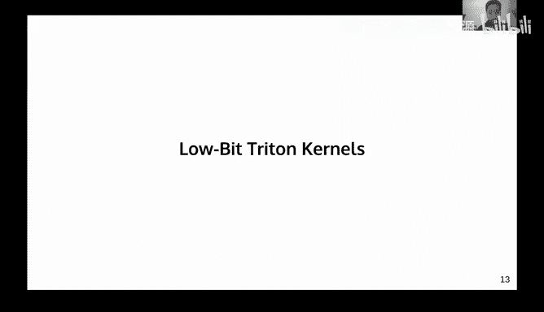
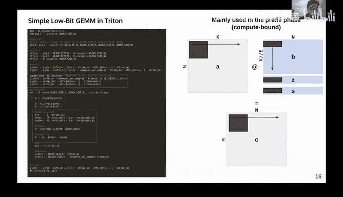
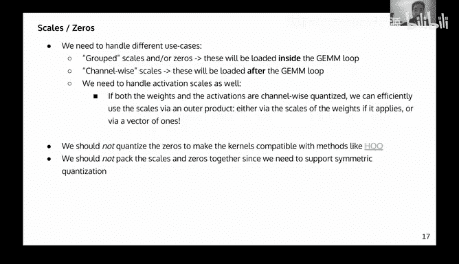
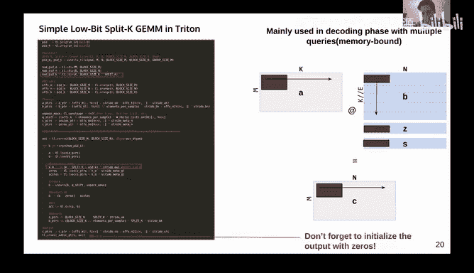
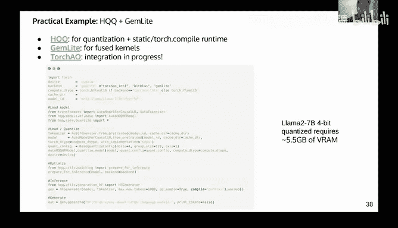
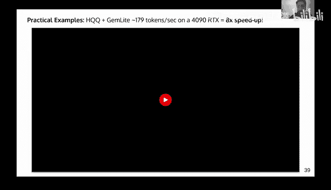
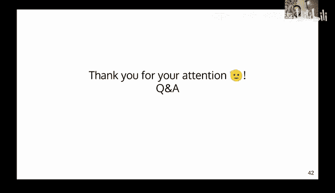

# GPU MODE《CUDA、GPU编程1-53课｜GPU MODE》中英字幕（deepseek-v3.2 - P37：-20241104-Lecture 34_ Low Bit Triton Kernels.zh_en - GPT中英字幕课程资源 - BV1QZ421N7pT

Yeah， so today Mark is on vacation， so me and Bill will be hosting this。And we have He Chn。

 who is a principal research scientist in Mobi lab， which is a startup breaking a computer vision。

 And today， he's going to talk about low bit triton kernels。Yeah， I'll hand over to you。All right。

Thank you very much for the introduction and thanks everyone for。Tunening in。

 we are gonna talk about how to write a little bit Triton channelss。 So these are like， typically。

Triitton kernels to run low bit matrix multiplication， like for example。

 like when you have contested weights and so this is a really a hot topic like everyone is trying to work on this。

And so typically， people will use。Coulduda cutla or something like this， because they。

 they are pretty good at G Ms。 But in this talk， we are going actually talk about。

Doing this in Triton and making sure they actually run fast because like if you just do it in a naive way。

 you're going to be like super disappointed by the performance。Yeah， I mean， so as an overview。

 so we are just going to start with initial introduction。

 like I'm going to talk about little bit concisization。

 like if people are not familiar with the topic and the challenges and why we started。

This project of writing the Triton candles and this project is called gemmlight。

 It's an open source project。And after that， I'm going to talk about writing the actual kernels and I'm going to talk about like some tricks that I have discovered the past two months working on this。

And then I'm going to talk about how to integrate these kernels for actual production because。

You need to make sure that a couple of things are checked。

 otherwise you cannot just run them in a like an end。And after that。

 I'm going to just show like really fast。Like small practical example。

 and then I'm going to talk about future work， what are the current challenges。

And I have a Santa Claus wish list， Like， I have some。Whiish list features that I would like to get。

So some I'm going to also talk about that and。Yeah。

 so let's let's get started like so as everyone knows like machine learning model like super super big running them takes a lot of VRA like if you want to run Lama 27p。

You like S F P 16， like you need like2 a 10，80 GB1， a 100 cost like 25 k。 So you need like 50。

50 k to run like one model， which is like。Ridiculous。And。

So we need to find ways to run this cheaper and。And things are even worse like for training。

 so gowndes， which is like also。On the Discord channel， like he talked about context。

And are you sharing the site。嗯，哦，O no。My be。And from yeah like so things are even worse for trainings so governors from the Discor channel he was talking about this like two two weeks ago so yeah。

 I mean it's pretty tough like NMs and the visual language models also they take a lot of resources and we need like ways to make them a little bit cheaper。

So。Interconetization so the first thing to mention here is that like in transformer models like most of the weights there are in linear layers and almost all the computers in linear layers and attention models。

And basically quantization is the key to reduce Forem usage and also make them back faster and basically if you contrast the linear weights。

You get significant reduction in FiRA， but you can also run them much faster when you're memory about because like you're loading this data。

And so， for example， like Islam 270 B that requires like。To80 GB a 100。 you can make it。Use like 3。

5 to 4 x less three Ram。 You can make inference up to like 3，4 x faster。

 and you can write it like 8 x cheaper without losing any accuracy， like with with with cons。

 which is like really great。And。Like editing mistake that this breakthrough is actually partially because of the conciization because like without conization。

 people will not be able to run on these models like locally。😊，And yeah。

So you can also contest activations， so this is typically the use guess like when you your compute bound。

 let's say you're using VLM you're servinging a lot of users。

 you can quant those activations to make it faster this is what they do in VLM and you can also contact the KVc so if your prompt is extremely long。

That's somewhere of two they give cash。 So this slide is just to tell you that。

TsTsformers plus quantization。Means less run and faster inference。

 That's basically that's the message here。And。So what is actually quant quantization is just reducing the data bandwidth weight。

 so like you go from FP16 FP32， you can go to in8， FP8， in4 FP4。

So here's an example like very simple way of quantising weight。

 so you go from this every16 tensor to an inch for tensor， which has values between 0 and 16。

0 and 15， sorry。And you can pretty much like quantize like any factor， any tenor。

 like depending on the situation， if it makes sense to actually quantize it or not。

Um so here like there are a couple of issues， so the first one is once we quantize because it's u it's not a loss less compression like you lose。

Accuracy， so we want to maintain high quality outputs after quantciization。

 So this is that would be a talk for like conciization methods， which is not the topic of this talk。

 but the topic of this talk is efficiency， so。There are two things in terms of efficiency。

 like when you're coning the models you want them to be coned faster， this is not a topic here。

 but once the models are quanted， we want to run them。Faster and more efficiently。

 so to do that like we need to write like custom kernels to do this and this is what I'm going to talk about later。

So like very quickly， just to mention that there are very different ways to quantize models。

 so there's linear quantization versus low linear quantization。

 so linear quantization is mathematically very simple so the way how you deco quantantize is just linear operation。

But there are more advanced techniques that give better results。

So these are called like nonlinear quantization so let's say it's a method that is using vector quantization or it's basically using some lookup table or something like this we are not going to talk about this nonlinear quantization methods we are going to focus on linear quantization which is basically methods like GPTQ AWQ HQQ stuff like this they can also be calibrated or calibration free not very relevant here and in terms of activation quantization like we need something to。

Quantize very fast， so we need like them dynamic quantization because every time like we are quantizing on the fly and typically what people do。

 they just use int8 or F8。With some channel wise symmetry conization typically works。

Fine with some tricks。There are some methods they use into for activations like carrot。In4。

 we cannot talk about it much because it's not in4 in4 Teer core ops are not supported in tri。

 So I'm not going to talk about this。 So here the situation is we have like some F P 16 in 8 or FP 8 activations。

 And we have some con weights。 And we want to do matrix multiplication with this。So。

So linear quantization as I said this is what we are going to talk about。

 so as an overview like very simple when you quantize with some methods like QBTQ A WQ HQQ you basically get like three parameters which is the quantized switch weights which is like WQ here and you have what is called the zero point in the scanning factor and which is said in S so basically when you dequize it's a linear operation so it's just like WQ minus said what's applied by S very simple and what you have said is equals to0 you basically have sameulator quantization so you just have the scales。

😊，嗯m。However， like when we contest the weights， we need to use what is called grouping so because sometimes if we just use this channel wise。

 channel wise means that each row of w would have one0 point and one scanning factor， so one scalar。

 one scalar。But this typically doesn't work very well like once you go below8 bit， so like four bit。

2 bit， three bit， like you need this grouping。And typically grouping just simply means that we are going to reshape the metrics and get like a smaller group。

 so we get like more scanners and more zero。More scalingating and more zero points。

 So this improves performance because like if you think about it when this。

If you just like use a group size of one， you basically use like a scalingk in a zero point like。

Of the same shape as the weight and that would be basically lossless。 But basically here。

 the message here is that。There's this grouping which is create some headaches like in Kuda that we would need to de into the triton kernels and this grouping is very important This is basically this group size parameter that you would see if you're using like GPTQ or AWQ or HQQ that's like this group size that's what I'm talking about is like this。

😊，Parameter that basically assigns one0 point and one scatter for each buffer and this buffer can be like。

32 64， 128， et cetera， and when it's equal to the number of input features that's channel wise concisization so。

That simple as that。嗯。All right， so once we quant these week and we get this WQ and set S。啊。

This WQ is actually。😊，嗯。Would be like F P16。 like if you do this calculation。

 there would be like FP16， but like we want to do in8 conation， right， So the values would be 0，1，2。

3，4，5 until like 15。 if it's like4 bit， but like the data type is still like F P 16 and there's like if you're using Pythch。

 for example， like there's no native data type for like in4， for example。

 like there's nothing like torch dot in4。Or you touch that you in。So like， how do we do this。

 How we do we go like from this F B 16 values to this like in4 matrix that will actually take less V Ram because the F B 16。

WQ will not take like this sphere So what we do is got bit packing and it's basically a trick to reuse the dets that are already supported to support det that are not supported So so for example。

 like four bit you can start two4 bits in  one88 bit right。Or what you can do。

 you can store like8 for bit in 132 bit。So the way how you do this is super simple。

Yeah basically what you do is just some bitwise operations so you do some shifting and and that's it so here like I put like a very simple partytorch code that shows you like how you pick pack and how you unpack so this is a lossless compression it's not even compression it's just like it just just the representation of the。

Of the values in your metrics。This is extremely important and this is like hes like everywhere。

Until we get a natively supported D type。Then like we need to use this big packing。Logic。

 so I gave like a very simple example， like how you do this， like。For like eight bits packing。

 like two back to four bits here。It's just like if you shift by four and then you do or four and then like the other the other column。

 you just do basically like shift by four and then you do or8 and then。

And then like you get your beat packed so it is like very standard like if you see like any concisation code like you will see some kind of beat packing。

😊，All right， so at this point right now。So what do we have。

 like the original linear layer that we had before。 So it had test weights。 Of course。

 this is the bias。 we don't care about the bias right now， but basically。

 you have your input activations， which are X。And you have your input widths。

 so this is like the original linear。Lair， right。So now the， the con linear layer。

 it has other parameterss。 So now we have this WQ， We have these zeros。

 and we have this scanning factory。嗯。We still have the activations。

 the activations can be also content I didn't put it here just for simplicity。

 but basically what we need。Is。😊，An optimized matm that will do this， because like。

What you can do is just deco quantize this and you get estimate of w and just call like torchmat Bill X W estimate like for example。

 but that will be very slow because like we cannot benefit from the fact that the weights are quantized and they this VM right so we need like to fuse this operation of deco quantitization with the dot product inside the kernel。

And this is what we are going to talk about like in the next slides。Can I just。

 can I just like get like a comprehension check？That so。

Like the purpose of getting the zero point in scaling factor is to basically match the group of weights that you're quantizing so that you're minimizing like what you're losing like yeah of the compression Okay yeah。

 yeah， yeah it's just like some parameterss that hit us maintain accuracy like we want to。

Decon weights to be asked to us as possible as like the original weights， if you do it symmetric。

Without calibration， it's not going to work like you're going to get like very crazy results so。Yeah。

 I mean， the zero points are basically just shifting you， like even with symmetric concisation。

 like you still need to use like a zero point like to shift because like you cannot pack with。

Like in8， for example。 So you basically need to pack with the weights and you need to add like a。

shifthift。😊，Like an offset， let's say。 And， and then like in your kernel， like you。

 like you go from you in8， let's say， for example， because you in it like there are all positives。

And your weights can be negative， right， So you need to add like an offset to map them to something positive。

Right， and then in your candle， like you need to shift them。 But it's like for for both reasons。

 like you need this shifting and you also need。Like you need this offset。

 but you also use this offset。😡，To improve accuracy， right， typically for 8 Bs。

 like you don't need to 0 points。 like what， but once you go to four bit and you go to 3 bit，2 B。

 you actually need。The zero point， like， it's very important to get the zero point for like for lower bits。

 So this is for linear quantization。 If you're doing some other type of quantsization。

 which is not linear， you don't have the zero point。

 You have something else Let's say you have a lookup table or something。Okay。

Does that answer the question？Yeah， it does and there's also another question while we're stopping here。

 Eric asks， is there a reason to pack the two haveve together instead of packing neighbors together？

啊。I mean， if you just。This is just a simple example。

 this is not exactly how we are going to do it because the way how you beat back depends on the kernel that you're writing actually。

So。There are many ways to beat your your data。 What is important is that。

Once when you're writing your kernel， you need to make sure that the reading is very fast because and the reading will depend on the way how you beat back the data。

Right， so the way how you beat back is actually depends on the kernel that you're writing。

 And that would be actually different from like， if you're。

 let's say realre writing a ka G and V kernel， let's say with very。Like with predefined use。

 for example， oh I'm going check my data to exactly like 32 like a block of 32 and I's going to do this in this case。

 you can actually beat packet it in a way that will make data loading very fast for that specific kernel。

😊，Yeah， and this is actually something I'm going to talk about because this is this is actually one of the challenges because we need to write different channelss。

 but they need to use the same bit packing and I'm actually going to get back to that a bit later。

Okay， cool， thank you。Right， so。So just a quick reminder about like this concepts of memory bond。

 compute bond。Very important concept to understand because we need different kernels for different steps。

Let's say you have an input prompt。That goes to a model。 And this is called the preview phase。

 Like the first step that you're processing your prompt is called the preview phase。

 This is typically compute bump， which means that。You have a lot of calculation computes going on and the speed by which you load the data is actually doesn't matter much。

 this is basically what it means。But once you。To this pre。

 then let's say you're decoding one talking at a time。 Since you're decoding one talking at a time。

 There's not a lot of compute going on， right， So the speed of this step will depend by the speed at which you load the data。

Not the compute because like don't have much compute。

But you still need to load the same amount of data that you were loading in the prefi phase， right。

 because you still need to load all the weights all the time。So。This this is called a memory bond。

And scenario and you actually need different kernels for different situations。

 So for the compute bond， like you need what is called a GMNM。

 like it's a matrix matrix multiplication。 And if you're like compute bond。

 you need a matrix vector multipl or a patched， let's say patched。Matric spectrum multiplication。 So。

 and we need to write kernels for each one of these， so。So that's the challenge。 So again。

 running this smart low bit， which we are trying to do。 We need this fused kernel。

 and this is not available to do like in Py like directly。

 So you need like a external library that has implemented this fused kernel。 So there are a lot of。

Open source solutions here， So there's a a really fast custom could kernel in Torchioo。

 it's called tiny GMMM。 That's my favorite way of running for bit quant because it's very fast。

But the problem with thisken is that。Once you go like above， but size8。

It gets very slow because it's a G figure。So that Knot is actually specialized in。Deding。

 So like the premiuming would be very slow， but the decoing would be very fast。 And also， it's。

 it doesn't support 2 bit， like 3 bit， like the stuff that I'm interested in。Et ceter。

So there's Marlene， which is using VLLM， it's basically the fastest kernel。

 it's very difficult to get something a little bit faster than that。😊，Also， like forbid。

 and the issue with that is that the zeros they are quantized。And like for some methods like HQQ。

 like we cannot do it because like you need the weight to be FP 16 and basically the same story。

 it doesn't support like two bit， it doesn't support three bit。E cetera。

 there are solutions like Bea plus so Lee who actually built Bea plus。

 he gave a very cool presentation last week on the Discord channel so he was talking about like TVM like using TM to generate all these kernels。

That's also like really good it's very fast， but it's actually very difficult to work with like if you want to customize the kernels to do something very specific。

 it's a huge code base。😊，It's relying on TVvM to compiler the cameras， so like very difficult。

To customize。 And like the fourth solution is to use triton。

 But because like Triton is very easy to customize。 But the performance is not very good。 So I like。

 we have all these issues and I was sitting like this cat like two months ago。 And I was like。

 you know what， like， maybe we should。Do all this things like in Triton because like Triton。

 there are like some good reasons like why we would use Triton before。

Like instead of like could or something else。Yeah， so like why Triton。

 So the first version of the project was actually Kuda like I only started like to nibble like more seriously with Triton just two months ago but before I was doing Kuta and I was doing basically a GM V。

 which was。Working like really good， but then I started to try to do some weird GNms and the performance was very bad because it's actually very difficult to write。

Some high performance， and high performance cool economic。 And then I start to look， oh。

 maybe we can do it Triton， but。I tried Triton before， but the performance was not very good。

 so I was like， let me give you a try and see like what's going on。

So like the cool thing about Triton is that it's really easy to write。And it's very easy to learn。

 So I will encourage everyone on the the the Disc channel to at least give it a try。

 It's a really cool skill to have。 It's very easy to just take you like one or two days to just。😊。

to just like get started like there's a really cool lecture from Quda GPU mode like from Omer。

 like anyway you'll find it in the Github page like really good intro and so I would encourage everyone who is not familiar with link we try on to just like give it a try so it will make like many things like easier for you。

Yeah， it's like easy to easy to write and was also very easy to debug。

 It's not like could every time like you want to debug something needs to compile。

 So basically like there are some flex， you just setting you can actually print the shapes。

 you can print the the content of the tensor So this makes like many things like much faster to develop So for me as a researcher like my job is not to write the fastest kernel is to basically test if the idea makes sense or not and try is perfect for that because like you can get。

Like an idea very quickly if your idea sucks or not。

So also Triton is well integrated with Pytch because like storagech compound。

 they rely also on a triton and also it supports like different devices so they are currently working on CPU。

It should work with AD GPUs as well， but I haven't tried it myself。

 but I just know that it supported。E cetera， yeah， there's a question here。

 like do you recommend to learn could I first out say yes？Yeah， it just like thinks it would make。

A little bit more sense once you learn like could a little bit and then you move to Triton。

 I would not recommend just learning Triton blindly and not。At least have some basic。Knowledge of ka。

 like， you don't need to go to Tenor core ops and stuff like that。

 Just like be able to just understand how threads work and。Wps， et cetera， it's just like。

If you have that， that thing， like it would just make。

Your triton kernels better because some things will make more sense。啊。Yeah。Anyway。

 so now like we know the problem。 So we need to write。

 so we need to do this might me a little bit like very fast。 We need to do it Triton。

 So how do we actually do this。

So now we are going to talk about like writing the kernels so as I mentioned before。

 like we need to write multiple kernels because we need like multiple kernels for different situations and here again I get back to this speeding question that was asked before like。

Would it make sense to beat it like this or like this。 Well。

 what would it make sense doesnn't mean that it would make sense for the kernel that you're writing because like。

You need to beat back it in a way that is fast to load for that specific kernel。What。😡。

Might be the best beat packing for some kuda GMMV kernel might not be the best beat packing for a Triton kernel。

And that actually creates a lot of headaches because like you can have like this very fast GMMV kuda kernel。

 but then you have this fast GMmM triton kernel， but they don't use the same bit packing。

 So like you're using four bit here and four bit here。

 and then you're like storing double of the weights。

 So then like you're storing a bits just to benefit from the speed of each one so。Basically。

 what we want is to have the same feedback Wait。 So we have a single。Tsor。

 like we don't need like to have like different tensors like for each kernel。

 it wouldn't make much sense。But this is actually a problem because it would impact a little bit of performance because as I have explained before。

 like if if let's say you know your your you know which settings work the best for a certain kernel law so you can maybe optimize。

The pit packing in weight that will make this loading faster。

 but that doesn't mean that those parameters actually be good for that other kernel。

 so basically a lot of headaches。In short， we need the same bit packing to work like with all the kernels。

And right now， every kernel， like， let's say Marlin will be using like a different beat pack in tiny chairman will be using another beat pack in and etc cetera So you cannot just swap them like this。

 right， So you need like。Sandralized way of feedback。We also need to with the same kernel。

 we need to support different D types and we also need to support unpacked data and packed data so for example。

 if you're trying to do inte8 in aid for example， so inte8。

 you don't have to pack it because like there' already。Torch dot in8 day type。

 so you just need to cast。But if you're using like。

4 bit quantization two bit quantization you need to packet it。

 but so I'm just mentionagining this that like you need to manage this in your channel and you also need to manage quantized activations as well and those also work a little bit differently。

嗯。So let's start with before we start like we start writing the kernel scan again。

 maybe the questions， if I missed something。Yeah， another good question from Eric Schultpe couldn't you repack the weights once the pretailll is finished and before you start generating。

 maybe you want to go back a slide or two？Oh， actually， I know someone who did this。

 The problem is that it's very slow to re， actually。😊，It's actually a valid way of to win it。

 Like I know had someone who had the exact same issue。 So he was using this tiny GM MM。

 which is very fast for。Very fast for the decoding phase。 But the prefi， he was using another kind。

 which is very fast for the preview。 They are not using the beat packing。 So he tried to repack。

 But the problem that the packing was actually repacking was actually slow， so。I mean。

 if you can make the repacking faster， it just allows you to use different kernels， but the problem。

Is that you need to know also how the weights are beat packed。

 because sometimes you just get like the kernel and。Oh， the kernel just does like diffus Macm。

 But you don't actually don't know how the beat back was done。

 And you need to understand how the beat backing was done to actually write the function to re。

 right for Triton， this is not a problem because you can read the code。

 But if you're like given a couldda kernel， which is like super complicated and you're not like。

Keen on reading like some super difficult could I kind of like you're going to get lost like very quickly。

 but in short， you could if you could make the repacking very fast。

 but that doesn't solve the odd issues。Yeah。So yeah， so let's， let's write a very。

 very simple triton camera。 So the first thing that we need to understand is the data format。

 So basically， we have to mattresses A and B。 and basically what we want to do。

 So this is unconsciousized。 This， this is F 16， F 16。 This is just to get started。 Like。

 there's no quantization here。So we have matrix A map with B。Equal C earth。 So M。K。

 so M would be the iPad size。 K would be the number of channels， that say。And then， your。

So there's this arrow here。 So this arrow here is not random。 So this arrow。Means that it's raw。

It's role measure。Which means that it stored in memory， like like this。Right。

 so this is actually very， very important because like this single detail would make your kernel like 10 times。

Slower， if you don't， if you don't pay attention to this step， like。Like me， if you。

 even if you have the bestbri kernel and you feed it like。

Data in the wrong like row measure or column measure。 you're going to get like very bad performance。

 So this is very important to understand so。There are different ways to do matrix multiplication。

Typically， what we do is row measure multiplied by column measure。

So which means that the input is raw measure， which is like the default in Pytorrch。

 like any testor that you initialize in pietorch will be raw measure。But here， in this case。

 we want column measure。Weights， so how do you get conline ratio weights。

 You don't just transpose it。You need to transpose it and also make it contiguous。

Because if you just transpose it。😡，Like， you're not contiguous on the roads。

 like so you need to transpose it and make it contiguous。 So this is actually very important。

So it's like this dot contiguuous can make your whole kernel like use this。Just to like。

 I spent like some hours on this， like getting crazy and。Like dot T dot con very important。

 So like when you do that， then your matrix B will be column major。 So like it's going like this。

 right？ So what we want to do is basically get some blocks。So each block from a。Will be。

 we will do the dot products with the other block。In B。Let's say another block and see， very simple。

 And basically， try to， it will just help us paralyze this step， right。

 So we are gonna to arrange different called programs。 And basically。

 we tell the programs how to paralyze this。 So when， when when you're writing a good economy。

 you're just like。😊，Make it。You just basically work with blocks and you just say， okay。

 this block is going to be multiplied by this block and it's going to be stored as this block。

 This is how tri works， so。Basically， we need to load this P I D program。

 which gives us like the index of the， the blog。 So then like。

 we need to choose like how to go through the， the， the the blocks。 So can either go like。

Linear tile， which means like it's the just reading like this。

Or you can do what is called the swizzle and the swizzle is basically a technique to travelverse to the weights like this。

 So instead of doing it like this， you just do like this。

 And this basically helps get to cash usage and。😊，Other things， I'm not going to talk about it。

 but just， you need to just。Keep in mind that you can either like go like linear time or you can do swizzle for some kernels。

 it doesn't make to swizzle。 So for some kernels it makes sense to swizzle， but at the end。

 doesn't really matter this is just the detail。 So the swizzle or tide just gives us the P Ds of the。

The progress that we run is earlier computation。嗯。What whistle pattern is's not very important here like this is just the detail。

 but basically you can just use the default one like from Py like this like Tl do whistle2 yeah。

Honestly， it doesn't make a huge， huge difference。 like in Triton， at least。

It it's really like some maybe you get like a few tokens up， like few tokens more。

 but not a big deal。嗯。Just try both。 And if that works better， like that's what you wish is anyway。

 so like。So we need to get these pointers， like with this offset， et cetera， and it's very simple。

Basically， what we want to do is to iterate through the K dimension and do the dot like load weights。

As blocks， do a dot product。Accuminate and。Right。Basic G MM。Algorium， very， very simple。

So now what we are going to see is how to turn this into a kernel which is compatible with concied weight。

Okay， here we go。So now what is the difference between this and this？

So now here your weights are packed。Right， so they are don't have the same shape as B because they are packed。

With beat backing。 And on top of that， like you have the scaling N zeros that you also need to don。

 right。But the logic is basically the same。 So we are also going to like， initialize this。

Accumulator with zeros。 and we are going to look through。Deca dimension。Can a lot。A blocks of A。

 those blocks of B。But we also need to load。This scales and zeroes， right？So we load those。

 and we need to unpack the weights because like the weights are packed so。We need to unpack them。

And once we unpack them， we need to deco quantitize so again， this talk is about linear quantization。

 so mine is say an S multi by S and then you just do do your dot product and then you need to advance your pointer and then you start like pretty simple So here this E is the elements per sample so that means that how many elements are packed per per sample So let's say you're using8 bit。

That would be equal to two if you're using4 bit so because like two4 bit and are packed in  one。

8 bit， right？So we use 32 bit， so that would be like 32 bit divided by four would be8。

 like for the case of four bits， right？嗯。Yeah， and on top of that， like， we need to initialize this。

The point is for the scales and zeros and we also need to initialize these shifts like that tell us like how to impact the data。

Yeah， it's like pretty straightforward change。Hey， I have two questions to you。Yeah。

 initially when we when we spoke about the packing and unpacking， I was always thinking of like。

 how are you going to handle the overflow issues that might actually come in？

But now I realize that your computation is happening on an unpacked data and not on the PA data so yeah。

There's no overflow。 Yeah， there's noflow Right， So yeah。

 that un data is exactly equal to the original input。 Yeah， but that is a。

There's a challenge here the fundamental challenge here is that。

In the newer later generation of the hardware we have the synchronous load store operations now you can't do some of these operations because you can directly load to the tensor code right so then some of the tricks that are being presented here becomes very tricky how you talk about how how you handle that。

Yeah， and you can also on the newer like H 100s， you can use。

 you can use TMA to load the weights in a very specific way。 Yeah。

 these are like challenges that I'm going talk about later。 but I mean， I mean， you're right。

 But this， this， this is， as I said， this is simple。Like as the title I says。

 it's just for idea questionable purposes， but of course， like there are other challenges。😊，And yeah。

 I'm going to talk maybe like last slide。 I'm going to talk a little bit about this because I'm aware like。

Like， for example， just to give you like a very sneak peek like to load this weights in Triton。

 like you need to use like repeated indices and they are interleaved because the problem is that。

The weight are packed。So there are two ways to do it。 You either load。

The packedact weights exactly how they are。 And then you need to concatenate them。Because at the end。

 like you need a block of the same size as like you need a block size K by block size N， right。

 But the packed data is block size K divided by， let's say8， right。And by， by end， so like。

At the end， so what you can do is just load that and then you do some tilll interleave。

 tilll interleave till interleave like three times or four times I don't remember， or you can just。

Do TL join so you can anything like three channels。That' actually much slower。

Because of this concatenation step， how other， Otherwise， what you can do。

 which is basically the current way of how I do it is you can use。

Interleaveated indices of the same shape。 So instead of having like 0，1，2，3，4，5。

 like the offsets like to load the weights， you can try on to load the weights in 0，0，0，0，0，1，1，1，1。

1，1，2，2，2，2，2，3，6，3， I see。So this way， you can actually get exactly block size K block size。In。

 which is great。 but you cannot do this with block pointers and you cannot do it with GM M T。

 So so yeah， so that's that's that's one of the challenges。 But let's talk about this later。 Yeah。

 let's talk about little later。 Yeah。 Yeah， but yeah， I'm aware of of of those districts。

This challenge is like we did H100 assist specifically。Allright。

 let's move on So scales like we need to handle two situations So the situations are like the group of scales and zeros。

 So when you have this grouping， you actually need to load these zeros and scales like inside this loop you see this 4K。

 So you actually need to load them inside the loop。

 which is actually kind of a problem in terms of performance。😊。

So you actually just wish that triton will catch them and understand that you don't need to do them like that often。

But when they are channel wise， you don't need to load them inside the loop。

 you can load them after because it's a post scanning operation， right？

And that's actually much more efficient。 And if you can do this in code。

 that would actually have a big impact on the speed because like you just tell the tri program。 Oh。

 yeah， actually don't need to load them inside the loop。 You don't need to do that。

 You just load them like at the end of the loop。 So you need to handle both situations。

 you also need to handle if your activations are quantized。

 let's say if the8 or in8 and they use channelwise scales。 You also need to manage how they are。

Combined with the scales of the weights， If the weights are symmetric， right。

 the way how you do this is with an ultra product。So you do the ultra product between like the scales of the activations with。

The scales of the weights。Or if you don't have scales like channel Y scales on the weights。

 you can just do like 1，1，1，1，1。 And you still do the outer product。

 And that outer product is actually very， very fast you do。 So not like really big deal。

 But it's just like， I'm just saying this that like in your parallel， you need to write this。

 It's not like it happens magically。嗯。The other stuff is that we should not contest the zeros because there are like many kernels like in FLM。

 for example。They con the zeros。 There's actually a problem because like some methods like HQQ that they need to quant the zeros and we actually need unconscioussized zeros for two bit and three bit。

The other the other thing is that one trick that you can do that you think that will work faster。

 but it doesn't is that you can pack the scales and zeros in 1 32 bit。

Tsor because the idea is that you will have less less instructions to load the weights， right。

 so you can just pack them。Like 16 bit，168 do you just put in in 152 bit？Like of the same shape。

 the problem is that。You will spend more time unpacking those weights because like there's a cost to unpack the weights and allocate new small chanceors。

That that actually impacts performance at the end。So it's actually better to just leave them。

 This is just。In terms of end to end performance measured。

Maybe like in a custom code economy would make more sense。

 but specifically for Trident doesn't make much sense。

And also like we need to manage like different situations。

 sometimes like we need to manage likesymmetric consization， which doesn't have zeros。

Or we can manage。Situations where we just have a shift without scales， let's say F8。

Let's say you're doing F8 by F8 and your model was actually trained with F8。

 so you don't have any scaling anything。So you， you don't， you don't need。 You don't need that。

 But if you're doing it's say F 8 in8， they' say。And your in is actually using。

 let's say a shift for example， because you packed it in a certain format so you just have the zeros in this case I mean these are like edge cases but I'm just saying like in general like when you're writing the kernel like you need to think about this all these possibilities。

So in terms of decoization up。So again， like you need to support impact weights。

 which is just a casting， you need to。A support。Ped weights， which needpacked unpacking step。

 and now I get back to Viram's point that in some on some devices like this is actually an issue and like especially like the issue is actually should not exist in the a 100。

 but it does for some reason。Very strange。But like the problem is not like。

390 same generation got no problem。 A100 is a small problem。 I mean， it's not like。

It depends on the situations， but like， it is slower。 Like， for example， like if you。

 if you do this trick and you do it， like I'm not 14090 or 390 or。Or like some other GPU。

You would expect， like for bad size of one， you would expect the loading to be like 3。

5 faster for for bit。But like if you do the same trick on a 100， this is actually less than that。

 but this is actually an open problem because this is actually not supposed to happen on the A 100。

 it's not。So there is an open issue here on。On the Github page for the Triton link。

 so we need to investigate like why this weird issue happens。

So I will get feedback to this issue at the end， so after forecast casting and pack we need to digize。

 so this is like very。😊，Quite straightforward like this。So。So we were talking about the GM MM。

 which is actually good for the prefi phase。 Now， we need to another algorithm when we have a bad size of one。

 So this is a GM V Can also， this is when we are。This is one。We are like a memory bound。

 and we don't need to do basically the ideas that we don't look over deck。DeK dimension。

 and we just launched more programs to calculate partial dot products。

So this is why this like this dashed， gray dashed。嗯。Lying here。

 This means that we are actually gonna。 it's not like， like。Basically， each。It's like small chunk。

Is going actually calculate just a partial product。 So we calculate partial product， partial product。

 partial product， partial product。 And then we are gonna sum it。

So how do you sum this with atomic addition？And so instead of doing chillL story。

 you just do chill atomic ads。And when you do automaticomic addition， you need to make sure that。

The the output is initialized with zeros because normally we just initialize with empty because we are just going to store。

The output， but like here it's very important to inize with zero， otherwise your result would be。

Incorrect because like you need to add this stuff。Together。 so， but it's also very simple。Here。

 the big difference is that。We don't have the loop， but。We also， we don't have tear do。

So we are actually not using test of course here。So to use sensor course。

 you need to use it on 2D blocks。And here we are basically have just a vector。

 So there's absolutely no need to pad with zeros and to。TL dot， like it just like wasting time。

 So instead， and we also don't need it because we are memory bonds。 So we don't need faster compute。

 We just need to load the weights as fast as possible。And so basically。

 what we do is just like sum age， like you just do a simple dot product with Tl sum and you just like。

Some offered the dimensions as simple as it。A treasure of floating points atomic。Yeah。

 it's floating point， of course， because like we， when we de contrast us， you get floating。

It's always float。 However， like if it's into 8 in 8， then。In my implementation。

 I still use floating point atomic addition。Because there are some limitations with TL atomic a。

 for example， it doesn't work with B float 16， it only works with。Float 16 or float 32。 But yeah。

 for the G， it's floating point for the。For the GMMM speed K， I think it's in teacher。 I。

 I don't remember exactly， but it depends on which output data you specify。 Actually。

 you can specify which one you you want。 But， but yeah， specifically for the GMV。

 it should be floating point。嗯。So。嗯。Yeah， so GM V， again， there's no loop。

 You don't need testor course。 So now we need to do something else。 So just a reminder。

 GM M M is for like large batch size。 So this is for the pre field。 GMV is when for decoding。

 and you have only one。One or two up to eight， like for example。

 depending how the GMV is implemented。But we need something like in between， like bad size between。

 let's say two up to 32。 and for that like we need another algorithm。

 which is called the GMmM split K。And。😊，GM split K is basically a hybrid between the GMV and GMM。

So basically， the idea is that we are going to take the GMM that we wrote。

But instead of having like one single loop of K， we are actually going split that K loop over more threads。

 So let's say we are gonna split it over like4。And so instead of having block size K here。

 we are going to have block size K multiplied by split K。

 which is a parameter that you can specify so。When split K equals to one， then you get a GMMM。So。

So basically， it's like a high， it's like a meta version of G。 And so when speedk is more than one。

 you need this atomic addition as well。 So it's basically the same idea you calculate。

Partial dot products， but here we need test core。And because you are gonna do chill out。

And we get these blocks。 let's say four blocks。 and we need to do atomic ad of these four blocks。

 That's basically how it works。 And this small change can have a huge impact on performance。

 So split case currently the best algorithm to to batch decoding。 It's used in。

Iplementted in cutlas et cetera， and not too difficult to adapt your GMM to do a split K version。

Anyway。So we talked about all these kernels， right？We talked about GMMM， GMM V， S split K。

It doesn't mean that if you just put this in your code， it's gonna to run fast。

 So you need a lot of tricks to make this fast because if you' just like。

Run this and you're going to be very disappointed。 So I'm going to share with you like a bunch of tricks I have discovered。

To make this stuff， like， run。Very fast。So there are a lot of tricks I didn't put all of them。

But some of them are super weird， but you need to be aware of。 So the first one is that。

The loading order is actually can have a huge impact on performance。 So like。

 if you load the weights first and then you load the activations。

After it's not the same performance as if you do the opposite。

 you load the activation first and you load the weights after。

So you would think that Triton compiler would take care of this， but it doesn't。😡，就。

This can actually have a big impact on performance， and it's not something standard。

Because it depends on the kernel， and it also depends on the GPU。 like on some GPUs。

 like this order would work better than some other GPU。And。I haven't seen this， like anywhere。

I it's just like I just randomly started to play around with the order and I just discovered this which is like super strange so what I my preferred way of doing is because I don't know the order beforehand I just make it as a tuneable parameter。

And。😊，Basically， I do in your autotune， you just put this parameter like 0，1， let's say。

 And if it's 0， you just load it first。 And if it's one。You just do it after。 So it's very strange。

 but it's actually， it actually works。 Like when I say it works， it means2 x faster。 That's。

 that's the things I'm talking about。So the other thing that is very important is eviction policy because in Triton。

You don't have much control on which things go to just shared memory， which things are cached。

 etctera， the only tool that you have is eviction policy and you don't have so these are available in PTX but。

In Triton， like you don't have access to all the options。 So basically， the most useful。

 the default one is there no eviction policy， but there are two very useful ones。

 which is e class and e first。 So this is very important for like。Lowbo size， for example。

 the split K or the G V， because basically what we want is that we want to catch the activation。

 So basically， we tend it E class means that this is the last thing we want to。Delete。

 we want to cache this as much as possible， because if you think about it。

 let's say you're writing E coda kernel for a GMV。You can basically just copy the whole activations in your shared memory。

Right， and then you just cache the whole thing because like it's not much data。

 right And the idea is basically the same。 It's just like an indicator that it tried on this thing。

 I want it to be cached because I know that it's relatively small and I know that caching this like in this situation will actually give me better performance。

 This is actually very important because it makes like the G and V and split get1 quite faster。

AndYeah， another very strange thing in Triton is that。The lookss are super weird。

And if you take a look at any pipe Triton cannot you just see that they use Okay，4K in range， blah。

 blah， blah。But sometimes that is actually crashing in some situations。

I have no idea why there's like a still open issue in Triton for that。

And one trick that I found that fixes this issue is to replace 4K with 4K in Tl range。

And strangely enough， this also makes the kernel run faster like。Why I， I have no idea。

So like are also a quick question about like the loading order。

So do you have like a theory on why that might be， is it that like activations are getting cache or something？

So， so， yeah， I mean， what。没诶。Explanation that I had in mind that would make sense is that the loading is asynchronous and basically pinking the weights to be loaded first in activations you。

Pink them first because they are larger。 And then you get like。A little bit like faster loading。

 but it's not it's not， it's not that because like on some other GPU， the other order works better。

 So I have raw reaction it's very， I mean， we need to like。

 really investigate like the generated code to， to see what's going on， but。

But like one thing to do to know think about it is just you put it an autoune it would figure out like what is the best？

No。Right。Yeah， so some other trick is that like in the， you know。

 especially for split K in the grouping， we need to make sure that the auto tuning parameters。

 they are actually compatible with the shapes because。一四。Your， your key。

It needs to be divisible by the block size K， right。

 Because like the programs need to calculate this em will break this into。

Blocks of some certain shape。 So you need to make sure that your K dimension is defisible by the block size。

But you also need to make sure that the group size is compatible with the block size right so we need to we need the block size to be also larger than the group size because like let's say in your kernel like block size K that works the best for a channel wise is 128 right and you think oh this is the best one and then you use a group size of 64 and then its to get garbage results。

Right， because then basically what you need to do is to check if that blocks size K。

It's compatible with the group size because。Here in this situation， we want to prune this and say。

 okay， this is not compatible with this group size。

 So the the actual closest block size K to this group size is 64。Right，64 or 32。

But you need to take care of this。And the way how you take care of this is by early pruning so there is like in triton you can you can define how to prune this auto confis and you just say。

 oh， I'm going check the group size， I'm going to check for example， for split K。

 you also need the K to be divisible by block size K multiplied by split K。

 So some split K values will not be compatible with your。Outun parameters。

 so you just get garbage results。 It's not going to crash。

But you need to make sure that the autounening branchess。Are valid。

 So you need to check all the shapes and make sure that everything is is， is correct。 So one thing。

 another trick is this， the default parametersures in many triton calls are are actually very bad。

 So like the atomic addition， default settings。Are actually much slower than if you change it。

 for example， to relax or release。Ray shape is also before it was。Can order true。

 which was extremely slow， which was by default。 But now they changed it to false。

 So make sure that your parameters to any call。 just read documentation。

 try different combinations and see which one is faster because。

The default parameters are not always stated。The best one。 so you need this put a caution here。

 I will put a caution here。Atomic， if you are going to use the relaxed release acquiredqua release。

 they primarily define what is the memory consistency model that you are supposed to be working with。

Just changing before parameter to something else may not actually give you the correctness guarantee。

 so it's important to know like the data that you are working with and use the right memory memory consistency is semantic for it。

Yeah， but youll just basically change it you see which one is faster。

 you run your tests with different shapes， everything is passing， and it's the right one。But。

 it's actually。What I noticed in general， not just specifically to atomic addition is that the default parameters。

Are not basically the same。 And I see that in many。Calonnels， they just use like the default。

 They don't think about like， what are the other arguments that I can play with to make the kernel faster。

 But these arguments actually can make the kernels much， much faster。I mean。

 this is not a titan problem really because it's impossible to know from the language developer side or even the compile side。

 okay， what is the type of a data that it is going to be used？😊。

So you can't that's specific to T atomic， I'm talking in general， not even the， right？Yeah。

 because reship can change the correctness of the final data like the floating point accuracy and all is a problem right so yeah some both of this is a very tricky situation to be because we do not know on the design side okay which one to pick。

Yeah， but it's very simple to check you just like change it and run and see if it works。

That's basically， yeah。But this is basically what I want to communicate。 It's just don't get。

Stuck with just like the defaultal parameters。 You need to be a little bit。

Go to the documentation and see which other options you can use and you use them if they work。

 then they work。All this stuff。Like eviction policy is also always like turned off。

 but like changing the eviction policy doesn't make that the results change but。In some kernels。

 like if you put eviction policy first， then it's much faster， but like this kind of stuff basically。

嗯。Also another thing like like when you're using these kernels that use atomic addition so you need to initialize the output with zeros right so if you just do torch to zeros the are actually much slower so the trick is you do wait with TL empty the same but then you do a prehook in pton than triton that basically initialized with zero so this is。

This actually can make the current much faster。嗯。Okay。

 so let me just show you like what all districts， What is the different， Like。

 what impact does it give like on a kernel。 So if you just take like auto GBTQ triton kernel。

 which is a GM and M。And。We just add this all this bunch of tricks。And they check the correctness。

You can have actually a huge impact like on on performance。 Actually。

 this is not using Max auto tuneune。 They are you both using auto tuneune， but。

The performance actually should go a little bit higher because it's not just using the max autogen。

But this is just to communicate that like。Deistricts are actually very important。 It's not like。

It's not like， or you just write your child load。 and you just expect it to be fast。

 You need to play with this stuff and play with this order， weird order problem， etc cetera。

 So you can actually have a huge performance。Difference here。

 another Another difference is another a。 So this is GV split K。 So this is from the paper。

It's from metata and IBM， so I just took their split K like kind of。

And I just added this bunch of tricks， and。You can see that like the performance is almost double。嗯。

Yeah， so like like this is， this is actually substantial difference。Yeah， so let me show you a like。

There are some benchmark members。On诶。On all these kernels with districts so which are part of this gem like project。

 which is open source anyone can go there， check the kernel， see what's going on。

So so one thing I forgot to mention is that we have different kernels and we need。Some logic to say。

 okay， if that size is this size， we choose this kernel。 If that size is this size。

 we choose this kernel。If what size is like larger than 32， you need to use the GM。So here。

 like we report like like this it' basically the best best， so this is not one single kernel。

 this is multiple candles。And so basically what we want， So this is in8 weights。

Channel wise on the 1490 and basically what we want is something like。We want like。

 we want to see like very high speed up， like up to bad size 32。 and then it needs to go down。

 And ideally， we want to be close to one basically， that's like the ideal camera。

And this is basically what we get。 So here I also have FP8， and I also have。AIn8。

 So A 8 W 8 is in activations。 FB8 is FB8 activations。

And a 16 W 8 is basically a 6 like 16 B activation。 So this is basically what we want。

 So something like very high here。 and then it goes down。This is a forbi example。

 So here I'm comparing with the。Like the Toche Okaya， which is a GMV， the beat plus。

And with the modeling。So， here， actually。For the specific shape。

The Tritonton is actually faster than Marlelin， which is something completely unexpected。

Because mar is like for that specific shape， like you can go to more results and you can shape like the other shapes etc。

😊，But it isn't just to see that like if you actually write a tri on camera like and you do some tricks。

 you can actually make it like super fast。Here， like we have the two bit。

Be plus is the only option to use two bits on compared with two Bea glass。I have also some。

Result with。For bit weights， FP8 activations。And I also have。

A16 w4symmetric because symmetric would be， as I have explained before when you have symmetric quantization。

 you don't load the scales and yours inside the loop， so you need just load it after the loop。

And that actually makes the kernel faster。 So you can see like the difference between this channel wise and the grouped one。

要在。This is how it's supposed to work。 So it's like you get faster because like you know the scale and serious less off。

Like few words like how like like2 bit，4 bit，8 bit。

1 bit is artificial very simple because the bit width is。A power of two which makes everything very。

 very simple。Now the problem， how do you do like a three bit kernel or how do you do it a five bit kernel right。

 because then like you will run into like many issues and one solution that you can do is to split this three bit kernel into two bit and one bit。

 so you'll have two mattresses。So you use some bitwise ops to do this separation and basically what you need to do is to load both of them and then I cast you into8 because I don't need in 32 here。

So basically， this is what you do。 You load both。And then you go here and then you combine them。

When you're unpacking。And then like， you need to keep track of the two weights。

 So now you're loading two weights。Instead of one and the scales and the zeros。

 And then you need to advance the bo pointers。 So this is the way how I found it and works fine。

 There are， if you want to do it Ka， the3 bit。It's possible it's just like a pain in the next you do it。

 but I can try it on， it's just fuel ions。Exettera。So。😊，Here's the comparison here。 So basically。

 what we want is that we want the 3 bit to be faster than4 bit and to B and the5 bit to be slower than the four bit。

 right， especially in the prefi phase。So especially in the decoing phase sorry。When your memory bond。

 So this is exactly what we get。 And then we want both of them to converge into one x speed up compared to F P 16。

And this is exactly what happens。It turns out like that load in two ways is actually not a big of an issue in terms of performance as far as I as I could see。

 I didn't test that a lot because this is still experimental， but。This looks。Looks fine。

 If you lose some， a few tokens， this is completely okay， like if there。 But it looks。

 it looks quite fine。So now we are going to talk about integration because now let's say you have these kernels。

😊，But how do you actually make them work with the Pythrarch model？You。

 it's not like you just write them。 and it just just work out of the box。 Of course， it doesn't。

 So you need to。Make sure that few things。A fewew things are working fine。

 so the first thing is touchch comp。So touchch compile。Can actually break with many kernels。

So for multiple reasons， so maybe you're using an unsupported feature like pre hooks and early config pruning。

 which we really need， they are actually not supported in Pythage。So basically， if you just do it。

If you just try to compile these kernels， it's not going to work。And many packages。

 they really rely on To compile like to get like because they strtonkens， they have a big overhead。

To lunch。So if you just run it with a torch compile jar。

Like you're going to be a little bit disappointed。 So you need this torch combined。

 So basically what you do。Is that if your triton kernel is working fine。

 but it's breaking with touch compile。 So you just wrap it。In the custom op。

And you basically just do register your custom ohh， blah， blah， blah， blah。

 and you give it like the input D types。 and then you define this fake。Fake tensor。

 which basically just returns like empty tensor with the right shape。And it should work fine。

 The problem is that if you do it this way， then To Comp will not be able to fuse the kernels because now the triton camera is fused inside the custom op and it doesn't know that it's a triton camera。

 right。So you're going to do some performance because of this because like Torch compile cannot actually use。

Thisis kinds。If they are wrapped inside custom op， but this is basically the trick I found to make any torch compile work with any triton can work with Torch compile。

 even if you're using some unsupported features from Triton。The other thing is k graphs。

Very important。 So basically you need to make sure that when you're writing yourre。

Your function that caused the kernel， you don't use anything that's。transfersfers to the CPU。

 so stuff like dot item for example， like you should not use because like then you cannot use kgraphs。

The other thing is that are noticed is that when you。

Try to doch compile a whole model that is using custom ops for trion cameras。

 It's not able to use kgraphs efficiently。 So the way how I the the way that I found is that sometimes doing cographs yourself can actually run faster than Doch compile。

 So， for example， I was explain with the。Example on the H 100 and I got like from 255 tokens per second。

 I got like 300 tokens per second just。Instead of doing torch compile reduce overhead。

 I was just doing Torch compiled Maco tune。 And I was just doing could grass myself。

 which is like literally check like three lines of code so。

Sometimes if you just do do good across yourself， if you know exactly what to do it like。

Sometimes it's faster。All right。Yeah， you also like need to some logic that basically cs like the best kernel based on shapes。

 You need to be able to catch this result because you don't want to brand it。

That think many times so if you let's say you run it on one machine like a 100 let's say or whatever。

 and then you're just running into a bunch of shapes like you want to run Lama 3 ma  two。

 basically get all these shapes and you just run it once you catch that。Do you nott have to。No。

 which kernel works for it shape every time you rent the model。 So I in in the project。

 I made sure that the。The the dictionary where I cache this is seriesable because if you just put triton conts in there。

 like you cannot save it because Triton cons are not seriousable。

 So I just need to just switch to something like just strings， for example。

 so you can actually just save it。嗯m。Anything else。 Oh yeah。

 So autoune in Triton takes a lot of time。 So there are some。嗯。There are some tools like from IBM。

 there's this triton De view， which basically helps you。Cash and save this autoune result。

I haven't tried it myself， I know someone who tried it and he got into some issues。

I think you can do it yourself with some tricks， but I think this is a feature that is really needed。

 And I think the Triton team should。Implement this because it just doesn't make sense to compile every time for the same shape。

 but it's like digital makes zero sense to the weight。

And it's something that everyone is complaining about auto tuning time。 So I think it's time to。

It's time to just basically take a look at this and have an official official support for this all right。

Okay， so now let's talk actually and to end performance because like I was reporting like Mattm。

Performance， like we need to see exactly like end to end， like how which works with models。

 So this is work in progress。 This is not the best。Performance， especially on a100 h100。

 is still some work to do。But this is just to give you an idea of what is possible right now。

 So this is exactly from the master branch。 So you should just do get clone master branch and。

 and you just choose this kind of。 This is the performance you will get。 And so basically。

 we want in the preview phase。 It's working quite good。诶。Except for the A100， which is like。

 as I have mentioned before， there is this T load problem in the A 100， so。

14 Is are actually output a 100 by a large margin in this case。For the preview。

 But one thing I need to say say here is that the the autoune that I used for the a 100 is not exhaustive。

Because this auto tuneune I actually did it on the 490 and I didn't have time to run and I generated these numbers like before and after that I realized oh。

 I should have added this freaking a load thing this a load order in the a100 the a load0 works better than the one。

And I actually I was like， I just like realized this today， I was like shoot。

 I I need to do the auto tuning with a with zero load order because for anyone header for some reason like loading the activations first。

 then the weights were split。Don't ask me why it's I have no idea。

 So nobody as what I do is I just put it in the autoune。

 But because I was working on the 1490 for which day。The loading order too works better。

 I forgot it and I just kept it so。Anyway， it should work better like with better autoune in this what I'm trying to say。

 so this is the decodine phase with GT fast。So they in phase for compared to。T0 GMMM。

 which is like this GMV could economic It slightly worse， actually。

Like especially on Air 100 that I mentioned this it's quite。

Not reaching the performance I would like at your reach。

 but like 1419 and a 100 and it 100s working fine， but then。

Even like with the crappy auto tunic for the A100， you still like get much better performance like for the batch。

Bge performance here so this is good looking good and this is with groups size 64 so if we don't choose any group size like channel Y is it should run much faster。

嗯。😊，Lma so I'm just I'm noticing we have like three minutes left on the clock can we keep this recording going because this talk so good Byron Yeah。

Just ask Barron if， sure， sure。Okay， cool。Yeah， yeah， this is Lama 3。

 I actually forgot to put the three here。 Yeah， Lama3 is also a bit weird for a couple of reasons because Lama 3 has this 1024。

4096 shapes for which I didn't optimize the auto tuning so。

This is the problems you have with Tri on like you need to really think about all the shapes possible。

 So performance for Lama 3， This is why I put like working problems like you need to put like a bunch of auto tuning and experiment with all the shapes。

 It doesn't mean that your kernel is bad。 It just means that。

You just need to run more auto tu sometimes， right？So work in progress。

 but like even with that is actually pretty good like A100 is a bit concerning because of the TL load problem but。

It's very funny here is that the 1490 outperforming the H1 header is super strange。But fair enough。

 like for the H100， I need to do a TMA version， which I have， I have a draft of it。

 but it's not integrated and I haven't tested it， but TMA will work。F for larger batch sizes。

 as I explained， but we cannot use it for the weights。

So we can only use it for the activations and the output。 So I don't know if it's useless， but。

We need to try and see like what's going on because。The problems that with TMA。

 we can load interleaved indices， like you need to load a block pointer。Yeah， anyway。

 that's let's go ahead practical example， like if you want to try this， you can try it with H QQ and。

Library I just give you like an example like very quickly。

 but the best way to do this is with To AO because we are trying to integrate this with To AO。

But here I'll just give you like， So this。So it's like8 x speed up with Lamma 2。

On the 1490 which is actually pretty good this is actually pretty close to the tiny GMM performance it's not it's like there are a couple of tokens between them。

 which is totally fine， but this is just to show you that we try and you can do a like。

 you can reach some good performance with this。

Future work。Firstst of all， I would say big thanks to the。

By Torch AO and induct teams they were super helpful。

 especially debugging this torch compile with strange issues that I was facing。

 so they were super helpful so on the Triton bank。Site like this this year load。

 like if you know someone from Triton link， please link them to look into this because。

This is actually a blocker for many kernels。But basically， tear load is pretty slow on the a 100。

 and I'm not highly。 I tried this on。Multiple instances like Lada labs， rust AI， different machines。

 different A 100s， exactly the same problem。 So it's not me just making stuff up。

 This is an actual problem。So I opened an issue for this。 This is for my Santa Cla wish list， so。

For each wish list， Santa Cru wish list， I put like the Santa Cru the emoji。

 So I fix the nightly build， because the problem here is that。I want to do a TMA version。

 but it's not available in the nightly bit because the nightly bit has been broken for three months。

And no one wants to fix it。So if someone knows someone from Triton team。

 please pink them to fix the 90 bit because we want to build stuff with TA， but we can't。Um I mean。

 we can， but we need to wait like 40 minutes to compile every time and every time you launch a new instance like you need to compile so。

So it's a bit annoying。I'm not sure if there's FP8， FP8 with 16。Bit accumulation。 I'm not sure。

If someone knows this， but like if it's available， please add it because that would be super helpful。

Because what I noticed is that when you're running these kernels like you're accumulated with FB16。

 it's like quite faster and there's like no difference in terms of quality so。

Totally fine to do that we would like to extend this to LUT based quantization methods because right now I was stopping on boia quantization but we want to use like LUT based so this is basically just changing the decoization step we would have like a lookup table。

My guess is that we will need to use eviction policy because we don't want to load the lookup table every time。

Anyway。Haven't tried it yet。Three bit five bit integration， I talked about it。

 I haven't tested it yet and it's not available in the master branch and partial TA version。

 this is what I said。We can do TMA on like the activations and the output for the H 100， but。

We cannot do it for the weights right now， and I am not sure if that would be。

Helpful for very large sizes。 So we would need to see what would be really cool is to have few kernels like。

Can maybe write the whole tri camera like with the attention and everything。

 or artists have a few MLT like with that。With like the two MP layers in one single Triton kernel and maybe extended to training。

 so we needed to do a transpose diversion for the GMmM。

 which would be really cool so you could maybe train too big for bit， whatever。

And on the torchduct side。 So as I said， there's thiseric。

 there are some stuff that are not supported in Triton。

 So that would be good to have Santa Claus fix this。

And add support for early conflictfi pruning and pre hooks and better kgraph support because as I said。

 sometimes doing kgraphs yourself can outperform torch compile like by a large margin so definitely。

Something going on that when you do。Reduce overhead。 Maybe it's not like detecting the right。Inputs。

 outputs to the weight or something like this but。嗯。That we are。

 I want actually make everything faster if， if this is fixed。 So now it's not like a blockger。

 but it's just a nice， nice， nice thing to ask。There's another issue。 Like， this is my last issue。

 Autounening sometimes doesn't pick the the best can。 So don't be like， don't be。

Surprised because the， the that。即我都ち。Reult。That try it on pick。

 but it don't be the best kernel to do end to end inference after Torch compile。So。

You should not just rely on Tor on auto union alone。

 You need also to play with it manually to see which ones because。I don't know why this happens。

 but you just need to be aware of this because like auto you。

I don't know why that happened so very tricky。Yeah， I mean， that's it。 I I we are like。

 I think it was exactly one hour 30 because we started at five。 So yeah。

 Im I'm open for questions right now。😊，the the the park is amazing。 Yeah， I have a few questions。

 So is the kernels already integrated into any like serving framework like V O M or Sland。😊。

And what the state has to be integrating into Torsshine I， Do you have what timeline。

I mean it's right now being integrated with To Ao as I said this is work in progress there's like still some stuff to figure out this a 100 headache problem I'm trying to figure out。

 but I mean at least，We， we have like。It should not be too difficult like right now what we are doing with Toceo is we are doing a benchmark with GT fast to see if like the whole thing works fine。

And， like。It's already there like Charles from AO team is working on this。

And so like we just need to support the kernels there。 But yeah， I mean， Ao side。

We are working on it。VM and， maybe after AO so they can maybe they can by integration to you mean like just moving the code or depend on this library。

Yeah， I mean， I think the best is to move the kernels so you don't have an extra depend because right now the project has also the code externals and it needs to build also the code external kernels。

 but you don't need the code kernel。You don't need the coderons to run the triton count I'm thinking about actually moving the co kernels outside to another。

GitHub Raple， so you don't have to。Build them every time because every time you do people and blah。

 blah blah， it starts to build。 So bit annoying。 But yeah， its smart， I mean， I， I can do that。

 just move the good across another project。 So， but ideal like moved the kernels。 I mean。

 it's the problem is that it's a bit complicated because you have all this logic of。Meta auto tuning。

 which is like not just auto tuning in each kernel， but you also need to pick which。Turnal。

 and which triton works for which shades。Because I have right now two versions of a G and V and adding in a third one。

 because each one works stiff。Differently on， on a different。Devices for some reason。

 and I cannot predict which one will work better on the other one。

 all I can do is to come up with different algorithms that I can implement and just test them。

So right now， there are two versions of a GV，1 split K and1 G。 I'm gonna add a third GV。

 So it's gonna be five kernels。 But so like for some shapes， we need to run actually。

 let's say like but size  one， we need to run the three GVs and figure out like which one works the best。

 But as I said， like we can catch this。 So because this is not tri autounning。

 This is like some external autounning that I added and it just puts like this stuff in a。

In a dictionary that just with strengths to you can just save it with nu or whatever。 but yeah， it's。

 it's not just what I want to say iss not just copying the kernels just like a whole logic around them。

 like to。To basically figure out the best can， et cetera。

 but it's basically one file and each can isn't a separate file so so it's I see， I see。

That makes sense。 So I think we can answer questions until 45。 Maybe we can take a， pick a few。

Yeah sure， I believe we had to change the title of this presentation to Ti performance tu， Brian。

 you really nailed it。I think this was one of the fantastic presentations in a while that I've seen where so many gotchas or experienced this material being covered I was always thinking hey。

 Tritan is magic but in reality it is not and you are uncovering yeah you're uncovering a lot of like nuances that really matter so which is very nice I think best practice guides for Tritan in itself is very important and I believe there is a lot of work to be done here so。

😊，Yeah， I mean I think Triton can reach some very good performance if it's done properly。

 but I think also there are a lot of features missing so I'm curious about。

We are speaking of how these numbers look so good from Toier standpoint point of view or the SDGang and BLM。

 what are your I'm going to be selfish， what are your thoughts on enabling it on PRRTLM side of things。

What's that。The NVDS TrRT。Do you plan to have any integration plans with them or no。

 or you have no idea who whom to talk to in the T I don't even know the project。 So okay， yeah， yeah。

 but but if it's in， it's going to be co and cutless。 And this is just triton。Yeah， that's fine。Oh。

 that's fine。 Okay， I mean， it's an open source project anyone can just like。Go there。

 But like if you need help with integration。 if you're interested， I mean， I'm happy， happy to have。

 But as I said， this is still working progress。 I just started this like two months ago。

 like two months ago， I didn't even know like， what is eviction policy。

 So I was still like just learning and just discovering because before I was doing Kuda to a certain limited extent just for small stuff。

 But I was I always thought like exactly what you said in beginning。

 Like I said like tried on this this magic thing。 You just。😊，Al， something it works。 And I thought。

 oh， it's maybe I should give it a try and I was very disappointed to the point that when I wrote the first。

 I don't try to like two days just like like how to add like I was just following the tutorial。

 And then I wrote the kernel。 and I was like super disappointed to the point that I did Triton and got back to Kuta。

And then just randomly， I had this idea。 Maybe I should play with Triton war and then I started to give it like more time because like if you just to wait like you need to be a little bit patient because if you just to wait naively。

 like I said without all these tricks。 it's just it's just like performance pretty disappointing。

 So if you if you just go to the the links I have shared， they have the Github page。

 like it's open source， they have the kernels。 you can try it yourself and you would say。I mean。

 it just get like half the performance of a code kernel so but I'm not saying everything could work with this。

I'm just saying that like some stuff could work。 and I'm still trying to understand how they think。

Can be improved because this load in order doesn't make any sense to me and stuff like just breaking。

 because I'll give you like a very simple example。 Like I spent like three days。

Running on some machine I had a kernel that was working on 1490， was not working on the A 100。

In the for loop。It was just crashing for no apparent reason。

 And I just like just randomly had this thought。 It was like 4K in range， something。 I just do。

 it was like 4K in range nu P D K。 I just do， I just added the line。 if K is smaller than nu P D K。

 and it start to work。 I mean， it's just like， doesn't make any sense。 Like。

 why is this like crashing。 And like they are pop complaining about the exact same problem。 And。

Like there were like two issues about this thing oh。

 it's crashing when you have unpack data and you want to when you have back data and you want to unpack in the for and there's this strange stuff that you spend your time on it like you're not focusing on the algorithm right because there are different ways you can improve the algorithm yourself because like for example。

 you can avoid loading the scales。Many times if the group size is。Has a certain value。

 so you could focus on the algorithm to make things faster。

 but you spend your time focusing on the stupid small weird stuff。

That actually have a big impact on performance。 So I don't know if it's。

I don't know if it this is supposed to be working like this because I was supposed that the compiler take care of this。

 but it just doesn't。And yeah， this is what it is like this。Interesting。

 theres a lot of concerns around triton stability in that statement that you make。Yeah， I mean。

 some stuff work fine， but。Like， as I said， like。Some situations you start to do something more complicated and you run into many many issues one thing that is。

A bit annoying is。嗯。The torch compile stuff so because like to write a proper triton kernel。

 like you need to prune this confis to make sure that conts are not compile will give like the right results。

 but right now many things are not supported by torch compile so。

We are losing a lot of on performance for that specific。Because of that specific issue。

 So I'm just saying that。The results that I showed they look good， they are promising。

 but this is not like the best we can get because there are a lot of issues we need to fix in order to get good performance across different devices right now that GPUs are working very good。

13 I working quite good even the 2080 is working quite good for some reason， 2080 T and Titan RTX。

 which is like very odd still working but a100 h100 they need some babysitting they need like a little bit more work to figure out like。

What's going on there， maybe it needs a different algorithm。Let's see。A question I have is like。

So it sounds like you're saying you spent a lot of time both with Kuda and Triton in this。

 would you say maybe instead of like learning Kuda。

 then Triton is just sort of learning both like kind of at the same time。

 like Er do you think about that？Yeah， maybe it's fine。 I mean， I mean， what I'm。

 when I say learning Ka is just like， you need to just be able to write， at least like。😊。

Factor addition or something like this。Just need to know what is what are three， actually， it's。

If you know what is a warp， that would be up and how warps work because they would help you just understand a little bit like how data can be loaded faster and stuff like this。

 But like you don't need like really advanced stuff。 I mean， my。

 I cannot write very fast GMM in code like like you need like。

A lot of stuff to write stuff in Ka pure kuda for for like a GM， I can write a GMMV。

 which works very good， but I cannot write a GM M。 So like even my my code knowledge is not super advanced。

 but。When I say learn code efforts， like it just say。

 like you just need to have basic understanding how things work， like how threads work and。

Triton is basically instead of working on with thread with like individual threads。

 you just work with blocks。 So think about it as。Partly programming and you just did it like how to break things into blocks。

And。That's it。It's quite like you can literally learn， learn it in one， two days。

 It's not super super difficult because in Triton， like you have a very limited set of functions。

 They fit in actually one page。 It's not like a Px stock that is huge， right。

So it's not like a lot of things that you need to remember。 It's like very basic stuff。 Okay。

 I want to load data T L load。 I want to start data T L store。 I want to。

Do dot product dot TL dot dot， you know， like it's not like you need to remember many functions。

 which is which is good， but。Learning triton is not a problem it's like making the triton work is the problem like making it work fast。

 that's that's the problem。And then another question I have is。

 wait so can you use like the Hopper's new features with Triton or not。

 I think I heard like two different things maybe。So you can， if you build it yourself。

It's not in that， it's not like in that。Nightly or official build。

 and the build has been block broken for three months。

 So that feature is not available if you just to P install or。B time。 I like。

 you need to clone it and。Build it yourself， which takes like 30 minutes。But yeah。

 I mean I mean it works pretty good， I implemented the GMM with the TMA from Triton and it works as expected its like same performance as reference。

So yeah。But so if it works for you， could probably expect it to be officially released reasonably soon。

 right？Yeah， I think someone on the Discco channel， they mentioned that。

Someone from the inductor team is looking into this because many people are complaining about。

The build broken for three months。嗯。But I mean， they just need to fix like the wheel belt， which is。

I would suppose that it's simple， maybe some justice breaking or something like this。

 but but yeah to answer you if you clone it yourself and build it yourself you can and it works I just and it's actually very simple to use c。

So before that， the previous version chamber was extremely。The slow。

But then they did some magic to make the descriptors。啊。Initialize very fast， so it's working well。

Awesome so I think we can close this out now everyone still here thanks so much give a great round of applause this is an awesome talk I learned a ton i'll probably be rewatching this myself。

Um， so if there's anything you want to plugum like， I don't know， these repos。

 I think these links are in the chat， I guess the best places to go would be where。

I mean I guess we'll have them in the Kuda mode resources。

 we'll have slides and stuff on this YouTube video description， anything else'll send this one？Yeah。

 I mean， perfect。 if you have any any question， just think me on Discor。 I'm Mobi sham。

 So any question happy to answer。😊，我想得嘅你啊。Thank you very much。Ex。诶。

