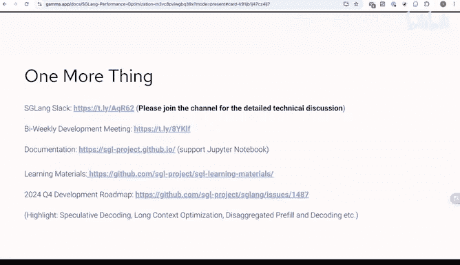

# GPU MODE《CUDA、GPU编程1-53课｜GPU MODE》中英字幕（deepseek-v3.2 - P38：-20241110-Lecture 35_ SGLang.zh_en - GPT中英字幕课程资源 - BV1QZ421N7pT

YSO。

And it， it includes both front end and back end。 The back end。

 I think it its functionality is similar to10 T A M or V M。

 And among the fully open source I M inference engine as G long currently achieve the so performance。

 Meanwhile， because it is so lightweight。 and for its customizable design。

 So many big companies and startups use it internally。😊，Okay， and secondly， let。

 let me introduce the S Geang team。 Right now， S Gang team is lead by Lian Mzhen and Yin Sheeng。

 Lian Ming Ying and Liang Sheng are the creator for the S Gang project。 And beside them。

 we also have four team member， Brian Ke Cheng Yang and me。 Also， we have more than 100 contributors。

 And here I， I want to give some special acknowledgement for the Zihao， Aaron Li， Han。

 Jerry and Mark。😊，Okay， here is about me。 yeah。 right now， I work at Ba and here is the Ba blog。

 before that， I work at Mean and from my past experience and my current experience。

 I work for the inference acceleration， before that at。

 I do some C TR prediction for research for search and recommendation。 And after that。

 do some stuff about A M inference。 And right now， I work at Ba just for the model performance team。

 And here are some of my contacts， my email Giub link in and Twitter。

 if you have any questions or do more discussion， maybe you can contact me。😊，Okay， here。

 let's introduce the etrolon milestone。 Etrolon is a project developed at last year， and at。

2023 October to December， its initial motivation is do some programming L M paradigm。

 And here is the paper to illustrate that idea。 And at this year， the January。

 we published the blog to introduce S G。I think it's the first framework to support AM M prefix cash。

 And after that many other frameworks such as ten TM De and PMM also support it。 And at at February。

 we also publish some some feature like constrain decoding and will the public blog。

 And this year at July that that's timeline。 I I join the team and we publish a blog about the performance here right now。

 as is a fully functional air inference engine and its performance is impressive。😊，At September。

 we also do some feature development， some enhancement features such as deep seek M L A。

 such as Gma to attention and also do some performance improvements。😊。

And we will release the elon version 0。4 coming soon。 Yeah， with a better performance and stability。

😊，O。Here in this talk， I will cover three recent optimizations。 The first one is the CPU overlap。

 The signal one is the flashing for optimization and integration。

 The third one is the tuman gym optimization。 and we， we plan to integrate it。😊，Yeah， you know。

 recently， a lot of attention has been paid to how to remove all the CPU overhead from the inference engine so we can make the GPO always busy。

 Also previous S G has known for a low CPU overhead。 but there is still room for improvements。

 So we gradually reflecting our whole code base to fully remove the CPU overhead。

 I think this enhancement minimize the S G CPU overhead from previous implementation。

 and is now in the latest release。 I I will introduce details。😊，Okay。

 let's started with the CPU overhead hiding。 So this。

 I quoted some results from another blog post from U SD。

 They analyze the CPU overhead on various engines。 There are some early fortune of and。

 And as you can see， engine can waste more than even 50% of time on CPU scheduling and just if GP idol。

 So this can be a huge waste and a huge performance bottleneck for inference engine。

 especially for some low latency or high throughput cases。😊。

And let's take a closer look at what the inference engine is doing when they run the inference。

 Basically in a engine， we want to run continuous batch。

 So the scheduler needs to handle lots of things and they are mostly CPU work。 So for example。

 at each step。 the CPU scheduler will try to receive the input。

 and organize the next batch and feed the input to GP So GP executed batch and then get back result and then do some other processing or and organizing the next batch。

 So you can see the GP is not always busy it has to wait the slow to do a lot of stuff to do a lot of scheduling work to summarize the GP actually sorry the CPU actually needs needs to do some tons of work。

 So that's why it can be a bottleneck。 And to summarize here it can receive input message from the user process results from the model worker checks the stop conditions runs。

😊，Smtching and request reorder and allocates memory for the next batch。Okay， so yeah。

 here we show the code for the scheduling work of CPU。 It receive first。

 it receive input and some process and then it try to get the next batch to run。

 allocate all the buffers and memories for them and then run the next， next batch。

 This is the blocking code。 So it waits until the GPU finish computation and then process the results and also stream its output。

 So if line here is blocking。 Okay， this is definitely not we want。😊，And yeah。

 this is the blocking schedule I just show you。 And ideal we want to sorry sorry。

 not just a question。 So， so when you say like CPUU overhead， you primarily mean right， Like。

 is there any other overhead you're referring to。Sorry， can you speak again， by overhead。

 do you primarily mean idle time， like basically time when the CPU is just waiting？呃。Yeah， I think。

 yeah， we want to eliminate this， this space。😊，Yeah， this is the GPU。 This is CPUU。

 and when CPUU do some schedule work， the GPU is not busy。 It is， is idle。开始 ok yeah thank ok ， yeah。

 yeah， thank you。😊，Okay， yeah， let's take a a。😊，Closeer look。er yeah。

This this is the blocking schedule I just show you。 and ideally。

 we want to fully overlap the CPU and GPU computation。 So， for example， when the GPU。

 when the GP model worker is working with the current batch and the scheduler should should be able to do the scheduling for the next batch。

 And then we can pipeline the CPU scheduler and the GPU worker。 So we can always keep the GPU busy。

 Yeah， there is no space here and can totally hide the schedule overhead of CPU。

 So this is what we are currently working in S。😊，And yeah。

 we have implemented the version of the overlap to the overlap schedule。

 You can check out these three PRs。 And yeah， also， if， if you want to use it。

 you can easily just use the enable overlap。 Yeah config to enable it。😊，And yeah， it。

 so when you want to a optimized version， you can turn the overlap option。

 And if you want to do some some such as debug job。

 And I think maybe the default non overlap version is easier for debug is easier for develop a new feature。

 That's why we keep both of them。And so we can see how it works on the left side。

 This is the block version I just show you。 So the key idea is how to make this wrong batch non blocking。

 so we can directly get results and try to schedule the next batch in the overlap version。

 The loop is quite a similar using are basically all the sames， but we slightly the loop。

 Here is also receive input and get next batch to run and try to run the next batch。

 The code is non blocking。 What does that mean we we can get immediate result。

 but this results is a future。 So we put it into a queue。

 And then we also process the results from last batch。

 So here we make the wrong batch non blocking and we can actually fully overlap the GP computation。

 Here is the basic idea。 but actually there exist some challenges for that here are three key implementation challenges。

😊，one is that how to solve the dependency。 So why the normal version is blocking。

 Because we need to check the stop condition。 If the sequence meets E S I D or length limit。

 we have to remove that from the current batch and return the results。

 So there is depend in the loop where which prevent overlapping。

 The second one is that how to share as much as code as possible for overlap and non overlap version。

 So we we， we still want to keep these two versions and one allows for easier debugging。

 Another allows for extreme performance。 That's why we want to share that code。

 The third one is how to work around withython。 You know，ython threads are kind of fake。

 It cannot utilize multiple calls when using multi threads inython。

 So these are the3 technical challenges we want to address。😊，ok。😊，So the。

 the first one is reserve the dependency。 yeah， we have an idea how to resolve this。

 Just delay the finish condition check。 We can， we can just assume I request didn't finish and immediately write in the next decoding batch。

 We solve the dependency by paying the overhead of decoding one more useless useless token。

 And I think the overhead is small。 one， when the batch size is is large。 Yeah。

 and also the the second。😊，The second challenge reuse code between overlap and non overlap version。

Yeah。I think the idea here is to introduce a new ten type called futureture tokens。😊。

What is future tokens。 Yeah， we we， we make this run batch run batch code non blocking。

 and it will return somethon tensor， but it's a future。 So you cannot get access its value。

 but you can get access thesor ship。 And because most of them don't depend on the value of thesor。

 It only depends on the shape of thesor。 So all the schedule code can run all the same code as before they can run。

 But when you want to access the value of the tokens。

 you can use the future get the real result Yeah only when the GPO worker and pre prefix matching need。

 So for for the GP work， it's okay， yeah。And the last challenge is the Python G I。

 I think we have finished the job for the second for the first challenge and for the second challenge。

 but for the last challenge， we are working in progress。 there are some ideas。 for example。

 in Python 3。13。 it it can remove G I。 maybe you can try it， but you know， I think some user。

 maybe cannot useython， the latestython， maybe they useython from3。9 to 3。12。

 So we also have another idea idea too。 we can use multiple process。

 but need make the serialization very fast。 I think it's also working in progress and we have do some validation for that。

 So yeah， maybe if you if you are interested， maybe you can join our slack to discuss about the details。

 currently it's still a single thread， but we use the yeah， free CPU circles aftergraph launch。😊，O。

And next steps。 Yeah， we， we can do some things。 Maybe we can we can try Python 3。13 with without G。

 We can also implement a multiple process version， and we can also try some fast H TP server。 Yeah。

 because recently， Brian also also do some rust related work， maybe after that。

 we will introduce a rust based H TP server to replace the current Python based H TP server。 Yeah。

 and I， I think after we we doing in all this， we expect about 10 to 20 based performance improvements across all workloads in the next big release。

😊，And we， we do。Indeed， we we do some simple benchmark。 But I think， yeah， because recently。

 we will want to release a new blog for that。 And I think more detailed benchmark results across various scenario will be released。

😊，So， please stay tuned。O。😊，Yeah， let's get a step to the second part。 The second part is about the。

Flash infer optimization， actually， S Gang has integrate flash infer as as its default back and since version 0。

2。 And yeah， right now， flash infer also do some optimization， but it has not。

 it it has not be released yet。 Let's explore the upcoming optimization that flash infer plans to introduce。

😊，Because we， we are， we collaborate with flash team very closely so we can get。

 get access the latest code。 And we， we do some conduct。

 conduct some integration and performance benchmarking in advance funds。 So here we introduce this。😊。

first， we I， I want to introduce the flash infer。 What is flash infer。 F infer is a library for airM。

 it provides a high performance implementation for some LM E GP P kernels such as the attention kernel。

 sampling kernel， normalization kernel and and activation kernels。 I think it's widely use。

 it used by S G long by F M by yeah T G I and ML C engine。

 I think all of the open source framework adopt flash infer as its backend and in S。

 we use it as the default back hand。😊，And yeah， because a specialized presentation on flash infer is expected to be shared by the creator。

😊，Zhao in January next year in GPU mode。 So I I will only yeah have a glance of of that technical optimization。

😊，Yeah。Yeah， in the new upcoming new release flash infer， it introduce mainly three optimizations。

 The first one， maybe it's not optimization。 I think it's。

 it's used for more customizable and for the usability。 yeah， it's inspired by flex attention。

 and it design a customizablea template and G I T compiler that can take the attention parent specification as input and generates the optimizeized kernel code such as it can generate coda code。

 it can generate the cut code in the map branch， its， it supposed already yeah。

 it' supposed G I T and it also keeps the A O T because some some framework also want to use the L O T version。

😊，And it has not released a new version yet。 We also publish a paper for that， but right now， it it。

 it has not been public。 So I will not talk more details about that。 And also， we do。

 we do some attention work。 some， some flash attention3， you know。

 the original original flash return 3 doesn't support page K cash。 But I。

 I think Page K cash is very important for I M suffering。

 So flash infofer supports it and introduce the support for page K cash。

This part implementation is also ready， but it right now， it has not been made public yet。

 And I think it's expected to land in Su， yeah。The last one is the I said a question。

 So so I'm curious like I've heard this is like a very shallow question。

 but like I've heard that like S G line is better because it doesn't use page attention uses like Reds attention。

 I was wondering if you could give us like two line summary of the trade offs and why like and why G line is not choosing to support both regimes。

 Okay， okay， of course， yeah， yeah， yeah， I think S G line choose use the Red Redix attention。

 So that means it's also paid attention， I think but it's the block size is one and for other implementation such as V deploy and other framework the block size is maybe 32 or maybe16。

 I think for S G line， it used the redix attention。 it used the block size1 just for the better。😊。

Yeah， for the prefi cash match， it use the。Size1， it can match most of the shared prefix cash than other sides。

Yeah， I think that that's the， the reason why we choose， why we choose size one。

 And I think the performance， Yeah， you say， if we want， if we enable the prefi cash。

 I think the performance maybe S July line is better than others。

 And if we disable the prefi the prefix cash。😊，Optimization。

 we compare the performance such as compare S G with FM。

 I think it's also compatible and competitive。 Yeah， its performance is also good。😊，So I， I think。

 yeah， we chose a token token attention。 We use the size  one just for better prefix catch sharing。

 and it didn't introduce any。 I， I think any other drawbacks。 So we use it， yeah。

I think it's not just the prefix caching it's about the tokens how you actually get even in your user query so that was one main reason why Redix attention was so good in caching your KV states across multiple queries youre doing bad size if you're doing a bad size of one inference than it does not matter whether you use VLLM or page attention any of or AG land fundamentally it is identical but if you have a number of batches and if you're serving them then you would rather prefer to not to do the recomputation for those queries for those tokens that you have already computed you would rather prefer to reuse those and increase your time for first token or even time between tokens。

Yeah， yeah， yeah。 Youre right。 That's also a reason， yeah。O， thank thank you。 Thank you。 yeah。

 Thank you for your。😊，For your， yeah， advice。 Okay， maybe let's get the next slide。Okay， yeah， yeah。

 The next slide is the stream K scheduler。 I I think， yeah， actually， this job has been open sourced。

 but right now， it has some conflicts。 and yeah。😊，I just test this and its performance is， is。

 is better than I thought。 What， what does this do。 Yeah， it。

 is is inspired by stream K and to minimize the idle time of S Ms by distributed the workload。

 So I think for， for some scenery such as one scenery。 we we use some random input。

 And the random input lines is distributed from a 500 to。😊，2000。 Yeah， so the input lines。

 some input lines is， is long。 Some input lines is short。 And in this case， yeah。

 if we don't do any schedule optimization for that。 And I think， yeah。

 the performance is not very good。 And what does the scheduler do。 it。

 it cannot affected by the variance of the input lines， it。

 it's only related with the total lines of the input lines。And yeah。So this algorithm also， I。

 I think is published as the in in the paper。 And the idea is that it。

 it takes the sequence less information of the query of the output and the key value dimension as input and outputs mapping between work and C T S。

 So the index mapping between partial and final outputs。 yeah。😊，I think maybe yeah， maybe if you。

 if you're interested， you can， you can refer to， to this PR。对。O。😊，And here is the results。 yeah， we。

 we compare the new flash infer with the triton implementation。 and here is the two scene。

 One is the share GBT scenery。 We just use 1000 promotes for that。 and we use request rate。

 I remember maybe 46。 Why Why we use that because we just want to test the online scenery。

 We are latency sensitive。 Maybe we use the T TFT200 miseconds for the threshold。

And another scene is the random scene。 I said the input lens is ranging from 500 to 2000。

 And for this case， its input lens is variance。 Yeah， and yeah， for these two scene。

 you can see that the flash infer backend。 Yeah， its performance is better than the treatment backend。

 just for the T TFT for the I T L both good at。 Also， I。

 I think its performance is is very competitive， even with some other not fully open source framework。

 But I yeah。😊，What， what， what I do My， my work primary focus on the integration and do some validation up for the upcoming flashing for new version with S Gla。

😊，And yeah， for the benchmark job， if you have， if you have more questions。

 maybe we can just join the flash select channel。 I and Zhao also in the channel。

 we can have more discussion about that offline。😊，And yeah。

 the last thing is the tu mind gym optimization。Right now， you know。

 S G long depends on some VM component。 We just use PMM for the line component。

 such as some quantization method， A W Q， GPQ and W A。W 8 a8。

 and we want to remove the PMM dependency。 So we need high performance quantization implementation。

 Yeah， touch A O team。 Jerry Zhang also sent some PR for that。 And thank you very much。

 And we also want to integrate the tu mind gym implementation。 I think its performance is so good。

 And here I will share some technical details about why its performance is impressive。😊，First。

 let me introduce tu mind M deploy is a toolki for comping。

 deploying and surfing L M is developed by Shanghai AirI lab。

 I think the initial release is last year at July。 it was built upon on a modification for modification。

😊，A version of fast transformer。 And after subsequent iteration。 right now， yeah。

 it completely writes attention and request scheduling logic。 So its performance so good。

 and tu mind is。😊，Tple mind is specialized in the gym optimization component。

 and it's original a part of A M deploy。 But right now。

 it has been extracted to released as an open source library。 So I think in this way。

 other framework such as S G V M or or T G I can integrated as needed。

 It primary focus on accelerating linear operations， including the quantization and M O E。😊，Yeah。

 here， here is the link。 Maybe you can give give him last time。And yeah， what， what trouble mind gym。

 What's the problem to might gym solve。 Yeah， I， I think the gym operates in the ten core area I is the yeah。

Practical， yeah， it's the。This is the workflow。 First。

 it will load the opera from the global memory to shared memory。 And the second。

 it will load matrix fragments from the shared memory to register。 And the third part。

 the third part， it will feed the technical M M A instructions with the fragments。😊，Step 2 use the。

 yeah， some instructions such as L DSSM to effectively transform。

 transform the column major or major layout to the layout required by M M A instruction。 However。

 when the opera bit width is different from tense course input bid width， such as we use in4 or。

In 8 P， S float 16， the loaded data will be misaligned because the instruction is not designed for to handle such mapping。

 Yeah， I can share with you some P T X。P T X， I S A。

 we can use a M A M M A M 16 an 8 K 16 as an example， Here is the is the picture to draw the idea。

 You can see that yeah， here is3，0，3，1，3，2，3，4，4，3，0。 it handles the this one，0，1。8，9。 And I think。

 yeah， this is for the float 16。Case， and if if it's for8 inter8 case。The thread 0 will handle a0，1。

2，3， and that will， yeah， make this misalign。 and the result will will be wrong。

 So in order to use it。 we do some yeah， I think other gym implementation optimization。

 they some layout to match the ten course layout。 But you know， ten， there are so many ten layout。

 And yeah， in different architecture such as in P 100 in a 100 and in H 100 layout is also different。

 So I think it's not maintainable and it's not a general approach。 but yeah。

 top gym proposed a method can generate and elegant resolve this problem。What what does it do。

 It just do the packing the weights Instead of designing complex weight layouts to make the utilized weights compatible to specific ten call instructions。

 we reuse the finder provided instructions like LD S SM。 What does it do。 Yeah。

 here is the standard G E M M and here is the weight packing。 this， this is offline。

 And here is the mixed precision gym。 First， we do some bit extend such as the4 bit weight to the 16 bit。

 and we load we we load the weight fragments with the some data pipeline as in the standard gym。

 You can see that oh， this one load from the gym float 16 from global memory to shared memory and from shared memory to register This code is Sam。

😊，For the standard gym or for the weight packing iss the sun， yeah。

And beat un extendedend 16 B data to 4 B here。With additional reordering， here is the pack and store。

 And after that， this is offline。😊，Oline instruction。 after the offline， yeah。

 we use it for the online mixed precision gym。 Yeah。

 here is the interval packed and it load in into the shared memory。 You， we can just use LD S。

 We don't need to use LD S metrics。 Yeah， for the interval。 Yeah。

 redress memory and we can use use this。😊，And each up stores the packed fragment back to gym。

And oh sorry， this is some table。 I will fix it。And here we can use an example。

 You can see that here is a 32 multiple 32 matrix can be filled as2 multi2，16 multi 16 slice。

 Each 16 slice。 yeah， it is stride。 just for this， this blue area。 I think is not conig。 Yeah。

 it has some stride。 This is stride。 and tail is then packed into a conig 32 multiple 8 tail。

 The 2 d packed shape is2， and this one。 this is2， and this is 32 multiple 8。

 and this is2 multiple 32 multiple 8。 So this is250012。

 The transformation that maps the original M N coordinate to the packed shape is M defined 16 and an multiple 16。

😊，Yeah， this is an example to you use this ten instruction。And yeah。

 what's the advantage of this tu mind gym。 I think it can save the layout directory maps to teleco instruction。

 and is more general。 Yeah， you can use it on a 100， you can use it on H 100 even on the black wheel。

 you can use it。 and it can be loaded negatively without bank conflicts。 or is sizzling free。

 I think in catalogs， there are also some some solution for the mixed gym。 Yeah。

 but I think this way is is so elegant。 and it can adapts to any layout required by M M A instructions even undefined。

 It can adapt to any power of two bit width。 and number of fragments to pack is configurable。😊。

And okay， here is the benchmark result。 We can just use a float 16 multiple in4。 Yeah。

 the group size is 128。😊，Here， how how how the4 point to5 compute。 Yeah。

 because the group size is 100。28。 And yeah， we can use this a。You use the4，4 multiple this。

 It's 512，1212。 Yeah。 And because we save the scale and 0 in 16。 So plus 16 and plus 16 is 544。

544 yeah defined the4。 sorry， defined the 128。 So the result is 4。25。And yeah。

 it can compare with the float 16， float 16 with the Kla implementation。😊，And we can see that。 Yeah。

 here is the better size， and here is the speed up compared with cool glass。😊。

I think these lines we thought is， is， is for this。 And this lines is for these T slopes。

 And we can see from the chart。 yeah， when the batch size is less than 2156。

 Most of this is even faster than coolla。😊，Yeah。So so so you know。

 I'm curious of the chart like the like it's it looks like your performance numbers on older GPUs are like insane。

 It's like close to 4 x versus on H100 is it's like much slower。 like close to 2。

5 x of the small batch size。So I'm sort of curious if you could speak more to what's going on here。

Yeah， yeah， yeah。 you're right。 I， I think the reason why is because， you know， in in China， I think。

 yeah， for for some restrictions， it cannot sell some H 100 or some， yes， even the a 100。

 So I think the optimization is mainly target on some C 100 a 100。 I it。

 it not even use the H 100 new features。😊，And I think after this release。

 the toldman Jims author Li Zhang， he's also， he's also in the meeting right now。

 He will do some optimization for the new architecture for H 100， yeah。😊，Very interesting。

 And so related Wuyang is asking， like why， why does the bad size increase， It's slower than Kublass。

 Is it because of the lack of tensor cores。Oh，Why is O。😮，Yeah。Good question。 I， I think。

Why is slow in large budget sides。Yeah， in in large batch that， plus implementation is so good。诶。

 maybe， maybe Li Zhang can can answer this question。Actually， I'm not very sure about this。

ForFor an now skill issue then it seems like， okay， okay， okay， okay， very cool。😊，Yeah yeah yeah。

Yeah， that's a good question。 Yeah， we， we should figured out。O， yeah。that's all。

 And the last is some community users and contributors such as X， A I， M， D， P N video。Yeah， X I。

 I I think they， they use it。 Maybe they do some internal version。

 A M D give us some support to write on M D P touch。 Yeah， touch air team also yeah。

 use the touch integrate touch into S G。 I， I think it's so nice。

 And Nphi support us with some clouds。😊，Daabbriricks， I think is's used for the research purpose。

 and rumold also use beef some credits battle down the Singapore team。

 Lava Wang Fion use as Gang as the default A M inference engine。Yeah， and link in。

 maybe Brian can say about it。 although we， we collaborate with so many companies。😊，Okay。

 one more thing。 Yeah， we， we have the select channel。

 and we also have some bio weeklyekly development meeting。 If you are interested。

 you can join our channel and you can also， yeah， open this link。 This is S GL community meeting。

 You can post your ideas in the dock and discuss with us with the developers。😊，Also。

 we support the Jupiter notebook documentation。 I think it's so cool。

 We have summarize of the learning materials。 You can open this link。 Yeah。

 you can see that we have the summarize for the blog slides， for the videos and for the paper。

 for the documentation。😊，Also we， we public our development roadm。

 This is for you can see this for details。 And I think something need to be highlight。

 We will support speculative decoding in this quarter。 and we will do some long context optimization。

 I I think right now， yeah， you know， for for some even for Lama I think its context lens is from 4K to 32 k even right now for the 11028 k。

 So I think long context optimization is necessary。

 We also do some exploration for the disaggregate pre and decoding。 I think， yeah。

 for the online scenery， T T F T and I TL is very important and deaggregation is a good solution for that。

 Also it's a little complicated。 And I think other frameworks such as VM and yeah。

 maybe other frameworks also right now， yeah， maybe do some in or want to implement this。😊。

That's all。 yeah。 And yeah。Do you have any questions。Very cool。 Thank you。 this is an awesome talk。

 I guess like yeah if anyone has any questions to， please start posting them in the chat。

 like in the meantime， I want to ask like maybe I'll start。

 It's like like I was actually really impressed by like how quickly of a community the Sheang team developed and the like volume of people that you've been working with。

 So I'm curious like， if you have any suggestions for people that are interested in the project that want to learn more about LLM inference birthf。

 like where should they start， what kinds of issues should they target， who should they talk to。

 etcter。😊，Yeah， yeah， yeah。 actually。 we welcome the new user。 We will also welcome the developer。

 We welcome anyone interested in this project。 I think， yeah。

 if anyone is interested in this project。 He can join our slack， he can just use it。

 And if he encounter any issues， he can， any problems， he can yeah raise an issue。

 And if he want to do some modification， he can read the code。 He can， yeah。

 just add that feature and send up here， we are willing to review that， and I think， yeah， right now。

 we have。😊，3 core developers， and we will handle these issues of quickly。 And yeah。Yeah。

 I think right now， there are so many inference frameworks。 So for maybe for the performance。

 T R T M is good， but its usability is not good。 actually， for the customizable。

 If you want to do some signal development S is very suitable。😊，Yeah， yeah， yeah。 And I think， yeah。

 anyone who is interested in can， can join us join the slack， and we can have more discussion。

 Anything for the technical details for， for， for the just the usage。 Yeah， we， we have that。😊。

That's all。All right， yeah， I， I see some questions from God。

 any plans to add other transformer types， example， B and whisper。Yeah， right now。Actually。

 right now， we， we， we don't support whisper。 And as far as I know。😊，Yeah。

 if you want to run whisper so fast， I recommend your use 1000 M。 Yeah， it's the wrong time。

 maybe at this time point is the fastest。😊，Among all of the implementation。Yeah。A course I had。

 I think it's on the previous slide， like the first bullet point could you like？

Break down slightly slower。I think that's the slide before this。O。呃，I just。Oh oh yeah， Go ahead。

I always get confused what people mean by partial bits is of like 4。25 actual bits。P。

 it is the effective bit that you have to consider when you think of doing the alignment for your data so let's say that you want to represent your memory representation in F2 16 multi by in four you need to consider what your layout strategy should be for doing the memory allocation and also memory managing when you do the pull of the data you have to keep your some part of your data for your actual mantesa and some part of your data for your exponents right so how do you bring that data effectively is a fundamental equation and the fact that we have 512 bits for the mantea part and the remaining for doing the scaling and scale out part of the data field you need some around 544 bits to represent the actual data in the memory now if you want to bring in a group of that then you need to divideode by 128 so you end up getting 4。

25 actual bits to pull that data now that gives you like an as。

Like from the view of like how do you look look into the data。

 you have more bits representing a data value， hope that clarifies。It does' giving like a 10。

000 feet answer here。6。N I may be wrong， so correct me Okay， so okay okay yeah。Youre right。😔，Yeah。

 yeah。 because we store the0 and scale in 16。Yeah， I， I think I can write that。Yeah， maybe maybe。

Wait for a moment。I think its easy。This1， I just post this。In the chat history。Oh。

Any other questions。I see one from Byron， any thoughts about SSM models？Oh， as models。へ。😊，Yeah， yeah。

 I I think maybe Yin can answer this question。😊，Yeah， I also tag， yeah。

Maybe we can give some permission for you to unmute the microphone。Okay， I just。

They might be away from their keyboard， I just noticed I think anyone can unmute themselves in around you can unm yourself。

啊， ok。也嗯。Okay， I yeah， Yin has replied this。We are definitely open to support it， yeah。😊。

It's not our first priority。 We contribution。Alright， very cool。 I。

 I guess if if you're interested in like reaching out more to Yang， like。

 I think you already mentioned like a bunch of like different like slacklack channels where you can participate。

😊，And he's also he's also on Twitter so feel free to reach out to him there next week we're going to have Jaysha who's going to be talking he's one of the co-authors of F attentiontention3 and he's going to be talking to us about like just exactly that he also has a really nice blog called Cofaax Research that I really highly recommend you check out。

So yeah， see everyone next week。 And thank you everyone。 And yeah， after this meeting。

 I will share my slides with。😊，Is Mark and maybe yeah。 Thank you。

Thank you so much this is really good thank you everyone bye bye。

