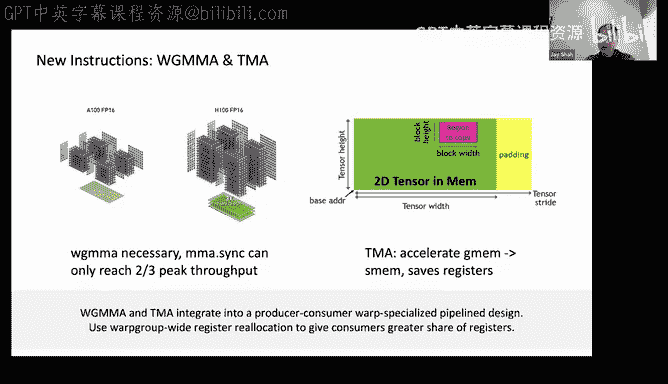
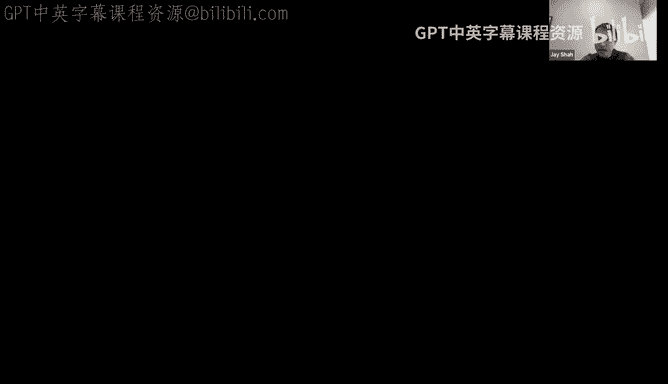
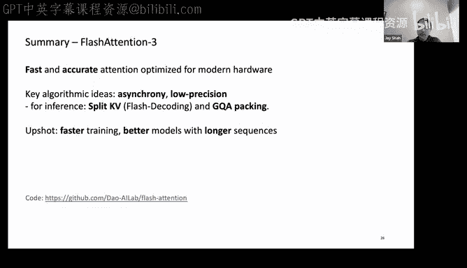
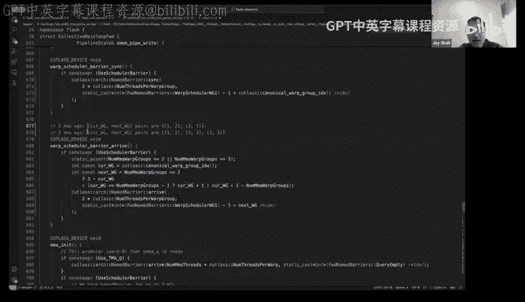

# GPU MODE《CUDA、GPU编程1-53课｜GPU MODE》中英字幕（deepseek-v3.2 - P39：-20241117-Lecture 36_ CUTLASS and Flash Attention 3.zh_en - GPT中英字幕课程资源 - BV1QZ421N7pT

I'm sure we'll have people trickle in， so maybe let me give a long intro and then this will give people the the chance to come in。

Okay， so welcome to another episode of GPU mode everyone。

 like today I'm actually super super thrilled like we have Jay Shaw on the call who is here to talk to us about cutless and flash attention。

The the way I first had heard of Jay was like I'd been following Hill on Twitter。

 whos like also an avid chess player and I asked him like， you know。

 who should we really invite to come give like an interesting talk about Kuddon Culas and the first name that came up with Jay。

After that， like I went down like a deep rabbit hole reading Jay's blog So Jay's blog is and company is called Qfaax research and they do lots of interesting work at the intersection of math and performance。

 it is so far， I think if I were to look at like just blog content wise in terms of like the quality of the overall content。

 I think it really rivals the best stuff like basically things like Simon Boums articles and I really。

 really enjoyed it， it was like very intuitive， like very thinkky， very， very elegant。😊。

And so I'm like super really thrilled to have Jay here so earlier in the call he also shared like a very interestingbit than that like Colfaax research is actually a family business and it's a family business that mostly deals with like doing math and performance programming so the most unique family business I've ever heard so yeah without further ado Jay please take the stage again it's a pleasure to have here Jay I want to add one more sentence most of your blog we have Regan as part of the rewrite of the PMPP textbook and well be incorporating many of the content that you have shared so thank you so much。

😊，Oh， that's I'm thrilled to hear it， thanks。So I'm going to let me share my slides， of course。嗯。Yes。

So today I'm going to talk about cut list and flash retention free。And here's the plan for the talk。

I'll give a quick recap of attention and the key idea of flash attention。

Then I'll give a high level overview of the F attention pre algorithm。

And this is meant to set the stage for the well I consider to be the most。

The greatest value that you might gain from this talk， which is。

Me then giving a deep dive basically into how you might code up the algorithm。

 so how you might translate the algorithm into working code built on compass。

At which point I'll switch over to my coding environment。So what is attention？Attention is the key。

Component of the transformer architecture。And。It involves this formula O equals softmaxq times k transpose times E。

So I start with my query and key matrices。M by D and N by D。

 they're drawn like rectangles because D is typically much shorter than the sequence length。And。

From this， I compute this matrix product， which is meant to record the similarity scores of comparing the query against the key tensor。

And this is some M by N matrix， which is much larger than Q& K。

I then take the rowwise normalized similarity score， the attention probabilities。

By taking the row Y softm of this course matrix， softmax is given by the following formula。

I then multiply by the value matrix。And I end with this。

This output matrix that I then write out as the output the attention。

So attention scales quadraically in the sequence length n making it。

The key bottleneck to long context applications。The naive algorithm。

If you want to actually implement this on the GPU。You can load and Q and K by blocks from high bandwidth with memory。

 global memory， compute S， but then you have to write out S to HBM in order to compute Softmax on it because Softmax involves the a priori global knowledge of the rows。

So this involves this intermediate write and read of the attention， the scores matrix to HBM。

That causes naive attention to be bottlenecked by memory reads and rights。Because of the size。

 first of all， the scores matrix。And the。The slowness of。

Breathing and writing from HBM as compared to working on chip。To understand that。

 I'm sure many people in the audience are familiar with the memory hierarchy on the GPU。

But at the time when these ideas were being developed， this was not so。

 this was not really common knowledge to people at least working in machine learning。

So in terms of the memory hierarchy， the key thing is that there's an inverse relationship between the size of the memory and the speed。

 the bandwidth。At the lowest level of the memory hierarchy or pyramid， as depicted here。

 you have HBM i。e global memory。And then at a higher level at the apex of the pyramid。

 you have shared memory and moreover， on ship registers。Which has a much smaller capacity but。

As a trade off， you have a much higher bandwidth。So you have to。

 the idea behind flash attention was that you have to exploit the memory hierarchy in order to speed up the algorithm and in particular。

 not materialize intermediate scores matrix to high bandwidth memory。

So the idea in flash attention was to leverage tiling and recomputation to speed up attention。

So as mentioned， I don't want to materialize this S matrix to HBM。As a consequence or relatedly。

 I have to compute softbacks normalization without access to the input。

 the full rows of the scores matrix。And as a second challenge。For the backward path， I have to。

Since I'm not materializing the scores matrix to HBM。

 I have to compute it without having that attention matrix compute in the forward pass。To solve this。

 we use the classic technique of kernel fusion， we want to fuse all of the computation done in the tension into a single kernel launchch。

Using tiling and online Softmax idea to get around having to compute Softmax and normalization。

So for flash attention， for a given tile of Q as depicted earlier。

 you want to load tiles of K and V block by block and accumulate values of the corresponding modeling tile of O。

 computing the intermediate S and P using online Somax and rescaling O as you load K and V block by block。

You also leverage recomputation in the backward path to avoid having to store the attention matrix。

The Flash attentionten 2 algorithm is presented on this slide。So。As mentioned， I have to load Q。

Uing a blocking of the entire query tensor into shared memory。The block size I call BM here。And then。

For over tiles of K， I have a separate block size Tling K。With which I call Bn here。

And I load that also into shared memory， then I do my first gem computing S。

Taking Q times k transpose and scaling by the head dimension。

I then track some statistics such as the Romax， which I need to do soft back safely because it involves an exponential as well as the Ro sum to eventually normalize。

And I also， I do the exponentiation of this these intermediate matrices and load V correspondingly and do that multiplication。

As well as updating the。Accumulator as I go through the loop。In this way。

 the flash At2 algorithm can compute for a given query tile QI， the corresponding output OI。

 and write it out to HBM。The outer loop is paralyzed in terms of launching Fred blockslocks and the inner loop is what we call the attention main loop per Fred block or per CTA。

So that's a great algorithm and it's essentially optimal on a 100。

 so you have to talk about always in this sort of story with hardware where algorithms。

The hardware that actually runs on。And for a100， flash attention2 is essentially optimal。

 reaches around 80% utilization。However， on H100， it's very far from optimal。

Note that you see numbers in the mid300s here， but the theoretical maxteraf flops is about 1000 on the H100 SM5。

Here I'm not using the new Hopper instructions， WGMA for doing matrix multiplication and TMA for loading from global memory。

As a consequence， and because I don't use some advanced ideas that are necessary on Hopper to get good performance related to as synchrony。

 I can only get up to 40% utilization with flash attention to。So enter flash attentiontion free。

 so this is a collaboration between myself， Yameshricchandi， Ying Zhang， Vj Facker。

 Praip Ramani and Td。So there are core ideas for flash attention free。

 which we leverage to improve the performance on the H 100 GPU。First。

 we use the new instructions on the age 100， namely WGMMA。

 which is the higher throughput MMA primitive。Fully asynchronous and collectively executed by warp group。

Namely for contiguous warps and Tma， which is the asynchronous load issued from a single thread newly introduced on Hopper。

 which accelerates the。The memory transfer to get the tiles into shared memory。Second。

 we leverage aschrony in a sophisticated manner。We have both interwarp group overlapping this involves warp specialization to divide。

The warps into producer and consumer roles as well as ping pong scheduling。

And intratrowarp group overlapping。Her consumer war group to overlap the softftms。

 namely the exponentials in softftmax with the asynchronous Fael。Thirdly， we not only。

Improve the performance of the Bf 16 attention kernel， but also。

Introduce low precision into attention。 So we have FPA。Or doing map moles now in attention。

This introduces challenges related to layout conformance to successfully invoke the FPA WGMmas for which we need to。

Leverage the idea of transposing V in the producer war group after it's loaded into shared memory。

 we call this the internal transpoa fee。So in this talk。

 I'm not going to discuss issues related to the quality of the F attention kernel。

 namely the sort of how you mitigate the accuracy loss。That you expect from moving to low precision。

The upshot is that we get in the BF 16 case up to a freeX speed up over a flash attention tube。

And we have an essentially optimal implementation reaching up to 85% utilization competitive with the best gem kernels or of the attention kernel。

So。Let me walk through these optimizations in order。First， we use the new instructions。

 WGMAA and TMA。WGMMA is necessary on Hopper to reach peak Fput as compared to MMA sink。

 which is the Are instruction。Which can only reach two thirds of the peakrupa in terms of the theoretical maximum terralops。

TMA is this new model for doing loads from global memory。On SM80 on Apire。

 we already had asynchronous loads in the form of CPA syncnc。

But the TMA model is an improvement over the CPA S model in that it reduces the uses of registers to do the address calculation。

 so this is handled by a special hardware unit。This saves registers and in the team A model。

 the team may load and。There's also an asynchronous store。

 the teamA instructions are issued by single Fred and they execute asynchronously in the proxy。

 the asynnc proxy。WGMmaA and TMA。Doing compute and load respectively。

 naturally integrate into a producer， consumer Warp specialized pipeline design。

 which I hope to discuss with reference to the code later on。Moreover， on Ho， you have。

The certain warp group wide register reallocation instructions。

This allows you to give the consumers a greater share of the total registers in the Fred block。

So this is necessary to allow the in particular for attention kernel to。

Avoid register spilling with the computation。

So here's the CTA view of the Flash retention tree algorithm where I have not yet put in the asynchronous。

 the more advanced asynchrony ideas related to the consumer。

So this is just flash 12 with Warp specialization。And this algorithm 1 is taken from our flash attention free paper。

So。I'm not intending to， of course， have you fully digest this slide before I move on。

 but the main thing I want to illustrate is that on line  two and line 11。

 I have this producer consumer separation。So I explicitly in this algorithm write up。

Iitialize I say that I initialize a certain pipeline object。

 which manages the necessary barrier synchronization between producer， consumer。

With S stage circular shared memory buffer。And the producer War group is responsible for loading the data from global memory to shared memory。

 so the QI that I have to load in the prologue。Before I go into the attention main loop。

As well as the loads of K and V。Loing。All of K& V for that。

To execute the computation of OI for that QI tile。On the other hand， in the consumer main loop。

 in the consumer path。Weight at various places on the producer loads to complete。And then， I。

Have the same algorithm as before。With flash attention to essentially at this stage。

So in terms of the SM80 implementation， the F retention2。This was not how that was implemented。

 So in if you look at the flash attention to code， there is not。

Wp specialization to divide producer and consumer。So this is something that is new in flash retention free。

In fact， in SMM80， the Flash attention2 implementation there already used CPA sync to asynchronously load tiles from global memory。

However。InFor ampire style kernels like Flash attention 2 and gem kernels， in fact。

Typically a multis stage design where you。Interleave consumer and producer within the same warps。

Is more optimal but。We。Instead on Hopper， we want to use warp specialization for FAA free。Jim。

 may I ask a couple of questions？Sure， so what was the insight to do what specialization so i'm trying to understand why did you go in that path。

First question and the second question is why did you pick v specialization of two level you could have done three right so you could have done the loading as one competition as another and writing as third one too so i'm trying to understand what was the insight behind picking up the two and also why specialization so。

😊，Sure。So initially， we actually in our first implementation of flash attention on hopper architecture。

We used a multistage design where the producer and consumers were interleaved in the same warps to do both loads and MMA。

So。Essentially， what we did is we took FA2 and we replaced the CPA sync with TMA。

And the MMA with WGMmaA。And that already yielded a substantial improvement。We then。Motivated。

 we were motivated then by。The fastest hopper gem kernels。Using warp specialization。

So we at some point。We had both a multist flash attention kernel， as well as a warp specialized one。

And。We compare them。And we were able to extract a certain improvement with the workp specialized kernel。

嗯。So that's basically it led to us essentially adopting the warp specialized design for all of the。

The attention kernels。That our fastest on Hopper。Why pick two level and not three？So by free levels。

 do you mean I have another warp group for doing the stores， yes？So for doing the stores。

 you want to store using the consumer work group because。😡，The you accumulate in the registers。

 so I don't want to store to shared memory。And then have a there would be no real point to store to shared memory。

 you have to use consumer work group and then issue the team a store from a different workp。

You might just issue it in the consumer wars。Like right。The benefit of war specialization is。

Having the compiler。Better optimize and interleave the loads。😡。

In the main loop with the the compute but the store is just is issued once at the end。

 so there would be no benefit from having the producer do the store yeah store is not block for you so clearly understand so thank you yeah yeah I have I have a question about that that I thought I would put it now since Vikram just asked that that good question and it's just like sometimes I think about the work specialization that。

It's partly a tool to be able to reason about how many threads are doing like nonload stuff at any given time and I wonder if that's something that youve thought about or if that's accurate in some way which is like if you just have onep group one warp allocated to do these like load issuing instructions。

 then you know that like all the other like you know and minus 32 threads are active doing like computations at a given time and you can reason maybe better about like saturating the GPU but on the other hand like if you're doing this cooperative thing that you were just talking about like you're like wait at this moment。

 maybe three warps are busy issuing loads and at this other moment， you know what I mean？

It's certainly so from an eligibility perspective。And simple you're just being able to write code more efficiently and in a simpler fashion。

 its warp specialization is way easier to read and to reason about， yeah， I agree with that。

So the other thing is that you can。So does I answer the question？Yeah。

 so it's easier to write more specialized code。Just straight up and I guess because the TMA unit is actually doing the work。

It makes sense that like all you're really doing with this one kind of dummy warp that is the the load warp is just issuing instructions and then kind of being done yes exactly so。

For example， we actually so it's going to be a caveat to that you can actually use the other free warps in the producer warp group to do stuff to do sort of preprocessing like the inter kernelnal transpose that I talked about so that will be that'll play an important role for the fBA kernel but yeah's that's essentially right。

The reason we have a producer Warp group here is to be able to use the Reg reallocation。

 which only operates Warp Group wide。Even if you only use one producer work。Oh， I see。 Okay。

 that's that's that's something I should think more about。

 So that's why we'd say if in the producer Warp group。 So really yeah。

 we're going to for the Bf 16 kernel lease， once you're in the producer Warp group。

 if you're in the last free producer wars， you just return。😊。

After doing the real right and delocation， if I understand correctly is saying I don't need these somebody else use them yes。

 you free them up and then you reallocate them to the consumer so otherwise they would be equally slid。

So Cameron and Chad is also asking， Warp does Warp specialization also pass instruction scheduling to the Warp Schr instead of the compiler trying to interleave producer and consumer ops？

So。The warp schedulers are still deciding。At the cycle level， what instructions to execute。

Like so all that you're doing with force socialization is that you're making the compiler's job。

 so I think of it as making the compiler's job easier。😡。

Or the warp schedules dropped easier because the producer Warp， it's the only thing that the warp。

 which is labeled producer Warp does is it just issues Tbase。That's its only job。And。That should。

 so if you understand。How the compiler works， which。To be quite honest。

 I don't have a deep knowledge of the compiler because it's。A black box。

 but if you believe what you read about how the compiler works， then。

It will be able to better interleave。Loads and compute instructions because of this because you wrote warp specialized code and also it increases your coalescing effectiveness so when you do your vp specialization your memory access pattern becomes more important too。

Sure。Any other questions？No， that was a fine fun side because。 You should keep going。

So this is FA2 plus Warp specialization with TMA and WGMA that already gets you very far。

 but we can improve on this。嗯Oh。What the sorry。

Okay， yes， so with asynchrony。We can use that， well， first here is the problem。

So the special functions used in softbacks are very low Fpa。Theres a concrete example。

Let's say I was in head dimension 128 and I block size 128 by 192。FP16 WGmaA。

Would have execute over twice the cycles as the special functions。

So the proportion is actually quite large， unexpectedly large。

 you might imagine in terms of looking at the exponential。

It's even worse for FDA where it actually would be equal， they would take an equal number of cycles。

And if you want to。Improve the speed of the attention kernel。

 you want to use the fact that these are using different hardware units。

 the tensor cores versus the SIT cores in order to and try to overlap these instructions in order to improve the overall speed。

So we want to be doing exponential， in other words。

 while Tensor cores are busy with WGMA and using that the Tensor cores execute asynchronously。

So the first thing we could try doing is just in terms of the different warps。

In terms of the different warp groups really， because one warp group collectively executes a WGMA。

And for this， well you can just leave it to some extent to the warp schedulers to elect which。

Instructions to execute。But we can actually improve on just what the warp schedulers by default do for us in terms of。

Explicitly via barriers organizing the execution flow of the attention computation。So for example。

 if we have two compute warp groups， two consumer warp groups。

We could schedule the WGMA of four group two under the softm of four group one as illustrated in this picture。

 so this is an idealized picture but。We can， to some extent， approximate。

This execution schedule using barriers and we call this a ping pong schedule it's the very very similar to the idea of ping pong scheduling in the gem kernel。

So in practice， this often yields some speed up so this is some hypothetical well this is not I mean sorry it's a。

Under certain conditions， you can observe a speedup like this。And。These numbers were observed。

Or a certain configuration， but we're planning actually to put in the code a separate path where you can sort of。

Easily disable ping pong scheduling for doing ablation studies like this。

So the numbers themselves shouldn't be taken too seriously。

 but in practice you do observe for certain configurations a speed up using ping pong scheduling。So。

That's something that is fairly simple to implement， but within a warp group。

 you can also overlap Softmax and WGMA。In the sense of this picture， so this is。

Something I will look in the code later on in order to understand how to exactly implement this。

But what's going on here is that I have to break the dependencies implicit in the attention computation where I do my first gem。

To get the scores tile， I then do softbacks on that output and I feed that into the second jam。Well。

Instead of doing that， I can maintain a separate register buffer。And。Have softmax execute on。

The prior stored register buffer。Overlapped with。The first gem for the next iteration of the main loop。

So I label iterations by numbers here。And you can see how WGMA0 is overlapped with softms of the prior scores tile。

Again， this is an idealized visualization of the schedule。

 but this is how we think about it being executed。And of course。

 maintaining a separate register buffer to store the scores of the prior iteration is going to increase register pressure。

So this is not something that you may always want to do， but in practice。

 we do observe an increase in the tariff flops you use some sort of if you use a scheme like this。

So here's the。The full F attention free algorithm incorporating the prior ideas about asynchrony for BF16 or FP16 precision viewed in the consumer。

And。Inんです。Algorithm， which I extracted from the flash attention free paper。

 the thing I want to emphasize is how we're explicit about when we。

Issue it a WGMMA versus when it completes so we are issuing these asynchronous mat moles。

And we issue them and we continue with the computation and at some point we have to wait for them to complete。

 So if you look at the main loop， for instance， I have this S next equals Q times k。And I issue that。

I then do the computation of the next gem。I issue that again asynchronously。And I wait for the。

The first jam to complete。And then。The。Second gem is then overlapped with the。With the softm。So。

I think that's。This might be did I sorry。I hit actually the line which computes Softmax so this is a slightly obscured algorithm。

 perhaps the prior visualization is better sorry I should improve my description here。But。

The idea is that， as we'll see in the code that you can decouple。

The completion of the MAO from its issuance。And if you're careful about managing the dependencies between the softbacks and the MAmo。

Then you'll have。You'll be able to。呃。Implement this algorithm without。

Tggering a serialization warning that the compiler will produce if there dependencies that are unaccounted for in your。

When you write down these。When you write down this code。So this。Will be， I think better， sorry。

 it will be better explained when I actually look at the code。So for the F8 precision。嗯。

You double the WGmaA throughput， but you trade off an accuracy。And for F。嗯。

There are certain layout conformance challenges related to FB， and I want to discuss those briefly。

Because those are， in some sense， the most interesting part of the algorithm is dealing with these challenges。

So for the FB WGMA。It turns out that you have a certain layout conformance requirement where you have to be memory contiguous in the inner dimension。

On the other hand， for the QKV tensors， they're usually stipulated in global memory to be memory contiguous in the head dimension that is the last the D of the BSHD format。

So this is B for batch S for sequence length H for number of heads and D for head dimension。

And when you load using TMA from global memory to shared memory。

 you can't change the contiguous mode， so there's a certain restriction on TMA for spec of this。

For gem0， this is fine as is because I haveq times k transpose。

And you'll note that the inner dimension is the head dimension that's the mention you're contracting for the mammal。

However， for gem1。The head dimension for V is not the inner dimension。

So you have to transpose the in terms of memory in order to use FPAWGMA。

And the solution here is to do an internal transpose E in the producer Warp group。

And at a technical level， you can use LDSM， STSM instructions to do this with a very few number of registers。

For loading and storing from shared memory to registers。

And you have to specify these copy instructions with custom layouts it's quite complicated actually and do some register movements using byper in between I will not elaborate on this。

 but if you look look at the code you'll note that this the layouts that we choose。Our。

Taylor made to this problem， so it's a very customized piece of code that you have to write to accomplish this。

Moreover， on the consumer side， you have to reshape the accumulator layout for the first gem to the opera A layout of the second gem。

So we have Q times k transpose。I have some I hold the value of that in registers。

 I do exponentiation in place on that for the online Som step。

For the P tile that I feed into the second gem， and that's held in registers and the WGA sources there。

 it first operaran from registers。But。WG May has a certain layout requirement on the first operaN。

So you have to do a certain reshaping operation。And that's illustrating this figure。

So you have to know。To successfully implement this algorithm。

The assumption that WGmaA makes in terms of the Fred ownership。Of the values of the tile。

If the assumption is violated as it is for converting from FB 32 to FB8。

 you have to do some register movements to ensure that it's satisfy。

And as an interesting technical note in the F algorithm。

The internalnal transpose of V actually writes out a row permutation of V。Which allows you to。

Actually， avoid certain shuffle instructions。For the P matrix， so instead of multiplying p by V。

 you're multiplying a column permutation the P by rh permutation of V。In this sense。

 there's certain cleverness involved in setting up the F attention computation。So。

The final improvement optimization I want to discuss before we look at the code is the use of persistent kernels with flash attention。

So just like with gem kernels。You want or you can decouple the physical CTAs that are launched from the logical work tiles。

In the persistent kernel， you launch a fixed number of CTAs to occupy the entire GPU。

 let's say equal to the number of SMs or streaming multiprocessors。And you can assign。

To each persistent CTA。Number of work tiles。This allows you to overlap the epilogue of a work tile with the prologue the next。

😡，In particular， with the teamA store that writes out the attention output and the scroll log loads for loading Q and K for the first WGMA for the next work tile。

As an example， let's say I have sequence length 4K and eight heads and four batches。

And my block M is 128 because of how WGMA works。So I have 32 em blockss。

So this would be 32 times8 times4 is 1024 work tiles that I process in the kernel。

Without the persistent kernel， I would launch 1024 CTAs。

And I have one to one mapping of CTAs with work tiles。With a persistent kernel， I launch。

 let's say on SM5， 132 CTs because those are the number of SMs and for the attention computation。

I have to use all of the resources of an SMM to process a work tile because I've so because the computation is so heavy。

 this is the same as with a hopper gem kernel， by the way。Then in the persistent kernel。

 each CTA would run over a certain fraction of the total number of worktiles。

And I would be able to do this prologue epilogue overlapping that I discussed。Moreover。

 you can leverage dynamic allocation of work tiles to the next CTA and the persistent kernel to help with load balancing issues where not all work tiles are processed at equal speed。

So for instance， when doing causal masking， this helps with the load with load balancing considerations involved in causal masking。

 and in practice it is quite important to use a persistent kernel。

So what's the speed up in total that we get？We get in the most important case of head dimension 18 128。

 up to 750 teraf flops or without causal masking and about 700 with causal masking currently。

And Jayy， could I ask a question please， can you clarify when you talk about persistent kernels。

 can you clarify what's special about the stream K framework there？

Isn't an entirely different I mean to me it seems very similar。

 but I'm not always clear about exactly what demarcates the two screenplay requires persistent journals。

 but it's it'ss it's a certain way of scheduling。The work tiles okay。

 so it's like a it's it's a scheduling algorithm Okay thank you yeah so using a persistent kernel makes it simpler to decide which scheduling algorithm I want to use right and this is the thing where you see the template argument like tile scheduler right that's like a you could put stream K or。

Yes， exactly， thank you。So。We get up to 700。Up to 85% utilization with head dimension 256。

 for which it's an easier problem than for lower head dimensions to fully utilize the GPU。

And for FB up to 1。3 petafophilps。And I want to highlight now。Advertise， maybe。

A certain improvement that we've discovered for FA3 with inference。So。

Let me first look at this chart， so with if BF 16 data type and in a multi query attention setup where I have 16 query heads and 1 KV head。

I can find the dramatic improvement over flash attention2 in a memory bound regime。So。

Where the query sequence length is a lot shorter as it is for decoding than the context length。

The context length and the batch size is listed on the bottom x axis。And you can see that。

Flash tension free， the way in which we set it up currently。

Yields about a six to7 x speed up over flash section2。

 and it's more or less constant rule for both as a function of the the product of the context left in the batch and the batch size in particular。

 increasing the context length doesn't。Yield depreciation。

For the in terms of the bandwidth of the kernel。So why is this right so how could I find in the memory bound regime a huge improvement over FA2 which is a bit surprising because it's not really about WGMA at that point。

😡，The idea here is that in this decoding setup where query length is short。

 like a few tokens and context length is long。We can do two optimizations。So first。Just like an FA2。

 we can split along the KV sequence length to fully occupied the GPU。

Optimization one is what allows us to have the time be constant as a function of the product of the conflict length and the batch size。

 so it's it's decoupled。From the context length。And it's just about bitetes。

The second optimization is something that we didn't do in FA2 yet。

Where you can pack in a GQA or MQA setup， multiple query heads into a single query tile。Because。

You have your WGMA tile。Which is fixed as a multiple of 64 for the first opera brand。If you don't。

Pack multiple query heads， you're launching more work tiles， logical Fredlocks。And。For which each。

Bred Block。Is not using most of its query tile。😡，If you have a large batch size。

 then you're launching essentially。N additional NX additional waves where n is the GQA ratio。

 as you would otherwise， if you pack multiple querys into a single query tile。And in this。Chart here。

 I had。I chose these numbers very carefully， I have an MQA ratio of 16， a query sequence like  four。

😊，Prolic is 64， which fills out exactly one WGMMA tile。So in this way。

 I'm able to get a six to7 x speed up in the decoding regime or flash extension free。So in summary。

 whether I discussed， I've explained how F Shi tree is optimized on opera architecture。

The key ideas behind it。Involving asynchrony at every level and low precision for FPA。For inference。

 you have some additional tricks， split KV， which works the same as an FA2。

 so I didn't really explain how it works， but you can look it up if interested as goes by the same of flash decoding。

Or and this GQA packing idea to pack multiple query heads into a single query tile。

That's tied to this widthiff of 64， which is special for WGMA。The upshot is faster training。

 faster inference， also， and better models with longer sequences。And the code。

 as we'll discuss shortly， can be viewed on our GitthHub。

So。Now for the practical portion of this talk。We build we implement this idea of this algorithm using cutlas so cutlass is built we build on top of cutlas and。

It's essentially。It's inseparable in some sense from countlesss。

 it would be extremely difficult to actually code this idea up without a sufficiently powerful library。

 at least akin to Culas。So let me discuss before I look at the code proper。

 the overall structure of the kernel。So a cutless kernel。Like with a gem kernel。

 but we use the same structure for attention comes with free classes。

We have a collective main loop to which we delegate the load and the MMA operations or the load in our case。

 the compute。A collective epilogue for doing store。And a tile scheduler to manage the work loop。

 which is important when using a persistent kernel to assign。the CTA， the work tiles that it。

Operates over。And each class has its own set of kernel parameters。

You pass them in the host using these two underlying arguments。Function。

 and I won't discuss the mechanics of that Suffice it to say that you have to。

From the host to the device， have some sort of clean way of passing all of the parameters you need to do your work。

Jay could I ask a question here yes so I've noticed that with successive versions of flash attention it's in a way it's like the flash attention three repo is like a mini version of cutlas like it has a lot of the same building blocks and stuff and and'm it almost seems like cutlesss is sort of。

A new kuda C plus plus like programming paradigm in a way。

 I don't know if that's the way you think of it or I thought you maybe would have something to add to that。

So it has certain ideas for which are built into the library， but I don't really think of it as。

Its own。I mean， you can say it's a DSL， I guess， but。

It is I wouldn't view it in those terms personally。So it manages。

 so the cutlass allows you to intelligently manage the mapping of Freds to data。

And it has certain abstractions for handling this for you。But。

Yeah maybe it's a matter of opinion I wouldn't wouldn't go that far yeah I didn't mean to make too strong a claim I was just sort of it's interesting that。

That the sort of way that it's carved up。Seems to have been pretty stable like over you know the last couple of years like it's so Cur three。

 when we rewrote， we made sure that it becomes more conformal to the QUa C++ model。So SL。

 codeta C++ cuttlerrs， Q， all modern C++ LGP programming methods that we have been building on。Okay。

 so it's even deeper than just colors it's even deeper than cuts so the idea here is that each of this is actually designed for a very specific set of tasks。

 but also as a together you actually get the everything as a package。😊。

So specialization is the way in which we make the most performance over here。Template specialization。

Yeah。Thank you。It is a deeply templated library， certainly。嗯。I mean。

 you hate Clessness for some reasons， but you have Cus for some reason。So in the cutla。

 at least the clean way of designing a cutless kernel， you have these free classes。

To around which you organized the kernel。And in this producer consumer warp specialized design。

You have that the producer has the collective main loop。Do the loads。

The consumer has the collective main loop do the MMA or the compute more broadly。And then the store。

And the scheduler manages the work tiles。So you have these two what we call work loops in the producer and consumer。

Handling load and compute plus store respectively。And let me now share my coding environment。

 So well I want to。Take the。Consumer， the MMA。Method and investigate that carefully。

 And I will show how you can use cutlas and build on top of cut lists to implement。第一。

Ideas involved in the consumer part of the Flash attention free kernel。For Bf 16。So let me move over。

So。So let me maybe briefly indicate that。We have our flash attention。

The CTA view of the flash attention kernel。嗯。So it starts。Here。

Where I set up a bunch of things related to the pipelining。And I initialize the pipeline objects。

And the collectiveive main looppin collectiveive epilogue。I think Freds。And then， I。

Separate into producer and consumers。So I have my producer Warp group。

I invoke the relevant cutless method to do the Reg deallocation。

I set up more pipeline auxiliary objects， which I won't have time really to explain in this talk。

I initialized the scheduler and I have my work loop here。

So I have this work tileile info class object returned by the scheduler with this initial work method。

 I run over the for loop until it's no longer valid with each iteration getting the next workile。

I fetch the block coordinate， the logical Fred blocklock coordinates from the work tile。

I have some early exit logic， but the main thing here is the load method。

So I have this collective mainly loop load。Which is responsible for doing the teamA loads。

And then in the consumer path。I have the register allocation with the MMA Reg requirement。

It scheduler。And some initialization logic and then the work loop。It looks the same。But in this case。

 I have。Here， my Acccumulator TRO。That's passed to and my softftmax struck。

 which is responsible for doing softftmax。I fetched the block coordinate。

I use my collective main loop MMA method to do the computation。

After which TORO has the values that I want to store， then I call the store method。

So this is the overall skeleton or。I would say at the CTA level。Of the attention kernel。

My plan in this talk was to describe the MMA method specifically。

But maybe I can ask if there are any questions about what I've just discussed。So sorry， what is TRO？

Yes， so that's a good point。This is a cutless notation， I should have said that。So I have this。

This is essentially going to be the。To put a long story short。The Fred W accumulator。

For the attention output。So the O is meant to signify that it's the O matrix。

The R is that it's stored in registers， and the T is that it's the Fred W view。So this is a tensor。

 a register back tensor I create using this method here。Which knows about the WGmaA layout。

I create it。As my and it will。It will be housing the values of the attention computation。

 it will be the accumulator。I have a question if you don't mind so when this is like I was asked a question about this naming convention in Culas where you have things like you said like TORO。

I sometimes think of the first part of it so obviously there's like two parts just juxtaposed right I sometimes think of the first part as like a task like the T is like a task and then the R is like here's the view of the register memory RO needed for this task。

 but I don't know if that's like how you think of it or。

I think of this prefix as saying it's the Fred level of view。Of the。Of the data。

 but sometimes you might say like like so what does the first capital O mean to you like what is what what is that part of it the T for thread right but then what if it were TCR or something would that be different。

So。It's about the related maybe to the operation I don't I don't have a stringent。嗯。

I'm not so stringent with the nomenclature to bequeed。In this case， I duplicate O because。

It's related to the。The MMmaA。I could also put see here for it being the。

Accumulator C4 and MA generically。But I think TRO is at least clearer for me。Thanks， yeah。

 just trying to get it clear in my mind there。Yeah。So。

The things I won't explain so much are really the pipeline classes because that's sort of its own topic。

What I want to explain with this MMA method is taking that algorithm。In particular。

 the Intro warp group， gemm Softms overlapping。And seeing how to。Implement that in。

So here's the MMmaA method and I've。I've tried to simplify a bit， but not really so much。

And let's step through what you need to know about cutless。

And what you need to know really about the algorithm。In order to implement it。

The first thing is the following。So。First， in this sort of method。

 I set up the views of shared memory。😡，And。WGmaA。Sources its operas from shared memory。

Except possibly for the first opera。So let's remember in attention， what are the two gems？

I have Q times k transpose and p times V。Q and K are loaded into shared memory。

P will be something that I modify in place as the accumulator of the first gem。

 V is loaded into shared memory。So I won't explain in this talk about TMA art of this kernel just。

The MMA part， so all I have to do here in this MMA method。

Is to construct the views of the shared memory。That I'm going to use in the gems。So in CuLs。

 we have this in terms of the library， I can do this as follows。I have some location。呃。In this case。

 some shared storage struck。Which manages the the pointers for the。Whichch houses all the。

The data that I'm using in shared memory。I then have this make SM pointer method。

 I can pass it those。诶。These free objects in the shared sortstruct。And construct a cutless tensor。

Using that pointer。And a certain layout。And these layouts。

Are something that I construct using a cutlaless helper function。

Because for the shared memory layouts， they have to conform in terms of invoking WGMA。To a certain。

Specation。So I don't have any real freedom。In choosing these layouts apart from。First， the shape。

The shape here is K block M by K head size。And likewise for K and for V。

 where I also have deferred mode as the number of stages being used in the pipeline。

Because this is something which you don't have so much freedom over。

 you can just delegate that to cut us。So cut list will produce the right layout for me。

Using this SS SM selector function。So if I go to where this is defined。

 you'll see that being how it's done。Really， I use the， I construct the atom。

Which is sort of the minimal。TheWell， it's the indivisible part。Of what I need to pass to WGMA。

Using this helper function。And then I take that atom and I replicate it over the desired shape。

Which is constructed， which is fetched using this this tile shape M&K。

 which is K block M by K block n by。K block K or hide size。So the first part。To summarize of。

The first thing you do in this MMA method。Is to construct the shared memory tensors。

And cuttless autos most of this process for you。The thing that you just have to decide on is what these。

Values K block M and K block N will be。K block M。Is somewhat fixed。

 so it's going to be a multiple of the WGMMA sort of indivisible size， which is 64。For the opera A。

K block N is something that you've allowed control over。

 And that's going to be something you tune based on the head size in terms of performance and the register usage of the kernel。

So。This sort of preparation is something you would see also in the cutless gem kernels in terms of the shared memory tensors。

The next thing is to set up the MMA objects。So in Culess， you have this thing called a tiled MMA。

Which serves as your partitioner。Or preparing。第一。Tensor objects to be passed into the gem call。

In this case， I build a tile MMA。For invoking WGmaA。So to do that。

 I use a cute method called GMMMA SS Op selector。Passed into the make tiled MMA method。

This thing needs to know about the element types。Both for the operas and the accumulator。

 in this case， for instance， B floatat 16 and。Boote 32。The tile shapes。And the atom layout M K。

 which is something which。In our situation its。Related to the number of consumer work groups you use。

 so if K block M is 128。Then this is 211。And this is saying that I have for the first warp group。

 it covers 64 by the other dimension， and the second one covers the other 64。

This tile MMA Ze is responsible for Ge Ze or will be responsible。

 and this child MMA1 will be responsible for Ge1。And in reality。

 I define these types above outside this method， but I just reproduce them here for clarity。

So these are these cute tiled MAs or cutless tile MAs。I initialized these objects。

And I will use them to in terms of。Rather the fwise slice to partition the shared memory tensors。

Let me just point out that in my case， the tile MMAs have to do with WGMA。And the partitions。

 the only thing I need from them is really what warp group index I'm using。

So I have this Warp group Fred layout， which。Well。Get me the relevant slice。

 which is uniform per warp group。Resulting in these。WGMMAX objects。

 which I use to partition the shared memory tensorors。In the cutlas gem kernel。

 you might instead see instead of WGMA you might see Fred MMA so these could also be Fred W slices of the tiled MMA objects。

 but that's the general cutlas paradigm you have your tiled MMA type。And that can just be defined。呃。

At compile time。I mean， it can be just defined。And then you have to pass in something about。

Like which is privy to the kernel information so the Fred index。

In terms of the slice of the NA object， in this case， it's the warp group。

So I construct some work group MMmaA0 and work group MMA1。And I use these to prepare。

While they're called descriptors to be passed into the gem calls。

These are descriptors constructed on top of the shared memory tensors。So here I use these methods。

 partition fragment A and B to do that。Sorry for a dumb question。

 does every thread have to hold a different descriptor or am I is this something going to be？

These so this is。Each Fred holds a descriptor， yes。So that's why I have a T here。

It's just that the partitioner only depends on the work group。But。These， I mean。

 every every line of this code is executed。In the Fred's context。嗯。So that's part of the preparation。

And this is very specific to WGMA in terms of what I said about scriptor or other MMmaA operations。

 you would have what is called a fragment or。Some sort of view of the shared memory。

Which is this Fredwise view。WGMMA this other has a different model than most MMs terms of the in terms of cutless。

 though， it' sort of it is treated uniformly thanks to overloading the me。

Now I set up some consumer weight Lada that will be relevant for the pipe liing。

And I have to get coordinate data in order to in order to know about。

Where like how I execute the attention calculation？

The relevant coordinate data is fetched from the block coordinate parameter which is passed into this method here。

It's 2。4 integers。So I have to know about the emlock， the batch。

 the split index if I'm splitting the kernel。I use the batch。To fetch the sequence length Q and K。

 which can vary from batch to batch。And I have to know where I start and stop in terms of reading K and V for NBlock Min and N Block Max。

I did have a masking separate masking utility here。So。This。After I do that， I fetch the barrier。

 which is this transaction barrier for。Waiting on the queue load to complete。嗯。

I have the option of loading queue in the consumer， thanks to this code。

It's not so important to I'm not going to explain this。

 but suffice it to say that when I'm doing this patch GQA idea。

 I want to load Q using CPA sync instead of TMA。And I wait for Q to finish。

Using this try weight method on the barrier。So this is more of the cut lists。

The very strong support that Cutlass has for managing synchronization。So you'll have to。

 if you want to set up this synchronization carefully。

 you'll have to be very familiar with operations like triweight on a cutlass barrier object。

If you look at if I go here， you'll see that oh。Yi。This will be this transaction barrier object。

 so let me not maybe delve into that。Now I want to create a scores accumulator for storing the value of the first gem。

 so I do that here with partition fragment C。That uses the tiled MMA to have knowledge of the layout that I'm partitioning it over。

So。This will hold certain values as prescribed by the WGMMA operation。Or the output tile。

In this case， it's K block M by K block N because I'm selecting that from this。

From this shape object。I then wait I've waited for Q to complete using this code here。

I wait for a kid to complete。Using the consumer weight。And the cutlas pipeline。

And now we get into the first gem。So I have this flash gem here。

And that's a wrapper for the cutless gem。That takes in the tiled MMA object。And the。The scriptor。on。

Q and on K with the relevant stage。OrK， since this has the last mode as its stage。

And it accumulates in。In S。So。This is the first gem call， this is you can think of as a prologue gem。

Surrounding it is。The ping pong logic。So I'll revisit this at the end。

 but going to this is going to be the logic which implements that staggering in terms of between warp groups of the MMs and the softmax。

And this warp wait， if I pass in minus1 here， it's going to issue the WGMA and not wait for its completion。

So I have to explicitly say when I。Waiight for its completion using the warwarproofop weight method here。

And this is something which sinks warrup wide。I'm sorry。

 can you clarify the semantics of the minus one what is the what is the negative so this is something which is special to our flash jam method。

Which essentially tells it to not wait。Otherwise， so work with the way then， gotcha。If I put n here。

 it would wait for the previous n commit groups to complete up to n commit groups to complete so they would be n trailing commit groups excuse me zero means that there are no trailing commit groups waiting to。

Complete right， so you're sort of like you're saying like if you put in three。

 you're saying wait for all， but the last three to be done。Yes， exactly。

After which I can mask if I need。And I then create this auxiliary tensor for storing rescale values for rescaling O。

 so that's something involved with the soft extractstruct。And。

This online softmax method will do in place online softm on T S RRS。

 I'm not going to discuss the details of this because this is some very customized piece of code。

 which is specific to softms and not really specific to cutlas。Per se。

Or doesn't involve cuffs in some sort of essential way， I would say。Then I have to take S。

 which has now been。Converted to P。And prepare it to be used in gem1。

And that preparation involves the following， so that's the point of this code。So。If I'm FPA。

 I have to do some register movements。That's handled by these two methods here。That depends on well。

Depending on whether V， I had to do internal transpose of V， I have the option of。

Doing offline transpose like as pre pre processing step so that's why I have these two separate。

Methods here。But apart from F。What do I do？I have Tensor TORP。

 which is going to be my opera and A for the second gem。It's going to be a register back tensor。

Which points to TSRS after I convert it。But with a different layout。

So it's typical in the fued gem situation。When I have the output of the first gem being fed into the second。

To have to do a reshaping operation， because there are assumptions that the MMmaA primitives like WGMA make in terms of the layout in terms of。

What Fred's own which。Which values？And。how the partitioner will present。The Fred W tensor。

So you have to have a custom method typically。For doing this。

 but this custom method involves cute in an essential way。Or rather。

 it's easy to build such methods using cute and cuts。I pass the layout fork。The accumulator S。

And I convert that into something suitable or being used in the gem call with the second gem。

Then I prepare a big lambmbda。For doing the。The。Compute step one step of the compute in the attention main loop。

So let me explain this afterwards。I put that there。I then have something。

That I have to do with causal masking a few steps before I can ignore masking， in other words。

 that can unroll。And I then have the actual attention compute main loop。

you'll note that all the logic has been kicked upstairs to the forward step， Lambda。

This thing just has to know about the end block that I'm working on。

And these additional parameters are just。诶。They're passed as types。Therere。

Past as objects whose types I can read。So it。These things can be converted into。These。

Constant expression booleance for。Handling very special。诶。Special iterations of the forward step。

But these special iterations are all。Are set to be trivial for the main loop that I do not enroll。

So this， this is the heart of。The algorithm， I would say。So let's try to explain it。

 there's some epilogue logic here， but you can ignore that。

This is the thing that will reflect my asynchrony scheme。In terms of overlapping。

So here I have this end block。Let's just suppose it's not the first iteration。

It's not checking that I possibly mask and I produce my infinity。

And it's not checking that I'm doing any masking。So。I have to overlap in my asynchronous scheme。

As we saw。I have the stagger the gems。So I haven't talked yet about pipelining really。

But suffice it to say that this pipeline state class。Is a Fred wise object that knows about which。

Phase in which stage of the pipeline I'm in。And here I take this SM pipe breathe V。

 which is used in the p times V jam。I created using the current index of SM pipe read。

And then I increment Sm pipe breed for my staggering。So that gem zero， it will be ahead of gem1。

I then create， again the scores accumulator using my cutless method partition fragment C。

I wait for my TA load K to complete using the consumer weight method with the pipeline K and EM pipe B。

I have this ping pong。U synynchronization。And then I do gem0 for the iteration and block-1。

 I'm reading from right to left， by the way， in my attention main loop， because with causal masking。

 I want to start on on the the diagonal。 and I always just want to read from right to left because of that。

So I do this gem here。And it uses the tile MMA， QK and S。系。Be scale。Oh， because of online Soms。

And I wait for V to complete and I then do gem1。And I note that these two MMAs execute asynchronously because I've passed four group weight minus1 here。

 and I do not wait for either of them to complete so far。I then have Warp group weight1 here。

 which waits for this guide to complete。So here at this point。

Q times k transpose on the next iteration has completed。P times V is not supposed to complete。

 not known to complete， so it's potentially still executing。

I then release K thanks to K being finished with。I mask if needed here I'm not doing any masking if I pass in the no mask function。

I copy my rescale data at the score scale。I do online Softms。

And this online Softmax is done on the output TSRS。Of this flash gem here。

So this guy is executing while。This guy's executing potentially and in practice they're being interleaved if you examine the SAS code。

Here I ensure that the p times V completes。And then I release fee。

And then I do again this conversion， and I copy to TO RP。To be used in the next gem。

 so TORP is my register buffer that's being reused here。So this is gem zero。Jem1。

Softmax overlapped with gemm1。And that's the picture I was depicting in my slides。

Any questions so far？I had one simple one， which is like as far as like the code goes。

 is this like in the Do repo or is this like is this like your own fork it looks like？

So this is in a separate branch that we're planning to integrate very soon。Okay。

 very cool and what what is pardon me what is the the main like thrust of this branch is it adding a particular feature or is it just。

So it's adding some improvements to decoding。call decode oh okay。

 I haven't explained i'm not going to explain any of that it's it's also a general refactor to make the code cleaner。

But it doesn't really do much for。The base kernel， I would say。

I guess like the other question I have is like I mean。

 but like the like like even for like a simple function like this is still quite complex like it's  a thousand lines it's like very thinkky there's like a lot of like weights and async calls that are going on。

And so I'm curious like if you found any tools in the video ecosystem useful to be able to debug async errors or like basically like my unfortunately not。

 I mean， we have to， I mean， you can use compute sanitizer， but that's not。

 I don't find that so useful to grasp。No， I think you just have to think food very carefully。

And we have a pie test suite。Or checking race conditions and things like this Oh I see so so it's very much a write the algorithm carefully first and then write the code kind of exercise as opposed to sort of iteratively figure out how to make the code faster I think this is most of the time the old guys who used the code programming before the came in this is how we used to write the code So I even I started doing the same like long time ago comfort sanitizer is the least one we used。

😊，So certainly we spent a lot of time certainly debugging things，Prince， right。

 so that's the best de tool I ever created。😊，I noticed that in the main kernel versus the main report versus the report that you have you have a lot of comments and thank you for writing those comments because the original repository it was very hard to pause when I was going through those codes but this is far more easier to pass Oh and sure I should sorry to interrupt but Vikram made a good point which is that grid if you're going through this code there are often these commented print statements that you can uncom to allow yourself to see some stuff that the writers either it's cutless or flash attention thinks that you might want to know so that's useful。

😊，嗯。So with this code。I think the other thing I want to okay， so let's maybe go at the end here。

At the end， I have。Um， I do my final rescale， my final gem because I'm staggered。

And I have my finalized method。The finalized method does the normalization with the sum at the end。

 it divides over the sum。And。Rather rather copies， sorry， copies the normalization。

Number to score scale and then I rescale that。So yeah， there's some epilogue logic。

But rather tail logic。At the conclusion of this method。

 the TORO is ready to be written out without any further compute done to。

So then the collective epiog will store it to global memory。B。

Final things I want to explain are first， the ping pong scheduling， I haven't touched that second。

 the flash jam method， what it wraps。So the flash gem is a wrapper around cute gem with some WGmaynchronization logic。

And thirdly， the reshape operation。I think I will go maybe in reverse order。

So let's first look at this flash convert。Accumulator A Regs。Because this will give。

Some indication of what you actually need to know and practice about these layouts。😡。

To a large extent， people say cutlas， it's all about the layouts and tensors。😡，But to a large extent。

 you can black box the layouts， you can just think about the shapes because the strides are going to be determined using these helper functions。

 like I mentioned with this coherent， the layouts being prepared。

To be compatible of WGMA using just the standard cuts methods。And at that point。

 you don't really have to think about it。But you have to think about it in this one place where you're doing this reshaping operation。

So let's look at that。Oops， sorry。So。What am I doing here？I want to highlight this line here。So。

This here is going to be。The layout for TSRS as an accumulator。And it looks a bit funny。

 it's 22 n over8 MMmaAM， MMmaM。You can think of this MMA， the2tu。And over eight as MMV。

 so those are the values。Thatlor held。For the accumulator， in terms of。你。the WGmaA atom。

In this case that atom is very large actually， so you expect this MMM to be one because this is well。

 let's just say that you expect these things to be one。So this is in Cutlis。

 they like to say that this is the value mode。And then these are the tiling notess。

When you take your partitioner。And you partition something like a shared memory tensor or。而um。

An output tile in this case。It will always produce something that looks like this。

So you'll have your value mode and then the。The additional tiling nodes。

And the partitioners will partition something suitably to be inputted into something like a Q cham call。

However， in our case， I have a fu gem。The partitioner。

Is something that no when I use partition fragment C。

 it's doing that partitioning with respect to thinking of the tensor as an accumulator。

But now I want to pass it in as an operaand， and I want to do that on my you directly。

Without the cutless partitioner， so that means that I have to write this reshaping utility。

As the opera and A of gemm1。This TSRS， this thing I want to do is convert layout on。

Should have value mode 222。Because here I'm thinking of M and N。

 now I'm thinking of M and the inner dimension K generically。And。But here for these modes。

I have to pass。You know， I compute them。So that it has this shape。

This is a reshaping operation in the truest sense in that it doesn't involve any actual register movement。

 it's just a change of the view。So with the F。嗯。Layout conformance。Requirements。

 I actually have to change。😡，How the Freds own the registers。

 potentially shuffling among Freds and in any case， always permuting the registers per f。

In terms of their order， but this is simply a reshaping operation the order is maintained。

In terms of each Fred and Freds don't have to exchange data to do this。So。

That at least says why I have to go from point A to point B。

 how do I do that this reshaping operation here？Well， I can just。Use the cut list this methods。

 including size， logical divide， make layout。Getting the right。Values with my detailed knowledge of。

What it actually is。In order to produce the layout that I returned here。 So this is。Very low level。

 this is sort of the lowest level cutless code you would write。It's if you unpack it。

 it's very simple， but it is very low level。But I encourage you。

 if you want to think about a layout reshape problem in compass。Which shows up in afuse gemm problem。

 look at this method here。Tree also wrote this， he uses this in FA2 to do a reshape in the SM80 case as well。

In which case you have this sort of situation。So this is a low level cube code if you think of cube as being the thing which handles layouts and tensors。

Now， the second thing is to look at the flash gem。And I just want to look over that， excuse me。

 sorry。In order to discuss。What is different between cute gem and flash gem？

So Q gem is something that is written here。I have my A operaan， B operaan C operaan， my tile MMA。

And all this is used is passed to the hugeM call to execute， in this case， the WGMA instruction。

But this is something which is。Through template specialization and overloading。

It dispatches to the right MMA method， but it doesn't involve any synchronization。

As you need with WGMA that's handled outside this method。

 so we wrapped this in this flash shem method。Using some things which are specific to WGMA。

 namely Warp group F opera brand。Orp group arrive and commit batch to commit the prior collection of WGMA operations into a commit group。

 which is used in the warp group weight method。And the Warp group weight is issued here if I pass in a valve integer。

 otherwise if I pass in minus1 is before it doesn't wait。

The last thing I want to discuss is this ping pong scheduling。With the ping pong scheduling。

It's handled by it's delegated to these two methods here。And this involves。

 if I look at what these do。This involves using the cutless arch name barrier sink to call bar sync。

Where I can specify the number of threads involved in the sink and what barrier ID I'm working on。

So with the barrier arrive and barrier weight， the barrier arrive goes after the barrier weight。

 sorry， the barrier arrive goes after the barrier sink。

The sink will block one of the warp groups from executing while pass allowing the other way to pass through the arrive。

On the work group that passes through。Will then allow the warp group that was。Wait， that was stopped。

To proceed。We handle this using named barriers。嗯。One。

 the name barriers are offset from each other so that the scheme I described works。

That's the point of describing these pairs here。

So that's why for ping pong scheduling， all I have to do in this case is just take this flash gem and bracket it using these two methods。

Which in other words， this is in a sense。It's much simpler than doing any intratro work group overlapping。

 it's just putting name barriers in the right places。Okay。

 so I think that's what I wanted to discuss for today， I hope it was somewhat helpful at least。

Of course， the flash tension code is this is just one。

 though you could argue it's the most important method。

 it's a small in terms of the lines of code component of the entire the beast。

 which is the flash tension kernel。So。There's a lot more that I could discuss， but I。

Out of time essentially， unless people want me to explain other things in this kernel or explain more about this MMA method。

Thank you， Joe， this was fantastic。 like I really appreciated the theory that P。

 I think you're the out of all the guests we've had you've been the one who's been do into to code the most。

 so thank you。😊，Yeah， I mean， like I like as Jay said， if you have any questions。

 like please start start posting them in the chat， I I。

 I guess like one thing I was curious about asking you was like。Like。

 it does seem like a lot of your work is like around like wrestling complexity。

 like and there's like multiple angles to it just because like you're also depending on fairly new features that not a lot of people are using might not be as documented。

 they're harder to debug。 And so I'm sort of curious like where you get your like alpha essentially。

 it seems like a big part of it is cut list。 but you know， I'd love to hear more。So cutlas。

 it's nearly impossible to code this up without cutlas， essentially。

 it just does so much of the heavy lifting。But I would say the alpha is so you could say there are two things right there's thinking through the algorithm very carefully。

So one big， you know， I didn't discuss this in the practical part。

 but you know that trick with the GQ， what I call GQA packing。Where you it's just a simple idea。

 put multiple query heads into one query tile。So that's a hardware aware part of an algorithm because it's tied to specific shapes。

 namely the 64 involved in W GMA。But that simple idea leads to like a six x speed up in decoding。

I mean， so there they're simple， I think that， you know。嗯。You can rapidly。Test out your ideas。

If you have a very robust library like cutlas that can facilitate implementing them but you know。

The idea in principle could be implemented without cutless， it's just impractical to do so。

I would I would really put the you know。I guess they're inextricable。It was sort of， you know。

 but complementary。I think you are right in saying Curlas is more like a DSL and that allows you to make much more a fancier way of programming this DMA and the gem operations into the GPU I think that's a very I think of Kla too so I do have one completely I don't know whether you're working on this or not so I'm just throwing this question to you。

FP8 was a nightmare to make it work right what are your thoughts on making FP4 or Mx4 or Mx6 going forward given that there's a lot of attention towards a much more smaller precision to so do you think or do you have any pants of looking at much more lower precision because the complexity even more higher over there？

😊，Well， I think that the F， also from an algorithmic point of view。

The hardest thing about FPA is the internal transpose yes。

 so that's something you have to really that's very specific to layouts involved in FPA。

And it's not like， so this code here is。A lot of the all the layout stuff is really A apart from the reshape that I pointed out。

 it's handled by。 You don't even have to think about Basically。

 you just have to think about the shapes。 I saw there was a comment the chat about。I the strides。

 but it's really， you know， you really just have to think about the shapes and the practitioners will do all the work for you apart from this one issue with reshaping。

that yeah， that's not the case for FP8 and you have to think think very carefully about the exact layouts involved and then you to write these tile copies。

 the copy shared memory to to registers and you can leverage。

Algorithic tricks like permuting your matrices and knowing that a product of matrices doesn't change under a matching row and column permutation。

 which is what's something we use here。F before， I would have to， you know。

 I would have to look very carefully at。The hardware。

The details involved in invoking the hardware level accelerated MMA instructions。

It might be completely different from FP8， it might be very similar to FP8 I can't really say without having looked at it。

But I would say that probably the very generic pattern of you。In the producer Warp group， you load。

As you， given how the data is。Is laid out in global memory， which is forced upon you。

You sort of don't have a choice， let's say that。In APIIf you want to support some API。You want to。

 you people will give you the data in a certain format that is inalterural。Then you load it。

And you do your pre processing on in terms of。This out of place transformation。

 which is in this case in transpose。In the producer work group。So that's one thing we learned。

 which maybe I should emphasized that if you can also try， you stored it at the shared memory。

 you can also in the consumer try doing this transpose。

 but it's going to be way worse than doing it in the producer。

This is something we learned from CU DNN that you want to do it in the producer to do this transpose。

That is that lesson is most likely it's going to be applicable exactly the same as with FP4。

partBut the yeah， the specific the brass tack of the layout transformation， the the。

What layout how to solve the layout performance challenge the layout conform requirements for FP4 is most likely going to be specific to FP4 I think there is one more problem that people FP4 is the and getting even more worse right so already in F8 the exponent and the nonG part was about 50% when it comes to your FP4 now is most likely going to be like 5050 already right so youre doubling your throughput even more and your non jump kernels are going to be dominating even more for so it becomes a interesting balancing that you are to do on how you do the scheduling those will increase the complexity data。

Yes， of course you have to， it was interesting in the in the sense that。

It's a good comment to make because we actually use the same scheduling for FP8 essentially as for Pf16 eventually。

 so I mean in the current in the main repo we use a different one。

 but in this refactor code we basically use the same。so。

We could it's possible perhaps even with FPA8， if you wrote a really different code path。

 you would get an improvement over the 1。3 petallops I indicated。In terms of code complexity。

 it does greatly increase the code complexity to maintain separate methods。

Which is one reason for this in this refactor code。Just unify everything in one method basically。

Yeah， so that's a good comment。I'm not even yeah， it's possible that the FPA8 improvement as it stands currently can be improved if you use a different scheduler and definitely for FP4 the you probably want to use a different one。

A different scheduling idea。嗯。So Cameron is saying it seems like the the FAA3 code pushes MVCC at its limits with how much more complex this is than a gem main loop For my own work。

 I'm trying to implement an attention variant modifying the main loop and pipelining makes it hard to get to good PT Tx。

 Do you have any good advice with getting the compiler to give you what you want。Right。

 that's a huge issue for us， as it turns out， maybe'll slight diggression， so FA free is very。

Tuned to a compile certain。Persion of Kuda。So it's very tuned to 12。3。And if you look at。

The performance of 12。6， it's a lot worse than you might think it is。

This is an issue that we're trying to solve。Working with NVIDdia。So well， we should have something。呃。

To address this in terms of special binaries that Nvi will prepare for us。But it's。Yeah， so。

I would say that。The way it was really a huge amount of trial and error to。

You can write down something。Which makes sense on paper but。

It really was not obvious that it would actually work out the way it did。诶。

I had a very low low tech way of working， you know I just of course。

 I use the profiler I tried evaluating。嗯。I tried looking at where it was primarily stalled。

And I tried running through a short list of potential overlapping schemes。

But it wasn't really something that was so intelligently done， I would say。I mean。

 you have a few basic principles that cut down on the space of things you have to evaluate。

One thing being you don't want to use many stages， you want to use like two in this attention main loop。

That reduces the amount of things you have to think about。

Like you want to use two stages both for the SPm buffer and for the potential overlapping in terms of the extra register buffer。

And at that point， you don't really have many possibilities。

So the thing I fumbled on in the sorry in the slide talk was there was some other。

Overlappping that we used to do in terms of the gems and the softms。Where I overlapped。Well。

 what was it？Okay， here I was， anyway， there was a different overlapping scheme。

So like there were two things we tried， there's also a free stage pipeline thing we tried briefly。

Yeah I perhaps don't have a great answer other than to just you know construct the shortlist based on basic principles and just evaluate them all。

 maybe that's only works works well for attention though rather than your problem。SoSo Jay。

 maybe we've actually held you up a lot， but like you mentioned F3 is like heavily tuned for Kuda 12。

3 what does that mean exactly It's just like you're basically depending on some like invis schedule or heuristics or what does that statement really mean？

Well at the very basic level， the performance is not very good for 12。

6 I so it its there's a huge regression with 12。6， I think。

So I'm not sure can't I don't have knowledge， detailed knowledge of the compiler。

I can just observe it。But。NVIA is providing some binary to fix this。But the point is that yeah。

 I mean， you have toning the tuning process is rather laborious and maybe not so principled if it depends on things like this。

All right， Jay， thank you so much。 This has been one of my my favorite talk here。

 so I really appreciate your time。 I really appreciate technical depth。😊，Actually。

 you're actually a hard person to find on social so if people want to ask you more questions。

 where would you say is the best way to reach out to you is that your blog right so probably by email email okay。

 you just maybe put that in the chat。If I can。Yes。While Jay answers that question， Mark。

 I have a question for you， what would it take for To。

tcomp or something to do something like what Jay has done？

So I'm trying to figure out what is near one eye eventually like after five years or six years。

 let's say that LLM or anything if you if any any time can we see something what J is doing with Taj or compiler or any other mechanism。

😊，Yes， so maybe I'll give a hot take answer which is like。

I I just don't see Jay's work being replaced by LLM like I think it sort of feels like he's good at generating new tokens of information in the world and you know。

 maybe LLMs and you know， that problems keep up but but for now I think Jay is safe， you know。

So there there are some， I mean， some maybe some of it can be automated。

 but there there are some sort of math tricks like the very a very cool trick， as I mentioned。

 was realizing that instead of doing p times V， I can just do a。😊。

A column permutation of p times a row permutation of P。

 so my internal transpose is not actually transpose， in other words。

 and that eliminates doing any shuffles。😊，So this is something that I very much doubt an LLM could find。

Or some some sort of code gen could could fine with the F8 implementation it would be yeah I don't I don't see how you could maybe for the BF 161 it would there's something that can be done。

 but not for the FPA8 one。I mean the main I think of this is like any of these operations or optimization that you're thinking of I don't see LM or even task or compile being able to do it。

 I'm even wondering if Tytan will be able to do it either because this requires so much customization and capability like a DSL that's so hard to build and there so much tight integration between the algorithm and also the optimizations that you are doing with the underlying hardware it's like pretty much like a hardware software code design in itself so I don't know how any other languages or approaches will solve that problem。

Right， but I mean， there are certain tools for doing kernel fusion automatically， right yes。

They can produce something I don't know， I mean， they won't most likely won't produce something as performant。

 but I mean。I I can't rule it out， I guess I don't know， I'm not。How advanced these tools are。

That's another question in the chat would it be feasible to run a scheme like Alpha chip for any of this performance optimization。

 apparently its what drives CPUU innovation。I don't know what sorry。

 I don't know what Alpha chipp is，I think like like， like a lot of these efforts are like。

 kind of described。Like a hardware specific and then generate like the best kernels for it。

 I think this is kind of like ways out。 I feel like that just seems like a harder problem。Yeah。

 Louis is also asking if the slides will be made available afterwards， yes。

 give me like a day or two I'll have the video up。and I think maybe nows like a good time to call it Jay。

 thank you so so much again next week we have Erund de Me， one of the core devs for LM。

c who's going to be talking about PTx and like Saas optimization。So he's going very low level。

 and I think if you enjoyed this talk， he'll probably enjoy a ruin talk as well。

 Thank you everyone and see you all next week and thank you again， Jay。

