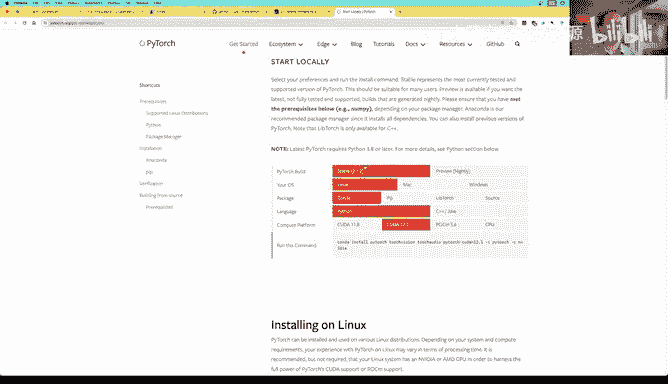

# GPU MODE《CUDA、GPU编程1-53课｜GPU MODE》中英字幕（deepseek-v3.2 - P3：-20240130-Lecture 3_ Getting Started With CUDA for Python Programmers.zh_en - GPT中英字幕课程资源 - BV1QZ421N7pT

Hi there。I'm Jeremy Howard from answer。 AI， and this is getting started with Kuda。

Kuda is of course what we use to program NVIDIdia GPUs if we want them to go super fast and we want maximum flexibility。

And it has a reputation of being very hard to get started with。

The truth is it's actually not so bad you just have to know some tricks and so in this video。

 I'm going to show you some of those tricks。😊，So let's switch to the screen and take a look。

So I'm going to be doing all of the work today in notebooks This might surprise you。

 you might be thinking that to do work with Kuda we have to do stuff with compilers and terminals and things like that and the truth is actually it turns out we really don't thanks to some magic that is provided by Pytorch you can follow along in all of these depth and I strongly suggest you do so in your own computer you can go to the。

Cuda mode organization in GithHub find the lecture 2 repo there and you'll see there is a lecture 3 folder this is lecture3 of the Kuda mode series you don't need to have seen any of the previous ones。

 however， to follow on。In the readmi there you'll see there's lecture 3 section and at the bottom there is a click to go to the coLB version Y you can run all of this in coLB for free。

 you don't even have to have a GPU available to run the whole thing。

We're going to be following along with some of the examples from this book programming massively parallel processes。

 programmingly programming massively parallel processes is a really great book to read and once you've completed today's lesson。

 you should be able to make a great start on this book。

 it goes into a lot more details about some of the things that we're going to cover on fairly quickly。

It's okay if you don't have the book， but if you want to go deeper。

 I strongly suggest you get it and in fact you'll see in the repo that lecture 2 in this series actually was a deep dive into chapters 1 to three of that book and so actually you might want to do lecture two confusingly enough after this one lecture three。

Um to get more details about some of what we're talking about。😊，Okay。

 so let's dive into the notebook。😊，So what we're going to be doing today is we're going to be doing a whole lot of stuff with plain old pietorrch first to make sure that we get all the ideas and then we will try to convert each of these things into Ka。

So in order to do this， we're going to start by importing a bunch of stuff in fact let's do all of this in CoLB。

😊，So here we are in CoLAab and you should make sure that you set in coLab your runtime to the T4 GPU。

 that's one you can use plenty of for free and it's easily good enough to run everything we're doing today。

And once you've got that running， we can import the libraries we're going to need and we can start on our first exercise。

 So the first exercise actually comes from chapter2 of the book。

And chapter 2 of the book teaches how to do this problem which is converting an RGB color picture into a grayscale picture。

 and it turns out that the recommended formula for this is to take 0。21 of the red pixel， 0。

72 of the green pixel， 0。07 of the blue pixel and add them up together。And that creates the。

Iuminance value which is what we're seeing here， so that's a common way kind of the standard way to go from RGB to grayscale so we're going to do this。

 we're going to make a kuder kernel。To do this。So the first thing we're going to need is a picture and anytime you need a picture I recommend going for a picture of a puppy so we've got here a URL to a picture of a puppy so we'll just go ahead and download it。

And then we can use torchvision。o to load that。So this is already part of coLab if you're interested in running stuff on your own machine or a server in the cloud。

 I'll show you how to set that up at the end of this lecture。

So let's read in the image and if we have a look at the shape of it it says it's 3 by 1066 by 1600。

 so I'm going to assume that you know the basics of pietorrch here if you don't know the basics of pietorrch I am a bit biased。

 but I highly recommend。My course， which covers exactly that， you can go to coursefat。

AI and you get the benefit also of having seeing some very cute bunnies and along with the very cute bunnies it basically takes you through all of whatever you need to be effective and effective practitioner of modern deep learning so finish part one。

 if you want to go right into those details， but even if you just do the first two or three lessons that will give you more than enough you need to know to understand this kind of code and these kinds of outputs。

So the signal we've done all that， so you'll see here we've got a rank3 tensor。😊，嗯。

There are three channels， so they're like the faces of a cube， if you like。

 there are 1066 rows on each face， so that's the height and then there are 16 columns in each row。

 so that's the width。So if we then look at the first couple of channels and the first three rows and the first four columns。

You can see here that these are。Unsigned8 bit integers so the bys and so here they are so that's what an image looks like hopefully you know all that already。

😊，So let's take a look at our image to do that， I'm just going to create a simple little function。

 show image。😊，That will create a matte lip plot， mat lip， lip plot。Ploot。

Remove the axes if it's color which this one is it'll change the order of the axes from channel by height by width。

 which is what Pytorrch uses to height by width by channel， which is what。

Matlo mat plot lid I'm having trouble today expects， so we changed the order of the axes to be one。

 two， zero。And then we can show the edge。Putting it on the CPU if necessary。

Now we're going to be working with this image in Python。

 which is going to be just pure Python to start with before we switch to Kuda that's going to be really slow so we'll resize it to have the smallest length。

😊，smallest dimension be 150。 So that's the height in this case。 So we end up with a 150 by 225 shape。

 which is。recectangle， which is 3，3750 pixels， each one with RG and B values and there is our puppy so see it wasn't a good idea to make this a puppy okay。

So。How do we convert that to grayscale， Well the book has told us the formula to use。

 go through every pixel and do that to it。Alright， so here is the。Lpe。

 we're going to go through every pixel。And do that to it。And stick that in the output。

 so that's the basic idea。 so what are the details of this？Well。

 here we've got channel by row by column， so how do we loop through every pixel？Well。

 first thing we need to know is how many pixels are there， so we can say channel by height by width。

Is the shape。 So now we' have defined those three variables。

 So the number of pixels is the height times the width。And so to look through all those pixels。😊。

An easy way to do them is to flatten them all out into a vector。😊。

Now what happens when you flatten them all out into a vector？Well， as we saw。

They're currently stored in this format where we've got one face and then another face。

 And then there's a， we haven't got it printed here。 but there's a third face where in each face。

 then there is。One row， we've just shown the first few and then the next row and then the next row。

 and then with each row， you've got column column column。So。Let's say we had a small。Image in which。

 in fact， we can do it like this。 We could say here's our red。 So we've got the pixels。Kind of zero。

 one，2。E。3， four， five。 so let's say this was a height to width3， three channel image。

So then there'll be。6，7，8。9，1011， R G B。12，13，14。15，16。 so let's say these are the pixels。

So when these are flattened out。😊，It's going to turn into a single vector。Just like， so。six，7，8。12。

13，14。So actually， when we talk about。An image。We initially see it as a bunch of pixels。

 We can think of it as having three channels。But in practice in our computer。

 the memory is all laid out。Lennially， everything has just an address in memory。

 It's just a whole bunch。 You can think of it as your computer's memory as one giant vector。

And so when we say。When we say flatten。Then what that's actually doing is it's turning our channel by height by width。

Into。A big factor like this。Okay， so now that we've done that。😊，We can say， all right。

 our the place we're going to be putting this into the result。

 we're going to start out with just an empty vector of length n。

We'll go through all of the n values from not to n minus1。And we're going to put in the output value。

29 ish times the input value。At。X， I。 so this will be here in the red bit and then 。

59 times X I plus n。 So N here。N here is this distance。 It's the number of pixels，1，2，3，4，5，6， see，1。

2，3，4，5，6。 So that's why to get to。Graen。We have to jump up to。I plus n。And then to get to blue。

We have to jump to。I plus two in。死。😊，And so that's how this works。

 we've flattened everything out and we're indexing into this flattened out thing directly。

And so at the end of that， we're going to have our gray curl is all done so we can then just reshape that into height by width。

😊，And there it is， there's our gray Sc puppy。And you can see here the flattened image。😊。

Is just a single vector with all those channel values flattened out as we described。Okay， now。

That is。Incredibly slow。 It's nearly two seconds。To do something with only 34000 pixels in。

 So to speed it up， we are going to want to use。Ka。How come Kuda is able to speed things up？Well。

 the reason Kuda is able to speed things up is because it is。Set up in a very different way to how。

A normal CPU is set up， and we can actually see that。嗯。

If we look at some of this information about what is in an RTX 3090 card， for example。

 now an RTX 3090 card is a fantastic GPU， you can get them secondhand， pretty good value。

 so a really good choice particularly for hobbyists。What is inside a 3090， it has 82 Ss。

 what's an SM and SM is a streaming multi processorces。

 so you can think of this as almost like a separate CPU in your computer。And so there's 82 of these。

 so that's already a lot more than you have CPUs in your computer。😊。

But then each one of these has 128 couda cores。 So these couda cores are all able to operate at the same time。

These multipros are all able to operate at the same time， so that gives us 128 times 82。10500。

Cud a cause in total that can all work at the same time。

So that's a lot more than any CPU we're familiar with can do。

And the 3090 isn't even at the very top end， it's really a very good GPU。

 but there are some with even more crude cause。So。How do we use them all Well。

 we need to be able to set up our code in such a way that we can say here is a piece of code that you can run on lots of different pieces of data。

 lots of different pieces of memory at the same time。So that you can do 10。

000 things at the same time。And so Kurda does this in a really simple and pretty elegant way。

Which is it basically says， okay， take out the kind of the the inner loop。 So here's our inner loop。

 The stuff where you can run 10000 of these at the same time。

 they're not going to influence each other at all。 So you see。

 these do not influence each other at all。 All they do is they stick something into some output memory。

So it doesn't even return something， you can't return something from these crudeer kernels as they're going to be called。

 all you can do is you can modify memory in such a way that you don't know what order they're going to run in。

 they could all run at the same time， some could run a little bit before another one。And so forth。

So the way that Kuda does this is it says， okay， write a function。And in your function。

 write a line of code， which I'm going to call as many dozens， hundreds， thousands。

 millions of times as necessary to do all the work that's needed and I'm going to do this in parallel for you as much as I can in the case of running under a 3090 up to 10。

000 times up to 10，000 things all at once。And I will get this done as fast as possible。

 so all you have to do is basically write the line of code you want to be called lots of times。😊。

And then the second thing you have to do is say how many times to call that code。😊。

And so what will happen is that piece of code called the kernel will be called for you。

 It'll be passed in whatever arguments you ask to be passed in。

 which in this case will be the input array， tensor， the output， tensor and。

Size of how many pixels in each channel。And it'll tell you， okay。

 this is the ice time I've called it。Now we can simulate that in Python very， very simply。😊。

A single followed。Now this doesn't happen in parallel。

 so it's not going to speed it up but the kind of results。

 the semantics are going to be identical to Kuda so here is a function we've called run kernel。

 we're going to pass it in a function we're going to say how many times you run the function and what arguments to call the function with and so each time it will call the function passing in the index。

 what time and the arguments that we've requested。Okay， so we can now create something to call that。

So let's get the just like before， get the channel number of channels heightened width the number of pixels。

 flatten it out， create the result tensor that we're going to put things in and this time rather than calling the loop directly we will call run kernel。

😊，We will pass in the name of the function。To be called as F。We will pass in the number of times。

 which is the number of pixels。For the loop， and we'll pass in the arguments。😊。

That are going to be required。Inside our kernel， so we're going to need out。 we're going to need x。

 and we're going to need n。So you can see here we're using no external libraries at all。😊，We have。诶。

Just plain python and a tiny bit of py torch just enough to create a tensor into index into tensors。

 and that's all that's being used。but。Conceptually。

 it's doing the same thing as a couda colonel would do。Nearly。

 and we'll get to the nearly in just a moment。But conceptually。

 you could see that you could now potentially。Write something which if you knew that this was running a bunch of things totally independently of each other conceptually。

 you could now trivial easily paralyse that， and that's what Kuda does。However。

 it's not quite that simple。😊，嗯。It does not simply create a single。

list of numbers like range n does in Python and pass each one in turn into your kernel。But instead。

It actually splits the range of numbers into what's called blocks。So in this case， you know。

 maybe there's like a thousand pixels we wanted to get through。

 it's going to group them into blocks of 256 at a time。😊，And so。In Python。

 it looks like this in in practice， a a k kernel runner is not a single fall loop that loops n times。

But instead， it is a。Pair of nested fos。So you don't just pass in a single number and say this is the number of pixels。

 but you pass in two numbers， number of blocks and the number of threads we'll get into that in a moment。

 but these are just numbers that just you can put any numbers you like here。

And if you choose two numbers that multiply to get。The thing that we want。

 which is the n times we want to call it， then this can do exactly the same thing。

Because we're now going to pass in which of the what's the index of the outer loop we're up to？

What's the index and the inner loop we're up to？How many things do we go through in the inner loop and therefore。

 inside the kernel， we can find out what index we're up to by multiplying。

The block index times the block dimension， so that is to say the I by the threads and add the inner loop index the J。

So that's what we pass in with the Ij threads， but inside the kernel we call it block index。

 thread index and block dimension So if you look at the coa book。

You'll see here this is exactly what they do， they say the index is equal to the block index times the block dimension plus the thread index。

There's a dotX thing here that we can ignore for now， we'll look at that in a moment。😊，Com。

But in practice， this is actually how。Kuda works。So it has all these blocks and inside there are threads。

 and you can just think of them as numbers。 you can see these blocks， they just have numbers，01。

 dot dot dot dot and so forth。Now that does mean something a little bit tricky， though， which is。

Well， the first thing I'll say is how do we pick these numbers。

 the number of blocks and the number of threads for now in practice。

 we're just always going to say the number of threads is 256。😊。

And that's a perfectly fine number to use as a default anyway you can't go too far wrong just always picking 256 nearly always so。

Don't worry about that too much for now optimizing that number。So if we say okay。

 we want to have 256 threads， so remember that's the inner loop or if we look inside our kernel runner here。

 that's our inner loop， so we're going to call each of this is going to be called 256 times so how many times do you have to call this。

Well， you're going to have to call it。N number of pixels divided by 256 times。

Now that might not be an integer， so you'll have to round that up， so ceiling。😊。

And so that's how we can calculate the number of blocks we need to make sure that our kernel is called enough times。

😊，Now we do have a problem though， which is that the number of times we would have liked to have called it。

Which previously was equal to the number of pixels。Might not be a multiple of 256。

 So we might end up going too far。 And so that's why we also need in our kernelel now。

 this if statement。And so this is making sure that the。Index that we're up to。

Does not go past the number of pixels we have， and this appears in basically every couder kernel you'll see and it's called the guard or the guard block。

So this is our guard to make sure we't go out of bounds。

So this is the same line of code we had before。😊，And now we've also just added this thing to calculate the index。

 and we've added the guard。 And this is like the pretty standard。First lines from any K kernelnel。

So we can now run those and they'll do exactly the same thing as before。

And so the obvious question is， well。Why， do who do kernels work in this weird block and thread way。

 why don't we just tell them？The number of times to run it。

 Why do we have to do it by blocks and the threads。

And the reason why is because of some of this detail that we've got here， which is that。

Coder sets things up for us so that everything in the same block or to say it more completely thread block。

 but it's the same block。They will all be given some shared memory。😊。

And they'll also all be given the opportunity to synchronize， which is just to basically say， okay。

 everything in this block has to。Get to this point before you can move on。

All of the threads in a block will be executed on the same streaming multiprocessor。

And soll we'll see later in later lectures but won't be taught by me that。By using blocks smartly。

 you can make your code run more quickly and the shared memory is particularly important。

 so shared memory is a little bit of memory in the GPU that all the threads in a block share and it's fast。

 it's super， super， super fasts。Now， when we say not very much， it's like on a 3090， it's 128k。😊。

So very small， so this is basically the same as a cache in a CPU。Um。The difference， though。

 is that on a CPU， you're not going to be manually deciding what goes into your cache， but on a GPU。

 you do。 It's all up to you。 So at the moment， this cache is not going to be used when we create。

Our coder code。Because we're just getting started and so we're not going to worry about that optimization。

 but to go fast， you want to use that cache and also you want to use the register file。

 something a lot of people don't realize is that there's actually quite a lot of register memory。

 even more register memory than shared memory So anyway。

 those are all things to worry about down the track not needed for getting started。

So how do we go about？😊，Using。Toer。There is a basically standard。Set up block。That I would add。

And we are going to add。And what happens in this setup block is we're going to set an environment variable。

 you wouldn't use this in kind of production or for going fast， but this says if you get an error。

 stop right away basically so wait you know wait to see how things go and then that way you can tell us exactly when an error occurs and where it happens so that slows things down but it's good for development。

😊，We're also going to install two modules， One is a build tool which is required by Ptorrch to compile your C++ Kuda code。

The second is a very handy little thing called Wleter and the only place you're going to see that used is in this line here where we load this extension called Wleter without this。

 anything you print from your couder code， in fact from your C++ code full stock won't appear in a notebook。

So you always want to do this in a notebook where you're doing staff in Cor so that you can use print statements to debug things。

Okay， so if you've got some kr code， how do you？😊，Use it from Python。

The answer is that playtorrch comes with a very handy thing。Callold load inline。

Which is inside torch。utils。cpp extension。Lowed inline。Is a marvelous。嗯。

Load inline is a marvelous function that you just pass in a list of any of the coer code strings that you want to compile。

 any of the plain C++ strings you want to compile any functions in that C++ you want to make available to Pytorch。

And it will go and compile it all， turn it into a Python module and make it available right away。

Which is。Pretty amazing。😊，I've just created a tiny little wrapper for that called load Ker just to streamline it a tiny bit。

😊，But behind the scenes， it's just going to call load in light。😊。

The other thing I've done is I've created a string that contains some。C++ code， I mean。

 this is all C code， I think。It's compiled as C++ code， we'll call it C++ code。U。

C++ code we want included in all of our coder files。嗯。

We need to include this header file to make sure that we can access Pytorch tensor stuff。

 we want to be able to use IO and we want to be able to check for exceptions。

And then I also define three macros。 The first macro just checks that a。Tensor is kuda。

 the second one checks that it's contiguous in memory because sometimes Pytorrch can actually split things up over different memory pieces。

 and then if we try to access that in this flattened out form， it won't work。

And then the where we're actually going to use it， check input。

 or'll just check both of those things。 So if something's not on ka and it's not contiguous。

 we a't going to be use able to use it。 so we always have this。

And then the third thing we do here is we define ceiling division ceilinging division is just。This。U。

Although you can implement implement it a different way like this。

 and so this will do ceiling division and so this is how were this is what we're going to call in order to figure out how many blocks we need。

So this is just you don't have to worry about the details of this' too much。

 it's just a standard setup we're going to use。😊，Okay， so now we need to write our kr kernel。😊。

Now how do you write the coder kernel？😊，Well， all I did。And I recommend you do。

Is take your python kernel。And。And paste it into chat EptT and say convert this to equivalent C code using the same names。

 formatting， etc where possible。Paste it in。And chat GT will do it for you。

And as you're very comfortable with C， which case just write it yourself is fine。 But this way。

 since you've already got the Python。😊，Why not just do this？U。It basically was pretty much perfect。

 I found。Although it did assume that these were floats。

 they're actually not floats I had to change a couple of data types。

 but basically I was able to use it almost as is。嗯。And so particularly， you know。

 for people who are much more Python programmers nowadays like me， this is a nice way to write。😊。

95% of the code you need。What else do we have to change Well， as we saw in our picture earlier。

 it's not called block IDX， it's called block idx。x。Block Dm dotx， thread idx。tx。

 so we have to add the dot x there。Other than that。If we compare。嗯。

So as you can see these two pieces of code look nearly identical。

 we've had to add data types to them， we've had to add semicos， we had to get rid of the colon。

We had to add curly brackets。That's about it。So it's not very different at all。

 So if you haven't done much see programming， yeah， don't worry about it too much because。You know。

 the truth is actually。It's not that different for this kind of calculation intensive work。

One thing we should talk about is this。😊，What's unsigned cast are？

This is just how you write youent8 in C。嗯。You can just。

 if you're not sure how to change a data type between the paytorrch spelling and the C spelling。

 you could ask chat EptT or you can Google it， but this is how you write bait。The star。In practice。

 it's basically how you say this is an array。 So this says that x is an array of。Bs。嗯。

It actually means it's a pointer， but pointers are treated， as you can see here， as a arrays by C。

So you don't really have to worry about the fact that's a pointer， it just means。

For us that it's an array。But in C， the only kind of arrays that it knows how to deal with are these one dimensional arrays。

 and that's why we always have to flatten things out。

We can't use multidimensional tensors really directly in these kudr kernels in this way。

So we're going to end up with these one dimensional cr arrays。Yeah， other than that。

 it's going to look exactly in fact， I mean， even because we did our python like that。

 it's going to look identical。😊，The void here just means it doesn't return anything。😊。

And then the Dunder Glo here is a special thing added by Coda。There's three things that can appear。

 and this simply says。What should I compile this to do and so you can put Dunder device and that means compile it so that you can only call it on the GPU。

You can say Dun Global and that says， okay， you can call it from the CPU or GPU and it'll run on the GPU。

Or you can write D hostst， which you don't have to。

 and that just means it's a normal CC++ program that runs on the CPU side。

So anytime we want to call something from the CPU side to run something on the GPU。

 which is basically almost always when we're doing kernels， you write。Dandander global。

So here we've got Denver Global， we've got our kernel。And that's it。

 So then we need the thing to call that kernel。😊，So earlier to call the kernel。

 we called this block kernel function passed in the kernel and passed in the blocks and threads and the arguments。

With Kuda， we don't have to use a special function。

 there is a weird special syntax built into kernel to do it for us to use the weird special syntax。

 you say， okay， what's the kernel， the function that I want to call？

And then you use these weird triple angle brackets。

 so the triple angle brackets is a special coa extension to the C+ plus language。And it means。

This is a kernel， please call it on the GPU。And between the triple angle brackets。

There's a number of things you can pass， but you have to pass at least the first two things。

 which is how many blocks？How many threads？So how many blocks， ceiling division。

 number of pixels divided by threads？And how many threads？As we said before。

 let's just pick 256 all the time and not worry about it。

So that says call this function as a GPU kernel and then passing in these arguments。

 we have to pass in our input tensor。Our output tensor and how many pixels。

And you'll see that for each of these tensors， we have to use a special method do data pointer。

 and that's going to convert it into a C pointer to the tensor。

 so that's why by the time it arrives in our kernel it's a C pointer。

You also have to tell it what data type you want to be treated as， it says treated as UNates。

So that's， this is a C plus plus。Template parameter here， and this is a。Method。

The other thing in need to know is in C plus plus dot means call a method of an object。

Where elsese colon colon is basically like in C is Python calling a method of a class。

 So you don't say torch dot empty， you say torch colon colon empty to create our output whereas else back when we did it in Python。

 we said torch dot empty。Also in Python。😊，Oh， okay， so in Python that's right。

 we just created an length and vector and then did dot view， it doesn't really matter how we do it。

 but in this case we actually created a two dimensional tensor。

By passing we passing in this thing in curly brackets here this is called a C double plus list initializer and it's just basically a little list containing height comm width。

 so this tells it to create a twodimensional matrix which is why we don't need dot view at the end we could have done it the dot view away as well probably be better to keep it consistent。

 but this is what I wrote at the time。The other interesting thing when we create the output。😊。

I if you pass in input do options， so this is our input tensor that just says， oh。

 use the same data type and the same device Kuda device as our input has。

 this is a nice really convenient way which I don't even think we have in Python to say make sure that this is the same data type in the same device。

If you say auto here， this is quite convenient， you don't have to specify what type this is。

 we could have written torch colon colon tensor， but by writing auto。

 it just says figure it out yourself。Which is another convenient little C++ thing。

After we call the kernel， if there's an error in it， we won't necessarily get told。

 so to tell it to check for an error， you have to write this。

This is a macro that's again provided by Pytorrch the details don't matter you should just always call it after you call a kernel to make sure it works and then you can return。

The tensor that you allocated， and then you passed as a。嗯。😊，Pointter and then that you've filled in。

Okay， now。As well as the kuda source you also need C+ plus source and the C+ plus source is just something that says here is a list of all of the details of the functions that I want you to make available to the outside world in this case Python and so this is basically your header effectively。

 so you can just copy and paste。The full line here from your function definition and stick a semicolon on the end。

 So that's something you can always do。And so then we call our load coder function that we looked at earlier。

 plus in the Kr source code， the C++ source code， and then a list of the names of the functions that are defined there that you want to make available to Python。

 so we just have one which is the RGB to G code function。And believe it or not。

 that's all you have to do。 This will automatically。

 and you can see it running in the background now， compiling。😊，With her hugely long thing。

Our files from so it's created a main dot cP for us。And it's going to put it into a main dot0 for us。

And compile everything up， link it all together。And create a module。

 and you can see here we then take that module that's been passed back and put it into a variable。

Quote module， and then when it's done， it will load that module。😊。

And if we look inside the module that we just created。

 you'll see now that apart from the normal auto generated stuff Python adds。

 it's got a function in it。Actually beta Gsco。Okay， so that's amazing。

 We now have a coa function that's been made available from Python。

 and we can even see if we want to， this is where it put it all。😊，So， we can。Have a look。

And there it is， you can see it's created a main dot CPP， it's compileed into a main dot O。

 it's created a library that we can load up， it's created a code file， it's created a build script。

And we could have a look at that boilil script if we wanted to。And there it is。

 So none of this matters too much。 It's just nice to know that playtorrch is doing all this stuff for us。

 And we don't have to worry about it。😊，So that's pretty cool。So in order to。😊，Pass a tensor to this。

 We're going to be checking that it's contticiguous and on ka。 So we better make sure it is。

 So we're going to create an image C variable， which is the image。

Made it contiguous and put on with a coer device。And now we can actually run this on the full sized image。

 not on the tiny， little minid image we created before。 this has got much more pixels。 It's got 1。

7 million pixels else before we had， I think it was 3500034000。😊。

And it's gone down from one and a half seconds to one millisecond。So that is。Amazing。

 it's dramatically faster both because it's now running in compiled code and because it's running on the GPU。

😊，嗯。The step of putting the data onto the GPU is not part of what we timed。

 and that's probably fair enough because normally you do that once and then you run a whole lot of coer things on it。

We have though included the step of moving it off the GPU and putting it onto the CPU as part of what we're timing。

 and one key reason for that is that if we didn't do that。

It can actually run our Python code at the same time that the kudr code is still running and so the amount of time shown could be dramatically less because it hasn't finished synchronizing。

 so by adding this it forces it to complete the cor run and to put the data onto back onto the CPU。

U that kind of synchronization， you can also trigger just by printing a value from it。

 or you can synchronize it manually。So after we've done that and we can have a look and we should get exactly the same gray scale puppy。

😊，Okay， so we have successfully created our first。Real working called from Python Kuder Kennel。嗯。

This approach of riding it in Python。And then， converting it to Kuda。Its。Not particularly common。

But I'm not just doing it as an educational exercise， that's how I like to write my kuda kernels。

At least as much of it as I can， because it's much easier to debug in Python。

It's much easier to see exactly what's going on。U。And so， and I don't have to worry about compiling。

 It takes about 45 or 50 seconds to compile even now simple example here。

 I can just run it straight away。 And once it's working to convert that into C。 As I mentioned。

 you know， Chaty pig tea can do most of it for us。 So I think this is actually a fantastically good way of writing couder kernels。

 even as you start to get somewhat familiar with。😊。

With them because it lets you debug and develop much more quickly。

A lot of people avoid writing Kuda just because that process is so painful and so here's a way that we can make that process less painful so let's do it again and this time we're going to do it to implement something very important。

 which is matrix modification。So matrix modification， as you probably know。

 is fundamentally critical for for deep learning， it's like the most basic linear algebra operation we have and the way it works is that you have a。

Input matrix M and a second input matrix N， and we go through every row of M。

So we go through every row of M。 to we get to here we add up to this one and every column of n。

 here we are up to this one。 And then we take the dot product at each point of。

That row with that column and this here is the dot product of those two things。

And that is what matrix multiplication is。So it's a very。😊，Simple operation， conceptually。

And it's one that we do。Many， many， many times in deep learning and basically every deep learning。

Every neural network has this as its most fundamental operation。

Of course we don't actually need to implement matrix modificationplication from scratch because it's done for us in libraries。

 but we'll often do things where we have to kind of fuse in some kind of matrix modificationplication like pieces and you know and of course it's also just a good exercise。

😊，So let's take a look at how to do matrix modificationplication， first of all， in pure Python。

So in the。Actually， in the first day I course that I mentioned。

 there's a very complete in depth dive into matrix modificationplication in part two。

 lesson 11 where we spend like an hour or two talking about nothing but matrix modificationplication。

 we're not going to go into it in that much detail here。

 but what we do do in that is we use the MN data set to。To do this。

 and so we're going to do the same thing here， we're going to grab the MNIS data set of handwritten digits。

And they are 28 by 28 digits， they look like this。😊，28 by 28 is 784。

 so to do a you know to basically do a single layer of a neural net or without the activation function。

 we would do a matrix modificationplication of the image flattened out by a weight matrix with 784。

Rose and however many columns we like and I'm going to need if we're going to go straight to the output。

 So this would be a linear function， a linear model we'd have 10 layers one for each digit。

 So here's this is our weights。 we're not actually going to do any learning here。

 This is just not any deep learning or logistic regression learning This is just for an example。Okay。

 so we've got our weights。😊，And we've got our input， our input data。Next train and X ball。

And so we're going to start off by implementing this in Python。Now， again， Plaython's really slow。

 so let's make this smaller， so matrix 1 will just be five rows。 matrixtri 2 will be all the weights。

So that's going to be a。5 by 784 matrix multiplied by a 784 by 10 matrix。Now these two have to match。

Of course， they have to match because otherwise， this dot product。😊，Won't work。

 those two are going to have to match the row by the column。Okay， so let's pull that out into a rows。

 a columns， B rows， B columns。And obviously a columns and B rows are the things that have to match。

 and then the output will be a rows by B columns。So，5 by 10。So let's create an output。

Flllow zeros with rows by columns in it。And so now we can go ahead and go through every row of a。

 every column of B， and do the dot product， which involves going through every item in the innermost dimension。

 or 784 of them， multiplying together the equivalent things from M1 and M2 and summing them up。

Into the output。Tsor that we created。So that's going to give us， as we said， a five by 10。

5 by 10 output。And here it is。 Okay， so this is how I always create things in Python。

 I basically almost never have to debug。 I almost never have like。

Errors unexpected errors in my code because I've written every single line one step at a time in Python I've checked them all as I go and then I copy all the cells and merged them together sticker function and head it on like so and so here is mapMll so this is exactly the code we've already seen。

And we can call it。And we'll see that for 39200。Inammost。Operations。诶。We took us about a second。

So that's。Pretty slow。Okay。So now that we've done that。

 you might not be surprised to hear that we now need to do the innermost loop as a kernel call in such a way that it can be run in parallel。

Now in this case， the innermost loop。Is not this line of code。It's actually this line of code。

 I mean， we can choose to be whatever we want it to be。 But in this case。

 this is how we're going to do it。 We're going to say for every pixel。

 we're not we every pixel for every。Sell in the output tensor like this one here is going to be one co of thread。

 So one coer thread is going to do the dot product。So。This is the bit that does the dot product。

 So that'll be our kernel。 So we can write that。Matmo。Block cannel。It's going to contain。That okay。

 so that's exactly the same thing that we just copied from above。

And so now we're going to need a something to run。Um， this kernel。

And you might not be surprised to hear that in Kuda。

 we are going to call this using blocks and threads。

 but something that's rather handy in Kuda is that the blocks and threads don't have to be just a 1D vector it can be a 2D or even 3D tensor。

 So in this case you can see we've got。1an。To。😔，It's a little hard to see exactly where they stop。2。

😔，3e。f。😔，Ps。And so then。For each block。And that's kind of in one dimension and then there's also one。

To。3，4，5。Blocks in the other dimension。嗯。And so each of these blocks has an index。 So this one here。

Is gonna be。0，0， a little bit hard to see。 This one here is going to be。1，3， and so forth。

 And this one over here is going to be。3，4。嗯。So。Rather than just having a。Integer block index。

 we're going have a tuple。Block index。And then， within a block。There's going to be。The pick。

 let's say this exact。Spot here。Didn't do that very well。 There's going to be a thread index。

 And again， the thread index won't be a single index into a vector。 It'll be a to be two elements。

So in this case， it would be 0，1，2，3，4，5，6。Rose down。And0， one， two， three， four， five， six， seven。

 eight， nine，10。😔，So 11， 12， I can't count 12， maybe across。😊。

So the this here is actually going to be defined by two things， one is by the block。And so the block。

Is。3， comma 4。And the thread。Hiss6 come at 12。So that's how。

Kuda lets us index into two dimensional grids。Using blocks and threads， we don't have to。

 It's just a convenience if we want to。And in fact， we can use up to three dimensions。

So to create our。Colonel runner， now， rather than just having。

So rather than just having two nested loops for blocks and threads。

 we're going to have to have two lots of two nested loops for our。

Both of our X and Y blocks and threads or our rows and columns， blocks and threads。

So it ends up looking a bit messy。😊，Because we now have four nested for loops。

So we'll go through our blocks on the y axis and then through our blocks on the X axis and then through our threads on the y axis and then through our threads on the X axis。

 And so what that means is that for。You can think of this Cartesian product as being for each block。

For H thread。Now to get the dot Y and the dot X we'll use this handy little Python standard library thing called simple namespace。

 I'd use that so much I just given an NSs name because I use namespaces all the time in my quick and dirty code。

So we go through all those four， we then call our kernel。

And we pass in an object containing the Y and X coordinates。And that's going be our。

Block and we also pass in our thread， which is an object with a y。And X coordinates of our thread。

And it's going to eventually do all possible blocks and all possible threads numbers for each of those blocks。

And we also need to tell it how big is each block， how high and how wide， and so that's what this is。

 this is going to be a simple namespace and object with an X and Y， as you can see。

So we need to know how big they are， just like earlier on。😊，We had to know。The block dimension。

 and that's why we passed in threats。So remember， this is all。😊，Pure pietorrch。

 we're not actually calling any out to any kuddo， we're not calling out to any libraries other than just a tiny bit of pietorrch for the indexing and tensor creation so you can run all of this by hand。

 make sure you understand you can put it in the debugger， you can step through it。嗯。

And so it's going to call our function， so here's our matrix modification function。

 as we said it's a kernel that contains the dot product that we wrote earlier。

So now the guard is going to have to check that the row number we're up to is not taller than we have and the column number we're up to is not wider than we have and we also need to know what row number we're up to and this is exactly the same actually I should say the column is exactly the same as we've seen before and in fact you might remember in the couda we have block IDx dot x and this is y right because in Kuda it's always。

Gives you these three dimensional。Dim 3。Sts so you have to put this dot x so we can find out the column this way and then we can find out the row by seeing how many blocks have we gone through。

 how big is each block in the Y axis and how many threads have we gone through in the Y axis。

So which what road number are we up to， what column number are we up to。

 is that inside the bounds of our？嗯。Of our tensor， if not， then just stop and then other ways。

Do our dot product and put it into our output tensor。So that's all pure Python。

 and so now we can call it by getting the height and width of our first input。

The height and width of our second input， and so then K and K2， the inner dimensions ought to match。

We can then create our output。And so now threads per block。😊，Is not just the number 2，56。

 but it's a pair of numbers。 It's an X and a Y。 And we've selected two numbers that multiply together to create 256。

 So again， this is a reasonable choice。 if you've got。Two dimensional inputs。

Just spread it out nicely。One thing to be aware of here is that。Your threads per block。😮。

Can't be bigger than 1024 so we're using 256 which is safe right and notice that you have to multiply these together 16 times 16 is going to be the number of threads per block so these are safe numbers to use。

You're not going to run out of blocks， though。😊，Two to the 31 is the number of maximum blocks for dimension zero and then two to the 16 for dimensions one and 2。

 I think it's actually minus one， but no worry about that。So don't have too many ten threads。

 but you can have lots of blockss。But of course， each symmetric model processor is going to run all of these on the same device and they're also going to have access to shared memory。

 so that's why that you use a few threads per block。So our blocks， the X。

 we're going to use the ceiling division。So why we're going to use the same ceiling division。

 So if any of this is unfamiliar go back to our earlier example because the codes all copied from there and now we can call our 2D block kernel runner passing in the kernel。

 the number of blocks， the number of threads per block。Our input matrices flattened out。

 our output matrix flattened out and the dimensions that it needs。Because they get all used here。

And return the result。And so， if we call that。Maap Mole with a 2D block and we can check that they are close to what we got in our original manual loops and of course they are because it's running the same code。

So。Now that we've done that， we can do the couder version。😊，Now。

 the k version is going to be so much faster。 We do not need to。Use this slimmed down matrix anymore。

 we can use the whole thing。 so to check that it's correct。

 I want a fast CPU based approach that I can compare to。嗯。So previously。

 it took about a second to do 39，000 elements。嗯。So I'm not going to explain how this works。

 but I'm going to use a broadcasting approach to get a fast CPU based approach if you check the fast AI course we teach you how to do this broadcasting approach。

 but it's a pure Python approach which manages to do it all in a single loop rather than three nested loops。

It gives the same answer for the cut down tenses。嗯。But。Much faster， only four milliseconds。

So it's fast enough。That we can now。Run it on the whole input matrices， and it takes about 1。

3 seconds。 and so this broadcast optimized version， as you can see。

 it's much faster and now we've got 392 million。呃。Additions going on in the middle of our three loops。

 effectively three loops， but we're broadcasting them。 So this is much faster。

 But the reason I'm really doing this is so that we can store。

Deaths result to compare to so that makes sure that our crude diversion is correct。Okay。

 so how do we con convert this to Kuda？You might not be surprised to hear that what I did was I grabbed this function and I passed it over to Cha EptT and said。

 please rewrite this in C。And it gave me something basically that I could use。First time。

And here it is。This time I don't have unsigned carstar， I have floatstar。嗯。That isn't that。

This looks almost exactly like the Python we had with exactly the same changes we saw before。

 we've now got the dot Y and dot x versions。Once again， we've got D Global， which says。

 please run this on the GPU when we call it from the CPU。So the the kernel。

 I don't think there's anything to talk about there。😊。

And then the thing that calls the kernel Memo is going to be passed in two tenseors。

We're going to check that they're both contiguous and check that they are on the coer device。

We'll grab the height and width of the first and second tensors。 We're going to grab the。

In a dimension， we'll make sure that the inner dimensions of the two matrices match just like before。

 And this is how you do an assertion in P torch coder code you call torch check passing thing to check passing the message to pop up if there's a problem。

 So these are a really good thing to to。Spread around all through your coer code to make sure that everything is as you thought it was going to be。

Just like before， we created an output。So now when we create our number of threads。

 we don't say threads is 256， we instead say。This is a special thing provided by Kudafors Di3。

 so this is a basically a tuple with three elements。

 so we're going to create a dim3 called TPB it's going to be 16 by 16 now I said it has three elements whereas the third one but that's okay it just treats the third one as being one so it just we can ignore it。

So that's a number of threads per block。And then how many blocks will there be， well。

 in the x dimension， it'll be W divided by x。Sealing division in the Y dimension。

 it will be H divided OY C division and ceiling division， and so that's the number of blocks we have。

So just like before， we call our kernel just by calling it like a normal function。

 but then we add this weird triple angle bracket thing。

Telling it how many blocks and how many threads。 So these aren't ints anymore。

 These are now dim3 structures。And that's what we use these dim3 structures。 and in fact。

 even before。What actually happened behind the scenes when we did the grayscale thing？

Hiss even though we passed in。256， instance， we actually ended up with a D3 structure and just in which case the second the index 1 and2 or the dot x and dot y and dot Z values which are set to one automatically。

So we've actually already used a D3 structure without quite realizing it。And then just like before。

 pass in all of the tensors we want。Casing them to pointers， maybe they're not just casting。

 converting them to pointers。Through some particular data type and passing in any other information that our function will need。

 that kernel will need。Okay， so then we call。Load Kuda again， and that'll compile this into a module。

Make sure that they're both contiguous and on the coer device。And then after we call module。mmo。

 placing those in， putting on the CPU。And checking that they're all close and it says yes they are。

 so this is now running not on just the first five rows but on the entire MNIS data and on the entire MNIS data set using a optimized CPU approach。

 it took 1。3 seconds。Using Kuda， it takes6 milliseconds。So that is quite a big improvement。嗯。Cool。

 yeah， the other thing I will mention， of course， is Ptorrch can do a matrix modification for us just by using at。

😊，How long does and obviously gives the same answer？How long does that take to run？

That takes2 milliseconds。So。Three times faster。And in many situations it'll be much more than three times faster So why are we still pretty slow compared to pytorrch。

 I mean， this isn't bad to do 392 million of these calculations in 6 milliseconds。

 but if Pytorrch can do it so much faster， what are they doing？Well， the trick is。

That they are taking advantage， in particular， of this shared memory。

So shared memory is a small memory space that is shared amongst the threads in the block and it is much faster than global memory。

In our matrix model location， when we have one of these blocks。😊。

And so it's going to do one block at a time all in the same S。

It's going to be reusing the same the 16 by 16 block。

 it's going to be using the same 16 rows and columns again and again and again each time with access to the same shared memory so you can see how you could really potentially cache the information。

 a lot of the information you need and reuse it rather than going back to the slower memory again and again。

So this is an example of the kinds of things that you could optimize potentially once you get to that point。

嗯。The only other thing that I wanted to mention here。Is that this 2D block idea is totally optional。

 You can do everything with 1D blocks or with 2D blocks or with 3D blocks and threads。

 And just to show that I've actually got an example at the end here。Which converts RGB。To gray scale。

 using the。2D blocks because remember earlier when we did this， it was with 1D blocks。

It gives exactly the same result。😊，And if we compare the code。So if we compare the code。

 the version actually that was done with a 1D。Threads and blocks is quite a bit shorter than the version that uses 2D threads and blocks。

 And so in this case， even as though we're manipulating pixels where you might think that using the 2D approach would be neater and more convenient in this particular case it wasn't really I mean it's still pretty simple code that we have to deal with the columns and rows dot X dot Y separately。

 the guards a little bit more complex， we have to find out what index we're actually up to here。

Where else this kernel， we just it was just much more direct。

 just two lines of code and then calling the kernel you know again。

 it's a little bit more complex with the threads per block stuff rather than this。

 But the key thing I wanted to point out is that these two pieces of code do exactly the same thing。

 So don't feel like if you。Don't want to use a 2D or 3D block thread structure。 you don't have to。

 you can just use a 1D one。 The 2D stuff is only there if it's convenient for you to use and you want to use it don't feel like you have to。

So yeah， I think that's basically like。All the key things that I wanted to show you all today。

 the main thing I hope you take from this is that even for Python programmers for data scientists。

It's not。Way outside our comfort zone。 You know， we can write these things in Python。

 We can convert them pretty much automatically。 We end up with code that doesn't look。You know。

 it looks reasonably familiar， even though it's now in a different language。

 we can do everything inside notebooks， we can test everything as we go。

 we can print things from our kernels and so you know it's it's，Hopefully feeling a little bit less。

嗯。Beyond our capabilities and than we might have previously imagined。U。So I'd say， yeah， you know。

 go for it， I think it's also like I think it's increasingly important to be able to write Kuda code nowadays because for things like flash attention or for things like quantization。

 GPTQ， AWQ， bits and bytes。These are all things you can't write in Pytororch。

 you know our models are getting more sophisticated the kind of assumptions that libraries like Pytorch make about what we want to do you know increasingly less and less accurate so we're having to do more and more of this stuff ourselves nowadays in Kuda。

And so I think it's a really valuable。Capability to have。

Now the other thing I'll mention is we did it all in CoLB today。But we。

Can also do things on our own machines if you have a GPU or on a cloud machine and getting set up for this again。

 it's。Much less complicated than you might expect。 And in fact， I can show you， it's basically like。

Four lines of code or four lines or three or four lines of batchsh script to get it all set up。

 it'll run on Windows， itll under WSL， it'll also run on Linux。

 course Mac stuff doesn't really work on。Curer stuff doesn't really work on Mac and not a Mac。

 if you actually， I'll put the。I'll put a link to this into the video notes。

 but for now I'm just going to jump to a Twitter thread where I wrote this all down。嗯。

Now to show you all the steps so the way to do it is to use something called Conda Conda is something that very。

 very， very few people understand a lot of people think it's like a replacement for like pit or poetry or something it's not it's better to think of it as a replacement for Docker you can literally have multiple different versions of Python。

 multiple different versions of Kuda multiple different C+ plus compilation systems all in parallel at the same time on your machine and switch between them you can only do this with Conda and everything just works right so you don't have to worry about all the confusing stuff around dot run files or uubbutu packages or anything like that you can do everything with just Conda。

You need to install condo。😊，嗯。I've actually got a script which you just run the script。

 it's a tiny script as you see if you just run the script。

 it'll automatically figure out which minicon you need。

 it'll automatically figure out what show you're on and it'll just go ahead and download it and install it for you。

😊，Okay， so run that script， restart your terminal now you've got。Ka。

Step two is find out what version of Ka pitorrch wants you to have， So if I click Linuxux Conda。

Kuda 12。1 is the latest。

So then step three is run。This。Shell command replacing 12。

1 with whatever the current version of Ptorrches， its actually still 12。1 for me at this point。嗯。

And that will install everything all the stuff you need to profile， debug， build， etca。

 all the NVIDdia tools you need the full suite will all be installed and it's coming directly from NviIDdia so you'll have like the proper versions as I said you can have multiple versions it's stored at once in different environments。

 no problem at all。And then finally， install Pytorch。And this command here will install ptorrch。

 for some reason， I wrote nightly here。 You don't need the nightly。 So just remove desk nightly。

 So this will install the latest version of ptorrch using the nvi coder stuff that you just installed。

If you've used Conda before and it was really slow， that's because it used to use a different solver。

 which was thousands or tens of thousands of times slower than the modern one just just being added and made default in the last couple of months。

So nowadays， this should all run very fast。 And as I said， it'll run under WSL on Windows。

 It'll run on。Y bantu， it'll run on feddoa， it'll run on Debian， it'll all just。Work。

So that's how I strongly recommend getting yourself。

Set up for local development you don't need to worry about using Docker as I said you can switch between different coer versions。

 different python versions， different compilers and so forth without having to worry about any of the Docker stuff and it's also efficient enough that if you've got the same libraries and so forth installed in multiple environments itll hardle them so it won't even use additional hard drive space so it's also very efficient。

Great， so that's how you can get started on your own machine or on the cloud or whatever。

 so hopefully you'll find that helpful as well。😊，All right， thanks very much for watching。

 I hope you found this useful and I look forward to hearing about what you create with。😊。

Couda in terms of going to the next steps， check out the other coa mode lectures I will link to them and I would also recommend trying out some projects of your own so for example you could try to implement something like for bit quantization or flash attention or anything like that now those are kind of pretty big projects but you can try to break them up into smaller things you build up one step at a time。

And， of course， look at other people's code。 So look， look at the implementation of。Flash attention。

 look at the implementation of bits and bytes。 look at the implementation of GTQ and so forth。

 the more time you spend reading other people's code， the better。All right。

 I hope you found this useful and thank you very much for watching。😊。

