# GPU MODE《CUDA、GPU编程1-53课｜GPU MODE》中英字幕（deepseek-v3.2 - P40：-20241124-Lecture 37_ Introduction to SASS & GPU Microarchitecture.zh_en - GPT中英字幕课程资源 - BV1QZ421N7pT

Cloud。

Okay， wonderful。 hellello everyone， welcome to another episode of the GPU mode。

 Today I'm really thrilled to invite Arund demar So a lot of y'all might recognize Aon as one of the core developers via LMC。

 He's been someone who I see like regularly helping out people like in various channels and someone like it knows like a lot about GPUs I think this is our lowest level talk yet like basically Arun' is going be talking about SaS and GPU market microarchitecture Sooon without further ado please take it from here。

😊，Thank you Yeah， I guess in terms of background as well before I worked on NC other open source projects。

 I was a GP architect at imagination and shortly for about two years at Apple so I've worked on solar processors from both software and hardware sites and my background kind of Dev makes me very curious to go as deep as Apple can and try to actually figure out oh it works and hopefully this will help some people to do better optimization as well。

I think the first kind of thing I need to clear out is when people think about SAS and GPU assembly。

 you might assume you're going to run to write GP assemblymb directly。

 but actually it turns out that so，And ironically H100 is one of the onion via GPUs without a fully working open source Asler like you can use Q asmbr it kind of works but it doesn't actually support everything and no one's ever thoughtked it to fix all the issues so actually you cannot write fully custom SAs out of the box without only open source programs。

So what's the point of studying it if you cannot actually change it。

 what's the point of actually knowing how it works， if you have no actual direct control of it。

 and I kind of look at it as the same way as why would you want to know your own DNA and like， oh。

 it helps you diagnose disease and then hopefully get better treatments。

So I really like this chart from Philip Tle's presentation is the creator of Triton about how effectively until you put in a large amount of time which is put time in terms of training yourself and in terms of optimizing the kernels actually an eyelel language like Triton will be higher performance and then at some point once you put in of effort again。

 all depending on the complexity of the kernel， you'll end up beating Triton and if you do pass you could theoretically do even better but at a much。

 much higher cost to get there， I think like the exact shape of the graphic isn in the way would think about it especially because the bigger problem is you kind of at the bars there at the very bottom for longer because it takes longer to get anything at any level of performance working you have to be functionally correct。

But I think that's kind of the wrong way to think about it actually what you want to do is you want to understand the hardware and understand the assembly so that you can optimize what you've got in eyelevel frameworks like Triton and QA so that you can then write better QA or better Triton and if you look at only what's in the PMNPP programming massively parallel processorors book。

It's actually not really enough to be Triton in some cases， like for example。

 it doesn't even really talk about vector loads and lots of hardware details that NVA does talk about in GTC presentations。

 so if you only using what's in the PNPP given the fact that Triton does of optimization automatically you will probably fail at even achieving as eye performance as those eyelevel kernels which is partly why I think like unslaught Le and loads of other things that a really amazing job in terms of improving GPU performance are all based on Triton but there's still an opportunity to do even better Port of custom Gder kernelds and while also compiler engineers improving all of this and so you just need to effectively change the right way you at QA and change way you profile to then improve performance。

So this is kind of an aside， but I think it's really important the way I think about performance is what you actually get about de iteration time and。

😊，As part of that， if you do a very long training run that takes two months。

 that is part of your iteration time and something that's happened recently as really interesting is model general generalGBT and that they've meant to speed run effectively training GeneralGBT to a certain level of quality in only five minutes。

I feel like that's a good example of iterating at eye levell with Pyths being much more efficient than using QudA if we had to write all those kernels and all the experiments they did in QudA I would have taken forever on the other hand once you do a longer training run potentially that changes and ironically right now from the data I've seen torch compile takes longer than the speed run itself like from scratch I think they said it's 10 minutes and with cache it' like five minutes so about the same time as the speed on itself。

嗯。😊，I kind of just want to allow that you have to be very careful not to do low level optimization before you've done other ones。

On the other hand。Like if it does。😡，At a certain scale， you will actually get significant benefits。

And hopefully lots of optimizations are not that art， you just need to know they possible。😊。

Fal tension is a good example of like optimizing algorithm big O complexity before you do low level optimization and then you do things like flash attention three to kind of get the absolute maximum of that better algorithm。

The， so。I feel like at the point where you're doing like absolutely gigantic clusters。

 like thinking about ON is kind of wrong metric because effectively everyone has already optimized that and everyone is using the best groups that we know of。

And it's kind of about potentially squeezing that last1，10， maybe 20%。

 probably more like 1% in many cases， but even that can be worthwhile。

 and so I kind of want to introduce auto metric rather than ON。

 which I call ONR optimization per nuclear reactor。

 and if you look at the scale of these clusters and in the size of SMR， which is about  50 megawatts。

 you do end up with a reasonable percentage of the cost of a nuclear reactor in terms of power efficiency by just optimizing by 1%。

Actually though it's much more than that。 So NV is not just selling GPs for one cluster。

 they're selling GPUs for well， many， many， many large clusters。

 and if you do some gen style CEO mats， you end up with about 5 million GP to Android equivalent of its lifetime at a very conservative minimum assuming they be the forecast and you end up with 10 gigabats of power。

 that means that 1% of performance per wat where you actually reduce the power。

 and increase performance so that you have 1% higher performance at the same power as before or same performance1% power less is equivalent to two small nuclear reactors。

Now， in the end， I personally don't care as much about that about just the fact that it's fun。😊。

And I feel like it's obviously worth knowing just because if you're going to work on this kind of thing。

 you will feel much more satisfaction when you actually understand the details。On the other。

 and sometimes it is very frustrating and it's very easy to underestimate or complicated what an aization is and go are is to get to the speed of lines。

😊，So this presentation isn't going to focus in TSaCo。

 it's not going to focus on both 8100 specific things。

 I will have a bunch of live demos which some of which are well prepared some of which are not we'll kind of see what we do on time for lots of these things。

嗯。So this slide I put in the Triton channelnnel earlier to changeity check if it's correct。

 I don't think anyone replied so I'm going to na assume that it is correct for a Triton Part and MLR sites so what I'm trying to show here is that there's lots of different ways that。

PTx gets generated as part of machine learning。Frameworks。And NVCC being the main one for QudA。

 but NVCC isn't actually used for Triton。And potentially for QlaA it's custom PTX in certain cases and so on。

 however it all passes through PTx， which is the optimizing backend compiler and it does a lot of optimizations actually so you cannot just look at PTX and assume that it's really relevant for performance it's an important thing you need to look at but I would personally I typically look at PTX after SAS like in order to understand why SAS is a certain way if it's not obvious to me from the Quda。

Might be different for Triton， but。The other thing I wanted to highlight is there are actually other ways to generate SA there are loads of open source asembls and I'll put that in the next slide and there's NVK which is quite interesting because in the past open source and video drivers where want to put it mild kind of terrible NVK is actually really good and they've managed to make their own fully custom welcome compliant backend compiler that generates ads completely from scratch with no code from Nvi and this is kind of an interesting reference for some of the lowerle details you can look to the chat logs of the RC channels and just like the codes and so on in order to understand some of the very final details if you really want obviously that doesn't tell you everything because the driver sometimes doesn't even need to know about the way the other works but it's an interesting other source of information。

So just this is just a list of the different assembs， Q asmbers have the most modern and recent one。

 but unfortunately it's not been maintained either MaxA， Pascode grayray is the most well known one。

 I think people do tend to overestimate or correct it still is。So。For example。

 so one thing I'm not going to touch in this presentation is to reuse registeror flags in the SAS because of I've got patents and that topic and other things。

 so I have talk about it but I know as a matter of fact that everything in Maxwell has been kind of bit inverter and similarly because no one's done that level of analysis since then I have noticed some things which are just kind of sly wrong。

A few other interesting projects is NVRaOva， which I'll go to afterwards again。

 document SA and NV bits， I think except for NVISAOva won't we have the time to go into those today。

So this site is kind of a very eyelevel view of all the different Ndia GPU generations and it's a lot and as the next slide shows actually you probably only have to care about upper and AA which is one kind of family and the instruction center has we made quite constant since Valta like well there's been loads of change。

 loads of improvement but the eye level it's still quite similar。😊，So。

I think the amount of diversity and complexity in GPU instruction set is really interesting。

 And for example， I don't know many people realized that the original G in 206 was kind of the very firstq GPU in some ways was really quite a disk instruction set like complex instruction word like X6 it didnt not in old ways。

 but for example， shared memory loads and stores were part of the instruction and these things kind of evolved over time。

 and the reason I mentioned that is the interesting change in upper that it finally got rid of as far as I can tell at least as far as the compiler users it finally got rid of。

Constant memory accesses as part of the instruction which I'll touch on later and that kind of makes it more risk but again compared to everything else that goes on in the instruction sets like risk versus case is like kind of relevant what actually matters is everything else and the way instructions gets executed on the hardware。

So let's see how this goes in terms of just showing。

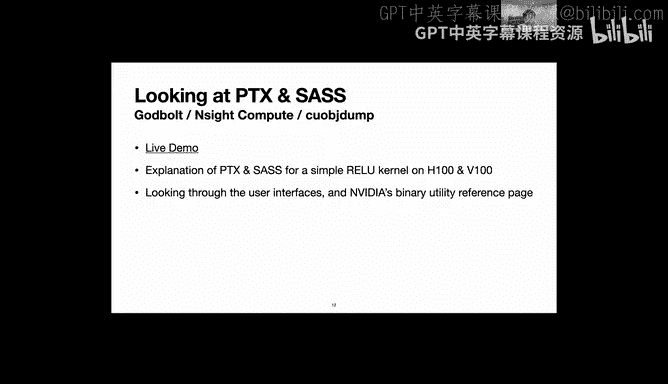

Actual PTx and SaS。Lets me actually take Godbalt is kind of a nice。

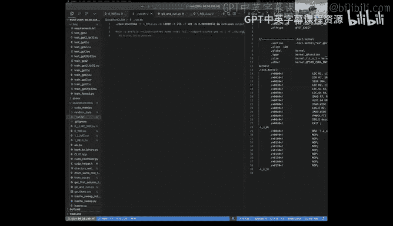

First thing see so for those who are not familiar I've got both compiler Explorer。

 it's amazing it's an online thing you can also run it locally with your own compiler if you want to。

 but I typically don't tend to bother doing that it。

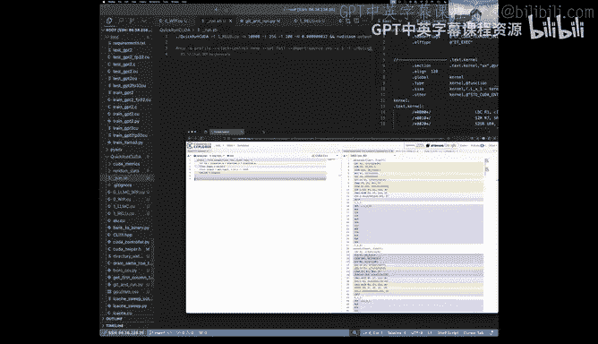

It dates instantly， so you can just kind of do this and it will then update。Dear in a second。嗯。

So this is a very simple program， the PTX looks like this。The SAS looks like this。

Something else to point out I that matters and goods so no it doesn't that's for the CPU science so this tells you you're compiling for upper specifically I think something that's really important to realize is that PTX is for compatible so for nearly without exception as far as I can know you could run even like GAT PTX on。

Upper however， there's new PTx instructions that get added over time and those PTx instructions may allow the compiler to use some hardware instructions that otherwise will effectively be emulated so it's really important that you compile for the latest PTX which is not the default when you make a create program from scratch because when it will run because effectively it you。

The PT is in the application， it comps to the actual size assembly afterwards when you run the binary。

But it doesn't have access to Btx that's been optimized for that specific architecture。

 So it's both the Btx and Sas that need to be her architecture for maximum performance。

But the everyone is very welcome to interrupt me for questions。

 especially during the live demo parts because otherwise it might get boring as I kind of fixed things and so things。

嗯。😊，This is kind of something else I want to highlightwi。

 And I think I can probably highlight it best with it's going to be too complicated to get working。

 potentially， I had like the debut view in there， but I lost it， so。Instead。

 let me just highlight that by changing to Volab， which is SM 170。And。😊。

Point out that it's both very similar and very different so previously sort of kernel arguments and constant values and a bunch of other things get passed to constant memory。

On Vol， you will see things like C and as specific as， even part of arithmetic instructions。

 so this is an in multipier art。Constant memory fetch is part of the instruction its。

A location in Dam， though， it's going to like maximum size of like 64 kilobytes and things like that。

 but it is in D。 it could miss。All the way to even like potentially system memory， I you know。

 I think good miss to the。It could miss in the memory units and kind of end up taking more memory management units and take more than 1000 cycles。

 so you've got a random thing and random instruction storing everything for  a000 cycles。

 which is extremely rare in practice， but it kind of allowss the complexity of the architecture that's something like that even possible。

😊，When we move to opera， all of that is gone and starting inter Turing， which I'll go to afterwards。

 they've introduced a uniform registers。Which are per warp or。Yes per warp as opposed to being per。

 typically the compiler will end up realizing it can use it based on the fact that it's consideredient our T group。

 it's kind of tricky for the compiler to figure out in some cases it can use inform registers。

And you don't have any access to that， not just in QDA but in PTX。

 so it's a good example of something where you want to write your code in such a way that the compiler is able to use them and it may always be obvious what the right code for that is。

So I want to very quickly go to the different instructions here。

This is actually something else to highlight， so there is no proper documentation of the details of each instruction。

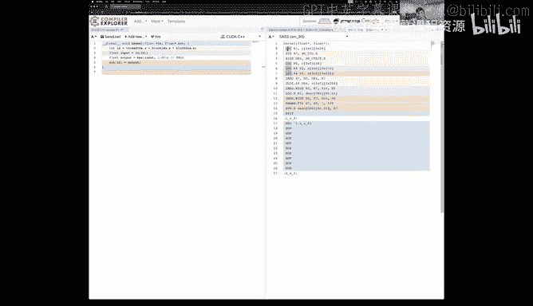

If you go and GoBgo for View assemblymbly， you've got this page。

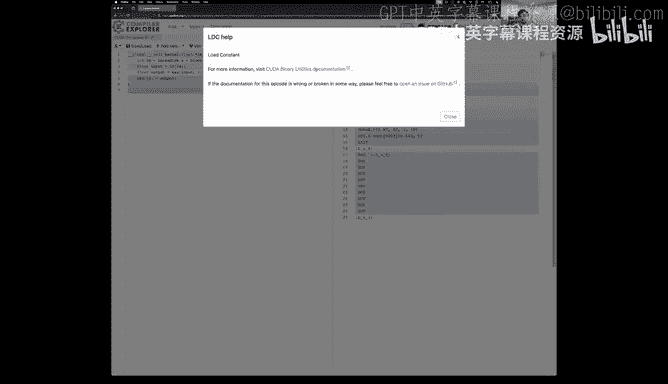

And in this interview documentation， you've got the list。Of all the instructions and literally like。

Just the name of it， which tells you what the acronym stands for。

 But there's no documentation officially from Nvidia besides that of any kind。

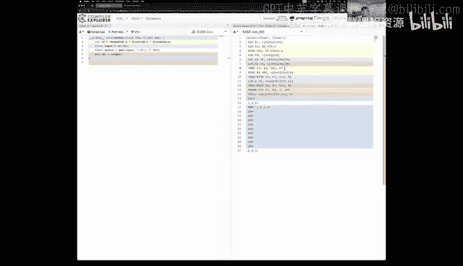

嗯。There is， actually， maybe it's worth pointing this now rather than。诶。If I go。

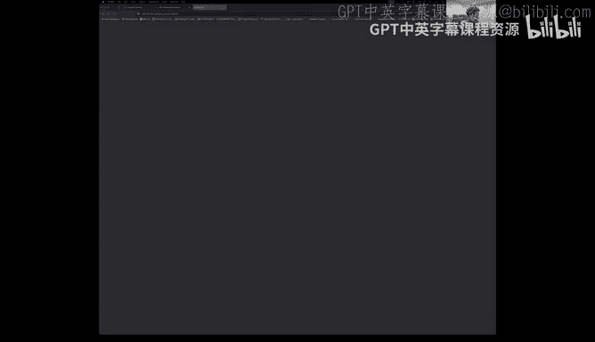

NVIs are sort。finding the link so this is a really cool project that I think was done this summer of someone reusing the password from Q assemblymbler and adding a really clever way to kind of put forth all the possible encodings and get the assembly and then visualizing this so。

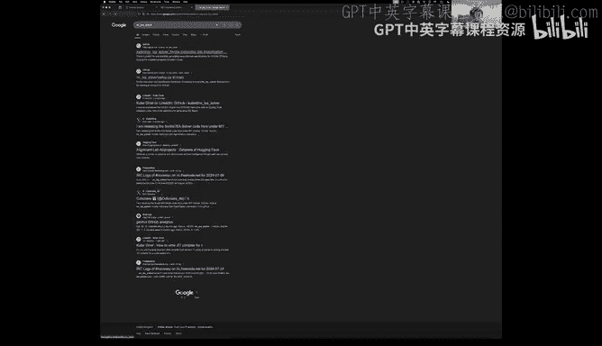

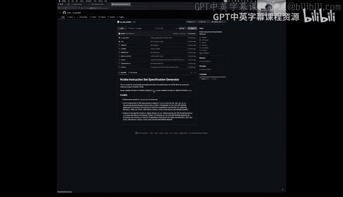

You then represent the actual instructions this way and you can kind of see what the encoding and what the different options are。

 however， that doesn't really tell you like oh things work like is a branch instruction is a bunch of modifiers without documentation。

What operant types are supported in some cases like what are barrier registers。

 none of that is documented and in many cases， I think it's worth pointing out don't be too scared。

 it doesn't really matter like the things that matter actually you an inside compute afterwards like looking at the stores for these instructions。

In fact。

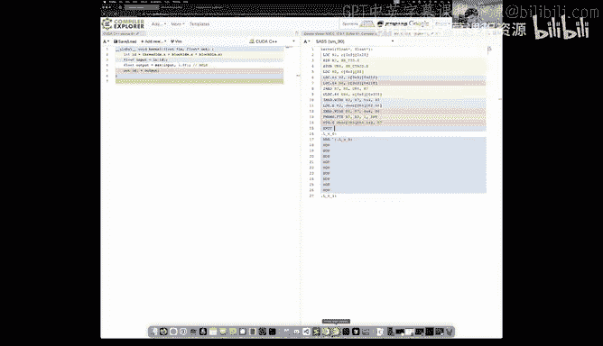

Maybe this will be a better。 Can everyone see my inside compute now。Yeah。

 it's attached to small small yes。Yeah， does anyone know to increase the size。

 And I'm not sure I've got a good way of doing it， actually。Yeah， never to increase the size that is。

Yeah， like I'm on the NVdia forums， the solution is you can try adjusting the resolution of your screen but okay we're going to do that during Zoom because that would be a bit for because cause all the problems。

😊，I mean， I guess I could like take a screenshot and then zoom on the screenshot， right。

 but that's probably a terrible idea。😊。

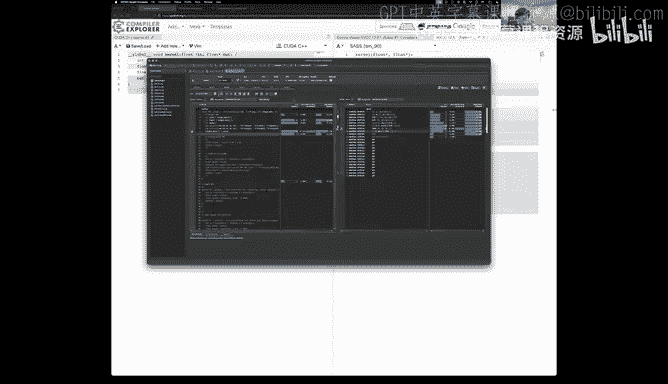

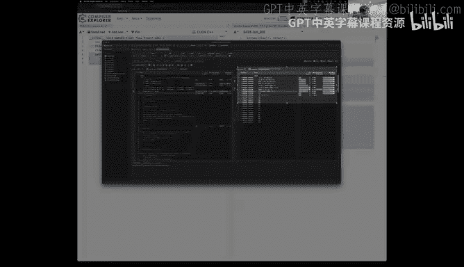

Can you showed just assess instead of says and code side by side， maybe the increases Yeah。

 I don't think it willduct thing that's yeah okay I didn't think of that problem with inside compute that's going be interesting for the things I guess I can do more things in God bolt and directly in the in the code what I wanted to show there is for each instruction you have the inside compute gives it the option to directly export as an image what it's currently showing maybe you can open that image its a good point zoom in。

Yeah。嗯。Okay。Ex you sure to make it an easier photo。う。诶。Its such of unexpected expected。

 interesting problem to have that was not in my bingo card for today。😊，But yes， that kind of works。

 Okay， so for each instruction， you've got。The store reasons， again， what， no。

 I cannot go on it to kind of show you what the reasons are。

 So this is kind of your main debugging tool and understanding the sas helps you make sense of this at a much deeper level。

And I'll get back to that later， at least assuming I actually have a good way of of so Irun。

 in case it helps again， we can post edit this and zoom in really， really hard。😊。

So don't get your flow too much， maybe maybe we can。

So I was going to go very quickly over these instructions to kind of give a baseline idea of all things work for people who've never read SAS this is opera so there's no like constant reads in regular instructions this is loading a constant this one I think is kind of a driver related thing that's not actually used for anything else this is loading a special register which is the T ID so it's this it needs to load that from special place in the SM to know what trade is currently running same for the work group ID and then it ask to take。

This and multiply it with， I think that's the actual thread group size the that's。

A good way to show that the compiler doesn't know at compile time for either BTx or the Sas。

What the actual trade group size is， so it has to compile the shade in such a way that it works for any trade group size from 32 to 1024。

 and it cannot optimize around it。So here it's effectively doing， this is an in multipl ads。

 which effectively does this。Computation and the really nice thing in GodBd。

 which is actually nicer than inside compute to some extent is whats kind of the same much nicer than NVdim and slightly quicker as a response on inside compute in my experience is just looking at the correlation between the source lines and the SAS you can also do that in PTX one thing you cannot do in GodB is go like between PTX and SAS which you can do in inside compute。

嗯the。There is a third way of looking at assembly， which is using the。

Jobbs done and indeed thousand tools。From NVDdia， so there is an official disemance for NVdia。

 but no official assemler。And。😊。

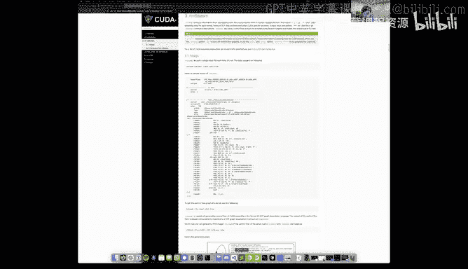

Aatic cancer。嗯。Sas law info。 Y， so unfortunately， the weight works when looking at cells in。

That's been generated by that with the line information as far as I know it will the only thing you will ever do is kind of give you the line number in the file and then you have to manually correlate it so in that way both got bold and inside computer a much nicer way to kind of do that correlation。

The other thing I was going to show is makes it much easier to understand what's happening in this program。

 especially in this case。Is， let's see if I can make this smaller。 So。Maybe I just need to accept。

 I'm gonna to and're gonna have one thing。That is kind of exactly the right size， it's fine。😊。

So both in inside computes and as an option for NV Disasma。

 you can get the live range and all of the accesses for every single register。

So something that's worth pointing out is the register allocation happens in PTxA。

 so in PTX there are no really register numbers， it doesn't tell you anything about how many registers the thing will actually take in the end。

The actual registers are allocated based on a。Very complex most likely to avoid bank conflicts。

 minimize the total number of registerers over time and so on。

 so you should make any kind of importance to what the actual number is。In theory。

 in terms of bank conflicts， there's two banks so even registers with conflict of other even registers。

But so for example， in this case you can see R2 and R7。

 which would be the two one is the even bank one is the of bank。

 the compiler probably intentionally allocated registers such that they would meet bank conflict but and if it just hardware and conflict resolution is actually really good so compared to some architectures。

 the costs if it doesn't manage to do that is quite low and it's one of those things that you typically don't have to care about。

I mean， especially in the sense that there's nothing you can do in a work access yourself with asem and the compiler usually does a very good job of it。

So。This thing over here。I's really useful to kind of understand of what the dependencies are and all things are working。

This is showing， we just a right。This is showing and we're just a read。

And the X means that it's both reading and writing that register。

So something that you can immediately see is some instructions will write multiple consecutive registers。

 this is writing R2 but it's a 64b instruction registers are always 32 bit and we got GPs without any exception so you end up。

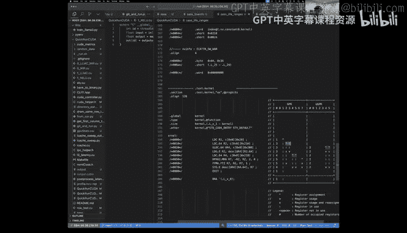

Bing R 2 and R 3。There is actually where the I' at。 that's not the same shade。 So if I go back to。

My shader ear。With this， I'm at。Imat White is actually another example of a 64 bit instruction because even the registers are 32 bit。

 the addresses for memory are 64 bits。And so as far as I know。

 this instruction actually is kind of microcode and ends up working as two as taking two cycles and writing two consecutive registers R4 and R5 over two cycles。

嗯。Yeah， so that's let me see is it easier Yeah so in terms of the liveness information you can get the same thing inside computes you can get in GodB as far as I know which is another kind of I think a team here is all of these tools have different advantage in disadvantages in terms of looking at the SA and SA computes if you're actually doing profiling is obviously the best because it gives you read information in terms of iteration speed GodB is probably the best。

But then there are website science users is looking at the SAS this way and it's kind of if you're running so for example A dot see because it configure to that on every single integration。

 we get the SAS for all the kernels dumped so even you don't you don't need to run it it doesn't run as part of integration but。

In theoryly， you can get the kernels just from compil。

Because the typical way that Q compilation works， but there's another way is that as when you do the NVCC it will embed the PTx and the SAS inside the binary。

 so you just need to run QOs dump which is documented。On that page。

 in order to get it out of the boundary。There's also the QA driver API。

 typically people use the QA runtime API， I mean I assume something like Pyths probably use driver。

 but simple programs use the runtime API。And the travel API lets you load。

A Cuban file with Sas directly or load Px directly。 So it's not part of binary。

 It's effectively something that happens and then the compil happens at run time。

asks your question Go can we just watch you firsthand compile a kernel and open it and inside compute like what your normal flow is for that so okay so my normal flow actually is something I've kind of changed over the last week in order to kind of optimize myeration time so what I've worked on the last week and add something similar but not as good before。

And I would like to open source this once I've cleaned it up so I've got a script that effectively watches a directory and runs let me see if I can open cursor。

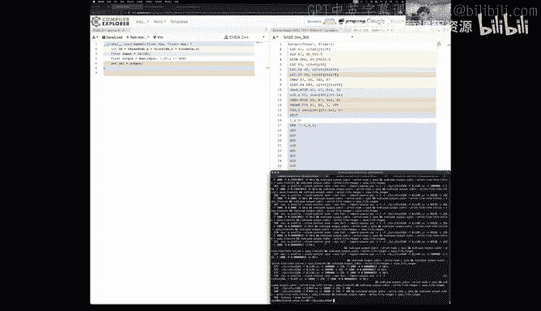

So。It would end up running。Like this script every single time。

Whenever there's any change in that directory。So this is a command that will end up running NCU on the server and writing a profile to the server profile to the NCU rep file。

 I've got a bunch of other options there， which the most important one is set full and import source yes。

And then after that you've got the actual command， which in this case is this。

 which is the way my framework works at the moment。

 and then on top of that I've got it outputting the disassembly so this framework used the driver API so it compiles the shadedout runtime and output a Cuban file and then using VDas to write it to a bunch of files like these ones。

So what that does。If I。Take these。 so it should be that if I。あ的。This one。 And just。

Let's see put just update this then we run automatically。

Let's see which one is this running then work in progress okay and you want that I would like this one instead。

Which is my simple value shader。So this is the file of the kernel that's going to be running。

 it's generated all of the SAS file locally。嗯。On the server。

And then I made another script that will download this。So this is running on my local Mac。

 it will download this to SP and then open inside compute。With that file。

 So let me make sure that's the correct 1。 I think that's right。And then yeah， that's it。

 So it wasn't the other desktop， but。It's opened automatically once I press that so it's a really really quick flow to run NCU on the server grab the file locally and run it in and compute the alternative is to use start activity and kind of do it like that but。

Yep， I think that's kind of as done sites and upsides， I kind of prefer my for for dads。

 does that make sense？Yeah， it does。 Thank you。 So I'd love to see that like get that code when you're really it's one of those many things I kind of want to clean up I just I've at some point accept the fact that it's useful to people even if it's not as good as I'd like it to be。

 but I'll pass it through like one iteration of asking Cl to make the code better and maybe that's enough。

😊，Awesome， thanks so much。And yeah， I kind of developed this part so I can do live coding for this presentation because this kind of allows me to change something very quickly and so that to you In computes。

 except for the fact that I didn't plan that In compute is too small。

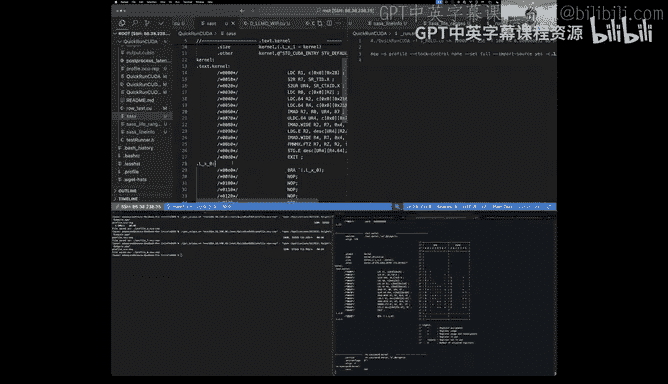

So using Gobals going to those instructions。嗯。So this is loading a constant。

 this constant in this case here， you can see viing this， that this one is the block dimension。是市小。

It's loading the work tool group size， the， the log dimensions。

 and then doing intention of multiple ads。In this 32 bits， it doesn't need to do the white one。

 whereas for the other calculations later， it needs to do that and write to both registers。

It's loading some other constants， so all of the kernel parameters are passed to a constant memory。

It's worth pointing out there's a limit of 64 kilobytes or something like that64 kilobytes for kinds of memory。

 but I think there's actually two separate limits one for the current arguments and one for everything else like it's kind of all of this mess is a legacy of the way direct1 worked back when G was designed 206 like the 64K is just what Microsoft put direct1 back in 2005 It hasn't changed since。

One thing when I'm kind of mentioned all the different architectures and the way it's different between V and other ones。

The way constants work is completely different on AMD。

 like completely different as well as branching is completely different and without going too much detail like other GPUs also tend to handle this kind of thing very differently and it's all very unique but all kind of equivalent and can be emulated to one on the other for things like rock M and I。

So this。Yeah， so this is a poer， which is。A four byte constant and constant memory for the for the kernel argument that is then read by this instruction。

This is the one for the output。And then it's doing an address calculation。I'm Matt White。

 so this is the destination registers， it's R2 and R3 R7 is the ID， which is what I created there。

And then it's multiplying by four because it's a flow， so it's four bytes per element。

And then it's adding R2。Which is that onda was loaded from a constant。And。😊。

It's kind of interesting to see what that was different in Volta。Where in Volta。

 you can see like those constant loads were part of the IAT。And。Yeah。

 there's a couple of other differences。😔，I've never realized what this instruction is doesn't really matter its this is a good example of sometimes you look at SAs and there's things that just don't make sense and you can kind of assume there are low level audio requirements potentially in some cases I think there was something with。

Was it TMA maybe or something else where it didn't make any sense to me at the end video out of the loop kind of a spin lock and it was I suspect is the hardware bug and in many of these cases。

 the important thing is for dynamicmic code like that loop I just mentioned that's not like this this will always run this will always take a side just the way the hardware works for those kind of groups the key thing is using inside compute to see whether the loose instructions actually get executed and in that case。

That loop was not getting executed whatsoever。 It was kind of a corner kid that they had to end probably。

Yeah， maybe one thing to add here is that the compiler also can get very clever in using instructions for things that you wouldn't necessarily expect them to be like if you divide by a constant that might end up like bit shifts like a sequence of bit shifts and multiplication or whatever。

 so sometimes。It doesn't make sense at first until you start really looking at things。

And especially I've seen in my code like half half like HFMA or something popping up without using any data type half and I think just some weird thing that the same instruction can be used thing I was planning to mention the HFMA thing later so I might hopefully get back to that I think I'm more or less done with this I was just going to say this is the load it knows it from global memory the descriptive thing in the way that works is one of the difference in upper and one of the reasons why QSMr doesn't work out of the box as far as I remember and then this is the actual thing doing the radio max。

This one。And then it's showing the results and then it's done this is padding because programs always need to be a multiple of 256 points。

So。I think that's about it on this thing let's go to the yep。

 let's go kind of cover this slide and other things as well。

嗯。Right， I was going to show this。

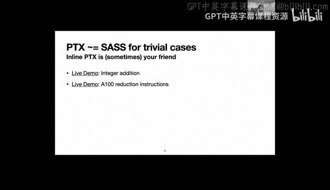

Something I wanted to show。In terms of understanding the mapping between PTX。

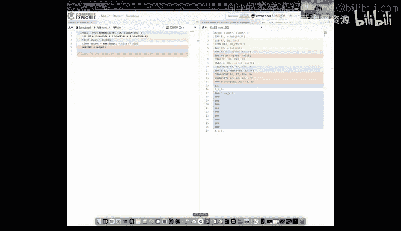

And saas。Just everything I've zoomed in so great that I literally don have no idea what I'm looking at。

😊，Was it this， Yes， it was this。 I can probably just copy paste it。

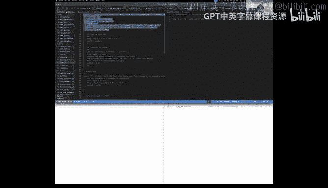

Into Godbals pick。Y。Quicker。Yeah。Yeah there we go so this is a fairly simple kernel loading data from yeah that was kind of all because of the framework。

Thus forgot see if I don't if I remove it。So there's a very simple kernel just doing an ad between two things in an array like it's not even using the thread ID so there's fewer instructions you don't need the S2R and the imad and so on obviously it's not a real world kernel you ever want to use so it's loading two values from。

A concert memory using LDC。And then this is a PTx instruction that's inline PTx to do in addition。

And。So if you do output， you could input lost dynamic elements。

It will literally be completely equivalent and this will not change。嗯。

The reason I wanted to show this is a very simple case of PTx is not a one to one mapping to SAS is the instruction that actually executes Integer edition in CudA is I3。

 in some cases actually use the Am pipeline， but typically we use the three input Integer addition instruction。

And RZ is actually just a register that represents zero， so it's not a wheel register。

And what this does is it runs to I 5。Adding are0 and uniformal juster six。

And then this input is not used now if I and command the next line。

 that's a second edition with another input。I've got another load。

 but I don't actually have an extradition instruction。

I'm just using that empty opera that was not used previously。And if you look at the PTx guide。

Ptx Iizer。In terms of addition， there is only add two values instruction。

 so there is no way of using the tree input edition automatically manually that's always something the compiler will do for you and it's a very simple case an example of something where obviously the line info mapping also cannot really work so if I look at this it says that。

TheThis instruction is caused by ideas， but really it's caused by multiple things。

 And the way the line mapping works is it does student things are one to one， which it's not。

 And that's one of the many， many reasons why it's not always accurate。

There's also kind of another interesting case there。

Is something that doesn't work the way you kind of expect in hardware is。

Logical operations like An or or and so on。 If I go there。S。う。So it's using this Lo3 instruction。

Which you will see a lot in anything that does like pit operations and。

Yeah I'm not going to go the instruction there's some documentation somewhere you can find that people have kind of mapped the way what I think is actually a firm pose by Robert Corollilla about this for NVdia but effectively this is able to merge multiple bitwa operations into one and in some cases this actually can merge like way more than way more than three because of the way simplification works and the compiler will try to figure it out but obviously it's using heuristics because it's kind of a very complex problem to get it right for like really long chains that's kind of kind of need a full sat over for it but again in this case this is kind of the compiler will automatically turn see。

Moving this sorry the zoom ring is in my way。So it will automatically turn these PTX instructions or the QI equivalent into Lo3。

 but you can also use it directly and so it depends a lot what's actually available in PTX。

 what all that maps to SAS and just like the only thing can we say is it's absolutely not one to one。

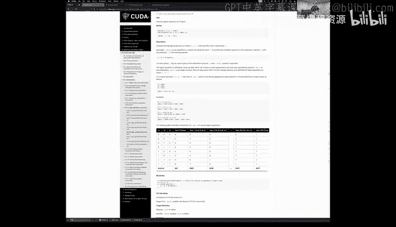

嗯。Maybe one more question about your example， I'm never quite sure like do you actually need A and volatile or ASMF in this case？

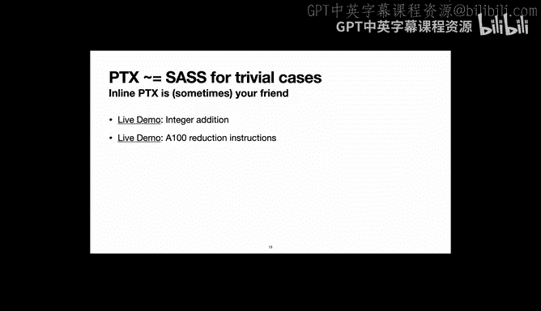

So the volatile， it's documented in， let me see the inland PTX page may be easier if I've got the openers easy if I've just search it。

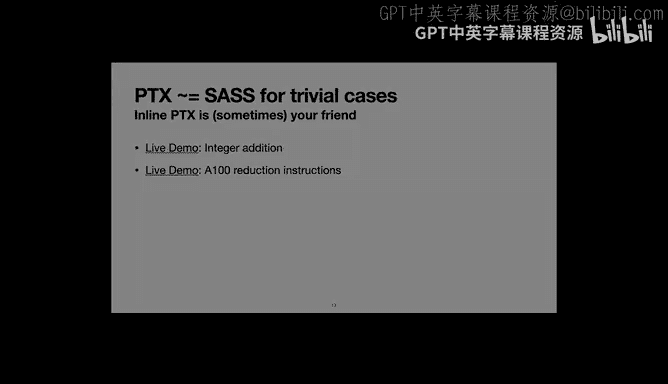

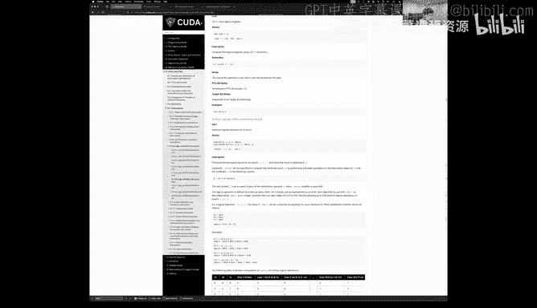

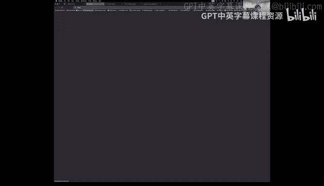

And all PTts said being cuter， it's related to memory if I remember correctly。So。Yeah。

 it's related to optimization and automatic removal if something is not used。

Its like this side for example it might be a side effect。

 I guess a good example might be me andm just kind of curious no it will work So if I do the other okay the other reason I kind of keep mentioning like that button is great the one thing that is not great is there's no compileil there's no cursor and it just reminds me of oh oh much I've forgotten about basic things。

嗯。So I think。I wanted to do not asleep。Hero， I think that's the one。

So nano sleeps got an interesting instruction that's also useful for things like spin locks。

 it is available both PTX and Cuda you can actually expose directly in Cuda as far as I remember。

 so it will sleep a given threads for a specified number of nanoseconds。

 not cycles it's actually converted in the hardware2 cycles。

And it may be a dynamic value or an immediate fixed value。And its approximate， obviously。

 is' not an exact duration。So yes， this is it。 So if I do it without the volatile。

 does it keep it the maybe it's smart enough to realize that。Yeah。

 it's smart enough to realize it as to keep it。 But in theory， it's for that kind of thing。

That' you want volatile。 I usually， I'm trying to think it there's any reason not to have it。

There's also this one， which is kind of important， which is effective。

 which I'll go this I've got a slide that's kind of related to that after this， which is。

 how do you change your program so that。Your saRS kind of fits together。

I'm kind of checking on time okay I think this is taking a bit longer than I expected so I might just eat bunch of the Mark architecture stuff and then come back to this you don't have a hard stuff by the way it's sure but I mean I also feel like the Mark architecture stuff is kind of important and unless I eventually move on to that I will just spend all of my time doing live demo of this。

But yeah， in terms of the pages that are important to be able to work in PTx and SAS。

 I would say like the PTx ISA， theline PTx assembly。

 the C binary capabilities and obviously Q C++ guides。

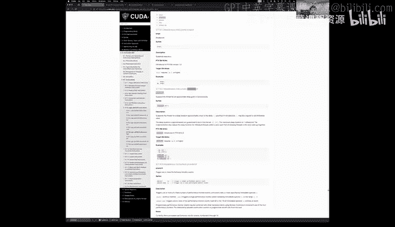

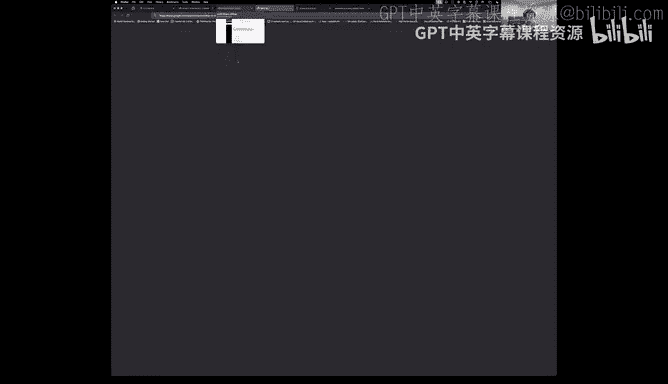

And there is something in the I see scale that's really important that I'll get back to afterwards。嗯。

Right， so I think that， yes， I was going to show the A10 reduction。I've got this incursor。

 added open。

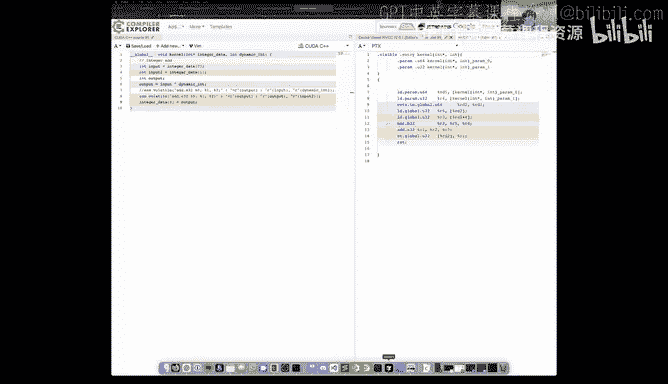

So if I undertake this。😔。

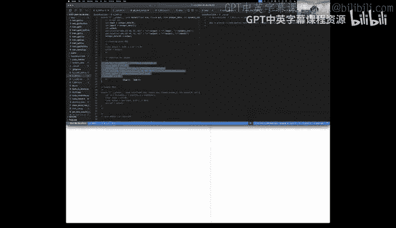

あ。So this is to highlight a new instruction that was added in。In ampe。 So this needs to be。嗯，行。Sos。

And I think that's it。So this is something that is not actually directly available in the Q API。

 you can use cooperative groups or trust or CP， I think to effectively end up using it automatically。

 but you cannot as far as I remember called this instruction directly。

In Quda C++ without using long Px。And what this instruction does is it does a reduction across the 32 elements of the warp。

 so it will take the maximum inside a maximum value of those 32 threads and place it in every thread。

 all of this is documented in the the wrong page。In the PDX manual really well always kind of the complexities with the member mask and other things that's yeah let's just pretend those don't exist for the time being the quick kind of tip I wanted to give here is obviously Abbsmax is kind of an important thing for。

Scaling tensors for FPA and other contexts， you can actually just assume that the floating point value is equivalent to a 32 bit in in no sorry a 32 bit sign no right so if you're doing effectively F。

If you're doing F apps first。Of this。I have no idea good example of being too used to compile pilots if you do this and then you can effectively just use act as if it was an integer the spider actually being floated because the ordering is the same like a bigger integer will be a bigger floats if you look at for absolute values there is a trick to do it with two instructions for the not absolute max case as well but a bit more complicated the reason why that matters is those reductions。

😊，Only exist in the hardware for integers。 So if you're doing a floating point reduction。

 you still have to use the shuffle instructions and kind of do multiple steps of shuffling。

 whereas this， if you can use it， is way quicker and way low latency。Okay。

 going back to the presentation。

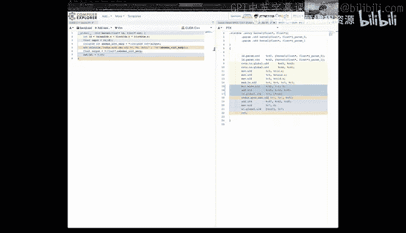

Okay， I'm not going to show the 8100 in matrix multiification case， but that's kind of。

An interesting example of extreme case where the PDX has done that and where compatibility is tricky so MP introduced four bit matrix specificification upper added FB8 but actually removed in full for whatever reason like。

Did anything it was worth the art engineering verification time and so but the PD instruction still has to be supported because the way C works the PDX works is。

If it's in， it stay in forever。😡，So。TheWhat the PTtx S does is convert that into a very。

 very large number of 32 bit instructions and other things that will be incredibly slow。

 So like it will be way， way， way slower than in8 matrix multiimplification And unless you look at the Saas。

 you don't really know that， right， So it's a good example of forward compatibility and PTx kind of。

Being a black AS， basically being a black box and looking at the cells be kind of important to make sure the black box is doing what you want to do。

But all of this kind of a good thing because if we didn't kind of have this raw J approach to comparing GPU codes。

 we'd have to say mass at X86 us and I think the GATT instruction sets was interesting like it's got some really cool bouts to it。

 but if we had to be stuck with the GATT instruction set from 2006 like I think we'd lose a lot of efficiency。

So this is。Okay， so I want to try and see if I can do this part really quickly。 A big problem。 Yeah。

 a big problem。

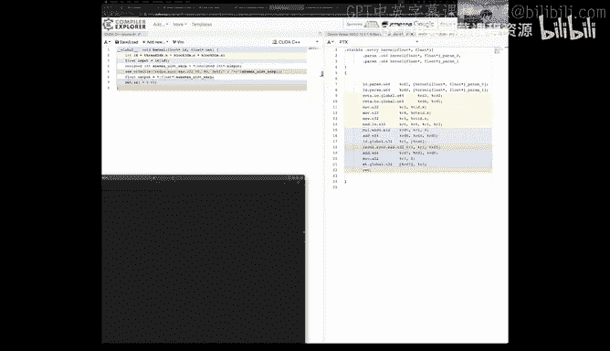

When using SAS is for a complex program， you end up a kind of things optimized long distance and move around by a compiler and you have no idea why this thing dies doing that and the source line matching doesn't really always work for the specific instructions you don't know where it's coming from etc。

 you can kind of mitigate that to a couple of tricks and there may be extra tricks that I don't know of because these are mostly things that I figured out myself。

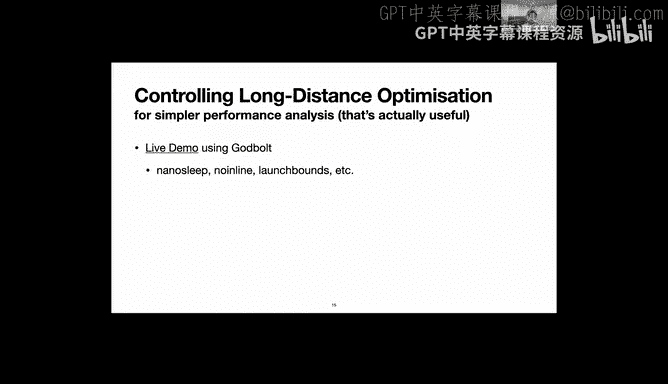

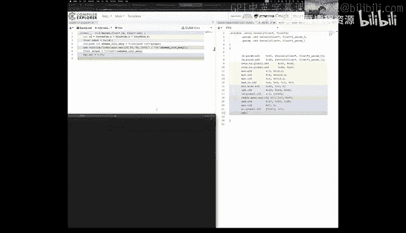

So， kind valued。嗯。Do I have this here， Maybe not， Maybe I need to very quickly write it。是。😔，Yes。

 I think no， okay， squ， I will write it in。

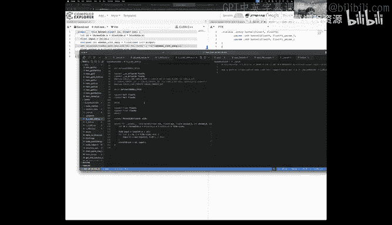

As little time as possible， so another interesting point that's worth highlight writing is。

There is like when you do arrays in Qa， you have to be both very it's both very powerful in terms of active。

Forcing the compiler to do some optimizations， but if the compiler cannot do those optimizations。

 it can be really bad so let's take。This。So if you do a full loop。With。

Any kind of fully static number of iteration counts。And you're using the loop counter as so let's as。

Using the root counter。As an index。Reading or writing。An array。What you will actually end up getting。

See， is this correct， okay？should be correct。 What if I don't。系。And then。Yeah， S M 9。啊，我哋话得。

Oh yeah okay so okay， that's actually kind of interesting so let's do that so let's do data and。公。

So the first loop is loading from global memory into this array。And this then does a sum Okay， again。

 it's not meant to be a representative program it's just to all lot what's happening Okay。

 perfect's exactly what I wanted to do so each of those loads。This is loading one of those roads。

 32 bit loads into a single register。And then the sums are these F ads。

And you can see what a compiler tries to do， partly to minimize with the pressure。

 partly to kind of balance the pipelines in the bottlenecks is it will do like a large number of loads to start with to kind of maximize the amount of memory instruction level parallelism。

 and then it will kind of interleave those ads across the loads。In some cases。

 and this is actually something where that register liveness and access thing I showed you can get for N dis and soft compute is very useful because it's kind of sometimes hard to kind of track what the real dependencies are。

But。Yeah， so this effectively in this makes it quite tricky to figure out what's going on in more complex cases and Italy you kind of want a way to separate things so to prevent the compiler from doing clever optimizations across a certain area another example of this is if I did if I less than。

等得未啊。In turned and I did this year。The compiler would realize that。

 well that means I'm not actually doing anything with any side effects。

And it's going to end up moving this。😡，To the very top， so this is the test and the exit。嗯。嗯。Yeah。

 so one way of doing this is adding certain kinds of instructions that the compiler ends up aaving like kind of seeing as like。

Separating the basic blocks。 So nano sleep should be one of them。A did I。Yeah。嗯。

Oh yeah put in the wrong spots I should put it between the two loops so so this is one case which's kind of really tricky to make it do the right thing and I'm show you trick that I think should work for this。

啊啊啊。That is not working interesting， I might have to resolve to my。

Cra trick something else that's really kind of interesting there is launch balance so this is kind of to do the opposite。

啊。嗯。啊。that's correct。Yeah， okay， so。This is vlog 56。8。That should work。一。So this is compiling。

 assuming there's like eye occupancy。 this is asking it to have eight blocks of 26。

Compound the shader in such a way that the number of registers used is low enough that you can fit 8 buck to 56 of 248 threads on ESM。

But if I make this one。It knows there's access to more registers and it ends up changing the way it's compiled and doing all of the loads first because it assumes that's actually better for performance and all of the F ads afterwards so the reason why things were kind of interleaved in that weird specific way is because the compiler was trying to stay below like a certain kind of number of registers I think it seems to be using 20。

8ight registers so exact are zero in practice it could have used more， but these are heistics。

 the compiler doesn't really know or the compile and register location will end up after some stages of compilation。

So it's kind of sometimes being too conservative here， it's trying to stay below 32 registers。

 which is what you need for maximum occupancy on upper。

Now there is another crazy way that I wanted to very quickly。

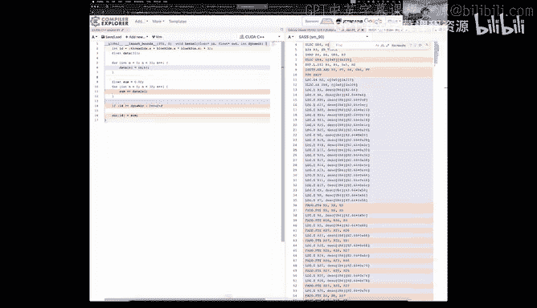

Show that I discovered in order to。

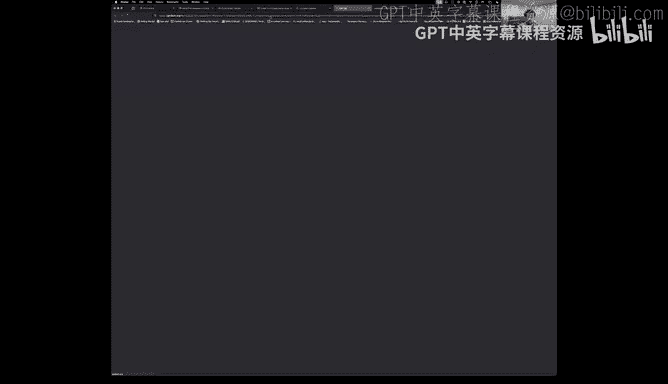

Yet this， if you use a no inline device function。And let's say， it's doing。Note X notes。Return zero。

 and then I do not in line。嗯。If something like that， the details doesn't really matter。So。Okay。

 actually， that is a terrible case because this is actually showing something else that's kind of interesting is。

😊，Yeah， this is。Oh I don't think we again and then it works yes。

 exactly like I think it's kind of because there's multiple things that can happen here。😊，Yeah。

 so this is the launch bounds and this was a case where because of the launch bounds。

 it's forced to try to use register spilling which's going to be really slow。

 which is STL and LDL So if you see STL and LDl in the shader in the SAS that's a really bad sign and you kind of look at things like launch bounds and trying to reor the things so then we pressure goes down In some cases rottanium amount spilling is not necessarily a bad thing compared to low occupancy but typically it's really bad you mind elaborating on the forcing spilling point what does that mean exactly So this it's not forcing spilling。

 it's forcing compilation such that you can fit 248 threads perM which means you can only you need 32 registers or less per threats and because of the way this shader is written it's not able to compile below 32 threads bump we are doing operations and so the compiler is forced to spill to the stack into。

I use the L1 and potentially the L2 that makes sense Yeah yeah yeah so the trick I wanted to show you let me release it to 16 so it doesn't hit that problem and maybe be bounds。

嗯。So that should work。😔，Yeah， so air。By a this function call there。

 which end ups calling dysfunction。It's effectively。

 this is one of the strongest things I found I'd be a if people know of other even stronger ways to kind of force the compiler not to optimize across a certain boundary。

 but this seems to be like a pretty powerful way to prevent optimization between this and this。

 however。Like a lot of this is related to like memory and assuming that memory might change between those pointss。

 there are things the compile we still do this branch ear of it's still moving it to the top of the kernel and doing an early exit。

 so it's not perfect。I think maybe slightly cleaner way of doing doing this is just having an assembly statement that tends to club a memory and doesn't do anything。

 Yeah， so that yeah， so that's something I've also tried。

 I think there was a case or so where this actually worked and the club ring didn't work。 but yeah。

 typically the club ring is the easy approach， which would be like as volatile with that memory flag。

Okay， anyway， I feel maybe one thing to add here jumps optimization is also that if you're not careful。

 you can do exactly this thing unintentionally quite easily if you're writing to memory and the compiler can't figure out that you're writing to memory that's distinct from what you're reading then sometimes it can optimize Yeah maybe yeah。

Yeah， absolutely so if I just did。😊，あ。Yeah， so that's why you need。

Not going to have time to go into probably like con。Restricts。

For your arguments and that's a whole other topic， which is you know you can you can Google that and figure out why it's important。

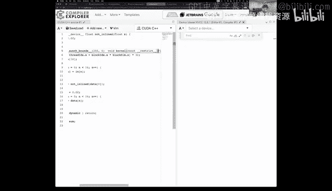

So I think I've got quite a bit to cover in the Mark architecture here so I'm going to go back to your presentation now。

 hopefully that kind of made sense。Right so okay， that's another line demo but I might just missed most of that because I wanted the time and see go to do it at the end if I've got time so Volter ST is kind of very different from the way previousial GPUs work the way N GPUs work and the way other like effectively there's so many different variants of CT and Vols1 is quite unique to let me do a very quick life thing here so if I do if。

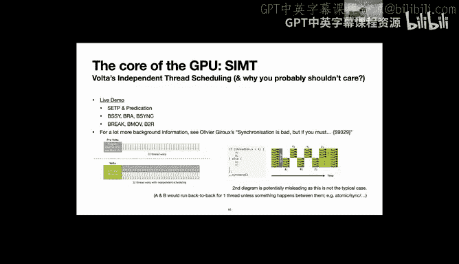

Yes。知啦啦。Yes。嗯。Should be what I want4 you。And it's kind of again。

 analog just oh nice like something like Godball that you incredibly big quickly is like if I had to wait like a 10 minutes to compile to get this SA and then iterate on that I would just give up instantly。

 but obviously you can yeah depending I don't know whether flows are in some other case but it's probably always a way of getting faster iteration time than just going to the the old framework。

U。So yeah， so the way f works on videoity， if Ive got right， Okay， nope that's two。

If I move some more stuff there， that would probably work better。诶。诶。S。

There we go so now I've got two different branches， this is。And。

So predicate registers are what's used for tests， they are per thread。

 there's also uniform predcate registers that are per warp， which are much more rarely used。

 this is testing whether this value is greater or equal to this value that's an immediate register。

And then writing to P0。 and then this branch is saying if P0 is false。Then branch to this labor。

Which will be here。So the thing that's kind of unique about Vol C is。

So if you look at this diagram there that they've got， effectively。

 that my active diagram is a bit misleading。All of those， the threats that take the branch will run。

And it will actually go all the way， those threads that do run。There is another。买下。啊。Okay。

 so that's actually interesting。 This is a case where there's two exit statements because it knows that。

There's nothing to do afterwards， if I do that， then that will certainly change what it looks launch。

Because I want to get a be sync instruction。No equals some okay， I need to do this。

This is all the fun of doing this live， but hopefully it's not too bad given the complete duration times。

And kind of shows the way you would do it yourself， hopefully。Afect， I think。Yes， perfect。

 so this branchn。ItIf it's not running this path， then it branches us to this label here。😡，And then。

After that。Yeah okay thats that confusedfuse things， but after that it will end up branching so。Okay。

Let me start over， this will be much clearer。The way the warp works， all threats are active。

 then all the threads that fail this branch are disabled。嗯。

So the threats that would branch are disabled， the threats that do not branch execute this。

And then they branch air to this label at the end。And they then run the piecing instruction what the piecing instruction does is the threats that are active get disabled。

AndThe ones that were disabled， which in this case be the ones that did take the branch。

 then I reen at this label points and then all the threads of the other sides of the war that took the other side of the branch will execute this。

There's really like a program counter per thread that is actually written in RU and R1 that may actually take two of your registers for the program and you will actually lose two registers that。

3， you've got a 32 30 resist1 32。Oh。Okay， did that make sense。

 I'm realizing this is quite a tricky thing to explain we've had a lot more background。

But fundamentally， the key instructions we have to care about are the set P， the bra and the B Snc。

And the becing is the convergence pointss。 so the number of instructions required in this case for。

That the FLs is one for the set P two well three for the branches。

 there's one ear and one ear two for branches and one for bc， so there's four instructions。

What's the VSSY that also looks like it？This one， this one。

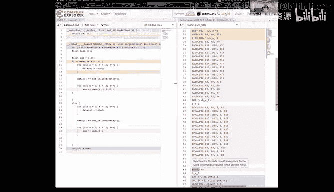

No in the beginning， like directly in front of the branch。

 there's one more instruction at also otherwise Okay， yes。

 this initializes the barrier so it's basically I mean。Yeah， the algorithm doesn't do it for you。

 you have to kind of say and this is one of those things that I only understood looking to nK discussions about all the barrier register works and it's kind of messy。

 So yeah you just that's a good point that's another instruction that will practically always come before dynamic branch after the setP。

Okay， if you get any questions about that， let me know。This is， yeah。 this is just。

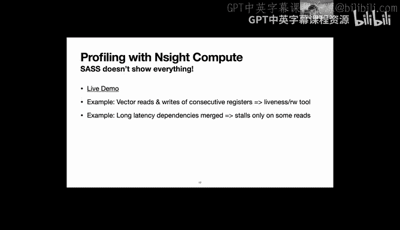

It's easier if I explain in in 10 seconds when I was trying to get to air by showing the registered dependencies。

嗯。お。So。This is kind of an abstraction assuming that the hardware and instruction set can support representing this exactly。

 which may not be possible but because it does't even have barriers or because you。

Or because there's loops and all complex control flow that make this tricky。

 but this kind of looks as if。It works in a CPU where the hardware is tracking to registers。

And it will a CPU will automatically figure out that there's a dependency between this instruction and that one and do to sting completely dynamically the way it works since Keeppler。

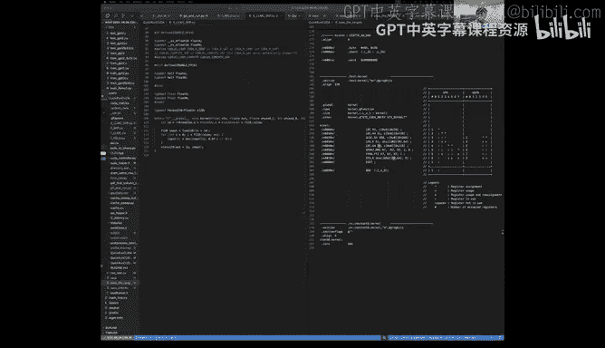

If that's not the case。The instruction itself will encode the way the dependencies work。

 so there's still a bit of hardware for tracking things but it's a lot less and all of the long dependency instructions will have a right barrier which is when the data for like a load comes back and the read barrier which might be when the address register where the address is stored for the load。

 is freed up so that happens much earlier than the actual data coming back。And this the barrier mask。

Is making you wait for those barriers to be satisfied so if it's set an instruction that instruction cannot execute until the previous instructions that incremented those barriers are fully finished executing。

The Sts is the mechanism for arithmetic instructions like FMAs and Inger edition and so on。

 which is more of a fixed number of cycles which comp us to figure out when is the best case that it could possibly execute so there's actually kind of a a few interesting corner cases is because it's not for instruction but the way it's not actually as perfect as hardware but for instance and purposes it's very clean and very simple。

The key thing you realize with instruction set is it is very clean and simple compared to most CPUU and all the GPUs。

 it's a fixed120 bit fixed instruction length， which is probably the lowestcode density of any GP I'm familiar with and any compensates for that with incredibly aggressive prefeting from my testing。

 so if you've got load of crazy branching and conditional code and likes wars running different paths which is the case for rate racing for example。

 the architecture is actually not great because it kind of prefe things that don't needs end up missing more often because it good density is low and so on。

 but for machine learning stuff where you effectively don't have that much kind of crazy branching and it's mostly straight line it's actually really efficient and kind of simplifies other parts of what the hardware and the software。

And if you actually want to look at the lowest detail and V is a solve， is really quite。

This is kind of an aside saying that a lot of information you find online is very simplyly wrong and it's kind of impossible as a third party to get most of the details right so the Vol disected paper for example is wrong about the size of the instruction caches or more specifically which is theL1 which is theL zero and so on and like actually there is a3 kilobytes L0 per S partition but again most of these things you don't actually have to care about the best source in lots of cases is actually in V performance formss so both Robert Coella and Greg are very active on this and have answered lots of questions and there's lots of like other really smart people not going give names but that person loads and load of threats and so if you're looking for a problem often a search on those forums will be quite helpful and Greg especially for like performance counters。

Will give lots of detailed answers like the way L1 banklashes work and so on that is not actually available elsewhere and it's kind of really good gold mine of information and as obviously that gold mine has been created because people pose questions and negative answers so I think I tend to just read and find the information by searching it because there's so much but in some cases just put a question and I think it's a really great resource that other GP vendors don't have like there's nothing anywhere near as active at that Frrog know for AMD or Intel or Apple and it's a really great resource。

So trying to dig deep into the actual Mark architecture。

AndVdia has been kind of focusing more and more the system level in their presentations。

 so for example， the Blackboard objectss presentation like basically there's nothing about the ESM architecture or anything like that you can kind of。

Do a little bit into detail of what the SM looks like from some of the public diagrams。

But you kind of want to go a lot deeper than this。 You don't want to go too deep though。

 So this is the datapa circuits that Nvidia generates with intelligence as opposed to classic EA tools。

 but you know this level of abstraction tells you nothing。😊。

There is some very low level of like data bad specifications can be entrances of pages long really complex kind of audio you implement a specific Ie 754 thing in the right way that's efficient。

😊，But that's the wrong level of abstraction so in terms of publicly a resource the voteta and Turing of presentation are probably the best we have that's official from N video and again you kind of really want to combine those micro benchmarkchs and some of those micro benchmarkchs don't exist and take a little time to create。

 but it is where it is。So this representation。You can see here there's four partitions four subcose plus M this is important when you write cutta codes because of the way the allocation location works。

 it's not really 64 ws， it's really four sets of 16 which is also exposed directly for wp groups or potential cores and so the registers actually allocate in chunks of eight。

And theres specific thresholds where if you go from 56 to 64。

 you actually lose some occupancy and think 64 to 72， you don't and kind of the other way around。

 kind of other weird things like that， which are consequence of actually like being very coarse granularity because it's kind of just multiples of 16 rather than 64。

So。😊，Except for DL1 and the shared memory， which is kind of really per SM。

 most things in the TMA now， most things are really per partition and it's kind of the level of abstraction that you sometimes want to think about。

嗯。😊，This diagram is kind of showing or there's multiple pipelines。

 this is kind of a very actually not very correct abstraction based on what has been said back by the problem tool guidelines and kind of other things about oh this really works。

But at the eye level， the really important bottleneck is that the Wp scheduler per partition can only schedule one instruction per clock。

And there's now in new architectures2 FP 32 pipelines， but effectively you've got a set of pipelines。

And you've also got like things like branch instructions。

 each of those pipelines as a maximum of 16 transfer per clock。

 so for a full war of 32 well take two cycles to execute。嗯。😊。

But that means effectively you can only keep two pipelines fully occupied if you've got lots of In instructions。

 NP32 and branches， the bottleneck might actually just end up being the decocode fetch schedule rate of one warp instruction per clock per partition。

 which is 4 perM。嗯。So the Turing of this presentation kind of highlighted that before the consumer MP。

 So this is still so this diagram is still correct for a100s。They effectively add an intes pipe。

An FP 32 pipe， but In pipe isn't really just doing In stuff， it's also doing floating point main Max。

 a compare and other instructions。While the FP32 pipe ear is actually also responsible for Inte 32 bit multiplication instructions like IATs。

So those names are very misleading and on newer architectures what they've basically done is they've added a separate FP32 on pipe called FMA light So there's still the same f32 pipe that can do integer multiplication There's another pipe that can only do FP32 multiplier at multippl adss and then there's the existing integer pipe that will do integer floating point main max and so on and then move through is the special function for things like reciprocal square root sins。

10H and so on but again you only got one warp instruction per schedules So you can only use。Well。

 you can only of the full speed pipeline that get you to an end。

 you can only use two of those pipes at full efficiency。

Fanciialally you still get like bank conflicts and other things that mean you don't get full performance like when you think about like the speed of light you'll never get 1 hundred0 percent because there's loads of lowle bottlenecks。

 but depending on the case the opportunity will be the bottleneck。

Another thing that's interesting to point out there at the eye level is the trend in upper as been to do bigger instructions that do more automatically outside of DSM and regular instructions。

 so TA instruction will do a huge amount of work in what's。

In theoryior a single SAS instruction in practice with a whole bunch of override before and after。

 same thing for upper tensor course like one instruction will take many cycles and so they effectively avoiding these wars couldule a bottleneck by even bigger instructions that do more work。

 but if you're running vector workloads， that bottleneck is still really like non-tensor core workload that bottleneck is kind important in my experience。

So we kind of implicitly touch on uniform registers as part of looking at the SAS。

 I't think there's a lot of extra thing that we say is obviously a power benefit。

It's not as much of a performance benefit in my experience。

 partly because of that one instruction Pro bottleleck， like I think as far as I understand。

 that's something like the U LDC instruction here that loads a constant into uniform register。

 even though it's not really using most of the resource of the SM like the register file。

 it still takes a schedule cycle， I think。So I've mentioned barriers a few times。

 like including in the instruction encoding。But it's very confusing because it actually means a bunch of different synchronization systems that are implemented differently in the hardware or may have different kind of things in the specification and this is just to highlight I'm not going to actually explain this properly now like don't assume this because something is a barrier that's actually the same thing so barrier instructions for tread group。

 sync fence where sync threats when you synchronize into our Tread group is a barrier but that's completely different from the dependency barriers I mentioned completely different from like TA barriers and so on。

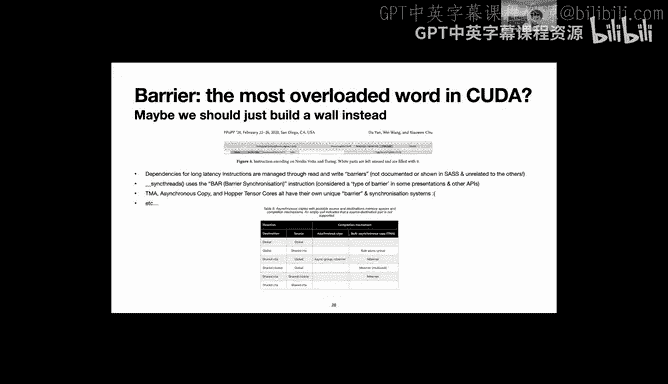

So this is one resource that's kind of put in a weird place in my opinion。

 but it's like incredibly useful is 541 atic instruction throughputs so that's kind of individual official documentation of what different throughput or different pipelines is across generations some of it is like non obviousous like for example population count for pub counts is like change weird over generations so it's a really good reference and you can see like 64 bit is not supported on the consumer GP's at eye performance and so on what this doesn't tell you。

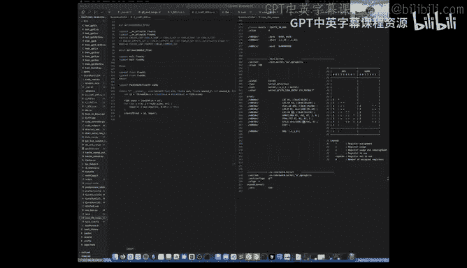

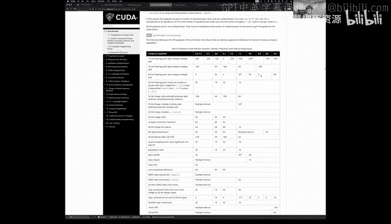

Is how does this add up what can you co issue and so on again I think in many cases it doesn't matter too much like we know that we made like thex2 FP22 pipe on consumer MP and Op the one So buck bottleleck is probably more important。

嗯。So this was going to try showing the webs doing dependencies in insidecomp given insidecomp is way too tiny I think I'm just going to skip this and yeah it will take way too long to do properly there is really good documentation that maybe I should just point out where it is。

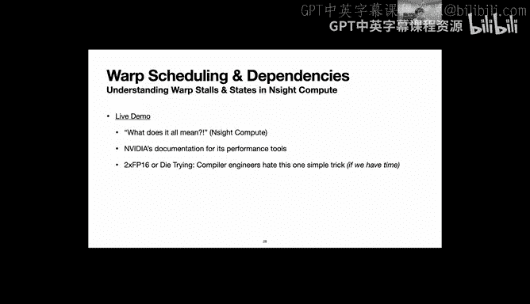

There is。The profile documentation from NviDdia。Okay， don't actually have it open。

 that's annoying okay。I'll link it after the fact that got。

 I've got an appendix that I need to add a bunch of things to of the actual PowerPoint presentation that I'll add this to afterwards。

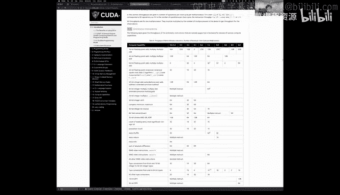

The FB 16 thing was this kind of interesting side note like Eric mentioned HFMA instructions being in weird places。

 I could try to quickly find it in live demo but it's not that interesting there are instructions that sometimes Nvidia using some of those other pipelines to do something like a move that just copies a register because that's the pipeline that's free on that cycle or for some reason it's actually the more efficient pipeline to do it on bywise or whatever so you will sometimes see some instruction that basically just do a copy of writing zero to register that is very weird encodings and。

Yeah， it's kind of once you know what to look at for。

 it's very easy to kind of just realize that's what it is。

So this is kind of a side note that's really important to think about performance analysis in video I really like talking about little slow and I think it's a very good eye level concept it comes originally for like industrial autoomy like industrial。

Kind of modeling of rates of factories and things like that in order to add the latency of in factory or an escalator。

 like the length of the of the supply chain， you need a certain amount of things happening in parallel in order to be able to add the latency and achieve the beat output so。

The implication is if we want a outputput of， let's say。

101011 output every 10 cycles and the latency is 400 cycles。 You need a minimum of 40 threadreads。

 40 warps to be running in parallel。 Otherwise， it doesn't matter what you're doing。

 You will not be able to add latency and you will run at load performance。

 The key thing that iss kind of relevant as matter of thing about Saas is it's not just about tread level parallel。

 It's not just about occupancy and and wars， it's also about the amount of instruction level parallelism and or many loads up in parallel in the kernel。

So this is kind of a。Simple example from one of Nvidia's presentation of a GTC this year。啊嗯。

Something else that I think people often don't realize as a coronlinary is that。

Because it's effectively sampling randomly。I mean， obviously the caululas are very complex。

 it's actually sometimes as we bes that means it's not random。

But you can kind at the first approximation， assume that。What a war what a Tread group。

 at least is where it is in the program， like on the right。

 is it like the first loads or is it doing the final store， It's kind of random as depending like it。

If you take the full littency of the program， the probability of being in that part is roughly the latency of that part of the program and therefore sometimes you're just going to get unlucky。

 you might have more threats doing the part that has less instruction level parallel at the same time and then you don't manage to keep your GP busy。

诶。This seems like it's less of a problem because there's so many threads。

 but actually like the way memory works is it's split in like SBM is 16 sub channelsnel。

 so in total you've got I think 96 sub channelsnel on the H100s and those kind of all need to be fed like with things to do independently and therefore you actually need in order to get like that last bit of performance like that last one or two or 3% the fact that you sometimes get unlucky is kind of important。

 which is why you need like kind of bit of slack and kind of have more more lengthy tus。

More instruction level power， more track level power is that youly expect in order to hit the absolute peak。

Okay， this is all stuff that I'm not gonna have time to do in much detail。

 I wanted to still probably go to the mu futanage thing for Jelu。 And then very， very quickly。

 the L2 side web M copypy stuff I've been working on like I did that about two months ago。

 something and I haven't published it yet， but I think it's really interesting。

 So the mufrage and Jelu。 I， this is a good example of something I want to use inside compute for。

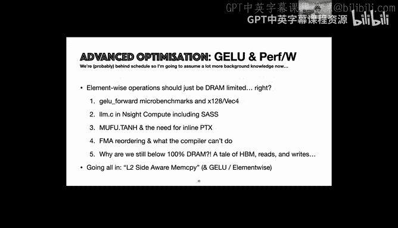

But。I've got the LM。c， this is the current Bf16 LM。

c out of the box and if I look at the Jeelly kernel。The default is actually D output 35%。Comps。1087。

I think this stopped and we started recording， right？So yeah， I can try z in。

 but basically it' just like demi really is really low， computer is really high， what's happening？

And let me see if I can actually copy this part because it is kind of important。

I think there is actually a way to make it bigger if you go to preferences。I think you should。Yeah。

 like at this one。Yep， and then font and colors， oh， and then code font font。AGo font， okay。

 yeah that's very promising。LetAnd then it will need to restart though。OhI see okay， oh。

 that might be annoying because I've got those oh I've got those actually that is fine。

 I've got it saved in that directory。

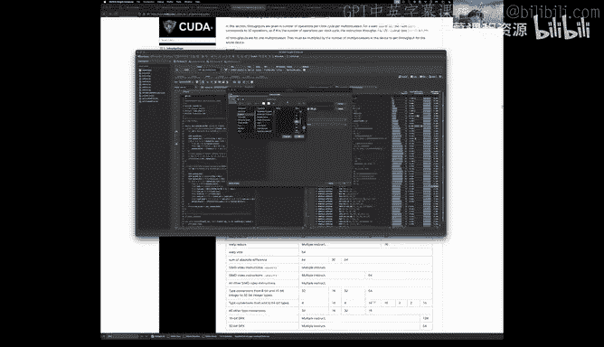

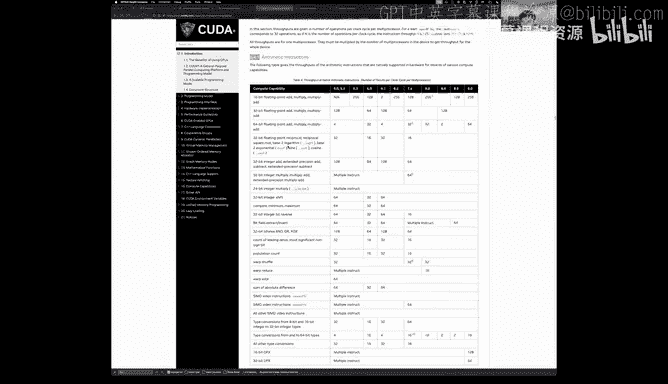

佢啊一。Okay， that's better。Could go even bigger， I guess， let's see what the code looks like。

Okay you want me to make it even bigger I that good enough for now， It's good。

 I can I can't finally read it。 This is good okay。😊。

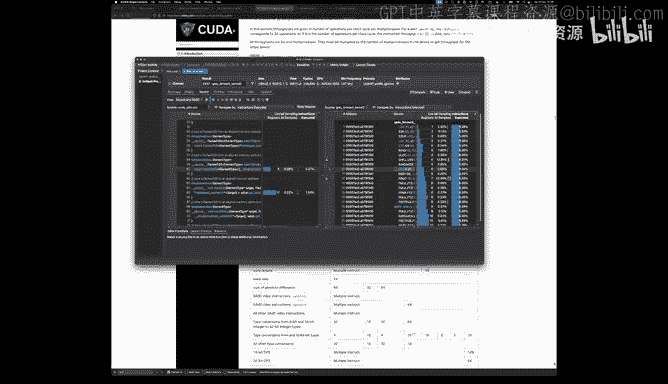

嗯。So if you look at the Je kernel in doc。We've got most of the instructions from this line。

 which unfortunately is kind of multiple things in one。

 but the bulk of it is going to be that10age function。And the interesting thing is the10age。

If you look at the PTx now， source PTx。お当。Okay， this is to always that size。Okay。

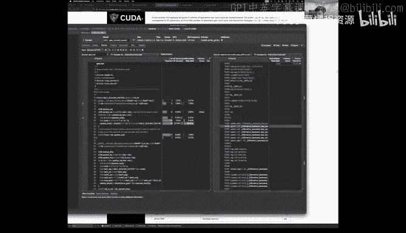

Sa。Right， okay， I'm just going to show in the SA very quickly。

 What's happening is the1age ear is implemented in a really slow way that is using。

Exponential function and a reciprocal function in the special function unit that's taking taking two special functions rather than one that you might expect if then it was supported natively and。

Then， it is。Doing a bunch of things， including a loop to increase the accuracy。

 So the reason for this is that if you look at the Qa specification。

Is it this one yeah so if you look at a 10H you can see that there's a very specific precision requirements which might actually be defined by 754 I'm not entirely sure of it has to be two ULP error over maximum over the entire range it's really tricky pointing out in software to get it to like be that performance across the entire range。

So you kind of end up having hardware that works most of the time and then a bunch of software tricks that including this loop here that will or brand which loop I forget that end up being used to increase the accuracy of that further and it's the same principle for like customerss and sinners and other things。

In some cases， there are native intrinsic functions。For things like sinus and exponential and so on。

 that I think actually use thematically if you use use Fastmat。

 which I think is probably always the case for Torch and LMT as well。

But the interesting thing is there is no such function for1h。

So there's nothing to help you tell QudA， I don't need this level of accuracy。😡，However， in PTX。😡。

There is。A specific thing as part of。Yeah， this a dedicated ten inch approximation function。

Which has different precision requirements than a stand1 age as in C++ and Cta。

And therefore doesn't have to do any of that junk。So I don't have it open here， unfortunately。

 I might just very quickly try to find it on the LM。cpo but。Effectively。

 you end up with only a single Mfu and instead of the recipe EX2 much simpler code， okay。

 the other thing I can quickly highlight here is。

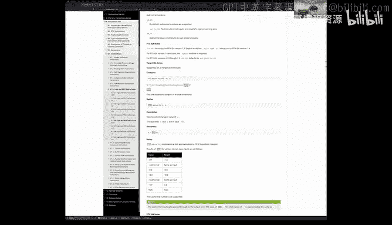

嗯。Is because of this loop， it's actually not able to move the operations to maximize the amount of memory level parallelism as well。

 so it's kind of bad for letency tolerancence because it kind of kind of encourages at least the compiler not to move things the right way。

🤢，So it's like W bats， so the way to fix this was this old PR a。Where funds changed。

Where you change that you have to use in L PTX and this is an example of something you have to use in L PTX there's no other option and then just works and you in more than double the performance。

There's another very quick trick that was kind of interesting is in the original code。

You've got this thing of seeus。Effectively， you end up with this。A multiplication。In addition。

And then a multiplication of these two things， so it's an F mode and F at and an F mode by reordering it this way and kind of adding the 0。

5 times x twice you end up with only FML and FMA so you save an instruction。

And this is something the compiler cannot really do because floatinggging point isn't like fully lucky。

It's not comm and therefore it would slightly change the accuracy I've worked in compilers for like mobile devices at imagination that did do this kind of optimization。

 but I think typically Quda tends to be quite straight with these things and so you have to do these things yourself and it's not really obvious like if I look'm especially this line that's kind of should have been sp out it's not obvious that this thing will result in that problem and looking at the SAS kind of a nice way to find that out。

Okay， I will not at the time to do that。

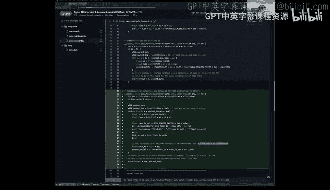

Something else I wanted to very quickly mention is when think about like the speed of light and the efficiency of。

Of DRA， you cannot actually get to 100% of DRA。And an interesting effect that。Yeah。

 I'm going really have time to explain why it matters and what opportunity can do with it but。

If you've got to share a kernel that only reads from D。

 you might be able to read 95% of the speed of light， or even only write for DM be 95%。

 whereas if you're doing a one to one read to write ratio because there's some over in HBM for changing between reads and writes。

 you might only be able to reach 90%， so the speed of light often is's like a theoretical limit and there's load of low-level bottlenecks like a D like bank conflict for instructions and so on that actually you don't create a new analyzing unless you look at like RtL alpha waves and you just at some point have to assume that you're the best you can do even the constraintsstrain UF。

嗯。So the last thing I wanted to go to and I don't think at the time of did properly is one kernel I've been working on recently is an L2 sideware man copypy so the NviDdia L2 is split into and unfortunately the only kind of good public information about this is this presentation from。

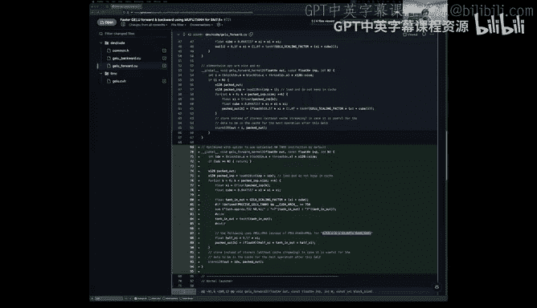

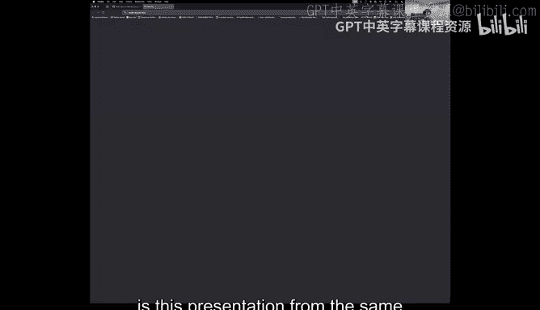

The same people who did the volatile White Paper。

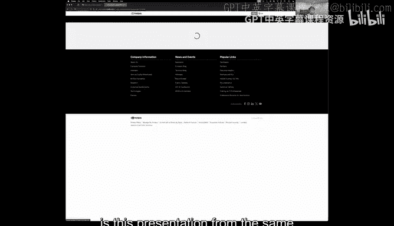

Okay， that's annoying。Which kind of show you Oh， like。

 it switches every 4 kB between the two L2 sides。 So there's not really any way to kind of say。

I want this。😡，I want this piece of data to be on this side of the N2 or the other side。But you can。

 there we go。Yeah that's the presentation so it's dissecting the MP GPU Mac quite architecture so that's kind of if you're interested in a kind of low level details a very good presentation it's showing oh there's a massive latency difference between the two sides like it's adding like 150 cycles even from L28s between the two sides there's also the interesting thing that kind of wasting some of the L2 because data might be duplicated in both sides。

And。If you look at the addresses， I think maybe that's different for8100 and8100 days say 8 kilobtes can it's actually 4 kilobytes on Al so what I've done is I've created a kernel and the mapping is actually very predictable between pages。

 I've created the kernel that will end up at persistent threats knowing based on the SM and an ID and then a test to figure out what the latency is knowing which side of the N2 it's on and like each SM is only responsible for a part of the memory that is on its own side of the GPU。

So this requires it to be like read write one to one if it's not one to one。

 you couldn't do it for both reads and writes in you could do something crazy like this for like a tensorcle Maxmal just for one of the two input matrices that it would be kind of interesting to get it to work。

But what this gives me is on age 200 it improves performance by 2%。

 which is not amazing but it's kind of nice for a jelly kernel for menco beat kind of same performance。

 but then it actually reduces power from 490 watts to 435 so it's like an 11% power efficiency improvement which is actually well quite a lot like as we've seen that's about 20 nuclear reactors if you do it obviously jellyry is on the tiny part of a kernel and normally you do kernel fusion but there are things where I think this would be kind of relevant is a good example like a very kind of microarchitecture related very lowle thing that you can only do this kind of thing when you can of start digging at this at this depth。

And then， yeah， I think that's basically all I've got， at least of the things I've got time for。

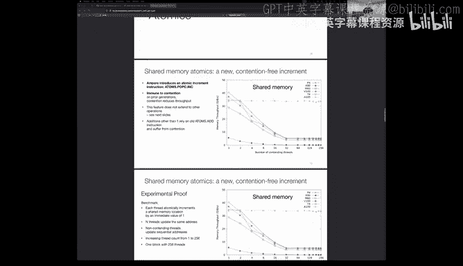

And if you've got questions， let me know。All right， thank you so much， this was pretty sick。

 Like I'm going to start reading some maybe comments and questions from chat。

So Don asking how did you measure power， I don't think inside compute gives power startss right that's right so inside compute by default yeah I'm still sharing right inside compute by default actually change the clock to the base clocks。

 which is something you also have to be careful for about because that makes some of the data and thenre so the way to measure power is just NV the SMmiI so I did it kind of brute force there is。

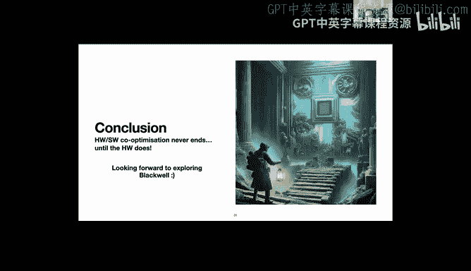

D option LMS that just loops it and we kind of just update the power they live。

You can also write a script that passes this if you want to properly automate it they are like in VMl and VMl like theres some API video that means you can do it in your program but a lot of these things like including some of performance counter stuff does not acted that much benefit from using these APIs at least for most use cases。

 like actually just using those tools and passing it as a separate thing tends to be easier。Yeah。

 I think another nuance is like most cloud vendors won't let you change these that's like at all。

 And so like I think for a consumer cardske， you can do whatever you want。 but data center。

 I think they'll keep the power low。 but I I could be wrong I believe inside compute there is that option of setting to base clocks so you cannot actually change clock cannot say for the clock but inside compute will still change the clock to something much lower than what you get in practice and still affect all of the data you see in inside compute by default and theres the command line of and like in inside compute this clock control here we can base and none So none means the clock is dynamic and dependent on terminals and other things。

But yeah you cannot measure power in Land computes。

 and even if you could you wouldn't want to because of the way the profiling works。

 kind of change the workload completely， you want to use NVSMI or other API to get that。

Thanks well I don't see any other questions you ask something more you didn't really talk that much about war stall。

 but that's kind of like the entire reason why we do this right to avoid war stall and something I only found out very recently is that in the SaS view of inside compute there's actually like a tiny thing more and then you can select like specific warp stall and also switch between genetic war stores and war stall but no instruction was issued or something And now I'm wondering why you like the default thing is to show warp stall and not just war stores where you actually didn't do an instruction like it seems like those are actually the bad ones and the other ones you don't care about like do you have any idea about that。

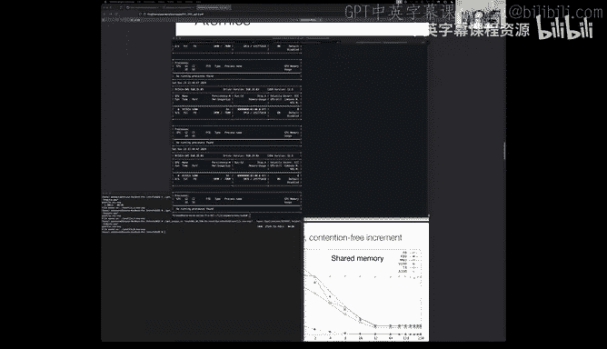

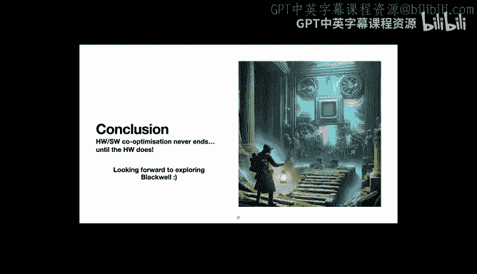

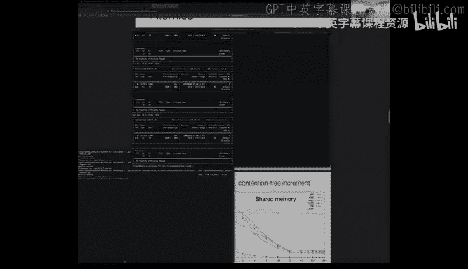

I donet。 That's a good question for Nvidia。 Are you talking about this tiny thing that， No。

 if you go to the navigate by thing and click on the small arrow down like。goes towards this one。

Where you can select like which column to oh， poem chooseza。

Yeah exactly and there's also Bob store sampling no not issued sentence right and that's disabled by default but like which one do you think is the more important one to actually look at。

I don't think it makes that much difference。😔，No， oh， I see what you mean。

 like it's the case where was there something to execute on that cycle anyway so it didn't matter that we had a stall from this warp。

Yes exactly like that seem not actually bad war stores like if you have an algorithmism we don't really care so I decided not to comment in so far but I think this one I have much coming now。

😊，So。This scenario can happen when there is no resources that is available。

So if the warps are basically waiting for a resource to become available， then it will wait for that。

😊，好。So I guess both are critically useful based on both are important so but you can't control。

 I mean， if you want to change how you want to figure out whether the resource is available or not。

 then you have to change your code significantly。😊，嗯。

Because that is fundamental to like how the Wp in itself figures out at run time determining whether a resource is available or not to dedicate whether a warp should execute or not。

😊，Yeah。Yes。I think so， I think like this's also like just limits fundamentally to what' the。

Program counter sampling can get like the like compared to what you out waves so we see everything at the same time you're always going to be somewhat limited and all of these things are kind of approximations for the wheel button that is。

By the way， Eric， please ask this question when we have the NSC team on this call。

 hopefully early next year。😊，Okay yeah， great。We were supposed to do it today， but did not happen。

We were too slow in scared in it。Oh， I think I lost that one that's the same I was going to show the thing in inside compute where I've only got。

One of the two L2 sites that's actually doing anything。

 but I don't think I've got the right thing open now。Oh， yeah， so basically in inside compute。

 you will see this thing。Whi I'm kind of surprising with I even shows because it's basic。

 I can't think of any use case for like end user for this to be useful unless they're doing this kind of crazy thing I'm doing。

 which is the amount of traffic between the two L2 sites。

 which is typically kind of identical the traffic to the L2 gas or or to DRA gapping to the L2 gas。

 and those numbers basically just always match but what I got in that kernel was this number basically goes to like 1% of the other ones。

 which shows that it's working。I'm not complaining that it's exposed。

 I'm just kind of saying actually there are things in here are useless most of the time unless you're doing crazy things unless you're doing crazy that's important。

 Yes very， very， very important I'm more used to kind of able to go like the row count like the row thing and go to like crazy column over here So I'm not complaining just like there is so much information you can get in these tools that like very。

 very few users per use， including myself most of the time right you don't actually need this like just looking at the computer workload that when we workloads and then the stores in source will tell you a lot of it might not tell you exactly what's happening will tell you what to focus on I you basically said in the first slide of your presentation we need two small nuclear react react if we do the optimization but so you can save it So there are people who try to do it。

😊。

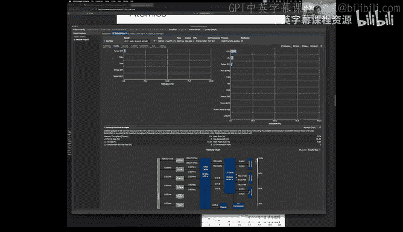

Right。Yeah， I mean， I would hope so because yeah， nuclear reactors don't feel like the first choice for most problems to me。

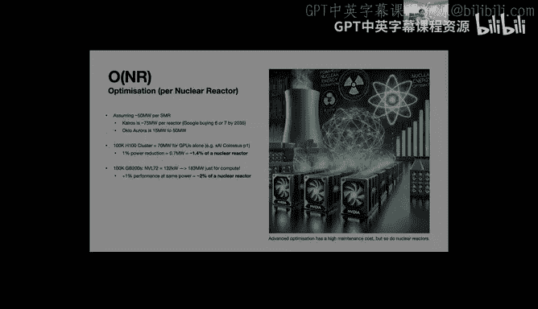

Any other questions welcome to just。They said to me on this call as well if you want。

 if you've got anything else you want to ask after afterwards。

Yeah I might call it just to keep the sort of YouTube video underneath two hours。 So yeah。

 thank you so much again， Irun so， so for context textbooks。

 we don't have too many more talks for the rest of the year。

 we have one happening on Thanksgiving weekend， which is gonna be about a little bit arm kernels and then I'm going be talking about George Tiytan and distributed computing as like our last lecture of the year。

 if there's people you think you would really like to hear from for next year please let me know in general otherwise thank you so much to everyone and thank you again。

😊。

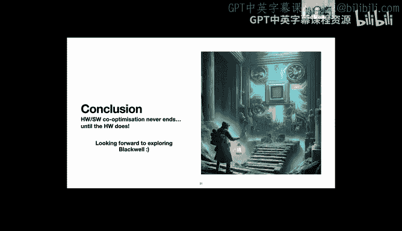

嚟接。😊。