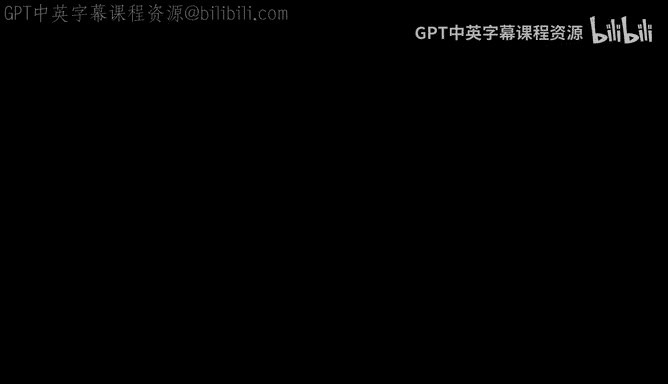
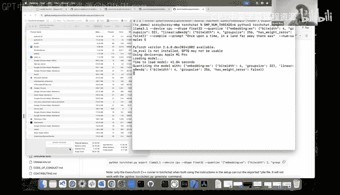
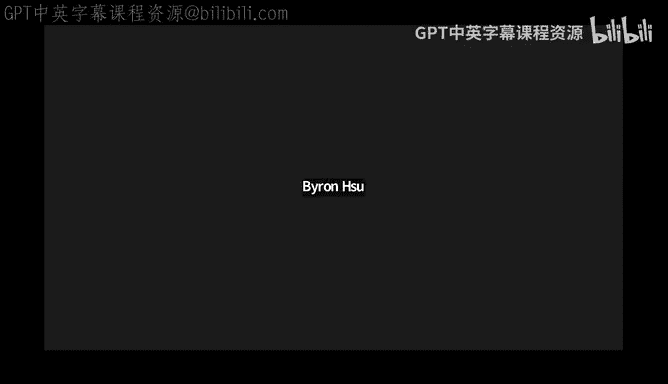

# GPU MODE《CUDA、GPU编程1-53课｜GPU MODE》中英字幕（deepseek-v3.2 - P41：-20241201-Lecture 38_ Low Bit ARM kernels.zh_en - GPT中英字幕课程资源 - BV1QZ421N7pT

Talking to us today about， he's going to be talking to us today about little bit kernelels。 So yeah。

 let's cop。 Please stick it away。

。Yeah， thanks for the introduction， Mark。嗯。Yeah， so I kind of go over kind of broadly like this little bit kernel work that we've been working on there are about 10 slides so feel free to interrupt me if you have any questions。

And after I go through all the slides， I might do a little code walk through and maybe do a demo inside of Torch chat。

But first， let me start off with， can everybody see the slides。

 are they like a good size for the fonts and everything？Yeah， they're pretty fair。

So let me kind of start off with like what exactly we did。

 so we developed low bit operators for Ar CPUs primarily and by low bit operator I mean two types of operators that we developed one was linear operators that have eight bit dynamically quantized activations and low bit weights and another one are embedding operators with low bit weights and by low bit here we mean one through8 bits and these operators work across all Pi torch surfaces including eager torch。

comppiile Aotti and Extorrch and they're available to use inside of torchchat and Ex torch today torch chat by the way。

Is sort of the pieytorrch solution for running LLMs locally on your desktop。

Are there any questions so far？哎。I assume that most of you are already familiar with quantization。

 but just in case some maybe isn maybe you might just like talking a bit more about like maybe people might not realize our pervasive arm is so you might just giving a few examples of like。

Oh sure yeah， so arm CPUs have become very popular recently so most mobile devices like Samsung phones。

 iPhones， et cetera， all those are running arm CPUs and all of the new generations of Apple Mac are running arm CPU as well。

 So if you have like an m1 Mac or an M2 Mac or an M3 Mac those are all running arm CPUs。

 So for consumer devices arm has become quite popular。

Compared to like maybe five years ago where X 86 Intel was very popular。

 X 86 and Intel is still very popular in server though。Even in servers。

 by the way like my understanding is like the most recent like N video hardware like the post 800 stuff is all going to be with R CPUs as well Okay it's Grace Howare generation Grace Blackwell generation。

 both of them are armoriented so there's a lot of interest in Arre Silica。嗯。Yeah。

 I didn't realize what was going on the surface side of her arm， but yeah。

 it seems to be getting more and more popular。So。Because I'm coming from Execut Torch。

 which is like a Pytorrch's mobile library， that's kind of why I'm primarily interested in arm because for old devices like arm is really all there is。

 but it's good to know that it works across or will be important for other services as well。

So I think most of you are probably aware of what quantization is and what we mean by a little bit kernelels。

 but just in case somebody isn't， I wanted to devote like one slide to it。

So the kernels that we're talking about here are related to athine quantization and so here we're going to try to shrink the weights in a model down so the weights are typically like let's say floating 。

32 weights we want to shrink those down to use less memory and we're going to do that by representing those floating point weights as integers or low bit integers such that the floating point weights are some athine transformation of the quantized integer weights and so for example here I have these floating point weights on the left here。

 those negative 6。6 negative 2。21。1 negative 1。1 those are my floating point weights and I'm going to represent them by this athine transformation here of these low bit integers so the low bit integers here or negative 403 and 1 so I can take those little bit integers I can shift them by this 0。

2 and then I can scale all of that up by the scaling factor 1。1 and that。

Is me my flooding point weights the advantage of this， of course， is that my integers here。

These integers here are actually 3 bit integers because they fit in the range negative4 to positive 3。

 so those3 bit integers take up less space on device and in memory than than the 32 bit floating point integers。

 So what we're talking about when we talk about these low bit kernels and low bit operators is we're going to talk about operators that actually operate on this quantized domain。

嗯。Any questions there before moving on？Okay， yeah， I mean。

 I have a question like at least for like Nvi hardware like there's sort of a difference between like storage d types and compute d types。

 So so for things like arm， it sounds like these are compute de types you can actually do math and lower bit kernels And if so like I'm wondering do the skus really vary across like various vendors or most vendors looking to support like basically down to two bit kernels。

 Yeah， so that's a great question。 So actually the compute is not done in two or three bit。

 I'll talk about like how the compute is done in a bit， but the compute is done in8 bit integer。

 I see okay so this is just for storage at the moment。

 and then I'll talk about how how we eventually turn this into compute。 But yeah。

 there's no hardware support for like these low bit compute。😊，All right， okay， thank you。

So for the low bit linear operators that's so linear operators that's basically a matrix multiplication and so the dominant operation when you're doing matrix multiply are these dot products between your activation vectors and your weight vectors and if you're doing a dot product between your weights and activations in FP32 domain they can be computed by dot product in a low bit integer domain and that's sort of what I'm showing with all these equations here you don't have to read the equations very carefully I think the main thing I want you to get out of this is we start off here on the left between a dot product between my activations VA and my weights so that's a dot product between two floating point vectors and if those floating point vectors are represented by this aine quantization you can kind of work through all the math and eventually what you get at the end of the day is this dot product between these Q values here so that's the dot product in integers。

And on CPUs， dot products and integers can be done faster than floating point dot products。

And I guess to Mark's previous question the arithmetic here will be done in Anteate it's not going to be done in like in3 or something。

 but we'll go over that on sort of the following slides about how that works。

 but the main thing to get out of this slide is that when we're doing matrix multiplications and we're doing dot products rather than do it in the floating point domain we can do it in an integer domain using this equation。

Any questions here？Okay， so next I'll talk about sort of the high level。

Design for the linear operator。So the linear operator is basically like an operator that does matrix multiplication and the way we organize the compute here is we organized it in this two level hierarchy where we have our top level of the hierarchy and a bottom level the hierarchy so in the top level what we're doing is。

Where we have this activation matrix， which is an m by K matrix and we're multiplying that by our weight matrix which is K by N and that produces some output matrix from the linear operator and each we're going to take the output matrix and we're going to tile it into like smaller tiles and each tile is going to be computed like on a different thread so at the top level we're tiing our matrix into these smaller tiles so that each of those tiles can be computed like independently like on a different thread。

And then the thing that's actually responsible for computing the tile is the kernel。

 And that's what the bottom level is about。 So the kernel is going to compute each of these output tiles and the kernels here are single threaded。

 but they're vectorized， so they're making use of。Of vectorized instructions on the R CPUU to work。嗯。

So that's sort of the broad way in which the linear operator is organized here with this top level which is multi-threaded and this bottom level which is single threadreaded but vectorized and we wrote our top levelve operator to be agnostic to what the bottom level is doing so the top level is responsible for tiling and threading but it doesn't actually know like what the bottom level is doing or how the bottom level works and we did that so that thirdparty vendors can swap in their own kernels here and we're currently working in or we're currently working on bringing in some kernels from arms cloudy AI library into this overall framework that we created。

Question when you do this this is not actually optimizing for cash efficiency right so this is optimizing for output residency so yeah so what are your thoughts on maximizing cash efficiency because we are doing at the end of metaplification cash efficiency is very very critical here so。

😊，Yeah I think that's a good question so we did look at that when we were first sort of like thinking about this overall design and we look at other libraries like bliss。

 which kind of are sort of cashware。嗯。Ultimately， though we see like fairly good performance with this design and this is the design that XMpackC is using。

 so we went ahead with it anyway， although it would be interesting in future to like come up with a second operator that is more like cashware。

好， thanks。So what are you optimizing for when you're tiing like basically do the sizes of the cache need to fit the size of each style does each style need to fit in cache or not or like I'm trying to understand what each level is optimizing for。

嗯，嗯。So when I'm tiling here， we're optimizing for kind of work done on， I guess a single CPU。

 so it sort of related to the， I guess the number of threads。嗯。But。

One thing you can do is you can just sweep over different kind of tiling configurations and choose the one that's best for your hardware。

 although we have a default one， which is similar to what XMpackC uses。嗯。

But yeah I guess not a lot of thought went into the tiing。

 I guess is the opposite my understanding is that here what's happening is that youre optimizing for all food to be resident so it is more like register reuse and want you want to avoid as much of rights and you want to maximize amount of reads that you actually do but this is not the optimal design even for the CPU so that was why I asked the previous question so。

嗯。So one thing I will I wanted to do at this point is actually。

 so I just kind of give some code pointers。If people want to go look at the code here for the top level on the bottom level。

 so if I drill into the top level here。This is the correspondingent code pointer and as you can see we're just looping over these tiles。

 we have this loop that's done in parallel here and this parallel loop over the tiles。

 it's calling this lower level kernel function here。

And that kernel function is what a single thread have vectorized。

So it's just like regular C++ or is this kind of like I'm just trying to map this like is it sort of like a super set of the language kind of like what Ka is you need a special compiler for this or you using yeah this is regular C++ I see so this U kernel config it's a C++struct kernel function here is a function pointer so it's just a C++ function pointer and。

Paraallel 1D is a function that we wrote that does the parallelism。

So but all of this is sort of standard C++。I see， what does U kernelel stand for like micro kernelnal？

Yeah， this is the microcranel。What does that mean， by the way， and just an armed terminology？Oh。

 it's not an arm thing， it's I guess the term comes from X impact。

 but it's just what they call the kernel functions that compute these smaller tiles。

So U kernel is what I called earlier kernel， so that's what's doing this bottom level here。Oh， I see。

 So just like like kernel means is split into then micro kernelnal means process tile sort of or in this terminology I used here。

 operator is the top level which is sort of splitting into tiles and then the U kernel or kernel is what computes each tile。

 but the use itself does more tiling and that tiling' is done at the register level。But the operator。

 it tiling is done like at a higher level where it's it's more cared about threading and things like that。

 but then the kernel within the kernel，There is more tiling going on。

But the high level isn't actually aware of like how the kernel works or what the kernel is doing。

 but I'm just telling you that the kernels that we wrote do tiling within of this function here。

So that's the high level and then。if I go over one here so we have a question from chat。

 actually two questions。So we have through there asking what was the Ar library you mentioned you some sounded something like cloudy or something oh yeah。

 so the arm library is called Ky AI and so it's I think a fairly new library that Ar has introduced it's integrated with X I now and we're pulling it into this library as well。

They don't currently have a ton of low bit kernels， but they do have a four bit kernel。

 and I think they've promised to introduce a three bit kernel by end of year。嗯。But yeah。

 I would encourage you to go check it out so Clyde AI， so that's K L E I D I and the AI。

And you can go look at their kernels， but it is a kernel library。

 so it's not like a multi threaded library， it's single threaded。

 but their kernels are using these vectorized instructions for the RCPs。

We got a whole bunch more questions so Andrews asking arm Sos are often heterogeneous compute does parallel 1 D account for this or is it fairly simple？

So parallel 1 D does not account for this， it's fairly simple the way it works is。嗯m。

So these kernels I mentioned earlier work for all Pytorrch surfaces， including Pytorrch and Ex torch。

 so on Pytorrch， parallel 1D is going to be compiled to the at parallel4 if you're familiar with that。

 like A1s parallel4。Whi under the hood will use OMP or threadpool depending on like how you compile Ply torch on Ex torch side parallel 1D compiles down to Ex Torch' threadpool。

 which is a wrapper around P thread pullol。Dershawn is asking。

 how do you decide the tile size based on the cache size considering activation， weight and output？

Yeah， so we didn't do a lot of exploration on trying to trying to maximize for cache and things like this。

 the kernels that we currently have here are gem V kernels and so the tile size along the if I go back here along the M dimension here the tile size is basically m sQL1。

And then the tile size along the NC dimension for the weights。

 that is eight and that is to take advantage of。嗯。诶。诶。

So it's A to take advantage of sort of the kernel structure that we have。At the bottom level。

But not a lot of thought is going into like cash locality or anything like that。

E Bokov is asking this looks， maybe it's a comment， I think。

 but they're saying this looks pretty similar to FBGmlib， they also use microcrs。

 aren't they available for R？Yeah， I think。It's not only similar to FPG it's also similar to many other things。

 for example， this is also very similar to XMpack like this is exactly how XMpack arranges their compute for the metrics multiply and。

I'm sure that FPGM does have arm kernels， and XMpackC also has some arm kernels。

But I don't think they have arm kernels for  one to 8 B。

 So for these for all these little bit values， which was our like starting point。

 So we wanted a bunch of low bit arm kernels and a place where we could experiment with them。

 So Ex pack has a four bit kernel for arm that somebody on our team wrote for Ex pack。Umum。

And rather than contribute like one， two， three， et cetera， a little bit kernels to Ex pack。

 we wanted to have a library where we could explore and kind of play around with different quantization schemes without it being like super polished and like ready to like pull into X pack although。

If some of these schemes get used， we might try to push them into XM as well or FBGM。

 but they answer your question。诶。The reason we weren't using some other library like Cloudy AI or ExM PackC or FPG is because many of the kernels that we wanted just don't exist in other libraries。

Got it， I think that's the last question。Thank you for that side quest， so please keep going。

So that's the top level， the bottom level is the kernel here and I wanted to just show you like a code pointer here it's single threaded。

 I won't go over it in too much detail， but you can see it depends on a bunch of these vectorized arm instructions and this is using the arm Nn。

And transics。Okay， so that's the high level operator design for for the linear operator。

 And so in addition to this eye level。Operator， we wrote our low level kernels that use this operator framework and。

The kernels that we wrote are what we call universal low bit gem V kernels for MCCPUs。

 and so these kernels work for all bit widths between one and8 bits。U。And。

When we started developing these kernels。The the main thing we started with was。嗯。

There is no like hardware support for like these low bit compute。

 which was I think a question earlier on so there there's no hardware support for doing like three bit dot products or  seven bit dot products the lowest like bit width that you can do in the RCPU is the 8 bit so they have instructions for8 bit integer and so we thought of the。

These lo bit kernels as having like two sort of independent components。

 there's a component that unpacks your low bit values into8 bit values。

 and there's a component that does the compute on8 bit values。

So we have some aBI matrix multiplication kernel here。

 it takes in8 bit activations and A bit weights and it computes some floating point output because it also does decoquantitization as part of that。

嗯。And to get the AB weights， we have a separate routine here that unpacks some low pit value。

 like in three values into in date values， and we viewed these as two like separate independent components that could be optimized and developed independently。

So in terms of the kernels， we have 24 GenV kernels for arm CPU based on different tile sizes and whether or not theyre weight zeros or not。

 and then in terms of the unpacking routines， we have eight different unpacking routines。

 one for each of the B widths， so one for one bit two bit etc ce。

 and all the packing routines are vectorized。And so if you look inside of the kernelel。

You can see this is our unpacking routine， we call this unpacking function and this function is force in line。

 so you don't actually pay the cost of like this function call inside of the kernel itself。

I'll pause there and see if there are any questions。

Do you mind talking a bit more about inlining just just like how come you wouldn't pay the cost？Sure。

 so if you go in so。This diagram is just conceptually like how we thought of the kernel。

 but it's not actually like how the kernel is written。

 like all these components are actually like in the same function。

 So all these components are in the kernel itself。 So if I look at my kernel that does little bit compute。

 It's this guy here。 And you can see it has some loops and in the innermost loop。

 it's calling this function here that does the unpacking So this is going to unpack my little bit values into these。

Vectorized aBd values here。But then when we define this function， we put a compiler flag that says。

 hey， force in line this function， so the function gets force and line here and so by the time the compiler is like done working on it。

 like there isn't actually a function call here。咩事。How many。

So here it says Vec unpack 128 low bit values。 So this is like unpacking a single 128 bit vector into 128 divided by。

Like like each of those vector we want to a divided by eight in size。诶。

No okay so it's templated on weight and bits so this can be like 3 bit4 bit，5 bit etc ceter。

 And so I'm going to unpack let's say it's four bit。

 So that means I'm going to unpack 1284 bit values So by the time I'm I'm done unpacking that it's going to be 64 bit right because I have 128 values each one of them is four bits and so in total that's 64 bits。

And they get unpacked into these variables here and these variables here are from arm neon。

Intrinsics， and each one is 16。Innate values。So you can see we have eight of these。

 so eight each one holds 16 in eight values。Oh， interesting。

 oh now you'd have 128 values that are could unpack。

I had no idea like so these like int8 times 16 like this is specific to arm right like this is not a generically available de type in so this is like part of arm intrinsicss and it's because the arm register is 128 bits and so that holds 168 bit values。

Okay， and so the idea with them creating this was to just have a packing format。

Or other like like basically if people have smaller like they basically expected people would come in and write a little bit kernels and back them those eight times 16 do't think a by 16 is necessarily related to little bit kernels it's so arm can do compute in8 and so this is just the number of in8s that you can fit in one of the registers。

They have like they also have like a F32 by four。So for floating point。32 values Scott。

 maybe this is a dumb question and maybe this will help me answer the question which Mark is also asking what is a cash line typically in the systems is it 64 byte or 128 byte？

I think on Mac at least it's 128， but I made a double check there。

Okay the reason I'm asking is I'm not sure if int8 by 16 is a good idea or int8 by8 is a good idea so I was actually trying to pur to figure out which of those two will make a differentiation and Mark I think the reason why in8 into 16 is a way which the instruction is there is because you want to maximize your vector load from your CPU memory your CPU memory is already limited you can't do a lot of instructions so you want to maximize the number of parallel instructions that is doing load here so in8 by 16 use to the maximum vector load operation you can do。

😊，Yeah that makes a lot of sense， I guess what what I'm also trying to understand is like the semantics of like doing an operation on this like let's say I I down here seriously okay I have the operations the operations work on these D types so you can do。

 for example multiply to8 by 16s and get an8 by 16 result or probably。

A 16 by4 result if there's overflow depending on which operation you call here。啱。

But in the arm registers， you can operate on an 8 by 16 or you can operate in on an 8 by 8。Generally。

 though， like when we benchmark at least on Mac， operating on 8 by 16 will be faster than operating on  eight by8。

Do you have something equivalent to show on the X86 platform because the VDCQ and all of those operations are all ABX similar these are these are like kind of the ABX operations on X86 I don't remember exactly what names they call them but they have a similar thing X86 is a similar thing for 8 by 16。

It's like MMm 256， something something yep。Yes， so Andrews also adding a comment that Ar Nen is an API for Sd on Ar CPUs for context yeah for what is I think we your comment is correct is like when when I Googled B do Q it showed up everywhere from like X 86 it showed up like for unity it showed up everywhere it seems like these are like well established intrinsic I see。

I mean， this instructions， when I say， I remember AVx 256 or 128 instructions。

 they have a very similar semantic。😊，Yeah AVX has the dot product instruction as well so you can do a dot product on AVX as well So here in general like how armed does their name and conventions here so V dot that means it's going to do a dot dot product the Q that means it's the8 by 16 variant and not like the8 by8 variant if you do the one without the Q would be the8 by a variant S 32 is like what it accumulates into so we're multiple we're do dot product of8 bit integers but then the accumulations done and in 32。

嗯。But this function， this function that does the impactpacking， this is something we wrote。

 So this function。Unpacks your little bit values and puts them into these sort of variables。

 these eight by 16 variables。Any more questions there？

Do you mind try ask like so I think the packing is missing from this picture I'm curious if you could show us how that works as well Yeah。

 the packing I'll do on the next slide I can also pull up the code pointed for the packing So all of our packing functions are here you can see we have ones for one bit2 bit3 bit etc ceter and then all of them eventually gets kind of collapsed down into this one interface。

U。But let me pull up like a。Like a four bit packing thing。So。Here I have this function。

 You can see it's in line here。 and that's the force in mininging I was talking about。

 but it's pack 32， U and four values。So you take to your unpacked values。

 each unpacked value is a U and8 by 16。 we have two of them because there are 32 values we're going to pack。

It writes them to this packed memory location here and you can see it does that by。嗯。

Shifting over some of the values and then taking an or and you can see all these are done using these CD vectorized instructions and the CD vectorized instructions are all operating on these these data types。

 this like end date by 16 data type。嗯。But。Conceptually。

 kind of let's think about how the packing works and how we can optimize packing on the next slide here。

I guess like Doshaun is asking how are negative the values spec Yeah excellent question so that we don't have to worry about two's complement and all of that we first shift and then we pack。

So we'll shift the low bit integer vectors so that they're in the non negative domain。

 we'll pack them， and then to unpack them， we pack them to the non negative domain and then shift them back。

So let me see if I can find the shifting logic here。嗯。Bye。😔。

So this is the function we looked at earlier packing 128 Lic values and you can see what we do is we get our values here which are in 8 by 16s and one of the first things we do is we shift them so that they're in the positive range and then once they're in the positive range。

 we can then pack them without worrying about whose complement and that's how the backing works。

To you have to remember that the value is negative though， when you're unpacking it。

 how would you know？Because we have a V pack function here and we also have a V unpack function。

 so the V unpack function knows that how the V pack function work。

So when I look at the V unpack function here， we unpack them into the Uent range and at the very end before we return。

 we do the opposite shift。I see。But so for the purpose of negative values。

 you can pretend that they're not there and you can just look at the packing problem as how can I efficiently pack unsigned integers into bytes？

And so that's sort of what we'll talk about on the next slide here。

Are there any more questions before we go on？You should keep me going now， okay。

So packing4 bit values is actually quite simple because there's really only kind of one way you might do it。

 but if you think about some of these other kind of weird bit widths。

 there are lots of different ways you might think about doing the packing so as an example let's look at three bit values so how can we pack three bit values into bytes so that they can be efficiently unpacked and。

We want to focus on unpacking efficiency because that's what's used inside of the kernel。

 so the kernel does the unpacking of the bytes and then does the operation in and eight。

 but the packing that can be done ahead of time and so we don't care as much about the efficiency of the packing we care more about the efficiency of the unpacking。

Okay， so we have let's say we have eight three bit values and we want to pack them into three bytes so on this slide I have two different ways we can do it so I'm first going to talk through one way which is format one so each value here is represented by different color so the red colors here or all one value we have the orange value。

 the yellow value etc。So one way we can do the packing is the first byte can contain the upper bit for all eight values。

 so it contains the upper bit for the red value， the upper bit for the orange value， et cetera。

 And then the second by that's going to contain the lower two bits of the red， orange。

 yellow and green values and the third bite will contain the lower two bits for like these blue and purple values。

 So that's thats one packing format。And if I have my data packed in this way and I think， okay， well。

 what does it take to actually unpack it back into end8 values？

So I'm just going to focus on how many shifts I have to do to unpack it。

 and then you can work through the ans and ore operations similarly。But if I want to unpack these。嗯。

So let's think about the the upper value。 So for all the colors here。

 only one of the upper values is in the correct spot， which is sort of like this blue gray。

 It's in the third position here。 But all the other ones are in the wrong spot。

 And so that means 7 of them are going to have to be shifted to a new location。

 So that costs 7 shifts to fix the the upper。Third the upper bit。And if I look at the lower bits。

 the green and the purple， those are in the right spots。

 But then these other six values are in the wrong spots。

 And so those other six values are going to require six shifts to get them into the right spots。

 So I have seven shifts from my upper values and six shifts from my lower values。 And so in total。

 it's going to require 13 shifts to actually take this format and and unpack it into8 bit values。

 I'll pause there for a moment。Okay。So that's one way we can do the packing but let's look at another way I could do the packing so another way I could do packing of my three bit values into three bys is I could pack the red orange yellow green teal and blue gray。

 I could pack those all like together。And then the blue and purple I do something funny with just to cover the last two。

If I do it in that way， how many shifts does it take， So for the orange， green and blue， gray。

 no shifts are required。 They're already kind of in the right spot。嗯。

But then I have to do three shifts to get the red， yellow and teal in the right spot。And then。

I need to do another four shifts to get the blue and purple in the right spot。 So in total。

 it were to require seven shifts to get from format 2 back to an unpacked value。

 And if you do that across the different operations。

 you can see on each operation on shift and an or it requires substantially fewer operations to unpack them。

 And so format 2 is better than format one from this perspective， And if I just benchmark。

 How long does it take to unpack 128 values。Using format 1 versus format2。

 we find that format 2 is 1。6x faster than format1 and that's just for the unpacking performance and then if we measure like end and LLM decocode performance using format 2 versus format1 we get a 1。

23x improvement and performance and so thinking about like how efficiently you can unpack values。

Can have like a decent impact on LLM performance。嗯。pause there yeah。

 so so there's a question from Sar， is there a name for these formats like I guess how are you exploring like these different like backing ideas yourself？

Yeah these are just formats we made up so we were just thinking about okay like how can I minimize shift and Nor and like how can I kind of put the bits into different bytes so I don't think they have names and in fact for different bit widths we explore different formats and we're always like benchmarking to try to figure out okay which format is working best and if you have any ideas for formats you want to try it's pretty easy just to plug your format in and kind of a benchmark to see how well it does。

在 thanks the question嗯到这。So actually， yes， actually Strar is also asking。

 how do you benchmark LLM deco performance you like some standard suite？

For the LLM decocode performance we benchmarked using Torch chatt。

 which I'll do a demo of that a little bit later for the unpacking that benchmark is done。

 we have a benchmarking thing inside of Torch A that we built for this withpacking。

I guess that kind of is a good segue to the next slide which is performance here。

So here this is using these low bit CPU kernels to run and benchmark Lama 3。

18b on the laptop I have now， which is an M1 Mac Pro with 32 gigs of Ram and these benchmark numbers were done using Torch chat。

 which is sort of the Pytorrch solution for running LLMs locally on your desktop。

And Torch chatt allows you to run LLMs using different Ptorrch surfaces， for example。

 you can run it in torch eager Torch compile， you can run it with AOTI or Excut Torch。

 and so here on this slide I'm showing decocode performance for Lama 3。

18B using Torch compile and using Ex torch both of them are using the kernels that we're talking about here。

 and so I show decode performance as a function a bit with here。嗯。So。

You can see here that add about four bits we get just under 20 tokens per second and then if you go below four bits torch compile actually gets。

Up until I would say like mid 20s Ex torch， though。I think its peak is that three bit。

Where you get 22 tokens per second and then as you go down more here， like bit with five， six。

 and seven， you do get slower and that's because you become more memory bound here than compute Bo。嗯。

So that optimization thing we were talking about on the previous slide here where we lifted performance and somebody askeds well how do you compare end to end LM deco performance。

 this is how we did it， we did it using Torch chat and just sort of comparing okay we had our old packing routine for 3 bit and now we have our new packing routine and then how does that affect tokens per second。

I was actually like a bit surprised that3 bit beats4 bit because if you think about three bits。

 if you think about4 bit， it's actually pretty easy to do the unpacking because if it's very nicely into a byte。

 but three bit you're doing like all these weird things and so you have like sort of this extra compute cost but it ends up not mattering because because of the memory you're saving。

Although with the older packing format， it did matter and3 bit was lower than four bit so。

That's that So the last thing I'll mention here is one of the things we really wanted to do when we started out this project was we wanted to share code between pitorrch and Extorrch so I'm coming from Extorrch which is like the ptorrch mobile solution but sharing code between Ptorch and Extorrch had some challenges because pytorrch and Extorrch don't share the same operator registration infrastructure they don't share the same tensor type and they don't share like the same like parallel compute and so to share the code what we did is we implemented like most of the kernels are implemented using just raw pointers instead of pytorrch tensors and we did a lot of the implementation instead of header files which could then be included in separate pitorrch and Extorrch registration code and then for the multithreaded compute you saw this earlier when we were looking at the code there's this torcho parallel 1D and based on different flags that either compiled。

Oown to the A and parallel4 function， or it compiles to Ex tors thread pull。

AndSo that's how we thought about sharing the code between those two surfaces。

That is the end of the slides。 I guess the last thing I was going do is just sort of give a demo using torch chat for those who aren't familiar with it and want to play around with Torchcha and its kernels。

 I do you find any sort of negative trade offs from just implementing kernels using raw pointers。

 like just like any composibility challenges you foresee。嗯。

I didn't find a lot of negative trade offs。Yeah， I didn't have much issues implementing using the raw pointers。

 I guess the one thing I would add is the raw pointers don't really have an notion of D type in the same way the tensors do and so when it comes to like checking the input that has to be done like at the tensor level and not the raw pointer level。

There is like some level at which iss implemented as a tensor。

 which is at the registration level because eventually it does have to be a tensor in order to work with the different frameworks。

But most the implementation is done using the row pointers Scott I'm giving a probably I don't know whether you thought about this or not have you thought about doing KVC uploadloading to SSDs or another location if not raw pointer based approach may not scale if you want to try to do that because MMap is not that efficient so you have to go with an APIR based model then you are basically screwed you have to rewrite all the kernels again。

Yeah， yeah' haven't thought about like authoring KV cash in that way。

 and that is something probably I'm not sure whether it's important for the sake of our local system。

😊，Maybe it is needed and if it is needed， then might have to revisit on this。😊，Yeah， that's。

 that's a good point。 I suppose they're like with the these API based solutions， though， like。

It does like tie you down to like a specific compute platform yeah。

 not necessarily it depends on how you rep your API rather than using raw pointer you can just create a memory abstraction I can understand and then use the MD after that right？

Okay， yeah， that's right。嗯。I mean， I would encourage to think about and this this abstraction already which the C+ provides for handling these kind of scenarios。

😊，Yeah， I think that's a good point。嗯。Thinking more about abstractions we can we can build upon。

 I guess another abstraction we could build upon which we didn't do here is。

The vectorized class inside of pietorrch so that you can kind of work with both X86 andR at the same time。

嗯。So yeah， we could extend that a little bit more。Yeah， I think that's a good all out。Oh。

 I guess I did have one more slide， which is， were there any other questions here？

The last slide I had here was just for some potential things we could do in future。

We can add low bit for other CPU IAs like X 86 or accelerators like Apple's metal。嗯。

We have the gem V kernels， but we could also write the universal Lo bit gem kernels for our CPUU using the same bit packing routines。

嗯。I mentioned like integrating third party libraries like Cy AI。

 we're currently doing that at the moment and。We can also improve some of the runtime selection of the kernel based on ISA packing format and activation shape。

 so a lot of that work we least still haven't done。嗯。So those are the potential next steps。

 So next what I was going to do is just a quick demo using Torcht。嗯。But as I get this set up。

Were there any。Otherre questions？Scott， it may be a good idea for you to show how to do touch chat from scratch I don't think many people have done that here so。

嗯。Can any of you， can you all see like in this terminal window is it like Yeah maybem the font a bit bigger though Does anybody know to do that command plus command plus。

Okay， great。Okay， so the first thing I'm going to do is just kind of create a folder so that I can delete it later。

 but I'll call TC demo。Okay， so this is the torch chat repository here and so the first thing I're going to do is clone torch chat。

 so I'm going to copy the gi clone thing here。And then we'll go ahead and find it。Okay。

 so now it's cloned and the first thing you need to do to set up Torch chat is like run the installation script。

And so that script actually， the first thing I'm want to do is create a common environment so that I dont run things。

I thought Conda is basically going be supported in5 hours right， so its in P it go to now。No， no。

 it it's not that's not quite the case， it's more that like the Pythtor conduct package will be will be published sort of in the community index。

Like Donnda Forge okay。Yeah， I mean Don that you create a virtual environment is fine。

 you know I've been using UV but like let's just not get into package wordss right now let's not use whatever makes them comfortable。

Yeah， so if you look at the instructions for ToChat。

 they actually don't use Conda to use the environment。I do prefer using the condo。嗯。Okay。

 so now we're inside of our。Ooldder here we have our kind environment activated。

 and so we're going to go ahead and CDd into Torch chat。And now we can run the install script。

 which is install requirements that S。And so this is going to kind of install all the the PP requirements it's going to download torch and all that and so as this is going。

Let me kind of point you inside a Torch chat where you can find the instructions to use these kernels。

 so they're going to be under docs and then quantization。And then。

You'll have these experimental torio little bit kernels。

 and so these are the kernels that we've been talking about。

 and you can see there are two varieties there's the the linear。

8 bit dynamically quantized activations and low bit weights。 and there's also the embedding kernel。

 I didn't really talk about the embedding kernel very much。

 but the embedding kernel just reuses the same bit packing routines that we had from linear。嗯。

I thing this is one of the most expensive steps， but it should be to finish fairly soon。

So after you're done installing Torch chat， you need to run another script to actually build and install install these kernels and that's described in the setup part of the quantization do。

And the script to do that the command is just given here is just a command that says build Torge OOs and so I'll go ahead and copy this command because it's the next thing I'm going to do This one is a lot faster thanm installing Toshop。

So while this is running， we have another question from Cha， which is like。

 what's the release status of these little bit kernels？So they are inside Toro， the repository。

 so you can go ahead and download Torcho and build them if you want。

 and they're integrated inside of Torch chat， although you have to build them using a script。

I don't know any plans so I release any prebuilt binaries for them at the moment。

Why not make this script already part of the the higher level script why why go into that specific folder and then do it i'm trying to understand whats intentionation for having it as a separate script and not on the main script oh yeah so it's a good question I suppose。

In case people。Don't want it installed。嗯。Yeah， I mean we can probably make it as part of the manuscript。

 but at the moment we haven't done that。好的。I mean you have a seamic in the top so I'm like， okay。

 you can do everything on the sealmic， right？Yeah we can add this part you're talking about the CMake instead of Torsha yeah in the Tosha you have a CMake right so you can just have a flag over telling hey compile in the using the I mean compile tor chart with the quantization inside the CM。

😊，嗯。Yeah， I can have a conversation with Jack who， who's leading the Toch chat ever here about whether or not we want to do that。

I think at the very least， they might want it out of experimental。

 though because it's currently under like Toro experimentalment。嗯。Okay。

 so torch chat is done installing here。 So the next thing is I'm going to run the of script to install the torchio ops。

 So what this script will do is it's actually going to clone torchio because torchio is not cloned as part of。

嗯。I part of the regular torch install install scripts。

 so it's going to clone torio it' then I'm going to go ahead and build those kernels and link them against the version of pi torch that you have in your content environment。

So this script is a bit faster， it takes about I think 10 seconds or so。Okay， now it's finished。

 So now we have the kernels installed and now they're ready to use and we have torch installed so it's ready to use。

I'm going to show you using Torch chat using just the sort of the Python interface。

 there's also a C++ interface for Torch chat and if you want to use the kernels in the C++ interface。

 there are some other scripts you need to run because you need to link them against your C++ library。

And those instructions for that are here， but we'll use the Python interface here。

 and so we'll go ahead and use To。 compile pile。So this is the command for it and I'll copy and paste the command。

 but I'll go over each part of it so that we kind of understand。What it does。Okay， so horse that。

Torchchat。pi you first use generate so this is one of the torch chatt commands。

 so this is saying I want to generate some text from some model I then give the name of the model I want the model I want here is Lama 3。

1 but there are lots of models that Torch chat supports for example you could do Lama 2 Lama 3 but I'll do 3。

1 if it's a model that you don't currently have on your machine it'll kick off a process to download it I already have Lama 31 download it though so we won't have to wait for that。

You can specify the device you want what's the parameter size I mean Lama3 note one has many parameters right so it's8 billion parameters yeah okay and how do you specify which parameter that you want to pick。

Oh， if it's like 8 B versus 11b or something， correct it。

I think in Tor shot it's part of the name or something yeah it's part of the name I don't know if there's like it。

3110 or something， but 3。1 with no specification is the APp model。Okay， yeah， I mean， keep in mind。

 like a lot of the repo is like catered towards like local alum deployments。

So I was just going to favor for small sizes by default。I mean。

 you also have 1 billion or 3 billion to right， so I'm like yeah that's three。 yeah。And。

But for three one， I think it comes in 8 billion， 13 billion and like 400 billion or something right？

But yeah， so this is the 8 billion model you can specify the device you want to use we're going to use CPU the D type float 32 and then we specify the quantization。

 so this is the the kernels we've been talking about here so here we're going to quantize the embeddings with four bit using group size 32 So for every 32 embedding weights we'll have one scale and zero point and and we'll quantize them down to four bits。

Here we have our linear quantization。And again， I'll quantize linear to4 bed as well。

 and we'll use group size 256。And we're not going to quantize with weights。

 so we have has weight zeros as false so we don't want weights when we do the sorry we're going to quantize with zeros。

 so we're not going to have the zero point when we do the quantization。

and then I have a flag here that says， hey， I want to use torcht compile and then I can give like a prompt here for for my generation。

 so once upon a time and I' and far away。There was。

 so then we'll see how it finishes the prompt and this is telling it to repeat it five times。

So'll go ahead and press enter here， So what this is now going to do is it's going to load the model。

On my computer and this's actually， if I can pull up activity monitor。

 you can see the memory pressure here。嗯。So you should see as it starts loading the model。

 the memory pressure gets quite high， and then it'll drop down after it finishes quantizing the model。

好。So we're running low batteries， so hopefully。Ss。And we might be close to losing your gl care PCs glitching a bit。

Alright。Oh。Okay， yeah， okay。This is the last thing I was going to show you。Yeah， if you lose me。

 I guess it's because the battery died， but I。We went over it。

 you can see here the memory pressure is going up here because it's actually loading the model。

 so this is the 8 billion parameter model。嗯。And then once it finishes loading the model。

 which I think will take probably like maybe 40，50 seconds to load like the unquantized model。

 it'll then go ahead and call the quantization routines， which will then quantize the model。

 I think it'll take like around another like 30 seconds or so。 Okay， so here。

We loaded the model took 41 seconds。 Now， we're quantizing the model， as we specified。

 I think this will take another 30 to 40 seconds。 And once the model is done quantizing。

 you'll see that the the memory pressure here， which you can see here is in the yellow range。

 it'll drop back down to green range because the quantized model is obviously quite a bit smaller than the。

Unquantized one。And then once we finish with the quantization。

 it's going to do the torchd compile thing。 So it'll run torchd compile。

 So as you can see like this command， it actually does quite a lot of things like it'll download the model。

 it'll load the model it quantize。 It'll then do torchd compile。

 And so a lot of the stuff you could do ahead of time。

嗯。And so for example， if you're using the Ex torch interface here， you would do this ahead of time。

 prepare your Ex torch PTE file， which would contain the quantized weights and then when it becomes。

When it comes time to generate things。It would。It would just load like fairly instantly like you wouldn't have to go through all the quantization steps。

 so here you can see。We're generating text here， it is going a bit slower than it usually does。

 I think， because my computer is quite low on battery。嗯。

So here we generated some story once upon a time in a landfire away there was a young girl named Santa。

 et cea， eta， et cetera， So I asked her to do it five times and that's because the first time torch chat includes like the compilation time when it's competing tokens per second so if you want to like see what tokens per second is without the included compilation time you have to ask it to do it like multiple times so this is still using torch compile and you're not graph breakinging on the little bit kernels。

Right， there's no graph break the little bit kernels。

 so in Torch second pile they should be implemented as like a custom op。

So usually this is around 20 tokens per second， you can see here it's like 8。

9 because my computer is has 3% left。But yeah， so that's just generally how you could use Torch chat。

I'll go ahead and stop it here。But， I encourage you to give Torch Tat a try。

 you can go ahead and download on your computer and kind of explore these LLMs locally。嗯。Sweet。

 thank you so much， Scott， like yeah， like if people have any questions to Scott。

 like I think we can hang around with us maybe not for too much longer because it's a little battery so Peter please put your questions in fast。

Otherwise， yeah， like I thought it was like really neat just getting everything working。

 Like I do think we probably just need to do a better job with the sort of cold start time as in like time from installing the repo。

 maybe Docker is like a good solution for M1 laptops。

 maybe not so goodcker maybe not so good for mobile Yeah， I I'll go talk to Jack about this as well。

😊，So yeah， I'll just like wait like two seconds for questions and if we don't and Mark。

 I think making dash out as a。To entity server client kind of a design is also better because if I wanted to do a retry if the server is already running then I can do a retry and connect on multiple sub liness to work on that right so I can create like sessions using the same model and save a state on each of the sessions so。

Does that make sense？You mean like if you're trying to turn it into an inference server right like right now I think it's more catered towards like local LM deployments so that's why maybe a lot even even in the local LLM deployment。

 let's say that a multiple application that want to use a local LM deployment for every LLM you have to call the model bring up the model and run the model your so having a client server design it's actually better on this scenario having making it as a inference so it's just a wrapper so just separate the two entities that would be amazing。

Although yeah， you are describing Torch Ser a bit which is kind of like what we did back back thenep I'm taking some of the history lessons here all right well I don't see any questions thank you thank you so much Scott So I'll stop recording in a second but just for context folks like next week is gonna be the last lecture of the year me and Jan are going be talking about Torch Steyden and distributed compute maybe give some early preview on what we've been up to with popcorn and then there's no more lectures until the end of the year because there's Europe Europe and then Christmas So we'll basically be restarting lectures in January of next year。

😊，But yeah one more lecture to go this year and like I said。

 thank you Scott and thank you everyone for showing up over the holidays everyone soon thanks everybody thank you so much bye。

😊。

