# GPU MODE《CUDA、GPU编程1-53课｜GPU MODE》中英字幕（deepseek-v3.2 - P42：-20241209-Lecture 39_ Torchtitan.zh_en - GPT中英字幕课程资源 - BV1QZ421N7pT

Okay， hellello everyone， welcome to the last episode of GPU mode for 2024。

 we're going to be restarting lectures like sometime like in later January of next year so don't worry at all。

So today is kind of like like a talk I've been personally excited about like I'm joined by one of my colleagues Chaandor Liu。

 who works on Pyths distributed at Meow to talk to you about Trch Titan。

 so Trch Titan is like a repository for you to do large scale training like very easily like you can see here like most of the code is written in Python。

There's actually not a whole lot of code either。 Like if you go to the Titan repo and you just。

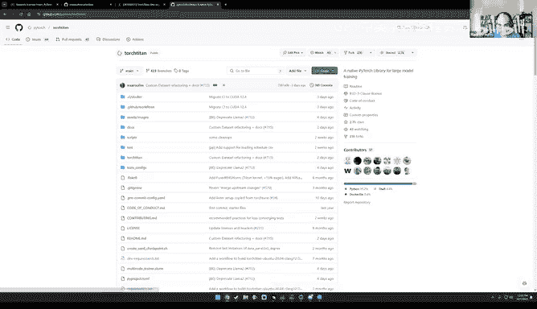

Like count the lines of code in it。It's about like 5000 lines of code is like in pure Python。

 there's like a bunch of other stuff like mostly like configuration stuff that like bumps it up to 8k。

 but there's like basically about 5000 lines of like， you know， useful useful stuff。

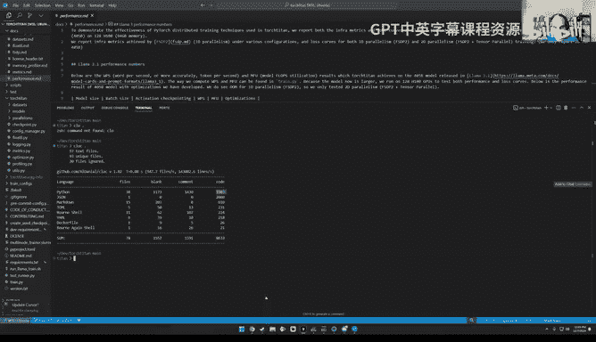

And what's kind of cool about it is that like despite being so short in terms of lines of code。

It's a pretty sweet reference architecture that you can use to like try training on like 100 plus GPUs so so at least like within these docs。

 I think that the team has tried like 64 GP 64 GPUs and 128 GPUs。I think Chaa。

 do you have bigger numbers in the paper， by the way， or was 128 the scale that you？Yeah， so this。

 this the performance do is a bit outdated and we have5。

12 GPUs experiments running on 3D parallelisms in the paper。Let's quickly go there。Performance here。

嗯。Oh yeah， so this is where this is mentioned。Okay， so going back here。Let me。

 let me see where to start。So yeah， let's go here， let's go our collectives。So。😊。

Look like what's kind of interesting about having a repository that's just 5000 lines of code is that it's plausible for us within like the next like hour or two to actually just like read the whole code base like a book。

And like understand it so'll give you like a very good idea of what some of these reos like might look like There is like unfortunately just like a tiny bit of background like more theoretical background that we need to go through in the beginning and after that will can basically go through the details so for some context the whole reason I got interested in this is I was just mentioning before the recording started that most of my career at Pytorch has been focused on single GPU work and you can get a lot of milelo out of doing single GPUs there's like a lot you can do where this is sort of like biting me a bit is that like we've been sort of working in public on like one of these like we have a new working group called Popcorn where the idea is to train an LLM that can generate Trident efficient like Trident and Pluto kernels and the idea being that like a lot of kernels sort of look alike and kernel authors are expensive and so can we make it like easier for more people to become like systems programs。

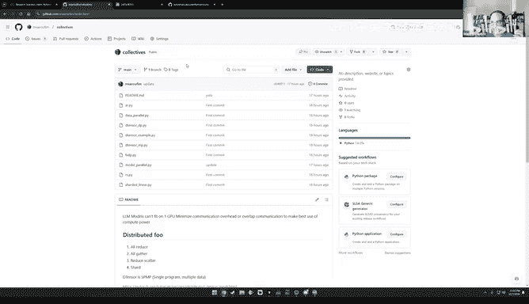

The idea here is that like there's two aspects to it。 like one is， of course， like， oh yeah。

 and if you want to learn more about this project， we have a website now just few。

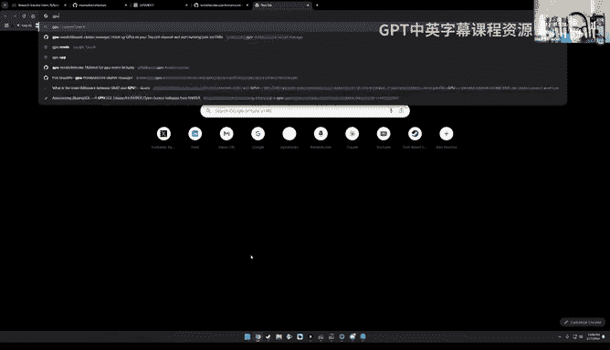

Very quickly。

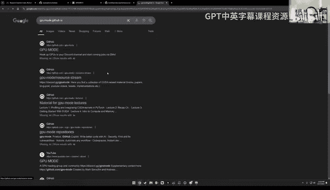

可以。YeahYeah。Here， yeah。 So DPU mode Github bioo， popcorn， if you're potentially interested in this。

 we basically describe sort of what are the core work streams Like one is basically。

 how do we sort of generate as much of data as possible？

 So we're going to be starting like hosting public competitions on the server where people can。

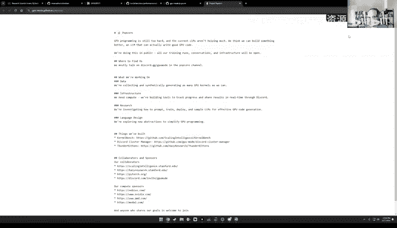

Like compete on writing kernels and we I'll talk about that more in some other lecture but then there's also sort of the training aspect like let's say we hypothetically generated like a very large data set of kernels like let's say the trillions of tokens now what right and so the idea basically this lecture should help answer the now what side of things I do want to say that like this is a bit different from all the other lectures that weve given in that like I don't have any slides we're purely just I'm purely going to be sharing my screen and going through code and Chanu is really here to basically keep me honest and if there's any misconceptions I have about distributed like Channu is really like more the expert here。

So if you have any questions in chat， I'll be like reading them。呃，呀。Mark just a note。

 we already have some compute that has been provided for the popcorn and I think we need more and。

We are calling out for more people to help us out on this， so we are reaching out。

 but if you have pointers or if anybody in this community has wanted to help us out， let us know。Yes。

 thank you your comments that's a very good point so going back here okay。

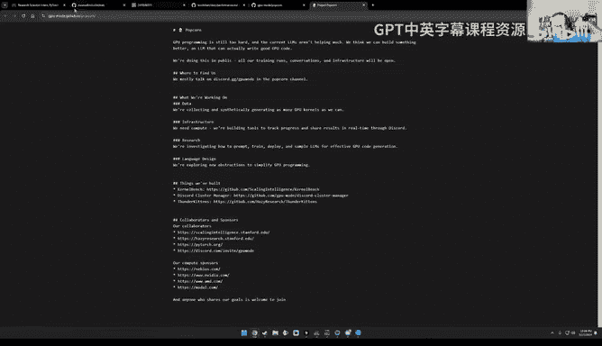

So here's the idea， right， Like working on a project like this。

 there's like an inherent amount of ambiguity， for example。

 like it might be the case that we don't need large scale， like it is。

 it is plausible that you have a large end of data set and you run it like a continuous fine tune。

And then you know， you run it on like one or two nodes， for example。

 and then you're pretty much like good to go the problem is just that like this is unlikely to be true。

 at least from the anecdotal evidence we're seeing because the data sets that we're collecting are already on the order of trillions of tokens and this is without like crazy algorithmic generations this is without like basically trying to artificially increase the number of tokens or anything like that。

 And so it seems like we're headed towards a direction where the team needs to just become like like much more experts distributed training。

So I saw a question in chat， I think， which was around who's using torch Titan outside of Meow。

I'll let Jian you answer that， but I did want to plug one project that I think is very interesting。

 so let me show you the tour slide in Ripo。One thing that's quite unique。

 I say about Titan is that like it's not a library in the sort of true sense as in。You know。

 like it's really meant to be more of a reference architecture and what that really means is that because it's very little code。

 we want you to copy paste it like please plagiarize it please make your own changes and go like Shicool stuff like it's really the intent is to show you how easy it is to do parallelism with Ptorrch and it's not really to support every other library or model or data set under the sun like that's just like not the core interest of the team So there's one one project that's like I personally find very interesting and I'm trying to convince the team to come give a talk to us later this year later next year sorry。

 which is like the prime Intellect team they borrow heavily from torch Titan and they basically use it to do these like decentralize like global run So this is like one use case I'm excited about but T you if there's other teams you want to flag maybe worth doing so。

Yeah， thanks Mark yeah， I think so the purpose of torchitetan as you said。

 is more like a reference repo in the sense that people would copy clone format and make their own changes so one of the feature I think it's worth mentioning is that torch siteon supports distribute training but in an elastic way。

 which means no matterre from a single node or you're having like one to 2k GPUus or even above we can support them all so there's really no restrictions when you can use when you can't use it from the GiHub issues we know that a lot of people are using a profound tuning or like they call it I mean continued pretraining so to give you more concrete evidences we've seen researchers and industrial labs doing their own training using torchitetan including recently this atom mini paper。

Coml， which is a new kind of optimizer。 They explicitly mention in the paper they're using torchcytan。

 and another example， I'm not sure if I can speak their names。

 they developed industry leading diffusion models and through social connections。

 we know that they were developing it using torch Satan as the backbone。 So like I said。

 it's kind of elastic and there's really a broad use to torchcytan。

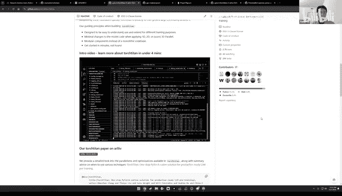

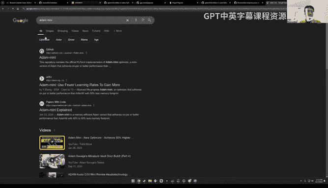

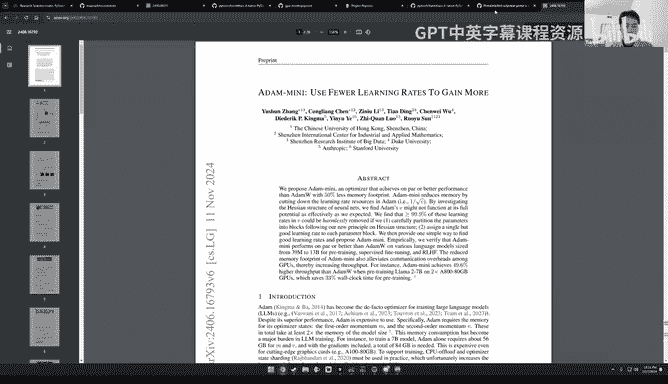

All right， so。Just sort of like so we sort of since we're asking like the why questions， it is very。

 I think Byron made a comment around like it being similar in vibe to GPT fast， like yes。

 it is sort of similar in Vibe， I think GP fast as well we mostly encourage people to plagiarize it and copy paste it。

And the sort of user experience， like again， me not knowing any like knowing very little about distributed training when I first started like looking into the project a few weeks ago。

If you just want to run your first distributed training run。

It's really you just copy paste this command and so you basically give it like a configuration file。

 let me zoom in a bit more。 you basically give it a configuration file and you like run run a Lama transcript and this config file will let you set all sorts of things from like different kinds of parallelisms to your data to how often you want a checkpoint will sort of go over those details in a second。

 but like if you've used like projects like axolotl， for example。

 like this sort of user experience should be very similar to you basically set up like a config and then you can share that with other people and share your training rooms。

Yeah， we like you write your own， can you make sure it's super super efficient if that's not the case。

 maybe using detensor might be more efficient because， you know， it's handled by the by us yeah。

All right， so I I think like we can we can come back to sort of like more so please keep questions coming this is great I have the chat window open so like just we're very engaged。

So I thought like what we might want to do next is just like again I just want to quickly mention。

 maybe let me go here， like if you just want to run torch Titan and see like logs locally or push them to tensor border weights and biases。

Like literally， it's just run this cement。 So like this is like， this will just work。

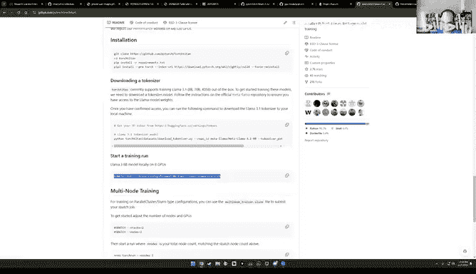

I did want to sort of maybe start going through some of the code and kind of how I approached it。

 like one thing I found interesting about this repo is that like I started contributing to Thorrch Steden like this week and I found it really easy and just like merges like4 PRs。

 oh'll tell you。OhYeah， so just have one comment on the lines of code。 Yeah。

 thank you for doing the statistics I don't even have the most update knowledge on that。

 I think one of the reason it blows up from 3 k to 5 k recently is because we wanted to start shipping this multimodal support。

 basically the Lama 3。2。 But it's not there yet， but we already ship some code。

 but the code is kind of very long1 K to 2 k。 So I would say without that。

 it should be 3K lines of code。Oh， interesting。I I guess like Edityia is asking how can I use detensor and FSDP to implement self attention。

 I guess like Adityia you might you're like referring to like a implementing like a ring attention sort of algorithm using detenser。

Yeah， so if that's the case， I think that's possible， I think one of my colleagues。

 Tristan had a PR open on Pytorch like doing this and I don't think I'm not sure if it was mes or not maybe Tio knows。

But it's certainly possible， and maybe Chn can comment more。

So I don't know what the question is on like the fancy attention like rain attention or it's just the self dot attention。

 can you clarify that， but if it's but if it's rain attention。

 we currently supported it using like under the name context the parallel。

 I think it might be the case that Tristan's PR particular PR didn't wasn't get merged。

 but we officially already have it another version supported using Dtensor yeah。O，没 go。So yeah。

 let's just like I'm just going to show you how like I would like go through the code so like just like a bunch of stuff outside there's like a bunch of you know stuff that's not too important。

 there's this like one script train do pi and you can you can run the script even without installing Torchtden so it really is like just a script。

So let's just like go over quickly and see like what's going on。

So the first thing is like something with regards to enable debug tracing on failure。

 so I think this is the deadlock thing right Sha like the。I think so right。Look。

 can you repeat your questions or so so this is the code that like basically does the what was it called it's like something like the。

The record flight tracer， Oh I see。Which part， yeah yeah yeah this part records your traces so that we have this thing called fly Recorder to help you debug in a like basically。

 for example， Nco timeout such things which it's hard to debug in a distributed setting。

But thats the first that's only theper at to record wrap。Yeah， otherwise here。

 like basically you hit a bunch of loggers if you go to net logger， it's like nothing。

 nothing fancy here。Going back to the train by， you know， setting up colors。

 avoiding garbage collection， sorry， setting garbage collection。 Oh yeah。

 the sub determinism thing is interesting。 Like this only applies to data loading stuff。

 if I recall correctly， right。Oh no I think， yeah， we recently have a new PR to make it right。

 I don't think it's currently 100% right。 but yes， this said the determin thing is like setting the random seat then determinism in a distributed setting。

 including multidimensional parallelisms。 we initially thought it was not that difficult。

 but later on， we found its nontrial when you combine parallel and other things like Tensor parallel and other SPMD style parallelisms。

 so speaking of pipeline parallelism， maybe let's talk about that briefly。

 So pipeline there is this joke I think I saw like Carpathy make on Twitter like a while back something like like no codebased Sur pipeline parallelism。

 And thats just because it is like bit it's actually the hardest of all the parallelism strategies to implement。

 And as a result， you'll see in the code base there's like a lot of like。Lines that look like this。

 basically if pipeline parallelism do something otherwise do something else。

 which is why for today at least from an educational perspective we're completely skipping pipeline parallelism and if there's interest we can just have like probably a standalone lecture just just on that。

So， go back here。All right， so back here。Allright。So。😊，Here like okay。

 so this is the world size initialization。 And then the first sort of chunky piece of code is this guy。

 the parallels。 So let's it basically seems like it takes as an argument like by。

 you know what's the what's the data parallel replication， are we enabling context parallelism。

 Tensor pet parallelism， pipeline parallelism， lost parallelism。 And if we go to this thing。

It basically seems like it's mostly a configuration object， right。

 Like it's a data class and it holds like ins。 You basically build a mesh。

 which is like setting up like a dictionary with all the all these flags。

 And then there's a bunch of these properties enabled such that。

 Like if any of these properties is greater than one， then it means it's enabled。

 So this mostly seems to play the purpose of a。😊，Of a configuration object。

 I guess here this mesh here， oh， but this does actually return a mesh though。

This takes this in device mesh and then in device mesh。宝贝，你 check看。Yeah。

And then what in a device mesh， it takes in like a device type and a mesh shape。

 which is basically going to be actually， yeah， maybe trying you mind talking a bit more about like。

How this works。 Yeah， yeah， sure。 so basically device me is our abstraction of the underlying hardware。

 So basically can think of it as a high dimensional cube which you organize the hardware into FSDP groups TP groups and groups so on and so forth and their orthogon note to each other in device mesh thing is just trying to handle the complicated stuff under the hood and give you a nice abstraction and inside this device mesh in it。

 you would set up this， you know， find the right process group。

 find the right hardware and initiate those if you're using for example。

 inmedia GPS initiate the niel communicators so that when you call， for example。

 detensor dots redistribute and you want to change like for example。

 or reduce or reduce together it knows。To find the right communication channels。 So basically。

 it's a nice abstraction。All right， and then going on， we see the sort of device modules of device。

We have the utilities and it distributed， let's see how this works。Thats name。呃。Let's see Jo canfig。

So this mostly seems to be setting some optional debug flags right yeah this is more like the flag recorder setup you wanted to dump your traces somewhere so later on you can see them yeah or use some tools to analyze them。

And then this mostly seems to be a wrapper around this function and Pythers distributed。

 which is initialized the process group， which picks a backend。From a string presumably。

 but most likely this would be nickel in most cases。

 with like a timeout that we also generally configure as well。So actually。

 so maybe this is a good time since we're talking about timeouts like A detail is asking。

 how do you handle GPU failures and redistribute training amongst other nodes？

So you're talking about more like a fault tole thing。

 Yeah I think currently if you're doing this SPMD style training fault torr is not handled like by default fault not handled well。

 which means any of your node fail or any of GPU failed your total drop would fail and recently because the scale is getting bigger and bigger there's more need for fault torrent and recently the Pytor sea especially our colleague Tristan initiate this torch FT as another reportpo to showcase how do you do it in a fault torant way。

 for example， if a node is down can we detect it， can we automatically bring it back up when it's ready and we like in 2025。

 we have planned to showcase torch FT and those fault tolerant training in torch Ti as well so to answer a question it' not ready yet。

All right， and then moving on， so now we initialize like a device a Torch FT public。Did I something。

 did I say something which is not public such？

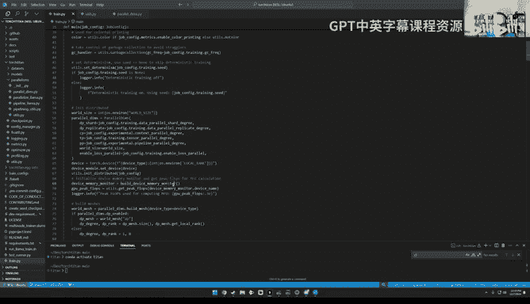

I believe it is。Let me check。诶。

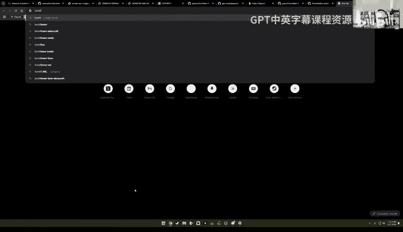

It is public。 Okay， hurryay， Okay， we're not fired。 excellent。 So yeah， so， so。

 so this is from Kristen Again。 I think you gave a talk recently about this at the Pirus conference。

😊，All right， you。And then。How does this work Oh， I see' like it creates its own manager distributed process group blue the code looks very similar to what you。

 Yeah， it actually just wraps the the thing so that you don't need to worry about the details。

 It's very nice。 I saw I I've seen a demo on this iss like super fancy it shows you like some D ranks just you can kill it using a website API and then you can see it instantly got killed and several seconds later it's brought back up and the lost and gradients are offhand like invisible。

😊，Yeah， very cool。 I think because Triten used to work on。

 I think Torch Elastic before and Torch X where they did a lot of this stuff。

 So this seems pretty cool。😊。

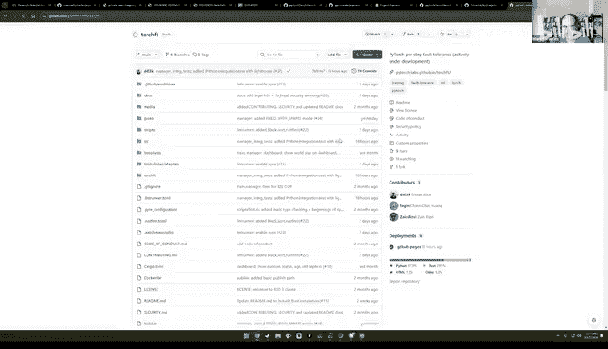

All right， so going back， where were we？Here。Okay， so we're going to build this device monitor。

 so what is this？Yeah， device monitor。 Okay， this creates a device memory monitor。

 What's a device memory monitor。And then， okay， so this is just like again。

 like another class that like mostly handles。Figuring out like what's the like basically all the V Ram sta。

 like all the VM stats that you might need， whether it's like mass reserve， like Max active。Actually。

 I was curious about asking you like because you mentioned that you don't do fault tolerance。

 but then you have this thing called number of ooms the in the state。Yeah。

 that's unfortunately I think like if you're basically if your job wounds。

 then it dies and you can really， it's not useful today。OhI see I see okay。Okay。

 but but basically here like again， this is just like recording a bunch of data and in twos so nothing crazy here。

 oh yeah， so peak flops， let's talk about flops M few for a second。

So the way this works today is like typically for a lot of， like。

 let me just go to the main page here again。 So you go here。

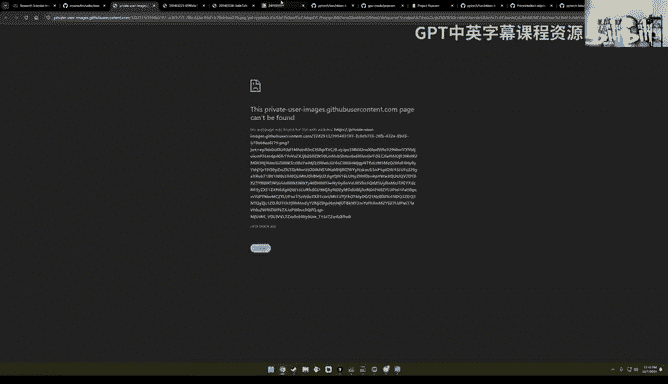

呃。But的。

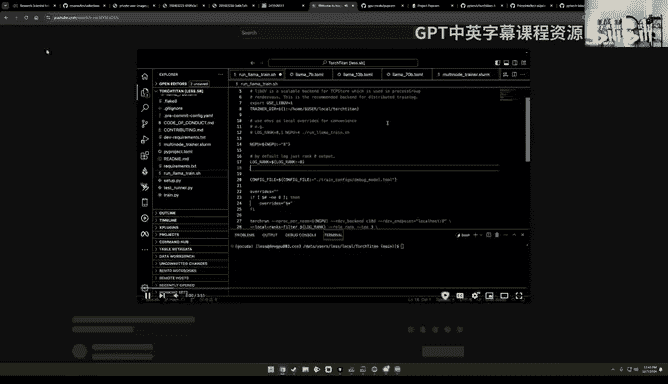

你 sorry。This is a great video though you should go watch it but like here I'm just want to show you these MFU numbers here。

 for example here this is showing like an MFU number of 3% because this is like a toy debug model and it's actually very common for like a lot of distributed libraries to share MFUs as a top levelvel performance number but I just want to caution you away from using that for like one simple reason which is basically it's two aspects like where we get big flops here。

😊。

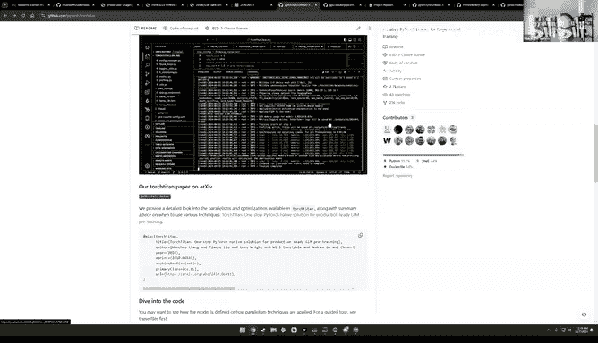

So MFU is basically just like a measure of like it's supposed to be a measure of how effectively are you using like your hardware and so typically like let's say for a specific data type NVdia will say something like okay well you know you have X flops that you can get this D type and so then you look at how many flops you actually got and then you divide it by the flops that like N video reports and you get a number。

The problem with this is that like， well， let's say some of your layers are in FP8。

Then and somewhere are in FP16， this becomes kind of like a tricky formula to apply。And。Here。

 like I should think if I'm not mistaken， then Matthew's calculated analytically as well。 Yeah， here。

 it's a formula， right， which is basically you look at like six times the number of parameters times the number of layers。

 heads， then I think Q is what's Q， I guess T is the sequence length and then Q is。😊，I。

 I forgot it's， it has something to do with the oh， it's a。Dimenssion divided by the number of hats。

 Oh， I see， I see， okay。So the point being is that like one。

 like different vendors disagree on how to calculate them a few。And even if you agree。

 like there is like analytical solutions for it and people might agree with analysis。

 and then there's profilingbased solutions where you actually look at the number of op in your model。

 and then if you're using a different program， like the numbers will also be different。

 So this is kind of one of those things that like is useful as a baseline for you to know how useful how fast you're running on your given hardware。

 But it's like much better to look at metrics like words per second。 for example。

 would be like way more reliable and probably less less fungible。

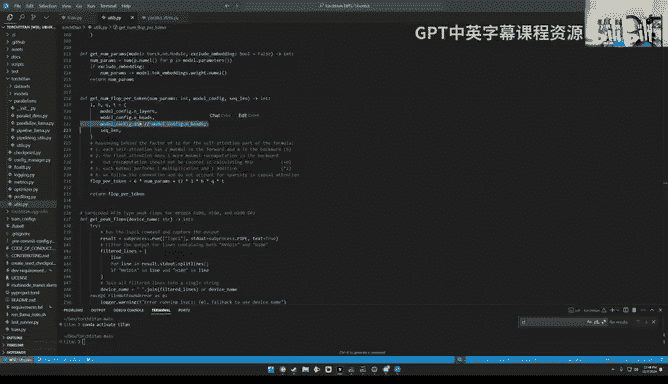

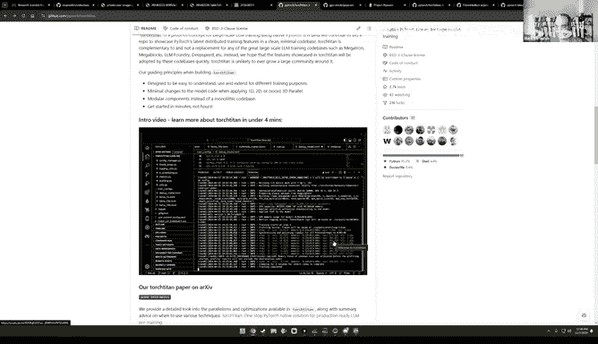

The six times number of parameters that is an approximation right correct， yeah。

 this whole thing is an analysis yeah。I want to add a bit here， so MFU is different from HFU。

 I believe it hardware Fps utilization and this is model flops utilization so hardware one is more like a physical one like how many ops are you doing divided by the peak flops regardless of if your app is useful not for example。

 you just do redundant computation which is not useful at all， you still can boost your HFU。

But MFU is like given a model， for example， a transformer model。

 you're supposed to like the minimum amount， like for example， there's no distributed setting。

 you don't have any redundant computation， you're just on a single device and this is the amount you need to compute and divided by the peak flops and like logically you would achieve this amount of computation regardless of how many actual computation you are doing。

So this creates a lot of nuanced differences when you're using different， for example。

 different attentions。 How do you define what's the needed amount of computations。 It's not clear。

 So I would say I mean M comes out as a nice top line metric。

 but now it's more and more challenging given different variants， including data types we're facing。

 So in To setting， we try to we try to keep the same as most of the popular repos， but like。

Like Mark said， you should be cautious when youre using it。All right， so moving on。

 we've already talked about like these meshes and notice here already how we have our first like if data parallel is enabled。

Then， wait。Just thing。Oh so versus it's not enabled then oh I see So basically this is just saying if we don't have data parallel enabled。

 then we hardcode the degree in the rank so we don't have this problem similarly here okay。Okay， so。

This is now， I guess like the first like non distributed side of things where we're building like a tokenizer and a data set。

So let me just go over this very quickly so wait so I see Eric。

 could you use scoopupT to extract tensor core utilizationization directly from the hardware counters to estimate MFU or does it have too much overhead？

I guess also yeah MFU has a definition the definition is is not really related to the actual count are you talking about the fl counter which is also logical but to ask your question I think this is something。

It'sIt's not really a measure of it's more than a measure of how efficient you're using your GPUs。

 but also how do you compare your work with others I feel there's a bit unfortunate thing that like we wanted to make sure our MFU computation is common enough so that people get a sense what's going on if we're using our own MFU computation。

 but others are not I think the people be misled when reading the numbers across repos。All right。

 so back to the data set stuff。I think I want to show you like one thing。

 so first off like at least for ma 3。The tokenizer that they use is like thick token and there's like nothing。

Specific about distributed stuff here at all， like this is just like any other tokenizer you might see。

嗯。rantGranted like what's interesting is like if if your vocabulary is really large。

 like in the case of multimodal， you might need to explore things like you know vocabulary parallelism。

 but you know we're not going to talk about that today。

The other aspect is like things like downloading the tokenizer again。

 nothing crazy we literally just download it from hug face with a bunch of like nice error messages。

 So like this is all yeah like not nothing specific。😊，UThe data set that we sort of as an example。

 like most of the benchmarks that you're seeing were ran on the C4 data。

 which is a pretty large data set。But if you want to sort of create your own dataset。

 you basically need to implement two functions like one is like where do you load this data from often from the hugging face hubub and then how do you process it as in like how do you just like get pieces of text from it And then in the case of C4 it's like sample text and in the case of let's sound in the Wikipedia it might be a bit different and then you essentially register your data here and you're pretty much like good to go So any text data should work well I haven't personally worked at all with multimodal data so I wouldn't be able to answer。

But at least like for anything text based like。Buddha kernels， this sort have works just fine。

So back to train that pie， then so we set up the tokenizer， oh tellya。I just the one to。

 you should feel free to talk by the， raising the hand will be too much， so just don't drop me。Okay。

 sure， I think you summarize summarize it well except that there is something distributed in this data loader thing which that you wanted to load different data on different data parallel ranks but you want to keep the same data on nonda parallel ranks so's I think it's worth calling out and another thing is that you want to make sure your data loading data loader is checkpointable in a distributed setting meaning that if you like pause your training and having a checkpoint you would resume from the checkpoint and you would not start from the first row of data but somewhere you stop earlier Yeah I think in the data loading community I've heard this referred to as like mid epoC presumption like I guess historically if you're assuming you're doing multiple es per data set it's not a big deal but here' considering you have a single data set with2 trillion tokens like midEC consumptiongen becomes much more critical。

そ。嗯。Okay， so actually so so where is that like logic like it seems a bit abstracted away here like I don't see。

So is this just that like stateful data loader here？So I guess you're saying you want the same data。

 you want different data over multiple data parallel ranks， but the same over nondata parallel ranks。

 so I'm sort of curious like where this is where we can observe this or is it maybe here in this stateful data loader stuff so like can you go back to trend up high when you call this you can see we fit in this DP degree and DP rank。

 basically like for a different rank we give a different data， but when we fit it。

 we only fit in different like only D different DP ranks get different data？All I see。

So basically under the single like same DP rank， it's like a device mesh right under for example。

 one bro， you got the same DP rank， but you would get different TP or other ranks and those ranks all get the same data because here they have the same DP rank。

Interesting， yeah， So it's like this becomes a unique identifier， right。

 Like the I think I see it here。 Okay， I see it。Okay。Let's see， so building the model。

 I think yeah so this is like u so so right now like this supports like variance of  Lama 3。1。

So this is like a model class， like let's see what this is， okay， model class two Lama three。

And then transformer。Okay。So again I don't think there's anything distributed aware here if I'm not mistaken right like this is just not that's that's the that's the whole point so this is the part where we're different from for example meron we're doing this parallelisms in a model nonintrusive way that you define our model and we apply different parallelism on top of it but without touching it like without trying to not touching it at all but sometimes we still have to but it's rare。

Yeah， it's more like， I think I remember seeing some comments like in the code base like we could make this intrusive change。

 but like we chose not to， I think I remember seeing two comments like that in the code base。呃，O。

So back here， how does this framework compare to deep speed。

 do you need to implement zero on top of torch titan or would it would require internal changes？

So like I said， so they are just different names， basically you can understand FSDP as 03。

 although FSDP supports like multiple modes some them them are closer to 01 or 02 so basically you already have it and comparing deep speed I think deep speed is in some sense a bit like megaron which has the core functions inside Wpo。

 but here we don't have the core functions are sitting in Pytorch and we just use them and one of the biggest differentiators。

 I guess is we try to make our techniques and cobase easy and simple while being composable in the sense that multiple training techniques can work with each other I'm not too sure about deep speed and meron right now but last time I checked they may not necessarily have all the for example previously if I remember correctly deep speed doesn't have。

Tsor parallel and megatra doesn't have zero or FSDP， I guess now things could have changed。

 but I think composability is definitely one of the thing torch sidedent features yeah。All right。

 and then okay， let's talk about the the meta device and its stuff a bit。

 So here you notice like there's this context manager。

 its says we charge device meta and then you instantiate the model from a meta device。And presumably。

 this is because。The model is too big to be instantiateated on a single device before it gets started so you want to instantiate like a fake model。

And then chart it。Okay， and then moving on， there's a floatate handleandr here。

So I will say like Fate， the reportpo has support for Fate。

 maybe let's go there for quickly for a second。So flowate is functionality that's available on like SM 89 and plus so I think。

4090s H100s and plus should support a flow rate The main thing to keep in mind because I've seen people get bitten by this a few times is flow rate is primarily useful when you're like Mamal shapes are quite large So it's like if you're running very tiny models it's not like in four where this is like useful for local LM workloads like it's more that like it is useful for training larger like trading larger models And if I'm not mistaken to you I don't think you've enabled Fate for Lama 8 B for example。

 I think it's only for70b plus right。We we like。As far as I know。

 I think you can check out the experiment results experiment results in our torchite and paper。

 float aid， even on Lama 8 B accelerated it a lot， not just because of this float aid linear。

 but also because or more importantly because we have this flow aid altogether means that you're doing the communication with half precision。

 it's super fasted。Oh， interesting。 so so this would be8 to B。

 but maybe the like when the data parallel rank is larger than a single node， perhaps。呃。8 B。

 let's check out the numbers。 I believe within node is also significantly faster。

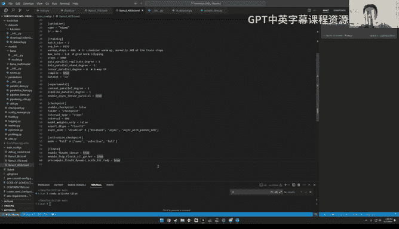

是。Let's's sorry， let's check out the paper， we don't have it here sorry。Scrre up a little bit。

This is the first page。 Let's go to the experiment section。Okay。Yeah。

Scroll down a bit in the first table you see。Yeah。Oh， well，50%， I see。Yeah， okay。Interesting。

And then so this is Lama 3。18b on8 GPUs with mixed precision training。

 selective activation checkpointing and a local batch size of  two or the global batch size of 16。

I see。😊，And then if you hear， it's also 8。1。But on a1208 P。Okay， same local batch size。

 larger global batch size， and you saw it even like more dramatic speed ups， interesting。Okay。

 so so really， it seems like it is useful even at the AB scale and then as you sort of increase your data like your data parallelism。

 it's still like you'll see even more speed ups interesting。Yeah。

 so I think here like so Cha also referred to basically enabling all gathers and F so this is like also just like a flag and then the this is basically making sure the compute is happening in fluidate and then this is the communications happening in fluid8。

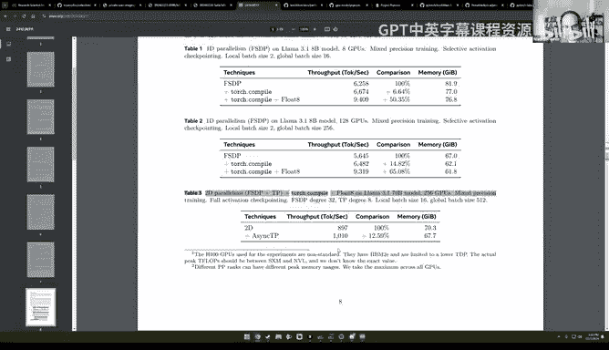

Yep， and currently， it only supports matrix multiplication。 Not， I think iss not supporting SDPA。

 like the attention。

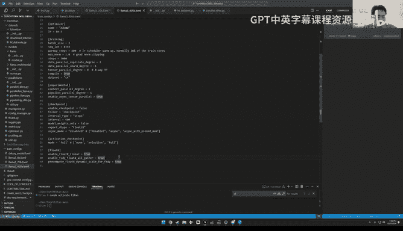

yeah， that's correct， although like I I think there's sort of like at least within Torcheo like an early PR that I think Jerry Jianang has been working on。

 which is enabling F8 CP。With the core idea being like converting。

The QKV to floatate before doing SCPA， so hopefully this should be landing soon。

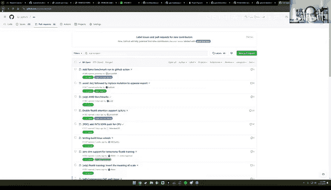

Okay， so I think I'm seeing a question， do we notice any benefits on L 40 or is this primarily on H100？

呃呃。I， I don't know for sure， but I heard it's only for H 100。What does V thing have？Oh，48， I see。

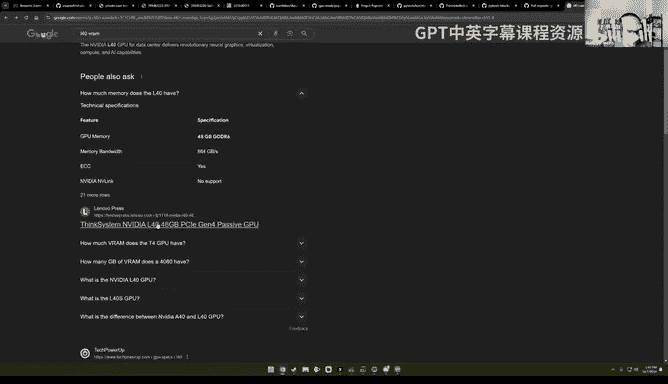

Yeah， I don't see if Fate mentioned here。

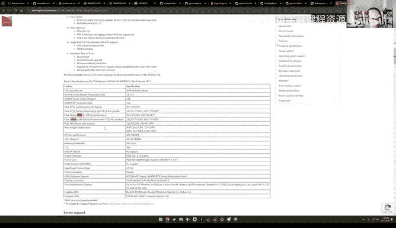

Yeah， I see。Anyway， let's keep going。A lot of these utilitiess， like for example。

 like logging the model size and all that， this is like all very standard stuff。

This is the sharding Okay， so this is kind of like maybe the first really interesting part。

 which is like here， So again， we're skipping pipeline parallelism。

We have these parallellyzed functions。And。Basically。

 everything interesting in the repo is mostly happening in this file called。It was called the。

呃 paralleled la漫都 play。So this is the file that sort of like describes like all the different parallelism strategies。

 but like parallelzed Lama basically takes in a model， it takes in a mesh。

 which will describe like all the dimensions by which your parallelm thing。Okay， so I see a question。

 Sanino， as far as I know， enabling Tensor parallelism。

 pipeline functionality for custom models and frameworks like VLM Tensor Rt require model reimpleation and their Apis and layers。

 like the Q KV parallel in VLM Port torsside in this architecture modification is done on the fly by the framework or will there be a list of supported models for which this works。

 What exactly do you mean by nonintrusive to the model class。That's an interesting question。

 so I'm still trying to understand what do you mean by custom models。So I see you mean a new。

 basically a new model。 So we are just showcasing the Lama model in our in the torch Titan and the way it works that you bring your model and we apply those parallelisms on the fly。

 basically。And the way it works is that the API were designed to not touch not require model code changes except for example。

 minor changes like for example， when you use pipeline parallels when you split okay we decided not to touch。

 but let me just touch a bit。 so you split our model into several chunks and for some of the layers it may not exist。

 for example， output layer may not exist on the first chunk and then we have code like if this code sorry if output layer is there then we do something we do the initialization or we do the computation other than that we don't touch the code and if you ask me I want to bring a whole new model to。

 for example tor Titan， can I still do it this way。

 I think most of the case you probably can unless a lot of things。Our focus has been on this。

 for example， language model， let's say today， if you bring in a vision model or some member model。

 you can check if it's like every single op is fully support it， but if it's not。

 we can always support in the Torch core Py Torch core ripple。

 so our goal is to not having any intrusive change to modelcode at all。Yeah。But but yeah。

 but like again， like people can do whatever they want。

 sometimes it's just the hotter sometimes it's easier， but we believe like at least Lama 3。

1 gives you a very good example， it's super popular and we can do it yeah。🤧嗯。All right。

 so I see here， for example， the first thing you check in parallel isllma is checking。

That tensor parallelism is enabled。 Is there any reason why the order matters， because you see。

That's very interesting。 So sometimes the order of applying does not matter。

 but sometimes it does matter， for example， when you combine Tensor power and FSDP。

 basically you would like you have to understand what TP does and FSDP does to understand what's going on。

 we apply TP first because we want to apply FSDP last。

 because FSDP is just a distributed storage and you want to perform the all on the FSDP when when running the training。

 for example， in the forward， you want to run the FSDP allga together the whole like TPized module to perform TP。

 That's the reason why FSDP applied later that TP。 So basically you wanted to understand what's going on when they are composed together to decide order。

And interestingly enough here I noticed that TP has a few interesting flags here。

 like one is for loss per， one is for enable flow rate。 So maybe for loss parallel。

 if Im if I'm not mistaken for things like like a popular loss function for L training is like cross entropy and cross entropy over a large output will be very slow And so instead you can basically just do the cross entropy and chunks of the output is this the idea and and why is this a flag for。

Thatser parallelism， specifically。So last parallel is a technique which allows you to do sharded computation when your vocabulary size is huge and you want to shard on yourulary vocabulary dimension。

ss you can like basically we enable it in Tp by default。

 but basically I would say it's a good addition， a good feature on top of vanilla Tp Tp like plus sequence parallel usually shards things on the sequence dimension。

 but the last parallel charts the activation to output on the vocabulary dimension。

 so you can think of it as a bit different， and it requires some dedicated implementation to it。

 it's there and we enable it by default， I guess it's okay that we just disable this flag at all and enable it by default。

And is there any reason why like TP needs to be aware of F， like， for example， like。

 why not have something like if。FB then convert the layer to F8 and then do TP。

 So why why does TP need to be aware of F stuff。That's a good question。 I probably don't know this。

 but。When applying TP。So basically the way FP8 works with FSDP is that FSDP has to be aware of what type of communication and matrix qualification you're doing。

 but for TP， I guess the thing is similar is that we have to be so basically the TP works in a way that you give me a module I wrap you but insert some hooks so that I know what kind of communication I want to do when doing execution。

 I guess so my guess is FB8 is similar in the sense that the certain type of communication or computation going on needs to be known by the module itself so that's the idea but I didn't implement this part so I don't know for sure。

O。So I think the next thing you check for is do you want to talk about isnc Tp or do you think that's like Oh yeah。

 that's a very， very interesting feature。 So basically by default when you apply Tp。

 you have block in communication， meaning that before you finish this communication you cannot start your execution but by splitting the matrix into multiple pieces and perform some part of multiplication before others you can simultane doing do communication and computation and this feature is implement in Pytorrch using the so-called symmetric memory which is like bypass the usual way like Nikco is doing those communication and memory allocation So is actually a feature that's quite innovative and I encourage people to check out it basically makes it easier to access the。

Memory on the other GPU。So it sounds like the next thing that you check for is for activation checkpointing。

 so maybe let me talk about that for a second。As it's clear， apply you see the transform block。

 apply you see the transform block。Or am I here I see。I think， okay。

 so activation checkpointing is essentially like a technique to like if there are certain ops like at a high level。

Instead of like saving all of your intermediates for backwards pass， you can recompute ops。

If they're not very like time consuming to to run them。 So for example。

 examples of things that you always want to save are like things like mammals because they're time consuming。

 But like， let's say for a thing， like， maybe something like a softm。 like， you know。

 maybe it's okay that you don't save it。 So I think。So by the way。

 like for selective activation checkpointing， you know。

 is this like a hard codeed list or is it like a profile list like or would users expect people to copy paste this list？

So we offer three modes of activation checkpointing the full activation checkpointing basically bypass everything and recompute everything which is not like maybe not cost effective and we offer two ways of doing selective activation checkpoint the first one is layer based basically per how many layers do you do this activation checkpointing and the last one is the one like I recommended is this effective the operator based what you just described and this list is based on like some offline like ad hoc not ad hoc。

 but some offline studies like benchmarking is not something that that it's just hard coded based on our experience and we are about to have a more advanced version of checkpointing which is auto S。

Whi is profile I guess it's more profiling base to automatically detect what app you want to save and what to recompute it's not yet in the main branch。

 but I think there's a PR on it in item and also I think we're writing up a paper about it as well。

Oh， very cool。So where were we， I think yeah， there is a。So I think after checkpointing。

 you applied compile， and it seems like the way you apply compile is over individual transformer blocks。

 not over the whole model。I can explain a bit on this。

 so ideally Torrsdo compile is applied on a whole model to get the acceleration in an invisible way。

 but as of today the way like FSDP implemented and Tort compile implemented it's a bit tricky sometimes this like communications would like those FSDP techniques like this would cause graphra to break in the sense that the compiler cannot trace into it and does cannot。

Provide you with the performance you want and maybe even make it worse because the compatibility issues and the way we're doing this right now is is applying Todo compile at transformer block level this has two benefits the first benefit is that within a transformer block is a full graph which means compiler knows everything can gives you the ultimate speed you want and also the FSDP is also applied at transformer block level so basically the prefeing which I mentioned at one time you altogether a piece of model so you can do the computation happens on the transformer block level as well so it can still have the expect behavior so this is something related to FSDP which is you don't wait until the last second to fetch the thing you want to do computation upon next。

Basically when you're doing。Computation on transformer block。 say I。

 you simultaneously do the prefeing of the transformer block i plus1。

 So basically overlap them together。 this behavior may not be the sound when you apply torchdo compile on the whole model。

 But if you apply in this way， we still keep the behavior。 So it's still super efficient。

 this is the first benefit， I want to mention the second benefit is that Torchdo compile recently has a new new feature。

 which allows you to compile only once for repeated structures。

 So if you apply torchdo compile on several say 32。Transformer blocks in a Lama AB model。

 then you would under foot you would only do compile it once rather than 32 times。

 which saves the comp time， so this is why basically why we're doing it this way。Got it， O。

So then let me go back to where this is used。😔，Okay。So we applied， okay， so we looked TP。

 we applied AC， we applied compile。And now we're looking at FSDP， it seems like， yeah。

 and then for FSDP， we have two ways of doing it。It seems like this is like some BC issue like maybe this change it sounds like or something it's not actually BC issue it requires the latest changes also again there's a recent PR to make everything much simpler for this part so encouraged to read after the PR lines but here it's say basically saying it relies on some new features which may not be in a stable release but in a recent night lease and it's basically reminding you if you don't have the nightwe please install。

Oh， I see， and is this like basically because it sounds like if you're ownstable instead of night leaves？

You're not going to support like these N meshes and so on so so this is a this is a fallback when you don't have the recent nightly which allows things to be simpler we're still doing the like less efficient way but yeah like with the new PR this would be removed yeah okay。

And it sounds like the last thing that you do。Is apply FSTP。FSDP takes a model， a mesh。

The parameter de type， the reduction D type。Oh， I guess so this is for mixed precision training policies。

 and then it also needs to know if TP and PP were enabled and CPUU offloading This is interesting。

 like how come it needs to know if TP was enabled。诶。I forgot， can you check where it's used。Yeah。

 let me see。it's not used's。Yeah， doesn't like excuse。回啊。

Now I should remove it for P I can explain PP so if someone wants their first PR if someone wants their first PRr to Torch Ti and you can come to line 341 and do this will merge it for you。

😊，Yeah， I don't know why it's， when it's shipped in。 Yeah， it looks like a good first issue。

 Sometimes it is needs to know what others are doing just for composibility。 For example， in P P。

 I know we're not talking about， but P P， what。What like in order to make them jointly when combined jointly and still giving you the best performance。

 sometimes you have to configure FSDP a little bit differently and knowing whether PP is there is helpful when choosing the best behavior。

 for example， this re after forward behavior for FSDP。So looking at the apply FSDP function。

 it seems like we apply fully shard on individual transformer blocks and then we apply fully shrrard on the whole model after the like what's up with that Yeah this is the thing that just a mention right so for FSDP theres a granularity decision on when would you how large thing you prefetch right if you prefetch at a too large scale for example。

 at a model scale then you end up doing like DP but with stupidly and altogether of everything in in the very beginning which is kind of defeat the purpose of doing FSDP at all right you're not doing like you're not saving memory but you introduce communication but on the other extremetal side if you shard at like doing altogether at the finest the level those communication there will be a lot of communication will kill you so basically want to。

Choose the right level of doing this。 We caught blocking。 like how。

 like at what granularity do you do this profession and the fully short API， which is the FSTP2 API。

 do it in a like recursively wrapping way。 And basically here。

 we're wrapping at transformer block level first and doing the whole model。

 It basically means other than the things not in a。Any transformer layers， for example。

 the embedding an output， which you fetch in the very beginning。

 are the things that you would do per fetching at transformer block level。So I guess here。

me go back to apply at。All right， so after that， we basically print a few logging statements。And。

Interesting， oh， wait， so this is， where's this if， this is a。If okay， so if there's no sharding。

 then we just use the DP， basically。 So this is。Yeah， there's no sharding we use theTP。

And applying the DP。Go here。For GDPP， we check if there's compiled autograd。

I don't really know what that means。And then I see the replicate function here is fair。Oh。

 interesting， this is not DP。 This is not like Pythrarch distributed data parallel。

 This is just like something else， right， the replicate function here。 I believe it is。

I believe it is Pytor GDP。Because it's in the composable namespace， which is the。

 I don't have up to date knowledge on that。And also， I think D currently。

Is not composible with other technique like T P or P P。

 because partly because it it does not make a lot of sense to do so because usually FSDP is the first pipeline。

 Sorry， first parallelisms you want to have。 So you typically wouldn't go beyond to TP or P P before applying FSDP at all。

Oh， actually， maybe I think you show this really well in the paper， maybe then showed it to people。

Here， like basically， if you're like more like a checklist of when to worry about each technique。

 like， I guess for most of us and I would say myself included， like I'm definitely in this bucket。

 I know this is a big range。Yeah， it's like， but， but at least like for me。

 like at least like within the popcorn workloads， like I suspect we're gonna be like on the 60 to 100 GPu scale if if we if we manage things。

 you wish you had the problem scale to 4192。 Yeah， I think the very few companies can unfortunately。

 but I guess this is kind of what makes like， you know， like。😊。

The sort of communitybased approaches for distributed training China a miracle that they can even work out。

 but I agree with you in that like I think I agree with all this。

 but I think recently we introduced this context of parallelism which could be useful even without going to the super large scale FSDP could hit its limitations because the several reasons I think here were more mentioning the throughput reasons。

 like before， for example 500 GPUs you wouldn't hit the throughput limit or throughput constraints caused by FSDP。

 but there could be other reasons for example， memory reasons and memory reasons could be due to like you have a super large like giant model。

 for example， the Lama 3。145b model which probably most of people wouldn't hit at all as well the other is like on activations。

For example， you have a super long sequences and and this context parallelism could very well kicks in to help you even like even within a node。

 let's say you have a super super long sequence， which you cannot fit on a single GPU。

 then then why not use CP together with FSDP or without FSDP。

 So the the landscape would be different。 But since the C comes out after the paper is written。

 So we didn't include it in the paper， but just to remind people yet。All right， yeah。

 so let's go back。Let's see。Okay， so I mean， we went， I think。

Maybe now that like we went through like the two main files are really trained by and parallellyzed Lama。

 so maybe let me just do a quick scan of all the other ones。

I think this is the multimodal stuff that Ta was referring to。 This is a long file， actually。

 I just realized。Oh， wow， okay， do that。 Okay， interesting。I don't know。 this is yeah。

 this is purely because two reasons the multimodal part is just the lawn。

 and the other reasons we have some dog streams， which I thought like maybe people won't find it useful。

 but so。Yeah， as we're supporting more models in To setting。

 we inevitably will have this issue if we want have like have the conaal listed in the rippo。All。

 I wouldn't say it's an issue， though， sorry。Yeah， I I agree with this too。

 So so other files like I think this is back to the torch titan is meant to be a repo that you copy paste like。

 you know， there's a couple of norm functions that are used like I think like RMS norm and layer norm。

 which are very popular and in these models。 So， you know， if you want like yet another one。

We probably wouldn't merge it and we would just like encourage you to just you know。

 add like your own like favorite norm layer here。I think there's also this sort of I think one of our colleagues lesss wrote a tridentversion variant of an RMS norm kernel as well。

 but I think at this point like the compiler could probably generate like most of this if I'm not mistaken。

 so it's just like worth double checking I can check。So I think back to here， like， okay。

 we didn't look at this u file， because this is just the checking if it features a nightlies。

 it's not too interesting。Let's go to the checkpoint thing stuff a bit。So。Okay。

 so checkpointing is kind of like a deep space。 I think Tony will know a lot more than me。

 I just want to comment on it briefly， which is that like。

Like if you've ever like I don't know there's certain video games is that when you play them and you're trying to save the state of the game and if the state is big enough。

 like let's say you're playing factor you're going end up waiting like a few minutes for the game to save and having this be a blocking call is like really bad and so I I think like torch load and towardsr save our blocking if I'm not mistaken and so the idea with like DCP which is where is it mentioned here distributed checkpoint yeah is like a few things like one is you can save checkpoints in an async way and two your checkpoint can be distributed over multiple machines。

I guess Daniel， is there any more you want to comment on checkpointing？

Yeah let me comment on that the first is that basically in Tosideon we're using DCP like it's interesting technique itself because it allows the distributed as the name tells the distributed way of doing checkpointing for example。

 if you have a GPUs then you can just save one eighth of the model rather than like entire copy on each of the GPU or machine and the other interesting is we support this know async mode basically checkpointing would have several stages right the first is called the staging stage which you takes the model from GPU to CPU and the second is from CPU to your disk and I think this async by default means that after you still have this waitinging period which you wait for the model to be copied from GPU to CPU and then you can。

Your whatever computation because the CPU already has it。

 so the CPU would take care of the two disk process。

 but I think there's recently like this concept of zero had DCP checkpointing。

 which says you can even save the you don't need to wait on this GPU to CPU1 because after。

So after the backward， after the optimizer do step， now you have something you want to say。

 So basically you start the process of saving it to CPU， but you're still doing the model forward。

 so you can do them simultaneously as long as this GP to CPU finishes before the backward starts。

 you have an authentic copy of what you just had like just as what you finished from the last optimizer dostep。

 So all these are covered these information discussions are covered in this channel discuss do Pytor。

 org which we have a dedicated distributed category if you just hit distributed。

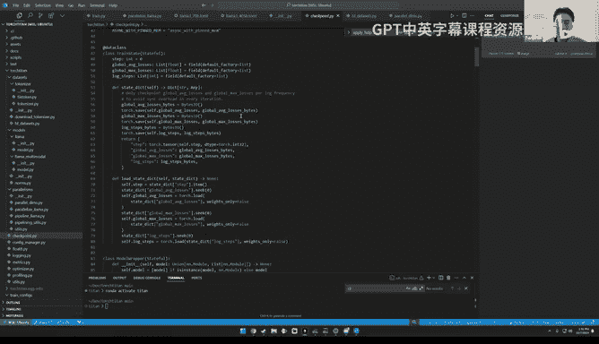

And then torch Titan， there's a subcategory torchcytan。 Can you go to the Yeah， yes。

 And we have some interesting discussions to help to communicate how we're doing certain things。

 We plan to have more to the list recently now that already has A TP float8 and checkpoint。

So it's a bit more technical。So speaking of like， I mean。

 I very briefly looked into checkpointing literature and I noticed I there's kind of fairly creative checkpointing policies people have like the most common one is basically every couple of steps。

 but then I've seen some papers where for example， you only checkpoint on a crash。

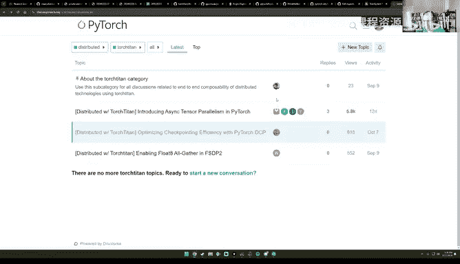

So you basically almost just like never checkpoint unless the job completes or the job crashes。

 but I guess like at least within this repo， I think。Here， like the checkpointing is interval based。

 kind of like how harshsha suggests。Right， and that interval type。Yeah。

 I think what you described is part of， I would say， fall tolerance， which we don't have yet。

Interesting， okay， and then interesting that the export D type is in float 32。

Could you say more about this？Oh I don't know much about this。

 but I think it depends on like your requirement for precision。

 if you can tolerate smaller precision， then you can save a checkpoint with a less precision which will save you time and memory that's the idea because you know。

 some training jobs don't require very very precise D types。I see。 So Eric is asking。

 are the master weights still in FP 32？Yeah， but the thought， yes， and。嗯。I so basically the。

Mix precision is handled by FSDP by default and the FSDP has two types like several types。

 You can check GiHub issues on this topic。 basically。

 you can configure what parameter type you want to。Safe， and what do you do communication in， So。

 but by default， it's all FP 32 yeah。I have a comment to make。

 and maybe this is a feedback that I saw on the distributed as synchronous checkpointing。

The documentation is not that great most of the documentation is outdated and if I just follow that it does not work at all。

😊，So there is enormous time thing that happens on the documentation that are very outdated on distributed a point any chance those can be updated please。

I see yeah， thank you very much for the feedback。 I think our team has been aware of that。

 Ill think with them to see when that could be updated。 I， I， yeah。

A bit unfortunate like there seems to be not enough communications of how good DCP is currently。

 I think we need to do more job over there， but thank you yeah。All right呃是 see呃。

Any more thoughts on DCP or should I keep going？I think you can keep I'm going。All right。

 so so this file is is not particular it's like basically just like all the configs that are available。

 so I mentioned in the beginning that like as you're using，Toch S in。

 you basically set up a Tail script， like a Tamil file and then just like run the Lama Tra script。

A lot of those configs you can see here， so also I've often seen as people are forking the code base。

 just adding like a couple of configs that are relevant to them is quite helpful。

So just I'm not going to go through this， but there's a lot。

 so you can just like go scan on your own thing。Okay。

 let's talk about flu rate for a second so yeah so I think we talked about flu rate brief actually we talked about flu8。

😊，Logging， we talked about metrics。We talked about metrics as well。

 which is basically all the VRA metrics。We also have support for like just pushing things to like either a tensor board or weights and biases or locally。

So you can share runs。Optimizeizer support basically by default。Then we only support Adam and Adam W。

 but if you want to add your own optimizer， it'll， will work。I guess like Johnny。

 have you noticed like people having to do a lot of work to get like a a custom optimizer working with like the rest of the torch side in stack？

To be honest， I haven't heard a lot on this， basically if you're doing this typical type of first moment optimizer updates。

 it should be handled and it's worth noting that most of them are like by defaults that's handled by the so those ops are handled using detensor so including the for each options I don't know like people can be creative in applying optimizers right for example。

 there are these second moment Newton method-based optimizing strategies for those will have to see if we need more dedicated support for that。

 but I haven't heard a lot， but the Adam mini paper is a good story on that I believe it must be tors item and make it easy for them to apply new optimizer to the distribute training。

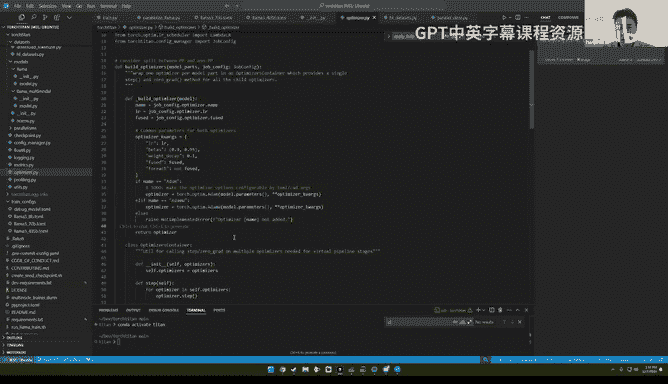

Thank you let me see。

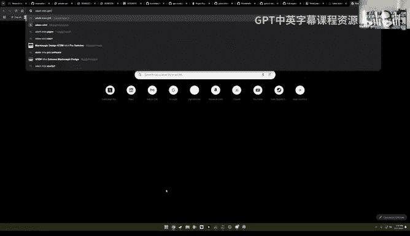

So。Yeah， this is done right， I think。Examples。Oh yeah。 they do。 They do mention to side in here。

 Okay， yeah， they've literally copy pasted the whole code， right， looks like。And deleted some stuff。

This is very common how we see people use the repo， by the way， just copy paste and delete。呃。

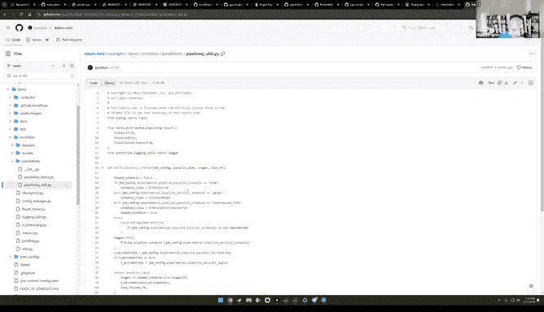

Justing， okay。Let me keep going so profiling okay profiling is interesting I would say there's two important profilers one is the Pytoch profiler。

 which will give you like speed metrics and communication metrics and then there's the memory profiler which is pretty instrumental if you're trying to debug oms they're often just like a context manager where you step through them so again you can copy paste these functions as is and use them in your own jobs。

You told that by seems to be like a bunch of miscellaneous stuff。

 let me see if there's anything interesting。Maybe Ash。

 could you talk about the context parallel stuff here because like it basically create context parallel context and then it's like this weird decorator like maybe could and then it calls SDPA could you maybe talk a bit about how this works？

Yeah， sure， so。Let's first talk about what is context parallel so context parallel is the way thatard you do sharded computation when like sorry do computation when your sequence dimension is sharded when you do large language modeling like it's useful when you have longer sequences when for example you cannot even fit a batch size one local batch size one on a single GPU and the technical challenges when like you compute those attention layers scaled out product attentions。

 you would need， for example， the QKV and when they attend to each other。

 you would need the entire sequences to make the computation so like the context parallel is about using this blockwise attention there's an inner attention where you can can。

You compute the KV and like you keep only a sharded version of the KV and keep a queue and you do this auto to all or or computations to each time only doing inner attention on one of the sharded pieces and you basically roll it in a circle and basically you finish all the computation so this is the idea is based on the blockwise attention paper and which is also called the ring attention but so this is really if you think about if you want to implement it you would have a I guess super long file or with full of distributed operations and the goal remember our goal of Pytor doing those parallelism this is doing a non intrusive model intrusive way and the reason sometimes we choose different APIs and this time we choose the context manager as the APIs。

Basically you would put in like， hey， here's my input。

 here's the labels and please do context parallel。 that is under the hood when I'm enabling this context manager and this is the idea and this gettrain context is because you know for loss parallel we need a context manager for for this context parallel we need a context manager sometimes we need more than one and get this train get train context it's just the wrap it up in a single helper function So we have every composable context managers together enabled。

Oh I see so the alternative would be you would need to add like three decorators and then you have to in a specific order。

 otherwise things break and so you chose to create your own。

 which looks like this it's busy to hide the complexity data a bit I see。Yeah， otherwise。

 like I went through this earlier， like there's basically like some functions to get peak flops。

 you know， colors， like clipping gradient norms， like just nothing。Too crazy。

And I think that's pretty much it。 like I think we pretty much went through the all of the code。

 like there was a couple more tests and scripts and docs， like you can go to the docs here。

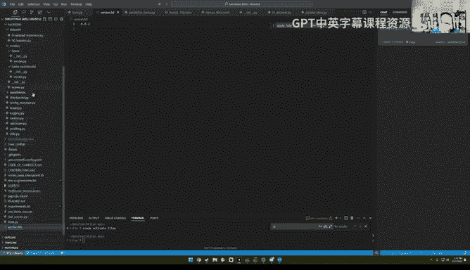

There's a bunch of CI related stuff and testing related stuff that's probably not going to be super interesting。

But yeah， I think we went through the whole code in maybe an hour。hi is interesting。 So yeah。

 I guess Jan you， any parting thoughts。I saw like in the chat that people are also asking HSDP just want to briefly mention HSBDP dennototes。

 so FSDP is fully sharded data parallel， which means you're doing data parallel but you shard your parameter weights。

 HSDP means hybrid sharded hybrid sharded data parallel。

 which means you have two layer storage system and in the outside layer like you would store so suppose you have a big like higher level of GPU organizations and you store your whole model on each of the group。

And within each group you do FSDP and the benefit is that this significantly reduced the rain size of your allggaer so that you only communicate within a small group。

 usually， for example， on a single node， which is much faster than you do fully short and doing this rain allggaer across the bigger world size。

 this is assuming that your model can be fit your model can fit on a single node， for example。

All right， so if folks have more questions please post them in chat。

 I do want to make one quick plug， which is that like if you found if you enjoyed GPU mode in general。

 the content that's on there and if you enjoyed the things that Jan was talking about today。

 then we basically have a project popcorn where you can work on training a large model in public。

Toper。Yeah， sorry I just have one more comment on Torch Titan is we recently I posted a vote for new features on the discussions of Torch Titan this is a great opportunity for people for the community to have an influence on what we do next so I would encourage you to either vote on existing features or proposed new can you go to this 693 link。

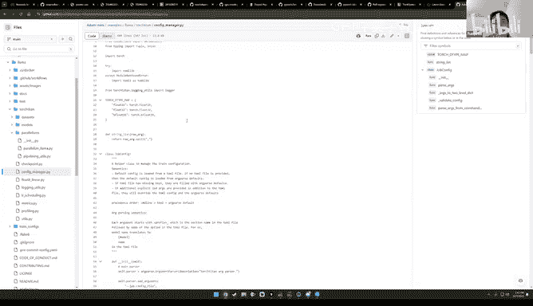

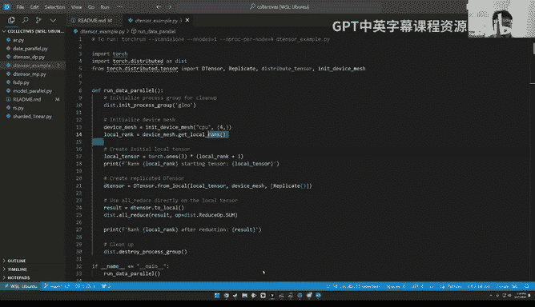

Yeah， so you can see current the top ask is M O E。 the secondary。

 the second ones are multimodal and diffusion models。

 so it seems gets pretty popular and we're serious considering to to。Caer to whatever is asked。

All right， very cool。呃。So like if you're potentially interested in also like working on the Pytorch team as a PhD intern and you found these topics generally interesting。

 please apply it to this job and you can like reach out to me if you have any questions。

 the advisors here would be like Vincent Moines who's the tech lead for Rl assume it and the creator of PyTch and myself。

 so just like let us know if this is interesting to you。Otherwise。

 if you want to chat with Tianu more， then， oh yeah， let me copy paste the link。Otherwise。

 if you want to chat more with Janu about Torch Steideden。

 we already put the discussions in the link， I think he's fairly active there and on discuss so just let us know if you need anything and thank you everyone we hope you enjoyed this lecture this is gonna to be the last lecture of the year but next year the first lecture will hopefully be Adam Pashke。

 which is the co-creator of Pytorch and so we'll see everyone soon Thank you so much。

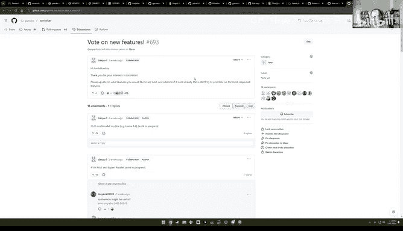

Thank you。 Thank you， Mark。