# GPU MODE《CUDA、GPU编程1-53课｜GPU MODE》中英字幕（deepseek-v3.2 - P43：-20241221-Lecture 40_ CUDA Docs for Humans.zh_en - GPT中英字幕课程资源 - BV1QZ421N7pT

SoWelcome everyone。 This was a like pleasant surprise like guest lecture for GPU mode like we sort of did a fake out where last last week was gonna be the last lecture。

 And then Charles like came up with like a really banger post like sort of describing like how he went about like learning Kuta and just like it's very comprehensive like Docs So a lot of people were messaging us to get something started。

 So Charles like thank you so much for for joining us yeah off for the do you know。

 we will sort of get out of your way。😊，Great， all right， yes。

 thanks Mark and heads up that I'm joining from O'hare International Airport because we miscommunicated on the timing of this talk。

 I thought it was tomorrow so I'm here shipping it doing it live， so apologies for any issues。

All right let's go you should now see my screen so the theme of this talk is Kudaox for humans so that's what I put together recently with the team at Moal and actually I'm just going to do a quick live demo of it here and let's say make that a little bit bigger and so the GPU glossary here is something that kind of collects together a bunch of information from all across the stack for working with GPUs so you might be reading about some NVCC compiler flags while you're trying to like you know get something working or compile a new a program for a new GPU and it mention something about compute capability look into that and it mentioned something about streaming multi processor architecture and stream mold processors and all that information like all those terms are all defined out there。

But they aren't really all defined in one place so with this documentation you could be in the doc on NVCC compiler flags down here in the our little doc on the NVdia co to compiler driver and then instead of just saying compute capability we've got a link to article on compute capability compute capability one links back to the compile article and not also links to information about SM architecture along with some nice little diagrams and so。

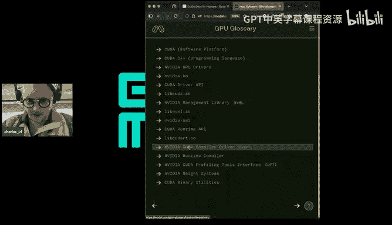

The idea here is to make something that's， you know， kind of。

Interlinked you know that's hypertextual that brings like all these different components of the stack that are usually talked about separately that are documented in different places like altogether in one place and as you can maybe tell。

 we had a little bit of fun with the design on this one giving it a bit of a couda mode feel and yeah so wanted to talk a little bit about sort of like where this project came from then give a high levell overview of like sort of the main takeaways from the project and then also talk about like how we want to extend it and where we see opportunities for folks to work on it with us if they'd like。

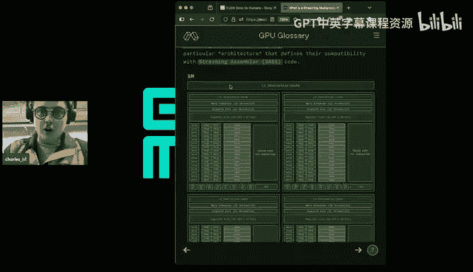

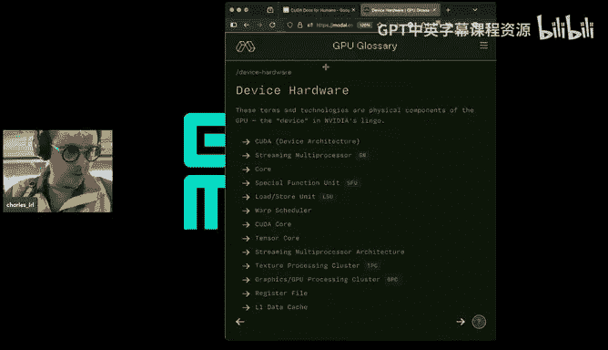

So let me go back to full screen of presentation mode so yeah that's my list of topics so we've already covered sort of what this thing is now it's I want to talk a little bit about kind of where it came from。

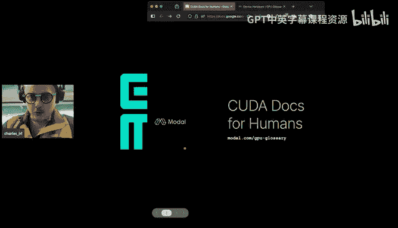

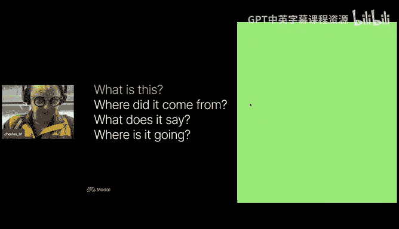

So I could to tell a little bit of my own story as origin story to explain like where this came from like my background is actually sort of originally even in biology and psychology and then as like a researcher on kind of like the mathematics of neural network optimization so worked studied at the University of California Berkeley like how to like prove neural networks converge and this was like all this work for reasons that the limitations of software at the time was actually done on CPUs with the old autograd library not the like one insight torch the one that that one was inspired by so if I can get some old man emoji reactacts in the chat if anybody else is ever remembers that library use that library yeah so this was you know this was starting almost 10 years ago technology was still being research that figured out and it was an obvious like whether it would work what it would look for and。

We but over the like following five or six years， it really took off and so。

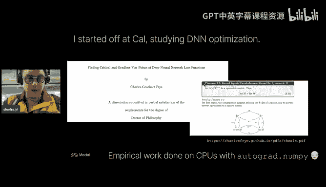

Then became time to like make this stuff actually work in the real world and I started sort of like helping people operationalize their research and help them like sort of make their research work well so they could turn it into products and that was at weights and biases and while I was there I started having to help people with a bunch of like more like brasst stuff about getting things to work well running things like efficiently at scale or debugging performance issues and that's the first place where I actually like ran the Pytorch profiler and started looking at what these like these networks that I was describing at a high level these training algorithms that I was running what were they like actually doing so it's shown on the right there is a little Pytorch trace were produced by the Pytorch profiler and this was like maybe one big takeaway from this for me was like if you encounter a new like software system a new like programming model the best。

Ting to do is to like generate yourself some traces and then click through them。

 explore them and like keep asking questions until you're no longer confused by anything so like just looking at this is where this is where I learned what the A10 library was inside Torch where I learned about like the asynchrony of like coUa host launches versus KUDa device kernelnal device Act like。

actctual execution， all of these things and to this day is still a great way to debug you know high level performance issues。

嗯。So moved on for that and now I'm helping people like kind of deploy things on to like you know just like deploy technology and run services。

 not just research how they work， not just like build the original models but actually like get things out there into production so I'm working on with modal you know for no particular reason and certainly with no reference to current events the sort of thing that I'm working on now is showing people how to do inference time compute scaling。

 so did that this summer beating GP 40 at human Eval by scaling a bunch of wamas。

So in the process of doing this， I've ended up doing a ton of like both environment and performance debugging for people who are running。

 you know they're deploying theLLM they are deploying a diffusion model and something is broken there's an error message bubbling up from very far down in the Sta or they don't understand why they can't get things to run as fast as they run on XYZ provider and they come and ask us for help and so that is when I wrote a little document called I'm fucking done not understanding the Kuta stack which was like let's you know stop hacking things together。

 stop figuring things out just like you know Willy nilly and empirically and let's like dive in and understand like what is going on here so this is is sort of like original document that eventually came with CPUU glossary and。

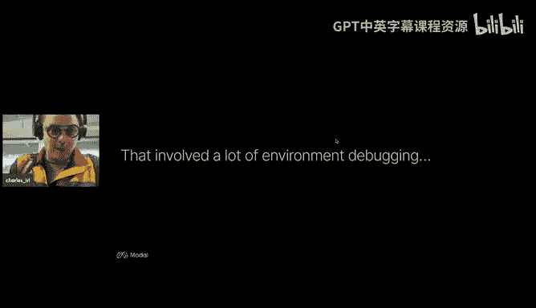

One thing actually didn't have time to put this slide together， but I wrote this thing down。

 people were using it internally， went to the Kuda mode IRL hackathon that Mark and others put together and like met people and talk to them about how they understood this whole platform and how they resolved I found a lot of other people had little document like this one and I thought okay。

 lots of people are writing this sort of thing then maybe this is something that lots of people might need or want。

嗯。And I think。Theres， I think a reputation from people of that like the documentation for this stack is bad or like yeah the Kuda dos are so bad but one thing I learned from this process and also from working with the team at Moul who does a lot of this like infrastructural software work is that the trick is that the answers aren't always in blog posts there and always in like the high levels of documentation sites where you'd expect to find them。

For a lot of more fundamental technology， more slowly moving technology。

 like an instruction set architecture or a parallel programming model。

 things move slowly enough that and the stakes are high enough that it's still the case that things are written down in oupant formats as like PDFs on NviDA's website where there's a bunch of being incredibleedible documents that I have very rarely seen referenced elsewhere as well as textbooks like We Me who's program MSP parallel processors or the professional producing programming book by Chang and others that some of these books or Ps are like quite old but the fundamental technology move slow enough that the like core ideas are in there and they're explained very easily and clearly with all the context that you would need。

 but they're not as tightly interlink as what websites would be they're not as discoverable you have to kill a tree。

to get some of them and so like this information is not as like readily available as people expect。

 and so that was sort of the impetus for putting this together into like a nice big public document share with folks。

so having covered like where it came from want to give my like high level takeaways from having like put this document together and like you know。

 tried to hold the whole stack in my head for long enough， you know。

 to write this thing so these are some hot takes and I welcome you know。

 questions challenges and interrogation from the chat， you know。

 interrupt me Mark and Phil if there's a if anybody's coming in。

Coming in hot so。The like first one and the one that was like kind of actually like most clarifying to me is that there's actually not one like Kuda people use this single like acronym and this single word to refer to actually things that exist at completely different layers of this stack。

 the you stack required to run accelerated programs。

 massively parallel programs on massively parallel GPQ hardware so at the like highest level is there's some host software so this is software that like runs on the host and you know doesn't really have anything directly to do with the GPU but it's part of this overall stack it's a software platform and the programming language。

Um， like sort of interfacing between Matt and hardware is like a an abstract programming model that maps what you。

 you know， what you might express at a high level onto what actually is going to occur on the machine sort of like a contract in between these two levels is like programming model。

And then at the very bottom， the like at Kuda refers to a particular approach to building hardware。

 so I wanted to talk about each of those in turn。Like what， but what is each？

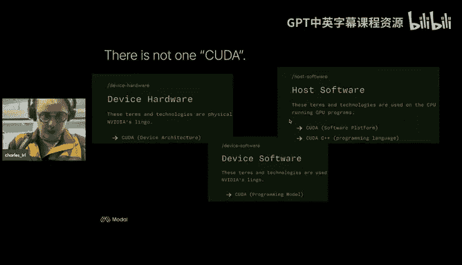

So the kuda people are going to be like most familiar with。

 especially people with like my background coming from the like ML research like I'm using a Python library that even wraps most of this stuff like Pytororch like Kuta is this like software platform like E gott and it has this particular kind of layered architecture that you can hook into at multiple points and each one of them is going to use like the word ka at some so just like drawing your attention to this diagram here which you can read more about the glossary。

 you have your application code it's going to hook into different layers of this stack in order to like。

Launch work on a GPU so like an application code here includes something like higharchch for example。

 and that's going to talk to the kuda runtime API aka Lib Kudar it's going to talk to the kuda driver API。

The Li kuda and each of these。Layers exist to solve like a slightly different problem that arises out of like trying to map the underlying hardware。

And it programming model onto something that can be like programmed from other like。

 you know programming languages。And before diving into the programming model。

 I'd say it's also the case that like you know this software platform actually works with multiple languages so you can have coU to C programs or co to C++ programs or even coUa4ran programs and there's like really I don't think anything stopping anybody from making like a coUA rust programming language because the fundamental thing that is the job of a lot of these like APIs and software platform components is to introduce an additional programming model into those programming languages。

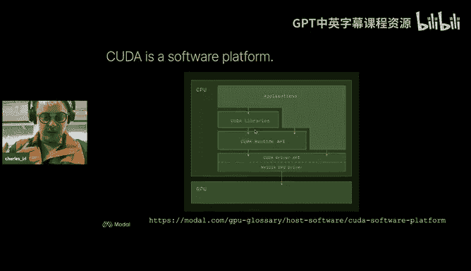

And that programming model is the like Kuda programming model you'll see it like referred to as such in the India documentation and in like books and blog so the programming model is something that's actually pretty abstract over here on the left and what I show over the right in this diagram is that like this abstract programming model gets mapped reasonably tightly onto hardware so first let me talk about the like higher level of programming model so the idea of this highlel programming model is that you write programs like fundamentally at the level of a single thread so that's like actually slightly different from the way that like regular programs in like a projects environment are thought of or sort of you if you look at the definition of C like the C standards you won't see like mentions of like threads like the things actually sort of basically operate。

At the level of process quite a lot in the way program for host computers。

 but we operate at the level of a thread which is like implicitly like one of many threads of execution that are simultaneously in flight。

with like， you know， importantly， when you have lots of these in flight。

 it's not just that they might all be operating in parallel or concurly， but also that they have。

Manddatory or mandatoryatorily like shared memory so like with processes in like the Linux kernel there's essentially no shared information like modular copy on write stuff and so you have to opt in to like inter processcesed communication and but with like groups of threads like thread block in the coto programming model there's like automatically shared memory between those threads and so this shared memory is like actually an abstract thing people will sometimes but it maps onto something fairly specific in the hard maps onto the like L1 datac of streaming holding processors that's it's like home and。

When。So when people are like talking about one of the things that makes it sort of tricky and why it's important to have this kind of like integrated documentation that crosses all the levels and talks about each one is that people will say shared memory when talking about through multiprocess sometimes。

 and so like all that distinction which means something that's abstract in this programming model something that's like concrete and part of the hardware。

And so we have this notion of a thread block collections of thread blocks come together into these kernel grids and I think we'll see this let not get ahead of myself yeah like these thread blocks have in turn their own like abstract memory store which is basically mapped onto GPU Ram in the like physical hardware and then they have there are like rules about like what you can assume in what you can assume about which components are going to run in parallel with one another and which ones are going to run concurrently with one another and this abstract programming model is independent of like any particular implementation of it either in like hardware or like execution of it on any particular hardware or like any particular programming language like the code extensions to C or sequenceQ+ that implement this programming model and so this one's like a little bit of a kind of like subtle distinction like。

This is like the difference between a cooperative thread array。

 which is like a term you'll see in like your asmb language and a thread block， the thread block。

 is the abstract thing， the co thread array is the implementation of thread blocks in a particular like implementation of the coUDA program model。

 which is in its implementation in parallel thread execution PTTX。

 the like intermediate representation or like GPU assembly。

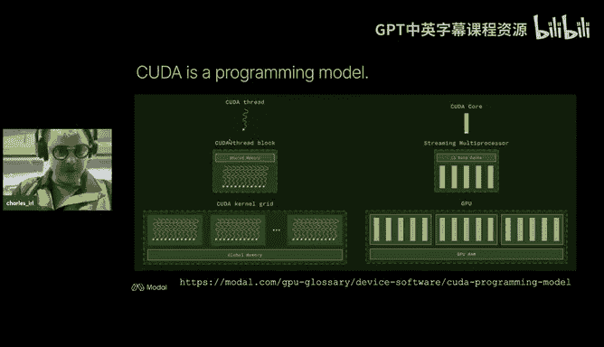

嗯。😊，So。This like the final way that people will use like PUa and the original like definition of the term was compute unified deviceboard。

like an approach to computer architecture an approach to like designing like a chip and a system like you know independence of the details of any particular component and the like idea of compute unified device architecture is that instead of having like what we see on the left which is like you have over here you have fragment shaders。

 vertex shaders， this is like a pre Kuda Nvidia GPU， I forget which one this is。

But this in like you have specific hardware components dedicated to operating on vertices in a mesh and separate ones dedicated to the like textural components and this like this so there were like specific compute unit specific hardware for different components of your pipeline and the idea with the compute unified device architecture。

 which is an example which is shown on the left， I believe this is the G80 so like the first whoa die you have only one type of processor the streaming multiproces that's each one of these bots here。

 so there's not heterogeneity between them， you instead issue instructions for operating on vertices for operating on like pixels textures like you just spread them out among these compute units and this is like a general principle like let's not try and like guess what balance there is going be between different workloads let's build like。

homogeneous compute unit and then scale that up and this computer architecture principle dovetails really nicely with the programming model。

 programming model is designed to transparently scale based on these rules about what memory is shared and what kinds of synchronization is possible is designed to transparently scale as it gets more streaming multiprocessors unlike a typical like you know see program or like you program in the Poss environment that is generally going to have to be rewritten to take advantage of increasing the number of cores and certainly like a compiled program targeting like X86 or arm that will have to be recompild and frequently even like rewritten and rearchitected when like lit vector lane sizes double and new instructions。

And so。This is like where kind of like the original vision comes from from this device。

 like thinking about it at the level of the hardware and then like sort of extending that out to what like alertt writing programs for that hardware should look like and then like what the ecosystem of software should look like as well。

 should like it should be software that transparently gets fastered as the processors scale up。嗯。

And so I'd say the like clearest explanationplication of this vision， by the way。

 is in a white paper from 16 years ago， Lhole at all in 2008 introducing the compute unified device architecture I forget which conference it was in I don't think it's hot chips but it was in another one of these like you know like conference paper and it has like a bunch of it like lays out the entire vision in like not dissimilar way to like the GPU gloss covering the entire stack from hardware details up to like eye-leve US system and I'm not aware of any like comprehensive anything as comprehensive as clear as like that originallinhole at all white paper so it's linked in a bunch of places in the glossy to try and nudge people in that direction so I' strongly recommend you check it out。

So then the kind of like secondum hot tape。That or or maybe high level takeaway that I got from like putting this together is that actually the like most important part of the kuda stack isn't any of those things that is talked about called Kuta it's actually the parallel threat execution instruction set architecture so。

This instruction set architecture of this is like when you compile photo to run on NA GPUs。

 this is this intermediate representation that comes out。

 unlike a lot of other intermediate representations though this one is like actually kind of mandatory in that when you generate like PTX this is just in time compiled or runtime compiled in order to execute on the actual like on the actual streaming multi processor that is present for the things run and so this is how you get like forward compatibility and so you can write the program compile at one time and then like just move the compile binary from like one GPU to another and like observe speedups and even like take advantage of new hardware and new features sorry just one quick interruption if folks on the server if I know you please reach out to me if you'd like to come up on stage and just ask the question。

Charles directly otherwise asking in chat So Vi come had a bunch of questions so I just like thanks yeah Charles can you go back to a couple of slides behind sorry we were trying to figure out how to get yeah this slide I'm trying to understand how we are differentiating between what is the left side and what is the right side am I understanding this slide correctly but the left side is basically a software abstraction and right side is a hardware abstraction。

😊，Yeah， I would yeah， left side is a software abstraction。Right side is yeah。

 a hardware abstraction that's like most closely maps onto the thing on the left side with the same like visual characteristic。

Yeah okay I have one correction then the thing is1 datac is not the right method because it's not a cache fundamentally it is it's both cash and is crash by so I think that's fair so this is one thing I didn't have time to talk about the idea that like yeah when people say cash they usually imagine like hardware managed cash right and so you like you assume that you don't have any control over it you just have to like learn your compiler and one of the like unique features of the coup to programming model is this like that these are programmer manage which gives you like control over the impact of context switches which is you know important produces like you know produces the penalty of context switches like yeah。

😊，Yeah anything else that I missed in that extra bit so I'll add some more which was like a pause asked to made a good point is saying like given how complicated CPUs are honestly I think they could benefit from an intermediate representation like BX as well and in fact that IR is in a sense already named X86 Yes I was going make that exact same hot take which is like the microcode that gets admitted to actually run on CPUs is is like distinct from the X8 like X86 instruction set and like I don't know like my view from the outside here Vor may have a different take is that like Nvi gets the benefit from coming later being able to say like wait a second。

 let's like actually separate the binary instructions from what people compile their programs to so that we don't have to do it in microcode where it's like way more painful。

All right， well we brilliant， yeah。Great， yeah， if you're interested in like picking a little bit at that like CPU problem of like X86 versus microcode。

 I would recommend looking up this paper on the secure guard extensions forget title of the paper。

 yeah， this is like an external group sort of like like you know explaining the secure guard extensions and explaining the security model and that like it like in order to be able to provide this hyper secure like tightly controlled cloud execution。

Like environment Intel use the fact that you can't actually write microcode you could only write X6。

 so yeah， definitely check that out for another very inspiring wild take on computer architecture。

Yeah， okay。诶。Great。So let me try and dive back in where I was at on this slide。

 so yeah the most important part of Kt in my opinion。

 is the parallel thread execution instruction set architecture which sort of creates this like divide between the like programs that you write and that the compiler outputs and would actually execute on the hardware Of course there's some subtlety there in that like for like the highest performance applications people will like jump past PTX and output fast directly but if you want to be able to like put out a binary that people can run on like that people can you know take run and then when a new GPU comes out it automatically runs you know automatically runs say nothing of running faster then you have to put out this intermediate representation of PTX。

And。So right， so it's actually like。This is the place sort of where that like abstract programming model really needss the road like like an implementation like P to C++ will say like oh you can access the like KA programming model shared memory or device memory by means of these extensions to see your C++ but then like how are those extensions implemented well a compiler has to turn them into instructions and for that compiler to be able to operate properly。

 it needs to or you know and for programmers to be able to like write things that the compiler or compiler for them with the behavior they expect you in the end need also another like sort of virtual machine that like PTX like PTX programs that virtual machine and so this is like。

This picture on the left， which I believe this is the PTX instruction set architecture is where we found the original version of this diagram。

 you'll also see it kind of like duplicated in a couple of different like books and blog posts and elsewhere。

 this is like the diagram for that virtual machine where like unlike a typical like you know the。

Like very simple virtual machine you might see for like a v Ney an architecture where there's one processor with like registers。

 caches， instructions and memory like built into this from the beginning is that not only are there like multiple processors。

 but each multiprocessor is composed of multiple processors。And great， so this。

 the important thing about。In my mind about like this virtual bahe and its behavior and about the like the programming model is that all these like constraints。

That say like oh， you aren't allowed to do a synchronization event between these two components of your program like those constraints are frustrating when you first encounter them like as a programmer you're like it's my machine。

 you know I'll do what I want but these like constraints in a programming model are like like you know give you capabilities like of a program so the most important by kind of capability I think from a lot of the restrictions of the goodto programming model might otherwise seem like inexplicable is that it allows like transparent scaling of programs that like you are forced to write programs that decompose into blocks that can run in arbitrary order with respect to one another and so then when they land on a machine with more like schedable units then they like transparently scale like onto that new machine。

So I think this diagram up here， which also I think。

You'll see in many different places is like expresses this idea at the level of like red blockslock in a thread blocklock grid or components of a kernel launch。

 I think a similar thing is also true at the level of like warps that are park。A single block。

 but yeah， I don't have a diagram for that one just yet。Okay， so。

That's my like final presentation of you know， what I learned in putting this together。

 I if you learned one thing from making the GPU velocity。

 hopefully it's as the perspective on GP programming that looks like that before I talk about where it's going。

 maybe another pause for questions， Mark。right I had， oh sorry， one question that I had is like。

 I was just going your diagram that mentioned like X doQ NVCC handles that。

And I guess the co to runtime deals with Cuban， which I'm assuming is like the binary code that runs on it。

 So it's like， is the sauce basically the Cuban。ThisIn this diagram。

 the SAS is the most important new thing added in going from the like PTX representation to the Cuban representation and yeah you're right to think of that as being the equivalent of the like binary you know like host only like C program it's likes you know you can inspect it with L or dwarf the same way you could a host binaryry。

Cool， thanks。So。拜拜。So I want to talk a little bit about where where I see this project going。

 because I actually probably should have said this earlier。

 but I got some really incredible feedback from folks in the GPM mode Discord on like both like technical content and like framing and presentation。

So yeah， you can see them on the contributors's page so so would love， you know。

 I would like to make this like an even more useful community resource。

 so let's want to talk about some ideas plans on where we might go with this。

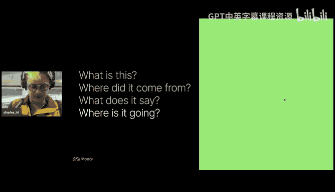

So some like shortter goals I think like a kind of obvious one and that been talking a little bit with the folks in the popcorn kernels channel about like chat youU we'd like to make it possible I call this kudox for humans but really it's also possible kaox you know synthetic humans for language models pretending to be helpful assistance so the thing I don't want to do is like click a button to default you know construct some retrieval index and then put an annoying little magic wand emoji that you click to chat with it like that's not the right way like that's the way we've been building these things you I'm not without sin of having built that kind of chat assistant but it's clear that that's not the right way to do things but you really want to something that looks more like robot text。

 something that's like easily you can easily hook into extend develop so I think the answer to that is El1t I'd love to know if people in the server have ideas about particular。

teechnologies or approaches to like make it as easy as possible to turn this documentation into interactive like language model。

 powered， like learning or search experience。One of the things， sorry， Charles。Yeah。

 one of the challenge with making all of this material in a Dtex format is that images cannot be captured really well and the other problem really is the context window that you are to give for an LLM to capture all the content becomes humongous for instance if you just take the programming guide then the compiler guide then the device architecture guide and the rest of the guides to right so it's humongous amount of pages to pass to figure out for a model to understand okay what to answer so youre increasing the cost think right so LLM THD is best if you want to train the model in that manner the training approach will be beautiful this is why I think one of the message like okay we can use a popcorn approach that we are taking hey let's kind of re a model find you in the model in a better so that we can get to that appointed。

😊，But I'm also thinking the other side too right so I think having a naive retriever is not that expensive so we can use a birdbased embedding and then do a chunk at the page level or a multiple pages level and then do a retriever on that embedding and then capture that and then give it as a context maybe that distributionvation but yeah the best part about your approach the GP G is you have a structured way of looking into the lot of chunks of data which is beautiful and making that and giving that information to a chatbo will be amazing because structure gives you more flexibility to go from there。

😊，Yeah maybe maybe this is an application for Gra RaG and I'll have to take back my snarky comments about it yeah that's a good call out yeah thinking LM text like some people seem to be jumping on that format for at least like guiding models but yeah like having some kind of multimodality。

 something that's like yeah works well with multimodal late interaction systems like Colt like yeah so invite definitely folks feedback on like what they think would make this as easy for them to approach in their systems is possible。

嗯。So some extensions to the content， one thing that was really important for me while I was building this was that I could like check a lot of this stuff and like debug my own mental model by like running little snippets and like you know with modal that was like pretty straightforward I could like run a system and then I could do things like I could do silly things like delete you know loop co off the system and see which things broke or know take different approaches to linking and see like where things would fail and then also of course like being able to like run code snippets while explaining some component of programming model so like Rus by example as a really nice is a really nice example of this it's like challenging to do that in a way that's really like durable and the approach of doing stuff with Wasm me challenging because a lot of the stuff is written to run on you an Nvidia GPU。

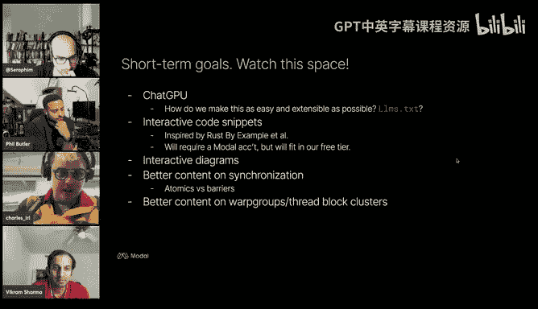

a you know coed and PTX and so wasA might not be the right way to do it。

 so we're probably going to do something that runs on Moal and but should remain free as in like take less than the $30 a month that we offer know to run all of them to your hearts。

Yeah， the like diagrams are really nice one of the problems that they have is they're not like interactive。

 you'd like to be able to hover on them and then like if you're hovering over a diagram of a stream multi processor to click to go to the diagram on the L1 datac and like that not something that we offer right now then on a sort of content level of sort of like most critical stuff for us I think short termm is to get better content on synchronization talk a lot about the like thread and memory hierarchy in the coUa programming model but there's also kind of like a synchronization hierarchy that's like part of what gives meat to the notion of the thread hierarchy but like you just haven't had enough experience like really exercising that to be able to talk about it relatedly there's also like one of one of the issues with you know that coupa programming model is that it's diagram is that it does skip over recent addition to that hierarchy。

 like there's a new。Of like a。Group of blocks that are scheduled together and I think also another layer below maybe not in the programming model of like groups of warps and so there's like additional content like that is maybe hopper specific but it's likely to be like present on future generations of GPUs that we'd like to add。

So a lot of stuff stuff we're already sort of making progress on right now。

 definitely the chat you one is the one that has like the most external we need the most like external feedback on if you'd like to review the concept on synchronization and threatod clusters。

 etc cea， you know heavy up we have the contributors page where we express our gratitude to all of our reviewers and。

嗯。Mium term goals these are ones where we're definitely looking for collaborators and here like where we'd be interested in partnering on writing both like content and code around this we don't really talk about performance debugging like we skip over a bunch of terms that are like really important for understanding how people talk about performance like bank conflict occupancy threadhoring and again like just as in the GPU glossary you'll notice that these are terms that kind of like cross the stack from very lowlevel hardware to like programming approaches we'd like to like collect up as much as we can about performance debugging and what is known let's share it accepted in this spot Another one is like GPU fleet management so we talk about NDM and VSMI a bit we could stand to write quite a bit more on using those tools and then also there's like another sort of level of tools and also hardware considerations that are important for GPU fleet management like how you know。

the health of like  a000 GPUs that you're shepherding over and then folks running things on Moal like frequently run it' scaled hundreds of GPUs and they start to run into the kinds of problems that that kind of deployment has。

Just like the sort of like cores that don't count results that Google shared about CPUs that they ran at super high scale。

And then we also you know like offer like multiple multi GPPU execution。

 so I have less experience with multi GPU execution because I was a poor grad student for a long time。

 but like this is increasingly important running large models。

 running things with batch and like would love to like collect up a bunch of information on that and and talk about it so those like yeah the library is available like postside libraries like nickel and then also sort of like fundamental technologies。

 the hardware that pulls this together you know end link and PCIE。

So those are all things we are like definitely interested please hit me up if you're if you're into this yeah Charles if you don't mind if I interrupt you actually yeah like I just went through your through your contributors page and it's sort of mentioned that there's like an email like where people can reach out to you I'm wondering if you'd be interested in also having a working group on the server because like there's a lot of people that try to like as they're learning stuff like you know they have a good good explanation and they might want to write something really con and if is something you viewing。

😊，Yeah， that'd be great we'd love to do that yeah we can talk about setting up a working group。

Okay lovelyll yeah so I probably should have mentioned that like a while ago or done it during my demo。

 but yeah there's like a little button in the corner of the question mark where you can like pull up an email to communicate with us about the glossary suggests changes lots of people pull out you know a type over to from that so definitely reach out to us I think that's glossary at modal。

com yeah so I will say like we aren't sure if this is like how we want to approach it because right now it's like tightly tied up with the rest of our like production website but we would like to open we are considering ways that we can open the material up on Github I think like open source projects generally succeed when they're able to deduplicate what would otherwise be like duplicated non-differentiating labor at a bunch of organizations like like 15 different organizations have to write their own internal version of this documentation or whatever。

I think there's like definitely an opportunity here where I want to figure out exactly how we want to do that。

so that's like kind of like high- levelvel project project structure or organization structure。

 but we're also like Moal， we're working on multinode support in our platform being able to schedule onto 163264 H 100s and that brings a whole new collection of hardware and programming models and programming problems ranging from like you know from Infinivvan verbs to Infinnovavan cables and across multiple stackts so we we haven't fully you know double down on this but we're thinking about it then another one is that there's like people are increasingly interested in writing Triton which targets like PTX and lower in the stack and so I have less experience there than I have with K to C++ but it seems like this is a place where a lot of people you know。

Being able to go from like zero to 90% even if they can't go 100% and build useful things like the LE kernels that we saw in a previous talk in the server so and then lastly I think like once you you know when you have a textbook it's nice to teach a course on it so like possibly in the future partnering with a university are delivering via an online course platform once we have you know at least the like multiT GPU programming stuff and some of the other things on our shortter goals。

嗯。So before taking questions， just close out with saying， yeah。

 this work was supported by you the modal， the startup I work on makes it easy to run stuff on GPUs in the cloud。

 where actually we're hiring some more GPU whispers if you'd like to help help folks make their things run fast and make GPUs goB and do like open source contributions for faster faster kernels or precompd binaries email me Charles@modal。

com and maybe we can go co of mode together。Thank you。又系惊咗佢可以帮。Thank you， Charles。 This was sick。

 I mean， yeah， like for what it's worth。 like as I've been turning into a more。

 much more active contributor of Moal myself， I've decided like a fantastic experience。

 Like we're working on a leader board where people can just like submit like Discord messages and get stuff running on all sorts of GPs。

 blazing fast， you know， like fastest sort of times in the West sort of thing。 So。

 so overall I had like a very， very positive experience。 So thank you。😊。

Asome yeah yeah happy to support that and also like in general folks in the Discord are probably doing interesting projects and running into compute constraints so you know hit us up with things you're interested in doing we collaborated with the team that got the highest score for a purely open weights approach to test time or In time Comp scaling on our AGI pub the MIT Cornell team so they ran all their stuff on our platform so yeah we're happy to support research and development and things that make it easier to you know make computer smart and make GPUs go fast。

All right， folks， if you have more questions in the chat like I guess like Charles will hang out like a bit more with us yeah and then oh I see I see a question from applause。

 could we get a link to the I am like Fing Dun with not understanding the goodt I posted that earlier。

 I'll be posted again。Yeah， actually， I think that document， that document is only internal。

 I would say that one。I that one was a lot focused on the actual like like KUa like software platform。

 and so that actually most of that material already is in our docs now as not Docs slash Puda docs。

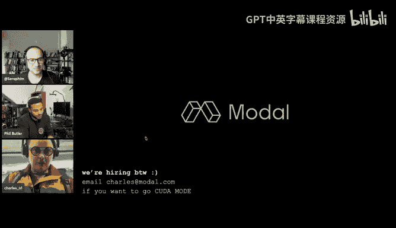

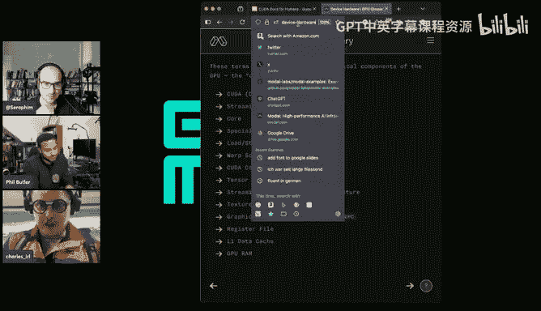

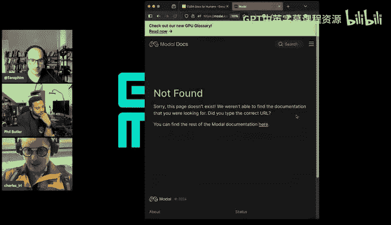

Right slash。So this guy here has basically， I took everything from the I'm fucking done。

 not understanding the Kudest stack and wrote it in here or the GPU glossary。Yeah， like。Yeah。

 it shows。I want to understand what is the issue in the documentation I mean I agree that our documentation is horrible so I'm trying to understand like how can we fix that right one of the things that I understand is that it is outdated and it is not that's a constant feedback we got and we are trying to fix it but yeah we are trying right so there is still a lot of。

😊。

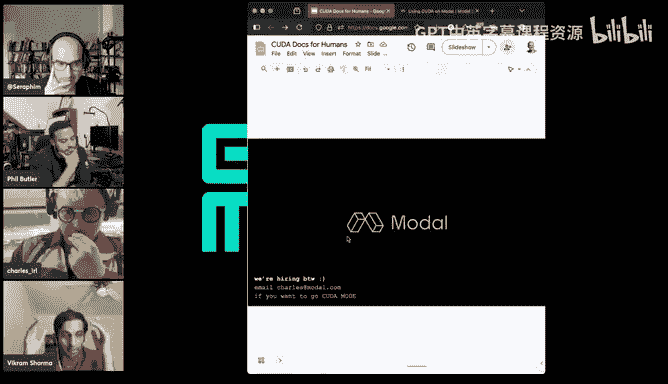

So to be clear， I will say that I actually my opinion of the documentation is actually very high。

 I don't know if you saw the slide where I was talking about like reading through the PTx IA doc。

 the best practices guide equal plus guide and then of course the like externally contributed textbooks so like actually I think the primary problem is like as we were talking about when talking about the LM text is actually like interlinking of these artifacts and I understand actually I would expect that to be much more challenging as like the original producer of this information and like the absolute golden source of truth as the like manufacturer and like the producer of the binaries like your like you like your the like quality bar is like 100% not not or like five nines instead of three nines and like maintaining something that's like you know。

Concurrent access to a data structure full of pointers is challenging enough when it's in hardware。

 it's a lot more challenging when that data structure is being concurrently accessed by teams of humans。

 so like what feeling is this is actually sort of something that's a little bit more difficult to do from like the manufacturer as an organization as somebody working on it externally or the community working on it externally。

Yeah， I mean why like one of the things that we are trying to do is like， okay。

 we need to figure out okay what's wrong and we need to help them right so because they're doing fantastic touch job。

😊，So we learned a lot from you guys too， so thank you so much great， yeah， yeah。😊，Yeah。

Would love to find out ways we can help each other definitely and yeah。I I I I。

 I guess Charlotte like， then was your experience like that。

 like the kuta docs are like sort of simple but not easy。 Like， they're sort of correct。

 and they contain all the information。 But like， it's hard to build intuitioncause it like， yeah。

Yeah I'd say that I'd say that's pretty right， I would say I also wasn't like a lot of this stuff is not about pushing to the absolute frontiers of performance and when you push the absolute frontiers of performance like distractions break down and like models stop become like you know all models are wrong but some are useful and the place where they're most wrong is in the details that come up when you are like pushing the absolute limits where perform。

So I think a lot of people， I would say some of the people complaining about like Vi you express people saying like oh。

 it's out of date or something， think those are people probably like pushing the like very furthest boundaries and that's always just gonna to be an extremely difficult thing to document and it's sort of like it's almost like there needs to be a period in which people sort of like suffer and die in the trenches so that you can learn like like how to explain it properly and what the actual real truth is in deployment and all these other things。

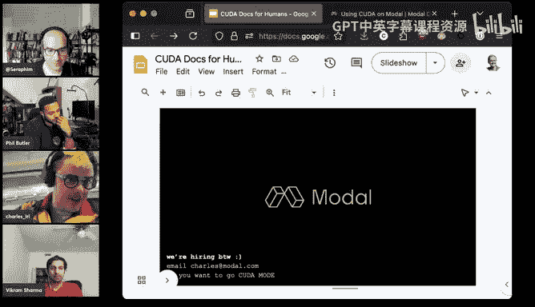

All right， I don't see any more questions in chat。 So thank thank you。

 Charlie for contact folks like Charles is at the airport with his mom。

 So we just like took something like valuable holiday time away from him。 so so thank you。

 Charlie for coming on board。 I think this will actually be the last lecture of the year， I think so。

 So there's gonna be no more fake outs。 We're starting again in midjanuary。 And if folks。

 if you have any questions you'd like to ask Charles， he's very active on Discord。

 He's very active on Twitter， So feel free to reach out to him there。

 And thank you really means a lot Thank you。😊，Thanks， thank you so take care you Bye bye， again Mike。

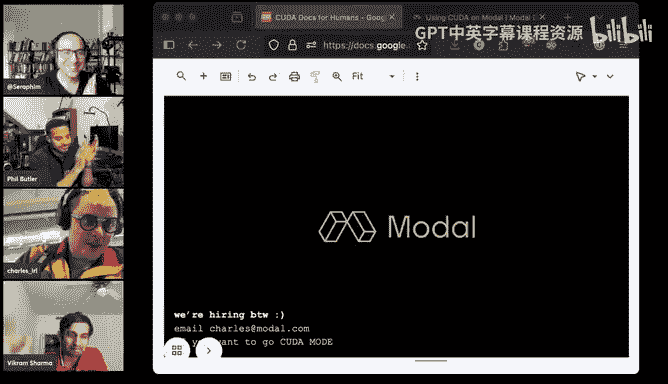

食べ allで。