# GPU MODE《CUDA、GPU编程1-53课｜GPU MODE》中英字幕（deepseek-v3.2 - P44：-20250125-Lecture 41_ FlashInfer.zh_en - GPT中英字幕课程资源 - BV1QZ421N7pT

All right， we're live。

All right， well He hey everyone thank you for joining welcome to the first like episode of GPU mode of 2025 thank you so much Zha for joining this going to be our party first lecture。

😊，So Z actually came as a recommendation from like one of our former mods like By Byron who basically described like Z was like one of the best like engineers he knows and as I was like going over the as I was going over thepo the reos that you've created like I definitely started to to really notice that so I'm like really psyched to have you here and yeah take it from here。

 I'll be monitoring questions on chat if anyone has any questions。So yeah， hopefully' get started。😊。

Okay， cool， yeah， thanks for the introduction and thanks Karen for connecting me intoTP mode and it's very exciting for me here to present our work as on flash Infer。

😊，So yeah I'm a graduate student at UW and currently I'm also part part time affiliated with NVDdia and flashlashing is our work that have been done over have been going over a year and now it has been adopted in many AM inference engines and today I'm going to introduce a little bit about the attention part of it so my talk title is about the efficient and customizable attention engine for AM inference survey。

😊。

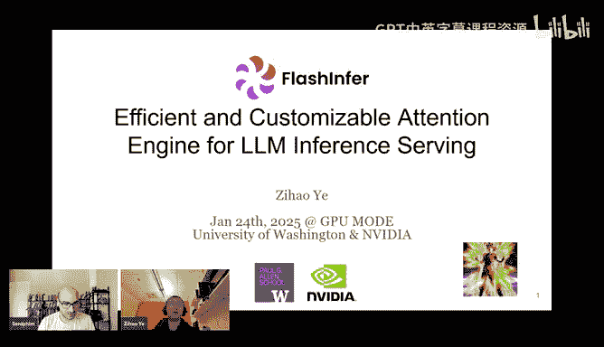

And actually， flash Infrra is actually more than attention kernels。

 but today I'm going to touch the attention part and see if you can inspire you and we can whether community has any inputs and help that can make us better。

😊，So， yeah， to begin with， let me go into the。Why do we need another attention engine so。

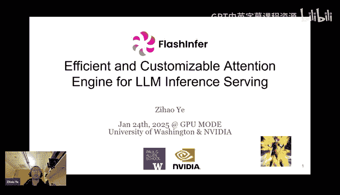

As you all of you might have already know the VRM right so VRM was proposed to tackle the memory recommendation of VM inference survey because okay all of our air inference workloads have variable lens and if we set a preset a maximal sequence lens for each of the sequence then our we will have a lot of memory documentation so what VRM propose is that okay we can have a data structure they call it a page attention that can。

😊，Organize all of the cable cache or follow requests as pages and each at a granularity of something like a  16 token as a block。

And the page table is actually a concepting operating system so that we can just use the same techniques such as okay swapping and also something like a different documentation to manage the carry cache efficiently。

😊，And in order to support。Efficient attention on page table。

 the VM table paper proposed the page attention that' okay。

 we do not need to for for each of the batch of requests。

 we firstly gather the data from the carry cache to con carry cache use the flash attention operator instead they write a kernel that directly access the entries inside the page carry cache in order to achieve maximumim performance in terms of memory efficiency。

And this is a paper that maybe two already two years ago。

 and whereM page table design is already the standard of the AM inserving engines。

But actually the original page table is only one of the options for cableV catch management。

Later on， there are some works such as SUL， they proposed like， okay。

 we found there are a lot of opportunities of reusing the perfect in the KV cache and they propose to。

 okay， we can organize the KVC as the Redix tree data structure。And it。

And it used a very special case of the page table that okay each of the page has a number of tokens one。

 we call it a page size one， and the benefit of this design is that okay。

 we have a less recommendation and if we enable the previous caching。

 we probably have a higher cash hit rate because we we match a block if these token matches otherwise we need to match the block if all of the 16 token matches。

And all of the shared pres are organized as a Red tree。

 and Australia also proposed many clever ideas such as okay。

 we can sometimes replace a subre of the data structure you can refer to their paper for details。

And comparing the。Rix tree and the original page table design you can find theres a there are some difference。

 one of the significant difference is the page size of one。 Another difference is that， okay。

 here the Redix tree explicitly modeling the shared perfect。😊。

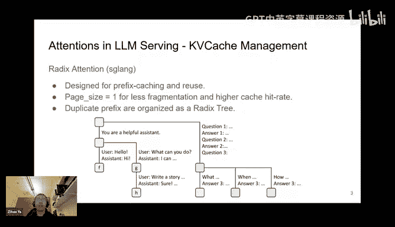

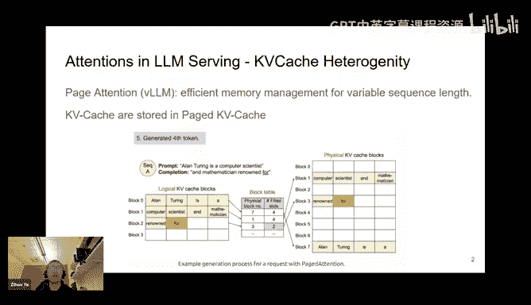

As a treated data a structure weM can do similar thing by proof caching and we will feature that later。

 so now we have two kind of cable cash management design。

And recently， another trend of。Accelerating the error inferences。Speculative decoding， for example。

 the meusa and specing for Sequoia， the core idea of them is like， okay。

 we have a draft model that generates a lot of candidates and we can verify these candidates in parallel。

😊，In order to increase the efficiency of generating these candidate。

 and these favors not only generating a chain of candidates。

 they generate a tree of candidates so that verify we can fed the entire tree into the large model to verify whether there is a pass in the tree that matches with the drop model output matches with a large model output。

And this postche some challenge in terms of the both the KV cache and the kernel attention kernel design。

 because if you look at the。DIf you look at the proposal generated by the draft model it's actually we can organize this part of cablec as a tree。

😊。

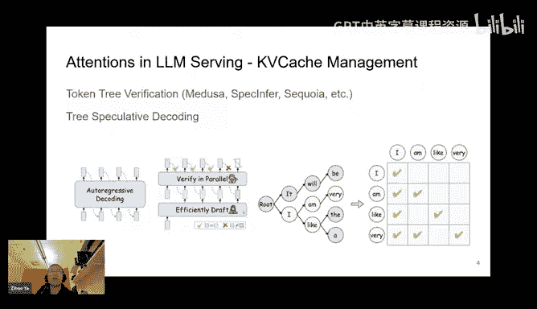

So that is a third challenge that I differ a little bit different from the previous work。

So you might if I interrupt with two questions they're somewhat related but like the first one is like I'm wondering like how you think about like broadly the design space of like Kvc management like sort of like still4 C this to be like a fairly active research area or do you expect that something like Ras attention is really one of the last things will need to build I don't think is the last thing firstly for example I think all of the cur cache design only focusing on the GPU only right and I know there are a lot of research products that okay we are reusing the DM we are also using SSD but I don't think there is a systematic wall I mean there is a。

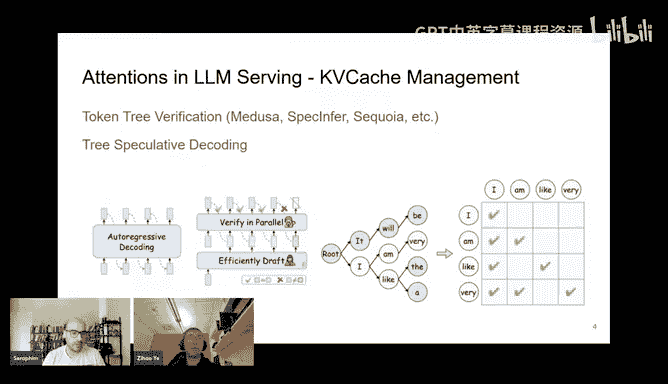

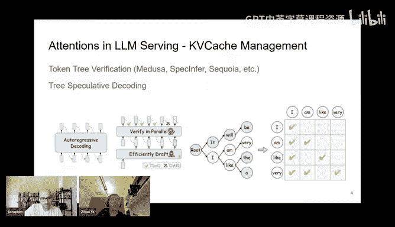

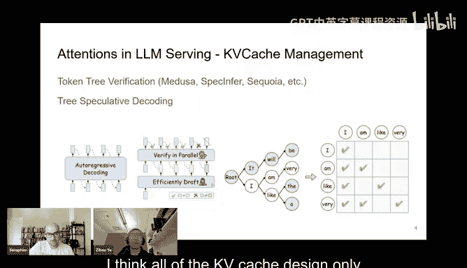

I didn't recognize modeling for this。So yeah， it's still active research error for me。

 another interesting I think is that okay， I think it has been explored in other areas before。

 for example， we can explore the similarity of some of the page blocks， right？😊。

So we don't need to exact match， we just okay， this the semantics of one page block is similar to the other one。

 we can probably merge them， but yeah it might harm performed that it is still a research error。

 in my opinion。And so related to the question considering it's still an active research area。

 how come like a lot of the sort of famous inference frameworks typically make a choice and don't seem to deviate from it like basically like VLM its okay we'll pay attention and then as you realize like yes。

 we' ats attention like why can't they just swap these things in and out？

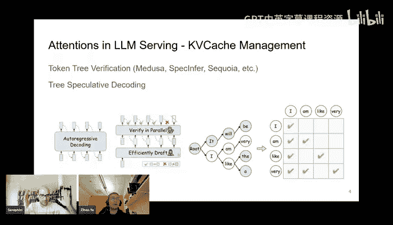

嗯， can you say这 again。So how come inference engine providers seem to be committed to a specific KV cash management technique as opposed to just exploring multiple at ones I think each of the frameworks has their priority I think one of the priority of phase line is like okay we want to we want to do structure generation where there are a lot of common perfect and that is why they choose Red attention。

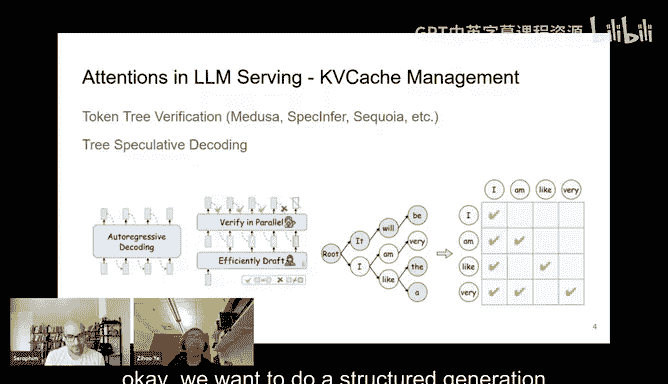

And sector， yeah。对 okay， thank you。Okay。

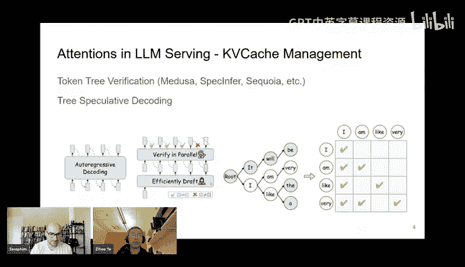

Cool， yeah， yeah。 Thanks for the question。 Those are pretty good。 And I'm going to later introduce。

 how do we unify this cable cache design。😊。

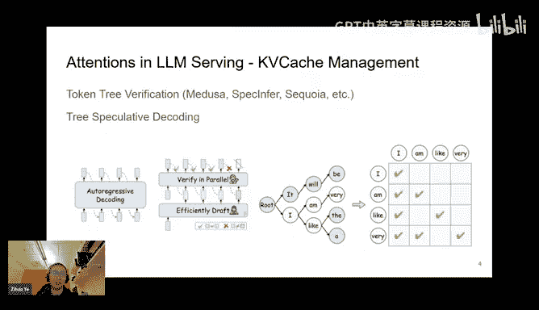

Yeah， so another trend is， okay， we， we do not explicitly using the entire cable cache。

 There are a lot of techniques such as okay， we can prune the cable cash。

Is or compressing the cable cache， right So one of the paper is called Que and is it is from MIT and U when the core idea is like。

We still organize all of the carry cacheching page tables， but when computing the attention。

 we first we do two rounds of attention in the first round we compute the we have something like the reduce case。

For each of the block。 And in the first round， we compute the importance of each of the page block by by using the attention score between the query and reduce case。

 And after we compute the importance score， we apply a top K mask on it。So that's okay。

 in the second round， we select only select the top K pages and compute the attention on these top K pages。

 the full attention on these top K pages。And in that sense， if we reduce k to a reasonable value。

 even if we are dealing with a pretty long context for example several million or even longer and we can just set k to a relatively small value and in the memory bandwidth。

 I mean the IO required for the second round of attention is small and in the first round because we are only computing attention on the reduced keys as the granularity of a page so the first round the IO for the first stage is also small。

So in order to do this， we also require the specialized cable cache and also the attention kernel code design。

😊，You might be answering this later， but we have Dongyon who's asking like considering you're talking about removing unnecessary computation。

 do popular LM serving frameworks also leverage KV cache quantization？

Yeah I think so yeah In8 and APA are really standard setting for AM inference engines and I know that a lot of them also support in4 or something like AM deploy which is a pretty good cell framework。

 they have good kernels for in4 heavy cache， but I don't have a very concrete idea about whether N4 can achieve idea performance in terms of the reasoning tasks something like that。

But intake and F， I think they are quite， they're pretty decent and a lot of。I mean。

 industrial and the API providers already provide such options。Okay， if there is no other question。

 I'm going to moving forward。So yeah， here we introduce four kind of cable cash and attention competition challenges。

And the way flashing for Deism is like we use a unified data format called Block spa attention。

 B spa representation。And it is basically a generalization to the。Or ordinary sparse matrix。

And the only difference is like， okay， we are the minimal element of the sports matrix is not a single。

 it's not a single scalr。 It is a small matrix。 We call it a BR by B matrix。

And the reason people prefer this format is like。It is more friendly to GPU Tensor core， for example。

 if you're looking at the media toQs the the minimal size of an MMA operation。

 it is something like a 16 by8 by 16 for MPR and even larger for Hopper。That means， okay。

 we need a the minimal competition we can perform it must be。

Must align with the MMA shape in of the GPUs so that we can use those hardware acceleration units efficiently。

So if we do not post constraints on the spae data structure， we must do something like okay。

 we look at how many of them we can block them together and form an MMA operation。

 but that is time consuming and also in many of the cases we cannot form such form a block that is there are a lot of nonze elements。

 so that is people prefer the block Sp format。And regarding the storage itself。

 we use the s PPSR formats and there are notations such as the index pointer。

 which records a startoff set of each row in this entire pact。

Value data structure and the index is array recording the non zero。

Non zero column index of G2s and non zero elements。And the value array， which is optional indicates。

 okay， if we still need mask inside or value inside each of the BR by BC metrics。

 we need a value array。So fortunately， we found that， okay。

 the page attention can be modeling as a block sports format。

And for example， if we take a。If you look at this example， are there are three queries。

 three requests， each requests have different query length。

 and if we model in the entire address space as a columns in the blocks force matrix。

 we can find that okay。The pages being used by each of the requests is just， okay。

 the non zero elements inside this。Blocks far。AMatri model。And such funding is also。

In 10 years or maybe earlier， the graphics community has adopted similar findings that， okay。

 they are doing something reversely。 They are actually modeling the。😊，In graphics。

 there are a lot of hierarchical data structures that using sparse metrics and what these people doing is like okay。

 we are using page table， the TLB data structure to help accelerating the。

lookap for the spa data structure for acceleration， but here we're doing things reversely okay。

 we we are trying to deal with a page table data structure， but we're modeling as a block spa matrix。

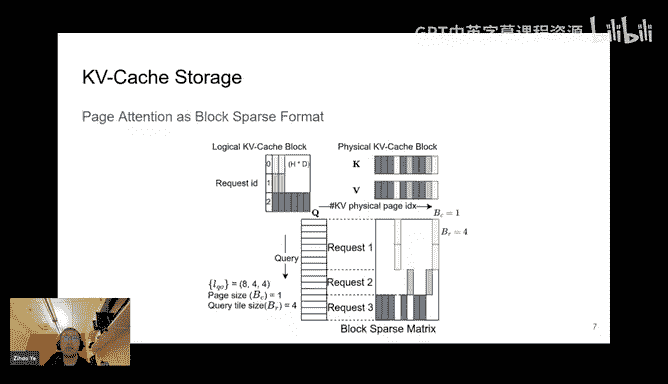

And as I mentioned before， that people prefer block sports metrics because the block size can fit the tensor cores perfectly。

But if we， if we just。Use the so， for example，16 by 16 block。

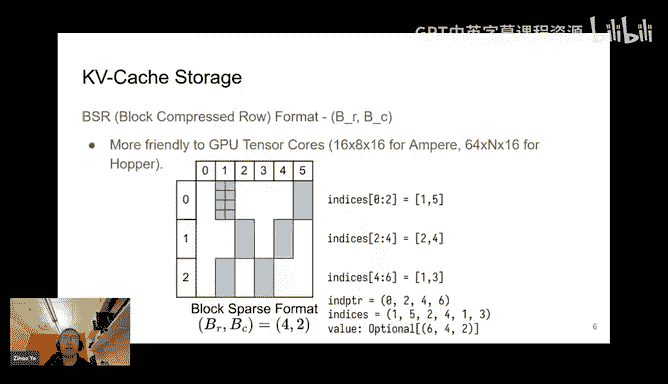

In some cases， this might fail， for example， if you look at it。

Look at the tree speculative decoding its attention mask is very sparse because it's basically modeling a tree like structure as a sparse matrix and then the the sparse ratio is very high。

So if we use a minimal block of something like a 16 by 16， the outcome is。

Even though we can use tensor cores， but each of the blocks there are more zeros than non zero elements。

And we still wasted most of the flows。And actually most of the blocks spa libraries they using a larger block size such as 128 by 128。

 and you can imagine the V competition is actually more than expected。

So the way we deal with this is like。We still use blocks spa matrix。

 but we support a very flexible of the number of columns。

And this is inspired by early works such as this paper called Eff Tensor core with GPU kernels for Str sparssity under reduced precision around six years ago。

 and the core idea is like we still use block sparse matrix。

 but the number of columns in the block is one。

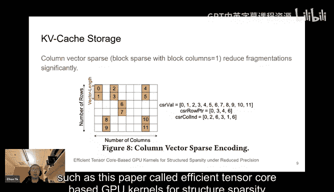

And what is the benefit of this， you can imagine that。Previously。

 whenever there is one non zero element in a 16 by 16 block， we need to activate this block。

But now the situation becomes whenever there is one element。In something like a length 16 vector。

 we need to activate this vector。So previously we might wasteted 255 over 256 elements。

 but now we only waste 15 by 16 elements。It is still wasted a lot of competition。

 but much better than before。So yeah， this is a very important design of the flash in。

 we have to enjoy the benefit of using cancer cores while reducing the waste competition introduced by the block structure。

And actually， we found that， okay， the。

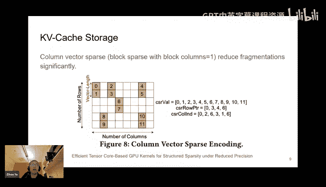

Vector Sp data structure is friendly for the Tensor core Comp。

The reason is that if you look at this example。They we want to compute the。

Compfuse the matrix modification between A and B A and X。And。

We can what we can do is like although the columns in a matrix are not contiguous in memory。

And the roles in X metrics are not conuous， but we can firstly gathering in them from global memory to shared memory after after that the data on shared memory stands and can be fed into the KV cache can be fed into the canceror course。

And。😊，One good thing about the ArRM is that okay， the last dimension is the head dimension in attention computation and it is actually contiguous。

So the gathering between HBM and to SM， we can actually， it is firstly is calledless。

We do not have the problem of non callized memory access。

 the other issue is like it is large enough because head dimension is usually something like 1228。

And it can fit into the cacheline of GPU architectures。So。In this case。

 we can both have a high memory bandwidth by loading those sparse rows and sparse columns from global memory to shared memory。

 as well as using the tenor core， using the dance tenor courses for the shared memory on chip data。

And so so sorry， the， I'm wondering if you could talk a bit more about like the definitions for like an octdyling and magic e but the terminology is not too familiar to me Okay。

 so yeah， the reason I mentioned this is that。They already adopted similar strategy， say。

Loing loading the sparse rows and sparse columns from non contiguous global memory to dance shared memory and applying cores on the contiguous shared memory。

 something like that。Yeah。So， I use6 examples to showed that， okay， we。

 we don't really need the 16 by 16 block for to use the tensor course。

 You can actually use in the vector sparse metrics to use tensor courses。

I see so I guess here what you were trying to say is like these techniques are sort of useful outside of like like basically because was part of like the HPC literature where they using like this I see figure visual draw inspiration from these works。

 that is what I mean。Oh， got it， got it， okay， yeah。Okay， cool。So in flashingfer。

 we basically use the same technique to dealing with the vector for data structure。

Another finding we is that for example， in Sancera sketch， we have a pretty large。

Shed pretty large shell perfect， right？And it organized as a tree data structure。

 And we found that if we view this in terms of the block sparse matrix of this Red tree data structure。

 it's basically the shared perfect part can be modelly using a another block spase matrix with a。

Larger block size， for example， if we do not post any constraints。Then the number， the。

Block rows should be a small value because there is no there is no carry cash use。

 but now if we look at the share profits part， you can see that for many of the requests they have access to the same part of carry cash So the block size。

 we can set a larger block size for this。Request and。Actually。In terms of the block spae matrix。

 modeling is basically decomposing a sparse metrics to several different sparse metrics。

 each with a different block size。And the benefit of decomposition is that for the larger block size part。

 we can use the attention kernel by first loading the cable cache from global memory to shared memory。

And registers so that we we can use software to reuse those carryc access。

 otherwise if there is only if we just using a smaller block size。

 we can only using the hardware managed because the way kernel kernel dispatches this computations like for each of the block or each of the tile。

 we dispatch them to different CTs or Ss in GPUs。So if we can pre have some prior knowledge of， okay。

 how many of them we have a larger block size， we can just say， okay， this larger block。

 this larger number of。Forrry request， you can just okay。

 share access to the carry cash at inside the kernel。So， yeah， by such composition。

 we can just enjoy the higher memory bandwidth。😊，Because it can be our kernel has already written such logics for the large block size we use in shared memory to prevent those cable cache。

 otherwise it will be going through the hardware manage hardware management。So。Yeah， if we。

 for example， in the case of there is a very long shell curvex and many shots。

Many short unique suffix in that case， using the software managed cable cache is much better than the hardware managed Air1 or L2 cache。

So yeah， this techniques has also been proposing many concurrent works such as hydrogen and trunk attention and some something like that and but the benefit of our modeling of using the blocks spot metrics like we have a we can just using a unified way to manage the carry cache like。

For these shared perfect spark， we can just use in the composible format。

 say using different block spa metrics for each of the parts of the entire cable cache。

But it results modifying the data， so we only record the indices and the data structures parts。

 but not is data， so it is very， very convenient for the cableV cache management of the AM serving engines。

So yeah， that concludes our storage， the flash infrastructure storage。

 we have the blocks spa data structure and also the composite performance for perfect sharing。

So for the next part， I'm going to introduce our Comp wise。

 our templates and our run time and compilers。So to begin with， yeah， it is。

A is an old topic have been touched by many of the work。 It's the attention violence。

 because people nowadays are not using the standards。

Standard multi head attention proping 02017 people using the attention virus such as the group query attention and multi multi head latent attention and something like the logic sub cap using J and Gro。

So。TheThese attention viruss only modify a little bit about the attention kernel。

 but usually requires modification， for example， if you are working on the flash attention code base。

 you need to change the kernel implementation you need change the glue code between C+ plus and Python and that is time consuming and you probably want a stream you probably want。

Mse them back to the upstream， and you probably。Cannot catch up with the ladies， Colel ladies。

Library development。So yeah， there are some works such as the flex attention from Pythtoch。

 which I really enjoyed and appreciated that trying to deal with this problem and our solution greatly drew inspiration from it。

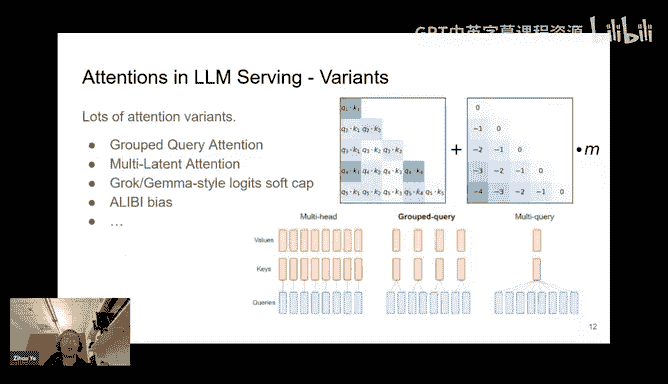

Okay。So our we propose a。For our computer side， we propose a compiler and a run time。

For the compile part， we draw inspiration from the Fl attention work and let user to customize their own attention vis by defining the functionss or you can just view them as functions。

And our attention template supports continuous in the B Sports KVC storage。

 and at compile time we have a compile time scheduling for different problem shifts， for example。

 depending on what is your hardware and what is your problem shift。

 whether you're doing prooffi and decoding， something like that， as compile time。

 we can do the dispatching to the best tile size， something like that。At the run time。

 we provide a variable lens dynamic scheduling to adapt to different sequence lengths for load balancing and the programme interface that is compatible with open source AM engines。

So now let's go through the J compiler part。

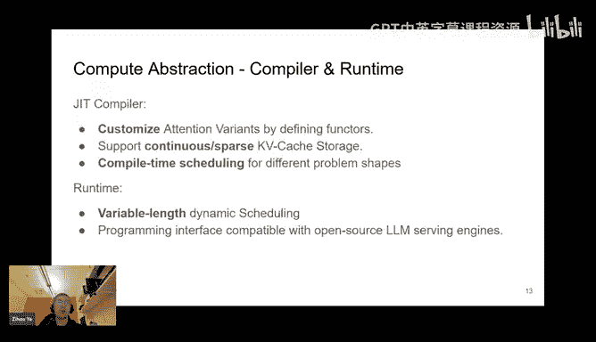

So our compiler part features a template written in code and Q。And for both flash attention 2 and 3。

And we support the single request and batching and most importantly。

 the block sparse data structures with any block size， as I mentioned before。

 we can still use ins cores with a small number of columns in the block。

And we provide programmable functions for customizing the attention virus。

 which is inspired by flex attention。And to give you an impression here is an example。

 Sigca in attention is the attention bar proposed by Apple and what what it did to attention is that instead of using submax。

 they are not using submax but applying something like a。

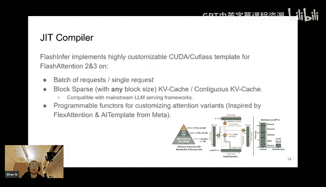

NoNo nonlinear function， the syigmoidoid function to the attention largest。

And this can be easily implemented by providing how do we logic transform to the logic？

So we provide several programmable functions， a query transform， logic transform and logic mask。

 which is similar to some of the score mode and mask mode provided by flex attention。

And currently we need we still need user to provide the attention specification in around。

 for example。10 lines of Qa code， and it can be embedded as a Python screen。

 and we specified it into attention specification class where we also provide the data types and the additional additional tens and additional scrs passed to the kernel。

And we will。We will have a Ging template that takes into the user provided attention kernel variant description and also these data types and additional tensor skaters and pass them to our Ging templates and compile them and register them as Py custom operators。

So yeah I want to ask a bit more about like that design choice because like like for example。

 like within like the Pytorch2 stack the Torch compile like they highly leverage these kinds of ginger templates as well and so it collects attention as far as I know but on other projects don't like for example like I think like within Ds like they'll use like more MLIR based like machinery unless they use C++ templates and so I'm sort of curious like why you settled on J templates is the right way to meta programgram for so yeah yeah I have been working on working on machine learning machine learning compilers for a long time so。

But， but now I still using G templates because I just think it's simple。Yeah。

 and easy for development， for example， user if you use MRIIR stuff user need to recomple the product something like that。

 but if you're just using ginger templates， you just need to okay。As Python side。

 we run the we run something like a To dot load to loading this kernel， yeah。

But the drawback is that using Ging template do not have anything like the type checking。And yeah。

 whenever there is arrows， then it is very hard to debug。But in my opinion。

 it is mainly an issue for developers， with developers， but not users。I see。

 but for users they might prefer it because they can just like inspect the code that you ultimately generated for them and that just makes things easier to understand okay yeah。

Cool， yeah。 So yeah。 it is very simple。 We we don't have。

 We don't use any of the complicated compiler path or compiler techniques for that。

 It's just string concatednation， but it happens to work。😊，Yeah， that is fortunate。So yeah。

 we found that such abstraction can model a lot of attention virus， for example， the Lib attention。

 which also also showcase using flex attention， I'm going to not introduce that too much。

But both Lib attention， sliding window and custom can be described using our using our。

Logest transform function， and we can also describe how to transform the queries to define something like the decoization or for example。

 pre multiply the subm scale or optimization like in that function， something like that。

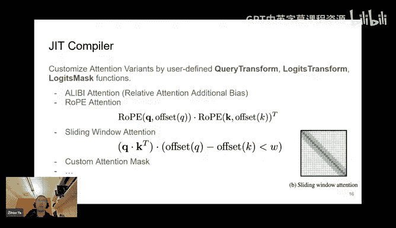

So actually， this。This attention specification declaration stream is very powerful because we actually provide a structure。

That you can declare some of the members inside this structure。And we can just， for example。

 whenever activating this kernel， the kernel parameters will be specified in the parameter string and we can do some calculations of the we can pre compute something and store them in the members of this function。

 and that can be part of the register file inside the quoa。So yeah。

 it can access some optimization for some attention virus。Yeah。

 the next part of the attention template is about the。Global Due shared memory did a copy。

 as I mentioned before， because last dimension of the last dimension head dimension in query and keyem metrics here are actually contiguous。

So yeah， we can still hit the GPU cashline size for maximumim GPU bandwidth utilization。And。

On this figure on the left side we show how do we loading data from sparse storage to shared memory and then on the right side we feature how do we load load cablecas from dense storage to shared memory after loading to shared memory they are identical they are both contiguous but at global memory they might be scatter or contiguous。

So yeah， for the spa storage， there is something like an index mapping。

And we have to look up the look up some of the。InIndices array which is stored in global memory in the B spot data structures。

And for sports， for sports storage， we for each of the。We issue many of the LDGSTS。

 which is the MP style as synchronous copy。For here is the type it's not one for each row but one for one for each sub or something like that。

And the reason we are actually using TMA can further accelerate data movement。

 but TMA 2D is unfortunately not applicable to the nonlinear memorx test。

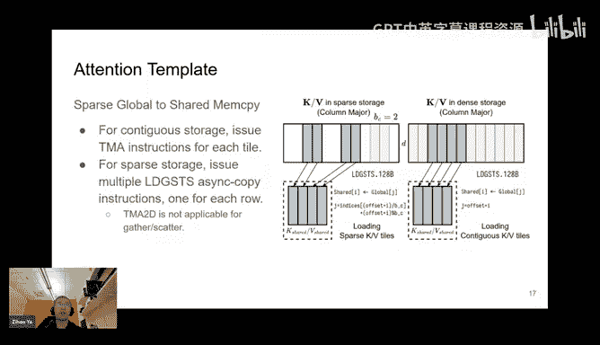

For example， here， the mapping between the global memory address and shared memory address is nonlinear。

 we need to go through indirect。And this is a unlike the contiguous sensor， so in this case。

 T2D is not a applicable。We fall back to LGST， but fortunately we see that their performance are the performance is not influence too much and the main overhead is the registers and we use much more registers than using TMA and I'm going to show that later in our evaluations。

Yeah， we mentioned that we have a compile time。Compilile time tile size selection。

 The reason for that is that for I am serving， we have a workload heteroity， for example， we。

The traditional arm serving can be decomposed into two phases one face for prefiling。

 which means when given the user input or given given the context we are doing the attention competition on the entire KV cache。

 the query size and KV cache size is identical。And if you look at the attention mask。

 it's basically a triangle。 If we apply the cost mask。And after the prevailing stage。

 we are going to generate sokens one by one if we are not using spec creativity decoding。

So if we look at the attention map， it is something like we're feeling a new role in the triangle。

And their competition are quite different because for the pre case。

 the query length equals the K length， but for deco case， the query length is always one。

And there is another case called we call it a pen and some literatureacy is called incremental pre。

 what I mean by that is like we are just extending maybe several tokens。InFor example。

 when people doing speculative coding。And the drop mode might generate next five or next K next 10 tokens。

And in that case， the query is just five or5 or 10。

And another case is a multiround conversation or something like techniques such as a trunk per where we are feeding maybe 1000 tokens。

 but not the query lens is a newly added 1000 tokens， but it is not the entire cable cache。

 so in that case， the query lens is less than carry lens and we are actually adding a trapoid to this triangle of the attention mask。

So their their operational intensity of these stages are quite different。

 we need to select the tile size。I mean， carefully。

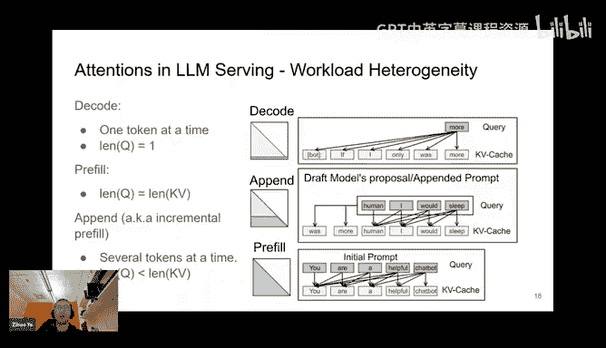

So we provide a set of templates and both in Q core implementation or cancersor core implementation。

 for example， in pure decoding。If we are not using GQA， we are new using multihead attention。

 the operational intensity of the attention kind of is just one。

 and we might prefer the quota core implementation。And we can have a very large type of set for it。

But for the other case， in case of the pending or profitfiing or even decoding with the group query attention。

 because for group for query attention， we can increase operation and intensity because of the KVC sharing for multiple multiple heads。

So in that case， we will just okay， provide a set of attention kernels with different qua house sizes。

 16， 32， 64 and 128。And given the input characteristics， for example， we know the average cor lens。

 we we know some statistics of that we can just select the best tile size for them and we can precompile this collection of kernels。

And for different architectures， we might tweak the pipeline design， for example， for F3。

 and we have to adopt a web swap specialization for maximum performance。

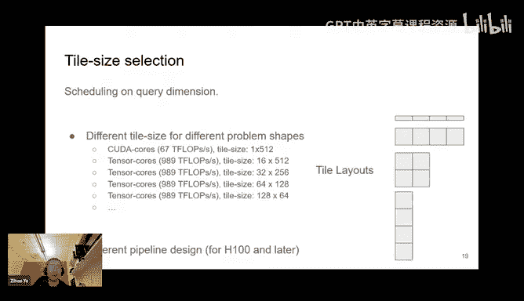

And our runtime scheduler is designed for okay， the compile them scheduler deal with the workflow difference。

 for example， either it deco or prefi， but runtime scheduler。

 what it does iss like we look at the statistics of the all of the request inside a batch。

So some of them might be long， some of them might be shot。And what we're doing here is like we are。

 we propose a algorithm them。That is dispatching。 That is first， we first split。

Split the work in split the attention of allqueries。Into some of piles。And with the maximum size。

 the maximum size is this total number of flowbes divided by the number of CTs provided。

And after we do， we're going to do something like。sortting all of the works from the maximum to minimal。

 and we are also help maintain a priority queue of each of the CTA and we are always putting the largest work to the CTA with minimal accumulated work。

And in that sense， after this algorithm is over the number of work。

The total cost of each of the C is nearly the same， nearly identical。

And this part can be this part is currently executed on CPU， but later we might dispatch it use GP。

And the goal of this algorithm is like we want firstly。

 we want load vancy if some of the sequence is too long we must display split it and we also want zero wave quantonization so wave quantization means that some of the。

Some of the Ss and is not working while some of the others is there are too much work on them something like that。

 So it's similar we just want to make sure that all of the Cs that we're executing are actually running and。

N sets a similar time。And our scheduler will be computing the map between the work and the CTAQ。

And this map will be cached。Once were executing this scheduling algorithm and we provide a attention kernel and the second stage of split K。

 the contraction kernel， we provide both of them in persistent kernel manner so that okay。

 the kernel configuration is the same。So。In the first stage of the attention competition we will compute the output of each of the tile and store them in a temporal memory we call it a partial output。

 and then in the second stage we free found that OK1 request is being split into multiple work we're going to merge them together。

So in the second round there's a contraction kernel that merges all of the partial output corresponding to the same request。

Yeah so actually this algorithm is inspired by the stream K。

 but we are not directly using the stream K because we do not want to use the atomic aggregation yeah because per our discussion with the many inferenceprint survey frameworks they want the kernel to have a deterministic output instead of。

Instead of the some， some random output result from each of the wrong。 So by default。

 if we use stream page， there is a reduction more called atomic reduction。

WeWhile the floating point aggregation order is nondeminants， and that might result in some。

Nondeminacy output， so here we guarantee our scheduler will have a determin execution order。

We're never given the same input。So so yeah as you were talking like I couldn't help but think about the like Sararatiam and the chunk preal work which also deals with like load andbalances between preal and decode and maybe two questions then so like one is how does this differ and two like how do you sort of more generally think about the sort of scheduling space between these workload and balances like what are basically the things that people should be considering Yeah firstly I agree that most。

The serving frameworkworks can handle load balancingnc。

They do not necessarily need to batch the request with different。

C we catch lenss because you can just handle that at the serving frameworkworks server side。

 but if you consider many properties， for example， recently。

 there are a lot of concern about the unical fairness in terms of serving， right。

And they they just do not， they not only care about the performance， but they also care about。Yes。

 the reduction， the latencies variance across users。 In that case。

 the serving framework might general might emit a batch。

 while the sequence lens might not be too similar。 So I think it's still meaningful to handle the。

Because Lance Barron that the kernelnal sign， but I think both would exist。

I see another question from Cha， which is， how do you ensure that all as are active isn't CTA to asem mapping scheduler and Qa undisclosed to the public？

So， firstly。Yeah， if you look at the H100 kernels， H100， they usually use one CT per SM because。

The kernel itself already occupies most of the resources of the both registers and shared memories so that we we can not fit two Cs into a SM。

And for the other case， what we're doing is like we will we could not provide the API to compute the。

 okay， what is the maximum number of block， maximum number of blocks that can fit in。

Fed into S M for maximum occupancy。 So we first call that API to get a value。

 and we launched a kernel with a number of Cs that are。Thats maximum number of blocks per。

Per exam times the total number of exams。So in that sense。

 I look at the kernel level provider and it seems that all of them are。De executing， yeah。O，我好。Okay。

 cool。 Yeah， I'm going go ahead。

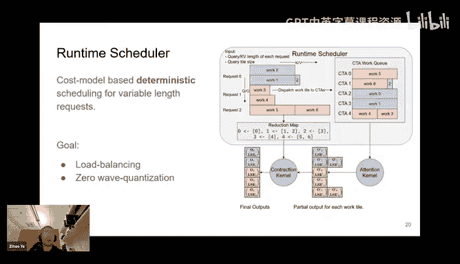

So yes， as mentioned we mentioned before， we also provide the programming interface that are。

Competible with the Im serving framework so the workflow is like we have three stages。

 the innate stage plan stage and wrong stage for the innate stage we are creating a data structure called wrapper。

😊，And we will take into the task information， for example， the problem size。 and also。

 if you are doing a JT compilation of a new attention bar， you will need to specify the JT arguments。

And we will do the completion there and at a plan stage。

 the plan is executed at the beginning of each generation step。

So the plans that basically do to several things， firstly。

 is the low balancing algorithm I mentioned in the last slide here。

And we guarantee the output is deterministic。And you might be worried about the cost of this plan stage but actually what we can do is like okay because in most of the AMs we can reuse the same cave cache layout data structure。

 of course of course multiple layers so we just need to plan once and reuse it for maybe 100 layers so the cost can be amortized。

And we're also working together with some other serving framework teams。

 so to do something a double bufferly to while executing the current steps generation。

 we are precomputing the next steps plan， and that can further reduce this plan overhead。

And the wrong stage basically executes the kernel according to the scheduling information generated by the plan function。

And we make sure that our kernels themselves are compatible with torch compile and chgraph。

And if you want to compute compute the I ser with chgraph， whatever we're doing is like。

We firstly capture， we need to warm up and before we generate step we call plan and capture we capture the competition of all layers。

Being a choreograph。And during during replace stage。

 what we're doing is like we first core plan and then replace the entire choograph corresponding to the 100 layer competition。

 not only attention operators， but also the layer norm thing and also the jam thing。

So here summarize our design。So we we at story side。

 will provide a unified B spa data structure as all with cash management。

Uified data structure and on the right side we features our compiler and run time the compiler is actually a very simple string concatenation based。

Co generator that takes into a user provided potential warrant information and the testing information we are compiling the corresponding kernels。

And we provide a a。I am from a compatible rapid data structures that can have the unit plan at a wrong stage while the plan stage execute the runtime scheduler for sequence lens information and it will be executed per generation step。

And at the wrong time， our kernel accepts the carry cash， which is。

Blocks power data structure and also the querries。And our wrappper maintains a workspace buffer acting as a partial output generated by the over sp algorithm。

So here features some of our results， as we mentioned before we are doing the B spars。

 we internally we have a B sparse data structure。And we provide attention for both block bars and contiguous carry cash。

And here is the performance comparison， we select the page size of one on page attention。

For both the F A2 template and our F3 template on the page attention workload prevailing stage。

 you can see that for flash extension2 templates， the gap between the。

Contiguous cablec and the sportsrs cablec is more。So comparing the red bar and the blue bar。

It is within 10%。And for the flash attention3 template。

 the gap is a little bit larger comparing the yellow bar and the green bar。

AndBut we can still achieve over 500 Tlopes even for the vector sports cable cash。

And the gap is larger than FAA2 templates that for FA3 templates。

Ordinarily people use TmaA for carryV cache memory for carryVC loading。

 but now we are falling back to NP style LDGSTS for the sports carryV cache loading and that caused some overhead of the we have more we are using more registers for the pointer arithmetics if we use TMA we can totally avoid the pointer arithmetics。

So yeah， it is still the issue with okay， TM do not support of non a memory access。

 we hope it will be supporting later， but I don't know。Yeah。

 so because of the more register pressure， we must tweak the number of registers required for producer and consumer to make sure there's no register bill。

 otherwise the performance will degreegrade a lot。And after that。

 the tile size on KV dimension need to be reduced because we want to save some registers。

 so that is why Fa3。The gap between spae and dance is largeraughter。

 but it's still tolerable in my sense。

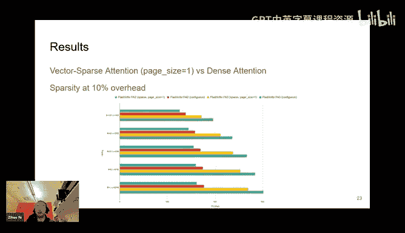

Regarding the virus the。The load balancing algorithm。

 we are comparing the V Ims flash attention kernel library and the flash infer on several different settings。

 we， we generate a， we generate a couple。

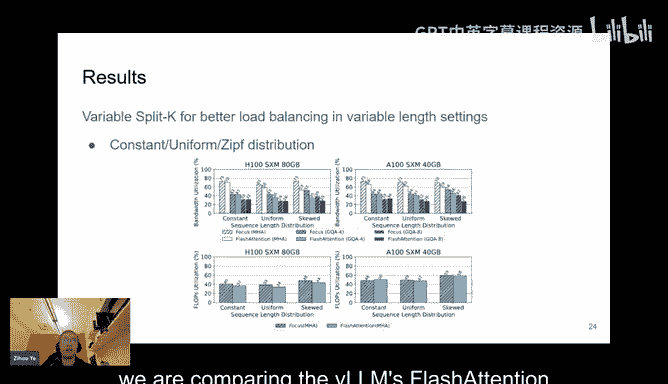

Stttings where the carry cache lens for each request have a constant distribution。

 which means all of the requests have the same cable cash size and uniform distribution。

 which means cable cash size varies between5 12 to 2048 and another is a zip law distribution which is a skill distribution you can see that。

Or。For the constant distribution， our performance are。Actually。

 similar to the VR and flash attention because the algorithm we are using is basically similar。

 We are just using the V2 template。 But for the uniform distribution and skill distribution。

 we are better because of the load balancing algorithm。

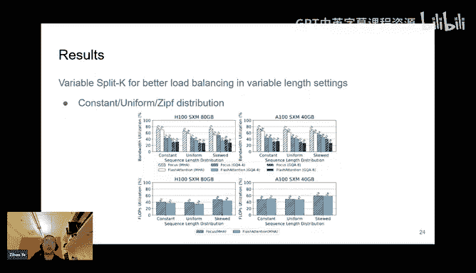

And on the top figure shows the decode stage bandwidth utilization。

On the bottom figure we are showing the pre stage on both FA2 and FA3 templates and for both templates we can achieve higher globes utilization per stage。

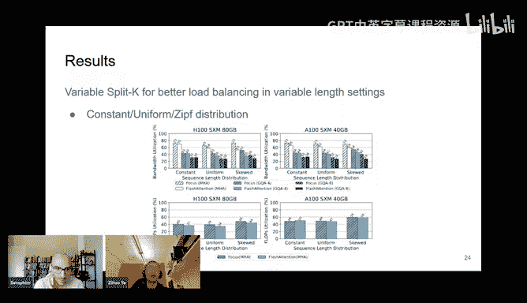

So you have a question like one thing I've always been curious about like when you're sort of saying something like we benchmark over real world variable length settings。

 like I'm guessing concretely this means the zip to distribution right。

 which is like one over but like basically mind understandinging what zip if you have a bunch of elements that are decreasing in order。

 then that element will be one over the index。And so like。

 is this really concretely what what everyone uses to model real world lights？I， I would say this。

Firstly， there are some there are some study on the real world for clothes distribution and it's not totally any of these distribution。

 so here is just a demo yeah。Yeah。And but actually。

 according to the many of the company have such statistics events， yeah。

 we they might not willing to make it public， so here I tend to say we are just making a simulation。

嗯好的。So yeah here's the NTN benchmark we are using the SEL and we compare it with SL also provides a threatened and backhand and we are comparing on both the Lama 3。

18 billion and 70 billion model on one H100 instance and4 H100 instance。

And we can see that we can achieve up to two times licenseency reduction compared to the Triton backend。

And because we have the main issue is that we firstly we can support the。

We have the benefit of using the latest。Ladies video features such as for specialization。

 which try to my support very soon， but here using the cut and code template still has some benefits。

And another thing like we have a specialized memory loading modular design that for gathering the false roles from global Ma shared memory which is currently missing at Tri。

 but later on we believe Tri is good and we are willing to support a Tri backend。

So yeah here we show the case of the some of the customized attentions that fill for example。

 in streaming area they use thefuse rope potential because they have to they cannot pre applyly the rope and and store the postrop cable cache on the。

Post rope key and values to the KV cache according to their design。

 so we must have a field rope attention turnover。And yes， we by using our customization。

 we can just achieve two times acceleration at kernel level compared to not using them。

 and also at the NTN level can achieve 30 times NTN inter contency reduction。

And we also mentioned that for Sha prex， we use the compible composible data structure。

 so using the higher larger block size for the She perfect part and smaller block block size for the Uni S part and here is some example on parallel generation。

 which is measured on ShaGBT， and open AI API provide a parameter called N， which means okay。

 we're going to parallel n different responses。

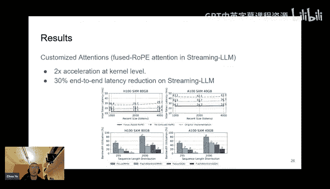

Impartdo。And in that case， those responses， we can treat them as different requests。

 but with a shared perfect。So in that case， we are measuring the performance of the using composible format over using a single format in different end settings。

 you can see that for the moderate size， for example， between 4 to 32。

 we can achieve decent speedup of around 50% for inter contency and also the 0 max at maximum we can achieve 20% speed up in terms of the time to first token。

And when the angle is larger， actually， unfortunately we do not observe any more acceleration。

 this is mainly because of the serving works themselves。

 they have some other overheadhead in that case。😊，Especially for the para generation。

 in that case attention is not a dominant factor dominantance factor。

 but for the this is a result generated by the MSC engine and going we are still according it to a student and VIM。

So yeah， in general， we still think it's promising to get a good performance for the structure generation and the parallel generation。

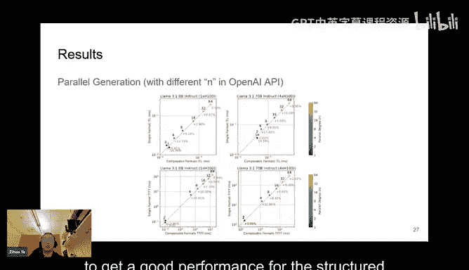

So yeah， so here is the our community is originally。😊，This project at first is a research project。

And after one year and a half of development， we have more than 15 contributories from both industry and academia and we have being adopted by open source CRRM engines。

 for example， the VRN， SLN and MRRC engine， TGIs and something like that。And we are still growing。

 and we welcome。Currently， our roadmap and our features that we want in the future are public in the our GiHub issues。

 and we are welcome to contribute whatever you want or leave comments。

And our position is to expanding on existing kernel libraries such as Pyological glass and similar libraries。

 and because we believe that if we want to achieve the best performance for air infant serving。

 we cannot totally rely on。Libraries， because they are statisticalally compiled and designed for certain shapes。

 but for air from serving wind to firstly co design with algorithms and also。

Co design with a different of flexibility。So yeah， we focus on the both attentions and GMm and also air specific operators such as sampling。

 which is another important feature of flashing for， but I don't have time to feature today。

 you' are welcome to use that。And our mission to make make good open source co kernel generator and library for foundation models and we have a slack channel you're welcome to join the community and。

For discussion and bug reporting and something like that。So in the next few minutes。

 I'm going to touch a little bit about our next steps。

One of the next step is the kernel support for nanoflow stylepartan。

NananaFlow is a research work from U that that's trying to achieve optimal ARM service throughput。

And the core idea is like we are going to split the request into nano batches。

And the nano actually just a。I mean more fine grain split of batches say for example。

 previously we are executing the gem GMMV and theqKV production something like that But now we are splitting the data into batches and the gemV production can be created by。

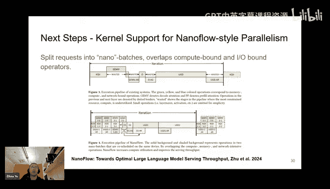

Sple it to J wave 11， J wave 12， something like that， and we found that the attention operator。

 some of them are IO bound， some of them are compute bounds。So by fungr splitting。

 we can just okay doing pipeline parallel inside this batch of data between the nano batches and overlap the compute bond operators and I bond operators。

The green operators are。Our IO bond and the yellow operators are compute bond and the。

Blue operators are just communication operators and they can all be overlapping together。

The way Naflow achieves this is using the intra they call it an intra device parameter。

 which means we are executing the compute bond operators。

 memory bond operators and network operators at different SMMs within the GPU， for example。

 in at 100 there are 132 SMMs in the GPU， you can alloc in 100 of them for jam。

And 30 of them for maybe attention and two of them for networking， whatever。

And this requires us to executing those kernels with a limited budget over SMs， not total SMs。

 and using the GPU's mode stream feature to do that。

So currently we are trying to add in the support of the kernels that's executing with the limited budget of ASMs。

 which can be specified as a parameter when executing this kernel。

 and we're starting to doing that for attention， which is actually the netflow work is using flash infer。

 but it didn't get upstream and it is modifies the flash infer code base。But yeah in a fork。

 so they already done this， but we're going be bringing them back to F from mainstream and also in order to we can not only do this for attention。

 we also need to do this for jam and communication operators operators so we also need to support the exc jam on a subset of SMs and some of our community members is working on that。

And Qa actually provides a feature called green contact。

 which allow us to executing some operators with a subset of PSMs and we have I looked into the Pyth I didn't seen。

There is a green contact support in Py， but I believe yeah。

 using green contact will be also a good feature。For both Pyth and Im serving engines and we are looking for its support in the future。

Another next step item is fully0 reproducible serving kernels。And the reason is that， yeah。

 as reported by the community， our kernel output。Be among different batch choice might virus。

 for example。If one request is executing stand alone。It has one output。

 but if it is batched together with other operator， other requests， for example。

 in a batch of 1 to 28 requests， the outputs of the total AM generation outputs might be a little bit from different from if you are only executing one request。

That is because for if there is only one request。We tend to use splitK and stream K to split the cableV cache into trunks to maximize the SM utilization and in that sense。

 the floating point and accumulation order is different from the I mean just executing executing the request of or。

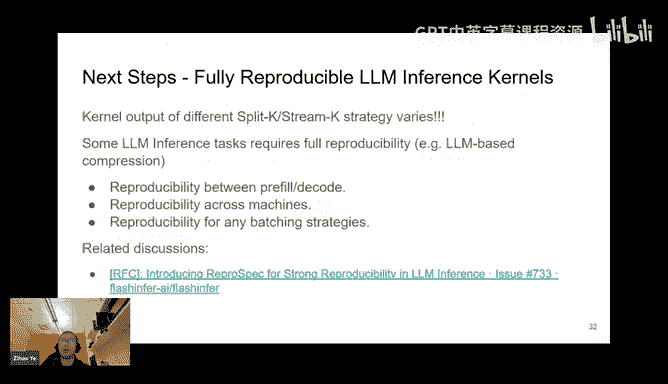

Of four batches and because we for some of them we do not believe for some of them with split into four trunks and a trunks。

 the accumulation order is different resulting a huge difference。

 especially after 100 or something like that。And that can still give you reasonable output。

 but for some of the use cases， users require full reproducibility。

 considering a case that some people using AIM for data compression。The first using the ARM tube。

Compress the data into as a rank。Of the output corresponding to the logic and then use this rank array for decompression and I write a small demo。

 but we found that okay， if it's a kernel choice for the compression stage and decompress trans。

 there is if there's a little bit discrepancy， the overall。

pression compressionion and decompressionism is totally not doesn't work because you cannot tolerate any of the difference in terms of the ranking。

 otherwise total output is not meaningful。So what we need is that we've wanted a forproducibility between pre field stage and deco stage and probably different machines。

 but I do not expect。

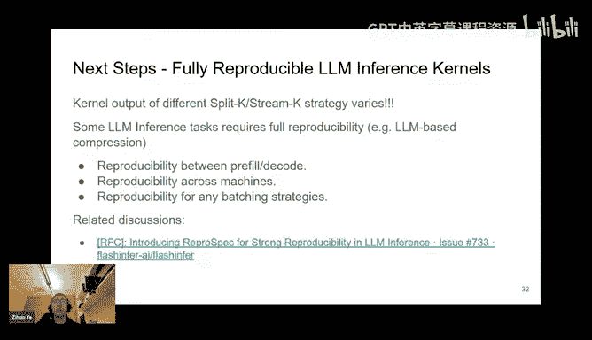

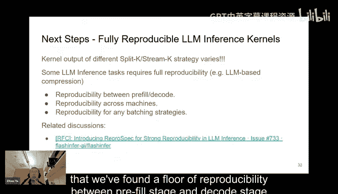

The same behavior between CPU and GPUs， but at least for some kind of GPUs we need to have the full reproducibility and or we also want the reproducibility for different batching choices。

The kernel output for a single request and 100 requests should be the same。 We So in that sense。

 if we want for proucibility， we might sacrifice some of the performance because。The disabled。

But's critical for some。Howmost the workflow such as the company。

And we created the RFFCC for comments。 and if you have any interest， you can contribute it later。

 we might add a flag to the。

系。Of course。Pro do supposed that。And there's also some exciting working items from the community。

 for example， key to is working on the flex attention alignment and our goal is to provide a。

Could up I can for collect attention。now and he created a rapple called sing for jamm which is the initial stage of our alignment with the flex attention there are still other things that are not supported yet。

 but we are going to push this forward in the next couple of months。

And another exciting item is from Subup。In tipsy care mayRA acceleration。

A iscode at now in the main branch and we're going to support later on support the Tenor core based MR decoding kernel and the SMM I mean the H 100 version of airMcode later in the next month and please stay tuned。

So yeah， that is all of my comments today and feel free to ask any questions and。

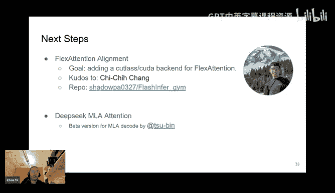

Yeah， I really welcome your input and feedbacks。Thank you you took us on a tour of force of like so many different angles of aluminum friends so thank you so yeah so like they said if you have any question like please post them in chat also be reading them out with your username in the meantime I did see one question from coffee vampire so he's basically wondering what is。

😊，But like basically what is what what range of attention patterns are modable using flex attention so for example what he has in mind is a function like differential attention which takes a difference of two soft Maxes and he's sort of wondering if there are any attention pattern that you cannot model with of course of course。

 for example， the linear attention I think the competition pattern is totally different right？

Because for linear attention， people tend to first multiply K and V and then multiply it with Q。

Right， so in my opinion， the the the space that flex attention like。F work he。

 it covers is something like a。I mean， first multiply Q and K and we have an element wise operator that is customizable and also followed by something like customizable scan operators here the scan means。

 for example online submax is a kind of scan， right？😊，So yeah。

 the flash attention is basically we use the online soap here。

 but we can customize it to something else。So I think the what we can cover is just like， okay。

 we have a custom El wise operator applied to your Q and K and V and scan customizable scan operator on the intermediate space and maybe at the end we have a epilogue。

 something like that and that is a space we cover。😊。

All right well thank you so much I don't see any questions in chat so thanks again for joining so for everyone on the call the slide and the lecture should be available very shortly tomorrow we also have another lecture we're going to have Adam Pske who's going to be here talking about mosaic GPU So if you like this lecture I think you'll like tomorrow so thank you so much everyone and thank you Joe thank you have good day。

😊。

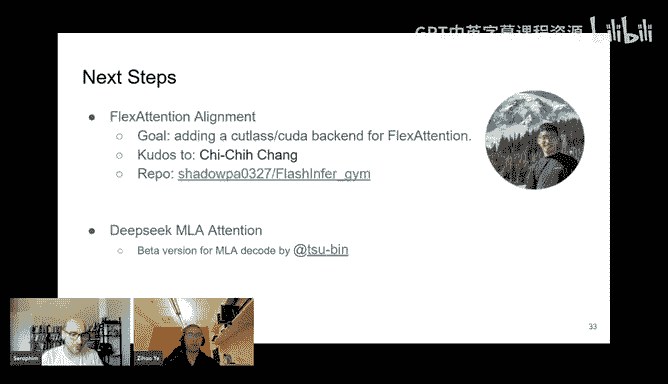