# GPU MODE《CUDA、GPU编程1-53课｜GPU MODE》中英字幕（deepseek-v3.2 - P45：-20250125-Lecture 42_ Mosaic GPU.zh_en - GPT中英字幕课程资源 - BV1QZ421N7pT

All right， welcome everyone I guess we're live。 welcome to lecture 42 of GPU mode like today I'm really thrilled to have like the legendary Adam Pashque who's here gonna give us a talk about like mosaic GPU know for context like like Adam thank you I work on Pytorch so like part of partly thanks to you that I have a job。

 So thank you what's also cool is like Adam also I think worked on many。

 many languages like if I'm not mistaken like I think like you worked on Pytorch Jacks DX and now mosaic GPU So I think if you're like a PLnerd and want to see sort of how these things evolve that's why I'm personally very excited about this talk。

 So yeah Adam glad to have you here and please take it from here。😊，Yeah。

 thanks a lot for the great introduction I don't think this sadly will like go through the history of all of those languages I will start with a bit of context for why I am working on those particular languages right now。

 but yeah we can we can try to do the history another time This time it will be primarily focused on what we're actually doing right now I also changed the topic of this talk slightly actually it was meant to be primarily about mosaic GPU which is sort of the project。

😊，Yeah， that， you know， the particular project that focus in GPU programming actually decided to widen it a little bit。

 And so there will not be that much Mosaic GPU code directly。 And this is kind of。

A decision that we've made some time ago， Basically we actually do want to push people more towards Pal this is another language that we're building and we've been investing quite a bit into sort of the bridge between Palace and Mosaic GPU just because we think it's like much better user experience and we can essentially it's much easier for us to develop nice features and it's much easier for you to actually use them anyway the whole motivation for why we're like we'll be looking at this is we just want to have a DSL for fast Hopper and well at this point also Blackwell kernels and we also want to program them from Python we do know Triton was extremely successful。

 I think partly just because it was like so easy to integrate and I think that was a great decision and so we also want to kind of follow the same principles I should also say that yeah I also started kind of this project the Mosaic GPU one but at this point there's also a lot of other people who have joined along and so I also can take like full credits。

 people from。From Google and NVDdia as well have contributed at this point you know we're very happy about this。

 everything actually I will be talking about both Palace and Mosaic GP are actually fully open source they're part of the JaX repositories you can find all of the code contributions welcome we're happy to talk also talk a little bit about this kind of closer to the end of the talk。

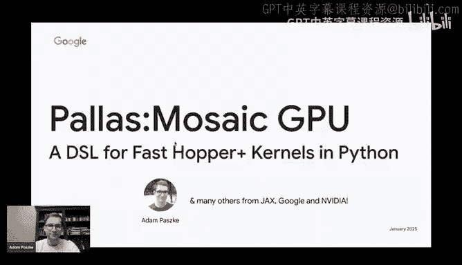

Anyway， so why are we even talking about this at all。

 So the motivation for me here is I think there has been a little bit of a change in the role of like ML libraries and languages that we're designing essentially back in the days when we were starting out with Pytorch。

 I think one of the primary really goals that we had was to increase the sort of generality and usability of you know M or just numerical programming of course。

 subject to acceptable performance right scaling always mattered if you were to like use the accelerator really badly it would still be unacceptable but it was okay to take like I don't know。

2030% performance hit no one would complain for as long as they could you know just like get their research done faster right developer velocity ultimately matters quite a lot as well。

Now these days， the problem is that the problem transformers are like unreasonably successful and so most of the models that we do these days are actually transformers and so sort of the generality part is no longer plays that bit of a role。

 transformers are also relatively simple models is just like yeah mathmals and a few ops you know intermingled。

 they're also I think maybe partly successful and actually also really well co-designed I think with the accelerators that we have so you know modern GPUs GPUs for example。

 and so we're much less focused on just like enabling any weird computations to happen。

 we are actually more interested in making the one big and extremely useful class of computations we're interested in to happen you know to make people productive as they're trying to sort of squeeze out performance right we do understand very well that scaling matters and whether it you we're talking about scaling up where。

😊，saving any percent is potentially saving a huge amounts of money or if it's scaling down where you know those models can be big and you might want to like serve them on like a smaller configuration you still want to use it reasonably well so that you actually don't have to use too many devices to do this Of course all of this happens actually subject to usability。

You know， you could just implement everything in assembly， but of course。

 that will be a pretty miserable experience there still。

Like modeling changes that happen day to day and so we still want to like maintain some developer velocity。

 but performance engineering kind of comes first and foremost in all of those approaches。

 you know reaching peak performance really will be the go and then we want to make reaching peak performance sort of nice for as nice as is possible essentially。

Yeah， and so also why currently DSLs and Python， yeah。

 so there are a few reasons I don't think I have to convince anyone that you know pre-packched libraries are great because if they're satisfy you。

 if they satisfy your use base， they generally you know achieve really high performance but oftentimes you do want to change it slightly and then it's a problem。

 you follow off you know very steep performance cliff。

 then the another solution you could follow our compilers。

 the problem with compilers that sort of do really sophisticated optimizations is that they actually take quite a lot of time to work sorry take quite a lot of time to adapt and develop。

 for example， as in your architectures。Come out if you look at the evolution of hardware from MPre to Hopper to Blackwell now。

 the programming of those different generations is actually quite different and so you know if you want to make a compiler that supports a large number of use cases。

 it takes quite a bit of time to make it fully complete。

So you know then there are approaches there is a number of libraries you could use to implement kernels in C++ I think that's fine me personally。

 I think the biggest issue for me with this is that as I implement kernel's meta programmingm ends up being really useful I think。

 essentially usually there multiple different evaluation strategies you could try or maybe you want to make it easy for people to like integrate like a little I don't know elementized fusion or something into the kernel and C++ templates are like just don't feel like the right tool for this like the sort of error messages are kind of gross sometimes from the compilers and you don't know what's really happening and you know it's not really like C++ as a monopoly on generating fast code like ultimately it does not matter what the input languages。

 it what really matters is like how do you end up generating the code and Python can be a perfectly fine front end for generating like code that we just speak performance and in my opinion you know this meta programmingm path for example is significantly simpler in Python。

嗯。Yeah， and so ultimately in my opinion， so so I know you prefaced this by a personal opinion。

 but like I've seen sort of different take on this problem， like for example， like yesterday。

 we had a speaker from Flash and fur who was sort of doing meta programming by like writing strings like basically Python like writing C++ strings and from Python think inducted like follows the similar approach like Culas goes like more all in on C++ meta programming and then I've seen other projects like Triton and yours like sort of go more into MLIR could you sort of like I guess for for like the rest of us like kind of explain like what you view as sort of the tradeoffs and how you reached your preferred choice in this design space。

Okay， so at least talking about the three cases Triton is also quite different than what we'll be doing。

 I do not have slides on this， but I can say a few words about this。

 So maybe let's actually talk about the four approaches right first of all。

 you have C++ which basically you know historically didn't have that much support for like compile time meta programming really what we're after is like compile time evaluation and in C+ you know they are building out language extensions with like concepts and stuff like this that sort of makes it easier but it's still relatively brittle I think and sort of the most powerful thing you can do is probably still templates the problem with templates as I find is you you can generally encode anything you like in them it's just that yeah as I said like the usability of programming with templates or especially debugging if something goes goes wrong is pretty bad like the C++ compilers just have not invested a lot of or maybe they did but it's just like a fundamentally hard problem to like provide great error messages for like sort。

Wedly encoded you program that you just end up evaluating through template expansion right so yeah havent spent too much time thinking about it either way。

 the error messages not are not great and this is fundamentally the problem。嗯。

So then stringly type meta programming， I guess sure， that works。 it's just that， you know。

 we usually。I mean， it can be successful if you're doing relatively small modifications of the program like you're just。

 yeah， you're going to paste like a sub programming there。

 there's a bunch of issues though right like you have to sort of be careful to manage scoping like names。

 you have to like make sure that if the string you're pasting binds more variables and like they will not shadow the variables that are in there there's like you know it's generally not not the most recommended way。

 I think of meta programming and because of issues like this with like lifetimes of bindings and so on it just can be like kind of hard to yeah have like a sane way of actually doing this。

So then at the end， there are those two approaches in Python， one is you just parse the AST。

And this is kind of like， I think this is similar to C++ ultimately this is what Triton does with the only exception of you will get to implement any kind of compiled hand evaluation。

 you find useful So Triton has those like concepts per you know constructs and they get to evolve them without you know involving a whole committee of like C++ you know evolution right and it doesn't take years。

 they can just like change it if they need to make it more powerful you get to do it So this is one upside it has the upside of like if you have Python control flow then and get staged out into the actual runtime program automatically。

 but meta programming again you uses this sort of。Funny two stage thing where like some expressions are concept for。

 And there's no not like that strong of a distinction。 I think between them。 Finally。

 you have Palace and P follows the same approach as Jacks， which is generally tracing。

So it sort of assumes that you're not doing like really weird things with Python and it will just like evaluate a function once pretty much to just like try to construct a model of what it will be doing that downside is that if you have native Python control flow there it just gets essentially evaluated out so if you have like an if only one branch will be taken if you have a four it will essentially unroll the code which can be a problem you can still do control flow through like special combbinator helper functions but at the same time in fact this thing where like ifs and you correspond to just specialization to one branch and four correspond to unrolling is actually extremely useful for kernels like unrolling you know there is like pragma unroll or whatever that you can tell NVCC to like unroll a C++ loop but in Python you could just write a four loop and actually it's guaranteed that it will be enrolled like just through tracing just because of how like this program will be interpreted and so actually this meta programming becomes really easy。

Because anytime you have Python control flow in your program。

 it sort of is the meta program that you will use to generate ultimately the code is running。

Hopefully that is useful。Yeah， that's right for us， thank you， Adam， yeah， I'll let you keep going。

Okay， cool， yeah， we're still on the second slide so we should go。

Or the third one anyway in my opinion， we just need like a great playground where we can do rapid development I do want to like maintain the velocity but I do really care about sort of implementing really good manual kernels like ultimately do not want to sort of automate I want to automate as much as possible but ultimately we're not at the point where like the compilers can make perfect decisions for us and so we still need like a big manual component I think if we just want to reach peak performance and also if you are to achieve this you should also have an increased visibility or sort of very lowlevel hardware details sometimes like you do will want to take advantage of every sort of trick the hardware is able to do and so you need to be able to access those details we kind of will care less of a port for example right and we will want to enable people to use every single trick。

Yeah， so just sorry like so one of our regular Eric S was couldn't comment on YouTube so you wanted to relay a question。

 which is one thing that's interesting from the C++ versus Python discussion is the fact that certain libraries like Thunder Kis use C++20。

 which seems like a very recent version compared to the typically long backward compatbilities in HC software。

 I'm pretty sure that this is because of the new meta programminggram constant expression stuff that gets introduced in C++20。

Yeah， I would not be surprised I know that recent versions of C++ are way better in that regard。

 but yeah I don't know， I'm also not like a C++ expert and it just seemed like a lot harder for me to get into this and yeah even if you have a like context before I don't like this will not correspond to like code unrolling I think like you can't I again not an expert but I think if you have like a context before then it has to like fall into like a value or something at compile time I'm not sure if you can actually unroll a loop through this。

I don't know。 Not an expert， I know that in Python。

 it just works out right and we do have languages that use this。 We do have Js for example。

 and we know it generally works and it's great for and actually while in JX it can be even annoying that you can't stage a Python control flow easily for kernels actually consider this a benefit because again。

 meta programming is sort of everywhere maybe in modern C++ is actually not that big of a deal。

 but I personally have not used Thunderkitens So I also don't want to like I think Thunderkits is a nice project I think their blog post was great So yeah。

 I don't want to say bad things about them， that's why I prefix it with personal opinion。

 maybe we should also move on because I don't want to efficient the language war。

I will not be firing more shots here so okay a few words about yeah how Mosaic GPU is designed currently as I said is fully open source。

 it's integrated into Js and it's inJs packages there are also early Pythr binding so you should also be able to use Mosaic GPU kernels from Pythot for that like any copies or anything like that there are really two DSL as I said like one is sort of the original mosaic GPU DSL which leans very heavily on sort of MLR Python builder APIs which is also sorry which is also tracing exactly like sort the jackX and Palace APIs are so at least sort of the flavor of the DSL is maintained and then there's also just like a bunch of abstractions and helpers for programming GPUs that it provides。

And then the second one is actually the one that we will be talking more about today because I do want ultimately you to potentially use this one and it's sort of the backend of Pal to mosaic GPU I also you know I specifically use this column here because Pace is not mosaic GPU specific mosaic GPUs in fact the third backend to P P initially started as sort of more Jay Triton frontend then over time we built out the second backend which was mosaic TU because now Pas Pers actually can be compiled both to GPU through Triton and to TU through Mosaic TU now Mosaic GPU is sort of the third backend we're developing to essentially explore some of the more low-level programming with GPUs and so the language is a little bit more lowlevel than the other two backends。

 but it's still like roughly in the same the abstractions and the concepts roughly fall into the same category because ultimately the hardware is very similar。

Yeah， roughly speaking one mosaic thread you know， as we're talking about GPU thread is a very sort of overloaded term。

 when I say thread in mosaic I will mean a single warp group from the coUuda definition ultimately I don't think for like dense linear algebra applications I don't really think it makes sense is sort of part like expose the GPU as like something more fine grainined than a warp group。

 I think going blockwise like Trident goes is like a little high already as an abstraction level but I think anything below like a warp group is a little bit low and so this is kind of where we landed。

And yeah， as I said， all features of the hardware I think really should be exposed。

 you should be able to use any tricks that you know are allowed and what we really care about is like we ultimately want to take all of the we want to make your program LLM proof want you to not feel like you have to reach for an LLM to write a kernel。

 we want to get rid of all of the boilerplate your sort of kernel should be like maximal information dense like all of the sort of performance parameters should be there。

 but there should not be like a ton of sort of setup code etc anything that is like essentially automation is welcome but only when it's unambiguously good only when it boilerplate we want to take this away from you but if there's like any sort of insight you might want to have that would have a big impact on performance and it's not like a simple optimization problem that a compiler can just like run through。

 we do not want to automate this we actually want to expose like a manual knob that will do this and know ultimately what you end up with it's just a short program which is like very sort of information。

Information dense and yeah also it's a relatively small project and so I think it should be hackable I just run like a summary at this point it's like 6000 lines。

 which is you know maybe not the tiniest project but as we're growing more features it's not surprising that it grew of it but it's still like of a size where you know a single person can like reasonably hold it in their hands if you like spend some time reading through it a lot of it like you know with helpers for like array fragmented over you know kuda lines it's not that interesting you don't have to like know all of it so I think it can be like reasonable to work on if you want to play around。

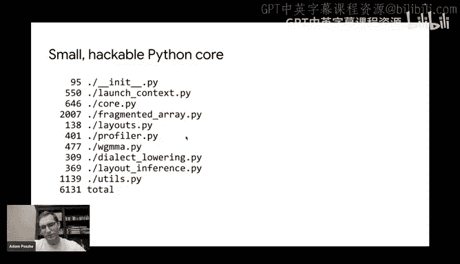

All right， so now let's actually start looking at P and this will be initially I just want to tell you about sort of pilots more an abstract why we've designed it this way and then we'll move on to P Mosaic GPU specifically and I'll show you some how you can use some of the sort of new features features of the modern GPUs like you know async copies or work group MMA yeah to essentially write some kernels but yeah first let's just start with abstract P so this is sort of the simplest program you can really write so you can import P from jack Expament we usually import it as just P and。

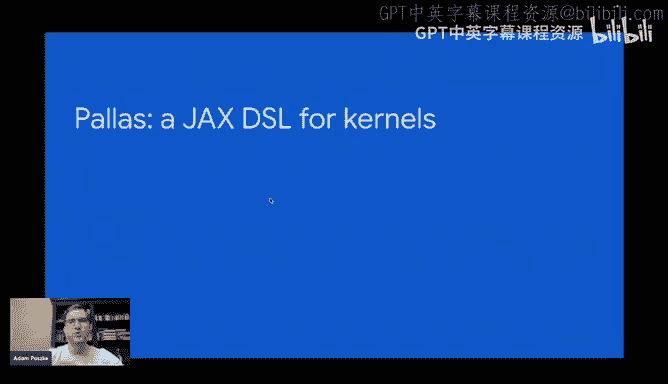

Inja's normally arrays are just like immutable you know Nd arrays kind of like nuy or torch tensors only you actually are not allowed to mutate them in palacelysis changes actually all of the arguments to a P kernels are references but they are shaped so in particular you will find a lot of those like slices that really do nothing if you just applied this slice to like a nuy array you would basically get the same array back which seems kind of nonsensical only for palace references what this means is actually read the value from x ref at this particular moment because they are mututable right and so the result of this expression will actually be an immutable array and because it's in a kernel immutable arrays generally you can think of them as like values you store inside registers but yeah so in in this case we would load the value from x ref you would then load the value from Y ref you would add them together again in registers because at this point they're like loaded values and then you store it to0 again you can't just say0f equals this。

without the brackets， because that will just like replace the Python variable。

 but because you can kind of think of those brackets as like a dereencing operator like a star and C++ or C。

 that's how we use it。And now for compute inside this kernel。

 this maybe is not the best example because it's just like an overloaded plus in Python。

 but you get to use many of the jackX NI functions， essentially not every single function works。

 but you can basically program in here using regular jackX NI。

 which is also nice because you don't have to like learn you another programming like set of operations on a race。

 I guess just to write the kernel， it's pretty much just an Ny。Okay。

 and then to actually call this from Jacks， right， JackX does not give you those arrays normally。

Jax only gives you sorry JaX doesn't give you those references， normally Ja only gives you a racese。

 so you need to somehow convert this addd kernel into a function that actually can be called with regular jackX erase to do this the most basic ways to use the P called sort of higher order function so basically you give it as the first argument to your kernel function and what it will return you is essentially the sort of function you can actually apply to jackXsse and get jacks erase back so you can see you get this jack's ad kernel which you can call on some arrayse now now there are only slight differences like for example actually do have to declare what will be the shape of your output because that will be allocated by Pa for you and so you can see there are two arguments the kernel on the outside inside it gets three references because we append essentially the sort of place to write outputs at the end of the argument list and so you can see here we just say oh yeah。

 the out shape is the same shape and D type as the first opera because it's just an ad kernel。

Now this kernel is also not very interesting just because it would just evaluate this body once。

 there would be essentially one thread， whatever a thread means for a particular backend。

 like a Triton would correspond to a single block in Mosaic Tp it would correspond to a single workgroup。

Sorry， and you know to actually utilize the parallelism in something like a GPU。

 you still have to invoke like a few instantis of this kernel and parallel。

 you know if you've used coa or and you probably know what's happening next。

 we just add a grid parameter which will be ateple of integers， which basically says。

 well we want to have like a you number of independent invocations of this program as many as the product of the integers in that TL。

 we also modify the program so that we sort of query which program we are since the grid is 1D。

 we just say yeah give me the which program I am along the first axes， we construct the slice object。

 the DS is just like syntax sugar for dynamic slice， essentially the shape here。

 it says start at PID times block size and take exactly block size elements now and then we just apply this slice。

 we replace sort of this fri slicing than we had before here， we replace it with the slice。

And that makes every single thread you know operate on only a subset of elements right now one thing to note here。

As I said before， those references are shaped， they're not pointers。

 so you also do not slice them using you know a range and sort of integer arithmetic you just use sort of slices regular python slices integer slicing is allowed so like most of the basic slices you would use again on nuier arrays and advanced indexing is not allowed generally right now but like this sort of structured Nd slicing you can slice multiple dimensions at the same time this is allowed。

 I just find this to be sort of a little bit easier to program ultimately that this is one of the few things that the compiler actually can automate for you reasonably know Triton also added block pointers after some time I think this is like the direction we should be going into and so Pas also follows follows the same pattern。

And you know， if you were just programming like classic GPUs kind of not thinking about Tensor course too much。

 that would actually be pretty much it we would just be done we would not develop like any other changes but we didn't stop there well one of the reasons why we didn't stop there is you know we're at Google we actually do want to program other devices like for example we do have actually quite a few TUs lying around and。

For TpUus， you can't rely on the same sort of programming model that classic GPUs use right essentially this access here。

 those references if they're an HBM if they're in global memory。

 they have really high latency right and so classic GPUs can played this trick where they would have like a lot of work in flight and they would just like you know make you go to sleep and then wake it up once the memory comes back but if you have enough work in flight。

 you know hopefully know like the device has always something to do right on TUs， this doesn't work。

 they do not have this like fancy scheduling thing you have to like plan your program much more carefully sort of as you as you compile it interestingly modern GPUs are becoming much more like this like once you're interested in using tensor courses and especially the like big instructions like you know workgroup wide MMs you end up your footprint of like short memory or registers is so large that you also can't have like a few blocks allocated on the same。

SM， right on a GPU。 So you also don't get to use this。

 And this is partly why modern GPs introduced TU like features like you know， Async copies。

 for example， right， And so this programming model， I think。

 while maybe nice and historically really relevant。

 This ultimately is not how modern accelerators are evolving， right and。

I think it's really interesting so Im sorry to interrupt to train to talk because we have a bunch of questions the first one is so Gregory Aer is asking so like will P auto schedule things inside a workp group so maybe if you could briefly talk about like the scheduling its going to repeat the question will P auto schedule things inside a work group？

😊，I'm not sure what auto scheduling means I mean， yeah you are again。

 it depends on the backend right So again on Triton a single thread or like a single invocation of this program like a single you know program ID corresponds to a block in Mosaic GPU it will generally also correspond to a block and by default the block is like size of a single work group you will later see ways like at multiple workp groups in a single block but a single thread will be a war group even if they belong to the same block and then sort of the you know ultimately to program GPus you have to generate PTX and then SaS and SaS is an PTxr programming languages that sort of target the hardware at the level of a single couda line which is different and yes the mapping from let's say the warp group level or the block level to the sort of single coa line level this is done by the compiler I hope this is what you mean by auto scheduling but yeah。

So the second question is unfortunately it going it sounds like it's a language war question。

 but I'll ask it anyways， so this is not P specific but in the age of alums that are increasingly capable of generating code and well known but perhaps less ideal languages。

 does the calculus around creating DSLs change？Does what around DS cells， sorry？嗯。Yeah， so， so， so。

 so basically this person is effectively asking like if we have。

Like if we can have an LLM just generate basically the low level language。

 like what's the point of having a DSL， so it's like sort of speculating around the future of LLMs being able to generate systems languages。

I mean， this is a bit of a okay， it's not a question have a prepared answer for at least one thing that immediately jumps to my mind right is that we write those kernels for really high stakes applications like those kernels if we train like a new LLM they will be running on like thousands of devices for months this is like a lot of compute time if the kernel is bad it's like a lot of wasted money power and you know just like opportunity we could have done something useful with this hardware right so it's a relatively high stake application so we do care about them being really correct。

😊，If you could just like generate a dump of like a million lines of PT T X from an LLM。

 it's kind of hard to verify， right， and so。For one you can actually like if if the kernel is short you can probably still have like a human like glance over it and you know say oh yeah this makes sense right so at least there's like some more guarantees but of course everything depends on you know the capability of the LLMs if we have singularity of course nothing matters anymore so there's like a big space I think between where the LLMs are today and you know the singularity where nothing matters anymore。

All right， so so I think just on that notebook I think I will sort of slow down questions because there's a lot so we might just end up like sort of but I'm also happy to like you know overflow to Discord we can continue discussing later good yeah。

I can like hang out， perhaps I'll try like right after this talk maybe with like a short break。

 but yeah I' like happy to expand on another thoughts later。Sounds yeah， cool All right。

 I think a really interesting point though here is that as I said。

 like I can see quite a lot after having worked on mosaic TpU。

 I see quite a lot of GPU and TpU convergence if you sort of look at where the trajectory of like GPU architecture generations is。

 they're basically approaching a TpU which kind of makes sense if you think about it because GPUus sort of TpU started out as like a matrix multiply or matrix operation accelerator。

 GPU started out as well， we just want to accelerate graphics and perhaps later compute and then they realize that oh yeah。

 now we actually mostly care about accelerating matrix multiplies and they great hardware circuits to do this like systolic arrays。

 which is ultimately why they decided to add tensor course。

 but as they if they want to increase the efficiency and so on。

 TpUus haven't like literally designed for this。 So I'm not telling you this just to like sell you TpUs or anything。

 I would be also happy to talk some time about the TpU architecture I think。😊，Really interesting。

 I think the main reason why I'm showing you this slide is。

Just to kind of try to convince you maybe that we know what we're doing like we are trying to design。

 we know where the modern GPUs are and because we have visibility into this。

 I think we also have like a reasonable outlook on like where they might be going and so I have not like fully ingested the like Blackboard spec yet but it hasn't come like as a huge surprise I did not have access to it before I just like saw it yesterday pretty much as it came out but it was not like groundbreaking right it was a big architectural change ultimately compared to like copperpper and especially to Ampere but you know we have kind of seen this and so I also wanted to just kind of keep in mind that we are trying to like design those that we think those excerators are becoming really similar and as we're building palace were trying to sort of take into account like the trajectory along which those excerators so moving right and so for example know the execution units the tensor core the granularity at which you run them are getting ever bigger TUus I mean on GPU。

Like the now in Black hole you have like two CTA or two block essentially matrix multiply instructions right which is quite huge really there's like a growing gap between Ma and vectorflps both have asynchronous HM to SM transfers essentially that you now need to like carefully pipeline with your compute to make to make you really good use of the hardware and even stuff like know GPUs added uniform compute just to like you know there are now two classes of registers and GPUs and you they can do hold certain you deduplicate certain data between kud lines GPUs also have like a dedicated scalar unit to also like discharge control flow and stuff like this。

I think there's just quite a lot of similarity again interesting。

 I think maybe you should at some point consider expanding the group to like accelerator mode now that it's not you know going from coDda to GPU if it's like well maybe maybe heterogeneous computing mode I think we be what we'll call it starting tomorrow yeah okay great that will be that will be my last thing in fact on this on this series yeah anyway。

😊，Okay， so now let's actually look at the realistic example of how you would implement like a sort of let's call it fully featured palace kernel。

 This is actually like a Mamo that you could implement。

 the only missing feature really here is like kind of chunking up the K dimension So kind of think about it as like this is a reasonable kernel if you're like contraction dimension the K is small So let's just look through what is in there right we have the this is the full function the Ma is like the interface to jacks inside it is the actual kernel function This is actually kind of trivial we take again two sort of references for the inputs one for the output you can actually better see we are using jackson and by functions because we just say yeah load both of the inputs take a dot product right to the output the kernel is actually kind of boring right And if you look at it you might be kind of surprised because I just a few slides ago I just showed you that well if you take all of the inputs right those are again trivial slices you would end up with a kernel that has like no parallelism inside。

😊，This is not what will happen here This is sort of the extension to Paasco so you still pass it sort of the Ma kernel you still pass it sort of the type of the output so that it can prelocate it you still pass it the grid which here we just partition sort of the M and n dimensions of the Ma since they're kind of the parallel dimensions of the Ma now the new things are this like in and output spec and they are essentially kind you can think about them as sort of preplanning or sort of declaring the access pattern for both inputs and for rights to the output for every single program in this grid sort of independently of the actual kernel like you can't make it data dependent which is a restriction but it's also really powerful like it actually guarantees us that we can implement pipeing as you'll see later so yeah as before the grid basically declares that you know because it' 2D will have like a 2D space of independent invocations of this single body。

Now everyone you know for each input and for each output you specify this block spec structure and it has two components The first components is just the shape and the shapecent essentially describes how we are going to tile or partition those inputs and outputs into sort of disjo segments right and so for the first upper end to the matrix multiply will essentially slice it into tiles along rows but taking all of the columns so you can see we slice it into chunks of BM rows but then we take all of the columns for the second for the second upper end we actually take all of the rows taking y shape zero but then only a subset of the columns so we divide you know。

Describe the division like this and then for the output。

 we just say yeah we'll take actually a small slice BM by Bn right now the only thing that we're missing is actually the mapping from those program instances to those slices and this is exactly what the second component is so it's a little usually for simple kernels like Mamo that have simple access patterns is just a lambda but for some kernels that are more advanced it can get like much more elaborate and then usually they are just like bigger functions they can still be like arbitrary pretty much palace expressions inside those they don't have to be like really simple projections like what do you see here。

So and those functions essentially map the grid indices so here the grid is 2 d so there are two inputs to the space of the tiles of those inputs。

 which again， since all of the inputs are 2D， the expressions will be 2D and so for the left hand side we will see that actually if we program in since you know one comma 2 that means that we will take slice1 comma0 which will be sort of the second slice along rows。

 you can see here because we have not tiled along columns。

 all the all of the tiles actually have sort of a coordinate zero along columns and similarly here all of the tiles have you know coordinate zero along row so it's not like there's much。

Much choice that we have。 But for the second opera end you know， we do use the second grid index。

 for example， to select the tile right and for the output， we just use the full grid coordinates。

 which is usually the strategy right usually you just like define the grid to partition the output somehow and then you here in this case one of the input isn't variant on one of those grid dimensions usually for a Ma And so you as I said。

 this essentially describes how individual instances of this program will be accessing reading the data and writing to the output。

 which what it lets us to do is as I said pipeline memory transfers and compute lets essentially emit the async copies fully for you without you having to think about anything And so the data is streaming in as you're doing the compute And as you're doing and as the output is being written out。

 you're still doing the compute on another instance。

 And so this is not a compiler optimization It's not like we're looking for loops that have operations inside and reads and writes and so on。

 this is like guaranteed。

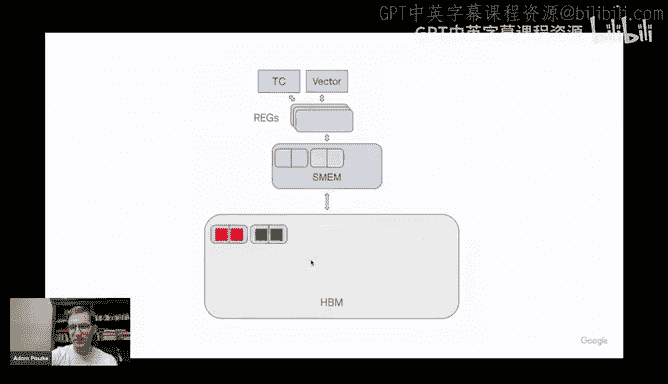

Happen just because you have specified this and pipelining is crucial for like modern hardware。

 and this is why it sort of deserves this very special place in a programming model， I think。Yeah。

 and so actually just to give you like a more sort of concrete example。

 this is like a full flash attention kernel for a TPU you can see there's like no nasty indexing really in the kernel。

 it's just like a bunch of reads and writes all of the references kind of come in oh yeah I should say here as we specified those shapes those references here now they do not refer to the full opera。

 they actually only refer to the slices so sort of a single program invocation not only tells the sort of palace which slices it will want it actually can't even violate this promise because P will only pass in this particular slice of the input right it will actually only see this strip if you query the shape of X it will be this like kind of long but very short strip of the input。

😊，And so that's why there are no like slicing expressions inside the references already come preslicd。

And yeah， this is an actual flash attention kernel that you could run on a Tp and it would get reasonable performance。

 there are certainly optimizations we can put in， but as like a starting point。

 this is enough and it fits on one slide which I think is just really neat Yeah most of the you know most of the access patterns for those like transformer style workloads are actually relatively simple and that's why I think this works reasonably well What I think is also quite cool is that actually Pace does not support all of the jack transform forms。

 but it does support Vmap And so in fact this is not a complete maybe attention kernel we would like to use but in fact if you take this kernel and just apply Vmap in two different ways to it you just get like multi head attention or multiqueery attention just for free。

 So yeah that's I think another kind of。Sorry， another kind of neat trick and feature that you get from P kernels。

 they are actually vmpable， they're not reverse more differentiable automatically。

 they are forward more differentiable I think they're surely v Mapable and Vmap generally is also like again easy to schedule because it just like creates a bunch of independent subcomputations that you can evaluate in parallel anyway。

 kind of a neat trick okay now we actually move to the topic of this presentation which is you know how to use mosaic GPU from P so we'll start with the same sort of simplest simplest single block kernel the only change we import palaces before now the only change is that we additionally import from the palace package we import mosaic GPU conventional we import the backends as PL and then just like the accelerator that it's targeting if you see PL GPU it might refer to Triton it might refer to mosaic GPU so a little bit confusing but usually you only like use one of them。

😊。

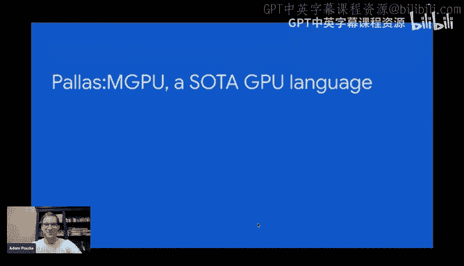

And so yeah this is the simplest kernel as I said before， you get those references you read them out。

 you write the output， we just create the input now here we are actually using like a little helper for for particular for running PL GPU kernel Pco would work too actually here but as we'll get to flash attention3 which will be sort of the culmination of this whole evolution now that one will use PL GPU kernel so I wanted to use this one because it will also support more advanced features like having a few warp groups per block etca like more sort of GPU specific configuration as opposed to P。

 which is supposed to be like a hardware sort of hardware agnostic layer。

 so we do not want to lock ourselves into being fully hardware agnostic but we do want to sort of have like the biggest common denominator we can have and this common denominator ends up in that P namespace so if you use P functions generally your kernel should be portable as soon as you start using like backend specific extensions that stop。

Porible， but those back and specific extensions should be available to you， we believe。

 because ultimately like。Protability is not that important。

 I think right like we are writing kernels because we want the fastest code we can get and between different hardware generations。

 the strategies evolve and change quite a bit So like why would you try to make sort of a you know emulate the strategy from all the hardware and the newer one it might run it might even run okay but if your goal is to like reach the highest performance then you might as well just like write a new kernel probably you know it's not like a new hardware generation comes out every day So you still have some time to like adjust to it。

Yeah， and so just like before， you pass in this jackX array and they become references as kernelnal arguments。

Okay then again we move on we just follow the same pattern now we move on to multiblock kernels you still specify the grid of size here we just specify of size2 now one change is that POGP kernel actually also wants you to name your axis so you will not be referring to them by integers it will be names and then you can query using las which is you know jacklas ax indexdex you can query which one you are again you just you know take a disjoint slice of rowb elements and you apply the slice of references nothing really changes here yeah grid has two blocks now and again no point arithmetic just slices。

Now we actually get the sort of meet and you can see kind of the complexity grows quite quickly as we start talking about sort of more lowlevel GPU features。

 but it will get better or I promise So first of all。

 it's actually start down here So P runscod is a function you can use to allocate memory So this will invoke the scoped function and it will give you essentially chunks of SMM So mosaic GPU does not abstract memory allocations from you you are actually responsible for allocating memory and managing it anytime you have a value like an actual array you read it will actually be probably in registers if you read too much。

 you will spill， it will be slow but at least you do have control over you know in which memory space your data is because memory space management I think is another crucial piece of trying to extract performance from a hardware right like flash is fast because it manages memory spaces well Yeah so we will allocate essentially SMM for。

😊，Both of our inputs and the single output， which is why you know we say we want three of those things and then we also allocate a barrier which is kind of the GPU specific way of synchronizing with async copies which TmaA in Hopper in Blackwell as well and then you can use a P GPU function to copy from essentially global memory to SMM I should say those references here they were actually in GM so as you were doing this this is sort of the classic GPU read from global memory now we'll change it we'll just use async copies to sort of move the data into local memory so those SMM references then we will do compute on those SMM references write the output to SMM and then ship it back to the sort of global memory using copy SM to GM right you can see still it's not that complicated right as you say copy you can use this ad operator to preslic a reference without actually loading the elements so we sort of say oh yeah just only look at the slice of the global memory。

But copy this slice into the entirety of LsM which will be a lot smaller at this point and use this barrier for synchronization。

 do the same for the right- hand side and then wait for the transfers to complete right so you can see know it's more code but it's not unreasonable right like it's still automates a lot of the boilerplate like creating the descriptor on the hose shipping it onto the device managing it like actually sort of deuplicating that reusing the descriptors as much as possible essentially TmaA is not that user friendly as a feature I think but I think we've managed to like find it reasonable abstraction for it right and so this is what I'm saying this really does not take away any control from you but it does enable you to sort of use those lowlevel features without having to think about all of this like nonsense and noise that is autoatable。

Right and to simplify this actually you can even get something better。 you can use emit pipeline。

 which is a helper that again， this is the compute we just abstracted into like a little function now we'll say we'll actually do our compute in multiple steps this was kind of a dumb kernel to have right because we scheduled asyn copies and that immediately weighted on them and then we did our compute and then we scheduled our you know copy back to GMM and then we waited on it immediately so again we haven't really done any async copies here So actually to do them this would be a lot more involved we would have to like write a loop and like pipeline if this is annoying but it's also autotable again and so there is there are helpers for step like pipeline you can just emit say emit pipeline and just like you saw before you can pre-declare your access pattern using those blocks specs and so here before we were just like essentially slicing only you know half of the rows in our two blocks now we're also slicing you know each block handles half the rows but。

In a single step it will also only compute on like a quarter of the columns and we will process our data in four steps。

 but between those four steps we will overlap like loading the data onto the fast local memory SMM and sort of starring the results back but all of this happens just through pipeline you just say okay I will want to run compute this many times again it can be like a nested loop it can be an Nd Tple and this is the axis pattern for like which slices of the inputs I will want to read at each step and which slice of the output I will want to write at every particular step and then you just passing the GMM references and your compute kernel gets the SMM references。

 all of the transfers are managed for you automatically there's like no need to actually spell them out which I think is you know it's pretty simple。

Okay then there are also more features like you actually Tma is a pretty powerful abstraction you can do kind of quite cool things with it like you can apply Swwizzle which is generally just like a permutation of data which helps you avoid bank conflict for performance reasons you can also reorganize sort of the order in which the data is stored in memory which is useful for stuff like actually targeting tensor course because these days tensor courses do read the opera from memory most of the time this is like the best way to use them and so in particular here we use a tiling transform。

Recall that our input is actually 128 by 128 right and so that would be the full matrix if you were to store it out in memory conventionally you would use like a row major layout so you would essentially traverse the full first row and store the elements linearly then it would move on to the second row and sort of keep scanning then to the third row and keep scanning and so on right once we tile this essentially what this means is that we change the order in which we want our elements to appear in memory by sort of scanning here up to we take slices of 64 by 32。

So still going row major， we still go up until we reach a 30 second column and then we sort of wrap back to the row right and so we sort of do row major within the 64 by 32 tile and then once we run out of this tile we move on to the next one and again we do row major here So it's essentially row first row major within the tiles and then row major across the tiles kind of a weird transform to do but it's actually really useful for tensor course and actually by playing stride tricks。

 you can get the TmaA engines to do this transform for you on the fly for free like they will literally like reshuffle the data as they're copying it into SM which is pretty powerful that's like another cool technique I think that you can get out of mosaic GP。

Then finally we get to WGMMA， something to note the transforms you specify on the B spec only now those transforms are GPU specific。

 so we use PL GPU GPU B spec right again， platform specific API。

And then finally we do have WGMmaA and you know this again gets slightly more complicated。

 but if if you look about it， there's not that many new concepts。

 So first of all if you still emit the pipeline if you look at those blocks specs they're essentially kind of the same blocks specs we had before for the example Mamo kernel the only exception is that you specify those transforms which will sort of rejiigle the memory as it gets shipped into into local memory from the global memory and then this is the actual compute part and so you can see we actually allocate like a little accumulator you know Tensor cores usually not only multiply to matrices but they also accumulate into usually registers now it changes a little bit so we do model this as a reference so again this is runcod it's just the allocation thing then inside here you just run WGMma and WGMma is the tensor core instructions from Hpper it will read two opera from。

Shard memory and write it there and then as you do reference it you can accumulate it here。

 this is not the best way to run the WGMMA， but this is sort of the simplest thing that fits on this slide。

Yeah。Cool， and I just want to this is completely different code。

 but actually this is one feature that we have not exposed to Pace yet。

 but I do want you to see it because again， I think this is another example for how we're trying to automate annoying things This is a sort of again dumb minimalistic WGMmaA example in pure Mosaic GPU not in P So this is sort of using more like you can see this athmal I GPU block I blah blah blah those are all MLR operations and this is how you would program direct mosaic GPU directly now。

If this is like a minimal WGMA example to add block clusters and TMA multicast。

 which is a really powerful sort of concept， but also kind of really complicated。

 I think to use correctly right the idea there is that the GPU is able to take a slice of global memory and essentially actually write it。

rite it into the shared memory of two distinct blocks and like two different ascents right which if you think about it is kind of mind blowing because blocks were always supposed to be this like unit of parallel work that do not really talk to each other but now like one block can say oh yeah I want to copy this piece of data and by the way write it also into the memory of the other block right and so。

😊，It it's kind of like a weird thing to program actually if you want to do this in mosaic you can make it remarkably simple as it turns out。

 you can just you know configure just like before you had like a 3D grid。

 you just configure a cluster dimension because the two blocks you have to be within the same so-called cluster of blocks and then if you just want to use this on the async copy or know in palaces would be copy GMM to SM in this case。

 you just say， oh yeah， this copy make it collective along GPU dimension X essentially what this means is that we mosaic GPU will expect it to run exactly this same copy on all of the blocks that share the same sort of X coordinate in the cluster and it will sort of rewrite the program so that every block like only does a part of this transfer but it will use this feature where it's like written to multiple places in the end and so in the end everyone gets all the data right I think it's pretty cool and know it's just like a tiny change to your program Again I think this is boiler plates just like juggling those。

Inions，But deciding whether you want to use this， it's actually quite an nontrivial。

 Like using clusters has like an implication on occupancy。

 which you know you can underutilize your GPU because you can't use all the。

 It's like it's really involved。 So making the decision to use this or not is what is complicated。

 but sort of implementing it is also complicated， but kind of not interesting。

 like it would always implement it in almost the same way。 And so again。

 this is kind of what we're trying to automate。Yeah， and you know through this you know short run。

 we've ended up using most of the features that were introduced in Hopper， we use TMA。

 which are the E copies we use WGMA， which are those you know warpgroup wide tensor course and in this last snippet you also saw block clusters and TMA multicast we're working on exposing those to Palace so you know hopefully next time I give this talk I'll be able to use fully Palace Mosaic GPU examples。

Yeah and what you can do with it well can it actually do something useful the answer is yes。

 you know I think the nicest kernel the coolest kernel maybe that we have is actually flash attention3 which actually coincidentally we have somewhat developed sort of concurrently with with the original one anyway you know the performance numbers are pretty good like we are actually able to get like above of 70 something percent tensor core utilization on Hopper you know this is the exact this is the exact parameter that I benchmarked at which I think is pretty cool and the kernel itself。

😊，Is actually not that long。 This is like a sort of more complicated kernel。

 if you like take the it's fully open source。 you can find it at this link and if you look at the sort of difference between where it starts and ends。

 it's actually1 hundred50 lines So of Python So it's not that complicated right as I said。

 it's very information dense usually most of the lines have like a very load bearing but hopefully it should not include that much boilerplate actually this is false。

 this one includes a bit of boilerplate that deals with worth fertilization。

 we just yesterday checked in a new helper， which is like a generalization of emit pipeline that emits a worth specialized pipeline that kernel is under 100 lines。

 which I' really proud of and it's not like it specializes something particular to attention or anything it just like gives you access to another easy configurable yeah strategy for pipelineing and yeah it shortens this kernel quite significantly。

😊，Okay here I was planning to take a look at the code。

 but I kind of didn't plan for I guess the language war so I guess you do have the link maybe this is the part of the presentation i'll skip just so that we actually do have maybe some more time for the questions at the end one thing I do want to show you though is one another cool feature that we have is actually work group level profiling i'm very proud of this one and so we'll quickly a breakout of the presentation for now yeah this is this is。

😊，Yeah， actually， Adam， we don't have to do Q& A considering you're going to be hanging out on the server。

 so please cover all the content you'd like to。I mean I think it's not that important。

 I can kind of go over the kernel but yeah given I don't know， I mean it's already。

 we're already at an hour， I still have like a few things I wanted to say and I think this will actually be sort of a nicer demo maybe than the code walk through I'm also happy to answer any questions maybe one thing that I'll show you is yeah how the worst specialization looks looked like before and how it will look within the new helpers so hopefully maybe's let me make this a little bit bigger。

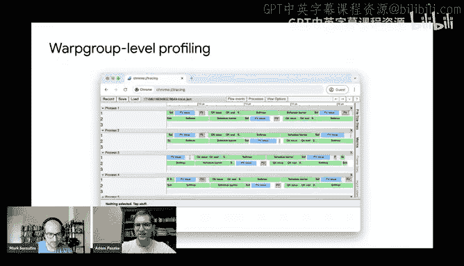

You should hopefully still be able to see my screen anyway。

So this is where the kernel begins and as you can see essentially before we just computed the wargroup index。

 which was again like one of the which I should actually first show you how you allocate multiple wargroup so here as you use P GPU kernel the only thing we have changed that we said nu threads3 and so what this means is that each one of those programs along this grid will actually have three threads inside and so you can see we specify the fourth axs name which here I have called warpgroup because well each mosaic GPU thread is a warpgroup and so then we can query here inside the kernel which workgroup we are which happens here and then essentially the whole kernel is just wrapped in like two conditional so one begins here and so you can see we select the first two wargroup and they will be doing the compute and this is kind of the bulk of the kernel it ends kind of here and then the last one will only be doing like copy GMM to SM or copy。

Pretty much copy G to SM that's all it does right and then they synchronize through barriers like you have PL GPPU barrier weight。

 you have PL GPPU barrier arrive and this is kind of you know we also allocated those PL GPPU barriers which is how they can talk to each other right but this is kind of annoying and error prorone right because this compute thread it only waits for the memory to arrive。

So you kind of want to say， oh yeah I wanted to read some memory here。

 but then you have to scroll here to like a completely different thread and only here you say。

 oh yeah， actually load this slice into this part of memory right it's kind of error prone like the load happens far from where you're actually using the memory。

 it's kind of annoying。😊，So essentially， what I just wanted to show you is yeah， now you can。

 now you can just say， Where is it， Yeah here， emit pipeline warp specialized。 And again。

 you actually specify the access pattern here using those blocks specs again。 So you say， oh， yeah。

 we'll be taking slices along K tensor and no longer V tensor These sort of code for the warp group that does the transfers is generated automatically。

 essentially based on those。 And then the compute， the compute thread function here is just。

 you know， just gets the just gets the opera whereas listen no， sorry， this is here。

 Kv pipeline you just get K Sm and V Sm。 And you just know the like there essentially。

 you don't have to even wait for them。 The only thing you have to do is you have to arrive to sort of indicate that you're done reading them so that they can be overwritten with like the next thing you'll want to you'll want to access。

 But so。The whole compute part essentially shrunk to from here to here right this is it。

 the rest is just setting up。 this is kind of the prologue epilogue。

 what happens before and after this pipeline and in here you can see we just do like Qk then we do Somax and then we do the result of softmax with V and that's kind of it right And so that's essentially what we're trying to achieve where specialization gets like a lot of seems like a mystical technique and in fact there's like a lot of magical number stuff flying around like the whole allocate delocate registers。

 but in fact， again， it's like a very largely automattable strategy you can use to implement pipelineing in your kernels and so we want to give you helpers to do this nicely without having you know to fully understand it Well okay actually without fully to understand is a wrong thing to say I do think it's worth understanding what it does to use it effectively but。

not have to implement the same strategy with like conditionals and like things that happen far away from each other。

 it should be easy to change this kernel to， for example。

 not use more specialization anymore or to go from a non-war specialized kernel to a worse specialized one it should not require like a ton of code changes and this is kind of what we're trying to achieve here。

Okay， so this is the code， I think those are the biggest takeaways that I wanted to tap from this if you have more questions again happy to follow up on Discord one other cool thing I wanted to show you about is there is actually a profiler。

You can I slightly had to modify this kernel but JaX is a feature called namecope is named scopepe it's just a context manager that is used to essentially annotate any time you profile a computation now we've added support for namecope inside P as well and so you can also generate very fine grain profiles of what's happening on your GPU and so I have especially applied it to to this kernel here what it generates is just a JO file you essentially have to specify a directory where it will be dumped it it generates a JO file and you can open up Chrome tracing or you can open up perfeto depending on what you like you can drop the file there。

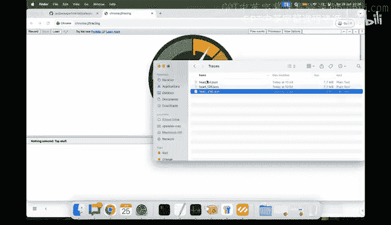

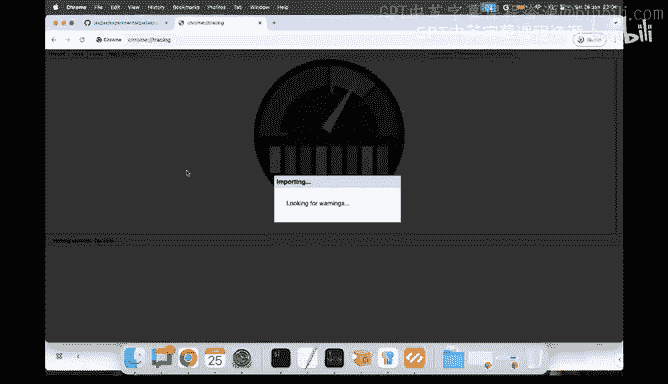

I have to wait a little to let it import and there you go。

 This is what happened in our kernel Now how to interpret this Each process here。

 you can see there will be multiple processes actually the way it's implemented is every process is a single SM on a GPU and so in particular here you can see that sort of we only you know this SM was first working on some okay sorry each process is an SM each line here or each know thread in this simulation is actually a single workp group and so you can see that know because we have a three workpgroup kernel those regions for you know slight arithmetic issues ideally there will be pairco overlapping because we can only fit one block on one SM at a time and so you can see that generally like there was only one block running on this particular SM at any given point in time but if we switch the process too there will be other SM sorry there will be other you know blocks each block。

with three warp groups running in there and then you can zoom in in each of those lines you can see at a given point in time what was this block working on right and so in attention again you have three things that have to happen so sorry each third thread here a warp group here will be the memory thread so you can see it has like different events than the other two which are the two sort of compute war groups which both compute attention right so there sort of pattern of events will look very similar。

And so you can see the sort of memory thread is mostly waiting for the other threads to sort of indicate that they have consumed the data so that it can you know schedule the transfers here is you know how long it took to schedule the transfer and then it waits for another signal right so it doesn't do anything interesting but it can roughly see how long it takes Now looking at the other two threads you can see there's a repeating pattern of you do QK then you do softmax and then you do know the result of the softmax which I call P multiply by V Now another interesting one interesting aspect of flash attention3 is that you use this special barrier to make it so that exactly one of those two workgroup is computing softmax while the other one is computing the maths so the P and the QK right so essentially you want to sort of make softmax like a critical section and why do you do this well softmax uses the AOU which is like one set of hardware circuits and。

MapMosts or use the Tensor core， which is the other know hardware circuit so by having sort of two threads of control each one talking to a completely different set of hardware circuits。

 you can sort of try to utilize both as well as possible right ideally what you really care about is using Tensor cores at 100% but you just want to make sure that you know the AOU is not like start It's not like both are trying to run the Mamo at the same time and fighting for the Tensor core and then they both move on to do the softmax and now they're both fighting for the AOU no you kind of explicitly sort of stagger them so that you know both hardware units are utilized at the same time right now how does this appear here this is a trace that I've run with headdm of 64 which is relatively small essentially one interesting thing is that as you scale up headdm your attention becomes more intense on the Mamosts but the softmax cost stays the same and so you can actually see this really。

Well here you can see I have annotated those softftmax barriers here。

 So this is the point where the two warp groups kind of exchange which phase are running like am I running Mamals。

 am I running Somax you can see that as part of Qk we are waiting for the other work group to tell us it's okay for you to run Softmax now and you can see it takes a while while here at the end of the softmax it actually almost never takes any time or a very short time just to sort of indicate the other warp group that okay I'm done with Somax right so essentially you can see that the Ma phase seems shorter then the Somax phase they appear the same length just because of the Somax barrier right but actually your Ma was probably done like summer around here and then your threat your warp group was just like idling there was no more job to give to the Tensor core the Tensor core is really fast on those GPUs but the other one was still not done with Somax right and you can see as soon as sort of they both enter the barrier they exchange in。

This one starts running softm and this one starts running Mamals。 Anyway， now。

 if we use head Dim 256。

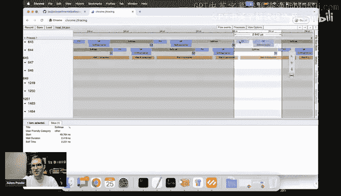

Again， we have to wait for it to load a little bit。

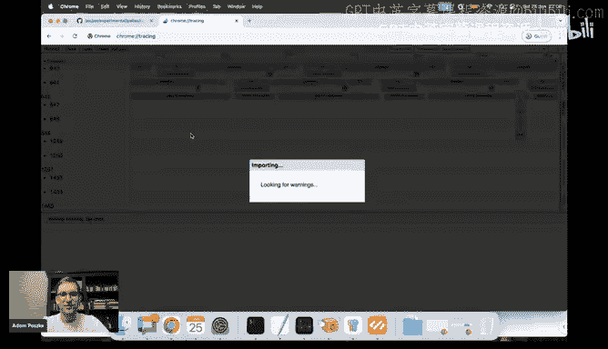

Now， if we zoom in here， you can see the situation is actually reversed， which is great。

 right This would explain why on one of those previous slides。

 you saw the utilization of headdom 64 be much lower than the tensor core utilization of the headden 256 right because here you can actually see。

 well， the Mamost good so expensive。 but the softmax barrier that happens here is actually really fast right every time you are in the Q you are actually unblocking the other group that is already done pretty much running softmax。

 You're allowing it to now start running Mamals right So now you can see the Mamals became more expensive。

 Now it's softmax that is padded with this extra sort of purple chunk here which is actually waiting by the work group to begin。

😊，You know， to move on to the next batch of mapmals and this is why you know。

 you can see this really high utilization right because you can see the blue is pretty much happening all the time。

 Either one war group is occupying the tensor cars or the other one is occupying the tensor cores。

 It like happens all the time you're not spending pretty much any time waiting for you know being allowed to stop using them。

 only you only have you always have someone who's like ready to begin using them and that's what drives the big utilization anyway I think this profile is really powerful because you can see those things。

 you can see you know whether you have aligned this synchronization well。

 you can actually see this pattern of them like exchanging what they're doing in different points in time。

 I have you can see the relative costs of like softmax and Mamals。 I think this is really powerful。

 This was really helpful as I was developing this kernel and optimizing it just to like see where the bottlenecks are right here I have not actually annotated any of the like memory related things besides what。

What the like memory workgroup is doing， but you can also see for example that your kernel is memory bound right because you would see like big weights as you're waiting for memory to come in and then just like little snippets of compute and then a big weight again and then you know big snippets of compute so you wouldn't actually have to like do napkin math to figure out like the roof line model or anything you can like literally see pretty much what the kernel was doing at any given point in time。

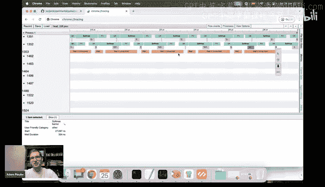

Yeah， all right， let's get back to the presentation。

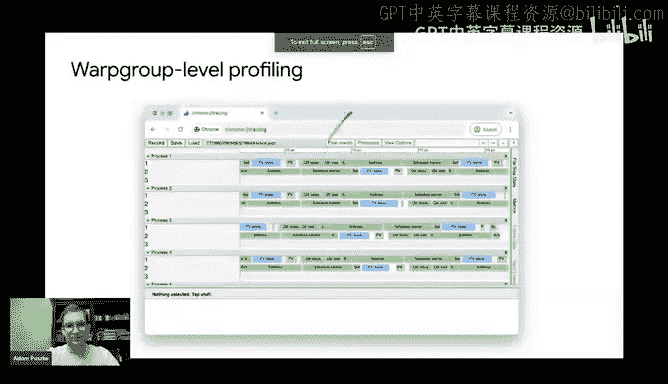

Okay so this is the end pretty much I just wanted to again touch upon a few things with our design philosophy just to sort of wrap up yeah。

 so as I said peak performance as a goal， as you saw。

 like we're not really going after having like a unified language for all of the hardware we do want to like expose every single sort of quirk of the hardware we do want to make the sort of common denominator as big as possible but this is really not the goal again we do not believe that kernel languages or productivity tools first and foremost you should start with your program like written in plain pipeyro or plain jacks。

 you only reach for a kernel language if you're like unhappy with the performance they deliver and so it's not that important for it to be like the easiest to use but it is really important for it to be able to deliver the performance right because you've reached for it because of performance in the first place。

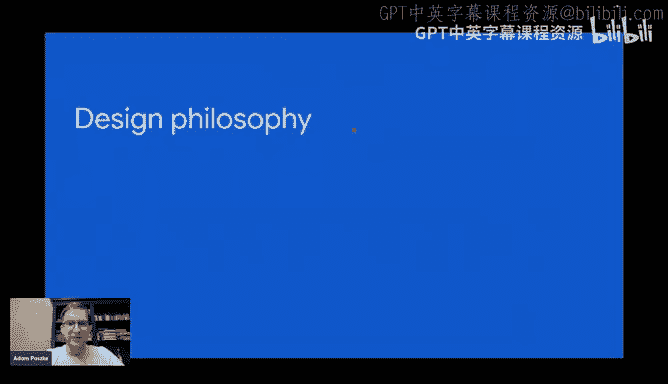

Right， but of course taste API design remains important， you know we're not arguing about this。

 we do want people to be productive portability is welcome but not that kind of secondary again we do want to automate as we can stuff like you know writing pipelines pipeline loops which overlap compute and memory it's kind of you know mostly mechanical but there's not that much like smart you can put in there but there are things where you can put in smart right stuff like tile size selection or you know how do you pipeline over various hardware resources and we have lots of hardware resources we can try to overlap the use up right we have communication between the devices we have transfer between you different local memories right we have vector compute the AOU that I showed you before that deals the softmax and we have matrix compute Tensor cards right I have actually not even touched upon communication here Mosaic GPpU does not support communication yet but in fact if you were to write TU kernels with P you would also。

Be able to like schedule transfers between different devices right over essentially ICI。

 which is like the TPUs envy link so and you essentially the goal as you're writing a kernel is to use all of those resources as well as possible at the same time right and so there's like a lot of juggling and it's really hard for a compiler to to do a good job with like managing all of this happening at the same time。

Yeah and for Mosaic GPU again state of the art performance that's like first and foremost I do also want to keep it a research platform like ultimately the way mosaic GPU started was I just wanted to learn about Hopper and I kind of you know tried building like a playground for myself and then I just figured hey this would actually you know I implemented some kernels they seemed useful and so we've kind of developed it into a more fully featured thing I do try to keep it as a relatively lightweight thing I do care about it changing you know again Black hole is a very different from Hopper yet again and so we will want to apply changes to it keeping it lightweight makes it easy for us to do those things and also hopefully makes it easy to you know。

Read it you can find out how it looks like you can use it， you can hopefully even contribute to it。

 So yeah what tested we do care about it being you know correct we're not aiming to replace Triton I think our priorities are like slightly different Triton definitely goes more for like convenience and so perhaps I think it will for pretty much forever be maybe easier to use than mosaic GPU but and it's okay right at different points in time you might want to use different tools we're not really trying to do a replacement we have I think a pretty good relationship with the Triton community and we're just trying to learn both ways。

 definitely mosaic GPU takes a lot of inspiration from Triton and if you look at like the history of Triton PRrs there were also some features that were inspired by certain developments from mosaic GPU I want to keep it this way I don't really want to make it a zero sum game yeah port not a go convenience。

 not the first first go and yeah this is essentially the third backend。

To P okay how do you get it Yeah it just comes by default with Jack's GP so anytime you in jacks you should be able to install it I would also recommend oftentimes using nightly releases since then you just get like the latest feature we are still actively developing it so many of the features that were added recently may not be available in the last release then you can just do this。

And yeah， can use it with Py Mosaic GPU， Yes， you just use you know a different function with pretty much the same API to wrap a kernel and then instead of giving you a function that takes jackarrayse and returns jackarrays。

 it just gives you a gives you a function that takes torch tensors and returns torch tensors and that's it Pace Mosaic GPU we don't have torch binding for this yet but ultimately it should be feasible to build。

 we do want to build it So yeah not right now， but ultimately why not。And yeah， if you're interested。

 you know everything I talked about is open source issues or welcome on the JaX repository that talk about this PRs yeah you can also just send it to Jack's GiHub。

 although if you want to send PRs maybe first， you know do actually reach out I am in the GPU mode Discord so you can find me there or you can also just like write to my email or you know the email I have on my GitHub or something。

Yeah， just to give you some example projects that I think would be cool to actually do they might be a little bit more involved。

 but you know we would not do it if it was easy So yeah， for example。

 you know we have this flash attention3 implementation but we do not actually have a backward password for it implemented yet I think it would be really neat if we would have like a more complete package where we can you know essentially provide like a single operator for this attention for Hopper。

 and now we're also now that BlackQu documentation is public。

 I am hoping that we'll be able to program BlackQu relatively quickly。

 hopefully we'll be able to apply it there as well。 Another thing， yeah。

 better F support I have not really played much with F8 or lower formats it will be nice to support them。

 is this should be hopefully more incremental。But yeah another neat feature to develop another one。

 I think it'll be actually really cool to try out yeah implementing you know splash attention from jacks reflects attention from Pr。

 but actually give it sort of flash attention free performance you could turn mosaic GPU as like a template for this configurable attention and just like generate really good attention kernels from this。

 And then finally something I want to explore our mixed precision Mas I think those are actually kind of cool because again。

 sort of converting between different D types in those a little bit of ALU while doing the Ma well ins attentionor core。

 And so again， you have to like carefully manage。😊。

What's happening when just to make sure like Tensor core is not you know。

 starved by waiting on the AU？Yeah， so takeaways， I think that hopper kernels and black hole kernels hopefully soon too I think they can be reasonably concise even though you know sometimes you will be reaching for somewhat lowlevel tactics you should still be able to prototype them in Python reasonably well yeah the next next steps we are working on essentially making it slightly higher level so you might have seen there are some like layout casts essentially you do have to like manage the way your arrays are like partitioned over registers is not fully automatic it's not as nice as and Triton for example。

 so we do want to automate this part a little bit more because we think it is feasible and also annotating those TMA transforms you saw there are some like magical numbers in there so yeah that would be good to automate that's something that we're working on blackwell support we're very much working on this and finally I think would we really neat if we could also like you know use the same technique。

We used to write TPU collectives and essentially start writing envy link collectives where we like overlap compute with envy link transfers not just compute with like transfers between the local memory regions this is something we have planned but probably a longer timeline and yeah we'd love to collaborate but do keep in mind that this is like you know we take we give no stability guarantees for this at this point sorry all of those things are still being actively developed and so yeah we'd love to have you follow along but if you want to depend on this in some capacity that would actually make us happy but please let us know because yeah otherwise we break you that's all I have for today I think we're a little bit over time but maybe we can still take a few questions and then yeah the overflow I can do in Discord。

So， thanks for coming。Thank you， Adam， I guess like if people have any questions。

 let's sort of speed run through them to be respectful of Adam's time。

 I saw like there was like a bunch of questions by Daniel like one was can you expose Hopper's setmax R and GP X IA instructions in this programming model。

Sorry， this is the like register allocation delocation is that the set Max N red is that the one Yeah。

 I think so yeah yeah。Yeah， this is exposed if we look through here。

Yeah there you go theres PGPU set Max registers so it is directly exposed there。

 I honestly think this instruction is kind of insane like the fact that it exists in PTx is a little little bit insane the way it's encoded but it is actually important So yeah we just like expose it this way although if you use this yeah again this like 232 is like a weird magical number that you can see floating around but actually if you understand how it's compute is not that complicated So if you use this like helper for a pipeline more specialized it actually does it for you automatically the only magical number you specify are how many registers you want to sort of donate to the memory warp group and then all of the other warp groups become that become compute warp groups they will like partition the remaining registers evenly among them again using those instructions so yeah it's exposed but again we're hoping that you will not have to use it。

Another question by Daniel what is the mechanism by which you record the time of each region people usually use NVTX ranges or coa events with timing but those are both host level APIs and can't be used within a kernel Yeah exactly so this is like a little homegrown profile or implementation that's also very unsafe basically the way it works is you have to you have to also as a parameter to the profiler you specify like a。

How big of a memory region in Sm you want to allocate for the profiler。

 And then essentially every as the kernel runs， you probably want to like make it a reasonably short run。

 So like don't run it on like 128 sequence lens or something。 Yeah。

 and then each work group is just like storing events into Sm。 each one gets like a disjoed region。

 So there's like no synchronization。 and it's unsafe because there's also no bounce checking because I don't want like this to have any overheads really it still has slight but I want to make them as minimal as possible。

 And then once the kernel is done， yeah， there's just like an epilogue phase where like a single thread just like copies this like log of what happened into Gm and then there's like a little python snippet that interprets this In fact。

 if you just go to。Yeah， so there will be。Mosaic GPU profile or pi yeah this is pretty much the whole implementation it's like 400 lines you can just read through it hopefully it should answer it。

 but yeah it just dumps events into SMM then to GMM and then there's like a little Python script that interprets them once the computation is done and yeah I just use like PTX instruction to like extract performance。

Counters or something there's like this clock register， something that's special。嗯呃。

Eric Schultz is asking like earlier you made a comment around how like enterprise like how around data center GPUs and TUs are converging would you sort of are you making a like were you making the more specific claim of like the data center ones are converging or just generally that like GPUs are converging as well so like he's wondering if your point applies to gaming GPUs as well。

Yeah， this is an interesting question right I mean。

 NviDdia very clearly is separating gaming GPUus more from the data center GPUs right like usually there were it was like a single hardware generation and then they just like specialize like maybe capped the hardware sometimes and just like made it into like a gaming GPU these days like know there's no gaming copper right or I don't even know if there will be a gaming black hole or something So yeah。

 I'm primarily focusing on the data center products the gaming ones。

 you know I think if they will want to accelerate Mamost more and there are you know legit reasons why you want Mamost and gaming like DLSS I think is really awesome yeah maybe you know they will also like steer more towards this directionion but you know for gaming I think this like vector side is still much more important than the tensor side but yeah。

This would be my guess， but I don't feel extremely confident in that answer。All right。

 and then I think the last question we have is from Albert Aer， which is。

 can you use Palace to give compiler hints to XLA instead of having to write an entire kernel？

How do XLA and oh， actually， Jake Kll is responding that the GTX for 590 is Blackwell。呃So nicet。

Yeah yeah but I'm curious if it will have the same tensor course they're like big ones because yeah it was really interesting to me that Hopper there was no gaming product that used it I am curious yeah haven't I haven't investigated so I do not did not have much time to look into black Wo yet so maybe I should stop Yeah yeah I think there's a lot of speculation and chat at this point so maybe we'll go on to tonight to the last question so basically can you can you use P to give a compiler hences ael instead of having to write an entire kernel and so how to accelerate in P and operate。

Yeah， that is a very good question so no， we are planning so definitely in Js。

 we've been also moving， there has been a trend to develop sort of more control over the compilers。

 scheduling infusions and layout inference and stuff like this。

But those generally fall into JX as soon as you start using P that is kind of a hard boundary where you say no at this point I stop using XLA I will be using a different backend I think interestingly P actually does have an you know you can pass and like interpret equals true to it and then it will actually generate XLA computations from it but it's mostly meant for like validation and not for。

Sorry， not for actually generating high performance implementations。So no。

 as soon as you transition to Pal， you are generally in a different code gen。But having said this。

 we are trying to sort of make this not a complete black box from the point of view of the compiler。

 So for example， on TPU， the compiler actually， if you allow it。

 there's like a flag you can specify like a parameter on the kernel as you instantiate it you can enable the compiler to actually fuse into your kernel like if the input computation that produced one of the inputs of your kernel can be reasonably fus into the kernel。

 the compiler can actually try to do it for you or stuff like cost analysis you can actually provide like cost estimates of how long your kernel takes which can like improve the scheduling the compiler does around your kernel So we do not want P kernels to be essentially full black boxes but it's not possible to say just like override one little aspect of like Xla compilation as soon as you enter into P kernels you're kind of in a world where you're just writing a separate program but we do want to make it understandable to the outside world as the compiler is generating more code。

Around it， yeah。All right， and with that thank thank you so much Adam folks。

 if you'd like to see Adam come by to give us another talk please let us know in chat otherwise Adam this was fantastic thank you。

😊。

