# GPU MODE《CUDA、GPU编程1-53课｜GPU MODE》中英字幕（deepseek-v3.2 - P46：-20250209-Lecture 43_ int8 tensorcore matmul for Turing.zh_en - GPT中英字幕课程资源 - BV1QZ421N7pT

Alright， Can folks hear song on YouTube。车。2。Okay， looks like we're live。

Well good morning everyone welcome to another episode of GPU mode today we have like Eric Schulsis who's you know been one of the most prolific people we've had on the server since its inception。

 like both as an LMC core developer and as someone I think I've seen contribute to the vast majority of working groups on the server。

So Eric's going to be talking about N a tensor core mas for tuuring and Eric also made the request that。

He wants to be interrupted， he wants this to be interactive， he wants to get good questions。

So please ask him good questions。So yeah， without further ado， Eric。Yeah， so。

At the very beginning of this talk， one thing I want to really make clear is that the main goal of this presentation is educational。

 so you're not going to see anything that's like state of the art fast or even close to state of the art fast like for this that's the I think in one or two weeks we have the age100 superfat memo that is doing that but for this it's more like trying to get the basics right maybe so。

And there the first question is like why do we care about8 bit integer matrix modification also from the perspective of trying to teach something like Tenor course and one thing is that this8 bit integer map is actually a very interesting problem。

 not just on GPUs but across a very right range of hardware like if you implement this on the CPU then you quickly find that it's slightly different than if you do floats because if you multiply two floats。

 you get again the floats so you have these like registers with multiple floating point numbers in and vector register and then you can just do like a few multiply add edition instruction that combines those but if you have integers then if you multiply to 8 bit integer the result is a 16 bit integers so there's actually like the size of the registers that doesn't match up so you have to be a bit more clever about this maybe and for one I guess for this。

Rea also in ABX 512， there's the VN and I extension that gives you a specific instruction that does like a four way do product interestingly between signed and unsigned integers。

 so if you want to for example like assigned into a map mode。

 you have to get creative how to use this instruction。

And this is quite similar to what you get in Qa。 if you don't use Tensor course。

 there's also a DP4 a， I guess， like a four way dot product instruction that takes。放。

8 bit integers of the first upper end for8 bit integers of the second upper end does the dot product between those four and then accumulates into a single 32 bit accumulator which has the same size as the original input opera for8 bit elements and then of course the thing that this talk will be about using them on tensor course and nicely they work starting with Turing so you don't need to have like a very recent GPU to try these out。

And the second very nice thing about integer in particular is that the results are deterministic for floating points if you reorder your。

Instructions， then some sort of error compensation or accumulation can happen in routing errors and you get slightly different results depending on how you block your operations or how you audio operations。

 but this doesn't happen for integers and as a consequence of that you don't actually have to figure out what are the correct tolerances for test cases。

 when do you consider an implementation to be correct， when is it incorrect。

 do you need to have like different distributions of inputs to check whether it also works if the inputs are less well distributed like some extreme values in there。

 and all of that goes kind of way if you just work with integers because it's like exact exact matrix modification。

So basically what I'm trying to do here is demonstrate the basic use of Tensor course and that is directly in Cud。

 so no large header library like Culas， but also on the other side not requiring any sort of inline assembly to be written so just what you get with the regular CA toolkit in kudda Zas。

So Eric maybe a question here just because like since deepse。

 I've seen a lot of questions up around people having question around inline assembly。

 so could you speak to like when is that required versus versus not？诶 so。The any sort of the newer。

Tsor instructions， they don't have any equivalent in C++ So for like MMma for example。

 I think the only way that you can actually use them is inland assembly and if you look for example in the cuts source code and follow all the templates the very end to where they go that template also ends in just an inland assembly statement though that's also the case for these functions there to we are calling here。

 like if you look into the cuula headers in the end。

 these things are also just generating the right inland assembly statements。

 it's just that you don't have to write out the statements yourself but you get the nice synthetic sugar on top that the language gives you like selecting the right thing depending whether you put floats or instead of how to to that manually。

And the reason this happens also primarily because like presumably the team authoring the like Kuda C++ APIs like has an inherent lag。

 or is it just inherently the kinds of things they're representing are not representable with？

Very simple， simple plus plus good。I'm not。 I don't think it's， it's purely lag。

 I think maybe the idea is like， if you don't want to go super deep。

 you're supposed to use catalysts。 And if you actually want to have like。

You write it really on your own。 Then maybe you should use inland assembly like the like。

For any sort of production code， I don't think these functions are really useful。

 the main use I see in this functions really is to give you kind of like a simple start into using tensor course on your own。

 So that might be the reason that。I think their value is mostly instructional and for that reason maybe they haven't added anything new for the Hopper and newer specific instructions。

All right， excellent。Yeah， okay。 And then also。The code is only really looking at nice matrices。

 So very large。 And in our test cases， also square matrices， even though that's not really a。呃。

Constrained of the code， but it just means that you can kind of like characterize the size of the problem by a single number。

 And also these matrices have sizes that are visible by a large power of two so that like you don't have to worry about any any sort of like boundary issues。

 and of course， that's also not what you would have in realistic code， even though for tensor code。

 I think typically even cube glass requires you to have something like a multiple of 16。

 but that's really just at the tensor code level if you want to look at the kernel level like something that' just the multiple of 16 Also is very hard to write because you quickly run into boundary issues。

 So here we just assume like the matrices are nice enough that we don't have to worry about any sort of boundaries。

And then as the title of the talk kind of says like we are optimizing for tuuring and in this case specifically a quadro RGx 400 like a TU 104 type GPU。

And。I can give two reasons for this Like one is simply that if you work on hearing。

 it has less features， which might seem like a bad thing。

 but also it means that you don't have to worry about all that complexity and you can actually get kind of like this feeling of having achieved some something that's reasonably fast without having to go too deep into these specialized。

Specialized inspections。 And the second reason is simply that。

We actually have a online submission system where you can try out this kind of exercise and that's the GPU that the system runs on so it was the natural choice to use for experimenting here。

So and basically， yeah， this brings me to this next slide like since a few hours and it's actually available for anyone to try out if you go to this website maybe after talk and basically what you get is that you can send your code there。

 then it runs a pretty comprehensive suites of tests like not just test it for correctness。

 but also using compute sanitizer for example， to check for out of bounds accesses or synchronization programs and then it run some benchmark and gives you table of results。

 how fast you run for different benchmark sizes and also points score based on some rough kind of guidelines how fast you're supposed to get。

So I see a question by Donggongz who's asking like what kinds of efforts are there to optimize a kernel for a specific GPU？

So maybe I can rephrase the question a bit to say like why is it like there's a few questions like why is it so hard to。

 for example， write a kernel that can run fast on multiple different kinds of GPUs？

And to assuming you're willing to write like hyper specialized code for a specific GPU。

 what kinds of things should you be paying attention to？

So I think the main difference is really between generations of GP was like you get。

Quite different types of tensorical instructions for for example。

 in Hopper you get these warp group asynchronous tensorical instructions that you don't have so you really if you have like a different compute capability。

 especially in its major version， then those reviews are just behaving quite differently and。

The compiler tries to hide a lot of these specialties by just redering instructions in a different way。

 maybe because it knows that latencies are different but。

There's still quite a bit of like fine tuning required。诶。

But one thing about writing this in QS C++ instead of assembly is actually that this code works for both tuuring and F tested MP。

 even though at the assembly level， the tensor instructions are slightly different inside the QA headers it dispatches to the right type of instruction。

We look get the。Correct color for both， I think maybe it's actually also the same on PTx and only in SA it's different I don't even make exactly。

The second thing is specializing for specific GPUs。

 one thing you can do if you know both your GPU and have some sort of control of the problem size in maybe。

 then for example， like one thing that can happen if you're very unlucky is that you have some blocks that are running on your matrix right they distribute the outputs that you compute and then there's exactly。

The number of such output blocks that you want to compute is somehow not divisible by the number of streaming multi processes that you have in your GPU。

 So at some point， a few of those will be running for longer and mostly the GPU the idlo。

 but these few stragglers will basically do a full iteration till the end that's。

 I think called tail effect in。In NCU。And if you know that。

 then maybe you can like select a specific block size。To really optimize for that。诶。Yeah。

I think that's more or less the。I at this point today。I that helps a lot。 Yeah， let's keep going。Yes。

 so anyway， I can try it out maybe not while I'm talking but afterwards please also give me some feedback Okay。

 so now that I've mentioned that you're testing them actually like one interesting question is also like how do you do this kind of testing the simple answers of course just take two random matrices multiplied them together with some sort of algorithm check the result and compare if it's the same as the result that the new algorithm is giving you but that's not really satisfactory for several reasons like one thing is just。

We don't just want to know whether the result is correct or not。

 we also want to give some sort of useful feedback to fix the error if the result is not correct and just the bull in like oh this kernel was wrong isn't really helpful for that and also something that well there was a mismatch at index 5733。

Is not really helping you to de your your matrix modification algorithm， I think。

 So one thing you can do is， of course， look at small matrices where you kind of can immediately see what's going on。

 But these matrices are so small that lots of kind of。

Possible error cases that you could get in these tensor implementationations。

 they just don't appear because you're not actually covering even an entire GPU block with your small matrix that you can at a see at the glanceand。

The other idea is to use some sort of special matrices， like for example。

 multiply large matrix of an identity matrix and then you can immediately see what the supposed results and kind of check what's happening。

And and a third option is to have some four structured matrices， so。

Instead of having amatictics where each number is different， for example。

 have blocks of four by four that have constant numbers。

 and then you can kind of map this large matrix multiplication to a smaller matrixmatic and check where things are going wrong。

Going wrong in this case， the most interesting thing usually is like not what's the value that you expected and what's the value that you got。

 But at which places in the output did you actually see something like is it that if you have a single block。

 maybe that block is correct。 But then if you go to the next block， I'm sort of like inter is wrong。

 So the first output is exactly at the block like the first wrong output is exactly the block boundary。

 Like that's the kind of feedback that's probably most helpful for debugging this kind of mapmo。

And of course， there's also a computational perspective。

 because if you want to check whether the algorithm is correct， then you need to have like。

A reference result with a like naive check。But then how do you know that your knife I will mis correct Well。

 you can use a simple algorithm， but a simple algorithm is very slow and this difference can be multiple orderss of magnitude So you kind of would wait forever for testing the result and especially for this kind of like。

Tasks that you expect students to do。 You might also not want to include a fast algorithm in your kind of like test that is available to students because that would be spoiling a little bit of three exercise。

 So another alternative is to use what's called pilot algorithm which is to use the property that if the matrix C is the product of A and B then any vector X multi type by C is the same as if you multi the vector X first by B and then by a。

 which is kind of like if you think about it what we're also doing in lower Rasterite like we deose a big matrix into do smaller matrices。

 but then also for the forward pass， we're not。Reconstructing the large matrix we are doing the two vector multis separately this of course isn't。

100% foolproof to detect an error， but it gives you a high probability chance of if the product is wrong。

 some output will be wrong and it's very much cheaper than the full matrix matrix modification so you can actually run this in simple non optimized code where you kind of like。

Just by looking at the code can check that it's correct and of course the third option is just run against some trusted library like Qubla which might be the simplest。

 but then again it requires， for example， if you give this task to students to download it requires them to have QBAs installed it and we try to keep this kind of to minimal。

Okay， so so much for designing the kind of like teaching aspect of this now， actually to go to。

Implementing something that does this matrix modification so first let's actually take like one step back and look at matrix modification again with kind of like fresh eyes maybe so what we want to do is we have like a matrix a that's n times K and a matrix B that's K times n which are eight bit integers and the result is supposed to be an n times n matrix which has 32 bit integers to be able to accumulate multiple a times8 bit results in its output and then there are kind of like two ways you could kind of think about decomposing the matrix modification the first and probably the more like well used one is bottom up that you kind of define just what happens for each single the output element in the result which is just an inner product and then you have kind of this embarrasly parallel if you disregard the fact that memory is a shared resource type of algorithm which gives you the naive chaotic or that should be n third not NK。

rithmLike so and cube algorithm。You could also think of this that you can take a large matrix partification and actually decompose it into several smaller matrix products and what I've written down here。

 for example， is just a kind of knifeive decomposition in eight sub products but in fact you actually can even do that more cleverly and end up with seven products which gives you an algorithm that in a bignotations is actually faster than this naive algorithm。

 but it doesn't play very well with model hardware so that's why usually。

I guess it's not used very much。So sorry， two questions。

 I think I've seen on Gehot's discord he bans people if they use the word stress and algorithm。

But you know， like maybe for a more serious question， so Harsha is asking。

 is the generation and type of device implementation the right way to reason about what precision is a good choice to run a certain operation on it。

 for example， if there is support for in4 mamals， maybe the partial sums are an N32 and this is a bottleneck as you need kuta courses for this。

I'm not sure what like the accumulation and infin do what happens inside the tensor code。

 right like you don't。Do that in in Q course， so。There isn't going to be like a summing of in2。

If you use the left algorithm， like if you do this decomposition。

 like maybe if the question is about the right hand side like the stress and algorithm like one problem with the stress and algorithm is that it gives you lots more kind of addition matrix additions which in the Onotation are cheap but in actual hardware they're not cheap like these additions you would have to do aq course so I think that might be one of the reasons why this algorithm isn't actually used very much。

嗯。Did you have a second question？No， this was like that was it。Okay。Yeah。

So what we're going to do now is instead of decomposing the matrix into a fixed number of submatrices。

 you could also think about decomposing it into a submatrices of a fixed size， at least。

 if we from now on assume that all the matrix dimensions are tovis by 16 so that we don't have any boundary conditions as I said in the beginning and then basically think of any matrix just as de composedposed of an individual blocks of 60 by 60 numbers。

From now on， we don't ever want to look into what's inside these individual blocks again because now we can just write down the matrix multiplication at the level of these blocks or matrix fragments and basically what we get is again。

 the naive algorithm， but with much fewer iterations right because instead of K prime is like 116th of K and the number of INJ in disease that you have to get in the C matrix is also 116th of the original and what we have now is that the sum in this large sum that's exactly the operation that the tensor code gives like multiplying two fixed size matrixrices together and adding it in the large sum and what we have to write by hand is essentially like how to orchestrate these sums how to get the data into the tensor course like the typical problem I guess that you have if you want to do anything faster than GPUs。

嗯。Yeah， and then basically， if you look at just the curator Facebook what I said before。

 like you could use catalyst for this， but catalyst also comes with。

 I don't know how many megabytes of header files。 And if you look into the the cut documentation。

 the amount of functions that you need for this is actually pretty limited。 So they are。

Two different load functions， one lower function， a function to a field of the constant and the last the M sync is exactly this operation of multiplying the two matrix experiments and basically that's it。

And then basically these fragments， you can define well they are the part of a。

 a part of B or part of C。嗯。Yeah， the cost you pay for not doing assembly is this warning that's written here for fragment。

 like the mapping of matrix elements and ref fragmentments。

 internal storage is unspecified and subject to change of future architectures so you can't basically exploit knowledge about this to speed things up even though in the end of this talk I will show you way how I think you can do that without running afo of this constraint and that actually gives you noticeable speed up。

So that's revisit basically the naive scalar matrix modification algorithm。

 but write it down the way that the parallels to ten or。Become very obvious。

 So instead of just writing on the types directly we define like a result type。

 which is the result fragment， which in a one by one setting is just a single integer and the fragments of x and y。

I guess I'm using X and A and y and B kind of like interchangeable here sorry for the not both of these are single a integers and then we have a result that we initial s to zero we have this large sum we to it over the K dimension we load the two fragments which are single integers and we do a few bio addition operation on this accumulator and in the app we store this result Now if we want to have like the simplest tenor chrommatics biplication algorithm。

It goes like this。So basically nothing has changed on the algorithm level。

 we just define out these 16 by 16 fragment types， and we fill it with this fragment function set of was equals0 and the loop now goes in steps of 16 and our addressing also needs to take into account that we have steps of 16 and the INJ indices like the part that you don't see here like in the beginning of the kernel。

 they also need to be calculated differently based on the thread and block index so that。

Like there's 116th of these， like you have fewer blocks now。诶。

Then the plastic words multi part is just this N sink instruction and finally the result is this smatic sink and。

开定接。I'm not when I% confident that all the code examples I present are going to work as they are。

 I've taken them out of the real code and kind of edit them to fit on slides。

 so I might have made sometys there and they might not exactly work。

 but they should get get the idea across。So now we've writtenized matrix modification with tensor course。

 now we get something fast， right？Well， if you run this and this is specifically again。

 like how it would look like if you run it in our course tester， were going to result okay。

This is something like 15000 large matrices，1。5 seconds。 That's a very large matrix。

 That's not that long。 Maybe that's actually good 4000 gig flops。Well。

That's why you always need to do a speed of light analysis， right。

 Like if you actually look into the fact sheet of this GPU。

 which unfortunately already shows the tens of performance。

 which I think in this case is FP 16 tens of performance。

 So there's another factor of two that you need to add to go to the performance of。

In aid a tensor course。 Then we actually。Allders of magnitude away from what we're supposed to get。

So apparently it's not quite that simple that you get a decent performance。

 even if you're using cancer course。So what's going wrong， Well。

 there's this a fantastic slide from Stephen Jones。Did you see the presentation？

I'm not sure if you can read the scribblet out part。

 but it's how GPU computing works and basically in the very beginning of his talk he changes that to basically the most best important question about making this work where's my data and a lot of this presentation is also just going to be like putting data in the right places at the right time so that the GPU can actually do its job and and go well。

So what went wrong in this simple example， well basically what we have is a bad memory access pattern。

 this load matrix sync function in this case fetches data from global memory and distributes it across the different thread in a warp in this unspecified manner that this big warning was talking about。

And stores these parts of the input in registers of CubaA threads。

 like it's the normal registers that you also have if you doing regular CA， nothing special here。

Which also means that the normal considerations of load performance apply。

The access across matrixB in K dimension that we do is stride it because we've declared B to be real major and that means we get uncoed reads and uncoed reads are very much。

Terrible for performance。So how do you fix this Well maybe we maybe you' look at the graph first like so this is now taken from inside compute the memory graph。

 which is one of the first things I guess to usually consult when figuring out。

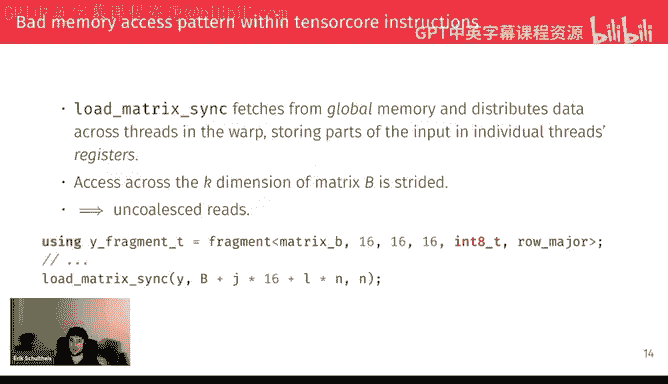

How to improve a kernel and we can see basically we are transferring a lot of data like for this magic modification between two cache and one cache。

 there are 630 gigabytes of data transfer happening here and 26 gigytes of data transfer between device normally two cache。

 which is quite a lot if you consider the dispute has。I'm not sure eight or 16 gigabytes of memory。

 so very much many times over the entire memory of the GPU that gets read over and over again。

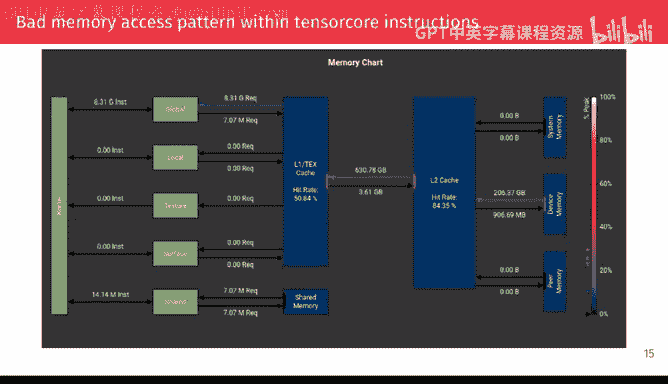

嗯。And then if we look at the the second type of。Performance indicators that you get with NCU。

 which I think you always should look at and which is the walk stall cycles。

Maybe I should explain what those are because I guess not everyone is familiar with these。

 so basically what this tells you is。Every cycle for which the work actually did instruction like how many different cycles did spend in some state where it didn't do anything useful and basically now these are the top contenders whether the first one is stall E frottle。

 which basically means like the work wanted to start loading new data from global memory。

 but there's a limited amount of data that you can wait on in your GPU so。

The the block couldn't actually do the load instruction。

 It had to wait for some data to arrive before this new load could could go through。 And it's really。

 really chaable for performance because it also means that you。

You can't hide this laency because the node doesn't even start until you process this instruction。

The second most important contribution is stall long scoreboard。

 which is that the loaded instruction went through， we requested this memory from global memory。

 but then at some point we wanted to actually use the data that was requested and it wasn't there yet。

 which means that at least they could do some sort of useful work between the point in time when we requested memory and when we tried to use it but we didn't actually have enough useful work in between to arrive at this point in the instruction stream and we wanted to use it where the data was early available to process。

And basically， the successive versions of this kernel that they're trying to really get rid of these things and push them to as close to zero as possible。

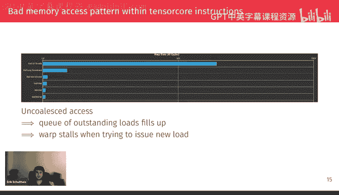

嗯。So now for fixing this， the idea is quite simple。

 The problem was that both matrices are in row major， but we want to have like nice。

Linear access pattern in both matric， so if you don't have any transpos in your matrix verification。

 that means that the second matrix should be in color major format and then basically the only thing you have to change is this definition of the Y fragment and the indexing and load matrix sync。

But now we actually need the second matrix also in color major format。

 which means that we have to run an additional kernel that transpos the matrix and again like if you think about like this kernel is also going to be terribly bound so why is that a good idea well it goes back to again。

 this bignotation right like。The size of the matrix is n squared whereas the cost of matrix computations matrix products is n cubed。

 so for sufficient large matrices like the ones we're looking at today。

 this transpose is going to be really really cheap compared to the actual matrix modificationplication like in this case。

 six milliseconds compared to well the original version basically 1。5 seconds。

 the version with the color major second matrix just below one second so several orders of magnitude faster we don't really have to worry about the overhead。

 at least with this slow kernel yet。

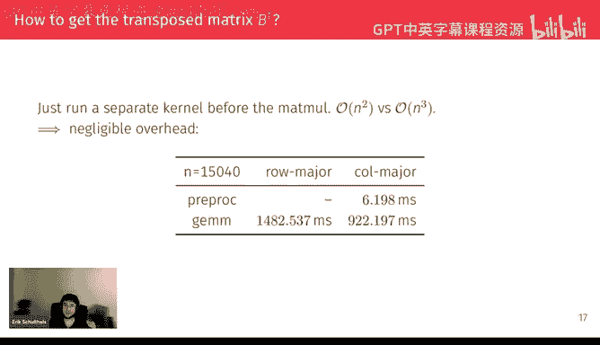

And then if we go back to NCU and now also use this nice feature that you can show the difference between two kernels。

 then you can see that we've improved quite substantially on the amount of memory that we read and also。

The first thing is the amount of memory requests we do decrease is by an entire 60%。

There's some buffering or some way the cache has shielded the L2 cache from this。

 so it doesn't translate to a 60% decrease in transfer between1 and2。

 just just a 30% decrease and then again， a 40% decrease in transfer between device number air2 cache。

 so very much took quite a bit of strain of the memory system with this。Very simple transformation。

Now， interestingly， if we look at these warb stalls， like maybe to make this more interactive。

 like what would you expect to happen with Warb stalls now that we fixed this memory access pattern？

I guess Mark， you have to look at the chat now。Kly if someone writes something。I'll take a look。

If no one' is doing anything， you can also。G a try yourself。

So Phil is saying marijuana is saying shorter stall durations。Yeah。

 that's kind of also what I initially would have expected。

 right like because we are no longer having this big memory problem。

 but it turns out actually it gets more， which seems very counterintuitive when you first look at this。

 especially since we actually know that the going got faster。

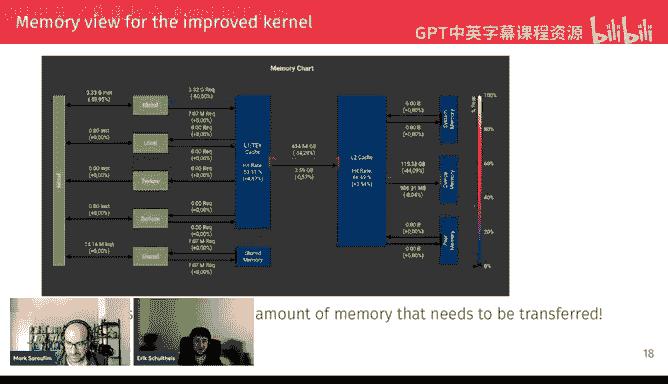

And the really important thing when looking at these statistics is that they are normalized to how many cycles did you spend stalling relative to the amount of cycles that you actually did useful for work。

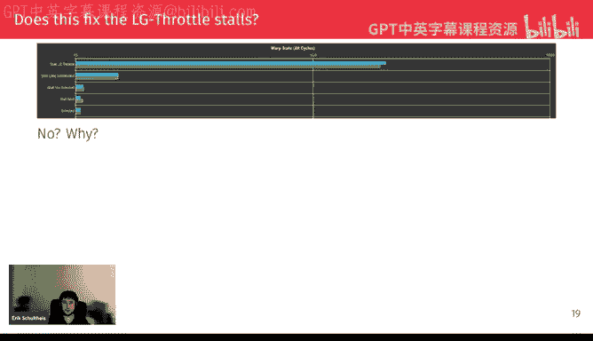

So if we look at one more of these。Ses that you can get in NCU。

 which shows you which instructions were executed， we actually reduce the number of instructions by 45% because now we are using far more load instructions and also we need far less index calculations which are these Iad and I add instructions that。

You can can， by the way， Can you see my cur。Okay， you can see here。I cannot see your mouse， now。Okay。

 so it's the top two entries here。 Those are the index calculations The one after that is the LG load from global memoryory and I think the one SHR shift right is probably also from index calculations So all of these go down which means that the denominator and normalized and the normalization of website cycle is like the number of cycles in which we issued an instruction has also the decrease quite a lot So that's why this ratio didn't actually improve even though the got a lot faster。

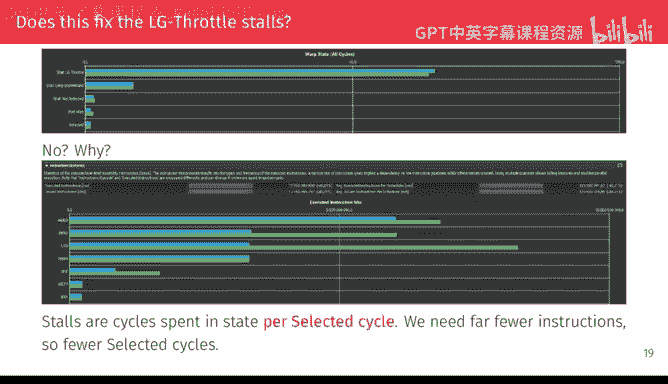

Okay， so at this point， maybe we should get out our standard kernel optimization toolkit that you have available now。

 if you've read， for example， the PMMPP book and try to apply some of the standard techniques to improve this further。

So basically， the first step that for these types of currents that reuse conceptually at least like the same data over and over again like。

We saw we were really much more memory than the GPU has so。

Is to make sure that we are using this memory in the right place of the memory hierarchy。

 I guess you've all seen the figure on the left。But to be honest。

 I'm not super happy with that figure because kind。

 all the interesting stuff is happening just at the tiny top of the pyramid。

The right figure from some NVdia blog post is maybe a bit more more helpful， which shows that， yeah。

 you have this global memory then you have the two cache that you also saw in the NCU things and then inside each student multiproces you have。

Still two different versions of memory one is registers。

 which is the only memory that's actually is very fast and the one cache that's at the same time since since Volta。

 I think also shared memory so now the idea is to move as much of the memory access to this faster memory and for that we start of course by trying to reuse in the fastest memory that we have available。

 which is registers。And the idea is also quite simple instead of calculating just a single fragment。

 so 160 by 160 results。With each walk， which corresponds to eight outputs per thread。

We switched to each wall paneling three by three fragments as models。诶。

Wwhichch means that we need to load six input fragments like three for a3 for B。

 and you get nine output fragments so in an arithmetic density and connect units of fragments loaded to output fragments calculated we've improved by a factor of free in terms of data weuse that we get from this and I think in the PMVP cookbook that would call this thread coing even though maybe in this case。

 the more accurate thing might be coing anyway like the main point here is through reuse memory as much as possible in registers and the only way you can do that is if each thread handles more of the output results so in that sense both these strategies kind of like just。

The same thing from different perspectives。诶。And then the procedure is exactly the same as when you optimize the scalar at kernel。

 so basically what you do is in the like beginning of your loop。

 you load the three results that you want to have for one of your fragments and then in the main computation loop you load the second one that you want to combine with these three and then you have this like now nested inner loop that goes over the preloaded y fragments and does the accumulation。

And we later。嗯。

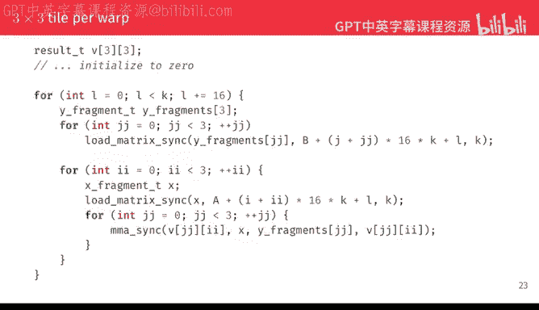

Yes， so if we then， again， run this and look at the first， again， like the memory chart。

 we get another 60% reduction， or almost 70% reduction in。

In the amount of memory requests we do and 50% reduction in memory transfers basically so now this is relative to the already improved kernel with the kernel major B matrix not towards the first one because if we kept using the very first one as as our baseline the numbers which just go into it not like 99% range and we wouldn't actually see the difference between the faster current。

 so every NCU comparison I'm showing will be between the previous kernel and the next one and not with the fixed baseline。

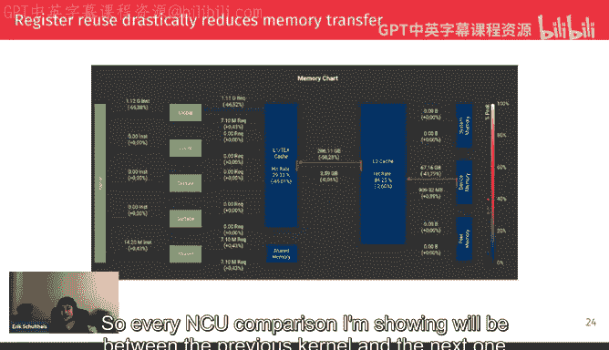

嗯。Finally， we also get this reduction in long LG frontroal warb stall by basically a factor of one half。

And interestingly， we still get decreases in the amount of instructions that we need to do because we know once we have these fragments in registers for registers you don't need and you even can't do address calculation because registers have to be fixed at the assembly level。

 so a lot of this address calculation arithmetic or integer course also goes away。And like the again。

 I add three and I add instructions。And also we do again， fewer global loads， of course。

 because we reuse the data at the level of individual registers and threats。Now， the question is。

 does this have any drawbacks and again？Maybe this is also one of these questions that someone from the audience could。

Some in。Give an idea。I guess while people are thinking， Alex is asking， just to clarify so far。

 none of this is specific to an tuuring architectures right。

 as this is just generically for devices that have tensor cores。Almost like。

Some specifics are different， like the amount of。At the danger of spoiling the question I just posed the amount of registers you need to store results and inputs like that changes depending on whether your inputs are 32 bit floating points。

 a inger 160 numbers but otherwise yes that's one of the main kind of messages maybe I want to take you to take home from this is that everything I'm doing basically is exactly the same recipe as you would do even with just like a regular scalar matrix modificationification without tensor course。

 it's just that we shift our perspective from looking at individual numbers to looking at these 160 by 16 groups of numbers。

 but once you do the shift of perspective， it's exactly the same thing and of course also on other GPUs it might not exactly be like 16 by 16 it might be a different different shape but even noturing you can use different shapes。

 but the square one is the easy one I think to explain。

So it sounds like the issue is you increase regiisters village。Yes， well， at this point。

 it's not yet spilling。 It's just the。

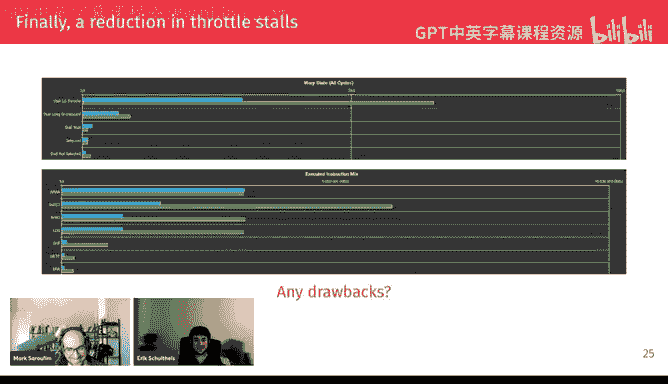

And amount of red that you need per thread increases。

 so the amount of threats you can have at the same time goes down。

 so we're not in spilling territory yet we are in occupancy like reduced occupancy。And of course。

 that means that the Cal promised automatic hiding of latencies that you get with these oversubscribed GPUs that gets less effective。

But。Since we have so much less latency to hide in the first place。

 this is very strongly a net win to this。

Fd cost name slash register reviewsuse。U but it means that we can't really keep playing this game much further because if we then go to like a four by fourth rent reuse。

 for example， the amount of registers increases。Much more。

 And then we might get into the register spilling territory。 but of course。

 like if you were room the graph earlier。There's one more memory in this SM that we haven't used yet。

 Did you want to ask a question I did want to ask questions。

 So how can you started it with three fragments， Like I guess you spoil the answer with like more than three。

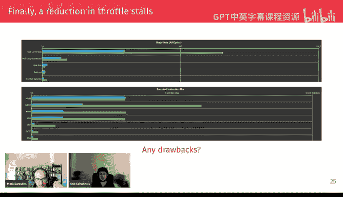

Would give you the occupancy problem， so why not do two？Cause your well I mean， you can start。

 I mean， that's that's kind of like part of what you're doing when you actually develop these concerns I' like you。

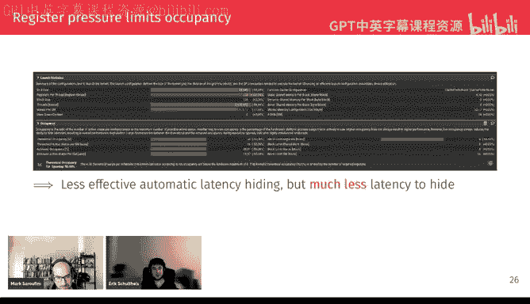

You would not at least I would not write this code exactly like this I would have like a con extra tile size equals three somewhere in the beginning and then every three here would be tile size。

 but that would make the text longer on the slide so。

explicit freeze and then you basically try to figure out like what's and that's also it's not something that you necessarily can predict that's also where where benchmarking comes and like you try like you can probably predict that three is better than two you might not necessarily know whether four is better than three and then there's also not necessarily like you don't have to use square shapes right like maybe four by four runs out of registers。

 but if you could do three by four maybe that that gives you enough registers。嗯。Yeah。

This is also not necessarily the end of。Of how you can do registergis。

 So I I won't get to that point in this talk。 but essentially like after you fix lots and lots of other performance problems at some point。

 the registry use actually ends up being a bottleneck again。 And then you need to go to even larger。

Sizes， which means that this automatically agency hiding really almost goes away because you can't have more than one block on the GPU anymore so any kind of sync threads call that you do is really complete halt of the GPU like nothing is going to happen in all the threads that they're finished yet and that would be a very bad state maybe to start working with shared memory so it's nice to do our first shared memory experience with a setting where you can have more than one block so that sync threads is not such a performance killer to start with。

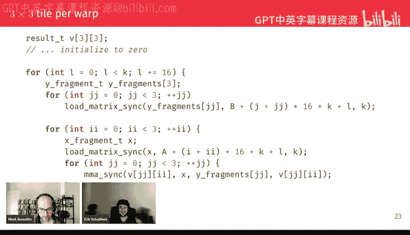

我得。That's。It's also just like at some point， like you write some code and it follows a certain trajectory。

 but。It doesn't necessarily mean that all the optimizations I'm doing have to be done in the order and presenting and now you can probably mix that match like not everyone because some like unlock new optimizations or new bottlenecks that need to be fixed。

 but some of those are interchangeable and the order which you do them doesn't matter very much。

 but generally I would recommend the first thing to do is reuse and registers if it's possible。

 tend because registers are so much faster than even shared memory which is also something we'll see in a couple of slides I think。

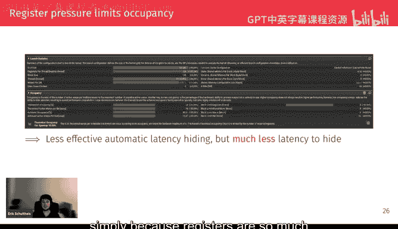

Yeah， so now we want to。You release data and she had know on kind of what I said。

 like if you look at the title of the slide， I've put the fast in quotation marks because。

Once you actually get down to it， especially first something Mamo。

 you notice that shared memory isn't actually as fast steady as you think when you were first told about it。

So for simplicity here， again， like this is。One possible choice。

 It's not necessarily the best or the only choice you can make。

 But let's say we use 9 walks per block。 and basically like。3 by three tiles or three by three tiles。

 so that in total， one GPU block handles。Like three what level trials of three3。

Fragment tile of 16 elements each， so basically 144 by 144 is the size of the result fragment that gets calculated by a single block。

诶。And then one nice thing we can do again， like assuming that the input is nice enough that everything is well aligned is we can actually load the data into shared memory using these vectorized load instructions so。

In this case there's a bit of a hack going on because you don't get like N video gives you basically vector types from one to four elements。

 but in order to actually use fast vectorized load instructions， you need 60 bytes so。

And there is no in 8，16 data type or by 16 data type。

 So instead we pretend that we have just an in4 and。Load this as an in4。

 which is is the the number of eyes that we want。 And then again， for writing it to to shared memory。

 we again do this re interpretpre Ca pretend that the。

Memory location that we write to is in force and basically what this does is it tells the compiler that the in data type not just has the information that it's for integers。

 it also has the information that this info has to be at a 16 byte boundary and this memory alignment is what allows the compiler to choose these faster loaded instructions for this data type or faster stored instructions that need generated right to shared memory。

Yeah， so basically at this stage， we don't really care about。

The assignment of individual blocks to threads like each thread just is loading sub sort of like linear part of the memory。

 And we are transferring this basically copying it verbatim to。

The shared memory and of course this is one of the points where newer GPUs could do fancier stuff like in MP you get these asynchronous load and so instructions and this entire process of taking a sub it of moving it from main memory to shared memory is basically what the tensor memory accelerator that is new with Hopper and now and back will I think is designed to do without you having to actually do manually anything or using your Q course for this having it direct in hardware and of course that makes it much more efficient。

But enduring， this is the way you， you do this this copy like that， that's the。The trade of like。

 you don't have that any features， but it also means you don't have to worry about asynchrony or anything。

's it's just the regular regular killer。Do that code that you get。And then of course。

 you would have the same code for the second input matrix which I'm not showing here and then the actual loop that does the matrix modification is basically the same except that now the addressing like where you're doing your load matrix link from is the right address a shared memory and maybe something to keep in mind as this last argument to this function is the offset。

Like if you go from one row to the next， how many elements do you need to go and now that we only have this small single tile in shared memory that offset has changed from being the number of columns in the matrix to just the fixed constant 160 like the size of the framework。

 but otherwise the code still looks the same。

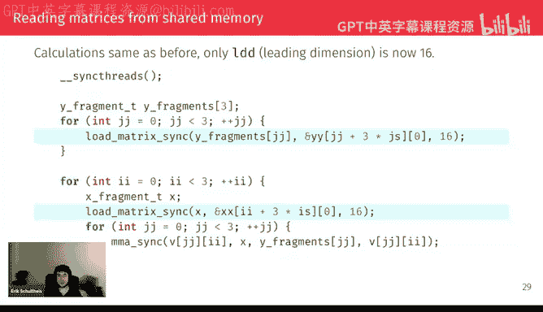

AndAgain， we get this very drastic reduction and amount of memory that we need from global memory。

In terms of the log instructions， we had now an 80% reduction。

 so if you remember we had a 60% reduction of that we had another 60% reduction and now we have an 80% reduction of that So were now several orders of magnitude I think or at least like one and a half orders of magnitude better than the unal kernel。

 were also down to just transferring nine gigabytes of memory from the device22 instead of several hundreds。

诶。Does anyone notice anything problematic in this。In just a wecha。

Like anything that you might not have expected or anything that you think might actually hurt performance here。

Flow suggesting the plus 600% to L2。Yes， and what's the reason why we get that。

 there's an even worse number than 600%。If you look。To the left of this graph。

 like what's causing these 600% 122。Okay， so so so far we've looked at this top connection that goes to global memory if you go one down theres local memory and suddenly we have plus infinity percent of local memory usage which。

Probably isn't very good and so again， like do you know what the reason for this is？

Like the immediate reason at least。Like what does it indicate？So I。This is like。

 this is like a guess， but like。Basically you're putting too much stuff in your L2 cache and L2 cache you're not explicitly programming。

 so this really suggests that this is spill over from your L1 cache。

Which really means that like you're putting too many things in shared memory in your code。

 So this also suggests。A form of spilling。Yes， but it's， it's basically what we talked about。

 it's now we get register billing and register billing goes to L 1， But L1 cash is right through。

 So everything that you write to L 1 has to be written to L 2。

 So all the spill registers actually get written to L 2 and that。Yeah。

 that's this 600% increase that we see。 and this is one of these kind of like weird cases where we didn't actually explicitly use any more memory like we didn't make the tile size larger。

 but。For some reason， the compile， I wanted to use。More register。

 I think it might be actually that in this case， I deliberately set the。helello。

Like I told it I need to have two blocks instead of one to ensure that the sink threads doesn't block the entire kernel and that limits the amount of blocks that you can have concurrently of so that you can have a block and then we got this red skillss。

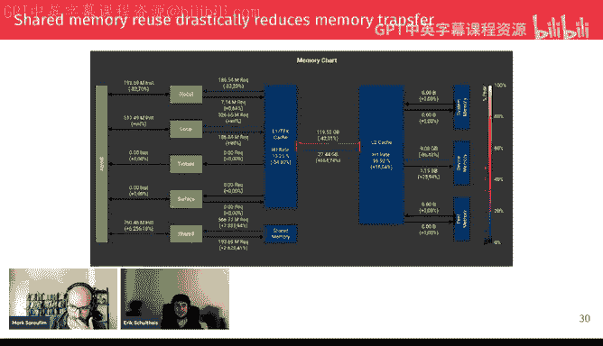

Which isn't great， but okay， know it's actually highlighted also。But again。

 like we're doing trade offs here。 so if we get an 80% reduction in almost 90% reduction in what we read from the very slow device memory。

 maybe this larger spillover 122c， but you have to think like。

Most of the reading that happens of these little registers actually happens on L1 caches just that they have to be written to L2。

 but we're not reading them from there。That this is very much a good wild trade off。 So， again。

 looking at。The other performance indicators in NCU。

 we basically like one thing that we get that we didn't have before is this barrier stall because now we have syn that's in there and friends have to wait for other workss in the block to arrive at this barrier。

But on the other hand， the bar for LG throttle has diminished by， I don't know。

 like a factor of five， maybe the long scoreboard like the waiting for results from global memory has also decreased by more than a factor of two。

Which is very nice， and。Like in terms of the instructions。

 we've also seen some changes like some more address calculations now for the shared memory and we have this new LDSM。

 the load from shared memory matrix instruction， and instead not many LGG like load from global memory instructions。

But one thing I want to highlight， I no， it's not on the slide yet， okay， but。

Trying to remember if it comes laterator。Okay， I'm hoping it comes later otherwise I have to remember to mention this。

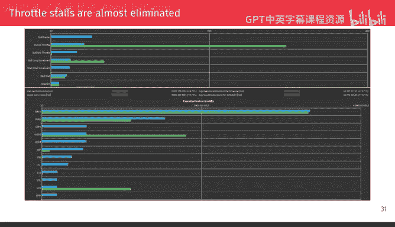

Let's look at I at first at where we are。With the optimized kernel that we have so extending the table from earlier with the registered user shared memory kernels。

 we get very nice speedups in terms of the just more clock time of the kernel。

 so we are more than a factor a factor of four faster the original， which is I think。

 a pretty nice improvement considering that we really haven't done anything fancy like we have just applied the kind of extended toolkit。

That you get from， for example， PMNPP。嗯So。

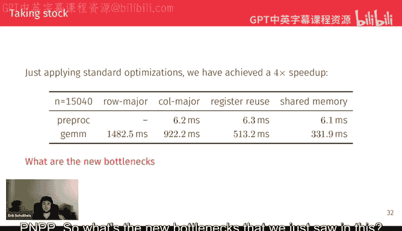

What's the new bottleneck that we just saw in this。 So one thing that I wanted to highlight。

 yes exactly in this slide is these stall myo throttle and stall short scoreboard which didn't appear in the earlier kernels。

 which is this especially the evidence for my claim that shared memory isn't actually that fast because stall myo throttle is basically the same thing as the stall L throttle except for shared memory。

 So that means that you wanted to load something for shared memory but shared memory said like oh。

 I have still like 10 loads I have to do I can't accept any more requests right now。

 you have to wait and stall short scoreboard is that you managed to make your request to shared memory but you wanted to to use the result before it was actually available。

Eric， just I have a few questions like what does this terminology really mean， like。

 what does Mayo mean and what， what's the scoreboard。

 I'm wondering if you could just a bit more detail。

I think that's maybe that some of from Nvidia needs to explain because I'm also not completely sure Mayo is memory IO memory it's just something I can tell you。

But yeah， I've also like looked at several stack overflow answers and and video form answers to really understand some of these。

 and I'm not confidently I understand all of。But yeah。啊，30个。

You said you had several questions or just this one just this one on the terminology。Okay。

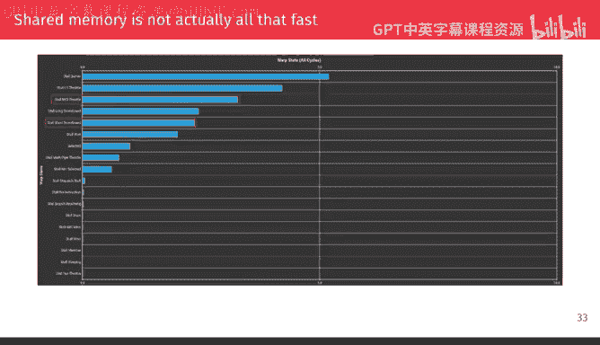

Yes， so。Now， to do further optimizations， basically。It's still the same story。 We want to work on。

 on our data。 But now we are kind of like。We still have any question from just just popped in from Alex。

 is Mayo about GMM to shared memory or shared memory to register bottlenecks？

Myio is shared memoryator to registers long scoreboard or LG photo is registers to。Global memory。

 And I'm actually not sure what like。Well， I guess the like async loads then don't actually generate war stores because by definition they're async。

 So you will just stall by waitinging on the explicit barrier that you have。

 so those wouldn't have anything different， I guess。Okay， I'm seeing a lot more discussion on this。

 So so Dononggyan is saying， couldn't shared memory conflict also have caused my significant mayo throttle。

Yes， because shared memory conflict means that the shared memory needs more cycles to fulfill your requests。

 which means that the queue of outstanding requests gets cleared more slowly。

 so any new incoming requests have to wait， right？嗯。I also see a bunch of comments from Vikram。

 maybe let me just invite them that help make things easier could give me a second。

I hope I haven't said anything that's too far from the truth。Let's， let's stay the slide。Yeah。

 but basically the next part of the。Talk will then be something that maybe is no longer just standard PMPP techniques。

 so this is actually a very good point to have this discussion， maybe。All right。

 well if Vi comes is joining， maybe we can keep going。 I don't know how long he'll he'll take。Okay。

 so basically， what we have right now is that this load matrix sink does this。

And unspecified mapping of memory locations to register every time we load in this inner inner loop when we read from shared memory and of course。

This could be cleared memory and conflicts。 It's also simply maybe that these things aren't nicely lectureized。

 So the the question is， kind of can we avoid having to。

To redo this like memory location to register mapping every time and this seems like it might be not possible because the like the warning I read out earlier。

 like the mapping of matrix elements into Fmont interal is unspecified and subject to change future architectures like that basically says like。

Well， you have to do the snapping and you can't assume anything about the snapping if you're using the like high of superclasst API。

But I'm now making this very bold assumption that the layout does not change while you're running your program。

 Like otherwise， I think nothing could work。 So I think that's a very fair assumption。

 And that basically means like what we can do is use this load matrix sync。To嗯。

Get them from from memory out to register at once and then just have some operation that。

Maps registers to memory in a linear way that you can then easily load from again。

 So basically these two helper functions that maybe would be useful to have in the MM interface。

 which was really just。Yeah， taking the like F dot x dot x is just the internal memory of the fragment of the current thread and we adjust and that's 30。

64 bits like an inch2 and we are adjust verbatim like taking whatever is in these bits for this thread and storing it in a linear location and memory and we don't care which matrix element that maps to we just do a blind copy of this and then for loading again we just restore exactly the location where we store to to the fragment x like in the register mapping again without having to know the correspondence to matrix elements and since these two functions are the inverse from each other we can use the MMA load direct function they' have defined here to load data from shared memory where we have guaranteed linear memory access pattern which can be faster than whatever。

The MMA load function， MA loads inless。All right， yeah。

 we actually got to ask some you know correct some stuff we come Hey sorry about I was in the chat and I was trying to talk over there sorry about that So there was a question regarding MiO and scoreboard and also there was a question regarding where can I find this information。

 what I did was I just did perplex search and I got the information from the links to。

 So for some reason I cannot share the location where this is in the chat because it's not allowing me to send a message here So I need to figure that up But here is the thing MIO is a primarilyly responsive for memory related task Eric。

 you are right over there things like load story unit address translation units or the divergence manager or any of those they fall under the MIO category。

😊，Scoreboard is mainly to handle hazards in the typical classical board in the CPU side you had the read of read read of write write of read kind of hazards that you had to manage。

 so those comes under the category of scoreboard on how to determine whether there are instruction hazards that can actually happen or not。

😊，Okay， thanks and feel free to jump in at any time when I'm presenting these NCU graphs if you have something to contribute。

 I think as I don't know， interesting stuff going on maybe。Okay。

 so basically like this is our way of cheating around this constraint that we' are not allowed to know what's inside and might experiment。

 we just do our blank copy without ever looking at the mapping of registers to thread indices。诶。And。

Basically， then the。Only change we have to do is we when we are writing to shared memory。

 we do these load sync that does the register mapping and but then we use the store direct to write to shared memory。

And then inside。Oh， I guess the highlighted line should be on below inside the main loop。

 we now use these MLA load directs and by the code we've written here。

 those are now guaranteed to at least use like twice vectorized load instructions instead of loading just whatever MLA load direct thats using as screen energy。

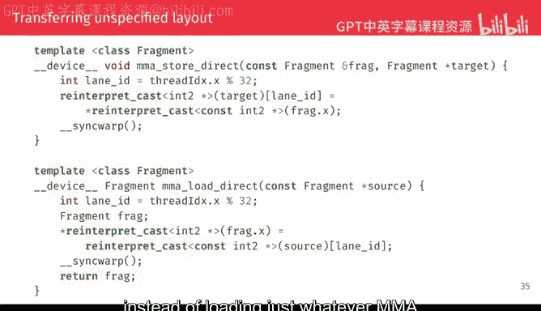

And。Now， if we look at this rationalrap now， this is where things get a bit more interesting because we have like these some things going up。

 some things going down so。One thing we can see is like we havet actually on a high level。

 the code hasn't changed in the way it's using explicitly managed scratch memory。

 but for some reason all these register bills go away。

 which I think is simply because we have this much nice addressing scheme so the compiler doesn't need as many scratch registers to calculate addressing information and we now go back to reasonable amount of writing to L2 cache。

We also interestingly get this 100% increase in。Reading instructions。

Which if you remember from the earlier version， we were doing this verbatim copy from global memory to shared memory using these vectorized instructions。

 And now we are using this。Unspecified size type read MM A load sync instruction。

 which isn't as vectorized as our initial as our copy code was。

 so that's when we get more instructions here。But now， if we look at the actual。

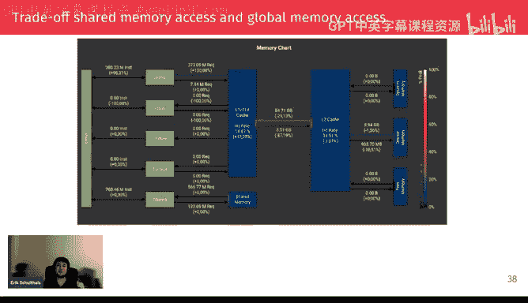

Timings we get。We see that this LG throttle basically goes away almost completely like we no longer have the situation where we want to submit an node instruction CA。

 we also see that the myo throttle and short scorewardt is reduced drastically。

 but we pay for this by having more non scorewardt。Stalls now。 but I think， again。

Part of this is also because we have fewer instructions necessary to calculate addresses so the denominator might have changed。

 but one thing is that we are no longer in this regime where we can get like massive speeds or simple changes So in this case this optimization is only at a like 7% speed that but no longer get2 x that we could get with these early。

Early optimizations。 Yeah， I think the L G throttle the might just be the register spinning。

 like that would have cost lots and lots of。Load global instructions to be or I guess load local in this case。

 instructions to be generated that now have vanished。

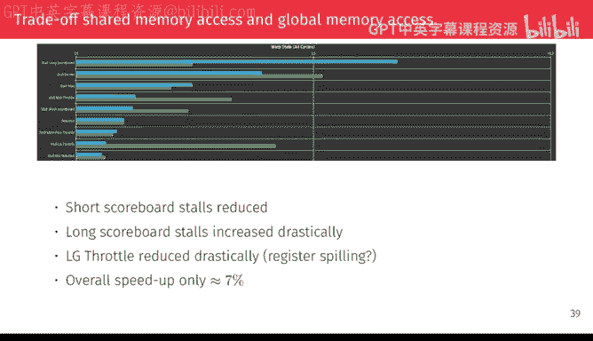

嗯。But that's not the end of the preprocessing kind of like preshuffling that we can do because similar to transpose and this shuffling also is just something that reads the matrix once and writes it once。

 So it's an o in squared operation。 So instead of doing this every time we write the matrix to shared memory。

 you could also do this in a separate kernel that we run in front of our main matrix modification kernel when we just make a copy of the matrices that is in this。

Liinally addressable memory format。 and this would be the example for。Handling matrix A。

 but a matrix B would be kind of the same thing， so it's really just this load syncc store direct that we had in the Sha memory part now moved to a separate kernel。

And then the actual gem kernel gets even even simpler because now we can also use the MMA load direct when we are loading and writing to shared memory and first half of the main group and the inner part of the loop actually doesn't change at all because we haven't changed the way our data is laid out in shared memory。

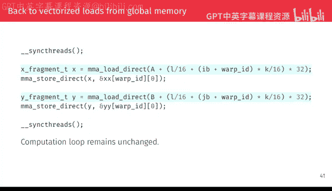

And now with this optimization， we are back to the old value of the number of requests from global memory and。

Nicely的呃。诶。Transfer between caches and between cash and memory memory also decreases。

 So from a memory perspective， this was very much a win。 if we look at the。

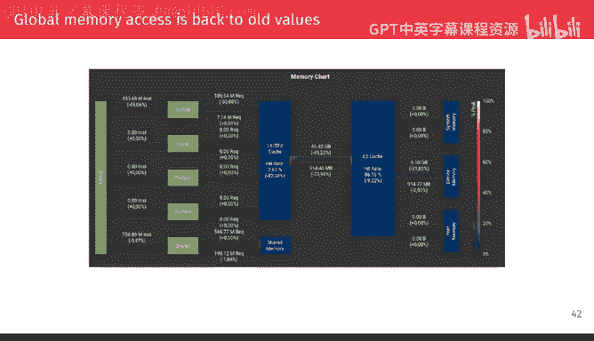

Wp stars， I guess it's a bit more unclear whether this really helps。

 but the L G throttle was reduced even further。 I'm not completely sure why shorts goboard goes down here like。

This seems more， more like a very noisy。嗯。Very noisy indication， so。Yeah。

 I can't give a precise interpretation for all of these changes here。

 but then if we look at the instruction statistics。

 we see that we've reduced the number of instructions by 20% like I add again like address calculations go down I add address calculation some shift。

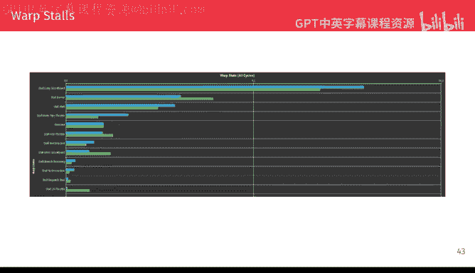

嗯。So I think the the main speed up probably comes from the reduced amount of address calculation necessary in the。

The inner kernel and one thing also that I maybe should mention is in this definition of this helper function。

 which was more like an accident when I first wrote it because all the Nvidia functions explicitlyly say like theyre more synchronous。

 I put the sync war in the end。 I don't think it's needed for correctness。

 it causes the compiler to emit these weirdn instructions that you can see。

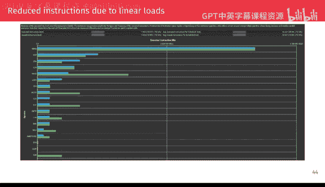

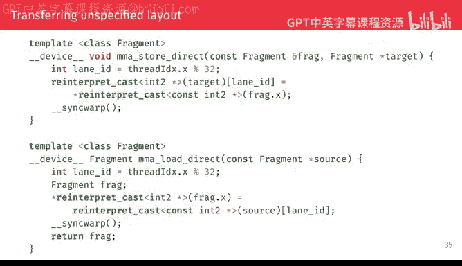

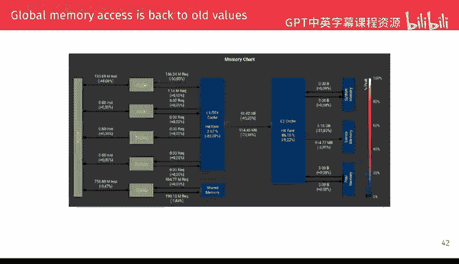

Showing up here quite often。 But then I tried removing that。 And in many cases， actually。

 the performance reviews that I think that might have just been because。

The SncOp acts also as a barrier for the compiler to reorganize some of the loads and it might want to move loads later in the instruction to save registers if you don't have that there and by forcing it to load early。

 you remove the amount of scoreboard stalls that you get。

 but I'm not completely sure about the exact effect this says。Yeah。Okay， and now maybe。

For closing this talk， like let's look at again where are we in terms of like speed of light analysis。

 which is basically。In this case， like speed of light would be using 100% of the tensor course and we're actually pretty far wasted like this is more like 40% utilizationization of tensor course in terms of timing。

 though we've made quite a lot of progress so we are at 178 milliseconds now plus the 1 milliseconds for preprocessing and we can also see like we got five additional milliseconds for this reordering of data but we got more savings for making the kernel faster so this additional pre citizen kernel citizen net wind in terms of timing。

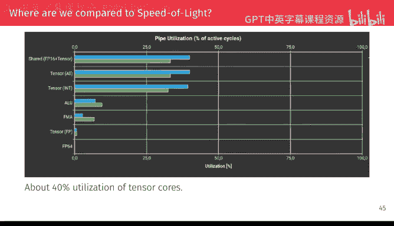

And both because I guess this talk was already an hour and also because I simply didn't have time to prepare more slides。

 the further optimizations are in the outlook slide now。

 so what we would be doing next would be double buffering to reduce these long scoreboard stalls。

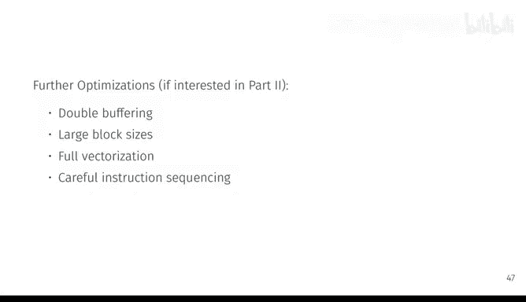

At this point， then we can start looking at larger block sizes because we are no longer that strongly suffering from the S threads synchronization。

Then you could also increase the amount of factorization because we had been using these in the two instructions that you could go to it for and in the end the last version would be something like carefully trying to really organize the instructions to like manually hide whatever。

Latencies you can see if you look at the access view and NC where it tells you exactly at which instruction which stalls were happening and if you're interested I can make a part two at some point that kind of continues from there but at this point maybe my main request you try it out like it's very new this exercise so there might still be some bugs or problems I would be very happy to hear if you encounter these or also if you get stuck trying to solve this just shoot me a message on GPU mode and also feel free to try the like ABX 512 ABxB and type versions of this exercise。

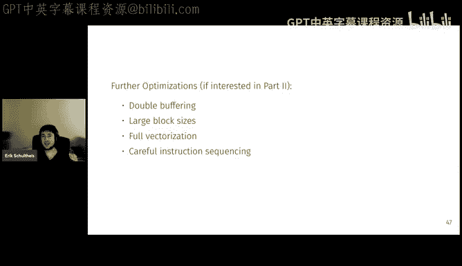

Yes， and that's specifically my talk for today。So if you have any more questions。

 I'm happy to discuss custom more。Excellent， yeah， thank you， Eric。

 I think I'm already seeing people are people want the part too。 I certainly want one。So Eric。

 Alex is asking， will you be sharing code for the prior examples and further optimizations。

 would be super helpful， especially for some of the last slides。

I don't want to share complete codes because I think the main learning effect comes by trying to do that yourself like I can share the slides with these like half baked code examples where maybe you need to figure out some of the indexing yourself too。

 but I don't want to share like something that you can just copy and paste in the exercise like I think that kind of goes against the spirit of the exercises。

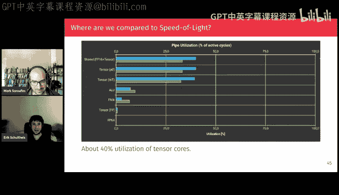

嗯。

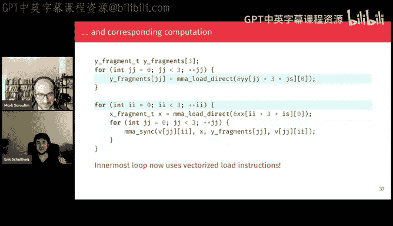

Yeah。All right， excellent， so if folks have any other questions， Eric。

 you know where to find them on Discord， I will say that like today Eric discussed a lot of like different like details and profiling。

So next week is going to be interesting because on Friday at the regular time we have like the NviDdia chief like profiler architect who's going to come give us a talk so if you're like who why is this called MIO or why is this called this scoreboard。

 this is the person to complain to and then on Saturday of that very same week next week。

 we're going to have Prinjalo who's going to be giving a very similar talk but applying it to H100s。

 so it's going to be very much a sort of similar in if you enjoyed this talk like I you'll enjoy the two talks that come next week。

So yeah Eric thank you so much this was great but by the I got an early preview of the course that Eric's pitching it's extremely instructive like there's sort of a lot of problems very profiling heavy I don't quite know of like a Quda course that's quite like it so if you're interested in having problems that you can work on throughout the week highly highly recommended。

😊，And yeah， with that， we'll see everyone next week， thank you folks。強。All right， Eric。

 just stay for one second， I'll just make sure the upload works。

