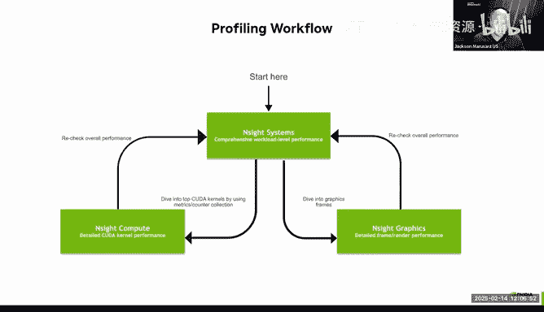
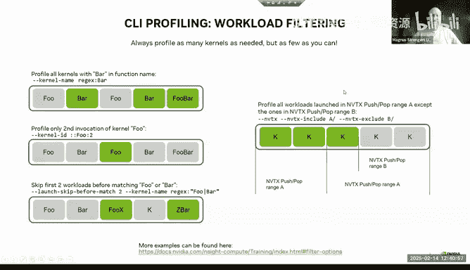
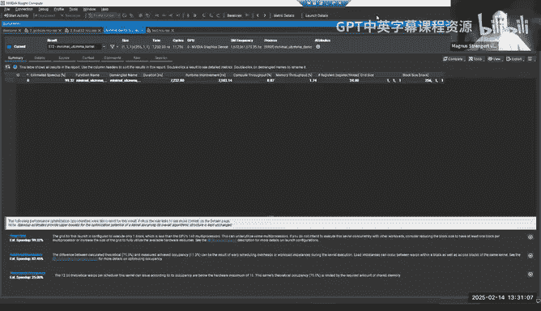
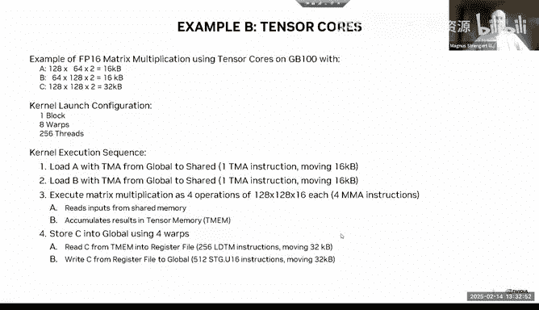
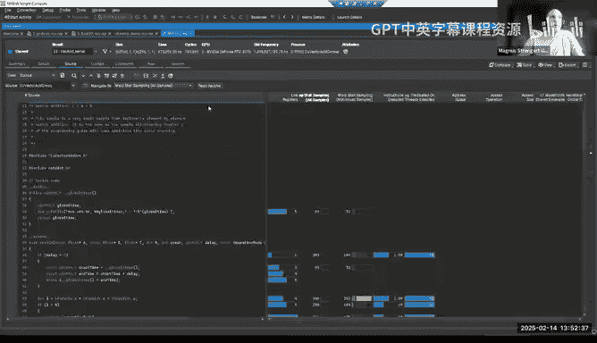

# GPU MODE《CUDA、GPU编程1-53课｜GPU MODE》中英字幕（deepseek-v3.2 - P47：-20250216-Lecture 44_ NVIDIA Profiling.zh_en - GPT中英字幕课程资源 - BV1QZ421N7pT

All right， I think we're at 50 people， it might be a good time to start。

So welcome everyone welcome to another episode of the GPU mode this is a talk I've been personally very excited about like one of the sort of recurring complaints on the server has been。

You know like what are sort of like important metrics for me to look at in profiling how do I go about optimizing my kernels and so like I want to give a big thank you to Vikram for inviting like both Magnus and Jackson from the Nvidia profiling team so Jackson is like the main PM for this project so basically any feature requests you want anything you don't like you know this is like the person to go complain to and we were just chatting before the recording started that Magnus was saying he's been working on profiling tools for about 15 years。

And I would say like throughout this time like like not a lot of sort of like dark knowledge of profiling is like very well available online so you basically have the guy here so but before we get started like Magnus basically gave us a heads up as to what the format of his talk is going to be like he has maybe about 15 minutes worth of slides。

😊，And the rest is going to be going over profiling cases and so really you know you can very much view this as like you're looking over the shoulder of a senior engineer on the team and kind of like pay attention to what they pay attention to so please be interactive like ask as many questions as you want and chat if you'd like to raise your hand like Vikram and I will be sort of monitoring the chat but please yeah like this is your chance to ask all the questions you need so yeah without further ado I'll hand it off to Jackson。

Hey， terrific thank you Yeah so I'm Jackson Marusarrs。

 I'm the technical product manager for our KudDa developer tools and Magnus is here as sort of the lead for Insight compute I'm just going to give a really quick overview of the things my team works on to set the stage and then Magnus is going to do a lot of the deep dive into kernel profiling。

Just so that everyone kind of understands what we're talking about。

 these are all the developer tools coming out of the team I'm on。

 we have our debugggers for GPU accelerated codes， coutta GB from the command line and debugging integrated into IDEs as well we have profilers Ensight systems is the high-level platform profiling tool to look at CPUU GPU memory。

 some networking things as well I'll give a really quick spiel on that one but Ensight compute is the one we're going to spend most of the time on today this is our low-level kernel profiler to show you exactly how that kernel is executing on the GPU hardware and how it's stepping through various assembly instructions and how that's interacting with the GPU performance Cti is a library we have to add profiling to your own codes and NVTX is some annotations to get a little bit more detailed performance data if you want to annotate your code。

Compute sanitizer is an automatic correctness checker for GPU applications。

 This is the type of tool that's going to run automatically on your application。

 do a bunch of analysis and then kick back correctness results for issues like memory leaks。

 you know threading issues， all that sort of stuff and then obviously IDdeE integrations。

 we're seeing a lot of people moving to visual studio code。 we have integration and Studio code。

 Vi Studio， obviously as well and Enight Eclipse edition。

 but that one doesn't see as much use these days。 if there's an IDdeE that you're using that you think is not well supported for GPU computing。

 please let us know because we're always looking to meet developers where they are。

So really quickly what the profiling workflow kind of looks like， oh hey， Trixson。

 sorry to interrupt you like， I don't think you share this slide yet or that is that correct。

 maybe you is that right？So I don't my we see we can see magnus Okay okay so you guys see the the four quadrants here on the screen awesome all right and then yeah we'll double check you Magnus when you share just to make sure so those are kind of the types of tools we're talking about if you haven't seen any of these definitely go check them out they all have their place in the GPU development cycle and we hope that they all can help you out。

Sort of the profiling workflow we espouse at NviIDdia is starting with Ensight systems。

 This is going to give you that high level overview of your platform know when data is moving back and forth is the CPU idle is the GPU idle what's going on on the GPU and then once you identify that you want to really dig into the GPU kernels that are running。

 that's when you'll look at Insight compute you'll dive deep into those GPU kernels。

 find out exactly how they're running on the hardware optimize them and the process sort of continues if you're doing graphics。

 which isn't really this audience， I don't think we have Insight graphics for you know direct decks。

 OpenGL， all those sort of things Vulcan but we're really focused on Insight compute and the left side today。

And then just a couple of slides on Insight systems before we dig into Insight compute。

 this is going to be a timelinebased tool so it's giving you you know sort of a overview of all the correlated performance data as your application runs so you can see things like all the processes and threads that were running the states they were in a lot of libraries have built in tracing so you can see the various APIs as they're called you can see memory transfers between the CPU and the GPU it supports multiGU profiling as well。

 but it doesn't dig deep into the specific kernels on the GPU that's what Insight compute is for however there are some GPU metrics built into Insight systems so the metrics that you'll see in Insight systems are sort of device wide they're not specifically tagged to PCs or PC samples or anything like that but with these metrics you can see things like whether your GPU is full whether you have a good instruction issue rate。

Whether the tensor cores are active， some things like work occupancy， PCIE metrics， NV link metrics。

 and you'll see similar metrics in Insight compute plus a lot more and the metrics and Insight compute are going to be correlated a lot more closely with the specific kernels you're running。

 So I just wanted to let everyone know that Insight systems is out there。

 You should definitely try it out and it does have some GPU performance metrics but they are single pass you run the application you know pretty much in close to real time and get this performance data and look at it afterwards whereas Ensight compute is doing something much more complicated。

 I guess it's doing something much more detailed to profile the kernels and Magnus will be telling you more about that。

 So that was just a really quick introduction to the tools we have。

 I did want to mention Ensight systems but now Magnus is going to spend most of the time talking about detailed kernel analysis with Ensight compute So go ahead and take it away Magnus。

Awesome， thank you Jackson， one second， I have a question from Donggue。

 let me see if I can unmute him。Oh， I can't unmute directly。Okay。就。hello，杨页。Asome。

 so on the previous slide on the trace itself， I was wondering。Iish I could pop that up once more。

It' would be great。

Yeah， give me just a second。Let me see Sha。This one here。No。

 I think the one after it on the sixth slide。 Okay， awesome。 So on under a GP PU active。

 you show two graphs，1 is colored and blue， and the other is really shadowed。 I was wondering。

 what's the implication between those two。😊，One is colored in blue and the other is shadowed Oh so you mean like these I guess yeah teal sort of things and the lighter numbers above them like it that's a good question Holly are you here do you know how the pixel shading works for what these represent it's all sort of go ahead right what you're looking at right there is a summary line of all of the activity of all of the activity across the GPUs and then underneath a sort of the breakdown So you've got the GPU active sections a sync copy engine active all the different things are broken out here and then these are summed So when you flatten this you just see the summation over what's going on。

So I guess the question is you see there's like a teal here and then there's like a light gray and then a darker gray above it。

 I guess if we had the。I'll be honest I don't like the dark mode on these so when you see that going on in these's what it's actually showing is that there are points within this pixel that in fact made it up to the top of that gray line the average is where you're seeing it highlighted to but if you were to scroll in somewhere in there it would actually hit that so you're seeing the maximumim at the top of the gray and the average as the colored sorry I misunderstood the question no worries so it's really just a pixel density sort of resolution and this is just a screenshot so you can't zoom in to see that it's a level of detail mechanism because it's sometimes quite difficult to see on a zoomed out you where your peaks are know if they are very short in a temporal effect and you zoom out far then it's easy to miss those and with this kind of level of detail that Pol just described it's like you get the average as color but you get a hint of the maximum be。

You in the zoom area are pixel that way you can find outliers quicker。

 even though you don't see them in the average data of the timeline。Awesome， thank you so much。 Yeah。

 Sure thing。 maybe I'll and I'll keep sharing go ahead。 Yeah， So we're here， Like。

 I'm sort of curious about the abbreviations。 So like what's， what's V are， what's R X。

 What's T X and what's bar 1。😊，For send and receive so the transmission and receive is basically RxPX is the direction in which your traffic kind of flows and then the bar mapping or kind of bar one that you mentioned is like the the。

The destination of where you write data in in this case。

 that's a shared area where the devices can pair data between different PCI devices。

And then what about GR， the it's below GPU actually Oh this is the graphic engine。Oh。

 I see graphic underneath I see， I can't got it。you but I don't know exactly where the screenshot comes from。

 but imagine like you could see like overall GP activity and then you see like copies in the different rows and then the actual kind of graphic engine enabled and then in a different area of this you would then see like which process was enabled or currently using that engine and you could see if you have different process between between you know maybe a compute process and a graphic process。

 for example， and then you would see that context which in the timeline。Great， any other questions？

Or I pass it over。Terrific， alright， thanks a lot。 Take it away， Magnus。嗯是嗯。嗯。

I hope you can see my slides now， and then。

Yeah， I start with a few slides and then we jump directly into the tool I start with what is inside compute and yeah as Strxson mentioned this is our prime Ka workflow profiling tool so think of this already as the secondary tool as Strxson mentioned we see this in a workflow where you first start in inside systems highlevel overview you get system information。

 see even if the GPU is potentially on your critical path or which kernel takes lower takes more time is a slower if you expected。

 and then you jump into inside compute and directly kind of get as much information as you can for this one kernel spend some time in inside compute to optimize this kernel and then after this you might want to go back and see that you can go back to inside systems to see like what the improved kernel performance does through your overall performance that can shifting things around or now your memory。

copies don't overlap anymore with your compute or a different kernel is now on the critical path and then you would continue with that an inside compute but inside compute for that purpose kind of focuses very clearly on collecting data for very short periods of time one kernel or small range of kernels and we try to get as much information as we can do and we will see what information is available the screen put on the right so like root lines we have detailed memory chart but this goes down to metric information on individual source lines that you have written or the assembly lines that the GPU actually execute so very detailed there we do have the same kind of sampling information that we just discussed on inside systems also in inside compute you can change frequencies sometimes you can have higher frequencies and inside compute if you have a kernel that or if you make a large perhaps an inside systems you might need to reduce the sampling frequencies there and then we have a rule system。

that we looked into like guided analysis since there's so much information and as the introduction management profiling is kind of a little bit of an art form or you get better at is as you go or learn it。

 we have a system that kind of automatically looks at the report that we captured the database of metrics basically and then tries to find a hints in there that you can get directly kind of feedback for hey。

 this is maybe something you want to look at， and this is how much time you could achieve if you solve this problem。

The jump forward， I say already， it's a little， me Steve if I can move this away。

Yeah more what we do basically in terms of how the tools work it's similar to other tools that you might use on a regular basis。

 but it basically a launcher a single of bit similar than kind of vgriend or many other tools instead of launching your application by its own you just launch your application through the tool you just write basically NCU and then whatever follows is your application and all the target arguments that your application page and then we intercept basically everything that your application does and in how your application interacts with the coa driver so that's where we are sitting with the tool I mentioned you don't have to modify your application at all for this to work since we kind of sit in between your application and the driver we automatically know everything you do with the coa driver but there are a few optional things you can do to your application one。

Mention it briefly is NVTX instrumentation if you never heard of it I have to GiHublink there it's a library that helps annotate your own code and then you find these annotations in our own tools so for example an inside systems you would see ranges on the timeline in inside compute you can use this to filter with kernel you want to profile and say only profiler kernel that is in a specific NVTX brain the second thing to mention is if you want to have metrics on source line regularnularity or have the ability to map basically metrics to your own source code then in NVCC there's a dash line table flag if you use this it doesn't change any kind of optimizations you can still fully optimize your code or run with like D03 the only thing the line table flag does is that the compiler writes a mapping table from your highlevel code to the lowlevel assembly code and we use that mapping table then to map metrics to your highlel code。

In the HPC compiler， this is already enabled by default。

 So there you don't have to add any specific parameter for other languages。

 like if you do a lot of Python development in Nmba， for example， in the grid parameters。

 there's author aligned table equals toolbl that you can use there。And mags， sorry， ahead。Yes。

 so I just see like a few questions and chat that all very interesting so it's going to speed around through them I think both Eric are saying both Eric and Jake are saying that like it seems like there's a typo it it should be probably line info and line Oh yeah table line info that is correct and then theres another question by bi and I'll extend it which is like well interception slow down and latency and generally I'd like to ask you sort of how you thought about tradeoffs of like sampling based profile versus other approaches and why you settled on this design yeah so there is an overhead if we in basically are between your application in your driver specifically for our tool that is。

Heres primarily for the performance of executing a kernel on the GPU the overhead of having a host interception is still a concern。

 I wouldn't say we still optimize this and we want to have the least amount of overhead but imagine for your kernel execution we can do things and I explained that in the next slide a little bit better。

 we do things on the host side to this to collect the data but we try to not influence at all the performance when the kernel runs on the GPU so that way you know theres a good balance of like the actual kind of window where we collect data is not impacted but for deprofiling like I show in this tool is like your performance of the application itself while for inside systems you want absolutely no overhead because you want basically the original behavior of the application in inside compute since we focus on one kernel we are saying like okay if the。

Performance outside of that one kernel is impacted that is more acceptable there than it is in inside systems I hope that that explains interesting I'm sorry of to clarify on this like if a program is CPU bound。

Then profiling will like basically the results are more likely to like cause overhead essentially not to be bound that that is correct。

 but I would also say if you are a CPU bound。An inside system shows you that already you might not want to jump directly in inside compute because then your problem is basically somewhere else already。

 it is really meant for you have a kernel and your problem currently is optimizing that one。

Okay we have more questions so theres a popular one G and Li's asking how does the source correlation work but like other programming languages like such as F yeah it does work for other languages I mentioned in Python already forran works for other languages that have front end compilers some of them generate the necessary line table or line info information for that and then they show up automatically in the tools so the question is really like the section available that mapping section in the actual Kubbin or not and we work with a lot of the people that build frontend compilers for those languages to make sure there is an option for this。

😊，Okay I think I see the last question maybe for now which is Aviraj Beverley is asking and basically if you profile multiple runs of a kudutter kernel using insidesight compute how is insidesight compute report the statistics over multiple runs of a Quda kernel I guess like let me clarify this question because I was also interested in this like I think Eric shell size was sort of speculating that like NCU runs a kernel 40 times to like basically get more reliable measurements and you know typically and like let's say if you're profiling Pythr code like we're quite used to running things in four loops to like avoid noise and I'm sort of curious if you could share more detail around what's going on I think it's a good segue in the next slide too because the 40 passes that were mentioned in the chat too is like has actually a different purpose but I explain it in a second I think I can move on in the slide and then the profiling collection so there is an issue basically that we have to solve is that the。

mount of data you can observe while running the GPU basically is very limited you know it's like think of it like the amount of profiling information you can stream out without using too many of the existing resources on the GPU is limited we share the memory bandwidth for example and the more we stream out for profiling information that would also kind of have an impact on the actual execution of the kernels so the amount of data we can stream out and the amount of extra hardware this is on the GPU to observe these metrics that we collect is limited and therefore you cannot collect what we call like one report or an arbitrary number of metrics in a single path that's why inside systems for example has a limited amount of metrics that we are able to collect in that one path that we have for that application now people already mentioned we replaypay that kernel。

A few times and the reason for that is not necessarily only to make them more stable。

 we replay them so that we can collect different data in every path so let's say you ask our tool to collect100 metrics and we find out that would take 20 passes then transparently under the hood when your application launchs one kernel we do that sequence that you see at the bottom of the slide that guarantees that we can replay this kernel and get every time we profile consistent data like your kernel should run basically every time as close as possible as we can make it and every time we run it we then collect different profile data and in the end we present the concise data of all these passes you can collect metrics on multiple passes to make them more consistent or you can oversample basically passes but initially it's really for the system exists so that we can collect a lot more information and a lot more data。

And if we look at kind of the states that we have to go through is the first thing we have to do is we save off kind of the current state of the GPU。

 think of it like accessible device memory is saved off in a background buffer because if we would just run the kernel 10 times that doesn't really kind of guarantee that every path that we would do operates on the same input data and that can have a significant difference in executing performance。

 therefore we save off basically accessible state， we optionally the GPU clocks so that they don't differ between the passes。

 you can turn this off if you don't like that， we have options to clear the caches so that you have a consistent state at the beginning。

And then we would start the data collection or configure the data collection。

 we launched the kernel one， we collect the data or wait for the kernel to finish， collect the data。

 restore the contact state that would be like if you have written an output buffer we would restore this to the state before the kernel and then we loop this and we call this one replay path I currently for simplicity say in the window of observation。

 there's one kernel and that is what we typically do。

But there are also cases where we call that range replay where you want to have multiple kernels in that window of observation。

 same pipeline that I described there with the only difference instead of that one box that is one kernel。

 you could have multiple kernels in there and you'll get one result then for that whole range that would be kind of useful if you want to have the second kernel is primed by the first kernel and therefore you don't want to clear the caches then you could make a range around it and still profile the second kernel with the state of kind of the caches that you had after executing the first kernel or where it's really helpful if you have effect like where you have multiple kernels running concurrently。

 it's still valid to profile and kernel in isolation and often that help too。

 but like sometimes you want to really optimize two kernels running concurrently and for that we have a range profiling。

The whole process is。transransparent to the application that happens under the hood and then after this whole process。

 the application continues basically unchanged or for the purpose of the application。

 the state of the output buffers after that kernel replay is exactly the same like you would have executed the kernel only once。

Micha I have a lot of questions actually yeah that's okay with you so let me start running through them so so the first one is like when you mentioned this like context state saving like this again this context is being saved on the on the on the CPU right？

😊，The context is safe， like we look at all allocated memory that the kernel can access and then we make a shadow copy of that that depends where that ends up the saved buffer is highly dependent on where you have memory left in best case if the buffer is or if that memory object is located on the GPU and there's still memory left on the GPU we would like to make a device device copy that's the fastest。

 but if there's nothing left on the GPU which often happens then we would transfer that buffer back to back to system memory and in absolute worst case there is an option to even save it on disk if your system is really like at the capacity obviously that comes with a huge penalty of performance。

 so that is basically what we do there in that context state and in the restore there is clever mechanism。

 we don't have to restore everything every time so basically after the first pass。

We quickly di basically what we have saved with what happens after the kernel and from there and we only re sections that of that memory like basically blocks of memory that really have changed so that we don't have to upload gigabytes of memory every time if that's just your input data set that's constant anyway then we would skip that we also skip memory objects that are already read only if you use the coM map APIs you can set like flexs where some memory might be only be accessed by read operations then we don't have to re them either so the application itself can help itself by making it more efficient if you use some of those minus if I'm not wrong the size of the buffer is also controlable in the command line all right so we can define and how much we want to store in the GPU memory。

Yes， you can kind of force this in different locations for that context they save。

 it's mostly dependent on how much memory the application has allocate at that time。

 but the buffers you mentioned are also controllable for example。

 for the when we do PM sampling like this data collection of metrics。

 the size of the buffer we allocate for that is also controllable by by the command line for that。

So there's another question and chat by Jg I will like rephrase the question which is that like what is the tradeoff if you just had a single replay pass like just say I want to yeah then yeah if you collect only one metric you know in that metric happens to be a single path metric then we don't have to do any of this then it's a single path you collect the data you have it in a second which jump to the live demo you will see that we have like hundreds of metrics in that report to give you that level of detail that we think it's necessary sometimes to understand certain problem cases and they can simply not be collected in one path's too much information we cannot stream out that month and the replay allows us to basically give you nearly infinite amount of metrics if you ask for it but you pay for it with a number of replay passes and with the overhead of collecting it。

I see so you're really bottlenecked by like read rates essentially from the lowlel counters and then that's why you must use multiple path Yes I mean one could thing of you know it's like putting just more hardware resources on the GPU to say like hey then I couldn't collect double the amount of metrics in a path but the problem is it's that great off of how much of these resources do you put in for profiling versus one more SM to do compute and then you get different answers for for every person and there is a balance basically on that for how much observability do you have when you profile versus how many compute resources do you have that's the limited resource I would say that's area and that bandwidth of writing out the data。

All right， last question oh sorry， someone else was talking。Yeah。

 I just wanted to ask like on the CPU if you run out of performance counters。

 you usually can use stuff like multiplex so that you still do just a single run。

 but it switches out the counts it looks at like in a very very high frequency so that you get some sort of like average which still makes sense if youre run a somewhat uniform can you do the same thing on a GPU or do you really have to。

yeah in theory that's possible for the metrics where we calculate like aggregates over the whole duration of the kernel there it doesn't really work this way because you have to have the static configuration and then you collect that metric like imagine you are interested in like number of executed instruction for the total of the kernel if you would multiplect that then you would lose kind of the total would not come out correct if you do what we showed earlier in the screenshot in insides systems in theory you could say for a while I collect the data and then I switch to a different configuration and collect something else and then you know that looks multiplex over time that would work but like these aggregate metrics are the ones where this multiplex thing doesn't work and then we basically serialize the collection and that's where those replay。

Thanks。So I think I see one two more questions or I think we're just gonna keep going with questions so I noticed it here like you have the step which is like clear caches and at least like within a sort of pythlash tridentphere there's like a very popular profiling function called do benchch which basically clears your L2 cache and then uses scooa events to sort of measure but like I'm sort of curious here you have caches as plural and so like is it like that we can't clear L1 caches or like should we but we're not doing a sort of curious if you could comment more Yes when I say caches we really try to clear all the caches we have on the GPU that includes L2 L1 the constant caches。

 everything we have ining cache the reason why we think that option is good for the profiler is if every path would start at a different condition the metrics that you would see in the report wouldn't be very consistent in itself let's imagine like you know you would clear the cache in the first path。

You wouldn't clear it in the second pass， then you get a completely different hit rate at the beginning of the kernel across these passes。

 which would sometimes。And of course I also saw a question of like an example of like a metric that you cannot collect in one pass imagine you would be limited by collecting certain things this is no longer true in our current hardware but imagine you could only collect from a cache the hits in one pass and the misses in the other you know now it's very important that if you have this as a twopa metric for your hit rate that you actually observe the same thing in every pass because otherwise you would get effects where you would say the hit rate suddenly is above 100% because the two passes were not consistent that's why we think like in the default case。

 we clear the caches if you want to skip this， there is an option to set this and if you do only a single password of observation if you only collect a few metrics。

 then you might want to skip it to get the effect of like how was my kernel at the time in the application how were the cache is primeed basically at the time。

 but if you do，Multi path collection， then we typically say like to get the most accurate data， yeah。

 this is helpful for the quality of the data。Okay， we have like an interesting set of questions。

 someone asked a question in Latinqui Catos， which is basically like who profiles the profiler and I think there's sort of like a few sort of related questions here which is that like how do you know for sure that like the profiler has low overhead。

😊，And how do you sort of avoid， I guess maybe it's a more philosophical question like if it can sign the ruler。

 which is like you're measuring using the table to measure the ruler as opposed to the ruler measuring the table so curious I you think about all these things yeah again in inside compute I would take this specifically as like we therefore not impacting the kernel execution obviously if we replay your kernel 40 times and your kernel is a minute long suddenly take 40 minutes to get this report so so wall clock time is different from saying like is the data we collected than for this report or have high quality and is that through。

the execution that you had when no tool was attached so for us kind of we would look at is the data or the metrics that we report in the tool do they make sense do they fit to our understanding of the hardware are they fitting to expectations of like for example comparing some of these with data we would see from theM layer where we can say like okay this is some correct we verify these metrics this way and say like hey we make sure that what you see with this metrics is basically adjusting we don't modify your kernel code in the normal run of these passes so therefore we know that we don't per cube kind of the performance of one of these passes too much the thing that we add as overhead is outside of that one lounge that is in the middle of that replay path。

I hope that makes sense and I hope that makes more sense yeah if if you can switch to to the I see the comment is like I wouldn't say trust in the performance counter trust in that we look in the performance counters and make sure that they are correct you know it's like there's a lot of effort going into verifying those working between hardware and software teams to make sure that what we show there is basically observing exactly the value that we claim we look at and then there's a lot of dedicated test written that these are coming outright and yeah micro benchmarkchs with the first one we look at is something super simple where you can get trust into yeah you know like if I do a certain operation and you see exactly what happens in the profiler and those two match up that is a good indication of like that it does what we what we are interested in。

嗯。And then yeah， so I think I move forward for a second。

 this is mostly a cheat sheet and this is for looking up later if you see this if you started yourself for preparation we have this line info that's the only difference that I would recommend if you compile then the selection of metrics that you have you can list the sets or sections and metrics and I explain that in the live demo what the difference between those are just a convenient way to you not have to write 100 metrics on the command line every time for that we give you kind of sections that would say like collect everything related to like the memory hierarchy and that's easier than you having to list like 50 metrics for memory and 50 metrics for the pipelines and sets is even higher on is basically a hierarchy where it says like a set is a section or a list of sections that collect the full report。

And then you just run this with N view output file。

 you select your set and you run it and then youll get a report and you can open the report in the UI so I think for that I jumping into the application also just for lookup reasons and for the link down here since we said we are interested in various specific kernels in your application there is the challenge of like how do you tell the system with kernel profile。

And we have a large list of possibilities to specify this so in inside systems there's also a right click and you can say profile this kernel with inside compute。

 if they are linked together then there's is an automatically for you or if they are not fully linked you can get at least the command line parameters that you could use for inside compute。

 here are just a few examples of like you can filter by re for the kernel name by instance number that you can say like only the second kernel or only certain kernels when they are executed the first time you can skip and then on the right side you see NVTX examples where you could say if there is these pop stack that NVTX can build up you can say only profile something when thes certain name is in the stack or on the top of the stack that helps a lot to kind of reduceuse how much you profile because if your kernel has like1 thousand kernels then you want to profile every that's not necessarily what's efficient because we typically say like you want to profile one and then go back to systems。

And move another one next。

Okay live demo I start with something simple， let me quickly switch into the tool to gain press in these counters the first thing we do is we take something super simple and look at that and then later I have some more interesting samples to look at for the very first thing I just want to throw you how this works this is kind of the tool let me close this again it typically starts with this welcome page you click on start activity to set up a profile。

You point to the application， as I said for the beginning we do a very simple vectored because then we know all the numbers and that kind of we can walk through the whole report and you can see that the numbers come out as expected and then as we move forward we make it more complex and then down here output file and then we simply go and you can set your filters in this case it's just a single single kernel so I click on launch and then you will see the application runs normally you will get an output if I can pause there in the right moment here you will see that this is output from the profiler we currently profile this one kernel and you will see in the output that we do like I think 47 passes for this right now and that creates this report。

If we would have collected multiple reports or multiple kernels we would get multiple entries in the summary table that you see here。

 we only collected one in the simple example and you see like a few metrics in here the rate and the throughput metrics of like how much percentage the utilization of the peak percentage for all compute resources utilization of peak percentage of all the memory throughput that is available on this card and we see already just from these numbers is like this is as expected memory bound and not computebound that's what we would expect you see how many registers produced and the grid and the product size from the launch dimension I guess I want to ask you something I was surprised to see that you're running on a 370 something that wasn't super clear I've asked the question many times I'm curious to ask you which is like what have you found are like important performance considerations when people are optimizing stuff for a consumer GPU versus an enterprise one because again。

AndThose get a lot more attention so there's sort of been any sort of simple things you know as people should be paying more attention Yeah for this one because I wanted to show basically how we capture through locally I have whatever had in my local machine here right now the other demos we have later are other so for the ten of course later we look at at a G100 like well hard in terms of the considerations I would say like in general the tool works the same way you see differences between those trips and between the architectures which metrics we can collect or how many passes it takes to collect that is' also something we optimize over time the larger trips or newer trips often allow us to collect more metrics in less amount of passes but the counterbalance for that is like they also have more features so then if you want to enable every we have started that keeps the number of passes basically in balance that we constantly work on improving observability。

And and coverage kind of of the new papers， otherwise， you know。

 like differences that you see between those the frequencies， number of Ss。

 all the things that are captured in the report that you would see。嗯。对呀。

At the bottom of this I want to highlight this and we look at this in the second example a little bit more this is what we call our rules output there the system already makes recommendations of saying like hey here I found something and maybe there is something that you want to look at these are links that then jump into the rest of the report to explain how we come to this conclusion and what you can do to kind of fix these this is a highleve view of kind of saying like what does the system detect with this kernel what's the issue with this kernel is there something that we can potentially fix and it guesses a speed up basically that would assume if you can completely solve this problem how much faster would it be which is in good indication of saying like is it worth for me to spend more time or not we have later other examples where these numbers get higher and then we show how we solve it and compare the data。

The other report pages so I go up here quickly through there are multiple report pages quickly following the session its simply saying like hey。

 what did I launch all the parameters you can rerun it basically with this command back here and as we said if you need any device attributes that Qa has for your device that you collected or multiple devices that your application is using you can look at all of them here。

 the device information are critical input for profiling often it is of interest to know you know your grid size in comparison to the number of Ss this machine has that can make a difference and therefore it's important to have this template in here there is a raw page that's basically just all metrics that we collected in this run so you can just basically look at all the individual values that we have that can be exported and later in a different way we have other ways for postprocessing to but that's one way you could get to all the data we collected theres a contact page which basically just said like where was this。

ade if there would be NBTX instrumentation you would see the state of NVTX at that time that could help when you look at that report in a week again and then you know what you actually profiled or where this what's in your code and then the other two are the main pages where we now spend a lot of time on details page and source page I start with the details page。

The idea of the details page is it's one overview of all the data we collected and it's ordered in what we call sectioning for the green lines separate individual sections。

 Every section has a name on the top a description and a table of the most important metric in that section。

And a section covers different portions of your kernel or different portions of the hardware you executed。

 so for example， the first section would be what we call our speed of light section。

 this is giving you the high level overview of utilization of the hardware in comparison to the peak performance。

 this specific hardware offers and if we look at this we would see like the first metric is like a compute asM groupput which would say for all bottleneck on the compute side。

 what is the highest bottleneck that we could find and this is at 12% of the peak performance and I go into that in a little bit more detail in a second the same for memory for all memory bandwidth and all links between all the caches the one that is the highest is at 93% and for memory we also split this out for like the different hierarchies L1 is at 16% L2-27 DM is at 93 that drives basically this percentage up here and already shows us without looking at。

Anything else to say like as expected， this vector doesn't benefit from L1 and L2 test we look at every data element exactly once。

 so this is the typical example of a DM limited kind of case。嗯。

The sections itself then have an expander where you can get more information about this so in this case this is a visual representation of these two first metrics where you say like okay。

 this is clear that this is memory bound but you can toggle between different views up here and you can see is like we could look at this in the same way that we would say like if you are more used to looking at this from a roof line perspective this is the roof line for this kernel if you are familiar with roof lines the X axis is the arithmetic intensity the y axis is the blockss per second that is achieved the diagonal line that you see in here is basically your limit in terms of memory and the two horizontal lines the lower one is the FP64 performance is the ceiling cannot go above this with FP64 instructions and this one is the FP32 feeling you cannot go above this and our kernel achieve point is over here It's right against the memory line which。

K of fits to our understanding of like this is the memory bound kernel if you want to get more slops out of this kernel you have to increase your arithmetic intensity so that this moves to the right so that you have a headroom to grow basically upwards so this is what this kind of part shows and you can kind of see this in a quick way then to say like okay I'm on the left of the rid point therefore I'm memory bound and I'm really completely memory bound because I'm against kind of ceiling or the roof there I mentioned already the bottlenecks for these metrics up here there is the bottleneck breakdown to。

These tables are basically the bottlenecks that we in the tool track for on the left side compute and for the right side memory。

 and you see that the topmost they are sorted by percentage of peak basically and these top percentages equal these numbers you see up here。

 so basically these two metrics are actually a breakdown of these metrics and you see the highest value if that makes sense。

The reason I show this is it's very useful to look at this because imagine you look at a problem where your highest percentage is at 90% and now it's interesting to know if I solve this what's my second highest bottleneck because if your second highest bottleneck is that 91% and you don't fix that in the same case then you go from being bottleneck at 83% at 93% to 91 that's not a huge win but if you see cases like here where you would say like hey we are limited by accessing DM to often and DM is basically busy all the time that's what led DM cycles mean we are active in DM reading stuff all the time and this is getting to 93% what's the next one and we are the next one would be moving data out of DM there we are only at 5 to 55% and you see all the other bottleneck that you have in there if you don't know all the names that are in there there are obviously a lot and I cannot list them all but you see if you hover over these the toolt kind of。

Uually explain every single kind of acronym you have in there gives you way more details on what these metric mean that is true for every metric in the header table。

 for those breakdown tables and also for the chart that I show you in a second。

So that helps a lot and you see every section can have both output that is again from our expert system that can link to other sections and say like hey。

 we detected something in this section you seem to be memory bound here you really want to look at the memory analysis and this way you can flow through this following just the links some of these links are external to a profiling guide that I shown in a second tool where we have even more background information in form of a documentation that doesn't fit all within within。

Okay we follow just through here and say like the next section we might want to look at for a memory bound kernel is like the memory workload analysis so it' thrown through down here if I would have clicked the link it would have just like brought me down here memory workload analysis if we look at this this is kind of a memory card that shows the hierarchy of the specific hardware we see later they differ between architectures the gray blocks basically just mean like these units were not used for the specific kernel and you can nicely follow here that you would say like okay on the left side is our kernel we made a certain amount of global memory loads and stores you can see that we have actually double the amount of loads and source that fits for a vector at we low two vectors we write one it goes through the cache L1 cache doesn't do anything is it's at 0% hit rate it transfers in this direction 128 mebyte and in the other direction exactly half 64 each of our vector in this case with。

To be like 54 MBby in size。And then you see L2 cache has a hit rate of 33% that might be weird at the beginning。

 the reason for this hit rate is like all the source that we do are counted as hits。

 all the loads are counted as and therefore we end up with a 33% hit rate and you see that the data that is loaded again the 128 mebyte to the left flow red from device memory to the L2 cache and the other way direction the 64 megabyte is written to device memory you also see these little ports here。

 that would say like sometimes there is a bottleneck of like you cannot read and right at the same time or there's a bandwidth limitation each of these arrows are。

Soone in a heat map and each of these ports are in a heat map and you can basically see like the DM port that we have here that's the one that's at 95% the read and the right are followed than after with like 2% and some other so this gives you a really quick way of understanding where in my chart is actually the bottleneck and where do I have to optimize and again it's a super simple example I know this is not that simple in a real world kernel but back to that initial question of like how do we build trust is' good to see that these numbers come out exactly like we want to have them in a simple overview at the beginning and also here you can choose again if you want more detail on the top right you can get tables below here that kind of break out this traffic exactly in which memory access you did for which the hit rate for each individual one there's a lot more detail but only if you find something up here you should drill down in that level。

to look at all this data， but you also see like I just want to show this having this level of detail helps a lot in the cases where you hand something down that is in a way more complex tunnel that is not that simple and you have that level of detail available in that report。

嗯。I show you a few other samples in this and then we jump to a more interesting example scheduler statisticsistic here。

 this is basically a warp scheduler every S on an Nvidia GPU has four warp schedulers。

 each verp scheduler can issue one instruction per cycle and this is basically just saying like how many of these warp schedulers how busy are they。

 how many warbs are assigned to each of those warp schedulers and there's a hardware limit there's then a theoretical limit that is based on the occupancy of your kernel and then at runtime we collect like what it actually was at runtime this is the middle part and then you have the other two values eligibleible warps would mean like how many on average were able to make forward progress every cycle because the other ones basically the difference between active and eligibleible those are all stalled work like warps that cannot make progress because they wait on something and we look at the stall reasons in a second file but that's usually something that I look at quite often where I would say。

depending on where you have a cliff in this chart， you can potentially see different casess of performance if the cliff is between active and eligible。

 you typically have an issue that most of your vers that are currently on the GPU。

 they are solve by something， and then it would help to work on resolving those stalls。

Once you have one eligible warp per warp schedule on an average。

 then you reach basically the speed of light of what a warp schedule can execute it can execute one instruction per cycle so even if you're illible warp would be one and a half or two per cycle you don't get faster with this but that's kind of another limit of saying like hey if you are significantly below one then you might want to look at either increasing your active verps or removing stalls and you see that some of this is described again in a wolf output up here and says like hey。

 it seems like here we only if you're an instruction every 10 cycle instead of every cycle and obviously that's not speed of light and then it already says like hey jump to the warp day statistic to know what these wars are actually called at and that's just the next section we open this one up and here you see a breakdown of like what the stalls are。

You see the one stall that dominates basically all is what's called long scoreboard and if you hover over this。

 you see that this is the stall when a war waits on input from a prior memory instruction。Sorry。

 so technically you you make a memory load for example in our case， you have like with West2 L1。

 either local global surface texture， whatever it is。

 that is track in these kind of dependencies between instructions and then only ones that request is served basically then the next instruction that is dependent on it can continue and until that's the case that instruction is。

 I also want to highlight like one more thing if you open and I do run a little bit out of in this low resolution I open this up there is a metric details window on the side that also if you click on any instruction or in any of these tables on any kind of these metrics that we are here you see then the name of the actual underlying perfor name that's the library we use to collect these metrics。

And then you can also see the description， all the knowledge based entries for this metric。

 but you can also see for most of them like the average the min and the max which would mean in this case this is the average min and max over all instances of that unit so I clicked on a metric that is a warp scheduleular unit that's why starts with SMMSP so this is SM partition and therefore you would get now the minimum maximum and average for this end the sum across all of them that can help you a lot to find load balance in your use and if you click on a different one that would be let me find a memory one quickly an L1 hit rate then you would say like okay it starts with LTS which is the L2 and you see this down here the knowledge based entry would tell you that this is the L2 so if you are unsure of what the metric means or need to know more about these open this to the side。

And as you click through it will give you a lot of information to understand like how what these metrics mean guess and that the source of truth relative to for example blogs or documentation kind of like what's the first place people should look at No no I wouldn't say blocks and everything could be consistent so I hope there is no mismatch in information between all of these or we have a lot of blocks for the tools we have a lot of PDC talks for the tools so they are hopefully consistent it really like it is often a I would say slow down if you have to switch between different things so therefore we try to pull in as much of the knowledge that is out there into the tool and then you can have it in there while you look at your actual data and you see like that or it's not just the help on the side it actually has real numbers and it has the additional information so that can help a lot it just like reaches more people this way than necessary just。

referring to， hey， why did you not read the whole documentation or why do you not know every single presentation we did it makes more sense to have this within the whenever you need it。

So there's one long question in chat， maybe Magness i'll let you read it because like there's no way I can read this out maybe yeah。

嗯。Average number of work resident per issue cycles waiting for yes。

For each website the card shows the average number like Act I see I think I understand the question this is about this one。

 the stall cycle versus the how how the。If we show this basically in do you have a cycle count or do you have a stall count is ultimately。

 I think the the underlying question， think of this here when we say like the warp state in number of cycles a。

Wp is in the state of being stalled by long scoreboard while you know think of it like between issuing a kernel twice a kernel issuing an instruction of the same warp instruction one to instruction two。

 the lifetime between that or the cycles between that in which state are they on average and this one is basically saying hey。

 for these amount of cycles， we are stalled by long scoreboard for these amount we are stalled by weights and then for these amount we are selected means like you are finally the warp that makes progress and this is always at one so this gives you a good kind of reference of saying like hey selected is at one because that's when you issue the next instruction and the other ones are in relation to that but basically if you sum these all up that the space between issuing instruction one and issuing instruction2。

Things to be a little bit easier to look at this， but I know some people prefer kind of different different ways to look at the data。

 but it's the same data just presented in a slightly different way。

I hope that made sense otherwise contact me afterwards and we we。We go into it in more detail。嗯。

IOne other thing before we jump to the other example， I want to show a few more things。

 instruction statistics， I just want to mention it here you see the histogram of all the nolevel assembly instructions just also to say like if you don't know them you can hover over them this one would be a stored to global and this is the load to global。

 you see that they are two to one in number that is good and then the F for the actual addition of these two vectors is the same amount of like the stores that all make sense and you see like the other instructions that are there。

 IE usually this is for address calculation we use inte or math so that is there but it makes a little bit more sense once we jump into the source code。

 but often helps you to compared to kernels especially if you rewrite a kernel with a different algorithm。

 it might make sense to understand like your instructions mixes how we call this is like to see like which instructions are executed if you want to understand like why certain pipelines are。

busy and other I jump over La statistics Ac is the normal kind of occupancy chart that you know from the Excel spreadsheet there's a full calculator here that you can open and around with the values in the pool to do this right here the one section I want to mention is the source section down here this is kind of the entry point now to that second page of the source page where we have two tables down here just like the instructions that have the most executed instructions to understand like what is the most costly kind of code and then on the left side because we were in samples we would say these are the instructions with the highest amount of stalls and you hover over this and you see like all the stall reasons as expected we have basically only long scoreboard stalls they are 99% of the time and this directly brings you to the line where these stalls happen so I click on this now it opens the source page and and I could have come to this also by just basically switching from the detailed page to the source page up here。

Let me quickly， there's correlation tables down here that give you statistics or information about inline functions。

 I come back to a second just to have a little bit more space here。 I close this for a second。

What we see here on the left side is your high levelve couda seat code that's how we wrote this it's just a basic vectored you see like the index calculation that so many couda kernel have and then basically this is the single line that actually executes some code on the left side and on the right side you see the lowlevel instructions that is executed on the device so this is basically our SaS assembly that executes on the NVDR hardware and you see that they are correlated because we have these line info flag on if I click on a different line over here you see that different code is selected on the right side I do that again so you see it jumps that itll highlight in the back jumps around depending on like which line you select and this helps you kind of see like hey。

 what happens for this specific line so in this case you could see like hey。

 we read two special registers which is basically the block dimension or a block index X and red index X and then we do an IE which basically。

that' the calculation of I that is that is what these lines do a little bit more interesting kind of this line if we go down here you see like the LDG and again if you don't know this is a load from global。

 the Fed is the addition and the storage to global is this down here the toolts will help you through this this is what the quote kind of the compiler made out of this。

I just want to show this to kind of give a hint of like how detailed this data is that we collect word of color can would be don't jump directly into the source view and only look at those numbers first try to understand what the numbers tell you on the detailed page and then when it hints into a certain lines and you know what the problem is that you look for。

 then we recommend jumping into source code and looking even at assembly。

 not every time that is necessary and not every good idea to make your kernels faster requires that you know every single line in assembly that for CPUUs or GPUs。

 but to show like the level of detail that's available to you。

 I thought that's useful to show I can also show a little bit these are metrics on the side is switch to make these percentages。

You can see how many stalls are on average on these lines and you will find that this Fed here is the one that has all the long scoreboards and that makes sense because you know we have two load instructions and we said like addition cannot execute until the loads are done so basically if register4 and edge 7 don't have yet the input of of the load you cannot execute the a floating point edition and you have to wait for this and this is what this long scoreboard basically means you have to wait for this memory the dependency here is not that obvious if you scroll to the right you see like we have kind if we tell you that this is a global load and it reads a certain amount。

 we also have the register depend these lines is shown for you so you can see like our4 this is this line here is written here and red here this is basically that dependency that kind of pulls Fed back and then the same for R7 this line over here but you have a right。

Here in a read here and these are closed together and then you cannot hide the latency basically for that global load and in our case also that global load is fairly low because we miss an L1 we miss an L2 and then we have to fetch it from DRAM that takes a few hundred cycles and then that Fed is basically just waiting there and that warp says okay until that's done I report a state as being not eligible with the reason of being not eligible as being waiting on like a me instruction with this map as long as forward so this is what we can what we can see here you also see that we quite like how often is this instruction executed so that counts in warps how often this is executed or you could also see on average how many threats are active at the time you executed that instruction that is very good to see areas in your code where you lose basically a lot of threats and therefore you execute certain things with so few threats that you don't reach like deep performance because you simply don't make use of the parallelism of a warp anymore。

And all these metrics are also translated on the left side so if you don't want to look at any of this。

 you can technically just say like I only want to see my source code and I go in here and you see the same metrics deal so basically for this line。

 it would tell you this is three million instructions executed all 32 threads are always on for this line。

 you have three global memory accesses two of them are loads one of them as a store and all of them are 32 bit in size so you see all of these in here if that memory access wouldn't be like fully coalesque then you would also see like hey how many excessive sector excesses is this in L1 compared to the ideal one there's a whole bunch of metrics up here。

 if you want more that we collect in here this is only kind of the type of the iceberg or what we see here but I thought if useful to show where we are here okay I make a quick break for questions before I come to a completely different report that I captured beforehand already where it's a little。

With more real real world application， Any questions for。For this or what we saw so far here。

 let me quickly look at that as well。So。One question about the kernel you just looked at guess I think I remember it got something over 90% of RA utilization。

 but looking at the assembly， it wasn't doing like any like vectorized loads and I think each thread was just doing like one single edition and that seems pretty good utilization for such a central kernel like I'm not sure if I've actually seen that on my local GPU like this I think more like 80% maybe this is that this could。

Yes， it's a good question and it is true that for other cases you might want to have wider loads 128 load so you need less threats to fill this up in this case。

 the grid size is just so large that you have so many wars and flight that all make a request to global memory and they all miss both caches in that case you know you can basically reach the peak performance of DrM without even doing any of those tricks because you don't get any help from the rest of the memory subsystem once you actually hit more often the latency of like an L1 hit is significantly better than reading it from device memory then you want to be more part of how many instructions so you actually execute for your memory loads versus you know how much data is actually transferred in this very specific case or very simple case it' like this。

Basic group for two loads per thread and one edition already leads to kind of the peak performance of BM。

Okay， this actually leads nicely to my followup question also because we had this in one of the previous talks about the warp stall statistics that the default seems to be just like how often did the warp stall but if you click on these like additional things that you can show at least in the assembly view there's also how often did the warp stall and there was no other work available that good issue instruction right like is well is this one the default one and not the other one Yes yeah I don't know is its a good question so this is basically the difference between these two columns and as you mentioned the difference basically between these two are one counts all stall and ignores the fact if at the time we get the sample the warp。

Schedular at that time also issued something while the other one only counts warps that were on a cycle where you basically missed the if you slot you didn't issue anything at that time yeah it's a good debate which one is better so in theory I agree with you that the second one is giving you more hints on like these are the stalls you want to reduce to actually issue more because if you would not have these stalls in that。

Cycle where the sample was made you would have actually if something so if you look from that perspective I would agree the second one seems more temp to look at and it's not wrong to look at this。

 the reason why the other one can be of interest it's also the other one you can sum up the samples and with your sample frequency and the length of the kernel you can basically know what the sum of all these samples are which sometimes gives you a more easy understandable breakdown or you can put the samples in relation to your total sample count while this is harder in the other column but it depends heavily on like what you currently look at or what your optimization requires both have there I would say reason for existence both are good for certain cases the main benefit of the other one and why we think it's currently the default and it helpful is yeah it gives that。

Ability to predict or know already the total sample count and have a relation to how many samples is this in comparison to all samples because it's fairly tempting in the right one to say oh I have like 200 samples here and I know what the problem is here it the short scoreboard therefore I can fix this but then you don't necessarily know how many samples your total application or your total kernel has and then it's easy that you fall into the trap of like you optimize something that in total doesn't really make any kind of real impact that's what the left side can help a little bit more that's the reasoning but as you say like you choose this up here and just enable both then you have it you get the total sample count as well if you want a lot more metrics you can also get all individual sample count for each of the stalls if you need the number instead of just like the sec bar graph they are all available in both of these cases like the not your few case as well。

嗯。Yeah， but it's a very good question。啊。Python source code I see one question for Python that is my segue to the next report before more questions I mean even though it's good keep them coming I hope I can answer most of them but for people that want to see a more complicated report let me quickly go in here and show the source code I make this a little bit here in this case here you see in example this is a numberbar code on the left side line infoflow equals tool is in here so that we have the same mapping I can click on here and you see the source code on the right as well this is collected the code that we actually execute here is a simple kind of image manipulation it does a farburning filter the input image is RGD8 bit per channel each we convert the space from RGB first to HSV and then we do some manipulation in that space and then we convert it back into RGB so this is what this kernel does。

We have a profile for all of this so we go through the same steps to show you like this is more code a little bit more what you would see if you profile your own kernel I start again on the summary page we have a single kernel here you see in this case already this is more compute bound than memory bound and we see down here the system already kind of tells you is like hey。

 there seems to be like and if you with how many floating point64 instructions you execute where it's 32 on a consumer card and that ties into the first question of about like know that the tool is that aware on which card your profile in this case we would say like yes we know we profile on a consumer card that has like a ratio of like 64 to1 to this and then we would say like hey for this what you do here that might not be perfect for this specific card that you have if you would run this kernel on a different card。

On a 100 level card then maybe you wouldn't see that rule and you would see something different but having that knowledge kind of gives you already a hint of saying this and it would also say if you could remove all floating point 64 instructions your kernel would be faster by 82% and there are other kind of reasons we only show the top three here and then you saw that in the details page they are a few more these are just like the one with the highest projected speedup and I say estimated or projected speedup is not every problem can be solved 100% you know it's like if we tell you remove every single solved from your application likely not happening but it gives you already a hint of like is it worth my time looking at this or if it says like it's only a minimal amount of improvement then you could say like maybe maybe I look a different kernel and and I don't spend more time on this kernel so that's why we think this is bullet and and if I click on this on this problem it would just jump you。

The details page again it opens up like our speed of light here let me quickly go to the breakdown so that you see this tier two left right side memory is basically nearly unused we are 3% we barely read anything here but on the left side you see like the highest one is the FP64 pipeline is at 84% the next one is the ALU pipeline。

And that one would be at 13% so that is already an indicator of like if we can shift things around away from that FB 64 pipeline we would have a potential for a really nice speedup in this and the question is like you know how do we move things away from this pipeline we could either look in the direction of like do we have to do this in 64 bit precision do we even imp it to do this in that in that level of precision is it needed can we emulate something can we can we use other kind of tricks to kind of move move certain instructions to other pipelines and as we go through this？

This time I want to show you the workload analysis basically showing which pipelines are in existence of this on the left side you see like the Tenor code pipelines。

 the FMA pipeline ALU pipeline and the ametric logic unit and then is mostly doing kind of instructions like inM and Mole and some conversion and then most of our math currently happens in 54 bit for an image manipulation kernel you would say like is that really necessary if our input channels are a bit only and it's probably not and it wasn't intended in this case to actually do this so we look a little bit more how can we find quickly where are those instructions and what does it do if we improve this？

And for that， you know I go further through this memory we skip this time。

 we can look again at the schedule statistics and this time you see like we already started with a way lower through theoretical occupancy because we don't run at 100% occupancy this is why you see kind of the clip in the first step and then we have a second clip down here which is again there are wars that are stalled。

 you already read here that this is again the stall reason here。

 this time it short scoreboards these are different instructions and is usually if you get memory related or can be branches in them that cause some of these。

And then we can jump also into a scroll for most of these， we can again go to our source code。

 I jump into here， it would bring us directly to a line that would say like hey this has a lot of the solve they are crossed by this but we know already that we looked for double instructions so if you know double instructions like a DMMle or DM you could look into this code and see like hey here I see if you where is this actually happening and then you see like hey。

 this instruction somehow does some double multiplication even though we intended to basically just divide each channel by by the maximum in the maximum for an API channel that 65。

 but as most of you like in number it's something that a lot of people run into at the beginning a Python interprets every floating point instruction first as a double instructions and so have we then to do that in that precision and we have to then do。

This all in double instructions even though it might not have been intended and this way we can find quickly like these outliers you can also see we have source annotations in here these little warning messages here there's also a source annotation table down here that your source market table that you can open where you could see like hey。

 these are expert system rules like we saw on the detailed page but this time applied to your source code and these would say like hey。

 these excessive are actually not perfect they are not perfectly or less like we had in our vectored before since we do an image kernel and we read like a normal kind of blur non optimizeimd not separated in horizontal and vertical we really need like a little support there and that is not optimal done in this kernel and therefore all these reads have like excessive lines so we would directly come in here and you could point to those and be like oh this is what the system found。

But on the other hand， we know for this kernel right now， memory is not our biggest issue。

 so we can ignore them right now， we only focus on like getting rid of those 64 bit math instructions because we didn't intend them to do so。

So I changed the code profiled again and I show this primarily now to show you the workflow in the tool it is very common in profiling that you you know you make a profile you look through it for a while you build a model of like what you want to change and then you go back to your editor modify your kernel code compile it again and then you make a new profile and then the big question is like did you achieve what you wanted and to show this workflow in the tool because this is what we do on a daily basis on hour end2 I wanted to show you this with this simple example we know now we want to make these floating point 32 instructions and I made a new report so basically I go back and I open this report。

And now the question is like， okay， how do I compare this do I really sit here and kind of constantly jump between those two taps and see like yes。

 I can see my time here if you see duration is significantly better in that second version than in the first one but it is fairly difficult to do this for all metrics and see like hey did that change maybe have a negative impact on something a but that in the tool we have a diing in the tool so that you can actually see those differences directly and this with compare up here。

 I'm currently in the first kernel that we looked at like the one that still has 64 which instructions。

 you add this as a baseline and then you see now this is kind of a baseline and now if you go to a different report。

 you immediately see like that all of them are shown as the real value of that new kernel but also percentages to the baseline and therefore we can basically see up here if you remember duration？

wa predicted in that first kernel to be 83% faster if we would remove the 64 bit instructions and here we have like an 81% speed up for this and therefore you see like okay this is going in the direction of the change that we wanted to make but you also see with this background bars like the purple is basically a high negative change to the metric and the other color and you can change the color if this is not the color choice you want in the options and the other color is kind of a high positive change and you would see like if we reduce the runtime by 81% our utilization or closer to peak performance goes up significantly。

 we are still far from having kind of 100% there but you see that our utilization of memory simply went up。

 we didn't change anything with memory but since our runtime reduces the utilization。

goes up and you can see the other one too is actually the other one went down because this is utilization of peak this is not kind of efficiency therefore even if you make a good change this couldnt go down and now we can look through basically where did it had positive effects so let me quickly look at the compute workload you could see the green one our baseline had these FP64 you see we didn't really fix all of them yet but in the blue one our most busy unit is now the the ALU unit and no longer the FP64 unit。

😊，And we can do the same thing for all the other metrics including the source page itself。

 so I don't yeah before I come to the source page you can see like down here what actually happened is we have the same hardware limit。

 the same theoretical limit we launched it with the same occupancy。

 but now because we don't wait for those FP64 instructions all the time our illegible verbs went actually up quite a bit。

 so we are way closer to to one and we can actually issue now not one but like 0。

7 instructions per cycle by previously we only issued 0。

13 so this is kind of the effect of moving these instructions away from this fairly slow FP64 pipeline on this hardware。

But I wanted to also fill the source page。left this in that state you see on the source page too basically the only change we made is this number flow at 32 around all the constants and then we ended up with this also for the comparison you can go up here and just say like oh I want source comparison between the baseline and my current then you now get this kind of diff in here and you would see like in red all the numbers that have changed but the nice thing with that di this is not your diff that you see in your editor or you know when you when you use your code editing or repository to say like hey。

 what did I made a change in there di has still all these metric attached so you can see kind of the differences in what did that do in for this one instructions that we did in here you see like on the left side we had a lot of samples on this one line that did like all the double divisions on the right side this is significantly less and you can also see like the stalls are completely different the mixture of the stalls can be completely different and therefore the next problem you look at。

can be quite different so those are just like workflow ways of telling you is like the tool kind of is prepared for this workflow of you make you make a report in the morning you made a change you make a new report and you want to compare the tool you can have multiple baseline to if you want to compare different variances of the algorithm different grid sizes that is there we also have some limited way of running profiles automatically and changing some parameters so we call them profile series so that you would say in the limited ways the tool can change your kernel execution we could say like hey make a whole analysis and profile this kernel under different conditions a few times and then you can compare all of them and see which one is the best that is called profile series is built in the tool as well because this is kind of the workflow that we see all the time in our end you make a change you understand what this change us to the target metric that you wanted to optimize and then you。

Will look like what other side effects did that have to the rest of the metrics that you see in this report？

I hope that makes sense if you want to get rid of that baseline you just go back here clear baseline and then you basically see the report as before you can save the baselines。

 you can give them custom colors name them you can share them with your colleagues if that's necessary so that you know other people can say the same thing sometimes you work in a team and that's pretty good some customers use this as saying like this is the baseline or we don't want to get lower than this and if you make a change to the kernel and add a new feature to it you cannot get lower than this performance and they use as regression testing sometimes all of these options are there if you want to use them。

Okay， I wanted to show one more example I switched to the last and then we have hopefully a lot more time for。

Or questions at the end， this last one。It a kernel that does an tensor core operation is very simple。

 I only used one block basically in8 warps to do this course simplicity。

 let me quickly switch back because it's always tricky to kind of get everyone on the same page we do a tensorco operation on a G100 we have I don't do the addition for simplicity we just do a times B and write it to see the sizes you see here basically 15 kilobyte of the two input matrices and 32 as the output we all do this in FP64 so half precision we launched one block with 8 warps 250 threads and then the sequence is basically and I want to show you how these things show up in the tool so when you see them in your kernel that you can see where you expect that data we use the TMA engine to actually copy the data from A and B from global to share the TMA engine is。

Efficient way of kind of copypy。Between those two memory spaces using like a copy engine to copy this and it can happen athen to your actual work in the kernel。

 so we move these into head memory， then we execute tensile operations we execute four in here。

 they all have a size of 128， 202816 and this together then build what we need for this matrix multiplication up here。

 so we execute four MMA instructions。They read the inputs from head memory and we we allocate and accumulate all of this in the pencil memory that this hardware has。

 and then in the end we need to read the result somehow out of the steamM we just do this with reads directly to register file and then we write this traditionally just from register file back to global memory and now we want to see like you know。

 can we find all of these things in in。In， in， in our actual report and how， how does this show up。

 So I come back to this。

We jumped directly to the detailed page speed of light。

If we only do one instruction we don't read performance obviously but I wanted to show you here the Pen core roofline there's a specific roof line that helps you a that can be quite helpful of the many different operations that a GPU like this can do with all the different combinations of source and inputs which one did you actually used in this kernel and how much of the peak performance that you use no surprise here that for executing one we basically don't stress the GPU at all。

 but that helps us to make easier math if we look at the memory chart in a second just imagine if you would scale this up and use waymo vers or make this grid a lot larger than you would also kind of get closer to this peak performance but while I show this is it's super helpful because we often get the question of like hey can we can we know which pencil course。

 which formats we are using how close are we to peak this is basically where you find this in the pool and and gives you a hint some of these instructions I want to show like since this is the same。

This is a special kind of Utenor4 kind of a fast way of doing this and then they show up down here again because it's the same input and outputs that's why you see two points up here in the roofline card and you see we are far away from any ceiling so with this single or kind of four operations that we do when this central pipe kernel is not getting close but I hope it helps if we then look in our memory workload analysis so this part already a little bit bigger because we are now on a more advanced hardware the other ones that I show you were a little bit smaller but here we see we have two instructions to the TA units so this is basically what we said like we copy the input matrices A and B from device memory up here into shared memory and we said both of these matrices are 32 bit in size are 16。

Kilbyte in size。 So you see basically here， if you hover over this one that says like this is the traffic from L2 cache to memory executed to TmaA unit。

 so these 32 is matrix A and matrix B executed through that Async copy operation that the TA unit can offer you。

 So basically， what this does is。You prepare a descriptor。

 it says like here is my memory and I want this loaded in pair， you execute this。

 you can actually then execute asInc for that copy completely different instructions and then later you can ask like。

 hey is this done and then your data ends up into that memory？

Then we said we wanted to see four instructions of pencil operations this is this down here and you see it reads the data from get memory that we put in here it makes these requests writes the data then out in tensor memory so in the end our output of C ends up here and you see like this is four instructions the data flow kind of goes in here it iterates between pencilor memory and the inputs and our output metric C is basically now residing in this tensor memory and then we said what the kernel does at the end is once that those four operations are done we read the tensor memory directly with with。

4 of these ver that is arbitrary， but like I show you the code later so that you can see why this is 256。

 we read basically this tensor memory back to the register file of the kernel and then up here we do simple stores that write this into shared memory and you see the 32 kilobyte flow back into L2 you don't see in DM this is so small that L2 basically never has to flash anything that basically only evict something if you have a pressure of evicting a cache lines so basically that by this 32 ends here and we don't see the right to DM once you would have a larger kernel or there's a need because there's more lookups in L2 than you would actually see that the lines get evicted and you would get the 32 kilobyte also in device memory。

 but I hope that makes already sense that you see like even for something more complicated than this。

 you can see kind of the data flow in here the shared memory access， the kernel uses very。

To kind of wait for this TA instruction and wait for the10thcc to finish these are the few shared instructions that we actually do because we have that barrier located in field memory。

And yeah， that is what we see in the memory chart I quickly so again the source view for here。

 again the same thing that we have a source correlation in here I scroll down a little bit to where we do the actual the actual instruction。

 this is like the TA code， you would see like we make this copy instruction that copy something basically from global to shared and if we just click on this you would see like yeah this highlight this code。

 it's executed exactly once you see like one thread executes the whole memory copy and then this is basically executed in the background while we do other work。

 in this case we also executed the second one if I click on this you see they are live inline if you see like those two instruction if I probably between them basically the compiler kind of inle them nicely so that this has the most efficient execution pattern and then yeah we've set up a。

rier so that we can wait on this this is the way we execute this maybe one more thing to show here before we open it up for questions would be in the end down here we do yeah。

 this is where we copy then the data back to actual memory and one interesting case that I wanted to mention here this loop is executed by four of the eight works we have in here and this loop entire file sizes 128 so basically this this。

4 instruction or four loop is executed we imprint by two so it's executed 64 times The compiler actually unrolled this loop and you can see this in this mapping so that's why I wanted to highlight this if you look how many store instructions we have like the STG you would expect to from this code and then a loop around it but you actually see you see 16 if you count them over here because the compiler chose to kind of unroll this eight times and then we see like eight store instructions for each of these and if you again go to the other one you will see eight here same is true for the instruction that loads a pencil memory to register file we would see eight of those you can see this back here as well because the some nicely some this app that it says like this is a requested reme load and it's eight of them this is a request to store something in global memory and it's eight of them and then that's how you can come up with like understanding sometimes like what happens or。

Why this is like this often also requires requires that you kind of see like what the compiler actually did with this。

 but it's visible to this here and it helped kind of to understand like sometimes low level metrics if you know exactly what was executed。

Okay， I stop here for more questions and I think the rest of the time we spend for questions and feel free to ask any of the tools questions or for I think Polly is still here for N systems and I think Jackson is still here for the overall needs that he described at the beginning。

thank you， very guess， this is awesome。YeahSo if you have any questions。

 I help you to just like raise your hand or either post them in chat。

 we can just do voice questions now。I guess I just see like already one question。

 I think this might not be super directed to you Magnus but it's like around whether consumer Blackwell has tensor memory or not no that is yeah that is not there on the consumer blackwells and you will see then that's the other nice thing is like if you would have run this kernel on a different or your similar kernel the memory chart adjusts basically to exactly the units that this hard path like you have and the memory chart therefore looks completely different if I go back here this one is a very simplified one is not because we didn't collect the same amount of data it' really like this is a different hardware this was consumer level or like an A10 and this one was like a blackwell card and you see that there's a lot more features in here and a lot more coverage goes back to that earlier thing of like yes it also required to collect more metric to get this chart fully filled out。

But it's roughly the same amount of classes because we are more clever in merg classes together and we work every architecture to reduce the number of classes and then we add a few figures to it and inspect to 40 Yeah us。

That is how this works for a。Another question this might be on the shallow and so please forgive me。

 which is like。Basically when you look at a picture like for example。

 like let's say in the pietch profiler， I have like certain individual cues that I know things are bad if I see like many small little blocks I'm like no there's not a fus if I see like lots of empty space I'm like oh like there's like a lot of waitinging happening and so I'm sort of curious like when you look at a picture like this like what are sort of the main individual patterns you're looking for like do you want everything to be orange or not like is there like any sort of common shapes that you found helpful。

Yeah， it is。诶。It's a good question I'm not sure if I have like a perfect answer for like how how this really works it is a lot of。

A a lot of。Experience， I would say， is mixed in there for sure when you have if I look at the memory card like it is shared right now in there。

 you would have。诶 the。Kind of I first look at like I said。

 like the highlights of like which units are on which ones have the highest peak percentage and then in terms of optimization。

 there is always the question of like can I shift things around to either reduce the bottlenecks or maybe use units that I don't use yet there are so many ways for example。

 to copy data from device memory to shared you can do this traditionally with just like a global load and then you know a shared store there is optimized instructions that do that with LDG STS that avoid kind of the register pressure there and then we have TA now that does this so yeah those are things that you would say like if you have options to do certain things then you can find ways of saying like which one is more efficient or which one apply more to my kernel and it's helpful。

To see this in。In a chart because then you know exactly like， hey。

 which which parts are hot basically and which ones are currently underutilized and then you can shift things around the。

The optimizations are， often。Kind of a。A problem of utilizing as many of the units that you have you know it's like the same thing for like the pipelines if your instruction mix only uses one instruction pipeline it's very hard to de super efficient and make use of everything the GPU has available while if you are able to express the slightly different and your instruction mix becomes more friendly in terms of which units or which pipelines can execute the code then you get a balanced execution and you might use more execution pipelines that heights latencies better you know it's like it's always an act of like saying like hey what do I use and what do I not use yet and can can I shift certain workloads between those。

Yeah， I like you so basically like it sounds like your eyeballs immediately go to the gray boxes you're like what's going on here like what and then this is like this can lead to informative like insight。

Okay， so I do want to read the question sorry to add my two cents to answering your original question Mark about like initial things you look for one of the and I was talking about this in the chat a little bit about like doing some napkin math and then coming and confirming it here that like if I have a particular algorithm I know it's reading end bytes and writing end bytes and like that's all it should be doing then I come and look at this and confirm that that like oftentimes is just like am I moving as much data as I'm expecting and oftentimes I'm not because I'm not doing vector loads appropriately I'm not caching appropriately or something like that that that's oftentimes like 90% of times when I use this tool is just like identifying pretty simple things like that of just like not moving。

Usually moving too much data or not hitting in cache as much as I would expect to just kind of like building an intuition ahead of time and then coming in double checking and is like。

 okay， is my intuition actually right and if not， like that usually means there's something wrong and go look for why？

Yeah， I think that's a really important case， Jake per if the more often an expectation you have from writing your kernel。

 the easier it is to kind of confirm that you reach exactly this you know it's like you know how much memory you usually access for your algorithm and from an algorithmic perspective。

 how much memory you expect to con from device memory for example。

 and then you look at the tool and sometimes you get surprised it's like hey this is actually 10 times more than I want and somehow this is not what I expected or because of the access pattern。

 you know you get a lot more traffic between L1 and L2 even though you access only a small amount of data in DM but the way you access it kind of make some of these things explode and I think this is the things you see nicely with this tool you have that expectation or you understanding from a programmer perspective。

 I develop or。Develop a solution for this problem and this problem requires a certain amount of instructions or a certain amount of operations and then you can confirm in the tool am I completely off from this expectation is it matching to what I want or as we said like do I even use the right instructions sometimes even that can be a very basic thing of saying like am I using the tensor course that I wanted to use or did I do something completely different it's nice to confirm here to say like yes what I'm doing kind of gives me exactly what I intended to do but that expectation helps a lot？

It's interesting I think both of y's feedback was really around like just identifying like the dumb mistakes and not necessarily sort of like looking at the specific data flow kind of like the logistics problem necessarily。

 I guess like maybe that's like more true for like。Colonnals that are like better studied。

So so I do want to make sure like other people get chance to ask questions because I think I can keep you eyeping about this。

 but I think this is a question to Holly from Aoon。

 which is like any advice on how to how much time deploying takes from running and compute for the first time and sometimes after reboot on an instance it's really long on some machine so like any advice on startup times Square sites。

That's actually still it ends like compute question is that for compute Yeah thanks no no problem any minimum how much time the takes when running in for the first time after a。

😊，Yeah。Like the。I'm not 100% sure if I have a perfect answer for this， my question would be so。

When you run inside compute on your target application。

 there is some setup that we do at the very beginning， but this is for every run you do。

 so I'm not aware that like the cold kind of after rebo setups could be significantly different than runs that happen afterwards that could not necessarily be the case and if you see cases like that let us know so that we can look into that a little bit more the overhead that we describe kind of when you run inside compute on on your application。

The things I typically see is like filter kernels if you have a report with like hundreds of kernels in there then we would say already it like hey first look at this with inside systems and not collect hundreds of kernels in inside compute sometimes if you run something overnight thats still it's supported you can do it but it goes a little bit outside of like what we think we do internally like a lot with this tool。

 we typically say like we target one kernel， we look at that one kernel and then we move on the next one but we stay with that one kernels for a while if you have a report with hundreds of kernels if you make a change to one of them that can influence all others so it like it's hard to kind of really have this I can profile everything at the same time Hey Magnus quickly on that when I think this person asked an earlier question as well it's more about deploying remote files like a lot of overhead deploying remote remote profiling and it yes there。

Yeah yeah， if you do remote profiling， we have to copy over the files for the first time。

 it shouldn't be we currently deploy them in the temp directory and that could be the reason why you have to redeploy it on reboot you can choose a different directory if you have space somewhere else that's not necessarily delete it in between reboots or then you could have the stable。

 the other thing that we did is there is finally an lip SSH version available that has way better upload speeds that has in our tool also like a 10x or even higher improvement in that deployment so hopefully with more recent versions you see that like that time that used to be super slow and you see every single file being copied should become significantly faster with newer versions simply because we had a better way of kind of。

Implementing that upload。Yeah， thanks to for clarifying this。I think we had one hand up yeah。

 so issue say your question。I also I had a more general question about the roofline having different plots for each cache level they would they for example be used to measure the improvement in cache data reuse are there any example cases in which you'd use that in performance sense Yeah for the analysis for the roof line yes all three or the caches have different only back to this one they have different bandwidth available those caches and therefore the memory side of that card looks different I didn't collect the right one that I wanted to you but。

Yeah。But in general， if we look at this it' like you can see the achieve points。

 so if we have that roof line that has like the L1 L2 and DRM line there。

 you can sometimes see because you get also three achieve points and they are usually on a horizontal line。

And depending on where these lines lie in comparison to the ceiling you can see on which of the cap you might be limited and that can give you a hint of like you have to work on something that reduces the you know the efficiency in L1 or the efficiency L2 because one of them can be your bottleneck but not all three at the same time。

 so that's mine in this part where you have like the hierarchical growth line with multiple kind of ceilings for memory the thing I look at there is basically the at least points。

 which ones are limited in hitting their ceiling， which ones are not and how are they distributed on that horizontal line that can give you a lot of hints of like where in the memory subsystem iss your actual kind of bottleneck。

I see in that context， I guess like L1 cache Wolfline would also include all the data transaction that also comes from the lower level memories as well they're all included for example on an L1 Wolfline not just data that's directly sourced from an L1 cache。

I'm not sure are you referring to memory in this case or what do you mean with like lower level in that case？

For example， when you plot an L1 cash roof line， would they also include all the data transfer that comes from the lower level of memories。

 for example， global loads also bypasses L1 through the S registers。I see yes。

 it does include the other one so basically everything that actually flows through L1 would be included in there so that includes kind of all the traffic you mean so that is kind of in that sense like L1 includes everything that。

Kin of the colonel sends through Elwin。If that makes them awesome， thank you。

I see another question from oh， Eric。I also wanted to basically kind of like re ask or reformte a question was in the chat earlier。

 which I think goes back to the fact that if you look in the QA programming guide。

 it tells you you have so many integer course and so many 14 point core。

 but then if you look in the profile you actually see that this isn't really what's going on and。嗯。

I'm not sure if that's so much as the question and more an opportunity to maybe for you to explain in this context also a little bit like。

Something that's surprising to someone using this tool for the first time。

 maybe that integer multiplication actually ends up in the FMA pipeline and floating point comparisons。

 maybe they're not actually a floating point。Yeah。It's a good is's a good question and it's something we kind of deal with quite often。

 I would say it this way。Your model of the GPU kind of there are different levels of model you know it's like there's nothing wrong with looking at it from a Kak course perspective that model is very useful for the discussion open SM in the white papers and that's why this is used there the model that we have in the tool is indeed slightly different because when you collect the hardware metric they come from the hardware as it's implemented and therefore your model might have to adjust a little bit that doesn't invalidate the other model it's different levels of abstractum is the way I look at this and yes that can be kind of confusing if you have one model in mind and it doesn't fit kind of the tool that you currently look at but it doesn't necessarily conflict in any way so if you look at the white paper model the amount of course we have they do correlate to kind of the throughput of these pipelines that we saw in the tool and they are kind of。

Moels kind of overlap and make sense， but the way we describe them or kind of are useful to look at the metrics we can collect in hardware in some areas yeah we describe the model in a slightly different level of abstraction I think this is the way I look at this is not it's not that we tell you something wrong in one is really like a different kind of。

Abstraction layer that makes it easier to describe certain things on that level and metrics tend to require a model that is a little bit closer to the hardware because the events or the metrics that we collect are simply collected at hardware at runtime so it's harder to sometimes make these higher level abstractions that are so convenient kind of to look at。

 but then the metrics wouldn't fit to that as well as it do to a more fine granular abstraction level。

I had like one while we and I'm happy to answer more questions， I just want to quickly switch。

Back to one more slide because I know a lot of you are experts and have a million ideas on like what can I do with all these metrics and maybe do visualizations and things that we don't have in the tool yet we have a full Python report interface so basically our report file format is fully public that is documented it's based on Google Pro buffers but even more convenient we a whole Python module that allows you to simply kind of open a report iterate over all the results in it iterate over the metrics that are in there and you can just like go from there and build your own postprocess step I have the link in here and there's someer notebooks that help you kind of getting fed up with it if you are interested in that and the tool itself is not giving you everything you need yet and you have ideas of do other postpros give that a try that helps a lot of people to kind of get access to this and then if you come up with something cool let us know too。

Then maybe we can add this to the tool in a future version and if it have very helpful then everyone benefits from it。

 but that's one of the things that I wanted to mention is very popular and a lot of people kind of especially when they have ideas of how to how to postproces more of these metric or see more in the tool that helps I would also mention all sections。

 all rules that run they are also editable and data drivenvens so if you want to see all the sections。

 the metrics we collect in the sections， those affect files on disk that you can look at and modify and then your tool looks a little different if you modify this the rules also are simple Python rules on top of the database so you can see like when how we estimate the speed up when that rule fires or when it doesn't fire or you can add your whole new set of rules if you want to to the tool hopefully the ones we fit with are useful and that is kind of。

The intention that we tip and have all the important ones in there but you know more people have more clever ideas and that's why we think this can be useful if the tool is extensible and can be adjusted to your specific use tape so that is one thing and then the last slide that I have is because additional resources apart from the server that we have for this discussion you can download it if you installed it through the Q toolki kitt it's already there。

 documentation we have a forum if you want to ask questions there。

 lots of training videos if you happen to be around look at our next set of training videos at GC or if you are there in person come by and a lot of us are there then we can talk in person。

That's all I had， but any more questions。On the topic that you just mentioned。

 is there a convenient way to just export a single of these graphs from NCU into a picture because that would be often really。

 really useful to just share when you talk with people about a kernel that you're working on Yeah。

 we have an export kind of there that can export the whole report with everything expanded as an image if that's needed there's not a good export in Postscript to use directly in a paper for example。

 that's something that that would be nice but we don't have yet but for images and for exporting data that's all there so for example you can also export the source view directly in CSV file format from what you see on the screen。

Yeah I guess I was mess thinking about putting the memory view on the slide or something I because I think that's one of the main Yeah currently that the screenshot then and that works but I agree and we find ourselves in that thing situation we often make this now on internal presentations too you have like you know set a few baselines give them good names make a screenshot of it and you have nice parts in the tool already that would be useful for presentations as well let us know if you hit any boundaries there or you have good ideas what we should do different there to make that workflow even easier it is something that we find ourselves use like this also quite a bit。

Yeah， I mean， I just want to one I just want to plus one this and say like if anyone is like working on like better profiling tooling or like different visualizations。

 we'd like really really love to hear from you on the server like I think like within PyTch like we had certain like tools like HA that just gave people like reports of like here's what's happening with your distributed job and it would just give you for example a number for like you know here is like your comms bottleneck here's your compute bottleneck and people really enjoyed these like smaller reports。

So would be very， very interesting to hear more from you if you're working at the intersection of the space。

All right， well。No more concrete question with the profiling tool the last thing I want to maybe ask goes a bit broader in scope。

 which is that like when I'm optimizing CPU code， one option is to do profiling guide optimization right like had the compiler I actually use the information about what hot code pass or I guess in the GPU like fig out which instruction stall and maybe influence the code and automatically is there something like this or is that something that is maybe planned。

If you can say。And。Yes， there is something like this。

 it depends a lot on like you know what your pipeline is what language you write in so I'm not saying like hey。

 every highlel language offers this way but like for for some there is ways of using profile guided analysis and feed something back into the compiler so that yeah that you can have benefits there。

But yeah， it's still also an active field， I think， to improve even further。

But wouldn't this for basically all languages go to the PTx layer anyway so at least at the translation from PTX to SAS you could have this profile and feedback yes agreed yeah that would be an option。

Yeah， in limited ways， I think we have some of it， but I think yeah， there's maybe more。

Ideas to follow there。Thanks， I mean， anyway， it's not really the topic of this talk。

 it's just kind of like the next step that maybe。😊，Yeah， I mean。

 at least I would say like from if I bring it back to the tools is like with the source view and the correlation there it becomes a lot more possible to understand like where maybe the choices are not optimal and sometimes you can then make some of the changes in your own code。

 but it would be more convenient if this is kind of done perfectly for you。

 but if you see cases where you think we could improve that is also feedback that would be of interest because that is a constant effort to generate the most optimal code we can from any input。

Yeah I think I've seen cases where manually just moving some loads earlier on reduced what stalls and the compiler wanted to reduce register pressure and move the loads later which is also sensible if you don't have like I wouldn't have known without looking at the profile which of the options would be better I guess the compilers in the same situation right there is so we have in recent versions you saw the little triangles on the source page and we said like oh this instruction has less optimal memory access patterns we have other what we call annotations from the compiler that we can show there for example for local instructions we now can separate is this local instruction added from your user code or was it added by the compiler for register spilling because you pulled the compiler you know you had a certain register pressure and therefore it used local memory as like the backing store for spilling some registers before it was very hard to kind of get a good feeling for if you use local memory。

Your kernel， how much of this traffic is because of spilling and how much of this graphic is because I actually use local memory and with these annotations we can now separate this and I think your question goes in the same direction of the compiler makes so many choices and has so many knowledge of why he does why the compiler chooses certain optimizations or maybe fail to apply a certain optimization that we also see as a high value of providing that information to developer that kind tries to optimize that home and you will see like we extend these annotations over time every new version will have a few more and I hope that can help then also to kind of close that gap of what do I have to do in my code to maybe get that optimization that I read about in a blog post but it doesn't apply in my case。

somewhere in the compiler that's known you know but it's sometimes trial an error to find out and I think with this pipeline that we have built there with the annotations for for kind of the compiler tells us about spilling or not or about loop enrolling。

 why it shows8 and not 16， those are things that we hope we can solve there so that there's more understanding of like when this happens or why it happens。

 I think is' a very good question and a good area where we can do even more than we do today。

That sounds very cool things。All right， I think this might be like a good time to call this thanks again folks Magnus Jackson Viram。

 Holly Jake， like thank you so much for all the post on video for presenting this。

The lecture will be on YouTube like very shortly just give me like a day ors to edit it and then tomorrow we have another lecture it's going to be by Franjal SSH。

 who's going to be talking about how he outperformed Klass on an H100。

So it's going to be very similar to Eric's stock from from last week thank you folks and we'll see everyone soon thank you everyone thank you。

Thanks。I'm going to stop the recording。

