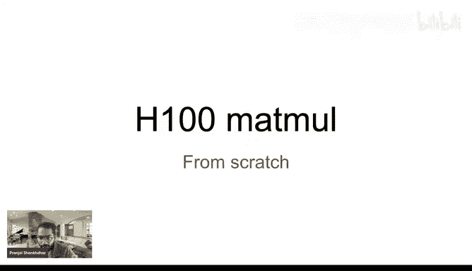
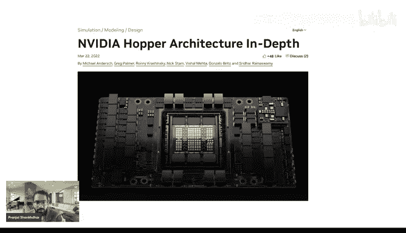
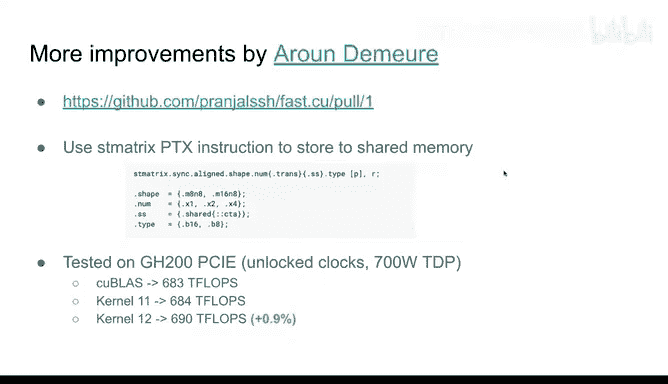
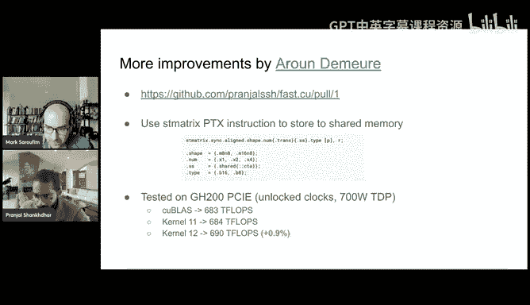
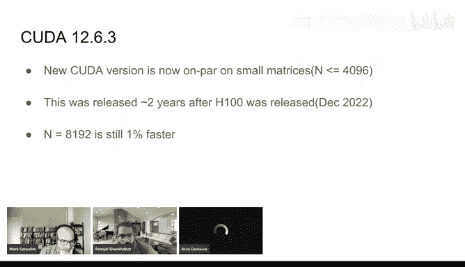
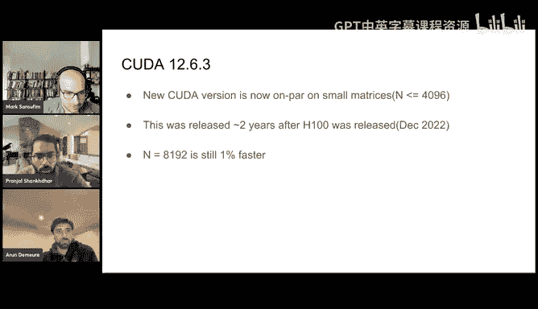
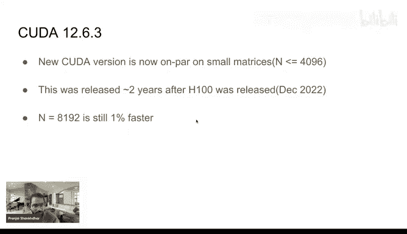

# GPU MODE《CUDA、GPU编程1-53课｜GPU MODE》中英字幕（deepseek-v3.2 - P48：-20250216-Lecture 45_ Outperforming cuBLAS on H100.zh_en - GPT中英字幕课程资源 - BV1QZ421N7pT

Yeah。Okay， it looks like we're live。Okay， we can hear， we can hear， okay， people are online。嗯。Okay。

 so welcome everyone to another episode of GPU modede today I'm really thrilled to have like Bnjal who's here to give us a talk around like a very excellent blog post he wrote around how he outperformed Kubla on H100。

 but the blog was very much like written in the spirit of what is likely the most most frequently shared link on the server。

 which is Steven Baums like similar article for A100 so I've been excited about the stock for a while and thank you Bnjal for making the time please take it from here。

Yeah， hey everyone yeah excited to walk you through what I have done in my blog。

 so I mostly focus I basically focus on matrix multiplication on H00 Thats it so I will start with some of the background on how I started learning GPU programming so。

I am usually a lot into algorithms。 So when this all ML stuff started I I naturally looked into how GPUs work and you know。

 how can we make things faster and faster。So theres lots of good resources online like there is this very famous book programming massively parallel processors。

 like a classic book each with the very basics of GPUs。Very high very good recommendation。

 there's also a very cool blog from Simon。At Anthropic。

 it's about how do you write a matrix multiplication kernel in Qa and achieve like cubeubs like performance。

Also， there is like El Roi by Andre and our own like very awesome good code like very high performance kuda code that you can see and see how actually code in production might look like because it has lots of lots of。

Micro optimizations as well。 Then there is like。Nvidia C plus plus programming guide。 It's like。

 it's not big enough friendly at all。 It's just a very comprehensive list of everything that Nvi supports。

 But I still found like one thing missing in all of this that， hey。

 if I really want to work on these things， I have to implement。

State of the art things in as fast way as possible。

 And when I look at what's the state of the art thing， it's the Nvidia Hopper H00 GPU。

 and surprisingly， there is very less content。On the internet on how H00 exactly works and very less educative content on you know how you can actually start to understand its internal details。

是。Like if you go through these books and all they will implement like gender Qa code it will be good but it won't be it won't be using all the features of the latest hardware chips that you really need if you are working on these large models and stuff like that so basically NVdia has a pretty good blog。

N videodia hopper architecture in depth， it goes through all architecture details that is how I started to learn about it it has enough details that we can piece together all the details that we need。

And write， hopefully write a matrix multi kernel which uses all of hopper features。

And just walk very fast。

So。To start with， I'll just give a very brief overview of what a GPU looks like。诶。

So this big rectangle is like a H00 GPU， it has a high bandwidth memory。

 usually it has 132 processors。All the processor shared， I can add to cash。And every processor。

 if you look inside it， it has like  a thousand0 threads。

It has its own shared memory that all threads can use。 It has registers physically kill now。

 it's pretty much like any G any Nvi GP is one special thing as that。😊，These guys have tensor course。

So， tensor course。Are a fundamental distinction that。They are not new in Hopper。

 but there is very less content online if you have to actually program using Tensor courses and make your Q kernel very fast。

So。Let's look into bit。More on， let's take a step back and see what we are going to do。

Over the stock， so I had this hardware called H00 xxM that's just like the version of the H00。

what we are going to do is we are going to take two relatively big mattresses A and B and we are just going to multiply them it's like a very common step。

In most of machine learning， like pretty much every layer has some kind of like matrix multiplications。

 And if we learn about that， we basically。To optimize this， we going to optimize lots of stuff。

So in production， like right now， especially in training， most of the weights are in Bf 16。

And so that's what we'll be going on here that A and B and C。

 all these three mattresses will be BF 16 it's this like a 16 bit floating point it's just optimized for machine learning stuff。

U。One slide detail is that。We usually do the accumulation in F P32 because of for accuracy reasons。

 for example， if we multiply to 16 bit float and just keep adding them the accuracy is not very great。

 So we usually have a 32 bit register we add them This is all like。

Very basic matrix multiplication stuff that。That you will find online as well。

I would like to briefly revise on how matrix multiplication is done on。

Like a simple GP without an intense occurs。By the way like Mark will be like do people have any questions so far like will they be interrupting or what how does how does it call Yeah so I don't see any questions yet。

 but like both A and I will interrupt you and then if people in chat please if you have questions for like please post them also if if I know you personally and you've been active on the server happy to invite you on the video call we just can't do that with everyone unfortunately so just let us know。

O， sounds good。Yeah， I'll go with this a bit fast， but I can take any questions like if it's too fast。

Here we are multiplying these three matrices。A， B， and C。呃。So， let's see you。

How we parallellyze matrix multiplication is we basically divide C into multiple tiles。

And every tile is assigned to like one thread block in the GPU and for example， consider this style。

 which is B and cross BM and to get the values of this style。

 you basically have to multiply this whole blue row in a and this whole green column in B。

And basically multiply this giant stuff and store these values back to C。Usually these。

Uual these big rows A and B are very like they are not small enough that we can bring them in the shared memory of the processors。

 So how we do it we have this constant called Bk which is basically a small tile size and we load BM cross Bk in the shared memory we don't load B n cross Bk in the shared memory。

We multiply these mattresses and we keep accumulating them in our memory。

 which is usually stored in the registers and once we do this for all the tiles。

 we then just finally write this whole BN cross BM matrix back to global memory。

This is mostly what Simon's blog goes through， and they mostly。

And they mostly optimize around after this step at how many threads work on this one tile。

 it doesn't have to be like you know like one thread per every element and that tile usually a thread can do multiple computations is basically a group of threads will work on loading these tiles from A and B together they will work on computing this matrix multiplication together and they will work on doing a final right。

That's pretty much。How my text application is done on GPs will still be adopting the same flow。

 but will the algorithm will always look pretty much like this。

But we will optimize it just for H00 architecture。So let's do some numbers。

So I ran some benchmarks on H00 GPU。Using Kubla， which is state of the art in Vdia matrix multi applicationplication library。

 it achieves like 716 flps chair of Phps， but this algorithm only achieves 31。

8 it highlights a very stark difference between what recent hardware is capable of。

So we really need to start looking into Hopper architecture to see how can we you know bridge this gap to Q+ and hopefully exceed it。

So the one thing that we remember from past is a tensor core。 There's some new stuff。

That we don't know about。 don't know what it is， but。NVdia promises that if you use this。

 your matrix multis are going to be blazingly fast。

 and it's relatively obvious when we look at what answer core is， So let's。😊，See what it is。

 so Tensor core is ideally one hardware instruction to multiply relatively large matrices。

 not super large， but yeah。So a quick example is if you have two matrices。

 A M cross N B and cross K in your shared memory。And you just want to multiply them and store them in the register somewhere。

Tsor cool lets you do that。 Its a separate hardware unit， which helps you do that。

 And usually these mates are not like super large， but they are somewhat around your tile sizes。

 So these are this is what H00 supports right now。M value for B of 16。

 that's what we are using as in types of A and B M has to be 664 and K has to be 16。

 but n can vary from 8 to 256。 so basically they have given us a range of mattresses。That。

We can multiply in one hardware instruction， making it super， super fast。Unfortunately。

 we cannot do this in Quda and we have to go a step below， which is called PTx。

 it's like the assembly in GPPs。It is not complicated。

 it is not too complicated because ideally we just need a wrapper over this px。

 we just still we basically give it like the shared memory addresses of A and B and like the range of registers。

And it does stuff by itself。 But yeah， we have to go one level down because。

It's not possible to have this abstraction in C in Kda so question about this like yesterday。

 I was like speculating around。Like why does NVDdia make certain functions like not available in Qa。

 but like only available in PTX and I maybe I'll give you like my sort of naive understanding and you can correct me if I'm wrong。

 which is like。Well， like certain instructions are probably foot gunns and like if most people use them。

 they would actually just make their codes slower。So don't expose them just make sure that there's like sort of an escape patch withline ASM the other is they want the programming model for KUa to be simple and the third is they're not sure if these instructions will remain in future GPU generations。

I guess as you've been working on this， like do you have any speculations for like what why we need to do inline AC here so I think there is。

So I think what Nvidia is going towards is that cutlas is their mode of abstraction。

 not Quda for this new GPU stuff from what from my personal experience trying to write this Quda code is。

And like NVCC is only optimized for cutddlers。If you try to write your own Quda kernels and custom stuff。

 things will break like suddenly your kernel will use more registers and you just add in if clause like out of nowhere and it's super hard to debug and you eventually end up replacing parts of your code with PTX or just try to look at cutless code and try to use similar APIpis so your。

NVCC still optimizes your code。 So I think， yeah， they are not comfortable sharing that abstraction because it's not super optimized。

Interesting， yes， so like like essentially like。I know what's the right technical term for this。

 but I've been calling this kind of experience of trying to coax the compiler to do something you want like a jiggle and pre user experience。

And it sounds like that's what you tried to do in the beginning and it was just like very unpredictable in a waste of your time and you eventually opted for。

 I see okay。I think maybe if I can just quickly the add something。

 there's the software side just mentioned on and then the hardware side and really actually knew when they designed this that it wasn't going to the next generation。

 so this is the first time that you've got SM90 a and so you have to use that specific I version to make it work which is something they've never done before and they explicitly said there would be no forward compatibility and in fact the specific instruction is not important on blackwell。

But there's a question of like， why is there not an abstraction in between that you can use in Quda。

 And then there's something that matches exactly to this level。 And and obviously。

 they want for compatibility for Qa。 So they don't want to support something like this。Yeah。I mean。

 yeah， software software versioning is hard。ISorry。

 I guesss a very naive question of both of you then like basically if N video got rid of this for Blackwill。

 like like what was it replaced by instead？Like what videos instructions？I see。

like100 pages of new instructions。Oh。Yeah， I still think that like， you know。

 like if your overall code Qa kernel， like it can fit in thousand lines of C。

 it's still better than having more abstractions because it's all out there in one file。

 you can go and read it。😊，All right，O嗯。😊，This is how the structure looks like below。It's just like。

 look scary， but it's。Ially just like a kind of likeger function。

 just you need to format it a different way。So let's do some quick maths。

So let's assume n equals 16 here， so let's just do some quick math on how much memory we need to store A B and C。

So starting A and B will take like if M is 64 and NNK is 16。

 like 64 times 16 plus 16 times 16 plus 2 bytes per B of 16， that's around 2。5 kb of shared memory。

And edge hundreds have usually around like 256 kb of shared memory。So it's kind of okay。Storing C。

 if you look at it， it will need 64 times 16 registers。

Usually our registers are like 302 bits and we do accumulateulating 302 bit。

 so 1024 registers is too large for one thread。In fact。

 what we how Hopper does this is that it distributes this computation over 128 threads so one tensor core instruction is actually run by 128 threads。

In a grouped way， I mean， it kind of makes sense， right。

 if you' are just multiplying 60 these super large mat in was hardware instruction。

 all hundreds of thousands threads are doing it， it's just。It sounds too， too， too large。

 right that you will get like。Thousands of performance improvements， but yeah。

 actually 128 threads do this。In a combined fashion。And n can usually go to like 256。

 So if you really， really push n your。It will basically push your register account per thread to like a nice level。

 which is what you will eventually end up doing here。

 but if you just see that for this case10 to4 registers across one date threads are just eight registers which is very very small number。

 so it's like。den生 goals are。A good way to basically distribute metrics multiplication。

Dsically supported by hardware。 So one more thing that we have not discussed here is。

This A& D guys slide， so if I just quickly go back to this slide。Basically。

 we need this BM cross Bk tile in shared memory。 We need this B and cross Bk from green guy in shared memory right if you look at。

How we store these A and D mattresses， they are likely like ro column major order in the global memory and these are not exactly a continuousuous segments right like well have some part of a then some large gaps some part of a again in the next row so specifically lots of stride memories it's not like one group memory that we need to load。

And actually， Tensor core only supports specific type of memory layouts。Of A and B。

 you can't just copy something and put them in shared memory somewhere without telling tensor code how it's laid out like。

So to avoid shared bank conflicts。And Vdia has given us this very nice diagram of how exactly。

We can load parts memories from global memory to shared memory。 It's a very。

 very complicated diagram showing what indexes load to what indexes from global memory to shared memory。

😊，And it turns out that this diagram is wrong。So I think folks at Stanford who made10 kits posted this that they spent a few days trying to reproduce this。

 but this indexing the diagram is wrong， so it's just super hard to load these things but thankfully NVD also provides us a way out。

They have added a new hardware feature in H00。 sorry。 but before we go to the hardware feature。

 could you just help us read this like like could you could you decide because this might look like hieroglyphics for some。

 So just like please you know， just if you could dumb this down a bit for us。 Yeah。

 I I just think that So basically what this is if you look at this first basically。😊。

I would say this。Is ideally a one to one mapping from your global memories tile to a shared memory tile。

 your global memory tile to react to a shared memory tile and。

You don't just load like these contual species from global memory to shared memory。

 use move them around and swizzle them in a fashion that we avoid shared bank conflicts。

So if you just look at first two rows on the left matrix here it's like you load the first seven segments contiguously but then you load from 64 to 71 and your8 to 15 are actually going in other parts of your shared memory so it's just a very complex mapping one to one mapping from global memory to shared memory。

That we have to do if we want to run tensor core matrix multiplications。Does it make sense？

It does yes， thank you。Yeah。Yeah， but it's like it's super hard to do this correctly。

And in a performance optimal way。Because you have to make sure you load these things in like a globally coalless memory exercise。

 it's just not worth it and ND actually provides us a better way to do this。

In a new hardware feature， they call tensor memory accelerator。

So Tensor memory excator basically solve this exact problem that we have a tile in global memory。

 basically a rectangular tile and we need to load this into a continuous portion of shared memory and it's a separate hardware unit。

That lets us do this asynchronously so we can just tell the Tma that hey。

 I need this style learn this shared memory address it will do to me at some point and just notify me when it's done。

So。Yeah， it sounds like it fits。Exactly right for tensor core stuff。So I。

Ill quickly go over what this kind of looks like in a very， very， this is a very。

 very abstracted simple。😊，Pce of code。That。Basically goes over the flow of matrix multi kernel。

So let's say we we are just this is just for one thread block。

 so let's say we are computing this Bm cross BM output tile。To do this。

 because remember that we are doing this across 128 threads。

So we basically store our registers across 128 threads。

WGMMA and WGMMA and is basically the size of her。Mats multiplication tenor coin instruction。

 Let's just assume they are all 64。Basically the same as the tile size。

And we have some registers spread across 128 threads to store these values。

We set all of them to zero。And we。Start a loop where we start loading tiles from global memory into shared memory。

 I have not shared the quote to do that because it's very verse。

But it uses the TmaA and Ive written in the comments here that we。

 hey we load as chunk into shared memory， we load B's chunk into shared memory。

Now we can do this tensor core call to multiply these two guys。

 install them in our registers D and we do this for all the we do this over the whole key dimension across all the chunks and once we do that we can write the value of these registers to global memory。

And it turns out indexing of these registers to global memory is not like very hard as hard indexing as。

We have to do when loading things from global memory to shared memory。

 so this is just like very simple arithmetic。I would。Prefer if someone。

Does't get this fully to ask questions here because this is very critical to rest of the optimizations。

Well be looking at how this flow does and try to optimize every single line of it。

So I just go over it again。V。We have some registers， which will eventually store the output of the。

C values of the tile that we are computing， we go over the K dimension， load the a I， load the B guy。

Do the matrix multiplication and just store it。So。If we just do this for like very simple tile sizes。

 this actually gets us to like 10 x 10 x performance improvement。317teraflops， which is。

A very nice win and show that in the right direction。

 we just have to use more and more of all the NVdia h00 features。Now。

 if we just try to do some hypercameter tuning。Just increase the tile sizes So basically we previously were just using what the tensor size was。

 but if we use larger tile sizes。And。We won't be able to use that large。Densor constructions。

 but we can easily divide that。Into basically how matrix multiplication works in normal GPU code。

 you only have one cross one matrix multiplication right and you。

Have to multi you do compute large tile sizes from that。

 but here you have slightly larger than one cross1 matrix multiplication you have a tens equal instruction so you basically divide your mattresses in a way and just do these computations and if you have parameter tune this the right way。

It turns out that you can go to 423 terafropps。Which is around 59% of Ks。Yeah， this。

This gets us a nice， easy win。To do。More optimizations。We need to look into， again。

 into how this structure of the algorithm。So remember that we have a loop across k will load。

We load tiles from a， we load tiles from B we do this tensor core and we do this thing many， many。

 many times for example， if k is like 4096 and Bk is like 64。This would be。

Like quarterly around hundreds of times that we are doing this。

So around 100 times we'll load something。And we'll do matrix multiplication， we'll load something。

 we'll do matrix multiplication at the end what we do is we store all the values in our registers back to global memory。

How can we optimize this？So coming from a CPU word。What my immediate first thought is that， hey。

 this guy is loading and this guy's computing。And this guy is loading and this guy is computing。

 but they may be operating at their own pace right and how can we do to basically if we separate them up one guy just loads one guy just computes。

And they don't communicate。Directly with each other。 They communicate via a shared queue。

 So one guy just loads and pushes to shared queue。 It can nu its own pace。 and the consumer can。

Can do the computation at its own pace and then then just pull things from queue。

Perhaps I'll start to interrupt you， but we actually had Chris Seca who really wanted to join。

 I think he's one of the core developers behind Culas。

 so maybe we we can this is like a good point to pause for like a bunch of Q and A and like revisit some of the old slides。

 So of course I'm bringing you up on station。😊，Thanks， Mark， I hope you can hear me Okay， Yeah。

 your voice is great。 Yeah he goes。😊，Yeah， I just wanted to。To emphasize that。

The the shared memory layouts on the public PTX documentation are incorrect。

 we agree we have been yelling at the documentation people for a long time to correct that a lot of companies have been reaching out to correct that。

And the way that we correct that now is we use unit tested cute layouts。

 all of this is all of the correct layouts are。Are unit tested and documented inside of the cute library。

 which is the core of the Culis library。And and that's the principal library that we use to do all of this indexing math and partitioning math and layout math inside of colorss。

 so I wanted to point that out。Yeah， thanks for that。Yeah， yeah like cute as a。Very nice objection。I。

 I guess Chris， now that we have here as well。 Do you have any other comments on parts of the talk。

 I think people would love to hear from you since you're here。 I I probably will。 Okay， sounds good。

 Okay， I'm gonna kick everyone back out。Okay。谁呀？Coming back to the point we have this loop where we load and we compute。

 we load and we compute and we think if we can separate these guys out， one guy just loads。

 one guy just computes， they can do that at their own pace。

And to remove any sort of to basically ease down any communication overheads。

 let's say one guy is just loading， loading， loading and other guy is computing slowly。

 we can just have a shared queue which can store multiple items For example。

 if producer is too fast it can just load more things in the queue and consumer can just you know pop them slowly at its own pace。

 It's like typically how large distributed systems we remove these problems of slow producers and slow consumers。

And it turns out。We can do this on GP as well。So like below I have posted some code。

 but I won't be diving too much into it。But the idea is。

Basically that we have 128 threads with just to the loads。

 128 threads with just to the met management applications。

 idly we don't need 128 threads to do the loads because EM's call can be just sent by one thread。

 but like NviDR recommends that。We have we separate these things in multiples of 128 threads like the programming guide and that's what we end up doing it's not a waste of threats because those guys are just sitting idle。

Just loading and the consumer guy is just doing all the hard work。

How the shared queue is implemented is something called a barrier that I won't be diving into right now because it' says a lot of technical details。

 but it's basically a synchronation primitive that can be used to implement a shared queue。

You can probably Google about it's like very。Barriers are a very well known thing in the CPU world as well。

We basically have a barrier for every， for example if the shared query shared queue has size four。

 we have a barrier for every entry and then one guy can say hey Im done with this now it's your turn so when producer has loaded into something it says hey now it's anyone can take this I'm downloading this and consume hey is this ready I'll just consume it stuff like that。

So on this so Lu Imer and Chad is asking like why is there a notion of a producer and consumer。

 is it because we're doing AsI stuff or is there something else yeah maybe if you could talk about this also add another question for you which is like a while back someone and this court was asking like why is it typically limited to I think there's like two producers and like one consumer why not more and I had a shallow explanation which was like probably the pipeline schedule is complicated but curious if you could comment more on this？

Yeah， I think okay， let's do that one by one。 So one is wipe producer and consumer so。

How I look at this is let's go back。 So let's look at this load compute load compute ideally all this load and compute。

Are independent operations。So these are all basically different tiles of A and B that we load and we do the computation and they can be all paralyzed。

 they have no relation to each other We are just doing them one by one because you know。

We have a limited number of threats in GPU and just everyone is doing their best， right？呃。

So we say that， hey， if we have enough memory， we can do more loads。

We don't have to wait for the first tensor compute operation to finish to start the next load。

We can load as many of them as we want till we have enough memory。And same for Tsel kgi。

 It doesn't have to wait for like。I mean， it has to wait for the load to finish。But yeah。

 we can load more things。And if we basically separate them out。That lets us add a buffer that hey。

 if we load more things than your store， then the ss guy can just keep computing it。

I hope that makes sense。So I guess like Todd is asking a follow up on this。

 so are we limited by bandwidth since all of these are data independent？

we usually saturate bandwidth， we try to， we are usually limited by the amount of memory in shared memory。

So we set the value of this shared queue so that we exhaust all of the shared memory。

 which is around 256 kb per SM。So yeah， I think that comes around to like four or five size of shared queue like stor four or five tiles from what I remember in my code。

We can't do more than that。Yeah， so then Louis says， thank you。

 this explanation helps and then Ly Dot is asking， so this is a frontend optimization to better load the LD and compute。

Yeah， I'm not sure what front end means， but yeah yeah。Okay。Yeah， like。

 like if you like just search for like slow producer or slow consumer problem in like distributed systems。

 like you usually add like Kafka using between right， So you separate out。

Different systems and they can work at their own pace。 So it's kind of like that。

There was another question right one it said I think the right like two producers and one consumer thing。

 I think it's usually the other way around one producer and two consumers。

So we'll actually go that into it in like the next parts of the slide。

 why can having more consumers can help and。Why those things can be limited。

I just quickly wanted to add that the producer consumer historically GPs have matched all of that automatically for registers。

 so if you do things in registers， the barriers are located by the compiler and if you've got a lot of parallel loads and there's register pressure。

 the compiler will figure out like Oman loads to do in parallel and when you put the weights and so on。

The nice thing and the tricky thing with using shared memory and TA and theynchronous loads starting an A is all of this becomes developer managed。

 it kind of starts feeling a bit less like a GPU and a bit more like something you're managing completely manually。

😊，嗯。Good。Okay。Let's see what this guy gives us。 We call this optimization asynchronous loads。

And it gives us。A nice boost from 59% to 70%。We are a good way now close to Ks。

 but there is still so much more things that the H00 chip offers us that we can do more so。

Next thing is called pushing tile size limit。 So if you remember， previously， we were using。

The n n tile tell sorry ntel size dimension is 128。But there is a tensor coin of n till 256。

 so the largest tensor coin that is available to us is M64 n256 k 16。

And it turns out that using the as large an instruction as you can possibly can is always helpful because。

 you know， it's optimd the hardware and doing it in the software will only slow you down。

So let's see what it will take run to run this huge tensor core guy。The output tile of 128 cross 256。

Uses 332，7，6 a registers。And because we do this over 128 threads， that means it is 256 thread。

 256 registers per thread， and that is actually the highest limit that each00 thread can have is 256 threads。

 sorry 256 registers。And it's not。Feaible that all of these are just being used in tensore right because you have four loops。

 you have other variables that need to be stored in the thread。

 so it's just not possible to use this style size across use this large tens instruction across 128 threads。

好比。Alleviate this is note that M is 64， right？And we were trying to use a 128 cross 256 tile size what we can do is split this style size if we look at the diagram on the right on the C size have split the tile across the M dimension into 264 cross 1256。

Ts and both of these can just use one tensor core instruction to do the whole tile computation。So。

 we basically still。Our tile size overall is still 128 across to 56 that means we still load larger tile sizes from A and B。

But to compute this， we split them into two across two consumers and these two guys do your own tensor coin instructions using very large n。

 which makes it faster。And。Because they are computing independent portions of C， it's fine。

 They just do it in parallel and they stored the thing back to。The registers。

One important point here is。Previously， when you are not using this。We might also be using multiple。

ConWe might also be using multiple consumers per SM M anyway because of how occupancy works。

Because we have multiple thread blocks that can be scheduled from the same S at the same time。

And ideally， the scheduler can run both of them in parallel。

 so you could say that there could be one scheduling strategy where this all like these things work out。

 but doing it ourselves makes it much better。要。And if we look at some numbers here。

 because we just push the tile size limit equal larger tens core instructions， we are now at 88%。

Performance of Cubulus。So let's go next， we're not going to stop。

 we're going to get all the way there， so we are just jumping to the next thing。

And to understand this， we need to revisit our algorithm again。So just look。At。

The first part of the diagram here。Where we are doing these loads and tensor core computations in parallelel。

 so just separate them out up and down。And even at the end， they do a store。Now。

 instead of looking at one thread block。Try to look at the whole picture。 We have 1，32 Ss in our GPU。

 That's it。And the number of third blocks is much much larger than 132。

So usually one SM will run multiple trip blocks。One by one， because now that we are using very。

 very large tile sizes our occupancy limits will not be as large as we used that it used to be before now our occupancy will basically be just one。

One assembly will be assigned multiple thread blocks and we'll just run them one by one。

 so if we look at the bigger picture instead of focusing on one thread block。

 we'll start to see more optimizations。So this SM will load some things do this tensor computation。

 then you will do a big tour at the end。Then it has to do work on the next third block and it basically will do this load transfer commission again and stored again。

 but if we think about it，We can paralyze this， we can overlap these loads from the next tile。

From the stores from the previous style， like these are all just independent operations。

Because these stores are in registers right， and you just store them to global memory。

 but while you are doing that， you can also start loading things。For the next tile。

 so basically we are paralyzing things as much as possible。

 so tensor core instructions can keep running， keep running。

 keep running they don't have to wait for anything to finish like they are always always always active。

啊。So yeah， let's try to do that。To do this， we need to。To implement this。

 I'm not going to go over like the code， I think like it's not too hard to change the code to do that just using barriers。

But we need to figure out our own scheduling strategy。

Because now we are not relying on Nvidia to schedule。Like our thread blocks to SMs。

 we will launch exactly one thread block per SM and we'll do everything by ourselvesse so if no scheduling ever happens。

 well launch exactly 132 thread blocks。One SM will do。

Whatever and we have to plan how to assign the headlock so let's do a very knife scheduling。

Of thread blocks so this is a big C matrix divide into multiple tiles one tile is one thread block now and basically assigns multiple tiles to the same s so in this case I have written some numbers here which go till 132。

So that means this portion， the blue portion of the metrics goes to first SM。

And the green portion of the matrix goes to 14 assignments。 so for 100。So for all the 132 Ss。

 we will receive sub tiles。Looks right like they they access some contual styles。

 you just assign them hope it all works out， we should get some performance boost， right？

Sadly not what we see here is our performance actually drops previously we had 631 de knobs now we have only 400。

So it turns out that doing this scheduling by sales is not very trivial。

And wheat actually does a good job at it by itself and to do this ourselves you need to get into more nid details。

😊，To optimize the hell out of it。So， let's。Look at the same scheduling from a different picture。

So if you look at the diagram on the left。NowNow I have not highlighted all the blocks that are scheduled on same S。

 but I have highlighted in blue。All the blocks that run at the same time。

So for the first SM it runs the one guy in blue。as its first tile， the 14 S will run that guy。

 so every S will be running some tile。😊，For the first time and these 13 which is this 132 things will be running in parallel across all Ss。

But these styles are so sparse that they will end up loading very。

 very different things from A and B mattresses。And because they are very， very sparse。

 specifically like loading the whole A and B again in one time and once every SM is done you load something again。

 then its almost like loading very， very different parts but。If we try to coalalce them。

Into loading similar parts， we can try to use L to cache more so if we just try to change a scheduling strategy you see on the right。

Are the first tile that is noteded by all SMs。😊，Is all contiguous in a rectangle here I have only used 128 Ss here instead of 132 because it makes math so much easier。

 you know， powers of2。And if you just do this and you don't even use the remaining 4 S side just use 128 Sms and just make sure that the firstile that they are loading。

 it's all contiguous so they will load very very similar portions of A and B and they are going to use the hell out of Lc。

And we can finally get some performance boost。To 660 tariffaf flops。Which is 92% of Qs。谁呀？So。隔ty咕略。

The next optimization that we look at。Is something I'm not going to fully cover？

Because it's a bit verboose， but it turns out there is an alternate version。

Of barriers that are not in Ca。And they are in PTtX。

 you have to write some PTtx code to fully use them， but they perform much。

 much faster than the QA barriers。And if we just figured that out that hey， you know。

 N videodia Hopper architecture documentation actually mentions it。

 it says they have now faster barriers， just have to piece it together with that documentation and find these guys out。

爱你。It's actually boost performance quite a lot from 92% to 98%。

Yeah I would just recommend going over the code for this， it's not too complex。

 it's just like about the details and how to write the pretX for them。

Let me know if anyone has any questions and I'll be happy to。Go away if people don't。Okay。

 moving on to the next guy， we are not going to stop， you're going to go all the way。And。

To unlock the next step， we have to use something called T multicast， so remember Tma guy right。

 it helped us load chunks of memory from global memory to shared memory。

But Nvidia has this new feature called TMA multicast and。Had blocklusters sounds very complex。

 but let's just go at the diagram instead of trying with him too much about it。So。

This is not the same diagram as before where you were you know splitting a tile across two consumers。

 but this time we look at two tiles that are actually running on different SMs at the same time。

So we have these two purple eyes which are computing different tiles。

 but they are running at the same time on different exams。

They will end up loading different parts of a， but they will end uping the same parts of P。

So if somehow we can have them share this part of B。It will。You know， have less。

Have our memory loads will be faster and well have more speed。

Turs out that actually sharing each other's shared memory is not as efficient across Tis it is still possible its but the faster way to do this and the cleaner way to do this is using this PMA multicast operation which lets so instead of a TA like one PMA call from each of the two SMs。

We make only one TA call from one of the Ss， and it will say to the。ATMA hardware unit， hey。

 you know， there's one more guy beside me。 It needs exact same thing。

 so please give it to them as well。That's what it says。

And behind the scenes and V maintains these SMs in things that they call thread block clusters。

 so usually now we have these clusters of size2。So basically two alternate SMs。

 two consecutive sorry， two consecutive SMs that will be sharing the loads across B。

And it and this team is available to optimize that so much better that we see a performance boost。

Close to 102% in that in this case。So yeah， we we implemented things from scratch and I'm like highly optimized for one specific。

Matric sizes and we were able to achieve and even slightly exceed the Kubular performance。

Any questions of that？Ohpe， I don't see anything in yeah， we can't keep it going。Yeah。

 so it turns out here we used like only two consecutive Ss， right？In theory， Nvidia supports up to8。

Cluters eight SMs together can enjoy， you know multicasts and store same portions of both A and B。

And even up to 16， if you set particular flags。But it turns out that at that point。

 communication overhead becomes so large。That you stop seeing the benefits for usingsing more than two clusters based on my experiments like yeah。

 when you do some NV profiling。You say that the communication overhead and like the stalls become much。

 much larger and you stop seeing the benefits。And that is kind of evident， I think。

 in the blackwell as architecture as well because。I think they also supports clusterers of size two only。

 not more than that。So yeah， in my quote， I have implemented。

I just wanted to maybe give a very quick bit of feedback on that is I think Blackwell does pour more than two is just to have made to like even faster like to' got a special mode for it like the way the hardware works is as's TCs which ever since like1 or something it been two Ss the hardware is going restructure your that way they've kind of added something to optimize that case and there's another problem in upper and I'm not sure I don't think that's the reason why you're think the performance is're gonna to be part of it is it's not actually possible to use OsMs on the GPU with a cluster size of more than two so basically if you think about GPC might be 18 Ss and so it's not a multiple of fours's a multiple of8s and depending on the redundancy of which SMs are effective it might also be different so I think we basically taking the worst case because of that so I think if you've got like8SMs per cluster you're down to1 20 doing。

32 something crazy like that and so you also to be careful about how many SMs you've got in parallel to prevent like。

😊，Not fitting in a GP at the same time and things like that。

 so it's kind of tricky to make use of more than two it's possible， but it's use like 128 Ss。

In that case， even if we just use 10 at ms。128 will work with a cluster size of4 I think I can't remember but yeah I think with eight you're not able to use 128 it's basically depending on the cluster size there's only so many Ss available so the really crazy thing you can do with no one does is you can run two kernels in parallel some of it for a bigger cluster size some with less but yeah at that point you just。

Breing insane amount of complexity， I think maybe in video use cluster sound of for these days。

 In fact， no， they don't they。They don't stay， I think they did for some kept kernels， but Yeah。

 I think they did at some point， but the latest kuda kernelals are all t blocks of size2。嗯，也是这样。Yes。

 it's a combination of communication overr and not being able to use all DSsMs in a way that's not clearly documented by media。

 unfortunately。Yeah。滚。So。Let's go further。Let's do some micro optimizations。呃。

So one micro optimization that we can do。 So basically， I have copied the whole block again。

 This is what how we。Do the computation of one tile。 It's a silver same code as before。

 but now we are using micro optimization。 so I highlight this section right memet D to0。

It's okay right just setting registers to0， but it's possible to remove this guy。

 So remember that our tensor core operations are just accumulating right because we do this slope and all of these tile multiifications of SA and SB。

 we keep adding them to D So this is like C plus equals8 timesB C plus equal8 times B and we keep doing that。

But。When you do the next style you have to set all of them to0。

 it turns out that Tensor core has a flag that you can enable and disable accumulation。

 so instead of plus equals a times b we will just do c equals a times B and if you just do this for the first time you have tablog you don't have to set all of them to0。

So basically gives us a very small performance boost， but。It's our welcome performance voice。

Another cute trick that I learned actually from like Errun code in LLM not C。Is that。

We can skip the L2 cache rights。 So when we write。Our register values back to global memory。

By default。Like the Nvidia will also write them to the L to cache we actually don't need them in the cache right what we need is the our our guys A and B who are it so many times we want them to occupy all of l to cash and not what we are writing theyre never going read it So basically give a hint to the compiler that hey。

When you're doing this right， don't even bother str them to autoc。

And if you do a bunch of these micro optimizations。

 you get a very small performance post to 747  tarifff flops。Around 1，04%。We are not done yet。

There is one more optimization that we we are going to do， which is asynchronous dose so。

Remember how we had paralyzed loads and tensor cores。

 then we eventually overlapped when we are doing a store and when we are doing a over。

 it turns out that storing things to Google memory just takes too much time and you will still see some stalls if you try to exactly measure how much time it into do a store versus how much time you need to fill your own queue。

And Tma actually has an operation which we can use to do stores asynchronously。

 so instead of writing registers to global memory， we write registers to shared memory。

And then we just tell Tid hey， can you asronly store this back whenever you have time so basically inner our blocking time in the loop gets much much smaller。

And。This basically lets us paralyzze much more things。The code for this isn't too complex。

 but I don't think like it's worth going over in the slide it's like you can go and read after the slide I think it's very simple and have very simple comments in the code I can still explain if anyone wants。

都。Okay。😊，So once you do this。We get around 1，0，6% of kubs， asynchronous stores。But。Actually。

 at this point， I was kind of out of ideas， so I tried pulling some big guns and started blasting。So。

I started using Hilbert curve scheduling， which is like。

And of an overkill but it gives us a very small performance boost。

 so I'll quickly explain what it does。So remember how we were scheduling。

Our tiles in our Ss or just look at the diagram on the left。

We load the these blue tiles at the first time all Ss work on these tiles。

 then we load all these green guys then these three guys in these four guys。

 So let's assume we have only four。All every SM just runs four tiles。So。Think about when you run one。

 you will store some portion of a and some portion of B and when you go on from one to2。

All the portions of a。That you have already load in one can be reused。

 they will be sitting there in the L to cache， you don't really have to load them again。

 but you do need to load different parts of P。Inter L cash。Now， when you move from two to three。

 right， it's like a diagonal shift。You're not able to use any of the。

Things in the L2 cache because theyre just doing very。

 very different things in a So now you have to a different part of a and a different part of B back into memory。

Again， so when you go from one to2， you use something from l to cache。

 but when you go from2 to three， you discard all of it when you go from three to four。

 you still use something but this。It's if you。It is possible to optimize。

The jump from2 to 3 not using any l2 guys right just look at the diagram to the right。

 I have basically swabbed three and 4 guys。So if you do them from one to two。

 then if you go from two to three， it will still use parts of b go from3 to4。

 it will still use parts of b of a， sorry。So， this sort of。

Sppatial curve that we do in the matrix to fill out this is called actually called a Hilbert curve。

 So I'll quickly go over what a Hilbert curve is。 If you look at the diagram on the left。

 It's basically about finding a path， like from one cell。😊。

One end of the matrix to another end and it goes through all the cells in a spatial way。

 So if you look at the diagram on the left that's pretty much what we did right instead of one，2，3。

4 across different rows， we go over nearby tiles so we always end up reusing something from the auto cache。

And。It's。We can generalize these two metricses basically larger than two by two by just doing it recursively so if you look at this four cross 4 matrix you can see that's this 012。

3 that's the first four cells right After that I basically do the same operation on the two cross two metrics above it but I slightly rotate it so it starts off from where I left and ends up somewhere else then I slightly rotate on my other two cross two metrics and I slightly rotate in my last two cross2 matrix and I eventually end up finding a spatial curve。

Which always visits a nearby cell， so I know I'll be using some parts of LdoC。

And it turns out it gives us a small performance boost of 1%。Yeah。

 it's kind of like an overkill butt。Yeah， it fills some hole in your heart。

Yeah view like I think like this feels like a competitive programming kind of approach to it and there's this question on chat from Paul Vero。

 which is these code optimizations rely on a very specific instruction schedule。Like。

 did you have any mechanisms to ensure that the schedule defined in QUDA is't later altered by PTx AS？

嗯。😊，I'm not really sure about that， Aron， do you know？

I think typically it's going to be less of a problem for this kind of kernel because there's so many like kind of special instructions like the TA loads and the WGmaAs that to some extent the compiler cannot reorder around so for some things like the loops。

 the compiler will enroll them and will kind of do whatever it wants but those are fairly inoffensive and we kind of wanted to do that so I'm pretty sure that for everything that matters the compiler is kind of constrained by the way the PTx works and you're not really kind of able to reorder in that way。

So it's less of an issue than it typically is。喂，一样。I didn't think too much about。

At the light level of instruction scheduling， just I was satisfied by the telePX level。Yeah。So。

Like these are the final results summarized。For small mattresses at that time when I was implementing this。

 I saw like around 7% performance boost， but for big mattresses， it's like close to 1%。Yeah。

 this is where I stopped。But， it turns out。Still possible to go further。

 so Aon took some time to look at my code and created up PR to even further optimize and get one more1% more performance boost。

So the LDR of that is when we are doing rights from registers to shared memory which eventually end up getting it into clever memory by TMA。

 so if we are just naively writing from registers to shared memory。

 in fact there is another PTX instruction called ST matrix。

Where you can write all the register values across a verp。Collectively into shared memory。

 and it turns out if you do that， it's just much faster。Thing I don't had。

I't if like you want to say something on that so I think actually unfortunate data to be a little bit more complex than that you do need to add padding manually So it's the usual shared memory thing that you've got bank conflicts if you just do it the normal way so it's a combination of two problems one is all the data16 when you do a store I'm not sure I've got a way of showing a screen can maybe do that later if you want me to but basically you've got stores at 16 bit rather than 32 bit it's really even using after bandwidth of the load store pipeline and then you've got bank conflicts on top of that So if you do store metrics naively it will massively reduce above Sa instructions because one you don't need to calculate one address for every 16 bit it's like one address for every12 bit I think but you still got some bank conflicts so then you still need to add some padding potentially it's possible to use some of those。

vising stuff and TmaA and move things accordingly but I'm not sure that of ST matrix and gets even trickier once you've done this optimization effectively like the load store is really quick the only thing you could do to right so there is one other thing kind of in that code that makes it slightly better is the barrier for。

😊，So yeah， I don't think you've got that code there。

 but the barrier between the stores to shared memory and the TmaA store used to be per trend group。

 but it's basically the only point in the entire kernel where the two consumer war groups synchronize with each other。

🤢，And so if you remove that barrier and make the TMA store per wb group like per consumer。

 instead per 12 group， you can actually get the two warb groups to be completely out of sync for the entire kernel except when there's not enough latency I because you're not able to add the external memory latency。

 so that kind of what the nice things it lets you effectively do to stores and the TMA or one other consumers while the next consumer is already running a in doing some magic specificifications for the next tile。

So that's another slight win， which is the usual thing of。

 oh do you get it to kind of keep running like 247 even when you're doing that kind of unusual work and that's I think one of the trickest thing on on upper to do in general。

 like one of the weird things we noticed LM doC early on that NV has improved but it's still a bottleneck is when we added like fused Je。

To the matriximification kernels it was like 4 or5% slower like I think it's much better these days。

 but it's still a bigger performance less than you'd expect for something that's reasonably simple compared to large metric multiplication and part of the reason it's quite tricky to overlap that work because all of your registers are used by the accumulators for yourmetricimplplication all of your shared memory used for the input data and potentially the TmaA store and then you basically have to shuffle things around weirdly or have less littency hiding to be able to make things fit and so in some cases we actually like a very efficient nonfuseed genuine kernel was faster I think no enthusiasm might is quite a bit so it's like maybe one or two percent it's significantly fast infuseed the other thing I want to quickly say regarding this is like one of the nice things with this is it is actually generally as fast as Kas like I think。

Some people may be skeptical， but for those matrix sizes as far as I can tell it's very much real like if you take a bigger matrix。

 that's not the case like maybe like a 32k， then Calla is a bit faster to maybe because it all those things differently。

 but this is actually way better than like Triton or。😊。

Or to some extent of the kitten so if you use Triton so one of the problems you've got if you take something like nano GPT mode and you take trying to use your own element wise kernel so the Por compiler is amazing at trying to fuse the kernels together so it will add your custom elementwise operations to a Triton Mamal the only problem is the triton Mamal is at least5% maybe more slower than KaS and therefore diffusion isn't actually any faster。

So that's why in some cases you see part ors not fusing things because it's actually faster if you do tuning。

 it does do tuning very intelligently you use Kala plus nonfusesed and so that's kind of the benefit of using cut or something like this is you can actually do it but because of the way upper works it's really tricky to do that kind of overlap and this is an example of that way that the end of the processing for the tile even without that that j style post processing is the artist part potentially to keep running efficiently。

Yeah。好。Yeah， a blackboard makes it slightly better。

 but I'm sure there's are going to be new problems there。😊，Yeah， I haven't played with black hole。

 but yeah， I'm sure yeah， I think like yeah， in video has。

InMedia's better abstraction for newer hardware is cutless。

Like if you just want to use it and not think too much about it because don't have to fight NVCC all the time Yeah。

 I think the issue if like Jely and things like that is still like you still won't have enough registers or shared memory even with cuts like if you do a good job。

 you'll have a low performance cost， but the way upper works it's very tricky to have like no performance cost for perfusion kernels。

系事。So we have in the meantime， we had a lot of questions from chat like Vikram is making a comment。

 which was Hilbert curve optimizations are very good if you have sparse matrices and Winway's group has some quantitative studies on this。

And he recommend checking out those papers， in particular there's a thesis from MErt with like a few chapters there that sort of elaborate on how this technique works。

Cool， be super like is that ondisord？Yes， I think so。

 Vikram if here as just like dropping a link or a line dot。

 dropping link and Disc coded would be very helpful。So Lygot also has a question。

 so he's asking related to the L2C skip have you looked into the energy consumption of different memory cache levels and if an optimization scheme that reduces bandwidth in one level at the cost of another。

 so could you for example reduce the power consumption of data movement and possibly allow for higher clocks？

Yep， I think that pretty much gets on to the point that these things are hardware bottle。

 power bottle length。So you would say that hey matrix multiplication is complete bottleneck right。

 I just need to do this all these multis no turns out。

Next slide， actually， like who is from Pytorch， it a very。Good blog post on analysis of that。

With the new generation hardware， if you look at this NVDSMI diagram。

 it's capped at 333 watts out of 330 watts。That means at some point。

You are not able to even use all of the insert code instructions at once in the chip。

 You will use up too much power and something in the GPU gate will shut you off。 hey。

 no more power for you。 I'll reduce your clock or whatever You just can't run so many matrix multiplications at the same time and to fix that。

 you have to reduce your power usage Where the question comes from Can we do any software changes。

On the kernel to reduce the power is said so you can do more management applications。U。Turns out。

Like I tried playing with some constants here and there。

I could not see any performance way in reducing some constant。啊。

What one thing that did come to my mind is that L2 cache on the hardware level is actually split into two parts。

This is very less documented。And I think I only found one very good study of it that comes from Cittadel in some old GTC and they found that on the hardware side we load very different parts of memories in different L2 cache partitions and then those are kind of like duplicated and different SMs only load from their nearest L2 cache partitions。

So if there isn't some clever algorithm so that those two L2 cache partitions don't duplicate stuff in there。

 don't talk to them as much。And we load only things in the right part of L2 cash partition by default。

 then power consumption would reduce。That is my duty。

So we could try to come up with a clever algorithm which uses that it would be very complex because。

Yeah even this mapping is not trivial， it's not that。Yeah， the mapping。

I could not try to reproduce the mapping like in a short time， it's not documented anywhere。

 So we have。Maybe someone can try that out。Any more questions？No。

 I think that's the beginning of going。Yeah from theoretical peak we are in final optimization and I think that question is a bit tricky because there's power in this's performance so if you're at really low clocks。

 it's maybe like 98% or something but when you're looking at the actual performance we're comparing here it's at power limited。

😊。

And therefore it's way， way lower， I think like we I another we're thinking of it was like I think we clock at like 1450 megahertz or something on a GH200 that could clock at about 2 gigertz。

So we're kind of wasting 20% plus performance from being power limited。

But the same is true for coverless。呀。Power。Your power is like a big bottle leg for Hopper。Yeah。

 maybe Blackboard will be different because。Like， they have this。On in tensor core memory stuff。

 I mean， it depends on many nuclear power plants you can run or can you actually run the CP or not。

Yeah， well I don't know but they're probably but they're probably temperature limited though right that's why the power limit exists I presume I don't think it's probably power supply right Rus。

 you know more。😊，嗯。I think that is part of it。 Like I think the new chips are like waterco or something。

 So they can， Yeah， I mean， historically， air cool stuff does tend to be somewhat terminally limited。

 but new installs like the H200 and blackwell is mostly liquid。I mean。

 I think there's just like the amount of power you need to bring to a data center。

 so it just how much does it can you actually feed the data center。

 do you actually have the supply lines， do you have the cooling for the entire data center。

 not just the local GPU， because even if you bring the air out into the outside that one rack you seem to get it out of the actual full data center。

Yeah， cool， so just to wrap this up， I would like to I would like to pond out while I was writing the blog and you know my kernel and media did release a new QudA version。

Which actually performs part on small matrices。And it's still like。

And like this was released actually two or two years later after initial agenda was released。😊。

And I think the new kernels are。Very good。Formatic applications， theyre very fast。

 I could not see any performance improvement on my code， didn't try a code but。Yeah。

 for n equals 819 to it still like my like our carbons are still 1% faster， so there is something。

But yeah， I mean it still took like around two years for everything to come together。

 so I feel that there's always opportunities everywhere if people want to dive in and improve things。

Is all sculptture there is hope。Will he stop sharing now。

We can take any questions， if people want。All right， thanks so much， Mielle， this is awesome。

 So I guess like yeah， if you have any questions， please ask them here if you think of questions later。

 I think Pannj sometimes shows up on discord so you can ask him there he goes by Primz S H。😊。

Otherwise， I see one first question by Paul Verrio。

 so are you planning to extend this to low bit D types like FP8 and 4 and8， et cetera。

 who I don't think。Like I have the time right now， but I think I don't try something right Yeah yeah。

 I mean just getting if working without scaling or anything like that was really easy compared like compared to the Swizzling for S matrix and stuff like that but surprisingly easy the TMA layouts and so on are not that different but the problem with P and anything else is like upper doesn't support transpose in the same way and there's a whole bunch of other things that are not quite the same for anything more complex you want to do So I think it's the general thing of the。

😊，Some of this is not fully production grade， for example it doesn't support transpose for any of the inputs or the outputs。

 it doesn't support accumulation for D and so on and once you add FPA8 a bunch of the other things that are not implemented also get an upper and I think interestingly on blackwell F8 becomes more togonal but FP4 is't autogonal as much。

 so it' just kind of pushing the problem one data time further at a time。Yeah， I mean。

 this code is not production for anything for production like kublas like it's slightly better than kublas on some cases。

 but kublas rail power is not that it's fast theublas railpower is it fastest across all cases right Any random metric size or threaded is' gonna do something good。

So yeah， actually we did。It's a very different problem than Kubs。

 this is just having fun on one thing and just trying to learn at gender architecture。Yeah。

 I will say like Eric Phil Steyce has also been like working on this and that's actually why he refused to show up to this talk because he didn't want to get any spoilers on like the right way to do it 00 mammals so but but yeah like if folks are interested like yeah please you know ping ping p ruin Eric pingz I'm sure they'll happy talk yeah。

 thanks everyone。Yeah， cheers， all right， thank you， Rachel， let me just pause the stream now。

