# GPU MODE《CUDA、GPU编程1-53课｜GPU MODE》中英字幕（deepseek-v3.2 - P49：-20250226-Lecture 46_ Distributed GEMM.zh_en - GPT中英字幕课程资源 - BV1QZ421N7pT

Can folks， hear us。 I see green Ma and shot， hello。Okay， well， welcome everyone。

 welcome to episode think this like 46 of GPU mode today， I'm really thrilled to have like El Haani。

 who did this like really interesting work while back a while back that was like one pretty very on Twitter。

 which was really around。 how can you deny like distributed gem algorithms。

 So typically we've seen all the sort of simple single GPU gems。 But you know。

 let's try to understand how to scale them up a bit more。 So yeah， thank you El for coming in。😊。

Yeah of course thank you for having me so yeah， hello everyone。

 I'm Allie and I'm happy to be talking about distributed Ju today。

 which is really just the name of the API in Culas that implements tensor parallelism。😊。

So I'll just start off with a little bit about me， I'm a PhD student at Georgia Tech and I have to advertise my research I interned in the cutlaless team last summer and I'm a parttime intern at NviDdia research and my research started off being mostly computer vision but over time stepped into HPC a little bit and my significant other project is Na where it's an entire project dedicated to coming up with fast kernels for 2D and 3D sliding window attention I put a link here in case you want to check that out。

But anyway， let's move on to what we're here to talk about so before we get into distributed gem I want to just give like a brief intro into well basically these are all parallel matrix multiply algorithms whether you look at gems or distributed gems but there's of course subtle differences between them。

 and when we talk of parallelism， we're usually talking about some parallel agents among which we distribute our workload in this case that workload is a matrix multiply。

So when we think about how such algorithms should work。

 we can look at the properties of matrix multiply and what a matrix multiply is and this is how I've been taught matrix multiply in school which is you take a row in the left-hand side matrix a column in the right-hand side matrix you do the inner product and then you basically just have a single scalar thats in your output matrix so you could say okay we can just have each agent work on one inner product at a time and this is very parallel。

 we just take every unique pair of rows and columns and just throw them off to whatever parallel agents we have in call it a day but sadly this isn't going to work because parallelism isn't the only thing that gives you speed it doesn't matter how quickly your agents can do stuff you also have to give them enough work to do and you have to keep giving them more work to do。

So that's where memory comes into view and that's why memory is so important and memory systems are so important。

But so if we think about how we can do more work， if we are interested in computing a single column in our output matrix。

 we can still get away with just one column in the right hand side matrix B。

 but we need all of matrix A， and similarly if we want to compute a single row in the output matrix。

 we need one row in a and all of B。But what's more commonly seen in tiled matrix multiply algorithms is is basically something like this。

 you tile your matrix A along along its rows， you tile B along its columns and then kind of the intersection of what those corresponds to in the output matrix is going to be a unique tile of computation and then basically you can have your parallel agents work on different tiles in the output matrix and this is actually how tiling works for many gem algorithms。

 not even on GPUs so it's not even limited to GPUs necessarily this just has better cache properties。

 and so the idea is still similar here that we're moving chunks of our operas through the memory hierarchy so that we have them available at the place where is our fastest local memory whether it's shared memory register file。

 what have you you have it available and then you just spin off on GPUs let's say。

Tsor core instruction or many for that matter， but yeah。

 that's basically how most parallel matrix multiply algorithms work is's just a lot of this just tiling logic。

And then so the thing I was talking about earlier， we need to keep feeding it more information this is a little bit so this is a little bit contrived if you want to think about a single GPU gem。

 it doesn't really work like this because there's also a K dimension and you can't really load all of these in a single time step and multiply them in a single time step but so the thing I was talking about earlier is that depending on how many parallel of workers or agents we have。

 this could be something that we do is that we're working on this one tile of output and while we're working on that we're going to go get either more columns of B or more rows of a in this case let's just say more columns of B and then by the time we're done hopefully we have all of those columns transferred and we can compute another tile。

And we can repeat this until we compute a full row。Full column what have you again。

 it the choice in which one you want to transfer and how you divide up the workload completely depends on your problem and what specific hardware you're running it on。

But then like I said， the choice is up to you， which means you don't have to always tile across just rows in the left hand side matrix and columns in the right hand side matrix。

 you can actually slice it the other way across columns in a rows in B or really the K mode in your gem or really the mode or dimension that gets contracted the thing that were summing over basically。

😡，You can tile that way。 but then you're basically computing something that's the size of your entire output。

 but it's not your entire output。 It's just partial results。

 So when you think about a matrix multiply and that， you know， it's just a bunch of inner products。

 you're basically computing part of that inner product you're basically just。Instead of adding up。

 let's say 128 elements， 128 element wise products， you're just， I don't know。

 in this case let's say adding up 32 because we're breaking this up into four pieces。

 so you can still do this， but addition is associative。

 which means you can do this in different orders， but you do have to perform one final addition or reduction of these partial results to get what is your full output matrix。

So now let's move on to just the hardware that we're going to be running this on so when we think about parallelism in the context of a single GPU our parallel agents are streaming multiprocessors and we have global memory that's going to be comprised of our HBM and an L2 cache and then the local memory which is per SM you're going to have an L1 cache you're going to have your shared memory your register file and starting blackwell Tensor memory and then for all communication that you need to do you're basically just using the memory bus。

But then when we move on to distributed gem， it's not that we're interested in necessarily different technique。

 something that's different from gem， we're just changing the grain size of that of that parallelism from SMs to GPUs so now our parallel agents are our GPUs we don't technically have global memory but we do have local memory all of each GPU has its own HBM and for communication we would use NV link and so this is kind of the perfect scenario or the real use case for distributed gemmer for tensor parallel gems is that you have a high bandwidth network like all to all NV links as is being depicted here meaning that you can relatively quickly well not as fast as your HBM of course。

 but you can relatively quickly transfer giant chunks of tensors around and hopefully have your GPUs coordinate and collectively do one large。

Matrix multiply for you。So what tensor parallelism really is the term I believe originates from the megatron paper。

 at least it's mostly referenced in being one of the first works in neural networks that but essentially the idea over there was most of the computation we're obviously spending in a transform。

 most of the computation is being spent on linear layers in attention and those are both gems although attention is two gems with a softmax in between。

 but more or less the same thing， so we have a bunch of gems that we can basically execute in parallel with distributed gems basically。

 not the same distributed gem we're talking about， of course。

 but conceptually these are all just distributed tensor parallel matrix multiplies are gems so the idea over there was that in a neural network this would be equivalent to you're breaking up a single layer whether it's attention or a linear layer among many。

 many GPUs。And so the way you can do that you're obviously going to need some form of communication。

 but the communication usually ends up falling into two categories if you implement it in a very specific way you can sometimes implement it with a single allga and then you can do two back to back gems without further communication or you can do what this paper does or recommends doing which is some layers do and all gather then you have a gem and then you have another gem and you do a reduced scatter。

 but what does allga mean what's reduced scatter or basically just going to try and cover that right now。

So this is kind of a visualization of， you know， you can think of this as a single this is a single gem。

 so you can think of this as a single linear layer in the context of a neural network。

 So you have your you have your activations， you have your weights and they're sharded among four GPUs in this case。

 So each GPU gets the own just one piece of the activation and the weight。

 None of the GPUus have all the weights or all the activations or all the tokens in your activations。

 And so if you want to think about this in the context of the gem we're basically sharding and distributing these we're basically tiling and distributing along modes M and N。

 we're not dividing amongst case。 So what this basically means is that each GPU can work on a unique output tile。

 you don't really need。You don't really need further communication to do that first computation。

 but at the same time when you do that， you're only computing tiles on the diagonal。

 you're not computing the rest of the output so for that you're going to need to either all gather your activations or you're going to need to all gather your weights and in this case we're going to all gather activations but what this basically means is you have a single communication step and basically all the GPUs communicate all the slices of the activation that you have and then afterwards each GPU gets to own all the activations own a local copy of all the activations but what this basically allows you to do is the individual GPUs can execute a single gem and then compute and then own an entire tile or many rows in the output matrix。

So this is how you do it with no pipelining no overlap of communication and computation。

 we just wait for the communication to finish， we have all the activations and then we fire off a single gem on each different GPU and then there's no communication after that。

But then in the reduced scatter case， which you would need to do if you were tiling along the K mode along the contracting mode。

 it would look something like this each GPU gets to compute partial results。

 so you don't really need to communicate anything before you start。

 but after you finish each GPU has partial results。

 which isn't really useful to anyone so you need to take one again fully exposed communication step。

So that different GPUs get to own so the first you perform the reduction and you have the entire output and then also you're interested in each GPU only owning a slice of the output and how this comes together in tensor parallel models is that we usually not only try to pick which one of these schedules and patterns to go with which one of these chartings to go with we not only pick that with respect to what gets communicated and what the size of your communication or your communication volume will be you also pick that with respect to what comes after this operation immediately so you can kind of perfectly line them up so that the next operation。

 the next gem in your neural network doesn't really need to communicate anything further。

 it just has basically enough data or a slice that's sufficient enough for it to do whatever it's doing。

So this is kind of what if we wanted toize it across if we wanted to visualize what the timeline looks like。

 this is what it would look like then all gather， you first all gather either matrix A， matrix B。

 and then do one gem and with reduce scatter， you fire off one gem。

 you have partial results you have to do a reduce scatter。

But then if we want to overlap some of the communication behind computation， it's， you know。

 it's simple， you break up the communication into multiple steps and then you have to if you're doing an allga。

 you have to wait for one small communication to happen and then the rest you can overlap behind gems and this is something that we kind of saw in one of the earlier slides but we'll see it again and with reduced scatter。

Kind of similar concept you break the gem into smaller pieces and then you do a reduced scatter once that finishes。

 but then the whole idea is that as long as there there's no overlap。

 there's no conflict between these two gems and what they produce。

 the reduced scatter can happen concurrently to the next gem that's happening。So with the allga。

 this is what it's going to look like。So first we do one allga step meaning all the GPUs get to own this one slice or one tile of columns of your activations。

 they fire off their gems， they finish computing these tiles。

 and then the next stage we've already done the allga and hopefully it's finished before we're ready to do the gem we do a second gem and while this gems happening we do another allga and hopefully it's finished by the time we get to the next and on and on we go until we basically finish all the work so the GPUs start off still owning partial or tiles of weights and activations or your opera。

 but then you end up and then in each allga step you communicate instead of all the activations just part of the activations but then the end goal is the same you end up computing entire rows or columns of the output and you end up owning them on each different GPU。

So the reduced scatter works again kind of differently from the allga but very similarly to the one shot reduced scatter we just saw where're again tiling we're basically breaking down our gems into smaller gem so we're basically tiling along the mode N here or columns in our activation and so we do one gem we've produced partial results and then while we're doing the next gem we perform the reduced scatter and then once this gem is finished we again have partial results。

 we do reduce scatter while the next gems going on and we repeat this and then the last one we just have to wait for it to finish once the gems done we have to perform the reduced scatter we have to perform the reduced scatter after the gems done。

So we have a nice question from Apoit which is like， are you happy with the by archch APIs for this。

 like specifically at a high level you modify an existing model and low level you express the tensor sharding。

 scatters and gathers。So it's hard to say I haven't personally used the Tensor parallelism APIs within Pytorch。

 but the way I think about it is that you know it's so non-tri I think it's non-trivial to like design a whole an entire framework around just tensor parallelism I think there's many tools out there and each might have its own shortcomings。

 but it's such a hard thing to grasp because like when you think about when you're making a model in PyTtorch。

 you're not necessarily thinking about how this runs in parallel， you care about okay。

 I have a linear layer here， I have attention here and so on。

 but you're not really thinking about okay but if I want to change this one thing。

 then tensor parallelism would work slightly differently and it just gets so complicated so quickly that you know I think it's just nontrivial to have a good API for it and that's why I think。

Like I'm not like I know folks use different tools like。

I actually I've been away from like training models for quite some time so I don't know what like the best API out there for Tensor parallelism is assuming there is a best API。

 but yeah I think there's still going to be a lot of work necessary at the framework level for this to like exhibit the best performance let's say because at the same time if you're not doing pipelining or if you do pipelining at the wrong time for the wrong use case you end up hurting performance rather than helping it so it's really it's not a one size fit fits all kind of a scenario there's many different Tensor parallelism or distributed gem schedules for that matter that you can choose from so that kind of makes it non-trivial to have an API that is just smart about everything and makes the decisions for you without involving you and if it gives you full control then it becomes way too complicated。

And yeah so so yeah I don't in my experience it is definitely always painful to do model parallelism in general。

 especially if you want to do something like tensor parallelism。

 but but I think like I think I think we're headed in a good direction in general I don't know if that answers the question or not it does I mean I think at least you help us like sort of understand why this is like kind of complicated design space。

So I guess there's a question， but it's already answered and chat。

 but I'd like to hear your answer as well， which is like。

 so these techniques seem to mostly be targeted at what GPU generation A100， H100。So far。

 like I think everything you've been saying doesn't seem H100 specific。

 but like Doom Tony is saying it's H100 so yeah Well so I should clarify something so no one thing we're trying to do with distributed distributed gem specifically is that quite the opposite actually we're trying to make it not architecture specific because so when you think about it like gem kernels in general are no longer trivial like when you think about cutlas doesn't just give you one gem that you can execute on Hopper。

 it can actually give you tens of thousands of kernels that basically do the same thing they're functionally equivalent and they just have different performance levels and so because of that we're specifically trying to design the distributed gem API in a way that as long as you build it around the same underlying gem infrastructure。

 it remains more or less agnostic to the architecture and just does everything at a high level。

And no， this is like you could implement this for Ampire if you wanted to it is limited to the only thing it's limited to is like a very high bandwidth scale up network like NV link networks。

 but other than that it's not really limited to any particular architecture。Well， got it， thank you。

 what will let you keep going on？so one thing that I didn't really highlight earlier is is that this is a particular pattern of doing all gather and produce scatter called collective all gather and produce scatter and the reason for that is basically you can kind of see that the GPUs are walking along the pieces of the tensors that they own kind of together so they're working in you could say perfect harmony。

 meaning they're producing results for。For essentially the same coordinate along the dimension that's tiled so what this basically means is that we do one reduced scatter with all GPUs participating in it and in the case of the allga。

 you can kind of see it's actually more obvious here that all GPUs get to own exactly the own and work with the same slice of the activations or weights whichever one you're all gathering and collective allga and reduce scatter takes you a long way。

 but you are kind of stuck with this with these exposed communication steps if you're doing an allga you have to do an initial allga。

 you can't do anything before that and if you're doing reduced gem plus reduced scatter。

 you have to do that final reduced scatter so these are technically just fully exposed not fully exposed but these are just exposed pieces of communication that just add to your wall time so if you're wondering whether we can do something about this yes。

We can switch to point to point communication， which means we just have to ensure that the very first gem that we fire off or in the case of reduced scatter。

 we have to ensure that the first gem that we fire off has enough data to start working so what this basically means is that in the allga plus gem case you want to just be able to start the first gem without any communication and in the gem plus reduce scatter you want the last gem to do the reduced scatter for you in the way that you expected so you don't have to you want it to kind of be fuseed in the kernel so you don't have to really wait for that reduced scatter to happen。

So this is kind of what this means so this is just a visualization of what it'll look like basically like I said the first gem in allga has enough it's going to operate on whatever slices of the operas it has locally and while it's doing that we transfer some more data and then it'll do the same thing over and over again and by the time we get to the last one hopefully again the pieces that we need for the last iteration is already there and we just do another gem and there's no exposed communication and with reduce scatter it's a little different we do the first gem we do basically reduce scatter after that。

We do the same thing with the second gem in the third gem， but our hope is that in the last gem。

 we no longer do a reduce scatter we just do reduce。

 meaning there's no communication technically going on in the last one year're just performing a reduction and you hopefully your gem kernel hopefully perfectly overlaps that with the rest of your gem through the epi lock。

 but I'll explain this further later。So Daniel Gal is Daniel， by the way。

 if you want to join the backstage， just bring me on the court， but the question is。

 how many pipeline stages do these maps typically have like only four stages。

 does the number of stages scale with the size of your input？

So for so technically if you're doing collective， it's up to you actually。

 with point to point it gets a little bit more complicated but usually if you are doing kind of a ring-based P2P communication sometimes sometimes you're stuck with doing as many stages as you have processors。

 sometimes you can kind of try and get creative and limit the communication to a subset of your processors so that is't strictly speaking not uncommon it's even done in training models today as I understand it but so that's the idea that with point to point communication gets a little tricky because whatever you do and however many stages you break it into also affects the rest of your peers but then if you're doing if you're doing collective all gather a reduced scatter or collective communication basically。

Then it's up to you， you can decide to break it into two even though you have four GPUs。

 you can break it down into four， you're basically in control of doing that Another thing that you also seriously want to consider is what the shape of your local gems end up being because its especially in in things like LLM inference。

 it's super easy to wind up with local gems that are memory bandwidth bound even if you're not doing LLM inference if the sizes of your gems are close to being too small and you divide them up and make smaller gems for your GPUs and then you divide them up further for pipelineing if those gems are really small in memory bandwidth bound then you're basically it is very easy for your pipeline to have worse performance than just doing a single shot or just fewer pipeline stages because it's not just about because at that point you kind of get close to a point where the latency from your communication is actually going to dominate。

the communication time not the transfer time and also at the same time because you gems being memory bandwidth bound you're basically wasting a lot of time so in the end the pipeline just is just a version is just going to take longer so that is an excellent question but yeah you typically the first thing that you want to be mindful of is what the size of your communication is going to look like and what the size of your local gems are going to look like if it's too small with a certain number of stages you might want to decrease the number of stages if it's going to be small anyway you might just be better off doing single shot。

Yeah， so people are commenting like is analytical modeling helpful in this case like that you often have to sort a pen and paper things before you decide the schedule So well。

 of course， yes， if you want to if you want to squeeze out as much performance out out of all of these then yeah for a given model you have to spend some time in figuring out because so like you have generally speaking。

 you have a choice whether you want to all gather something or reduce scatter you want to all gather either a or B or reduce scatter the output you can do you can reduce scatter it in a way that each GPU owns columns of the output or rows of the output you can all gather rows of a columns of a rows of B columns of B So there are many different schedules available at the same time you have the choice of whether you want to do point to point or collective single stage multis stageage how many stages So there are many choices and they will have different performance they will have different properties and the ones that are。

The ones that are more static is the ones that you can tell without running anything almost are you know you can figure out the communication volume for each stage and you can also figure out the shape of your gem and you can calculate arithmetic intensity compare it to your device balance and figure out if you're going to be memory bound or compute bound but I mean it's also helpful if you actually run gems and see like what percentage of speed of light you can achieve with those local gems。

 but yes， it is very helpful if you want to get the best performance。

 obviously doing some just figuring out what the best parallelism strategy is is super helpful and it depends on what GPUs you're using like and what your network topology is and so many other things。

Okay， so I see a lot of healthy discussion about this on chat。

 I don't think I'll can read through all of it。 so maybe at we can keep going。Okay， okay， sure okay。

 so so this is how point to point communication is going to look like like I said。

 the first gem we can just have each GPU work on the slices that they have and they will compute tiles along the diagonal of the output。

 But then for the next stage while this gem is going on we can just rotate。

 we can just create a sort of a ring and and rotate those tiles of activation so we're not doing any collective operation basically we're just telling GPU0 hey。

 go get a slice from GPU1 GPU1 hey， go go copy from GPU2 and so on。

And so this is what happens in the next stage， we basically have new and unique activation tiles。

 we keep the same weights， and we can basically compute something that we can basically compute another unique output tile and we can basically just keep repeating this until we you know compute the entire output。

The point to point reduce scatter is more complicated and for that reason I'm going to break it down farther and look at the behavior for just a single GPU first。

 so suppose we just want GPU0 to end up after reduced scatter owning entire columns in the output。

 so we want the tile that GPU0 the output tile that GPU0 ends up owning after the gem+ reduced scatter to be a tile along columns basically。

But in order for GP 0 to compute this， we know that it's going to need an entire column entire columns corresponding to this column tile。

 and it's going to need all of the weights And meanwhile。

 it only has part of that in the activations， part of that in the weights So we're kind of out of luck here。

 we can't do this with a single gem。 However， we do know that the rest of these weights and activations are on other GPUus。

 in the same network。 So this is kind of you can kind of already tell this looks very like visually。

 it looks kind of similar to。The collective all gather pattern。 but again。

 this is not a collective operation here。 So not all GPUs they're not going to communicate these tiles first so the GPU 0 can go ahead。

 what we can instead do is well we have enough like I said to compute partial results for GPU 0 so we can just let it do that at some point and then GPU1 also compute some partials for GPU 0 because it has different weights。

 so it can just access the same tile that's it can access the tile that corresponds to the same columns that GPU 0 wants to end up owning and then multiply it by its own weights so that's a single gem。

 And then when it's done， these are again partial results。

 it can transfer them somehow to GPU 0 can repeat this with GPU2 is just going to take whatever tile corresponds to the one that GPU 0 wants to end up owning compute partial results transfer it to GPU0 same thing with GPU3。

But then you might say Ali， this doesn't really seem that efficient because we're doing four gems across four GPUs and we're doing four reductions just so one GPU can finish its work and I agree you don't do this in sequence technically there's a lot more work that can be done along the way and also there is good news that we don't really need to perform a separate unfusesed reduction because the gem epilogue can already do that for us so if you recall what a gem is。

 you not only have your matrices A and B as your opera。

 you also have an optional matrix C that you can or this can be a vector that's broadcast a bias vector if you will so you always have that extra residual tensor or the epilogue source that you can basically load in into the SM basically you can load tiles of it into the SMM while're working while your tensor cores are basically busy multiplying tiles of A and B and then before you store。

Your output tile， you basically just add those residuals to it， assuming beta is non zero， of course。

So we can basically reuse this thing that the epilogue already has to perform that reduction and it works pretty well because this time we actually don't even have to me copypy。

 this C can point to a remote GPU basically。Wops so let's try and look at this a little bit differently and by that I mean like the order is slightly different so GPU1 is going to compute partials for GPU0 but instead of directly handing it off to GPU0 it's going to give it to GPU1。

Sorry， it's going to give it to to GPU2。And then GPU2 in the next iteration is going to take this。

 And like I said， use that epilogue source trick and perform the reduction and add its partials and its computing for GPU0 on top of it。

So now we don't have like 25% of the partials， we now have 50% of the partials and then we hand it off to GPU3 GPU3 repeats the same process and now we have 75% of the partials and the part that we're missing is the part that GPU0 can compute on its own without any further communication so then in the next and the next step we just have GPU0 again pull its epilo source from a remote GPU and just add its own partials on top of that again。

 the associivity of addition save this here basically so then GPU0 is going to end by owning entire columns of the output as we had or originally intended。

And so the beauty of this is we don't have to repeat this process in sequence for all other GPUs。

 it's all in how we assign unique tiles of work to them throughout the stages that we're doing this in。

So this is what it's going to end up looking like so in the first stage we're going to have GPU1 compute partials for GPU0。

 GPU2 for GPU1， GPU3 for GPU2 you know where this is going and then in the next stage we basically this time we're not really rotating or all gathering activations or weights at all we're just rotating our outputs basically but we're not really rotating outputs we're just having the output from our previous stage be the epilo source or the C matrix to the next stage in a pure GPU。

And this is how the rotation basically takes effect。 So in the next iteration。

 we're going to have GPU1 compute partials for GPU3 instead of0。

 GPU 0 is going to compute partials for GPU 2。 GPU2 is going to compute partials for GPU 0 as we just saw a few slides ago and GPU3 is going to compute partials for GPU1 next stage。

 GPU3 is sorry， GPU 3 is computing partials for GPU 0。 and and you basically get the idea。

 And the final iteration， each GPU gets to compute the last set of partials for its own result that is going to end up owning。

And then the final reduction is taking place again as part of the epilogue。

 so we've basically fused this extra communication into the epilogue without any without really any extra code。

So this is how point to point reduce scatter going to end up working so I'm at this point we need to move on to the implementation and jump over the code。

 but I could pause in case there's questions。I'm I'm watching chat， there's not。

 there is no any questions。 Okay， we could perhaps point up Okay， so let me。

I think I have to stop sharing my screen here。

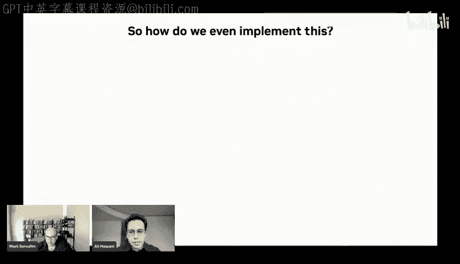

And anyway， I'm just going to share my entire screen this time。Yes。Oh oh， it didn't work did it okay。

 I'm just going to share windows again。嗯。うん。😊，They're work this time oh you're sharing this。啊。

all it's all good don't worry about it， all it's where' chilling。There we go， okay。Now you can。

 let me check。 Okay， yeah， is I'm， I'm terrible with fonts is is the font size Okay。

 Do I need to make it bigger。

The font is a very good deal Okay let me just move this thing out of the way Okay so I'll first go over the distributed gem example that we have in Culas and kind of just going over what this is going to look like to people that just want to use distributed gem so you're not really intending to muck around and make your own distributed gems or add something to it or write your own schedule you're mostly just interested in running it So there's example 65 in Culas today that you can basically start using this is an example for Hopper but only because were basically giving it a Hopper gem corner we're instantiating a hopper gem here and we' running it on Hopper but so the thing that you might want to pay attention to you're wondering whether you can actually run distributed gems with the expected performance on your system is that you do need to have that any to any envy link topology meaning basically if you're running this on a Dgx do NviDdia semi top O。

just make sure that you have all to all envy links between your GPUs that's all you really need to check then there's also additional steps that you can check to make sure that nothing's preventing peer to peer access。

Oh， I am so sorry， I just realized I still had more slides before moving on to the code。Sorry。

m going to I'm just going to switch back to slide。

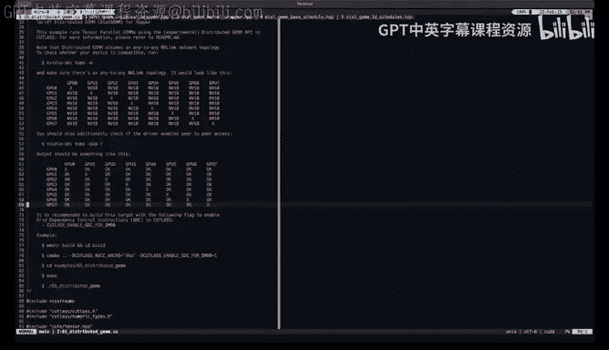

I think you're muted， Mark。It's fine I guess there was actually a question about your slides from Paul。

 which is how does fusing nickel Ops into the epilogue improve performance like wouldn't this still be launching gem kernel not we're not fusing nickel ops here is so the current implementation doesn't even use nickel we're just and we're not technically fusing explicit communication into into the kernels themselves the only place where we technically do that is the reduced scatter where we're doing remote pulses but the reason why the reason why this works is that the gem kernel is already trying to overlap epilogue remote load with the rest of the computation that's going on in the end would it be identical to like a gem with no epilo source or a local one probably not but you're not going to see that much of a difference。

Okay so so TJ is also asking so they're cutless newbie but they tried running your example and they're wondering if you could share an example of distributed gem where you have one process per GPU instead of one controlling all we don't and the reason why we didn't do that is it would be more painful to kind of we would basically need to set up communication between the processes themselves because it's not just about launching the distributed gem it's also about the fact that these processes need to also communicate each other's pointers to each other and we're also doing a reference big gem on a single GPU to like compare against to make sure that the results are accurate so no that example isn't there but I guess if there's if there is demand for it we we could try to make it work。

But yet， there isn't such an example today。Okay， so I'm just going to go back to my slides over there。

Okay。So it is， my slides are being shared， right，Yes。So how do we implement this and again。

 apologies for the now so obviously it's in the title for computation we're using cutlas and of course。

 we're doing all this partitioning and layout logic we're of course going to use cute because it's something that Culas uses at a score and it's something that makes our life easy because we don't have to think about how these things get sliced and copied we're just basically using cute primitives all over and and the internal APIs heavily based on cute as well and of course。

 for communication， like I said， because we're focusing on point to point communication。

 we can directly use BM copypy and remote pointers basically。😊，For for doing all this communication。

 So in the all gather case， we just use mem copy to copy slices of whatever tensor that were're all gathering and in the reduce scatter case。

 because we're using the epilogue， we just give the epilogue a pointer to a tensor on a remote GPU。

And for concurrency you actually have choices， but before we get into that let's just think about how concurrency on a single GPU works so couda streams by default basically execute these operations that you that you issue that you send down a stream in order and there's no concurrency if you want to do stuff concurrently one thing you can do basically is use multiple streams and this is not uncommon many applications to this but then there's a downside to using multiple streams for the same application and it's that if there is。

If there is a strong dependency between these two streams where you're making an assumption that one stream gets always gets executed before the other or the operations and one stream get executed before the ones in the other stream you're basically screwed because there is no guarantee in the order in which coupa executes operations in different streams so when we first implemented this we use multiple streams and you can think of this as okay let's say kernel B depends on the result of this memcopy and we can just flip a bit or do a MEAT to basically tell kernel B that the copy complete but then when you kind of have this sort of format。

 what can happen is that the driver could basically pick memcopy to run after kernel B and when that happens。

 kernel B's waiting on the Mem copypy Mem copies waiting on kernel B you're stuck in an infinite loop basically so this breaks the coupa programming。

So it's highly advised that if you are going to have such dependencies between streams that you should not use multiple streams you can instead use kagraphs and kagraphs are great for many things that we want to accomplish here particularly concurrency and so we have all these sorts of relations which is relationships and dependencies which is that the first stage of the gem isn't reliant on the mem copypy we just wanted it to start off immediately so we can basically have top of the tree no op node in our coagraph that basically just links to kernel A or you can think of this as the first stage of the gem and a mem copypy and then we can have an implicit or explicit dependency between the mem copypy and kernel B and of course kernel B depends on kernel A so coagraphs make this super easy and so this is what distributed gem graphs look like at least for again the point to point all gather and reduce scatter which is that we're basically。

Like I said using mem copies to all gather whether it's Tensor A， Tensor B。

 whichever one of the opera we're all gathering and we have implicit dependencies again and what this basically means is that we don't block the launch of these gems by those mem copies so basically coagraphs is unaware of this dependency but there is an implicit dependency because we do a MEMet to kind of like signal arrival to those gems and with gem+ reduced scatter you basically don't have any mem copies like I said the last TP minus1 stages of the gems have a remote epilogue source pointer basically。

So for concurrency we're basically just using kudic graphs and then there's another design choice which is we can do a monolithic kernel which is what we tried first and basically this just means that to create a distributed gem you just put a for loop around a cutless gem and you can do this relatively simply but this makes a couple of assumptions so the way why you would want to do this is it doesn't really make sense for you to give up all of these SMs that CTAs of your first gem end up occupying just to do the second gem if they're going to be gems of the same size and the same properties you might want to just keep your hold on those SMs and not give them up and just move on to the next gem。

The problem with this is it requires it's very high maintenance you。

 first of all you can only support persistent kernels because you are going to need a grid levelve sink and it doesn't really make sense outside the context of persistent kernels after each stage you have to move pointers to effectively move to the next stage of the gem but doing this with the TMA is especially painful and it also requires some extra points of synchronization and memory barriers and that slows you down basically。

So we're not doing that anymore， we just went with launching multiple kernels so you just launched a single gem for each one of your pipeline stages and this supports all schedules。

 even non-proistence schedules， of course if you can just go with persistent schedules and then individual gems can not only differ in the pointers in the portion of the problem they're working on they can be different gems。

 one of them could have let's say higher precision in I don't know。

 the epilogue source for instance could be higher precision in some of these not all of them you could have an epilogue source in some but not all they can be they can be gem kernels with different code essentially and there's also one fewer memory barrier in this implementation because well the kernel launch technically does do that memory barrier for you。

The the problem with this though is you know we're back at the same problem which is that there's the launch latency so one gem finishes there's the launch latency of the next gem and you have to kind of basically not occupy a sums in that teeny tiny frame time frame between those two and then the way we handle that is with something called programmatic dependent launch which is a feature that's new to Hopper that's new 1 GPs starting Hopper so Hopper and labor GPs can use this feature and so。

Cutagraphs already minimize， for the most part， the kernel launch latency for us。

 like that's one of the benefits of using graphs。But then with PDL。

 we can actually overlap the execution of two different kernels in the same stream。

 kernels that have dependencies。And we can programmatically trigger the memory barrier and kind of have one kernel wait until the previous kernel has flushed its memory。

so。To give you an idea of how this works and why this is a feature。

 not all of the time that you spend in a kernel is spent on multiplying matrices or doing work。

 some of it is just generic ramp up time， particularly with persistent kernels and more specialized kernels you have this you basically are setting everything up setting up the shared memory you're setting up barriers you're basically setting up with different work groups do in case of Hopper。

 so there is some process that's just going to be your ramp up time。

After which you start doing Tensor core operations and you start continuously just moving data into local memory and issuing Tensor core instructions and of course between kernels。

 you always have a memory barrier， but then with PDL。

 the thing that you can do is that you can issue a single you can use a single instruction to basically tell the driver that you're about to finish your work and you can basically unblock the kernel the subsequent kernel in the stream from from being launched。

 so if there are SMs that it can occupy， it will do thatll it'll start occupying resources。

 the CTs will start working and the hope is that you can overlap the ramp up time in your subsequent kernel with the wind down time of your primary kernel。

And then you can also programmatically trigger something that waits for kernel A to flushes the results and memory and also serves as a memory barrier。

 so PDL is very useful， I highly recommend folks to look at it and I do have some references for PDL at the end of these slides。

Okay， so now it's time to look at the implementation。So I'm just going to switch my screen share。

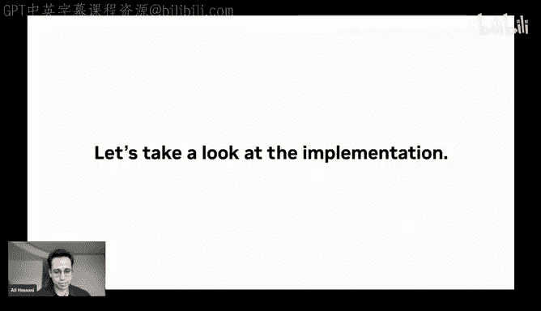

嗯。ok。Okay， so there we go。 Okay， and and the reason why I remembered that I screwed this up was that I'm referencing something that's related to PdL here。

 And， and I remember I had a slide on PDL。 Otherwise， I would have gone forward。 But anyway。

 So if you want to build the example。 Again， this is， this is something that's related to PDL。

 You want to enable this flag。 while you're， you're building this example to make sure that PDL is enabled。

 It'll still work without PDL。 it just might have slightly worse performance。

But so the rest of this is relatively similar if we exclude sorry if we exclude this part。

 the rest of it is pretty similar to your average cutless example where you're just defining all your types defining the static parameters with which you're going to instantiate your kernel。

 you have your collective epilogue builds collective main loop。

 you put them together and you build a gem kernel basically。

 and then you wrap it with the universal gem adapter and then you basically have a gem on which you can just call gem。

 run。And so the difference when you want to do a distributed gem as far as instantiation goes is just three lines two lines basically or really one line。

 you basically you basically define what distributed gem schedule you want to use currently we have only four schedules implemented all of which are two of which are point to point all gather plus gem and the other two are point to point gem plus reduce scatter。

 but more patterns or schedules are on the way， but then all you really do all you really need to do is is pick that pattern and indicate。

The number of processors you have and and this has to be static for various reasons。

 so here this example by default is TP8， so it's going to run on8 GPUs with any to any en link between them。

and the reason why there isn't a safe count is that because again。

 like this API for now it's focused on point to point communication so you're kind of stuck with TP stages in that case。

But then the rest of it is pretty similar， you just build any cutla gem kernel and then you basically just wrap it with the distributed gem kernel wrapper so you just give it the gem kernel instantiation and the distributed gem schedule and then you have a distributed gem kernel and then distributed for for the device layer you also have a distributed gem universal adapter so the idea is that like this is kernel level cutlesss and this is device level cutlas。

 this is the thing that has the interface for initializing in launching the kernel。

And so the rest of the example there's not much to it other than you're just setting up many tensors for you TP devices and you also have one referenceor one set of reference tensors that are going to be the gem that gets executed on a single device on GPU0 just as a reference because you're also going to verify whether it's correct or not。

And then the rest of it is just using the distributed gem the distributed gem schedule API to kind of figure out。

 okay what are going what's the local shape of these tensor is going to be how much memory am I going to need for a workspace for all these buffers and all of that but it's actually pretty simple you really need to be really aware of is you basically talk to the distributed gem API to figure out what the local shapes of the tensors are going to look like and you basically know this is like when this gets integrated into like a deep learning framework or any framework using this this will basically just be a static assert because the framework is already kind of exposing the schedule to the user somehow and so it would just use this to make sure that all the shapes line up and match。

And then this is the part that I was talking about that you can basically have different GPUs talk to each other over enV like just by using the driver API so you don't really need nickel here technically。

 and you're basically just enabling peer device access and then basically you can just reference pointers on remote GPUs and just use them on a different GPU but again。

 this is again very much limited to point to point communication。

So there's that and then there's just a bunch of other things to set up distributed gem arguments I'm just going to quickly skip over them。

 but like the heart of it really is that you're basically what gets a little bit complicated is that instead of having a single distributed gem that you you basically set up。

 you're setting up an array because like it was pointed out earlier。

 this is a single process that's going to execute a distributed gem on multiple GPUs if you had single process single GPU。

 then it would be just a single distributed gem but you would have to communicate the pointers to like the workspaces and everything and then the rest of it is again relatively relatively similar regardless of what distributed gem you do but kind of necessary for all distributed gems in that they're going to have some workspace that's reserved mostly for the kernel。

 there's some exclusive workspace that's reserved for barrier pointers and everything this is just saying that this workspace should never be。

You know， reused in anywhere else in your application， but again its it's a detail that。

That I'll just leave for folks to find out on their own。

 But then the rest of it is pretty similar to any cutless gem。

 You have an initialized step where you just reset the basically the bets in the workspace if you need to you set up all your cutless kernel parameters And then after that it's just gem dot run it's really as simple as that and it works like like the end goal is that the interface would look as close as possible to any single GPU cutless gem。

But then so to go over what these wrappers do and what their purpose is so the device wrapper is mostly there to coordinate all the kgraph logic and everything that's you know going to basically happen meta kernel so these are these are things that do not occur at the kernel level you're not really adding anything to the gem kernels that you get to execute these are just things that coordinate everything else and so i'm just going to skip over most of the the stuff that's that's hard to explain here but all this really is set up to do is just all the you know different buffer management and tiling and charting and all of that and underneath all of this is just cute layouts and cute parttioning and all of that so it's not really that different the only thing that is slightly different is that it doesn't expect you to be aware of or even care about the buffer space that you need for all of this。

Communication that's going on so it's just basically going to have its own buffer space it's just going to tell you I'm going to need these many bitetes for for my buffer where basically it's going to communicate stuff into or or out of。

And then by the time you're done with the distributed object， you can just discard the buffer。

So and then like initialize again， it's all about setting up and coordinating all of this really and then there's also again I'm just going to skip over this because a lot of this is also things that are likely going to be slightly refactored and changed in the future because again this was written with the assumption that these are going to be point to point。

 but obviously it's going to be extended far beyond that。

And then the part where all the kuda graph stuff happens is in the construct graph method basically where we're essentially doing everything I just visualize。

 you're creating a new kuda graph， you're basically first you have to add a barrier node that's just to ensure that before we start the first gem all the like assuming this is in a neural network type of situation。

 all the previous operations have already finished and like all the GPUs have reached this barrier point。

And only then we can start the gems so this is kind of critical for this。

 but then the rest of it if if there is like a mem copy branch。

 we're basically going to set it up and have a me copy and this is that implicit dependency that I mentioned it's just a me set we basically just have we basically just have one element somewhere that we flip from like a zero to one and subsequent gems that are going to be dependent on this are basically just going to pull this until it's flipped。

And the rest of it， there's really nothing to it， we use a mix of stream capture and just direct coUDa graph APIs。

For doing different things。 but functionally not that different。

 And then there's also some extra stuff for PL。 But again。

 like these are these would be like way too time consuming to go over in detail。

 But the thing I really want to talk about or the schedules。 but before that。

 I'll just quickly go over the kernel wrapper， which is much much simpler before we move on to new things there's like a lot of questions。

 So maybe can you see the chat， by the way or no， that's that's the thing I can't see anything else I can only Okay so okay。

 it was like a few things。 So Paul's asking， could you point us to cutless unit test covering distributed gem。

 Does it support streamcase style gem as well So sorry。

 let me look at the what was the first part of the question。

 could you point us to cutless unit tests covering distributed gem So there's no unit tests and cutless covering distributed gem yet。

 there's also no profile or support。 I'll talk a little bit about that later。

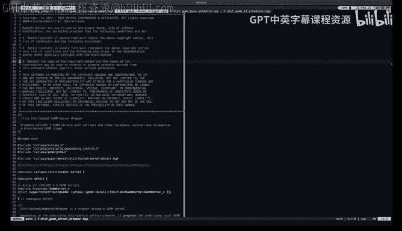

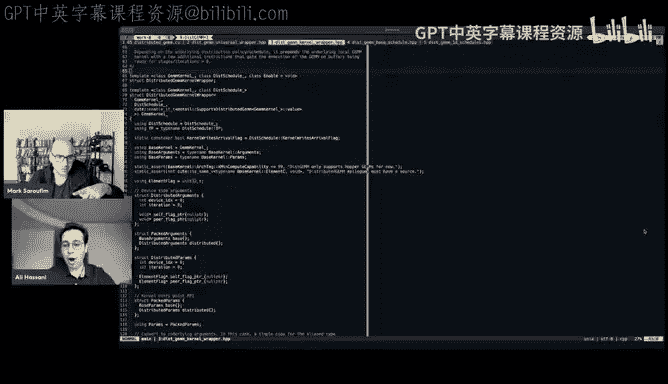

It just lives as an example right now， but the API is I could actually just just show this here if you're looking for where the core logic is it's under cutless experimental distributed and then you have the device and kernel layers in the schedules so there's no unit tests there's just the example and it it does support any cutlesss。

It does support any other cutless kernel the only thing that you might might want to be mindful about when you're using StreK is that so the example runs many iterations of distributed gem to profile it and it doesn't wipe the scratch space memory in between and StK is particularly finicky about that so if you swap in a streamamK kernel into the example just be careful about that because that can cause you problems but' there's no assumptions being made about the type of the kernel really you can use any existing cutlas kernel' that's pretty much the whole gold here。

Or the dream so there's another question by Chao Chang。

 which is have you compared the peer to peeristic communication with Nv as HM we have not Adley there are plenty of other comparisons that we definitely do have to make and reachM as one of them the reason why we haven't been able to do that is you really want to make sure that your gems are comparable。

 you don't want to compare apples and oranges and the reason why it's so difficult to compare to other implementations of the same idea is basically that that we need to make sure that we have the best implementation of any of these approaches within cutlas to be able to then fairly compare them to each other but eventually that is something that we would do we would like all kinds of communication and different types of backends to be supported so we can just compare all of these within cutlas directly。

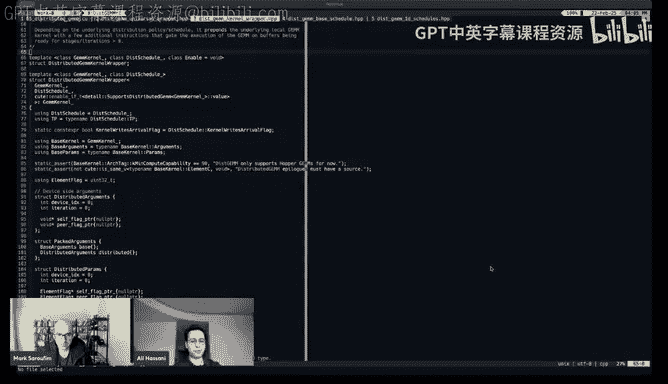

So Daniel has a very meaty question so it might take me a while to read it out but and the allga followed by gem implementation the mem copy done by the GPU's copy engines Yes exactly that's another that's another reason why like we didn't even attempt to like trigger their mem copy from device is that we want the SMs to be mostly just concerned with just go do your gems just don't don't don't carve out Ss for anything else so yes。

 when we're doing the mem copy because we're directly using the runtime API it's just it's not going to issue a kernel that does the me copy it's just going to use the copy engines so that is correct。

So the follow up to that， if so， I feel like what you really want is the ability for a singlefuse kernel to wait on the completion of the copies within the kernel itself。

 which we don't have a clear API to do。嗯。Sing fusesed kernel to wait on the completion of the copies within the kernel itself by a single fuseed kernel。

 do we mean are you referring to just one kernel to do all the gem stages？

It's possible because then they later follow up without that。

 you must use multiple gem kernels for proper synchronization with mem copies finishing。Right。

 so yes， that that is fair that's the monolithic kernel that I described in the slide so in that case we weren't we basically wouldn't exit the kernel when we were done with a stage we would just have a for loop over the entire thing and then wait on the next iteration but sadly that does not work out to be better so the thing is that we can pretty much we can pretty much minimize the launch latency and all the problems with launching multiple kernels with kgraphs and PDL so that way you don't technically there's really no point in having all this be a single kernel it's actually very much limiting for you to do that because like one problem is you need an extra memory barrier when you launch a new kernel you technically don't have to do that it is done for you and then PDL also has that like wait on dependentant grit that kind of gives you that did we were first dealing with that kind of implementation where you've just had。

One kernel with a four loop in it and it was constantly pulling whether it can move on to the next stage or not。

 but it just does not end up working as well as you might expect the split kernel choice just just works better。

 at least it has in our case。That's good Yeah， I think we keep on that Okay cool So the kernel wrapper is like the simplest part of this actually。

 and so the reason for that is we actually don't add much to the kernel and this is why this is the whole idea behind you know this can support any cutless kernel or rather any compatible cutless kernel that's just to say any cutless 3。

X kernel and the reason for that is we really don't add much to the kernel if we want to look at what we add to the device code the lit to the literal literal kernel is just right here we're adding two instructions that are related to PL these are literally going to be Ptex instructions and then we have just pulling on that pointer to make sure that we're ready to proceed with the stage。

 whether communication from from the previous stage has been completed or basically it's just an arrival signal from a peer device and then we also have。

😊。

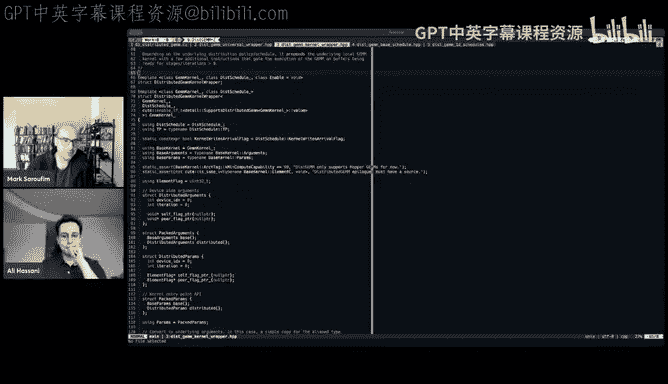

あ。Another we basically just have another barrier buffer and this is just this is optional technically。

 this is mostly just checking whether if there was a M copy。

 whether the mum copy is finished or not so this is just going to be constantly polling on that。

On on that local memory pointer and then it's just the cutless jump so base kernel is literally the cutless jump kernel and you just executed once and you exit So you're only adding a few you're only prepending essentially your kernel with a few instructions and for the most part。

 some of them mostly even a single CTA cares so is this is why it's super easy for this to support in theory any other cutless jump kernel is that you're not really adding much to the kernel it's all about how you coordinate these kernels to work with each other and also if if you do build cutless kernels with GDC that's what you need to do to support PL you technically do have these instructions later on in the kernel they're just positioned differently but now we're just moving them up here。

So that's really all there really as to the kernel wrap or the rest of it is just mostly just down to how the schedules are defined and so I'll first just go over how the schedules are defined right now but again I'll urge you to be cautious if you're trying to like experiment with with the schedules here because the part of the gem API that is going to change heavily over time is going to be this because there's still many changes that we have to make for this to support all kinds of different distributed gem schedules you know it might not be point to point might be collective and so on and so forth。

And also you can go beyond one dimensional tiling， but anyway so the way these are mostly going to be defined is just by a few cute layouts that define essentially first you have Trs and you just define how your opera are going to be tiled it's expressed in the MKL terms so that you just use one Tler and you can just basically figure out how different tensors are being tiled because Tensor is always going to be M by K these is going to be n by K and see is going CN are going to be M by N so you have two levels of Ts one is the sharding that you do basically to distribute stuff among GPUs and the second layer of tiling is the tiling that you do on device for pipeing。

And then you also have one layout that is being used just as a function from integer to integers。

 it's not really technically describing any particular layout just to figure out given an iteration and the device index who's going to be your peer device because sometimes you do direct memory access from your peers。

 so just figuring out which peer device you should access in this iteration just comes from this。

 and then there's iteration mappings and and if you're familiar with how cutes used within cutlas usually you you end up defining you end up creating something it's called a thread value layout which basically tells you which value of which thread is pointing it basically maps some value that a thread is going to own or access to a coordinate in any of the matrices or opera that you're working with。

So over there you're dealing with you know threads as in you know the threads in your thread block or your CTA and values in your operations that you're going to access over here。

 you're technically dealing with you could could call this a device iteration mapping so you have different device indices or GPU indices and you're also mapping not to you know you're basically mapping to tiles of your original fully materialized tensors so that's what what this really is and there's also an offset parameter but i'm not really going to get too much into detail about this but so the way you define this is basically just by these things and a few other。

and a few other just booleanions and numbers so this is very similar to the reduced scatter pattern that we saw in the slides we'retyling the matrix A here or we can just look at the matrix B1 so we're just basically here describing what maps to what and which tiles get visited at which iteration depending on the device you're on and you also notice like the mem copies。

 whether there's a mem copy is being explicitly defined here so if we're mem copying a or B indicated here if you're going to write an arrival flag which the reduced scatter schedules only do meaning you just signal to your peer that you've produce your partial result and it can start reading it if it's done with its previous gem stage so you can explicitly specify that and you also designate a number of buffers。

That you're going to need for different tensors because you are going to need some buffer space because it's super helpful if you if there are no conflicts between your memory。

 it's always easy to it's always better to spend that extra memory and have extra space so you don't block communication you can always communicate as soon as you the previous communications done and similarly with reduce scatter。

 this communication is over outputs so other devices are going to be accessing your outputs for your partial results so instead of blocking them and forcing them to access it only within a certain period of time which you can do if you don't have the memory we just give it more memory so that it has enough memory for each of those pipeline stages so it's writing to unique locations and memory in different stages。

So another thing I'll note is that for the most part。

 because again this is all being we're trying to define this or get this to be as close as as we can to the rest of the APIs in Culas another thing you can notice is that between the schedules tiling A and tiling B。

 the only difference is that we've changed the places of M& N like that's all you really need to do and similarly with all gather we have the same thing if you want to switch between all gathering rows of a columns of B although I shouldn't be using those terms here。

 whether you're doing that when you implement one to implement the other you just swap the places of M&N but there is sorry about that there is like documentation here that kind of again it' based loosely on those visualizations that we saw that kind of explain try to explain why we have these certain definition。

and certain layouts and what they do and why it's kind of set up this way but so you can basically just think about this as you can basically implement new schedules that work somewhat differently because again there's so many variables you can you might not want like an identity mapping between what tile you start off owning and what tile you finish owning for instance you can have permutations of that so can you can write many。

 many more schedules that could be more appropriate for your use case but yeah this is like the schedules is basically the place where you would do that and the rest of it there is a base schedule that these are all technically inheriting from and this is all the generic stuff that's going to take all of these things that you gave it and just basically provide APIs for the rest of the disGM API to use to figure things out like local shapes and okay I want to。

It it's all there so that it's easier for the rest of this gem to just figure out what the local gems are going to look like。

 what pointers they're going to need， where the tensors are going to be and so on。嗯。

I'll pause if there's any more questions， otherwise we can move on to the demo。

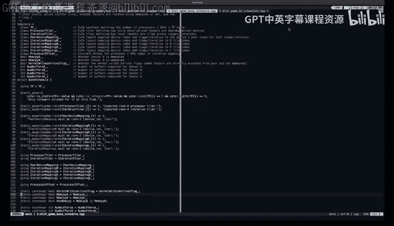

I think let's keep on with the demoing， the question they're coming is really a bit deferred。

 so I'll just like well'll read them out they're here。Okay， so I'll just。

Go back to sharing my slides。嗯。I don't see any。Is is it there now？

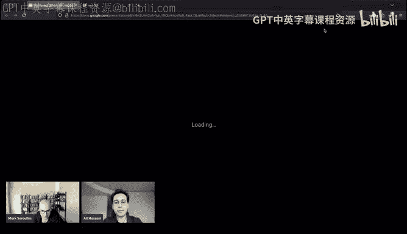

Y， perfect so so this is a prerecorded demo on an H100 DGX and it's been sped up for convenience because we don't want to wait the time that it's going to take for it to set up all these tensors and run the reference but so this was oh sorry it goes back to the beginning so quickly I'm just going to pause it the next time so when you run this example。

 like I said， it's going to use GPU0 to run a single reference gem to figure out to basically have a reference output we can compare against and then it's going to set up and run distributed gem once and check correctness and then it's going to basically benchmark it' going to warm up for 10 iterations run another 100 iterations and then it also is going to print out both the global problem size。

 the size of the actual gem you're computing across these devices and the size of the local gems each gem that you end up executing for。

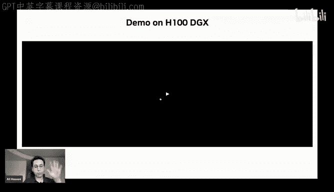

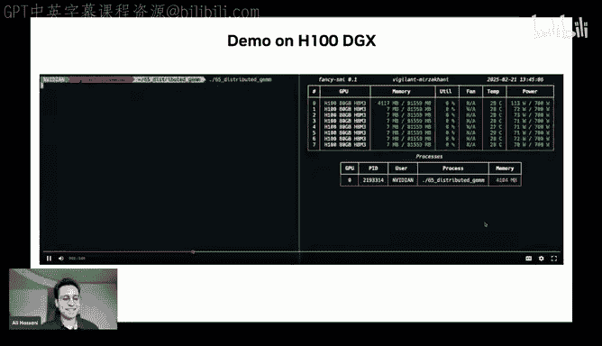

just a single stage of a single GPU and you really want to be mindful of this number because like I said。

 if this number ends up being a really small gem if your arithmetic intensity dips below the machine balance or if you have a really tall and skinny gem you're basically going to be memory bandwidth bound so you shouldn't really expect top notch performance but then it also reports an effective flops per second rate that it achieves this was an FP8 example so at about 1。

35 or 1。36 petaf flops per second this would be I don't know0 6570% of speed of light but at the same time like this is kind of a small gem like I think a you profile with a cuts profile or the same local gem can only achieve like 1500。

Traopps per second for that reason。But we also actually have a special treat。

 we recently tried running this on a B200 TGX， and this is why I said this is not really limited to any architecture。

 we basically took the same example， replaced the gem car with a blackwell gem and started running it。

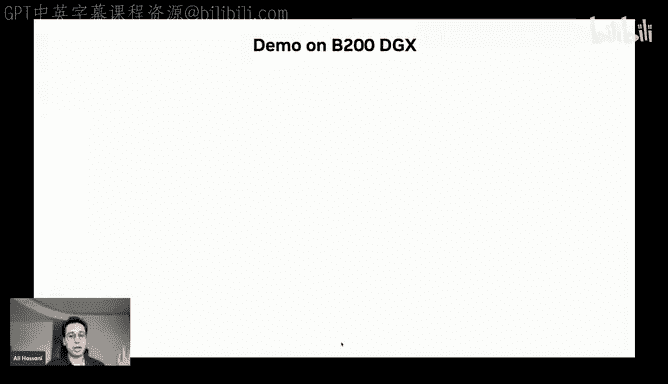

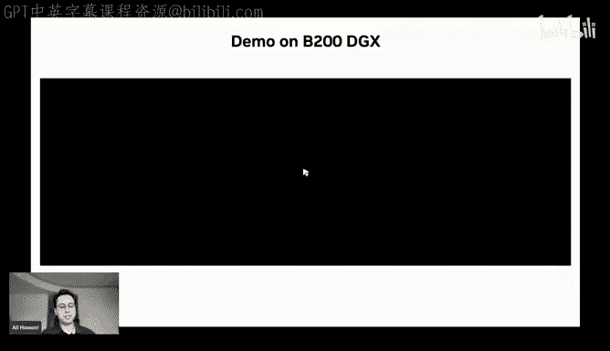

So on Blackwell it can still pretty much catch up relatively in the same way as in it gives you like at least 80% of the performance of your local jump。

 whatever that is and in this case we can actually get pretty close to three petaflops per second with just TPA8。

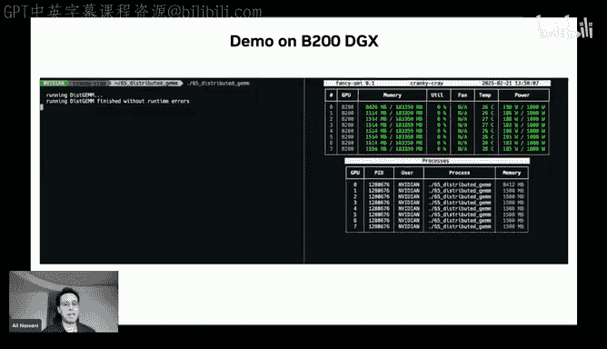

Which is like more than 2 x what we saw on hover but again mind you this is just a single example that we're running this is like a shape that we took from I believe Lama 40 5B like this is a shape of a single either FC1 or Fc2 layer and in Lama 4 or5B with a。

 you know 16 k tokens。So yeah that's and yeah I guess that's it So the next steps for distributed gem are we obviously are going to keep improving the internal API because like I said the current scheduler or API only implements a subset of even the point to point communication schedules that you can implement you can go beyond one dimensional scheduling there's all sorts of these things that we're going to continue to improve and so hopefully the eventual API like the schedule API will support not only point to point communication not only pipeline communication but really a wide range of different implementations and at that point。

 yes， you would you would want to you have in network collectives for which you wouldn't need to use something like nickel if we want to have we are going to have like collective gems so for that you are going to need nickel there's no way around that if you implement your own network。

Collectives probably not going to work out that great but we also want to add profile or support and yeah that would also come with unit tests but the whole idea is profiling is extremely important for even single GPU gems if you want to reach speed of like performance you need to profile because like I said cutless can generate thousands。

 tens of thousands of kernels for you and you should profiling is the only the only deterministic way for you to find the best one heuristics alone can only get you so far and this gem is no exception to that you really want to profile with all of these additional communications because even though you're kind of overlapping communication there's still going to be you know there's still going to be conflicts and the copy engine there's still going to be a lot of other things affecting the end to end runtime of distributed gem so profiling distributed gem specifically is something。

that is missing and is something that can potentially even push its performance further and again。

 like I said， once we have the improved internal API we're going to implement more more schedules in the four that we have right now or just the tip of the iceberg。

 but enough to implement just point to point tensor parallelism within the context of like transformer tensor parallelism right now。

And I do want to acknowledge that this was a collaboration between tree Las and HPC Gar at Georgia Tech and the coupleless team at NVDdia and the Network research group at NVDdia Research。

 and I'm very grateful to my collaborators and everyone else。

 particularly folks from NNVDdia who have been very supportive of this project。

And I listed a few references for particularly parallel matrix multiplies and collective communications。

 some references for PL that I think might be useful to folks here and some references for kgraphs because kgraphs is much more powerful than just stream capture and I highly recommend people to look at that you can do a lot with kagraphs that you know。

Basically removes your like you don't have to fuse everything into carnal Scgraphs are very powerful depending on what you want to do and that's the end of my presentation so I guess we could just stop here for questions。

是。Great， thank you so much， Li， this is awesome。Yes， so I guess like as questions are coming in。

 I just want to make maybe like a logistical announcement for tomorrow。

 So we do have a talk scheduled for tomorrow at 10 a。

 which is going to be about we basically are putting a bunch of GPUs on Discord so you can like basically compete on kernels of different shapes So hopefully like it should help people sort of micro benchmarkch and profile out things in public。

😊，But yeah in the meantime， if people have questions to Lee please let us know Lee I guess you'll be okay sharing the slides with me so I can post them on of course yeah no i'll get them to you yeah perfect yeah。

 so I guess there's one question from from Daniel again can you read the questions now by the way。

I like the question sent to be like long。 Sure， if I recall correctly， Kuta， sorry。

 let me make sure I didn't miss anything from earlier that you must， no no， that's the one familiar。

 If I recall correctly， Kuta M copypy Asnc doesn't work with infinna band or。

I'm not sure what broke is meaning this won't work outside the N V link yes。

 that's that's very much true。 So you you technically don't really even want to do tensor parallelism outside the context of something like an N VL network you can do parallelism you can do different kinds of parallelism over Infinna band。

 but Tensor parallelism over infinib band。It's's not going to look too great because you're essentially at that point。

 your bandwidth too little for you to be able to just for it to make sense to divide up a single operation or have your grain size for parallelism be a single operation or a single layer。

 So yes， you are you are correct about that。 This won't work over。

This will work over infinna bandm and yeah the the driver API probably doesn't even oh allow that to happen if this restriction were removed with this method would be beneficial for super super large mat mos。

 basically the lower。Ive。I can see a way that you could make that happen like basically run a super super large gem over first and infinna band network。

 And then you would you would also have some local。

 you would have more communication within the Nvy link groups and then you would have fewer communications or or somehow concurrent communications over infinna band it's it's hard to speculate。

 but I wouldn't be surprised if if it works Oh R DMMA over con Ether Oh cool So yeah。

 it could be possible and。😊，I wouldn wouldn't be surprised if the eventual distributed gem API that that we're trying to build here helps with that because a lot of this is just similar things that you would do at the kernel level。

 which is a lot of layout math and index bookkeeping and a lot of that is just being done with cute so kagraphs and cute primitives and the whole cutless API I think and definitely help with that。

I believe Infinna band achieve 50 gigabytes per second these days。 env link is at 100 gigabytes。

 I might be off， but that's not a huge。 Well， so I would definitely be out of my depth here I'm not I'm definitely not an expert and networks but so so bandwidth is one thing latency is another and yeah。

 I'm not really sure how Infinno band bandwidths flare up against andv like these days oh yeah。

 and yeah， those are if they're on the same port with with env links it's not just that two GPUus can communicate at that well actually no if you're looking at So yeah with Infinna band I would guess that that's communication between notes and not all the GPUus So it would look a little different So over here we have all the GPs kind of freely communicating with each other and and the reason why you can kind of do that almost without feeling it。

I because of like the any to any enV link， but yeah。

 I would be super interested to see if something like this could be made to work over Infinnovavan in addition to NV link。

 but like the schedules would have to look different。ok。All right。

 I think then this might be a good time to think Ali。

 if people want to reach out to you after this to ask you more questions， are you on the Discord。

 should they email you Sure， Im I don't think I am on the on the Discd。

 It's been a while since I even checked my Discord。 but yeah。

 I can I can share my email also on Twitter either way works。 Yeah， absolutely。😊，Okay。

 sweet well thank you so much everyone and CN andC folks tomorrow， thank you El， thank you N。😊。

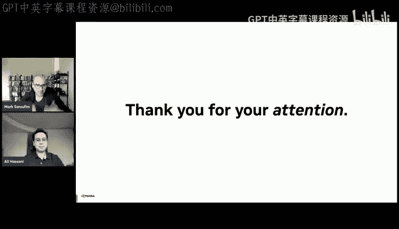

喂。