# GPU MODE《CUDA、GPU编程1-53课｜GPU MODE》中英字幕（deepseek-v3.2 - P4：-20240205-Lecture 4 Compute and Memory Basics.zh_en - GPT中英字幕课程资源 - BV1QZ421N7pT

Hello and welcome to today's session of our Ka mode Read Group。

We are reading the programming massively parallel Pro book。

 and today we are reviewing chapters four and five in the material。

So what's covered there is the compute and memory basics。

Remember that we want to go fast on the GPUs。And for that。

 we have to kind of dive a bit into how they are doing it。 I'm Tom Veman。 I'm with Le App， the blog。

And I run my own small consulting company， but actually next week， I'm starting。lightning air。

My good friends there。Okay， so the first thing to look at as the compute architecture the scheduling。

 we saw that you had like threads and blocks in the last two sessions already and。

You know that by now， but how does that relate to how things actually run on the GPU and what do we have to know to keep the GPU busy？

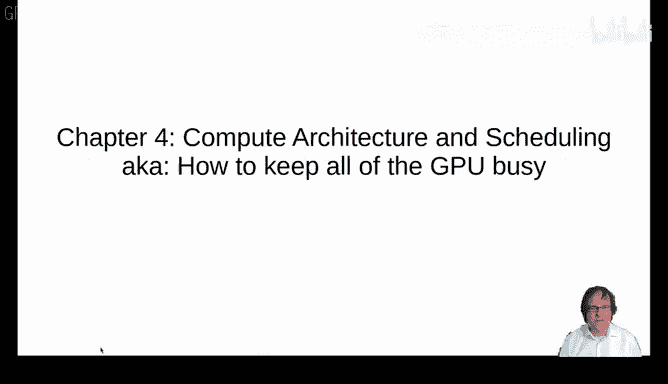

So the first thing here is that。In contrast to the CPU where you have like lots of things in a CPU core。

 a fetch decoder unit and all that， and then there's an arithmetic logic unit， a single one per core。

 or more or less a single one。In contrast to that on the right， you see the streaming multiprocessor。

 or actually this is about one quarter of it， a compute unit in or a computational unit in here。

 it has many arithmetic logical units and it has some bit of context for each of them but there's a lot of shared context and so each of these will run one thread and so this will be the thread information but then there will be a lot of shared information and in particular fetching and decoding the commands。

I will。Be jointly for a group of threats。Originally the shared part included the program counter as well that tells the GPU like what's next to compute now each has one and this is one of the sources where the book is a bit outdated if you have the more recent GPUs Vol and following as a model。

Okay， so this is how the book pictures。The GPU with its multiple streaming multiprocessors。

 if we look at a real GPU from today， so my GPU is a RTX 390 or one of them。嗯。

This has 82 streaming multiprocessors。 You see them on here。呃。And。And all these are。

More or less independent the streaming multiprocessors， but we have lots of them。

They share one common L2 k that's here in the middle。

 And one thing that the consumer or non data center GPUs don't have are floating point64 course。

 I've left this note in here that the。FP64 rate is 164th of the FP2 Tlo rate and this is because it just doesn't it has two compute units for 64 bit floating points just to make the programs run at all but they are not going to be fast and of course Andreas notice this when you use。

64 B floats e constants per accident。 and some of your computation will be in the 64 B regime。

 and this will be slow。Okay， so let's look at one of those 82 streaming multiprocessors。嗯。

It's pictured here and I took this from the white Pa that I'm linking in the last slide。嗯。

It looks like this， it has four units if you want， so four parts here。

 and each of these parts has its own register file and it own scheduling and dispatch unit for 32 threads per lock。

And so and then it has the compute units and you'll see that it has 32 FP 32 units and half of them can do in 32。

Actually， and then it has the tensor core units， but we're not going to look at that today in great detail。

So when you run a kernel， you define the block and how many threads are in a block and you define the grid layout。

 how many blocks there are， and so each thread block is assigned to one of these streaming multiprocessors。

 one of the 82，嗯。And so we don't have any control which block will go where。

In most in the most recent CPUs， GPUs， you can you can have threat block groups。

 but we'll leave that for now。 and so you have no control which block goes where and each of these streaming multiprocessors can process。

A number of threads that is higher than the max number of threads in the block。

 that means that several blocks can be assigned to the same streaming multiprocessor at once。

If all the other resource limits are kept under control， so for example， for the RTX 3090。

 you have a maximum of 1536 threads assignable to the streaming multiprocessors。

 so ideally our block size would divide this number so a block size of 256 or 512 is probably better than a block size of 124 threads。

If we want to。Make sure that there's as many threats waiting to be executed on this streaming multiprocess。

So each of these can process one warp， 32 threads at a given time。

 sometimes the warps div the threads in a warp will not be in perfect sync will discuss that and a bit later this is called divergence then only a part of a warp is executed in one of these units at each cycle。

嗯。We have the 32。FP 32 units， the 16 in 32 units and so we know that how many things can be computed as onces。

 we have a shared register file so in CPUs it's typical when you do multithreading all the registers are cleared and restored when you switch from one to another when the GPU switches between wars which it will do continuously it will leave the registers right where there are in the register file and so each warp has a share of this and we have to watch our register usage in order to keep in this limit。

Okay， so。Those are。Shared the 16 k per quarter of a streaming multiprocessor and so in total you have 64 k 32 bit registers and this is what。

What are these。Things。What are the threads on the streaming multipressos that can use？

There's an L1 cache attached directly to the streaming multiprocessor。

 and that also is the memory that gives us the shed memory。

 so these 128 kilobytes can be split between the shed memory and the L1 cache will take the remainder。

Yeah， this is our streaming mouse processor now。 and we。Heard a bit about threads， ss and blocks。

 So launching a couda kernel， you give it a block layout， how many threads there are in a block。

 and you give it a grid layout。 How many blocks should be launched in total。

So threads in a block are executed in parallel on the same streaming modch processor that we saw on the last slide。

 and it can access its shared memory。Blocks are completely independent to us。

 so Kuda is free to arbitrarily assign blocks to streaming mouse processors。

 and we don't know about execution order。So we don't we know that all threads in the block are executed in parallel and you can synchronize them。

 but we don't know like which block is executed first and we can't wait， really wait。

Usefully on another block。Thread blockss run。That run on a streaming multi processoror。

 any thread block is divided into wars of 32 threads and each warp can run on a fixed of these processing units within the streaming multiprocessor。

And all wars。Simultaneously assigned to their processing units， they take turns。

 but they registeristic。As an aside on AMD hardware and terminology， they call the warps wave fronts。

 and they typically have a size of 64。Threads， but there's a compiler option reducing that to 32。

But we're not going to dig into that deeply today。Okay， so， but you also saw， for example。

 in Jeremy's smartmmo kernel that you can have a multidimensional grid of threads。

 And so one thing where。Where we can ask， well， how is this put into a linear order and so what happens is that they're just enumerated with the threat IDX dox being the fastest moving dimension and the other ones being slower。

And if we know this like this。And you write the X index first when you have those little three indexes for the indices for the threads。

 then this is a bit different to what's given in the book。

But so actually you can you don't have to believe me here。

 you can try this out and because I wrote this last。Right as the bottomptum。

I've wrote a little curtain here that uses shuffle instructions to show for a given thread。

And I launched it。3。I launch a thread block layout that has eight times， eight times eight threads。

But you can see that like the x order， which is here the first。This is the rapidly。

 most rapidly moving， this is the Y coordinate， and so these will be all the threads that are in a warp together。

嗯。Always good to check those assumptions when you read something in a book。

 or I'm telling you something that you don't believe， try to experiment with it and see if that's a。

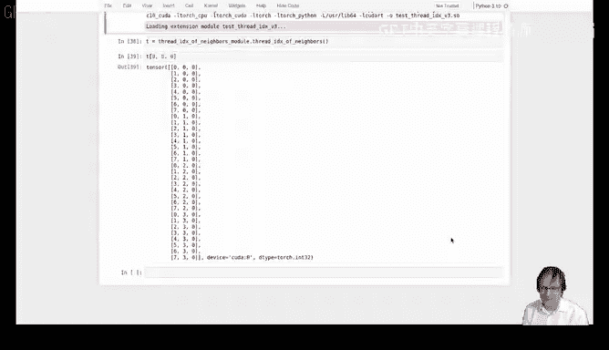

Okay。So those ws， ideally。Exeed in parallel。 All 32 threads do the same thing。

 That is where the GPUs are really， really fast。 But sometimes we have control flow。

 So what happens if we have like an if clause。What happens here is that traditionally。

 I said that you only have one thread counter for multiple threads for other threads in a war。

That is。And if we have something like that， the GPU will disable all the threads that don't match the condition。

 and then it will just execute those instructions step by step here it will。

Re enableable the disabled threads and disable the others and then execute this。 And then finally。

 we reach the end of the if and there it's they are reconverging。

 And you can see this here in the diagram that I took from。And in video blog posts， I'm also linking。

And you have first， you have the divergence and only the part where the threat index is smaller than4 executes A and B。

 and then。X and Y are executed。One of the things you have to be careful with that is that you can do interthread communication because if you wait here within the war。

 so if you wait for something， if you wait for these threads here， you will be out of。

One thing that makes this problem ands a and if you do this， if you have thread divergence。

 this part here， there's part of the GPU sitting idle whenever there's one of those words spotts。

And so you want to avoid thread warp divergence if you can。

So one special thing here is you have conditional load store instructions and so these will not cause divergence and so I like to write my load instructions for that with such a conditional we'll see that a matrix multiplication。

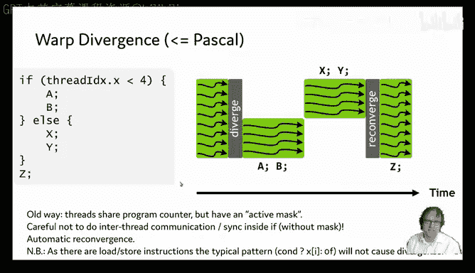

Later today。Okay， so。More recent GPUs have introduced one program counter per thread and so what this enables is that the GPU can take turns executing this part and this part because they are distinct groups of threads involved and it will group the threads by those that have the same program counter and then it can interleave and this is of advantage if one of these groups does a memory access and the other one doesn't。

Then this one can continue while this one is waiting for the memory bits to arrive。

That's the advantage。 A bit of the di is that the reconvergence isn't。As automatic anymore。

 you see here that the Z is executed piece by piece too， and this of course。

 is inefficient and now you have a synchronization command that you can。

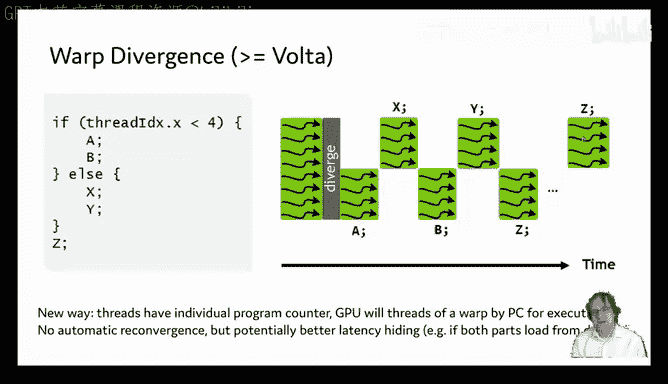

Insert here， the sink warp。 It will cause all the threads in the warp to sink。 And so after that。

 we're executing the same thing again。In a single step。

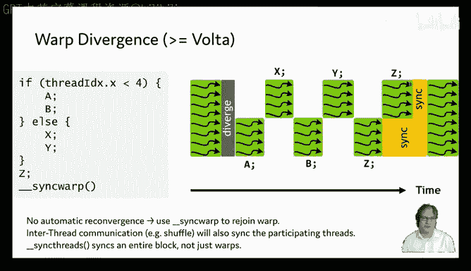

This is warp divergent。You can also have a different type of work dirgence whenever you have。

Loops which have which different number of iterations， like a for loop with a variable upper bound。

 you will have essentially the same effect。

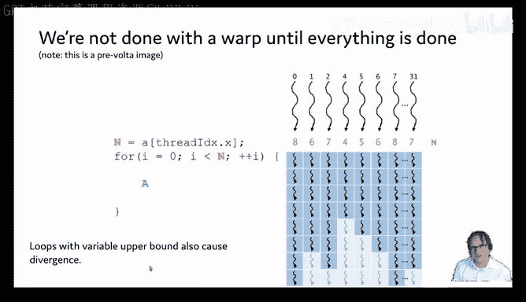

Okay， so what does all that mean for us when we want to get good occupancy。

 which is the fancy word for keep all the bits busy。

 then we have to balance all the available constraints and try to get everything use as much as possible so we have 82 streaming multiprocessors。

 which basically means having many blocks is good because we can keep all those streaming multiprocessors busy。

One thing here for comparison， if you have like embedded GPUs， like the jets and models。

 they have only。Two hands full of straightening large processors。

 so there's a lot smaller here that number。We can schedule up to 1。

536 threads per string multi processorces， so a power of two block size of smaller than 512 is desirable in order to make sure that we can occupy all these things in order to have the most opportunity to execute something。

At each given clock cycle， we want to avoid the divergence。Between threads in a war。

 because that would mean that。Whatever threads are not executing that at a given point。

 they just sit， let some units sit idle。 And we want to avoid floating point 64 and in 64 calculations if we can。

 in particular， on the consumer GPs because there will be really slow。

 I'm always insisting on this in 64 as well， because I got burned there once when I。

Pored the Pytoch beome kernels from the old torch scheme to the new Pytorch1。

 I accidentally switched the indexing to 64 bits and then spent a lot of time asking myself why the kernel the new kernel was slower then I figured out all sorts of optimizations before I hit the right one and so now the batchome kernel and Pytorch is is reasonably fast which is a good result I guess。

We have the shared memory and register files。 If we use a lot of shared memory or a。

Huge number of registerggis in our threads， this limits the number of scheduled threads on a stream much processor。

嗯。Related to this， we can also use launch Bos to advise the compiler of the number of threads we are going to call it with。

 but then registers builds makes things slow because it will go from registers to much slower local memory。

To store the variables。This is all like a bit complicated to calculate so previously there was an exit sheet for the occupancy calculation now this is part of inside compute and I venture that we're going to see some of that in the profiling。

Sessions that we're going to take。One of the things here is we have lots of magic numbers and so we can possibly memorize those。

 And so happily there's an API to query them。 and so in torch you have torch kuda。😊，あ。

Get device proper properties。And if we just execute that， we need to pass a device。Okay。

 we see the name。The compute arch， the total memory。 but then there's also the processor count。

Which is this magic 82 number。 And if we。Ca if we， if we keep the variable around。

 we see that there's some more information， for example， here's the registers per multiprocessor 64K。

 just like we discussed， but also there is。Maximum number of threads per multi processor。

 And this is the 1536。嗯。If you look at the C+ plus or the Ka RPRP directly， the C RRP。

 there's even more properties。 you can check that out in this link。

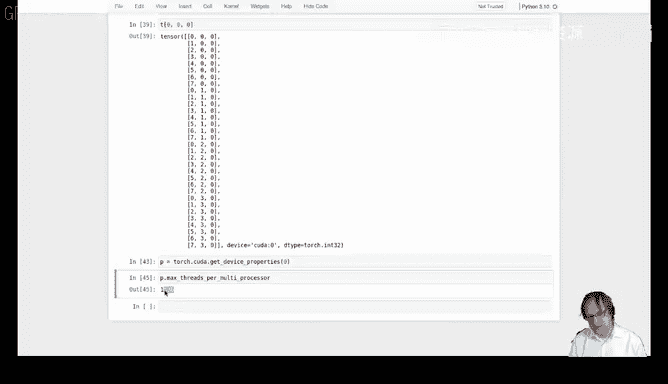

And so。Basically， now what your processor look like。

 how it will schedule threads in order to schedule as many threads at once on the。

On the streaming multiprocessor and have them execute。

As parallel as possible in order to get good speed。

Having looked at how threads work and how they're scheduled on the GPU。

 the second important ingredient is the memory architecture， data locality。

 And that is because a lot of kernels。Will be limited by memory excesses。In their execution speed。

 and so this is part of the basics of getting fast kernels。But before we look at that in more detail。

 let's also take a look step back and look at how Pytorch programs spend the time and so at the very high level you have Python processing。

 you have data administrative overhead， so you need to allocate tensor structures and such things。

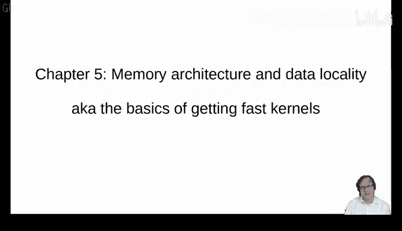

You have the data acquisition and then you have the actual GPU computation。

And so one thing is that if you don't have like close to 100% GPU utilization in NviDdia。

 SMI or some of those tools， one thing the first thing to check probably is the data acquisition because。

If you have a problem there， you're not in this step for most of the time and so you can optimize a log here without seeing a large effect so in my consulting。

Clients experience， this is one of the steps to really keep an eye on。

The other part that's with knowing maybe。As long as you have tensors with a few hundreds of elements and not single elements and don't create those single element tensors accidentally。

 as long as you have that， these two are largely not your main problem and cutting things here。

In particular， going from Python to C++ without any other changes will give you single digit percentages。

 sometimes 5%， sometimes only two。嗯。But obviously， we're beyond this。Here。

 and we really want to care about the GPU computation part where we have。Roughly three parts。

 fixed costs for kernel launches and such。And we can try to estimate that I have a kernel in the notebook that's just empty that will try to tell us something about the fixed cost。

 then we have the memory excesses read inputs right results。

 this is us now and we have the real computation where the occupancy that we discussed in the last chapter is a key part。

And so let's dive right into memory excesses。嗯。So these are quite often a bottleneck。

 and this is behind a lot of the drive towards having some sort of compilers。For things。

 so typically ego Pytorch does it loads and input computes the result and then stores the output for each operation。

嗯。And so it's obviously faster if we combine kernels， so it goes load inputs， compute， compute。

 compute， compute， and then store outputs。 and you only have the loading and storing ones。

And this actually has been in the focus of Pytoch for a long time。

 It was one of the original reasons for the Pytoch did fusing pointwise operations。Into one kernel。

 and for example， this has been a key ingredient in order to get LSTMs in Pytorch close to the coDNN performance。

嗯。Then there was a second generation of Pyroit fusers that added support for contractions and。

There were actually two of those second generation fusers and one of them， the envyuser。

 the NVDdia fuser is going beyond Pythage and still has a very active Jit repository and learning things。

 new things every week similarly inductor and Tritonbased optimizations are also about fusing things。

 but they support more complex operations by having language and then templates to run those。

This avoiding excess to global memory also is a core ingredient of flesh attention。

And here this is one of the key figures in the flesh attention paper and you see that here the high bandwidth memory is given with speed of 1。

5 terabytes per second it's only 900 gigabytes for my GPU but what you can see is that the shared memory is actually here it's more than 10 times faster。

 but the problem is we only have a 20000 200th。Of the memory available。

 So we want to have here TU global memory accesses minimized and try to make good use of the。

GPU shared memory。I brought an example for fusing things and how you can get speed ups with that。

 and it's in the notebook。嗯。In or for a long time， my favorite has been the LSTM。

 because I've been involved in that。 But so one thing here is。

We can do that's a bit more modern is the approximate Gau。

And so this I took the formula from the Pyto documentation。 there's usually the yellow is。

Defined in terms of having the normal distributions cumulative distribution function here。

 and so here's a clever approximation with the 10h function and so we can define this in Pyage and we can run it and we see that it's a lot slower than the Pyage implementation。

Here the Py implementation comes in at the native implementation comes in at 60 around 60 microseconds while our own implementation is。

About eight times。啊。7，7 to eight times slower than that。呃。And so what happens here is， yeah。

 we have lots of individual operations。 So here it will compute the power of x to the third。

 then it will multiply install store the result， read X or the result。

 then it will multiply with this constant， store the result。 It will。

Load the value in order to add X， and then you have a lot of loading and storing。If we want to。

 we can。Can use the Pytorrch profiler to show us all the kernels that gets executed。

 So torch profile。Profile。Pro。And then， we just run the。Run the time it。For it。 And just。

Exeeccut it a bit。 And I don't think we need the torch ka synchronize。 and then we can。Print。Ki。

Let's run it first。In order to get the object and have the auto completion。Okay， so。

Now we can have the key averages。Cable。For that。 And if we print that， it will tell us a bit。

About what it did here， now I will do the profiling again。And so。The solution obviously here is to。

 and you see here that we see lots of vectorized element kernels and if I didn't have a small screen。

 it would show in more detail what this actually is。

By just by the number of different kernels that get executed， you have the。

This will be all pointwise operations。And you see that just execute a huge number of kernels。

If you have the number of calls here is 7000 of each of these， this one will be called even。

Three times as many， so it's an addition or multiplication or something like that。

We see there is a lot of。Separate。Functions there are called。

 and all these read inputs and write outputs。So if we combine this into a single kernel。

 it's not that difficult， we just write out the formula in C++ and of course after Andreas reminded us we use floating points here with the F。

And so if we run this kernel and the calling is basically the same as Jeremy did。

 I do like to split out the out in order to not measure the memory allocation。

That's part of my timing。And now we can see that it's giving the same results up to numerical accuracy。

It's a tad faster than the。Then the implementation in Pytorch。

 this might be just because we save some of the overhead that Pytorch incurs for its dis。

Okay so this is this， we can combine things into a single kernel in order to make things faster than executing separate kernels。

 some of you might wonder about this up to numerical accuracy and so Andreas asked me to also show this and so the effect is that if you add numbers then it depends on the order in which you add them if you add floating point numbers。

 so if I add one to the minus8 to a floating point number this will still show。

 but if I do this with a like really small number we will be at 1。0 and this is really 1。0。

And so this here will give you a result of zero， but if I reorder this computation。

I will suddenly see a positive number。 And so in this sense， you cant change the order。

 Many people say it's not communative， but actually two numbers you can exchange。

 It's just when you have multiple of them。 and this is because it's not associative。 So this。

Will give you 0 if you combine the two。Large terms first， you have the small number。

 and this is at the root of all these numerical accuracy things。 the typical thing here for。

For single precision numbers， 32 bit floating point is one to the 10 to the minus7 or minus8。

 maybe relative accuracy and for floating  point64 this will be quite a bit larger you saw here than I needed to go further and we might try this is slight。

No， this gives me the right result， but。Here， this still works。This also still works。But。You can。

 You can find the limit here。Right。嗯。So this is what's always up to numerical accuracy。

 but we are not worried about that now。Okay， so。Less， less storing and reading is good。

The other question we may have is， well， how fast can our things actually go？

 And if you're on the Discord channel and hang out there， you see that。

There's people trying to get the fastest version of this level RGB to gray kernel and we might consider well how fast can it actually go。

 so let's look at what it does for each pixel it loads three bytes Rg and B it computes the index and this takes one multiplication in one addition in 32 bit integers and then。

It computes and we remember that if you do this for each thread。

 it will actually need to do these in series because。诶。

It only has 16 integer units where we have 32 threads in a warp。

And so we have to compute five operations of floating point， three multiplications to additions。

Ideally， in 32 B plus， we have to do the data conversion。 and then we store 1 bite。

 So what speed can we expect on a。Say 202048 times 2048 image now。

 NVDdia lists 900 gigabytes per second as memory bandwidth for my GPU， and we have 16。

Megabyte of transfer。So if we compute this， we get around 18 microseconds spent on that if we have the ideal access pattern。

 and this is jokingly called the speed of light because it's the theoretical limit。For the speed。

And then we have the compute， we have the。诶。Specificationations of  35。6 FP 32teroflobs， 16。

8 in 32teroflobs， so this might take about。Two microseconds。嗯。And。

 but this does not include that any。Things being done in parallels。 So， for example。

 if one waits for loading from memory， the other might execute because for such a tiny kernel。

 we probably don't see all of that。We can measure how fast a kernel launch is and in the notebook。

I have here right under the fusion example I brought an example of measuring this where I just took。

Colonel and。Rpped out all the。Or the computation。 and use the same code。

 And so this kernel will also some overhead。Of three microseconds to just run the empty kernel on the GPPU。

And so this will be our estimate。In here。呃。Yeah， so。The measured time of the kernel。

 if I go to the very top of the notebook， I can。I took here Jeremy's lecture3 kernel added here the dot F。

 and now this runs in approximately 26 or 27 microseconds。

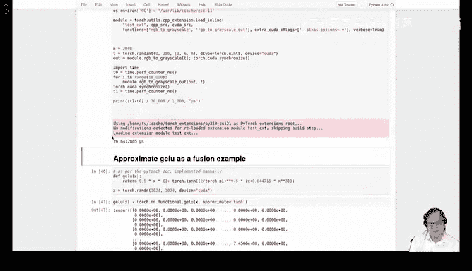

And so this compares with。20。With 21，23 microseconds that we might theoretically achieve。

 So we're within one quarter。So we're set about three quarters of the theoretically possible speed。嗯。

So this is how we can。Find， figure out。How fast we might possibly go with our。

With our little example kernel。 And obviously， you can try and。Reach the extra upper bound。

Or maybe beat it。まこういった。嗯。So I。When we want to have this same view of the computation。

 one thing that we can often do is consult this so-called roofline model and the key quantity here we need to know is the computational intensity of our program and so we want to know the number of flbs per by of memory transfer。

Because。This will actually give you an idea of whether our kernel is compute bound or memory bound。

 so in our example we had five FP32 flops and we had four bytes of transfer and so。

This would be a computational intensity of 1。25， which is not。Ideal， it's a fairly low number。

 and so。What happens here is if you have lots of memory transfer per compute。

 you're essentially bound by the bandwidth。 So the total computational throughput is。Limited by this。

Dagonal。And this would be a memory bound kernel if you are in the regime where you have a high computational intensity。

 so with any given bit of memory， your compute a lot。

 then your peak output is basically peak throughput is basically the speed of the GPU。

Floating point unit。And this is then a compute bound kernel。

So what happens in order to create this shape here， which is called the roof line。哎。

Is that you actually don't have a plus between the memory transfer and the compute。

 but because if you can hide the memory transfer latency if other wars on the same multi streaming multiprocessor can compute while one warp is waiting for。

Memory data to arrive or for data to arrive from memory。

 this plus we had previously becomes a max and then you have the speed will be a minimum and so you get this roof line model here。

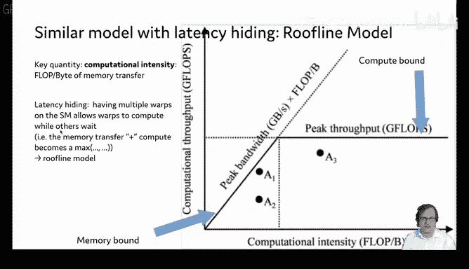

Okay， so we saw global memory， which is the GPU memory if you want。Obviously。

 our computation mainly used registers， there also is local memory。

 and then there's the per block shared memory， which will we use a lot in the following。

Which is the first thing in the little pyramid。And then there's constant memory。

 and so this will be implicitly used， for example， for the kernel launch parameters。Okay。

 and you can access all of these typically if you don't do anything。

 the local variables will be in register memory unless they are errorss when they' are put into local memory。

And then you have the shared memory declared with a thunder shared。Specifier， modifier。

 And then the global memory is。What you typically have when you pass a point to GPU memory。

 but you also might declare it in here program if you want a global variable。嗯。Not so often。

And then there's the constant memory， though。You can also explicitly declare。

 but the main use is to transfer kernel launch parameters。

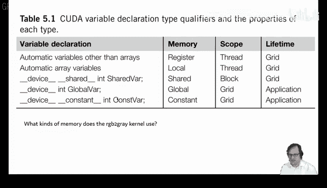

Okay， so we saw that how do we how do we use the shared memory actually？

And so one way that's very prominent is tiling。And it also plays a role in the flesh attention and in convolutions。

 but we will look at it in the Mum， so Jeremy had the Mutmoll example for rectangular shapes in the last session we're now going to look at square shapes and so we have n times n matrices。

And so in his terminology， N M and K will all be n here。

 And so each of the n square outputs that our。Result matrix has the entries of our result matrix。

 it uses2 n inputs。And this means that every input is used n times and naively and the naive in the simple kernel does that。

 It reads it n times from the main memory。 And this is kind of inefficient。

 So the idea here is to of tiling is to read these parameters once and put them into she memory and then try to reuse the same value read from the。

嗯。Global memory。And we'll see that we don't manage to get this down to one。

 but we can reduce this by a factor。And so。How do we do that？Well。

 if you look at the matrix multiplication， you can actually。Look at it。

At at it in a blockwise fashion。 So if we imagine for a while that we have a tileut size that divides the matrix size。

Then we can write the matrix multiplication as。A tile formula and actually it's the same formula as for elements of a matrix。

 but you always have blocks。And so the multiplication will be a matrix multiplication between the blocks。

 and the addition will be an element wise addition。And so to compute this block。

 we need to basically compute the matrix multiplication of this here of this block here with this block。

The first A and B blocks， and then add to that the matrix multiplication of the next A and B blocks。

And if we do it and if we manage to read for the block multiplication。

 we manage to read each entry of a block only once then our output tile depends on2 n divided by tile size input tiles。

 that are each of sized tile size text tile size。And so we only read each input when we compute all the n divided by T size squared tiles here in the result matrix。

 we only read each input n divided by T size times from the main memory。

But we need to store it and shared memory then。And we'll see how it is。How that works。

 The easiest setup is when we have outside squared threads。

 And so we can look at that in the notebook， and this is。

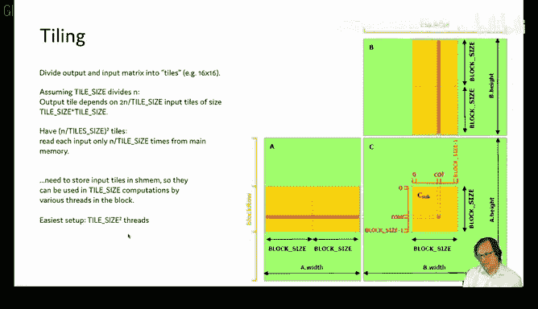

downown here in the Mumo example， and the first thing I brought here is the original kernel。

That Jeremy also showed you。呃。This is。His kernelel。

 and so obviously it's the simplemost implementation here。And we can see。

If we feed square matrices into it。It does achieve the same result as the matrix multiplication and it takes 0。

9 milliseconds。To do it。And so now we can do the tiling。

 The first thing to do is to define a tail size。 And so if we have a tail size of 16。

 this will work if we have 256 threads， each thread will。呃。Caed to one element of the tile。

 And so our thread block is 16 times 16 here。And now what happens we define。

Two sharedd memory arrays of T size squared。elementslements each and load things into that。

 We need two indices， two sets of indices here， the indices into the tile and the global indices。

And then we have a loop over the tiles and then for each tile here， we read the memory。

The global memory and the important bit here is that the column always is the fastest moving thing and we'll hear about why this is important in the。

The next session， we talk about police memory access。And so after reading one of those tiles。

 we can just do the matrix multiplication within a tile and then loop over all the tiles in order to compute the result。

 which we then。Store as the output。And so here we need to do the threat synchronization in order to avoid。

 though， if one of these threads already got their result and that help skip ahead。And。

🤧And use a result that's not yet there because each thread here reads one value writes one value into the shared memory。

 and then we need to use or two of them one n and1 m， and then we use all of them here。

So it's important to synchronize the threads in order for all memory to be available。

 all the values to be available in memory， we also need to synchronize threads here。

 this important and why yeah we don't want threads to go and load the next value while other threads still are working on this computation。

嗯。So this is the tiled example。 If we want to have matrices that are not with。

The size is not a multiple of the tile size。 We need padding。 And what we do， basically。

 is we fill the nonexistent。Bs with zeros。And we do this and complete the entire tile。

And this gives us a slightly more complicated formula here because we essentially always ask well is the index still within the matrix。

 if so we load the value， this is the same as here at the bottom and if not we just set it to zero。

But with this setup， we cannot just exit here。嗯。But other than that， it's basically the。

The same thing。 And if we run this， we see that。It's a bit faster than the naive version。 we had 900。

 something。Micro segments for the。Simple version and now for the T version。This will be smaller。

 and we've reduced the number of times each value is read from memory by a factor of。16。

 because that is our t size in each dimension。And so。After the。After the timing completes。

We can also check the works for non square matrices。 So we recover the generality of the algorithm。

 And this will be also， again， up to numerical accuracyies。 So we went from 900 to 700 microseconds。

So that's。About 2 a quarter faster。Which is not too bad。

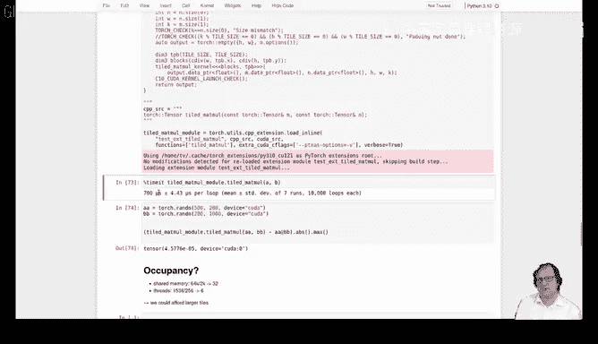

Okay， so now we have seen Tling and we got a good speed up of that。Later。

 we will consider how much work to do per thread called thread coing that would allow us to increase the tal size further。

But this is in。The next session。Okay。So。Now， if you want to take this to the next level。

 one fun exercise would be， and I thought that might be a neat life coding session， try to implement。

The original flash attention from scratch based on the pseudocode。

 and therere also the blocking of the three inputs and the output。

Its one of the key things to then combine all in one kernel。Okay， so conclusions here。

 our key takeaways is we've seen how the GPU organizes the computation in thread s swaps and blocks and kind of what hardware units do the actual computation and we want to use as much of the hardware as possible so we want good occupancy。

And to achieve this， we want to balance all the limitations。 so there isn't a single bottleneck。

 We also want to avoid thread divergence。 We've seen the roof line model and the theoretical maximum speed that we can achieve。

嗯。And the other takeaway was try to not read and write too much from and to global memory and in the next chapter we can see how to organize。

 read and write so they are all consecutive and aligned to global memory locations so we have Q memory access and we'll see a lot about how this works in detail。

Thanks so far。 and see you next time。

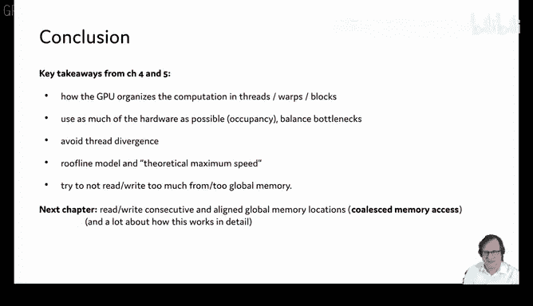