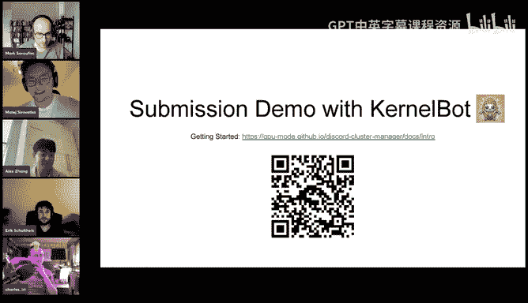
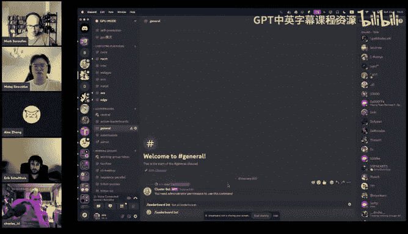
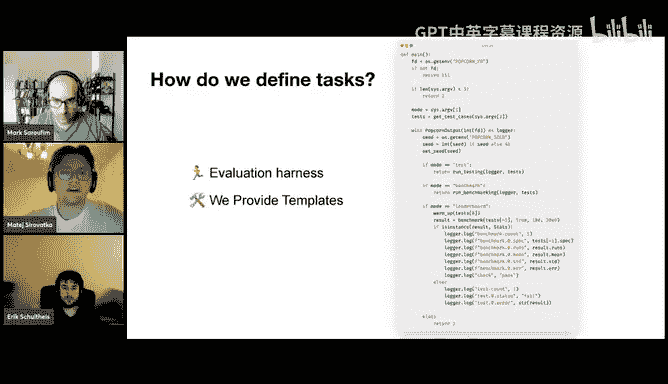

# GPU MODE《CUDA、GPU编程1-53课｜GPU MODE》中英字幕（deepseek-v3.2 - P50：-20250226-Lecture 47_ KernelBot Benchmark GPU Kernels on Discord.zh_en - GPT中英字幕课程资源 - BV1QZ421N7pT

Let me check you you。Okay， yeah， we're actually alive。Okay， yeah， so nope， oh wait interesting。

sorryor。So。Yeah， I can hit us on the YouTube so should be fine。 Okay， excellent。 perfect。

 Okay welcome welcome everyone。 This is like another episode of GP mode。

 This one is like a bit special and near and dear to my heart。

 like a problem that we've been very interested in is basically providing like more GPU so people can actually like learn like how to run their kernels like on actual problems and get them like running fast all in public So like here on this call。

 there's like the entire kernel dev team。 and yeah， I think we can just get started。 Alex。

 please take it away Yeah， welcome everyone。 So today we're gonna be talking and I guess announcing our public leaderboard for writing GPU kernels directly on GPU mode。

 So we're really excited to share this I think we're gonna talk a bit about like why we were interested in doing this and then also kind of how you can go about submitting and how you can participate in the leaderboard。

 But yeah。😊，嗯。So as all of you guys already know， writing GPU kernels is extremely popular nowadays。

 GPU mode already blew up and we have lots and lots of talks every week that many people go to lots of questions being asked。

 lots of things on Twitter and online and in the AI space in general where people are super。

 super interested in writing GPU kernels and part of this whole like project popcorn thing。

Has kind of been about you know trying to see if we can make GPU kernel writing more accessible to everyone and also trying to see if we can integrate AI in some meaningful way to assist in writing GPU kernels so one of the most recent efforts that we were really a part of was the whole kernel Bch Eval so this paper or this project I guess was mainly about evaluating AI generated GPU kernels and there have been a lot of efforts recently basically surrounded around this idea of can LLMs write good GPU code specifically for this is can they write good Kupa code and obviously this is kind of an open problem right now and there are some very。

 very obvious downstream applications that are useful for both just automating a lot of this process but also for assisting kernel developers in general。

So also recently there have been lots and lots of developers and groups and labs trying to work not only on this benchmark。

 but just on AI agents in general for kernelnel generation this has been kind of a hot topic recently for the last week especially so our kind of open source community is interested in doing all of this in the open。

 we've been working on this leaderboard and also some other things that are related to this problem and we think it's a super。

 super exciting direction that you know a lot of people can be a part of。嗯。

So this entire effort this leaderboard included is entirely open source and entirely public on GPU mode。

 so you know if people on the core team would like to introduce themselves， that would be great。

I guess Ben's not here， actually， but yeah。Yeah， so I guess my name is Matt。

 I kind of like was the leading guy in coordinating what to do when to do and doing some of the development as well on the GPU mode and also coordinating like all of the deployments and the DevO stuff I would say a lot of it and yeah so that's what I was doing and。

😊，Yeah， I joined shortly after Matt and Mark， I was also part of the Colonel Bunch project。

 so I've been working with them on the leaderboard and also some of the documentation and things。

 but yeah。Eric， you' next。I'm trying the project a bit later than the others。

 but I kind of had a head start anyway because I was developing the a very similar project for our university for some time now。

 So I try to use that and maybe hopefully have some informed opinion on some of the things we were doing and we will see in the next couple of weeks how that pan out。

😊，Yeah。Yeah， so I guess on my end， I mostly sort of spent a lot of time like with the initial prototype like making sure like it works。

 I feel like very fortunate like I managed to recruit people that are like significantly smarter than me to help me like make this real so honestly like a big thank you to everyone here。

And yeah we have some other people who are helping out that you might be familiar with from the DP mode Discord and also we'd like to thank our hardware sponsors for helping out I say Charles is here if you'd like to say something。

 but yeah。Yeah， just excited to see people using our GPUs for good to make things go even faster。

Perfect， and it's been a pleasure and it has been working great。😊，Exactly， yes。

Oh and also sorry I should mention that like again。

 this entire thing is fully open source so we're always open to people coming in and helping out in any way that they can and you know I don't think any of us like when we joined we didn't like apply or like sign up for something it was kind of just everyone just started participating and and working on the bot and I think for like anyone else if you're interested in doing this I think it's a super super interesting and also like technically useful thing to be a part of so。

Yeah， I should mention that so kind of the obvious question here is like why a leaderboard like why is this even something interesting for people to be a part of and also people to participate in So I think nowadays like learning how to write GPU code is a lot easier than it was maybe even like two years ago I think a lot of documentation and a lot of like community building has happened in that time so it's a lot easier to sort of learn like what goes on inside of GPU you know how do I write cota code how do I write triton code these kind of things but still there's sort of this this issue here of like how do I actually apply these skills so like even if I read through PMPP like how do I actually go out and write these kernels without joining a company or joining a project that require some of these things So an analogy that I like to draw with kernel writing is is competitive programming which I'm sure a lot of people here are。

😊，Somewhat familiar with and I think like even competitive programming as good as people are these days it's kind of been a new thing in the past maybe 30 or 40 years and I think like there has been a lot of competition and a lot of community surrounding or surrounding competitive programming with websites code forces so kind of the hope of what we want to have with this leader board is people participating in these kernel writing competitions and sharing their solutions and having new algorithms and kind of tricks come out that we can do for writing GPU code on all sorts of different problems I think this is like not something that's super surprising either like I think there are a lot of analogies you can draw between competitive programming and GPU kernel writing so this is a super exciting thing and also I think competition can be really fun and I think it's really useful for raising the level of kernel writing in general。

Yeah， think yeah， people like to be the fastest， I guess。To add to your point earlier。

 like there's a big difference between learning how to write GPU code and learning how to write fast GPU code。

 I think like I mean， it's not easy necessarily to make it work。

 but even then there's still a huge gap between making it work and making it fast and if you hear the developers from N video talking they always say like you should have like a speed of light and allows us to know whether you're fast or not and。

I think maybe when you're starting out， you're not that likely to do this。

 But if you see a leader more see the fastest time in your own time。

 then also is a good indicator of how much you left to go。 so that makes this。

Our process may be a bit easier。So also yes， Mark no， no you are yeah。

 so and also like optimizing for different use is a lot different and who has an H100 at home No one and yeah。

 we you can get it up from us and use it。😊，So for what it's worth like for example。

 companies like MeRA will have like really incredible like kernel engineers that like can't open source anything so like a lot of the really most performance stuff isn't really an open source like with obvious exceptions like flash attention but for the most part like if you were to just count the number of like let's say Trident kernels on Gitthub it's like around like 2000 of them and out of those 2000 like 30% of them are like fued RMS norm so like there's really like there's really not much out there really for people to know like the very highper stuff and so like there's sort of that meme you know if the halfd horse all the way to the very polished horse like I feel like it's very much that you know。

So yeah， so so Carls is like also like another obvious exception， but yeah。

 I guess like one thing we were very proud of here is that like because it was easy for us to plug in like different like GPUs。

 you know there's like H100s， A 100s， L4 T4 is MI 300s and we plan to add more so if there's more exotic hardware you're interested in we want to have it on the leaderboard。

So with all that in mind we're excited to introduce the practice round so the reason we're doing this is obviously the leaderboard is quite new and we're integrating it into the GPU mode discord so we want to make sure that like all of the features are working all of the evaluation kind of stuff is not broken so submissions during this round aren't going to be used for any kind of like training data or anything it's really just supposed to be like a testbed for this leaderboard process to see like how like what we can change and what we can improve on moving forward in the future。

😊，So for this practice round， there are a few things。

 I guess maybe we're going to explain as we go along。

 but kind of the the simple idea here is we're just going to be using this data to better understand how to design the leaderboard for the future。

 So we're not really going to use it for for anything else that is something we can guarantee at least for this round all of the kind of。

Reference kernels and reference code for this leaderboard are going to be written in Python so we're going to be expecting you to write like a Python module。

 but of course you can still use inline Ka and other things to write your kernels we expect you to do this we're hoping to finish this leaderboard by the end of April so it gives people roughly a month maybe a month and a little bit extra to write your kernels and we'll be using modal to run all of our code so we're going to be providing T4s L4s A100s and H100s for people to use to submit their leaderboard code so you're not going to have to pay for any of these things they're all free and hopefully this will help people especially if you don't have access to these kind of resources。

Before I introduce the problems with anyone else like that anything yeah so really the intent here is like as a competition progresses like obviously submissions are private because you don't want people to just like peek at the best solution and submit it but like at the end of every competition we'll just be releasing all all the solutions。

 all the good solutions as a data set and so you can go study it if you want to learn how to write highper kernels and if you want to go train a model on it like you know you can also go do that but like fundamentally this is just meant to be like an asset that's free for the rest of the world and we just want more high qualityality kernels on the internet is really the problem we're trying to solve。

Yeah， also all of these problems can run on the40 deals but do not be afraid to use the more expensive ones。

 they offer some options to optimize more I guess and we will be excited to see interesting ways we can use that。

So those play problems， I guess。So one thing that's pretty cool about having like multiple different kinds of GPUs is like typically if you're writing in a very high levell framework like byytorrch。

 you might want to write like code such that it's like performance portable on like multiple GPUs but like here there's no such constraint like you don't have to have the same code when on different GPUs So if you're like the crazy lowlevel PTx hacker intrinsics type like this should be kind of like your paradise and we really want like those kinds of people to feel really happy So again the goal is to be number one on the leaderboard So like really reward hack your way towards like towards getting there please。

Also men you don't be afraid to try to really hack these problems and find solutions that are obviously wrong but still work with our submissions because that gives us valuable feedback to improve the testing even though you might not actually get the first sheeted submission but its a very valuable we'd be really happy to see in some ways which maybe try to break it it actually works feedback so for what it's this kind of came up in the Sana work recently like the Sana work in my mind was honestly quite excellent the main issue that they had was like there were certain kernels know let's take one example of you're trying to do a vector sum over like a very large vector and just basically take like the total sum of it if all of the elements are drawn with like zero mean and variance one you can just output zero and it'll probably be correct right so this kind of like meme solution is like like AI algorithms are very。

and it's also something that as we were designing the problems。

 we wanted to make sure that those would fail right and so we really also hope like this project helps people understand how to measure the correctness of different operators。

And I think this will be useful for both humans and alums and like designers of frameworks like Pytor or tiny Gr or what have you。

Okay so with that these are the eight practice run problems that we will be using in our leaderboard so for those of you that have read PMmpppP they probably look very familiar to you I think all of these problems are in the textbook at least in some fashion so they should be very common kind of algorithms for you to implement and you know by all means like try to optimize them as much as possible for for every single GPU so also to clarify like kind of the structure of this competition is going to be each one of these problems you are going to optimize or you're going to have to optimize for a specific device so they are actually technically a 32 different problems so for example like Ma Mo for T4 is graded completely differently than Ma Mo for H 100 so they're separate leaderboards and they're separate rankings for them and so that way people can。

ized for specific devices and for specific algorithms。Yeah， so。

And since we evaluate on just a tiny set of sizes， you can also optimize for those sizes。

And figured out something cool on that。Yeah so for what it's worth all of the problems are also open source so you can like look at that we have a repo and GPU mode called reference kernels I'll post it in chat and typically the way you'll get evaluated is we'll basically we'll run it on like multiple shapes but your performance your ranking on the leaderboard will really be how well you did on that like large specific shape in future rounds basically what becomes more interesting is like we can look at shapes and common models and basically just like optimize like for those so this is like something where we want like a lot of feedback I also see Amman asking about like whether mixed gems are worth it I think it depends on like basically look at the Mamal and the tolerances I think the tolerances might be too tight for mixed gems but certainly I think in the real round basically I guess what we're calling the LM per round there will be a mixed gem problem like 100% but for now I think it just depends on the tolerance。

So one of our test cases that we have is trying to see whether the map。

 if you just cast everything to Bf 16， still passes the test because it would mean that our tolerances for F 32 are to lose and at least this trivial thing doesn't work I'm not sure I think maybe T F 32 might work。

Andm not completely sure done， but B F 16 should not work。

But that's a specific design here because the lower you go in your precision and mapmals。

 I think the more difficult is to figure out actually how to make sure that a correct map is accepted as correct。

 but it was same。Like not just。Except something that's wrong。 But since in Bf 16。

 maybe the next closest number is 10 like in 10 larger than the number that is supposed to be there like your tolerances have to be very high。

 So that's actually a pretty difficult problem to figure out in my opinion。

 So for now we use just FP32 and then your tolerances can be small enough that it kind of makes sense。

Yeah， if you're going to make it in 416， good for you and good for us。😊。

So so I see Sean asking like can you see the shapes and optimize for each shape like yes。

 like all the shapes are publicly available on reference grounds again。

 we want you to hyper optimize for those shapes like because。

Like essentially the right way to think about this is like if if you don't have any constraints on the problem。

 it's very likely that pytorch will just crush every single leaderboard because like on average it's probably pretty well tune it's really like when shapes are very specific so even think of something like flash attention it's because head dim is 128 that you can do all sorts of like really interesting thing with like shared memory so we want you to really like like abuse these things。

So I also see Koa Koa say like they hope this speeds up adoption of new algorithms and new hardware features。

 like we agree， so for example， like we have an H100。

 we have an MI 300 as well and so like basically yes。

 like it's like if you have like the intrinsictrinsics if you know what to do。

 you basically have a very clear performance benchmark。

And the last thing I really want to say is that we kind of don't talk a lot about it today。

 but it's actually quite easy to submit your own reference kernels。

 So if you're like a company or a hardware vendor and you really care about having specific kernels optimized for you submit them as a leaderboard and if someone like be you know maybe you should hire them so please we want you to think about these kinds of things as well okay and I'll shut up。

Maybe like what Max said is actually quite important like all of these are very standard operations so yeah pretty sure to be optimized quite well in Pytorch already so I don't think we would expect something like a two times speed up that I mean it would be amazing。

 but I think that probably indicates more error on our testing part like a immune solution and not an actual speedup and。

😊，Even if your solution is nearly just 80% as fast as the reference， which is just calling Pythch。

 that means they're actually pretty decent at coding this app like。

Don't be discouraged by by something like this， right like Pytorch is already quite well optimized。

Unless you do some various hardware specific or shape specific things。嗯。

You so so Uai is also asking is the execution time the only metric for the leaderboard for now yes。

 although like there are certain things we're in very interested in like basically tradeoffs between like speedups and memory efficiency for these problems they don't make a lot of sense but like if we were to do for example like an LLM problem set it would be very important so I guess also if Daniel Han is on the call and wants more unsloaughty kind of problems we'd love to have him。

But yeah， yeah。Okay， so I will hand over the second half of this talk to matete so we are basically going to be going over how you actually submit your kernels to the leaderboard and we have some documentation as well you can scan this cura code it basically just goes over like again how to submit things in a little more detail and also we have some information about creating leaderboard as well that's you know useful for understanding what goes on under the hood so mateay。

Yeah thank you so this next part I guess is going to be quite as a short demo on how to use the leaderboard we I'll be sharing my screen and this it me direct for doing it in Discor。

😊。

So。Yeah， let's get started， I guess。 and let me do know this okay。

Okay I hope you can see the discard point， I'm going to be a bit。Out them the call， but yeah。

 can you say that this code mark？😊，그。Yeah yeah， we see it， sorry， I was thumbing up。

I forgot you can okay， I can't's just one moment turn now Okay so we can see that the both created few rooms now and these are oh you can see them in the category leaderboards right and all of these have quite a special use case I would say。

😊，佢不是方。是。Thiss annoying。 Why can I click to my disc。Okay。This is Whit， oh let me try again。Okay。

 now it should work。And yeah， so there are five over them and this is the central channel where you can see basically T do for every one of those example problems that Ill showcase you。

And you these channels or these threads basically work as a place to discuss these problems。

 share your solutions， share the tricks you're doing and how you were to optimize them on the top of it。

 you can actually see a short description of those leader board with like what is the input。

 what is the output。Also like there are certain invaris that hold for the inputs to it。

 so for example， in a vector sum， you can see that it's a tensor of shape n and that are normal distribution from normal distribution and there are invaris like different for each of these problems。

If you want to see like also what leader reports are currently available， like in any of these rooms。

 you can just use a leader bo list， which is a like default command that you can do。

And it shows U I pay table that shows all of the leaderboards and when when they have the deadline and what the GPs you can use for all of these problems。

 we decided to just allow submissions to any of the GPUs to just quite properly test it out and yeah。

 so you can have fun with that。And yeah， that's like the general channel that's just for kind of general discussions about the leaderboard。

 you can tag us with bug fixes or bucks or whatever you feel like is needed。

 you can tag us by I think you can tag it by amin like leaderaderboard Admiral。

 which is currently going to be me， Mark and Alex and Eric。

 and we're going to try to help you at least from the start like with your possible problems。

Also a small thing you can see is that the leaderboard list basically displays a so called FMR command。

 so on you see it like no one else sees this。We decided to do this for most of the problems so you don't span the rooms。

 right？Okay， so next thing like how do you actually submit and how can you what are the possible submission types you can do so if if we do a leaderboard show and the leaderboard name that we want to see your data submissions that like for example。

8100 on the that's comes to you。There are no submissions right so we want to submit something。

 but we kind of don't want to submit without properly testing it and。

We are like we're not going to get a submission if the kernel doesn't work， so how can we do that？

We actually provide three commands for that and you can do lead report。Submit。对。

Submit test where you provide a kernel so this is like our preference ones that just the submission just maybe can you show what the submission looks like as well just so people realize theres no matter Oh yeah sure。

我没抓到啊。Yeah， so so so for context folks here， this is very similar in platforms like late code or like typically you'll have a small test of set of cases that way you can know very quickly if your code is correct and then you can basically match correct。

 you can just put space there yeah。Yeah， so like this is the， it's a you sample。

 a simple code that just cause the custom kernel with。But just does the。Con D right。

 you can also use find these in the examples。In the reference kernel data Github and also see how we basically use them like proper see what are the inputs and how they work right So if we submitted this supports most options to。

Wch lead the report to submit so this was come to right and which GPU to use so I'm going to use8100 you don't have to specify these there are different ways to specify them which i'll talk about O ER。

And if we do it。This is a test command。So yeah， you can see another feature that submissions are all out only in submissions channel。

 so that's the purpose of this channel where you have to where you can do that all of these leaderboard submit subcoms so like we can do the test one。

😊，Submit。Tri that so that was CO2 D and GPU was8 100。And they fer this。

The bo is going to create a thread and the runner drop on model。

 so this is going to take a few seconds I think yeah now it is and we can see that all of the tests have passed。

Yeah， so we see that our solution is correct and we can try to like see how fast it is。

So we provide another command that actually runs it so that the sleepboard submit benchmark。

 it accepts exactly the same arguments as sleepboard submit test except of it runs a different test route。

And also benchmarks the time so actually actually Matt you're the thing around your screen share the stream yard is sharing your screen as a blocking as it maybe move somewhere else this is let's do。

So， yeah。Now we're gonna wait this is gonna take a bit longer because the shapes are not too long again you can see like it's very fast and you see like this nice output that E has actually created and it basically shows like what sizes did we run it with what was the average time the soul is the fastest like the variance etc and all of them were correct So yeah we can do our submission So folks a few comments here because people might not realize like what the heck happened like once you submit that that actually like had to submit the job on an external scheduler which was mod spin up a machine and then like run the job and like return results to you and basically this is like you know like this is at this point faster than than spinning up a machine on AWS and assess into it for like a benchmark So this was something that the core F team was like very fanatical about that way you can be interactive about it right like you can submit like all sorts of like benchmarks like very quickly。

Even if you don't have like any of these fancy GPUs。

 and I also see a question is like submitting Qa C files allowed like yes。

 we support basically because it's a Python file， you can just like load in line in Pythtorch and do whatever you want and we have a few examples of doing this in the codebas。

We also do support actually QUDa patients， but not for this round because it's in the progress of being tested properly because as you all of you might know compiling KudDa and like there are a lot of options on how to what to specify so it's a bit more difficult from the development perspective to make it right so that is them but not yet。

The main problem with Ka is that a order have tested， we need to have a model solution。

 So for Python， we just call torch dot con2 D， and we have a very well battle tested con2 D implementation that we can compare against on the ka side that would be much more effort。

 like map would be simple， but everything else。 I don't know if you then like need to work with。

QD and end does something to have this write your own implementation。 So for now。

 if you want to do Qa just put it in line。 And I think maybe the next step for us is actually just to have like a tented file where you can submit the C file and that just puts it correctly inside the Python that have but if you want to make a requestt get that would be much design feature evaluate so really for what it's worth like because like we sort of like again。

 it's Python right So like basically it supports Pyth code it supports straight and code it supports basically loading in line with Qa I guess we didn't do things like all of the other like basically Qa DSls in Python but couldn't be interesting。

 So basically if there's a language that we don't support or like a platform we don't support。

 just let us know and we'll take a look。Yeah， currently we do support like Python with that like Qudino9 Triton works out of the box and checks as well。

Checks should work。 Theeth checks was a bit bug， but should work。 Okay， so now like this is the。

 this should be like the work folder you see， and we see it。

Running in some time and it was correct as we could see in the tests。

 so we can try to submit it to the leader board， which we do have a later board submit ranked。

Which again takes in exactly the same arguments as the previous two comments that I should。

And you can do it like this， so that was kind of today if I'm not mistake I8100。What this does。

 it creates two threads for you actually private shot。

 which is online which doesn't show like a lot of info and then a leaderboard job that shows the result。

What the leader report job does on the background is it calls tests on your input like to verify again that they were correct。

And it also calls benchmark and。Re also。So as you can see here。

 this is the resulting submission right and there was the privateva job。

 which you can see it just doesn't show anything so it's。Yeah， and now the sub is there。

 so if we do a leaderboard show and I think that was come leader report。

We have it and in age 100 right yeah and first one。

So those are like the main command that you can use to interact with our with Debo。

There is a few more of them which you can see on our documentation。

 I think like this is really like the documentation that's really cool provided by Alex which is not here anymore I think but yeah it explains like how everything works。

 how you can create your submissions。How you can。Submit them all of the available commands as well like if we go create a available Discord commands you can see why leaderboard submit ranked test benchmark。

 these are the ones that I showed you leaderboard list。

Well there's also Leboard show personal which just filters the solutions from you。

Thats that then you can also do like leaderboard task which provides and leaderboard template。

 which is。Somewhere around。These are like extra commands that show you info about the leader board and like the evaluation hardness。

 et cetera， like if we do that， I hope it works so a leader board task for let's say the Comp as I was trying。

It's going to send you a lot of files， which is like。

What I wanted to talk about next and I'll talk about which what all of these files do later a bit。

 but this is basically the E hardness that we use to evaluate your code and all of it。Yes。

 so so if you can reward hack or Eval harness， please do like you know。

 if you can abuse it like that's great， you know， for what it's worth like as we were testing yesterday。

 we found all sorts of like weird corner cases， like for example。

 if you're like trying to do an eval of of something like like if you're trying to eval something like like a prefix sum。

The reference kernelel will not pass itself。At a large enough size and so you basically need to make the tolerance like a function of the size of the problem。

And so there's like all sorts of like jay stuff like this that I don't think like people have like really figured out like very well。

 but like certainly you can reward accurate number one。

 if you find those issues And if you do it's a totally valid submission And again we'd love to hear from you if you can do this Yeah it helps you also think about those problems a a little more because like for example。

 one problem mark actually I think mentioned this we one of the sample problems is vector sum right So you would think that it's okay like what can be hard on developing a suit for vector sum but to make vector sum around like some time that it's statistically significant to be faster。

😊，The vector sizes had to be quite rough like sum in tens of millions， I think。

Something like that and if we sample from a normal distribution in that case like the resulting sum is going to be zero if you sample from a normal distribution with mean zero and the variance one right or like mean zero so it's going to be the mean and that was like a funny that we had to scale the inputs of it with some random。

😊，Like introduce two more random numbers that you scale the inputs with and offset them。

To basically avoid people just reward hacking with current offset that three turns zero。

 which would work for those along big problems。This is also one of the reasons why we have these two submissions so this is not completely functional yet for this test round。

 but it's kind of like I guess you have on k sometimes like private test sets and public I guess other core testses or calibration sets or something like so we have one run where we give you the full output of all the test harness and then there's a second run of your kernel that might have like slightly different seeds or like for example。

 the mean of this would be different and you don't get the perfect like this was what you should have outputted for this。

From the second round所 you。Cant maybe as easily try to hack your way around like specific seeds。

But this is not completely implemented yet，So I see like a few more questions in chat so Arun is asking like how do we think about power limits so generally like most like most of our jobs will by default be running through Moal because like that gives you the fastest like cold start experience and that is just like very important for making sure this whole thing is interactive。

However， we also have like bare metal instances from both like NVIDdia and AMD。

 but they're not for all the hardware they'll be for the H100 and MI 300 which you know are more than likely the sort of most commercially interesting tracks that I would expect most people want to participate in and so we'll just be using that like just to sort of do batch evaluations and make sure that like there isn't sort of like any serious noise effects however from like our anecdotal experiments I'm not convinced this is a real issue you know might I might eat my words but like that's kind of why we have the bare metal instances to really check。

Another question is from Amman so Amman is asking like for Mam。

 can we divide it into like SG H gemm mixed gemM so that SGm is compared against like so okay so I think maybe I'll generalize the question is like as we're thinking about different problem sets like we need to think about things that are like both commercially interesting and also like very measurable right and so one one such set of problems might be like focused on different L performance stuff like ranging from like implement a softm to do like an end to end inference at size one to an inference at size N but like I've also been very interested in designing like mathmals like basically all the mathmals as a problem set if you also have the ability of designing such problems I'd love to hear from you。

Viicram is also asking does Moal， I think this's a question to Charles actually。

 which is does Moal support like things like NCU today？Wt， sorry。

 remind me what the NC tool is is that the profiler。 Yeah。

 like it's the one that needs the like low level performance counters like typically most cloud vendors won' won't make it available Yeah I think right now the lowest level performance counters are blocked by our hypervisor and that yeah。

 that would require a Gvissor PR to resolve So yeah， so you can't like， yeah。

 you can't get like the tensor core pipe。Throughhput or anything like that。Yeah。

Then the other thing regarding our Aon's question about power limits。

 so since like you know we're sort of like collating up GPUs on the fly from a bunch of different cloud providers and they will have like very different possibly like power and thermal behavior like from you know like some of them run very hot and some of them do not and so there's gonna to be some variability that's somewhat reminiscent of the way things work when you actually do like a large deployment you kind of have to deal with a little bit more variability than you you get in your like typical like benchmarking environment but yeah just the heads up that there is some heterogeneity there。

Yeah， this is actually all of the motivations for the testing round。

 even though we actually don't change the seatd to have the two runs for each submission because then we can later look at like how closely correlated are these two independently send runs that they。

They're running at the same time。 So if we have like a day cycle， like at some time of day。

 like allG viewss are running hard time， we won't necessarily detect this。

 but at least like if two different machines have large variability， we might be able to see。

 at least I will be very excited to see like what this looks like。

 Maybe it's absolutely you know problem maybe there's like large variances of me。😊。

In the end for the actual promise might decide to just really send two or three jobs that are completely independent for every valuation like that's something we have to figure out and with this data that we can now gather with the practice around and for what it's worth。

 this is a real problem from an E suite perspective， like for example。

 like let's say you wanted to like a Saana did's something similar where like let's say you release a data。

That has like basically not just the kernel， but like how long it took to run。

Like that just is sort of like can be like that is a point in time artifact that could reflect potential noise measurements so let's say you're trying to look at it like small differences or trying to teach an LLM how to like learn over those kernels it might just end up learning the noise and so basically for us figuring out how to have like completely unnoisy measurements is a critical or critical problem and having bare metal instances really is a very key as a source of truth。

However like most people don't use bare metal instances right and so like also sort of seeing realistic performance on cloud on different cloud vendors is it's important to us so it's very much a problem we'd like to figure out and basically have a good you know eventually you can think of our leaderboard as being a definitive eW suite both for humans that are kernel developers and for models。

😊，But you know， before we get there。Like it's， it's just a good place。 It's a good good， just good。

 a good fun place。 I think to sort of submit your curls for now。 It's very part of right。😊。

Can you go back to the benchmark run， Maybe we should actually like quickly show what exactly the feedback is that you can get here it is Yes。

 yeah， because it actually shows you the the fast and slowest run also， right。

 like it has an error of the mean snail is the slowest run。 the lightning is the fastest run。

 So it gives you a little bit of information， at least to debug of something went very wrong if you run。

 like maybe you triggered a try to compile while the benchmark was running。

 And then the first run was like a factor of 10000 slower than everything else。

 that will show up in you。 So kind of like the uncorrelatedrated noise。

Is something that we try to filter out。 But of course。

 like if the machine itself is slower or faster than another one， then this won't help。Yeah， however。

 as we said， like we have extra GPUs， we have credits from Nebs that we can use basically to spin up our own SS instances those are just a bit harder to work with so those are not supported yet but it's going to be coming soonishh we hope。

And it's also going to support like back to the question with a profile that's one of our like high priority tasks I guess to support a profile or output so like if you want to optimize you kind of want to use profile right so that could be like the current ideas to have like leaderboard submit profile and that would just dump you the NCU output of the e which you could then use。

Right。And yeah to go back with the to the Docs website， which is here。

 there are also like you can see there are also there is also a guide how to use Kuda and C positiveboards which aren't supported yet in this problem set。

 but yeah， as I said， they will be supported soon。One thing that I can like note is there should be somewhere whole of famous。

Let me just get to it like this。 It should be at home， by the way， if you're， Yeah， exactly why。

 it is goodlash talk。The F reports， which are going to vote for a while。

 but this is a kind of like we can we cannot give you anything。

 but if you provide us with a functional react website that refreshes when yes a patient is submitted well be very happy because that was like a point where all of us failed to write the same I think it should work if you're fresh by the way。

😊，Yeah， it actually does Yeah， it it's it's just the old this is an old submission actually。

 as you can see because currently it refreshes once a day we have did a random job that just refreshes the appointment once a day。

 And so that's when this little report refresh Okay yeah。

 I will say the code for the website was for this was my the least the code I wrote in my life that I'm the least proud of So if someone'st actually a professional。

😊，Please let us know。Wed be very happy as you can see。😊，Yeah。

 so I think this is for the like demo I don't think there's anything else to show for that。

 and next I'm gonna talk about like could help of Eric about how we evaluate this so let me stop just one quick interjection before you go further if' like get into this and you want to like you want to like run your own set if you want to do your own like custom profiling or something like that should be pretty straightforward just set something like that up on Moal using some of the like code that Montete and others have written copy pasting but yeah and it comes with the platform has 30 bucks a month in free credits which is enough I don't know like seven hours probably of H 100 time which is a lot of three second benchmarks but also yeah if you blow through that and and you're cranking on the leaderboard please also let me know happy to support the work people are doing。

say one shocking thing is in our private tests and we've been basically building this between the whole team for about three months now。

 we spent about like$8 worth of modal credits like running like dozens and dozens of jobs and so then sort of the benefit was Charles said like basically many three second jobs are quite cheap on the platform so that's why we use it。

Yeah， and the advantage of model is like you really get those jobs spin up very faster and that's why。

😊，Also， and I think with providing UA an interactive way to debg that。Yeah。

 so yeah you're if anybody's working on this and is like， yeah。

 it's not working well to try and set of their own thing or like oh how do I get XY Z to work。

 how do I get the torch profile at work， whatever like please don't be shy about like DMmming me Discord or Twitter or whatever we can figure it out。

Yeah， so next thing I guess I'm going to share these slides with me just upload。

That should work any minute。哎。You can see the slides now。Yes。

 okay so where we end is here like this is the demo and now I'm going to talk shortly with help of Eric etcter like how to this is this is basically when through this or like how do we participate and you can just use the Discord one small thing to note is that like we know we were trying to make it as interactive as possible but Discord API wasn't really helpful with that so were planning to support a COi which you would just do like popcorn COI or submit。

Or benchmark with the name of your file and that's going to around on our side。So， yeah。

Now I'm going to talk shortly about the E details， like how do we evaluate and what are the files that we basically plug your kernel into and how do they work？

So all of our code is defined by a simple YaO file， which。Deines the description of the task。

 the name， and most importantly defines the tests and the benchmark。

🎼So you can see it in the top right， that's like how it it look like。

The values in there are called a test spec， which you then also define in your code。

In the El bird code， so here you can see that the test back of this kernel。

 I think that's maxmo has three values that are MNK and C。

And these are just going to create the individual test cases。

And same way to you define your benchmarks the same way。

 which as replacingpl tests by benchmarks right， and then like as I was showing you the example example submissions。

We evaluate on the benchmarks we test on the tests and then on submission like when you do submit rank we run both tests and benchmarks and that results in the score which you can see down there this score is just like the speed end。

Yeah， that's it。So this is like here you can see the whole Yal file like how it looks。

 it also provides a cool thing that is template so if there is a more difficult task that you that we define in the leaderboard we also have a ability to provide a template which you can download via another command I didn't show that theboard gets template or something like that and that can really help you get started with developing like like it's usably defined like right like we will define the template but the idea is that it will show you like what's the input create a sample submission that might not run but has the correct interface and correct format。

On the top， you can also see like all of the files that was what I showed you when I ran the command。

 I think that was a leaderboard to get a task。And all of them have a special meaning that I'll talk about later and in the bottomtimore you can see the IO language mapping that's actually the test spec that I was talking about so we define we define a classical or test spec which is just the dictionary type one and that basically is getting created from these Yal files right so again this is the result and we also define two types input T and output T that's just a good practice kind of because type isn't type but that showcases like what's the input to your problem and what is the output of the problem so in the map again yeah sorry。

Just wanted to add like this looks a bit weird from a Python perspective。

 but it kind of makes because we also have the separate like cutuda path that we want to have where there's no Python in there and by having these things explicit also on the Python side。

 we keep the two very similar so that makes it maybe it easier to map development from three other。

Yeah， and this also works like kind of self documenting code， I guess， or like documenting code。

And yeah， here in the example， you can see like the input to a maximum is actually two tens， right。

 so that's。Solf explanatory and the output should be one。Okay， so。

How are actually the tasks generated and what is in the reference that we provide？

So the reference should consist mainly of three things， that is the function to generate input。

We were talking a lot about how to generate input that isn't hackable， it's going to be hackable。

 but we hope you'll figure it out。And they was， hopefully。

And yeah so that generates the input as you can see it takes in these values。

 which are basically which is the test back so again M and K and seat and it uses that generate input T so that is one simple test case so in this case it generates two。

Y attends our and B and returns to two pull of them。

Then we have a so called reference kernel that's just our way of verifying the solutions we run our reference kernel and compare against it in the check implementation function so and that one should give you reasons why it failed like。

What with it's kind of defined as some of you might be familiar， like your kernelno uses it。

 it's a vers all close， so it doesn't just fail but it tells you the reasons why it failed like it was a missing number。

 the shapes mismatch， etc。And so for what it's worth like here when you look at generated like notice that like all the individual values in the A and B matrix are being drawn from a uniform distribution。

 so if you can write the fastest Mamal assuming uniform distributions that's great it means we need a better test suite on our end so you can envision that like in sort of future iterations we sort of expect like it could be entirely possible to just have a single like like a set of problems be just Mamals with slightly different constraints。

But yeah， again， like right now we're sort of playing around that So there's like a nice diversity of problems。

 but again， in futures， problem one might be a matrix with one shape and problem B might be like a matrix with a different shape。

 It could be as simple as that。 And there's a lot of interesting stuff that could be done。 Yeah。

 I tend to try to theosit repository with the current problems' so yeah it's again， open source。

 So you have easier time hacking it and feel free to。😊。

The next thing that brings this all is the evaluation harness or it's called eva P filee and this is like it abstracts there's just a part of it like the main function。

 but it abstracts a lot of the complexity behind doing all of this。So basically。

 depending on the mode that we get， it runs either tests or benchmarks or whatever and saves the results。

Or why the results are then walked into the file descriptor that we provide。From there。

 we create the pretty reports that I was showing you before and you can see that you can see them in Discord when they get sent to right so this is why D driver code that brings it all together and。

Does all of the heavy a lifting？Also， we know that like for the future when we will be like when someone would like to write a custom leaderboard。

 this doing this is going to be quite。Difficult like it's quite a bit of code。

 so we provide a template basically all of these sample problems do use the same e profile file。

And yeah， like there's an option to create your own and define extra structure。

 but you can use ours and like all of these problems use the same one and we had no issue with it。

Okay， so that kind of brings us the end of the talk and like the last thing that I'm going to talk about is like what's next。

😊，And there is a lot of stuff that we plan to support by developing this was a lot of effort on our end in the last three months and we nowhere need to done。

We want to provide better leaders we understand that doing these problems might not be as interesting so like。

If you have any interesting ideas on what to do， just let us know or even submit a PR and we'll be happy to check it and maybe even create a little bitt from that。

Like for example， some ideas like a sneak big is training a whole LLM for it and figuring out who trains it the fastest。

😊，Also， as I said， like profiling outputs is an important thing in like developing the fastest one and yeah。

 like supporting it is very high on our priority list。Yeah。

With that like this first round is supposed to be a toy round， I guess。

 so we aren't rewarding you with anything except of eternal fame。

Glory right like's it's that's a real it's the biggest currency Yeah like you'll be famous。

 you'll be on the on our static website forever， I guess until we update the next day。😊，Yeah。

 and but for the next round， we have some cool stuff prepared。

 like getting credits from the call providers that are sponsoring us， et ceter。😊。

We are trying to support like more interesting GPUs we have runs from AMD with MI 300s。

 which I think are kind of rare。And not that available。

 so you could be also writing code optimized for MD。Well also be creating a repository like。

All of these problems。The data set will that will be created after each set of problems is going to be public。

 you can use the data set to do whatever you want。And you can learn from it。Yeah， whatever。

So and like。A kind of sneak peek that we want to do what the data sets in the future。

 which we can do with this first round， by the way。

 is we want to write our own LLM to basically generate kernels and replace you。 So yeah。It's a。

Eor that's very far in the future， but that's something that this data set could really much help with。

😊，And it's going to be cool that everyone can be able to access the data and train theL on themselves。

 so yeah。😊，I would just like to actually say thanks to all of the people that I have contributed to this with and it's been a。

A lot of fun and very interesting， so if there are also any questions in chat。Let's go through those。

Yeah， and and I guess like with that， you know， the practice round is officially kicked off。

 please try start submitting like your kernels today like there's enough if you're not like if just start with like a Pyth reference implementation。

 like that's the easiest thing for you to just sort of get used to the flow of like leaderboard list。

 show， submit。And again， the winner will get glory in April end of April and end of April when we'll be releasing the next set of problems with like prizes so yeah if you're interested in hearing updates go to the start here channel there's a Carlbot where you can subscribe to the leaderboard updates and so we can just send you noiseier updates like whenever a new problem gets released as well。

All right I don't think I see any other questions so I see a lot of thank yous so yeah Matt Eric and Alex like and thank you so much for building this with me I will say for me this project was like the highlight of the year and so I hope people enjoy using it as much as we enjoyed building it Thank you。

😊，Yeah just one more thing like if you have any questions like today we actually there was a lucky coincidence that all about her from totally different time zones so I guess it wasn't that luckyy in terms of developing but now it's lucky so just feel free to tag any of us with any questions issues you might have there is a very high chance that someone's going to be online。

😊，And they're going to help you。Yeah right， and with that， I think now is a good time Tim。

 thank you folks。Let see you sir。