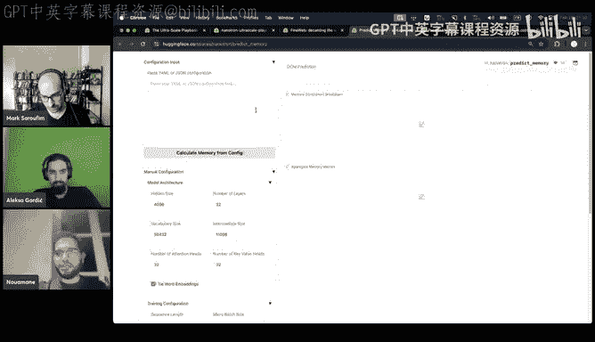
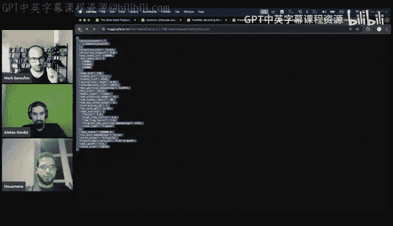
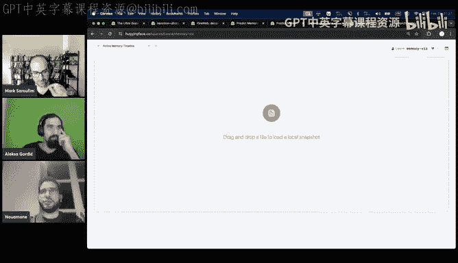
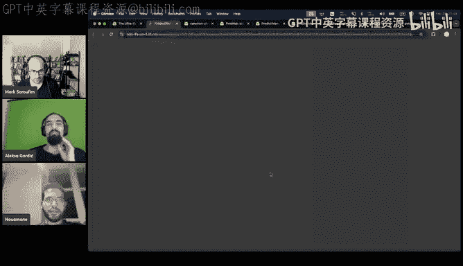
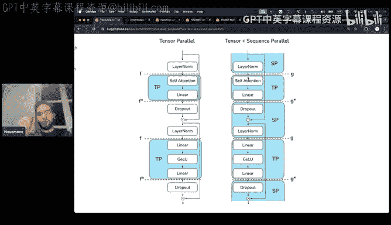
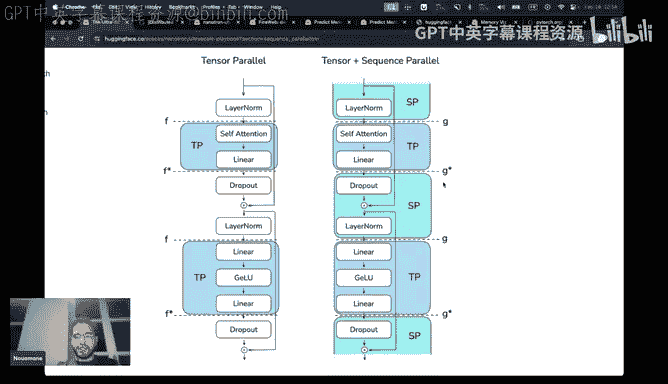
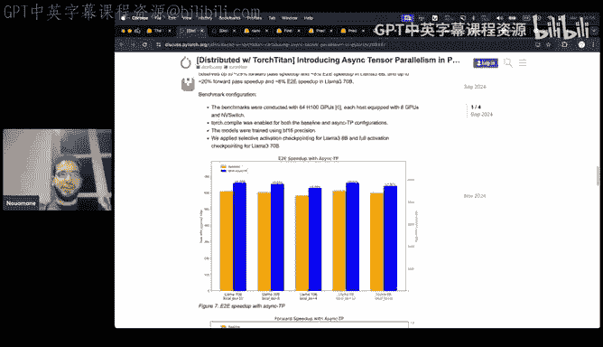
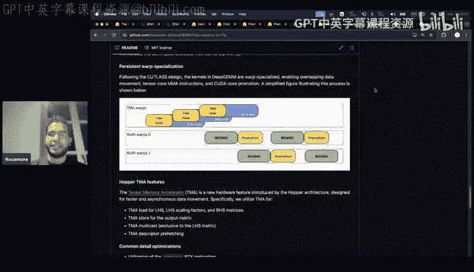
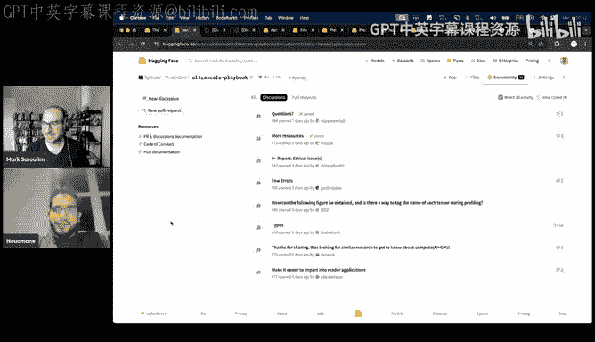

# GPU MODE《CUDA、GPU编程1-53课｜GPU MODE》中英字幕（deepseek-v3.2 - P51：-20250302-Lecture 48_ The Ultra Scale Playbook.zh_en - GPT中英字幕课程资源 - BV1QZ421N7pT

basicallyically for people who have a lot of GPUus and they don't find the use of it Actually the parallels start being useful at the scale of two GPUus。

 So if you manage just to rent two GPUus and I think there are a lot of providers now that offer them at decent prices you're gonna find this blog useful So once you have two GPUus。

 you're gonna start asking yourself， okay should I paraize over my data。

 should I paraize overor tensor etc ceter。 So yeah， it's not only for big labs。

 it's actually mostly directed towards community in case people don't know by the way。

 like the single price of an H100 is like $2 an hour these days so two is $4 like yeah it's not super cheap but it's not like ridiculous anymore Yeah that's I to do。

Yeah， it would have been correct if it was like PC like reduction and and this plot actually made sense。

 I like the fact that it's like as you're approaching the kernel is becoming like fusion like temperature because you're you're you're mixing out the MF。

 So like the temperature is increasing。 So yeah， I would。

 I would be surprised if if if if you were to plot like average temperature。

 I would expect like a drop going towards the end。 So that that might be an explanation。😊，Exactly。

 exactly who you mentioned it。And yeah， maybe before diving into the blog， I want to first of all。

 like give credits to my amazing co-authors， especially Leonra Thomas。

 who helped wrote like most of the blog and of course the whole team for helping throughout like the experiments and everything。

And one other thing that you're going to find or you're going to notice while scrolling through the blog。

We try to make most of the widgets interactive so that you get the most fun reading through the blog and for a better reading experience。

こうああ。So I think we can probably first start with a high level overview that we presented here。

 so for people who like just want to get an overview over what we're going to discuss in this blog。

 I think I'm going to follow exactly the order of this blog post and so I'm going to probably start with a TLDR which we tried to summarize here in this cheat sheet。

And so for people who are asking themselves， okay， I know how to fine tune in a model。

 I know how to train a small model， when I want to train a model on multiple GPUs or when I want to train a big model that doesn't fit in my GPU。

 what should I pay attention to or what are the factors that's come into play？And trust me。

 there are a lot and when we were making this blog when I was first learning about this parallelism。

 it was so hard to find documentation， it was so hard to find even like。

Libraries that explain what they do， like most libraries， they just。Keep adding features。

 graamming features， and they don't really pay attention into like to how the different features are play with each other。

 which is why you find that a lot of libraries， they have to refactor the entire code base just to for it to to make sense。

 And the other thing is that since the base going so fast and we， we keep having new GPUs。

 new architectures， new models like。The infrra team and the training teams needs to update the code bases quite often so to summarize we try to summarize them in these three factors here so first of all。

 there is the memory usage like if your model or if a training step because in a training step there is not just the model there is。

 for example， also the optimizer states there is the gradients etc。

So if the entire training step doesn't fit in memory。

 then you cannot even train so when you're going to parallelize your model you definitely need to make it fit in your set of GPUs the second thing is the compute efficiency。

And that assumes that your code base is already efficient on a single GPU， for example。

 when you train a single model or when you train a small model that fits in a single GPU。

You must ensure that this model fits already in your GPU and that it trains efficiently。

 meaning for example， you don't have a lot of unnecessary transpos， you don't have unnecessary。

 I don't know， CPU GPU syncs and stuff like this， once you assure that once you assure that your codeb is already efficient for single GPU workloads。

Then you must ensure that this efficiency scales as you scale your number of GPUs。

 and for that we're going to explore a lot of techniques。

 a lot of factors to pay attention to the third is communication overhead， so of course。

 besides the compute efficiency。Once you're going to add more GPUs。

 you don't want your GPUs to keep waiting for each other's。Ideally。

 you want your GPUs to be working all the time， thus' the word we want to make our GPUs keep brew all the time。

And so for a summary， I'm not going to go into details because I don't think a lot of people understand this and this is the goal of this talk。

 but I'm just going to explain how to read this cheat sheet so in this part we basically explain the strategy we finally came up with and when to use which kind of parallelism hopefully by the end of this talk we can understand the differences。

And then in the middle part， we have the parallelization strategies and which factors to pay attention to so for example。

 let's say we start with the simplest form of parallelism， which is data parallelism。

 which factors does this affect first， it's going to affect the batch size？

Then it's going to reduce the memory conception the how so here you're going to find that for example。

 when you scale the DP， then assuming you keep the same global batch size。

 we're going to see that later， you can reduce the micro batchch size and with this you can reduce the memory conception。

Don't worry we're gonna explain the detail later and then we do this for each form of parallelism so that you can quickly for example see that okay。

 when I'm going to use T I'm going to shard both like the model。

 the gradients optimizer stay activations when I'm going to use context parallelism。

 it's only activations that are going to be shard not the weights when I'm going to use expert parallelism。

 it's only experts not to the entire model。So this is for memory and then the same for compute yeah compute it's assuming that we use the six basically as we're going to see later as well。

 we define compute as six times number of parameters times number of tokens that we use so either when you reduce the number of tokens being processed。

 for example， when you use DP。Or when you're going to chart your model。

 of course you're going to reduce the compute processed by each shipping。

And then there is communication and for communication。

 you're going to notice that some parallelisms do much more communications than others， for example。

 for C。You have four times the number of layers。In the forward。

 all gather and in the backward reduce scatter。Whereas for example for a DP you only have one order reduce in your entire training step so just like looking at this and for example。

 if you use PP it's only in the grid like you only do in the forward one receive and oneend in the forward and it's times the number of gradient accumulation steps as we're going to define it so you can quickly see which comm or which parallels。

Do how many number of collectives or how many numbers of distributed operations？

In a single train day。And then the most important factor in parallelism。

 which is the compute communication overlap。Which basically says how much can you hide this communication under the compute so that' for example。

 while your GPUs are communicating activations or they're communicating the model parameters。

They can do the compute at the same time this way even if you scale the number of GPUs。

 it doesn't make your GPUs idle， which is the best scenario we can have and we try to come up with formulas that are explained in the appendix of the block。

I don't know if I made this clear enough sorry yeah like I had a few questions like at least like for all those formulas were these like analytically derived like did you write math or it's like you experimentally observe these effects and then try to fit a curve except yeah it's doing math analytically derived。

😊，系O。These are mostly simple approximations on top of the exact math and breaks out roughly like this。

ExlyAnd so speaking of， I guess like one of the questions from Johnny and Cha is like。

I don't think you sort of cover it quite yet， but I'm curious about the answer。

 which is like at least like at least for anything that related to M few computations。

 you sort of do it differently for MEs versus like regular dense models。Yeah。

 we don't treat that art for experts but it didnt。Like MFU we don't actually use it that much because in the end it depends on how people define it。

 so for most of the graphs we only show tokens per second per GPU to avoid the confusion and the confusion of the reader。

Yeah， like I had trouble defining M few for a situation like F where like some layers are't F8。

 some are like in B F6 in a you like， well， like what is。What is the max。

 is it like everything is an F8， but that's not people and it's kind of it just broke my brain a bit。

well well， I guess the right way would be to to see if an operation is in F then you're looking at F top like top clubs and then for Bf 16 similarly I would I would expect。

That makes sense， although I'm not sure if there is any switching costs like on the hardware level。

So you would share two metrics， really。Sorry， so you would share two metrics basically like like one for like the max B F 6 and one for the max like FPA。

 for example。Yeah， I would see the amount of computation that happens in a layer and then if that layer。

 if the computation happened in F， then just like。Divide whatever is the maximum with the computation they achieved to get the local you can have like the local MU and then aggregate that across the whole model to get the final number。

 but that's a great question I don't know what people do in practice usually people just assume it's the same precision。

Generally， yes，Yeah， the other thing is like this problem isn't just showed with like FB8 like even with the operation of flash attention。

 there was already some questions on how to calculate MFU。

 how to calculate flops etc so yeah it depends mainly on like the standard the way you're doing it which is how papers like agreed on doing it。

 but it doesn't actually reflect， which is why we had HFU hardware flos。

 but nowadays people don't talk about it anymore like they switch back to MFU。So in the end。

 just for the sake of this the simplicity of the block。

 we just went for secondss per second per review。And we don't really try to estimate how much MU you're going to get just like from DP install。

 because it depends on so many factors that we try to explain throughout the blog。

so Anaastasia Philiplipova was asking sort of a similar question from the previous discussions which is like did you find that your analytical formulas overlapped with your empirical results Yes for some of them we didn't try all the possible like scalings。

 but yes， some of them we tried and yes they do agree。

But as you're I don't know if we're going to have time to reach the appendix。

 but hopefully basically they come from like straightforward I like I think by the end。

 we're all going to agree that these are true with the assumptions that we're going to make。

 of course。Why calculating them。But these like I mean。

 all of the material just gives an idea on like how to treat parallel and scaling。

 but of course as we evolve like as architectures evolve as GPUs evolve。

 definitely there are going to be more architectures more like tricks like F like more precisions and like we don't expect these things to stay true all the time。

 for example， a very small example， I think that soon people are going to make these sanctions between intra node and intra node。

 we're going to have more control over like if communications or how we treat intra node versus intra node communications but。

As implemented in Nanatron， we didn't have the APIs for that because we were mainly based on Pythtorch and transformers so as simple as possible。

 but I think that these are coming soon and so people can include this in the future formulas。

So I also see somes chat， I think Sam like a prime intellect works on a lot of this stuff。

 so his question is on the 512 to 1024 GPU scale do we really need full 3D parallelism or would simple F SDP to be sufficient to have correct PEf and make the code base very simple？

At the 512 GP do we really need to do 3D parallel no so at the okay above 512 you can also you can only use2D parallelism。

 so like Tp and D。So basically the assumption is that D starts becoming bad once you move past the 512 GPU threshold and so you must combine it with another form of paradigm。

 it can be T， it can be CP， it can be E or anything else。

 but the idea is that once you reach like a big scale and that scale depends on your network and stuff。

Here we took five12 just。Dependent on our infrastructure。

But basically once you start noticing that D like starts reaching the limit in overlapping computes and communication。

 then you must start thinking about combining it with another form and the other form。

 it depends on your case， whether you use MOE， whether you use like whether you have big sequence length。

 etc。I think one interesting thing to add to the booklet would be the exact networking configurations you guys had in the sense is it like factory。

 how do the spine like switches connect with the leaf switches all those details do impact what's the optimal strategy and when do you see kind of the performance degradation that would be an interesting section。

Exactly， I mean we're planning to like share every like all the logs， all the configs。

 it's just that if we share the raw things， I don't think that people are going to find them useful。

 but we're trying to like share them in an organized way， it just takes some more work。

But hopefully thiss gonna come soon the other thing is even if we let's say share the best configuration we found it's definitely going be dependent on our cluster in the current state like even throughout the experiment we made some fixes both to Naoron library and to our infrarra that made some throughput changes so like it depends on a lot of things I think people don't like shouldn't take these numbers of like the ground truth instead they should understand the logic behind it and try to apply it or find their own numbers for their own use cases whether it's two GPUs。

 whether it's thousand GPUs。Cool， so yeah， maybe I'm going to go quickly to the gloss so yeah。

 the glossary just explains the terms used in this cheat sheet。

And the formulas we used for to estimate the peak memory。

 we're going to see that later and the compute。Yeah so we have a lot of questions so I'm gonna go through them one by one Okay wow。

 they keep coming we also have like five parallels I'd like to explore So yeah maybe like we take one question and then were gonna make breaks between the different sections so maybe I will batch this question which is like the general question I see is like what is the impact of like the optimizer on these techniques like for example。

 if you're using something like Vilicco and thistro like this doesn't all reduce every 40 minutes similarly you know if you're using a second order optimizer like move on or shampoo my understanding of those like the much higher memory constraints So how does your applicant math change at this point as well it's all about trade off So there is no clear answer it depends on your network it depends on how your architecture is it depends on how simple the implementation is because not all。

The open source implementations are perfect， like even some basic assumptions that we made throughout this block。

 for example， we assume that the compute and the computation are perfect。

 but in fact they are not as we're going to see later。

 like once you do the overlap you're going to have an S to the stream multilicicor which is consumed by the communication so that affects your computation so like these questions they don't have like a straight ahead answer。

 but the idea is just to understand the tradeoffs that you're going to make so for example for like this block we used what most people use like AM in 32 precision FP32 precision。

Which means that so the moments are going to be in S 32 and the communication， for example。

 if you use 0，1 or any form of0， you're going to need to。No， you don't need to。

 you're going to short them， so we're going to gain memory。

So yeah basically these things and for example， if you use delo or something yes you don't need to think in every training step but that also affects conversions a bit so yeah there are some questions like this but there are definitely a lot of things to try out and which is the goal of this blog because there is a lot of experiments to and we hope that this blog is going to be a first step for people to start thinking about these problems。

All right， so if I didn't read your question it doesn't mean I ignored it it just means I will batch it until we finish the section so please please keep asking your questions and just be patient with us because we do have a three hour talk we don't want to make it six hours optimizing for Mark is optimizing for throughput here。

Okay so yeah maybe i'm gonna quickly go over this final widget so this one is the memory usage breakdown so first of all you need to understand once you train a model where the like where does the memory usage come from。

 Why do you get out of memory error what's the what are the parts in your training step that takes most memory for this we have this very cool widget where you can play with a different configuration and you can see how for example the activation memory changes each layer。

 how much it takes the loss optimizer steps etc。And the second tool we made is this one。

So predict memory， and this is specific for the nanoatron implementation。

 So if you use another library， you're going to find another memory concept。

 but the idea stays the same。 So， for example， how do you use this， you can go to any model you want。

 So for example， here I go to Lama 370 billion。 you can copy the config。

And you paste it in this tool。Calculates memory from config and hopefully you're going to find the number of parameters here。

 70 billion， the architecture。The parallelism use， et cetera， and the OOM prediction。

 which was very nice because like after we finished like a lot of experiments we tried to see how much we can predict OMs thanks to this tool and we found out that we can predict with a 95% accuracy the OMs which would be very cool like instead of trying a bunch of configuration and see if the OOM or no。

 which just made the tool to predict OMs and of course it shared publicly so that you also can like avoid trying parallelisms that are definitely going to OM。

And then， of course， so this model， 70 billionan model。

 you can see here that so this is the memory timeline。

So at the beginning you're only going to initialize the model。

 so for this you're going to need 140 gigabytes almost because the model is 70 billion and it's half precision so its parameter is going to take two bytes so multiplied by two we're going to have 140 gigabytes。

For the model in it， and then once you do the gradients accumulator。

 we do gradient accumulating in FP32 for both the parameters and the gradients。

 again there are some libraries that don't store the FP32 gradients in a returnturn we do because we found that it increases stability in our trainings。

And then there is the forward backward peak the first one， then there is the first optimizer step。

 and then there is the second forward and backward and this one is the peak throughout the training because after this one you're going to keep having these two peaks like second optimizer step。

 then the third forward backward is going to be similar to this one。

So this one is the highest peak you're going to have in a training step。

And it's equal to these different parts so it's cool to see like which components take the most memory and to like estimate whether you're going O or not and yeah quick so for people who are wondering how do we do the OM prediction we just like calculate the second forward backward peak and if it's above 75 I think js its O from our experience。

Because we use H00s and they have 8 gigs of memory。I hope that this was clear。

 And then the second tool we had。 So， first of all， there is the memory list。 Okay。

 so there is the original memory this。My P team， a very。

 very cool tool that I don't know if it has the。The phrase its deserves。

 but it was very useful for me to understand where the memory consumption comes from。

 Let me quickly pull out。 so maybe I can give it a quick history around the stool。

 So the stool was built by Zachary deviro， who built the Kutura Caing allocator in Pytorch。

And indeed， it's one of the tools that like has helped us debug the most memory issues。

If you're interested， Jane Shu has like some really interesting talks online around slaying ooms where she uses this extensively。

But yeah， I think this is a very， very underrated tool I00% agree。 I agree。 So this tool， yeah。

 and I don't have to go into details， but is this the best one to see。 Yeah， okay， so this is。

 for example， with D P1 T P8 P P1。 and we're gonna see what those means later。

 but basically different form of strategies we accumulate three times。

 So this is the gradient accumulation steps。Micro batch life paid01 cetera。

 so since we accumulate three time， so the first forward backward is this one and then we're going to initialize our optimizer。

This is probably not the most straightforward thing。

 but the idea is that you can see like at any point of time。

 what's taking up memory in your training step and you can even identify the exact the exact line code that allocated she is really cool and then the other cool thing is this allocator state history。

 where you can just have fun looking at the memory all throughout your training step and see at which time there are some parts that are being reserved and some parts that are being freed。

 etc， and which also make you ask some questions about the KUa allocator the KUDa Ca allocator like some decisions。

Are lot ideal， but it's。Yeah， it does the job。And the otherwise。

 we also made like another basically just built on top of it。

To add some very small features that we hopefully can add to the original tool。So here， for example。

 week once。Oh， I think。This one was too big for it because it doesn't work on the local。

The vocal space。 Let me take a smaller one。好。Anyway。

 otherwise we just implemented like the sorting mechanism so that you can sort by the number or by the size of this operation and you can also filter by the operation so for example for me I could filter by the allocation and I could only like see the allocation things and sort by the sizes so that I can automatically jump into the step that allocates the most memory and see where that comes from and that's helped me understand the fragmentation issues in the nanoron code base。

I hope that was clear， I don't know if I can show this， otherwise you can just play with it later on。

 yeah， how it works here。

And maybe the detailed by default should be reduced a bit。Cool。

 so these are two tools we developed to understand the memory to solve the first constraint that we talked about。

 which is， first of all， the model should fit。In the number of GPUs you have and for this。

 you should be really careful about the memory management in your tool because as you can see。

 like even some buffers for communication can end up taking most of your memory。And。

Without further ado， maybe we can tackle quickly the first step。

 So the first step is simply training on a single GPU。 it lays down the basics。

 So there is a model you do a for the backward in the backward， you're going compute the gradients。

And using this gradients， you're going to do the optimization step。You're going to first of all。

 allocate the optimizer moment。And then you're going to update your original model。For this。

 we're going to use some batch size formula， so as you can see here okay here probably not to this one。

 but we're going to use basically BSD which is batch size in number of tokens when we're going to talk about the batch size times the sequence length。

Otherwise， the batch size is just the number of samples。And as we explain here。

In the literature and the currently trained LLMs， a good batch size or later I'm going to call it global batch size when I'm going to have multiple GPUs。

So the final batch size should be around 4 million token。

 or it ranges from 1 million or from 4 million to 60 million， depending on the size of the model sc。

And that's also an limitation because as we're going to see later， some forms of parallelisms。

 they need to scale the number of tokens or the number of samples each GPUs will see。

 because some forms of parallelism， they partition the data。

And so you can just scale them infinitely。For example， DP， you can just put a million GPUs on DP。

 Otherwise you're going to end up with a million samples seen by H GPU times the number the micro batchtch size。

And then we put some like small like this is what we've seen earlier。

 like the memory profile for the first training steps is the same one as we explained later。

 you can also see here like when the forward happens when the backward happens and when is the optimizer states。

 the optimizer step。A basic formula。On how to calculate the number of parameters。Yeah。

 I'm going to go quickly through these because I don't have time to go through everything。

So basically if we assume that n is the number of parameters and this is what you hear about like I don't know a lama that is a 70 billion number of parameter so what does that entail like from a memory standpoint so to find the memory usage you're going to multiply it by two to find the equivalent in bytes so for example。

 if you have n number of parameters。70 billion， you're going to multiply it by two to find 140 gigs。

And this is the memory used by the parameters。And then it's the same for the gradients because for each parameter。

 you're going to need a gradient。And if you store the parameters in FP32。

 you're going to need the double of that because these parameters are in half precision。

You're going to need to store the equivalent in full precision。

And then there's the optimizer states for in this block， we use Adam， as I said， in FP32。

 so you're going to have two moments， each moment is in FP32 and it also requires 4 n plus 4N。

So you end up with this size needed in a training step。

And these are some numbers into how much memory does each model need and you can see that it quickly scales very fast and so if you want to train a model of this size。

 you're going to definitely need to paralyize over multiple GPUs。It's I mean。

 probably worth mentioning that you can always offload。

 but this is to make it reasonably fast and to have reasonable M you want to you want to start paralyzing otherwise you can just use SSD like or host RA like memory。

 but that's like not fun because then the GPUs are not going burp。

Absolutely so yeah exactly offload is one of the strategies we're going to also see activation or computation and gradient accumulation which has also two other strategies to solve this problem so this is our first problem and I noticed that I should probably go faster than this otherwise when i'm going to finish。

Yeah， we're at one8 of the talk， so the scale will be done yeah about eight hours。okay。

 let me go then probably faster through this so activation memory this is taken from this paper or this blog。

😊，That explains how it was calculated and we're going to see later details onto how it was calculated。

Basically， when you train a model， when you do the forward。

 you need to store activations to use them in the backward right so one simple。

Idea would be probably I don't need to store them right let's just store some activations for example between layers or at some points of time or for example I'm going to instead of storing the activation between every operation。

 I'm just going to store it between two or three operation。And when I'm going to do the backward。

 I'm just going to， for example， in here， I'm just going to reuse the activation sort here and I'm going to do a small forward and then do a backward。

Why is this necessary， well this would allow me to not store all the activations here and we found that there are some as found by this paper。

We found that storing or some activations are very big and just by like saving or by checkpointing。

 there are multiple names for this technique， some people call it activation or computation。

 some people call it activation， checkpointing et ce， it's the same thing。

So basically by saving this activate Oh no， by not saving all the activation。

 thus by recomputing some activation， we can achieve。

We can achieve 70% activation memory reduction at a 2。7% compute cost， which is nothing。

And this is what。Most libraries don selective computation。

 I think all of the distributed libraries use it now and it's even now part of flash attention。

 so it's done under the hood。Do you know which activations are re computeuted in nanonaron in particular Yeah。

 so we support all modes， we even like have a decorator that you can add to any part of your code so that you recompute only that part。

But I know and this was okay so and we started development like two years ago or even more so yeah started around two years and at the time I know that now there are even like better APIs in Pythtorch to do recomputation so I don't think so you can control what activations to a compute so at least within PyTtorch it's a hard coded list you can grab for the three ones I remember the most was like linear attention and conf were the ones that you never recompute and so otherwise yeah that's very good。

Yeah， there's also the like checkpoint method that you can apply to anything you want。

And then yeah we have here some example onto， so you can see here just from like without recomputation to selective recompetation。

 how much memory you're saving that is crazy。So that was the first method to save memory the second method to do it is use gradient accumulation。

 so let's say you want to train using I don't know 16 batch size。But of course。

 the bigger batch you have， the more memory you're going to need。

 so instead of doing a forward pass and the backward pass with the entire batch size。

 you can divide it into micro batches。Which is the idea of and then do this sequential。

Wwhich is the idea of gradient accommodation you do forward backward and you store the gradients and then you do another forward backward with different inputs and then you do forward over with different inputs each time we're going to sum up the gradients and at the end you're going to do the optimization step with the sum of the gradients which would be equivalent to have in the same global website so of course here we're going to trade off memory so we're going to gain memory of course we're going to reduce memory I。

But at the cost of more compute so this is the first trade off we noticed that you can always like reduce memory。

 let's say you're in a very critical use case where you have， for example。

 only two GPUs or three GPUs but a very big model that you want to train so you can always do like more compute to save memory。

But of course， at a certain point， the cost outweigh the benefits。

 so it doesn't become interesting anymore。And before concluding this first step。

 we talk about the final tool we're going to talk about which is the profiling of GPU compute communication thanks to the amazing profiler tool by Pytorarch。

 so this is the snippet you can use to generate this phrase。And looking quickly at this race。

Basically， you're going to see this thread， which is the CPU operations being made。

 this threads handles the CPU in the background。And in these streams。

 this is where the GPU does the work， so you're going to have multiple streams and for example。

 I think it's always streamam7 that handles the GPU computation。

And you're going to have other streams that handle GPU communications。

 but of course you can always control the good streams in your code base so you can have more than these streams。

 the idea is that so when you're going to run byytoch code。

So your CPU starts reading your code base and then when you reach operations like Ma multiplication or I don't know transpose or dot copy or something。

So the CPU is going launch a kernel that's going be run in your GPU and that operation is done as synchronously as you can see these operations。

 they are read by the CPU here and then they are scheduled here so they come up later as the GPU。

 which makes the。Like GP and CPU and asynchronously。

And the other thing to pay attention to is the communication and the computation。 So， for example。

 you can see here that communication and competition are happening。Almost at the same place。

 we should zoom in to see if they are really overlap， but generally they seem to be overlapped。

 but here you can clearly see that there is no computation happening。

While this big order reduce is happening and this is the bad scenarios that we want to avoid at all costs while doing part。

So this is a very cool tool that you can use to understand if your GPU is going Bur or if it's being idle while it's doing communication。

And I think we can take a small way to take some two questions before moving into the first form of parallelism。

 which is data parallellysis。All right， so I guess like one of the questions I noticed in chat was like Joe。

 who are you asking about， are you interested in extending beyond GPU memory entirely。

 like have you sort of investigated things like zero infinity with CPU or NVME offloading？

Especially in GP， I think we talked about it briefly， but maybe we can elaborate more on this now。

True， so yeah， another technique that we didn't mention in this blog is that we can always upload to other disks。

 so it can be either other memories， sorry， so it can be either be the CPU around or the disk like the worst case。

 you can even like store your activations in the disk or store your optimizer states in the disk and then you only load what you need when you need it。

So this is like at a very， very extreme cases， but as we know and as we're going to see later。

The biggest bottlenecks are the data movement， you want to diminish data movement at all costs。

So if we if we later we're going to talk about the GPU communication Intern。

 which means like in a single DGX node， for example。

 or intra or sorry that was intra node or intercode between multiple nodes and we're going to see two different network so there is interviewing which is very fast between RoBGs。

 and there's the network which is multiple nodes being connected with infinni band for example。

 or EFA etcter。And just EFA， which is already optimized， it's very bad。

 but then when we talk about moving data between GPU and CPU or CPU and disk。

 it's even like slower which is why these techniques come at very extreme cases。

 usually unless they are overlapped correctly， as were going to see， for example。

03 is one example that we're going to talk about， and thats can be extended to zero infinity is CPU upload anything else。

The second question I'm going to batch those questions because they're both by Calviny Young。

 which is like E Fong sorry which is did you guys face any reliability issues at one GPU scale and basically also asking about like what kind of comms did you use within all your nodes was it NV link was it something else So yeah like where was your cluster basically。

So for the reliability on single GPU， yes， maybe I can show quickly。Yeah。

 you can see that so here I'm plotting the average that each collective takes starting from a single node to multiple nodes。

And also plotting the fifth and 95th percental ranges， we can see that a single node。

 we get like correct throughput but once you move to multiple nodes you're going have a bigger variance So noman I think the question was less about the performance degradation or more of a reliability in the sense of like did you have to do any node hot swapping or stuff when extra hardware like fails and which obviously with more nodes given that every single node has some reliability rate failure rate then as you scale up like every 30 minutes or something you might end up having having some type of like either networking issue or GPU ECC errors or whatever any comments on that Yes so in our infrra we used learn since we're only running benchmarks。

 each benchmark is run on three iteration step。It's not like in the same setup as training where you don't want the training to stop and so you need to swap notes。

So in our case， it was just like short benchmarks of three iteration step。

 so either the benchmark succeeds or it fails。And yeah， if it fails。

 you're just going to run so the second job in line kicks in and learn like take care of that。

So were wait if Andrew said you correctly， you were never running longer runs like you were just doing a few steps always right is that correct Yeah yeah even just with these benchmarks it took a couple months。

If we plan to do longer run yeah， it would have taken seriously。

Interesting because you have what like  six you mentioned 4000 but you filtered out like maybe 8000 or more so like if you're running only three steps does that really take that many months or was yeah good question I don't know if you included it at this blog at some point but yeah a lot of content didn't make it to the blog it was actually much bigger than this but I think it was near the end so in the lessons learned and we're thinking on adding that part because it's basically the lessons we learned。

Um， so I yeah， for like few steps， ideally each training step should have taken two minutes or like three minutes。

Assuming that just learning running a job takes like 30 seconds or 40 seconds in our case。

But we found out that because of the node failures， because of some infra issues that we had to fix。

 some jobs took like。Two hours imagine so there was a variance between two minutes and two hours for some jobs and so we had to come up with strategies for these cases and also since we were basically cramming a lot of configurations we started noticing that some configurations created some issues in specific cases。

 but yeah we'll try to document all of this later but it's definitely some very interesting findings InFRA in that case。

Yeah， I think this would be an interesting like orthogonal block to this one where it would take just one configuration at 512 GPU scale or 1024 and then run temporarily see the types of issues you encounter and I think the Ibu folks a few months ago basically described their whole process building up their cluster from scratch and all of the various issues they were encountering and I think like that type of reliability blog post is missing currently other than the Ibu is probably the closest that matches what I have in mind and I think there's also in the Lama paper。

 the Lama3 paper they talked about some lessons learned from the IRA and they found it to be a very good source of information basically they tried to like。

Like count how many issues or how many types of issues they ran into throughout their Lama re training and it was very interesting because like while doing these benchmarks also ourselves we sometimes run in the same like issues as them and we also like our infrar team also develop some tools to monitor GPUs better to reduce the restart time and stuff like that so it was a very cool lesson for us as well and yeah our infrraar team is also working on open sourceurcing these tools so that anyone with a cluster will benefit from it。

All right， I think I hope everyone enjoyed the quick break。

 I think with that let's go the data parallelism Yeah。

 and so since there is5 fireism I'm going to try to。😊，🤧Make it as efficient as possible。 So， yeah。

 so the idea before was that。Or the idea behind data partiesism and I think this is the form that most people are familiar with。

 it's basically the class DP that you call in PythO。

So what does this entail is that before we've seen that ingredient accumulation。

In each forward backward， you're going to see a different what we call microbetch or you're going to see different samples。

 and then you do that sequentially。哦。Give me a second。let me just。

One third of the way there to break the alarm reminding you so yeah。

 as I said we had to do that sequentially in the gradients accumulation so the first idea would be since now we have two GPUs。

😊，Why don't we parallelize this operation and so each GPU is going to see a different chunk of data or different batch。

And do that in parallel， and then we're going to sum up the gradient between multiple GP。

So I think this is straightforward so what does this entail so for example， in the forward。

 this is the GPU computation stream， the GPU communication stream。

And what school is that we tried throughout the different forms of parallels。

 we try to keep schemas like this that show when is computation overlapped with communication and when do the communications occur and this is also in a similar way as the Dorch profiler so you're going to have stream for GPU computation and the stream for GPU communication。

But then I think later we're going to have even like for inveing communication， but yeah。

 I think this is going to come in the future。So for now to understand。

 let's say our model has like three layers or three components。

 so the forward is going to go through layer zero， layer one， layer two。

 then the backward is in the opposite way， so it's layer two， layer one， layer zero。And。

Then I'm going to have to already reduce all the gradients I made， so for example。

 here since for example I've seen three batches of data so let's say I did like multiple forwards backwards。

 it depends on the global batch size。After I'm done doing the forward backwards。

My multiple reviews need to sink their gradients for this there is a operation called other reduce I don't know if I have time to explain the different distributed communications。

I think I can quickly。Find the link for it or maybe just go here quickly。

This is the difference between reducing or reduce。 Basically， or reduce is just。

You have multiple GPUs， you're going to do a function。

 which is why it's called reduce in our case it was sum it can be average or it can be anything you want。

And then all of your GPUs are going to have the same output。So this is should be average， all right？

啊。De alreadyius should be average， not some when you're doing data parallelism or whatnot。

So yeah that's also a question like some libraries do average some libraries do sum I I think it's yeah I don't remember that probably average。

 but yeah I need to double check maybe it's average I mean you can always compensate on the law side like you could sum it up and then you can you have to divide somewhere otherwise。

Yeah， because I remember that in PP we had to do the same thing with the loss so yeah we pick the standard sometimestime you do the sum in the gradient。

 sometimestime you compensate for it on the loss side。

 but the idea is that you try to have the same gradient as if you had no viral so you just need to compensate how you calculate the loss。

Cool， but the idea is that oh sorry， this is not where we were。 The idea is that。

So in the gradient a you have multiple steps cons sequentialequently and then you do the optimizer step in this case each GPU is doing it in parallel and then you're going to all reduce between different GPUs what we call the D ranks。

To think the gradient and then you're going to do the optimizer step and then you do the forward and you continue。

So here as you can see， this communication is exposed， what do we mean by it's exposed。

 it's not overlapped with any computation， which is very bad a big note。

So we definitely need to find a way to overlap this。

So the first idea is that we try to overlap this gradient synchronization with the backward pass。

And we do that we do that at the parameter level， So let's say， yeah。

 so we do the forward of the first layer， second layer， third layer backward is in the opposite side。

And once。I do the first operation， for example， here is going to be the loss calculation。

And I start calculating the gradients， once I calculate gradients。

 I can already start already reducing them。While I continue the backward。

So I don't need to actually wait for all the gradients before thinkinging。

 I can start thinkinging from the first gradient， and this would enable overlapping this part of the computation with communication。

But you can see here that the issue is that you have a lot of communication collectives and that is very bad why because of the spaces between these collectives。

 so each collective is going to come with its own。What we call base latency， it own。啊，地雷。

🤧And which is bad so the space between these two is basically idle in terms of communication。

 so ideally we wanted to have the few West number of collectives。

 which is why we go to our second optimization here you can see that we only do three communications or three collectives in a training step of course。

So how do we do that， it's what we call the bucket in， the bucket， the bucket in， sorry。

 we bucket the gradient。And the idea between bucketing is that instead of already using each gradient as it appears。

 we can wait for some gradients， which what we call a bucket。

 we can wait for a bucket of gradients to be calculated before communicating it。Here， for example。

 is the it's the layers if we say that we wait for the layers to be computed that's going to correspond to a layer or it can correspond to a size like a fixed size。

 for example， when you use D by default， I think the default。

The default to bucket size is 25 megabytes。I don't know if you did hear somewhere， Yeah。

 I think so all。Yeah， I think it's 25 yet something。This is the argument to control。

And so for example， one thing you can try is try to apply with this bucket size to either like wait longer before you start communication or make it smaller so that you can start communicating earlier。

 but you can see that it depends on this。Time and this time。

 So there is no definitive answer on how to set up the。The the communication size。

And then the final optimization is。Basically combine it with the gradient evaluationulation so that you can have both。

Like a DP， DP， which means each different GPU is going to see a different batch。

And each GPU is going to do gradient accumulation， so instead of seeing the whole batch at the same time。

 it's going to see the different batches sequentially。

And the final formula becomes this and I can finally introduce global batch size so I can start talking about it。

So before we only talked about batch size， now the global batch size is the micro batch size and throughout this talk I'm going to refer micro batch size to the batch size seen by each GPU。

At the training step， which would make things very easier for people to follow up and we can use this micro batchtch size to calculate the memory later on very easily。

So this is the micro batchtage size， there is the gradient accumulation， which is the GS。

 sometimes which is the number of gradient accommodation steps。And D P， which is the Dp size。

 So how many GPus across the D P axis， we're going to see later on that。

We're going to have multiple forms of parallelisms。

Which means that GPUs are going to be interconnected on different axises。

 so there are some GPUs that are going to communicate gradients。

 there are some GPUs that are going to communicate activations， etca。

 and this is where it gets interesting once we move on to multiple parallels。

So to summarize our journey up to now， yeah， you can define the best global match size。

 you select the sequence length。啊 then。Then you can calculate the global batch。Yeah， yeah。

 you can define the micro batchtch size depending on how many GPs， et cetera。

And then you can set up TP and then you can set up the gradients accumulation at the last step just to save up more memory。

Cool， yeah， so how does this translate in our benchmarks？So as we can see， D P is。

Like the parallelism that takes the least number of communication why because it only communicates the gradients actually so everything is fixed and the gradients can be greatly overlapped with the backward so you have the entire backward to overlap your gradients so it's a very nice way to do parallels and we can see here that it scales very well so this is for example。

 the rank or the degree of DP so for example8 means we have8 GPPUs 16 we have 16 GPUs and all of them throughout the DP access right。

So once we move from8 GPUs to 16 GPUs， we're going to lose 6% of throughput and to go back to your questions before。

 so here we talk about throughput and not M few to avoid all the confusions。

I think worth mentioning here again is that this is like a big function of the underlying networking right because what is the main bottleneck here when you're doing gold reduce you are sending every GP and needs to communicate to end。

Weights， gradients， and then as you're scaling up， all of those GPUs have to communicate。ToN。

 and so you get to a congestion in the network depending on the network designs I think。

This is where you could have a complete like just a single blog post or booklet on networking and I don't think people because really who has to build cluster or think about these things back when I was a deep mind。

 most things that are really abstracted away from you so you don't have to think about it。

 but I think it would be a very interesting topic to understand what goes into design and I think there's like maybe two or three families that people usually tend to implement it's not that broad of a topic but it's very interesting。

嗯啊可。UYeah， and so to yeah， so we can see here that we can scale 16 32 and without a big loss in performance。

Up to 256 in our case with our implementation so it not only depends on the network。

 it only depends on the implementation so for our case in Naatron we used DDP by Pytorche with the default bucket size so and this is the result we had and we can see here that the memory usage stays fixed why because we didn't change the model size like DP doesn't charge the model it doesn't chart the data like you always have the same micro batchtch size so it does shape chart the data but it keeps the same micro batchtch size which is why I define micro batchtch size as the batch size seen by the GPU at each train and so we can see here that the memory usage stays constant as we scale DP we don't gain like we don't save up any memory and the throughput scale。

Nly and we can see here that at 256， we already start seeing some bad performance drops。

 which is why in the cheat sheet we talked about 512。

 but that's because 03 overlaps a little bit better than D。And so。Yeah。

So how does this scale once we scale our model so for the 1 billion model so here is the sequence length or if we want it's the batch size times the sequence length so it's just a number of tokens basically once we have bigger micro batchch size we can see that the activations go bigger。

But here we can see that once we move from the 1 billion to the8 billion。

The model already doesn't fit， even with the thousand0 micro batchtch size it doesn't fit and the 70 billion。

 of course， it doesn't fit on a single GPU， so DP is not enough anymore。Which is why a lot of people。

 when they want to use DP with big models doesn't work， although they are actually paralyzing。

 but they paralyze on the data， not to the model in here， the model itself is too big。

So we need another form of parallelism， which is zero。So what。Is the zero technique。

 the zero technique appeared with a deep speed， and it has three stages。

It's nicely explained in this graph credits to the author， the authors。

So here we can see that we have parameters gradients and optimizer states。

 so the baseline is that every GPU has a replica of everything so every GPU has a replica of parameters of gradients and optimizer states so the question would be。

Why can't we sh each of these things？This is what zero does， so01 will try to chart optimizer states。

02 will try to chart both optimizer states and gradients，03， all of them。

And03 is what other people call FSDP Mark throughout the blog， I'm going to call it zero3。

 but please don't be mad。Just to make the difference between 02 and 01。

 but03 and FSDP are essentially the same techniques。Yeah， I mean， for what it's worth。

 I learned about distributed programming in the first place from reading the deep speeds teams of blogs and their docs。

 so like I actually like deeply， deeply admire like Jeff and a lot of the folks there。Yeah， sorry。

 so please keep going。Yeah， so0 one， so we made here small visualization to understand what happens。

 so obviously when you're going to have sharded。Prameterters or shard anything。

 You're going to need to communicate them， right， So what do we need to communicate here， So in 01。

 we said that we're going to chart the optimizer states。All， so for example， if you use Adam。

Adam has two moments。 So each moment is going to be charted all across。Your review use。

So what does that mean when you do the forward pass？

The forward that is the same because each GPU has a copy of the entire model。

 which is why the parameters is here and full。But the optimizer states we said are shed。

When we do the backward， each GPU again has all of the gradients。But since it's DP。

 you can see they are in different colors because each GPU sees a different micro batchch。

So since each GPU has a different chart of optimizer states， we don't need all of the gradients。

 so we're just going to do a reduced scatter here to only sum up。

The gradients that are going to be needed later。 so I'm going to explain later the difference between reduce scatter and all reduce。

 but the idea is all the reduce would sum up all of the gradients。In all of the GPUs。

 so if I had here all the reviews， all the GPUs would have the same gradient。

 which would be the sum of all the gradient。But reduced scatter means。

I'm not going to have a copy of all of the gradient。

 I'm just going to sum and each GPU is going to have only a shard。Of the final output。

 which is why it's called scatter。And we have a。Think it's easier to show grab。

What if we want to follow？嗯。Yeah， and here it explains exactly the difference between the two。

 but for my。几日。So yeah， let's focus on the reduce scatter， so I have ABC before in all reduce。Sorry。

 in all use I had A BC， so different tensors， and then I'm going to apply a function on them。

 which is some， for example， and I'm going to have the same output on all of them。

 so it's the same output on all GPUs。So whereas in a reduced scatter， I'm going to have A， B C。

 F is going to be the sum。But every GP is going to have a sh。Of the output。

She's the difference and you can read this part later to understand， but and the idea is that， okay。

 let me probably explain altogether together so that everyone understand this。

So allga means you have different charts in different GPUs。Let say GPU1 has a，2 has B， and3 has C。

All gather is going to combine the different chunks。And at the end。

 we're going to end up with the same output on all the use。So ABC， ABC， ABC。And so in a way。

 all the reduce is actually the combination between reduced scatter。

 so that's all the GPUs have a chunk and then I'm going to do an all gather。To combine these chunks。

So in that sense， all is actually the。The combination of reduced scatter and allga。

 which mean it would take twice the time as all gather and reduce schedule。

I guess the one important thing is like because they're separate。

You can essentially overlap computation like you sort of make the competition intermediate and then you can overlap things like differently。

 so this is one of the main reasons why it's helpful to think about like sort of the comms arithmetic in this way。

Exactly and so as I said since all reduce takes twice the time as a reduced scatter。

 we always try to do reduce scatter instead of all reduce whenever we can so for example in this case。

 as I said since we don't need the full gradients。I'm not going to do on reduce。

 I'm only going to do reduce scatter。And if you pay attention to the colors。

 I think you can understand this and then since I have sharded optimizer steps。

 I'm only going to update the parameters that corresponds to these optimizer states and so of course I'm going to need and all gather in order to combine them。

Before the start of the following forward， so another way to see it is in the computation communication graph。

So I have the forward as before， and then we have the backward。

So as I said here when i'm doing the backward I need to sum them up this is true for all like the DP strategies every DP rank is going to see a different micro batchch so you can imagine that we're going to have different activations and so when we calculate the gradient they're going to be different so we definitely need to reduce。

In the backward when when we use DP， so this part is the same。

 but it's even faster because as I said it's only reduce scatter it's not all reduced so we already are faster here compared to DP。

But then we also need to add an all gathered after the optimizer step。

I said that we need to all gather the parameters， which is this。

And this is very bad because it's exposed， so how can we solve this？

Or not yet but so how is this different from 02 so in 02 we said that the gradients are actually shed so basically here since we don't you we don't need all of the gradients why not just keep the gradients we care about I don't need to store the rest。

So this is 02， it's not very different， I'm just going to store the gradient I need and it actually has the same sche as a。

And so there is no reason to do01 over 02 and I also see that some people still confuse 01 with 02 actually so for people who confuse them always refer to this graph so01 keeps all of the gradients and it's02 that charts the gradients I mean of course according to the author's nomination。

And this is the most interesting part， which is03， which is I think。

 the form of parallelism that's most used today versus TP， I'm not sure which one is most used。

 but I think there is a competition between both。So what is03 so as we said earlier maybe let's start with this so03 is going to chart everything right and we can see here that parameters are sharded and we need the full parameters to do the forward and the backward so how are we going to solve this。

Here comes 0，3。 So 0，3， while I'm doing the forward。And as I said earlier。

 when I talked about the CPU offload。Whenever I'm going to need to compute something。

 whenever I'm going to need to do a forward pass in a layer or anything。

 I'm going to ask for these weights from the other reviews。So for example， here， I'm at layer N。

Before I only had the shard weights because as I said， each GPU only stores a shard of the weights。

And when I reach this part， I need to do my computation like I need to do forward。

 so I'm going to all gather all of them。I'm going to do the forward here。

 and then I'm going to flush them。And this happens at each layer or it can be generalized like this is what FSDP call it FSDP unit for simplicity。

 I say that it's done in like at the layer level， but you can define FSDP units as you want like you can do it each like transformer block so it can be like either attention or MOP or it can be two layers or whatever。

The idea it stays the same is that you're going to need to all gather。

 do the forward and then flush parameters and I want to take another minute to emphasize the difference between T so for people who are already familiar with T and still have some confusion with it so both data parallel and tensor parallel they both shard the model in this way like here every tensor is or yeah every weight is sharded。

But for tensor， the weight stay sharded when you do the computation， they are always sharded。

 whereas in 03 in FSDP， you always need to all gather。And so in a sense， in your code base。

You don't actually need to take into account the parameter shard why。

 because when we need to do the computation you're just going to all gather everything so from the good point of view。

It's like if you always had the full model when you do the forward， which makes FSDP and03。

 it makes them very appealing because they don't require any code changes whereas as we're going to see intense or parallel data。

 they must ensure correctness， they must like like adapt the code base to be compatible with the sharding of the weights as we're going to see later。

I hope that point was made clear the backward is the same gradient come every time you need to calculate the gradient。

 you're just going to all gather the weights， you do the backward pass for your gradients。

And then you reduce， scatter them to。Synchronize the gradients。

And how does that translate in our graph？So we start by communication this time because I mean depending on how you implement it。

 so in this case I assume it really is flushed but we can remove this if we want。

So we're going to start with a forward pass。And while I'm doing the forward pass。

 I can already start all gathering the next layer and this is the beauty of03 and what makes it very powerful because as you can see it's very well overlapped。

So yeah here I'm going to do the forward while okay FSDP call it prefetchction in case you're familiar with that term。

 I'm going to prefetch the next layer。And it's the same for the second weight， et ceter。

AndSince here I'm assuming it's only three layers， so it's zero and then I'm going to flush one and then I'm going to flush two and then I'm going to calculate the loss。

 and then I'm going to start to the backward pass。 So while I'm doing the backward pass and I'm going to flush I'm already going to start all gathering my weights for the one and then I'm going to do the backward pass and then I'm going to hold my weights and then I'm going to do backward pass and then I'm done。

So one framing I found really helpful here is like Andrew Gu， who's the author of FSDP2。

 told me that like FSDP is basically like CPU offloading， but you're offloading to other GPUs。

And so like fundamentally， then it's like， well， when do I need to prefetch and predict basically where I I workflow and it kind of all clicked in my head when he said this。

Exact， yeah， for people who are familiar with CPU of loading。

 it's exactly the same thing and it poses the same questions and the same risks。

So the question is when do you prefetdge what's the size of your FSDP unit。

 basically how much do you prefedge at a certain point of time， because if you prefe the whole model。

 I mean that's impossible because you need to start somewhere but yeah you're going let's say you're going to prefe fetchtch the half of your model then you're not saving up memory actually。

 you're already having half of the memory consumed and if you have like a very small granularity then you're going to need to do a lot of prefetction so the question is can you really overlap it？

So yeah there is a tradeoff there， the other issue that 03 faces is the number of collectives you can see here compared to the previous methods like the entire forward and backward are full of communication collectives。

 each of them comes with a base latency and of course if they depend on the max throughput。

And each of them is all gathered and reduce scatter。

 So it's like you're doing a lot of other reduces compared to the first DP we had。

 So they are not very network friendly。 we can say because they require a lot of communication primitives So here you can find guys。

 I think this is probably a great time I'll have to drop this is amazing work。

 thanks to you and the whole hug phase team that has done this。 I enjoyed reading it a few days ago。

 I actually submitted an issue on hugging fees。 So hopefully you corrected it a couple of typos。

 but generally very， very， very cool work。😊，Mark， thanks for inviting again。

 thanks for coming let's appreciate it。as long of youre here， eight towers。

 but I'll have to drop by guys。确实。And I think we took more time in DP because it had a lot of things。

 but hopefully some parts are much shorter like context poly and expert， I think are much shorter。

So hopefully I'm going to stay within the three hours limit。

And so what does this mean in terms of memory usage。

 we're going to notice here's something very interesting。So let's say I have eight GPUs right。

 and all of them they use data parallelism。So when I use data parallel without any zero technique。

 I'm going to notice that， well， I have， first of all， the full model， it's not sharded。

 optimize like everything is full， like the model parameters are full。

 gradients full and optimizer states are full。And activation， of course。When I do01。

 optimizer states are divided by eight。When I do02， I'm also going to chart the gradients。

 so the gradients are going to be divided by eight。Actation 03 is going to short every1。

Which means the parameters as well。But the question is， why aren't activations being incharted？

And I hope that people have been following us， so as I said here。From a code based standpoint point。

At every layer， I'm going to all gather the entire weight so my activations are actually always full。

 It's like if I had all the model like the entire model every time。And so， I don't actually save up。

Any memory in the activations？Whi is why in order to because activations can quickly take up a lot of memory。

 which is why memory or computation becomes very important in the case of 03。Basically。

 you only store activations。In like between your layers， for example。

So I'm only going to store activation here and here， not everywhere。

I think in this graph I wasn't yet in here， I'm not using any computation at all。

 which is why it doesn't really go down。But if we use activation recompet。

 then activation will also go down。And I think it's time to take our first break before。Go into T。

Okay， so like I guess we can go over like a couple of questions now。

So had a question around the bucket like the basically the DP bucketing stuff。

 so he's basically saying the bottleneck should be bandwidth， not overhead。

 what if you hit it on another thread instead of bucketing？

Or is it the all reduced kernel launch time that you're bucketing for？Sorry maybe we could actually。

 yes， let me do that Yeah show the question on the screen Yeah， much easier， thank you。啊。

I'm not sure what the user means by bottleneck should be bandwidth like it's can be both it depends on your network and it depends on your。

Then what if you hit that in another thread instead of packaging？And what do we mean by thread。

 So as I said in GPU computation， I， I think they mean a stream is how I would interpret this question Yeah。

 Okay， so let's say we have multiple streams。 The bottleneck will be the network。

Channels and the channels are limited。 So even if you have multiple streams。

 they're going compete on the same basically then the the the links between your multiple machines right so it's not actually a question of the of the number of streams its。

It's yeah， even if you have two streams， they're going to use your communication links。

At a certain time， with a certain base latency and a high bandwidth。

 I hope that answers the question。Yeah， I think they got it。

 They said it sounds like network overhead is the TLDR。 Okay， so the second question was。

 I don't think I fully understand the question， but it's like by A mean。And they're asking。

 is this why deepCQ is 20% for communication？Yeah， I don't remember the reference。

 but maybe if they can provide the 20%， where does it come from？Yeah， maybe I mean。

 if there's more detail we can sort of like answer your question in more detail in the next chapter So the last question is from Rohi。

 which is they like thinking of FSTP as CPU offload but for GPs and they're wondering if it's possible to have data parallelism with CPUU offload and an all reduce for the gradients as a faster alternative to FSTP。

So D P with CPU offload and and all use for the gradient as a faster return。 So faster。

 I would say no， because once you put CPU into the equation， you're going to be hit by the。

The memory network bandwidth， which is the the slowest out of the three。 So as I said， So yeah。

 I don't。 we didn't include a graph within different。Like bandwidth。But as I said。

 so in a single note， you have enV link， which is the fastest。Between multiple nodes。

You're going to use EFA or Infinni band， which are OK in terms of communication。

 but also you do GPU CPU communication or GPU CPU disk。

That's the slowest in terms of bandwidth and so you absolutely do not want to include that while training。

But you said that we can use it if we can overlap it correctly， then yes。

 it would be a viable option， but I don't really。So where would you include that， I mean。

 so03 already does that in this case， that would be just 0，3。All yeah。

 and then so Amin also clarified his previous question， which is why did they use 20 ascents？

Or 20% of the S。 So basically it's like the trade offs between how you balance communication versus computation among your Ss is the heart of the question。

Yeah， that that comes a bit later。 Maybe we can talk about that。 So I'm just gonna point you to。

Where to read all that， but。诶。So yeah， it's in this part that we talk about the。

Not the perfect side of communication and computation overlap， and I think we put a link out here。

And this is a great discussion by Wong and all of the authors here。

 and they talk about SM of K Fuci and SM's contention in communication and I highly recommend you to read about it to understand like how what does that entail basically。

 there is no clear answer to this。But yeah， it's currently an active area of research。All right。

 excellent， I think if that was a long enough break， I think we can keep going。 Sure， so I。

 I think data partis and tensile partisism are the most。Complicated to understand。

 hopefully that viewers are still following up， but once。Don with tensor polying part。

 it should be a slide for the rest， so let's try to tackle this。嗯So。

The smallest example we can start with is you have a weight。

A weight can be represented at this matrix， and you have inputs right your inputs is， for example。

 the hidden states from your previous layer。So you're going to multiply them and you get an output。嬲。

We thanks to the properties of matrix multiplication。We can do this matrix forplication in parallel。

How do we do that， we're going to take this weight and we're going to shard it over two GPUs。

 so we're going to have w0 and w1。We're going to have the same input in both our GPUs。

 we're going to do the multiplication on each chart。hi is going to give us y0 and y1。

 and then I'm going to need to all gather them as we explained previously。

Alge then me I'm just going to concatetnate from the different GP and I'm going to get the same result as earlier。

Cool， so what do we call this？We call it column linear because I took this weight and I sharded it like vertically。

There is also another way to do this， it's called row linearar。Rolling here means I'm going to。

 so again going back to this example， I'm going to take my weight， I'm going to shard it。

 but this time horizontally。I'm going to get W0 and W1。But I'm also going to share my input。

So I had x here， I'm going to also sh it like this vertically。And I'm going to do the multiplication。

 I'm going to get y0 and y1， and then I'm going to all reduce to again get the same output as earlier。

So we can see here that there is two ways of doing this matrix multiplication， but in parallel。

And this is the， the， the。啊。For the word， the motivation behind tens are private。

So basically since our matrix multiplication take up the most compute in our like LLM training。

 why don't we do this in a distributed manner， so each GPU is going to take a sharp of our linears and linears take up the most space the most size in our transformer and we can do that in parallel。

But as we can see here and as I explained earlier， I'm going to shard the weights and I'm going to keep them sharded。

 I'm going to use some properties to ensure correctness。

 which is not always the best when you want to try different architectures like let's say mumba。

 some new forms of attention， MLA and stuff。But yeah anyway let's go back to our example so how does that look when we combine both column linear and row linear so let's say I want to do two metrics modifications so I'm going to have W1 and W2 both of them are sharded。

I'm going to have the same input， I'm going to start with the same input。So as I said。

 column linear works with the same input， so I'm going to keep the same input and the column linear is the one responsible for shard in the input。

 and this is very interesting。 I like to think of it this way， the column linear shards the input。

And takes the same input in the like both the GPUs， they have the same inputs。Whereas the row here。

 it requires sharded inputs， so it takes y1 and y11。

 and it gives back like some intermediate results that I'm going to need to already use。

So the way I understand it， column linear will just do like you're just going to multiply and you're going to have sharded outputs。

And the rolling is both this matrix multiplication and this other use。In order to get the output。

And this is the technique behind tenpoliism。And why is this interesting in the case of transformers because we always have two big linears。

 for example in attention， we have the QKV projection and then we have the out projection so we usually do the QKV projection as a column linear and the out there's an example here I don't know why I'm explaining here so let's take the example of self attention。

So in self attention， we have two lines， right， we have the QKV projection。

And then we have the out projection， is P1 and B2。Here we didn't show the weight。

 but we can say it's Q1， K1 and V1。So I'm going to take。

This linear which is the QKV projection and this linear which is out projection and I'm going to shower them on two GPPUs and of course once I shared them it's already good for me why because I'm going to save up memory and once I'm going to have TP8 that means that my weights are going to be divided by8。

But now what did I say I said that column linears they require the same inputs so that already complicates my assumptions。

 so for example， when I was talking about03 I didn't talk about activation at all because they don't touch activation they're always the same but when once I start working with tensor parallelisms and I get a lot of this question like。

Hey， I'm trying to add tensor polymerm to my code， but it doesn't work or I'm trying to add Dtensor。

 but it doesn't work out of the box why， well maybe because the model doesn't support it or like yeah。

 you need to respect these assumptions in order for T to work。So yeah， as I said。

 we need a column linear here， the column linear here requires the same inputs。

 otherwise it don't work。And then once you do the out projection， which is B1 and B2。

So you' the out projections。The row linears， sorry， I said that they require sharded inputs。

 which is y1 and Y2。They're going to give intermediate results。

 Z1 and Z2 that we need to all reduce in order to get the correct。Output。So if I want to。

 for example， verify the correctness of this， let's say debug in Natron or a distributed library。

 how can I debug this？So I'm going to try with GP2 and with so for example I'm going to try with two GPUs and with a single GPU so I must notice that the input here is the same on GP1 and GP2 I must notice that the the intermediate activations here or the hidden states here。

R sharded， like all of this is sharded along the hidden dimension。And so for example。

 if I concateulate something from here with something from here， it should be the same。

And at the end， when I do this row linear。Z one and Z are going to be different， but once I all use。

This result。Should be the same as the case of one GPU。I don't know if I made it clear。

 but hopefully if the implementation is correct， like if your column linears and your road linears are correct。

 this operation should be equivalent whether you have like multiple GPUs or whether you have single GPU。

So this instant surprising another comment is this dropout， so this dropouts complicates things。

For now， luckily we don't use it anymore， but in the case of like in case like someone uses it still。

 you need to make sure that the seed is fixed across the GPUs and that's not evident at all。

 we have some very ugly decorators in nanoatron to do that。

 but yeah it's better to just remove them to make life easier when you use T or when you have dropouts。

 it should be easier to like not to do T but use another form of parallel。But yeah。

 this is a small comment about dropouts， the latest LLMs don't put dropouts inside of attention or MLP so it should be awkward。

How does that look like in terms of computation communication overlap？

So I'm going to take the example of， yeah， so this is for self attention。

 but for MLP it's kind of the same thing。So I'm going to take the first linear。

 then activation to the second linear。AndThen I need to auto reduce because I said that the first linear is a column linear。

 column linear doesn't require communication。But the road in， it requires an other reduce。

Which is the exact thing is here column linear doesn't require any communication。

 but the row linear requires an other reviews。And the other thing to pay attention to is that so。

TP is applied to both self attention and MLP。But what about the regions between the two。

I'm going to fast forward to here。So in here， so there is tensor partisan and tensor plus sequence per。

 so what's the difference between the two？We have a TP that is applied here to selfattention and the output projection。

 and here we have T that is applied to the MLP， which is in this case the two linears and we can notice that TP does not affect this area which is basically the area between selfattention and it can be anything。

 it can have layer non dark it can not have anything， it doesn't matter。But basically。

 TP only affects the self attention and the MLP。And why is it the case because as I explained earlier。

 so TP consists of column linear in this case here it's going to be QKV projection and out projection column linear and row linear and in the case of MOP the first linear is a column linear and the output is a row linear so this is the idea behind tense orarrow。

So thanks to Councilor Parrell。What does it mean for throughput？So in this case。

 and basically this is a naive way to do T， I know that now there are better ways to overlap T with like communication computation。

 but I think if you want a correct and fast forward implementation for T。

 you're going to end up with an exposed or use here。So what does it mean？When。

 once you have T P in a single node， which means in our case， we use 800 nodes。

 So we have like 8 GPUus in a single node。 So the8 GPUus are connected with enveing。

 So they have high throughput。So we notice that when I'm scaling from2 four HPs。

 I'm not losing efficiency a lot， but once I move from 8 to 16。

 I'm going to notice a very big drop in efficiency， so 42%。And when I move from 16 to 32。

 it's another 65% drop in efficiency why it's because of this exposed collectiveive and again as I mentioned。

 this is specific to the implementation we have in nanoatron it's not the perfect one and as I showed earlier just in this blog。

People are talking about better way to do async T。You can check out the recent deepse repos where they also have open source some。

deep gems。That are also a form of T， and they do a better overlapping between computation and communication。

Basically， the idea would be to overlap this use with something else。But before taking questions。

Let's see how it affects memory so as I said， so this is the example of a 70 billion model。

With no parallel， this is the memory usage concept once I scale the TP。I noticed that。

Everything is going to be charted so the model parameters is divided by eight activations。

 the gradients sorry are divided by eight and optimizer states are divided by eight。

But I noticed that the activations。Are slowly reduced， not very much reduced， why。

 because I still need to save some activations。In full dimension， for example， here。

 between like once I enter dropout and these activations are full because I said that activations here are sharded。

1， because we explained earlier， but after I already reduce here。

 I'm going to have the full activations。 So they have the full hidden dimension。

 which is why I don't notice big gains。In activations and so the question is can we chart activations here as well and can we parallelize the workload in the dropout region as well？

And yes， we can。 And here comes sequence parallelism。😊，That tries to parallelze the workload。

In the left out regions。 So basically， the regions between self attention and MlP and the region between MOP and self attention。

 etc cetera。Now， why wasn't it evident to do it in the first way。

 like why did people come up with T and then Tensor and sequence parallel and why is it called it sequence parallel in the first place？

Well， because in Tp， we were trying to shard across the hidden dimension， why the hidden dimension。

 because as we've seen earlier， we were shard in the mattresses。

And when I'm going to show the mattresses in here， I'm going to notice that it's the hidden dimension that is being divided by the number of GPUs。

 but I always keep the sequence intact。But there are some operations like layer norm that require the full hidden dimension in order to be computed。

 so here layer norm needs full hidden dimension so I can't actually chart hidden dimension。

But I can chart the sequence because in the layer norm expression， it doesn't depend on sequence。

Which was the motivationation between sequence pianoano， instead of Charardriding。So in TP。

 we are on hidden dimension。Because when I chart the mattresses， they chart a long hidden dimension。

And for this region， I'm gonna。All of it use or all gather the same thing I'm going to restore my hidden dimension and I'm going to sh across sequence dimension because these operation are independent along the sequence dimension。

And for more details， you can read about this part where we also try to explain how the dimensions change。

 So， for example， in the TP part， you notice that it's hidden dimension that's being charted。

And in the SPP part， which is the sequence parallel， it's the sequence that's being short。

And of course， it ensures correctness。So how does or what does this entail in terms of communication？

So in here we've seen earlier that column doesn't require any collectives and yeah I just remember that so so far I've always been talking about the forward path like even here as well。

When I was talking about this， it was the forward pass。

 but we're going to see later that the backward as it's just the conjugate so yeah just follow up with me and can see that later so talking about the forward pass again。

The column linear doesn't require any collectives， any communication， so F here is a no operation。

🤧And F star here is an all reduce why because the rolling linear needs to all reduce for correctness。

In here， G is all gathered and G star is reduced scatter。Yeah。

 you can try to make sense of them later， but you're going to find that this is the only way for it to work。

So and here we are。I then， second。This is like again， not the dot with an hour。Y。Second， sorry。

 and yeah， so as I was saying。Yeah， G here is an allgaer and yeah we talk about here and G star is a reduced scatter。

I know that this is confusing， it wasn't very easy to understand at first。

 but hopefully if you take time to read through this。

 everything is going to make sense just remember that。In TP。

 the column linear where sh the activations， the row linear is going to restore the hidden dimension。

And then the G star is going to reduce scatter along the sequence dimension so that we're going to have the sequence divided by2。

Yeah，So free to replay this part to grasp it。Easier， and for。

Here we made like a summary table case of TP only an TP with SB and how does the dimension the dimensions change so in the TP region or once I enter TP。

In the case of TP only， so the column linear is going to shard H y because the weight out is sharded。

And sequence is always full in Tp sequence doesn't change in the Tp region。

 hidden dimension is shorter。Once I exit T P， I'm going to restore H。And in the SPP region。

 which is the layer norm region hidden， so both are full。

This is why I didn't save up any memory before， but thanks to sequence parallelism。Once I enter T。

 so H is shot the same way。And S is4。This is why I need an allga before it。

 so you see here it's going to all gather as the sequence I。H in the TP region， H Charlotte is full。

 similar to TP only when I exit TP。The hidden H is full because y out is full。

But S becomes a reduced scatter。 Y， because I do a reduced scatter。 Reduce scatter comes from。

 So the reduce。Comes from the rolling here to ensure correctness。

 and the scatter is to scatter the sequence。 And this is。Yeah， takes time。

 it took time for me to understand and just to understand like the code base of a lot of code base。

 megaron deep speed and stuff。It's not straightforward and you find a lot of。Yeah stuff about it。

 but yeah， this is basically why do we have a reduced scatter the reduce is to ensure correctness from the road in here。

And the scatter is to chart along the sequence dimension。And then in the SPP region。

 you're going to have shouteded S。And full age， and then you continue the cycle。

 and then you're going to enter T again， et cea。So yeah this explains all of the model except for the embidener so at the start。

 of course， so at the start you're going to have an embidener and it's an a rolling linear sh on vocab so yeah you're just going if it's vanilla Tp you're just going to do all reduce because it's a rolling linear。

And S is the same。But in the case of SP， we're going to do a reduced scatter for correct。

And thanks to this， so basically the only difference is that we're not going to store activations。

In the aspiration， which means。I'm going to gain more or I'm going to save up more memory in the activations。

And so yeah， as I said earlier， so in the when I use T with SP。

I'm going to need an all gather in order to gather my sequence， dimension。

And then F1 is a column linear， so this is sharded along H， and then FC2 is a rolling linear。

 the row linear needs a reduce in order to ensure correctness and then I'm going to scatter along the sequence dimension。

To enter the aspiration。And we can already see that since it's very hard to overlap why because in order to start the reduce。

I need to first calculate the multiply。 So in order to， for example， overlap these two， yeah。

 it'ss going of need to be a very complicated method where。

You're going to take your metrics like separated in multiple blocks and then try to overlap each part。

 which is why， as I said it's not。Super easy to implement。

 which is why in here we showcase the naive way to do T。

 currently implemented in Nutron and also a lot of other libraries。But。Ideally。

 we can overlap these operations better。And the difference between Tp just to refresh our memory。

 so in TP I only had one otherid use。Which comes after the road in here。But in。This case。

 I have both an all gather and a reduced schedule。But as we've seen earlier。

 an oil reduce is almost equivalent。To all false reduce schedule。So in terms of bandwidth。

 in terms of communication， they are equivalent。But since here it's two memories。

 there is a base latency here that's bad， but overall they should be equivalent。

And as I said earlier。So T with HPs it has the same behavior as T in scaling so inside the same node I don't notice a lot of performance loss okay this is actually bad because so here I have two operations that are exposed。

And my assumption that all the reduce is the same as all gathering reduce scatter is not always true。

 It also depends on the runs I had for this， maybe this ran had this very bad throughput for reduce scatter。

 etctera。 So yeah it's not always like these numbers are to take with a little like grain of salt。

 but the idea stays。Is that when once you go through like the。

When you move from nodes to sorry when you move from entry node to Inter node。

 when you move from a single node to multiple nodes。

 you're going to notice a big drop in efficiency in throughput scaling。

 mainly because you're going to start using the network instead of just。

The andtra note coming in and the envelope link basically。

And what does that mean well since I'm going to save up memory， that means I can fit。More batches。

In a single t value。Co that's T I think it's time for our second and so yeah so far。

 if you have been following with DP and T， these are the two most complicated forms of patternism and as we're going to see later now it's most slide from here。

Okay， yeah， I guess let's see in terms of， I'm saying going through the questions。呃。

I guess a lot of your questions were answered， there's one maybe by A mean。

 I'm going to post it on chat。Okay， can we change the layer norm op to have better overlap I we could have a normal Yes。

 so yeah， so you talked about changing the layer norm to have better overlap。

 we can also change the metrics， not change the metrics multiplication， but like。你 just。

Make it more granular so that you get to overlap more if you take a look at deep gems by deepse。

That were released this week。 They have some very nice。Biagrams that explain it， so yeah。

Like it depends on how much control you have and how motivated。

 like to have a granular implementation， but yeah you can。Definitely overlap better your operations。

I guess on this topic of deepepse Calvin's asking。Yes， well I'm not yeah。

 so the question is why dippsseick avoided TP， Yeah， so for dippsick architecture for paper。呃。

Don't know it so they basically introduced two main changes which so yeah MLE we're going to see later。

 but there's also MLA and MLA is not very straightforward to add TP to because as I said Tp mainly needs a column linear and a road linear。

In order to work。But in here they have some adapters， they have some case that are shared。Yeah。

 it's not very TP friendly。And as I said， there's not so03 can work just as good。

 so maybe but I think deep sequence with01 and P if I'm not mistaken。All right no。

 I think these are all the questions cool so yeah from here on let's try to tackle the three final parallels in the final hour。

So CP context parallel comes from this。 So yeah， let's start let first look at the。

Issue that we didn't tackle yet。 Once we wanted to scale our sequence length。

 and we we've heard lately that there are a lot of medal with like。Very big context length。

 like even one million。Activations starts becoming like very big like a big issue because as we've seen earlier。

 DB doesn't really help solving activation memory unless you do a compute。

 but when you do activation or computation， that means you're a little slower because you need to recompute your activations。

On the other hand， when you do TP。You're limited by within a node。 So as I said。

 the TP is mostly used within a node， so TP is usually smaller than eight。嗯。

So we need another form of parallel in order to scale our sequence length efficiently。And that comes。

This is inspired by flash attention。Not inspired by， I don't remember who came first。

 but basically they use the same technique and they both count on the concept of online soft snacks。

 basically in order to do the Q K transposed， you don't need the full Q and the full K。

 you can do it like you can overlap it， you can do it sequentially。嗯。

What does that mean in a distributed manner？So let's say each GPU is going to have a chart of your queries。

 case and width， so everything is charted。Right。Actually because why is everything charted because the sequence is charted。

 so let's say we startedard the sequence right let's say I have a very long sequence and I'm going to sh it on four GPUs。

And so of course， if the sequence is sharded， then QKV， everything is sharded。

 everything is different。Now， in order to compute Q k transport。Obviously， I'm going to have QK。

 like for example， GP1 already has Q1， K1， so I can already calculate Q1， K1 transposed。

So we calculate that， then we pass it along to the second GPU。And I get K2 from the previous GPU。

 then I can calculate Q1 K2 transposed。et cetera， I think the idea is clear and then yeah I can compute the attention score like this sequentially in order to have the same attention。

I don't know if I did a good job explaining it， but it explained like this graph I think explains broadly how it works there is also two ways two different implementations for this。

啊。But first， okay， so we quickly talked about the different attention masks。

 so the naive attention mask would be for each GPU to try to attend to well。The tokens。

 as they come up in the。In the in the sequence， but we can see here that GPU1 only needs to attend to the four。

 so the Q1， whereas GPU4 needs everything， so a better way to balance compute would be like this。

 she's called zigzag win attention or striptripe attention。嗯。M， this is just to balance computes。

But then there is two ways to dorink attention that appeared in both megaron and deep speed one would be。

So for each GPU， let's say the GPU index is I。For each GPU， I'm going to calculate Q I， K I， VI。

 so for this GP。At the same time， I'm going to all gather all of the other keys and values it's not the best in terms of memory。

 but。It's faster。So while I'm doing this， I can flush this and I can compute the wrist。

 so QI and the next K and next V， etc。The other way to do this would be an all to all communication。

What does it mean all to all， it's exactly like the schema we had earlier。So while I'm doing Q。

 I K I， V I， I'm going to fetch the the next。K and value I'm going to use。

 and then I'm going to calculate attention using these to kind of fetch the next one， etc。

And this needs a lot of。P2 P means point to point means GPU to GPU。

 basically fetch means send and receive each time I'm going to send my K and V and I'm going to receive my K and V。

呃。So yeah， it requires a lot of send and receives。Which is not very optimized。

 usually we prefer all gather because they are more optimized in terms of。A collective because yeah。

 that's probably for another talk， all gather collectives are more optimized than all all。Aate。

 unless you write your own nickel or your own collectives。

So here we put some basically summary photo I just talked about and this is it。

 this is context parallel， so to summarize。I'm going to have different sequences go through the model。

And the idea is that the attention and only the attention is going to be affected。

The attention is going to be done in a in a distributed manner。

 Why do I only care about the attention， because it's the only one。

Which has activations that scale quadraically with the sequence length。

I think we have a table for the activation memory later， but yeah。

 is there any question otherwise in the final part。We're going to understand。Yeah。

 I don't see questions right now， so maybe we can keep going cool。

And then comes pipeline paradigmism and here it comes from the issue that。Network。

Very quickly becomes very bad。 So here we're plotting all reduce。

 all gather reduce scatter as we scale the number of nodes。 So in a single node。

 I have an all reduce it。The best throughput。 And we can already see that all gather and reduce cluster up almost half of it。

Wwhich validates our assumption for earlier and then as I move on to2 GPUs。

 all reduce is still better than all gather use scatters still almost the double。

 but once I go to four nodes and more。啊。Like all reduce becomes very bad and yeah and everything basically。

Dps down very fast。So。Basically， the idea here is that bandwidth degrades very quickly and whereas like TP and the DP require a lot of collectives。

 so how can we reduce the number of collectives？诶。Here comes P P is the parallelism with the list。

Number of collectives that still charts the number。

 So we said that DP it's also like it's the one with the least number of collectives because it's only sink the gradients。

But it doesn't chart the model， but P， it does chart the model， and so once we chart the model。

 everything becomes charted。But it keeps the same activations similar to 03。

 which is why we usually compare PP with 03 because they kind of have the same benefits。

And kind of the same roadbacks。And to understand P， we're going to start with this very simple。几时。😊。

So we've seen how to chart each operation， for example， in TP， we sharded every linear。

And in 03 with DP， we would chart the model， we would all gather all of it。

 and then we would flush it。But in PP we're going chart along the layers。

 so the GPU1 is going to have the first four layers， GPU to the next four layers， etc。

And so when I'm going to do the forward， so the input starts from the first GPU I'm going to do the forward。

 then this GPU is going to send the activations to the second GPU I'm going to do the forward etc and the backward is the opposite so once I reach this step I'm going to send the gradient to this one etc and then I'm going to do the optimizeimr step。

🤧We can see that the biggest issue with P P。 this is called the all forward， all backward。

 I don't know talking Yeah， all forward， all backward。诶。诶。The all is all backward sequence。诶。

Remember the name， the P schedule， Yes sorry， this is the all forward all backward schedule。

And as we're going to see later， we can have multiple PP schedules。Each with their own pros and cons。

 So in this case， this P P schedule。It has a lot of idle time。

 as you can see it's the most naive one， so how can we make it better we can try to compute the bubble time using this formula。

Anyway， so。A better approach would be to send a lot of micro patches。And for example。

 GP1 is going to do a forward and then send the activation and while waiting for the backward。

The first GPU can already do the forward for the other micro batchches。So this is why oh。

 this is also all all backwards， but it has multiple micro batches， so we don't really need to wait。

For the single micro batch to go through all the GPUs and then go back。

So this is the difference between this and this。A more interesting approach would be one forward。

 one backward。And the general idea is that。So I'm going to have four micro batches。

 so first GPU is going to forward send activation and do forward， send activation， forward。

 send activation forwards and activation。And the last GPU once it does this forward。

It's already going to do a backward， and then it's going to send the gradients same。

 So that's in the middle。We're going to have one forward， one backward， one forward open。

 so we're going to try to interleave the forwards with the backwards as opposed to this one。

Where we used to do all forwards and then all backwards。So。What's the difference。

 The difference is that once I reach here， I'm going to do forward and then I'm going to do backward and then I can flush these activations。

Whereas in here。Once I do this forward， I need to save this activation because I didn't do the backward thing。

So I need to store these activations and two and three。

 so I need to store all the activations for all the batches before it starts doing the back。

 which is why in general， when we do PP，We try to do the backward as soon as possible because once you do the backward。

 you can free the memory。Or in order to free the memory as we've seen earlier。

 we can do activational computation， so activational computation like works all the time so you don't need to store anything like you can have this one you're not going to store anything and you're just going to recompute them at a certain point of time。

嗯。I think that's。The difference yeah and all the time yeah you can find some implementation here so yeah P is yeah it's much easier so basically we're just going show show the layers。

What does that entail in in terms of throughput？And again。

 that also depends on Ne implementation with our network。So here there's something interesting。

The biggest problem with P is this idle time， what we call the pipeline bubble bubble because its bubbles that appears when you do the forward and backward。

So in ideally， you want to minimize this idle time as much as possible。

There is some formulas to estimate it。啊，佢你系点啊。Yeah， so let's， I think， look at this one as well。

 So interleaved 1， F1 B。Yeah， it's。More complicated。 But the idea is that so you're going define。

I think they're called stages。Yeah， let's call them stages。

 so in darker blue it's the first stage in light blue。

 it's the second stage and each stage has four micro batches。

So we're going to do the forward for this stage。And then the forward for the second stage。

 but then you're going to do the backward， as I said。

 as well as possible for the forward for the first stages。

 so this is the backward for the first stages。And then at the same time。

 you can see that there is already the forward。The second forward for the first stage that kicks in。

But yeah， I think you understand that if you just take a look at the difference between this and the previous one。

You can understand what's basically you have two stages forward backward， forward backward。

 and since we add more granularity。Into these micro batchches， you can overlap them better。

Then it's better to put this in schema than in words。

And now we also have formulas to estimate the idle time， so this idle time。

 which is called the bubble time。And in the case of it starts probably from the 1 F1b。Okay。

 so this one。This is so A F A B， in the case of all forward， all backwards。

 So the bubble was the numbers B， B is the number of。I GP use， -1。In the case of。

In the case of AFAB with multiple micro batchches， it's p minus1 over M。

So it depends on both micro batchches。And and the。The number of reviews。

And it's actually even when you do one F1b， it's going to be the same formula for the bubble。

 so the only difference between one F1b and this one AF and B it's in the memory usage not in the bubble like one F1b doesn't actually reduce the bubble time。

And。Then in interlea does reduce the bubble time， and we're going to notice it's p minus1 over v times M。

Where V is the number of stages， in this case， we have two stages， dark， blue and light blue。Cool。

 and there are more fancy， like with deepse， there is even a fancier schedule that you can take a look at。

诶。OfAgain， the idea is to reduce this idle time as much as possible。 So this is why。

03 is still preferred over PP in a lot of cases。Because03 doesn't have this idle bubble time。

Like it's very well overlap， but again， P schedules are also advancing， like we've seen with deepse。

 they have very thick。即家了解咧。It's called which maybe then I'll also batch a deep sea question again in chat。

 which is Amin is asking why is writing your own common PTX better than nickel or non all gatherups？

Because you have more control over。What the operations do。

 because I don't know if you I think you since you asked this question。

 you're already probably already familiar with it， but use the nickel API。

 especially through torch distributed APIs。You' are limited by what the API needs you do。

 for example， in the case on allG， for example。You need to have， for example。

 the same tensor sizes in order to， for example， later you have four GPUs。

 each GPU is going to have the same size for the ten。

 you can't concatenate a tens or one size with a tenor of five sizes。For example。

 this is a small limitation， I don't know if it was solved yet or know but yeah stuff like this will enable you to if you write your own PX。

 you can control everything basically and the way you do communication and as another user asked before。

 you can also start overlapping better your operations， for example。

 while you're doing window matrix multiplication， you can already start。

All gathering or reduce gathering specific。Like blocks of the mattresses and you can like control the war。

 you can control the Ss， you can control everything to ensure the best through possible。But again。

 yeah that requires a lot of infrar work and it's very hard to maintain。

 so it's not evident to have like an open source library that would implement this and keep it maintained。

 but we hope through this work that more people start looking into this collaborate and making better not better but making more contributions in the parallelism space。

Sounds it and I guess a question I had on my end which is like as you were going over all the pipeline schedule。

 it's interesting because like data parallel is effectively like one algorithm。

 but like pipeline parallelism as sort of a family of algorithms and so like in this vein。

 have you found it easy to sort of like experiment with different schedules without having to change the rest of your pipeline scheduling codebase Yes。

 so yeah I remember I think that one of your previous talks you cited Andrea Kpaths tweet about the pipeline partis。

generally unwise is what I've heard people describe it。😊，Ne aural， well， at least。😊。

The version that we have actually in Nron we have we chose to have a general and easy to put like easy to implement pipeline engine basically our pipeline engine is kind of transparent to this cuddle so we are going to have。

Apart where you define your apartment schedule。And then。When you do the modeling of your model。

 you can， for example， add rappers， for example， to do MP or to each layer where you're going to define your PP stages。

Etera， and so we try to do it in a simple way so that anyone can add any schedule they want。

But as I mentioned earlier， the problem with some schedules is that they also touch the data input。

 so for example here， once you're going to define multiple stages。

 that means you'll need to update your data loader。

To take into account that change and of course in the so in the nanoron pipeline engine the backward is immediate we rely on a trick to do the。

To reuse the autograd Pytor autograd， but is it the most optimized way or not then that's also a question so there's also there is the ease of use the ease of research to experiment with new things versus performance and usually if you want to push for performance。

The code base gets uglier。Underod okay yeah， and another thing yeah plugging a little bit Nutron here。

 the other cool thing that I like about Nutron is that we tried to gather all forms of parallelism in a single library so yeah for example unlike some other libraries Okay so。

It has its own own pros and cons。 So for example， if we use torch Titan， it realize。Well。

 it has fewer lines of codes， which is great and anyone can， for example。

 just see it as an example and take the TP part and implement it in their own code base。

 which is very clean and very good。But in Netro， for example， if you want to make。

Play in the combination of PP and C。In the case of Torch Titan。

 you're going to need to go through the PP PP， I think it's called library and the Detenor library and you're going to try to like fix or you're going to try to like make both work。

 whereas in Nutron， everything is defined from scratch using torch APIs and like PP is defined from scratch in Neutron and PP is defined from scratch in Neutron。

诶。So that enables an easier way to experiment with things， but of course。

 at the expense of a bigger code base and not a very straightforward one and it's also harder to maintain。

Compared to the Tosh identity for example。I hope that I explained the poles and commentss of each library。

And so to finalize P to take some more questions。Okay， we talk about zero。So yeah。

 the final dual pipe schedule is the one it is showed by Deepse。And it reduces the bubble a lot。

It's also。You can see here that the main benefits is that they also try to overlap。

The backward for input and the backward for weight with compute。

 so it's like they added more control over what the backward is doing。

So that they can better overlap it with compute。So this is what I meant by once you like if you want to have better performance。

 you're going to need to。Implement your own collectives。 Im or hack your way through the。

The existing APIs。And the benefit is that you're going to have great performance。啊ゴ分で。

Some set up for P and there is our last parallel， which is expert parallelm。

 is there any questions about this？I think we already covered the PP questions so we can to keep going。

Oh yeah， the last one is very short one expert parallelism。

 so expert parallelism has the name intels only works for experts。

 so it's only when you have an MOE mixture of expert architecture you can find here a blog post that explains MOE。

So yeah， for expert poisonism， actually， I was surprised to see a lot of people still confusing the。

Different axises of patterns。So basically， yeah， there is no single way to define EP。

 but in this block， we try to define it in a simple way。So expert parallelism in our case。

Means we're going to parallelize the experts along different GPUs。

 so each GPU is going to get a different experts or multiple experts。嗯。

And then so what does that mean， so if each GPU gets a different expert。

 that means that attention is the same。So every GPU is going to do the same computation for attention。

Which is bad， so ideally you want to give each GPU a different batch of data。

Either a different sequence or like a sharded sequence or a sharded micro batch。

 because sequence like your input tokens has both the dimension of a batch and the sequence。

If you shot a long sequence， which is summarized in this nice graph。啊。

So data and expert parallelism means that your inputs are going to be shed along the batch dimension。

 which means that so your attention would work fine。

 why because you have your full sequence so you don't need to change anything。

And since x1 and x2 are different， then you're not duplicating compute， which is good。

 so every GPU is doing its own compute。But of course。

 when you're going to reach the router here or the gate。

 you're going to need to or you want to be able to communicate your tokens freely among all the experts。

 so here you can have an auto to all so every GPU can route some tokens to the other GPUs etc。

So expert parallelism requires an all to all communication here to dispatch the tokens。

And then you do the experts calculation and then also all to combine again the or gets back the previous input tokens。

And they code。 And then you get back to a simple。Well you get back where you started from。

 so y1 and y2 with the same dimension that you started with。So in this case。

 expert parallelism took different batches of data。

 which is why in this paper they call it data plus expert。We can also envision。A way to sh。

The experts along T dimension。So in this case， it's like they couple T and expert accesses。

 which makes it a little more tricky to understand because so ideally I would just keep every access different。

 just like we did with context problem so。For people to easily understand it。 But the idea is that。

You can charge your experts the way you want， either on previous like P or DP or C。

Or you can define a new axis just for EB and have different batches。In the 5D， in the summary。

 we're going to understand this part better， but the idea is that your experts are going to be shed and you're going to need an all to all。

啊 communicationic。Is there any questions for EP？KP， which is expert partism。No。

 I think I think we can keep going。 Yeah， yeah， I think we're going to make it in time。

It's like you're still， you still win the record， by the way， even if we end right now。

 so now this is just like you know， flexing。😊，I'm glad， I think okay。

 so this is the most important part。😊，Of the blog post， I think， yeah。

 we took quite some time to polish it。USo yeah， we've covered 5 d parallels。

 but actually you can have like even multiple puzzle like there is also vocab parallelism that paradigms the vocab loss parallels。

Anything， basically anything that you distribute。You can define a new axis for it so why do we have multiple accesses and I think this is well explained in the Lama graph。

Did we keep it at the end， Okay I don't think it didn't make the cut。

 Do we have it in the conclusion， maybe here， Yeah here。

So why do we have different axises because as you can see here， so you have， for example， GPU0123。

So when I say the T axis， that means that every two GPUs in this axis are going to communicate between them when I see CP axis。

 that means that these these two GPUs are going to communicate between so this is the idea behind the axises。

And every what's the cool about these thing is that every access is independent。Unless say different。

 for example， for expert patternism。Some people like couple it with the DP。Because as we've seen。

 we can chart the patch size or we can keep it separate from DP and we just say that EP also shards the patch size。

 which means that we're going to need to update to the data loader to take into account to the expert parallelism process groups and I think while I'm explaining this some people because this is the way we do it in aron。

 probably some people who come from other libraries see things differently。

 but yeah I think it's interesting how everyone treats this question of distributed training but for us。

 this is the way we see it。And I think it's a very cool way to see in it why because it enables us to add more algorithms easier。

 every access is responsible for a different type of communication。

 the data loader has information of all the accesses and we can adapt to it accordingly， etc。So yeah。

 I just wanted to explain the notion of different axises。But then the summarize， so DP。

 as we've seen， it chart along the batch dimension。TP shards along hidden dimension。

Sequence parallelism that's coupled with TB and context parallelism they shot along sequence I mentioned。

 P along the model layers and expert parallelms along the model experts in we can add vocCab。

 vocab which chart along vocab。Loaws， which is also among the embedding the LA。🤧Et cetera。

And so a nice comparison to be made is PP versus 03。So what are the pros and cons here， so in 03。

What does each compute unit source， So in 03， we only have a fraction of a layer， whereas in BP。

 we have the full layer。The communication is used in 03 we communicate weights。

 but in P we only communicate activations， so P is actually very light on activations。

 which is why some people prefer it。When like when03 reaches the limit。

 we move on to PP because PP is very light on communication like we're only communicating activations。

 but zero three， we need to communicate the entire model all the weights。But the orchestration。

 both of them are model agnostic like you don't need to do any change in your code more or less。

 because in PP you only say that these layers belong to this GPU。

 these layers belong to D GPU with in  zero3 as well， you're just going to say that。

The parameters of these layers are going to be sharded along these GPUs。

 so you don't actually need to change the code unlike CP， EP and C。

You need to do some fixes or for example， for MLA， it's not very easy to make it work with and TP。

 for example。Implementation challenges。 So yeah， what what is both of them。

 they have their complexities for 0，3， you need to handle the model partition in and the communications and the check point in as well。

So for pipearism， it's really complex to handle the PP skillss you've seen the dual pipe。

Good luck implementing that。The scanning considerations。

 so for 03 prefer large micro batchch size y in order to overlap better the compute with the communication。

 so either micro batchash size is sequencing。The idea is if you have a lot of inputs。

 you can do a lot of compute， which would enable you to hide。The communication of the weights in PP。

 you're going to prefer a large GAS gradient circulation steps in order to hide the bubble。

And here you can find a summary。诶。So yeah， so we've seen 03 versus PP。

 these are the main considerations。Now it's interesting to see how TP，C。

 EP work so that at the end we can take a look at the 50 parallelism schema。

So this is just going to be a review of what we've seen earlier， so for TP and SP。

 so Tensor and sequence parallelism。So quick definition。

 so here we have the batch size sequence length。Here and here we have the hidden dimension。

 this is a single layer， transformer layer， this are the activations and I have my weights。

So starting with the self attention， I'm going to have the QKV projection and the out projection。

So my activations here， they should be sharded it a small typo here need to be fixed。So in TP and SP。

 my activations are already charted， I'm going to。Multiply them by Q KVproch。 So since this is Tp。

My linears are sharded， so this is a column linear， so it's going to shard my inputs along H。

But I'm going to keep the same batch and sequence。 So I have full batch and sequence。 H is shorter。

Self attention doesn't do anything in TB， and then there is out projection that requires a reduced scatter。

 it requires just a reduce for correctness。So I'm going to do reduce in order to compute the correct outputs。

 and then I'm going to scatter along the sequence dimension。

 which is why here the sequence is sharded and the hidden dimension is restored， it's full again。

SPD domain layer norm， so layer norm needs the full h。So， it's good。And I still have the full age。

When I enter the TP domain again。I'm going to need the full sequence。Btch and sequence。

So here I'm going to do a reduced scatter for this feed forward， this should be all gather， sorry。

So all， this is anothertypo。I'm going to do an allga in order to restore my sequence batch sequence。

And I'm going to multiply it by the feet forward in order to sh the H， this is a column linear。

 so it's going to shard the H。I'm going to have B8s。B and S。

 and then I'm going to have another rolling here here。 The rolling here here is going to。

With the reduced scatter is going to restore H and the scatter here is going to shard along s et cetera。

 I think and then there's another all gather to restore As S eta so we can see here that we need four communication to all gatherers and two reduced scatters for each layer。

Which is why in the cheat sheet we had like number years times。4。And this is only for the forward。

 so the backward is's the same thing all gather becomes a reduced scatter and the reduced scatter becomes all gather。

 we talked about it in the blog， feel free to check it out。And。So this is Tp and SP。For C P。

 which is the context parallel。I'm going to parallelize the work done in the self attention。

So here I have a sharded tensor， so what is sharded exactly it's S， it should be S。

 so sequence is sharded along C every GPU takes a different sequence。

And the magic of C is that even with shed sequences。

 like even with different sequences on different GPUs。Attention still works thanks to attention。Here。

 I put all together， but I could have put the all to all depends on the implementation。 But yeah。

 this is ring attention。 And this is the only thing that changes。

 So context parallel only works on this self attention。 and everything stays the same。

 This is another side。 This should be。 So S is always sharded。Across C。

And expert boism means the experts are shed across EP。So yeah。

 so self attention is the same and as I said。EP means I'm going to have different batches。

In different GPUs。Each GPU is going to have a different batch once I reach to the router。

 I can reroute my tokens to different GPUs， each GPU has different experts so we're going to do the。

The calculations here， and then I need to decode。And then I need to combine to get back， etctera。

Yeah， and then to yeah， E B only functions on the expert part。And when we combine everything。

 this is the final schema that we get， I hope can read it clearly。So， we have。In the blue T P。

 And the T P does。Reduce scatter， reduce scatter， all gather。

There is an allga here that was transformed to all to all， so when we mix T and EP。

In here in the SP domain。We don't need to all gather the sequence because in the SPD domain。

 the sequence is already shut。We don't need to all gather the sequence because the router is going to rewroute stuff。

 so it's the same operation it can be all to all here。Yeah。

 so all gather here of TP all all works on the attention。

 so here it's an all gather for in attention。E P functions on the expert layers。All the experts。

So we need that all to all here and all to all here。PP。

 it's to send the activations between the different GPs。

 so let's say for GP has four layers at the end of the four layers， I need to send the activations。

 so this is a send activation。And。In the middle of the pipeline。

 I'm going to receive gradients as well because usually forward and backward overlap。

 so I'm going to send activation and receive gradients at the same time， so both。

In and out of the layer。It doesn't have to be one layer， it can be multiple layers。

 so this is just for the sake of simplicity。FSDP。In the SDDP I need to all gather。

 So this is prefiction。 so I'm going to all gather the layer I plus one while I'm doing compute of layer I。

 And as I said， this is also the sake of comp all gather can be done on multiple layers in order to all gather multiple layers on advance in advance。

呃。et cetera。Yeah， and here we added some notes， for example， yeah。

 allga is the only one that is a circle why because it's the only communication that moves parameters。

 So imagine if you have a very big model so these all gatherers will need to communicate all the parameters。

In that big mode， whereas the。The other communications。

 they only communicate on activations or gradients。In the case of backward。Or books。诶。I think。

 I explained。Everything， yeah node CP and EPR in different dimensions。

 yeah we already explained that so we have different axises。And yeah， so for the。For the here。

We have the dimension and which dimension is charted along which。Pism， for example。

 we've seen the Dp charts batch， so I'm going to have my batch that is defined by both DP and EP。

And I'm going to have my sequence that is divided by C and my hidden states that is four。

Once I'm inside the T P domain。I have my H that is divided by TP。

And that's it why because the column linear is going to divide it here。

 so here I'm going to have parameter that is divided by T because it's a column linear。

In here self attention， so parameter overtP nothing changes。

 CP doesn't actually shard the weights of the attention。

 as we've seen earlier it only handles the so the sequences are sharded。

 but the QKV projection algorithm do not depend on CP。So yeah， we have para over TP and after this。

 it's the same。嗯。And then output approach pattern over Tp， and this is a row linear。

 So afterwards I'm going to restore my H。So here I have H， but I'm going to scatter along S。

So S becomes Cp times CP。And B is the same。Layer norm is not chart It's the same B。S H， the same。

 actually， yeah， Leon is。Its。Not charted， but it requires this thing I think we made a note for this since later norm it sees different inputs。

On differentiate GP， then it requires an all reduce for the gradient。

 I think we made this note somewhere anyway。嗯。And then once we enter the EP domain， I have my router。

 which has an all all communication。And it needs to do the B over D P E P S。 Yeah。

 it needs to rero my。Tokens， so it can either chart S or B in here basically depends on the number of tokens rooted。

My linears are charted on both E P and。自边。Yeah。Yes。嗯。再八跟。哦。And I have my feet forward experts， I。

Here， yeah so this is a column linear this is a rolling here so it's same H divided by Tp and then rolling ear source H and requires reduced scatter and then I need to alter to all to get back to my previous dimension and here inside this。

Yeah， it's similar as MOP， so H is divided by TPS is restored。And all to all， yeah。

 this SPP domain is the same as this SPP domain， and then I start all gathering for the next layer。

 P2 P and all Ga。And that's yeah， and finally， there is the memory usage。

And how each form of parallelm affects。Like the memory usage for the different forms of parallelisms。

 we can see that， for example， for the 8 billion model with no paraisism。

 we require this much of memory usage for the TP8。With zero3 with select compute。

 we can see that everything sh so model parameters gradient at optimizer states。

 the activations are not。Very much shouted， which is they only become shouted when we do folder re compute。

For Tp， it's the same thing for model。But the activations are even more sharded like because yeah we've seen that early。

 when we do T and SP， we charge activations better。PP is kind of the same as DP。

 but it also depends on the pipeline partitioning。So whereas DP can perfectly part all the weights perfectly。

APipline can only partition like by layers or something， and sometimes， for example。

 let's say you have 100 GPUs， you only have 32 layers。You're going to need to make。Like yeah。

 you need to find a good partitioning for that over your PPGPUs。嗯。Context parallel when C is 8。

 So yeah， it's only the activations。That's R sharded C does not shard the model and expert parallel only shards。

Some linears， which are the experts only shards the experts of the model and doesn't shard the activations。

哦。Yeah， and I think this summarizes everything we made some table here。

With our final finding and then yeah we can finally go back to what we so the cheat sheet。

It's basically what we talk， so we start with TP， once we scale too much 512。

 we need to combine at least two forms of powering。If you have very long sequences。

 you want context parallelism is the most efficient in attention， if you have mixture of experts。

 you want to use the expert parallelism。In case you want to save up more memory。

 you can do full activationary computation or gradient accumulation。

 which would enable you to reduce the micropatch size。

Then you try to achieve the target global batch size for this。

 either you scale up the data horizon or gradient recognition steps。For leak long sequences。

 you can scale up CP because when you scale CP， you're going to scale the sequences and vice versa。

And then to optimize training throughput， yeah， try to find better tradeoffs between the different forms of parallelisms depending on the size of your model。

 so T you try to keep it within a single node for a DP。

 you try to not blow up your target batch size and keep it like dependent on your network below 512 GPUs。

And when it becomes the bottleneck， you can add P as well。

And then you try to experiment with micro batchch size for better balance between global batch size。

 model size， compute and。Communication and yet these are the final results we found from our experiments。

We can see as we scale the model size。Or okay， let's start with a smaller model size as we scale the number of nodes。

 which means the number of GPUs used。So for the smaller body size。Scaling the number of nodes means。

A lot of communication or a very heavy partitioning， so a lot of communication。

 but not a lot of compute because the model is so small， like there is no compute to be made。

 so we reach a very bad MFU here。And so yeah， in general。

 there is a sweet spot that is in this diagonal。Between the model size and the number of node that needs to be。

Trespected， so sometimes P is the best， sometimes T is the best depends on the network。

 then the implementation stuff。But yeah， usually you're going to find the best。MFU。

 so you're going to use the best efficiency。For your global batch size， for your model size。

 and depending on how many GPUs are available。诶。For example。

 if you have 80 billion model parameters parameter model， sorry， you need somewhat 16 notess。

Each note has AGPs in order for it to be efficient。And yeah。

 we have some lessons learned on benchmarking。 Maybe I can， maybe you can do another block or。

Maybe I'm going to summarize that in a tweet later on。

 so stay tuned because I think it's very interesting。

To explain the lessons we learned in our benchmarks。that's about for parallelism。And。

The final remark， I think it's one of the most important ones。

 basically we were making the assumption that computation communication can be effectively overlapped。

But the reality， it's not as perfect as explained in this blog post。啊。Yeah， the in reality。

 once you start。Overlappping， you have some contention between communication and communication， so。

you can read more about this in this block。

That's about it， I don't know if there are some questions。Sweet， yeah。

 congratulations to people who made it this far。Yeah。

 I guess like if folks have any questions to know mind。

 like I guess like we can hang out like for another few minutes。

 I see the first question is by Calvin， which is that you guys use unslaught that you use the grade accumulation bug fix in your experiments。

I'm not familiar with that graduate examination， but fix。剪到固定。I。

 I suspect if you're using like the hugging face you're probably not using the hugging face trainers。

 right， This is zero as thatatron is its own condition。 No， we're using laron only in the experience。

And Naatron builds upon Pythro and transformers only。がる。I guess like another question is from Akeem。

 which is like， basically， yeah， like what are you thinking about doing next now？Yeah。

 well dipipseig has given us a lot of treats to explore。

 so I think next is diving a bit down into the collective operations and see how we can like boost the performance better also like make the Natron library。

Easier for people to contribute to and work with because yeah it's hard to maintain the documentation and stuff。

 so there is still some work to be done there as well。

So I guess I have an important question are you guys going to open up the physical books more because I really wanted I really wanted mine as wellep and that's coming up soon I don't really have a date in mind but yeah expect some physical books soon of this block。

Excellent。All right， well， I guess I don't see any more questions in chat。

 but Eddiedie pointed out that you can actually also open up questions on the discussion on the book directly if you have any feedback or questions。

Yeah on the community tab right here， otherwise like no one's like pretty active on Twitter as well。

 so feel free to message them directly or tweet at him if you have any  clarifying questions。Yes。

 and we'll re this link on Discord and again if more of the ultra scale team wants to hang out there。

 we'd love to have you guys help people out。Otherwise， yeah。

 I guess like number one broke the record， so I think the record is now three hours and 10 minutes for talk on the server。

 the previous one was on Tensor course， which is two and a half hours。

 so like I think this is like you know I doubt anyone will sort of exceed it anytime soon。😊，So yeah。

 we're meeting again tomorrow to talk about like low bit kernels for metal so if you're interested in a very like very low scale like just your laptop。

 it can be a very different kind of talk。But we hope to see you。 And I agree with Edda。

 like I think Noman is is probably one of the goats in the field。 So thank you this was very。

 very comprehensive。 I think you made me really want to go and dive back into the book as well to sort of go over all your charts。

 I think especially near the end it got like really meaty。

 And so I kind of want to sort of slowly read all that with a cup of coffee。😊。

Yeah and thank you so much for sticking through all of it sorry inform me can you sticking through all of it yeah you can imagine yeah just how much time took to read and stuff and we're really happy to share everything like in this simple blog and hopefully we're hoping through such works we push more people to learn about these parallelisms contribute try out things and not only wait for like big model big I don't know big tech companies to launch new models。

😊，To you know use them or just fine tune them and stuff like that。So or not the stronger together。

 I agree， exactly。All right， Amman it's absolute pleasure。

 Thanks again folks and we'll see everyone tomorrow， Bye bye。 Thank you so much， bye。😊。

