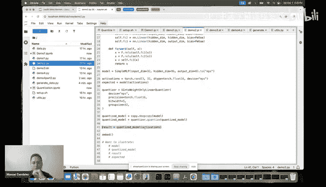
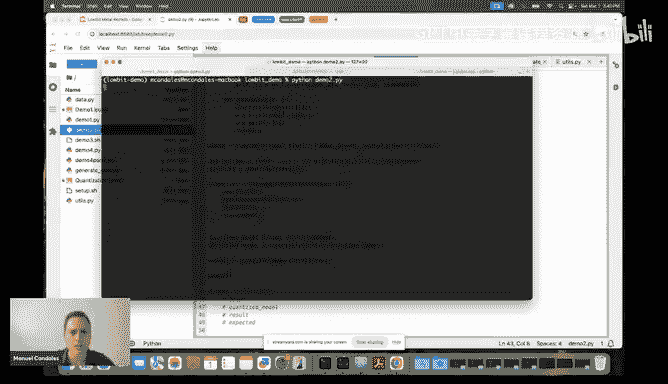
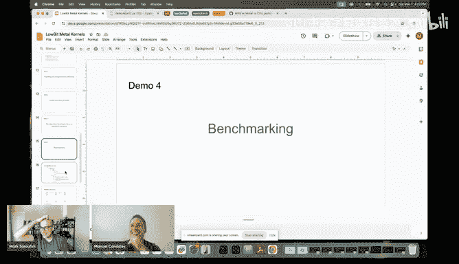
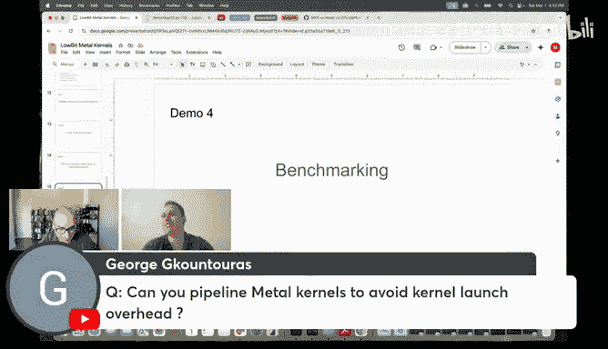
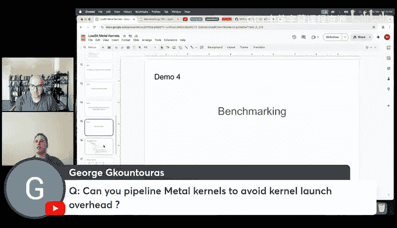
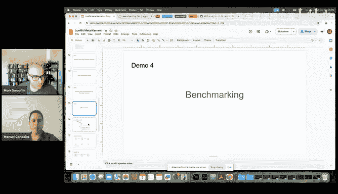
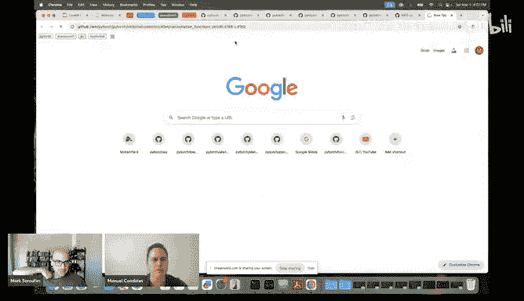
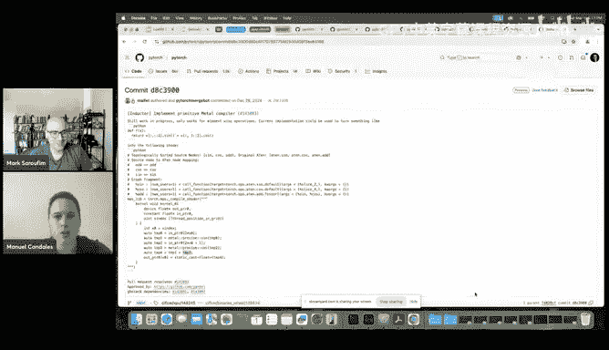
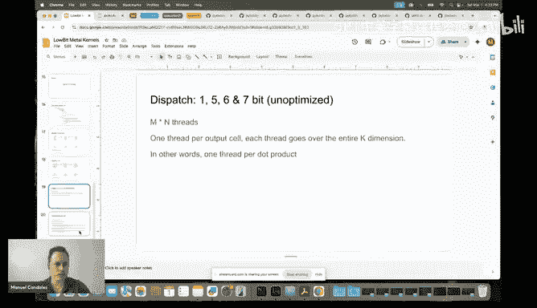

# GPU MODE《CUDA、GPU编程1-53课｜GPU MODE》中英字幕（deepseek-v3.2 - P52：-20250302-Lecture 49_ Low Bit Metal Kernels.zh_en - GPT中英字幕课程资源 - BV1QZ421N7pT

have any background on this can follow along So we are going to first talk about you quantization。

Veryry briefly groupwise continued conversation， low bit packing then actually talk about a little bit groupwise containss linear operator and then we're going to get into the demos right and then after the demos we're going to do some some code we're going to go through the code。

😊，So my intent I guess， is that so this would be sort of the metric to know if the talk is successful。

 anybody listening to this， they should at the end of the talk that should I should have given enough material so enough context so that if you want to actually contribute to you know to the development of these kernels。

 then you can do so and you know where where everything is located and you understand。

And of details to be able to do。So let's get into it you know very briefly so quantization is you know basically a technique to map roing points into you know a small range of inter values and it's done to reduce memory right and speed up computations you know it's very the more common would be like you know you intake quantation right so for example you intake we map。

😊，Floating points to you know a bit on sign ingers and in the range from 0 to 2 55 right， So then。

 for example， if if you're talking about a flow 32 that takes4 bys。

 you'll be sort of like qualifyding each one of them with one inger that only with one。

U intake integral that only takes one by in low bit con we go even lower right so we want to codify each floating point with just bits few bits like three bits5 bits right and so basically that's what it is we are mapping the floatinging points into the end bit on sign interiorgers so then that know the range would be from0 to the n minus-1 so for four bit it would be from0 to 15 from five bit would be from0 to 31 right。

😊，So yeah， so then you get even more compression Now now at this point。

 that's why I said that was going be a few demos I'm going to go out of the slides and I'm going to go here just very briefly to you know actually understand what is conation doing right so。

😊，So let's give an example of quanting at just10 an element array using five bit con so youll stay with our array right with coding4 points。

 each one is of932。😊，The first thing we need to do is we need to determine the scale and the zero points and to do that with what we do is that we compute the range right one way of doing this right there are all ways of doing it。

 but one way of doing this would be to just compute the range of the array so in this case this is 8。

11 right so it goes from minus- 3。2 to 4。91 right then what we do is that we divide that range by the amount of values that we have that we want to that we have in at our disposal so if we're doing five big consation then we have 32 values but。

We divide by 31， because。We divide by 31 because we actually， it's not the values。

 but it's like the steps， right that we have taking every time that we increase the the scale。

 So we divide by 31， we compute the scale In the case of intake would be will be dividing by 255。

 And then we compute the point that that would be mapping to So like the。😊。

The value in quant space that maps to zero right to the zero in in the floating point space right and we want that that one we want to map that exactly so we actually after we compute the zero point we actually based our calculation of the quantization based on that zero points right so。

To apply quantization， well have to， you know we divide our array by the scale。

 we add the zero points we round， clip by the extremes of our range and then sort of our quant range。

😊，So Q mean Q max。 And then that's that's it we have here array array right of font values。

 So you see， you know， we have it goes from 0 to theory1。

 those are the maximum ones because by using5 bit conization if if this had been a bit conization。

 then we would be seeing here like something from 0 to 2 55 right values in that range。😊，嗯。

And just to see。It's like when we quant tie actually lose precision， right。

 so just to see how much precision we're talking about in the case of in this case。😊。

So we can do this to decoize array and you know， if we print the。To compare the values。

 then this is what we see right so we we these are the values that we started one like you know the the to the left 1。

21 you know1，2。34 right over here。😊，And these are the values that， you know。

 we would be like we would think they are if we decontize deconttize values。So。I mean。

 I guess everybody， not everybody， but you know。Most people are familiar with this。

 but I just wanted to go over this real quick， so that's quantization。😊，Now。

 if we do this over an entire tensor， right， it has a lot of values we。

Like the scale will depend on the range， like from the minimum to the maximum of that entire transferor。

 the transfersor has like a million elements。 then like the precision is going to be worse right So one technique that is used is is called groupwise quant。

 So so you don't you don't quantize entire transfer。 you just quantize。Pieces， right。

 like you quant it by groups。 So and one way of doing it is， for example， in this case。

 I'm using a 2D case because it's what we're going to be working with。 So we take。We take every row。

 right， And then we divide it in groups right of a given size， right， and then。So let's let's say 32。

 right So we take groups of length 32。 and then we just quantize each one of those right groups right separately。

 Now， when you do that。When you do that groupwise conversation。So what you end up with， right。

 you have， you started with your original tensor that is， you know， floating point tensor。

 And then the output is going to be， you know。A quantized tensor of the same shape is just that。

Before you had floating points now you have integers right but then because you're doing it group wise every time that you quanttize one of these arrays。

 you are producing one scale and one0 points and you need those to continue doing all the computations so you need to store those So you end up with these scales and zero points tensors right and in this case in this example right we have。

😊，An a by8 tensor right that we use groups of length4 right and then so we have two groups per row。

 so we end up with a by two tensors for the scales and the zero points。m，Is that？

That clears good so far。 Yes， so maybe we want we should maybe sort of clarify。

Why people need to do this， like I figure maybe your previous your previous notebook was quite nice and maybe if we show people like anomalies。

 like basically sort of like large values and what happens to them when you quantize and dequantize people might better understand the tuition of whywise quantization is。

important。 yeah， also you're going to like play play around with this and like put like something like 1000 here or something like that。

 Yeah， like so people understand like why， why the notion of groups is important right， So， well。

 yeah， if we do something like that。 then our range is gonna be really， really large。

 So when we do yeah， that's， that's a good call。 So the scale is gonna be really large， right。

 So let's continue doing this。 So we， we get to the end， Are you gonna see when we decoize back。

 we're gonna lose， Yeah， see we lose a lot of。 Yeah， this， this is now garbage right。😊，So yeah。

 so yeah， so this is why like basically like group wise is interesting。

 but like of course group wise is slower because you're， you have to you know。

 you don't like you have multiple scales and factor。

 you need to store them you need to do this like group wise operation so everything's is more complicated。

 but you have to do it unfortunately right right。😊，はい。So， but yeah， that that's actually very good。

 so。😊，All right， so we were on group group was quantization。 now in the case of。

So when we are doing U in8， we are done here， right。But when we are doing low bit quantization。

 right this operation here， what it produced。Is actually a tensor right， that。

 So let me see if the in the next slide， yeah so。The con sensorsor， right？

Has so in the in the case of， for example， five bit。

 the quant sensor will have values between 0 to 31。 like each number will be a value between 0 to 31。

 but but they are stored in in you know in in bytes right in you know you may be using a U detail。

Now， this is not mean we， we want to actually completely like。Squeeze this into， you know。

 the minimal amount of space that we need to to store this， right， So this is where parking comes in。

 right so。In this example right so where we have an a by 16 quant tensor each cell has it has an in that has five bits so you really only need five for every row you only need five times 16 bits so 80 bits to represent that entire row and you can you know you only need 10 bytes for that so you can store that in an a by 10 tensor with d type U intake right now every cell now on that packed tensor is not going to directly map to a number from the quant tenor it's basically like the bits are being packed right there。

😊，嗯。So， you know using yout just more generally， right like if the quant sensoror is n by k and we have n bit values。

 then we are using n times k bits per row we divide by a to get the bytes。

 so then the pack tensor would be n times by n times k divided by8 so this would be the shape the resulting shape of the。

Of the pack tensor， right， So we， we started with。A floating point tensor， right， FP 32， FP 16。

 And then we quantized it。😊，And then we packed that and then now we end up with this packed sensor。

 right？嗯。Now， so。For simplicity， right？And I say so for simplicity because depending on the n。

 you may not impose this requirement， but for simplicity。

 we require k to be a multiple of eight and this， you know。😊，In all of the cases that we work with。

 we always have like， you know， okay， iss a multiple of。32 at least， right。😊，嗯。

We always pack and another thing important to think about parking is that we always pack eight values at a time because。

Well， if you have four bits， you don't need to you can only pack two at of time。

 but in more generally if youre thinking about five bit3 bits。

 you are packing eight values because you know five doesn't divide8 so you can you have to actually use8 values。

 you're transforming a bytes you're basically mapping a bytes to n bytes so in the case of five bit quantation and low bit packing you'll be mapping8 bytes to five bytes in the case of three bits8 bytes to three bytes。

嗯。And so now， okay， finally， we are able to arrive after it， I don't 15，15 minutes。

 We can arrive to the， to the actual operator that we're gonna be。

 the operators that we're gonna be talking about。 So we're gonna be talking about low bits where low bit is because we're talking about values of n from 1 to 7。

 groupwise quantized。😊，Only the weight is what we are quanting so groupwise quantized with only linear operators because we are implementing a linear but using these packed weights right so then the signature of of this op would look like this right so you have the first tensor will be like the activations right in this case it would be a floating point tensor the name of these operators like this because you can really like linear floating point activations and beat weights so B would be this packed n beat packed weight。

😊，tenensor， then you have the group size that you used to quanttize your tensor and then the the tensor containing the scale and the tens the zero the scales on the zero。

就位。That said that we you know， that said that we are using M K and N for the for the you know。

 for the dimensions here of linear， So the activation would be n by K。 the pack weights。

 as we saw would be n by。N times k divided by 8 and the group size that we use we allow either 32。

 64， 128 or 256， and then the scales for each group they are k divided by G because you for every so like the rows are dimension k you have to divide that by the group size right to get the number of groups which would be the number of scales on H row in the scale tensor and the same thing for the zero points right and here this is a ceiling because。

😊，We don't really need so like we can handle cases where G doesn't divide， you know。

Exactly when what G doesn't is not an exact div of K， right。All right。

 so let me know if you have any questions at this point。

 otherwise I'm just going to jump into the first demo。😊，Yeah， I think this is clear。

 we can we all right so let's so I'm gonna first of all。

 so I'm not gonna run I'm not gonna run this right now these things。

 but are the exact exact commands that I ran to install to install these operators So we clone Ao creating a new environment I'm installing some dependencies parameterized I'm actually installing it just because some tests。

 but the main thing here is that we are when we are installing AO we have to do it this way in order to get so these are experimental ops right now and if you just do P install toro。

 you're not gonna get them you have to install locally and you have to use these two flags UTP equal1 and torch build experimental N equal1 to get them these are the things that I ran random。

😊，I'm using them in the demo it's not necessarily for the operators themselves。收。

So this is how you would install it in your content environment。And yeah， let's jump into demo a one。

The first thing that I want to show is that' this whole process that I explained on the slides。

 let's do it here， right so。The first thing is that we want we're getting some weights we want to quantize them right so the first thing we need is to import。

 we need to import the quantized function from torto or experimental that quant API that's what is implementing this low bit quantized operation。

 low bit quantization I so I generated I have a script here generate data that I generated weights。

Such that when I。Quant when I when I quantize them and then de quantize them。

 I actually get back the same numbers。 and I did this so that we can compare these then later to linear。

 So， and and actually， you know， have that satisfaction of actually getting the same numbers。

 right So the yeah， just assume that we are getting， we're getting weights from somewhere。

 Let's say that we are loading them from someplace， And in this example， we are using， you know。

 M equal 5。 And let's use these dimensions， right， small dimension so that we can actually examine these sensors easily。

😊，So let's examine the weights right so the weights are this they are so I'mprint here， the shape。

 the title and bytes， so basically they are this is an 8 byte 64 float 32 tensor it takes 2042048 bytes and I'm computing the bytes just by multiplying the number of elements by4 which is。

By the number of bytes， that each number of occs， right？So嗯。Yeah。

 it is a utility function that I had here。系。数。Now that we have our weights let's quantize them first we are going to use quantize to quantize them in this case。

 so what we need to pass to quantize is the weights， the group size。

 the n bit right so this case is five in this example these operators we are using zeros because there are the CPU of operators they have options where you don't need the zero but this ones do and then we are using U intake quantization so it's sign is false because we are not using intake we're using U U in when we are doing this quantation right。

I mean， sorry。 So by that， by that I mean that。doingWe are doing n bit quant so like five bit quantization。

 but we are sting the values in Uate tensor so quant the quant weight tensor that we're going to get is Uate right？

So let's examine the scales， this is what we get back。😊。

Nice scales because that's why I prepared these data so these things would be nice to see。

And the zeros are these ones， notice that the zeros are between， you know。

 between in the range 0 to 31， right。嗯。Now we examine the quant weights。You know。It's like I said。

 it's a torch unitate tensor， look at all of the values here that are all between0 and 31。

And let's see。 So the shade， yeah， a by 64。 so the the shape hasn't changed the type is inates and the number of ice is 5。

12。 so that went down now by 4 because we had so we had。😊，We were using 2048 bytes。

 but we were using four bytes for each number now we were using a single byte。

 so that went down by a factor of four。mSo someone actually should before we keep going so we have someone in chat like Noah Peterson is asking。

 is this inference only or can you also train in a little bit， this is important only。

So could you maybe talk about like some of the trade offs then because like I think， for example。

 for like we had a previous speaker donors to talk talk about quant straining like essentially the complexity are like you need basically little bit。

Like basically you need a little bit like gradientss like sorry you need a little bit like backwards pass implemented and then because that has like major correction issues like so sorry major error issues you need something like stochastic rounding to really make this work but I guess maybe what might help is you can also talk about the motivation behind those kernels like presumably like this is also for phones right and maybe the same yeah so basically the idea here these kernels are。

😊，The main motivation is to be able to run Lama and LL Ms on on device， right， so。

As you know as the model as the models get bigger， we want to， know run them on our phones。

 we want to run them。 So these kernels， they were landed。

 I'm gonna to touch on that when we are on the code on the part of the code walking through the code。

 But so we we have we are ready before before working on these kernels we already have had in Pythers we had the know4 bit quantas linear。

 So basically the same not exactly the same， but basically the same the same idea for B Q linear on like I think the first one that was landed was for the Ka again。

 and then for the MP backend。😊，That was on Ps， but we want to also utilize these kernels in Exor。

But I have here a few， I'm gonna when I go through the code。

 I'm gonna show you how these channelss are being integrated into each of each one of these places So how they are integrated into Torssha executivees。

 I'm gonna talk a little bit about those but so basically yeah。

 the motivation is so that we can run them not only on on Max。

 but also on iPhones or Android So yeah any devices right， So。

 so there are models that you really need to go to 4 bits and even to 3 bit to be able to to run them at all on these devices。

 So that's that's the motivation here。 And this is why the emphasis on inference because at this point when you are。

😊，Training on devices is also a thing。 but you know。

 inference on devices what we at least I am working。

 I'm sort curious of like at least for MacBook generally， for example。

 for GP you know like you have 40 gigs。 you have 80 gigs。

100 gigs on the black world So these are like useful numbers like for Mac I think it brings us from like 48 to 128 like a unified memory like how much Vra are you really working with on like right now。

 this machine that I'm working on， I have 16 gigs this is an M1 pro this is actually my personal machine and the reason I'm using my personal machine is because my personal has less Ram than you want Yeah。

 I'm actually going on this， So yeah， this is an M1 pro from 2021 I think and it has 16 gigs。😊，W。

 yeah。 So， yeah。 so it's not an M1 max with 64 or an M 3。 but no， I know。 So it's very small way。

 So in comparison so。so嗯。We were on， okay， so yeah， we had already finished quantizing the weights。

 And now we are going to pack them， right， And so the decoration that we are gonna this now we are encountering our parking。

 This is also a kernel that we that we have in Too that we made for this。

 and it's packing the weights。😊，For specifically for this linear operator， right？

So you we're pack the weight we have this same version， but with one bit2 bit。

 three bit up to seven bit。And then。Now let's examine the pathways。

 So the shape is now reduced to 8 by 40 right and why is that Because well each。

In this 64 each group of eight is being now condensed into five so now you have like instead of 8 by8 like 64 is8 by8 now you have 5 by 8 which is 40 so that's why you now have a tensor that is 8 by 40。

😊，And the D is still uate right because you are packing these bits into unate values and how many bytes we are using 320。

 so 512 went down to 320 right？So。We have our packed weights。 Now， we。

 we're gonna use now the linear operator。 And to do that， we need to prepare the skills because they。

Like they accept so basically what one thing we do with the zeros is that the zeros that we got from quantized are integraltegers。

 but we are actually going to be when we are quantising。

 we are actually multiplying the zeros by scale like we are adding the zeros or subtracting the zeros sorry and multiplying by scales so then we already we are we already do that computation beforehand so we just do the zeros equal minus zero times scales and then our operator is taking them transpose so we also do this and so basically we end up with scales and zeros that look like this so now we move everything to the MPps backhand so now we have a par weights our scales and zeros。

We're going to generate some activations with you know the shape the shape right like M by K and now we're going to run five bit linear。

 So you know we're sending now the activations， the pack weights， the group size。

 the scale and the zero。 So if I go back to my slide here。 So this is the same signature that I was。

Talking about， right。嗯。And let's look at the output。 So we， we go back。 So， you keep going。 So。

 so again， at least for GPs like。There are certain like compute D types versus storage D types right So for example。

 you have so for example， here in this case like in three is a storage D type and what is what is the compute D type in this case and does this tend to change from。

Let's say M'1 M2 and M'3， like basically is Apple releasing three bit。 So right now Okay。

 so let me then brief jump into the code then now this， this， let's look， for example。

 the So we have some of them are optimized。 Some of them are unopimized。

 I'm actually gonna look at one of the optimized unopimized ones。

 time is not optimized like 55 B in this case is not optimized。 for simplicity。

 So what we are doing is that we are doing computation right we are unpacking them They are in the shader。

 right and then we are doing the the computation we are actually doing over over float 32 like we are doing the accumulation over float 32。

😊，So yeah， that's now the activations like when we these shaders and these sensors。

 they support activations to be floated， 32 flow 16 or B float 16 right but the actual computation happening inside these shaders。

 the un optimizeimized one， it's actually floats。Interesting， yeah。

 co causeuse I would have expected like， this was again me speculating like I would have expected considering。

Apple is really selling their hardware quite a bit for like local alum and friends that they would have added compute de types as well for like little bit D types。

 I don't know if this is like maybe eventually part of like their like future roadmap。

 I guess this is all speculation Let me， so let me first give let me give a disclaimer also here。

 right， So this， these low kernels are are definitely work in progress in the sense that they are not completely optimized。

 as you can see， we're gonna get into that in one of the slides。 And and at the same time， I So。😊。

I am still on my learning journey， right regarding you know， GPp GP optimization。

 So if you see something， this， we know， for sure， this is not optimize yet。 But if you know。

 if you see something weird， it may not be， it may just be that it's not you know。

 it may just be lack of of knowledge on my part， right， So don't， don't。

 don't be afraid to go that out。But in this case， we， you know。

 I know very well that in one in 5 in 6 and in 7， they are， they are not optimized at all。 so I。

First， I focused on enabling these kernels and making sure that they could integrate to Toshad executiveecutors different surfaces where we wanted them。

 And then after that I have been optimizing then I optimized2。

3 and 4 but but they probably can be even further optimized right so that's something know and actually one okay go ahead you go you go go I was going go another question So actually the structure of this talk and the aim of this talk is basically。

😊，That if matching people that know a lot about GPU and a lot about you know optimizing them to what like where these kernels implemented how so basically anybody listening to this。

 that is a GPU per Pro。After this talk should have all the knowledge necessary to contribute to this kind。

 right？😊，Yeah， I mean， yeah for what it's worth I definitely think like the Apple's performance on Pytor is generally something that could use a lot of love。

 So if you're interested in this， yeah I'm gonna touch on that I'm going touch on that yeah I'm gonna to touch on that that this is one of the things we're but it's not because of linear it's something else I see I see so speaking of like basically maybe one question from chat that I think is a sort of like interesting segue So George is asking is anyone using little bit kernels for like audio processing at least like with customers that you've worked with they mostly interested in text or as like audio like also came up for these kinds of applications I'm not working directly with customers but I think think at least four bit is being used more tenly these kernels3356 they are。

😊，Newer and experiment and more experimental， but the four Bta has been around for a little bit longer。

 I think it is and in our case for。For， you know。I know for a five that we are using for bit for。

 well， actually， yeah， I think it is。😊，But I'm， yeah。Yeah。

 I wouldn't be able to tell you an exact for or something。 Yeah， I mean。

 but but presumably any customer who's using a linear， you know。

 an inference could benefit from this kind of work。 So yeah yeah so another question from George。

 I want to generalize this question a bit。 So like this person's asking is it accessible outside of Pyrch and maybe I'll generalize this like。

 for example， and a lot of like custom extensions in general in Pytorch like there's this assumption that your input is a Pytch tensor。

😊，So basically what is sort of the assumption here is that basically the input to these kernels is like a pointer of memory。

 it doesn't have to be a Pythrus tensor， and have you sort of envisioned how they could be interrupt like in other like frameworks？

Yeah， so。喂得得。This these kernels， so I wanted to add that given that they are。嗯。

Like this the shaders themselves can be used outside of you know， of fighters， absolutely， right。

 But these channelss， they go together with up definitions。 And those are right now。

 those the code that is here is for pys。So81 and executive right。

 So we're gonna go into that as well。 So there is some sort is like a layer here。

 right Like we we have our oh I'm a hurry here。 So I may as well jump a little bit into this。

 So we have our maybe if you could even elaborate on what you mean by up definition。

 I think this should make answer to the question here。 Let's do that。

 But we're gonna go back to the demo that layer。 there's a lot of questions there Yeah feel whatever So so then then then let me jump then into this slide。

 It would be easier。 So。😊，These kernels， they are under Ao， Toro experimental， right。

 And then on their experimental， you have kernels and ops， right and so。😊。

Os would be your actual Pyth op that you are registering to， you know， to 8 or or， you know。

 or in or exors， right， and the kernel its。Ting for agnostics。 So the。

 thekens don't know anything about tensors。 They are taking， in this case， they are taking。

MtL buffers right like metal buffers。 so so they don't know anything about tensors。

 And so that's why you the metal shaders and the kernels。

 you can use them completely outside of P but the ops you can't right because the ops are you know are already using。

8 and tensors and I。Unless there is an integration。

 like if you have an integration into it and tensors， then you can， right but what。😊。

Talking like generally about like the general C plus plus code， you can use the kernels。

 absolutely right。😊，W what， wait， am I。Ling。About the super generalization of this。

 well when we get to the code， we're going to go through through that approach， but yeah。

 but I just wanted to make sure that it's understood that there is this this separation between ops that are you know they take tensors as inputs and then they call the kernels that take metal buffers as inputs。

Shouldha we go back to the demo？呃 yes是的。All right， so。诶。All right。

 so then we were on we computed the result of5 bit linear and then。Now， so our our tensor， right。

 So let's examine it has a shape 3 by 8。 It's flow32。 and it's in and the as we expected， right。

 So now let's let's actually compare these to what we would have gotten if we have just run linear right。

 we any quantization， any packing or anything。 So so you just run torch like linear the 8 linear operator on the activations and and the weights on the back end and then we will get these results。

 which just。😊，Sorry， we'll get the expected。 And then I'm now I printing here result unexpected。 And。

 you know， they just look the same， the same thing。 So we ran torial clothes and and we get through。

 right so。This is basically the flow that you would have to do if you want to use these operators well like the quant pack and then calling the up。

😊，嗯。So that was the first demo。Let's back， there's no back。诶。The second demo is low Bitcoin a model。

 So what。What do we do for low contact in the model？下。

We're going to show it here and then we're going to run it on the terminal。Let's use a toymo。

 a simple MP， and then this MOP has three linear layers， right？嗯。So they have like an linear layer。

 an nonlinear nonlinearity， and a linear layer andity， and then then a linear layer。

 and it's really layers connected by nonlinearity but。😊，嗯。So then yeah。

 we this is the only thing we need to do。 So we have a quantizer that we imported from the same place that we imported the quant op right。

 So from the quant P。😊，We build our quantizer with the number of bits that we want to quantize the group size and the precision。

And then we quantize the model， the quant dot quantize， we quant our model。

 we run we can run all we can run the all through you know。With some inputs like this。

I just wanted to。

I wanted to run this。By the way， I'm getting this effort recently just every time that I run that I import Thursday。

 I'm getting this this little we can， we can talk about that after we should fix that。 Okay， yeah。

 so so。Okay， so yeah， so I wanted to show so this is the model that we had right。

 and then after we cant it right？😊，Basically， every linear layer was changed by know a low bit quanted linear layer。

 right and our results。Look like this and our respective results are not going to look exactly the same because in this case you know。

Remember the expected would be without quantization right the result here would be you know after running the quantize model so they are not exactly the same so remember that when you do quantization you do lose some precision right。

 but they are you know pretty close。嗯。So that's what you need to do just if you have a model and this is exactly what we do when we are quantizing Lamar for example。

I'm actually sure you want to jump into well。Yeah， I'm going to actually jump first into the。

Tt at integration because I think it's a good it's a good connection point so we。😊，For those that。

 you know are notfa familiar with Torshad， this is our。

Our solution for running LLMs on multiple surfaces， device， laptops and。So this is the ripple。

This is the PR that or you know that integrated these ops intor into Toshas。

 I'm just showing it here because you know it does have instructions on how how to install them in tourshas here is the documentation I'm going。

嗯。Yeah， we'm going to go over the slides later about these too。

 but basically I just wanted to show this。😊，就。Actually， sorry。

 I actually wanted to show this code in executives。 sorry， yeah here。 So basically。

 this is what we do。To this same code that I showed there in the demo is actually what we have to quantize the model inside executors。

Anyway， that was a small segue I'm going to go back to the code walkthrough。

 but I just wanted to show you basically what you know。Where you would need to to contact the model。

 So then the demo 3 would be running this。Running this with Tsha， do we have any questions first。

 though regarding consation model？Yeah， I mean， there's just some discussion ranging around like what whisperhiser does regarding fusing mathmals and kernels。

 but like I think nothing regarding this so we can keep going。Okay， so for。So， if。Like I said。

 so the documentation and the integration with Torssha is in this link。

We need to run first when once you install Torshad。

 you need to run this script to also install this experimental ops in there as well and then this would be how you run torshad using this conversationation the main thing to see here would be so like know the main thing to notice would be this part of the command right so it's called AFP Wx and the AFP's activation floating point the weights are you know X。

And this is this was this name was you know， was chosen to have some sort of similarity to the name that is also used with the the experimental CPU equivalent absolutely a bit there are also a little bit ops on the CPU side These are on the metal side and then you specify your bit width and group your group size。

 So let's let's run torsha。With this， I just have this command here， right。

 Like you so Tsha generates， we are using Lama 3。21 billion on the MP device with the type float 616 and then we are quantizing using。

Our kernels。And this is definitely going to be slower than if I would be running this without sharing screen or anything like that。

😊，But let's see， let's see。I print I。I'm going to go over the numbers that we will get if we are not。

 so let's see lets see how how fast it does。Yeah， so this is significantly。嗯，Slower。Then oh。

 actually， now， this， this one， it's not that bad。Right， so。Yeah， so I I。

Printed what I got when I was you know not sharing screen and this is where we are at right so3 bit we're getting like 47 tokens per secondgon。

 49 which is more optimized actually4 bit is better better optimize3 bits 49 tos per secondgon and5 bit which is not optimized we're getting 28 tos per second right。

So。Now， one thing I want to say here is。And this is regarding with what you were saying， Mike。

There are all issues with the。This is， this could be way faster， but there is there are other ops。

 the ones that are slowing us down here is' actually not linear。 it's actually。

Mall like multiplying things and adding things and subtracting sensors。

 So there is these ops are implemented。Using MP graphs on the MP back end they are not directly implemented using a metal shade they are using MP graph and it seems to be the case that there is you know there is a minimum CPU overhead that you would call every time that you are invoking one of these graphs and so the experiments that I have run the benchmarks。

Are telling me that， you know， optimizing those would actually。

What would be the main thing to speed this up at this point， at least？

Now for something that like you know if for an unoptimized linear then yeah it would definitely have weights over this。

 so when we started optimizing the four bit linear last year，😊。

We were getting only four tokens per second back like last year。 Well this was not on Lama 1 B。

 but regardless， the first optimizations did you know。

 optimizing4 B at that time was actually did make leaps on like first we went to like from 4 to 12 and then from 12 to 20 right but at this point right now。

There are oil ops。When we run this one， we are running Lama using Docha。

There are oil ops on the MP back end that are actually the bottleneck， No ven。就实。

LikeDoes that make sense when I'm saying I'm going to show you later when we are doing， well。

 actually in the next M， you you're going to see a little bit more of that。嗯。So actually。

 yeah lets let's jump to the next demo。 there are questions。 let me let me jump to the next demo。

 So demo4 it's so the intent of demo of4 is okay we were here。

 We then is actually do some benchmarking and。😊，So I， I just want to compare to linear。

 I want to compare like， you know， you know， between themselves between all of the1 B2 B， know。

 to 5 bit。 right， I want to compare them。 So I I code it this， you know， this。

Benchmark utility here Not that I need to call synchronize I like to call before two and most importantly I need to call it after I've run my iterations before I measured the time because if I don't do that then I'm actually not measuring the entire like I'm not waiting for the finish right so。

嗯。So when I run these benchmarks。Something interesting so well first let me show you were going run you're going to run it now later to just see if I'm getting the same numbers now with screen sharing。

 but these are the numbers that I got。You know， earlier and as I， as I was saying，2。

3 and 4 B are optimized and the， you know， the rest are not right。

 So you can compare with this the the the speed of linear on a， you know。

And like three by by22042 multily by 2042 times 2242。 So the weight will be like 242 and times 20442。

 sorry，48 2048 and 2048。 so the。Yeah， this is showing us the performance on the most optimized ones compared to linear you。

Youre not only when you're using these low bit operators。

 you're not only gaining a lot of your reduction on memory， but also on speed。Now。

 something I wanted to show what I was talking earlier。 So if I actually do something here。

 if I do something interesting， if I， if I in my utilities here， I actually comment out this。😊。

So if I don't wait for the GPU to actually finish。And Ive run this this。This benchmarking。By the way。

 I didn't I didn't went much over the benchmarking script。

 but its basically the same that we did earlier just preparing， preparing the packs。

 the scales and the zero。 And then I'm just you know， just launching。

 launching the op and and in the utilities， we're doing 100 iterations and we are just taking the average of that right But if I don't do if I don't wait for the GPU to finish。

 which means I'm sort of measuring dispatch time CPU overhead right。Then look what we get。

We get that linear is 37 microseconds， right？And all of the lowby candles are just 1。5 me。

And if actually， if we reduce the size， right， like go down to， you know， like the minimum。

 basically that we can do here like one， like， you know。

 M like one by 32 times 32 times by 8 or like a tiny like small tensors， right。Linear。

 so this would be if we are measuring the entire thing。

 so like not commenting out you know not commenting out this line， right？

So this is the actual real time。 And linear takes 24 microseconds。 So it's linear would be。

Slower than than the even the unoptimized tensors the unoptimized ops for a small input right。

 for small input sizes。 And if we comment out that line。

 So we don't wait for the GP still linear takes the same right And you know。

 our ops we just go go one。 And so basically what what is happening here is that there is this overhead every time that you call this op。

 There is this minimum overhead， you just can get。You can get below this。 And so when you have in。

In the case of Lama， when you have linear and you have larger ops。

That larger mattress multiplications may not be a big issue。

 but you do have multiplications like you multiply a tensor by two by one and you' be surprised to see that this actually does happen on。

And。You know， when you have mattress， like when you have like addition and multiplication and things like that。

 So right now， because of this overhead。That's why the bottleneck。

 that's what I was saying that the bottleneck is not on on these operators or linear when we are running Lama or when we are running any item。

嗯。There is this issue that I。诶 I put yeah。That is basically there's a bunch of numbers here。

 but basically they are comparing this doing this comparison that I just did for linear and the lo opss doing this comparison between you know for ops that are implemented using metal directly like we do have some ops that are implementing just directly using metal shaders right like like the los are being implemented and then this cons with the ones that are not and basically the issue is this sort of like this minimum time this minimum amount of microsecons just don't get plastic and then what happens is obviously when you get to large inputs that problem disappears right but。

Sometimes you're just multiplying things you're just adding one to a tensor。

 multiplying a tenor by two or something like that and you think that doesn't take that is not expensive and it shouldn't be expensive but when you but yeah this is basically what's what's happening so for what it's that is also like a very real problem on GPs like basically kernel launch overhead mix like very small tensor is like not worth it and typically the technology I think they use on kuds like instead of like dispatching multiple kernels you basically put them all in a graph and then you dispatch them all at once so this helps like in cases where you are very like where you're very overhead bound。

I suspect metal should have some similar technology to sort of like make this simple。

 but I don't know much about metal but no they do so if you are launching the entire graph then I think I don't yeah if you have like a large graph with a bunch of ops but what happens I think is that every time that we are when we're running on eager mode right every op that you call creates its own its own mini graph with just that op code and then that's what I think is happening with this op and yeah so for example in this what you said about the GPU itself the GPU not being like the launch overhead we see that for you know metal as well like know the CPU beats just you directly purely implemented up on metal for very small。

But the launch， the overhead is way smaller than the one that you get when you are creating anmp graph。

Every time， so the is getting greater I see。 So basically that's to summarize I think I summarize it here is basically like for small size inputs。

 So this thing here， CPU wins over metal and for small size input because you don't have whatever Now for medium to large size inputs。

 metal wins over and CPU。 I mean metal， I mean， like because if you're launching if you are launching an entire graph。

 with a bunch ofs and you're doing an MP graph with a bunch ofs。

 then you don't have this problem because the overhead is you know， is spread through a whole thing。

 But if if you're doing this eager mode computation。

 where just every time that you call an op launch。😊，A graph a graph。

 a graph then you have this overhead and that's what we are seeing when we are running when we just run right now in our in our previous demo when we we ran tour shotss with here。

 we ran it in eager mode right and and the ops are taking more time and actually not linear actually I let me see。

😊，This is going to give you some sort of like CPU time， right？嗯。😊，意思就是。诶谂。I need to call it， I think。

 I think this should。Work。嗯。Let me先， and I'm using four away。This's just wait。 I I。

 I'm giving it two，2 to runs。 Hes gonna run22 times。

 And then it's just gonna be give me a 5 for the last run。

 So the first one is just gonna gonna warm up on。 And this is gonna give me this is gonna give me CPU times。

 right This is not gonna give me， but。But you'll see， you'll see how。Like basically。

 the operation here is dominated， is being bottlenecked by CPU。Nobody of you。So let me。

 let me make this bigger because I think it's going to be look nice here if I do so， yeah。So you see。

 so this here， it's。Our toro operator iss only taking like， you know， 1% of total CPU。 Now。

 look at 18 copy。 It's taking 29%。 Look at mo， right， It's taking 27%。

So every one of them you see 35 microseconds， right， And these 35 microseconds it's。

 it's basically is basically this what I'm saying is basically this year here， Right So it mostly。😊。

This， this patch thing， right。So。Yeah， so that's that's something that I'm， yeah。

 we are definitely to look into。嗯。Alright， so we went a little bit over so linear。The before。 Oh。

 okay， yeah。 So I forgot。 okay， I didn't forget。 So so this is something that after I after write this。

 this， the coded is of。 I realized， hey， you know what。

 like I I didn't compare these ofs to the the like 1 existing4 bit。 linear that we have in Pythrus。

 right， So so then I this， I had this up today。 So I just。😊，I'm going to show you the code on Pyths。

Later， then maybe we come back to this。So I understand where it is coming from。

 But I did the same benchmarking with the same sizes。

 the same shapes that that that I just did the once earlier。

 And I'm actually getting 72 microcycls on my machine， right compare to。😊。

To the so this will be comparing4 B to 4 B， right so。So yeah。

 so the the torche of4 Bs is actually performing better than the four bit on。Python right now。

 And there were like a few there are a few differences between these operators in the way that they packed the weights and how so the operator in Pyths initially was optimized for coola。

 and then the shape， how the weights are packed is optimized for coola。

 So it may not be the most optimal for MP and also the shapes the scales and zeros are together in in the same sensorsor instead of being separate。

 And then that separation actually， we saw that it gave some some improvement。

 So I actually thought I knew there was an improvement。

 but I I was surprised to see today that it's actually a little bit larger than I thought it was 53 compared to like 72。

😊，Microphone。So。So yeah， that's。诶。So yeah， so we， we could say that right now the best at least on metal。

 the best 4 B operator that we have in Torch the whole Torchco system。

 I think it's this one in Torchco now I think it can be it's heavily inspired This this we're gonna go into the when we go into the code we're gonna see that it's actually heavily inspired by by by。

You know， we looked at how things were being done in other places。

 including MLX and it's heavily inspired by you know， MLX's traders as well。嗯。

I am done with the demos。Then let me know if there is any questions about at this point。Yeah。

 I guess just like quick head up I fix the import Oh right now Yeah you just like well like when you have time later just like feel free to merge the PR it should it should work in the meantime I I guess like George is asking a question which is let me pull it up on on the screen Yeah。

 so basically asking about like pipelining kernels to avoid launch overhead as opposed to batching them in a graph is that possible。

😊。

I think， but that would be like some sort of compile right that would be like some sort of like torch compile。

Yeah essentially， yes， yes， yeah。 so so yeah， so and then there is work on the way Nikkita is working on terms of the compile and there is AoTI as well but。

😊，I was referring strictly to the performance of eager， right， so we we do want eager to be。

As good as possible， mainly because it's an onboarding tool for people， right。

 So you don't necessarily like there are faster， like with Torch compile with a O T I， you probably。

 you're gonna get， should get faster inference。

Right now， tosto compile like integrating Torssto compile with you know on the back end that is working progress。

 and that's definitely going to have better performance than than eager for sure。

 but we still don't want eager to be super slow like comically slow exactly exactly and if we can you know。

 like if we can close these gaps by you know， by having metal shaders that we launch directly when we have small shapes then then we should do's an optimization that we could do right So we could have like if the shapes of the tensors in question of the arguments they are under certain thresholds we can just directly launch metal shaders for for bigger shapes。

 maybemp because MP is using M graph， which is like Apple's own。😊，Performment traders。

 maybe they are so optimized that then yeah， they do actually beat whatever we will have written whatever that I humbly wrote metals right。

 but yeah， we I think at least that's my own opinion right now。

 maybe you ask somebody else in they will have a different opinion。 but my opinion is that yeah。

 we may get a good Ri at least on eager if we do this kind of thing。

 I don't know what do you think about that I think that'm what it's worth like George who asked the question like if you want to like maybe reason through more about like what a compiled like metal back and might look like then the right person to tag on the group is malfe E So just like tag them and I think he's very interested in the struggle anyway I think we can keep going up you wantna say something。

 So so he has already worked he has put some there is already some PR that he already landed where he you can user。

😊，Compile with he's expanding right now the the support for like， I think。

 I'm not sure if he's done already with reductions。

 but I think you can already already compile like a multiplication right now， for example。

 with third compile on MP。 So you could do that right now。 you can actually do that right now。

 I think as you're talking， I think Nikkida showed it to me， it was a single file implementation。

 if I'm not mistaken let me see it but I can pull it up。😊，呃。我去你放心吧。一系。

I should have searched for this。 I should have thought about this sort that compiled part that we could have talked about。

 Oh don't worry about。 I think while you're talking also sort of no。

 like like maybe I could have made some sort of demo on， on on， on that。

But that's really the pHH right now from the lobby calendar。

 so I guess because I don't think yeah there is no support with Torrop pile and the lobby calendar。

 that's not integrated right now。

All right， let's keep going。 All right lets going。 All right， so well。

 that's done with the demo part that's。😊，Let's actually do the the code work walkthrough that I was talking about。

 So we already show this slide， right， when we were jumping on this。 but just， let's just rehash。

 So basically， we have。😊，On the experimental， we have these two two folders。

 we have kernels and ops and then on the kernels we have we have MP。

 we also have CPU right like there are other experimental kernels that are not on MP that are CPU and Scott Roy already talked about those here on this channel。

😊，And then on the pubs， we also have the MP operators， right。

Let's actually jump I should start interrupt interrupt you know I found it。

 so I think it's a it's a single file I put it in chat， but basically if you go to Pythr core。

 it's called codegen slash MP。到厘面四四。Yeah， just Pyr score and then it's gonna be。

Yeah， like just go to search。And then it's going to be codegen slashmp stop by。

 it's in the inductor folder。MP that play。And。This one， yeah， that one yeah。It's quite cool actually。

 like basically maybe like we're not gonna go through it。

 maybe we can ask Nik Kidoka to come give a talk about this。

 but the core idea is like because inductor is a like basically it's a string template meta programming and so concretely the way this would work is every time a certain like Pyth check operator is seen it outputs an equivalent string for it like here you see the string thing metal at time then you assemble like a metal program and you compile it but so this is that's by the way。

 this is a whole backend maybe if we find the PR where that's not what I'm meant to do。😊，我唔。Yeah。

 maybe go to blame， or it' be easier to find yeah。A blame。I support。 maybe this one。Oh。

 he added a reduction。But I wanted to find the first thing in the first PR。

It's probably the one from three months ago， right， I permititive。呃。

Like that on the industrial implement， the very bottom of your screen。Yeah， yeah this one。 Yeah。

 this one。 yeah。 So you see that hes yeah， exactly yeah， the this exactly I also wanted to find。

 So he has this operation， right， is's doing some indexing then sign， then adding indexing cosine。

 and then basically it compiles these things into into the mental kernel So you have here your sign。

 your cosine。😊，These are the inices part， I suppose， and then this is addition right。So yeah， no。

 thats， that's， that's pretty cool。 And we。😊，这 so嗯。

We are very excited about this and how this would actually accelerate， you know。Some of the like。

 you know， the multiplications and all that so。So yeah。

 like I think a tip I'd recommend for people watching this is that like I think in lecture one。

 we I've always talked about this very nice flag an called torch logs equals output code。

 So if you enable this flag and then just run a Pythrch program。

 you will get to the generated MP code out of it and you can like just look at the MP code and study it。

 And so this way like if you don't have too many examples， you basically just。😊。

You see where it says compile shader， you would basically get that string in a file and then you can like look at it and study it and profile it into it if you want。

It's a great way of learning and you backcked。Once once all of this is completed。

 I believe we're going to also have like an integration with Torsshad and then because Torsshad already is some support compiled for the CPU so we probably would be able to just the same command that I had here just dash dash compile right and then you would actually compile the entire Lama 3 to 3。

21 billion right and and I think that's。😊，Would be an end goal， right。

 I don't know if it would be compiling it into an a single trader。

 I actually don't don't know if it would be a single trader。 but yeah， yeah， that。Yeah。

s he going right。

So。Where we were Okay， the cold walkthrough。 Yeah， so let's so basically yeah。

 so because we want to share and we are sharing these kernels between Ps and executors。

 we've had this design， as I was mentioning earlier where we have our sort of like tensor agnostic code and all of that is under kernels like what we're calling kernels。

This。You know你。It's not an like an operator will be the thing that you actually register to the Torsha library。

 right？So let let's jump into the code as thinking it's going to be easier to explain the way。

 so let's just go first to where the ops are raised and defined so let's go to this file right。So。

 I have it open。Here。And let's go first here in this file， so on their ops M， right？😊。

That's where we are registering our functions， right？Our operators。So， notice that。Our packing。

 we have them on CPU right these ones we don't I mean we can have them also on MP backend but right now we have them on CPU。

 this is usually done beforehand， right， the packing of the data。嗯。And then we have。

We have the ones that are linear operators。Register on the MP back end。

 these ones that the out variances， these are actually needed for executors and then the metas。

 So this is what we are registering things。 This is what the signatures on define。

And this is basically the op， right， So the op。But like。I should have called that oh， I guess but。

Yeah， they're being called kernels here， but they're actually what we are actually thinking as top。😊。

They are so this is what the actual op implementation is basically we are just doing a few checks right were checking the arguments。

😊，And then we call this。 So this is。The actual。the actual thing happens。

 And remember now at least I'm putting the hat of somebody that is trying to explain where everything is。

 So the idea here is if any if anyone is interested in contributing to these kernels。😊。

This is a walkthrough so that you know where everything is located and so that if you want to submit PRs。

 this should make it way easier。On， not way easier to actually build a， like write up yard。

 but to understand where thekens are located， where the code is is， right， So then。

This is actually on the kernel sides， right so this is what we call our kernel right。😊，So let I mean。

 I just jumped now from the op implementation right on the to the the kernel side， right。

 And then under under kernels， we have our metal shaders and we have our resources， right。

 and our sources， we have some things that we need for metal and。We are not。そ。

I'm going to jump into that later， but let's first finish up with this the stream that I had。

 so these would be。Here。What we call earlier on the up。

 right like the low Bitcoin weights linear and low Bitcoin weights back right。There is， this is。

 I think of this some sort of like a config， right？So we have。

Basically ag for a configuration for each one of these kernels and it's because。

For like if you modify one of these linear operators， you also need to like。

 you may want to modify the pack， right， and you may want to modify the way that you're dispatching your threads。

And so the idea here is to make that process。Easy， right， and give you the flexibility to actually。

 you know， like basically decoupling those parts of the code right， So here。

 basically the low bit config， you can see that for， you see， for example， for the one。😊。

Bit and the five bit and the6 bit we are using， for example， this dispatch dispatch M M。

 right now for 2，3 and 4， which are optimized， we are using this other dispatch。

 We're gonna see that in a little bit in the slides what that。how does this patch look like？And then。

 and then we also have our packing functions， right， So then sort of like it's like a little packet。

 right， Like， so you have your your。You have your sort of like your metal shader。

 you have your packing function， you have your dispatch。

 right all of that sort of like is a little packet and there is so basically where the actual thing is implemented is this is like the central function where things are implemented are actually dispatched。

It's completely like， you know， we don't。So it's the same that we use for all of the bandwidth width and all of that。

 right。So if you to if you wanted to change， for example。

 how you're packing things in five right for the five bit right you would have to change the packing function maybe you don' want to delete the previous one because maybe you're doing some experiments so you just change you just add a new packing function then you just change this line here to point to the new packing function and then youre obviously changing also the shader because it's now using a different unpacking right and then and then you will have to change that but you don't have to touch this code at all right so you don't touch that so it's completely separated from those these patch and packing elements。

嗯。So。Did let me so。This is okay like as I was saying what this is what the actual panel is implemented。

 let me show you now what the pack what the the packing functions are so these are the packing functions implemented for each one of the you know the1 B2 B3 bits right this is what they are right。

So if you want to modify the pack you。This is what you will do it。嗯。Very very， very briefly。

 so basically the banking。😊，For two and four and for one。

 it's very trivial well is one bits just everybody's in the same like one bit for saying and then two bits。

 you know you have like you have four numbers per bite and then four by for bits。

 you have two numbers per by。But if you're doing  three bits or five bits， you know you。

You have multiple options right and you know， there are clever ways to do it。

 So in this in this case what we're doing here is that we are we are using so we are putting the first bit。

Of every so we we are packing， like as I said earlier in the talk。

 we are packing eight values at a time， and then we are putting the first bit。On the first byte。

 right the first bit of each of these numbers is going to be on the first byte。

So you're packing eight bytes， eight numbers into three bytes。

 so you're putting the first bit in the first byte and then the last。2 bits on on the on you know。

 on the second two by。 side you have like。The second byte would have like four of these pairs of bits and the third byte will have the only four right and for five bits we are doing the same thing except that know you now have like one and four right and then you're putting like four and4 and one by。

4 and4，4 and4 and4 and4 and that's how youre fucking and for six bits we are doing similar thing that we are doing for traces that we are doing at two twos and fours right like so we are putting two2。

 two， twos so like the upper two bits of the first number of each number in the first first two bys and then the lower four bits the eight numbers in in the only four。

😊，4 bytes。 So， so we're plugging them into declare them。 And for 7 bits， we are。You know。

 it's basically。诶。Is a little bit different。We may change。

 we may find that there are actually more optimized ways within the seven bit but。

So we are taking we are spreading one of the numbers so basically we have seven bytes right and so every number almost fills a bytes right you just have like one per bit on each of one of them and then just basically spread one like one of the values one of the seven values across all of the bytes right。

😊，So that's for parking and。And that's where you have it， and then for dispatch。Like I said。

 so basically we have like two right now we have a more like， you know。

 this part that we're using in the optimized kernels and one that we're using in the non optimized kernels。

😊，嗯。😊，I'm actually going to go to the slides to talk about the dispatch， because I have。啊。Yeah。

 so for the 2 bit and 4 bit， what we are doing right is that we are actually spaching。

So you think of it as you're taking basically every thread。😊，So forget about M right now。

 forget about So remember this is like the activations are n by k and the weights are n by k right remember that we are not well not remember because I actually didn't mention this at the beginning but we we these ops are taking the weights transpo right so instead of just taking n like you know how you are used to like M by K times K by n when you're doing matrix motivation linear it's doing and the linear up from pyths as well like it's n by K and n by K right？

😊，so。This dimension here is n。And this here would be okay。

 so this is sort of like how we are processing the weights， right。And the thread。

 what he's doing is that it's taking every thread。It's doing。

Is computing the values it's actually processing the values that you're seeing there so it's taking four by four jumping 128 values 128 because 120 is four times 32 so we are dispatching basically 32 threads。

😊，Along decay K dimension， and we are dispatching an n divided by four。Along the end dimension。

 because each one of them is taking four elements。嗯。And。So then you're jumping100 so along the case。

 I mentioned， you're jumping 128 values at a time values。Of the so like not bys， but values， right？

So， then。嗯。Yeah， so you。This is the dispatch that the twobi forbi are using and that's why so you're dispatching n divided by4 because alone these dimension is the divided by four times 32 thread because you actually have 32 threads here so these values are for the same thread。

😊，You're jumping 128， 120 four times 32， so imagine that you have like you have like 32 threads doing this four by four in these spaces here。

 right？And then by n， because H thread is processing a separate role in the activation。

So that's the case for two bit and four bit the case of three bits we are doing four by8 and that's because for the three bit we need to unpack the a bits at a time so in the case of four bits we can you know in two with two or four bits we don't need to unpack eight at a time。

 but for three bits we need to unpack the eight at a time and then so we are doing sort of like this。

We're doing the same thing that we're doing for the two and4 is just that we are now jumping at 256 because each thread is doing four by8s。

 right？And then they own optimize， they are not optimizer also they are just this one thread per the K dimension basically it also one thread per output cell。

 each thread goes over the entire K dimension， so basically one thread per dot product full dot product over K。

Any any questions about I'm going to go back to to the call walk through。

 but any questions about the dispatch？No， I think so far this is clear。

 I see one question on the perplexity， but I think。Actually。

 like maybe we can quickly answer this question， which is like。

 have you sort of anecdotally noticed like huge differences in perplexity depending on which like quantization scheme you've picked Oh yeah。

 for sure so that means。Just， just by running an element of two Bs is not gonna like so。

This is because this is post， so if we do post training quantization， right？Then。Yes。

2 B doesn't work well at all。 actually produces。Givebridge，3 B， it's not that bad。3 B is not bad。

 it produces， you know。is good but this is post training if you actually do this if you do training aware quantization。

 then things are are better I don't I don't know know I don't know the numbers。

 but yeah so right now the I know that for。😊，For certain use cases。

 which I don't know if these are public or private， I don't know。But but better not to comment。

 it's okay it's better not to comment if you're not so。

 so I I guess I just wantna also do a quick time check。

 I think we have maybe about like 15 minutes left。 So I just want to make sure you have enough time to come yeah。

 yeah。😊，Yeah， yeah。 so well we are actually almost done so the。

The thing that I was going to do now was continuing basically to show the code were the integrations。

I think， let me see， we。We were on the dispatch， and yeah。诶。Yeah so so。

Just to conclude the AO walk through， so basically the metal kernels are here， right？😊，like I said。

 one， five and six and seven are unoptimized， two， three and four are optimized。嗯。

If you are going to contribute。You would want to， you know， like modify the metal shader。

 say that you want to optimize the 5 bit。 Then you have to modify this file。

 You would have to modify。 if you are changing the packing， then you would have to modify。

This file here， like the five bit back in here。Right。And then if you are changing the dispatch。

 which probably will， then you also need to you will just need to add a dispatch function here and then in the low bit the only thing you need to change would be this config so that would be basically the code that you need to touch if you are going to optimize one of this right you don't have to touch any of the rest of the。

嗯。Now these are these ops are， like I said， integrated into Torsha into executiveors。

 right so Torsha。😊，嗯。This is the PR where I think I went of this earlier I was going to talk about the integrationeration。

 this is the PR where we got integrated， this is where they are you what is explained that basically you need to run this to install them and here is where the integration basically it happening is basically just loading。

I mean， it's， you know， making the quantser available to Tor right under this this tab。

 this code in Executor， right？哦。So this was the PR that integrated it with the existing Lama runners or executiveors has a CPP Lama runner。

know there are a few more steps involved you want to run it。

 you have to you know first follow this setup guide you to set up executors。

 then you'll need to install thelemma requirements and then build executors with MP enabled。

And then build the Lama run with the tortio Ops enable， and then you can export。

 you have to export your model。And then with the produce， the P that best produce。

 that's when you can run the， you know， the executivecut lama runner and and generate open。

 And so this is I I showed this earlier。 This is basically what the integration point is regarding the quantizer。

 right so if。And we are。When we are running the the export， right， if Q mode will be like。

 So in this cases， I'm using the4 bit example， right， So this will be like torgeo， FPA for W。

 and that would。That would trigger the fourb quantization with the torio forb canal right？Okay。

 so that's。The executor's integration and the Torsha integration and。I mean， the AO walk through。

 so the other thing I wanted to just mention is that I mentioned earlier regarding the existing four bit in torch。

😊，If you want to， you know， like I mentioned earlier， like I've run it in the demo， right。

 we run it and we compare it to the one in Toro， but。If you're interested the code。

 So basically it's here。 So this is the。This is the op， right， the one defined the native functions。

We also have a four bit in the case of you know inch in 8。

 we also have a four bit so we have4 bit sorry did I set for， I meant eight。

 so we have four bit and a bit。And so all of the sort of like most of them。

 the MP code is under this subre。And this is what it's implemented。 This is what the。With the。

 this is the kernel。And similarly， so this is kind， the shader。あはい。

The shader is here under quantized that metal so you have the up on their MP operations contact M and on their MP kernels contexts that metal is where the shadedder is implemented。

 This is in the case of fighters and this thing here is because I wanted to show you so basically the py hop the packing is different right and。

You end up producing a four dimensional tensor as your pack quant weight that has these dimensions and I believe this is because of initially this was landed for Coa and here when I ran this demo this is why so when I produced just randomly generated packed weights right between 0 to 16 right these are the shapes that I had to use for the pack weights。

So， that。I。

We went through the AO， we went through Tsha integrationeration。

 Executor's integrationeration and Pyths， so I put here all of these permalink links just in case anybody's interested in you know you know。

Contributing this to this code。I don't know how like maybe。

 I don't know we can talk then later Mark how this， how you distribute this spreadsheet or this yeah。

 I mean， like， please send me those your slides on Work chat and I'll just add them to like a repo and your recording。

Otherwise yeah like I really liked how you sort of gave us like an overall overview and like basically all the right places for where to look at the code and where to contribute and so I guess like if people have questions or they want to merge some code should they just like tag you on the A repo on the executive we Yes absolutely yeah so for anything related to these low kernels on the metal backend yes。

😊，ith if you see a problem， either open an issue， right like if you have a suggestion open an issue。

 tag me on it， send a PR， tag me on it。😊， wonderfulful， Well， I think with that。

 like I haven't seen any new question。 So thank you so much Manuel for coming in。

 and thanks for everyone listening And next week is actually our 50th lecture。

 So like we're going have like Mar Jail joining us。 And yeah， super excited。 So thanks again。

 and thank you many all appreciate it。😊，You're welcome。 Thank you。 Thank you for having me。

