# GPU MODE《CUDA、GPU编程1-53课｜GPU MODE》中英字幕（deepseek-v3.2 - P53：-20250308-Lecture 50_ A learning journey CUDA, Triton, Flash Attention.zh_en - GPT中英字幕课程资源 - BV1QZ421N7pT

Can everyone hear us okay。Are we live， Mark？Yes， we should be。

 let me just like that general to say we're starting now， okay？All right， I see a few people。

 hello everyone， can everyone hear us okay？I think they can yeah， let me just double check。Oh yeah。

 I see people commenting yeah。I I've oh yeah， I see a run wonderful， okay。Okay， yes， perfect， Mr。

 Jara， thank you for confirming。All right， Phil， hello， hello， all right。

 so I guess like welcome everyone。 This is a very special episode because it's actually our 50th。😊。

DPU mode lecture so thank you so much everyone for humoring me for so long like really this group started as a way for me to learn Ka and it turned into like honestly like my single favorite part of the internet。

😊，I'm hooked I spend like about like three to four hours on the server every day it's like ridiculous but like that's my life now so thank you for all being a part of it so really because it's a 50th lecture I figured we needed a very special guest so I'm super thrilled to have like Omar Jail here talking to us about his journey learning Kuta tried and flash attention and pretty much everything so but before the camera started rolling Omar and I were talking for a bit like basically first thing is people don't believe him that he started like performance work in 2022 but like you know you can go check the timestamp on a lot of his content Also like I really want to make sure to plug two different projects Omar does that I really like like one is of course his YouTube channel that has like some of the highest quality performance content on the internet and the second is the sport where he's been doing this very popular100 days of Kuta challenge。

😊，U。So it generally just like a phenomenal person to learn from and so yeah。

 without further ado ormore， please take it from here。Thank you， Mark， thank you Mark。

 for the introduction。So this talk is about Quda Triton and F attention。

 but in this talk I will not be actually teaching you KudDa Triton and F attention because I already made a 7。

5 hours video on this topic。😊，I will actually be exploring my learning journey in learning Qa horizon flash attention。

 because the question I get asked the most is how do I learn QDa。

 how do I learn machine learning in general， etc？So my machine learning journey actually started pretty recently honestly。

 I coded my first Ne network I think at the end of 2022， yeah it was a November， December 2022。😊。

It was an image captioning neural network that I did for like my university project。

And I remember during that time we saw like a stable diffusion being released and I did I started playing with it and I started fine tuning it like using a technique called the textual inversion。

 I think it was also December 2022。And the logo of my YouTube channel is actually one of my first attempt at fine tuning stable diffusion in generating pictures of me。

what happened is that I got so fascinated that I quit my job and I said， I don't want to just use it。

 I want to fully learn it。😊，And it took me nearly a year like to master stable diffusion and to to going like from not knowing anything about Pythtorch or Ne networks in general to coding diffusion stable diion from scratch on my YouTube channel so people always kind of ask me like what was my journey and it was exactly this year that's how I change my life so usually whenever there is a big change in my life it always starts with I quit my job I go full monk mode and I do something with new with my life。

Anyway， in this talk so we will be exploring my own learning journey in Kar F attention because I actually。

 my YouTube channel is not about performance in general。

 it's mostly about machine learning and actually I teach about the things I learned along my timeline of learning。

So let's start our speech with a little ancient wisdom。

 so I think most of you are familiar with this ancient wisdom。

 which is give a man a fish and you feed for a day。

 teach a man to fish and you feed him for a lifetime。😊，I think this ancient wisdom worked for many。

 many centuries but the goal of this talk is actually to challenge this wisdom because I don't believe it works anymore because actually in our education system so in school in university in college whatever they actually teach us how to fish the problem is by the time we finish our studies we are not close to the ocean anymore but we end up in a jungle and in a jungle you cannot feed yourself by fishing so how do you survive in a jungle when you cannot fish of course you need to learn new skills probably you need to do hunting probably you need to do some gathering or I don't know decochizing poison stuff from non- poisonisonous stuff etc。

I believe that a modern version of this ancient wisdom should go along the following lines。

 which is give a man of fish and you feeding for a day。

 teach a man to learn new skills and he will build a fishing boat to feed the entire village。

Because once you teach a person how to acquire new skills。

 there is no limit to what this person will be able to do with his life。

So this man who wants to feed himself will not just fish， he will build a fishing boat。

 he will build a rocket if necessary to feed himself。

And that's why I believe that putting an emphasis on how we learn and what we are learning and our own learning journeys。

 especially with all these new technologies and tools we have right now， it's very important。

 so that's why I wanted this talk to be like a self-reflection moment， first of all for myself。

 because I am learning constantly new things and also I think for everyone following GPU mode which is actually a learning community like we are here to learn about new technologies。

😊。

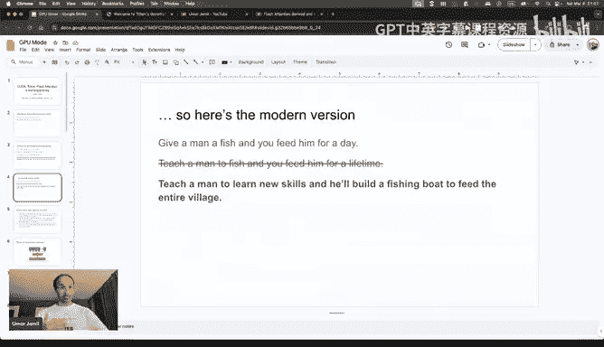

All right， let's start with a little introduction for people who don't know who the flash attention and Triton。

 I will not go into the technical details， I don't believe this is the right thought for this so I will keep it very generic。

 very high level so we only explore the journey itself。

So flash attention is an optimized implementation of the attention mechanism that is used in transformer models。

 so we have these transformer models and the transformer models have this particular algorithm called the attention mechanism。

 which is in the case of language models allows you to like contextualize the text so that each token is not only kind of representing information about itself independently but it captures information also about the context in which it appears。

😊，And if you think about the transformer， the transformer is an a network。

 an a network is nothing more than a computation graph。

 a computation graph is a series of operations that take an input and transform into an output when you use a model。

 you are transforming an input tensor which is kind of a。😊，Big matrix。

 a multidial matrix into an output tensor， and when you're training a model。

 you want to convert this input tensor to a series of operations into a sc called deloom。😊。

The attention mechanism is a series of operations so when you convert it into a computation graph it becomes one operation after another The problem is each of these operations。

 especially in a Pytorch is through its dispatch system is converted into a kernel that runs on the underlying device upon which this tensor is stored if you are using GPUs or NVD GPUs it is probably a coda kernel。

The problem with the GPUs is that they are super fast at computing operations。

 but they are not so fast at moving stuff around， why because GPUs have this memory hierarchy in which you have like this big memory called the D or also called the HBM。

Wwhich is like the 80 gigabyte of the H100， and then you have this smaller memory。

 which is called the shared memory and it's more closer to the core that actually execute the operations。

😊，Now the difference in the difference in size between the DM and the SRM is huge so what happens is every time you run an operation。

 a carel， what happens is that this carel will copy your tensor from the D to the SRM so a slice of this tensor so a part of this tensor because you want to compute all the operations in this data in parallel so there are multiple slice of this data and if you think about metrics multiplication for example。

 you know that the output of a matrix multiplication is just a series of dot products that you can compute in parallel。

😊，So you can think of each of these course computing one output element of your matrix multiplication。

So every time you have an operation in this computation graph。

 you're copying stuff from the D to the SRM， running operations on it and then saving the result back to the HBM。

The problem with the computational graph that has many operations is that every time you are going to the next operation。

 the next operation needs to reuse the result of the previous operation so you are in the first operation you copy the stuff from the D to the SM。

 then you do some stuff with it like additional multiplication or whatever。

 and then you save back to the HBM， then the next operation needs to again copy from the D。

 copy to the SRM， do some operations， then save back to the D。

This copying of information actually makes the whole process slow because we are not fully exploiting the GPU while we are copying stuff around so the first technique that is used is called camera fusion in which you do multiple operations on the data in one step instead of like saving intermediate results back and forth to the DR and this is one of the first thing that the flash attach does which is make it I you aware and first of all through camera fusion so if you do like a pythtor attention mechanism enabling you are doing a lot of operations while the flash attention fuses them into one big algorithm that do all of these operations trying to minimize the copying that you are doing。

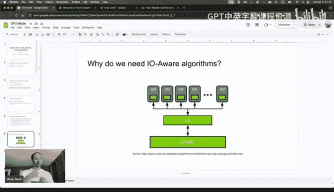

What is Kuda is a softer stack from NVDdia that allows you to write a GPU kernels that run on the NviDdia GPUs。

Kuda is not the only software stack， it depends on which GPU you are using。

 if you're using EMD we are talking about ROCM， if you are using I remember AWS also have their own like Nen GPU so they also have like their own software stack。

 I'm pretty sure Google have their own software stack for the TUs and etctera， etcter。

What is right now the problem with QUuda is that I mean the problem with all of these software stacks like ROCM or KudDa or whatever is that you need to write kernel that is specialized for the underlying GPU upon which you write it and it's a very specialized knowledge and it's very difficult to find people who are actually expert in writing specialized kernels for that particular GPU that you' are using。

😊，Moreover， there is like a steeper learning curve because you need to also have kind of write these kernels in C or C++。

 so a lot of machine learning practitioners are not aware of， I mean not familiar with C++ or C。

 they possibly code it with Python。So there is like a big talent shortage in this area。

 so Triton is kind of one of the solutions to fill this gap in a talent。

 but not only is also to make a more standardized way to write kernels that are kind of GPU hardware independent。

So Triton is the projects from Open AI。That basically allows you to write GPU kernels in Python with very specific syntax and with very specific blocks that is then compiled into a kernel that can run on the underlying GPU hardware which could be QUDa and ROCM right now。

 I believe there is also other implementation， but I am not kind of super familiar with them。

Okay now that we have seen a little bit of what are these technologies。

 let's go to how to learn them because the only question I get every day from people is。

 okay I would like to learn Triton and I would like to learn machine learning。

 I would like to learn language models transform， how do I start I believe that before you embark on a journey to start something new always ask yourself。

 why do I want to study it， why do I want to study the triton because if the answer is it's hype。

 it's popular on Twitter it's popular on Lieding， don't do that？😊，In my case。

 I always follow practical problems and my practical problems was the following。😊。

I am very passionate about learning about the new architectures and deep learning architectures。

 so every day like there is some new attention pattern or there is like a non transformer model or there is like a long context modeling architecture and I think since like 12 months or something。

 they always come with careils。Before I think people there was really very low knowledge of like around the GPU kernel so they usually just came with a paper with a Fop calculation but no like practical kernel to play with I think since Maba was released everyone is releasing also kernels for these custom architectures so the problem is every time I tried to study these architectures I wanted to experiment with them like train them and a lot of times the code maybe doesn't work or maybe it's too slow or maybe it's not optimized for the particular GPU you are running it on and I had to give up because I couldn't understand the kernel and I couldn't understand how to like fix it or how to debug it or just to understand how it works。

After giving up many times on how to like new architectures that I wanted to learn， I said， okay。

 time to go to Triton's website， this is the easiest way I can jump into the Quda train。

 which is to code in Python and have it converted automatically by this amazing stack。

 which is Triton into a camera that can run on the GPU。😊，So I went to data write on the website。

And if you go open the Tritton website there is of course you start with the introduction and you look at okay what is Triton because I don't know right。

 I just heard about it from some other people so let's deeply and if you look at this page unless you have like a little background in the GPU programming。

 you feel super lost because you will understand half of what are the terms that are presented here。

Now a little disclaimer， I actually was aware a little bit about GPU programming because I studied it when I was studying MMba。

 I made a video about MMba in like December 2023 or something like that。

 so I was kind of already aware of like what is kernelel fusion or what is the parallel scan etc but I never went super deep into it。

But anyway， so for this talk I will actually pretend that I had zero knowledge。

 so I think I can like how to say like represent the typical person who is trying to learn it for the first time。

😊，So I went to this Vi website and I kind of got lost and okay what do you do when you get lost I think before was Googling stuff right this is what you do probably I think two years ago right now you have your best friend and your best friend is called the ChGPT or Gro。

😊，I think life in life， you can never get blocks right now。

 like anytime you're blocked somewhere and you don't understand something you can always prompt and。

Why you cannot be ever be blocked because you can just keep prompting until you're unlocked。😡。

Which doesn't mean that the GPT or through G or I don't know Mira or whatever you're using will give you the right answer。

 but they will for sure put you in the right direction because they can access the web they can do the research they can do thinking they can kind of also have the knowledge that is encoded in the training process so they can at least tell you what is the background knowledge that you need to understand what are what you're trying to learn and this is exactly what I did so every time I got stuck in this journey I always went to GPT I like GT and I kept prompting until it unlocked me and I believe。

Most people like asking for roadmaps， I don't even understand why you need a roadmap because you can build your own roadmap just by prompting continue。

 keep prompting like you can ask it。😡，I know a little bit of Pytorch I know a little bit of I don't know Tensorflow。

 I know a little bit of lumy build a roadmap for me specifically based on what is my knowledge and it will actually build at least a starting point for what is a roadmap and then you can just follow it by trial and error you will figure out what is a better roadmap。

😊，Anyway， this is what I did and this is what I recommend to do。😊，Okay。

 suppose now that you know at least you know what is Triton so you can distinguish what is kuda。

 what is Triton， what is flash attention， okay suppose that you don't even care about flash attention for now you're just trying to learn Triton right？

What is the second thing that you need to do get your hands  dirty0 like start。

 there is very nice tutorials on the Tton website， just do them， you don't learn by studying things。

 you learn of courseure by studying things but mostly by doing。

So I of course also went to the Triton tutorials page and I saw these amazing tutorials which are also kind of categorized by difficulty level。

 so the first vector addition is the first thing that you do when you want to learn Kuda and it's also the first thing that you do when you want to learn Triton。

And when I was on the Triton tutorial website， my eyes got kind of illuminated by this fused attention tutorial because I said。

 wow， I never thought about learning about flash attention because I can use it。

 I know it works its super fast， okay okay。But I never thought about going deeper in flash attention。

 and I have here a tutorial that is coding F attention in what I think 3。

400 lines of code in pure Python， I have no excuses not to learn it。😊。

Now I choose it also as a goal or a dream in my Triton learning journey。😊。

And I believe you should also have always a goal when you learn things。

 so as I said beginning of my talk I don't know if this part will be cut or if I don't know if it was already being recorded but as I said beginning of my talk when I started my machine learning journey was mostly when I started using stable diffusion and I realized that I could not just accept using stable diffusion I wanted to learn it and I wanted to code it and wanted to fully understand it and I spent the next year trying to build up all the necessary knowledge to arrive to be able to understand fully stable diffusion。

I still don't fully understand it because I lack a lot of knowledge like for example。

 if you ask me anything about the stochastic differential equations。

 I have like zero knowledge on that， but still I was satisfied when I reached my goal。😊。

And that's what I did also here， so I saw I wanted to learn Triitton but I don't want to just learn Triton。

 I want to learn Triitton to be able to have enough knowledge for me to understand the fused attention to the audio on the Triitton website。

Having an objective is super super super important first of all you use them to measure yourself against something that you can see that you can in something that is measurable and that you can compare with respect to every day so no matter what resources you are learning no matter what articles you're reading or books you're reading at the end of the day you should ask yourself。

Am I getting closer to my goal or am just wander around and getting lost because if you have a goal measurable one like this one。

 you will never get lost in your journey。Secondly， having like intermediate goals also gives you like a sense of satisfaction now the way I like to learn things is I like to like how to say hardcore mood which is I try to not watch the tutorials made by others and this is also how I like kind of make videos on my YouTube channel so for example to make my video about the attention mechanism I didn't watch other videos about the attention mechanism I read a few blogs for sure。

😊，First of all， because I don't want to get influenced in my journey， my learning journey。

And secondly because I want to challenge myself， okay this is we are going a little off topic。

 but I strongly believe that life is just a series of challenges that you need to kind of overcome to prove to yourself that you can do it so that later you can do even harder things so that's why I like to challenge myself so having a goal having an objective is important and you should also define what are the rules of this objective am I allowed to kind of only read papers or should I also use any material that is available online depending on the difficulty of the challenge that you choose。

 you will improve your confidence。😊，Because if you do hard things， it will improve your confidence。

 you will not only learn， but then later you will be less scared of tackling even harder challenges in life。

Okay， now we have defined what is our goal， we want to learn Triitton。

 but we don't want to just learn Triton， we want to learn Triton enough to understand that particular tutorial from the F attention tutorial。

And as like a side quest， we also want to learn flash attention。

So okay now we start to need to start delivering so I went to the first tutorial which is vector edition and vector edition is something super basic。

 but if you have never done like GP programming it's also hard because you don't understand half of the things here。

 for example。😊，If you look at this addition kernel， if you write it in purepyys。

 you will probably have two tensor as input， but here we haveers tosor two pointers to tensor。

 so why do we have pointers to tensors？We have them because you need to learn how tensors are stored in the memory and how GPUs access these tensors。

We also have this thing called the block size and you may not be aware why do we do the calculation block by block。

 why not just the entire thing on the GPU one core at a time。What is this PD for example。

 so a lot of people like going through this kernel。

 I'm pretty sure they will have the same questions that I also had at the beginning when I started doing this tutorial。

😊，So what I said before is， okay。😊，I'm blocked somewhere right I don't fully understand it the first thing that you should do is run it at least make it runable so install Triton run it and when it runs you have two options either you learn it by running it and debugging it and you can debug triitton kernels by using the interpreter so there is an option in Triton that allows you to kind of run the kernel using the nuonpi backend so using the nuon by backend it is kind of simulated so each block is executed one after another so it's not really parallel but helps you kind of understand what happens block by block what happens under each operation block by block。

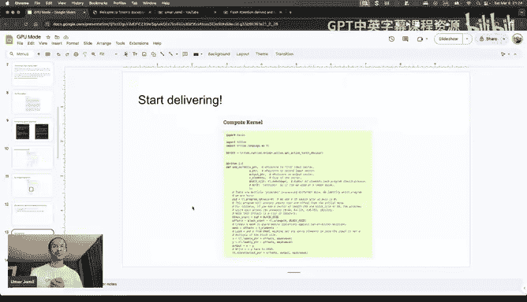

I think if you go to the Ttton documentation， it's like here the buggging tritton so they teach you how to use the interpreter here。

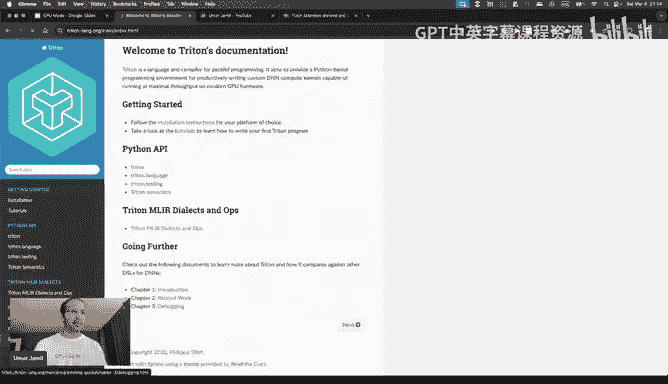

The other way is， okay， we are not fully understanding it because we lack some knowledge and I realized that by just prompting ChGPT that I lack some knowledge。

 so I went back to GPT and I asked， okay， how to fill this knowledge and all the resources we pointing to this book called the PMPP。

😊，Programming massive parallel processors。Now we are trying to do the vector addition tutorial and we found an obstacle and we found resources about how to kind of overcome this obstacle。

 should we go to this new resource and fully immerse ourselves in this new resource， no？

You should always remember where you are and why you are going to a new resource you are trying to do the vector edition tutorial on Triton website and you are blocked because you have a little knowledge a little gap in your knowledge so we go to the PMPP book but we don't just keep start grind the PMPP book like blindly。

 we just learn enough for us to understand the things that are relevant to the vector edition only。

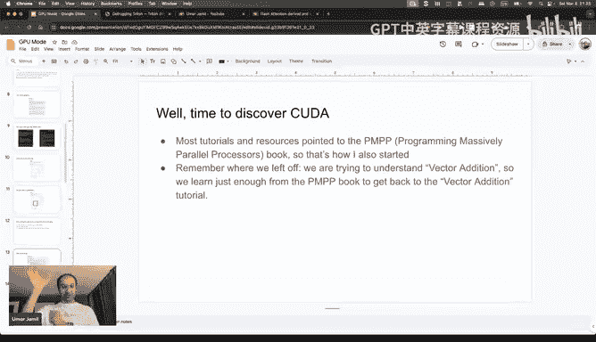

Every time you do a change in your research always make sure where you are and you need to come back there because your goal is always the same。

 you are doing try to learn fresh attention so you should always try to stay on your path unless you really want to change your goal。

And this is what I did， I went to PPP， I learned。The first two chapters， I think。

 enough for you to understand vector audit and to give you a little intuition on all the concepts that you need to at least understand fully that tutorial。

And then also all the other tutorials like if you go to for example， if use the Somax。

 you need to understand how the Somax is computed， what is the safe Somax。

 of course you may not know that so you go to another tutorial or you go to another website or you go to another blog always learn enough to go back to the tutorial because you do it and then you move on to the next one then you go to Me multiplication and you will probably not understand why we are doing it how to say the tiling process maybe you don't know what is memory Q so you go to the KPP book learn it and go back and finish your you finish your like tutorial the other tutorial or also kind of in increasing level of difficulty so I think there is no like back propagation until layer normalization so layer normalization is the first tutorial that has also the backward path that you need to compute and for that you need to kind of review what is the。

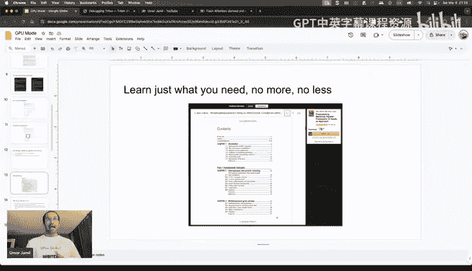

How to compute gradient， the Jacobians， etc cea。Anyway。

 I did all the tutorials until layer normalization and then I finally was ready to fight the final box which is flash attention and the flash attention。

 if you look at the tutorial on the Triton website， it starts by introducing okay。

 what is the attention and they refer you to the paper of the flesh attention and this is also what I did。

😊。

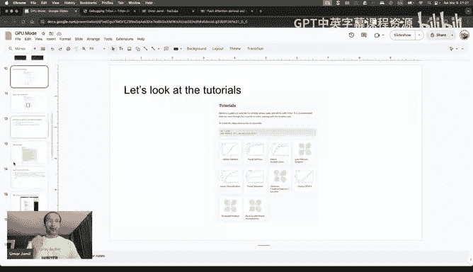

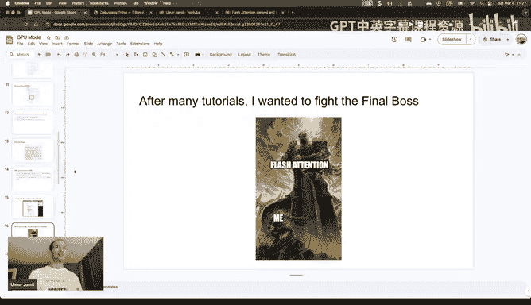

I went to the paper and I started reading the paper when reading the paper。

 also you will encounter a lot of things that you may not be familiar with and like many actually。

 and especially if it's a paper very technical paper and from on something that you are you're not like a hot say。

😊。

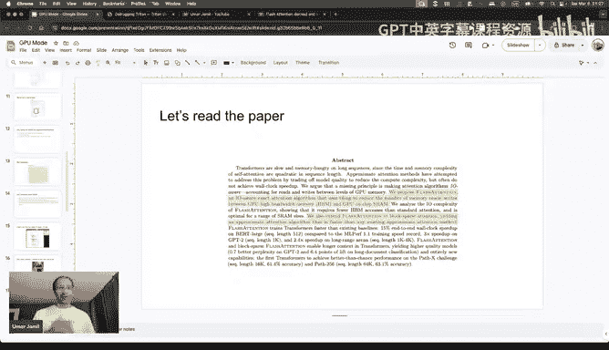

Using like GPU programming every day， so there is a lot of terms that are specific to the GPU programming community and this field。

😊，So I also kind of， there was a lot of things that I didn't understand on the paper。

So what I did before and what I have been telling you to do before is okay every time you encounter an obstacle pro GPT and then overcome the obstacle and go back however for paper I do something slightly different so instead of going down rabbit holes randomly and trying to cover the like the knowledge gap that you have。

😊，I suggest the following， which is。😊。

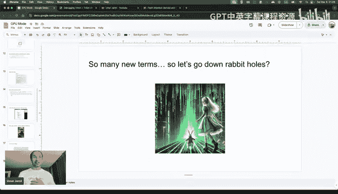

Read the entire paper， top to bottom。Why even if you understand even if you understand only 1% of it。

 why because first of all， when youre reading a paper。

 first the first thing that you want to make sure is you want to have an overview of what are we talking about and you want to kind of unnotate all the things that you don't understand before jumping to learn about them。

And I know that it is very uncomfortable to read a paper that you don't fully understand because you are constantly reminded of all the things that you don't understand it makes you really feel comfortable uncomfortable。

 especially if you're trying to enter the field like when I was trying to enter machine learning。😊。

I read a paper， I said， wow， I'm so behind and will'll never make it， it's going to take me 25 years。

😊，It's super uncomfortable only for this reason， but you need to force yourself to do it。

 so just read it top to bottom。And there is no other way like to understand fully what are the top things that you need to overcome to kind of feel in your knowledge。

 what are the things that you can kind of ignore because maybe are not so relevant for your journey and what are the things that you already know。

 and plus your brain is actually very is smart at connecting dots even on things that you are not fully familiar with that you don't fully know。

So sometimes like if you learn about something and it's a totally new topic for you。

 your brain will always kind of sometimes find an interpretation of what you're reading。

 which may be wrong Ba Ks always satisfies to kind of have an intuition by yourself。😊。

Another thing that I recommend doing is highlight， but don't highlight while reading。

 this is also something I used to do before highlight after reading。😊。

Because this forces you to go through it again， of course not every paper you can do it like this so it depends really on the level of depth that you want to reach in this case I was trying to master flash attention so I had to read it multiple times before I could come up with a plan of how to tackle it。

And the claim was the following more or less， and this is more or less the kind of the things that I teach in my video。

😊，So I was already aware of what is the attention mechanism。

 I was already aware of what is the Somax， what is the problem with the Somax。

 how to compute it in a safe way like you don't want the exponential to explode and I was not aware what is the online Somax I was a little bit aware of how what is GPU programming HBM shared memory tiling etc tensor shapes but I was not like super confident on。

😊，On the more advanced topics。And then of course there is the thing about back propagation。

 so all this roadmap was built by going top down to the paper and highlighting the things that I found difficult for me to understand and then I prompt GP asset okay I don't understand this term where does it come from what is this field？

😊，Is it like should I learn it I don't know from a Mebook。

 should I learn it from the Pythtor website， should I learn it from give me some resources to learn it so I could build this road just by prompting GPU GPT。

😊，And by reading the paper。Okay now that we have a plan， we need to fight all these bosses。

 so the first boss was Somax so if you go to the F attention paper they tell you about what is the problem of the Somax if you compute the attention block by block because you need to compute this normalization factor。

😊，And in order to compute the normalization factor。

 when you're computing the attention block by block is to do it in an online way and actually3 out is very good because he already actually give you the two resources that are relevant for this。

 which is the citation number 60 and 66 from this paper， which is the following to paper。😊。

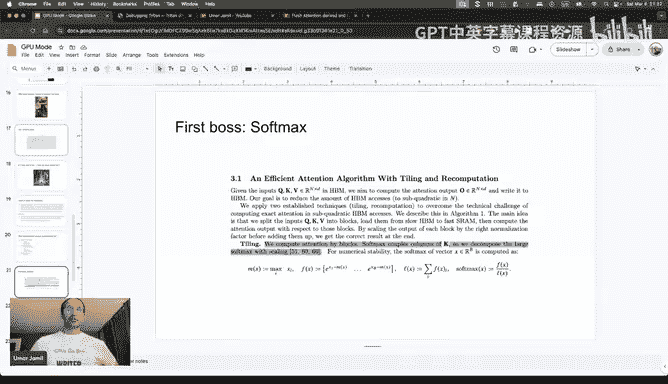

The first paper that is relevant for this topic is the self attention does not need ON squared memory this paper basically teaches about the lazy soft mixes so the fact that you can compute the normalization factor。

😊，You can apply the normalization factor of the softm while doing the multiplication for the V compute when you do the attention mechanism。

 so softm of the query multiply by transpose of the keys。

 and then you multiply by so during this multiplication by V you can actually do the normalization factor for the softm。

😊，And the other paper is the online normalizer calculation for Somax。

 this is the paper where I actually learned how the online Somax works。

And this is actually how it is done in F attention。

 so if you read this paper online normalization calculation for SoftMA。

 it is a very interesting paper because it is super simple to follow first of all。

 there is an algorithm on how to the work step by step like they show you what is the softmax。

 what is the problem with the softmax， I mean if you want to compute it online way。😊。

And they do a first iteration， they do another iteration。

 so it's very nice to follow now when you read a paper like this， reading is not enough。😊。

You need to have some form of active learning， active learning means that you need to use your hands and annotate stuff and take notes and try algorithms by hand。

😊，The first thing I did and I do usually when I want to master a paper like this is to if there is an algorithm。

 very simple one， I just screenshot it and ask GPU to code it。😊。

Because I want to run it I want to like for example this one is a super simple algorithm that you can just have a random vector and run it on a random vector so code it by yourself or yourGPT or whatever you like the second thing I do is test it on a paper but this is optional this is up to you I mean if you want to code it and then test it on the bugger it's all up to you what is very important is that if you are trying to learn an algorithm like this one that is like an interactiveerative algorithm。

😊，And if there is a proof。😊，Read the proof for sure。

But don't believe that reading the proof and reading the proof is enough because once you read the proof on a piece of paper。

 your brain probably think that it understood it because the things make sense while reading right the problem is they only make sense in the kind of bigger picture I mean only the big pictures make sense because your brain doesn't have enough time to concentrate on the small details so how to force your brain to concentrate on the small details the first step you can do is to rewrite the proof by yourself on a piece of paper by copying the proof from the paper the original article。

😊，This will force your brain to engage in a thought process every time you make a stroke with your hand。

 so every time you're making an equal sign your brain is thinking okay。

 why am I making an equal sign， why is not like a greater than why not less than so you are questioning yourself each step that you're doing。

And the second thing is if you want an even deeper understanding， just like。

Check the hypothesis and try to come up with proof by yourself。

Probably you will come up with a different proof because not all the steps will be the same and that's totallyified。

 that's where you learn like when you can recreate something differently。

 that's when you have actually understood it。So this is like the steps that I took to learn this online soft mix。

😊，Now actually when I was learning this paper I didn't fully understand how it connects to flash attention because here they do it scholarly in the F attention paper they use the vectorized form of this and plus they combine the two results so okay not in the flash attention one I think in the flash attention two they do also the normalization part at the end so when the modificationification by so actually okay you can't just like read about the online So and automatically fully understand how it's used in the flash attention paper if you do wonderful if you don't then you're just like me so what should you do in this case like should you keep trying to read the paper online So until you figure out how it's used in flash attention。

😊，What they do usually in these cases is。Go back and forth so I go to the flash attention paper try to understand how it's used then if I don't fully understand it I go back to the online softm because every time you go back and forth you are reinforcing the learning that you head on from the other content so when you go back to the online soft max from the flash attention paper you are reinforcing your learning of the flash attention by having it。

🎼Kind of trying to make it work with whatever you're learning from the online So X paper。

 let me c a little bit， I will mute。O。All right， so in this case what I did and this is also something I do like when I'm trying to learn a new architecture。

😊，When I read a new architecture paper， I don't actually fully understand all of it just by reading the paper unless I'm already familiar with the concepts behind it。

 so if there is like a new attention pattern probably I fully understand it by reading the paper。

 but if it's totally something new like a new recordingren neural network or something that is using a totally different form of attention。

 then probably I don't fully understand it。😊，In this case what I do is combine it with a code so I go back and forth between the code and the paper this is the only way to do it most of the time these codes are actually quite cryptic because they are written by researchers and not a really good engineers so it's really difficult to follow them unless you have the paper also on the other side so you need to combine these two things and this is also what I did for the F attention and online normalizer。

😊，嗯。Okay， the second boss that we need to fight。 And this very ugly drawing is from my video。

 So in in the video， basically， I don't make the beautiful slides anymore because I don't want to。😊。

Spend too much making beautiful slides， I want to spend time making useful content for people and I try to draw all of these things by hand。

 This also actually helps me to become better at whatever I'm doing。😊。

So the second boss here is a block matrix multiplication which is super simple。

 so basically when you do a matrix multiplication is you know you can compute the output of the matrix multiplication by doing dot product between one row of the first matrix with one column of the second matrix。

😊，However， you can also divide these original matrices into blocks of elements。

 what does it mean that if the original matrix is8 by4 you can group elements like4 by two elements and the first top left group of4 by2 elements you call it a11 and the second block you call it a 12 etc。

 and you do the same with the second matrix and you can choose the arrangement as you like。

 you don't have to use the same number of elements as a block。😊。

And if you do like the matrix multiplication between blocks so you treated these blocks just like scholar。

 so the output matrix will have the same elements as the original matrix just in terms of blocks。

 so this element here will be a block of elements that results from the dot product of this block here this row of blocks with this column of blocks。

😊，This is something you can always do with the metrics multiplication as long as the shapes are compatible and this is very important in flash attention because we do the composition of the attention block by block。

 so we take a block of queries， a block of keys and the corresponding block of values and we do this multiplication block by block。

😊，While fixing the normalization factor for each of these blocks as we move to the keys and value。

TheAnother boss that you may need to fight is this tensil shapes and strides them。

 so I am going very briefly on all of these topics because I already described them fully in the video in my video。

So this is mostly to teach you like what are the all the different topics that I touches。

 so another thing that you should be aware of is the like the tensor shapes and how they are kind of mapped in the memory。

So tenss are multidimensionals array raiseds you can think of of multidimensional matrices like n dimensional matrices。

And the thing is how to represent them in memory。Now if you look at a vector。

 a simple vector 1D vector， this vector is made up of seven elements and these elements are present in the memory one after another in contiguous addresses。

 so the first element is at the address 100 and the second address element is at address number 1002 etter if each element is of two bytes。

😊，And each tensor has a property called the stride。

 the stride that tells you how many elements you need to skip in order to go from one element of one dimension to the next element of the same dimension。

In this case， the the the tenor is only one dimensional。

 So in order to go from one element to the other， you just need to skip one element。 So 1，2，3，4。

 etc cea。 If you have a 2 d matrix， then you have the following slide。

 So imagine the shape of this matrix is two by3 So two row by three columns。

The stride in this case would be31 because in order to go from one row to the next you need to skip three elements and how it is computed。

 it's just the product of all the ships that come after the dimension of the stride。

So in this case these three comes by three multiply by one。

 and this one is because in the last dimension to go from one element to the， the next is always one。

The advantage of keeping track of the slide is actually that it allows you to like reshape or view this matrix in different shapes without having to rearrange the physical views or the elements in the memory。

😊，So for example， if you want to reshape this matrix from23 to32 so you want to become a three rows by two columns so you just need to change the shape and recompute the stride so the stride is always recomputed in the same way so I take the shape of all the successive elements of the shape and then multiplyied them together in this case we have only one element after this stride so we only have two。

So if you want to verify this， it's super easy， so in this case the stride is saying that in the physical view of the memory。

 in order to go from one row to the other we just need to skip two elements。

 which is true because go one if you are at one， you just skip two and you go to three。

 which is exactly the element of the next row。😊，Another advantage of keeping the stride is that you can transpose for free because you don't need to rearrange the physical view of the tensor。

😊，So you how to transpose a tensor or multidimensional tensor you just swap the elements of the stride of the two dimensions that you are trying to transpose however。

 when you transpose tensor the the the say the tensor loses its contiguous property。

 the contiguous property basically means that if you want to reshape it again then you have to kind of rearrange it in the physical memory and this is also one of the reasons why in Pythrarch you have two functions for viewing tensor which is one is a view and one is a reshape。

 the view is something that you can only do if tensor has not been transpoed before so it's contiguous reshape always works because it will rearrange it in memory if necessary。

But anyway this like knowledge of how tensors are arranged in the memory is super important not only for flash。

 but also for all the other kernels you will code because the GPU will only be provided with a pointer to what is the starting point of the tensor in the memory。

 and then you have to compute all the other elements by yourself just by using the slide。😊。

The last boss that we need to fight is the back propagation and this is honestly the most difficult part if you are not aware of like a gradient calculation by hand。

 because in the flash attention paper， of course there is also the backward bus and you need to compute the gradients。

😊，So how does black prop work the way I teach it in my video is the following here so first of all why do we need black propagation and what is gradient so when we train an neural networker we compute we have this computation graph。

 we take the input， we compute the output， we transform this output into a scholar called the loss then we want to compute the gradient of the loss with respect to all the parameter of the model。

😊，How to do that well Pytorch basically is just a person who goes to each operation in the graph in the competition graph and ask the following question。

😊，If I give you the gradient of the loss with respect to your output。

 can you give me the gradient of the loss with respect to your input and the operator will say yes。

 I can do that because I have chain rule so in the case of metrics multiplication。

 what happens is the following so imagine you are doing a matrix multiplication between an input matrix x and a weight matrix W so the operation is x multiplied by W。

😊，And these are the shape of the matrixrices what pytorch will do to the mathematical operations so what do I mean by this mathematical multiplication operation it is basically in a pytorch all operations are kind of objects that derive from the class function class and they provide the two operations one it's called the forward one it's called the backward if you want an example of that you just go to the trison tutorial here in diffused attention and I'm pretty sure there was one so let me try it to function I think it's called。

😊。

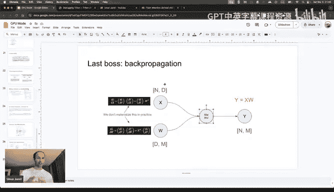

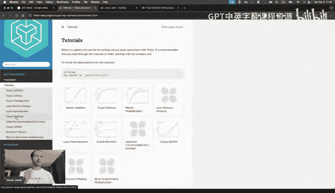

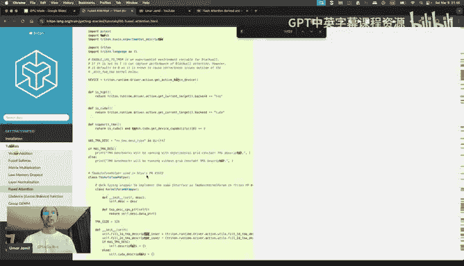

Let's here so every torch kind of operation is a class derived that from this class。

 which is the function class， which provides two functions。

 one is the forward and one is the backward， the forward takes the inputs and then compute the output and the backward will take the gradient of the loss with respect to the output and compute the gradient of the loss with respect to all the inputs。

😊。

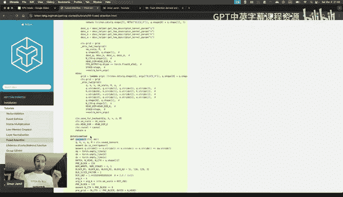

In the case of matrix multiplication we have to input one is the activations and one is the weights and we want to compute the gradient of the loss with respect to the activations and to the weights how to do that well the na way would be to do it with chain rule so if we have the gradient of the loss with respect to the output and we multiplied it with the Jacobian that is Jacobian of the output respect to the input in this case so d y on thex we can compute the gradient of the loss with respect to the input however this na way is not computationally efficient because this Jacobian here would be too big to materializing the memory and moreover it's actually sparse because if you think about matrix multiplication。

 the first row of the output matrix， just depend on the first row of first matrix or in the matrix multiplication and all the columns of the second matrix so it means that the gradient the partial derivative of the first element of the first row of the output matrix will not depend on any other row。

😊，Of the first matrix only on the first row， so this Jacoban will be mostly sparse。

 so it's not even worth it to materialize it。😊，Usually we can always come up with an implicit formula that does not involve the materialization of the Jacobian and in the case of matrix multiplication it's a very simple formula that you can kind of memorize and the mneonic rule that is okay this is kind of very famous。

😊，If you don't I mean you want to understand if it's the gradient of the loss with respect to the output multiplied by the transpose of the weights or is it the transpose of the weights multiplied by the gradient of the loss with respect to the output well it's the only configuration that makes the shape work out because the gradient of the loss with respect to to a particular parameter or particular vector which could be the w matrix or the x matrix has always the shape of the matrix itself。

 so the gradient of the loss with respect to the output has the same shape as y the gradient of the loss with respect to x has the same shape as x and etc so to the me rule is the only combination of transpose and the multiplication that makes the shapes work out。

Okay， so now we have a thought also no， what is the last boss。

 And these are all the things that I had to learn for learning flash attention。😊。

So why I learned flash attention because I told you I was trying to learn Triton and I wanted to have a specific goal that grounds my research only to the specific things that I need to learn flash attention。

And why I choose flashation because once I teach myself flashation。

 it will improve kind of my confidence in tackling even more challenging stuff with Kuda or Triton later。

 because if I can prove myself that I can learn something that I always thought as being something super difficult。

 super complex， then I build the confidence enough confidence to go further so I also recommend doing like this always choose a challenge。

 do it and move on。😊，Now another question I get from people is okay。

 what should I learn next because there is a lot of noise in the market like everyone is doing CO。

 everyone is doing I don't know， tryton everyone is doing reinforcement learning recently and now people are doing like I don't know。

 generic agents I don't know so what should you learn next for your career。😊，Honestly。

 I have no idea。But the there are a few rules I follow。

 So the first rule I follow is follow curiosity， not hype。 Like， as I said before。

 when I started doing my machine learning journey， which was really at the。

 I started coding neural networks at the end of 2022。😊。

I ground myself to only learn the necessary things that takes me towards my goal。

 which is to fully understand stable di。And I only did that。

 of course there are some like other intermediate how to say things that I learned along the way。

 but I didn't kind of master them fully because my only goal was to understand that I wanted to reach that goal and then say okay。

 what is my next goal？This is very similar if you want to have like an analogy to what Forest Gump does。

 so he runs from the West Coast to the East Coast and then he said okay。

 what's next and then he will find that the next goal in his case is probably run to the other way around but in your case you can choose something different。

The second rule is focus on consistency because it doesn't really matter how bad your start is eventually with enough time with enough consistency with enough trial and that you will always fix any initial bias in your learning process。

I also kind of， I started learning， as I said， very late compared to like the other machine learning practitioners or machine learning researchers。

But just by putting in more hours more consistently。

 I could catch up fast so I think you can do the same like it doesn't really matter which roadmap you are following and honestly like with the learning tools that we have now。

You can learn very， very， very very fast， so if in school something took you like six months to learn right now you can learn it in one month why because if it doesn't happen you are notus the tools correctly。

I used to spend a lot of time trying to understand things， for example imagine in a derivation。

 for example， you cannot understand the step before what I used to do is okay try to search on stack overflows exchange Matt stock exchange Google keep searching until I find something that helps me a lock on that step that I cannot understand right now I just prompt and it unlocks me Now this doesn't mean that the model will give you the right answer but it will kind of at least put you in the right direction and then just by prompting you can refine this direction further and further and further so the language models actually what they save you is in the googling time that you don't have to kind of spend one day googling things just to find what is the direction right now you can immediately find the direction then just follow it to unlock yourself so I strongly believe that right now you can learn 10 times faster than like few years ago the same things so if。

It's not happening for you， I'm probably sure that you are not using the tools correctly。

Another thing that I do is to avoid the noise and there is really a lot of noise in the market right now。

😊，Like a lot of noise so every day I see people going from one topic to the other following just the hype and this is wrong because you should have a journey that is built specifically for yourself with the tools that are available right now and you just need to commit to it I know at the beginning it's difficult to commit to something that is you are not aware of and it's fine at the beginning of your learning journey to kind of explore different things but you should have a longterm goal for your learning so I want to master language models that should be your long-term goal then you can have intermediatemittted steps that are relevant to this journey you can also do some other cool projects in the weekend that's really fine but you should always measure yourself against your longterm goal once you reach it then you build another long-term goal and this is what I also did with the Triton so I had a longterm goal I reach it and then I said okay what's next then I will choose what is my next goalHonestly right now I'm kind of on a break from Triton。

Right after publishing the video I became a father。

 so I wanted to spend a little of time with my daughter， so I hope the community will forgive me。

 but anyway， there is really a lot of noise on social media。😊。

And you need to avoid this noise and now I call this thing the dual stream learning just like the kuda streams。

 which means that you have like one stream that is dedicated to the noise which means that you read the papers that are being published around but don't just jump into them don't just okay now I drop kuda and I jump into the reinforcement learning train then there is the diffusion language models the other day so now let's jump into the diffusion model train so read about them because it's relevant for you to know all these things that are coming from the literature but doesn't mean that you just need to master them immediately you canvo you can change idea later even if you're halfway away on your longter goals that's totally fine but if you keep doing it constantly。

 I think you're doing something wrong。😊，So have something like built on the long term also because mastery only comes from long term commitment like you cannot master something just in a few days your brain needs time this is something I learned by studying Chinese so Chinese is a very complex language。

😊，That even if you try， you cannot master in the short term because your brain just can't handle that much information。

 yeah， you try to memorize all the characters， you just if you try to memorize 100 per day。

 maybe you can but you will probably forget most of them the next day。

 so it takes time and also this happens with all the learning learning processes in any kind of field。

No， there is one secret ingredient that I didn't talk about， honestly。😊。

In all this learning journey and the secret ingredient is always the following and I don't want to show it。

 but I want to expand it and it's。😊。

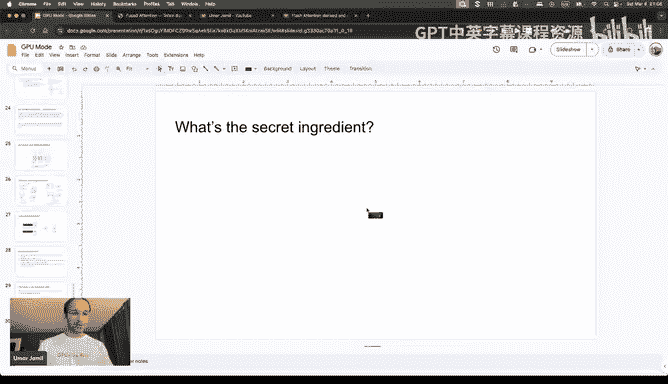

This one。So the secret ingredient， guys， it' always you。😊。

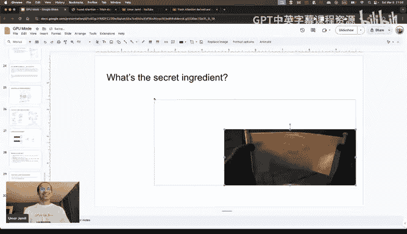

Why you are the secret in needed because you need to first of all。

 convince yourself that you can learn the things that you're trying to learn。

You need to convince yourself that you will be able to do the things that you want to be able to do。

And you do that by building confidence and confidence comes from doing hard things。

 So if you are just watching tutorials online， possibly trying to understand things。

 you are not doing something hard。 you are just building enough knowledge to unlock you on something but then you need to deliver to deliver means you need to push push yourself further and honestly I have been giving kind of the wrong message with my YouTube channel and that's why I started the Discord channel I was teaching things but I was not telling people to move further from the teaching So people will following tutorials。

 they were learning， but then they just stopped that tutorial。

Honestly this is not enough nowadays because GBT can generate better code than me So GPT can follow tutorials GPT can recreate the blogs that you can find online or Github repository that can find around what GBT cannot do is the hard things that take effort that take active learning that push yourself you're learning to。

Next to do that， I highly recommend that you push yourself by trying to improve the things that you watch that you learn around and the second thing is I strongly recommend actually to jump into the Leboard at the GPU mode。

 even if you don't fully feel confident about the kernels that you're building。

Why because the only failure is not being in the bottom of the leaderboard。

 the only failure is not showing up so if you just show up in the leaderboard that's just proof that you challenge yourself to try to do better than what you read on the book or what you read on the tutorial and what you read on I don't know some YouTube video。

そう。Build confidence， that's the only thing that will take you far。Okay， I think I am done。

Thank you for listening。is awesomeThank you Omar I think Chad is pretty fired up so folks like so folks Omar said he's happy to answer any questions y'all might have but like in the meantime Omar I've been writing that I think I have like 10 questions for you so people don't ask I'm going to keep going through them。

😊，So in the very beginning， you mentioned something that stood out to me which is you quit your job to sort of really like dive deep into learning stuff。

 I did the same thing after my first job at Microsoft and many friends of mine thought it was insane。

I'm also not sure myself even in hindsight if it was like a correct decision， so I'm sort of curious。

 you know， is this advice that you give to people in general is it something you think is just like。

 yeah I just you curious hear your thoughts Okay， so how things my life。

 I think I have had many challenges in my life honestly。😊，嗯。As I said before。

 I like to go full monk mode when I try to do things。

 which means I like to just concentrate on the things that I want to achieve， for example。

 in 2020 I was in China working was doing a business trip in China for an Italian company。

And I met my wife。Now I never thought about my life as I never thought about living outside of Italy or even starting living China。

 etc ceter， so I met this amazing woman and I wanted to date her and I wanted to have a life with her and I wanted to marry her。

The problem is I was scared， I was scared because I didn't know how to build a life in China。

 I didn't speak Chinese， I didn't have a degree back then I'm a bachelor dropout so I just had a high school degree so imagine me trying to compete with the Chinese people on a job without even a degree which is super。

 super super valued in China like they consider it the bare minimum that you need to have and if I wanted to even have a visa to stay in China I needed to have like find a job that pays four times or six times the local salary that's how you get the T visa。

So I did don't know anything， but I did decided to talk with my job。

So I started networking with people， I started going around， I started learning Chinese。

 I started doing whatever it takes to be in China。😊。

And eventually did it because when you put yourself in trouble I think you always find a way out of it but if you never get yourself in trouble you would never have the motivation and Mike as I had a big motivation I really wanted to spend my life with my wife so it was really worth it for me to like do whatever it was necessary to be with her and eventually it worked out in the case of my career change I met my wife and my wife working in machine learning that's how I met machine learning in the first place actually I actually did before even meeting my wife I did one conference in the Silicon Valley about machine learning。

😊，That's when I went to San Francisco the first time 2019。

 but I just was an observer in the machine learning and never kind of engaged in it so my wife said okay why don't you kind of get a degree in machine learning at least you can get a stable I mean you don't have to struggle to find a job that pays six times the local salary just to get a visa first thing here。

😊，So that's why I joined a master degree but honestly I was not satisfied with what I was learning with the master degree because as I said at the beginning of the talk they teach you how to fish but they don't teach you the relevant skills that are necessary for the job so I was learning about pandas about all these amazing libraries but that's not where the word is the word is already 10 steps ahead so how can I catch up I said okay I can either spend my life being an observer in this or I can just chase it now where I am lucky in this I am lucky because I have amazing family support like my wife said if you want it go for it in lawaw said if you want it go for it don't worry about like you providing don't worry we are working here。

You just do what is necessary for you to do and that's why I quit my job honestly because I wanted to accelerate my rate of learning before I was working as a manager so in working as a manager in China means that you work actually a lot like is I mean China is not really the kind of places you think about when you talk about the work like balance right so I was working really a lot and I was putting for the university I was also putting 20 hours per week at least but it was not enough so if you want you just need to how to say believe in yourself and that's why we are talking about confidence here and then you just do it。

😊，All right so so I think I heard like the TLDR for me there is really sort of create yourself this huge sense of urgency and find yourself a beautiful life so I think it's a very good timeless advice I'm gonna ask like one more question and then I'll go to questions and chat so a common question I've been asked personally where I just don't know how to answer it very well is when people ask me for like a roadmap of how to study things like they go like I know a bit of Python like should I learn Kuda or Triton or math and I'm like I don't know like all of them I don't know what the right order is for the most part。

 but certainly for me it wasn't a structured and so I'm sort of curious if you've sort of found a good question a good answer to this question over the years So I'm a very practical person I usually learned the tools that are necessary for me to do my jobHonestly I'm not a master at kuda like I never studied more kuda that is necessary for me to learn flash attention。

So I have a very basic knowledge of Kta honestly。😡。

So what I believe is set yourself like a problem that you want to solve from your own life。

 like I want to learn this for what， for what reason do I want to just call the like a transformer and recreate a transformer wonderful then you can just learn these things。

And its don't worry about things being useful as long as they are useful for yourself， for learning。

I know the biggest problem I think is always cut the noise。

 people will tell you ah you need to learn this because there is T length。

 why don't you study T length spend three years learning it？😊，Yes， you can do it。

 but is it relevant for you， is it relevant for your journey？😊。

So I guess one of the tricks I've used over the years which I've had to break as of last year has been like I only like read about projects or papers if they're more than two years old because like I let time do the filtering these days it's a bit tougher to do this but like I would say for most of my career that was a heuristic I followed I guess I'll start going to questions the first button I see is like really around like which GPU mode leaderboard this is so it just for context folks you can basically submit basically Kuta or Tri and kernels within Discord directly go to the submissions channel on the GPU mode discord and like basically pick a kernel and start competing on it we're planning on releasing at least like five to six problem sets a year so basically one competition every two months and the next one is gonna to be on a little inference per。

Okay I see this other question from Dylan so so this is like really around like AI tools accelerating your learning I guess you can see the question on chat right yeah I'll let you read it all right so you mentioned that the A tools should accelerate any specific advises as to how to achieve it okay。

😊，I would say that right now， I think the biggest problem people have is should I use cursor as a learning tool or should I use cursor to get jobs done？

I think this is the same thing as if you should code your own autograd or you should code your own transformer or you should code your own like a moonp from scratcht or whatever people code from scratch。

Go for it if you want a deeper understanding so like if you want， for example。

 a deeper understanding about something， don't use cursor。

 but if you want to get things done fast because you want to recreate， for example， dippsy one。

 then go for it。If you want to have like a big project done now what other tools I use I mostly use a lot of prompting like I spend a lot of time just prompting things why because it unlocks me so every day I'm doing something new and I think every day you will probably any job you go I think right now it's not about how many APIs you memorize is how many problems you can solve and to be able to solve problems I think you need to use the right tools so just learn to use prompting the right way。

I think Kpati did a video the other day， all the things had these uses。

 like all the possible ways to use a language model。

 I think more or less I would agree with whatever in the video is presented。😊。

So I mostly spend time like using I think language models and I try multiple of them。

 like sometimes I try the same prompt on rock on a GPT I try another one。

Another thing I use a lot is every time I don't understand the deri I just take a screenshot of de and ask GPpT hey I cannot understand how to go from step number five to step number can you help me please that's it this is the。

😊，And I use a lot of actuallycursor， I use a lot of Vi Studioco pilot。

 Why do I use it because it accelerates that， I mean， before， for example。

 if you want to learn about something you want to code something。

 imagine you want to call El Ozi like Carpati。😊，There is a lot of code that is not necessary for you to learn things because it's just repetitive。

That code， you can just ask Cosor to do it for you and the other code that you the specific code that I like I don't know the autograD system or something more relevant。

That part you can code by yourself so you can kind of choose when to use the specific tool。

 even inside of a single project instead of doing it per project。Yeah。

 it reminds me of like studying chests like you can sort of use engines to understand like high level theory or which openings are worth investigating in。

 but like you probably don't want to use a chest engine to learn combinations because that's really a skill set you want to cultivate Okay。

 so I see another question by Sam putting it up。Oh how important was learning lowle skills in your learning journey and doing think it is for increasing programming maturity in general。

 of course I believe that it depends again on what is your goal。

 if you want to master something you need a lowle understanding of that something there is no other way and if you want to master something I strongly believe that you need to recreate things by yourself from zero from scratch。

 I know that people will think why not just it's useless because a cursor can do it very fast from but yeah but it's useful for you for you to understand。

That's the only way you should always do things that are useful for you。

 not that are useful for the word if they are also useful for the word。😊，こ度す。

I see another question from Missor Rob。I have only one hour or less to study per day。

 what do you recommend I studied China sorry， this one。😊。

So yeah so is it possible to learn advanced deep learning GPU optimizes without access to a machine with GPU of course its possible so when I started training models I didn't have a GPU I just had coab for example and that's also how people have been learning like kernels on the Disccoursed channel there is also now a new website called the L GPU I think there is like a presentation about L GPU and they kind of let you run simulate also。

😊，In Triton， I think you can use the Triitton interpreter without having a GPU。

 I think it will just work out of the box， it will be。

 but you can always try the Triton kernel on a small amount of data and it will be decently fast。

Yeah， maybe to add to that like even H100 GPUs aren't as expensive as they used to be like they're like around like 11。

30 cents an hour for like a state of the art GPU and I'd recommend there are websites like there are websites like vast AI that you can like possibly go to if you want like cheaper GPs but you'll probably pay in the ballpark of a few cents per hour do you need to be good at merit or programming for AI research I think you need to be good at whatever it's necessary for you to become whatever you want to be So I think that in life if you want to do something just learn the relevant things if you really wanted imagine I ask my wife should I look beautiful for you for you to marry me I don't know she would say you need to be the best man in the world So just be the best men in the world。

Yeah， I least like my grad school advisor， like like a very wise person called Charles Elkin often told me that like questions that are like should I do X or Y。

 often the right answer is both X and Y or neither。

And I found that very helpful to sort of make decisions maybe you two will Yeah， but I think okay。

 I think work go by step by step， there is no like AI researcher role like every researcher is different。

 every researcher is doing different things， start doing research。

 start basic and then improve upon that again， learn by objectives， simple objective you reach it。

 you build confidence， you move on to the next one and then you move keep doing like this。

We have a question from Em Shahir， which is he's finishing his PhD and robotics。

 how much should he go in detail for deep learning。

 should he go full in depth of Kuta or just use the models， is it enough？Again。

 depends on what you want on you like。 Yeah， I think you can。

I like to go deep because this is something I want to do and this is what I'm doing。

 I will probably keep going deep even if the models become super super great at PhD level intelligence。

Yeah like for what it's worth like at least the way I rationalize my work in performance is that like a lot of like like we kind of know ML is going to be broadly useful and now it's just a question of like making it insanely cheap so we can use it all the time and deploy it in different ways and I suspect like robotics has sort of similar challenges as well so like I think being good at performance will probably serve you all in robotics yeah。

😊，All right， so I see a question by Daniel。Like yeah。

 it's regarding contributing to open source is this a good idea to learn。

 well I strongly believe so so okay， contributing to open source。

 I think it's something that you should learn to do honestly。😊，嗯。What does it mean first of all。

 it's a good way to find a job honestly like if you contribute to open source project from a company or from a big project codebase it tells a lot about you first of all you can navigate a big large codebase Secondly you are productive from day zero like they don't even need to kind of onboard you you are just productive so it's a good way to learn and to actually enter the market and I believe it's the best way and I think tiny grad is doing it like you just contribute to the codebase and they hire you if you solve enough challenges but on the other hand I think。

😊，You don't have to start by contributing to open source project if you have never done big projects by yourself。

 so start by doing a big project by yourself。You will build the confidence that is necessary to jump into a big open source project。

And you don't need much to actually jump into a big open source project。

 start by doing the basic things like just fix their documentation。

 start engaging with the people get start start getting noticed by them。

 they will give you a small task like they will say hey。

 I saw you're working why don't you solve this issue it's just a few comments that you need to clear and then you do it。

😊，Yeah， for what it's worth a lot of open source developers like just have are overloaded with work and they talk about their problems in public。

 whether it's on Discords like ourselves or like on their GitHub reos。

 so just be helpful really is sort of tip in the beginning。Okay。

 I think I see two more questions so I'm not sure I follow what DSA is。

 but this is a question from Mohamd Soba what's the significance of DS I it's structure and algorithm right I Google this I think is data structures but yeah maybe we should answer that question okay so I think the question is mostly about should I do lit code to get a job in machine learning。

Yes get lot both So okay， no， no， okay， this is actually relevant because I believe it comes down to how confident you are with your programming journey。

Honestly， I felt a little not confident with my programming skills without doing lit code So I actually did lit code also just to improve my confidence。

 not because it's necessary for you to like be a master just for my own self-satisfaction and also I like to kind of having better problem solving。

 So in the year I quit my job and every morning I did at least one lit code problem mostly for just selfsatisfaction and selfconfid。

😊，I think we'll take two more questions and then folks， if you have more questions again。

 Umar is very active on Twitter on is this for so you can reach them there。So yeah。

 it's another should I study X or Y questions， should I study AI infrra Tri included in VLM or AI algorithms sufficient transformers in I think I can go deeper here or okay。

 I believe。If what is happening right now， people think that either I learn highleve things or I learn like lowle level things。

 I think the market right now is in such a position in which a lot of people are actually familiar with the transformer and like deep learning architectures in general。

 much more than like last year or two years before。

 so it's required in the market for you to know a little bit more about what happens under the hood。

Like because the material before was less accessible， there was very few tutorials， very few books。

 very few stuff around right now there is a lot of stuff around so it's expected for people to know a little bit at least about lowle stuff so you should at least know what is triton you should at least know how VLLM is working what is Page attention。

😊，Maybe you don't know how to derive it by hand and it doesn't matter but at least you know all these topics。

 so don't always think in terms of X or y， it's about I need to know also a little bit of y because it's relevant right now in the market。

 otherwise like you have two of too highle overview of what is deep learning。😊。

Before you could be excused because the talent was so there was such a shortage of talent that knew these things that everybody closed an eye on lowle things right now there is no such short talent shortage especially on these highleve concepts。

 so you need to go a little bit low level to at least be more competitive on the market。All right。

 maybe I li we'll take two more questions because one one was one is very short which is going to be the last one where in this stack do you think theres opportunities to optimize chips。

 hardware， kuta， the architecture。I think it's the software stack。

 I believe it's like there is a lot of job in the software stack to be done。 The hardware is there。

 just look at the just look at the。😊，A lot of labs actually they use， for example。

 even in production， like software， like a generic software that is not optimized for the hardware。

Because again， the problem was a lack of talent to optimize it and secondly the market changes so fast that you don't want to commit long term on optimizing something that may not be necessary for the future。

So I think right now we are in a point in which we have a lot of we have a lot of first of all we settle down on the transform of auto。

 everyone is using the transform of for everything like so there is a lot of things that we can do because things will not change so much from the architect level。

 so that's why we are optimizing with the kernels， the stack on top of it， the inference stack。

 the KV cache distribution， context modeling etcter。😊，I saw the question from Phil Butler。

 about 10 hours， yes Phil， I am super， super， super fan of the 10。

000 hours like I believe it's the only rule that matters in life。It doesn't matter。

It doesn't really matter where you start， it doesn't really matter which roadmm you have。

 it doesn't really matter where you live， it doesn't really matter what skin color you have just put in the 10000 hours and the fastest you do the better sometimes you cannot do it faster because as I said for learning Chinese you cannot fake it。

 you cannot do it fast you just need to put them 10000 hours distributed it over five years if you want to master it but for some things like machine learning especially programming you can accelerate your learning pace by leveraging the modern tools and how that's why I quit my job because I wanted to do it faster so otherwise I could just do it at night and spend 10 years doing it。

All right， I guess maybe now it's time good time for our last question。

 which is what's your AGI timeline？So depends on what you mean by AGI it has been achieved and has not been achieved yet at the same time That's what I would like to answer on this one All right well I still see more questions and but I suspect fact we could probably keep going for a long time so folks if you have more questions to Mar please feel free to tag him on our discord you can go to his Discord as well it's also very helpful join people in under Quta challenge hard on people right when on on the Quta challenge and also like on the Twitter every time people ask me for a road I'm very hard like there is no roadmap like I know it can be discouraging for some people honestly I try to be as truthful as possible like I'm hard because I tell you the truth right away。

 I don't want to like sell you a course or I don't want to sell you anything I just try to help you here。

😊，So yeah， thank you for joining this talk and thank you Mark for hosting thank you Phil Butler also for like Ar all this。

😊，Thank you all the GPU mode the sponsors and audience and the Discord guys and thank you deep learning gods for gra us Thank you Thank you everyone this is fantastic Thank you so much everyone and see you everyone next week Bye bye bye bye。

😊。