# GPU MODE《CUDA、GPU编程1-53课｜GPU MODE》中英字幕（deepseek-v3.2 - P54：-20250316-Lecture 51_ Consumer GPU performance.zh_en - GPT中英字幕课程资源 - BV1QZ421N7pT

I'll introduce you and then you can just get started then， so just give me my moment。呃。Al right。

 can folks zero us okay on YouTube。 Okay， I think I see， I see folks。Hello， okay。

 beautiful folks can hear us。Okay， I guess we could get started。Yeah。

 so welcome everyone to like lecture 51 of GPU mode today I'm really thrilled to introduce like Jake Cannell whos the CEO of like vast AI Jake Jake and I met like a while back like specifically as I' had been getting really interested in consumer GPU performance and like figuring out like why they're not like more used in like actual deployments。

😊，And turns out like Jake has been sort of thinking about these problems for a long time。

 he's basically been scalepi like a long， long time ago。

 and so I think he's going to give us sort of a nice journey of how he like basically the evolution of GPs and how he came to basically the conclusion that something like vast must exist。

So yeah， without further ado， Jake， thank you for coming。Thanks。

 thanks for interesttro Mark so this talk is going to cover a number of different things but's it's sort of my personal journey working with GPUs for a long time and。

What led me to where I am today and along the way， a lot of it will be about Kuda notice it is Kuda mode。

 but I'm going to start a little bit before even Kuta so I was born in 1978。

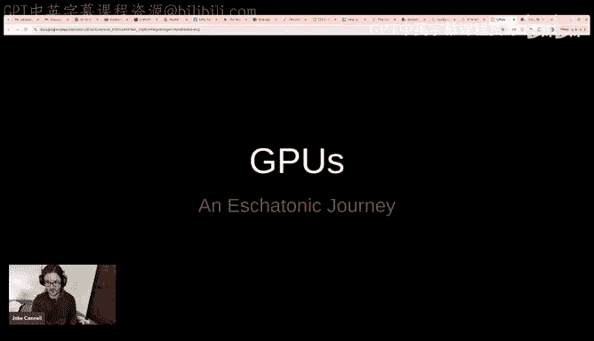

When the Atari home console just I think， came out then one of my first memories was playing that game system really like staying all night and playing with my dad and my brother and I grew up during the video game revolution so every couple of years new games would come out and the graphics would be more advanced and it was this very it made didn' I didn't even know it was called Moore's law event but it made Moore's law very visceral when I learned about what that was the progress in games was evident obvious and extremely important to my life and my trajectory I knew I wanted to worked in games from really early age。

So I sent some highlights here that were meaningful and important to me。

 I remember when Doom first came out I was in high school and I saw it running on this machine。

 this cluster of network machines that were playing doom multiplayer in a shopping mall and I thought it was running in a supercomputer or something so I'd never seen a 3D game that was that fast and dynamic that level of rendering quality。

 which I know sounds ridiculous today for many of you who grew up later。

 but really graphics used to be a lot worse and they've gotten tremendously better over time and I've also thrown in one of my own。

 this is my own project so I started programming running very simple games in quick basics that's literally all I had in Mooula Montana in the dark era before the internet and I went to college UCSP I got access to the library I started devouring graphics books and I then really got into graphics programming。

 especially after following the journey。Of。Of developers like Carmac working on games like Doom and really wanted to understand in great detail how all of that worked so I could recreate it myself。

And you know I've thrown some more， even though I've been out of games for a bit。

 Ive thrown a bit more of the evolution like crisis in 2007。

 where you one of the first games to have really achieved photoilism in a lot of different types of scenes and now came modern day where I'd say at Emreal Engine5 is mostly solved graphics for all intent and purposes。

 it's mostly now a problem of art production cost and quality。All right。

 and at the same time I also became interested in transhumanism and I pick up this book from Morovvic。

 I think was minech， he was one of the first to make this argument that the progression of Moore's law would inevitably lead to AI and that also profoundly influenced me。

On the left is also a very interesting。I recommend checking out modeling the human trajectory。

 makes interesting argument of fitting GDP growth， what's the simple fit GDP growth in a Bayesian sense and it's a hyper exponentialponential function in the sense that GDP doubles 20 years that it doubles 10 years and so on the rate of doubling itself is increasing exponential。

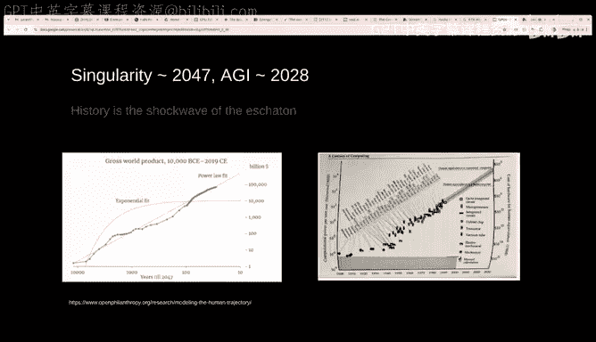

All right， so into graphics my first serious project in graphics was quad tree fractal planetary terrain。

 What does that mean， I was very interested in this idea of creating planets and a venue game where you could be out space you journey down the planets and it would actually prostediousally generate the entirety of the planet and this was just barely possible in some sense I think。

Elite had pioneered an earlier version of this and much more primitive graphics。

 but I wanted to achieve like really high quality。When I was working with the G4 256。

 which had just I got well， not too long after it came out and it had this new capability。

For that time， it was one of the first GPUs where they had actual hardware processing of the entire transform engine。

 so the CPU could hand off all of the triangles in geometry and have that all handled the GPU。

This is long before programability， long before Cit and all that。

 and at this time the earlier generation of cars， the first generation like the RivaTNT which I had。

 they were boosting mostly just rasterizers。They were handling disization， text lookups and what on。

 they weren't even really fully programmable。So。This is a screenshot of my demo which I became somewhat locally famous for this planetary Zoom terrain engine thing with these pursue degene terrains。

 and I got in touch with through my roommates some people that worked at this me creationations and he put me in touch with this guy Mount Muskgrave and Kent Muskgrave was actually wrote the book one of the books that I'd read at the library calledProcedural graphics。

 and I ended up using some of this tech as the realtime viewer for their project Mojo World。

U I don't want to talk about this too much， it's not this is before the couda days。

 but I was using the principal technique here is use quad trees。

And then you expand the quad trees dynamically based on the viewer perspective。

 and so you can take advantage of the projective transform such that things that are really close to you need higher detail than those in the distance。

 and you can get it really down to you only need about as many triangles as there are pixels。

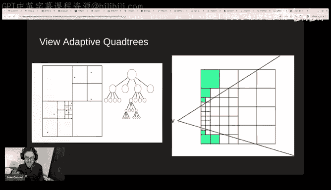

All right， also want to go into this too much， but I was really at this time spending a lot of time thinking about how to procedurally generate complex realistic patterns such as terrains one of the techniques is multiscale noise fractals noise itself in those days for some of you run the CPU was kind of expensive and so I developed this technique to cache the lower frequency noise levels and interpolate them so that I didn't have to generate 32 levels of noise for planetary sized terrain only to generate the current highest frequency level and the rest I could interpolate from previous cache levels in the quadre and that enabled this to actually run real time。

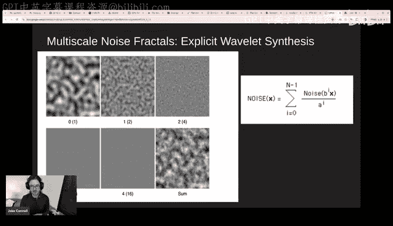

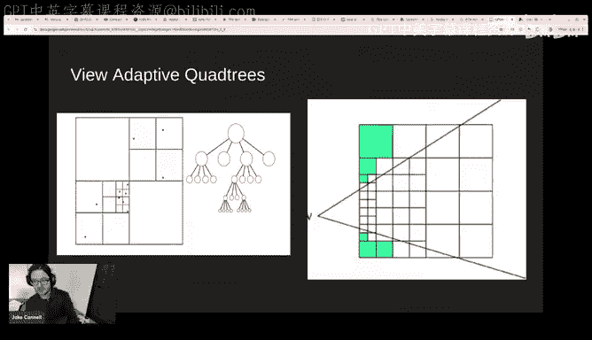

嗯。And then there's more advanced techniques like multiplicude of noise， just has an example here。

 which I think is there's interesting relation to neural networks later that you can think of neural networks as the weights as being a twodisional space and' been a little work later on how you would use that some of the techniques from quad tree terrain and fractals as a prior on neural networks because experience work with these for a long time。

 you eventually get you realize that a lot of patterns in nature。2。

There's a first level approximation you can use with taking advantage of faking the higher frequency details of the wavelengths and using a fractal。

 and in some sense it doesn't exactly matter that you exactly capture all the details。

 it matters more than you capture the properties of the distribution。

And so that's why practical terrain， it's relatively easy to guess。

 I mean it looks reasonably good because the exact details of where all the high frequencies are and the exact shapes are sort of arbitrary in that they are this result of random decisions made by geology a long time ago。

 and they don't have sort of innate complex structure， they have random structure。All right。

 and then。In college and after a while I was working on the video game for a long time。

 I don't think about this too much， but this influenced a lot of my later views on algorithms and how I approach neural networks and one of the main problems running into even games is just there's this enormous amount of complexity of simulating everything in the world and you really I really began to appreciate the ideal or the all of more simplified algorithms that had。

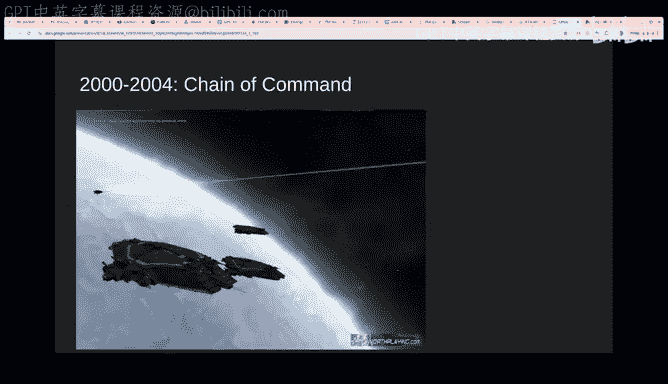

Great generality， the ability to model or certainly a wider variety of phenomena with a small set of code。

And then after my game company did not work out this game Sha of command did not actually advance past like a play of Al for a beta。

 I went to work at pandemic， which required by electronic arts， so I ended up making a much better。

 more impressive version of my train engine and this time now the GPU's advanced the Xbox 360 is one of the few times I think that ATI had a much better GPU than Nvidia and Microsoft had an amazing debugger this made development much easier and much more。

Like a smooth experience， but the main thing that was really impressed about is GP is it could pump out a couple triangles per clock。

 which meant that it had enough performance that I could teslate triangles down level pixels and so I do this like thing you' like look at the president hockey in my demo and youd be switching to wireframe mode and sometimes you wouldn't quite tell the difference between wireframe or non-wiframe mode knows because it just turns out that when the triangles test that down the pixel level this is not that much difference and display atmosphere but this is actually not a shot from that actual demo but it's very similar this is some later later thing I found online but it's very very similar to what mine look like。

I'm thinking I'm about done with terrain， but I did spend five years of my life on it。

 so it did influence a lot of my later。Later views on neural networks and some of the same algorithms I was able to apply。

 as we'll see is my later work。 So the really interesting thing about terrain work that I think。

The main lesson that I learned is you can think of。

This is almost like an AI problem I I have this tree adaptive data structure in this case it's a quadre representing the surface of the planet and I need to make these decisions around which nodes to expand and when。

And。😊，You can think of it as sort of like a decision problem where it's a cost benefit analysis that I have。

The cost of every little patch is fixed it's a constant it's the cost of rendering those triangles。

 but the benefit varies dramatically and you can think of the benefit as being or the utility as being driven by reducing approximation error and there is some idealized image there's everything is an approximation everything and so there's an idealized image which is the image that you could render if you had far more time or more compute and you can measure the approximation error from that ideal image to what you can achieve with the current triangle budget and that's utility function。

And so from that cost benefit analysis you can drive a few things and one of the interesting ones is that there's sort of an economic equilibrium that any a severe efficient allocation a preto efficient allocation will result in an economic equilibrium where the price is roughly equalized What do I mean by that I mean that。

Large triangles have a higher approximation error， so there is a large amount of utility in subdividing a large triangle and replacing it with subdiding in half and quadruply the number of triangles these represent that patch of the surface。

And so after you apply this optimization， as you've done it correctly。

 you result in all triangles having roughly the same roughly comparable screen size in pixels。😡。

And getting down say roughly the two pixel size triangles。

And that's all done in screen space because it's the error of our utility function is measured in screen space。

 so in some sense you can think of this as a real time AI optimization problem or I'm trying to optimize the utility function。

And then by 2009，2， 2009， if Kuda had launched 2008， it's hard。

It's really hard to express how meaningful kuda was to like from the perspective of a graphics program it was a major major advance before this you're just doing all this stupid stuff like when I was running these terrain patches I had to generate geometry and texture and had run a bunch of procedural algorithms and you had to literally render triangles just to basically like run your output over the output a loop over an output right you had actually render a triangle you had to make sure that all of the geometry match and the texture coordinates were not out of wax so that the pixel engine could actually like invoke the pixel shader to run your code on the correct outputs Kudo was just a breeze to work with it was so much easier it was C+ plus there was templates templates were a game changer because now you could actually have large amounts of reusable code and specialize it for different things that you're doing。

So it was a huge advance and at this point in time I'm moving beyond quad treats like the really cool interesting thing now to do like the future graphics and pretty clear to me would be using some of the send techniques but now extending them to the third dimension so that you can model the entirety of the scene all the complexity of the scene in one standardized data structure of voxels that then we can come trace or ray trace through and the particular variant of this I was using was based on distance fields and so that of a assigned the distance field is that you're representing in space the distance to the nearest surface and I had a few little clever tricks with this that I was also like using subbits of that to represent transparency Jake just starting know if your mics sort of sound dropped off like quite severely Yeah people in chat by the do have the feedback that it is echoing a bit so I don't know if like maybe you can quickly click on。

Settings。And then going to I should have really tried this earlier， but yeah。

 maybe click reduce back noise。Im sorry， that。

It's it better？TheCha， is this better？I think it is。 yes， actually， it clearer。

 Do I need to move this little bit away。 Does that help。 This is significantly better now， Yes。

 I think this okay。 maybe I also try to talk slower since as I I start to speed up a bit。

 I think it's actually perfect。 Now。 I don't hear any。 echo。 It's perfect。 That's cool。 Yeah， yeah。

 cool。 People happy so。😊。

So there there's a lot I I didn' can go into a lot of detail this that I'm not going to give too much I'm have a huge amount of time。

 but the other interesting thing about about。Working with data structures like this is that it's a highly irregular algorithm and this image somewhat illustrates that is this image is basically the number of op three cells that were visited along that ray。

And so you can see in the areas that it's white， it's white there because the ray was glancing along the surface for a long period of time。

 so it's going through many different transitions navigating through many different levels of the ay。

Whereas it's dark where the radi just to sort of encountered the surface relatively early on and that surface was mostly aligned to the direction of the ray。

And around this time， I got somehow help scooped by this paper gig ofoxels。

 which use related techniques that they were mostly。

And he I think really well illustrated some of the potential of aels， you could do cloud。

 you could do detailed geometry with great anti asing， sort of integrates everything。

 foliage terrain， trees， everything could be handledably well by aels。

So what were some of the interesting challenges this like what what did they learn？

A lot of the work in really optimizing a Vuxhole cone tracing or a pretty tracing system in a VOuxhole data structure is dealing with the high variability in code paths。

 so there's high load variability of both enter and intrap warp workload so a warp of say 32 threads typically on most video GP viewss。

 they only they execute instructions in lockstep and so you can't really if you have control flow。

 complicated control flow transvercing through your loop structure and you end up essentially just paying the cost of all code paths。

Do the work。And then there's also a different type of variability penalty in inter workload where if you need。

 you know on the order of again， 1632 isWps to fill out the workload at an SX unit and if you do not have enough warps active。

 you're just sort of installing the resources and so you really need a tight balance having enough of those active and。

If you think of the typical default assignment of thread to warps where you're doing it in small spatial blocks。

 some warps that are coming over here and just hitting a surface at at an aligned angle will exit early and that's fine。

 they're almost coherent， but you have again this problem where I have high variability in these surface areas here where you're going to have one thread that is stalling the entire exax stalling all the workload because all the other threads and warps of exited。

 but it still has a significant number of of vle nose to transitit atin actually hits the surface。

So that high variability， very regular workloads turns out to be very difficult and what you end up doing。

 explore a number of different techniques and the efficient techniques end up involving ways of dynamically pulling work from cues and so you end up needing atomics and then with using atomics you can dynamically pull from shared cues every time the work unit is finished。

 you can just pull the next one and that ends up being one of the limits on your performance is trip up between how quickly or rapidly and efficiently。

 I can balance workload versus the expert costs of that versus the size of the itself there are other techniques but that is one of the main ones it always ends up being some variation of using a shared fast queue structure or work ceiling to balance the workload at certain choke points between different threads and different wars。

And the other some were really less in how one of the ways I sort of get my more interest in AI was that it wasn't the only seen with this sort of v engine。

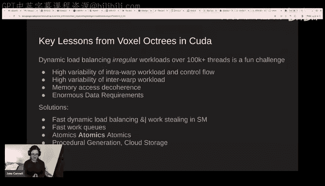

You become limited by the volume data， and so you need to invest more and more and more advanced procedural generation where you need massive massive data sets that you'd store in the cloud。

 and so I became extremely interested in using neural networks to learn all these complex procedural patterns and compress the data。

And Mc time was also following， especially starting follows some of some of the work coming out of Hinton's lab。

 where they were some of the first to start applying neural networks running them on GPUs and rewritinging them in KutDa。

 and of course one example of this is Alexnett， which was one of the first。

I think real scaling successes of scaling up simpler neural network techniques on a much larger data set using GPUs and achieving a new performance breakthrough。

It was very simple co to code I remember looking at the code for Alex and it was relatively simple compared to what I was used to when I was working with previously on terrain and opttriies and everything and I thought I can really do better than this。

 I think this could be much， much faster。So。At this point in time I was done with on live just over my glass exit from from games and I had a bit of Bitcoin money saved and I。

At this point was just deeply researching neural networks。

 reading everything I could and then I started really working focusing on this problem narrowing down on adaptive sparsity I'm going to explain that what that means but adaptive sparsity is this idea that it's heavily influenced technically just a variation of the same idea that I was working with LD systems for a long time it's the idea that in a highly efficient system。

There should be a price equilibrium and you apply that to neural networks。

 the cost of activating a synapsse is one memo， let's say and there's also the mailU of course。

 but it's basically a fixed cost like the cost of the triangle but the value varies and the value depends。

To a first order approximation， the value depends on the magnitude of input neuron。

And so in a highly efficient like optimized request LD， the sensitive LOD theory。

 then I can make very fine range decisions around which synapses to activate based on the strength of the neuron activation。

Because that determines the contribution of that activity that synaps to the final results。

So this is a excerpt diagram from like a patent application from like 2016 or something a long time ago that exploit some of the basic idea or should I do。

You can think of the basics like LD a dynamic level of detail of the neuraln level。So。

So explain this kind of complicated diagram on the left。And the right of the exact same problem。

 the exact same neuron activationivation vector X， exact same weight matrix W。

 the only difference is a difference in the cu threshold which is sort of determines our price cutoff what is the approximation level。

 and so the left is using a smaller threshold so less approximation on the right using a higher threshold so a higher approximation。

And then we have the on the left sorry on the top that I have a graphic representation of the problem and the bottom I have a numeric representation problem。

 so you can see here's like the four input neuron activation magnitudes and here's the compute outputs and then here's the weight showing which ones are activated or whatnot。

And so the basic idea is that a really large magnitude neuron activation。

 a really strong input will activate all of the weights。

 a medium a medium input neuron will activate some portion of the weights。

 only the strongest weights and a really weak neuron will only activate the strongest weight。

that's the basic idea and you can see another way of thinking the core idea is that we're doing culling not in the input space of the input vector or input matrix or input matrices we're doing cu in the expanded product space so for vector makes multiification that's just the two dimensional space of the matrix itself for matrix maintenance multi that would be the three dimensional volume of the full expanded problem we're going to do cull in that space。

 not of the inputs not the outputs。So to give you a little idea。

 another way of expressing the concept is that if you look at this this input here。

 this neuron x3 has an activation value 0。1 and that means that most of its。

Most of the computations it contributes to are going to have a very small impact on the output。

So at this level here， on the right where we have a somewhat higher pulling threshold。

 we're only going to evaluate one of the weights of that neuron。

 one of its fan weights instead of all of them as says here。

 and you can see that results in a very small relatively small。

 not very meaningful approximation error。

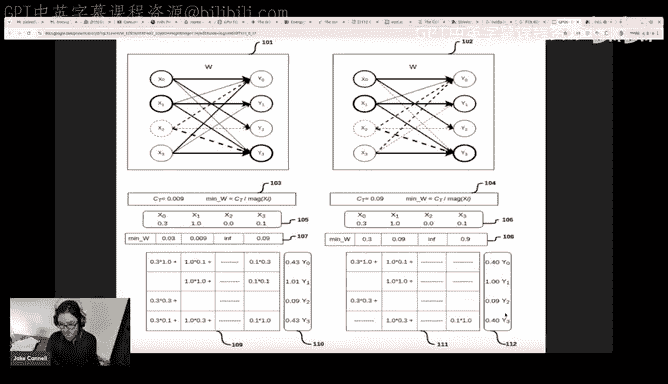

All so how does this actually work like you know， it sounds a great idea。

 but if you actually apply this on some a real problem does it actually work and so。

I never got to the point of really trying this some really large scale problems so you know this was back in 201516 so of course I'm going run on NNIS and we finally yes。

 does it does work in NNIS， you know， the approximation error is very controllable。

 you get a fairly large zero prosquita。However， then training immediately becomes the problem。

The current know the sort of standard algorithms don't really work that well in this new regime because it's it's a very sparse dynamic sparse regime。

 so you dev avoid dead to problems with dead neurons read about one simple technique。

 which is cost regularization， the basic idea is just let's just take the the。

The actual computational costs， like the number of weights that are activated dynamically。

 and use that as a regular term。And one simple way of doing that is you just have a regularization term。

 it's not on the weight it's not weight， it's on the weights activate。

 it's on the weight magnitude penalty， it's a neuron activation penalty。

 and so you penalize neurons that are activated very strongly because uses like an L2 norm because those the ones the number weights that activate all the proportion of that。

And that worked reasonably well and one I wish I had some of the visualizations of the resulting data。

 but one of the really interesting things is what the shape of solutions that were learned under a costre and one of the striking things that I remember is that the first layer on MNIS often learn neurons that only had two weights two weights carried almost all of information content and that seems like really bizarre at first but then when I think about it if you think about a little bit more。

 the first layer mostly seems to do edge detection and you can actually do edge detection only two neurons that had two infos so it figured out way to do that。

So getting a bit more theoretical there's a huge difference between the theoretical speedup and the actual speedup theoretical speedup is just what is the reduction in the number of weights that are loaded a different approximate you know in some reasonable approximation or the things useful and it really depends on the the distribution of the weights and the activations if they are normally distributed it's only a small speed up like on the order of two to4 x over over regulargular sparsity if they are log normally distributed and recall the log over distribution most of the energy or importance is carried a very small。

A very small number of samples and most of the elements are very small proportion。

 so it's very concentrated if you're very concentrated level distribution you get much larger speedups。

2。After this viewup is much much harder to achieve。

 it's more difficult than even regular sparsity which itself is also very challenging with a lot of challenges accelerating spars and neural networks on GPUs。

 but I to make it to a little bit， but it also really depends heavily in your batch assumptions。嗯。

So I'll discuss that more shortly。Around this time also I was very interested in the brain。

 so I was studying the brain a lot， here's an example of a blog post summarizing some of that and so one of the things that I did is look at the brain itself and as sort of a data point to answer some of these questions as an example system。

 what are the distributions of the brain like are they more normal or are they more log on through the weights and activations。

 was the level of sparsity etc？And some of the interesting things is that if you actually look in the research literature on Sprse in the brain。

 there's a pretty interesting argument that I think first was made by Lenny。

 there's an interesting sort summary quote of it， but he basically does this principle from physics analysis of the energy consumption of spikes。

 mapped it all out。Farmer was known and all the known biophysics of that。

 and from that he computes a constraint on the number of spikes across the entire brain and the number of synaptic activations。

 and he roughly gets an estimate of less than it's around 0。16 spikes for neuro and error。So。

The conclusion here is that in general， the brain is very sparse。

M much farther than artificial visual neural networks at that time。嗯。

There's a later paper that was probably more comprehensive based on actual measurement for the log dynamic brain and。

And what's interesting here is that they're measuring the actual distributions， firing rates。

 weight synaptic activations， this particular image I've captured here is just firing rates。

 but they found logging over normal distributions and everything。

 they found that the strength of synapses， the size of synapses。

 all of this was loggged on distributed。There's also some other interesting things in the local circuits。

 so most of the spike activity in terms of the total number of spikes。

At least in the cortex and probably other regions as well is dominated by fast spking interne but interneons only project locally。

 so they're doing a purely local computation， which of course is less energy expensive and the principal cells are spiking in a lower level。

 a lower overall rates they're more sparse， but those principal cells have like the pyramid neurons have much longer reaching axons so in a its energy normalized that the spiking rate is equalized under energy constraints because the energy costs is mostly determined by the total wiring length。

So。I me just now map out what a log normal distribution in a cortical neuron could look like。

Mind is fan what it typically maps to you could have maybe in a this is a neuron that fits this low normal distribution which seems to be prevail there might be one dominating weight a dominating weight is one that if it activates that totally determines the output of the neuron completely overrides everything else is's that important and one example would be there's some circuits where there's a special a special synapse or weight from interneurn that clenchps that attach directly of the neuron body and it basically multiplicly negates the output of that neuron。

That would be a do connection you might have 10 strong weights on medium weights。

 I know this sounds like some sort of Christmas car or something but a thousand weights and then and then the the sea of weights that really dominates the tailor distribution is these what really could be thought of as virtual weights。

And what do I mean by that。A virtual weight is one that has to exists in the brain purely for measurement purposes。

 it has no effect in the forward paths if these little virtual weights are sort of floating in and out of existence on relatively short time scales and there's also other interesting research from the brain about quants quantum synaptic failure resol which is。

The concept that only a small number of synaptic spikes actually transmit， most spikes。

 most of the time fail to transmit across the synapse。And that's random and storcchastic。

And then that's because most of them are in these virtual weights。

 if you think about it versus an artificial neural network。In the brain。

 it's a physical mapping of the virtual network。😡，To actual physical connections。

Or for a connection to be learned or measured in the first place to make any kind of gradient light measurement over the importance of this wave。

 the utility in this weight。It has to first。So。Most weights in the brain are these sort of virtual weights that are currently being explored。

 but they don't actually contribute anything yet， they need several different back propagating spikes before they're actually going to become strong enough to make a real contribution。

 but they had to exist before that even could happen。

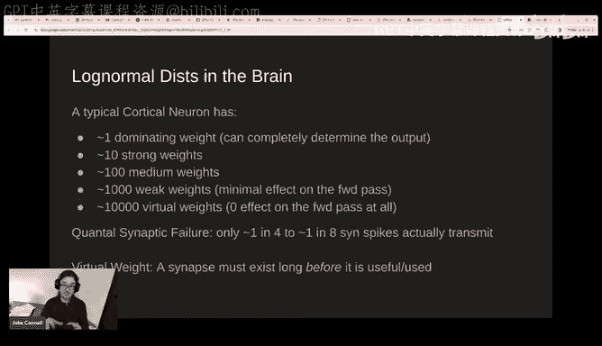

So。In with these really sparkrse。Neurural networks。嗯。One of the core things is the batch consumption。

啊。I think the' way think about this compared vector matrix to matrix multiplication that have very different scaling properties in terms of their ALU versus memory。

In particular， vent matrix multi does not take any advantage of excess AU。

 and so it ends up being completely memory bandwidth of di。

Whereas matrix publication you can basically take advantage of an ALU memory ratio that is proportional to size of matrices or the block size so today with ALU to memory ratios in tensor cores approaching at around three orders of magnitudes around0 to one means that the ideal block matrix size also around that size it's around one to two four or positive even larger because those are the size of small block matrices that are bandwidth between their memory bandwidth and the AOU on a GPU。

But this sound poses a problem。And the problem is that as a neural network designer as a neural network architect。

You are constrained to use Maol even in scenarios where vectorvaates ver work makes more sense。😡。

And if you wanted to simulate an arbitrary circuit like an arbitrary universal R or even simulate a GPU or simulate the brain。

 you're the obvious thing to do， not even obvious， but the correct thing to do is use vector matrix multi matrix matrix multi is a much more constrained limited use of ALU。

It's not equivalent like a vacuum multi system can simulate Mamo， but not in the way around。

Another way of expressing this is it's sort of Boonnuman's curse。

 it's the way that our current architecture of computers is built。

 the entire premise is based on this segregation discrepancy between RA and compute the compute is usually placed in the center of RA which you can see here on this D diagram and it surrounds the compute。

And we have this specialized circuitry just restoring information in RA。

 and then we have to actually pipe that into the chip。And。In modern computer architecture。

 the cost is mostly dominated by wire energy， it's topological。对，可以。

You have three words of magnitude， more flops than memory band fight。

M bandwidth bytes because the interwired distances inside the tens core unit that move data around are roughly three orders of magnitude less total length traveled。

 so that's all happening deep inside the core of this GPU and it's transmitting it's transmitting the same number of bits or bytes over very。

 very small distances use less energy and you can do much more of that into space and time。

And this is just a fundamental constraint in the physics of these chips。So the brain is very。

 very different in that it places the compute directly on the they are one， they're unified。

 and that's more the normal neuromorphic approach。And if I could make one strong principle bet on what computing paradigm will come after from GPUs。

 it probably be some form of normal for computing。😡。

Another way of looking at this understand problem is considering。Why baing this hard？And problematic。

Yeah。So in modern transform architectures， you can think of them having three temporal scales which information is stored and used。

 their activations， the neuron activations would store。The most。

Thatest high frequency components of the system that are varying immediately with information flowing through the network。

Then there's the Kv cache， which storess information on a short medium time scale that varies。

Based on input prompt。And then you finally have the frozen weights。

 which in most applications do not change at all once Apple the network is deployed。😡。

In the brain we have activations which are almost exactly the equivalent of neuroact activationivations of transformers。

 and then we have short the medium term plasticity。

 which is pretty much the direct equivalent of the KV catch。

 and then we have long term weights which are most the equivalent of the frozen weights and transformer。

嗯。You can think of the kd caches as equivalent to short term weights except they they grow。

They grow sort of without bound at every time step you're adding a fixed new amount of weights into the short term memory and you're not ever reusing or compressing there are some new techniques trying to maybe move beyond transformers that are moving past that but that's currently how most central architecture works。

And so with performanceers， you're making it straight off。

Which may not displayed right here very well， it's better explained here。

Transformers make the trade off to give up recurrence。In exchange for temporal baing。

 so you can fit the problem into the standard constraint of matball。

And thereby achieve a high LU memory ratio and accelerate training dramatically。

 the core reason why transformers are so successful is they impose the design constraint of a system that allow you to take advantage of large batch sizes during training because now you can actually use time as your batch dimension。

So if you're looking at。This is the way of giving transformers where left to right。

 I have time as the the position in the sequence。For the token position。

 and you can see then I can now apply that as the back dimension in my MA problem。

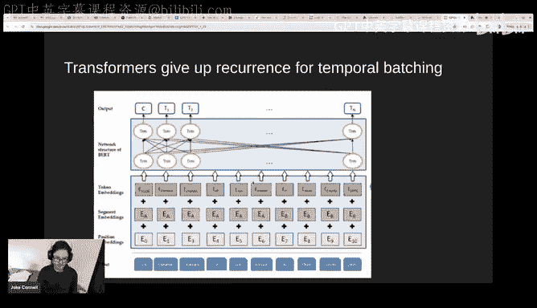

And let's take advantage of high A to membership。是。

What if you want recurrence and fat inferencerence。

 while then you are in the brain like regime where you are completely memory bandwidth with limited。

 you can't only take advantage of the high AU to memory ratio。嗯。So you throw have to pick one one。

 you try to achieve high throughput and get back。B thing and and leverage highly memory ratio by having。

 you know， some way of having extreme number of。Agents or parts of the neural network that reuse all the same short term memory and weights。

That seems really difficult to do for reasons that are should be mostly obvious。

 so I may have go the slide or now if you think of like this system is the same problem because the transformers。

 wide inference is slow with transformers。Because each individual。

Instance of a transformer as the Kb cache is expanding it's it is becoming different from any other transformer instance。

 And so it's really hard to batch them unlike the weights。

 So if you have a insurance request coming to a transformer and。It has no input prompt。

 it's just say like the first question with a very， very foot prompt。

 then of course you can take advantage of a large amount of batching because there's very little differentiation between that and the thousand on the requests that are similar。

But the longer you fill up the KV cash， the more super medium term memory that particular instance has that differentiates from others then the less you take advantage of about them。

So this approach is just。To just go purely for speed and run with the back size of one and then take advantage of the fact that we can use this maximum farcity to reduce the amount of memory loaded and that dynasty approach that will result in the fastest possible execution speed but not the fastest so those for the fundamental trade off here on current architecture。

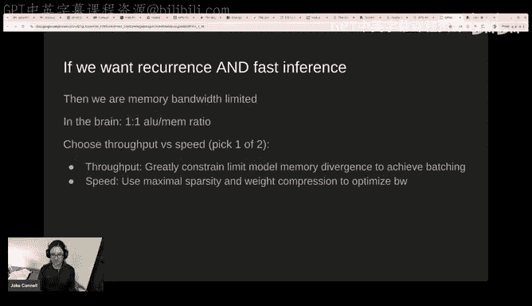

嗯。Let's get up to the present and talk about。In videos of market segmentation strategy。Yeah。

So Nvidia used to be a gaming company until relatively recently。

 and you can kind of see that here where you go back to 2001， their gaming revenue。我。

Greater than data center revenue what they about on par。

But then this interesting thing happened and I guess you could sort of blame it on chat DBT。

 but data center revenue just dramatically took off。

 it really went exponential over a short period of time。And。

It it happened what I think most of do not realize is it happened over a time scale。

 which is much shorter than the time scale of。😡，Large architectural plants。😡。

So it's not like Nvidia had time to go and make an entirely new architecture。😡。

For this market segment， that is not what they did， that's not what they had time to do。

They took their gaming architecture and they differentiated slightly So on the left here you have the architecture diagram for the SM unit on an ArtX 490。

The Ada architecture， and then on the right you have the equivalent for the H100。

 which is of the same model fan。And if you look in detail here there are some differences。

 these are not exactly the same micro architectureure of course。

 but they reuse all of the same internal technology they're very similar。

 the tensor cores are very similar there's slight differentiation the tensor cores on the Ar where idea that they made decisions that these would be used more for inferences。

So they have less of the higher Bi width pathways accelerated to some extent they put less to allocate less silicon dye area for higher precision pathways you're also listeninging that they 100 variant has a lot of real estate allocate to F64。

 which the consumer variant has almost no real estate allocate to that。In addition。

 the consumer variant has a certain fraction to die allocated this ray tracing core。

Which from my perspective is mostly kind of useless and I kind of wish they've never done that。

 I don't think it's even that useful for graphics， but whatever they did that and but likewise you could point out that on the enterprise variant they were're using a bulbvis databasespace with F64 which really has no meaningful impact on our networks。

Both than that， I mean， they're really similar dyes。These all the thing quat。

And the main difference is that the enterprise furniture of the chip will have more RA and they use a much more expensive RAM in form of HVM。

 and it usually has around 2 to 2。5 the bandwidth of the equivalent consumer chip。

At a much higher cost and also a larger amount of that brand。Now let's get to some actual benchmarks。

Yeah。So。Here， I've taken the so I'm sorry you might if I ask you something。

 So just about the previous slides before we go into benchmark Yeah， so you know like。

One criticism I've heard of like basically GPUs or like really for graphics and they were evolved for like machine learning and I've heard that both criticized and loadeded so for example I've heard it criticized because well like you know our like hardware of vendor X might be like well we' just like really purely by MLl and accelerate transformer transformer performance therefore we have a strategic advantage on the other hand。

 I guess the benefit would be， well you have a bunch of graphics programmers like yourself who are now like it's sort of the same software architecture。

 I can take the code I wrote for gaming GPUs and now run it on server GPUs。

And that's like a positive so I figure maybe the answer like is was this a good bet or not is a bit nuanced like obviously it was a good bet because Zvidia is one of the most important companies in the world now。

 but I'm sort of curious if you sort of like have like a sort of slightly different take than those two main。

😊，Oh yeah， no， I added short opinions on this anybody I didn't express it clearly enough。

Even if I was only interested in graphics， I definitely would not want a dedicated graphics logic chip。

 so if you go back in here。😡，Let's still wait back in time when I was working on GPQs like this this this is a it's not a good representation of the actual layout of the chip everything but gives you an architectural diagram this is not what I wanted I mean this is like really specialized hardware that is optimized for its particular purpose determined by architects at that time。

It's extremely constraining for me as a GPU programmer， I want to go wild。

 I to working on things I didn't think of， I don't want to use fixed function hardware。

 are you kidding？Like this was a moral freight group that they made this chip that's like very general purpose that you can use with Kutuda and it it's literally just like a C++ accelerate。

 that's what I want， I want a chip that accelerates C++。Paramal SL plus， that's what I want。

I don't want you to make any assumptions whatsoever about what I'm going to use it for。

I'm going to use it for things you've got thought of I don't going to think that's the entire purpose so these kind concretes stuff people are doing this doesn't use any of the dedicated gratitude and I'm not even type like a tiny bit this is all running a general purpose circuitry like compiled pharmacy+ plus。

So that's that's my strong opinion on that let's go back to these modern chips big tensor cores like。

Okay， you know， I'll use it， I don't want to。I can't it limits me I can't like running these really advanced algorithms。

 so I can't run adaptive control location on。Now， I can't run this on the Tensor court。

I mean I' tried you get kind of close with some you can do but it's really really difficult it's very very constrained and this thing I mean I don't even know it's worth my time to like try to figure out what I would do with this rate facing I think it's space to useless this。

Interesting like but but that's yeah， like at least for Tensor course。

 like what I'm hearing you say is that like like fundamentally it's sort of a very useful accelerator。

 but it's not like a useful research accelerator tool。😊。

And so like and kind of like back to your analogy of like， I want fast pers plus plus。

Like a tenseor core is not that right and so I say it's very yeah。

I think it makes sense they put it on the chip they were otherwise they'd face pressure from's there's a there's a trade off that they have to make they had to make the trade off between。

Acceleating known algorithms as they are right now。😡，And then also having general purpose circuitry。

 they can accelerate future unknown algorithms， and they always make that trade off。

And what I be looking at this guy right here is that they dedicate almost half of the core to accelerating known dense mapmal algorithms。

It's not necessarily you know it's all that like I would argue push back a bit maybe it should be a bit more than that but at the end of the day the sparsest algorithms are most limited by memory bandwidth so in fact like I don't really even care about much of this stuff that much like I would want more of these load units I want more shared memory faster bandwidth for shared memory much much faster golden memory bandwidth that's what I care about if they're gonna have dedicated logic on this but I was making a chip for the type of algorithms I'm interested in the dedicated logic would focus much more on accelerating compression decompression of weights that are compress and advanced formats。

That's kind of what happened with graphics when graphics algorithms got really sophisticated。

 you end up just becoming memory bank bound and the thing that you end up wanting is a really optimized compression decompression in the harbor level。

So that's what happened with textures， for example。

 they move a lot of the compression decompression on the chip so that you became less memory bandwidth on your one of the core things that is memory intensive the textures。

 and I can see thats that' interesting direction that you can go and that would work much better kind of algorithms I'm interested in if they had sort of dedicated logic for really compression and decompression of weights and encoded in various complex formats。

So， yeah， I think I that answers the question。 So we should。

 we should I'll let you get back to the floor。 Yeah， but anyway。

 like getting those friends of this is like the time scale here is too short。

 They did not have enough time to go in and like。Do much， you know。

 they carry through these kindss of cores on their chips they what they did。啊。All right。

 so here's I think an interesting benchmark across different types of precisions going from 32 to it seen to one of the main eight bit float modes and then on the left we have this major size I' only done foot matrixes here I didn't do rectangleular or anything other more interesting。

 but you can get the general trends。And I'm only comparing two GP models here that have the same sort of rough architectural family。

 one is the differentiated age 100， one is the 490 main top log consumer。

And what's interesting is that。The490 mostly dominates a bit， but not by a huge amount。

 it's a bit faster if you're doing only 32 bit。Pretty much across the board。

And then for float 16 and Float 8， age 100 has an advantage that grows。

Basically the size of the problem， the the size of the。Othertangular block you're using。

So as you use larger larger batches and larger larger rectangular blocks。

 they're much more they're more and more dense and regular the acceleration grows up to let's say in the。

In the max case up to a 4X， about a 4X difference for this one mode of flow 16。Okay。

One little note on this particular mode of F 16 is that this is a mode that' is intention to not fully accelerated。

 there is a variance of this that is faster than the consumer GPU。

 but the difference between float 16 inputs in F 32 accumulation versus F 16 inputs and float 16 accumulation and the default pathway P which assume uses or assumes the 32bit mode。

 I believe， and uses that pathway。Which is slower than the consumer duties。Anyway。

 I think that also applies to the8 bit most， but you put it in two dollars like flops per dollar。

 the 490 is always dominant across everything it's just a question whether it's dominant only by a factor of 3 x or 2 x or something in some case10 x。

Yeah。So。So really the age 100s are optimized for the current structure of neural networks where especially transformers where you can take advantage of or use really large denses。

Broughtly square animals， but the more you go on that peri， the less bandge they have。

And they have really no advantage in regular compute if anything， they're a bit slower。Okay。

 I'm going to pause your if any questions on this or maybe not。Not a question。

 but a maybe more of a comment。 like it reminds me of like sort of this like Nascar analogy where like the。

Like because if you need to only turn to the left， then're you can tilt your suspension。

 but like if you drive anywhere else like you're not gonna have a particularly good car and I think it's kind of interesting like I hadn't considered like because typically indeed when people compare consumer GP they'll sort of say。

 oh like how fast is a transformer but what you're saying is really if the architectures are like a bit irregular that you know have fun and then a 49 youll be significantly cheaper for you to work with that's an interesting tick。

Okay， yeah， more of a comment， but yeah， I even if you writing a regular transformer using everything off the shelf。

The board doesn't to dominate in dollar costs， assuming you can fit it into ramp。

There's no point in which age 400 dominates economically。It's completely done， but foright。

Interesting I see。But yeah， but it doest sound nature your problem。

 at the age 100 strength is going to be in more standard， regular， large matrix。

 very regularly dense。But also， as to point out。At some point I should go in and like actually write this in lower level kuda that uses the lower precision accumulation。

 I don't want that would make it it might make up to a 2x difference from the4 ID。嗯。Yeah。

 to go to your analogy， like if I was writing something that used ray tracing code， I mean。

And and was its specifically structured for the rate facing API assumptions they make for this hardware and you know that's like the H 100 would score very low in there because itd have to emulate that within a general purpose search。

嗯。But obviously that's not interesting。What interesting thing about H 100 is the larger fat tensor score for certain modes and pathways it has a higher performance usually like a two。

 sometimes 4X faster pathway per SN。If you can take advantage of those specific modes。

But the forward writings are I think， almost intentionally by Nvidia。

Like less exposed or optimized so you really have to write your own kernels to use the like660 bit take advantage of the6 accumulation and whatnot and most people have not done that yet so this it does not even。

I think you use those pathways。And so at least for these benchmarks like were these with Kuta Triden Pytorch like Pytorch this isy it's not my own optimize it's just off the shelf Pytorch but some recent breaking the Pytorch supported this mode there was some little thing with that。

 but yeah， this is just off shelf Pytorch。

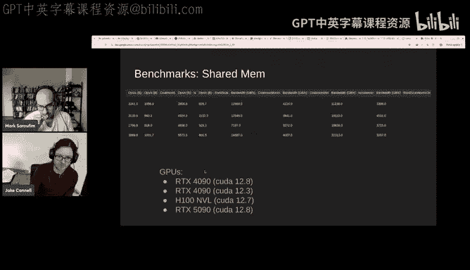

要的OK。All right。O。So。Distance field takes some more explanation but。

No the benchmarks I run as like a micro benchmarkch。

For of the sparseity piece that I'm interested in is I'm really interested in shared memory performance because that's one of the things that's global memory performance is usually its what you see in the 10 so for example。

 like the R case when I claims one ter% in the bandwidth and that is really what you get like you actually measure it's what're using in kernels and profile maybe you get 90% of that is something that's not that hard to get 9% of it buts what's more mysterious is what is the shared memory performance I'd say also L2 memory memory bandwidth performance is also somewhat mysterious but shared memory bandwidth performance is very mysterious and by that I mean it's complicated it depends a lot on the structure of the how coalesce you are what you're doing what the exact pathway is all this stuff so it's one of more interesting things to measure。

So on the left is just the measurement in terms of number of ops。

 but they're pretty much all four byte ops they're all32 bit ops。

 so it's more interesting to look at these four columns over here and。

This column hopefully you can see this， but actually these two are both coalesced atomic operations the one right here you can mostly ignore it is a Nvidia has like a coalesceed atomic for I think FP16 that's what this is and this is just showing that no FP16 stop is still really slow and probably not really that useful this is integer so and then you have one over here which is nonatomic to compare to like just general shared memory that's not using atomic operations and then this is random scattered atomic so if you're not you're not really paying any attention to coalescing and you're sort of breaking the rules and you're just doing random random rights random atomic operations scattered across memory。

And。What you see is across and here's the different GP models I've not matched them up so I'd be interested to see what people's predictions are。

 but two of these rows are from RtX 490 across different versions of KUDa and there's one row it' RtX 590 and one rows to H100 and DL do I think is the highest performance variant of the H100。

I think that's interesting before before like showing in which achieves what is that。

The range of scatter performance is always， of course， slower。

 usually by a factor of three sometimes times'm4， but that ratio does vary somewhat significantly。

 and but they're all kind of around the same speed， like not only has a huge advantage。

The non atomic ship every bandwidth。Is almost the same ballpark except this top row GP model。

 which is maybe 50% lower。And then the coalesce， the best case for atomics。

Is also somewhat interesting pattern like somewhat similar pattern but does not actually match up the nonatomic。

 So this one GPU， which is like。Whatever this one is the coales atomics and nonomics are similar。

 but the coales atomics is actually faster， which is kind of weird and then this GPU the co atomics are about。

Own it less than half the speed of the。Of the nonatomic thisre they access。All right。

 does anyone want to make a guess of like which of these map to which GPUs？

I know it seems like totally random I not so okay。All right， so the top of actually was the age 100。

 the middle two of the 490s， the bottom is the 590。

And unfortunately I did not have enough time to really figure out why coUa 12。

88 is slower with this benchmark， I wish I had more time to actually do bug back but that I just tried this in the 590 like the other day I didn't have enough time to actually figure it out so I also put the benchmark of the 490 to 12 with co to 12。

8 because it does turn out indeed that there's something going on with coUa 12。8 where。嗯。

It's slower for some reason I've not figured out I've not done the analysis of like the lower level disassembly to see what's going on。

But if you compare the H100 and the 490 both on build a version of KudDa that has no issue。

 directly comparable across the board except the 490 is faster for autoatomics in this benchmark。

 which is interesting， but for colaomics they're about the same speed。

And the 490 is somewhat stronger in random scatteredomics。So this is interesting。

 that's an example of the， you know， it goes to show that the H 100 is。

Is somewhat optimized for these large matrix operations and really not much else and to some extent they've made some trade offs where they've lost some performance versus the consumer GPU on more general code。

All right。诶。Any questions on this one or note？No we can keep doing。So what？We can keep going。

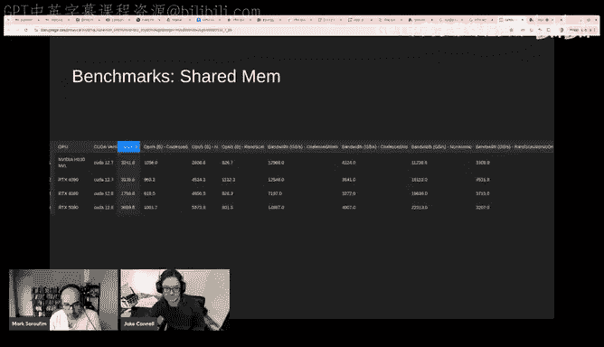

Okay， so one think is interesting if you can now， this is this radical hypothesis。嗯。

You come back to the whole Win AGI thing and Moore's law and sccap hypothesis。

There is now this massiveative investment of resources in scaling up， basically scaling up AlexN。诶。

And I think it's going up Alex and I know that there's been architectural improvements since then like transformers are you know a general improvement。

 but what I mean by that is scaling up。These dense neural networks。

And taking the type of neural network you could run on one GPU and then running it on ever larger cross clusters。

Where the clusters are all densely interconnected to essentially function as a single mass GPU。

That's the current scaling period， I think in a nutshell that mostly captures what's going on。

And we're now getting up into the regime of getting up into one like one year to the 26th dense flops for a training room。

I don't think they released that 1 billion on the 4。5 training run。

 I think there was discounts and performance improvements。

 but it could have been up that high any of it was that there certainly are $1 billion training runs that are probably currently in the works。

I think it's crazy。Is to consider based on the stuff I was showing earlier on the known sort of parameterss of the brain。

 if there's only about one to the 14 synapses。And if we know that on average。

 they activate a fire at a rate about 0。1 hertz， and we know that humans can become highly intelligent and productive and have enough knowledge to do useful things in the world up only 33 years。

 which conveniently is  one0 in nine seconds。And then you get estimate of1 e to 22 bumps。Which is。

Three， four orders of magnitude less。Compute costs then current large trademark routes。So。

I do believe we are in a situation where it's possible that。

Dramatically better algorithms exist but I just not been discovered yet。

 and I think I have some sense of what they are。But it's just going to be a lot of work in terms of figuring out exactly how to restructure all of our training algorithms。

 but I cant think it's even possible on current hardware。So as a very interesting I know。

 somewhat radical premise， but I think the evidence for is reasonably compelling and so it's one of the things I'm interested in pursuing。

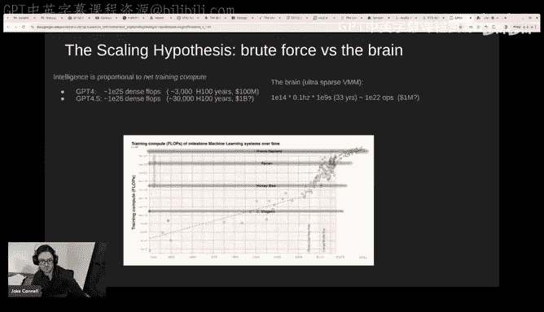

And。Yeah， that's it， that's my last slide。喂呃than you， Jack。I guess yeah。

 if folks have any questions to Jake， now would be a good time。

I guess I'll start off like with with my own like it's it sounds like u。嗯。

For the vast majority of your own personal research。

 like it sounds like you just end up effectively using consumer GPUs。And so like。

And I guess like really， I guess if you could ask something of NviDdia to just like basically improve something in their enterprise GPUs to make like your kind of research more feasible like any parts of research。

Is there like any concrete ask you'd make or you just think like a general purpose machine like the consumer GPUs is more than sufficient？

嗯嗯。Yeah， it's mostly a general purpose machine I do think it。哎。

My main ask would be not to overspecize on for algorithms， so that'll be the main ask。

If there is anything that should be specialized， I'm interested in be maybe some low level instructions to accelerate some of the compression decompression operations。

And then really， if the architect fill a harder level。

 the one interesting direction you really want to maybe just go to more radical direction。

 it's to let's see if I can explain where is okay。The next thing I think I think。

Would be interesting going the more normalic approach is splitting up this large chip into smaller chipts that are directly connected to a memory stack。

Had a much higher speeded。And so moving to a regime where you have a much higher total global memory bandwidth for the same amount brand that could be interesting that would accelerate。

Typing notess， I think are interesting。But so this is like a graph core like approach basically where you just have like very。

 yeah。I'm really tend to just like look at Gport， let's say if it find art next。

 I didn't think the G4 did that。I did not think that they had， did they？Yeah。

 kind because I felt like graph4。Was sort of dead， but yeah。

 like I think I think it might have been in the US， but like you can click on the first picture。啊。

Okay， so yeah this just looked like to me like I don't know。

 this is just really looks like a variation of GPU chip it's not really like a。

Going in the nomorphic direction， I think there may are subs that are doing more what I'm talking about。

 but like really what I'm talking about is like。嗯。Moving the compute much closer to the ramp。

And not using SRAM like everyone， there's there's all these startups that start。

 I think I think maybe graph course in that category where they were trying to just put all the weights in SRAM and doesn't that's not I'm talking about that's not we need we do need like a lot of RAM。

I think that's pretty clear， especially as spa as neural networks because。

You're not not you're just not compute limited， you're constrained by RA and RA bandwidth。

 the RA bandwidth determines your speed and the RA determines your size and you want both。

 you want large neural networks that are fast so you want a lot of RAM and you want to be very fast。

You don't need that much compute， but you need to put that compute really close to the ramp。

And current GP are limited because they have a huge dye that is surrounded by ramp。

 so they have to pull all the weights have to transmit this long distance to get into the cores。

And it's the core problem and you can't you can't just make a huge so there's other approach like ceres。

 I think that's also somewhat a wrong approach。It。I。Serrebuus wafer die。

 I'm trying to see what it goes a little quick， but Cerrebius put this approach of just putting everything on one huge massive wafer scale die。

And。That， it doesn't really explain but I also think they have challenges around it being general purpose because I think they have to rely on a very clever compiler is my suspicion it's not like yeah but you're agree thats I think core problem is not that the core be I think it may overcome the core problem is that they they limit with SRAM and SRAM is just way too expensive。

And。Yeah， so makes sense， yeah， like I do want to get make sure we get to other questions from chat like so so Alex is asking like isn't this sort of an apples to oranges comparison though like in the sense that LLMs contain condensense and condense a lot more raw info than any one person while human brains in theory generalize much better。

I think this was a point regarding like one of the last slides that you had。Yes， probably this one。

 yes。Yeah， like。This graph does not show it very well， I wish now I wish I had a slide for it。

 but I think that intelligence in proportional net training computers is roughly is roughly correct。

 but really you could think of it as like there's two accesses so。

That next compute the product of one is one axis is the total training time。

 the total training data size。And the other axis is the amount of compute spent per unit of time or unit of data point。

And if you look at it that way。Current Lms are in a very different area。

 a different area of that map。 They're over in the extreme of。

Very large amount of training set like if you think of it as like an experience of a lifetime。

 maybe the equivalent of hundreds of of life human lifetimes。But they're much smaller。

And so they're applying less compute per time step。And what does that mean well， it being they learn。

 they probably learn almost not I it seems pretty clear they learn more slowly per time step because the speed of learning per time step is determined by this size of the model or how much compute can spend to do inference per time step。

 so the human brains in a regime where it's very， very large in comparison and it's applyinging a very large amount of compute to learn more rapidly per time step because it's much slower and it has so much less data and experience。

I think that's that roughly describes。Current LLMs are superhuman and overly perform they're doing really well in regimes that are mostly knowledge limited because they've been able to actually read the entirety of the internet。

 which a human would never be able to do， a human might experience 10 billion tokens， let's say。

 1 billion seconds， 10 tokens per second。And these models are currently being trained up to。

 you know， I think they're well under with trillions of tokens。So yeah， it's a different machine。

So I still see three more questions in chat， so like one natural one like I guess I think I know the answer to this one but like you know。

 do you want to dish any flame towards consumer AMD cards and like how come you didn't talk about them during this talk？

啊。You know， you go way back it's been a long time since I did anydevelopment on ATI car。

It was all the way back in work indexboxox 360。

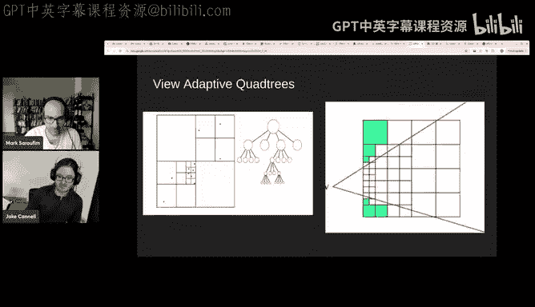

And I will say that wasable I really like that card。I mean。

 compared to the video thing on the PlaytStation3 was way better。But that was a long time ago。And。诶。

I've not been impressed with lot of that work since， I think it'd be great for competition， you know。

 there's one scenario here。I wish that A& D would like ignore the screen part of the chart and focus more on the gaming segment。

And keep pressure on videodia to make sure。Because maybe now， financially。

 they could just give up gaming。They can just give it up， they don't have to produce two consumer GP。

And that would suck， but I'd hope that A& D would fill in the gap there。

I guess we this another question and shot is like， what do you think of Nvidia ass new digits project？

You know， I've heard of that， I've not looked into it to a lot， is it like a high ra？

H ran personal machine thing。 Yeah， like， it's a crazy unified memory budget。

 So you can just do chunky at home。 Yeah， that's the one。😊，UYeah。

 I guess I didn't look at like how much RA up， it must have a lot of RA。

So 12 gig byte gram， that's pretty good， that's like four Rx 590 is what's the cost？

Let's talk to a salesperson， it seems so。Let's's see if the internet has。Wait， what only tree grant？

I am interested in this now if it's only three gra I mean because it's hard you get to find money for that price。

好。This is interesting， I looking more into this， I did not realize it was that cheap。

If that really has 128 gigytes of video RA for three gra， it's a pretty a good deal。

So it's interesting。I mean， I think when they're out like I'm I like I also feel like my gaming PC is just sort of just sort of be a different machine for my ML PC。

 but。

Yeah so so I guess like maybe the last question we can cover in chat is from Daniel so I think you already answered this but like do you see the balance shifting between traditional restization to neural rendering particularly for realtime games I think you spent a good amount of time bashing on the RT Tensor course so my suspicion is yeah curious your take again。

Yeah， yeah， I mean， you know， bump that I'm currently making a game。

 but even way back when I was last working on rendering engines。

 there's no rationalization involved in。The renderer engines I was working on 10。

12 years ago and I thought was making one now now I would not use raturization I think I have it shot here from Unreal Engine 5 and they are still using raturization but I remember like reading some explanation where they felt like they had to explain why they were not using ray tracing and box and stuff but yeah could not。

Mostly it's because I was making a game today。It's so much you can to unify everything like voxels or the equivalent of image representation in 3D and they just make it easier to integrate thing I would I mean I would be doing neural generation or everything so that would be the main that would be the main driving force using neural networks to generate all the data animate everything etctera really though。

The only part that's not just a neural network would be the sort of prior that would。

Probably want to structure things in some sort of a is structure like a box electric。

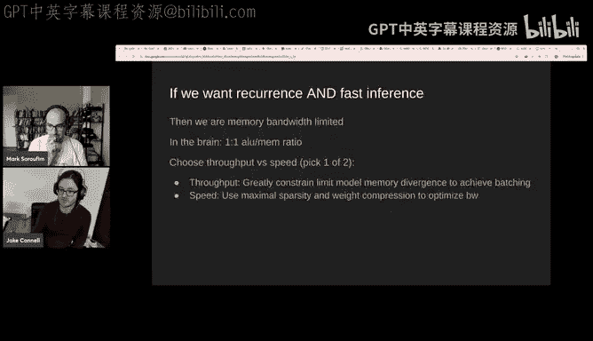

All right， well， I think Jake， this might be a good time to call I want to say thank you already because I'm seeing someone like there's Alex from the Exo team that like thought like this presentation was really cool and they might talk more。

 so I think we're hoping to hopefully you help us kickstart more people thinking about like local general compute。

😊，Um so I'm seeing like people seem to really like chat， I think you have a friend and Cha。

 Carl J Ro Jr。 it's Jolly， who seems to be really excited to see you。So yeah。

 lots of thank yous and thank you， Jake， I guess if people want to talk to you more。

 where do you hang out， like well， where can people ask you more questions in general？I mean。

 you can come to the Baside Discord and I sometimes chat there。That's one way yeah。

You shoot me an email or a Disc， those are some of the main things that I will respond to， I think。

Okay， excellent。Well， thank you， Jake， hopefully we'll see you soon。

