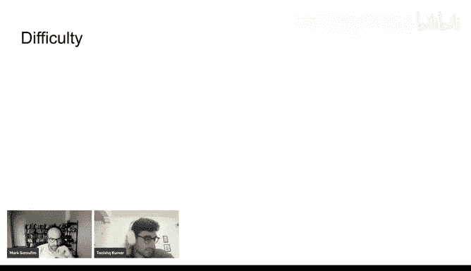
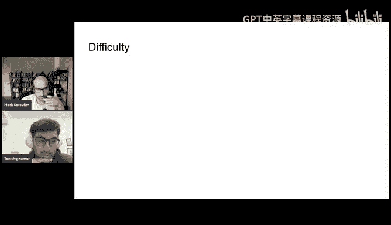
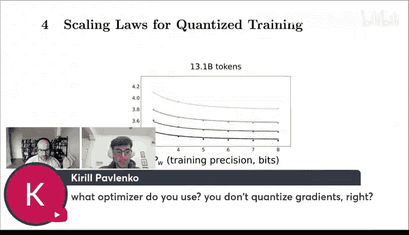
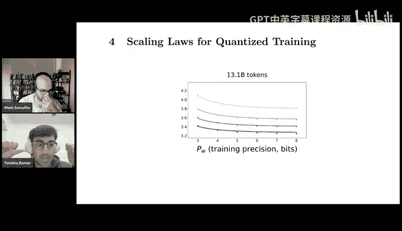
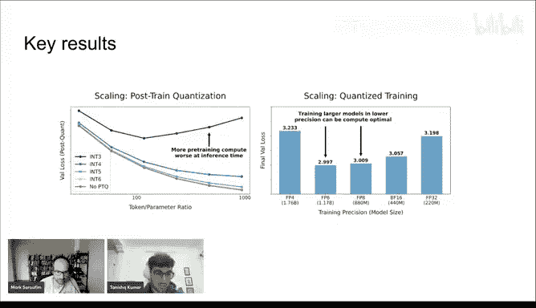
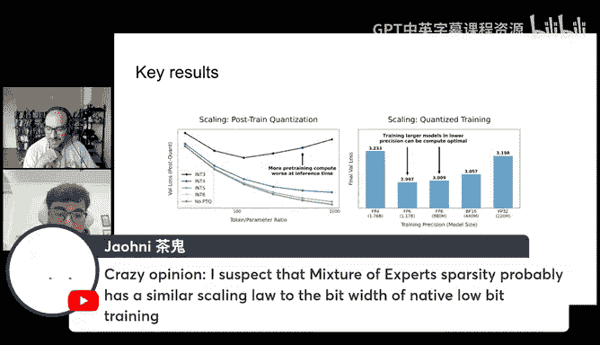
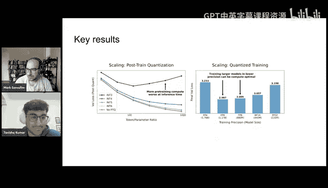

# GPU MODE《CUDA、GPU编程1-53课｜GPU MODE》中英字幕（deepseek-v3.2 - P55：-20250322-Lecture 52_ Scaling Laws for Low Precision.zh_en - GPT中英字幕课程资源 - BV1QZ421N7pT

Sorry， this is being recorded。It is yes。Yeah， like we just like live live stream it on YouTube directly tracks it easier。

Okay， can folks hear us on YouTube？I'll just double check as well in the meantime time。All right。

 yeah， I think so。Okay， welcome everyone to another episode of GPU mode like today I'm super glad to have like Denish Kummar so a few months back now Denise K struck a really nice paper called Scing laws for Low Precision。

 I myself had worked a lot on like quantization and Pythter so I was like very very interested in what he had to say。

This is very concretely Tenishche did ask for this to be interactive so if you have like any questions。

 we're just going to like ask questions immediately and we won't wait to batch them。So yeah。

 just if you have any questions about anything related to quantization。

 I think Denise be a great person to ask questions to you so yeah， without further ado， Tishche。

 please go ahead。😊，Awesome Mark thanks for having me a big GPU fan。

 so this is a privilege and a pleasure to be on yeah。

 I'll be talking about scaling laws for precision for quantization and though Mark says I'm。

Normallyally a good person to ask about anything related to quantation actually the motivation for the paper how got started was with the fact that I am a terrible person to ask about these things I actually got into deep learning working on theory originally and I was interested in the question of how quantization noise effect scale with parameter talent and data which was the original question behind this paper very much for different reasons than I guess systems people are and I learned all of the systems knowledge about how could a kernelel's work in GPU memory hierarchy and all of that and how quantization is implemented forward and backward path I learned most of it actually working on this paper yeah so so I mailed something to know as much or as little as as people in the audience but please feel free to interrupt happy to talk about details motivation for things for what it's worth role at home I also started my career in ML theory so like it's okay。

you're not in a totally foreign audience Okay good to hear that there's other reformed hearing people who sell the lights and started running experiments at some point yeah we have to get jobs really as effectively Okay so yes without further review。

😊，A brief setup for the paper， the Binet paper I think by Microsoft made a lot of splashes in the months before I started working on this。

 part of the motivation was just curiosity about like some of the techniques being introduced in these papers very aggressive quant to different parts of our model the question of like whether it is or is not a free lunch I think a lot of people have also taken like the conclusions of our paper。

 the sers we've done is like saying something directly about Binet。

 to be clear I think that an awesome paper that I really enjoyed reading and we don't study the setting that they're operating in like specifically they basically are training models in very low precision with weights interernary if I remember correctly and they're changing a whole bunch of things about the standard like causal transformer set to be able to accommodate this and we're doing none of that so ours is like sort of a generic vanilla L set up to study maybe the basic questions but part of the motivation was the cool work done in the bit。

paper to see sort of what are the how far can we take quantization you know from from scratch the sort of scientific question very concretely that motivated this was me thinking about。

Which of these two models would do better if you had a model of a given size。

 say a 1 billion parameter model and you forced its weight to be quantized to four bits on the forward pass。

 let's say to integer type and you compare its performance to say a model that's half of its size that was left in full precision where by full precision only mean basically anything 16 bit rough which one would do better。

 at least to me it was not obvious， but it felt like there should be an answer and if you're thinking of quantization on a forward pass is basically adding some noise to the weights or activations where the variance is the noise depends on the precision you choose to quantize to then the hope at least from like a principled perspective is that the effect on loss should be predictable so the main motivation for the paper was that effects on loss of quantization should be predictable as a function of the precision and maybe a priori there's something interesting here if you can predict the loss of a function of precision because we know that the precision。

And gives a certain like compute savings and so there's some interesting questions on feed optimality so yeah。

 that's that's basically the the main motivation。The hope for the paper was to say somewhat hardware agnostic。

 you know， different people use different providers and the providers that are。

Used most commonly today it may not be the ones that are ubiquitous in five to10 years and so we sort of want to stay in this world where we're thinking of quantization is just noise in the forward past and operate more in this conceptual space rather than you know committing to you know if you are doing F map on an H100 or something like that so it's almost like more of science paper than an engineering paper and this and this sort of leads into like the principal difficulties actually Denise is already the first question we're getting pro it's like you're really specifically talking about posttrain quantization here is that correct。

So the paper studies both post training quantization and quantitization during training and even within quantization during training。

 there's sort of two things you can do this quantization aware training where you're just quantanting the weights and you're still doing matrix multiplications and high precision and then there is maybe what you can call low precision training。

 which is like genuinely doing matrix multiplications in low precision which requires not just the weights but the activations take cache to be low precision and part of the reason is because a lot of the most common GPs today require。

Both elements in a map mall to be the same type so you need to have them both in more positioned to do like F4 FB MAmo and so yeah the short answer to the question is but we'll talk about post training and during training I'll start off by talking about post training and I know that's probably the most common thing that people do or think about and actually think the result around post training is one of the most interesting results in the paper as i'll do a little bit on that before we go into training。

Yeah， so the sort of principal difficulty here was that there's like two cultures at play。

I personally and I guess theory people think in terms of scaling where maybe the scaling worldview is that only the asymptotics and the functional form matters the constant factors sort of don't matter as compute or parameters or data go to infinity and then the opposite culture is the systems culture where actually the constant factors are maybe the only thing that matters right you know everyone's using similar algorithms maybe the asymptotics are the same or very similar actually small constant factor gains that you get from optimizing co kernels or you the choice of whether you're doing per channel or pretend quantization these implementation details really matter is the sort of systems philosophy So you have one group of people who basically try to abstract away implementation details and another group of people who basically focus on implementation details and we're talking about a paper that somehow simultaneously interesting and useful to both So the sort of like difficulty and more experiments to run what objects are interesting this is sort of principle this was one one key difficulty some feedback we got from systems people was。

Qu implementation details and feedback from scaling people was basically you know removed the quant implementation details so it's just sort of a fine line to go through and our motivating philosophy was to look at what the Chinchilla paper did if you're not aware Chinchilla paper was basically the paper from Google that was studying the loss as a function of the parameter count and data in language models at scale and the main claim of the paper was that models would do undertrained and you know ND should be scaled roughly equally if you get more compute or and this parameter count of your language model and D is data and so there they had to make similar design decisions they had to abstract away some architecture and implementation details which could change in the main lesson there was that hey we're just trying to figure out what loss looks like is a function of these two parameters ND and the specific details like you know kind of layeror or activation function you're doing we're going to abstract away it say these only affect the cause and factors and where it maybe interested in like the trends of scaling。

And actually an important point is that as a lot of shinchella replication papers and followups found out smaller architectural details as well as small data details make a huge difference in terms of like fitted scaling exponents you end up with so I think there's a bunch of papers where they try basically you do the same experiments with slightly different setup and find very different exponents and so the point of this is that the upshot of the shinchella paper was not the exponents or specific numbers that they fit or predicted。

 but rather the functional form that they identified and the predictions you can make using this functional form。

诶。😊，So yeah。😊，Okay， with that let's dive into the technical meat of the paper are there any questions I see a comment which is the Qgalor that hybrid maybe I'll let me put it up on chat you can read it as well。

Yeah， so cuicular hybrid position and QAT A weights and they were always。

Return to intake for the back pass so I know galorere I have not read Q galorere but I'm sure it's basically the intuitive thing Yeah so this is a good point there's many ways to I guess implement these things and this will change in the future and our sort of goal was to try and study maybe the two most commonly studied things which are postering quantization which is weights on me typically and then during training which is either you know like full F training which is your forward and backward path all the math or in F on H00 or you know quantization over training and so we're going take it as granted that like these are the most common things but absolutely right that there can be other implementations that can have different tradeoffs that are sort of in between the regimes we identify and that's part of the difficulty as mentioning it's a good point okay without furtherdo the first main technical result which is about postering quantization and the main thing we found about postering quantization was essentially。

That overtrained models we're overtrained just means models that are trained past Chinula optimal。

 which is typically taken to be something like order 20 times the number of tokens compared to the number of parameters。

 overtrained models are basically hurt more when you posttrain and quantize their weights and the intuition for this can be that as you train for longer and longer。

 so on more and more tokens， the damage you do when you apply a given amount of quantization to the weights or given amount of noise to the weights increases predictably as a function of the number of tokens seen and so as D over n increases where a D is data and n is parameters the degradation in lots also increases steadily and in fact we can fit a very specific mathematical form to that a power law which is useful because it allows us to predict。

The critical point in data where additional data might basically decrease your pretraining loss by some very small amount epsilon because of diminishing returns。

 but actually it'll increase the degradation that you get by quantizing the weight so much such that pretraining more on more data and using more compute is actually harmful for your loss after quantization and that's what you're seeing on the top row plot here that's the loss after quantization and you can see the U shape appear for very aggressively quantized models which basically is even the idea that more pretraining plots do not always lead to better models at inference time where inference time means post quantitization。

Yeah and so the U shape you can only see for the very aggressively quantized models but the point is the degradation。

 this trend appears for all of them so if we trained for much longer than we had a compute academiccomp budget for。

 you would see the same U shape for all the precision it would just take longer and longer to come about and you can see that actually it's like the degradation is quite small for six bit and above and so you know you can make a prediction using our functional form about how many tokens you would need to see a U shape for for example eight quantization and the answer is basically an absurd amount and so we don't need to worry about or eight bit quants getting U shaped anytime soon but it is still true even for the eight bit quants in all precisions that as you train in more data you get for post-train quantization I think that's interesting just because most people if they were given by a genie more preinning flux they would take I think it seems sensible and I guess the mantra of modern deep learning is that like scale in computer。

Always helpful， but actually I think this is to my knowledge， the first example where like。

Your model that you serve and if it's time can be worse as the function of increased pretraining compute。

 So I think that's kind of an interesting sort of newest result。Any questions Yeah。

 I have a few and I think chat so clearly asking just and is the number of parameters here please Yeah。

 that's right that's right all right， and so this is like specifically what kind of models So this was like these are all causal transformers video causal transformer So we use basically all type models which are basically like a modern transformer plus it's like basically you can think of it as like a G2 type thing it'll have the same architecture。

 but like modern basically implementation details like I think the atom betas are certain values you don't include I think biases in the linear layers and a bunch of other standard like standard tweaks to causal transformer that are basically like modern improvements so。

And when you say tokens like which data set like was this over this was Dma this was okay yeah but I mean that doesn't matter like you take any for and the way actually you know it doesn't matter is I think there was a paper that was I'm not sure for his concurrent work I think it came out a month or a little bit after ours。

 but it was it was a good paper on basically a similar phenomenon where。

They basically replicated this result it might even have been at larger scale and their implementation detail architecture data。

 all of this was different， but the trends were exactly like the same for post So these details don't matter so much I would imagine that basically this trend I would expect to hold the most。

I see a question about joining， but actually kind of want to jump the queue。

 So like I found like the first figure interesting like the one like in three is sort of like spikes up like if I'm not mistaken like Q Laura sort of had a similar like result in the paper where they were like well。

 we realized that we really can't get anything below and4 to be stable that is why it was important for us to have like fast and of four kernels and that sort of like motivated like basically the creation of libraries like with and bytes is that sort of like consistent with your understanding of that like as well。

So well I guess it's consistent but they're not saying the same thing so these plots are not saying what you just described it is true that training at3 bit and below is generally hard to get stable and that we found that our experiments as well but this plot is basically the main point in that this plot is not that statement so this plot has saying nothing specific to any particular precision it's true that for P equals3 here the dark blue in three plots you see a U shape and you're not really seeing it with the others the point actually is not so much the P equals3 displaying this trend all of the precision will display this trend if you continued the plots to the right we just didn't have the compute to train on much more than you some amount of tokens I think it was like 20 billion or something like that and so actually the lower row is the more important row here but the lower row is measuring is basically the degradation and loss when you quant to a certain precision posttrain as a function。

Your token budget and so even though the trends seem different by precision on the top row when you look not at the loss。

 but just at the degradation， the delta loss right which is really the object we're interested in you see for all precisions the trends look the same it's a straight line on a log log plot which means it's basically a power law and that's true for any precision they're just shifted versions of each other where of course you get exponentially more degradation you shift up on a log log on a log Y scale depending on your precision but the key point is it's just a straight line that's increasing and so the maybe TLDR takeaway of this plot is that as you train on more tokens。

The degradation from post tra quantizing increases predictably and monotononic。Yeah。

 it has nothing to do with like three bit or four bit， it's true for any precision。

 maybe it's not noticeable at really high precision， but it's still happening。

So this is more of a new question but it seems like at least when I'm looking at n equals 220 million like the charts like the lines aren't a steep so it seems like well there is still a substantial degradation because there's log log it does decrease and I know because like the token budget doesn't change so I'm just trying to sort of mentally kept going until 80 billion if you yeah so the X axis is not just tokens it's tokens is like over so actually the token budget on all these plots is the same but the reason that the like x axis has smaller numbers on the bigger models is because the token of parameter ratio is smaller for the bigger models just because the number of parameter is higher so you we train everything here to token budgets up 20 billion but for you a 200 million parameter model that's just a token a parameter ratio of 100 whereas for 20 million parameter model that's token a parameter ratio of 1000 right？

The claim is that the token parameter ratio is what predicts the degradation So the reason it doesn't look as much of you know on the top right is just because we haven't trained long enough you will get a Usha basically if you train longer for that as well So if all of the xaxxes looked the same like we're all the same token to parameter ratios if we had more compute you would see basically U shape or the same degradation so and you can see the trend is the same by looking at basically the shape of all of the plots in the bottom row is the same you see this monoonic like increase and all of them that gets larger with token budget so the short answer is like no there's no like。

There's no， basically， like。Safety you get by yeah yeah so it is true actually the degradation is smaller for larger models。

 but that's accounted for in the fact that you know we're saying the degradation is increasing in D over n right So what we're plotting in the x axis is the token of parameter ratio D over n So what that means is n gets larger。

 the degradation gets smaller when D is fixed but the point I'm making is that it's like as you make models bigger and train them for longer so D over n is roughly constant like the degradation will be the same I see all whole bunch of questions in right now so like like Joan it's more it seems like it's more of a speculation but they're guessing you know I wonder if the quantization error post string can be minimized with Hu Lauraura or if it's better to start with a not overtrained checkpoint for your bit with。

Yeah so I actually don't know the details of K Laurara that much my sense would be that like I would expect this phenomenon where overtrained models degrade more to be true with like most like quantization techniques because I think and there's a recent project i'm involved in that'll be out soon that basically like finds similar results not just with quantization but if you add noise if you're fine tuning so I think it's a reasonably general phenomenon。

And maybe there's like some specific architectural or training tweaks one could do。To， you know。

 train in a way。Suchuch that you can train for a very long time so overtrain models lot and not suffer so maybe such a thing exists。

 but I don't know but thats so you're really suggesting that like some of my smartest colleagues in Pytorch that workcompization are also heavily interested in sparssity so really you make the sort of broader point of like over overtrained models the more when noise is applied。

Yeah yeah well well actually that is something I've tested privately like and that is actually true but also you should you shouldn't think of that as like a very strong extension of the claim you're seeing here you' like since this is integer quantation you should basically think of integer quantation as just as like noise of exponential variance right so when you see this plot like when you see this plot。

 you should immediately suspect that it is true for like independent Gausstian noise like of arbitrary variance yeah so so that's true the sort of like stronger and more interesting claim is like is it true of fine tuning is it true for sparsity and。

My conjectorural claim is that it is and I know there there's been cool work on I think there's some paper on like scaling loss for sparsely connected foundation models a good paper or something so there's people have looked at not this phenomenon of overtraining but scaling laws in these settings as well all right so going through the questions Carol is asking I had the same question which is like on the bottom Yeah like the line isn' like going through the so the line is a is a single fit to all of the points and actually the claim is the line is pretty darn near going through all the circles for like one fit of over these like 30 or 40 points basically thiss is like three or four parameters that are fit and the reason we're fitting a line is just to show that you can predict what the degradation is so the line is not meant to like connect the dots the line is like basically like if we fit one equation and you know one functional form that we put forth in the paper which is basically like a power law。

Recent degradation with D over N and we take it into account precision like just these three parameters can you predict the degradation your model will have cross wide range of model sizes and precisions and data budgets so that's what the lines are but at least like the first box on the bottom like if you at the clearest blue line start up by so this is but the key thing is we're not like each of the lines are generated by the same fitted parameters and so like there's only three parameters that are controlling this so there's not enough flexibility in the model to basically if it' for everything exactly and so the point we're making is that just like such few parameters can make and actually if you look at the quality of the fit the quality of the fit as measured by like R squared with the data is extremely high for a scaling of all papers it's like much higher than you'll see in most papers which means it's like actually a very good fit。

it has very high predictive power and part of the reason you can see this is that you might think hey you know the line on the bottom left is like that's not actually owned through it at all。

 but if you look at the y axis the error we're predicting is order1 e minus3 right so it's like that's almost no error in our like model predictions right that's like a very small amount of error and higher up like where like the predictions are an order of magnitude larger you see actually a lines like fit much more closely which means like it's like a clunky because you're visualizing different magnitude exactly yeah so it's literally like the errors are a different order of magnitude so's like it's a strange visualization but there's a lot of we're trying to pack it all right so I see another question I think that was like I remember this used to be like a pretty big topic a few months ago it seems like we're not going to be able to quantize Lama3 was basically the sort of justist of it。

Later people figured out I think like not quantizing the first and the last layer。

 Yeah I'm wondering can you turn this slide into advice for people trying to train models like what what would Yeah。

 well actually the Lama three observation that Lama3 seemed naively more difficult to quantize was。

Part of the motivation for running in these experiments in the first place right because the most salient difference between Lama3 and Lama2 to myself and the wonderful collaborators I work with in particular Zach a lovely the undergrad at MIT even I worked with on this was like an important and important difference was that Lama3 is overtrained a lot compared to Lama2 even though the architecture and data are probably like not that different and so the hypothesis was like natural that like hey。

 maybe packing more information in tier weights made quantition more difficult and so it's like it makes sense that people can eventually find ways around this by doing tricks of some sort but the broader lesson is maybe that like know Lama2 didn't need any tricks but Lama3 did so it's like harder to quantize in some from an advice perspective。

I guess， I guess all that we're saying here is that we empirically find for like most standard causal optimized causal transformer like this trend of it's like as it gets overtrained。

 it's harder to quantize is true what may or may not be true and we don't know and I would love to see experiments on this is like whether there's architectural changes or tweaks that you can make such that this trend ceases to hold I haven't seen this and other people that have tried to like replicate this have found the same trend and different implementations。

 butm you know I don't see any reason it shouldn't be possible you know know a special kind of layer or layer norm or you know post projection tweak or something like that that you know that basically robustifies a model to you know。

Quantitization error as it trains on more of my data。

 so I guess that's an interesting open question in the future。

Like the questions aren't stopping on the slide I think I'm going because because they're interesting a question sorry so this is from Eric who is a very hacker on our server Yeah basically he's claiming that like a lot of like quantization algorithms aren't like you don't quantize everything randomly quant the noise as a different property Yeah so it's not uncorrelated which means this sort of effect how you results good question so definitely like the simple int like quantization at the model is like maybe the most naive like independent noise of certain variants determined completely by position so maybe a couple things actually the PTQ experiments so what you're looking at right now we literally use GQ so this is GQ as you're looking at and we look at the vanillailla around nearest which is maybe what you have in mind in the appendix and we also look at AWQ which is more modern method the trends are the same。

All of them and so empirically it is true that like no matter what method out of maybe a few of the most popular that we tried that have like different implementation details。

 the trend persists in exactly the same way， but conceptually why it's a good question the short answer is like I can't give you a mechanical answer as to like scientifically mechanistically what's exactly happening。

 but another thing we looked at in the appendix is basically if you replace integer type quantization which is we're doing here with floating point。

 which is maybe like what happens in pretraining what happens there。

 because the important difference there is that now the quantization lattice is not uniform it's now determined by basically the bit allocation between the exponent and the Me of its so if you're choosing E3M4 or E item2 or whatever these have different lattices and so it's now non-uniform and it turns out basically that like the same。

Trends hold in a reasonable way， you now have to account for the bid allocation in the exponentialon in metia separately they have different scaling trends but。

At a high level the same trends holds that you would expect for each of the exponentialon in methods and if you scale them together in some natural way like like as is done when you go from F4 to F to BS16 the same trends will hold but yeah again you were constantly seeing this your point is absolutely well taken like this paper is constantly running into this like battle of like there's a million different things you could change or do differently and ask whether things hold the ablations we've seen other people try as well as we've tried things seem to be robust and hold。

 but you want to never prove that like there is no such intervention right such that these results these to hold so it's sort of a tricky question scaling versus systems philosophy it's like absence of evidence does not exactly's exactly right。

Okay I think we should maybe keep going Yeah those just ask the next set of questions for the next slide but yeah thank you Sure yeah okay so all of this was posttrain quantization there's also actually posttrain quantization is like one page out of 30 pages in the paper so I think it's really interesting because a lot of people do post-train quantization I think it's conceptually interesting point being made here that pretraining flps suit don't completely determined in for time quality but a lot of the rest of the paper was like spent on quantization of our training and basically like finding some sort of compositional functional form that allows you to predict the loss when you are training different parts of the model and different precision because you can train the weights in a certain position you might want to train the activations in a different position that Kaie cash in different precision different types of workloads and I learned this work on the project with wonderful grababrrators from from Stanford who know a lot more about systems that I do different types of work。

requirequi very different like setups so like maybe the KV cache and the memory it takes up is like a bottleneck for log sequence decoding。

 but like when you have a huge model and you're like serving it on your local GPU。

 maybe the weights are taking out most of the memory there during pretraining matrix multiplications are basically the like number one thing you care about because your compute bound usually in pre-training and so yeah the motivation for a lot of the training section of the paper was to basically study these three parts of the model。

 the weights the activations in the Kv cache both separately and together we want some way to predict loss as a function of the precision of these different parts of the model which should be allowed to be in arbitrary precision so maybe some of maybe the most basic picture to have in mind for now we're talking about quant training so now we're going to train in low precision and we're going to ignore inferencefrs you can pretend inferences is done the full precision for now so。

we're just looking at training and not post training so this is a plot that's basically doing what I think was like the most naive baseline experiment。

 which is just if you have a model of a bunch of different sizes where light blue here is I think the smallest size and dark blue is the largest so light blue is I think 38 million non embedding parameters and dark blue is 220 million non- embedding parameters so the four model sizes of the four colors they're all trained at the same token budget of 13 billion tokens and basically all these different dots are the empirical values if you train the weights in a certain precision so dark blue pinkw3 means we're training we're quantizing the weights to three bit precision in integer type and we're training a 220 million peri model 13。

1 billion tokens and this is the loss we end up with and so all this plot is showing is like there is a tradeoff between precision of the weights during training。

And the parameter count of the model and data and invalidates the initial hypothesis that like hey。

 maybe loss is a function of these three things is predictable and the lines that we're drawing are basically the predictions of the functional form。

 the scaling law that we fit in the paper and so the fact that the lines basically go through all the points tell us that you can predict the points from the functional form and that we identify and maybe the interesting thing to remark on here is that you can see that the leftmost points on the bigger model sometimes do about as well or worse as themost points of the smaller models right so what this is telling you is that a big model quantize very aggressively does you know maybe just as well or slightly worse than slightly smaller model that's half the size quantize not at all and so there's a tradeoff sort of coming to mind here and we want to eludinate this tradeoff between the bit precisions and the parameter count of the model and that's basically the like。

So just take a quick point like presumably Carols asking what optimizer are you using here for contest training？

Good question so we're just using atW I'm pretty sure so this section section4 in the paper we're not quantizing gradients so there there's basically two regimes for quant quantize training you can think of regime number one is quantization where training which is for example what Binet is where you only quantize the weights and you only do them on the forward path not the gradients and not the activations and you're only quantizing the weights because you want to basically let the weights adapt to low precision for entrance time that's one type of quantized training that people talk about and then another type is maybe low precision training like F training on H 100s where if I remember correctly like you know the weights and activations are in F on the forward and backward path this includes gradients the matmal in the gradients so these are two different regimes and we study to varying degrees both regimes but all of what I'm talking about right now is quantization of where training which is basically wayfully on forward path。

But yeah， the optimization optimizer Adam W， we didn't， I don't think do too many ablations。

 but I also don't think it would matter yeah。Okay， so moving on。

 the thing I was gesturing and moving towards was basically a trade off between precision of the model and the parameter count where maybe the intuition is that as you reduce the precision of the model you're somehow damaging you know it's real parameter count it's effective parameter count and so what is the tradeoff between these。

 and actually it turns out the trade off is smooth and exponential which is maybe nice to see it's maybe not too surprising。

Given that like cave bits can express two of the case states so maybe there's some like a priori you know theoretical reason you would expect some sort of exponential trade off here。

 but what this plot is showing you basically is that。

each color is a given amount of loss so it's an is loss contour and what it's showing you is that you know for example。

 if you just look at maybe this dark green is if you want to keep the same amount of loss and you' reducing your precision basically as precision gets lower and lower the amount of parameter count you need to keep the same amount of loss exponentially grows up or at least if it's not clear that it's exponential it's nonlinearar and fast increase here so the answer to the naive initial question we put forward is that like of you a big model quantized aggressively or a trained in low precision and very low precision versus a small model trained in high precision that we can now quantitatively answer and I think this is one of the more important plots in the paper and this is a quantitative answer to that question of what does this tradeoff look like so the different lines here。

 the different colors， a different parts of the model the weights activations in KV cash and then red as if you're tying。

All to the same precision， and then the Y axis is basically a quantity we introducedd in the paper of some effective parameter account。

Wwhich is basically maybe a multiplier on what your changing precision is doing to the loss of your model where you know if we look at the blue line。

 for instance， so this plot that that's basically using our fitted parameters so this is an empirically fitted like a set of lines or predicted based on fitted parameters。

 the blue line for instance tells us that hey， if you quantize your weights only during training to six bit precision you're basically doing the same thing as if you did nothing no quantization at all。

 but reduce the parameter count of your model to about 85。

 90% so the fact that the blue line goes down very slowly tells you the weights are actually not as sensitive to quantitization as either the activations or kV cache so the green line shows that the KV cache is not that sensitive until about four bits at which point comes very sensitive to quantization where for example a quantizing to a three bit kB cache is kind of like cutting the number of parameters in your model in half in terms of the effect timing of loss。

And so this is the sort of way in which we're quantitatively like fitting or aiming to predict loss as a function of the different precision of parts of our model so the good question here so here for example。

 like the green line for KVc tied would mean you vary the size of the KVc but everything else is in FP16。

Sorry， you're asking about the green KVc line Yeah。

 so basically this experiment measuring if you just change the like the precision of the Kvc。

 but everything else is in full precision Yes that's correct during training during training all of this is during training this section is all for training so this is if your training with your like like with a certain part of the model in a certain precision and so what this is saying is that like hey if you trained with your Kvc and3 precision that's basically the same as like taking your model never touching the precision of anything but you having the firm account of your model in terms of the loss you would end up with and this is basically based on all the runs we do。

 we hypothesize certain functional form that we outline in the paper we fit the best fit lines and then extrapolate from that like the effect on loss based on our functional form and fitted parameters but yeah that's the interpretation。

Okay， I see a question from Joni so is a quick and easy empirical rule throw everything in8 bit and scale up by 10% Yeah yeah yeah well well well I guess if you by everything you mean all three parts of the model then we have to look at the we have to look at the red line where basically that says if you're an8 bit you're losing about 20% of the parameter count of your model and so maybe you'd have to scale up a little bit more than 10% to maintain like the same amount of loss but your basic point is absolutely right that like。

😊，I think many of us have this intuition that like hey， like8 bit doesn't usually kill your model。

 you're usually pretty fine。 and I know most turbo models， for example。

 and together are like8 bit quants and it's a very like standard thing to do and part of the reason that it's like a standard quant format is because it's like doesn't really hurt your model and this basically is like a quantitative way of making the same prediction in a way that would extrapolate to you know not just8 bits。

 but maybe less obvious bit precision know when is it going to start putting your model to a point where even making your model bigger is not going help you out So for example here you can see basically like fitted like for three bits if you're putting all of your model and through precision。

 but we're saying is basically like it's the same as like you know taking away almost all of the parameters model right and actually you can see that the biggest contributor to that in our experiments with the activations So the activations were quite sensitive and I know Tim Demer has some amazing work on outlier features and basically the sensitive activations and I know there's basically a bunch of people。

Are all like gesturing towards the finding that like hey activation seem to be sensitive more so than weights and that's also consistent with our experiments here。

 but yeah that comment was I think basically agreed that yeah put everything in aP and if you make your model slightly be bigger your loss will remain unchanged is right。

You might be doing this already， do you mind helping us understand how to read the picture on the right？

The picture on the right yeah， sure， so the color denotes the loss at the end of training of a language model and this is empirical in the sense that really there's like a lot of dots under here and we're putting a line connecting the dots and that's what we're plotting and so what you're really looking at here is like a 2D grid which says we're training a model with n parameters and we're training its weights in。

Basically precision P and what is the loss that ends up with and the answer to that question is you get the loss based on the color right so you can see the way that you get low loss which here is dark color is either to sort of you need two things you need to be on the top right to get low loss I eat the dark colors so you need either a ton of parameters or like a high precision I mean really in this plot you need both right and conversely on the bottom left you can see bright like almost yellow colors which means high loss and that makes sense because if you have a very small model it's quanted very aggressively your loss is going to be pretty high but the interesting thing here is the shape of these contours right and the shape here is sort of exponential in nature which says that hey if you want to keep a given amount of loss as you make your precision of your model lower and lower during training。

G like this is fine for the first  few bits。 but as you basically start approaching 6。

54 bit precision， the size of your model needs to increase exponentially to keep that amount of loss right so this nonlinearity is very important in the tradeoff between parameter count and precision and in fact a lot of like the key results and claims of the paper arise from this nonlinearity because what it says is that hey like the precision parameter count is tradeoff is nonlinear but from the perspective of compute budget like the precision compute tradeoff is linear in the sense that you know NviDdia will give you twice as many flops for pretraining in FP8 as in Bf16 and I guess on new GP like the blackwell you'll get in principle on their twice as many flops for FP4 training for the FP8 So in principle the compute gains are linear now this may not be true in practice because of overhead but in principle that's the sort of like what you should expect。

 so now you have the parameter count。As a function precision as well as cost as a function of precision and you can sort of you know mathematically superimpose these to ask now what is compute optimal right if you have a certain compute budget。

 how do I maximize my effective parameter count and thereby minimize my loss and that's what we spend a significant portion of the paper basically solving out the equations that we get and making predictions about what's the compute optimal precision of pretrain in but yeah that's what this plot is saying I don't know if that was sufficient clear it was very helpful like it sort of reminds me of like。

😊，It's like sort of like a very zoomed thin and sped and rigorous version of like the red line。

Yeah yeah well yeah it it's it's a different view of like a similar like tradeoff on the right it's like empirical on the left it's like we fitted things and then we like extrapolated a smooth curve yeah yeah so you can think left maybe it more like predictions from scaling law and on the right just like empirical reality of like the trade off yeah and on the right is just for weights and on the left we're showing the analogous thing for all parts of the model。

Yeah okay yeah this is a plot I think that got a lot of attention basically what this is plotting is hey if you so this is the solution to a constrained optimization problem one use case that's common in practice is like you're going to commit to training a family of models and you're going to commit to basically having different like n like model sizes。

 for example Lama 3 has three model sizes like a small medium large right large 405 b small is8B。

It's true for Gema it's true for many models right and so maybe a realistic setting is you are actually committing to a certain model size in advance right so N you can think of as fixed which you want to minimize loss where now you're allowed to choose the precision in which you're training as well as like the data budget and and these two together as well as the choice of n parameter count that you're committing to determine your compute budget So all this is saying is that hey if you're committing to like a fixed parameter count in advance at different compute budgets。

 actually different precisions are optimal right so the different black lines are increasing compute budgets and what this showing is as you get access to more compute basically the optimal precision to train in to minimize loss is is increasing logarithmically in compute so I think in the paper it's P stars proportional to log C So all this is saying is that you know maybe Lama 48B and Lama 4405B。

like should not be trained in the same pretraining precision so so that's one prediction that's being made there Now of course this is for like a fixed architecture throughout one like important limitation of like our whole analysis is that because we're interested in a scaling law we want a fair comparison across precision right to be able to talk about like know how much this changing precision in this way affect loss across these different precision in practice like when you're pretraining and you're you know you want to do four bit pretraining you're not going to use the vanilla standard causal transformer that you would use for BS16 training right you you're maybe going to choose a different activation function。

 different type of layer norm like I know the Binet people use a different learning rate and weight to case schedule right so you might end up making a lot of extremely non-standard design decisions that you would never use at normal pretraining when when you're doing really low precision pretraining and basically we're not making any guarantees about any。

Stard settingSo it's totally possible， for example。

 that like you know if you build your whole architecture around low precision pretraining。

 you don't end up losing that much compared to a vanillal architecture of high precision。

 but for us we're just interested in like establishing the baseline of if you use a standard architecture and you vary only the precision can you predict the changes？

Yeah， so that's that's that's the key limitation as many people have correctly pointed out like you could have many design choices for quantitization。

 one important one as well is that I think some people like quantize and then fine tune afterwards to like make up there's sort of like various tuning methods。

😊，There's a bunch of new techniques that come out and we don' study a lot of the more like niche or newer or nonstand things。

 so I think we focus on something like the try and tested most common like QAT， PTQ。

 low precision training。All of our findings have been robust to these design choices one example is I think someone had asked one time I gave a talk on like what is the effect of these results if you quantize per channel versus per tensor and it turns out we study these in the appendix of our paper like the numbers constant factors change but the scaling laws and the trends remain unchanged so the key basically philosophical points remain unchanged even if there's like shifts in the curve that shape doesn't change which is maybe the like philosophy of like the scaling mindset that like hey the constant factors you know just shift things don't change the shape of what's going on most of the papers about integer and compared to like modern audit model pretraining obviously models are like relatively small yeah and this is the I guess the first figure in the paper that summarizes on the left the post-train quantization results and on the right the like training results yeah that's pretty much all I have to talk about I'm very happy to take。

Questions and discuss more。

Sweet thank you Taish I guess if people have more questions feel free to drop them the chat I guess I'm curious about like your next steps because like like though different of those experiments are significantly more time consuming like you know going from in the float maybe not as crazy as like looking at bigger models so I'm curious like where your attention as are you going to be working on things in the future Yeah so I'm not working on quantnotetization at the moment but I'm like like I mean I had a lot of fun on this project and I think the whole quantetization literature was very interesting and a lot of fun anding to read about。

😊，Yeah like I think there's a lot of interesting follow-up questions I'm not working on them personally well one project I am involved in thiss like followup is looking at overtraining and sensitivity in various settings like fine tuning as well as noise you know not just quantization I think the overtraining question is very interesting in general because all models today are overtrained because inferences emerge is like know the biggest cost of your survey models so like nobody's training to like the over and over that's 20 really anymore like numberma 3405 be amazing model hercule and pretraining effort but you know maybe like not is not being adopted by everybody just because it's like you know you need a lot of few pes so I think overtrain and understanding signs of overtraining like a very interesting feature direction quantization wise there's a lot of like obvious like things to check like hey you know these post-train quantization results you know if you use a certain new technique or some other certain new technique how do they vary。

More importantly， maybe the most interesting question is like why you know is it happening。

 what can we design a quantization or like a training method that actually I would love if someone could design a training method that breaks these trends right because what that means is that everyone is overtrain but if you train in a certain way actually the loss incurred by PTQ doesn't increase with overtraining that would be great right you can have your lunche and eat it too。

So yeah， there's also some great questions about like， you know。

 to what extent do these transform with Qra or various other things like if you're allowed to find to and after you post train font and those are interesting questions too。

 but yeah。😊，Yeah， it's almost like a challenge， you know。

 like please break these pre training law I see one question by Johnny。

 which was like I suspect that mixture of experts sparsity probably has a similar scaling law to the bitwith of native little bit training Yeah any thoughts on yeah well I'm woefully uneducated as far as I'm always concerned but I actually think this like idea of like。

😊。

Fraaming things in terms of hey。If I think of some intervention as affecting the capacity or ability of my model。

 maybe I can quantify this by just you know measuring what is the like analogous effect of changing parameter account so really what am I doing to the models's effective parameter account and I'm sure many other things can be cast in this lens and you could like fit similar things and use them to make predictions quantitatively like I'm sure Mos or one example I'm sparsity is another example I'm sure there's like a lot of things and maybe some of this has been done like previous work that I'm not aware of it's like a simple concept but it's like we found it as like a very powerful framework to see things so yeah like my answer to that is I'm sure such a like fit could be made whether it's a good fit whether you know what type of and effectiveffective functional forms the right form。

 all of these are questions but no doubt you could measure a tradeoff of some sort it's a good idea。

All right， well， I think that might be a good time to end thank you so much Denish I certainly learned a lot。

 so thank you for humoring all my questions。😊，So next week folks we do not have a scheduled lecture we're going to have a prerecorded one because the speaker could't make it and then you know will will sort of resume lectures after that so again thanks everyone on chat and thank you Denishqui appreciate you coming in Yeah thanks for having me and thanks everyone for joining this is a lot of fun。

系。

I咩。