# GPU MODE《CUDA、GPU编程1-53课｜GPU MODE》中英字幕（deepseek-v3.2 - P56：-20250419-Bonus Lecture_ AMD Developer Challenge.zh_en - GPT中英字幕课程资源 - BV1QZ421N7pT

I'm so seriously with it。I let's give a second and that we can get started。Hello folks， good morning。

Hello everyone， just give us like a few minutes to get started like doing some last minute fixes。是。

Right， I think we can just get started， so I'm going to share my screen quickly。Right right。😊，Yes。

 so welcome everyone so this is basically so this talk is really about introducing like the indeed developer a challenge in 2025 like the Prince。

😊，So there's been a collaboration between like some folks from the kernel B team on GP mode。

 AMD and then the data master team so the TlDR of this competition is that so this is like our first like real round of like writing kernels after the practice round that we had with PPP。

😊，And so here basically you're going to be offering like different reasoning kernel。

 like specifically F Jen， ML Wood rope and afuse MOE kernel and the grand prize for this。

 like basically if you get really close to speed of light。

 like you can win up to like 100k in prizes and with a flight ticket to San Jose with an award ceremony with the AMD team and other folks on the team here。

And we're basically hosting this entire thing like within the GPU mode server so basically the idea here was that like if you if you have your own like minus 300s like that's great like you should use them you should microbench more。

 but if you don't we really tried to make like the kernelon bot Jo submission platform like as seamless to use as possible。

And basically if you look at the dates here， there's going to be again like sort of three very important kernels。

 if you need to find their reference implementations。

 you can like go check this reference kernel D here and this will be merge the code will be merged shortly。

😊，It's very similar to the way we had like previous competition。

 so basically the reference implementation is written in Pytor。

 so this is basically like just a reference implementation that's meant to be purely functional。😊。

There's also going to be like a submission that we're going to produce。

 which is often going to be like a triton implementation which represents like the current like bus performance。

And then of course， like as all of our reference kernels have。

 there's going to be like a whole bunch of like target input shapes and configurations。

And so for the prize pool， like basically if you're first place。

 second place or third place based on an aggregate of your rank over the different like three kernel leaderboards。

 you can win up to 25 k in prizes and if you get fairly close to the roof line and any one of those kernels then you'll be eligible for up to like 100 k in prizes。

This like in terms of dates， like basically preregistration started on April 9 and then the submission window like opens like effectively today。

 so this date is incorrect so give us until 12 like so give us until noon today so 12 pm on April 15。

😊，Aci yeah， so 12 and then the submissions are going to basically keep happening until June 8th and then different different competitions will have like different submission windows so make sure that you check those out。

You can form teams of up to three people you like you like and then just make sure like like anyone can use the like anyone can use the leaderboard today。

 you can submit like anything you can flex， but if you want to be eligible for prize money。

 please make sure you register here because we'll need this before we can like distribute like distribute anything。

So yeah， I guess like basically the experience is effectively going to be very similar to the way like it already works here with the leaderboard。

 so you're going to come here and you're going to see a bunch of active leaderboards。

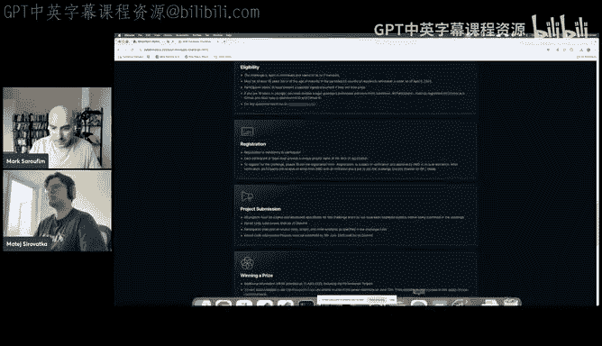

Specifically here like in central， there's going to be like a different like new leaderboards get added。

 for example， we started like a test leaderboard for like an identity kernel but like in a few hours you should expect to see like the F gem kernel show up here and then at the various release date we're also going to have the few MOE and the ML sorry MOE and then MA kernels。

So the experience is going to work like very similarly to the way you already made submissions before。

 so you're going to say like leader board submit benchmark。

Let's say here it's going to be the AMD like identity kernel and then like GPU and then you say am my 300。

And then the leaderboard name and it's going to be like AMD identities so it's like a very similar experience we used before and here we expect the gold starts to be on the order of like five to10 seconds you'll get a Github like workflow here that you can check in and you can see like the status of your job like along with like the artifact so basically like what was the like results that you got。

😊。

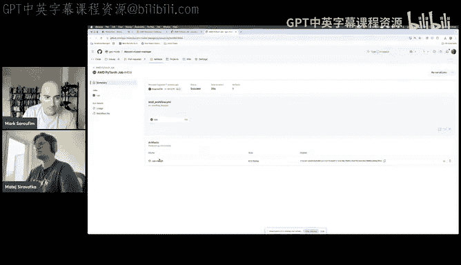

So for example， if you go here， you can go in and see the run results and download them and study them and you can see like if there's any issues with your job here。

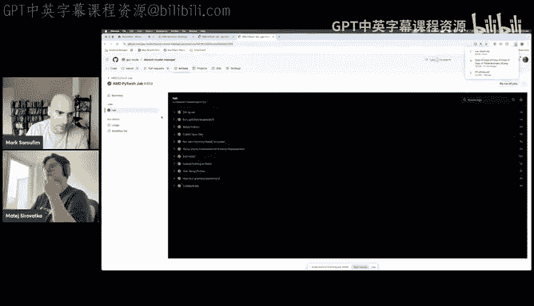

We also sort of took feedback like basically a lot of people while we do have a lot of people on the Discord and a lot of people really enjoy coming in to see like results I can submit directly in Discord like a lot of people are asking us for like a CLI like experience so we've been testing something in our in our server like as a sort of like alpha release but effectively like here maybe I'll just give like a live demo here let me take it up curor。

😊，Yeah， I can do that it's actually working。😊，Okay， wonderful yeah。

 so basically you no longer have to use our Discor channel and you can just like make submissions like within like your favorite like text editor so yeah。

 please go ahead。😊。

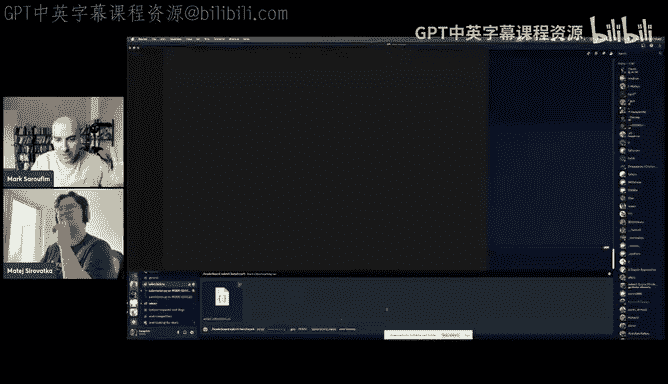

Y so。How I do this Yeah， present。As you want to present them， it's like the middle button。Good。The哎。

And I hope did I stop it， either there。Yeah， so let me dragon， a shared screen。我星歌。

So you can see my no now， I would say。

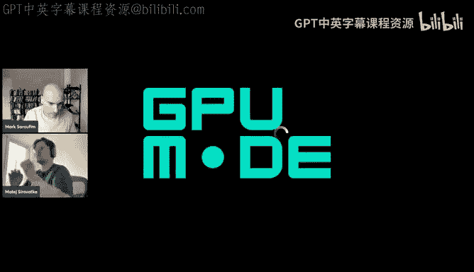

嗯。😊，And I hope it's going to work so the COI is bit rust and it's a really simple COI that will basically in the end it supports a registering。

😊，Or reference string through Gitthub and De， which currently is not。Take this。

This is currently the feature that we have issues uses。To make work， right， but except of that。

 you can now test it locally。And the submissions are going to be are not going to be recorded。

 but they're going to work so how you can do it is just basically do submit and a path to a file which you want to run so for example。

 al map Mo5 is a file that I have。And these are the kernels that we currently have on the main boat。

 so let's see we can do metal。And whats do on T4 and what's do a test。

And now it's going to away it's going to submit the solution to our and that one is going to evaluate it all of them are supported like we support now benchmark yeah here it is and it's been run on。

It's been run on T4， what you can also do is also run a submit。With current employee。

will be recorded under item provider user because we're fixing authenticationship and you can do it to submit to a leaderboard and it's going to be there we promise we're going to mark the users to the correct one or allow you to resubmit afterwards。

😊，And now when this finishes， it's going to take a bit longer because it runs all the benchmark sharks。

And when this finishes， we're going to see the submission on this spot， which I'll share afterwards。

Yeah here it is， so we see all the results it's adjacent so you can just view it in whatever editor you like。

And let me。I'll move this。Yeah， so for what it's worth。

 like I've been using this like new feature a lot。 Like basically。

 I'll just be like in my regular editor， like cursor and then with my terminal at the bottom。

 And then every time when I submit something， I submit it。😊。

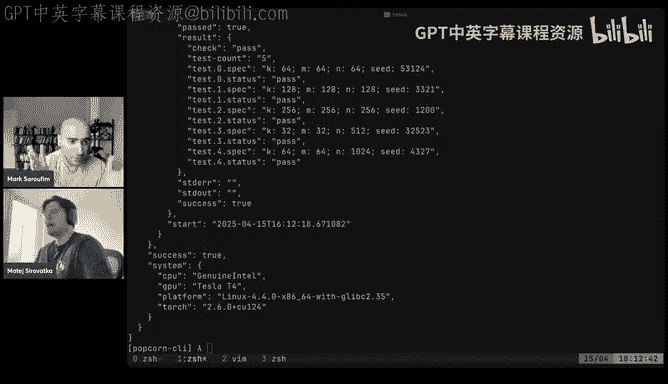

So I can keep changing my code all updating as has been like significantly more convenient for me than attaching files and Discords。

Yeah， and this is going to show you the user is not going to be linked to your difficult user because currently the authentic as I said。

 is not working， but we're going to support that and you can also submit from the CI which is going to make the developer experience a lot better I think。

😊，We also have a few nice speaker that we would like to show you。One of them being a website。

 many of you complained about or not complained， well we did and really like the Discord way of showing things。

 so we now currently have website which I can show you that was made by Ben and one other guy that has named that I can't pronounce。

If someone， if Mark could give him credit in chat or。Yes yes， yeah。

 so this is GX T and GX so he was the person whod also donated the websites to us like we're very grateful for him。

😊，Yeah， so this is the website is rightside ondomain GP。

com and it's going to be basically a central place for all of the stuff take can you zoom in a lot？😊。

哦， yes是。W， but this is not going to get pretty， but you can see it now and it's going to reside on GP。

com and going to contain all the info about leader reports。😊，Which currently， if you want to。

 you can click on them see a lot of the like。Info， what's the reference implementation。

 what's the description， language， the best submissions， etc。

So I hope this is going to make DO experience a little better as well。And also。

 you can visit the official GP mode resources and lectures from this。

And another thing we have added is a thanks to Eric and GC 92。

 we have a totallying new like interface of how to submit。

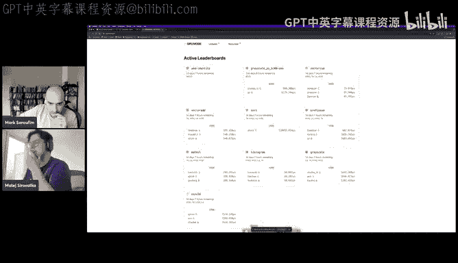

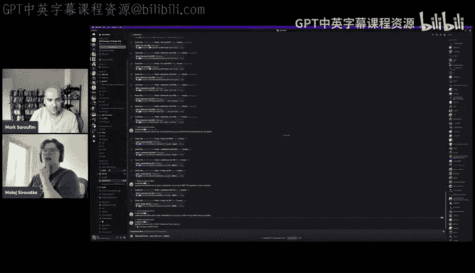

And。I'm not sharing this for biing， right？

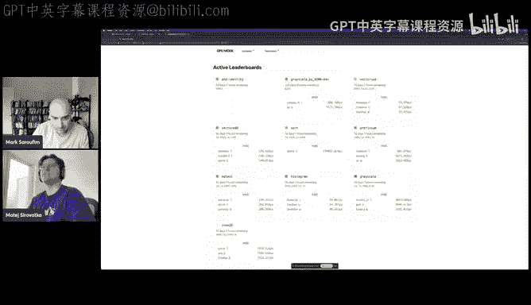

Youre't sharing your whole screen， actually。Oh， it was working correctly。Yeah， so if I share it now。

 you should see that we have a what pattern， we have a messages that Eric actually has not tested now that if you end up on a first second third place or whatever。

 you're going to get a nice message and also。

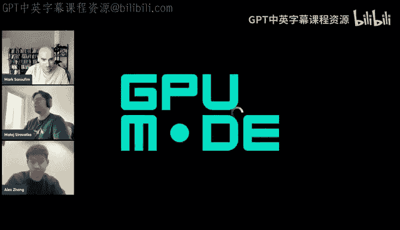

So have， could you throw in a bunch， please， Your response。 Oh again， Yeah， sorry， sorry about this。

 Yeah， here。So， if we。The submitubmit now。 And let's say， we want to submit to。

Matimo and what treat view what's it for。You're going to see AO the better UI that also actually works for Github runners。

 which will be supporting the AMD competition。And it's going to be running on MI300s。

The whole competition is specified to be run on MI 300。

And yeah let's wait for this so you can see the message is getting like progressively updated and I've got a third place' so good and you're going to get a yeah you're going to get a nice thread which will show you all the info before and it's not going to make the submissions channel this ugly as it was doing before。

😊。

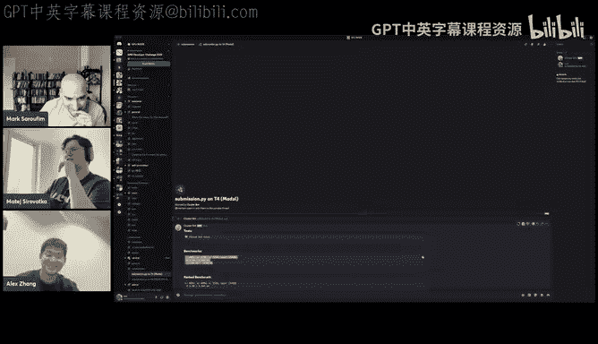

And yeah， so so so so so as part of this for us like we're sort of like playing around with like different like achievements or like things to give people that like win competitions so if you have like any feedback for us what to do here like let us know。

I see one question from the chat from Verranci is like debugging an MI 300 on the server possible Okay。

 so the main challenge here is that like it's actually very。

 very challenging to have a competition like let's say with a few hundred people where we distribute SSH keys like very broadly。

Just that we want to know how people are using them wisely or not and so we're mostly relying on a job queuing platform with kernelbot and you can effectively run as many jobs as you want and we won't rate them and you like just do whatever you need to to sort of debug things interactively with like this like five second like。

If if if you still like， I will say there's like one caveat to this。

 which is if you're doing really excellent work， like basically you're very prolific in the server。

 your kernels are very good and you basically would really like that but like full of stage access to a machine for this competition and other projects。

😊，Please tag powder love on the channel so that's aoe shes very popular on Twitter as well and he can like' help you help you get set up but like fundamentally I think for us we're mostly relying on a Q platform where the assumption is if this cold start time is short enough that that's fine。

Yeah，Yeah， I think that wraps regarding the infrastructure like meant as you as you've seen the enterprise。

 not in the best state because depacking it is really difficult。

 but we're going to ship updates hopefully really fast and we'll have something。😊。

Dana and I like to hear talk about the kernels， which you're probably most interested about。

And about the competition as a whole。Yeah so I think for those of you that aren't maybe aware of what the kernels are they're public now or roughly like what the problems are。

 but this competition will consist of three kernels all of which at the moment will be for single device so you're not going to have to worry about dealing with distributed comms or like that kind of stuff but they're all kernels related to deeps or deepse V2 or V3 so the main ones or the first kernel that you're going to be doing is the FP8 blockwise gem or I guess it's actually just a mapmal。

And so the details for this will be released very shortly like all of the details about it so like we will have a very nice problem right up both in code like like a Pytorch reference and also with some math if that's what you prefer and maybe some diagrams and stuff too and that will be running for the first roughly two weeks so originally we actually had it where we would open the first kernel and then we would close it and open the second kernel but we talked about it and I think we actually decided that we're going to let people work on the specific GPU kernels throughout the entire competition but they're going to be staggered releases so the first two weeks are roughly going to be dedicated to the FPA Blackwise gem the second week is going to be the MOE kernel if I'm not mistaken it's going to be a fused MoE kernel。

U。And the last week is going to be the multi head late in attention so there will be more details about these as we get closer we don't want to release too much obviously because we want to give people time to focus specifically on the kernels that they that are active for the week and so you also don't have to like context switch a lot between different kernels。

But specifically actually you might have some questions about what multihead lay in attention with rope will actually look like because there's some finicky things with like the Kv cache and like how you're actually going to deal with this so we're not going to release this information yet but as we get closer you will see this more and so all information just like the previous competition all the relevant shapes of the end the distribution that the data is drawn from for all of these kernels is going to be public so you can tune your kernels specifically for the shapes that we kind of care about I think the way that we're scoring or runtime right now too is a geome of all of the like the test cases which is slightly different than what we had before it might make the waitinging a little bit better as well。

And yeah， I think that covers most of the the high level stuff for this competition。

 maybe I can leave a little bit of time for questions before I talk。More about the FPH gem。

 which is what you guys are going to be working on first。

Yeah so so just to reiterate like basically you can sort of expect like most of updates of like when the next kernel to be released like you can go to the AD competition channel we have on the server for updates the GPU mode。

com website that like Matt showed also will have like details on the kernel like I think Ben was working on mathja support if we need to allow the reference kernel to input like pretty much everything thankfully this time seeds are now private so basically those are now stored in our database so you can no longer see。

You way， but if you find another hack， you know， please let us know。So yeah。

 you know without further do yeah Alex please please go into the math stuff Yeah it small thing actually sorry to jump we've got a message from one of our friends at AMD and saying that if you will need the Tp use to debu stuff or anything just let us know and we'll try to provide you some so。

😊，Yeah。😊，嗯。I could so there's two ways I can go about this。

 I can either just talk about what the F gem is going to look like or I can share my screen and we can look at the the official kind of problem description for it I don't know maybe let's through the screen share I think it'll be more valuable okay。

嗯。It's in the middle there's like a present button with like with a edition symbol， I see。Here。

 let me open this。That。Too many jobs。Okay。Share screen。Here we go。Okay， is everyone able to see this？

Yes， okay unfortunately it's on notion we're going to move it don't worry we're actually probably this is why Ben is working on the math check stuff this is all going to be on the GP mode website but yeah this is kind of a work in progress thing。

So lot going on here， I don't want to scare people too much with all of this， but it's actually very。

 very simple at least for the first problem so the general idea here is I think you know maybe some of you are already familiar in most kind of deep learning applications now people when when they train their models they like to train things in lower precisions there are a lot of benefits for this I think some of the more obvious ones are you store less memory and you can take advantage of the faster tensor core instructions for smaller data types so。

I think it's relatively well known that like float8 is kind of considered the edge of like what people now call quantization and just like what is considered low precision training so deepse for example chose to do a lot of their operations as weight eight activation eight which basically means you quantize both the the weights and the activations to8 bit instead of doing some weird like extra tricks。

 there are lots of things you can do here， but this is one of the more I guess simple ways to do this。

So the name of this kernel is FPA8 gem but it's actually not really a gem it's more of just a matrix multiplication。

 so this is actually the kernel that's implemented in deep gem which is one of the five libraries that deepse open sourced a few months or maybe a few weeks back I don't actually remember。

And so this problem is actually very similar to what is already implemented in that library。

 but obviously that library is specific to kuda so the general idea here is you're going to be given。

Two matrices which is your A and your B which you're going to multiply you're also going to be given two scaling factors and i'll talk about that a little bit because's it's not super clear what exactly this means。

 but these are also tensors and the reason these are tensors is so these decoquantization factors are going to be in FP32 and your low precision matrices are going to be in FP8。

The decoquetization factors actually get applied to like it's one scalar for every like 128 by 128 block at least for the B matrix and so this ends up looking like this kind of weird tensor that gets like broadcasted out and multiplied onto your matrices we have an image below that might make this easier to understand we also will provide you a C matrix which is basically just the output matrix that you can write to so you're not going to have to like allocate any extra memory for any of this problem the other guarantee is that all of the input tensors that are provided will start on on device HBM so you won't have to deal with the CPU for any of these things。

We also are being a little bit niceier where the shapes and everything all kind of divide out nicely so you're not going to have to consider weird edge cases with like odd sized shapes or like unpleasant kind of casework so don't worry about that again all the shapes are going to be public so yeah。

And specifically also the input tensors are going to be E4M3 which for people that don't know it just is how which bits get assigned for exponents and which bits get assigned for dealing with fractions also similar to the deepse library everything except for the output matrix is going to be assumed to be stored in column major order this is like the Nt format I guess that maybe some of you are familiar with。

 but just to like be explicit here like the a matrix will be n by K and the B matrix will be n by K and those are both column majors but when you multiply them you obviously have to transpose the B matrix so the B matrix is actually in kind of a convenient order but generally the reason why we do this is when you write your mapmo you're going to do some kind of tiling and you're probably going to tile over or you're going to loop over the K dimension and so you want everything to be contiguous in a nice way and it turns out this is。

Kind of the nice ordering to do it。I think we're going to keep it this way also because this is how these are the specifications that deep gemm have if for whatever reason people have issues with this。

 you know， let us know like you know we love to hear your feedback but we're just kind of following what the standard is here。

嗯。Are there any questions or？是个。Okay， I will continue。 So like I mentioned before。

 these scaling factors or you can think of them as the decoquization factors。

 So normally what happens here when you when you when you're running your neural network and you're going to do this like FPHM。

 what's going to happen is like。You start with your like FP 16 or FP32 tensors and then you're going to quantize it down but obviously when you quantize it down you're going to lose a lot of information so usually people will store or like try to store some kind of like scaling factor that is like in less memory so like it might be smaller and it might apply to say the whole matrix or it might apply to like a part of the matrix。

But this thing is going to be full precision and everything else is going to be low precision so this is like a very similar thing we just take out the part where you have to do this yourself we're just going to provide you the constants that you're going to multiply out。

Again really simple all you're doing is basically a times B transpose and then also multiplied by the scaling factors to make it clear where the scaling factors actually get applied to make it easier for yourself。

 this is the diagram that you should look at so basically like the a scaling factor which is alpha and the B scaling factor which is beta get applied differently so keep this in mind this is how deepseed it as well but the a scaling factor like let's say we take the first scalar in here which is at00 this gets applied to the first 128 elements in a row in a and so if you notice the every single element in the rows of alpha also mapped to an element in the rows of a but they kind of mapped to multiple elements in the columns。

And so this is like a， you can think of it as like。

Alpha is just like a squished version of a along the column dimension or sorry along the row dimension。

But。For the B matrix it's maybe a little bit more intuitive you basically just take out a 128 by 128 block and that gets assigned one scalar value and you kind of like tile this over the B matrix again if this is unclear to anyone please just ask now because this is probably the maybe the most confusing part about this setup but everything else is like very very intuitive you're just writing a mapmal in FPA essentially。

しゃ。Perfect， okay， as long as I mean， you know， we'll be happy to answer any questions people have about this during competitions as well。

 So don't worry like。😊，You don't need to be afraid of like hiding your solution or something like we'll be there to help if something is confusing but yes。

 this is like kind of relatively standard for blockwise gems or low precision blockwise gems so but this is just specifically what the setup looks like。

And again， this diagram was made by Shaar from MD。 So you know。

 thank you was I think I think it's a very clear and illustrative diagram of how to do this。

 but yeah， and so we also provide the code version of this if this is easier for you to read we also have this as our reference kernel so don't worry like it's not just on this document。

😊，But basically。Like I said before。Oh， we initialize A& B as FB8。

It's not clear here because Pytorrch does everything in row major order。

 but these are actually going to be given to you in column major order so the way that we do this is we initialize the transpose and then we transpose it and we give it to you so it's not contiguous in memory like it's not considered C continuoustuous but you can it'll be a lot easier for you when you implement your kernel and very simple like we do this kind of it's confusing but this is basically just broadcasting the tiles the scaling factors for the alpha which is the left hand side beta for the right hand side and then we basically we dequantize it first so you should not dequantize it first the reason we dequantize it first is it's easier in ptorrch because there's some like FP8 gem stuff is not always available but when you implement it it's obviously a lot faster to do the matrix multiplication。

And then apply the scaling factors， so this is just like it's kind of an obvious thing to do。

 but just to make that explicit because the reference doesn't do this。

 but you should be doing the FPHM itself before doing the decoquization。Yeah， so yeah。

 another thing here， the note about it being in call major order。Yes。

 so the last kind of thing that we provide to you here is the shapes that are going to be run during the competition so these were selected by AmD for various reasons they're going to be fixed so they're not going to change and they're going to be given to you like you know I mean they're here we also are for this kernel and for the future kernels we're going to give you a lot more information about like speed of light analysis so like roughly you know how far off you are from the theoretical optimal and this is also related to the kind of the grand prize I don't know if Mark did you talk about how that's scored or yes so just concretely folks like the way we were conceiving of this was like as we're picking like basically the number one number two number three entry the way it's going to work is like basically are you the top ranking person but just keep in mind that if your code is slower then。

Our Py Georgiaia baseline， you're going to get a score of zero because like again。

 like I think it's already hinted how poor like we we basically didn't write like particularly good baselines on purpose just to sort of keep the meaning of the kernel as simple as possible。

As far as the grant horizon it goes。The the way this is likely going to work is that we're going basically you know you have three kernels and we're going to look at how close you can get to the speed of light on an individual one So the grand prize is going to be sort of parallel to the to the regular like competition of like the three kernels So like if you're like the kind of person who just wants to hyper or optimize like one thing and go for the100 k we like strongly encourage you to to do so Yeah and then there was a question in the chat Yes so this code is not using。

😊，It's not even doing an FPA gem actually if you notice and it's not using the Tensor course so it's kind of the point like the reference is just there to give you a starting point and it's a really bad starting point。

 but it's also a reference for checking correctness to make sure that your kernel it should match up with this implementation but yes。

 you should be for you know the competition you should be writing your own kernels that use whatever kind of like systolic array hardware units that are available on。

On the AMDG。And yes， this is actually， I think the the the end of it， at least for for this problem。

 So we're going to be providing this information for the the other problems as well。

 I also want to be clear that。FPAG will probably be the simplest kernel in this competition just because like it's basically an operator with some extra components that aren't like maybe you're not used to but for some of the other kernels you're also going to be given weights because it's their model operators and so you're going to have to load in the weights and compute some kind of operator over that and so they might be a little bit longer。

 but the nice thing too is that they're probably even more unoptimized。

Then some implementations of FPHM so there's a lot of room for optimization there， but yeah。Al right。

 any parting thoughts or should we start concluding folks。So okay， maybe I'll start completing。

 So those were context folks like registration is open until April 30th。

 so that's like about like two weeks left。Keep in mind you can still participate and submit your kernels you just won't be eligible for prizes unless you register and since it's kind of like a big sum and it's like high profile enough that like you know we hope like this would be really worth your time we you know like our goal here was one to make sure that the price pool was like respectful of people's times that like if you spend your time building something say to the art that you get rewarded for it and the other is that the kernels are actually commercially useful like the idea here is that like all the winners。

Would be kernels that we would expect to be integrated in the vast majority of like in a Prince library so things like VLlum is Jang like and so we have like partnerships with a lot of like those scenes and so hopefully like this really makes this competition worth your time。

Even if you don't think you can win， I would still encourage you to participate because typically competition sort of bring a lot of focus and youll learn a lot concretely if you want to sort of participate and again you don't need AMD GPUs to participate。

 go to our Discord channel go to the AMD a competition channel and you can like get all the updates you need on how to submit whether it's via Discord whether it's our GiHub CLI。

 you'll get the latest updates on kernels being released and it's also a discussion channel so you can like use it to ask questions to us the moderators or other people that are participating in the kernel so yeah again remember that you can form teams of up to three people so try not to do this by yourself it's more fun with friends。

And you know， we hope you have fun with this。Like Mattay was mentioning earlier。

 we'll have like a first set of like meaningful updates in a couple of hours today just to make sure and we'll basically be sure to share with people yeah so like as far as the link goes folks。

😊，Is just going to be the GPU mode， so there's no AMD， the score it's just artist scored。

So go to the Discord channel and like again look at the AMD competition channel and you'll find it so yeah if you have any questions you can always tag the moderators or attack myself serifphi on the Discord channel and we're happy to answer any questions you might have。

Okay， I think without further ado， maybe now's a good time to close on this unless any parting thoughts withtey。

 Alex， are we good。Yeah， I think I hope you'll enjoy the competition and we hope to see some cooler from all of you。

Yeah，Yeah， good luck folks on and make sure to have fun to you guys soon， by bye。

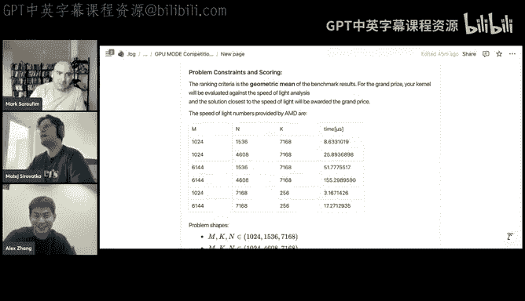

拜拜。