# GPU MODE《CUDA、GPU编程1-53课｜GPU MODE》中英字幕（deepseek-v3.2 - P57：-20250419-Lecture 53_ torch.compile Q&A.zh_en - GPT中英字幕课程资源 - BV1QZ421N7pT

Oh。Okay， I it seems like we're live。 I can see it from my laptop。 Okay， so yeah。

 welcome everyone to another like episode of GP mode like today I'm really thrilled to have like one of my colleagues like Richard Zhu from the from the Pyrus compiler team giving a talk that's really about really any questions you might have on Torch compile。

😊，So Sir Richard left like a like basically like a Google form on the channel so if you have any questions feel free to drop them there we'll be going over some of the like most interesting questions there and also if you have any other questions you might have like just feel free to post them right ear in chat and then we can like read them through So yeah I guess Richard please take it from here That's good Thanks Mark hi everyone I'm Richard and Pi entire team yeah we're doing a Q&A today I drop this form。

A couple days ago into mode， sorry QP mode this word。

 and I'm going to go through the top six questions and answer them。😊。

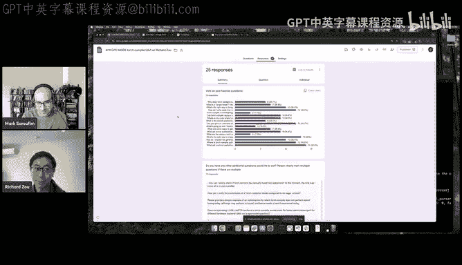

嗯。Goe free to just like stop in the middle like if nots questions in the chat like in the middle if you guys have additional questions I think the format of this will probably be like I'll just go through these questions for like the first like half hour or so and then like we could spend the rest of the time just focusing on like any questions in the comments。

😊，こうあそかる。All right， first question like we got was like what are some common performance pitfalls switch pile？

And this is like very related to another question we got。

 so I' put question together like how do I write code that is easily optimizable by Torch file。😊，嗯。

I highlighted some things in here， there's a lot of things I can go wrong with To compile。

On the front end side， like there's a thing called F graph to goes through by default。

 torsion pile tries to compile your like looks at you saw sort of pile in a function。😊。

Trschementpi tries to find parts of your functions that are like straight line code that it can pass to its backend。

So given a function。Let's do。Coage。Okay。哦。If you do like。Some operations。

 then maybe you print Y and then you do like some more operations。Returns seat。

And we're going to compile this function。What ends up happening is that like Token P will find the first we'll create two subgras。

The first subgraph will just have these tensor appss in it。

When toal policy is something it cannot handle like the print statement。

 it will just do a graph Rick。😊，So it'll stop recording the subgraph。It will compile and execute it。

We' do to print operation。And then it'll record and execute a second subgra。And。吔屎。

And so this is a feature like built in torch compile like you can put torch compile almost anywhere and it will like do something。

But like it's important to like understand how this the performance drawbacks so whenever there is something like a graph break in the middle like when there's a feature of something that toroophil does not support like torcoophil breaks to code into two different graphs there's some overhead associated with this that's the first one。

😊，The second part is like when your code is split into two。

 like if it was were possible tofuse things before and after a graph break together。

 all to pilot November can。😊，Because if two things are in different subgraphs。

So the first thing is like。One performance fit is too many graph breaks in your code。

 If you have graph breaks， Then sometimes for performance can be bad。

 like due to your additional overhead or。Due to the overhead or just sortile not being able to optimize across。

The subgraphs。And。In those cases， like what we recommend doing is just eliminate your graph res。

 graph print statements， remove them if you do like fullal screw。😊。

It'll actually talk will actually tell you where your graph ratess are or it will air out when there are graph breaks。

😊，嗯。That's the first part for the front inside the second part for the front end side is sometimes like people have a lot of pre existingisting code that have custom operators in it just third party of your custom kernels。

😊，And if your code is just all like calls to custom kernels then there's nothing for torch compile to do like Toal compile willt poke into the custom kernels won't do anything。

 so usually the way people go about it is like instead of just trying to torch compile like a function that only calls custom kernels it's sometimes better to rewrite the custom kernels with native Pdge operations。

😊，And then lets or compile， generate code for them。That's the first gofall。嗯。Yes， Mark。

 I see her back。Yeah。Mark， you're mutita if you're trying to say something。Oh sorry， yeah。

 so one thing I was curious about asking is like sort of a contiumnuation of like an offline discussion you and I had。

 which was like like why is it hard to optimize things in a black box way。

 like what is how should people think about like what is really a custom operator like why is this API like important and for context like this is all fairly relevant to people in the server because they just spend a lot of time writing custom ops but like some maybe more depth first stuff might help motivate this？

Sure I just going to talk about custom operators two questions down the line Okay let's hold that question free later we'll talk a lot about custom operators Okay okay sure sure okay go。

啊听。All right， so that was on the front end side。So for other performance kind falls like on the back end。

 when you're calling torchfront pile， like it just does something by default。

 there are a lot of options you can do to tune the performance。😊。

You can like pass in mode equals reduce overhead to torsion file to activate codegraphs。

 this is on like a fewPs。But this basically it uses like the crygraph feature。

 Cgraphs is a feature where。😊，WeWhen you're executing kernels。

 we just record the execution of set kernels and then just once and then we replay execution on the future runs。

 and this basically just reduces like kernel launch overheads。

The second thing is auto tuning Toral Plow is able to autot your programs just like how try to like Tri and kernels have auto tuunning。

 but autohoing is like is for Torsal pilots that they'll try to generate like a couple different kernels like for your code。

And then it will pick the best one。Downside is compound these kernels like tri and compilation can take time。

 benchmarking kernels can also take time。It's on the back inside。嗯。

Aside from the front end and back end things， like one other thing to watch out for is recompilations。

So when you are like when you do this tor compile， like torque compile is a J compiler。

 when you run it go compile， it may recompile when it decides that something has changed。

Common reasons why something might change is like。If you have different shapes by default。

 like per compile like is mostly static shapes。If youre initiate shapes that your input change。

 you will recompile。If you're using some， I don' know， Python。If you're passing an inte in here。Okay。

And you're using in your expression。Then if the interioror changes。

 we will also recompile it's important to like。Keep track of your recompes like sometimes like if you see bad performance in compile。

 like maybe you're having too many recompilations， maybe the answer is you want to use our dynamic shape features。

😊，Yeah， that's first question， coming to falls with Torch compile。Moving on。

I don let's go to the custom kernel business first before I talk about where torturepa is going。

 since Mark got the question。So custom kernels， I actually gave a talk at this at PTC and I think I'll just go over to talk here。

😊。

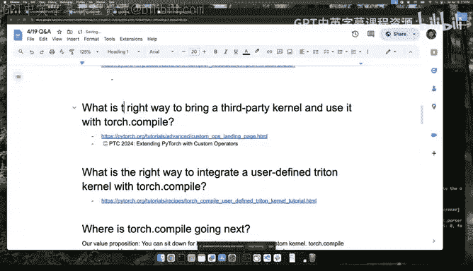

Also， I will link this doc somewhere from the this talk is public I'll just link her from some operator presentation so you guys can come and revisit everything。

😊。

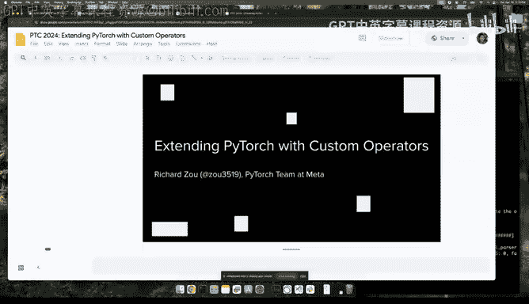

Alright。Cool so。The two questions we're going to answer now is like one。

 like what's the right way to bring a third party kernel and use it with torchment pile？

I'll tell you a bit about also how torch compile treats it。And the second question is like。

 how do you bring a user defined Trident kernel and useF Torch compile？

Usually the fine Tri kernel is just a really special case of a third party kernel。😊，个。

Going through this a bit on some definitions， you' got a kernel， what's a kernel。

Colonnel is a function that performs some computation that using raw data pointers。

Like you can write kuda kernels like using people using Kutuda Cus is this like library for a writing。

Curier kernels more easily other Python libraries might also like。

Can be considered to be kernels like they just call out into routines like Python pillow is this package had just some low level image routines。

Nly like technically Colonnal Library as well and also the trend kernels as I mentioned before。

Operators。We call something an operator， an operator is like this kernel and then some glue code that tells T search about the computation。

And when you're bringing a custom kernel to Pyttorch， we ask said you write a Pytorch like operator。

 we also said you write some glue code consult help Pytch about the kernel so that it works with Pyr subsystems。

There's you'll have to write an operator like you just write a kernel and Ka。

 you can pi it into Python you can call a kernel and sure itll just work like you pass kernel a tensor。

 it takes a data pointer it like goes up Py churchch does not need to know that you're doing stuff with the data pointer。

 but。It's nice to tell PTurch about this information， like for example。

 you can wrap your kernels in an autograd function that is able to produce autograd support。Okay。

 which I want to talk about here。So when you are writing a custom kernel。

we there's a bunch of different ways to write a custom operator。

You can write a custom C+ split Scooter kernel， you can write like some Python library that calls Als of these kernels。

And so like you can register a custom operator。With Pythrch in either C+ plus or in Python。

So we'll go over like the Python based APIs first， like this is the。

What are we doing This is pillows crop function I don't know why I didn't import pillow here。But。

Got a crop， pick some some tensors， a tensor and the box that you're cropping。

We are going to convert it a pillow image to the crop and then return back to torch huntser。Okay。

Yeah。And this is how you have written it as a Python function。Turningurn it the custom operator。

 it's pretty simple to just slap a decor on it。Slap decorate on it， name it。

 tell us if you're mutating any inputs or outputs。To get this to work this crop operation。

 to work with George from Ohio。Tva needs a little more information than regular eager mode Pytorch。

So like previously， like this would have worked with E Moon Pytorch without Tor pile。

 this would have worked with E Moon Pytorarch without Vi P lighter。

 to get torch up and compile to really understand your custom operator， you need to tell it。

How to propagate input shapes to output shapes。Sot from compile does this thing where it traces your code。

V without actually executing your code like it traces your code with input shapes pretty some output shapes and。

It does not to create a graph premier code。And so you need to teletortion power like given these input shapes。

 like what does the output shape look like？That's all really you need to do to teach for a file about a custom operator。

 the same API exists in C++。😊，Like you can define a custom operator。

 you might have your custom like some fast crop operation here。

So the sequence of operations is define the operator。

 then write implementationation for it and registered implementationation。

And you're also able to register like one of these pay kernels。

 or we also call them meta kernels for these custom operators。Okay。

 I'm going to pause here and go back to Mark's question around custom operators when To compiles sees a custom operator it treats it as a black box。

 it treats it as a some opaque callable， Tor compile will never try to reach into a custom operator and optimize it。

The reason being is Tof file just doesn't know how to optimize your custom operator like you write a coder kernel To cannot recruit a code the best thing can do is just sort of execute your coder kernel。

😊，And so torcoologist never looks into your custom operator。This is also like a useful feature。

 sometimes you might write code that just。😊，Ist very tor power friendly。And you can just。

 we have cases of users just encapsulating code that is not for friendly in a custom operator and PerPo will just execute said custom operator as is。

Mark， are you there， I want to ask you like， if that answered your question or do you have more follow up？

No， no， it does， but like it was more to just think of people like like contexts here， but yeah。

 this was helpful thank you。个。So we've been talking about like C++ Python kernel kuta kernels。

 now I want to talk about Trident kernels。Here's a available， you're write a trident kernel。

 it will just work with a switch compile。Through some magic and。

The magic is when Tormophil sees the Trident kernel， like Totraophil understands what Trident is。

 they'll see the Trident kernel， and then they'll automatically just like shove a black box like note into a graph that will eventually call the Trident kernel。

😊，So when I say that talk about about works of trident kernels， it works of most trident kernels。

There's some trainingdent features we don't support for example， like there's there used to be like。

There was experimental host site TA support in Trident。

 we did not support that like I don't know around half a year ago and then we added support。

But ultimately like。Crident will end up releasing new features。

 which I compile will make sure it understands them。

It's sometimes a game of catchchup but we support we aim to support most Trident kernels in Dom pile So you're saying earlier that it's like a black box and if it's a black box wide you need to play this catchchup game at all。

 it sounds like a white box then to me Yeah， so there are some interesting things here。

 the the actual body of the Trident kernel is a black box。

The real problem is like if you're doing like Trident APIs or not just writing the Tri kernel。

What's an example？So one example is the hostite TMA stuff。

 like the wholeite TMA itself if you have to actually write some like code outside of this trend kernel。

That just sets up the TM and then you pass the TA into the kernel itself。

 so I think the kernel can reference it so the setting up of the Tma like Church pile sees it it's some Python code that is outside of the kernel body。

😊，That's one example another example is we didn't use to support auto tuning so roughly how torron compile handles tri kernels is that it copies。

 paste the source screw and shoves it into the code that tor compile generates。😊，For context。

 certain file actually just generates training kernels like with on Kuda devices。

And so like with auto tuning we had to we didn't want to like copy paste the try and front lift auto tuneune and shove it into the induct generate outputPA code and so we wanted to leverage inductors like auto tuning like。

Infrastructure is actually due to auditing freeside kernel。

So we didn't support Trident not autoune for a bit。

 like the way to support it was we taught like our backend inductor like， hey。

 like we're actually auditing the Trident kernel。Um。

 and so like you need to take auditoring decorator。

 delete it and then like replace it with your own auditoring decorator。

So To ballot treats regular custom operator has a black box。

It does try to peak a little into Trident kernels。The autout signning was one example。

 there's another example， which I think is interesting is first of like。😊。

Needs to be able to functionalize。All of its operations and all of the all the custom operators like any black boxes it sees。

 they need to be functionalized。In order to functionalize something like a Trident kernel。

This current kernel， it takes in some inputs。I didn't mut some of them。

And so To Val needs to know what inputs are being mutated。

The way like so back in custom plan so sorry to keep going like like all of your inputs and outputs are pointer so pretty much everything is mutated by default so you mean mutated no more than once。

😊，Yes， so try to kernel like so that kernel for example。

 it will read from two of the pointers it write one of the pointers what we need to know is which one it's running to see it does not so we don't actually write to all three of these we only write to that out pointer。

😊，Um back in custom Operaland like you tell us what you're writing to like what your kernel rights do this is important for2pi to like know how to deal with your custom operator。

Or trying Colel， we decided we didn't want a， we wanted a design where。

You didn't have to give us extra for information about the Tri kernel for us to actually support it。

And we end up actually parsing like the Trident ASD like we use like some Trident internal utilities to parse。

AST， and then we analyze AST for like if there is mutation。

So we'll actually analyze this kernel and determine that only the al pointer is mutated。

And use that information during functionalization。If we cannot figure this out。

 then what we end up doing is we assume that all pointers are mutated。

Sometimes like this can lead to issues with our punization pass。嗯。When we functionalize something。

 we need to like defunctionalize it later on an inductor and sometimes。We don't anything like the。

Functionalizing them and that causes issues， which is why like we have this path to actually determine like。

Exactly what inputs are being mutated。Excellent， yeah， sounds good。こ。

So that's a gist for custom operators like。Try to custom like you need a custom operator like use a custom operator API either in Python or in C++ to get your custom operator to work with Torch compile for Tri kernels。

 yeah， they just work。You can also sho your training kernel into a custom operator if you really want。

 that hides different tor file， but so the reason why you would put a tri kernel into a custom mop is if tor file didn't support the features of the training kernel。

😊，Okay。All right。That's what everyone wants us to say about third party kernelels and Trident kernels。

Yeah。嗯。Yeah。个。Moving on。啊。Another question we got in poll was， where's social pile going next？Yeah。

And this is probably not going to be too long of the answer。

 but the value proposition for virtual compile is that like ease like your can sit down for hours。

 days or weeks， just tuning a specific custom kernel or just like making one model go really。

 really fast。😊，And the value proposition for Torch Comp is that it provides some good baseline performance。

 so you don't need to like sit down for hours， days and weeks to tune your custom kernel。😊。

UHow much value torch compile is like probably proportional to like how how like close to optimal like torch performance torch compile can actually give you。

😊，So what's on our roadmap？Sorry， I's actually put a link to our roadmap here。て。

I'll do that after the session， but on a road mapap。

 obviously just continued performance improvements。

Like we want mammals to be really fast you can call Tor shot MMm but Tor M like all of like pie purchaseches like earbu mammal APIs or most of them is called a Kubos and Kuboss is like no longer a passive mamo out there sometimes。

😊，Like C less has mapballs like for like various like be types like you have like some really specialized mapm kernels。

Um we want to just keep on improving like virtual compiles like performance on generated map holes like for newer hardware like the new black hole gs as well as。

As well as different types of hardware， like A DTPs。In addition to performance。

We've been told a lot that Tor compile is one difficult to understand。And two。

 like sort of difficult to use。Like the impression I get is that some folks think that church and pile like it's great when it works。

 but but it doesn't work， they just can' use it。And so what we're aiming to do like for tortpi is add better error messages。

 add better escape packagees， and add better ways for users to interact with Topi。😊。

Such that like if virtual file doesn't work， then they should be able to do something to like get it to actually work for them。

It's like having a programming language like。Here is a writing code and I don't know if there's like a bug in a compiler you just work like if there's a bug in a GCC。

 then you just work around it by just not using some compiler feature that is causing compilation error。

😊，嗯。After that， compile time is really big for us。Like people compared torch compile performance to just eager one performance like torch compiler is the strict compiler compile just in time like Trident。

😊，W you sort compile if like eager mode like is fast you know for you so like like eager mode has zero compilation overhead like zero just in time compilation overhead U compile has some just in time compilation overhead it it's really important that that compilation overhead is low to us and to our users。

😊，So we're experimenting on like we've been trying to push down copilation times。

 so we're also just experimenting with like a new precomp API。We're used for compiles。

 here sort of ahead of time， compile a model。And then cache time model so that it will just run really fast the next time you run it。

Yeah。Yeah。Finally， the last thing well they're solving on our roadm you'll see should you mind if I just pat a few questions because we've got already quite a bit。

 yeah， so on compilation time performance like I've generally seen the discussion be around like it's always about warm starts but like my sense is like cold starts is actually like a more important problem because it solves both and also yeah it solves both essentially。

😊，Um， what are the sources of overhead that like people should be aware of， like basically。

 why do things take so long because I think some people might be familiar with like auto tuning shapes and tile sizes and Kuda。

 like what else is startsil compile doing that's taking this long？Yeah。Let's see。Very yeah。

 so it's talking about does a lot of stuff and that's why things are so so。

Rough highlight of the design like got a front end that's capturing like just tracing your character to capturing and program。

They run a bunch of optimization passes under your curve。

Rents of more optimization passes under code in the back end。And all of like that tracing。

 running author passes， like front your code， that's what takes sometime。

And the reason why this answer is very big is because I don't think it should take that much time you will run to channel compile and you'll notice that the time it takes a compile model is sometimes like a lot slurred and time it takes to just run that model in eager mode。

😊，Like that's not acceptable we're going to compile should be as fast like it should just be like running your model computer but like that sort of performance like sometimes we'll see if people just run a model like takes like I don't know。

😊，One seconds are random a model， but it takes like 15 seconds to compile and that's not very good。

Part of the reason behind the zone is mostsort values influence in Python。

Like we have a tracing like our tracing mechanism that builds a graph is like calls back in some pythons to build。

嗯。To build a graph， all of our optimization passes run over this graph in Python repeat a couple of times。

😊，We propagate input shapes to to and we at every step in graph we see like what the shapes are and that's also done in Python and all this really adds up。

It's not really a good answer for users because like I'm not really answering a question of how can users like be aware of compilation times like answer is it's kind of hard。

😊，The only knobs we have really exposed for users are the warm start knobs it's like we have a cache like we have a cache like an inductor in their back end。

 we have a cache like an AOT dyspat or middle layer now so like the only realel knobs users have for working with compilation time are make sure these are enabled they aren't police value issues and make sure you're on the latest version of Hy because we keep on making things better。

😊，So this might be like a bit of a naive followup question， but like for example。

 like a lot of people these days love UV because as like fast like dependency resolution。

 like relatives to other like libraries like Conda。

 my understanding is the reason why it's fast is it's like it's like you know like an algorithmic improvement to sat solving or like a good heuristic and it's implemented in rest。

 is there sort of like any sort of classic data structure problems that you think like。

Torch compile suffers from for compilation， or is it just basically profiling and like running down like a list of dumb dumb things we're potentially doing？

嗯。Yeah， so there's like I think like we've been attacking the Colar compilation time problem from three different like points like so one is as you mentioned just profiling run run down and dumb things。

😊，The second thing is yes， a lot of our algorithms are like we try to make our algorithms like linear in the size of your graph。

 it's not good if it's quadratic because then things really blow up we seem like really bad cases where people will like take one average compile and that's usually because of a quadratic algorithm somewhere。

😊，And's like when that happens， like we someone needs to like， well someone profiles first。

 they figure out like， okay， this algorithm is quadratic and then they fix it。

So we're very careful about the run time of our algorithms。

And the last thing is just like moving things to C++。

 we've discussed just moving most of our tracing infrastructure to CS+。

This would probably give an order of magnitude speed up and we should really do it it's somewhere on our to list to try out。

All right， so switching gears a bit like to your black hole Matt performance point。So， I mean。

 you could make the case that like Mamals like because like there is no like like this is just like interesting independent of fusions that both like eager black belt performance should be fast and social thrust compile。

 So here like， are you basically saying like， we'll just basically end up。Replacing cutless bits。

 sorry Kubla bits with cutless bits for eager or do you think like moving forward。

 like its just more interesting to think of these exclusively as being faster for the compiler alone。

哦。I think there's value in replacing like eager like with whatever the fastest kernel can be。

The the thing is the fastest kernels sort of depends on。

Your machine well I it on your GPU and it also depends on your workload it depends on your GPU。

 depends on your workload， it also depends on what your model looks like。

So I talk about this a bit later about an optimizationization section。

 but like ton pile like we'll figure out what the best mammal is for your current situation。

Like if you have like a mapmo followed by like a raillude。

 then like it will try to fuse those super do those two things together like via maybe called this or just Trident。

😊，And then it'll benchmark that against like a few different other implementations。

 like maybe donefuse version， maybe like try and reverse the couples。

 and then it will pick the best mael for your current situation。😊。

And that's like why a just in time compiler is like really cool over your with Parch it's able to like adapt to your situation。

😊，Yeah， so， so it's interesting。 like Jonah Turner is making an interesting point in chattting that like。

 this is what makes the the tiny grad fuse approach kind of cool because you have to bit manually and explicitly say when you want things to be fused versus not。

开始。Oh， theres。Yeah， it's hard to tell Dr。 Tammy you something and Dr。

 will has tried to figure it out itself。😊，Keep up and asking us to like give more knobs like two different miles to do things like this。

All right， cool。 I think we can keep going。 Thank you yeah。

And then the very last thing about like where To file is going next is we're trying to expand into helping other libraries use To File more。

😊，Like so what we've been doing so far is like there's some image generation improvements like for things like the flux model。

 hugging face ausers， what I've personally been working on is just like helping like Torch compile。

 making sure Torch compileile works well in LM inference serving engines like BOM and SF。😊，All right。

 it's time to talk about optimizations。Let's see。Yeah。Cool。

 so there's a lot of really related questions here。😊，嗯。

Because one of the questions someone asked like freeform was。

 how can I check iftor how actually she to operations？嗯。

No someone else asked like what's an observation that George about doesn't do that like we should currently write a he's kernel today。

And so I'll just go through like a rolling in the various things。So the first is like。

Any you compiler like does that code elimination？Good it not been used like thiss eliminated。

You might think this is a studentization？😊，So that illmination looks like this。😊。

IfYou're doing S of x， maybe you're doing like this。And you never need this operation， great。

 it's like why would a human ever write this？😊，The answer is like equilibrium which is actually really useful for the compile passes。

 if you compile pass or something and maybe you have just introduced in that code。😊。

And like the elimination just gets rid of said that code。Aophil also does common subjectss。

 for emination in some cases。What that means is like if you have like two operations that are literally the same。

Okay。Okay。Like bad。I don't know。T。See？Then Tors and P will actually try to dedlicate these operations if it thinks that is profitable。

OhPV。So that's declammination， common sub excion elimination， Minco partitioning。

During training of your model， turn compile， like it is sometimes profitable to sort of recompute parts of it forward and your backward。

USo。Some people when they're runner models like they'll put activation checkpointing into forward pass and then have in their back paths。

 they'll recompute some of their activations。They're working me some activations and the reason why people do this is like to memory。

T about automatically applies some of this already during training。

 its goal is to one safe peak memory and two also just improve performance。

Like a lot of operations are sort of free to do。During the back pass。

Like if you're computing like a bunch of pointwise operations in the forward。

 never can be computing your background passes。Polointwise operations are like very inexpensive to like do in the back class that they can be fused on into each other。

And so we'll do some like we have some Op for just moving like operations between the forward and backwarder passes to make things like faster and save memory。

Okay。So。Beyond this point， it's just all of the inor optimizations， all of our backend optimizations。

 which I think are really cool。First is sort of as pattern matching。Like if you， for example。

 just write an attention out by hand， we'll pattern match it and we'll try to replace it with s attention。

😊，Um， it， and there's just some other like patterns that we will also just try to like copy like cut and paste type of optimization for。

Okay。Let's talk about kernel eff fusion。So tour and P will try to fuse pointwise and reductions together。

Could。Python。So if you do like， why go like sign？😊，Asign return Z。These are both pointway operations。

 Corsshtra and Pwell will try tofuse them together。

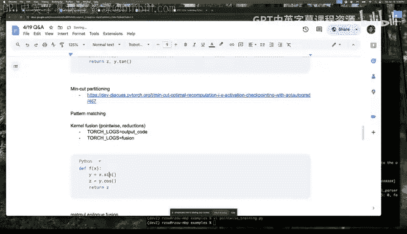

And so we could actually see this happening。嗯。Okay。Let me just look at this file。

So here have point with operations， those like that sign are co sign。Wrong wishing。

 let's try it here。Sign， cosine， we doing torsion pile， vice cura。

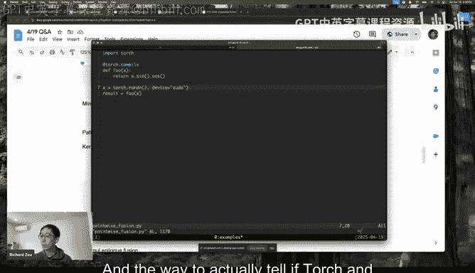

And the way to actually tell if one Tofront filess piece something together is to look at the output code。

😊，Let's run that。Python。Ohol， what are we looking at here？Sosort file， like given the inputs。

It's allocating the output tensor right here。And then it's going to call like this P's cosine signine kernel。

 which should just be calling up sine and cosine on the input。

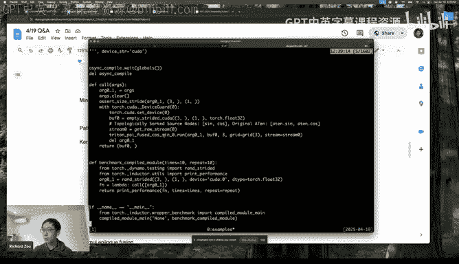

So that is point wise and reduction fusion， the way to tele work on is actually fu something together is to run。

Tart logs equals alpha code and examining the output code。

That's one of the ways tos what is happening。m I want to talk about this right now sure yeah。

 go on so I mean， related question is around like pattern matching。

 I don't know if you're going to cover that later。😊，I'm not going to talk about pro matching later。

 okay， so question was， how does pro matchinging work？😊。

If you write the naive attention layer yourself， we'll attempt to solve it with flash attention。

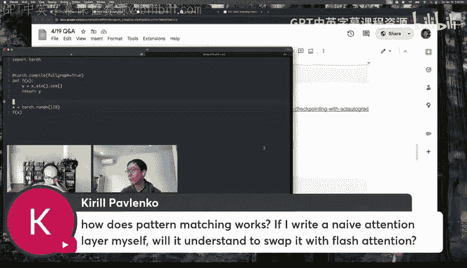

I the answer is yes。嗯。I remember， this is a。Joint graph tasks。Ggraph。

 let's see if they've got attention。你是残裙。😔，I don't remember exactly what the attention one is。

 but the answer is if you write your sequence of operations in exactly the right way。

 which I apply we'll try to pattern match it and then replace it。😊，Yeah。

But but yeah like concretely this is unlikely to just be raw bytorrch code right it's probably going to be STPA code right yes。

 it'll try to say it yeah， it's not going to take your。

Your attention ops and it replaces it with another set of pipe retention ops。

 it will just it'll replace it with SDPA or like something faster。哦。Okay。

 so I was talking about kernel fusion。Sure， I'll talk about the other way to see like if fusion is actually happening later。

So other that other fusion optimizations that Churchophil does is sort of elog fusion and some animalsmals。

Like you can call for compile here's say you're doing a。

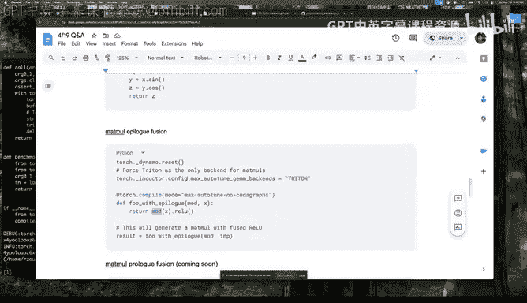

What is not。Mo is a linear layer， I didn include that in code there。Dluation。

If you're going a create linear layer， you do like linear and an alude。

 and turns out that you can actually choose this really operation into the mamal kernel。😊。

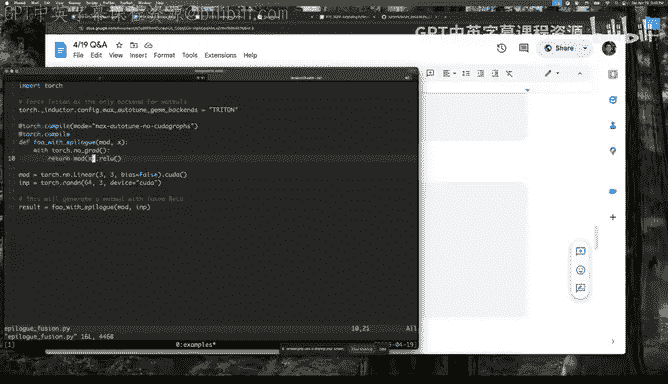

And we can see that by running torch logs。Okay， so。Yeah， so a few to the map on the room。哦。

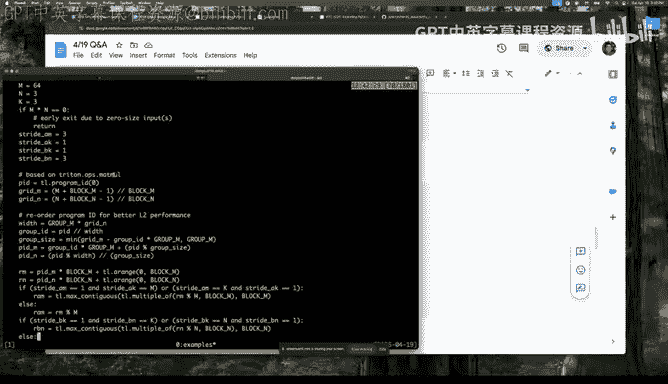

I'm not going to read this kernel， it's like a really simple map kernel out。😊。

That's a really simple metal kernel what's that point with operation。

 what was the point where it was raylude， where is a raylude here？😊，It's the maximum right here。

 maximum maximum， yeah。Cool。So that is。Aallo fusion。

Um now I will talk about an optimization that doesn't actually happen in Churchophil。

 but might come soon。

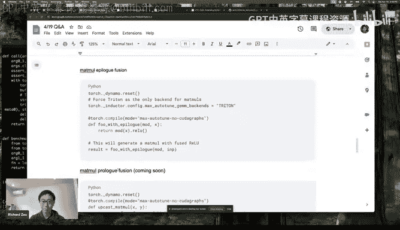

Actually， this is coming soon， product fusion。😊，You can also like if you have pointwise operations。

 right before your Mamal。You can fuse those straight into the mela as well。

And so let's just look at what this looks like。No mat pro fuion So okay。

 so we're going to do this upcasts x upcast flow 32， map to y x has flow 16 D type。

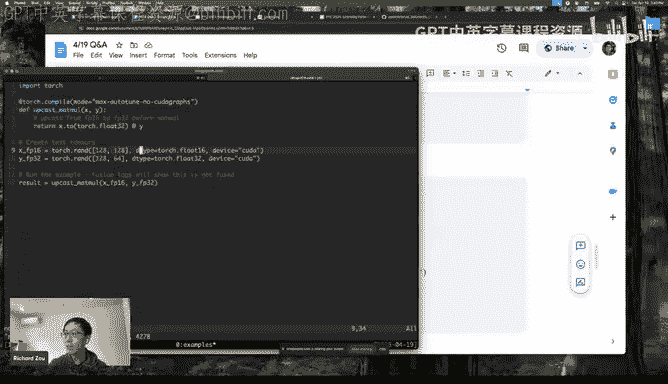

And let's do that。Good。I guess it's sort of while this is running， oh no that's right， not everybody。

And I think next here is。What am I staring at work with the mamal， did it fuse it？No。

 I didn't feed it this is in this two copy， this is where it is during the upcast。

And then this is where it is actually doing a mammal。I'm just going to read it to Ka code real fast。

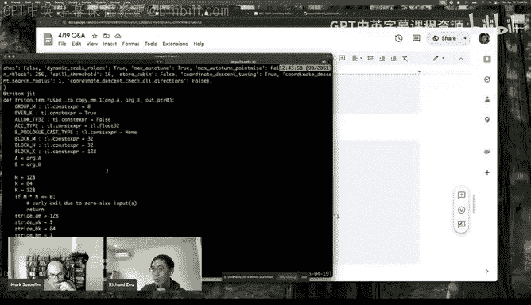

At2 copy0， it is just doing the webcast。So the interesting thing to note here is that in the second kernel。

 the two MM1 kernel。There is some code that suggests that it can actually do it as pro。哦。

But it didn't seem to use it， it's just doing like two different kernels。

We're improving this soon like this this should be an option in like either printer shot seven or two out eight to actually do prolo regions。

Okay， Mark， do you have a question I I did yeah， so so there's yeah。

 like like the core question coming from Johnny， which is。

Like it's kind of like I guess I'm going to sort of reinterpret the question I was like it's not super obvious to know what optimizations are supported So they gave like one specific one with like fuse linear cross entropy that they're curious about I think this like you can just like to also just sort compile this if I'm not mistaken and it should just work。

But I'， yeah， like if people just want to know like what is supported versus not like but what should they do？

嗯。I just our commit history， that's probably the easiest way to do。😊，Which files though？

II was just saying this all right， let's let's see this I don't actually know the CCA thing is here。

😊，So， let's see。Chunks craft。Yeah， it should be something with by chunking or be。

 I guess it is something about chunking。But by chunking， sorry， not chunking。

I suspect it's aR by shunnting on the in。I think our lesson here is that it's hard to tell or find。

 yeah， we just got to find it。

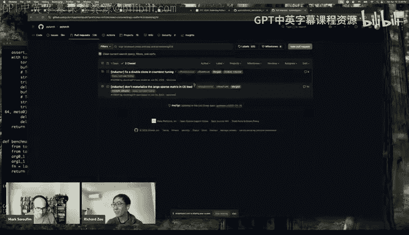

Okay。😊，That being said。I would love a page where To file has rip down like series lot of optimizations it did。

😊，This is feedback I can bring back to the team。I agree it's like really hard to discover if Tor file is doing something without just writing the code and checking the output here to see a tor file actually handles it。

😊，Terry， yeah， my suspicion is it wouldn't take to yeah， yeah。

 like Jonah Turner saying probably need to check logs anyway。 Yeah， I mean， I think yeah。

 we can always check the logs， but like my suspicion is that writing a page probably wouldn't take more than like an hour's worth of time or I think。

Yeah， so much write the page， not me because I I did not know that we did this CC thing。😊。

For context folks I actually work on mostly like the front inside of it on the Picomp team。

 like we have an entire team of folks who work on the back and so want to grab one of those folks to just write a page so down write a page for an hour。

😊，All right， moving on from mammals， I mentioned this above like one of our gasians。😊，Rebels。

Like tu file does Ba selection in general。I think the reason why we're actually using max solidlaitude here is because。

I don't know what the default mammal like we try to call is。

 but tri will benchmark like the fus version of the mammal with like the not fus version with like some other different mammals and determine which one is the passes。

That's auto tuning as well。Another example of something we don't do today is。

 let's say you wrote a user defined Trident kernel。

Maybe you wrote your own Mademal Colonel contrident。G I'll did。Write a code log here。Could。好了。Yeah。

Okay。哦，诶。0 be shape one， and then you do a。Just assume that we have a tri kernel that does this。

 not mall。Any need towise operations on sea。Like in the previous。The epi an example。

And theory pushron pile might be able to fuse the plum's operation into the Trident kernel by totally just rewriting the Trident kernel that the user passes us。

This is a bit harder for us to do because we actually have to analyze the tri kernels to do this。

This is potentially plausible in the longer term for tu aboutox handle。嗯。Aside from。

Gsing history to define tri tunnels， here's photographs。Hats motive us reduce overhead。

Kgraphs is really good at reducing overhead at the cost of some additional memory。

 which is sometimes not good。😊，All right， and the last question in this section was。

 how do I inspect？Or one of the questions was how to inspect a generated graph enforcement file。

We've mostly been talking about output put code。

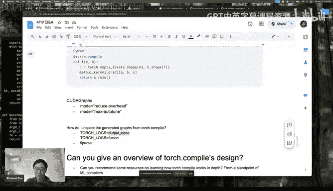

Let's talk about COAs。KalePce is this tool to sort of like get the avocode in a more human readable way。

So。不去。That's the file。 Okay， you can use。Good。This tool called Tl parse to。Oh my god， my terminal。T锤。

Log point wise。So the Tor race just gets a bunch of long。From this tu power run。Yeah。

' going to take a bit。我。Okay， and then I will。T parse the logs directly。Log directory。

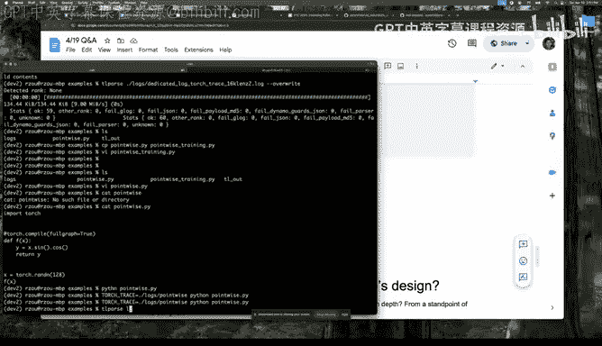

You can just cut in salt tail parts， it's right there， it's on pipeline pie。Okay and。All right。

And this should give me a link to the code。Yeah， so you can just see like theduct outputpha graph right here。

We this was a polymer operation， but on CPU only。And yeah。

 I've done this C kernel that is doing a signine into cosine。

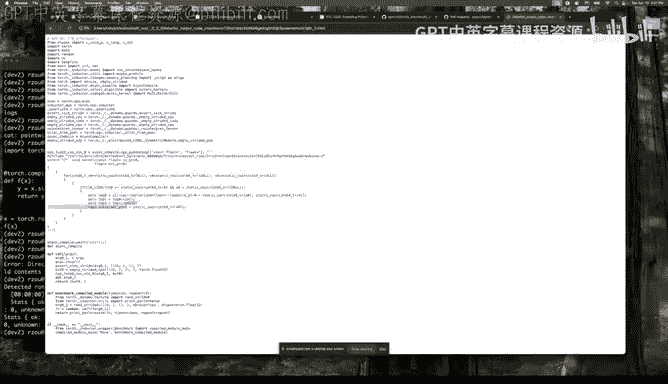

There are other artifacts in nuts tail first like。There's also just。

Artectacts from various stages of the compilation process。For example。

 come out of front end produce like this really simple。

Graph that then got passed to the backend to produce set out that code。

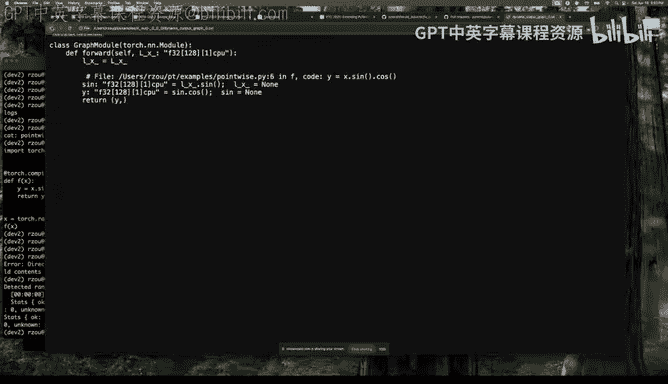

Okay。我屎。The next really big question was， can you give an overview of torsion pals？Design。

See some questions in the comments， let's see I can answer any now。嗯。Okay。

 I guess I very like the three most recent questions in order for some of those like。

 are there any scenarios where I should prefer to go torch with。Trident or Kta。

 or is it always fair to compile？Really depends on your performance。I'd say just try both。

 see what happens。Comprs。Usually better at。It compiles usually better at producing faster code。

If you have a lot of like custom tradinging kernels or custom crer kernels， then。

Maybe compile like we'll be able to give as big of a win and then like you might just prefer to your moon。

That's one reason。 Another reason is like。Compile has like a bunch of various like performance tradeoffs in that like there's compilation time。

 there might be recompilation time and ear Mo has none of that。

So if your model like if your model is hat exhibits a bunch of like compilations， recompilations。

 really bad compilation time， and you might want to stick with eager anyways。Okay。

 question after that was for people working with Litorrch models have had success with AOT optimizations。

I said this was impossible。Great doing it in a hockey way。 We notice say this wasn impossible。

I don't think I heard the impossible point either。Okay。Oh， I think I said that like custom kernels。

 Totramal doesn't optimize custom C+ plus computer kernels。😊，Okay。

 so what I said was that torsition file doesn't optimize。Custom。

Colonnels droppedped into custom some operators。So liftwork stuff。

Maybe you're referring to Tor scripts， but like To scriptri is a nugic compiler that are Chamons or is the first version of the P compiler like five years ago。

😊，We're going to capture a graph， shift it to C++， and like in C++。

 it will just strip and optimize your code。😊，Not inth on， it will optimize your code in++。ok。😊，就。

Talk about To P design I now。One of the sub questionsions was。

 can you recommend some resources on learning how to come about works and De from a standpoint of ML compilaries？

嗯。Okay， let me just reply to the question。Never mind。Sure。So， let's see。Okay。

 so the question in the comment was to clarify， I believe it was along the lines of the AS network can't help with training in a LA C++ model。

Yes。😊，I said that over Discord。嗯。Here's the deal， our workflow to produce is it。

This is a question somewhere we on here。What's the best way to interface with Tor profile model and C++？

Our rifleflow is usually like we tell people to run Torch export， not Torch Comp file。

 to run Torch export and you use Aot Docker to provide like a model that so that you can run。😊。

And then in S++， you can load the model as cell and then run the model。

The problem with this is that you usually cannot train with it。

Like when you do this AOT andduct workflow， the resulting artifact is optimized for inference。

If you try to call it about backwards， for example， like on the output of this model。

 I don't think it will give you gradient。The reason being is that like the Aocian doctor will literally take。

Well， something needs to give you the backward graph for your code to compile like in Python does give you like when you're compiling a model。

 it gives you the forward graph， it gives you the backward graph I'll compile both separately。

We'll see that when I talk about the design for tor pile for ALT inductate。

 we haven't actually designed something like that yet。😊，Everything reason is mostly just like。

There hasn't been that many use cases for this like a secondcratic current inference use cases。

 like most people use pershot compile instead of ATduct。

We'll people use sort of while when they want training。

 they might use AOT an doctor when they want inference。Yeah。

 A to see an doctor does not really support training reason why I does support training is because there's no like backward graph you can actually run。

😊，Yeah。All right。啊差的吧。嗯。One question I got was like can you re some resources。

 I don't have a lot of resources， I'm also not like。I'm not like trained Nml compilers like I just。

I just have like a regular degree in computer science。

 I know that some people are really trained in ML compilers or just compilers in general。😊。

I just recommend just reading the Pdge paper we have like。Just presentations from。

 apparently there's a workshop at a conference one year where we just presented various things about how to switch how it works。

嗯。And then my other recommendation is just sleep。Trying to figure out how other milk compilers work。

 like your Xccelators， TbM， etca。Okay。All the to compile is designed。

I'll talk about how it does inference first， and then I'll talk about training training is fun。

So for To has like three main pieces， like when do you call to our palment program？2。

Not what I wanted。Good。睇单。Yeah。Okay to answer the question and comments really quickly yes the question was is there a hacky way to get to get at the back path the answer is yes people have done it let's talk about this later over I go down to misceaneous questions it'll be kind of fun to do。

😊，Okay， so。Youll see a tor truck pilot program the first step in To truck pile is to take。

This program。And capture a graph from it that's Simono， it's responsible for capturing a graph。

The way it captures a graph is that it just literally reads your Python byte code。

And then they like tries to interpret the Python byte code without actually executing the operations and it records set operations in SerG。

And here is like how I tell what Dynamo is doing。

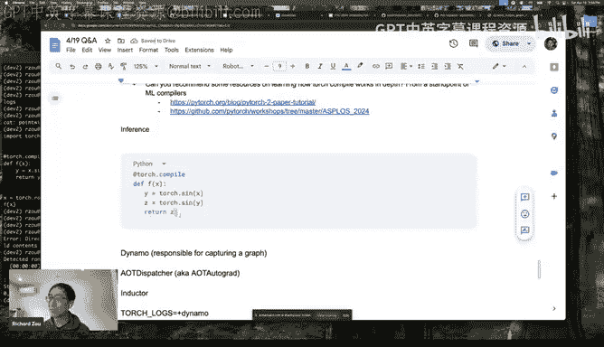

I just go to God vote and then I type in like the occurred。Python。

 and then I read the Python byte code。

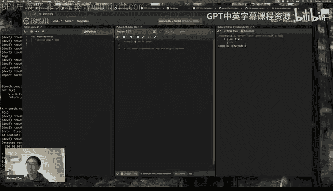

That's not the right function。

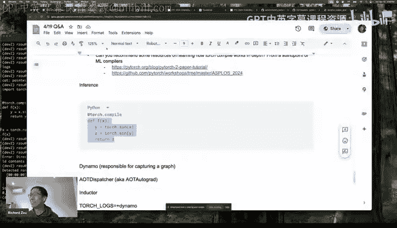

诶妥 shut sign。Tsha， this is a sign call is。How did it signed twice？Okay。

This is the cosine call right here。And Dynamo， like it's an interpreter。

 it'll see all these bi operations and it'll execute them one by one。

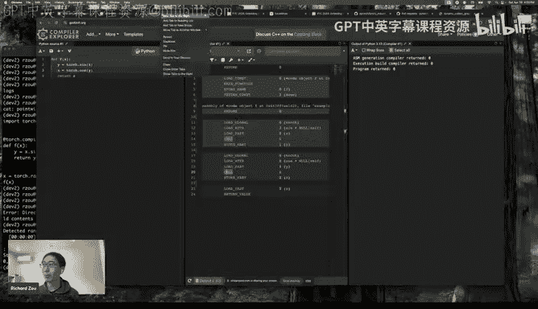

And we can actually see the source code for it。不と。There is for each of these Python like Bcode instructions。

There is a dynamo equivalent。

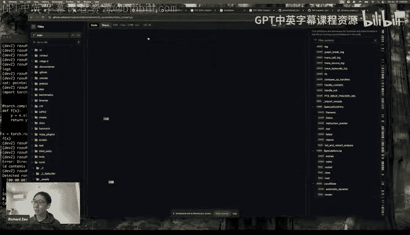

So for call， it would just get into here and the call operation eventually just records a call to said to shop in the graph。

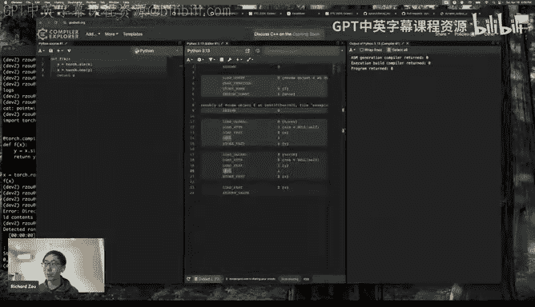

So that's Dynamo where's my Tl purse， so is my ETL par。

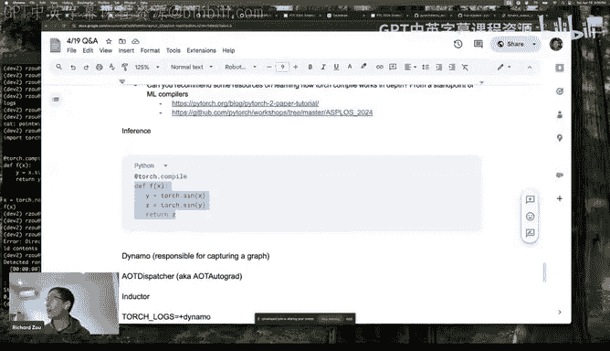

Remember when we like did the entire torto vlog thing to get？

A trace of the two point wide operations。This is a graph that thatno produces。

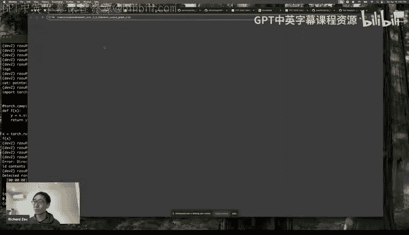

This is like capture descend call。I guess I did two signs in a row。Instead of like one sign1 cosine。

 sorry， it is one sign1 cosine， I'm just being confused。

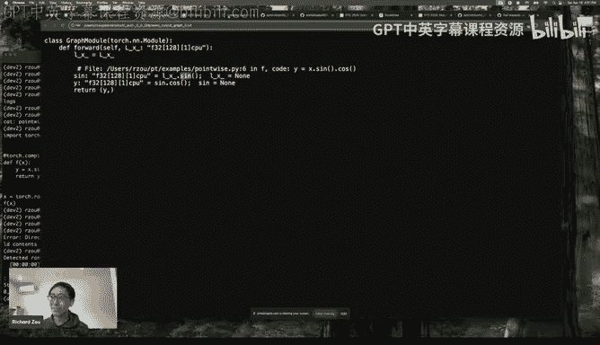

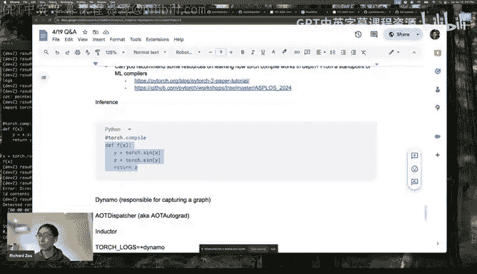

That sign one it's also for capturing a graph。In particular， this graph。😊，Is you can't really see it。

 but we call it sort of torch iron， like it's just a graph of torch operations。

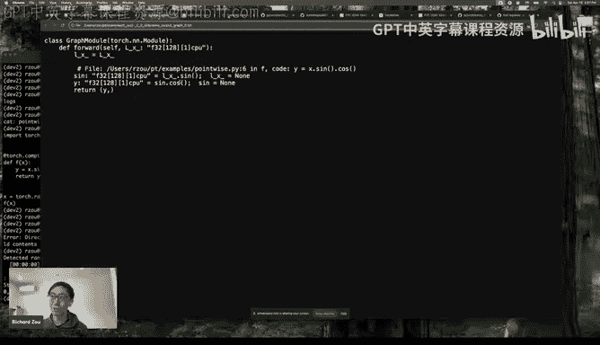

And our second phase called AOT dispatcher，' not going explain too what it does at this point。

 but it's responsible for normalizing the graph and functionalizing it。

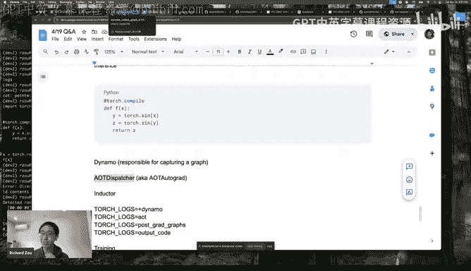

So it will normalize it instead of what we call HMR。It is just like。Has a different set of them。

There's like， there's a number of torch operations。I around 800。

 then there's some number of patent operations。Actually very big it's for like more in 2000 and then there's some of HO version thats worked from P actually。

😊，Gerrery could for it。We'll actually put it into scrap。

And so like we have taken these like sine cosine torrops。

 replace some with the A10 versions of these ops， which have basically the same semantics。

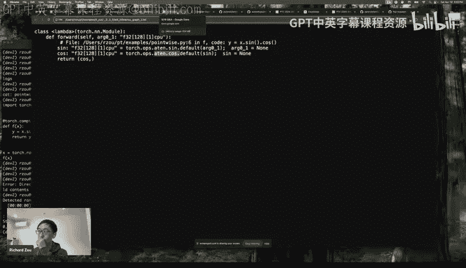

Finally， like。AT factor produces a graph that has been normalized。We will pass SeG to Inductor。

 which is our compiler backend。

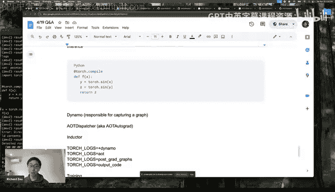

The backend is responsible for taking this graph。And then generating the trident kernels or generating their al for it。

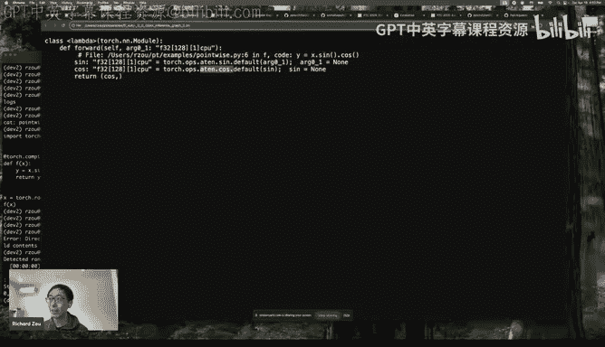

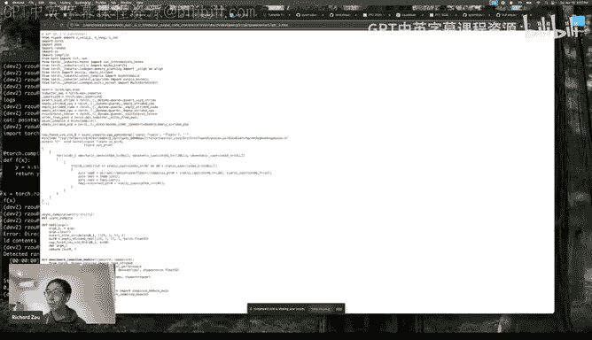

Depending on a device that you're on， when I generated this TL parse， I was on my Mac。

 which only has a CPU or。

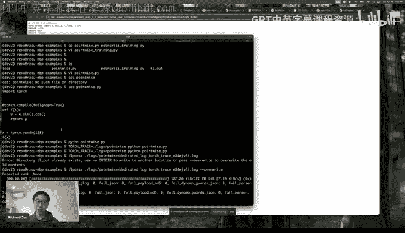

Sorry these sensors were on CPU， they weren't on N。So it tries to generate its CPU kernel。

It's just this CBP pro right here that does vectorization。On the KudD device on NVD JPs。

 Induct will generate some combination of CL plus code。For things like color calls and then。

Trying kernels for just various other fusions。Oh。Okay。

So that's a quick render of like how this function went through an entire stack。Dmer produce Tortrir。

 you'll see dispat for normalize it and Dr produce Dr。 Africa。It's the optimize though。

You can also see these like via just tor loging it to give you the graphs。All right。

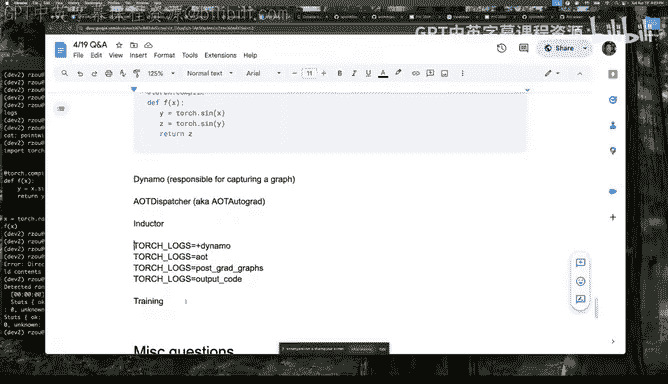

Let's talk about training。So training is interesting。

Let's do a TL parse for the pointwise training example。Flogs，Okay。Okay。Yeah。

I'm probably sure have checked that file before I ran this。

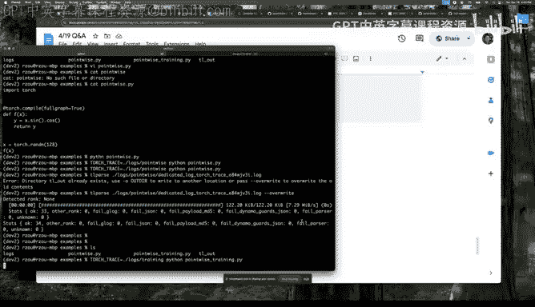

Okay。In my memory。The function looked something like。Ex turn then。こう。

Let's see what white training actually looks like。Sure， yeah， pretty much just1 28。

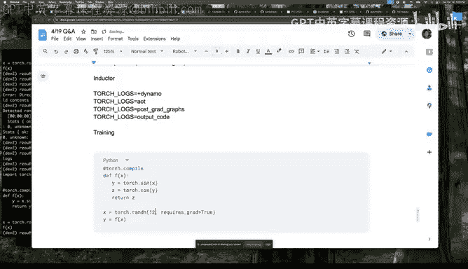

Let's go to tail parts for it。呵。对不对？Take advice to our current graphs。All right。

So dental Africa code should like occur some Earth it before。It's got the sign and cosine operation。

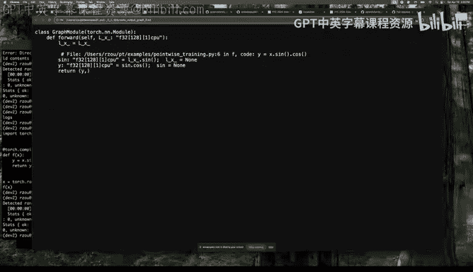

This is what like A this is what AOT does had her does the heavy lifting。

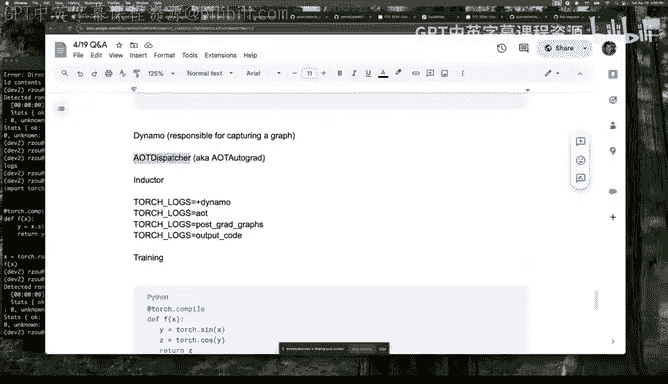

It's responsible for generating both the for graph and the buffer graph。And we can see it on here。

 we've got a for graph， you've got a backward graph。ThePrograph is just your sine cosine calls。

Returns cosine， it returns the input。And then this is the backwards graph。

What's the background of this？It's yeah， the vector of that。And then。

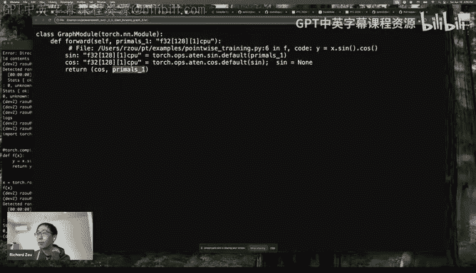

Once we have that， inductor compiles both。We see this vcher passes inductor。

 both the Forb and the backward grass。Here we can see that there's only the for。

s probably because I didn't run the about backward recall call。But yeah， here's the。Here's the。

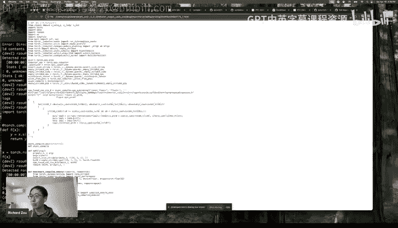

Otimize code for forward and I guess to get the optimize code further backward I would need to actually run the backward call。

😊，Okay。Theplace training。I'm not actually going to run this。

 this will generate the back record and Dr will generate the back record for this lazily。

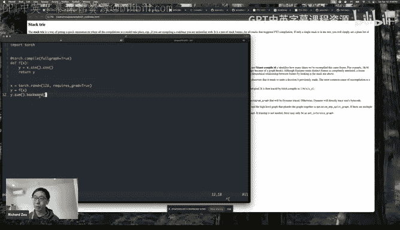

Yeah that's the overview for Tors and P design there's summarize there's three components Dy is like Ber interpreter it's responsible for initial graph capture LT dispatcher is responsible for normalization functionalization。

😊，Also responsible for autograd， it's basically responsible for like deuring a bunch of p features into something that an instructoror can actually understand。

😊，And then Dr like just takes in this code of straight line like straight up to chops。

 regular to chops， and then makes it go really fast。All right。

 we've gone to the miscellaneous questions。嗯。Let's see。 we can talk about this first。

First my model sequence less。Okay， so deposit in the comment was， is there a hacky way to get？

The backford pass and yeahep， is there halfway ways to get the backford pass and Aos conductor？

And answer is yes。系。Okay。Good。Okay， so first of all。

 I don't actually know how to call it and a doctor， or I don't remember how to call it。

We're just going to assume the call looks like this。Oh。So you thought of。Yeah。

 we're just going to assume the call looks like that。Maybe other function。

Maybe you I don't know different return loss from it。U。What's right， where we see this is。

This is when you have a function where you're also passing the weight and then your targets。

What your output is like。Okay。Then you're on next weight。

How did the loss function on your weight on your pal targets？Yeah。Return loss。Okay。And Alex。

The secret is you want to get a graph that does the forward end backward。And pass it to ALT and Dr。

One single graph of those both the forward and a backward。So we've got this fun tool called Maker Fx。

Okay。Make sorry make effects is actually in summer in torch I do not remember where it is in torch。

 so I imported from here funk torch is just always included when you install torch。😊。

So you can do this thing。De forward backward on your x weight targets。Okay。

What are we doing we're doing FN of X weight， this is your forward。We just call this the For。Wals。

Now we're going to do it tourtottergrad。gra to get the gradients。off。With respect to the weight。C。

 and this is here created。Now we're going to return this。And you can just do a trace of this。Um。あ。

Let's tell you how to like。Yeah。Okay。And this will give you a graph module。That you can then。

Have stayo conductor。So TlDR right。The normal way to use AON doctor is you apply whatever run tor export on a function and then pass the result to the AON doctor。

Now we're going to just use this make X trace function to produce a graph module。

If Torch export is needed， which it might be I don't actually remember。

 then you can totally just pass like this thing back into Torch export to reproduce you a graph。

And then pass that thing。To A team， doctor。And this is a hackck of way to actually does work。Okay。

SoSo you have now like gotten a function that competes the forward and backward and you have pass to table plus and you can just use this to run forward and backward。

I don't know how like you want to optimizer like you can probably just export another parameters just optimizer if you want to like run the forward backward separately then like given this alpha graph you're going to need to partition to alpha graph somehow into the forward and then into the backward there's some utilities in like Hy for actually doing this because that's how you' see this metric does it。

😊，But there is a bunch of ways you can scan this gap。Okay。Al right。Moving on。

Another question was like。Okay sorry， saw a lot of new comments， let me go read them first。Yeah。Okay。

 nothing for me， I think。

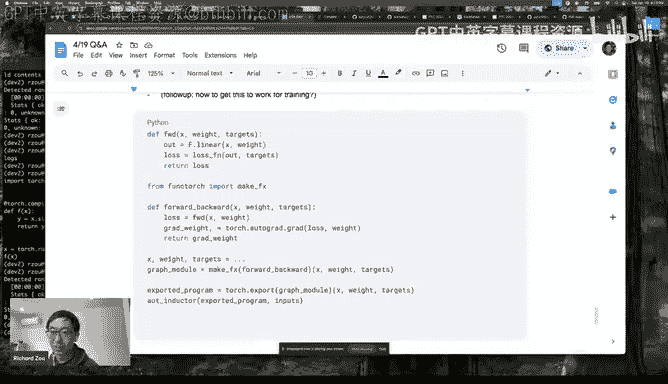

Cool， I for me， better comment in the forms was。F point mismatch happens when you use search fiber to a ear mug。

My short answer to you is this is important， like report an issue to us like if you see something like this。

😊，Emers are pretty important for us。I was debugging like on America issue for like a week like two weeks ago and Tiod they on Fpoint mismatches is first pile can sometimes be more correct than eager mode like when comparing to the flow 64 reference。

😊，That being said， like the Newmerics issue sometimes causes problems。

But like Tor being more accurately cause problem sometimes。

 there is this quant and H compile called the precision cast that you can just turn on and Torsch compile will do the same things as viewer mode。

😊，But also like a recommendation I have is when you run into this like just。

Try to minimize the region you are tor from filing until like the problem goes away。Okay。

 how can one get involved in writing conflation improvements or kernels I see a question in the comments about what about the contribution question。

 was there another contribution question or comments？Co to scroll up I mean。

 it was more of a generic like where can I hell， how can I learn， how can I get mentorship so。Yeah。

 I close the windows。Yeah。Through。We've got a contribution guide right here。

 I don't know people sorry it's deprecated， oh no。I guess this is a new contribution guide。Yeah。

 help is very welcome on T。Theres a lot of issues that are just marked as good first issue。

They they're probably good to take on。When you're working on these like。Not really a need to ask。

Like。Sorry， this is not a good example， but on some issues like a lot of people just ask case is if you're taking kind work on it。

😊，You't really need to us that like it's hard for us to reply so that just work on something if you' want to contribute。

😊，In terms of just mentorship。We will try to reply to these issues。

Some things are more important to us than others。For example， like on a compile side。

Like if you take it's hard for me to say which compile issues are more important than other compile issues。

 but some many issues like we have them there， we don't care about them。

 but there are other ones that we care about like if you're motivating not to work on them。

 like we will just try to walk you through your like or review your code。

So I guess my best advice here is like。Find an issue that you might be interested in working on。

 try to work on it。And then like like start a discussion in start a discussion like on GitthHub in a Github thread。

And we'll try to take a look， the contributors will try to take a look。

There's this contribution guide here is sort of just a walkthrough of how to actually do a contribution like how do you actually open an issue on github etc cetera maybe you guys are not present on that there are also some。

There's a wiki somewhere on how to actually learn about what Pyr is doing。

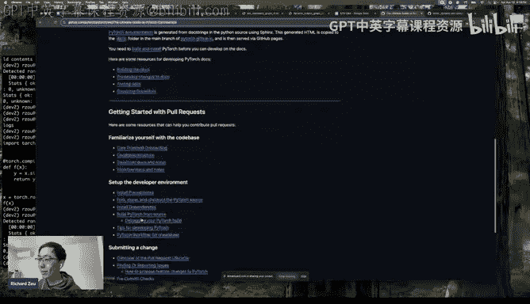

Here we go，  Queerfront and onboarding。哦。This is like a really good way to learn about Pri core。

 not really about pdge from others。LikeI wish there were a way to learn about Hy compilers like this。

It's basically just like the onboarding guide， we put all of our new hires through。

Like it's how to set a developer environment， just some basics around Pyth like。

You might think you know like what a tensor is and what an operator is like and my answer to you is that like I don't know what a sensoror is it's kind of ridiculous like the tensor data which we have is probably like a thousand lines of code at this point。

😊，then you like this basically takes you through like autograd like Pyrch dispatcher fortune end so on and so forth so this is a really good guide to like learning about Pyttorch there are some like labs you can do。

😊，Pro just like exercises and a cloth notebook that you's walked through。

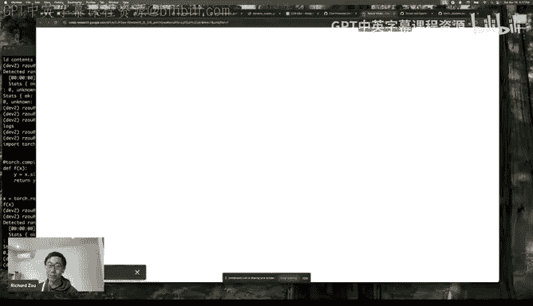

And I think this is a really good way to sort of just learn about like how type。In general， it works。

嗯。Question for the comments was， is there a list of total pallate issues。The answer is yes。

 you go to issues you sort of sort labels。We call this the labels I'll call PT2 PT2 is like our coding for torsion file like I'm calling it PTt2 this five part search like being version two like personal。

😊，This is a list of different bio issues。Of these， some of the our tech leads will labeled their issue as actionable。

 so there's are。Actually actionable some of these might have a lot of context so high priority means it's important if something is' high priority like usually someone from our team will look at it。

😊，If no one from a team is looking at it and like feel free to take a look so that's actionable and as I mentioned。

😊，Good first issue is always a good label。Good first issue。Remove actionable。Yeah。

 we've had a bunch of good first issues that are。Anothertter type of issue that like。

WeiseAnother type of issue that like we like want to help on is。

So nice people will put up these umbrella issues for just like we have like a long list of files that we didn't to walk through and do something with。

For example， I think there's one like this right here。😊。

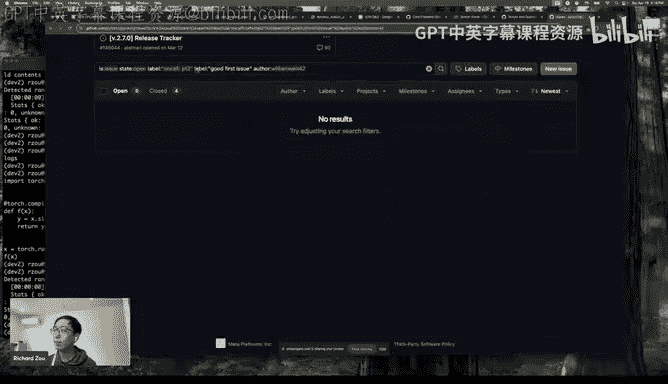

哦。Every type annotation something like this yeah so we we have like an village for type annotations this one we are just walking through like functions replacing them with a new API a lot of open source people actually just added their names here like I don't know these people we were pleasantly surprised at that like like the frog to yeah like I'm really she is like definitely help。

Appreci it。Although we sometimes don't label these as good cury shoes。微信。

I think that's all I have on。Contributing。We don't really write here， we direct kernels in Pich。

 we don't really write too many kernels nowadays。Those谢。I preventing a pilotr。不top。Okay。

 those are other questions from the forum that I want to talk about we do have like 11 minutes left into session。

If you guys have more questions like over chat like I'm happy to answer them in the next 11 minutes。

Otherwise， I will keep on reading through。The forms。

Ill like say Google doc it's not posted it Mark what's a good place for me to just post this do you see the chat on the right hand side oh yeah just hit the turn button let's see it。

😊，Okay， login into YouTube。You shouldn not need to log into YouTube， just the streamyard link。I see。

 okay。It's this stock。If you like， just post it on just DM it to me， okay。

 I' you it's how you posted。Yeah， let me just make sure Ive shared it out to this topicel。

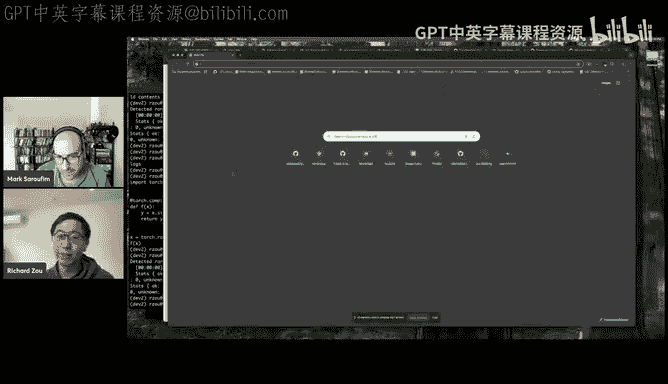

I'm going to be into to mark right now。I guess maybe I'll ask the question if there aren't any。

 which is like you mentioned some of the stuff around like usability。

 like basically like like at least historically the way I've used St compile has been。You know。

 like I run something， I look at the logs， I tried to like juoigle my code around。

 like look at the logs again。And so you sort of briefly mentioned at the beginning things like better error messages and escape hatches。

 and I'm wondering if you could maybe elaborate on what you're thinking on here Sure， of course。哦，没。

Here's where I think， cool。So。One of the projects that we're working on is remember what I told you that？

Graphs are better preference sometimes。When you use Torsion filefographic was true。

 like it will error around any graph breaks。But in our experience。

 forographical true is not really usable because there are always graphs that there。

Will always exist graphic rigs in real world models。That we can't handle。

And so like one of like the parameters we're trying to add is like some sort of allow like like ideally a person just。

Developer uses hervolographical true， but they allow certain like regions of their code to have graph breaks in them。

This way， like it's really clear to the user like what is actually being photograph graphicic？

Compliiled and what is not actually being F compiled。So in this like。Just by reading this code。

 like you might think， okay， now To compile has the opportunity to fuse all of these things together and all these things together。

 whether not inductor does that， it's a different story。And when you do forographic goes false。

 you're like， okay。Where are graphs that personal is producing。

 you won't be able to tell unless you actually look at the logs。That's one example。

Back to escape hatches。嗯。There's。Sure， so there's too many escape hatches。

 there's couple of the escape hatches in like Dynamo like our funed。嗯。We have like two main Shas。

 the first one is custom operators， if you have some code and fails to compile under Fographic equal's Str。

 you could totally just shove it into a custom operator and that will get it to work。

The second sort of escape hatch is really inspired by Google Jas。

Like Googlejacks is like also like a begin framework。

It's that's like Google produced he like Google like they're the ones who have really made compilation。

 I think Google like Tenor Fl andjax are're the ones who really made compilation work well。

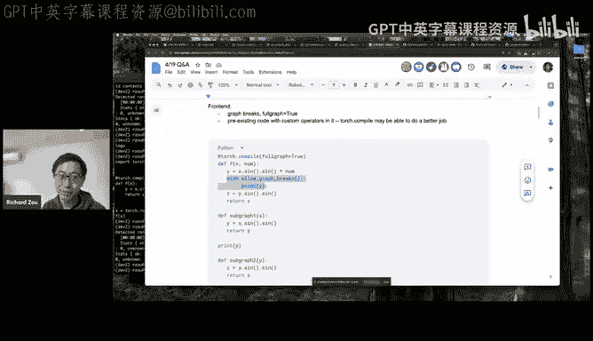

And has Ja's tracing program model is like。You you're executing code and then like executing code and Jack's previously these you write code with nu operations in them。

 Jax overloads these nu operations to and captures them in a graph。

This is not what exactly torch compile does， Toch compile has like Dynamo the front end。

 which does this Bi put interpreter to actually capture a graph。

But like Dimmo's bi interpreter is sort of difficult to understand。Like when something doesn't work。

For example， Dynamo has a hard time with， I don't know。

 they've got items as inputs to your compiled region。When someone doesn't work。

 you like really don't know why it doesn't work。嗯。You don't know why it doesn't work。

 like D is very implementation driven like some biput operations that are supported， some are not。

Instead， there should be a way to sort of drop down instead of like using dyammo or frontend。

 drop down into some tracing front end that is a bit more unsafe than dynamo。

 but is easier to understand like Ja' is multiple。And so we're working on this new escape hatch。

Called。Where am I writing？It Mark traceable， not called Mark Tra by anymore。Nonstrict trace。

Do you have any thoughts on this？I dont think we have any doubt on this yet。

 but the idea behind non cr。Cute。Okay。The idea behind non trace is that if you have a function and you suddenly encounter an operation that is not supported by dynamo。

Yeah。Okay。This is a real function that induces a graph ribbon dynamo。

 but just for the sake of example。😊，So this function will ever out， will ever out like saying that。

 hey， you have a graph break， can't support it。If you apply this non strict trace thatgraator。

We will drop into a different type of tracing， not dynawood tracing， something else。

More similar to JaX's tracing model where we're only going to record operations the only way we record operations is by like seeing what was called on your input tensors。

During amongst your trace， we will see that like here you have a tensor。

 we called sine and cosine on it。Those are the things we're going to put into the graph we're not going to care about anything else。

그。So that was custom operators non trace for Dynamo。U escape hatchches。We have， okay。

 so one funny thing is。We've got catchching and Pyarchch。

 we have a list of operations that are cacheable and lists that are not cashable。😊。

There are bugs here some some of the non cache operations are definitely cacheable we're developing an escape apps to just like just move like stuff from one list to the other list。

And then for some more context behind why we want to add escape hatches project releases once every three months Pyarcharch inevitably like any large project will have bugs you want to make it so that like bugs are not show stopping for you guys the users。

Oh。All right， taking more questions。I don't think I see any new questions。

 so maybe Richard maybe now might be a good time to call it so Richard hang the law on the Torch channel on the servers if you have any more questions to him just like Philip Pitatga he's been like extremely responsive。

And thank you again， Richard。 So folks like next week。

 we're gonna to have another like Pyroci related talk。

 which is going to be by like Vinncecent Mos to be talking about like infrastructure for test time compute。

And yeah， thank you so much， Richard， really appreciate it。Okay good， taking Mark。

 thanks everyone in audience。Thank you。😊，But。

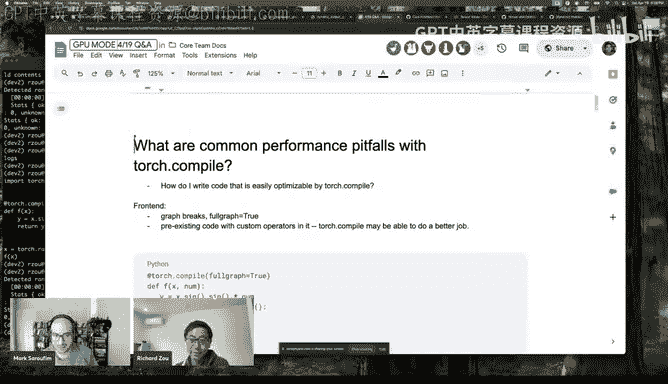