# GPU MODE《CUDA、GPU编程1-53课｜GPU MODE》中英字幕（deepseek-v3.2 - P58：-20250426-GPU MODE @ GTC 2025.zh_en - GPT中英字幕课程资源 - BV1QZ421N7pT

Oh， sorry。Okay， so。This is our second time meeting。 The first time we had a different name。

 But now in GPU mode。😊，So thank you so much for coming。So really the。

 the theme of today is I want y all to come away with with like interesting problems to think about for the year and like interesting colleagues to work with work with。

😊，So that's why our very first speaker is gonna be crystalss becausez Raz。

 The reason why we wanted Crysto to speak is typically most people tend to be experts at one or two things。

 Crysttos has like basically made foundational work and like transactional memory systems。

 cloud computing， energy efficient systems， systems simulation tools。

 So we really couldn't Vi and I couldn't think of anyone who's more full stack。 So yeah。

 without further ado， Crysts， please， thank you so much。😊。

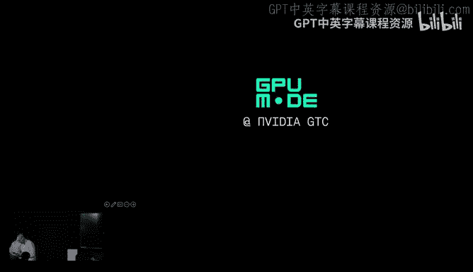

Alright， good evening everybody。 It's a great pleasure to be here。 Thanks， Vikram。

 and I'm for giving me the opportunity。 So I typically give talks about detailed research topics。

 but it's you know， Sunday， evening，7 PM。 You know， some of you are holding a be in your hand。

 So I thought that let's talk a little bit higher level about a broader topic that may actually impact your life。

 Where is hardware heading and， and what does it mean for people who are developing software。😊。

So let's dive into that。 I've been involved with computer architectural research for about 30 years now。

 and I'll tell you， this is the most exciting times I've ever seen。

 And it's exciting because it's the best of times and the worst of times at the same time。😊。

We are having major challenges。 We'm gonna talk about some of them in a second。 But at the same time。

 it's the fastest I've ever seen new ideas being introduced to products。

 So things are moving a little faster。 We actually impact hardware products really quickly。😊。

So let's dive into this thing。Let's start with the good news。

 So this is a graph I bought from Bill Dli。 It shows you what's the evolution of integerrate performance of GP P Us over a period of 10 years。

 And if you see there， it basically says that it's scaled by about 1000 x。 Now。

 this is the original Morse law，2 X per year。 as good as we ever had。😊，Right。

 and it's expected that blackwell is gonna be even better than that。 And， you know。

 you're gonna hear a lot about blackwell in this week anyway。

 So I I don't have to go into too many details。 So things look great。

 And if you don't want to talk about bad news， this is a good time to take your beer and go outside and enjoy life。

 because the rest in the next five or six slide are gonna be a little bit depressing。😊，Alright。

 so why am I saying that。So any performance improvement you make stems from improvements in transistor density。

 the original more law like the real one。 Okay， so this is a graph that generating with public data about how the SC processes have been shrinking over the last decade。

 and things are still shrinking。 It's still an exponential， right。

 So we not yet at the point we still in cement。 The bad news is that we at about 10% per year。

 maybe 20% per year。 it varies a little bit。 but we're way below the two exit that we expect。

So things are scaling。But nowhere near as well as we want。Right。Now。

 the other thing to keep in mind is that Moore's law was never just a technology thing。

 It was always an economics argument。 So we were expecting that every year well pay the same money and we're gonna to get the chip。

 which is twice as capable， twice as many resistors， hopefully twice as much performance。

What these two graphs are showing you here is that this doesn't hold anymore。

The left graph is telling you that transistors are getting more expensive。

So in order to get a wafer with。10%，20%，30% more transistors。 You now pay more and more every time。

The， yeah， the right graph， it showing you that not only the transition are getting more expensive。

 but you actually have more money to develop it。 This is basically how the energy R has been scaling over about a decade。

And if you look really closely， that orange part that's getting bigger and bigger is basically all the software that you have to develop to make sure that these interesting but weird chips are useful to somebody。

 or the libraries， the kernels， the compilers and so on。😊，Now。

 these graphs have profound implications for the industry。

 The first one tells you that the chips are going be deployed only for really high profit margin applications because its are getting more and more expensive。

 And the other one is telling you that we only deploy them for really high volume applications so we can amortize the N。

 So this may change our field significantly。 But since all of us are working on AI。

 which is high volume， high profit margin， we can ignore for a while。 So we can move on。😊，Okay。

 so let's go back to technical issues， not economics。

 The biggest pain for architects is the fact that all the chips are power limited。 Okay。

 so what this graph shows you is that over time， we're improving density。

 But because we can no longer scale the power supply voltage that we fit this chips with。

 we end up with constant power consumption per transistor operation。

 while we're squeezing more transistors per per unit area。So over time。

 we're getting the power consumption per square millimeter or something like that to keep going up and up and up。

 right And that limits basically either the number of transitionistors you're gonna pack in the chip or at least the number of transistors。

 you will use concurren at any point in time， So many things like what people call dark silicon or low utilization of transitionors are popping up。

 And this is basically what has been changing architecture for the most part。 Okay。

 to get back to this in a second。Now， there's a bunch of other problems。

 And I don't have time to go into memory not shrink shrinking anymore。

 So if you look at the as D ands， they're skin scaling by a tiny bit So not good enough for what you really want to do。

 Okay， that's a problem。 We're gonna talk about the solution a second。

 And even interconnects are getting difficult。 You have to pretty much choose between low energy。

 low latency or long interconnect and dense interconnects。 You cannot have both at the same time。

 And that creates all sort of interesting design issues。 You have to use multiple interconnects。

 optimize across and so on。All right。So by now you probably wondering to， Okay。

 that sounds really bad。 Okay， things are scaling slowly in a very weird way。 Power limited。

 you know， Member doesn't scale。 In doesn't scale。 How exactly did you get 1000 x while all these things were going on。

 alright。So let's try to summarize what computer architects have been doing for over a decade in two slides。

 So， you know， you're under your advanced computer architecture class in five minutes。 All right。

 you， you can give me your start for tuition a little bit later on。So basically。

 here's what hardware people observed。 But if power consumption is constant。

 then we have to start thinking about the components of this that contribute power consumption。

 there's two things that you have to worry about。 The one is how much energy you spent per operation。

 And the other one is how many operations per second， you're actually executing。

 We want that green term operations per second to be really high。 That's performance。 right。

 And since power doesn't get better because of process technology。

 we have to figure out architecturally， how to decrease energy per operation。

So what hardware people have been doing for 10 years is looking really hard and asking the question。

 can I decrease the energy consumption of this operation。

 whether it's a loadin store or a emergency multiply operation。Now， appealing the only on one layer。

 what we typically do is create tables like this。 this one I borrowed from Google folks。

 which shows you basically the amount of energy in relative terms that you have to spend to do virus operations arithmetic decoding instruction access members of different types and if you stare hard at this table you will get every single good idea that came in computer architecture last than years。

 it's that simple。 So if you look at the top side of the table。

 it basically tells you that the narrow the arithmetic you do the similar arithmetic the more energy efficiency is。

 So I guess what you did we basically told everybody don't do 64 bit floating point stuff do 6 bit floating point or 8 bit floating point or 4 bit floating point or maybe your favorite narrow in thing and then of course we've got software people to do compilers and libraries and algorithms to accommodate for that that has been a major win in modern computer architectures。

Now， the second thing that we observed is that we want these chips to be programmable。

 but the overhead of decoding， fetching， decoding and controlling every instruction is actually quite high。

 And if all you do with an instruction that you execute is one floating point multiplication。

 just don't amortize the cost of this fundamental units programmability。😊，So basically。

 we turned around and said， don't use instructions to launch individual additions or multiplications。

 Use instructions to control a much bigger amount of work。A whole vector operation。

 a called matrix multiply operation。 In this case， the energy consumption stays the same。

 Just amortize it over tens， hundreds， thousands of operations， and the cost is much lower。Alright。

 so this is the second thing we did。 Mes multiply operations as you are not quite well for model G years。

The last thing is we looked at the energy that goes into the memory system and and looks so short。

 the smaller the memory that you're accessing and the closer it is your compute unit。

 the lower the energy that that you have to spend。 So we start building hardware and software to make sure that we minimize how much data you use or maximize how much you use data。

 So you don't pay the high energy of accessing of chip D is often。 So that's it。

 That's all computer accuracy youve been doing for 10 years in one slide。 symbol not right。Alright。

 so let's go back and see how exactly it worked out for the GPUs that we discussed a few slides ago。

 So if you look at where GPU got their thousand x， about 10 x was from this custom instructions。

 know matrix multiply operations， matrix vector operations and so on。

 Another 10 to 30 x from using narrow arithmetic floating point4 floating。8 and so on。

About the two x more recently from sparsity。 And at the same time。

 we got about 3 x from cr frequency。 it went up and about 2 x from increasing the amount of silicon area use and increasing the power consumption of the GP U。

So the GPU power consumption started from a couple of hundred watts and1 thousand0 watts and。

 and looking up。Now， all these things， of course， required a huge amount of software work。

 as you know， pretty well and even algorithmic work to be able to actually make sense out of this thing。

 Think about all the algorithms， you know， for quantization to make sure that you take a neural letters was 2 in 16 B to32 B arithmetic and you can do inference at 4 B of your favorite format。

😊，Alright， great。 Now， in terms of the memory system。

 the main thing we did is we squeeze things closer together。

So we made sure that we don't go off cheaper off package to be able to access our data。

 What we did is we put on the same package， the compute and the memory so they can communicate through a quite wide interpo。

 And for the memory itself， we just stack it out top of each other， which is great。

 We don't know how to shrink there anyway， but we can stick more chips out of each other。 So this。

 we can get more capacity。😊，And lower power consumption for the high bandwidth that we need。

 And it turns out that this idea is actually pretty good and it's gonna keep scaling。

 So the graph on the right you know， tells you that TSMC expects that you can increase the density of these stocks looking forward。

😊，So we're gonna be doing more of this for sure。Alright， so of course。

 the obvious question to ask is that， okay， Pi， you know， scaling looks bad。

 but we played with these three X and look at the thousand x over 10 years。

 Can you get another  thousand x over the next 10 years， because if we can。

 then we travel right we back to the 101020%。 So let's go back and revisit what we can do looking forward。

😊，There is a bunch of things that will come from technology。 So 3D stacking will keep going。

 both denser and more aggressive3D。Packaging potential will start know，3D stacking of logic itself。

And at some point， you're gonna have co package optics so we can go straight from one chip to another using opt without ever having to go offboard in a non optical way。

 That's great。 It will happen from the。 toll take bunch of those。😊，Now。

 let's go back to the ideas that， you know， I told you were contributed to1000 eggs and see if they can work going and forward to。

 The first idea was more complex distractions。 And that's kind of mine out。

 I'm not saying we won't do metrics multiply or destruction like that anymore。

 All I'm saying is that the efficiency we got from them is done。

If you look at the what is the overhead of launch chicken instruction these days。

 it's about 10% compared to the fundamental energy of actually doing the math that the instruction defines。

So we'll keep doing this， you know， with course grain， custom instructions。

 they won't contribute to anything more than what technology offers。 Allright， so we' mined that out。

Now we data types willll keep doing this。 We getting close to the end， right。

 Like we're at 4 B right now。 We can go a little bit more get turnernary neural down to 2 Bs。

 It won't get that much lower than that。 right So we've got another 2，4 x there。 That's it。

 We're done。Now， sparsity is interesting。 So sparsity would just have started。

We've done structure sparsity， which is a little bit easier， right。

There is also this thing called art sparsity， where in theory， to give us huge benefits。

 especially the memory system where we need the most， the catch is that it requires much。

 much work from softer people and algorithm people and there's a chicken or neck problem， right？

 So if the hardware is not doing sparsity， Ar sparsity really well yet。

Then people don't do algorithm reasons for it。 And if people don't do algorithmgons for it。

 then hardware will motivated to the hardware。 And we have to figure out some way of breaking that deadlock。

And then finally， you have to do much more in terms of data flow。 Sure。

 putting the D on the same package with the GPU has contributed a lot。

 But if you look at where power goes， it still goes mostly communicating between the D stock。

And the GPU on the same packet。 So we have to figure out somehow get even better with data flow。 Now。

 what do I mean by that。Here's a bunch of ideas where you can imagine。Avoid data movement altogether。

We need to start thinking really hard about do the compute exactly where the data is。 Now， for you。

 it means that you have to start thinking about where's my data and how do I basically program the fact that I need to send the computation there。

 And for us， hardware people is we have to do some fine grain integration between memory modules and compute modules。

The next idea is minimize data movement， compress the duplicate filter。

 whichever way you can Just make sure that you minimize the information that's。

 that's floating around。Next is amortized data movement。 If you're gonna move data。

 do all the computation you can imagine for it。 So you may load some data， calcuulators。

 all sorts of embeddings， all sorts of interesting computations。

 even if you're not sure it' are gonna be used later on。

 because it may be much more beneficial than loading this data two or three times later on when you know that's needed。

And then finally， this is a good time to start thinking about thread of computation for communication。

 It's much， much cheaper to do math twice or three times。

 rather than actually load the data a few times far away。

 So we have to start thinking about algorithmic and programming support to be able to actually trade of communication communication。

😊，Now， if you look at the hardware that would most likely come your way because of all these。

 is we're going to start integrating computer members in a finite graularity and expose to you much more about the hierarchies。

 the memory hierarchies and the interconnect。Now， I know that this sounds scary。

But this is a good time to start debating about what' they writing their faces so that programming is not completely possible for this quite complicated way of thinking about hardware。

 It's gonna be a good thing to discuss in this forum。Alright。

 the other thing that's changing in hardware is the deployment unit for hardware。

 and things are moving towards the direction where we try to deploy bigger and bigger things such as the N VL cement here。

 Okay， so this is an unbelievable， you know， hardware achievement。

 like trying to pack so much memory flops and and terabytes per second of bandwidth with one box。😊。

Now， the reason that people do this is not just because it's an impressive unit of hardware。

Once you integrate vertically everything within a refrigerator size computer。

 you can actually make sure that you don't pay significant overheads for all the communication capabilities and all memory capabilities you have there。

 So some vendors want to be able to engineer things like that to be able to trim all the fat and all the energy overheads or latency overheads out of the system。

 So we have to go that direction。 like we can。😊，Avoid this。

 and it' just been done for business reasons。So what does this mean on the software side。

 It means a couple of things first。If you think pneumonness has been ugly in whatever two socuet or four soet CPU system you ever programme。

 this is gonna be worse。 You're gonna have pneumon in a single chip。

 A couple of chipletts within a GPU pneumon aboard pneum in the refrigerator。

 and it's gonna be heterogeneous。 like you're gonna have multiple types of compute You're gonna have multiple types of memory。

 And somehow your software has to be able to make sense of this thing and get the best possible performance out of the system。

 I's gonna gonna be easy， It's a good time to start debating about what interfaces work。

 Where did we get the hardware kind of right or where do we need to steer it in a slightly different direction。

The other thing that is interesting， if you flip it。

 the other way around is that if we have to design systems like this highly integrated。

 because that's the way to get the efficiency， that means that we need to get all the applications port it and efficient on this kind of system。

 And AI， everybody's motivated to do this thing right now。

 I think it has to be done for pretty much everything that's important。

 including any kind of database and any kind of analysis can think about。 you like it or not。

 the future of hardware we need to make sure that database analysis work for that。😊。

I spent the last few months talking to database people about why don't you use GP U or systems like that or databases。

 mostly researchers， But， you know， you still get the same margins， probably that you get from。

Product people。 And here's the list of things that they typically tell me。

 This is all the reasons why they don't want to touch a GPU for databases。

 So let's go down the list and see what holds and what doesn't， right？

 So the first thing tends to be， it just doesn't have enough memory。So GPus right now。

 because of inference are packing as much memory you can put in a package。

 in the hundreds of gigabytes。 like if they're really pushing the limit of integration technology。

 nobody else can pack more chip on it memory on a chip。

 And then you've gotabytes per second to whatever external memory system that you want to build。

 And of course， you can build anything right just connect to end link and you're there。

 if you don't like the one that there ready。 So in terms of memory。

 you have as much capacity as possible locally and then enough with the go of chip。

 So you can cross this out。The next complaint tends to be， yeah， I like the bandwidth。

 but I'd like to have really fine grain access to my data。

 I'd like to do pointer chasing to 8 B at a time。😊，Which sounds really great。 I'd like that， too。

 it just cannot happen。😊，You know， there is this thing called the little log。

 which basically tells as the bandwidth goes up。If you want to have access to fine grain data。

 you have to have a huge number of understanding addresses。

 And that's really difficult to implement from the point of view of hardware。

 You want terte per second to your data， you need to have thousands of pending memory accesses。

 which is really difficult to issue them from the soft point of view。

 and imagine from the point of view of hardware。 So whether we like it or not。

 fundamentally speaking if you want terte per second level bandwidth or hundreds of tertes per second。

 It's going be some coarse grain access。 We can debate if it's 1 kiloB or 4 kilo or something else。

 but it's going to have to be coarse grain。 So let's gross that down to。

There's a lot of discussion about， hey， look， I I like memory。

 but I also like the disks and and flash devices and and the integration of great between G U and storage。

 Viram one of the organizer can do a lot about how to do envy me correct with G U。

 And it works actually quite well。 So I'll cross it out and leave it for him to give you a talk at some other point。

😊，There's also a lot of work going into how you make networking for GP Us much more flexible so that people can come in and customize small aspects of those。

 Talk to me offline over during。 I'm glad to tell you a few things that we've done in research。

 But many of these are showing up in products as well。😊，And then the final thing。

 which I've got to give it to them。 they have a point there。 they said like look。

 you know the data types that we've introduced into GP use for AI are not necessarily the best for databases。

 And there's two ways to say this。 One is actually you can do a lot of stuff even with the nano data types that you have for AI many people have shown that you can。

 let's say4 bit arithmetic for AI and used do wide arithmetic for crypto。

 you can synthesize why smaller numbers。 but you can say other way around if you go to any GPU vendor and say。

 look， I know how to port my application to your big system。

 but you have to provide support for some new data types。

 I think most GPU vendors will be open to the thing。

 So I think that's a good debate to have and if you need a new data it's gonna be the easy thing to discuss there。

Now， from my point of view， the thing that's really missing is not this hardware stuff。

 I think the thing that missing is some good in the middle presentations to be able to compile S Q L down to these things is's not gonna be in one step。

 that needs to be something like M IR or the space。 Some operator generator。

 some optimization frameworks like we need that middle infrastructure。

 I think that's the real thing missing there。 The hardware will evolve as it's needed。Now， finally。

 one last thought as we are going into optimizing software for systems like NL 72。

 It's kind of like a warning。 It's very easy to look at something like NL 72 and say look。

 it's it's a supercomputer right it's a refrigerators as supercomputer。

 And we have taken a supercomputing classes。 We know about supercomput software。

 We've been boring ideas for the air for for a while。 Let's keep going that direction。

 It sounds great。 And and there's some really good ideas there So keep doing this。

 But you have to be aware that there's also slippery slope here。 So let me tell you what。😊。

I started doing computer architecture research in the mid 90s。 and at the time。

 the whole discussion was we wanted more compute capacity than what a single C you can do。

 So we wanted to create about 1000 of them into one system。Now。

 the predominant approach at the time was to build supercomputers or C nu servers。

 And this was discussed custom amazing machines， a lot of proprietary hardware for the CPU and the network。

 And the whole idea was to take 1000 processors and make them look like they have a single memory at。

 So for the programme its like one computer you can do a lot in store everywhere and it will work right lots of interesting components。

 gray convicx and so on and on SGI were building amazing systems at the time。

 and many people expect that these wonderfully engineer。

 really low latestnt high bundle systems would dominate。😊。

What happened at the same time was a bunch of people， you know。

 initially at a universe like Berkeley and then eventually， companies like you know。

 Google and so on basically said， you know what， forget that。 Let's us get ordinary servers。

And connect them through Internetthernet networks。 Tell everybody you are writing distributed software and go for it。

And it turned out that approach one。Okay， that that's what cloud computing is right now with this particle private cloud。

 It's the evolved version of this。 It's not the same service and not the same networking。

 But that approach won， even though everybody expect to be lower perform and much more difficult to use because you're writing this software。

😊，And it won't because it was much easier to scale， more cost efficient， easier to do resiliency。

 much easier to program。 It turns out， if you have a cell phone。Right now。

 you're using a distributed application run samples on the cloud。

 And even though we think distributed computing is difficult， somehow。

 people figure out how to make every single app to actually have one of those in the back end。

And then I think which I appreciate the most， the performance predict forability and predictability is easier in this environment than it has ever been like。

 you know， you write a program for Google's cloud and then you take it to Amazon Cloud Per is decent。

 You dont be super optimized， but you know， it， it's kind of good。 Okay。

 You don't have to rethink the program from scratch。😊，Okay， now why am I telling you this， like you。

 I than， you know， tell you what。I'm mold。If you look at what we're doing right now。

 we're asking the same question right， And， and instead of basically saying。

 I want to connect 100 CB， we're saying I want to connect100 thousand00 G right， for。

 for a big training job。And if you look what people are building。

 the hardware actually looks like some computeruters。 Okay， this is， you know， TP U， you know。

 the 3D Tos， if， if， if Sim Gray was to come back to life and he would look at the block di they thing he would get everything。

 That's exactly what he was building at Cray， right， And， you know， you know， Ed V L 72 is not。

C Numa， but close enough to that， right， like in a probably。A little of freedom here。

And if you look at the software that we're writing， it's big signals of computing jobs。

 and all sorts of things are difficult。 It's difficult to scale performance。 It's difficult。

 It's expensive。 You know， resiliience is a pain about know。

 Portability is strange vertical Take T program around on the GP。

 even across the users is difficult and performance portability is just not there right now。

 So we are doing something wrong。 which points to me that they may be a scale ofI stories somewhere there。

 We don't have to go back to two sockets U servers。

 Now we can still use this kind of hardware or some evolution。

 but we may want to rethink about how we build systems both hardware and software to go more in the scale direction that the scale out that we are right now。

Now， how did the scale out people win in the 90s and the early 200s。 here what I think they did。

 The first thing is they spend much more time codesing systems and and applications that we are doing right now。

 So if you look at the database， for example， the kind of database that right now in the cloud they are very different database in the 90s。

 Okay， the co design， the distribute hardware than distribute software quite well。

They designed for customization from the very beginning， networking， storage。

 resource bundle that were all there and designed it in a way to recognize the fact that you not serving a single application which is static。

 You know， many things will change。 You need to be able to come in and and plug a new scheduling algorithm or plug a slightly different networking protocol for a different scale。

And then finally， they designed for the realities of the large scale systems from the very beginning。

 Okay， they didn't assume that everything is beautiful， homogeneous and failure free。

 like heterogeneity failure， strugglers， multi tenancy， you know， and massive data。

 They were building a assumption from the very beginning。

 Nobody tried to optimize one job as much as they could just for the heck of it。

So I think it's time to take this playbook and replay and start having these debates about applications。

 programming in their faces， hardware， how to move everything in that direction。

 Other was gonna have problems going completely of the computer way going forward。

 There's a lot of people who are doing bits and piece of this。 You know。

 we do some research around the bottom two and started to play a little bit with with the top1。

 Glad to talk to you about all this stuff over here。😊，Anyway， I'm gonna stop here。

 So we have a little bit of time for questions。 Thanks for taking the time to listen to me。 Again。

 this is interesting times。 This is， you know， hardware scaling。

 but we are running to a bunch of problems that will obviously change the software as well。

 It's a really good time to start having a debate about This is what works in algorithms。

 This is what works in programming systems and let's couple it to where hardware is going。

 So looking forward to all your ideas。😊。

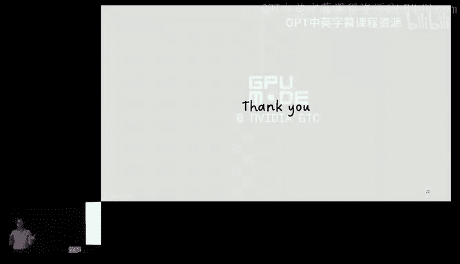

People have any questions， just raise your hand if you have any questions。

You did show the Moorese law scaling。 So how does the wafer scale engine fit into that of hardware scaling。

The wer。 So at the end of the day， you know。All of the chips start on a wafer， right。

 and everything shrinks at 10% to 20%。 Okay， the thing that wafer scaling buys you is that you have 10 of them connecting。

 you know， with cheap kind of interconn as opposed to when that goes through an interpoer or an off package bandwidth。

The issue with wer scale or any approach like this is the following。

 If your application fits exactly the size of the weer， this is magic， right。

 You have exactly the right amount of compute with the densest technology or interconnect。

 But if your application doesn't fit， because it's too big。😊。

Or can only take advantage of one quarter of this。 Then you other in the case doesn't fit you know。

 your limited by the off wafer interconect technology or the other way around。

 you way overpaid for what you're getting。 So integration is interesting now whether we should do you know。

 bigger packages right now with multiple dies or 3D or wafer scale。

 I think it's a good debate to have。 But I don't think that just going wayafer scale will solve everything。

 That's because you can guarantee that the applicationss fit exactly that size。

You gave for like for scaling out CPUs and databases in the 1990s right so yeah back then it seemed like you were running relatively lightweight programs and so it kind of made sense to distribute a bunch of lightweight programs across several smaller nodes and it kind of like the I could see a much better value prop for cloud computing there I'm wondering when you bring this analogy to GPUs。

I like I want to hear more of your thought process on what carries over since I don't know。

 I guess my mental model is more like it's kind of the opposite where we're running very large jobs or relatively much larger jobs that just straight up require like thes straight up require like Iraq。

 know And so what does this like multiten like this distributed this kind what is this paradigm mean in this GPU sense I agree with parts of what you said disagree with a couple of parts you're absolutely right the works are different。

 We would not do exactly the same Like we don't have to go to two so servers and flash the network and stuff like that。

 on the other cloud not either I haven't worked on Google search for a long time。

 but back in 201112 deployment of Google was a few thousand chips。Like， it wouldn't fit。Anyway。

 if you didn't have a few thousand chips there。 So， so cloud also had big jobs。

 and somehow the distributed approach made sense。 So it may be that in this incarnation will do more on the software side。

 Let's say we will do more slightly less synchronous AI that we're doing right now。

 rather than the hardware side。 But it's a good debate to have。

 I think thats the most important part here。 it doesn't give to be exactly the same as the end。

I don't know who's speaking could ask the question and the microphones are somewhere the back yet。

Yeah。Yeah yeah， I think my， my question is I think somewhat similar in nature to the previous one in that I I would definitely say like this idea of kind of like more like asynchronous。

 like more fall tolerance。 Like， I think everybody would love it。

 Like I think everybody working in the infr， like training these large models would love to have like more highly like asynchronous tasks。

 I think the big challenges just like。😊，Like this isn't what we have today with like these M models。

 And so I think like the from my perspective， I think the most dominant like bottleneck to kind of going towards like a more like commoditized compute type regime is's kind of not on like the inf or software side。

 It's more on like the modeling side。 Like you need to convince the M researchers that yes。

 you guys need to like tolerate like asynchrony。 you need to tolerate like nondeterminism。

 You need to tolerate like faulty faulty compute。 And I think this has kind of been like a hard sell historically for M researchers。

 So I agree with you the one thing that we assist people can do is we can do what， you know。

I probably call as as you know gonna do slightly as synchronous system。

 like know we can tell the AI people look， it's a mostly synchronous system。

 But every now theym gonna bend a few things to be able to get you cheaper resilience And doesn have to be know ho wild if you remember that fromware and so on where everything is completely synchron gonna be know slightly as synchronous in very small and precise ways to be able to get say resilience would be cheaper And this kind of ideas are easier to sell this is what。

 for example， like the scale of communities doing databases things likeual for quite some time。

 if you ask the programmers of databases， they would love to have know synchronized systems there as well。

 And some learn virtualual can be。😊，Manaageged， right， and， and， and and things advanced。

 But I agree with you。 It' not gonna be an easy sell。 Maybe you know， the catch is that， you know。

 we cannot wait for this thing to become a crisis because hard to takes years to build， right， And。

 and if it becomes a crisis， then gonna be three years。 we need have this debate now。

 So that by the time that is actually needed， we have something there， hard to arrange systems。Yeah。

 I would agree with that。 I I think it's just like， it's very。

Like in the world where people are spending like billions of dollars on like you know these like M training runs。

 I think it is a little bit of a harder sell to say then please introduce this extra like form of asynchrony or staleness。

 the good news that some this public on its own。 So if you need 100000 chips to be able to do your training job for most people that means two data centers or three data centers or for data centers。

 And even if you have dark fiber between those， typically you cannot control screen of that thing as well as if it was in the same building。

 So some parts of it are creeping in anyway。 So they have to think about a little bit。

 So maybe can squeeze in some ideas that。😊，maybe one week。 but you're absolutely right。

 It's the easy thing。All， I think if people have more questions for Christstos。

 please meet him after the happy。 We're gonna to have to go to next talk。 Thank you， Christstos。

たさん、そう、ザクさん。呃嗯。呃，让翻。Okay， so for our next talk today， you know， we have this like cool looking logo。

 but we're gonna give an update that's kind of cute。 And we're gonna talk about the popcorn project。

 So the popcorn project has been a collaboration between like many developers from GPU mode。

 from Stanford， from from Fair， from Pytorch to effectively build like an expert level GPU programmer。

😊。

So fundamentally， like even from the early days， the。

 the reason why Kuta mode at the time was created was for me and Andra to learn Kuta。

So the fundamental goal was to make G P programming more accessible。

And we still feel like GPU programming is still too hard。 It's still too damn hard。 effectivelyect。

 even the single most important kernel like written in human history， like flash attention。

 still took two years to write performance versions for H 100。 And this is， again。

 by some of the most talented kernel developers that we have today。And this problem gets worse。 Like。

 effectively， if you sort of like， look at like different kinds of models that people may want to run。

 you effectively completely bottleneck the pace of M L research primarily because we don't have enough human talent to go right。

 make all these things fast。So the idea was we would want to create in the open an expert level GPU programmer that anyone can use or reproduce。

 So basically， the model freely available， the data， the recipe， anything you want。

 We make it free to everyone。Okay， I had had some conversations before during over there。

 which was people like， you know， if I use cloud or1。

 they like frequently hallucinate like things they're not sure if Triden Ekuuta or if it's like or it's Pytorch and fundamentally we have this eval called Colonel Bench。

 which really shows us that all existing models are effectively bad。

 And it gives us like very concrete data as a way to measure progress。

 So this work was LED by An and Simon from Stanford。

 And it's like quickly become like the main reference like benchmark people use for kernelel alums like whether it's like Saana or or many。

 many other similar projects。😊，So really， the the main hypothesis we were trying to answer with this work is like。

 why do existing L Ms suck。 And our primary hypothesis going into this was because of data starvation。

 So how do we solve this。 So the first thing we're releasing is called kernelel Book。

 Colonnal book is the largest kernel data set on Earth。 effectivelyffect。

 what we did with this is we parsed all of Github。😊。

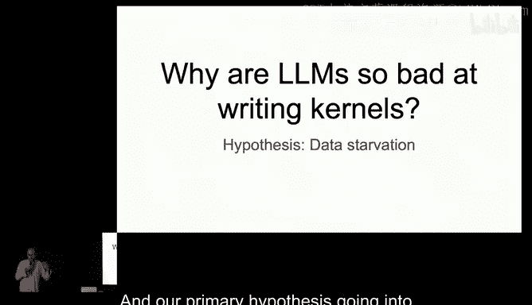

We took all all torch code from it。 Torch compiled it and got pairs of Trident code and like released it。

 So these are real models。 We also parse like all all Trident kernels that are in Giub。

 So this is like about 2000 of them。 So all of these are examples with permissive licenses。

 So if you'd like to study them or use them to train your own model。

 we now have like a new hugging face repo。 And this work was LED by Sahan。

 who will talk more about this。😊，The second thing was， well， still。

 like if you actually look at kernel book， you'll notice that there's like a lot of data is duplicates。

 So it's not the highest quality data。 So what we've been working on is kernel bot And what kernel bot is is it's effectively an engine for us to gather more high quality human data。

 We market it as like elite code like platform for people to compete on GPU kernels。

 where like one reference is like， let's say the Pyrich code。

 And then you write like a fast Qa or Triden or whatever implementation that you want。

And we got like essentially free compute from many of our amazing sponsors like Moal and Vdia。

 AMD and Nebus。 And what was wild about it is like even on a practice round on like toy PMPP problems。

 we ended up seeing over 2000 submissions in a couple of weeks。😊，And effectively。

 what we'll do is we're gonna host like multiple rounds of competitions like between 5 to 6 a year。

 and every round will release all of the submissions as a permissive data set for you to study or train an L Lamon。

 And we hope this accelerates the quality of like Colonels on the Internet。

 So this work was primarily LED by a lot of people in GPU mode from folks aren't here like Mattte and Eric and Ben。

 But you'll hear more details from Alex later today。😊，So again。

 this is like the fundamental formulation of the data set。

 like Torch compile has this like awesome flag called torch logs equals output code。

 And it can give you like trident code for any pi torch code that you might write。

 It doesn't look this nice。 but there's a couple more tricks that So will go over to show you how we made this happen。

😊。

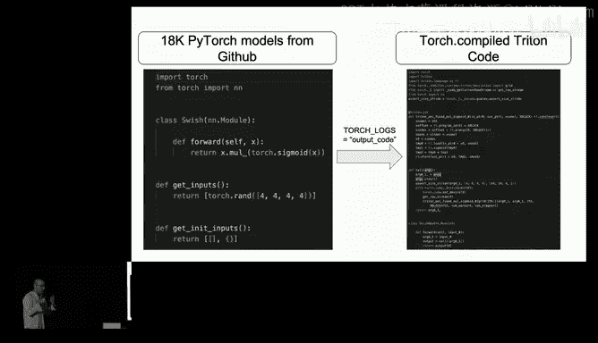

So the main contribution I want to talk about today is like really kernel L M。

 So this is a state of the art like SFT model。 What we did was we took the Lama 3。18 B baseline。

 which is just terrible。 And after SFing on this data。

 it starts to get like 17 kernels that are correct on kernel bench。

 And if we sort of do like a very toy reasoning loop as in just a pass at 20。

 we end up with an 8 B model matching the performance of a 70670 B model with deep sea R1。

So this is really just the start。 And there's a lot more what you need to do beyond translation to make this actually work。

 There's like other tasks we're investigating like minimal edit distance with maximal performance gain。

 kernel discovery， like discovering the next flash attention。 auto tuning heuristics。

 how fundamentally， like let's say you you create a kernel。

 like what is the bar to actually emerge this in a framework like byytorch。 And then finally。

 like abstraction discovery。 So these are like all hard research problems。 And if you're interested。

 please chat with us at the happy hour。😊，One that one we've made progress on is abstraction discovery。

 So the primary hypothesis here is that abstractions that are easy for humans are likely also to be easy for alums because they'll have a short lines of code。

 They'll be easier to reason through。 So we're really excited to share some of the progress we've been doing with thunder kittens where like it's ended up becoming like like a very easy way for。

 especially for unconventional architectures for things like based attention You can see like 10 x speedups over like a Trident or couta baseline with a library that's like about like 1 MB in size and that you can read in an afternoon。

😊，So yeah， overall， like our contributions here were kernelel Bench。

 which has quickly become like the reference kernel benchmark data， Colonel book。

 the largest kernel data set ever published。 Colonel Bot。

 like a viral platform for competitive GPU programming， Colonel L M。

 state of the R SF T L M Trident programmer。 and finally， Thunder Kitens。

 a simple library for blazing fast kernels。 Thank you。😊，All right。So without further ado。

 we're gonna tell you how we actually built this。 So I， I want to introduce like Simon。

 talk about Colonel Bench。😊，こだけ。O。However my name is Simon。 I'm a P student at Stanford。

 and we've been building kernel bench to see if the elementsMS can actually write GP PU kernels。

 We actually started been thinking about this problem for a while。

 We started doing this in the GP PU mode hackathphone last September。

And what the thing we to be concrete， what we wanna do is give a pie toch architecture to describe what the operators we want to write in this end our module。

 We saw this to a language model and wouldn't be great to。Take some of the operators。

 convert them to fast custom kernels， either in Kuda， which we started doing。

 And then we either triedton recently with the Pitorch team。

So the natural problem is that what kind of problems or workload should we run this task on to evaluate the language models capability。

And this is how we my kernel bench， which is a collection of 250 problems in pytorch across three levels。

 and will tell you what they are and why are they hard。

 So level 1 is bunch of simple single kernel operators like a matrix multiply or convolution。

 These are very hard because you already have very highly optimized handwritten kernels to compete against and level 2 take bunch of them together as some nonities and different combinations。

 This is to test the ability of the L to do kernel fusion。

 which is really important because you want to reduce memory traffic They want to write back and forth。

 and level 3， you go beyond the few operators， you go full neural network architectures like vision transformer or mom and this is very challenging because very long program and there might be some optimization in the algorithm that you can do。

So we take these Ls， we give them 250 problems and we try to understand， Okay。

 how many how do they do And to do that， we have we care about correctness has to be correct and how fast they are。

 So for correctness， we take the module the reference module in ptorch and generate the kernel andch program。

 we run them the same input random night couple times and see if they match。

 and we measure the wall clock time to computer speeds。

 So we care about across the problems positive data sets how many of these are correct and faster than pietorch。

 we care about eager more execution of compile but today。So actually， they're pretty bad right now。

 they don't get them really correct。 And if you get it correct， It's pretty slow。

 And across kernel bench， you get about the frontier models get about like less than 20% of the time faster than P torch eager。

 they are also correct。 And we， we barely see any crs that are like 1。

5 act faster than P torch eager。 So it's really challenging for them。😊。

And we try to understand why they are so bad at this。 If you look at the samples， they。

 they just generate like very syntheticly incorrect code like they really run code Triton code。

 un runable， even if they're runable they're not logically correct。 And if you tell them。

 they're logically correct， they don't know why。 And I mean。

 it's really hard for me to debug a kernel。 So I don't expect bunch of them。

 But even when they're correct and it's runable。 they're not that fast because they don't really。

 they write very simple code They don't really leverage all these fancy hardware features coming out like the tensor core and share memories which we try to tell them to use them explicitly and they are confused as well。

So probably the reason theyre really bad is not only G program is really hard。

 It' is also very scarcee in the train data。In like one of the most popular code。

 pre training data set， the stack， like less than 0。1% of the programs are coa。 And for Triton。

 we script the whole internet， there's like 2000 unique Triton code。

 and they're mostly like doing the same thing。So， but we're not hopeless。

 so Colel benchch provides an environment for us to know try new methods and see if we can actually know make progress in the benchmark。

 and to do this， we have a bunch of ground truth signals that we can provide people to try their fancy algorithms。

 for example， you can get theCC error messages for compilation errors you can use our es to check the outputs。

 can use the p profile and to get the operation breakdowns to figure out what slow and how you can speed it up。

 we start trying a bunch of them in our paper， like we scale testing compute， repeat sampling。

 do iterative refinement， use all these tools here and see if can improve itself。

 we generate a ton of trajectories how to improve and with labels of their speedups and we really solve them hoging face so you can do some posttrain with them。

 So many ideas to try。 and indeed even the last month all in February there are work coming out on kernel bench from video from。

From Saana。 so feel free to get involved。 If you're interested。

 we're adding a lot of features to kernel bench。 we're adding try we just adding triton。

 We are targeting different hardware， different programming languages。 If have a cool problem。

 you want to add kernel bench， let us know if you solve if you think you solved it， let us know too。

 But check our papers and。Yeah， and hear about the cool stuff we're doing next。Hi， I'm Alex。

 I recently graduated from Princeton， and I'm one of the core devs on the Colonel Vat project。

 along with Ben Mattay， Eric and Mark， who are all wonderful。 So this project。

 as Mark kind of mentioned before， is sort of meant to be kind of like the Cale or the code forces of GPU programming。

 So this is kind of its first purpose。 And the second part， obviously， is for data collection。😊。

So as Simon mentioned in the kernel Bch paper， one of the main takeaways was that GPU code is a low resource language。

 And so if we really want to make this work for a kernel LLM。

 what we're probably gonna need to do is gather some data for it。

 And the purest source of data in this form is you know， human expert written coup code。

So I really like this paper， the Limo paper that kind of came out recently。

 and it's very relevant sort of to this project as well。 So even if we build out this platform。

 obviously， it's gonna be hard to scale this code very well。

 So one of the things that we're kind of banking on here is that given a model that has sort of a sufficient knowledge base。

 especially of GPU code writing。 you can actually get away with training on a very small number of high quality samples。

 and this has proven to work for competitive math and competitive programming。

 And I think structurally， actually a lot of GPU coding is is very similar to how you would write or how you would learn how to compete in these competitions。

 So I'm very hopeful with this idea as well。😊，So I kind of want to talk also a little bit about how this competition has been going for those of you that aren't aware。

 It's been running for roughly a month now on the GPU mode discord。

 and there have been no prizes but so far we've had over 2000 submissions from a lot of people who are actually in the crowd。

 And so we're very thankful for that and we've had a lot of very。

 very interesting and useful feedback。 The other kind of thing that I want to mention here is that this entire leaderboard has been fully on discord。

 So everything has been user submissions on discord and the other thing is that we know GPU evals can be a little bit finicky。

 And so one of the things that we're kind of hopeful for here is that we make this leaderboard kind of an iterative refinement process where we improve on the eval as time goes on kind of like a living eval of sorts。

So I'm really happy to kind of announce and talk about the real round one and kind of beyond。

 as Mark mentioned， we want this to be sort of a seasonal thing where new problems come out every so often and people can compete over them so we plan on having real prizes that people can win obviously but another big change actually is in our practice round we kind of release all the problems at once and this is really hard for people because know you have the context switch between different problems and it's kind of a pain so one of the bigger differences here is that we will be releasing one problem a week and people can focus on these problems for a small set of devices and scoring will be based on your rankings on each of these problems and by the end of each of these problems sets you'll get like a final ranking so all of the problem sets as well will be somewhat themed and all somewhat related and the other thing too is that for any companies or labs or individuals that are looking to suggest any new problems whether it be related。

To like something that you want to do， or just for looking for talented people to come higher。

 I think this platform is a great place to do this。So yeah， it's really， really easy to participate。

 All you have to do is join the Discord， which I'm sure most of you are already in and you can just type one command。

 You basically just submit your script to the leaderboard。 We have lots of very nice documentation。

 We have a website coming up and we also are planning on doing CI submissions and actually Charles and I today added B200 support just for the day。

 only for today， though。😊，Yeah， but yeah。 so kind of the other part of this limo hypothesis that I talked about is creating a model that has a strong knowledge base。

 And this is a little bit more related to what Sahan will be talking about with the Colonel Book project。

 so。😊，Thanks， Alex。 My name is Sahan。 I'm a software engineer on Pytorrch and I've been working on kernelel book。

 or I guess the data side of popcorn for a bit。 We've been talking a lot about the data scarce through your regime。

 I won't go over a bit more。 but the point is we need more data And to do this we're doing two things。

 One， as Alex mentioned is the kernel leader board。 but it still in his early stages。

 Please do round one So we're still waiting on the data for that。

 However we like what can we do for kernel data exists like we trying a decent way of it is torch In fact Torch is like a pretty good way of learning like try and code itself。

 So we the idea like when don't we just take like a bunch of ptorrch programs。

 which both online and we can synthetic generate run it through torch and see what comes out and try to that which is translation task we're talking about earlier。

 So this is kind of what it looks like we take like some ptorrch program， we put it in torch logs。

 but get a bunch of craft So we kind need to scrap out all the craft guess like the prim。😊。

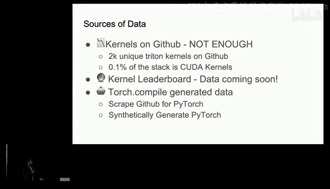

Do all that。 And we kind of end up with something that looks nice。 But more importantly。

 we kind of end up with like a data that looks like this。

 it's also kind of important to mention we also need to maintain kind of a high quality bar as can we write unit test for this thing。

 There's no graphs and stuff like that。 And interestingly。

 when we actually go through about 140000 programs on Github。

 we actually really only end up with like a 2。5% yield rate。

 And even then like only 50 of these programs up being usable of the yields like perfect。

 So we kind had to look okay， what can we do now because like we thought that wast enough data。

 So Alex and Simon， especially law work synthetically generatingtor programs。

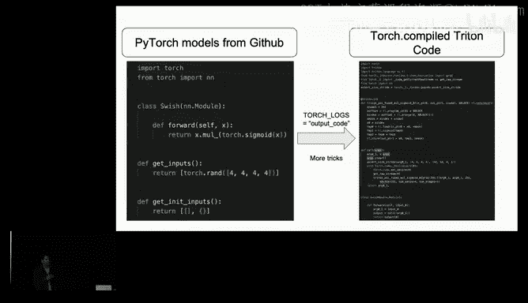

What the work here was doing was we took a bunch of Pitor operators from there。

 We did some like sampling， as well as controlling by diversity。 We asked an L M hey。

 create a Pi program from this。 and hopefully it's interesting。

 And then from there if it work we save it otherwise we threw it away。

 The really interesting thing here is because we had a control environment to create these programs。

 this increased the yield rate from 12。5 to like to about 75% which which through about 10000 samples gave us about 7。

5 case and generate programs we also have 18000 programs that we samples we have on Github。

 You can find these on the the hugging face or GPU mode as well。😊，Anyway， moving forward。

 there's a lot of stuff we can do， such as improving the yield rate or synthetically generating programs。

 But I think the really important thing to emphasize is the best data that comes from humans and you guys and through the current leader board。

 And outside of like as a data pwheel。 like Alex and folks worked really hard on making this a really fun and seamless experience。

 So please like actually use this thing。 It's like pretty fun to use。

 And it's meant to like be a community driven thing to test your coa skills and also learn G programming as well。

 And I guess there's enough data Yapping about data， let's talk about what we did with it。

 And heres Zach to talk about them model we trained with it。😊，Thank you。Right。

My name is Zachariized Fishis， I recently joined Fair at MA and Mark approached us to train an LLM on the kernel data set that San was building and I have the honor to present the work that As Stanford and the Pythtorch team and at Fair did together。

So the research question again， is， why are L L M so mad at writing Triton kernels。

 And we've talked about Kuta， but Triton， I would say is's even worse。 And what do I mean by that。

 So we take the kernel bench Triton variant that we mentioned。 and we just focus on level 1。

 the simple stuff， right？ And we all we ask is for correctness。 and we take。State of the art Lama 3。

18 B model。 And it gets 6 out6 kernels， correct， right？ And you think， okay。

 maybe that's not quite state of the art。 So let's go to G 4 deepse V3 these things。

 And we end up at 15 or 6 kernels that come out correct with almost with like half a trillion parameters right And can we do better than that。

 let's take2025 model， deepse R 1。 And we go to 30。 And using sort of the latest tricks in reasoning。

 And is that really good。 Well， actually， no， that's really bad， like 100 would be good， right。

 And and there there are 70 missing there。 And we don't really know it's probably not the number of parameters right that are too small for this so。

😊，What what we're gonna do about that， right the first thing that we always do is we look a bit at related work。

 And so the folks at Mia， they basically run an evaluation study targeting well they were targeting Qa as well。

 But they ensemble a bunch of state of the reasoning models from open AI and deepse。

 added some scaffolding around it。 And now the way they evaluate on kernel bench is they say， well。

 what's our pass rate if we pass at 20 is what I call this if we spent $20 of compute per kernel Okay。

 finally we can do that。 then our friends Nvidia， they also put deepse R1 into a loop and they used NC output as like feedback from let's say as a verifier and and they took that feedback Fe it back into deeps R1 to ask it for like improvements。

 that's also something something to do。 and we do pass at 20 minutes per。😊，Right。

 and then are the folks at Saakana， I think they have one of the interesting。

 most interesting approaches that that has been done。However。

 I think their results are a little bit work in progress right now because the， the。

 the optimization algorithms that they used are were probably a bit。A bit better than the。

 the test cases that they had in some instances， But they， they're going to update this soon。 And I。

 I think this is really interesting。 And in a nutshell。😊，All。

 all this related work amounts to is sort of test time augmentations around the problem， right。

 And so we wanted to， to answer the question， what happens if we。If we train an LLM on kernel data。

 right， our hypothesis is LL Ms are highly data starved in this kind of low， low low coverage regime。

 But I guess they can be trained。 And so what are were going to present today is only the。

 the very first step in this direction。 and the very the very easiest thing you would do。

 So we take this translation task with the kernel book that San has introduced。

 We take the worst model Lama 3。18 B that I showed you today。

 we add a standard instruction fine tuning recipe。And we will evaluate on the kernelonel bench Eval task。

 And with that， basically， behold the kernel L M， the results， I will quickly。

Go through them with you。 We jump from 6 to 14 correct kernels。 If we train on 6000 samples。

 So we said， let's double that。 Let's go to 12000 kernels。 We get 16， correct。 And we said。

 let's double that again。 But actually with the way that we were creating the data set where every kernel wants to be runable。

 testable verifiable。 We and we ran out of Github。 And so we added 7000 synthetic samples as well。

 And got to 17 correct kernels with this。And。Now， let's take a poor man's approach at test time scaling and put this into a passt K loop。

 We probably have a verifier。 If we just run it on GPU and compared to torch output。

 And so here the baseline jumps from pass at1 with 6 to pass at 20 with 14。

 Our train model jumps from 17 to 30。 And with that。

 we're basically matching a two orders of magnitude bigger thinking model， right？ And yes。

 we need the very very fire for our result。 So we take silver。

 and we leave the crown to deep cigar1 for today。😊，And this project is far from done。

 I think we're only getting started， but we see the potential there there。

 there are real limitations here。 So the this these networks make lots of trivial errors。

 They hallucinate APIs that are that don't exist that never existed where there are zero Google results for。

 but they're good enough to fool the Google AI overview。 But。😊。

So if you wanna learn about these hallucinations， just look them up。 But anyway， also。

 a Qua more quantitative error analysis kind of shows that。😊，We can， with training on， on。

 on this on this kernel data， we can move from like totally dumb errors where the。

 where it gets sort of the tritan language incorrect。 we can， and we can sort of move them to like。

 oh， the output was actually wrong or there's a shape error in the output。

 So we can move from really dumb。 You've never seen Triton errors to like， oh， actually。

 these are the kinds of problems that you wan to have， right， when you write Triton kernels。

 And then maybe we'll take it from there and。In summary， I think Colonel L L M， for the first time。

 goes beyond test time evil tricks。Even though I consider those tricks to be really important as well。

 we can under with a bit of an asterisk， maybe match the performance of a model that's two orders of magnitude bigger。

 and there's so much more left to do。 We need to scale to better models to larger models。

8 B is not really where we want to stop。 We need better data sets。 right， This is。

 this is just us creating the data set。 But so please do use the leaderboard。😊。

And we do need to research methods on actually tackling speed up。

 because all we were doing today is is sort of ask for correctness of the kernels， right， and。

We'd like to invite you to reach out to us。 We， we are。

 we want to share the weights as soon as we can。 The recipe is standard。 I'm happy to share that。

 So I think there's more than enough work for all of us。 please reach out and collaborate。

 And I think once we get this working， we'll be living in a whole new world。

 The one thing we cannot answer with this。😊，Is whether this is whether Tritan is actually a good representation for L L Ms to write。

To write kernelels or for humans。 But here to talk more about it。

 please welcome on stage Simran Aurora。Hi， everyone。 I'm Smerin。

 I'm a final year PhD student with Chris Ray at Stanford。😊，Alright。

 so I'm here to talk about Thunder kittens， which is a set of programming abstractions for fast。

 simple kernels for AI workloads。 And this work is with Benjamin Spector， my lab mate， Aen Singhal。

 an undergrad at Stanford and our advisors， Dan Fu and Christopher Raray。😊，Alright， so， you know。

 in my PhD， I've spent a lot of time as， you know， several of my lab mates working on efficient alternatives to our de facto model choices in AI these days。

 So， you know， we have transformers。 They are relatively expensive in terms of memory and compute requirements as a function of the amount of text we would like to process with them。

😊，In building some of these architectures， there's often been a gap between what ends up being theoretically efficient and what ends up being wall clock fast。

So the two challenges of hardware aware AI that we've largely， you know， come across are one。

 Some of the architectural choices that we make end up being in sort of incompatible。

 What's with what's actually quite fast on our modern hardware。 So， for instance， you know。

 some of the parallel scan algorithms， forego ability to use tensor cores and some of the algorithms require sort of uncoesced memory loads。

The other challenge has been that of tooling and， and system support。So AI researchers。

 when we have an architecture or an algorithm， will sit down and write it in Python。 So maybe。

 you know， Pytorrch。And under the hood， for popular operations， Pytorch will already call to nice。

 well optimized kernels。 But for the diversity of these architectures and algorithms that we would like to be exploring。

 it's really not flexible enough。😊，So， you know， AI people， we like to think in Python。

 that's gonna be， you know， my premise here。 And so on that same vein， there's Triton。

 which is a pythonic interface as as everyone here knows， to the hardware。 But in you know。

 providing this simplicity and more Python like nature forego some of the。

 capabilities are are access points that we need to get peak performance out of the hardware。

 For instance， fine grainined access over register memory or fine grainined control over asynchronous execution。

😊，On the other end of the spectrum， there are very high performance。

 very widely used and successful libraries like know， Ra Kuda or Cutlis。

 These at the time of this work， which， you know is over a year ago at this point。

 are largely C plus plus deeply nested templates， which are rather hard for you know。

 A AI people who think more in， in the vein of Python to you know， quickly adapt。😊。

So that brings us to the， you know， question here， which is just an art project of， you know。

 what are the trade offs between programming abstractions and how fast。

 simpleim and broad a set of AI workloads we can support in this while directed towards helping people and AI researchers write kernels could also you know。

 provide implications for models writing kernels and that， you know。

 interesting research questions there。Okay， so Thunder kittens， you know， in terms of the results。

 I argue has picked a very interesting point in this tradeoff space between abstractions and fast and simple simple AI support。

 So for relatively few lines of code compared to the C plus plus base libraries。

 Th kittens is able to provide competitive performance across different hardware platforms And compared to Triton and the more pythonic approaches that existed at the time。

 we're able to have comparable lines of code， know rough proxy for simplicity， not perfect。

 and still get quite large speed ups in terms ofterlops there while using a relatively small library side size again。

 just a proxy。 And this is not just one hardware platform。 but we have some Apple here。

4090s H 10s and you know Ben and Aion and folks have recently released B support as well。😊。

Just to briefly tell you what you'll see when you， you know。

 look at the repository and take a look at Thunder kittens。

 There's basically three folders in the library about types at the levels of basically memory。

 interface experience and asynchronous execution management or compute。So on the memory side。

 the experience is a lot like working with tensors and Pytorch。

 So the basic data structure is a tile that's going to be some multiple of 16 by 16。

 And the memory layouts are sort of automatically picked for the user based off of the data type precision and the tile size at different levels of the memory hierarchy。

😊，Once you start thinking in terms of these tiles， you'll realize you want to run operations on them。

 So these set of operations are things like multiplies or ad or X per M A calls， which are very。

 very inspired by this Python philosophy and Pytorch and Py library functions。😊，And finally。

 there is sort of a very opinionated choice of a kernel template that you can use to write these kernels where sort of you know。

 work partitioning， synchronization and， and you know， register reallocation。

 These sorts of things are taken care of for the user by the template And the user just kind of needs to fill in a couple of。

 of slots here for their code using the the functions and tiles I mentioned。Allright， And with that。

 Thunder Kitens has been， despite being more of an art project has seen interesting adoption on the research side is part of published work。

 which was our ultimate goal。 folks， I've never talked to have been using it to write some architectures here。

 It's also part of the GPU mode leaderboard so you can use it to write your kernels and submit your kernels。

' it's being used in industry at a few places， including high frequency trading and an inference company。

 And also more philosophically， it's been really interesting to see more and more pythonic DSLs in the sort of year since we release T kittens。

 I know like tiling I heard know cutla and 4。0 are taking more of Python approach And so we're very excited to you see if these types of new abstractions that are coming out can also simplify the experience of getting models to go and write couda code successfully。

 And then there are these research questions I。😊，About， you know。

 are the abstractions people prefer the same as models and how can we actually get models to learn to use these low resource tools。

 Alright， and with that， I will。听得到。All right， thank you so much， Simon。 I don。 It's fine， yeah。

So yeah， like really the whole intent of this project was to be built in the open。

 like all of our stuff is open source。 We were already collaborating between Me， Py George， Stanford。

 GPU mode。 We'd love to include more labs。 So please reach out to us like after happy hour with that said。

 I think as someone was talking about Th Kis I saw like VJ in the back sort of being like。

 no but Cu faster and simpler。😊。

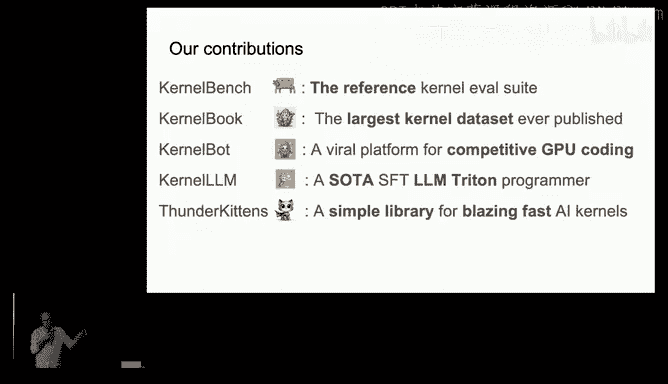

So without further ado VJ。 please come on stage。 Thank you。😊，Thank you。Thanks， Mark。Alright。

 while we wait for the slices to go up， I'll just introduce myself。 And my name is Vija。

 I'm on the cuttlas team Nvidia。 And I today， I'll be representing the work of the entire team。

 We've been very hard at work for the last couple of years working on the next major version of Cutlas。

 And I am very proud to be able to announce this on behalf of the entire team today。

 So let me give you a sneak peek of what the future of programming and Culass looks like。😊。

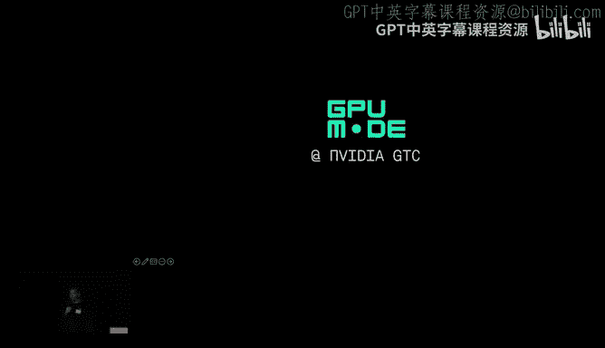

And with that， I'm going to fail with the A V。Oh， the bigger one。 That's right。 So what do we want。

 What is the， what is the reason for cuttlas's existence when cool B and things like that exist。

 Well， we realize that we want people to be able to write custom kernels for that big processor right there。

 right It's the entire rack scale computer that we want people to be able to program as a single distributed kernel and make it go at the speed of light and do whatever you need to do for your custom workload。

 right， So how do we achieve that。 Well， Culas has been around for a long time。

 Cus was first release as open source and back in 2017。

 and ever since then is its entire reason has been to enable people in the open source community to write custom kernels。

 It has nearly 4 million clones per month7000 stars and hundreds of contributors。

 right people like Tow have build flash attention to and3 on top of it and countless researchers do their pioneering M research on top。

 and we want to make sure that people can continue to design。New kernels。

 as well as use cuttlas as a reference for off the shelf kernels， both at the same time， right。

 Cutlas is many things at the same time。 And the idea is to expose a hierarchical set of primitives of these moving parts of a gem kernel or a convolution kernel targeting and video architectures so that people can use the highest level abstraction possible for the fastest time to solution。

 But then peel these layers away as they need to customize these kernels more and more。

 And that's where the elegance of cutlas comes in。So we want people to be able to write custom kernels for complex processors like the black web processor。

 And sometimes you really need to peek under the hood and understand deeply how the hardware itself works and what the instructions targeting that hardware look like。

So。What does the future of Cutlesss programming look like， Well。

 Cutlass is going to the next major version and it's all Python baby。

Here's how cutlas code is gonna look like in the future。

 You're gonna be able to pi installt a cutla wheel that's gonna ship with a Python DSL and an ML IR compiler。

 You write kernel in a completely pythonics syntax， it spits out something and out gets PT T X。

 you compile with PT T X。 you could compile with the driverit。

 you could compile with the PT that ships with the toolkit but the key idea is you have full control over the hardware。

 you are querying the thread I， you can issue control flow。 you can print from the kernel。

 which we know people love in order to be able to debug their kernel。

 And not only that you can also jit on the host side。

 so that whatever code that you are launching on the GPU side。

 you have full correspondence with whatever you writing on the host site as well。

 will have full support for torch and deal tensor formats as well and in the future jackx as well so that you no longer how to write these ugly pi binds shims between the ptorrch framework as well as the C plus kernel you can just live in Python call your kernel with Pytorrch tensors and you're off the。

😊，And the。Speedups that you get in compile times are dramatic。

 We're talking about more than 100 times faster compile times。

 A cutla C plus plus kernel that takes 25 seconds to compile today is going take 180 milliseconds in the future to compile。

 And you can just imagine how much more auto tuning you can do for your network within the same wall clock amount of time。

 You can auto tune or hundreds of times more kernel shapes so that you can pick even faster kernels。

 So it's not just about J times。 You can get end to end better performance。

 And speaking of performance。😊，It's within 1% of the cuttla C plus plus performance as well。

 So you're not making any compromises by going to the Pytor Python implementation itself。

 There's a much， much lower barrier to entry because there's no more C plus plus templates at all。

 And we know there's that's a large albatros around Cutlas's neck。 So we are very。

 very happy that a lot more people will be able to have access to the level of performance and control over the hardware that's never been possible before。

😊，Okay， and we are also considering all the talks before this。

 We're also hoping that LLMs will have a much easier time generating this because of the much larger training token dataset that Python has available for us。

So how do you get started with all this stuff where we're gonna have two really。

 really good GTC talks for you this year。 The first one is the Python cuts4 talk itself。

 which is going to be enabling Tensor core programming in python with cutt4 session I are listed over here。

 But then there's also the sister talk， which is focusing on the blackwell Tensor core as well as the cut C plus plus abstractions and they go hand in hand because the python Python framework itself。

 has complete one to one conceptual portability across C plus+ If you have spent time learning cutla and cute for the last two and a half years。

 none of that is going to waste it looks nearly identical between the two except that you get all of the benefits that I just talked about we're also gonna completely overhaul our documentation。

 We hear you from the community our documentation we can do a lot better on and with the Python stuff。

 we're moving to a dedicated web page under Docs nvidia com and is gonna have very comprehensive documentation just like nupy would at every single API entry point。

So rest assured。 And， of course， this Python also allows us to have Jupyter notebook so we can show you tutorials of how to write optimize kernels for all the Nvi architectures。

 And there will also be examples that are copybaable and ready to go for like flash attention2 gems that target Mp。

 Hopper and Blackwell。 Oh， by the way， I forgot to mention cutla4 will support every architecture starting with MP forwards。

 So there's a large set of architectures。 you can already target Good to go。 If you have a Gfor card。

 you're also good to go。😊。

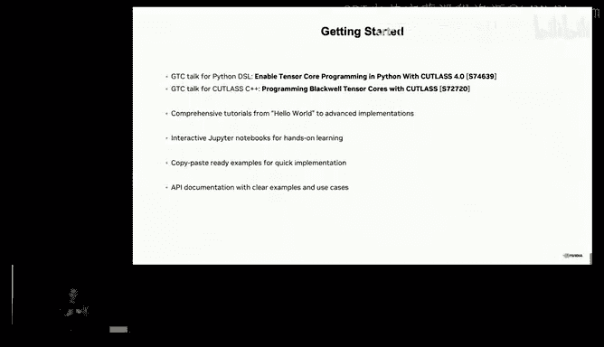

And with that， that's the end of my talk。 I'll just leave a couple more talks over here at GTC that I think you should go watch。

 And with that， I'll hand it back to Mark。All right。

 did people figure out who are super secret guest speakers。 He's in the room。

 He's sitting in the front。 I won't point。 but you know， about 18 years ago。

 GPUs were still fundamentally graphics。 like there was like primarily a hardware to accelerateel graphics programming。

 And there was like one person who figured out how to turn this into a general purpose programming platform。

 basically Fastper C plus plus with a project called Brook Brook GPU。

 and later on ended up inventing sort of a nice cute little project called Kuda。

 So without further ado， I'd like to invite you in buck to the stage。 Thank you。😊。

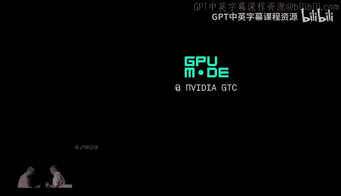

This works， otherwise I'll use yours。Hey， thank you。 And thank you， Mark。

And it's a privilege to be here， I'm sorry it took so long to get me onto the stage。My names Ian。

 I thought it would be fun and interesting to talk a little bit。

 You guys are about all about making GPU programming easier and more accessible。

 I really enjoy and that's done through libraries through DSLs。

 through benchmarks but the way you introduce GPU mode was let's just get a better tool easier to use and out there more。

😊，I couldn't believe that that like motivated me from the very， very beginning。

 So in perhaps instead of talking about how much。I'm gonna。

 you know what I'm working on to make GPUus better。

 I do have a little bit of perspective of how hard it was to program GPUs。

 So I thought at least I would give a brief history。

 at least brief background on what it was like in the very beginning of this whole journey So yeah。

 I joined N video in 2004。 But I actually been kind of thinking about I'll say graphics as a compute platform all the way back in since。

My undergrad， I noticed some Princeton people here。 I did my undergrad in Princeton。 Thank you。

 that was awesome to see in the computer graphics lab。

 I was sitting up there back then dating myself。 There was a lab。

 actually a lab with with a bunch of machines from a company called S GI， which is no longer around。

 but they invented a graphics API called Open GL， and I was a graphics geek coding and loves computer graphics as an undergrad。

 I but along the way。😊，As I was hacking and hacking and hacking computer graphics。

 kind of realized that maybe these this graphics thing could be used for more than just playing video games or doing my graphics graphics research。

 and we actually one of my first people always asked me what was your first like Ka program。

 actually my first GP GPU program。 They called it back then was thermal diffusion。

 I had a little simple simple metal block。 and I simulated the thermal diffusion and I followed up with an Aviokes equations and actually simulated the full navi Stokes equations on a SGI octane And the only way you could compute back then was with triangles every pass of the PDDE solver was one giant triangle that covered the whole screen and I would you didn't even have。

Programming back then， it was just open G L convolution expressions and trying to do additions and math。

 And I see Mark Harris here for the first thing， Hey， Mark， he。

 he could tell you all these old stories， GP P programming。😊，Sucked。😡，It was really bad。

 So this is a slide deck that I did for my Siggraph paper and， you know， kind of talking about。😊。

Like it should be this easy。You know， I just wanted， you guys are doing kind of tensors and matrices。

 I was just trying to add two vectors。 It was way harder。

 You had to create this thing called a floating point P buffer。

That's Microsoft Windows and like this pre MFC code， it was every before there was MDD。

 there was ATI， it was with direct X， it was awful。That was just to get like a workspace。

 And then you had to create some floating point texture， everything。

 like it was a floating point texture， but everything was blended for pictures and images。

 So if you tried to do additions， it would try to like smooth out your texts for you。

 So all my numbers would just smear across。 and it was terrible。

 And actually turn that off was a real pain but you had to write the actual ad shader。

 you had to copy stuff to the GP， then you had to render shader quad。

 then you had to re back from the GPU。 And then you actually added two vectors。😊，And。

That was my Siggraph lightning talk in 2004。 I didn't say anything。 I just let it play through。

 got it。 They really enjoyed it。 I still enjoyed it today。 I want to， first of all。

 should definitely want to thank everyone for making GPS easier since then。😊，The so back then。

 my PhD turned out to my thesis was a project called Brook。 Let's make this easier。

 was kind of the engineering momentum。 But also to think about， hey。

 how can we use these new kinds of processors， these things called GPUs。Apparently， they're fast。

 They were fast。 Actually， they have way more floating point than what CPU had even back in 2004。

 They were just really hard to use。 I， I was in as a grad student at Stanford。

My friends were getting hired by hedge funds because so they could like write GP GPU OpenG and directx code because they figured out that the stock pricing algorithms ran really fast on GPUs。

 It was like a ninja trick。 You had to be a PhD in computer graphics and systems programmer and a domain specialist and good luck。

 some of my but so while there was a ton of， you could actually back then get a PhD by coding and being an expert in this area。

 my research went into making GPUs easier program and more available。

 started a project called Brook Brook was a how to write in a way that programmers could understand programmers could use。

 it was compatible but still ran on GPU， which really only did computer graphics。 It was really hard。

 GPUs couldn't you couldn't do a scatter。 You couldn't write to any arbitrary place memory。

So everything had to be written where the render engine wanted it to go。

 So it turned into quite actually a functional based programming language because you had coded backwards。

 you knew where you could write， you could only write to that location and you had to write your kernel on top of that But if you go read the book paper。

 you'll see very early ideas around Kuta。 It was based on this concept of streaming because it helped with the memory model because you can write you had to write to this one location。

 but we did a bunch of stuff we did ray tracing。 We did Martian cues， we did FFs。

 we did matrix multiplies。 I think it's still on source forge That was pre Github。

And you can check it out it would read the paper so doing this research。

 obviously N video was down the street， I was a graduate student at Stanford and had a great time sort of building this thing getting getting I made it open from the very beginning and that was really cool。

 got a lot of different people interested and Stanford was as a great place for collaboration。

 I walked across the street to the bioex building and I worked on molecular dynamics with one of the researchers there actually still to this day Gmax was one of the first programs ever scientific computing programs ever used on Bro。

😊，And today， I think still does I meet with them every time they come to to video in a talk。

So obviously， video was a big sponsor。 They helped me。

 They gave me a grab's card every once in a while。 I think we'd still do that。

 I try to do that and then we， they came in。😊，F of the work。 you know。

 they'd come over and they' talk to me about it。 And I thought they were really interested。 Really。

 I think they were just looking for。I'm going to hire。And in 2004， they came by and they said。

 I was basically finishing， I was finishing up my PhD and they gave me a job offer。

 It turns out when I got there， they had already started on the next version of the GPU called the N V 50。

 which eventually became the Gfor 8800 way back in the day。

 and they had the hardware idea and the programming model， kind of already baked。

 They'd read all the papers。 They'd seen what people are doing and they fixed some things。

 You could write to an arbitrary place in memory now。 you could read。

 they also had a very much more simpler。😊，They， you know。

 could turn off all the graphic stuff and just give you access to the core， which is great。

 They also added floating point， like real proper I Tri E floating point to the core。

 So we had some real F P 32， No F P 64， but 32 B floating point。😊，And all the major C types。

 which is great。 What they didn't have is how to program this thing。 So I joined as a。

And I had interned in Nvidia before。 actually， was I started my first internship was in 2000。

 So I got a write really cool low badge number， but I joined for in and joined officially。

 I could and started Kuta。 When we started Kuta， I gotta tell you， everybody thought， hey。

 let's make the Wales next great programming language。 And you know， I had all these ideas。

 and we'd go out and we'd actually meet all the developers and meet all the companies that maybe would want to be interested in computing。

 Nobody wanted to learn new programming language。😊，It was a bad idea。 They had。

 We met with the hedge fund guys and the the oil and gas guys and the scientific computing guys。

 They had programmers。And those programme really just wanted to use the GPU。

 They did not want to learn new programming languages， new concepts， new。

 new abstractions as our PhD student， I was offended。So the idea around Kuta is very simple。

 start with C。And give people the most like Brooke a really easy way get access to GPU。

 And that's why we call the coa because we gave the letter C in front of this thing called UD。

 which is the unified driver architecture， which is a thing that made Nvidia successful in graphics and and was the core of our architecture。

 So C for And so that's what we did。 We added it was only two simple language extensions。

 the angle bracket syntax。 and some decal specs， just to say this car front on the GPU。

 I you should run And so I could teach you Saxby in one slide。 I really。

 really wanted to teach how to add two vectors， Saxby in one slide。😊，That was really good call。 So。

 again， make GP Ps easier。 Star joining in know 4。 We actually launched in0 6。

 Can you visit with the hardware， Lots of fun stories there。😊，And it it surprise it didn't。

 It was exciting to the research community。 It did not take off immediately。

 despite the success you may see today， it actually took about 10 years for us to actually build a real business around computing。

 This is just because the people， you know getting it out there， getting access to GPUus was hard。

 I'm sorry that getting access to GPUs today is hard。 still。😊。

But we did one important decision back then， which was make。Kuda available on every GPU。

II think we kind of take that for granted for now， but that was a really big important decision that I didn't make。

 My boss made like we should put this capability in every single GP， including the gaming GPus。

 It was a painful decision， adding F P 32， adding all that compute logic。

 adding all that silicon area and supporting every GPU going all the way back 2006 in that G4 8800 to this day。

 huge cost actually， at one point， there are stories of Nvidia stock price crashing because it was just so how expensive it was to build these chips。

It was a。The best decision I think， for Kuta that could have ever been made because everyone。

 anyone who had a gaming laptop， a gaming PC something could download free Kutuda and just run with it。

 So make it easier， make it more accessible totally the mission joining a video。

 I had to actually create a couple of useful things。

 We had a first thing was a FFT library and a boss library and a math dot H。

 I got to compile their person and sort of build it up from there。😊，Fast forward。

 it took about 10 years， lots of successes along the way， built up in supercomput。

 basically everyone who really needed the time and energy to actually accelerate and do work。

 get compute to have an outcome and could take the time to build these things was very successful。

 of course， until the Alex N only hit us。A couple things when Alex so shy， he sits in the bed。

 if you've met Alex， he's a very humble person。And he was actually working Nvidia had the story around Alexnet is we were certainly this is about。

 I can't number 10 years in， yeah eight years in， we were obviously working with all the academic communities folks exactly like yourself and with Fe Fei at Stanford and the Inet competition and and they were kind of stuck in computer vision for。

And like 70% accuracy，60% accuracy， really not enough for like commercialization。And Alex saw。

 you know， had this idea of a。Convolutional neural network， where it's not a fully connected network。

Is you know， was an idea。 And he saw that the math he was doing for his convolution neural networks was the same kind of math that we had done for H PCC and scientific computing。

 He downloaded Kuta。 He had bought a， I think it was an R T。

The names have now cycled around a few times， just for the record。I think it was an R T X 55。

80 or two of them。 put them in a PC download a coulda。 And sure enough that it went fast。

 what took what would normally would take an entire semester， he was able to do in a single month。

 There was another guy named Ilia， who was also working on a similar problem。

 He was taking his work was took like， I think an entire。

Six months or something like that and got it down to three months， and then its one month。

It's a terrible way to get a PhD in AI， but we made it a lot faster for them made it easier。

 And as a result， he crushed the competition and immediately took off in what was like inside Nvidia we were helping called Kutak Kavanet was the original。

 I think the first AI framework。😊，Pivotted the company， You know， find， well。

 how can we make this easier better？ That was the beginning of Co D N and making a library。

 just a library that could make it easier， more accessible。

 So you guys didn't have to write all the damn kernels。 I'm sorry that mission failed。

I think I think Tritons super cool。 I think finally， we have a DSL that can actually build kernels。

 I know it's not the only way to do build kernels。 I like cutlas。 I like Triton every。

 the way different ways。 And now we actually have a ecosystem and actually。

 Python is a much better way of doing it of DSLs that can help us explore how to hell to build fast and efficient kernels。

 Certainly， the other big moment that happened for us。 I can tell you about， which is Bt。😊。

Burt was a really transformative time at a video because basically it's unsupervised learning you took the。

Download the Internet or a page of the internet， remove some words。

 ask the model to fill in the words， see if it got it right。That process did not involve a human。

And and there's a lot of pages on the Internet。 So that caused an explosion。 By this point。

 our GPS are getting recognized by Google and others and people are are swarming this。

 But once you created a way of learning that was unsupervised and scaled to the scale the Internet。

 you can imagine this was the birth of large language models。

This was also the time where we're starting to build more tools。

 trying to figure out how to make inference better the start of Tenor R T。

 the start of other expanding the number of libraries。

 it's around when cutlet starts getting created， building more and more libraries for accelerating models like like B。

 and all the different language models that happened there after that。 Finally， deepse， like damn。

 those guys really wrote some amazing code。😊，If you look at the kernels。

 if you look at what they've done， they turned every knob and cranked and exploited every opportunity to make things run fast。

 not just their latent attention methods which are really cool but the way they use the RDA features by pulling the data right out of the GPU and getting it across to the next one to take a model that's 671 billion parameters with 61 layers and 256 experts with a shared expert and getting that to work across Infinibband is takes me back to the original GP GPU days。

And just not being afraid to go down in in the weeds and get to get the kind of performance that they do。

it is great to see this community still thriving。Finding ways to optimize， to exploit performance。

Not not being afraid to go down stack， upt。 And then again。

 we'll all learn from it and figure out how to make like I've seen here tools that make it easier。

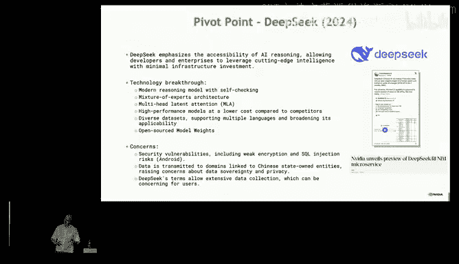

And more accessible。I think I get to play a lot of hardware now。

 So hopefully you guys will get to enjoy as well。 I'm really excited to see。😊。

B 200 and blackwell in the market， like the hackathons that I were having today。

 you guys are already， I already have folks。 we runningllama on these on these on racks today。

 just saw some benchmark performance numbers by one of the cloud guys。

 They got this working on the M Perma benchmark at 800。 sorry，888000 tokens per second。 Alllama it。😊。

That's like。I think that， so I did the math， I believe that is the entire Harry Potter series in like a second。

And it just keeps going。So this is， I now get to do it。 both。

 I spend probably less time in Kuda and library strategies and I。Then I'd like。

 but I think it's an opportunity for I get to also， while I help this。

 I can also figure out how to make that easier to program whether this switch or that network or these pieces come together。

And I， I really， I really very， really enjoy it。 So thank you for inviting me。

 I'm happy to answer or take any of the questions。 I will add with one more thing。😊。

The early GP GPU days were super fun。 you have a lot of these people here。

 a lot of stuff was moved on hacked on a GPU， it's not just about AI， I still get to talk about。

Molecular dynamics， plasma physics。And all the other use cases。

 and some of my colleagues back in the day are still here。In， in fact， in 2003。

 I got to work with a guy named Patricice Sard。And this is back when the early painful GP P GPU days。

It was something called direct compute。It was written in C Shap。It's interesting language。I love。

The get and set operator is pretty cool。 after that， I'm not sure。

 And then you really don't want to use it for graphics， but that they， we tried。

 but I wrote G P G P program。It was a two layer。Bly connected neural network on N Nist。

And ordereded it to indirect compute with C sharpp。In fact， and ran， I think。

 and published the paper actually in 2003， which I think is the first。GPU AI program ever written。

 And if you go find it， it's pre archived。 It's in there somewhere。 And yes， it was faster than CPU。

Thank you。哦。Okay， wow， so Ian's interested in taking questions。

 but I need to jump the queue for a second， which is 10 years。 you know no product market fit。

 I'm imagining some and video director being like like Ian。

 like you know the problem with this is that it's not simple。

  customers want to make fast function that paras their code。

 And so how did you manage to have conviction that you needed to really build a programming model when you didn't have product market fit for so long。

 I was very fortunate to have a founder CEO。😊。

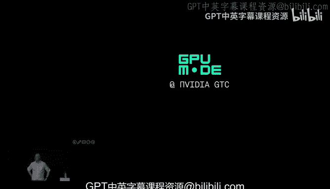