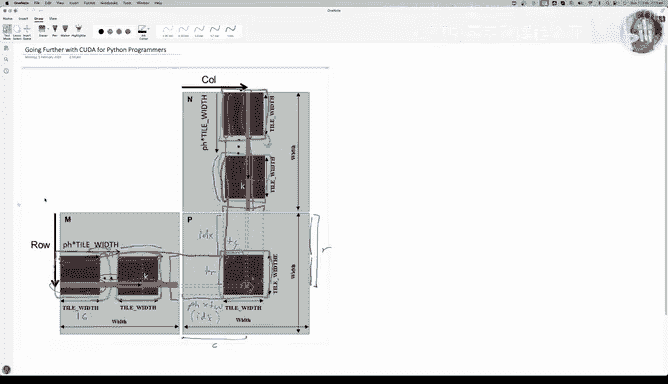
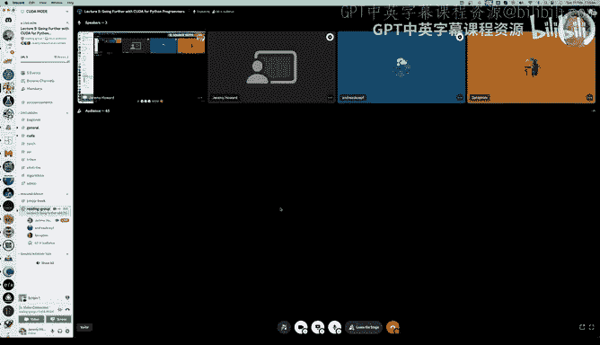

# GPU MODE《CUDA、GPU编程1-53课｜GPU MODE》中英字幕（deepseek-v3.2 - P5：-20240217-Lecture 5_ Going Further with CUDA for Python Programmers.zh_en - GPT中英字幕课程资源 - BV1QZ421N7pT

So welcome this is going further with Kuder for Python programmers as the name suggests this won't make too much sense unless you've got started with Kuder for Python programmers。

 the good news is that I have a video calledGeting Start with KudD for Python programmers。

Start there， it's only a bit over an hour long you might be surprised at how quick and easy it is to get started if you haven't so assuming that you have got started。

Today we're going to be looking at the most important next step。Of taking advantage of Kuda。

 which is we've already learnt to take advantage of the thousands of threads that you can run simultaneously on a GPU today we're going to learn how to take advantage of the incredibly fast memory。

So in the up till now， although we haven't really talked about it。

 the memory we've been using is what's called。Global memory， it's basically think of this。

So have this is the same book we looked at last week。

 which we do recommend programming massively parallel processes and the stuff we'reing today is largely covered in chapter5 of that book。

In this Kuda mode series there's a lecture from Thomas Venneman which goes through this and the previous chapter in some detail。

 and so that's actually a good video to watch maybe after this one or before this one either order is fine they're covering seven mode material in different ways。

The key thing to understand is so that we're looking at here today is that this。

 if we look at this box here， which is basically you can think of as a GPU and in the GPU。

 you have global memory。 Global memory is basically what we've always been using so far when we just。

Put when we say like Doc Kuda in Pytorrch， it's actually putting the tensor into global memory。

Clloral memory is。Pretty fast compared to some other types of memory we might be used to。

 but it's far from the quickest memory available in the GPU， in fact， this shared memory。

It's much faster。Um。Shared memory however， is not global。

 which is to say that not all of the threads can see it。In fact， as this。Bux indicates。Shared memory。

I's something that's only available。To the threads on a specific streaming multiprocessor， SM。

 or in co a programming world within a block， so all of the different threads in a block can access shared memory。

And the reason we care about this is that shared memory is about。10 times faster than global memory。

 And because。Kuda， with all of its simultaneous， thousands of threads running at the same time。

 it's so incredibly quick because GPUs are so incredibly quick。

The speed at which you access memory turns out to matter a whole lot。

 so being able to use this shared memory effectively is as important as being able to use the thousands of threads at the same time simultaneously is important so in the last lecture we focus on how to use all of those threads and today we'll focus on how to use shared memory。

Those two things will get you quite a long way in terms of creating pretty fast。Coder code。Okay so。

Reippo。For。These lectures is the coa mode repo。And specifically， the kuda mode slash lectures repo。

 And in there you'll find there's a lecture 5。 You don't have to have seen all the lectures beforehand。

 but they're certainly all useful。 Just need to have seen lecture 3， which is the 1 I mentioned。

 Le 5 is where today's notebook will be found。And here it is。Okay， so。

One thing I'll just mention that I've added。Is a little us。

pyy where some of the stuff that we used last time and we' use quite a bit。

 I've just put it all into a a script so we can access it multiple times。So we've got the C diviv。

 which is sealing division function， the little load inline wrapper called load Couda。

 and the little kind of prefix we have that has the hash includes and the stuff we're going to need there。

嗯。And so you'll see that we're going to import those here。Other than that。

 we're going to import all the usual stuff that we like to use。嗯。Last time we used simple namespace。

 but actually thought， let's make things closer to。嗯。

Let's make things closer to how Coa does things and let's create a little thing called D3。

So this is looks， this is a。3D grid with an x， a Y and a Z using the cany little Python named Tuple functionality。

 So here's a nice way for us and we can just like inr。Provide as many。Of the dimensions as we want。

Today we'll be doing two dimensional grids。So there'll be implicit0 equals one。

So we can access these as D dot x and D dot Y， for example。Like before。

 we'll use wallet to print stuff from Kuda if we want to。um。

Kuda launch Bing is helpful for debugging， so you can turn that on if you want it。

And so today we're going to do a matrix multiplication of a 5120 by 256 matrix M1 by a 256 by 5120 matrix。

And two this approach of going from。嗯。Next， it's not true。 Okay， yeahep。So。

like before we're going to start by looking at pure Python and so pure Python' is going to be really really slow。

 so to handle that we're going to create a sample of the first matrix with the first four rows and a sample of the second matrix with the first four columns。

And so we use that for our pure Python example。 Allright。

 so just to remind you what we've already done in the past is we created this。

A simple kernel runner that goes through every block and every thread。Not real blockss and threads。

 They're actually just integers and cause some kernel， which is not actually a kernel。

 It's just a function。 And I'm going to use D3 now。 now that we've got it to pass into that。

 And so this was our previous matrix modification。 We grabbed the row。

 We grabbed the column from the。Indexes we passed in。We have a God。

And we then accumulated our dot product for whatever particular row and column we're filling in。So。

This is basically the ignore the。Extra details here， but conceptually。

We're just doing this dot product， for example， to fill in this is。So if we're filling in this here。

 then。This is a。And this is。Ci。So this is comm C。And so we're doing the dot product between。

That column。And that row。And so that's what this looping is here。

 so I is going through all of the elements of the row in the column。And。Multiplying， adding。

 and then putting that into the output。 So that's what we do。 We have a。Ass I called Cannel。

And then we created something that would call the kernel by calling our kernel runner。

 passing in the function。We need our blocks and our threads per block， which are just dim three。Tups。

And then we pass in our flattened data and any other information that's required。😊。

And so we can check that that matrix multiplication result using these small sample versions is close to the Pytoch。

Vsion。And it is。And then we also looked at the coder version and the coder version we created by pasting the kernel into chat EptT and it's bad out something which we hardly had to change at all to get this and the kernel runner also looks very similar except that the syntax for calling a kernel inr is different with this weird tripleple angle bracket。

To make life a little bit simpler for myself， I， you might remember before we had the CPP source where we would copy and paste。

That into a string， I got a bit bored of doing that manually。

 So I credited little get signature function that just uses a regular expression to automatically find that line of code。

 And so。For the rest of this lesson， I will be getting this CPP source automatically in that way I don't have to worry about changing it。

Um， and， but you can see that redjectx is just returning the necessary line of code。Plus。

 the semicolon。So that makes life a little bit simpler and I like being simple。😊，Okay。

 so then we go load Kuda。 It ran very quickly because I've already compiled this once and Pytorch caches that。

 And this is actually another change I made since last time is that in。The load coder function。

 if you don't pass in a name。Then it uses the functions name。And。That means that。Pytorural cache。

 different versions of your code with different names for the various different things you're doing。

 so you won't lose your cache each time， so that's handy as well。Okay。

 so now we can use the full matrices because we're going to be nice and fast。

 we need them to be conticiguous and coer， so well create M1c and M2C for that。

And they should be similar to the result of。Py to doing it。And it takes about6 milliseconds。

One thing I wondered about is how long of that six milliseconds was it actually running the matrix modificationplication compared to doing all this other stuff before it so I just commented out those two lines of code and reran it and that took about 50 microseconds so that's 0。

05 milliseconds so very little of this time is kind of overhead most of this is actually doing a matrix modificationplication。

So I think that's an encouraging start。😊，Okay。So how do we take advantage of shared memory。

 The problem here is that in our in allopia M and N our global memory。And so in this loop。

 that's happening k times。We are reading from global memory again and again and again。

And that is a bit of a bummer。So there's a better thing we could do。

 which is instead we could use shared memory。 Now the problem is that shared memory is quite small。U。

So we need we can't just dump everything into shared memory for every single thread because we've got lots and lots of threads running at the same time。

 or I should say for every block。嗯。😊，So we've got lots of blocks running at the same time。

 if every one of them had the entire matrices in memory for every block。

 that's going to be an enormous amount of data and that's going to be far too much for our GPU to handle。

😊，So to deal with that， what we do is we do something called tailing and a tile。

There's basically so we're going to pick a tile width of 16， so whoever it says T width here。

 we're going to use 16， we basically say， okay， if we're going to calculate let this R comm C thing here。

Right。Instead of doing the entire dot product of all of this row and。And all of this column。

What we could instead do。😊，Is just grab。First little bit of that row。And the first little bit。🤢。

Of that column。We protect the dark product of those。😊，And put them into our commerceacy。

And then we could do that again for the next tile across and the next tile across and so forth。

 and this is what this dot dot dot here is。And the next tile across and so then， you know。

 eventually we get to this。Bit of the row by this bit of the column。

 take the dot product of those and add them up to the existing R commerceacy output we've already got。

And so。That's just， it's doing exactly the same thing。

 but rather than doing the dot product all at once， we're doing it。One step at a time。嗯。

That's not interesting of itself。 but what is interesting is you might notice that。

Let's say for' calculating this bit here。Let's say so this is thread0 comma 0。

 We can do the same thing。 We can take the first。Little bit of this and the first。

 little bit of this and take their dot product。And that gives us the first peace。

We've got a need of that one， and we can do that again and again and again until eventually we get to this one and we do this bit times this bit。

And we keep going all the way to the end until there's the final。Tile at the end。

And once we've done that for all of the bits， eventually we're going to have the correct answer in zero comm 0。

😊，Why is that interesting， Well， it's interesting because we could reorder this rather than doing。

The whole first little bit of this row and then the next bit of that row and the next bit of that row and the next bit of that row。

 instead what we could do。As we could calculate。嗯。0 comma 0 for the first tile and then we could calculate 0 comma 1 for the first tile and notice this the0 comma 1。

 it's exactly the same row as we had before。but a different column。

Now with a normal kind of CPU style thinking you'd say like oh maybe this will be in the cache so this could be faster that doesn't work in GPU programming and GPU programming we instead use shared memory so we could have put this into shared memory and if we had done so then the second time we use it we don't have to read it from global memory it's already there in shared memory。

And then the same thing will happen when we get to the second row， right？

We could put that into shared memory。And then we go the second row of that tile times the first column of that tile is needed to do。

1 comm 0。And if you think about it， we've already accessed。The first column of the tile in n。

So if we had put that in shared memory as well， then we won't have to get that from global memory either。

😊，So maybe you see where this is going。 what we're going to be able to do actually。

 is before we do any work is we'll put this whole tile。😊，Into shared memory。

And we'll put this whole tile into shared memory。And then we'll take the matrix modificationplication of the two tiles。

And that will give us。All of the first pieces of the entire tile output and then we'll do the same for the tile one to the right of this one and one underneath this one and we'll take the matrix product of those and add it to this again and so forth until eventually again we get up to here。

 we put that whole tile。Into shared memory， we put that whole tile。Into shared memory。

 we take the matrix product， which again， remember it's just lots and lots of dot products。

 the column and road dot products。 And so all of those are going to be able to use shared memory。

 and we again we add them to the outputs here。 And so once we eventually do that for all of the tiles。

😊，Or you will have finished calculating。These outputs。

So how many times did we read from global memory？Each of the input elements only got read from global memory once。

And as soon as we grabbed it， all we did with it was we put it into shared memory and then the actual dot product was entirely done from shared memory。

And that's how we make this。Faster。So。To do that。😮，Let's use Python。Playlan Python。嗯。

And we're going to basically try to design something in Python that looks a lot like how kuda is going to do it。

 and then we're going to autogene kuda just like we have in the past。So。In Kuda。

 the kind of maximally flexible way to do things is what's called dynamic shared memory where you tell Kuda。

How much shared memory you're going to want？And it puts it aside for you and then in basically one contiguous block with a pointer to that block that you will have access to。

 which is the same as an array， and then you basically grab from that block any of the pieces you want。

In Python， we can do exactly the same kind of thing by using a trick which is true for both nuy arrays and Pytorrch tensors。

 which is that views into those tensors are riable， so if we create a tensor of length five。

And then we create a view of the first。Three elements。And of the last two elements called B and C。

If we then modify B。It actually changes a。Because they're a view of the same memory。

 and if we change C。It'll also change a。And so that's going to be handy for us。

 you'll see why in a moment we're going to basically use our shared memory like that。Now。

 the thing is we've got to restructure our。Colonel Raner a little bit。Because。嗯。

We have two steps now， step number one is copy all of our input into shared memory。

 and then step two is take the dot product。And so that doesn't quite work。With our previous approach。

Because we just have one big loop and we just have one thing that we do。

So I've changed our Colonel runner。To create a。Shared memory Colonel runner。

I still got the same loop through B。y， the same loop through B。x， this is up pure Python again。

And here I'm going to create our shared memory， and so this is now going to be passed。😊。

The shared memory into each function。So all of our threads are going to be have access to the same shared memory。

😊，Now we don't actually create the threads here， so instead step number one is in my kernel。

I'm actually going to do the loop through the threads manually。We'll improve this in a moment。

 don't worry， it's pretty messy with all this kind of duplicate code。

 but at least it's nice and simple to understand。First of all。

 let's just run this and confirm we get the same answer as before。And we do。

 so let's see what's happening。The bit that does the running is exactly the same。

Except that I'm calling our new shared memory runner。And I'm also。um。

Telling it the third thing you have to pass in is the shared size is how much shared memory。

 So how much shared memory do we need。We need tire widths times T widths。

Because that's the size of the。Taale is tail width by tail width。But we've got to need two of them。

 one for M and one for n。 so the amount of shared memory we need is tile width times tile width times 2。

So that's what this is tail width， times tail width times2。

 So that's going to be passed in as the shared memory size。And that will be constructed here toch。

t zero。Okay。So。That shared then gets passed into our kernel， now pretend kernel。

And it's just one big contiguous block of memory， so we have to grab the first share size bits and that will be our M shared memory So our two inputs are M and N。

And there's everything from there onwards。Is going to be our N shared memory。

So then what we do is we loop through this is exactly the same as we have before， In fact。

 I should use C div here to make it a bit more obvious what's going on， C div。U。

So we go through every element in the dot product we're going to need。

And so the indexing starts to get a bit complicated here， so pH。

Is what the book and therefore we will use， which is basically the index of what tile are we up to。

 Okay， so we loop through each tile。 So loop through each tiles。 So the number of tiles will need。Is。

Size of the the K dimension。 So that's the number of columns in M or the number of rows in n。

And then divide that by the tail width。And that tells you how many tiles will fit。

We do a ceilinging division to go all the way to the end。So then we need to know。

So let's say we're doing， again， we're doing this R comm C one here， right？So。We need to know where。

This is， where does it start？And the answer is that we've done pH lots of tails so far。

 each one is jumped across TW or tail width。 so this distance here is pH H。Times， tie width。

And we're going to call that。I D X。 So this is an important tip。

 I found I had a lot of trouble getting this to like settled in my head until I drew it all out and wrote on my picture what everything is。

So。And I've been doing this with the help also of my friend Kaam who works with me at An。

aiI and he found the same thing we were both like we our first attempts were both to do it just in code and we did not get it working until we actually started drawing it out and that's when Ka and I actually were like oh okay that all makes sense so that's what IDX is right and so notice IDX is that but it's also because this is these are symmetric it's also that。

That length is also IDX。Okay。So now we need to fill in the shared memory。

 so we've got two sets of threads， one to fill in the shared memory。And one to do the matrix product。

Let's write that in， feel shared。就。The dot products。From shed。Okay。

So we did to go through all of our threads。Find out what rowow and column we're in。

So how do we find out what row and column we're in and again these are the things that get complicated。

 so this is R as we've already mentioned， so R is going to be equal to look there's two pieces of it。

 there's the IDX piece。😊，Which goes from here to here。 And then there's also an additional piece。

 which is from here to here。 What is that piece， Well， that piece。

Is simply the coordinates of this grid location within。The tile。

And so remember that we are looping through。So B Dem dot y and Block Dem dot x is the size of the tile。

Right， so that means that oh all right， so we've got tile row。And tile column。And so。

That's what that is so therefore this here is tile row。And this here is tile column。And so therefore。

 to find R， we have to add together IDx plus tr。嗯。And here it is IDX plus Tr。

 and that needs to be less than。😊，The second dimension of the matrix。And then here。We just need to。

Index into it。 So if this was a two dimensional tensor。We could just do Tr comma TC。

 but it's not it's one dimensional， so we have to flatten out our dimension so it becomes Tr times Tw。

Plus Tc。So this is filling in our。😊，M shared and N shared by going through all the possible elements of the tile and filling them all in。

嗯。Okay， so after this bunch of loops is complete。MS and Ns will simply contain a copy of the appropriate tile from M and N and again here the indexing we're doing is so this remember is the kind of element that we're up to in terms of the column and this is the row that we're doing but we have to do times C the say times k in order to deal with the fact that we've flattened out our indexes。

If one thing to think about that you might have been wondering is， what about this？This final tile。

That goes off the edge。So it's not big enough， so what happens there， So for that final tile。

We put in zeros， so we call that padding。And so they show that in the book。Here。So in this case。

 they're doing a four by four matrix modification containing two by two。Grids。

And you can see here when we're doing this one。We've actually sorry it's a three by three using a two by two grid。

 So we'm we get to this。Pce here， it goes off the edge。So what happens when we go off the edge。

 we just put zeros in to the shared memory。And so that means then when we do the dot product between this one here containing zeros and this one here containing zeros。

 then the zeros can just be ignored， they don't do anything because they're just zeros。

So that's why we put zeros in if we are outside the dimensions of the matrix。For both M and N。

So now that is filled in our shared memory or our pretend shared memory。

 I mean it is shared memory it's just not any faster because we're just in Python and so now we've done that we can go through all the threads again find out what row and column we're in using exactly the same code。

😊，And then we can go through our tail width。And。嗯。Agreggate all of the bits of our dot product。

So why is we aggregating through tile widths？Because the dot product will always be between。

Tile width on this side and tile width on this side。 So everyone one。

 every row from here and every column from here will be a size TW。So that's why we do that。Okay， so。

Okay， so that's。That。Rather messy tile matrix modification in Python so then I but like this is the place to start because if you don't understand anything。

 come back to here because you can run it through in the debugger。

 you can print out what the shared memory looks like。

 you know you can make sure you understand exactly what's going on because it's plain Python。

And so then all I've idea is I basically said， okay， well， effectively， that is saying， oh。

 run this bit of code。😊，As all the threads and then run this bit of code as all the threads。

 so just to refactor this a little bit， I created a run threads function。That just says， okay。

 look through all the threads。And call some function。And so using this approach。

So with this function available， we can now change our loop。

So that instead of having to do this big for loop， we can just see。Run。

This function in every thread and run this function in every thread。And so then those functions。

Just contain the two pieces。 So this is now going to get a bit closer to what the kuder code is going to look like。

 The kuder code is going to have something that says go through each tile。

And then fill the shared using all the threads and then do the dot product。

Using all the threads Okay， so this is identical to the last one we've just refactored out。The loops。

so it's going to get a little bit closer to what the final code of code will look like。

 the thing that calls it is identical。😊，And of course， therefore the results the same。

Are there any questions so far？I think he asked。The relationship between the blocks and kda and the tire size。

Sure。Yeah， so in Kuta， a block is。A。As we learn in the last one of these lectures a block is and is just a kind of a conceptual thing that the Ka programming model provides。

 it's just a bunch of，Numbers basically that are passed to your function as block IDX。诶。

And you know that all of the threads in a block will be running on the same SM on the same streaming multiprocessor。

What you do with that information is entirely up to you。Last time。

Where he did nothing with that information。Um， this time we're going to we're taking advantage of it to say like。

 okay， well， everything in a block。😊，Has access to the same shared memory。

So we decided that we will treat a block。As something that is calculating one particular part of our output。

A tile。 So that's what we called it。 We just called it a tile。

 So a tile is just a is a semantic thing that we're using。 And by mapping。

That semantic idea of a tile to the couder programming model's idea of a block。And basically saying。

 okay， we're going to treat each block as a tile， it's going to allow us to use one block to calculate one tile in our output and so therefore we're going to have。

One that of shared memory。For each block， which we're mapping to each tile in our output。

 so you can kind of think of them。As being the same thing。嗯。嗯。

But they're kind of conceptually different。Okay， so。Now we're going to make it even more couder like。

Because actually code to code does not have a thing called run threats。

It doesn't look like this instead in code to code。😊，TheThere is no loop。Like this。 But instead。

 all of these functions across all of these possible I 0 and I1 coordinates are run at the same time。

 I mean， not necessarily the same time， but they can be the same。

 They can all be the same time or some subset of the same time。

Conceptualally for the programming model， you think of them as all running at the same time。

To do that in Python， we have to use threads。Now。呃。In real life。

 Python threads don't actually all run at the same time， except in certain situations。

 at least with the current version of Python， because there's a thing called the Global interpreter lock。

 they actually run one other the other， but again for the programming model we can ignore that。

So we're just going to pretend that that they actually are in parallel， so to create threads。

 we use Python threadreing library。😊，It has a thread class。

And so let me show you a couple of interesting things here。I've got a function here called G。

That just prints whatever you pass it and it prints the negative of whatever you pass it and then it prints whatever you pass at times 10。

I'm going to call G。嗯。Using a bunch of threads， one convenient way to create and run a bunch of threads is with a thread pool executor。

 this is going to create three threads。And run them。At the same time， or as much as that。

 this python can handle。And so that threadreadpo。t map basically will run。

Hold the numbers from one up to none。And call L function G。So it'll call this。Three times。嗯。

So if I just comment out these mysterious lines of code。You can see what it does is。It runs。

All of them， for the first thread。And then all of them for the second thread。

 and then all of them for the third thread。This is not going to work for us because we want all of our threads to first complete the task of fill in sharedd memory and then all of them to complete the task of doing the dot product。

So we need to have a way to tell a thread。To stop until all of the threads are up to this point and in Python。

 that thing is called a barrier。And so we can create a barrier。Like so。

 and we can say create a barrier so that until three threads have hit that barrier， stop。

So that's what and so then we're going to pass that in， the sync barrier， SB sync barrier。

 and so it's going to pause at the sync barrier until all the threads here and then pause at this sink barrier until all the threads are here。

😊，And now if you run it， you can see。😊，They all complete the first task and then they all complete the second task。

 and then they all complete the third task， and you'll see they don't necessarily do it in the same order because threads can you know happen in any order。

And so this is the trick which is going to allow us to have a single loop。

 which everything in that loop first does the shared memory filling in task and then does the dot product task。

😊，So。Here is our new kernelel runner。As before， it goes through each block。As before。

 it creates our shared memory。And it's now going to create a synchronization barrier containing the number of threads。

 So threads per block Y times threads per block x is how many threads there will be。

And then we're going to create a whole bunch of threads， one for every y and one for every X。

 if you haven't seen this before in Python， if you have two things in a list comprehension。

 it just does the Cartesian product of those。 This will go through everything in thing and y and everything in X。

And so， O and P。Will be our two coordinates， so create a new thread。

The function that it's going to call is whatever function you asked for and the arguments are going to be。

The coordinates of the block。The coordinates of the thread。

And then we'll say how many threads per block， pass in the shared memory。

 pass in the synchronization barrier and any arguments you requested。

And so now this looks like actually， as you'll see， like kuda code。😊，We can figure out。

What our rowow and column is。usingsing exactly the approach we saw before。

Although now our row and column are actually going to be based on。嗯。

Block IDX and Block dim because this is actually telling us。

Whereabouts we are The shared memory is exactly the same as before。 And so again， we loop through。

All of our tiles。And again， we set the shared memory just like before。

 but you'll notice now we don't need two separate loops。

We just do the set the sharedd memory piece and then you say， wait for the synchronization barrier。

So remember that this is happening for every。This is happening for every output value in the tile simultaneously。

 at least as far as the programming model is concerned， it's simultaneously， in fact， in Python。

 it doesn't do a good job of actually paralyzing it。 And in Ka。

 we don't know for sure if they're happening exactly the same time。

 but as far as the programming models concerned， we should think of them as happening at the same time。

 So all of these different coordinates are running。Conceptually at the same time。

And so when we hit weight here， that means that all of the threads have finished running those two lines of code。

 and so now we know that M and NSs are filled in for that tail。

 and so now we can go ahead and do the dot product。

And then once every thread has done its own dot product。

We then need to stop and wait until they're all done。And then once they are all done。

 we can go ahead and fill in the next tile sharedd memory So this is very important to have this weight here because if this weight wasn't here。

 then some of them will still be going ahead and doing the dot product and others will be replacing the shared memory and that was gonna to give you wrong answers so you have to wait after you've completed the shared memory filling in and you have to wait after you've completed doing the dot product。

Okay， this code's identical before。😊，And again， it's giving us the same answer。

 so that is a good sign。So here's the cool thing。😊，I then took this code。

And I passed it into chatt GPT。And I said， convert the following Python code to co to C。

And I pointed out that you can remove these from the argument list。

 so we don't need those in the argument list， I mean， obviously you can manually remove this。

 but I just thought if I have one prompt that always works， I don't have to do anything manually。

I said， change sync B dot weight to sync threads。And I said， for creating shared。

So we'll talk about all this in a moment， so I basically told it about the minor things it would have to change to convert the Python into Kuda C。

😊，U。And the thing it gave me work first time。Although I did do some minor cleanups。

But this is the code it created after my minor cleanups。

So you'll see now it's getting so it's converted thes it recognizes that we need float arrays for our input and output matrices。

 it's typed all of those things correctly。um。And so I in my cleanup， I added a few things。

 so I've got now the。The tile column is straight ID x to x， the tile row， straight ID x do y。

 and then we've got R and C just like before。Now K to the where it does shed memory is a little bit weird。

 it doesn't get passed in， just like thread IDX and block IDX don't get passed in。

 you just have to put this magic incantation in exactly one line of code in your kernel and so here it is here's this one line of code and then following that you say what data type you want your shared memory to be and then you say what you want to call it。

And， that's an array。So this has created something called MS。

 which is the pointer to the start of the shared memory that coud is going to create so that's what external under shareded means。

So MS is a pointer to the start of the shared memory。

 we need NSs to be a pointer to the start of the second half of the shared memory。

 so go in tile width times tile width。Cause that will finish off。

The M part of the shared memory that's tile width by T width。 and the second half is the n part。

 just tile width byilele width。 So remember we did this in the Python version as well。

 So if any of this is confusing， go back to the Python version and step through it in a debugger。

So now we've got MS and NSs as our shared memory， and then this is exactly the same as the Python version。

But we've now got this sync threads， so sync threads underscore underscore sync threads。

Atosco atos core sync threads is identical。To the sync B dot weight。

 it says wait until all of the threads are finished doing the previous lines of code before any of them are allowed to do the next one。

Because this stuff's built into kuda， we don't have to create a sync barrier object and pass it in and all that。

 you just have this magic line of code。So there's quite a bit of magic andr like this ext underscoreshared and like this underscore underscore think threads。

 but there's not too many pieces and you can see we're basically using them all here。😊，So。

The next part is then to。Cal the kennel。And so when we call the kernel。

 we've got the normal triple angle brackets， blocks， threads per block。

 and then we pass in one third argument to the triple angle brackets。

 which is how much shared memory do you want to create？

And so that is what's going to be used automatically when it creates this shared memory that we get appointed pointed to here。

 that's how much shared memory it will create。How much shared memory could you， could you create？

 Well， in this case， I've commented out this section。 So ignore that for a moment。

For now we're just going to do the same thing we're just going to make the tile width 16 so the amount of shared memory we need in bytes is tile width times tile width for M times2 for n as well times size of float because we don't want bitetes we want floats。

 so that's the amount of bytes of shared memory we need。And that's what we pass in。嗯。Okay。

 so that's basically that。 And so we can then。Aund that and we can see that we get。The same result。

 which is good。嗯。One thing， though， which is a bit of a wary。

 is that our time is actually slightly worse。It's gone from six milliseconds to six and a half milliseconds so we'll talk about that in a moment。

 I just wanted to mention one other thing that is in the book，😊，They say， okay， for your size。

 you should write some function to calculate what size it should be。

 but they never say how to do that。 And so in future lectures， we'll be talking about how to。

Think about things like this and how to design this correctly。

 but in this commented out section here you can see the basic idea。

 so this will work if you run it even though it's not necessarily optimized。So， you can call。

This special function Ker get device properties。Passing in a structure to fill in。

So and means a pointer to that， so it's like a reference to this chapter to fill in。

UAnd I think this is the device number if I remember correctly。

 and it will return back a structure containing a number of things， including max threads per block。

😊，嗯。So， and it'll also give you shared memory per block。

So you can use that to dynamically figure it out。Threads per block and to dynamically figure out your tail width and stuff like that。

 I'm not saying this is an optimized way to do any of those things。

 It's just an indicative kind of showing you how you can get all the pieces you can need to calculate that。

 And so in later lectures， we will learn more about how to actually。

Figure out what would be the optimal tile width and shared memory size and so forth。But for now。

 I'm just using 16。Okay， so this is the mystery part。 the mystery part is this is slower。As we saw。

 but if I take the exact same code。And instead I use this this thing where we tell it what size to create is called dynamic shared memory allocation if we don't use dynamic shared memory allocation。

Then we do that。By not passing in the shared memory size here。But instead。

 if we know at compile time， how big we want our tiles to be， so we can've tried both 32 or 16。

You can actually create a。An MS of TW by TW and an NS of TW by TW。

 so you can have two separate things and because we know we're deciding at compile time。

 what our tile with is then this is not dynamically created。The rest of the code is the same。

 except now we've got proper kind of two dimensional indexing， which is nice。嗯。And with this one。

This is faster。So we've gone down from。嗯。From six to five。

 and I think if I remember correctly when I tried 16 ta width， it's a bit faster too。

 it's more like four。I we'll have that running in the background。16。Okay， just compile that。嗯。Okay。

 any more questions before I move on？そ。One question from。

He asked why the size is like T W times T W times  two times size of load I。With the two con。

So we have to the shared memory， we need to be able to store the tile for M。And the tile for N。

So each one of those is Tw by Tw。And so therefore we need two times TW by Tw in order to have enough room for both of those two input tiles。

And then we use it。And。Here we've got a pointer to the start of M。

 We've got a pointer to the start of n。We also saw it in the Python version。Shad memory size。

We passed in。嗯。TW times Tw times 2 because we needed the M。

M's shared memory tail and end's shared memory tail。Okay， thank you for the question。

Did just find some documentation some。That's why the dynamic shared memory。ど theそ this。

posed to be this way that I'm a little bit surprised that it's。No。It's a total mystery to me。

So maybe there's something wrong with my code。I don't know。

 So like this is something I think we should try to follow up on and maybe some of our friends are Nvidia can。

Tell me the dumb thing I did because， you know， I'm a newbie or all this stuff。

 so I probably did something stupid。 but yeah， I've I've looked around， I've read around I've。

Search I've asked chatTPT， nothing so far has told me I' found some other people who have said the same thing on the internet saying like。

 oh， why my？Dynamic and static having different speeds。 haven't found answers to any of those either。

 So yeah， this one's。TheThe theory is that it definitely should not be followed。

 They should be identical。 They should create exactly the same PTx code， so。Yeah。

 my guess is maybe I've made a mistake in my code somewhere， so I will， if anybody figures this out。

 I will update the YouTube description to say what the answer turned out to be。Oh， hi there。

Jeremy here with a message from the future。I figured out why that code was going slowly。

 And the reason is， because of。This tiny little bit here。The problem is that when TW， the T width。

 is not known at compile time， it turns out that Kuda does not know how to create an optimized piece of code for a range of T widths。

So it falls back to the slowest possible version。呃。

I found a somewhat better solution than just supporting one constant tail width。

 which is you can skip over this if you're not interested。 it's a bit more advanced。

 but basically you can use a C plus plus template and you can make tail width a template parameter instead of a normal parameter。

When you do this， now you can only call it with a constant tail width， which is a bit ugly。

 but you can actually deal with that by basically supporting some fixed number of tail widths and it will。

Compile a separate version of the kernel for each one。 So I've got it here doing 8 and a 16 and a 32。

 So you could have something。 So here I've just got tail with equal 16。

 but it's a variable to kind of show it's possible。

 And you could replace that with some code that calculates dynamically。

 whether you want to make it 8 or 16 or 32， or you could do additional ones as well。

And then there's a lambmbda。 This is how C plus plus very ugly does lambmbdas looks quite different to Python lambmbdas。

 as you can see， but basically this is a lambda now which will take So this is the function that we're going to call and we'll call that function using some particular kernel。

 This is the kernel function KF is the kernel function。 anyway， so lots of messiness there。

 it's pretty hideous code And I guess this is where it gets pretty complicated when you actually want to have。

Optimized kernels for a range of different hardware。The good news is that at the moment， at least。😊。

Any even reasonably modern Nvidia GPU supports exactly the same amount of shared memory。

 So maybe all this dynamic stuff isn't that necessary， although having said that。

 I do think that you do need to change the tail with。

 depending on the matrix or the size of the matrices that you're using。嗯。So， yeah。

 I do think this is actually reasonably complicated to make it work well in lots of different situations。

 And I guess this is why there's a whole team of people at Nvidia who work on doing this in Kublas and Coti。

 N and N。So we don't have to worry about it。 Anyway， I'm glad I got it figured out and。

I will now return you back to our scheduled programming。All right。

 so now I've got something really exciting。The show。Which is that。嗯。

We can do everything that we've just seen in a different library called number。

Number is another way of writing Cr code。It's a way of writing Kudar code where you actually write the Kudr code in Python。

😊，U。Here is the Kuda code。For our。嗯。Cool， we can actually， I haven't tried this before。

 but we could actually see how long this takes to run。😊，Okay， that's interesting so。

This one is slower still， so again， I maybe I'm doing something weird this is using the dynamic shared memory approach。

So I've got two times T width times T width times I just manually put four。

 which is how many bytes you hour in a float， but still it's running， you know。

 it's running at much more it's running at couda speeds。

 which is good even if it's not the full speed we were getting from Kuda。😊，嗯。Now。

 why would you do this because I mean， actually if you look at the amount of code I have here？😊。

It's not less code than the amount that I had。Here。嗯。So it's not like it it's not easier to write。

 I mean， so I've still got to use block IX， block down thread IDX。

 So all these are now available in the Kuda。A。What would that be module， I guess？

And they're kind of globals available here。😊，We can create our Sha array here because we say Sha dot array0 this is actually quite a new thing in number。

 it does the dynamic approach and so you can so when you call the kernel rather than using triple angle brackets。

 use square brackets passing in the blocks， threads per blocks stream number which we haven't learned about yet and the dynamic shared memory size and so here is where it creates it with the dynamic shared memory size。

Tell it that you want them to be floats。And so now we can do the exact centric that we did before grabbing our MS and NSs。

Instead of underscore sync threads， it's k or dot sync threads。So in some ways， I'd say like， okay。

 this is not necessarily a big win， but there's a couple of things that do make it a big win。

 So one I'll show you， for instance， is。I mean we could just do something pointless like a times1 here。

 there we go so that it should force it to recompel the kernel okay run。There we go done。

 So it took less than a second to recompile the kernel。 So for some reason。

 which I don't fully understand compiling。Number。Cunnels。Cudter kernels is way faster than compiling。

C and C plus plus k kernels。 And I have asked an Nvidia guy about this。 And he was like， well。

 it's just how it is。 Sorry like， there doesn't seem to be an obvious way to make the C C plus plus version faster。

 So I actually think this is great for doing。😊，Development is I can you know。

 have actual coder running and just change things and run it very fast， so I think that's very handy。

The second thing that's very handy is that I don't have to flatten my tensesors M and N here are being passed in are actually M and N。

 The only thing I've done to them is wrapped them with。As Kuda array， which is a take zero time。

 it's just changing the type， basically。So you don't have to flatten it so I can actually use。

Proper indexing notation， which is convenient。 So that's another nice thing。

 I can do things like dot shape。 So I don't have to pass in the H K and W， which again。

 is quite nice。 So there's some conveniencens。But then I'm going to tell you the most amazingly cool thing。

😊，Which is the。Python。Thread thing we created back here。

That kind of simulates threads and simulates kuda in Python is fully built in to number。

So everything that we kind of recreated from scratch here actually already exists and so in number。

To use it。If you Google for number Ker simulator。You'll see here that if you set the environment variable number enable Kosy to 1。

Then that enables the kuda simulator。The code is executed as normal， except that。

It's actually run on the CPU as pure Python code just like ours was， so you can， for example。

Set a break point。Or。Print stuff directly from Python Now notice。Because it's not running Kuda。

 it's going to be slow。 It's going to be exactly as slow as our。

Manual Python version because this is just their Python manual Python version or I think it's exactly a slope so you still want to use much smaller subsets of your data。

😊，But this is a great way to actually， in my opinion， to do real world code development。😊。

Is do it in number。Do it all with number enable Ka S set to one with small amounts of data until everything works。

And then set and you have to， by the way， you have to set that environment variable before you import number。

 right， so you would have it before you import number。And if you're using a notebook。

 you'd have to reset the kernel， restart the kernel and then change the environment variable and then reimport number。

 and then you can set it to zero and now the exact same code will now be running。On the GPU。

And then I've tested this if you then take your code and paste it into chat GptT and say please convert this into Co or C code。

 for me at least it did it perfectly correctly first time。So I think this is a really。

Useful way to kind of combine all the stuff we've learnedt about from first principles and we've done it all from scratch and so we understand how it all works。

 but now to implement it in practice， maybe the easiest way to do that is actually to yeah use number Now of course。

You don't even need to convert it to C or C plus plus you could just leave it in number。

 The challenge is， from a deployment point of view， you know， it might be a bit more tricky with。

Py torch， if you use。Our load inline load coudr approach。

 the documentation explains how you can precompile that and actually provide a Pipor Conda installable package that PiO can just use right away without having any of the couda development toolkit installed for number that's not true Having said that if you do install number from Conda it automatically installs all this stuff you need for the toolkit so maybe that's okay So anyway these are some things like pros and cons to think about you know so maybe you just。

Just use number as is。Maybe it's a little bit slower so maybe that'll be a problem or maybe you auto convert it to Kuder C and。

And actually use that in practice。U。Yeah， so I think that basically covers。Everything， anything。

 any more questions or anything。Anybody wanted to add？From from my side， because of what I must say。

This was super fantastic。他是耐了。You would go so deep into。Like the Mac stuff and it。

I think this shows so many elements of the k development。Starting from。Having this singer。

A that you normally see and。Also maybe talks people that they see it cardss for the first time or days。

 It makes it a little bit unaccessibility in the first， the first class， because you。

You just see this very busy day plus and multiplies， whatever。The magic happens。呵嘿。😊。

Let's what you showed this。And startinging from this。Drawing。

Meory like basically the start look like。What you really to do， and then reference。To this。

 because normally in the first approach， you already get something wrong and。Come from this wherever。

あわるぞまい。我意。Yes， marvelous， thank you。Yeah， there are also a few things that stood out for me。

People are interested in how。My cars like that's something。他らて。As far as I know。

 I think noneba did have like。Time compilation mode。Should make songs easier。

Because it's all sort of all time you。2さていいますulation。

Yeah the AOT ahead of time compilition is deprecated as as of what is this February 2024。

 they say they're going to replace it with something newer and better but they haven't said what that is yet so that's a yeah currently an outstanding question they did say they won't remove the previous AOT approach until。

The new approach is。Working and everything。 So， so yeah， hopefully。

By the time people watch this people watch this video or on YouTube in the future。

 maybe this will all be fully resolved。We are questioning from， from Jons。

 who wants to know how if you have checked how it compares to Q glass to the。Opim my sc。

I haven't because I'm not a coer expert， I actually don't know how to optimize all these shared memory sizes and tiles and blah。

 blah， blah。Um， you know， I know that stuff like Kub B， you know， has a whole lot of。You know。

 it so actually， you know， one of the things you might have noticed is I changed my input matrix sizes from last time last time I used the Mist data and a kind of a pretend set of weights for M N。

 And so the output was。50，000 by 10。And that really kind of long。

 narrow matrix is particularly hard to optimize because like with a tile width the 32， for example。

Most of it's padding。So I actually used kind of a simpler。

Not at old shapes to make this a bit easier for me to think about。

I think it'll be a fun exercise as we go further to see if we can figure out for that like a one layer MNs model。

 can we create something that is close in performance to what Klass or coDNN？Does。Um， because yeah。

 I think it's kind of， its I found it quite tricky to think about how to how I would do all that automatically。

😊，There are things like。TVM， which， you know， maybe one day we can look at TVM together。

 I know Thomas Vennaman says he's used that， yeah， so maybe he can even help us there。

 which is something which can kind of automatically。Optimize these in a lot more details for you。

And then also I know like sometime hopefully in the next month or so。

 so sometime around late February or March 2024 Mojo GPU should be becoming available at least in a preview form and that has an auto tuneune functionality which might help us to automatically find the best parameters as well。

 but yeah for now I didn't even bother checking because I'm。

Suspected I was going to be quite embarrassed at how much further there is to go。

I think this is like this super。Opportunity for the community， because you have this behaviour of。

Which can be as like everybody。フーケイトで。P老嗯。And try our different stuff。 But like。

 make performance measurements and， and， and we。 I'm pretty sure that somebody will make。

 we bought some things that experiment it and we。

Look what we we current state isn't。せか餃子と。What state of the obvious you this matrix multi？

Because at the session today。Moary for。SpSpecial comments。From tensile calls by example。

 from in media， which is specifically。And half further half。Features。Foring matrix qualifications。

本としじ。Okay。So for what it's worth， I think getting something Kub less competitive is。

be very difficult， at least。Or risk use for things like810。I suspect that's not as true。嗯。

because it goes to be less touch。Good point。So much。Mia wants to know what is Pyth currently using。

いや、そそそ soバ。Users like。Bile， there's a flag。Called the Tor do Dofi Triton Ma。

 I think it's off by default phone。啊。You know，'s something like。As far as today。

 it's mostly still glass。The way you can tell， by the way， is if you like launch the Virus profiler。

There's like the， like the。Auction names a lot of specific signatures to sort of say， okay。

The gloss ist using ten horse。啊，所谓。Like a profile trace。

And Jimmy， what you said， I think。Regarding the speed of compilation， for me personally。

 this is super important。I experimenting。Were trying to optimize for this and。I its the big。

I just as。Pretty much faster than you running。ちし？Yeah。Waiting。

the next result until Iing the failure you went into。Exactly。Yeah， you need a quick iteration loop。

 so I think between the code simulator and the fast。Number kuda git。It can make life a lot better。

So I think there was two more general questions。あlicシ。Butこ。M been was。

It's basically of what creativity can do and。Let's try it。

 that'd be an interesting thing for people to experiment with， wouldn't it see how far we can go。

 I think in general people tend to underestimate maybe。What Che E you can do so。Yeah。

 why don't you try some things that maybe you suspect might be a bit too hard for it and we'll find out where the limits are。

For example， this。what' this edit automatically by。You have to。I put that prompt in， well。

 so when I converted number into Kuda， it automatically changed the number shared memory。In my front。

 I had something saying replace sync B dot weight with underscore underscore。Sink threads。

I didn't try doing it without it。 Maybe it would have guessed。

Another question regarding sort did general capabilities of creativity for codings， do you think。

What you， what's your expectation for to develop in the future with。

The probably be replaced will be just specify like from things。Personally。

 I haven't found it at all useful for lake。Anything remotely novel， you know？

So I found it really useful for like doing。Like for using like languages I'm not that familiar with or frameworks I'm not that familiar with and it kind of gets me。

 you know， or kind of calling some API， I find it really good for that。

 but for doing anything kind of，At all algorithm related， which is anything other than just。

Replating a well known algorithm。 I haven't。 I found it terrible。 So at least the kind of work I do。

 which is kind of because it's research oriented。 So most of what I write is pretty new。 I。

 I haven't found it。I haven't found it at all useful， so at least I think my works safe for a while。

 Don about yours。😊，Yeah， I'm sure dependss all。We could go further to Asia。

I think it would play differently role in in the future for。ton you have withton Yeah， a little bit。

 I mean， it's'm I'm not an expert like I know like you guys know a lot more than me so I mean Triton。

Triton's different in that in Triton， you can like。Havet like a matrix multiplication inside。

 you know， you can have like at inside your kernel。 And， you know， Triton is really clever at。

Kind of optimizing these much more sophisticated。Kind of things， you also numbers look。More basic。

 really， it's just a mapping of。The kuda。四。Concepts directly to Python concepts。You know。

 Tyton is a fairly recent。Literally， a PhD thesis artifact。 So it's。

 it's doing something a lot more clever。 I mean， the similarities， you know， Tton。

 it works with a decorator。It converts， you Python code to GPU code。

I think they're good for different things you know because like Triyton is somewhat limited as well like it's very very smart。

 but it's not a mapping of the entire couda programming model so for example。

 when I know it meta when you guys you know Horace and those guys did the GPT fast thing and wanted to do four bit discretization。

You know， you found that you couldn't do it in Triyton and that's because Triyton doesn't have any way to express that at the moment。

So yeah， I think， you know， they both have their， their place， do you guys feel the same way？Yeah。

 so like we are going to have like Charles， who was the author of the GBT fast journal Come give us a talk in two weeks。

 So he's going to sort of tell us the first time to happen。I think。when people ask this question。

 the motivation is sort of can you avoid learning Kuda？That seemed to be。And you know。

 trying it will just be slightly easier to ship some sort of useful kernel。

Like you're going to want to run into the limit。Yeah， and I'm not even sure it's easier。

 I'm not even sure it's easier to use Triton like I feel like Triton is。More complex， in many ways。

So like once you know Kuda， then you can find the places where Triton can help。

 I think trying to use Triton effectively if you didn't know Kuda。Would be an even harder path。

 especially now that we've kind of figured out these ways of。Doing you know。

 iterative notebook based ker development， you know。

 which is one of the big benefits of Triton is just it's a decorator and it's Python and stuff so。

Yeah。So I liked writing very much that， but was joke that maybe an opening。Ex version of it internal。

 where the。Can write three curtain because I ran so often into strange things。How do you expect it？

But also， I think that there's like iteration speed。Ass good， positive。24。Okay。

So I think then this was wonderful session today。Thank you so much， De。Thank you。G so much。

Oport to work on this。It does really deep。Bye everybody， thanks for joining。

