# GPU MODE《CUDA、GPU编程1-53课｜GPU MODE》中英字幕（deepseek-v3.2 - P6：-20240217-Lecture 6 Optimizing Optimizers.zh_en - GPT中英字幕课程资源 - BV1QZ421N7pT

Sa welcome to everyone here on our Qa mode。Discod server， great to see so many people here tonight。

 or it's maybe it's a tonight for me。 So I know as we are like all over the world。

 So depending on where you are， it's like a different time of day。 Yeah， today we。

 we have lecture stick already， and we'll go into a little bit more involved advanced topics today with optimizers。

 But of course， like in its own a little bit complex topic。😊，And yeah。

 so great to have like Jane here today from the Py core team who will give us the presentation。

 So in general， as as mode here， we the presentation， I don't know exactly how long Jane is prepared。

 but normally we do it for something thing about one hour。😊。

You can ask question in this companion chat， which goes with the stage channel。

 And then I'll try or mark somebody will maybe fill in this like interesting questions and forward them。

 And then afterwards， maybe also， if you want to come on the stage and ask directly questions。

 you can also。Do thisす。Okay， then。I think， yeah， I can hand over over to Jane the stages he was。

Andreas， yeah， I would love questions。 So if you have questions， feel free to drop them in the chat。

 I will be asking you questions。 So I also want answers in the chat。 but yes， hello， I'm Jane。

 I work on pytor optimizationr specifically。 And today we're going talk about optimizing them and you might be like。

 well， well， well， when we talk about optimization。 There are two types。

 There is runtime optimization where you try to make things faster。

 and then there is memory optimization where you're trying to make things take smaller memory。

 And suck to suck。 but these two things often are at odds with each other。

 So if you already know what I mean， stick with me if you don't well， here's an illustration。

 So let's say you are towing cars。 you have the job of towing 500 of 12 cars from point A to point B。

 and you are one person。 So you can only drive one truck。 Which truck do you go with。

 So if you're a bad driver like me then you might go with a smaller truck。

 but if you're a reasonable driver， you probably would take the big truck because you could get eight cars。

😊，At a time， so it's take you 64 trips versus 512 trips where you might spend your entire live towing cars versus just one eighth of your life doing so。

Okay， so that is kind of like now you get to do things faster。

 But what have I told you that on the way to be， you must pass through this bridge。

So this bridge has a low clearance bridge and you're a big truck。 Unfortunately。

 is not going to do well to fit through that bridge。 So in this contrain constrained environment。

 you're gonna be like， well， I guess I'll have to take you know the smaller car。

 And this is how runtime and memory usually work where you could go faster。

 But if your system is too constraining you might be forced to go back to the slow option so you can fit things more。

 And this goes other way too。 Sometimes you trade off runtime to save memory and there are a bunch of other things。

 a bunch of other work regarding there this half as well for that。

 But that is not today's discussion today， we focus on speed。 and we do not。

 we we don't worry about the small car。 We don't worry about constraints。

 we are just going talk about how Ptorch is optimizing performance runtime for optimizers。 And yes。

 this does mean that some of these techniques require a memory hit。 But that is fine。

 That is just a disclaimer。 So with that， we're gonna move on to the actual。😊，I levelable idea。

And I'm gonna pause like have silence moments。 So Mark and Andreas or whoever。

 if you want to jump in with questions， those are your moments。

 but also feel free to interrupt me at any time， I feel kind of blind because I can't see anyone right now。

 but here we go。 So so the high level idea is okay。

 let's say I guess I don't know if everyone knows the optimizers are。

 And if you don't know what optimizers are and you still showed up props to you awesome。

 but all you got to know is optimizers just take a big list of parameters or tensors or just like things。

 and another big list of gradients。 And based on your gradients。

 you're gonna to update the parameters。 So usually in Sd。

 the simplest one is just to do some sort of add and multiply between the two and step size。

 but just like you have big list of parameters that you're working with。

 And the simplest way to do this parameter update is to go one by one。 So in this code。

 which is actually a simplified version of our actual code。 And if you。

about our actual code it is in this link on the left。 But you don't have to worry about that。

 You could just look。 There is a for loop。 And that's exactly it's just as straightforward as you'd imagine it is。

 You like retrieve all the things you need from your for loop。 and then you do every operation。

 So you have an ad and then you have a multiply and then b bp another multiply and at the very end。

 you have an add c div， which finally coagulate your results into the first parameter。

 and then you do this all over again for the second parameter and the third parameter。

 So on and so forth until N。 So if you're trying to think of how can I visualize this on the high level。

 take a look at this tiny little illustration here， where every gray circle is just an operation。

 So like addition or multiplication orp in this case。 and note that every column is one parameter。

 So for the first parameter， you are doing an add and thenp blah。

 and the last one is an add c div And then right after you finish your first parameter you go on to do this。

Second parameter and third parameter and so on and so forth。

 So if you had n parameterss and M operations， then you can imagine there are M times n of these little gray circles。

And this， you might， you might already guess what's going on with fusion is we want to kind of fuse them together to get from M times n to a smaller number。

 And the second optimizer we have， which is our common default today。 So when you use optimizers。

 we are this is the one。 This is the one it's calling。

 this is this is a code that is gonna actually call under the hood。 And it's caught for each。

 And the reason is called for each is instead of the for loop， you can already see this line。

 this code is shorter， I guess I put dot dot dot here。 So yeah， whatever。

 But it's shorter because you don't have a four loop anymore。

 you are actually working on big big lists at a time。 So instead of doing one step a。 you're doing。

 hey， I'm just adding all these steps by one。 And so you。

You no longer have this for loop and you still have the same number of operations， so M operations。

 but you no longer have that horizontal like column wise for every parameterm since you're doing them all at once。

 so in here you have blue circles and if you can guess this would be M blue circles one for every operation。

And lastly， we have our fastest optimizer， which is diffus optimizer。 If you look at the code。

 it's even simpler。 It is literally one call。 And you might be like， well， Jane， it's one call。

 but you're， it's just like caughtfuse Adam。 like we still don't really know what that is。 Well。

 I'll just tell you， it is。 It ends up going， tracing through our dispatcher into this kutuda kernel。

 And where did we get this kuda kernel from。 Well， thanks Nvidia apex， beat us to it。

 they did disperse。 We were inspired。 and we're like， all right， we're gonna， we're gonna do that。

 That looks smart。 So we work with Nvidia to kind of like port port these things over。😊。

And now we have a kernel for it。 And since it is just one operation。

 we go from this like many M operations to just one because it is both horizontally fused and vertically fused。

So to summarize it just as， for the same amount of computation that you're doing。

 if you can launch fewer kernels on Kuta， your code will just be faster because kernel launches are expensive。

And it's the same premise as the first slide where I showed you like the more tensors you can carry the couda at a time and have it process it。

 the shorter the shorter you'll need to be because there's a cost of launching a kernel。Alright。

 so this is the high level。 I'm going to pause here。 Do people have questions， comments so far。

there's what question for Us he or he asked。 So is this it essentially distributing the ops in the fall loop in each SMM in each large processor。

 I I think。Yeah， the questioning is probably for fusion。

 because you I have now mentioned like the two different ways that we first。

 if we start with the loop that we， of course， like can first execute all like elements。

 excess elements in the list concurrently and then also sort of of course fuses the operations in the other。

Dimension。Yes， I think you are。 you are you're preempting my next slide。 We're gonna get into it。

 but yes， what you're thinking is correct。 Let's let's do it。 Okay， so you're like， okay， Jane。

 I get the high level。 what is what is the nitty gritty， show me that。

 And the main tool is this function we have called multitensor apply And okay if you remember from biology that mitochondria is the power health of the cell。

 Well， you can remember from today that multitensor apply is the power truck of our speedy optimizes。

 Okay don't quote me， please that this can stay here， I suppose。

 but basically multitensor apply allows us to operate over a list of tensors at a time versus a single tensor and your questions are showing you're like jumping ahead You're like so how how does that work And it is very it' very close to what you think it would be。

😊，But let's entertain ourselves。With the simple torch ad， if you imagine add as well， okay， well。

 add is just like you add a to B or self to other to get a resulting tensor。

 And that's kind of like you taking one tensor， you give it to ka coa adds it for you and you bring it back。

 Well in our for each ad， we have a tensor list of self。 So the self has multiple tensors。

 Other has multiple tensors。 and it should return a resulting tensor list。

 So this if you're if you're confused about this notation， this is our native functions Yaml。

 this is like not legit anywhere else。 But this is just if you look this up in our code base。

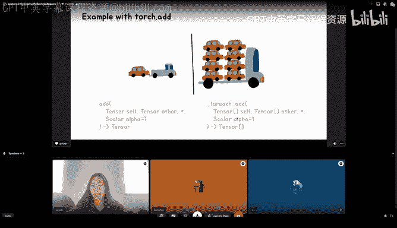

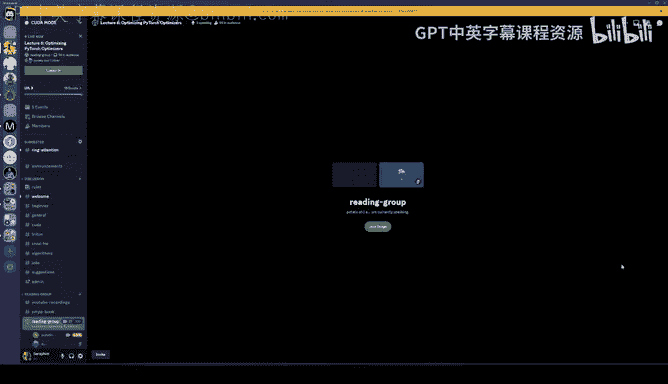

Like under the hood and kuta。 how would you actually do this。 So， again。

 let's look at the easier add version。 A simplified kuda kernel signature will look like the following。

 And you might be like， hey， I've looked at torch。 This is not how you do add。 And yes， I know。

 This is not how we do add。 We， we do add through this other thing called Tensor iterator。

 But we don't need to think about that today。 Instead， I just want you to focus on like。

 if you were to write an ad kernel。 What would it look like。

And it probably looks something like what I have on the left where all the code is like you can do the。

 I didn't bother doing that。 But the signature itself is already pretty indicative。

 So note that we can't pass tensor objects into kuta， because you just。

 that's not Kuta is too low level for that。 So what we end up doing instead。

 was we pass in a float star。 And we're assuming we have float tensors for simplicity。

 if if you had a Boolean。 This would be a Boolean star or yeah， a bo star。 et cetera， et cetera。

 So this is without loss of generality。And so that that's the first thing。

 The foot star is a pointer to the first element in your tensor， and it will know how to move。

Based on based on like your kernel below。 So you pass in that， that's all good。 You have self。

 you have other， but notice that you also have this res tensor， which is your return tensor。

 It's because in Kuta you you want to operate on things all living in Kuta。

 And so your ad kernelel will actually return void and do things on Kuta。

 I think this should be familiar to people。 And if not， feel free to ask questions。

 But the hard question that I want you to think about is， okay。

 so that's if you have one tensor at a time。 But what if you had a tensor list that you're trying to pass to Kuta at a time。

 How would you， how would you like write a signature for that。Okay， I'm gonna give like two minutes。

 well， not  two minutes， like 50，15 seconds。 Okay， that's long enough。 Andreas， did anyone or Mark。

 did anyone have question like a response to this。So I have personally a question because I looked up in Google multi terms of apply。

 and I'， I found some like more internal structures which use this。 but its it it's not like a。

Exposed on the API on an intent Python leverite， or is it。

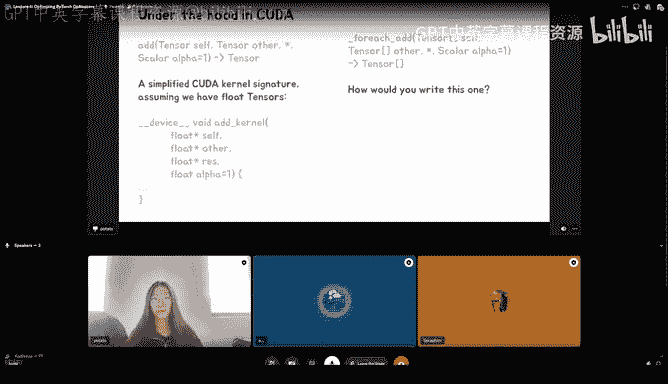

Yeah， multiens is is like an internal implementation detail yes yeah there's no like there's no tool for it。

 but also you're cheating we're getting there no I'm kidding， you can look at the code。But yeah。

 at this point， has anyone suggested anything yet， If not， I will tell。 So so far。

 we have suggestions for star star float star star D equals a plus B pointers on pointers。

 multiple threads with shared memory。 It can still be floatat star， but it's hard to write。

 floatloat star star。well， you guys are a geniuses， but let me show you what I did first。

 So first I was like， hey， I'm gonna pass a standard vector and I can hear the whole audience laughing because they're like this girl has clearly never done Kuta。

 And I quickly， quickly found out that this does not work just like it doesn't accept tensors。

 It will not accept the standard vector。 That's not a thing in Kuta。 doesn't even compile。

 So we can move on from this。 So yeah， let's talk about the float star star strategy。😊。

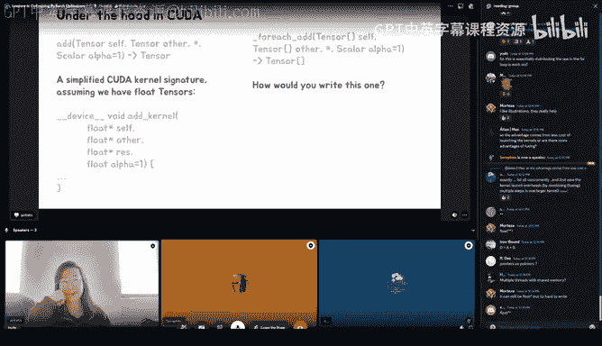

Does this work， What do people think。I guess everyone who suggested it is like。

 I think it should work。Does anyone not think it should work？

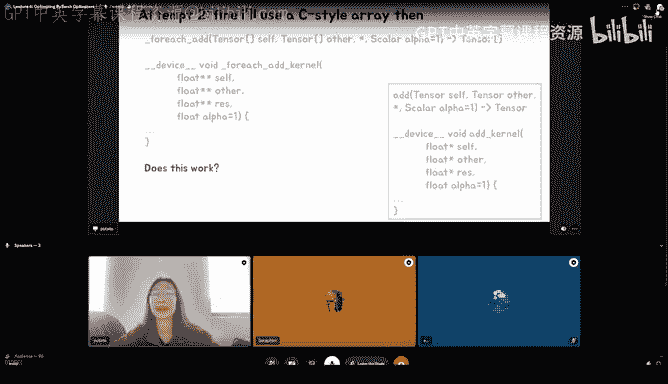

LetLet's see in chat， people are typing。哈哈哈。😊，Okay， so I is saying it shouldn't。

 But you're not saying why either I， why shouldn't work。 Okay， it shouldn't work。

 Why should it not work。Or just make your arrays one dimensional。 That's our Oh I see。 Yeah Okay。

 okay， there's some implementation details there。 So So so yeah。

 it just saying something we't saying well， you know， because float star star。

 would it be contiguous。😊，Quest okay， well okay， let's pretend they are contiguous。

Or let's pretend you don't have to worry about that。

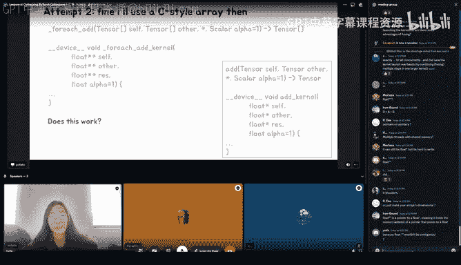

Okay， all right。 no one's typing anymore。 I think you can give the answer。 It does not work。

 This actually leads to an illegal memory access， because usually when you do this and okay。

 actually， a lot of you are very smart because you're like， oh， if I just like finagel the pointers。

 it'll be fine。 And you're right。 But if you just do it， the force brute force way， it will not work。

 because the outer pointer is actually on CPU。 So here I have green to denote coa because Nvidias green and purple。

 because I looked up the colors for color blindinness and apparently dark purple is a good contrast to green。

 So there we are。😊，But let's if people aren't getting this because I did not immediately get this at first。

 I drew a diagram。 Sorry if the green is very alarming to you。 it looks better on my iPad。

 but here we go。 So if we look at the old ad kernel， which we know works。

 We see that the float stars are actually green because the tensors live on kuda So their addresses are on kuta And when you do tensor dot data pointer。

 which is what you have in these like purple boxes here that you're just getting kind of like a huge int。

 like that's just a address。 but you're not dereferencing it。 So it's all okay。

 And when you finally shove these boys into the couda when you pass it through your kernel to dereference later。

 they will be okay because they're green on green。Oh， yeah。 I have a slide for that。

 Like when you pass them in here through your kernel argument space， it's green on green。

 And so when you de referenceence， it's okay because the， the tensors are good。

 That's not the case for。Are star star， though。 And okay， I'm going to walk through this diagram。

But basically instead of having tensors， we have many tensors so like I use the dot dot dot to signify。

 we have tensor list one Tensor list so this is self， this is other。

 and this is result for for all the tensors and on the left we have all their data pointers but note that the tensor list itself is living on CPU in this case。

 So their address or that's a CPU memory address。 So when you put them over when you when you pass them into your kernel in the kernel argument space。

 they're going to be purple， they're going to be purple addresses。

 So when you dereference it's going to be illegal memory access， not okay。All right。

So when you do that， when you try to de referenceence from within your code。

 because I'll let you pass it through， It's just like a number。 When you try to de referenceence。

 it's gonna be like， I， I cannot access that memory。 boom， things will fail。 You'll be sad。

 It won't give you a nice air。 And then you'll have to start again。

Pausling here to see if people have had questions or thoughts。All right。

 so you're getting two people appreciate the green color contrast and then one person is saying it should be possible to fanglele the allocations to be all in the right places for it to work right。

 tricky but possible。 And then Artdes is saying thank you that was very clear and a bunch of up floats。

You， okay， awesome。 Well， we are getting there。 All you smart people just wait。 We will。

 we will get to a good attempt later。 Okay， so， you know， we can't pass by reference。

 We don't want to do that。 So we will pass by chunky boy， Aka by value。

 And what we're gonna do here is we're like， hey， look these tensors， these low purple things。 Let's。

 let's not even pass the pointers。 Let's just pass all of these are like all of these data pointers over。

😊，So what we'll do is we'll make a struct our favorite static chunky boy。

 We will allocate a float star of addresses。 And this is this is where you guys are like。

 the phnagling is occurring。 Yes， it is。 And we're gonna have three of them because we have self。

 other and res and we're going use numb tensors because that's just how many tensors Like what however many number however many tensors we have in one list we will just use that And you can now imagine we are now packaging all those data pointers into a big struct。

 And then we're just gonna pass a struct into the kernel space。 that should be fine。

 So does this work。 What do people think。😊，So I would say， I mean。

 where is where's the difference now that does it like is it smart enough to like handle strikes。

 but it's not point us to point us it's like where's the difference So Yeah。

 so when you make a when you pass in like a float star star， that's a pointer。

 So that that's not okay。 But when you pass in astruct， I will tell you， yes， it will pass the whole。

 Okay， there's no， there's no like lying here。 Noception。Yeah， yeah， like I I don't know the answer。

 I feel like it's also。 what's the difference between this and a vector。

 I guess other people in chat are saying they're guessing that kuta is too low level forstructs。

 And then E is asking， you know， what about a dynamic number of tensors。

 And then there's a bunch of more people typing as well。 Wellow， people。

 people are getting at the right questions。 But Kuta does handlestructs。 This actually， I will。

 I will spoil the answer， Because some of you are getting ahead。And this does work。 And in essence。

 what this does is it passes this big three thing of addresses into the kernel argument space。

 and then。Well， okay， I say this does work。 But what I really mean is it passed my C I。 I， I open。

 you know， it passes the C I。 Y， we could land this code now or， or can we。

 I don't even remember my next slide。 Okay， so yeah at the end， we're done。 just kidding。

 We're not done。 So I actually， like two weeks ago。

 I landed a PR that did something very similar to this。😊。

And I got reverted for exactly the reasons people have been saying， like。But okay， we'll walk there。

 We'll walk there。 I'm not spoiling that yet。 But if you。

 if you already thought of this good for you。 So what happened was I landed the PR and it got reverted because in an internal model。

 we got like a legal memory accesses。 and I also had an open source model。

 which actually helped me minimize the rerow。 But what I ultimately ended up doing was I realized that if I。

Like minimize the repro down to these three lines。 So so so let let me let me start there。 So。

 so the repro， as you guys， I'll just walk over it quickly。

 you get a big tensor list of just like really small tensors on couta and we're gonna say we have n tensors and then we're gonna just pass everything into for each norm because for each norm was the my PR I know we were just time off for each ad。

 but principal same。 So just don't be confused there。

 And then we'll do a coupa synchronized because without it。

 this code might actually be okay until the next call that needs coa and I'll synchronize and be like oh my goodness everything is screwed up。

 something's wrong。 But yes， so here's my repro。 I'm gonna you're gonna join me now on my binary search。

 you don't have a choice。 but basically what I learned is that for certain values of n it would illegal memory access So 500 because Tim efficient DT debt。

 I suppose has 568 or something like that。 So I was like let me start with 500500 tensors is not okay。

😊，156 tensors， though， it is okay。 And if you're like， that's not a real binary search。

 Why is it not 2，50。 Look， I thought it had to do with powers of 2。

 And I was like 256 is close enough to 250。 So we're gonna go there。

 But I'm not very consistent because the next number I try is a 400， which also is okay。

 And that's where I'm like， oh， interesting。 So sometimes somewhere between 400 and 4，50 is not okay。

4，25 is not okay。4，12 is somehow okay， though， So I keep doing my binary search。 And in the end。

 I get to the point where。Somehow，423 tensors， perfectly。 okay，424 tensors， not okay。 So， okay。

 all the people in the chat who are like， ha ha ha， what about dynamic things， though。

 What are your thoughts， What could be going on here， What is so special about 4，23。😊。

Maybe a little bit earlier。 Stefan like Leia said there might be a limit to how large a truck can be that can be sent。

 this could be also yes， so where is thatstruct coming from or where is that limit coming from well。

Yeah， okay。 I guess we talked about。 So yeah。 So we learned that numb tensors lesson 424。

 you're exactly correct。 Basically， the kernel argument space has a max limit of four kilobys。

 So what's happening， What we are expecting to happen is， you know， we are able to pass ourstruct in。

 everything is happy。 But no， if you have too many tensors， you have too many pointers。

 And so I probably shouldn't have drawn this purple part。

 but you can imagine that only a few a subset of the tensor pointers actually got passed over。

 And so once you're trying to access the next tensor， it goes what the heck that's not。

 that's not what you think it is。 I can't dereference that。 And it will illegal memory axis。

 And if you're like， hey， I don't quite understand this intuitively。 It's like this。

 So the expectation is like， hey， if I can shov eight cars through my truck。

 Why don't I pile seven more cars。 And the reality is like when you are driving fast。

 your car is not stable enough to do that。😊，And there's a limit to it。

 So you will have things falling off。 not all your cars are going to make it to GPU。😡，As you expect。

So what do we do now。Have people， have people。Add more comments。Alright， so let's see。

The amount of data。 So， so， so there were questions about like the cache and the amount of data that fits in private memory for threads。

 But I think you already answered that the problem is the address space。

I guess there's a lot of memes so no， no questions so far。Okay。

 but no suggestions for how do we deal with this？Streaming and batching。 we pray。

 Can we pass a list of pointers okay， we'll get to the list of pointer solution later。

 but we'll get to the easy solution first， which is batching or hey， fine， just launch more kernels。

 just make more trips， it's fine。 So if we know that there is a limit to the number of pointers in this struct just like you know fill it up as much as you can and then ferry things over So in the end what you will do is you will make multiple structs and we'll chunk the addresses so that only a portion are going in each only a portion is going in each struct and then we'll launch a kernel multiple times once where every struct we make。

 And this。Is what we do today， actually。Like today， if you looked at the code base。 So， you know。

 if you're looking through Ptor multi Tensor apply， this is， this is exactly。

 this is the essence of what we do。 There are some additional。

Meadata details that you don't have to concern yourself with because I that's my job。

 but this is essentially it， but we could really do better and that's where some of you are already thinking。

😡，Because why is this not okay。 This is not okay， because， well， okay， well， this is okay。

 but it's not ideal。 So it's not ideal because we tell people， hey。

 we are horizontally fusing into one kernel。 But no， we lie。 It's not one kernel。

 It's multiple kernels for however many strs we have to send to Kuta。

 So instead of the nice chart where they're one。 They're just like one circle。

 You kind of end up having small。 Like， you still have four kernels in this example for for each。

Which。How can we do better？ So the how is we're going to revisit attempt temp 2。

 which is everybody's suggestion， like do float star star。

 And our problem before was that the purple pointers were on CPU。

 And some of you had already been like， okay， okay。

 let's just like do extra phnagling and get them to GPU。 How can we do that。

And the idea here is we are going to move them to Kuta beforehand。And we're going to。So in essence。

 we're going to mend copy the list of addresses to Kuta beforehand。 And the way， the way Yufu。

 who is the guy working on this， He's been working on this for like two weeks now。

 But the way he does it is he packs all of these。Standard vectors of addresses into one tensor。

 He ships the tensor to kuda because we have like a， you know， tensor dot。

2 kuda function and now we this the memory that was here， we have these green green back look， okay。

 this is really like one chunk of memory so but but like what's the word semantically it's like you're having three lists here。

And then we by mem copypying， we also have access to the pointers which are now green pointers on KUa through on GPU。

 so I'm going to pause here because I think people might have questions on how that is working。

So first of all I have one question So for the old first。

 I mean it's like now becomes also obvious for me that if you like pointers to point us like Q has no idea like what's behind this point and can does know anything about the size of what's the array basically of this pointers and that of course it makes sense that it can stupid inside tenor but this to work so the requirement is this pointers which we get when we do Q melo on CPU。

 they are like essentially exactly the same when they when they used inside the kernel right So there's no translation necessary。

 they are like this values if have like 64 like pointer value。

 it's the same on the GPU as it is in the CPU right。Yes， these。

 these numbers are the same numbers here。 And it's so fishy。 Like if you actually look at the code。

 we have to do like a float star or like we have scalar Ts。

 which are kind of like float or blow whatever。 floatat star star。

 and then we coerce that into a void star and we coerce like avoid void star into a float star star later because we know that these actually are like these references here。

 these like tiny pointers are the addresses of these tensors here。

 And the only reason we're getting away with this。 Like， it doesn't even compile like。

 you have to do star。😊，T start like you have to dereference and cast and do a bunch of finegie things because we're trying to tell kuda we know what we're doing。

 but you're right， we are literally treating pointers just like in 64 Ts pretty much and we're telling people that。

 hey， we can de references later I promise you it's safe but yes。

 yes it is it is literally the number were there other questions。Yeah。

 so Akefe is asking Mem copypy is expensive， but isn't it the same cost for both solutions。

 since you'd also end up moving the same amount of data with the batching approach。

 which has an additional overhead because of multiple kernel launches to which Vikram from Nvidia is responding。

 passing arguments over kernel launch would increase k kernel latency。Yes。

 you're right that mem copypy is expensive and you're right that like doing multiple kernels is also expensive。

 and I trust Nvidia dude be to know which one is more or similar。

 buts that's where okay you guys are too fast I will keep going then but basically this is how we avoid the constraint and we do it one at a time。

 and you can kind of imagine that this saves when you mem copypy once。

 but let's say before you had like a million tensors for whatever reason。

 you could have been chunking many， many times。 like I think right now our limit is1 hundred10 tensors at a time。

 So like for a million you're literally launching 10000 couda kernels whereas here a million is a bad number because I don't know if big numbers are scary to me。

 I think like a million is not normally mem copypy we copy basically everything like old weights or activations。

 everything is like for deep learning models always copied to the。View， of course， somehow。

 And I could also maybe like copy it back some。 So like that were also a pretty high bandwidth from it's like not。

 not like shared memory bandwidth or， but still we can copy a lot of memory from。

From CPU M to CPUU M。The point I'm trying to make here is this me copy might be worth it if you had a lot of kernels you're launching compared to like maybe two。

So in conclusion， like you guys said， we are going to do a mix of a struct and mem copy and if you think this if you are very expert at this and you're like this is probably not what you should do。

 please speak up because I want to know like I want our code base to be the best。

 but basically if it fits if it fits within our little struct。

 we'll just use thestruct otherwise we will mem copypy once so that we can just launch one kernel versus multiple kernels with multiplestructs and's that's where we're headed。

Did people Did people have advice for， for our plans here， yeah。

 we maybe we should invite Vikram on stage。 But in the meantime。

 Jeremy is saying would using unified memory help。 And then Vikram， as you wait。

 So there was a question， is when copy expensive because of limited bandwidth or latency to which Vikram is saying when copying data 4 kB。

 if you can guarantee PCe bandit utilization， then you are bounded by bandwidth。

 Most likely you are bound by latency and entire latency would be exposed。And then later I saying。

 oh yeah， pick kept the speaker。 maybe I'll stop reading on his behalf。 Yeah， sorry about that。

 I just joined and I was listened to the conversation。

 by the way this is very interesting data point that you are speaking about passing between the kernel whether you do by argument passing or whether you do over a memory pointer。

 and thenied copy to the kernel both are amazing ideas in one place one workswell in other places。

 the other workswell。 So it depends on what is the amount of latency that you w to hide when you pass the kernel versus not。

😊，A question with this which Jeremy asked would using Ka memory unified memory health。😊。

I never tried， and I do not know。 So if anybody tries it， let me know。Yes。

Is also is Kudon is unified memory available for all hardware or is it like only for newest and video stuff？

As far as I know， since the Pascal generation， all GPU should support it。

So Pacal and later we should have good support the initial version of the uniified memory started if I'm not wrong in Kepler generation。

But in a coupleer generation the unified memory was completely software defined basically a software driver was basically moving the data and providing the notion of memory extended to CPU memory but in the pastcal generation onwards you have additional hardware capabilities and all those added so。

can can can you quickly explain what unified memory is and like very short。

Yeah so Uniified memory is a capability where GPU threads can access data that is memory mapped to its address space and in this case usually Uniified memory refers to when you allocate your data data buffer in your CPU memory and memory map it to the could address space and it becomes accessible over Qa threads so you can basically do access of your data from GPU thread while the data is currently allocated in the CPU memory that is what Uniified memory is。

Now there is subtle additional differences now there are two ways to access them one either by page fault mechanism then you are speaking about the full paging based unified memory or you can do load short access to your CPM memory then we are speaking about UA or unified virtual addressing or zero copy access many terms people use whichever they preferred choice sometimes even we get confused so but there are two ways to access the data that is present in the CP memory either by page faulting or by the load or access now depending on your granularity of access and your access pattern one or the other would actually do really well。

😊。

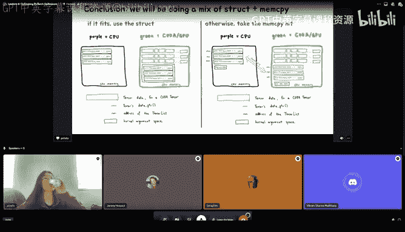

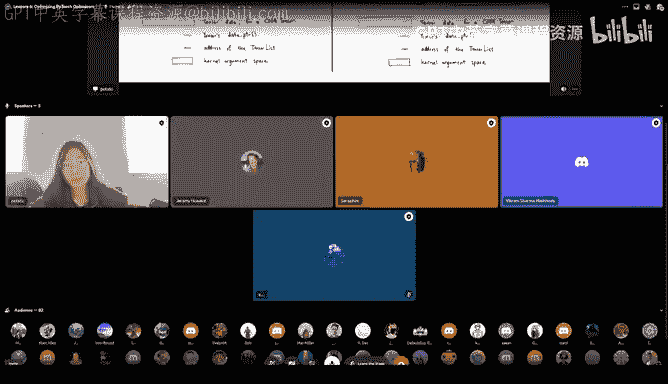

And yeah。Okay， we thank you very much that maybe we need later to go in。

 in a separate session to different like a possibilities with unified memory。

 I just wanted to mention something about unified memory， which is。Unfortunately。

 it's not currently usable from Pytorch， you do have to go into Kuda mode to use it。

I looked into it in some detail a while ago because I think it would actually you think would be a fantastic feature to add to paytorrch and actually there's already an example of somebody who's done that and apropos of the name of this group that person was Tim Detmers if you go back to the original paper that became bits and Bits they actually created what they called a paged optimizer And actually it's really simple。

 It's basically but the tricky bit was they figured out how to trick paytorrch into using unified memory and then they just used unified memory back tenses for the parameters and then they got this kind of paged memory for free。

 which I thought was super neat。That's interesting I feel like is the reason I think， okay。

 my guess is we have the couta caching allocator， which is probably why the unified memory doesn't like work right off the bat or something。

But yeah， I had looked at the page optimizer stuff。

 but I think coming back to this is like struck mem copy， unified memory， I guess it always。

 it depends on just like how fast or whether we're looking for latency versus bandwidth。

 like what we're short on which one we want to do， but it feels like we should experiment with benchmarks if we want to switch over to option number three。

 which is unified memory Are there last thing thoughts or should I keep going。😊。

I think we can get back to this discussion。 I really want to hear the rest of your talk to。

Okay I mean I like ideas I will be reading the chat later for those and yeah thank you Vikram and other people who might be talking that I might not realize。

 but we'll follow up later but did you notice in my diagram that when I split this up when I was like hey。

 we are sending multiple strokes I also split up the fused one here it might make you notice that oh our fastest fused implementations also rely on multitensor apply so。

😊，It does。 And the way it does is because multitensor apply is just this kernel that takes in。

Metaadata， stream information， it takes in like your tensorist meta。

 which is very similar actually to the Tensor list metadata thing I was showing you earlier。

 and it takes in a callable。 So the fact that you can swap out this callable whether it's an addition or a bigger callable makes this very makes this like multitensor apply kernel thing really cool and I think to Andreas's point at the beginning。

 this is not publicly available。 but also if if you clone pi to of U for and you like you feel free to play around with it。

 is this might be this might be a good idea to actually make more public than it is but the reason is because it's mostly in C plus but I will keep going。

 and in the fused atom W case where if you imagine what ad would do。

 it would just pass in like addition but in the fused Adamom W case。

 because it's not just doing one op It's doing a bunch of ops in one it will it will use this fun that is handwritten and so let's peak。

Let's look at what fused atom math puncture is。And already， you can already be like， wow。

 so much code。 And this is not even。All the code there is。 So infuse atom math function。

 you first figure out what tensor you're on， what chunk you're on a bunch of just like very coa specific details that you might ever already been familiar with because you've been doing this for five weeks。

 And then you like prepare all your pointers。 you make sure you're like he is my memory aligned。

 If so I'll do like a load store otherwise， I'll do some other stuff。

 you have some sort of vectorization， I think with KLP。 And then you call Adam math。

 and there's more code after this。 but I think it's interesting to be like， all right。

 so you did a bunch of preparation with pointers。 And now you're calling the math function。

 And if you look at the math function on the right。

 this is much more familiar with the code we're looking at earlier。 like you have grad。

 you do exponential average， there's like you know， wait decay。

 and then you have exponential average is beta1 times whatever。

 whatever you do a square root like all of finally。😊。

After doing all of that coupuda preparation work， you're getting to the math of it and even the math is not like Python。

 I suppose， so the point I'm trying to make here is we're very grateful that this already existed and is fast and is wonderful。

But this is quite manual。 Like someone had to go and figure out all this， like， you know， work。

 they have to figure out all the， oh， like， what chunk am I on， How am I parazing And。

 and to write all of this and required a lot of lines of code compared to our Python implementations And that's expected。

 That's how kudo works， But what if we could automate the vertical fusion portion。 Like。

 what if we could not do that in all those lines。 What if we could just use one line。

And I think some of you are already knowing what I'm hinting at。

 but this is where torch compile or our dreams for torch compile come in。

Because George compile's strength is vertical fusion。

 The whole point is for it to be able to know like， oh， I can work on this memory at one time。

 there's no dependencies。 So let me just like put them all together。

 that's kind of the whole point of this。 And what's beautiful here is that not only in our dream world where like all are for each implementations like for each ad for each mole for each lup for each a C div or whatever。

 all of those could be fused with each other。 they can also be  fused with stuff that comes before it and after it。

 So if you're doing I guess if you're doing your backward and you have like backward and then optimizer and then zero grad or whatever。

 however you want to do that， you could fuse a lot of that together。

 and get even better than what our current fuse optimizers are。 So that's the dream。

 And you're like okay okay， Jane， how can I， how do I do this， How can I use this with optimizers。😊。

Oh yeah。I'm going to pause， do people have questions， by the way， on the theory of Torch compile？

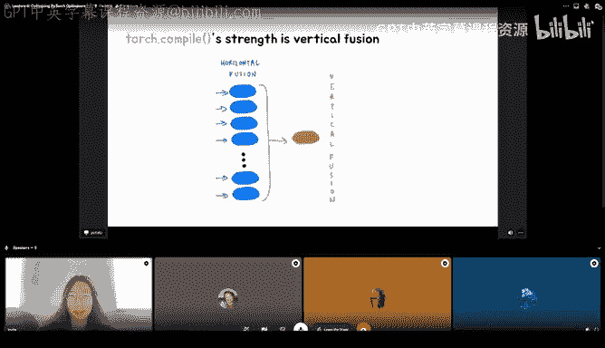

NoSo you always mentioned that it's like in the future it it should work so the current it implies a little bit that the current status it doesn't。

Oh okay， the current state it does work， it does work， let me we'll get there， we'll get there。

It's not I would okay， I guess to answer the question right away， I feel like it does work today。

 however， I think there are so many edge cases that are not covered that I don't want to be like this is my favorite thing in the world you should all use this like I'm not there yet。

 but I want to be there but let's just like talk about how you can even get started just trying this but basically for any optimizer you have so if you had optimizer Adam W I guess after today's talk。

 you should probably be using Adam W fused equals true。

 but if you're not doing that like let's say if you use RMS prop or any other optimizer that does not have a fued implementation。

 you set up your optimizer， you basically do like hey。

 my compiled step is just this torch compile wrapper around my optimizer step and now you're just gonna call this compiled step instead of your optimizer step every time。

And that's all you gotta do。 So， okay， I suppose that was two lines and not one。

 But this is still way better than having someone need to do all this work and for free。 You know。

 like， if we could get this performance for free。 Like， why not？ And you're like， okay， So so Jane。

 what is the status today， What， what is what， what is the status。 Ill。

 I'll go back to this slide earlier。 the the status is。

 it does work for every optimizer in Pytorch Pytorch with for each。

 And if that's confusing to you're like， I don't know which ones that is。

 name any optimizer in Pytorch pytorch。😊。

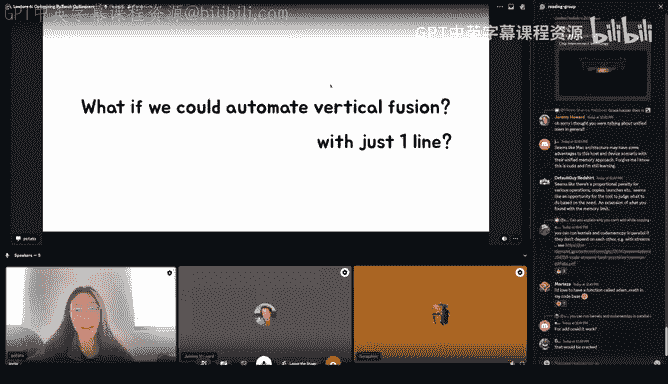

Like Adamgrad is gonna to be okay。 Aom Max is gonna to be okay。 And Adam are Adam。

 all of those are okay。 The only two that don't work are L B FGs and sparse atom。

 L B Fgs does not work because it's second order in in then in that， it caused the backward again。

 like it caused a closure。 Well， not just it backward， but the forward backward from within itself。

 to a recompute loss。 and sparse atom currently does not work because of sparse tensors。

 But every other， every other optimizer in theory， and in practice today does work。

And you can do this thing with it for basically all of them。Yeah， you do need Triton， though。

 So if your kuta is not 7，0， I feel like most kuta。 Okay， you need kuta 70 plus and。

And the cool thing about this is that not only does the optimizer part work。

 but any sequence of supported for each op should work。 And in my， in my opinion。

 it not opinion in my observations， it does work。 And what when I say any sequence here。 I'm saying。

 hey， we currently do not have something like a a factor。

 But maybe you could write a a factor with a bunch of for each ops。 And if you do that。

 or if you have your own customized optimizer that you're trying and playing around and you want it to be fast。

 but you don't want to write all the k kernels and stuff， you can try torch compile on them first。

 And this should just work。 And so when this does not work， please open an issue。

 compiled optimizers is currently in beta。 And。😊，I would love if people could try it out and just complain a lot here because if you guys don't complain。

 we're not going to know and then we're not going to like you know progress is not going to happen so so you guys should。

Try it。Does that answer your question， by the way， for our status today？

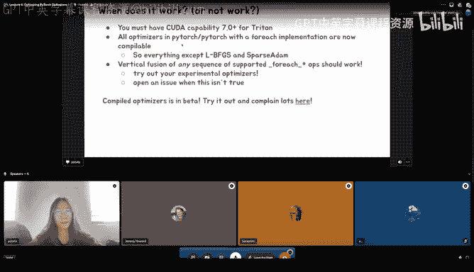

Yes， thank you very much。Yeah， are there questions that I should address？Yeah。

 theres a couple of questions from Cha， so E is asking so the storage compile basically replaced for each operations。

No， no， it doesn't。 It replaces。 So it's vertical fusion。 It replaces the vertical。

 It replaces wheres wheres like this green part， but you still need， you still。

 church compile does not do horizontal fusion today。 Like， I can't like。

 take a for loop and just go to the for loop。 That's still， that's not a thing it can do。

 I think that is on the roadmap， but just like today， it's not， it's not there。

Super fun guy is asking so does compile handle both runtime and memory optimizations under the hood。

It tries to yes， because a big part of the vertical fusion is by eliminating the intermediaries。

 So like in here from operation A to B or one to 2。

 you might need to save some state in in this case， you don't need to save that。

 like you don't need to allocate a buffer， communicate it， communicate it back。 So I would say， yes。

 to inductor today does do that。All right， you also got a compliment on your sound effects， pop poo。

And okay， and then okay， one more question。 So with the scheduler。

 do we torch compile the scheduler with optimizer or just compile the optimizer and pass to the scheduler。

Oh we compile optimizer and pass to the schedule it's more high level than we don't have like inductor IR for this and I guess here we could look at the triton kernel。

 but inductor will do the scheduling thing and generate a triton kernel that does this for every single optimizer and if you look closely at this you kind of get oh look my state1。

2，3，4，5 there seems to be you know five state and then you have your betas and whatnot so like this is still kind of recognizable as this is what atom is or atom W is doing but yeah。

 it is not like there's no inductor specific optimizer IR。

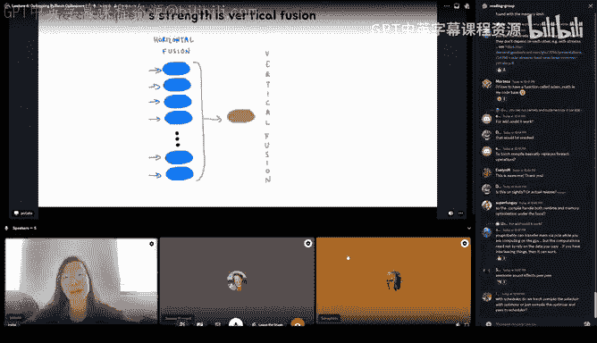

Like technically speaking， So is it it like currently thoughtr compile must for static shapes。

 So what is it can it also hinder that tenils like the sizes change。When you say static shapes here。

 Oh， like dynamic shapes。 that is， I'm not the most like expert expert here。 I'm not even anec。

 I would not call myself a PT T2 expert period， but I know dynamic shape should be working today。

 Like， I think that is。It it like if you， if you had parameters that were size like 45 and then 52 and you changed one of them later to be like because it was a batch or something。

 it should you should be able to have。Indo work and have torch compile work。Oh that sounds good。

 great。So， so， maybe more of a high level question。

 So you're saying that there is no concept of like an optimizer IR and torch compile。

 Do you think it would be useful or or not necessarily。We talked about this。 yeah， earlier this year。

 my old director who's not a director anymore， but we still treated a message。 you know he was like。

 yo， what if we just like short circuit because the answer the thing here is if you're compiling it takes time for it to run and to trace and to figure that out So like if you're calling torch atom W fused that's no compiling there's zero compile time but when you do torch compile。

 there is a cost because you need to look at the code and optimize it and that currently today takes I think on the order of 20 isch seconds for something on the order of like 1000 parameters and that is a cost So we were like wait what if we don't do that what if we just like write optimizes with tryton or with inductor and we ended up thinking that that was not a good use of our time because it kind of skimmps on all the features that make pitorrch composable So like if you use L schedulers。

 for example， which I think lots of you do。You suddenly need to do a lot of random things yourself to make that work with something like inductor Ir。

 We would to put the time to make inductor IR work with L schedulers and we think that it is much better to take it from like the make PT2 more general like allow inductor to be able to handle things like optimizes versus being like let's special case on optimizes within the IR and then move from there。

 So that was a decision we had to make earlier this year and we went with the hey。

 we should keep going and make PT2 as general as possible So we have this nice composability story as well as a better product in the future。

That makes sense of sense， thank you。Yeah。But yeah， this will， this is， I mean， I can't。

 this takes this is not something I would just write by knowing。 but this is cool that some。

 some tool just does it for you。 So that brings me to the question of like。😊，Hey。

 so should you stop learning Kuta， Like have you been wasting your time the last five weeks， Like。

 should you stop reading that book you've been all going through。 And the answer is a resounding no。

 like you should not stop learning Kuta， I should actually start learning Kuta more。

 But some reasons why it's just like， like we mentioned before horizontal fusion doesn't work with Tch compile today。

 it's limited， but also Triton itself is not all powerful。 We recently had someone less right。

 He's like working on this cool four bit Adam W thing。 And he started out with Triton。

 And in the end， he was like， wait， I want things to be faster。 I want thread indexing。

 but I only get things at the block level for Triton。 It's not。

 It's just not it's just not fast enough for me。 So knowing Kuta is actually quite important。

 And I think if you talk to any real expert about Triton or Kuda。 they already know Kuta。

 like knowing understanding Kuta is a great foundation for understanding Triton。 But again。

 I realize I am probably preaching to the choir。Here and I will stop now， but yeah， that's my talk。

 thank you for listening and any other questions。But thank you， James this fantastic。

 Like I think this is my favorite talk of the series so far。

 So you're setting like a high bar for everyone else。 like， thank you。 folks like before questions。

 please shower Jane with emoji emojis and praise。 you know。

 encourage her to come again and give a talk。 And then yeah I'll be reading questions with address like in a second。

😊。

Yeah， incredible。 So that was。Alsosome， like optimizing squared。 Yeah， really nice。😊。

Should I do this like flooding， do you see the like， oh， what is the fact？😊。

Thanks everyone。Do you guys have questions， though？

I think we need a second for them just to come through。 I am sure people have questions。 Just' give。

 give them a sec。Okay， cool。So you showed this P T X。

It like the disassemb stuff like this low level version of the kernels。 how。

 how the what's the easiest way to get this from your code。How did you generate it， for example。

 for your slide？Oh， this one I'm still sharing my whole screen， but basically you go。

 you write a script， which is very similar to the script I showed you earlier so like you can you can everyone see this？

You basically write something with Torch Compile and when you run it， where's the thing？

When you run it， you can use torch logs。 So like it will look like this。

And then just passing like in doctor or something。 And then I I this is my playground。

 So if I just run this script， it will kind of output， this is gonna take too long。 Let's do like。

5ve。We're just one。And then let's not do let's。I think it was the output code。

 or does the inductor also work。Yeah， so I think output code is correct， but I think inductor will。

If you do induct， it will tell you， it will literally be like there is a file。 You should go here。

 and it will give you the triton kernel。 Is it No， no， no， don't go。 And I saved that somewhere。

 Oh here。 Yeah， yeah， yeah， and it， it looks like it looks like this。

 The path is like some temp thing in doctor， blah b blah。 and it will。

 if you run this script with your inductor code in here。

 it will tell you where to find this file and you can go to this file。

 And this is the this is the triton kernel。 it's sorry I likedent P X Okay of course sorry。😊。

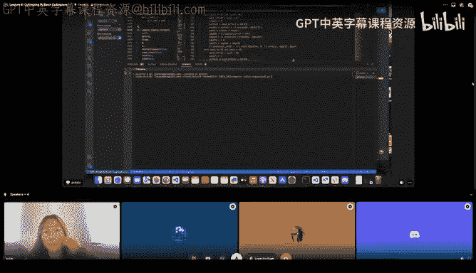

Yeah， yeah， yeah， yeah。 So， so it will， I mean， does this answer your question。 Basically。

 I just use inductor every time because it's like pretty safe。

 Like inductors not gonna change and output code is like hard to remember。

 So that's how that's how I got。 I'm pretty sure it's like the third kernel or something。 Oh yeah。

 like something like this that I just copy pasted this stuff。So we have a question from Ipert。Asked。

 can it make a graph off the corner somehow。Is there a way to like make a。

 make a like a diagram on SVG or something。It would be advanced feature。I have not tried it。

 but also， the Triton stuff comes from a graph， like the whole。How P T2 works is it traces your。

 Oh I don't， I guess I don't need to go to the slides， but it traces your functions。

 and it makes a dependency graph。 And that graph is called our F X graph。 And you can get that。

 I don't know if that's helpful。 Like that feels more helpful to me than a graph for the tton kernel。

The question you change the number of tenss， I think is it like dependent on this like the compile time very much。

 Does it depend on this yes if you were compiling like two parameters versus a million parameters there is some overhead just like the number of parameters you have they get process differently and a lot of it has to do with like functionalization because to go from if you're familiar compilers。

 they love things that are functional because then you can reason about and do like a bunch of optimizations on the compiled graph but when you're functionalizing。

 it means that optimizes is like in this very niche space where you are literally updating like like you are far from functional you're like hey I'm gonna update my parameter in place and I'm gonna do that for all these parameters for this huge list and that when that first was dropped on Michael Lazos it was like what the heck this is not something we've dealt with beforemp2。

We deal with that now and so when we started out it would take order of minutes to compile 1 thousand0 parameters because of all the functionalization steps that dotco underscores that we'd have to generate in the code in the graph for it and today they've done so many they've like cleaned that up a lot and it's much better but I think there is still overhead and just like tracing through a bunch of parameters and processing that at a time。

 but that's a more general problem that torch compile is going to solve。

We're trying to solve is it somehow possible to cache the results so that it's immediately available for the next one or so？

I doesn't have to do it every time right Yes， Mark Surme actually worked on something similar to that。

um like a cache for， you know， like if you could just cache this somewhere and if you're the same。

 yeah。Yeah， like I think like like all the caching techniques are like good for like your warm compilation times。

 but they don't like help terribly a lot with the with the cold start。

 which I think is kind of like a bigger issue still。SoI think like， for coldstar， it's。

 it's just like the exercise needs to be a bit different。 It's more like， you know， you just。

 like we just need to profile what goes on in compilation and make things faster。

 I think a lot of things tend to be very fairly low level calls like， you know。

 di comparisons and Python and whatnot。 I haven't been following the the cold star compilation stuff yet。

 But I do know there's like a small team now， just like focused on making that problem much better。

 So I might have like another update。 I guess like in a couple of weeks。Okay， good。

So if for one one question from super fun guy， I think， yeah。

 maybe we need some more information about what， what you mean。

It's about deep copying and memory management when dealing with strikes containing pointers。

So I think， yeah， of course。Cuda also doesn't can do any magic about it。 but if the point。

 as for example， has been allocated or returned by kuda melogage that of course。

 can be used then inside the kernel。Maybe super fun， you can like。Make your like。

Extend a little bit on your question， And then。Yeah， would I would like more context on this one。

 butstructs containing pointers and memory management。嗯。Okay。

 I think the way it works with the struct is we're passing it through the kernel argument space。

 which I don't have that many details on， but that is different from I think mem copypying and like actually trying to mallic memory on kuta and then moving it over like those are two different paths。

But I'm not quite sure I'm answering your question。嗯。I think there's  four kilobys。

 that's a really small amount of memory sort。This is something very special with like passing the arguments for the individual colons and maybe。

 yeah。From it's also like duplicate could， Yeah， probably directory for the。Streaming might process。

 I'm not， I'm not sure maybe， maybe a big。嗯。question I'm speculating the question here。

 so I may be completely wrong。 I think the question is。

 how do you do the garbage collection of pointers if you're doing the copy of the struct from your CPU memory to the GP memory。

You will have dangling pointers at both places。 so there is no common reference between the pointers that is there in the CPU side and what is there in the GPU side。

 So how do you manage the memory pointers across two devices。

I think the answer to that is the compiler is not going to do for you the coder's responsibility to manage those pointers explicitly。

 So the coder has to the developer has to make sure those。

Of changes what is made or how it is moved around extract track and removed appropriately。

 But if you are using C plus plus and you shared pointers like or the smart pointers。

 So you can free lunch。嗯。Yeah， but I'm thinking back to the PR that actually does the deep copying of the pointers and it it makes a lot of assumptions and like ordering of when you can free things versus not because you're you're not passing by reference。

 So， so yes， free what Vikram said and also it's not like you the user we we actually have to make sure that the pointers are freed appropriately and all the vectors are not gonna get cleaned too early。

And by the way， there are a lot of dangling pointer issues and there are also security problems so be careful if you have a dangangleling pointer try running it around。

 try to see if you have open security loop postss and if you have file a book。Yeah。

I see a question from Lanceer， should I answer it？I think I don I don't know if there's a size limit to mem copy。

 but we do， but because you are copying just like think pointers and not like the whole tensor itself。

 I'm sure there is a limit， but like the limit is huge and usually people don't pass that many tensors at a time so in the most general case where most of the time I would assume like 99% of the time one mem copy is sufficient。

😡，Regarding ma'am copypy， I have one question to bigram。

 why is why is it necessary to have this additional argument to specify the direction of the copy operation is isn't this like。

Indirectly already specified by the pointers， or could it like be inferre somehow？I don't know。

 I think maybe historical reasons， maybe there reason。 I really do not know。

 I never asked this question to any Q API developers。 Okay， but I should check back and answer it。

Good。But fundamentally， you can do different types of man copies， right。

 So you can do device to device。It can do GPU 0 to GPU 1，2。You can do GPU to CPU。

 CPU to GPU and and different variations of that。 And if you're using unified memory， you can。

You should be able to do host to host。 I don't know if it is available or not the。

 but fundamentally from the。Conceptial side， it should not。 it should be supported。

I don't know if it is available or not。 never checked。And in device to device。

 this is like I've I heard its like sometimes it's possible， sometimes it's not possible。

 What's the requirement for like to directly copy from device to device。啊。

I don't remember all the requirements， sorry。No， no problem。 but its it， it's， is it like going up。

 Yeah， over PC。I no no no device copy No no no device device copies。

 Let's say that you have a data on some abstract memory。

 you want to copy it to some other data structure。 Then you do a device device copy and you can do the device device copy by a CPUU API call。

 or you can explicitly do a warM copy kind of implementation your GPU thread and let that do the copy。

 So you have two different。Oh， yeah， I mix now device device and peer2 peer。 Right。

 So this is like two different things。 these two theyre different。 Yeah， so yeah， sorry。Viicorram。

 does that induce a sync， by the way， if you're doing device to device copy or is it able to be asynchronous？

I don't know。I don't know， I have not experimented much with the device to device。

 it's very rare to use， so never tried much。😊，ok。Okay， cool。 Yeah。 Then maybe we。

 we can close the session for today， and we can。Thank you so much， Jane， this was really awesome。

As Mark says probably our best lecture that we had so far。

 Thank you so much for the work you put into the presentations。😊，Oh， thank you for being so kind。

 This is fun for me。 I learned a lot through this， too， so。😊，Thank you both thanks Mark for inviting。

Yeah， everybody。 then see you next week。 Maybe Mark， do you want to say something No。

 not that at all。 I guess we'll see you all next week if if。

 if y'all are interested in Kuta versus Strden， we're going to have Charles from the Pyr quantization team。

 come talk to us about like the kernels that he wrote for G fast。😊。

So it's going be like a very natural extension to a lot of the themes Jane was talking about。

 So yeah， thank you so much folks and see you all next week。

