# GPU MODE《CUDA、GPU编程1-53课｜GPU MODE》中英字幕（deepseek-v3.2 - P7：-20240225-Lecture 7 Advanced Quantization.zh_en - GPT中英字幕课程资源 - BV1QZ421N7pT

Try you first so thank you everyone for like the next lecture in the Ka mode series today I'm happy that I'm inviting like Charles like one of my colleagues like on the PyTch team。

 so recently Pytch released a couple of like case studies of like Gen AI models that run really。

 really fast and are like have basically in like very minimal code so a big component of those case studies like you might have heard of like G fast and fast was that they were like using quantization and Charles was pretty much like the main person who authored like most of those quantization kernels So he was here to you know talk to us about that。

 and so Charles please take it away。Great， thanks， yes。I'm going to talk about。

And of a quantization in the intersection between Kuta and Triton。

 mostly going through the experience I've had over the past year。

 doing this type of work and we've run into problems that maybe will help you to avoid similar snags And what directions I think are kind of。

Profitable and so on and so forth。没是年。All right，A my slides showing up correctly？

As it says this right， so are you seeing background right now because i'm seeing your stream is running。

 we've paused the preview to save resources。We only see our slides， it looks great on our end。Okay。

 cool， yeah I click when I click on my presentation。

Disord doesn't show what slide I'm on so it's like I wasn't sure if that was everyone。 Okay anyway。

 so background about me， I'm on the PyTs core team as Mark mentioned。

 specifically on the AO team so we do quantization and pruning essentially you have a model that works well and we take it and make it work worse but faster so trading off between accuracy and Perf is the bread and butter that our team like really works in and there's now more recently a push for getting GPU models productionized and so we're moving into that space previously there's a lot more like edge on device type stuff so quantization with something almost exclusively for CPU as far as our team was supporting and concerned and over the last year we've started expanding into the GPU arena so we did work with yeah as Mark mentioned segment anything fast G fast。

The Excel fast the quantization piece and each of those blog posts was done by primarily me and the tools that we used are available for anyone to use in a torcho so we have most different types of quantization available that you can apply there and you know use the。

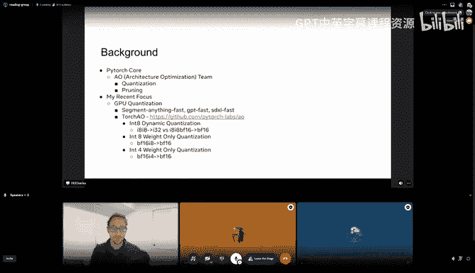

Same techniques on either。That works perfectly okay。Okay， I need to keep clicking at at all。 Okay。

 and where is the。All right。 I think， yeah， people in chat are happy。 You can just start whenever。

 whenever you're ready。Okay， great。So， where。

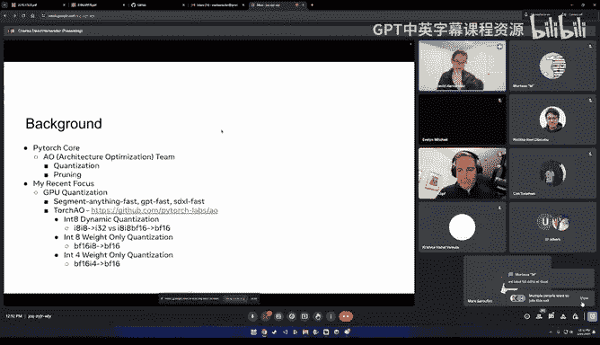

嗯。北事会议。Brief。Recap GPU quantization is what I've worked on over the past year or so we have the tools that we've created available in torch AO in this repository here。

 we have dynamic quantization weight only quantization intake and in four weight only quantization each of these the reason why we haven't had GPU quantization before this point is the kernel right we didn't have GPU quantized kernels before this point and that's kind of where I first came into conflict with kUuda with triton and with a kernel development。

So， yeah。All right hopefully everything is working and to the actual presentation now so first let me just give a brief overview of quantization since that's kind of gonna be background to the actual talk the two types of quantization we have thus far our dynamic quantization and weight only quantization in the middle is you know not quantization the dynamic quantization is pretty straightforward。

 you have a weight you quantize it to an integer， you have an activation you quantize it to an integer you multiply those together and then accumulate rescale and you get a float out and this tends to be desirable because multiply two integers together is much faster than multiplying two floats together So if you have two Bf16s you multiply them together and compare that to multiplying two intake tensors it's about four times faster So if you have something that's very compute bound like the segment anything model was dynamic quantization tends to work pretty well there are other forms of quantization like static that work even better。

They're even more effective at compute volume systems， but dynamic is pretty simple to implement。

 so this' is the first one we did。We only quantization on the other hand。

 instead of having the activation kind of move to a lower fidelity。

 the activation stays as is and you either multiply immediately with the integer with the mixed D types or you dequitize the quantized weight and then do the multiplication So so Charles turned up to you like kind of a pet people of mine I was curious here your take on this like I almost feel like saying something like int4 quantization is actually a very ambiguous term like ideally you should say like something like W4 like weight for and then you know like basically like like gradient 16 and then or Vf 16 and then accumulation 32 like how come this sort of terminology never really picked up in the community。

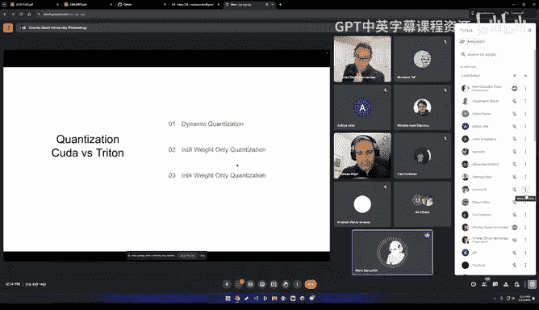

Because usually you say like n4 dynamic quantization。

 which kind of implies everything is being dynamically quantized to n4 or n4 weight only quantization you're not quantizing the activation at all and so there's like a myriad ways you could then go like you could decoquantitize the n4 and then multiply you could do a mixed like what you really want to do you don't want to do the de quantantized you just want to multiply an n4 times the times the what is it like the fractional part of the float right like you you have an and your BF 16 you have eight integer bits and then you have four inte your bits and your in4 you would like to multiply them and this overflow into the float part of your Bf 16 so like really the key of like what you're doing。

Like where the perf comes from is that in for and then whatever the activation is doing is usually like less important。

 but if you're doing like。I agree this weird thing weird of things now where we have like group wise quantization and symmetric and ae and being a bit vague can be problematic。

 I definitely see that。All right， thank you yeah， so in any case we we have both。

A16 W4 and A16 W8 weight on aization and then A8 W8。

 so everything's8 bit in for dynamic quantization。So the big key in both cases is the multiplication step how you do that is where you're going to win or lose in the perf battle because。

Either you're getting a compute improvement in dynamic quantization。

 or if you notice weight only quantization， you're actually doing more stuff like there's a strictly like。

Comparative。Loss if you look at not quantized versus weight only quantized and so you think that actually makes it go slower because you have this rescale here that you don't have。

 you have the same multiplication you have this D quantant but what you the advantage of weight only quantization that you're able to load the weights incredibly fast so in situations like Lama where you're not compute bound you just need to get all the weights into your GPU memory as fast as possible weight only quantization can be very effective and it's more accurate because you're not messing with the activations So if all you care about is how fast you can move things don't worry about activations because they're already in there you just got to get the weight in there as fast as possible even if you're doing additional math。

So that's basically dynamic so the question I was asked is why not quantize the activations if you're doing weight only quantization and the like the long and short of it is the thing that's kind of blocking you your memory bound and so you want to kind of be just jamming weight after weight after weight after weight in there as fast as possible you don't want to be puttinging around with doing a bunch of math with the activation materializing intake versions of the activations filling up the memory with more like intermediary steps you'd rather get the activation to get any weight in there do whatever the fastest thing you can to get the math done than move the next weight in so it's essentially like。

You know both simpler and has less overhead than the compute bound case so you can do it and in some but like you tend to find that the overhead tends to dominate if you apply dynamic quantization in a weight only in a memory bound situation so dynamic quant goes slower in  lama than weight only quantization does。

ItThat a general question regarding quantization， it's like every is model equally where quantizable or is it some is there even techniques during training that you could already make sure that it's better quantizable if that's a word in the end or is it and also like because like B I tag 8 bit。

4 bit is there like1 bit of or like what only the sign I don't know。

AlsoSo like there's like a whole world of quantization I actually did my PhD on quantization and sparsity like there's a whole way to like oh look at pruning as a method of quantization look at quantization as a method of pruning and so there's there's like something called quantization or a training where you train your model and it's aware that quantization is going to be applied to it and so yeah Qat fine tuning as Thomas said you essentially back propagate the gradients across the quantization operator so you kind of fake quantized things to do all your math and FP32 and cheat because rounding is not。

Back propagtable step， but if you just ignore that it actually works really effectively and there's all these different techniques So in order to get in for quantization working for G fasting at the accuracy we wanted we had to implement Gq and we wanted to do it ourselves because we wanted it to be model agnostic and the kernels we had didn't align with like the autoGBTq thing that most people use so there's a ton of techniques in different models like。

As someone on the quantization team what happens every once in a while is someone at Meta is like hey we have this model we need it quantized the accuracyac is garbage we don't know if what's wrong can you please help us and we have a pretty small team so it's not something we like love to do when people are like hey your tools are not user friendly enough for us to do it on our own but yeah every once in a while you'll hit a model that they need help and it' it's more than just doing some simple QAT you have to identify the layers that are sensitive quantization what ones aren't in a lot of cases if you're doing like categorization easily quantizable if you're doing regression type machine learning much harder to quantize。

Yeah， yeah， managing the weights and the distribution of the activations。Did you have a question？

David Dickinson。I see your hand is up。David can you un unmute yourself。好。I'm sorry。

 that was a mistake。Okay。Yeah so if we want we can talk more about pure quantization I have a good amount of experience there but yeah so assuming people have a have a good overview of quantization we can happily field more questions we can move on to the individual kernel so first dynamic quantization so let's say you're trying to you know you're me a year ago your boss tells you hey。

 we need some dynamic quantization on GPU we have towards compile which can take anything you write in python and turn it into a very efficient magical triton kernel so get on that and so naturally you you know you have your linear x do W you know if you're quantizing things you factor out your scales and then you multiply your integer matrices together first and then afterwards you're going to rescale it with your X scale and your scale so mathematically it's very simple if you're doing symmetric。

Quantization there is a small wrinkle sx could be either like a single scalar like in the per tensor quant or in w you could do per tensor quant for the weight or can be over the whole。

Outer dimension of x and w。 So if you have you know your x has you know M K and N M and K dimensions and W has K and n dimensions as long as you're not trying to scale your tensors over the K dimensions you're good because what you get out of x do W doesn't have a K dimension in it so if sx and sw do you're going be in trouble if they don't then you'll be in good shape so we have been doing per token and per channel quantization that's one of the awesome things but doing GPU quantization on CPU you're like oh can we afford a vector operation where we rescale everything maybe we should just have a single scale that we multiply everything by on GPU it's equally as fast it just do it with a whole vector as long as you're only doing it one time so that's great So now we need a kernel to do this in Mamal so you can go to your triton tutorial grab their。

It works perfectly well for in dates plug it in and what you'll get if you applied it to the segment anything model is a significant speed up about 6 to 7% speedup but what you might be surprised to see is the peak memory actually gets worse so this actually ran this yesterday for this talk we did these numbers you get actually a pretty significant what is that like 1520% drop or increase in the memory so that might be a bit surprising but if you look at the actual d types involved you'll see why when we multiply two in8s in order to avoid overflows we have to accumulate to n32 and by materializing this n32。

We're twice the fidelity of a simple bf 16 when you multiply x times w so that's where all the additional memory has come from we're materializing something that we don't need to so。

What do we do if if you're a triton engineer， you can simply alter the way that you materialize your tensor。

 you add a little multiplication at the end， you bring SW into the equation so that instead of storing your x times W。

 you multiply x times W and then scale it by this scale at the very end。

Andvoila if you manage to do that you get another almost double the speed up what you had before going from 785 to 731 and then down to 695 brings you to about 14% perf improvement over the baseline and peak memory actually improves not a ton because you know everything still Bf 16 you get a little bit advantage when you're if your peak occurs during the map mule itself。

 but otherwise pretty comparable and so we're better across the board now how do you actually do this because。

This is the part that was actually a big struggle this should be simple just adding a simple multiplication to Triton is not hard but getting torch compile to do it took weeks because torch compile did not want to fuse the multiplication operation and so I had the hard code and option to to it detects a pattern of into your mat mule and then a multiply afterwards you can enable config force to use intomm with mu equals true and then a little multiplication operation gets tacked onto the NmM So this I think it's like the thing that Triton is incredible at you have so many times I'm like oh I have this awesome cutless kernel but it's slightly off from what I want it to be able to do and it's like a pain in the I have to like add new kernels here it's just like a single line and triton or hard coding something in torch compile is not as easy but this is a thing I think Triton does super well adding a couple different。

Combining simple things together and getting something efficient out of it without having to like break the bank and spend weeks reoptimizing is so convenient and we knew what we needed to do。

 it took a little bit to get to work with the monolith that is torch compile it's magical when it works it's magical when it doesn't work it's equally frustrating like when it doesn't so as awesome as it is when it does but yeah so so this is an option probably need to make this a default so that people stop running into that but that'll be another day so and you can actually see what is going on in Torch compile if anyone is interested whenever you put a mapm in there's this template here and it's basically a little bit different from the tutorial you'll find on their website and it basically picks block group and all those different constants like any config Triton Autotune does and then it shoots out a bunch of options so you append a bunch of different choices you can have fallback so。

And the default int， where is the default one。Yeah， so the default impfam。

 it has like the Kublo Hs and Kublo kernel as a fallback option and。

All works really nicely here and you know someday in the future far far away we'll be able to have you know all these awesome kernels and anll auto tune between all of them and find the perfect configurations that I won't have to do and see profiling of my kernels anymore but until that day comes you know we're have to manually update the configs and things in here anyways this was my first brush with Triton it was awesome to get working it was super frustrating to then run into a brick wall a bunch of times until like hardcoded an option and frustration This should be something that triton that torch compile does automatically fusing things is like one of the two main things tor compile does and it does it really well in certain cases and then there's these weird specific things where oh there's a pointwise op here and then there's a max operation and it does all those epilogues first so there's no way it can put a little multiplication there on its own which is really annoying but。

Yeah I guess you know people are working on it so that was the first one this is the simplest one next let's talk about weight only quantization so this one it seems simpler you're not messing with the activation at all'll also by the way for the dynamic quantization the nice thing is all the actual quantization stuff you just write it in python and pytorrch and torch compile handles it all so don't need to mess with triton even at all to get that working which is awesome so。

Yeah， any questions about the dynamic quantization stuff I'm going to talk about weight only quantization where the actual kernel optimization stuff will start。

Yeah， Charles， I had a question。 I was wondering if you could dumb down the the aspect。

 like regarding the intermediate materialization， like it's， it's not like you're not like。

like I think what you mean is like you don't need to restore the materialized tensor back to like the high band of memory。

 Like， like like you don't need to start it back in D Ram。

But presumably it's still being materialized in eram just like in a blockwise way。

 So could you talk a a bit more likeca like for me。

 one part that still seems also magical is like what does it really mean to change the de type of a tensor。

 and like on the kuta side is like yeah， just like any more details you have like around how these convergence processes like work on the lower levels would be very helpful。

 Yeah， so I guess the way I look at it。 I'm not the most fluent and couta。

 But if you look at the trite now put after you like torch compile something。

 you'll see that it has to kind of free allocatecate space in memory for all these tensors。

 So in this case， we have like this is a one by 4096 activation。

 this is a 4096 by 1024 weight and then you have a scale and a bias here This is actually from the weight only optimization。

 And so。In addition to that right here it materializes an empty 1024 know that's not right well I think those are the strides but anyways like materializes the result of whatever this operation is going to be because it needs a place to put it in and so like if that's an n32 that's taking up a ton of space that it doesn't need to and while all your threads are going and they hold an n32 and then kind of garbage collect them like that's fine but when it actually has to be stored on the memory that's when you you see these peak memory increases in the slowdown and yeah I think you're right it's not like the activation right after you multiply two things together you're always going get that n32 and you multiply two in dates but if you then just multiply it by a Bf16 you can store the Bf16 here for whatever the next operation is and so that's the。

Like the difference where you're actually allocating that space in the the like I don't know lower access speed memory in order to use it for for the later operations。

Does that answer it I don't know， this might be exposing myself as not the most sophisticated kuta person。

 but that's how it looks in the experiments that I've run。Yeah， I think it does help。 Yes。 Thank you。

Just I add one more general question to quantization。

 maybe could take one two sentences about how does this work in general。

 I mean there's like different scales of loads with different exponents in this weight matrices and its granularity is this quantization happening so if I would take like the pool weights and it just stuff them into four bits could like you imagine that's like not going to work so it has to be some finer granularity and some background about quantization because everybody is as you obviously is very deep into this topic。

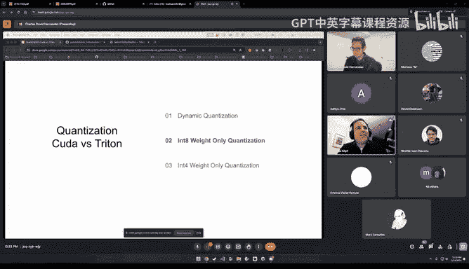

Yeah， I have。I don't think I have does a concept maybe overview what doing So the simplest thing that you can do like for example in dynamic quantization all you're doing is saying okay the biggest value i'm seeing in every channel is like negative one and then smallest is negative one biggest is negative one so i'm going to assume all the values are between negative one and one and i'm going to map that to the integers like that intake represents so you have kind of an even。

A bunch of even values evenly spaced uniformly spaced in that range that's essentially what you're getting in quantizations。

 you can think of if your values go from negative one to one and that's a range of two if you have you know two to the eight values that you can use to represent those then you know you get what is it 1281 or two over 128 like that's your spacing so if you have values that if you have like one at negative one one at one and then everything else is between like 0。

001 and 0。002 you're going to have a terrible time because it won't be able to resolve the differences within there。

And so this is essentially the same strategy that's used both in the weights and the activations in this case for intake when you do dynamic quantization you have a little bit accurate so actually you can see I think I have。

Is this where now that one is  Lama so you can okay so here is Sam you can see the accuracy degradation on cocoa 2017 validation Fp16 like no changes when we just apply different techniques when you do weight only quantization a little bit of a drop actually when you do dynamic quantization。

 it's within the margin of error it gets a little better。

 which is it's just error it's not until we apply this pruning that we really see a drop so coco was a pretty easy task intake quantization usually not too much of a problem especially if you are you know not quantizing like convolutions and stuff because we're only quantizing linears at this point because those are the ones we have kernels for again if you are quantizing you know convolutions in layer norms in every single thing under the sun then you start having problems and you want to do Q or you might want to identify what layers are sensitive to quantization and stuff like that but overall it's like the most simple。

thYou could imagine just evenly divide up the space and then see if that works if it doesn't。

 you know maybe try weight on equal quantization and if that doesn't work。

 then GPQ QAT stuff like that。Okay， but is it done like for the full weights。

 like was it like done for a row or colour like a tile inside the weights。

Yeah so you can do it in different ways we do per token and per channel on the weight so it's it's per the output channel on the weight so every single output channel gets a different scale value so if you know one output channel goes from negative 100 to 100 and another output channel goes from negative one to one those both have good fidelity no issues there。

All right okay that was what you already mentioned before so I don't know if this intuition helps like but feel free to spot check me Charles so basically I think one of the reasons why like you have these sort of perch purse like why you segregate like different quantization schemes like either per channel or per tensor or per vector or per block is because typically when you're rescaling things。

 the way you rescale is like with with the value of the maximum value and so if you end up having anomalies in your data。

 you're going to end up having like different quantization buckets that are very sparse and some that are very filled up and if you sort of localize how you quantize you end up having more quantization scales there's more Vra that you need But the result is that you're less sensitive to like anomalies and as a result your sort of your accuracy is better。

 So this is kind of like how I think of it Charles。😊，Sort of roughly correct， by the way。Yeah。

 I mean so it depends on the model like in some cases it's outliers that's like the determining factor on how your quantization goes in other cases it can be non nonstationary distribution if you are doing like categorical categorization right in one category has a vastly different distribution than another category。

 certain types of quantization won't work super well like if one channel has a bigger range than another。

 if you only do per tens or quantization like one channel is negative 10 to 1000 another channel is negative one to one well all the values of that negative one to one channel it's going to be effectively zero right so separating them allows each of them to behave differently。

 if you have some outliers then the other channel aren't affected there are methods that that work better for outliers then just hoping that your additional scrs solves it but yeah it does help every additional scale you add helps。

All right， so。Yeah， good questions and so weight only quantization So we did something pretty simple last time and it would seem that that would work right we could basically just take that same matrix multiplication kernel and add a change in detail because that's all we need we need to take this value right here is an intake we want to multiply intake times Bf16 So if we just convert intake to Bf16 that's usually fine Bf16 has by the way。

 if if you do like stuff with FP16 especially if if you're doing quantization at the same time you run into tons of overflow problems because FP16 has a really poor dynamic range Bf16 has a great dynamic range so you can convert like you know intake directly to Bf16 in 32 even directly to Bf16 you usually won't have issues So if we just take this intake convert it to Bf16 multiply it times our Bf16 activation that'll probably be fine right and that'll be fast and like you know。

Dynamic quant kernel was fast so let's see how that goes so I tested that out you can see it's right here it's directly in Pytorch we added this prologue cast in terms of terminology epilogue means it's something that's happening to the output so we like added an epilogue here to add a multiplication to rescale the output so it's not in 32 before in this case we want to change the weight to no no sorry the activation to be。

BF 16 or。Yeah， to make it be B F 16 and then。That would ideally work so if you were to do that you would get everything working it accumulates P32 rescale at times a scale factor S W here because you're not you're not quantizing x anymore you're only quantizing W showing up one scale factor so all that works nicely and no it works terribly it's horribles oh bad it's slower than just doing a normal nonquantized map mall so this is Lama 7 B and I also ran microbechmark here it's on the order of like 15 times worse something like that by the way I have repro for all these experiments at the end if anyone is interested so。

Yes。Well， so why why is it so slow so there's a couple things first of all we're doing a lot more work with this kernel so first of all we have to load our integers and then we have to do operations to them and then after that we have to do additional rescales and then which doesn't seem like a ton but it it adds up。

I think there and then there's I think there's another reason why that I'll talk about later。

 but in addition， it seems like and this is a bit hindsight the block size may be limiting us because。

If you look at these kernels here。The the。If you're doing like a tensor core type thing in Triton。

 these like group M things are limited generally to being greater than or equal to 16 or it throws errors。

And。If you try to profile the kernel you'll see that like if you could make this be eight you'd end up having 128 blocks and with your 108 multiprocesor a100 you could saturate it but you can't because half of them aren't able to do anything so that's another reason you're not using half of your GPU so。

What do we do This is actually weirdly oh it's actually here a problem that torch compile can solve for us is like the reverse of before here it's torch compiled to the rescue so I didn't figure this out Horace Hay。

 the guy who did GBT fast he was like the main person and then I did some of the quantization stuff he realized for intake weight only if you use this weird way of doing a Mael where you essentially like if this is one by 100 you add a one at the end so it's 11001 and then this would be let's say 100 by 100。

You basically do element wise multiplication and then some along the dimension so you're kind of manually doing a map mall。

If you tor compile this， you get a blazing fast kernel and。

Let's look at why So the big difference between this sorry。

 if you guys haven't looked at a lot of triton code。

 I'm kind of glossing over it because it's kind of Python and also looking at codes not the coolest thing for a presentation if anyone has questions please ask them but essentially the big difference here is we're not using tensor chs here there's no actual chunk like normally the way that these kernels work sorry I know this is making it really hard to follow but if you look at this what ends up happening is each group I here like every single thread gets a chunk of the output to store to right so it has this IDxM IDxN that's your output like indices that you're going to store it so it does all the processing of like all the rows and all the columns of X and W。

In order to get that chunkunk a square of values for the output。And。

If you instead to this weird manual map mu， you don't get that Oh sorry。

's the wrong one you get instead every single column of W gets its own thread。

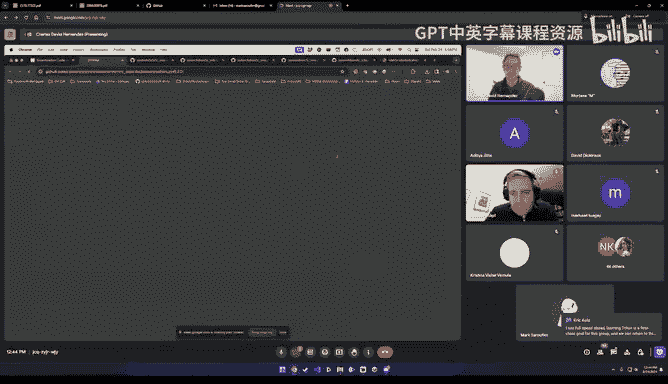

So if you have 4096 like I was doing in this experiment， you create 40 96 different。

Like threads that need to be processed and then the X block here is always one and then every single time our block is processing like a full column so basically the program I is just which column of W you're processing。

And then it processes one element of the output every single thread does one element it's like fully parallelized like that I guess the overhead of all these threads is fine to like make it go fast enough and it actually accumulates in FP32 which I didn't realize this until I was trying to get code for this talk probably this could be optimized a little more。

 but。Yeah， and this works incredibly fast。 So before we were up here with the red now we're at the yellow。

 and this is like yellow might seem worse than the blue by like a factor of two or more。

 But in reality， we have when you do torch compile， there's some overhead there。

 So the blue is just like a coublo kernel and yellow is this kernel plus the torch compile overhead。

 And if you do apples to apples comparison and just put them both in llma。

 you'll see that you're like four times faster now compared to the compared to the weight only kernel and almost like what twice as fast as the non quantantized so sorry just like a dumb question。

 And this case you're doing like a vector to matrix multiplication right and and this is sort of like embarrassingly parallel because you can sort of parallellyze the block Id over the columns of the matrix that you're multiplying into。

Yep， exactly okay got it you and so since you're focused and batch size one for Lama for like personal use cases in general memory bound situations。

 yeah you have a one by m and then like an M by M or some or M by whatever it is you're always processing all of the X and then one column of W and that's how it parallellyzed it and it kind of got around the restriction of the like minimum batch size of 16 because I'm not actually sure how this is like with the rules but the way it loads things is a little bit different if if you look and this ends up just being significantly faster you would think making 4096 different threads would be slower it's faster。

All right so yeah， we end up blazing fast what this is actually we have a slow GPU here it's like power limited。

 so the actual numbers if you go on GP fast， they are like like 150 approximately for the weight only quantization with this kernel and that you know。

Almost 1。5 x what you get without quantization so 50% improvement for a little bit of triton code that torch compile ends to you on a sub platter is pretty nice in my opinion so。

Yeah， also it's like one of those weird situations where you， if you look at what happens。

 the decomposition， it's looking for a map mu and then it swaps it into this if the shape is zero if like the shape is one on one of them and you have this option for coordinate descent tuning where it's like。

 hey。This is fast when this option is enabled I don't know why let's look into it at some point it never did but yeah so again it's really awesome when it magically works it's also some it's frustrating how magical it is but yeah it it's really cool to see so。

This is the kernel that we've been using for weight only quantization we had another person put a cutless kernel into piey torch recently。

 I tested it out is basically the same， which is you know pretty frequently we see that the triton kernels are almost as fast as。

You know cutlaless or kuda kernels that people have written if you really do a good kuda kernel i'm sure it'll be faster especially if you're like optimizing over the specific sizes。

 but the fact you get something so nice so easily this is where Triton really shines and torch compile really shines where it's taking something you know in Python and making it incredibly performant with the little effort。

So。We're still yeah we're not matching the micro benchmarkch but we are killing it for  Lama and one of the only problems with this is it only works for batch size one we still don't have a great kernel for batch size greater than one so if any of you guys you know really want a cool project figuring out how to do mixed mat moles for batch size greater than one would be is really important。

是。Yeah。All right arere there any questions， I see a lot of chat。嗯。Yeah。

 like I think while people are asking questions， like if anyone is sort of like interested in like a working group to sort of like figure out the bat size end problem。

 like And already been like setting up like a ring attention group。

 I think it's been one of the more exciting developments in the group。

 So this is like really So if you are sort of interested in spending some of your time there。

 I can like work with Charles to sort of like guide you on the right path。Yeah。

 if there's any other questions to let us stoneshot otherwise I think you can keep going Charles right the one question I'm seeing is why is batch size greater than one tough and I think my answer is because it comes back to that key question of like you're no longer able to do this because you do now need to index over the activation matrix as well previously we're just able to say hey the columns and the full activation matrix are approximately matchable one to one and so that is sufficient now we have to also kind of go across the activation matrix which makes it more compute bound rather than memory bound and that's when it starts getting hairy and it's unclear if like that's just solvable we had a bunch of cases where SDXL fast they have a ton of situations where it's not one by n by one by n multipied by n by n but a two by n multipied by n by n and so we can't use this in。

nine。So its it's really fascinating because I I always think， okay。

 we we are like in this situation where it's completely memory bound and there should be like especially this opportunity to have like patches。

 which then give us the yeah， basically the possibility to leverage the full compute。😊，Yeah。

 power that we have and not like waiting all the time on the memory to arrive and also will be written。

有。And I think the other thing is it comes back to this 16 being problematic where you're able to one is probably not optimal。

 maybe two is optimal but two doesn't seem to be an option if you were like I bet there's a way to rewrite this so you are processing two columns at the same time instead of just one and that would probably be faster but it seems like it's kind of picking between 16 or one and it ends up being one is significantly faster and the situation that I've seen so so I think this would be really great if we could except this problem out and so that we could deal with it in the group and like profile it a little bit and check also the situation one so just spoiler alert yeah there's at the very end I have g here with all the scripts and if this kernel is in the。

You can see it's。Well， you generate it here。I know it's here。系你。Okay。

 so yeah right here so you you torch compile this this is one of the things I make or benchmark so if yeah I mean there's a reproducible you can compare it to a bunch of different ones。

Yeah if people want something different we can we can figure that out via I'll make these slides available Okay so there's any link to the code as a starting point yeah I'll share the slides or yeah i'll get that done after the talk probably because I think this is technically like my Google account is attached to meta so I can't just share things okay so In weight only quantization so this is where things start getting tricky and I think where Triton starts falling away and couda starts becoming more and more important because。

You start having to pay a daygram bigger prices for using Triton first and foremost there's no in4D type in ptorrch and there isn't one en Triton lane either so you end up having to do weird things like packing manually and then unpacking manually which is slower and so you're paying a bigger cost to do that unpacking and on top of that you know these things aren't effectively supported we're losing more ground because we have more expensive packing and unpacking operations and then and that's especially compared to what we want to do right like what we would love to just do is you have like a signed bit here assigned bit here and then you have an int8 it's seven fractional bits plus signed it and then one signed bit and three bits this would be so easy to like you could program the logic here to just do a normal int multiplication bit wise here and then oh if this number is like far enough forward that it's gonna make this number。

Flow just bit shift it right once， you know， it'd be very， very simple to implement， but there's。

Yeah there's no good way to do that because again， this is where so you can do fancy stuff in Triton and Kuta and I'm going to show you a kernel that does fancy stuff and you guys can go look into it because I don't fully understand all of it I actually I don't understand much of it but it's incredibly fast。

There isq and for four by two so that is a bit old the Q and D types are from our team because we have like native support for quantized D types and for GPU though we're using subclasses so they're not really going to be used you can get those on actually I was the one who may it possible to put those D types on GPU but yeah the in for classes will be handled through subclasses and we do have。

You went four by two kernelel that i'll show you what I made it's kind of an abomination and then we have a good one as well。

That's what you would want to do right you would want to do a very simple multiplication。

 you don't have to mess with this exponent at all， but in the process of actually like using Triton because you don't have that access to that low level manipulation you have to do these large scale conversions where you're converting an int4 into a BF16 to do a multiplication which is insane right we do not want to do that。

向。Well， let's see what we can get just using Triton anyway so the first thing you have to decide how you're going to pack it as someone mentioned in chat。

 there's a4 by 2 d type in pytor so that's naturally where I went and you have four options right if you have these are essentially how you're going pack to numbers of in four size into an in how do you unpack it which is the'm tri a question right you can either unpack it like right next to each So this a you have to insert another row in between these in order to to see where you put the B or you can just put them directly next to it right so you can have the B DgH just to pop in next to it or below or you can have it pop in between the rows up and down So in my case since we're doing multiplication。

Of the weight primarily we' be processing columns so we want things that are contiguous in this representation to be contiguous in this representation。

 so the bottom white right one makes the most sense。

And we choose that also because you don't mostly kernels you'll see in Triton。

 they process the entirety of the K dimension， the inner like matrix multiplication dimension。

 and so you don't want to be loading A B E F only to get A and E or only to get B and F So if you were if you were processing this one in the top right you might do A E as one thread。

 but you had to load twice as much data as you needed， whereas if you're processing A B。

 E and E and G， it's the same amount of load So the bottom right is the one that I went with all right sorry folks just like one logistical thing like Google just informed me that our call will end in 15 minutes So I don't mean to put you on its Charlie but like I guess if you could finish up like the core content of the talk then and then you we could always move back to this for Q andA know we'll try to have a better setup for next week an apge Yeah that's fair so fast forward。

I implemented this abomination in pytorch it's in the Pytorch code base and it's incredibly slow it's as slow as the other one then the guy who wrote the entire pytorch GPU backend landed or not he didn't land it but he developed it and in4 kernel and it's in pytorch if you are interested in it it's right here you can use it convert weights in4 packC and then use this weight the usage of it is also in that just I'm going send out but it's insanely fast it's so fast it's faster here you get up to like 200 tokens per second when you're not on my my slow rate limited GPU which is almost2x it's more than 2x to speed here and then this is kind of the big presentation we had with the GP fast because this is like soda or4 and4 as far as I can tell so't this is I think the boundary。

I what you can't really do in trying to maybe someone can do it who's much better at this than me there's probably some optimization to do if I was going to do this again I would write the you went4 by two kernel in the way that that fast in8 kernel was written there's no easy way to get bytorrch to give you that kernel as far as I can tell since you have to do like the packing and unpacking and stuff yourself you can't just do the sum unsqueze multiply and then sum and then torch compile that to get it but if I think you could write it so that it's faster than 93 but but definitely not 135 tokens or sorry 187 tokens per second that insane。

So this is where I think like。The the key limitation of tritonons starts to show when you're doing complicated operations in us D types you run into issues and you know。

 problems within four problems with batch size one greater than one。

 there's some issues with L2 cash operation probably the weight only stuff as well because。

You have situations where you're processing and unpacking a bunch of data and when the back size is greater than one you want to unpack that data and then another thread wants to use it but what's in the L2 cache is what was loaded which is the like not it's the still packed version so you end up having to do every thread has to do the unpack operation every single time which ends up slowing down a lot and additionally there's some weird things with config consistency if you pick the fastest config and the config and put it in a bunch of other configs it picks other ones the heuristics aren't the best and this is really annoying。

The strengths on the other hand all of intake you can do in triton which is insane To compile gives you most of it too which is even more insane and there's even crazier things like the coolest thing i've seen with Triton is that flash attention is the fastest growing kernel in pytorch right we were trying to get Sam to run faster and there's a stupid bias where it takes two small tensors combines them in a way that takes two four dimensionmensional tensors and makes them into a fivedimensional tensor and then it wants you to materialize that and then that's how you would put into flash attention so when we do that it's slow。

But my teammate Christian wrote a Triton implementation of flash attention that just does that add because it's easy to add these things like when when you're doing a block in a block it's hard when you have to materialize the whole thing and so this is super fast and was a significant speed up of our of our results for signal anything So yeah if you want to get 75% of the way to optimality without ever looking at a dot C file Triton is great for that as long as you're doing something reasonable if you're messing around with in4 and doing crazy stuff then is probably not in the cards but otherwise I think it's definitely that's what Triton is like if you're not Jeff Johnson if you're Charlie Hernandez you know that's what I've kind of fallen in love with Triton and I'm going to be doing static quantization and probably have to implement all of。

Christians flash attention in Triton statically quantize on top of it because that's something that's possible now is because Triton is so accessible。

Okay and then lastly torgeo where all my stuff is and then the microbechmarks and other relations where you can go and see a lot of the things and reproduce the experiments that i've been talking about and stuff yeah i'll move into the to the Discord to answer questions if there are more。

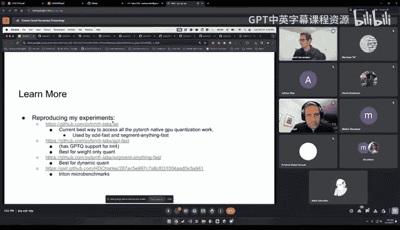

I， I certainly have a lot more。 So， so thank you so much。 Shi。 Yeah， so let's move back to this one。

 Yeah， thanks， everyone。😊。

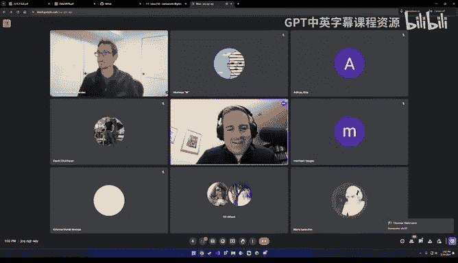

And。Poish， maybe it's， it's simpler to do it here。Yeah， let's wait。

Couple of seconds before we went to arrive。

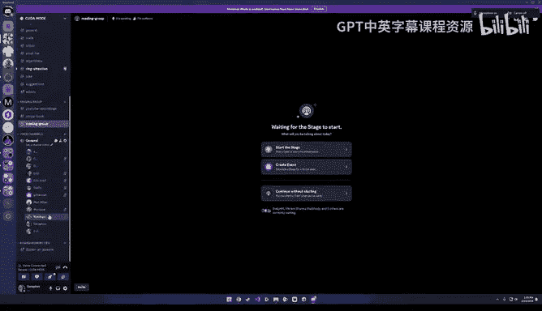

嗯。嗯。嗯。Oh。Okay。

嗯。嗯。Yes thank you so much with very like deep presentation going into this quite so simple topic。

Yeah， I think I。I don't know if I can， if I may start with a question for you。

Have you also tested like Tim Demas bits and bys library for quantization。

 So what why did you go go into this direction to writing your own stuff。

 Is it like that you found it's too slow， It's not giving you the necessary functions。Yeah。

 so the reason why we started this thrust is because of the fization of the technologies in the OSS community there are so many people doing incredible things that are building off one another and if you work in 95 that isn't like ostensibly like directly interfacing with them it's hard to keep track and so we wanted to show that like hey。

 you can get that level of performance and memory and whatever you need。

Using native pytorrch in an easy to use way and trying to make it more accessible for people。

 especially people that are trying to get into it and don't have the ability to follow you know threey old Twitter threads about optimizing X-formers on top of Qlo and stuff like that So so that's the biggest reason like there's 10 reos out there and trying to take the best pieces and make it accessible to individuals in a way that like you know pytorrch has always done's you know there's a reason why layer Nor and batchcheor and all those operations are available in ptorrch its not because they were invented by ptorrchches because people wanted to use them wanted to make them accessible in a useful way So that's why we started this and we also thought that we had unique advantages right having access to the ptorch the torch compile team allowed us to move faster and add hardcoded options that maybe aren't necessarily。

y for other people and you know having my questions answered when i'm like hey how do I get this working and then on top of that like someone like Jeff Johnson working on int for dropping those kernels and making those available。

Like the fastest thing that I think is out there I'm not sure if there's anything that's faster in it for right now。

 I know that like there's an autoG kernel that has had a bunch of optimizations by people in this group itself。

 which is super cool especially again that's just Triton and like I know that that one's a bit more accurate because I've looked at that kernel it has some like tweaks that it has some additional like customizability that makes it a little bit more accurate but in terms of like pure speed I think Jeff Johnsons is the fastest。

Would't surprise me so those are kind of the reasons why we we set out here there's it's so hard to keep track of everything otherwise。

Okay， thank you very much。Anybody else wants to ask something。

Yeah we have compared but you asked if we've compared like with bits and bytes and bits and bytes is doing like they have a lot more focus on like QAT type stuff and their kernels are not the fastest as far as I've seen like for example。

 their dynamic quantization kernel does a kind of hybrid intake FP16 when it identifies layers that are tough to quantize it does them and FP16 we're kind of just like yeah you can solve that with either QAT or GBBQ we're trying to be as fast as we can so you know like I think there's room for everyone and it's up to the community to decide what their use cases are and what they need and what they want So。

Yeah。And I think in the by bit by， I saw that it it's using like table based lookups for like。

 for example， F forbiit quantization is， would something like this also be possible with Triton to implement。

I don't think snow， I'm pretty sure not。 I think like so you need an FP4 D type or something along those lines。

 maybe someone smarter could could there's probably a way with someone really smart or maybe just a couple tweaks to triton language to enable that I know that like F4 is something that the kernel that Jeff Johnson kernel he has an internal version that he's working on that that's called actually I'm not sure if I'm allowed to say this。

 but there's another one that has like support for FP4 at the very least。

 And so it's something that's like on the way I know it's like it seems like if you're doing four bit FP4 tends to be a bit more accurate So it's something that we're aware of。

Think that's， that's part of the trade of where you're at the。Like the totally are different。

 And then。And bits and bys that bits and bites kind of。Had like accuracy first。

 and you have now speed first a lot more right。Yeah。

 and actually so the there's another there's another one out there Quanto and they're doing some really cool things as well。

 I think bits in so it looks like to me the direction hugging face is trying to move is more towards the the quantto one like I know that like one of their employees is developing it so i'm not。

Sure， we're。Like them versus bits and bytes versus us all fits together。

 they're all like really cool technologies and there are only so many engineering hours。 but yeah。

 I mean check check them all out they're all like。One of them's going to win and everyone will be using it in two years anyways。

 so it doesn't matter。So I think also Nvidia has some custom F8 corners， at least have you。

Looked at them， as them。And that I couldin nice numbers in the also they， they have like。

 especially great numbers for high throughputs in areas。 So also larger exercises especially。

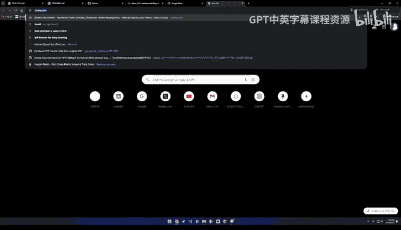

Yeah， so one of the weird things is it looks like I I think if I remember correctly in video removed。

 I think in for kernels from the H100 or something like that。

 and they and they instead move to FP for on the H 100 So yeah， and I know they have a D type that's。

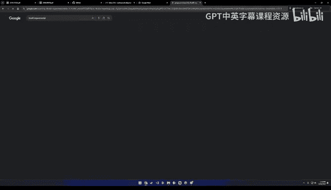

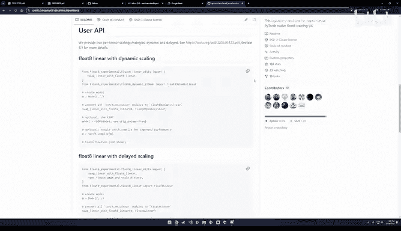

It's like a combination like Mx， something we haven't directly。

Compared with them right now what we're focusing on is so what I'm working on now is a lot of the different layers in the models need different types of quantization and it's a huge nightmare to figure out which is which and so we're trying to make an automated tool to do that for you so Perf has been not the biggest concern for the last month or so but yeah I've heard like we have a list of all these different quantization technologies like QUI is one AP is another where these are kind of more rounding oriented rather than kernel oriented and then we have all these different kernel options that it's always like a question of prioritization of which one we're going try that support next。

What's maybe the appetite for like the AMD side of things for hardware support through Triton。

I am not on the triton team I would love to know though。

 because I think that is something that could really open up AMD I know that。

I had an hand DG view on my gaming PC when happens was in high school and I haven't had one since I started machine learning since U but。

Yeah， I can comment on that briefly。 So like if you look at， for example， the G fast like blog posts。

 like it did share numbers on AMD， which involved like nocode changes because like the idea is that like any GPU like vendor would plug in at the trident layer。

 So there's certainly like an appetite from the community I think it's a question that comes up very often。

 So that's from the torch compile side， but also like from the eager side。

 if you go to the Py repo and you like look at the like labeled for AMD。

 you'll see there's like a lot of like even eager kernels that are being like hippaified。

 So basically they take kuta code and then they generate like hip code from it。 So yeah。

 in general appetite is very high。 it's one of those things。

 you know where like more bug reports are really helpful I think itll help like build a better product。

 And you if it's like it's the more interesting the model and the use case。

 I think the more likely they'll look at it。Yes， and it's a much more weird extended question。

I saw that a year ago， Triton team said that they have plans to integrate with newer Mac versions。

 have something been done about whether or not。Yeah， like yeah。

 like it's generally quite hard for us to to make comments about hardware vendors。

 like typically these things are kept secret until they're done。

 so like I can't comment too much on that sorry Okay， thank you。嗯。

That's more more a practical question when you use try it and So do do you。

 do you install it directly from， from Github or do you use the version which comes with the latest pytoch。

B or because I haven't sometimes said the situation that the。

 like the version that was in Py was a little bit too audience was so fast moving and tried to feed me a little bit。

Thank you sometimes。 it's not， it's still developing， I would say， yeah。Yeah。

 it's actually really annoying。 I had like， there' are a bunch of times where I had some really。

 really nice results on my machine。 And I realized I had like。😊。

Like a mid levelvel like not the newest and not the version of Triton that's on pytorrch and then when I upgraded or downgraded that awesome result went away and I got real sad like we had a 15% speed up on STXL fast on my machine and then when I changed Triton and dropped down to five that's what we ended up like releasing it's it's really tough I primarily use the pytorrch one now just for reproducibility and we have a bunch of like other like。

People that are trying to do their own experiments。But u yeah。

 getting on the most recent version of Tritonum and seeing if it's like really fast is always nice when you get a good speed up。

ItMaybe maybe also well a political question about Triton So is this is this like an open AI product actually or is it is it like also some foundation like agreement between different parties so that。

 for example， if matter of like Py Foundation is now relying on this very heavily that it's not taken away in some sense that's like new  license comes up and then for whatever reason。

 open I or next generation， Triton is no longer available for ordinary people。Yeah。

 was some some made sure in some way as an agreement upon。Yeah， let me let me let me jump in there。

 Like I think basically if you look at like the latest like Trident conference。

 like they had like a couple of talks and like the vast majority of those talks like came from like hardware vendors So it's like basically。

 it is a strong dependency that a lot of like hardware vendors are taking on。

 There's like a really strong relationship between like the Torch compile team and the Trident team like a lot of the core Triton developers or even are even coauors in the Pythrch2 like paper that was like recently published。

 So this is like this is like kind of a nonissue as far as I can tell。Okay， great。Good to know。

So iss there like re also happening between us Pych developers and and tri developers。

 Is it like becoming a real foundational element of， of Py next， next generation。Yeah。

 like in general， like Trident is like a core dependency now。 So yeah。

 like the torch compile team is certainly taking like a strong like bet on using Trident to generate its scoo kernelnals。

 But but there's also like kind of like other other backends， like Intel has a CPP backend。

 So depending on which layer you plug in， you'll get optionality in the backends。

 But at least like for GPU based perf。 like Triden has still ended up being like one of the best bets that we made。

So so by the way I did want to circle back to something。

 Charles like maybe more of a technical question。 So one thing I found interesting is that like like as you're doing。

 for example， like a matrix multiplication like let's say with like 2 and8s like how do people decide。

 oh， yes， like let me accumulate this result in B F 16 or FP 32 like you know why not FP 64 like how are these decisions typically made。

 is it more like heuristics or is there sort of like strong reasons that FP 32 it ends up being like a very popular accumulation type？

I think it's largely about I think it's largely defined by the hardware already in a lot of cases you have like I know the kernels for intake multiplication naturally accumulate to N32 and if someone had a current like we ran into cases where like Jesse was doing Eda sparsity and they had a sparse kernel that combined with quantization did intake that accumulates an intake and just had so many overflow issues。

Like， I mean， for me when I was。You know， anytime I have an a。

 it's always a question of what's the smallest value that doesn't run as over and most of the time that's either Bf 16 that's Bf 16 but yeah like if I could accumulate intake intake into BF 16 directly I would do that that would probably be faster。

And probably also， like part of the reason for not using like later like 64 B data types is that that like the cuta or the device support is very poor for。

Such things， right， So that I don't know what like H 100 has how many。

Dub precision operations are possible， but it's normally that it's like optimized for。16 bit。

 And maybe that also start th32 B。Yeah， I mean， I a situation where I wanted to accumulate in 64 bit and I and I like 30 FP32。

 you can accumulate anything into there even into FP 32 works fine and then。

I struggle to imagine a scenario where accumulating in 604 bit is like the right choice。

 it has to be some massive tensor that like。Um， you know， when you add everything up。

 it's just overflowing or something， but I haven't run into any situations like that。

Just since you are an expert for quantization， also and。

Do you have also looked at these extreme cases of one bit quantization， for example。

 This is is this something where still something useful comes out of of such networks。

 So it's then completely breaking down。 there's actually some really cool work。

 If you look up the Q U IP paper。 That's another type of it's essentially。

It's doing something similar to GPTQ where you have to do bunch preprocessing on your weights and everything and know what your activations and the hesian of the activations is gonna to be ahead of time。

 but then once you have that you do some preprocessing on the weights and the activation to get them to I can't remember the term but they essentially they're like eigenvalues are orthogonal and then when you multiply them together you don't get the type of quantization error that like propagates like you do normally when you have the activation quantize in your weight quant so it kind of prevents this like these knock on effects and so you need a kernel that can do the kind of orthogonalization and then deorthgonalization of the you have to orthotgonalize then multiply and then deorthgonalize the result and the QI people have some kernels that do that and I haven't like tested them myself to see how fast they are but if those were comparatively fast。

They're going down until like in2 and getting reasonable results and I know people like are looking at in1 as well so it's that people are getting reasonable things it depends on what you want if you're trying to get an LLM working that might be harder if you're trying to get I don't know and this solved that's probably pretty easy but yeah people are doing it it's an actual thing another another thing that's really common is power of two quantization because at that point to do multiplication you just have to do bit shifts so that's very efficient and you can write really efficient kernels for that type of quantization。

There's a bunch of different weird things if you really go into the weeds as quantization and yeah it's always a question of like hardware support in combination with accuracy and combination with you know。

 people being interested in it。That's super interesting， too。Do you， you have some， some tools。

 for example， to view the， the distribution for the weights or some。

 I is it like a case that you analyse the， the weight actually a little bit more of a network if you get something before you quantize it。

 does it completely automatic， It's not necessary to。

To really look in so how many outliers there are or like。

 how's the distribution as a more than a mean and Maxman and max。

Yeah it it depends so like the it depends on what technique you're using if you're doing the these basic types of quantization that I talked about here。

 if you're doing intake usually you're fine if you do。

The in for quantization you have to do GPQ and what that is trying to do is it quantizes so you take a weight right and you know you run your model a bunch so you know the hessian of that layer essentially you just accumulate activation transpose activation and then average that over a bunch of inputs and then。

Once you have that， you try to quantize。Column by column， the weight matrix。

 And then when you quantize one column， you alter all the other values of the weight matrix to maintain like the hessian multiplication afterwards。

 So in that case， it's like a much more sophisticated technique where like you have to you have to have a bunch of data to quantize it。

 then you have to like spend a bunch of time running all your data through calculating hessian do a row。

 calculate the updates， do another row and it it takes like an hour to run。

 but you know other techniques it you know if you do intake weight only that'll be done in less than a second if you run that。

 you don't have to do any type of analysis， you don't need any data that's the all So I did want to plug two papers that really help me understand like some of these nuances like basically the Q Laurara paper by themmers and LLM intake So the Q Laura appendix like they have a study where they basically like do a statistical test on the weights of pretrain。

ms and they notice that a lot of them basically essentially have their weights like they're sort of like zero mean and normally distributed so like it was sort of like full lo knowledge。

 but like they sort of did a statistical test for it and sort of similarly in in the Qlora paper like when they propose like alternate D types like NF4 it's really to make sure that the distribution of weights like follows like a normal distribution So yes。

 like this is very much something that's useful to plot like you get a histogram of your weights and you look at it and ideally you want to make sure that like the weights aren't that you don't have any sparse buckets and like they're mostly all of them filled up otherwise like as you're going through like a lower like a lower bit precision you're not using its full range So like a lot of quantization algorithms that talk about like you know you're scaling and like moving the mean a lot of these ideas or so that you can make sure that the full range of the lower D type is actually。

Otherwise you're just wasting bits。嗯。And trust， would you say that this quantization is also the best option for。

 for tools like speculative decoding these techniques to instead of using a separate network。

 is the in general， the distribution very similar to Yeah。

 so that probably it should be because it's like the same model like just quantized。So your。

 your experience you did this probably right in this think I I。

I think Hace did those and you can see the results in the GT fast repo you just type GT dash fast yes speculative decoding experiments I yeah and he quantized the 70B Lama2 and4 and I think he did GPTQ on it to on wki textex and then ran it and found。

It's always a trade off between life speed。An accuracy percent。

 and so I remember he presented to our group。That trade off where he was picking the the specific size he was going to use and then quantizing it。

 but I don't see it here， but yeah， I think quantization is you know。It's possible like。

Quantization is one tool Sprsity is getting there， we're getting more kernels。

 more support and things is probably some combination there's an ideal world where you go layer by layer and identify what kind of what data is wasted and get rid of that perfectly in like a magical mathematically perfect world and so quantization is a apart sparsity is part you know things like knowledge distillation and and things like that are definitely going to be a piece of that it's certainly not only quantization if I was going to do speculative decoding I'd probably do quantization because it's the easiest one and I have the most experience。

But。In another year or two， it could absolutely be a combination or sparsity only or something like that。

Yeah， it always feels that as if we。Currently， I still like scaling up things that we， we see。 Okay。

 it's， it's working。 But all these quantization things they indicate to me a little bit that probably we don't need all the weights at not in at least not in non zero fashion。

Yeah。Let's see what this it's maybe like hardware。 like this hardware hardware lottery thing that we have like very efficient things to。

 to do matrix myification， dense metrics metricifications。 and for for this pass。

Thing to really kick off。It it's probably like not the re， the right tools are there right now。 Yeah。

 I du't know。 maybe it's， it's。Saracy also available in Toro for GPU。

 but yeah it's there's there's a lot there and it's one of those things where I think there's no like。

There's never gonna be a simple thing I spend a lot of time taking a model and going layer by layer and trying to figure out what technique each layer is going be sped up by and stuff like that it's like a really laborious process and that's the type of thing because you'll be like oh this layer changes you know the speed up by 30 milliseconds but the accuracy goes down by like a half percent and like there's some preto optimal front that you're moving along and it's very nontrivial figuring out where the optimal point is and you can always put more effort in there。

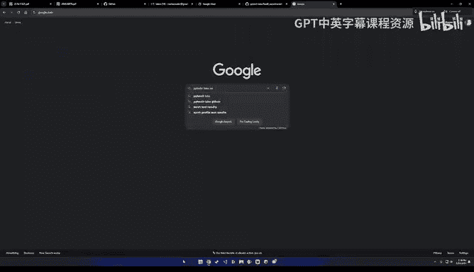

Yeah， but by the way， accuracy。 So is this like the main metric which is observed and and monitor it not because it's。

It's I I don't know if T， if it， is it the best is would be like a perplexity or something be better。

like more realistic。Perplexity is weird。So when I send the slides out。

 you'll see there's some analysis about the accuracy ofllama。With different。

Different sizes and bit widths and stuff like that。 And it's really hard to say oh。

 the perplexity dropped by like01。 what does that mean you know like oh this one dropped by0。

1 and then it dropped by a further 0。15 is that like twice as bad if it's going twice as fast but it's like you know it's really hard to say what perplexity actually means to a real person and it's tough unless you're doing like human evaluations to get a really clear understanding of it in my experience。

 it is very robust like you can very much it's very like granular you you know increase the group size a little bit。

 the perplexity drops a little bit and and somebody like if you do hella swag which is like another evaluation task that one is much less granular you know you change it doesn't change at all like it's very useful perplexity is super useful but there's still like you know I wouldn't say it's like the perfect measure anything。

That is what we used， but it was tempered by trying out the gambit and then figuring out what was most useful to us in that situation。

Yeah， like like Evals is a sort of like whole deep field because like you know。

 it's like then you could even get into debates like， well， was hella soagg enough。

 Should you like like which data sets are enough and like what's representative？

 So the way I think about a lot of these metrics on these eval data sets they're sort of like useful is a C check in some sense。

 like as in if there's like a serious degradation that's really bad。

 But often I think what like you know trials is alluding to with like like vibe checks you know。

 like or human preference tends to be sort of the most like indicative thing in the short term because like it's just pretty obvious if you're like language starts speaking a different model size speaking a different language after being quantized。

 know， that's like really bad。 know， that's kind of the kind of stuff I've seen before。没有。All right。

 we're at 90 minutes。 Charlie， thank you so much， folks， if you have any more questions。

 you can find Charles here on this Discord。 He goes by H。 D Charles。

 If you're interested in following his work more closely。 you can go to the Pyrich Labs AO Repo。

 which will have like all of these techniques and pure Python and you can go like play around with them。

 know， try it out， you know， give feedback。 if anything's broken， we'll fix it。

 And I guess like the the topic for next week。 I'm gonna be talking about like coulda performance gotchas。

 So we'll get back to know profiling related stuff。 It'll be a follow up of the first lecture。

 But please， please， you know， if you could just like emoji dump on Charles。

 I'll be very grateful and thank you so much everyone and thank you， Charlie this was great。😊，Yeah。

 great， great great talking to everyone。 thanks for your awesome questions and hope you guys have a great time。

Yeah， thank you so much。 as I， I try to get in contact with with you to collect little bit of a material for our lectures Github so that we can。

I gathered there everything。 And yeah， it was absolutely pleasure to have you。You you。

 Thank you so much。