# GPU MODE《CUDA、GPU编程1-53课｜GPU MODE》中英字幕（deepseek-v3.2 - P8：-20240304-Lecture 8_ CUDA Performance Checklist.zh_en - GPT中英字幕课程资源 - BV1QZ421N7pT

All right， hey everyone， I'm Mark Sarufiim， I'm an engineer on the Pyrch team at Meadow。

And this is a rear recording of a talk I already gave in Kuda mode。

 which was about a Kuta performance checklist， But unfortunately。

 the talk ran into some I ran into issues like with the recording where the audio was glitching。

 So I thought I'd just like do like like a fresh rerun。 So the content is pretty much like identical。

 There's like a couple of questions from chat that maybe I'll miss and I'll try to highlight those。

 but otherwise the content should be the exact same thing。So yeah。

 so basically this is a direct sQel to lecture1 where the idea of lecture one was like hey， like GPU。

 like the only reason why we spend money on GPUs is because we care about Perf。

 and so if we're not getting PEf， like no point there is no point using a GPU。

And the good thing about this is that there's like sort of like a few common tricks that show up again and again actually if you go through the programming massive the programming massively parallel processors book。

 pretty much after chapter6 or so everything kind of becomes like a case study of sorts like as in heres like a type of algorithm that's important and like certain applications like whether it's like a scan algorithm or reduction algorithm and here we're going to use like all the tricks we learn about to make it go fast so this is gonna to be much more of a dump of all of those like tricks up front but what's cool about them is that they're kind of like immediately useful like you can just start using these in your kernels today it'll help you understand both like gooda performance better and Pythr performance a lot better and so as a result I really mean this is a direct sQL to lecture1 because it follows like very much like a profiling first approach where we have like some hypothesis and we're going to pro things to validate things along。

And so you can really follow things along like like pretty much like everything I'm describing here is already on GitHub。

 so the code is all here already in the lectures repo and Ka mode so make sure to like follow that。

And this is like all the content for this will be in the lecture 8 folder for the code and the slides I'm going through are in like the slides link here。

And to actually run these， you need to either， you obviously need to have access to some GPU。

If you have a local GPU， then you shouldn't need to do anything like everything should just like work out of the box。

 However， if you're using a cloud vendor， it's quite tricky to set up like NCU。

 which is like the NviDdia like it's basically a kernel profiler for NviDdia and it's sort of like the foundation for everything here so if you can figure out how to do make it work on some cloud provider please let us know in the Discor group otherwise you can do this like from the lightning like from the lightning AI studio where I know this already works and it's actually what I' mean of using for these examples so I just want to give a quick shout out to Luca andga because from lightning because they funded like pretty much like all the compute that I use like for these experiments and if you are in the Qa mode Discor group Lucas assured me that they're very interested in giving people like a discount on compute especially if you're in the business of producing an interesting kernel or reproducing an interesting kernel similarly。

To the ring attention group that we now have on Discord like this is pretty much why I'm doing this whole。

 this is why I' am spending so much time on Ka mode is because I want more people to do this kind of thing So please let us know and we'd be happy to support you So pretty much like the format will be this like you're gonna just get clone in the lectures and for every we're gonna have a bunch of kuda kernels where we're gonna compile compile them with the Nvidia like like Nvidia compiler create an executable called benchmark and then we're going profile this benchmark approach and we're gonna profile benchmark with NCU and this work follows like very closely So this is something like Viram mentioned in the live stream but this is a paper by Cittadel where essentially like NviDdia is inherently like I mean they share a lot of stuff about their architecture。

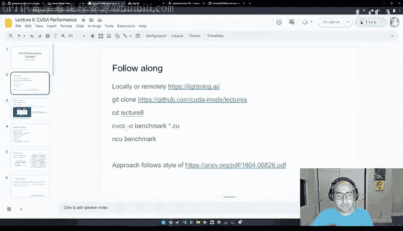

But obviously like not enough because otherwise maybe they're afraid of people stealing their ideas or what have you。

 regardless they're sort of like a lot of times you're like， well， how does this actually work？

This this is a really great， great paper。 and I'd highly recommend like scanning it。 They had one。

 for example， for the NviDdia GPU and I became familiar with some of these authors when they wrote a similar like a similar article on IPUs while I worked at Graphcor But this is really great because like it's they sort of come in like let's say we know that。

 for example， shared memory faster than globe memory like that's great。

 by how much and exactly right and how do you measure that and sort of remove some of the effects of like nondeterminism and a GPU and all that。

 And so this is like a very， very good read。😊。

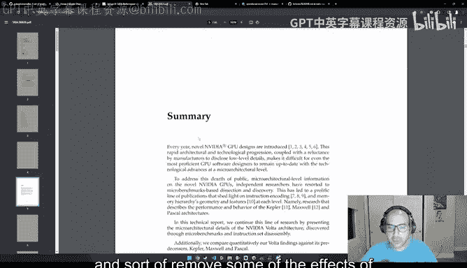

So yeah， the first thing I want to talk about is like obviously like one of the main themes for making Ka performance faster is not using DRAM and using SRAM instead。

 so SstrM is basically shared memory， it's like on the order of like kilobytes and DM is on the order of  tens of gigabytes like maybe like 40 like let's say 23。

 40， 80 or some of the most common common skus。And I don't want to go into like the physics discussion。

 I had a friend A who told me that like he thinks this term is overused in computer science for things that we think we can't change。

 but we can。 I tend to I tend to agree with this。 However。

 it's still sort of helpful to understand at least like these very basics。

 which is eram is more expensive。And but you're like， well。

 I don't care if it's more expensive just like plop on this SstrM and let me make like my workloads I go a lot faster。

 Well it turns out you also can't because like estrM takes up physically more space in DrRA you can implement you can implement like the network for it with like a single transistor and a capacitor whereas SstrM needs about six transistors so I would presume it's about like three to6x like more expensive and because it's like bigger and there's more transistors they emit more heat you can also and because they take up more space。

 like connections across the circuits will be further and so maybe things wont actually be as fast as you expect because you're really putting a lot of stuff on with a lot of heating great now you also need a lot more room on the GPU for cooling that means your degree needs to be even bigger and it's not gonna fit like in a data center and you know I'm not sort of an expert on like most the stuff I do have a background in EE。

From undergrad but I'm certainly not an expert someone who is an expert though is like Bill Dolly。

 he's the chief scientist at NVo and I just like highly recommend like pretty much any of his talks that you can find on YouTube will give you like a lot of information for like why GPUs are designed the way they are and I like really recommend them he's like a very clear explainer and he goes sort of like from foundational like low level stuff and up the stack so just like a very renaissance renaissance man type type of figure in the community。

So you know back to software right like we can't really。

 at least like I would assume for the most of us like we can't easily design like better like hardware because like GPUs are really like sort of a state of the R hardware but there's like at least like a few performance tricks that we can leverage and pretty much all of these tricks except for two which I italicized are already mentioned in the programming massively multi the PMPP book。

So the first one is coalescing global memory accesses， so we talked about this already。

 but you want to coalesce the global memory accesses on a GPU because the architecture is fundamentally one like it's a throughput oriented architecture great。

 what does that mean exactly what that means is that when you're reading like data from memory。

 you want to you want to ideal it's actually not that much slower to for example。

 like read 50 elements at a time versus like one element at a time and so and but this is only faster if like the memory is contiguous like otherwise like you're not really benefiting from this and your cache is getting hit your your cache isn't getting hit as much So we'll talk about global memory accesses。

The other theme is going to be maximizing occupancy so what maximizing occupancy is essentially you can think of this as just like what are like as you're writing a kernel。

 like a very common question that we've been seeing the good and Discord has been well great。

 like what should my block size be and should like what should my good size be。

 how many threads should I launch， like people had a lot of questions on those and we'll discuss those？

This is not going to be too profiling heavy for this next point。

 but understanding if your memory or compute bound is really important because it'll help inform which set of optimizations you should think about for your algorithms So we're this is we're going to discuss some of them we're going to spend a lot of time on this point。

 The other one is minimizing control divergence like the key idea here is that when you're scheduling threads on a GPU they're scheduled in warps which is a term that just means like 32 threads at a time and so you ideally want all of those 32 threads to be doing roughly the same amount of work and have that work finish at roughly the same or have that work finish at roughly the same amount of time。

 otherwise you're just going to have a few threads like just chilling and vibing and not doing anything and that's not great。

The other theme is going to be around tiling and reuse data。

 so we talked about this a lot within the context of matrix multiplication。

 so I'm not going to reiscus this if you want a really good explanation of this like check out like Jeremy's second lecture in the Kudo mode series。

 which does a really good job of explaining tiling。Then we have privatization， which is。

Kind of similar to a lot of the optimizations we talked about with the key idea being that we can store like we can basically have local copies of data to avoid hitting global memory more often and make things go faster。

A reallyally awesome and then thread coening is basically。

So so far like throughout this whole class actually when we've been thinking about like how much work should a single thread should a single thread be doing。

 we try to give a thread as little work as possible， but as we'll learn in a memory bound cases。

 this is not ideal and you can actually make your program run substantially faster by doing more work with a single thread so this is what they mean by coarening like you're coening over the memory essentially like it's just like you're taking a bigger chunk of it at a time and something else that's not covered in the book is rewriting your algorithm using better math and the reason I mentioned this is because this is like something that's hard for compilers to do like compilers can't just like change the semantics of your program。

And like write them in subtly different ways such that the numerics are the same。

 but it's like much faster like this is sort of still where a lot of the alpha is and by alpha I mean like if you look at a lot of like the sort of most famous like GPU kernel authors like in the community today so like think of people like them Demers or Tow like this is something they're quite exceptional is which is like they're good at math and they're good at systems and ideally like this is what I want for myself and for like a lot of other people in the community as well。

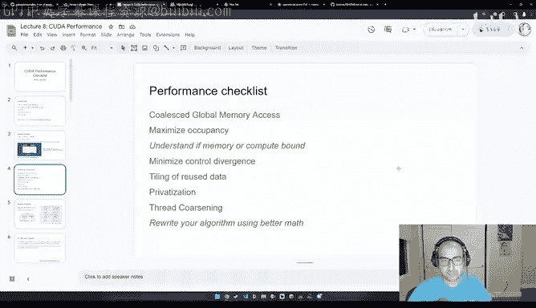

So so speaking of okay so before we talk about like the first thing we're going to talk about is coal global memory accesses and what's really important to learn is like the latency of like various memories so you can like pretty much like follow like let's say the NviIDdia like marketing material to figure those out but a much better way is to actually try to microbench market yourself So one paper I really enjoyed was like this one it was called demystifying the NviDdia and pure architecture through microbeching。

😊，and instruction level analysis and what's really fantastic about this paper is that they basically show you all of like this PTX code for things that would measure like the latency of an addition。

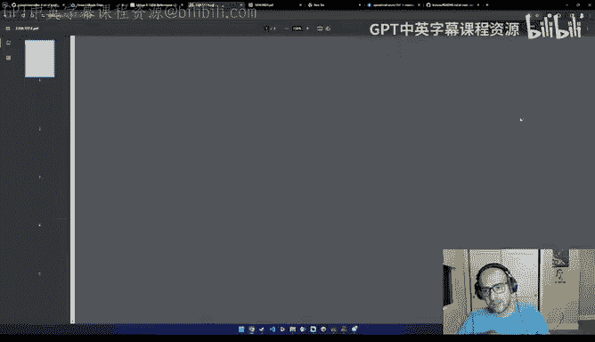

Or like the latency of shared memory or like the latency of like L2 cache。

 which as you can see looks a bit more complicated to set up。

But the TlDR of this and you know you can go read this paper on your own time the important TLDR is that is like the numbers right so the numbers is like you know we look at like let's say it's saying here like the global memory takes about like 290 cycle cycles and then the L2 cache takes about 200 and so yeah there is a big difference L2 but it's not like an order of magnitude difference whereas with the L1 cache is like when things start to substantially change like basically now we see like essentially like about a 10x increase like sorry 10 extra and speed and so sort of similar for shared memory and that's why for example and the discord group。

 the highest role is shared memory because like that's the fastest kind of memory that's like available to us the other thing to keep in mind is that like these speeds are not deterministic like a GPU is not a deterministic architecture from the perspective of predicting how long a certain workload will take and the reason why that's the case is that because in your code you do not have explicit access。

over the L1 and L2 cache， you have access over the global memory。

 which is where things get stored by default and over shared memory。

 so that's why these kinds of microbench products are very useful。嗯。So in general。

 the thing to keep in mind is like okay， well you know we might look at these speeds and you know one hypothesis is like well like GPUs are getting better so why wouldn't like global memory。

 for example， become 10 times faster like the next generation。

 Well this is extremely unlikely for like the sort of like very sort of important plastic argument in CS。

 which was really well explained in this article called the it's latency stupid So this article was recommended to me by Greg Sch Shanon who was like one of the original like founders of Pytorch。

And I really enjoyed this article because even though it talked a lot about internet bandwidth and again you can read this on your own time。

 a lot of the lessons apply to like deep learning code or K kernels for example he mentioned that throughput is easy in the sense that let's say you have a phone line where the latency is 100 milliseconds you can serve 80 times the amount of customers by having 80 phone lines in parallel but you can't make the latency。

 you can't have the latency by adding more phone lines like you need to do something fundamentally different and thats why like latency is generally hard and GPUs are no exception to this because we essentially hide latencies as opposed to reducing them and we do this by coalescing global memory access。

The other important topic was well， you know you might think， hey。

 like let's say you're sending a message over a phone。

But let's say you're willing to accept some loss in quality to make the signal reachster more quickly and so he discusses this with like having a packet size that goes from like 32 bit words to 16 bit words and this is kind of what you start to see things like well again。

 like quantization is one way to reduce latency because you're sending less data it's like less memory overall。

However， it does reduce the quality right， so it's like there's like no free lunch in some sense with latency and this latency is basically like a hard problem。

Right， so we're going to now discuss our first case study。

 so we're going go back to the lightning air studio where we're going to discuss like memorychoes and the three metrics that I want you to be paying attention to are the Dr throughput So basically how often is the DRA hits the global memory The total duration of the kernel because you know all these numbers don't mean anything of the kernels faster slower these are sort of the two ultimate that's the ultimate metric and the other thing is L1 cache throughput。

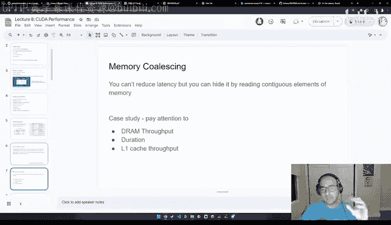

So here this was sleeping let me just turned it back on quickly and I'm going to switch to a T4 GPU。

I should have removed the auto sleep。 so I apologize， just give me a minute here。

So during the live chat， this was the time we were taking questions。

 but we can't quite do that like in this format， so anyway like I can start going over the code by the time we switch over to the GPU kernel。

So what this kernel is going to do is essentially we're going to be we're going get like basically a pointer to some like chunk of memory and we're going to copy that out to like another chunk of memory and so the sort of obvious way of doing this is that you know we take the like we take an index and then we put its value in out index and then we do this for like basically like all of the threads that we're working with and then index here like even though you know it's。

Like even though when we think about tensors， we think of them as being like these two dimensional or three dimensionsal structures or ndisional structures in memory。

 they are like a single ndimensional structure and the way you index to it is by basically taking like taking your block index for basically which block are you in times like basically how big is the block and then you add to it the specific thread so this is like like a very common trick like it's a sort of similar trick is used in heaps if you've done like any elite code program。

And okay， cool， we can switch now。Let me make sure it doesn't sleep anymore。All right。Yeah。

 let me open up the terminal and then we're gonna see D into lecture X。

 Yeah so then so this is kind of like the reasonable way of doing this copy and this is why we call it coalesced because everything that we're copying from or copying to like resides in like contiguous chunks of memory。

However， you know an equivalent way of doing this that would be you know， maybe not as smart。

 but you could sort of see this but like again， take here that the intent is to have toy kernels to showcase this effect is instead of doing like basically out index is equals to in index。

 we can instead multiply the index by 2 and modo over n and this would still work out to be like a similar operation like we're going to have like all the elements in that R and n B and out if we do an operation like this。

 but the problem is is that like we're sort of skipping an element， this is， for example。

 very common in like within the context of a pythrdge program。

 like this is called like strides like essentially you don't change。How your data is located。

 you just change how you read into it and you know if we run this now so I'm just gonna to again we said like so it's NVCC and then I'm going to create like this binary called benchmarkchmark and then I'm I'm going to give it the corin kernel。

So if I do this， and then I run benchmark。It shows me like the total execution time。

And you can already notice like，hu， like it's。Oh， sorry， No， this was Goless。 Sorry， I'm running the。

I'm running the wrong example， I apologize。And this doesn't do anything。 Let's see it。All right。

So there's also also like a visual profiler for these kernels。

 but the way to read this is that you come in here and we're going to see this individual kernel copy data non coalesced。

And we can see that the memory throughput is about 89% and the L1 cache throughput is 30%。

 which means our cache is only being hit like 30% of the time。And as a result。

 like you hear the duration is like 764 uconds， doesn't seem， but I mean。

 I don't know if that's great， let's sort of check what the goaz version looks like。

So with the coalesed version， we already noticed that the L1 cache throughput is about like 37%。

 so it's much higher， but we didn't max it out。But the DM throughput also reduced。

 So basically it used to be how much。 So it used to be 89。 It's about 90%。

 and we reduced it by about 8%。And if we look at the duration of the workload。

 this is like 5582 secondsd。And here it's about 764 uconds。

 so this is still like a substantial speedup。So yeah， I mean， this is like one common trick。

 like the thing is like this sort of pops up in programs like especially in more complicated programs by accident。

So just keep in mind that you want things to be coalesced。

 and presumably I would imagine this effect would be a lot worse if our inputs were much larger。

So yeah so just like to talk a bit briefly about the details about how we benchmark this so we you know we have these two input pointers and then we have like this like kuda malllock managed then we initialize a block size of 128 and then we can sort of compute the number of blocks to be this value and we launch two kernels like copy data noncoesist and copy data coalesc with the number of blocks and block size parameters in between them we need to call ka device synchronized because Kuda is inherently async so if we don't add these。

Basically， our timings become very strange， like incorrect。

 and then we essentially free them and then at the very end we free the memory so that we don't run into any memory leaks。

So yeah， so this is sort of the basics of the program。 So for people that were paying attention。

 you may have noticed this this morning， which was here。

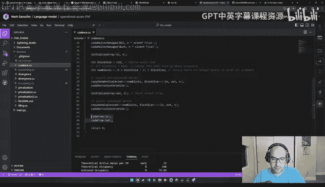

Where was it。So the kernel's theoretical occupancy is not impacted by any block limit。

 so the difference between the calculated theoretical 100% bandwidth versus the measured 77%。

Can't be the result of warp scheduling overheads or workload imbalances during kernel execution。

 load imbalances can occur between warps within a block as well as across blocks of the same kernel。

 And you can see the coa best practices guide on occupancy。 So great， you know。

 this is is a great time to segue into occupancy。 So this sort of randomly here。

 What I did was I changed the block size from 128 to 1024。

 And now we're going to look at like the new occupancy to see if we improved it。 So I'm again。

 I'm going to build this Coes kernel again。😊，And then I'm going to en it。And where was it。So okay。

 so we went from 77% to about like 86%， like making like a single change。

And that's kind of interesting and it feels like we should be able to get this to 100 is this not super obvious how to change these things like should I grid size this。

 should I like back at the envelope math this so don't worry that there are tools but and I'll discuss them in this lecture but let's just go back to some theory for a second and this will let us sort of do this in a more targeted way。

So for occupancy， there are sort of like two problems that are manifested because of poor occupancy。

So the first one is what's called tile quantization。

 which is the matrix dimensions that you're working with， for example。

 so we're looking at a situation with just like a matrix multiplication。

 but essentially if the matrix dimensions are not divisible by the thread block tile size。

Then you end up with something with an effect called tile quantization。

 and then a wave quantization is sort of similar， basically if the total number of tiles is not divisible by the number of streaming multiprocesses on a GPU。

 then you also end up with what's called wave quantization and again from NCU's perspective。

 both of these problems will manifest as sort of this morning。

 so this is how you know you have this problem。But another way of knowing you have this problem is like even if you're not writing Kuda。

 if you're just like writing if you're， let's say you're multiplying two matrices。

Ones of size m times k， and then the other one is of size k times n， so k is the inner dimension。

So what we're going to do is we're going to fix the size of M and N to be 1024。

 but we're going to vary K from 1008 to 1024。 And we're going to measure the performance speed up。

 So you'll notice it's quite wild。 But if you come in here， like， let's say in coubla 10。

If K is 1016， the programme takes about four times less time than if it was like 1012。

And this is kind of a substantial speed up and this is why like in a lot of Pythtorch code。

 you'll often see people， there's like a lot of cargo cult heuristics like hey。

 should your code be powers of two， Sha parameter should be powers of two。

 should they be powers of 8， 16，32， I've heard all sorts of things。

But you know here's what those values actually should be。

 So N has already told us like what these values should be。

 they're a function of the amount of bytes it takes to store certain d types。😊。

And also like a newer architectures like the tensor cores on a 100 have sort of their own characteristics。

 but let's say for an8， for example， on a100s， you ideally want your matrix multiplication like your matrix C is to be multiples of6 of 16 and on a100 even multiples of 128 and so you can sort of imagine that like well already small inputs don't seem to be very well favored that' so on。

 And the other thing is that like as we go to Fp16 here notice so now this like halves from 128 to 64 and as we go to Tf32。

 this goes to 32 So another having and then FP64 like another having basically like this is like a function if you were to take essentially I forget so basically there's like like a base numerator and you're divide it by the size of a D type and you can reproduceduce these numbers so this is why padding is so。

popular within the context of Pytharch programs like if you for example， go to thellma codeb。

 you'll notice that like most of the dimensions are like are factors of two。

 the vocabulary is like 32，000 so paddding tends to be like really really important in like Pythch land however。

 if you're in Killand you can change the kernel launch parameters to make the padding impact not as dramatic。

So let's sort of study this again， right， so remember the initial problem we had。

Was when we were looking over the psycholeste kernel that we had。

I pick those these block size and number of blocks like I pick the initial block size out of a hat。

 and then the number of blocks you can derive it。And， you know， is this good。

 I it better Should I be running more benchmarks， you know who knows？ However。

 there is a tool that helps a lot with this。 And this is the kuta occupancy calculator。 So again。

 this this is an identical kernel to the one before。

 I remove the non coalesced version because we're not interested in studying that anymore。

 Everything looks the same。 The main difference is this function。

 So there's this function saying kuta occupancy max potential block size。

 It takes as input like these two reference to the minimum grid size and the block size。

 It also takes a reference to the actual kernel like copy data coalesced。

 And what it's going to do is it's going to write the the optimal grid size and block size。😊。

Back in those pointers， and we can just like print them out and see and see how this works。Basically。

 the values that it is， so I'm going to run occupancy here。And then we're going to N occupancy。Oh。

 sorry， let's see you benchmark。All right。scroll up a bit。Where was it， actually。

 maybe let's just run benchmark first。Right， so if we run benchmark where it's going to print here like the the recommended block size and the minimum grid size。

 and what we'll notice is that the recommended block size is like 1024 and the minimum grid size is 40。

So this this is already pretty interesting。 So this sort of gives us like a good hint for how to tweak this。

 And this function is really helpful。😊，Because its outputs will be hardware dependent。

 So I'm not gonna do this live because this will just like take a minute。

 but if you click here and then for example， try like an A and G。

 which is what I did during the live demo， the values were very different。 So for example。

 the recommended block size was actually smaller， even though you'd expect it to be bigger because it's a bigger GPU or something。

 but the block size was 768 and the recommended grid size was 160。 So like four times the size。

 which is kind of wild that's like a pretty， pretty big grid。But again， like you know。

 like you can probably come up with better heuristics yourself or change your kernels such that you can increase the occupancy。

 but as a heuristic as in like what's a good heuristic to try first？

Without sort of spending too much time doing this， like I would just like highly recommend you use like this function。

 it used to be like an Excel spreadsheet。 So it like was much more tedious to use like something like this。

 but that's like no longer the case today。So yeah， it gave us like the the optimal， you know。

 like we， we already covered this。So okay， like， you know， we're gonna and this again。

 We already uned it。 So let's like take a look at， like， well， well， what else is wrong here。

 So we got this warning。It's saying， look， the memory is more heavily utilized than the compute。

Look at the memory workload analysis section to identify DRA bottlenecks。

 Check memory replay coalvalescing metrics to make sure you're efficiently utilizing the bytes transferred。

 Also consider whether it is possible to do more work per memory access by doing kernel fusions or whether there are values that you can recompute So like all of these things are telling us。

 hey， you should compute more things and use less memory。 So great。

 let's let's talk about the straight off like for a second。😊，So before before we discuss it。

 there's sort of like this very important picture you have you should have in your mind。

 which is called the roofline model So what the roofline model basically means is that we're gonna in the x axis take a metric called the operational intensity where we take the total number of operations so basically number of additions。

 multiplications comparisons and then we're going to divide it by the total number of memory accesses so basically like how many times are we reading like our input so basically what we' computing over the input divided by the input size and then also the output size because we need to write things back and then on the y axis we just like have the performance like as in like how fast are things going So the really key thing to know in this picture is that typically for smaller workload workloads your bottlenecked by this part like this's the first line like the line。

going up this way， which is basically a bound that's based on your memory bandwidth。

 So basically when you're in this part of the chart。

 your actual bottleneck is how quickly can you feed data to the GPU？

And then once you sort of get to the steady state， which is the line。

 your bottleneck changes and it becomes like， well， your GPU just can't like go faster， you send。

 it's foot utilized you're not you can't send it more data or more data more quickly。

 it just it won't matter。 So then here you would need to rewrite like you would need to write better algorithms to make that go faster。

So I want to give you some intuition for the operational intensity part because that's like the really important metric。

So we when we were doing this live we did it a bit like an exercise。

 but here I was like you know jump head straight to the answers So a lot of these ideas were borrowed from like this guide by NviIDdia which was the it's called the Tensor core performance ultimate guide so I really enjoyed this treatment it goes over stuff like hey。

 for example， know how do you know that using your Tensor core as well you know you have these operations that have ISH in their name and stuff like that but you know my favorite part was just like this picture and trying to read read deriveive like by myself。

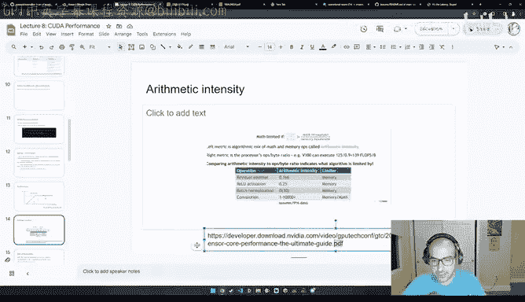

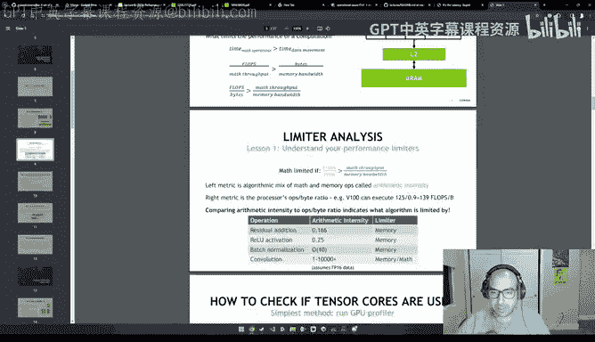

Like how do you actually get like these numbers？Okay。

 so we're going to do something like back at the envelope math。

 so we have an example of what's called like a pointwise function。

 which means it's a function that operates on every element of a vector independently so x is a vector and f of x is a function over vector that outputs another vector and this function is a relu so relu is a very common like activation function and the way relu works is that you look at every element and then if if that element is smaller than0 then you replace it by zero。

So conceptually how does this work right you were reading one element at a time。

 let's say the element like Xi and then we're doing a single comparison op like basically is it less than or greater and then maybe we're doing one right so this lets us sort of like so basically just counting the number of reads and writes and the number of operations lets us derive the arithmetic intensity。

So first off， let's assume that x is stored than a float 32。

And float 32 basically takes up like  four bytes of memory。

 and the way you get this is you take 32 and you divide it by8。

 like basically like a number of bits in a byte。So we said there's like one operation。

But the number of bytes that you're using。Is going to be two times four because there's one read。

 one write。And so that's a total of like8 bytes。 So the arithmetic intensity in this case is one over 8。

Right。However， let's take the case where let's assume x， every element and x is greater than0。

 So in this case， we're never doing a single right。

Which means that we have one comparison up over one reads。That reads。Is4 bys。

 And so this is incorrect here。 So it's going to be one over41 over4。 So for example。

 here you can see I was like confused。 I well， you know， why are they saying this is 0。25。

 I think this， you know， might be assuming some sort of like best case scenario。

 So So I thought it was like interesting to read the drive of this result。Here， school。

That doesn matter。So okay， so now let's do the same exercise， but with F 16。

 so it's the same thing we have element wise function rather that we're applying。

And I'm saying I delete this because it's not important。

And what we're going to do is like we're still doing like a single comparison operation。

 like we're comparing a flow 16 to zero at every element in the vector。But now we。Wait。

 why do I have a two here， So I have， Oh yeah， because then okay， I have one read and one write。

So each of them are two bytes， that's a total of four bytes。

So their arithmetic intensity is like one over4。 And so you realize now， okay。

 well  like it seems like what quantization does is it reduces it basically improves the arithmetic intensity of a workload。

 Like basically you go from like one over 8 to one over 4。

 And this is great because we like this kind of operation is you know。

 as you guess like very memory bandwidth bound。 like because like pretty much like any any arithmetic intensity that's less than one will be very memory bandwidth bound。

 So that's why like things like quantization are really great。

 And you can sort of take this a step further。 Like， for example， you're doing this in flow8。

 you're doing it this in in4 or in1 or in two， like all of these are like just the reason why we do this is to improve the arithmetic intensity of those workloads and just like。

 you know fully utilize the GPU burs that we have。😊，So this is a bit of a harder example。

 but it's an important one which is like matrix multiplication so I'll go over this quickly so again let's assume that we're multiplying two mat Cs。

 the first one a is of dimensions n times n and the second one B is n times K so ends the inner dimension and then we're putting the result in a third matrix called C which is the result of a times B。

😊，So for the total number of flops， for each element in C。

 you need to take the dot product between a row of A and a column of B。

And so for every element of those， you're doing an addition and a multiplication。

 and so you can work out the flops to be m times k times 2 n just because you have both the multiplication and addition。

So that's what our numerator is。 But then if you look at the denominator。

 it's basically we need to load each of those matrices in memory So the size of the first matrix is mn。

 the size of the second matrix B isnk and the size of the third matrix because we need to load it to story valid variables in it is so it's m and so the total thing works out to be mn plusnk plus m and so their athmetic intensity turns out to be 2 m and K divided by mn plus N plus m。

 So what's interesting about this formula is that like pretty much in all situations。

 matrix multiplications will be compute bound， but for very。

 very tiny matrices like imagine like matrixrices that are like size like1 or two then their arithmetic then this becomes more like this becomes more memory bound bound So sort of similarly you know you can imagine situations like I maybe I can give you homework so try to do like matrix vector multiplication。

 vector matrix multiplication and try。Pro to see the difference yourself and get an intuition for like when do things like become memory bandwidth with bond versus compute bond？

So the reason this is important by the way， and why this might seem too theoretical。

 is a very practical lesson from this， which is for bandwidth bound kernels。

 typically the optimizations that really matter are fusions as in you do more work per kernel so fusion we tend to think of it as you're fusing two steps but it could be something like thread cosing that's like another way of improving bandwidth bound kernels quantization we discuss is like another way because you're sending less data then things become less memory bandwidth bound and compilation which generally helps apply those two things so like compilers are very good at like reducing overhead with cutgraphs or fusions so that's why like compilers like to compiler。

 it's like fantastic at just doing this kind of stuff for you。For computebound kernels， though。

 things are a bit trickier because you essentially need to write a better algorithm like you need to go write a better matrix multiplication algorithm。

 that's generally really hard because you can think of matrix multiplication as being like the single most optimized like program in like human history like just by far like like the amount of intellectual capital society。

 put it into making not most fast as wild And so it's just like very tricky but at least like for an algorithm that's not as typical that's like another thing to think about well know if your algorithm is quite chunky then you know why are you spending your time quantizing stuff like you're not going to get like magic speedups or doing fusions like you know focus on the compute bound stuff。

All right， so another optimization that I don't want to talk about today is tiling the reason why tiling is important is that when you're doing an operation like matrix multiplication。

 there's like certain elements that are going to be reused multiple times and so what you ideally want to do is you want to store those elements that are going to be used multiple times in faster memory like shared memory and this is used a lot in both like sort of vanilla ka-based tilebased matrix multiplication and it's an important trick and things like flash attention。

But because it's already been covered extensively like basically Jeremy already covered this extensively in a one hour lecture already and he did a really great job at it。

 I would just go recommend you like watch that lecture and I'll just basically sort of remind you that the reason why we tile things is to reduce like global memory traffic。

😊，I also maybe want to mention like implementing tiling algorithms， like they seem tricky。

 but conceptually， it's just like four loops over like the outer matrix。

 and then also the inner tile dimension。 So it just ends up being like like a large nesting of four loops。

 So once you think of it that way， it's， it's really。Not too bad to reason about。Alright。

 so this is one that like drove basically， yeah。 So， okay， not， not。

 So this is one called like minimizing control divergence。 So remember with so let。

 let's take an example of here at divergence do co。😊。

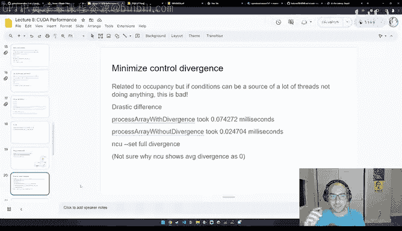

So in this example， basically what I wanted to do was I'm reading data like a data array。

 and then if the element is even， I want to multiply it by two。And then if it's odds。

Then I just want to add one to it。So basically the what like so at any point in time now。

 you might have like certain threads that are executing this and certain threads that are executing this。

And this is a problem in general for GPU code because if these two loops take like different amount of time because like presumably it's something like a matrix multiplication。

Like a multiplication by  two is presumably slower than an addition by one。

 What ends up happening is like， let's say you have a few stragggr threads like stuck here。

 Then the threads that are done here end up having to wait。

 And that's because the way kuta schedules kernels is in a warpwise fashion as in it's done in a collection of 32 threads。

 And it's not like if a thread is done。 it can move on to other work。

 It needs to wait for its other like slowpo neighbors to also be done。

 And this is why like thread divergence can be bad。

 And you can imagine this effect that's further amplified。 Like now。

 let's say you have certain if conditions that are very rare。 Well， in that case。

 what happens that your performance can become like very unpredictable on certain inputs。 Or now。

 let's say you have like three nested like like let's say you have like three levels of nesting of if condition。

 Then at any point in time， like you sort of exponentially increased the odds of a thread divergence。

So this is not like just that， oh， you change like just you make your program linear is slower。

 you could be making your programs like multiplicatively slower by having too much like thread divergence because you're not really。

 you know， really taking advantage of like parallelism on GPUs。

So what I did here instead was I rewrote this like if condition to instead be like this like clever algebra。

 And so these， these two things do the exact same thing。 Like basically one is I have the even flag。

And basically， it checks if a value is even。 And then if it is even， then let's so if it's even。

 then this value will be one。And then if I multiply it by data index of two。

 basically what I'm saying is great， like multiply you know。

 may basically multiply this value by two。 And if this is one。

 then this will be0 So this cancels out。 But in the case where this is odd then this cancels out to be zero。

 and this part will just evaluate it to this。 So I just I got clever with like rewriting this。

 so if we try to run this。Am let's run this。Oh down go to divergence。Okay， I did not。

I did not do anything there。 I means do it again。All right。

So the interesting thing about this is that like as I was like going through these metrics。

I actually couldn't find the impact of divergence very easily using the default metrics。

 And so I actually had to write something different， which was set full divergence。

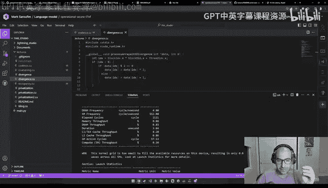

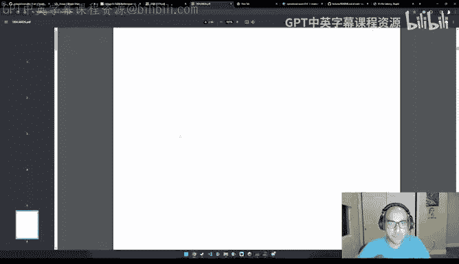

So it's like it， like a different flag。 always， let me。So four。Menchmark。

And so now what you'll see here， for example， where was it？so this gets quite longer。

 That's why I don't use this by default。Allright， so this is the process array with divergence。

So what divergence we come in here and it's saying the streaming multiprosor is busy as 17% of the time。

And then we have some memory workload analysis， like this this is helpful。

 And then this shows us here the warp state statistics。And yeah。

 so what we wanted is like these instructional statistics Basically where， no， wait， where was it。

Yeah， sorry， it was here。So basically， the branch instructions here， we have like 98。

000 like branch instructions。And then here the branch efficiency and the average average divergent branches are both zero。

 but this was like you know Vikram sort of explained this at length。

 like this is due to many reasons like one is we probably needed like a bigger workload to really measure this and it's likely that NVCC does like some automatic compilation to like remove like a thread divergence。

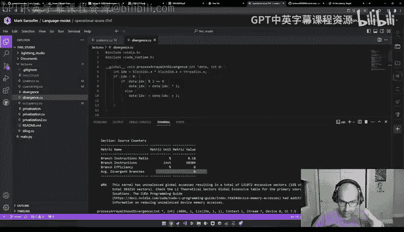

And so it's quite hard to come up like with an example that would be completely isolated and that's why you have teams like Citadel that publish these like 100 page papers to microcro benchmarkch GPUs because it's quite hard and it's very。

 very， very valuable， but still like I mean here if you come in here there's like 98。

000 branch instructions。

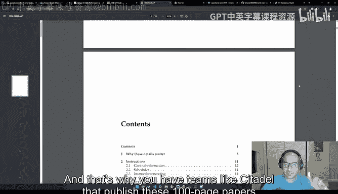

Whereas if we come here。There's like 65，000 branch instructions， so we still like dramatically。

 we didn't completely eliminate it， but we sort of severely like limit the total amount。嗯。So。So yeah。

 basically the interesting oh yeah， I did actually measure at the time and I remembered。

 so the amount of time was like drastic actually， so basically we went from 0。74 to 0。24。

So about like almost like a3 x like speed up of sorts， which is like pretty， pretty wild。 And again。

 like this is kind of one of those， this is really one of the most important optimizations you can think about。

 And a lot of times like when you're writing GPU codes， you're trying to as much as possible。

 avoid having too many for loops because for loops introduce the divergence with the last condition。

 which is。You're bigger like I is bigger than N for example。

 but also we avoid writing lots of if conditions the for loop problem isn't that severe because you will only have one thread and a warp that would ever diverge。

So it's fine， but in cases with like large nested if conditions。

 pretty much like everything could be diverging and that's just really， really bad。Allright。

 so so far as next optimization I want to talk about is like thread coening。

 so so far all of the threads we've been working with try to do as little work as possible as in like let's say when we're doing the copy thing we have like。

 you know， out of I is equal to N of I。😊，But if we're memory bandwidth bound。

 it feels like we could maybe potentially do more work。

And so I'm going to give you an example and this example shocked everyone in the lecture because I took a vector edition and just by cosing it with a factor of two。

 that made the kernel about like 30 times faster when we were doing the live demo。

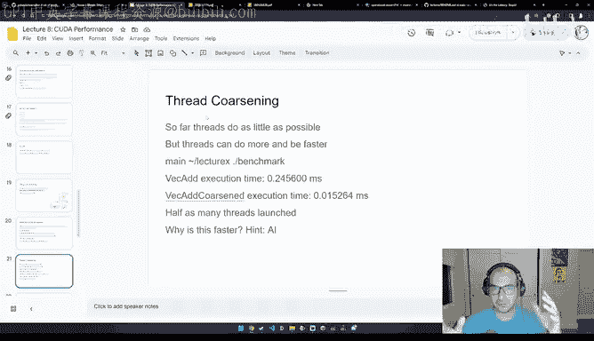

So a lot of people lost it。But it's again， useful to look at again what's going on here。

 so it was your coarinning。So with coarining the difference is like like let's say here I'm doing a vector edition kernel。

 so basically we have two input vectors A and A and B。

 we're going to like look at each of like we're going to pull out an index from each and then we're going to add it to like a matrix C which is our output。

😊，So instead of doing it over a single element I， what we're going to do is every thread is now going to handle two elements at a time like I and I plus1。

 so we call this a coening factor of two， and we did have a zippy in our discord group。

 where is he or a zippy。Yeah， so Zpy actually ran some more benchmarks doing this with like larger coinening factors of four and8 and I don't think he saw much of a difference。

 but you know definitely chat with them like again like this was I didn't read this like thoroughly just because I really wanted to get the recording out but just like said something it's very interesting to look at and then everything else in the the code like looks like very standard so if we try to。

So now if we like again， it's significantly faster。So we know that's great。 But let's try to。

Like this reproduce these results。哦。That's mark。Right here。

 So you see here there's like about like a， so we're going from 23 to 0。2。 right。

 So here it's like almost like a 10 x reduction。I don't know why it's isn't been changing so much。

 but still like I mean， this has so far been the biggest factor we've seen so far because when we were just doing even coals language is very important。

 gave us like maybe 20 or 30% so if we now run like NCU over the benchmark，😊。

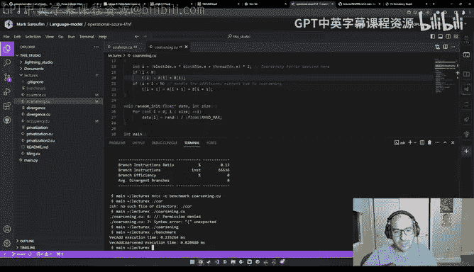

What do we see here， So for coing。Where was it。I think ultimately we would expect less DM throughput as my assumption。

 as sort of my guess。 So let's see like the DM throughput is 0。8。For the regular vector edition。

And then。For the。H。Por sentence is 1%。哦。有。Okay， I think this is a bug。 Okay。

 this is interesting regardless。 so let's sort of discuss it。

So we can see here that the memory throughput went from like about 80% to 1%。

And that feels like it doesn't make sense， right， Like basically， we would imagine to see maybe， hey。

 like maybe the memory throughput went down by like a bit。

 like maybe like by a factor of half or something would be something a bit more reasonable。

 But what's what' likely happened is maybe our inputs are small enough。

Where the whole thing just fits in shared memory。And so， as a result。

When we're benchmarking the second kernel， we're benchmarking something that's already cash。

 So I would presume here I was missing like some freeze or destroys or something like that。But still。

 like regardless， I think this is sort of interesting to think about and probably like worth like re benchmarkching on your end。

 because at least from our experiments like coarsing was like the most dramatic perf improvement that we saw。

Alright， so another example of like not using global memory as much is this idea called privatization where you apply like partial updates to a private copy of data before writing it back to global memory So a typical example of this is the sliding window algorithm and what we ideally now want to see basically you're like you basically have like a window here in this case like this like 3。

4，5 or like within the sliding window and you're moving like this like sliding window over time。

 this is for example really important in the case when let's say we don't want to run a full scale dot product attention over like the entire like query and key values but we want to do it over like a sliding window and so this is like quite nice because like then you basically have like a more like local operation and in practice the way this is implemented is instead of having like a mask I think it's well explained in the。

😊。

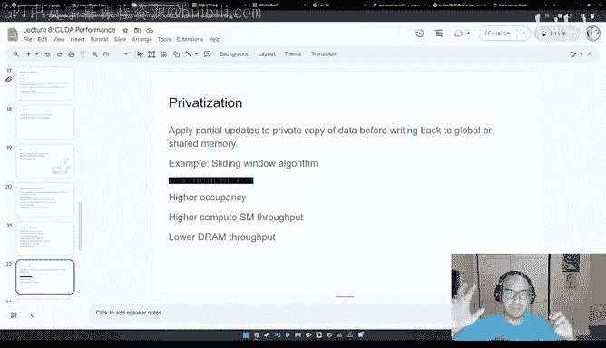

Mstr paperper， let me see。

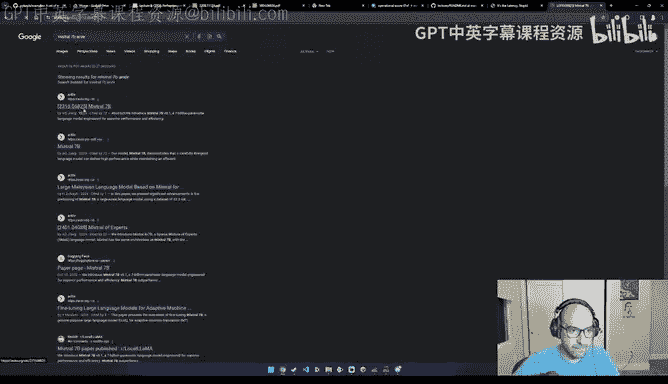

There。Is this well explained， let's see。

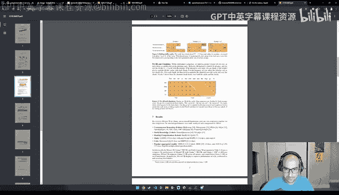

Here。So typically when you're doing something like what's it called like like autoaggressive decoding。

 you typically have a mask which is like the can attend to itself， a cat can attend to cat and the。

 but it can't attend to set sat， like it can't sort of like look at the future to predict what the output would be。

So what sliding window attention does is instead of like doing like and then the problem with this is that like you still mostly end up like with an n squared matrix。

 but if you have a sliding window that's quite small。

 then you can sort of dramatically reduce like the complexity of the QKV operations。

So it's like that's become like already a very popular trick just because like， you know。

 Miss Myal is so popular these days。Alright， so back to privatization， if we go here。Privatization。

 What's privatization to。Okay， so this I'm going to show you this quickly。

 just because it's sort of like an easy example of privatization。

 but this didn't actually make my code faster。 So you know， an example of let's say。

 a vector like a vector edition without privatization would be you have a index and B index and you take the result and you put it into index。

😊，Wait a minute。Okay， yeah， I see this wasn't faster because。Running the， oh， I see。

 I see what I did。 So what I did here was like， I loaded a private and be private， like basically。

 instead of like reading a index and B index， I just like put them from global memory。 I put them。

 I read them from global memory， but then I put them in a private， like variable。😊。

So then it's like more likely to be cached。 And then I do this like operation。

 But like this had like no performance impact。 So it just。

 it's sort of useful to just think about like privatization just means like， you know。

 don't do operations directly over global memory。But a more useful example is like this like sliding window algorithm。

So for example here in this case， like you know we have like the sum and then we're doing like plus equals input over over like an access index。

 whereas here what we're doing is we're using like shared memory with this like shared like done like done there。

 I forget what these are called in C++。And then we then when we're doing like this accumulation。

 this like some is working over the shared memory and it's like not working over the global memory。

 so we basically take a block。Put it in shared memory or put it in some private variable。

 And then there's operation and those private variables。 And conceptually。

 this is like very similar to tiling。 It's like， I， I think tiling is an example of。Privatization。

 but tiling is sort of useful enough and important enough to warrant its own own discussion。

All right， so the sort of last thing I want to talk about is like a trick that's not really mentioned in the book as far as I can tell。

 which is sort of relates to flash attention， which is basically like sometimes if you can rewrite your algorithms and you're sort of decently good at math。

 you can actually make your code a lot more performant and let me sort of explain what this means。

So I think Thomas has signed up to give a talk on flash attention in maybe two or three weeks I forget。

 but if you remember like the key ideas in flash attention you might have seen this figure andllt a lot of people already understand this figure which is one you have a hierarchy of memory。

 certain memories are much faster like SRM is way faster than D and so a natural heuristic is well。

 let's say you have a QV matrices that you're multiplying。You take a tile from each。

 you put them in shared memory， you compute everything in shared memory。

 and then you write back the output to global memory。So this is like conceptually how。

 like let's say a flash attention， if sorry， if scaled thatt product attention was Q times k times V。

 this would work just fine。The problem， though is that we have a nonlinearity in between。

 So we have this like softmax where we're taking the softmax of QK and then multiplying it by V。

 And this doesn't quite work because when we can't do operations that are purely tilebased because softmax has a normalization factor like you're basically taking。

 let's say the exponential of something and you're dividing it by a sum of exponentials。

 which means you need to read all of the previous inputs。

 which means that you can't really do things like in this likeilewise way。

 unless you're willing to do it twice， and this is like not great。

 it would make the code dramatically slower。 And so there is like like a diagram not in the flash attention one paper。

 which is linked here， but in the flash attention to paper。

 I think they did a better job of explaining like this idea of what it means to have like a wrong normalizing factor that you correct over time。

 So again， this is not a lecture about flash attention because that deserves its own hour。

 but I want to give you the key idea for。You can understand like this like math trick。

And so this trick really comes from this paper， like the online normalizer calculation for Somax。

 online normalizer。

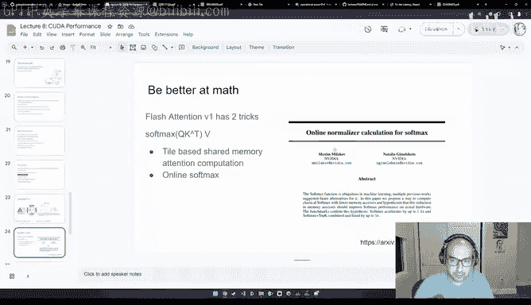

It's a fantastic paper， I don't know why I only asked27 citations， it's such a well explained paper。

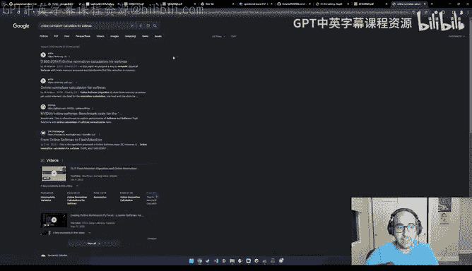

And so it goes over like basically two key things like one。

 how is like softms like typically computed and then two。

 how to make it like basically how to make it fast on GPUs。

 so I'm using to discuss like the first part， which is like how to rerite how to rewrite the math part。

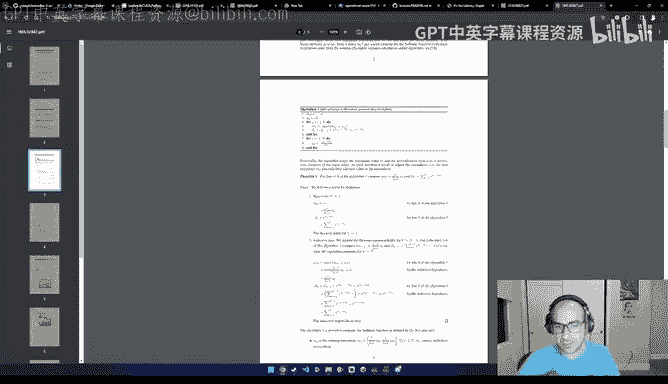

So， yeah。So let's look at the like sort of traditional formulation of softmax。

 So when we we when we're doing something like a softmax。

 we're doing it because we want to normalize outputs and get something that like resembles a probability because like all the Y eyes will sum up to one。

😊，And the way this is typically done is that you know you basically look at like it's again。

 it's like a redlu， it's like a pointwise operation， you go over every element in a vector。

 you exponentiate it so you take e of x of I and then you have to also divide a byormalization factor which is the sum of all of the exponentials so the way the algorithm works is explained here like basically one we can do a first past over the whole data。

😊，To get the normalization factor that we can put in the denominator and then we do a second pass where every time we read an element。

 we exponentiateiate it and then we divide it by the normalization factor。

And so we're actually reading the data twice。Because we're doing a once visualization factor and another time for the expiation。

And then we're also storing like a single output。So the problem with this algorithm， though。

 is that like when we're exponentiating values， especially if we're doing this in and lower precision arithmetic。

 is that if you exponentiateiate values， what tends to happen is they become really big really quickly。

Oh， let me just close this for now， out of sleep。Yeah。

 so what tends to happen is that these values really overflow。

 So like one sort of like naive way of solving this is like， well hey。

 you know why don't we just do the softmax operation and like float 64。

 So this is like less likely to happen But this is sort of like not great and you know flow 64 can still overflow Also the speed of flow 64 is like dramatically slower on like newer GPUus like they really want you to use like Bf 16 or flow8 or in88 or n4 like they just really want you to use like those data types。

 So what's like a way of making this operation like safe to overflowing。😊。

So this is the way most deep learning frameworks like Pythor orcars or whatever will all implement softftNax。

 and it's the exact same thing， but the way they do it is that when you're expentiating a value。

 you also sub from it， the max from the vector。And so like imagine in the case like yeah。

 so this sort of like works out to be like numerically the same algorithm。

 but this makes things worse because we still have those two reads like once to exponentiate once to get the normalization factor。

 And now we're doing a third read， which is like line2 and 3 here to get the maximum value。

 So now like an algorithm that was already memory bandwidth bound is even more memory bandwidth bound。

 So what do we do here。😊，So the key trick here is basically this is an algorithm called the online Somax and what we're going to do is we're going to have a normalization factor like let's call it like a fake normalization factor that we like basically we just basically look at what is the normalization factor so far。

 So let's say we're at position 2 in the vector take the normalization factor only over the first two elements。

And what we do is when we're applying the and and what we do when we're applying this the。

When're applying the normalization factor， we pretty much do it progressively over like the fake。

 we do it over the， yeah， let me see how to better explain this。Okay。So。

We have a normalization factor， and this is sort of like our best guess for what the normalization factor is considering what we believe is the current like maximum value。

 So this is what line4 is。However， let's say now the max did not change。

 so if the max did not change， then Dj is equal to dj minus1 and because the max didn't change mj minus1 minus Mj is e to the0。

 e to the0 is1。So now you end up with DJ is equal to DJ plus e of xj minus Mj。

Which is identical to what the regular safe soft max look like。 So basically。

 if the max did not change， we're just doing safe soft max。 However， if the max changed。

Then we basically correct the old normalization factor by essentially multiplying it by the proper maximum。

And the way we can do this is， again， with another interesting identity from the exponential function。

 which is if you have E of M minus n， this is equal to e of M times E of minus N。

 So what we essentially do when we're doing this operation is we're canceling out to the fake max。

 And we're adding the correct max。 And so this is how， for example。

 you can do a localwise correction that would lead to the globally correct result。

 And this is like a key intuition for how this part of like the softm like function works here。

 So again， like the rescale to the correct denominator So like this is。

 this basically reading this helped me understand flash attention。 So I'd highly recommend you。

 This is like a paper that's。😊，Worth spending an afternoon with。And so now because we're doing this。

 we got rid of an extra memory access。 So basically， now we just have like two reads in one store。

And so the performance of this algorithm ends up being equivalent to the regular softm。

 but just doesn't have an overflow problem。

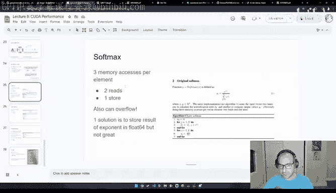

So yeah， I know this was a lot， but this is kind of like a very foundational lecture because like I said。

 all the other chapters in the PMPP book will discuss like specific case studies or algorithms I would highly recommend you check out like table 6。

1 in the book which one will explain all of these optimizations and it'll also explain the benefits to compute or to memory for each and what you can do is you can essentially have some intuition for an algorithm yourself run it through NCU and try to validate for yourself like whether this intuition is correct or if your example is too simple or if the compiler is being too clever or if there's actually a part of the GPU architecture that's not really well explained in the book So these are sort of really really critical optimization to understand know it's like print it like paste it on the wall sort of thing and the two things like like you know I wanted to add was it is really important to understand whether your workflow is like compute or memory bound because then。

Also influences some of the other kinds of optimizations you might make at the application layer when you're using。

 let's say， something like Pythtorch like if you're overhead bound， you know use sca graphs。

 if your memory bandwidth bound， use fusions， if you're really memory bandwidth bound。

 you know quantize to like in4 and if you're if you're a compute bound then you know hey I need to like write a better algorithm so compute bound workflows are I think a good hint for when you might need to write something like Trident or kuda as opposed to st in Pytorch。

And I think this is like really important overall， because like when I think of kuda mode。

Like what good demo mode really means for me， it's like a mastery of like both math and computers that'll let you write software and like basically codesign software with your hardware in mind。

 This has been my opinion of like well all the best engineers in this space have been doing。

 this is why I think we all collectively admire people like three or Tim in our group so much。

 So yeah， thank you so much like for listening folks， if you enjoyed these lectures。

 there's a lot more coming soon。 We do like our lectures weekly。

 The one that's coming up next week is gonna be on reductions。

 So if you enjoyed this like bits and pieces on like Somax and Reello。

 I'm pretty confident you'll enjoyed the lecture that's coming next。 So thank you so much， everyone。

 I really appreciate it。😊。