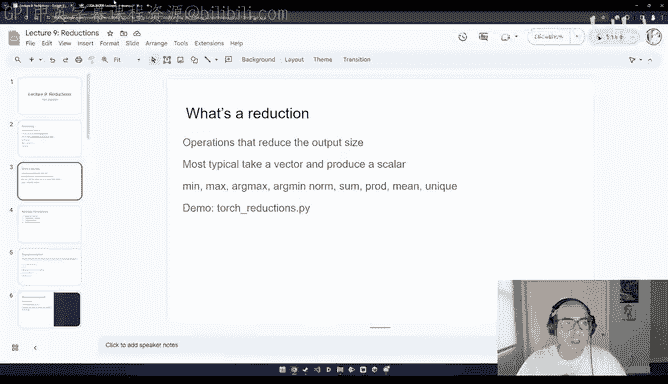
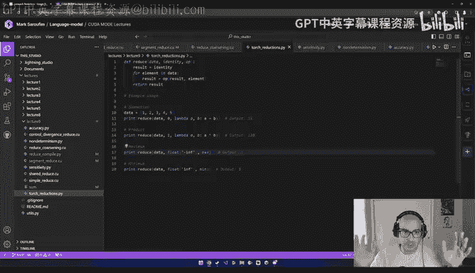
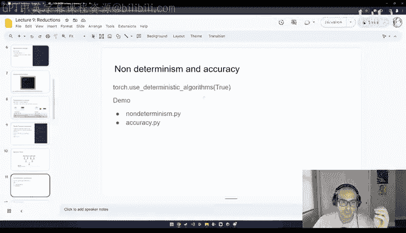
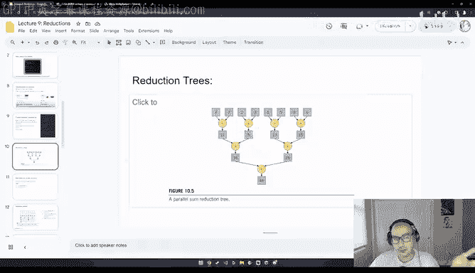
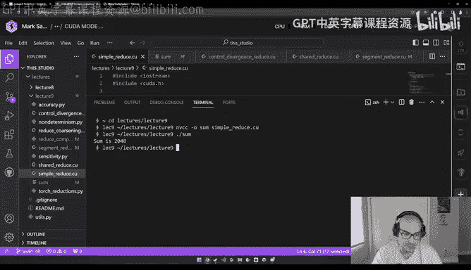
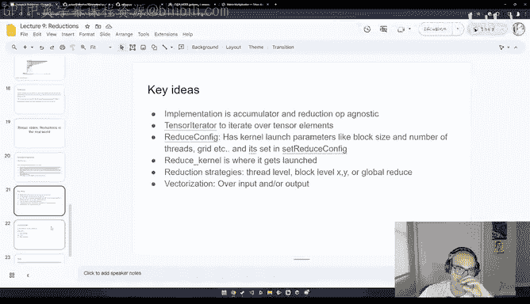
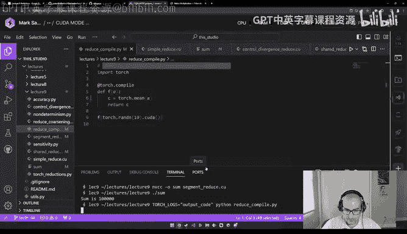
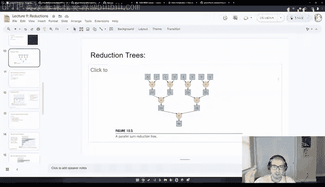

# GPU MODE《CUDA、GPU编程1-53课｜GPU MODE》中英字幕（deepseek-v3.2 - P9：-20240310-Lecture 9 Reductions.zh_en - GPT中英字幕课程资源 - BV1QZ421N7pT

Hello everyone， this is the second recording of the lecture on reductions in the Kamo Disccod group。

So really at this point， basically if you were to sort of carefully study the content from lecture 1 to lecture 8。

 you should be fully ready to start like one authoring Kuta or Trident kernels。

 integrating them into your Pythtor programs and then like profiling them and shipping them so people can actually use them。

So and the book sort of follows a similar structure in that like pretty much anything in the PMmpppP book that's after chapter 6 is effectively like a case study so it's basically going to be something like here's like a famous algorithm here is an naive implementation and you know here' is how to make it faster iteratively and this chapter is no exception so it covers like reductions and it sort of like fits really nicely into some of the ideas we talked about in lecture 8 which was the performance checklist so I'd highly recommend you check that out as well so yeah I mean if you want to follow along where the content is mostly following chapterpt 10 from the PMmpPP book there's a couple of kernels that I wrote that are all already on Github and you can just like clone this repo locally and CD into the lecture 9 and repo and it like compile those kernels and then profile them with NCU the thing is like NCU tends to not work really well on most cloud providers so either you can run these experiments locally on your own on your own like on your own。

GPU or you can still use lightning AI， which is what I'll be using for these experiments。

So at a high level， a reduction is essentially a mathematical operation that reduces the size of the input。

So this sounds a bit abstract， but just concretely in a lot of machine learning code。

 this usually means that like you basically have like a vector and you want a function that produces a scalar and so there's a couple of functions that do exactly this there's like the min operation。

The Max operation， Arcm。The argument， the norm， the sum， the product， the mean。

 the number of unique elements， there's like all sorts of like reductions that you'll find in the Tars library。

So specifically here， like let's go over a few examples。 So for example。

 one one example of a reduction is we're basically going to sum all the elements in a list and basically the function that we're applying iteratively is a plus B。

And we also have like an accumulator， like basically， this is the very first value。

 assuming the list is empty。So for like a sum this is usually zero so basically first start with a sum of0 and then for every element that you see you like add it。

 similarly for the product， it's also additive， like the first element is basically one if the list is empty and then you multiply every other element that's in this list and similarly again you have a maximum they all work the same way so much so that like when you're formulating what a reduction is。

You can abstract things away and write it in the following way。

 like basically a reduction as a function and it has like some sort of identity element and this identity could either be zero it could either be zero。

 one， float in， float minus n。And then you iterate over the elements in this data。

 and then you iteratively apply like this op here and you like basically update result accordingly。

So notice here how it was like basically the optics and the previous result and produces like a new result。

 so this is where the iterative thing happens。So the reason I mention this is because like this is going to be interesting once we start discussing how these kernels are implemented in a framework like PyTtorch。

 for example， so in PyTtorch there isn't like a min kernel or a max kernel。

 there's like a general reduction kernel and so we'll be going over how that works at the very end。

And like reductions， even though I went through min and max and you know you might think， hey。

 these are maybe like convoluted examples or like to examples。

 but reductions are pretty much everywhere in machine learning code。

 so like in the example of like convolutional networks。

 they show up in mean and max pooling because a mean or a max operation is a reduction over a tile instead of a vector。

😊，They show up in classification， like basically when you're running a classification。

 you're essentially taking like an arc maxax over a couple of probabilities。

It shows up in loss calculations like a loss is effectively a scalar that you compute as the difference between like a target and a prediction。

 So again it's a scalar and the softm itself is a reduction because softm like basically takes a vector and produces another vector but the normalization is a reduction because you're going to be going through basically like all of the like all of the elements in a vector and then you're basically taking the sum of E to the power of that element and you're summing all of those up and and dividing So again。

 show shows up pretty much like everywhere and because they show up everywhere and they're so ubiquitous like understanding like what makes them slow and the algorithms that make them pass is just really。

 really important。So already mentioned like you know I sort of went through examples of how you can implement your own reductions like in Python。

 but practically speaking all of these functions are already in like the Pythtorch like basically in the Pythtors library and what you can do is you can just like call them you can just like call them directly and this under the hood as long as you're the underlying tensors are like let's say on a Kuda device will call the appropriate kuda kernels or like generate them actually。

So yeah， again， this is all just like you know spoilers for later。

 so let's just know start talking about what makes like basically how to compute reductions。

So this is an example， this is like askIR of like basically a serial reduction So basically the algorithm that we've been describing so far。

 So here， for example， we have a vector of 5281 and we want to figure out the max of this vector and the way we would do it is effectively we for loop over this vector and we basically start with a maximum of like negative infinity and then every time we see a new element we compare the old max with this new element and if the max changes we increment and so you can see here in iteration1 for example the max is5 and then once we see two the max is still5 and then at8 hey。

 there's a new max it's a and then we see1 well8 is still the max and you would basically just like output like the last element here So this is like typically an example a serial reduction however this is not very interesting like for us because if we're running a coa program like ideally we want things to be highly paralyzed So let's just sort of discuss the strategy to make this go faster。

😊，Yeah， so we already went through this like general formulation of reductions so we can skip those yeah。

So if you can remember， like basically a lot of the kernels that we've been authoring so far。

 at least like the toy kernels that I personally showed were examples of what are called like transformation kernels。

 so for example， let's say you're copying an input an input into like from an input array to an output array like CI is equal AI。

 you would basically have as a strategy a single thread per data element。

And then use that thread to copy like to copy one， basically one like like one chunk of data at a time。

Basically， sorry， like one thread per output point， I guess they're calling here。However。

 in the case of a reduction， this is a bit more nuanced because in the case of a reduction。

 you only have like a single output element， let's say with a lot of these kernels we talked about。

 So how do we really assign these threads right， like basically we don't want like one thread to be doing。

The whole reduction because I was not going to benefit from parallelism。

 so what are like some better strategies that we can use？So the sort of most important。

 basically the foundation for the rest of this lecture is understanding like this slide。

 so this is basically what's called the parallel reduction。Algorithm。

And the way this works is that we're going to have a vector again like remember E55，2 a1 bh。

 and what we're going to do is for every pair of elements。

 we're going to assign an independent thread right and then what this thread needs to do is it needs to just compare which of two elements is larger。

And then whatever is larger write that to like maybe like another like another array。 So for example。

 here， the five and2 will be handled by a single thread。5 is bigger than two。

 therefore5 will be put in the first location and then we have 8 and one。 well8 is bigger than one。

 so we have eight。 So basically what happens here is that at every point and every reduction step we're going to be reducing the size of the input vector by half like we're gonna to have at each time So we will basically get you know one final like we'll get the final result after like log n number of steps。

And yeah， basically this is really the foundation， so I me make sure this like makes sense。

So another way to visualize what happened is basically what they call in the book like the parallel sum reduction tree。

 so this is a different reduction in this case it's a sum reduction。

But it works the same way instead of taking like the max operation between pairs of elements。

 we're taking the addition element over pairs of elements。😊。

And we keep doing this until we have like the sum for the whole array。Wish we can see here。

So one thing to keep in mind here， especially basically especially if we're starting to discuss floating point numbers specifically。

Is that floatinging point numbers aren't like non commmutative。 Like， for example。

 if you're adding a float A plus float B， like that's not guaranteed to be equivalent to float B to B plus A。

And this is a source of a lot of confusion when people leverage like any machine learning framework like Pytch。

 because the expectation is that results are deterministic。

 but results will be not deterministic for basically two reasons like one is weak on GPUs。

 given that like different threads will be doing these steps at different points in time。

 we can't really control which thread goes first。One， and two。

 the order in which a thread basically sums up to elements is not always within our control。

 and that's going to be like another source of like nondeterministic behavior。

So that's why like typically if you're using pytorch and yout really want the deterministic behavior。

 the flag that you'll enable is to use the deterministic algorithms is true。

 but this is not a free lunch flag because if you make things that deterministic。

 that means you're effectively forcing a certain kind of thread synchronization as in like let's say basically threads need to go from left to right。

 and that's going to like basically cause like a certain slowdown but that might be okay depending on the application of like perfect determinism is a much more desirable property。

Then speed。 So I'm going to go over like a very simple example and non determinism dot pi。

So basically here and nontermin on pi what we're doing is we basically have an array where we have many。

 many we have 10 small numbers， basically one to the e to the power minus-20 like a very tiny number and we're going to have this number show up 10 times and then we're going to have like a really large like one and then like another really large positive number and a really large negative number。

So if we sum up this array from left to right。We basically get a value of 0。

ButIf we sum it up in the reverse order。Then we basically get like 9。

999 to the power E minus-20 and again this is the reason why that's the case is because here we're adding a very small number to a very big number。

 and this is inherently going to cause like accuracy problems with floats whereas if we're adding like a big number to a small number then basically from left to right。

 I'll correctly figure out that this is like equal to  zero。

So this is just like something to keep in mind， like in this case， we actually got the correct。

 like the sort of more correct value going from from right right to left。

But there's like sort of like another interesting thing to talk about which is basically the accuracy implications。

Of running reductions。So if you remember， for example， from the lecture Charles gave on quantization。

 typically even even if like， let's say you're doing a quantization and N4 in 8 or whatever。

 the accumulations are typically run in a higher in higher precision and the reason why that's the case is because if you're accumulating like many small values in float 16 what you could end up with。

 for example， is like like yeah， so if you then if you accumulate many small values in float 16 then they just won't have like an impact on that range and so basically the two solutions to this either use like。

numberumber like B of 16， which is is a higher dynamic range。

 or you can basically upcast accumulation and and float 32。 So this shows up， for example。

 if you're running。 If you look at the Triton like mathematical tutorial。

Like for example， here in Trident when they're like running certain like matrix multiplication。

 you'll notice here that like as they're doing the T matrix multiplication。

 the accumulator here is in Tl float 32 even though presumably most of this multiplication is done in float 32 so basically it's accumulated in float 32 but then it's hard casted to float 16 such that when you're adding small values to the accumulator they don't like disappear So this is like kind of like another important these are sort of the two2 like numerical issues that might show up with with floating point numbers and reductions。

Alright， so back to the reduction tree algorithm。 remember this。

 this is the algorithm we're trying to implement。 and we want to implement this in Kudo。

 And so the basic strategy is gonna be， can we have like one thread per each of these。

 like basically one thread for 4，7 and another thread for 2，3， etc cetera。So let's say， here。

 So there's another picture from the book。 Imagine now。Like， imagine now， sorry。

 let me get rid of this， yeah。Imagine now you're basically going to have like thread zero and thread0 is responsible for two elements of data。

 it's basically going to be responsible for0 and its going to be responsible for position1 so thread zero needs to add both of those it adds both of those and then it puts the output it writes the output back in its current location like for0。

Then similarly， thread1 basically needs to add two and three and it puts them in this position。

But basically what ends up happening is that over time。

 because it's a reduction basically here while we might need like1，2，3，4 threads at this step。

 we only need two right So like every step down， we need half as many threads。

 So here what ends up happening is thread 0 will still be adding position0。

 But instead of now adding position one， it's going to be adding position 2 to itself。

 And so you basically have like every element and then a and then a stride that slowly expands that。

 So basically a thread needs to figure out like I need to add my current position with some position that comes like later down in the vector。

So as you might have guessed， there's kind of like a few problems with this approach。 Well。

 the first one is there's like very high thread divergence here because most threads are doing nothing。

 like basically at this like very last step if we've launched like seven threads here。

 we only have like one thread that's active and the the other six threads are doing nothing because that's even worse if you assume that the input is really large。

 then you might have like entire warps as in groups of 32 threads like not doing anything。Regardless。

 you know， let's implement this algorithm and instead of like having a theoretical understanding of it。

 let's just like you profile like always。So it was called simple reduce， yeah。

 so here it's simple reduce。So this is basically like a driver that like chat GT wrote for me that basically just make sure to instantiate like basically an input of slide 2048。

And then what we're going to do is basically the input is of size 2048 and every element of this input is just one that way if we want to take the sum of that。

 we know it's going to be 2048， so it just makes it really easy for us to validate correctness。

Of our kernel， and then we're basically going to launch this kernel。

So the first thing to keep in mind is that the number of threads that we're launching is going to be half of the half of the size of the input。

 All right， because remember， every thread takes care of two inputs。

So the way this kernel looks like is because basically we want every thread here。

 we want thread like 0。 and then this thread， we want it to be at position 2。

 So instead of just taking the thread index like we're used to。

 we're going to take two times the thread index。 So basically only the even threads will be active。

And then we basically start with just a stride of one because every element here。

 So this this is the interesting part， basically every thread will add to its current position， I。

 the element that is stride away， and the stride starts at one。

 but every step the stride is increased。It's basically 2 x。And as a result。

 what you get is basically this behavior here where like let's here the stride is initially one。

 and then you see here now the str is 2， and now here the str is 4 so you get and then the stride is like8 here。

So this is what this is doing， and let's try running this。

So we're going to go into lectures and then lecture nine。And then I'm going to NVCC。

 and then I'm going to create like a like an object， like basically a binary called sum。

 and then it's going to be a simple reduce。And before we profile this。

 let's just make sure it's correct。And indeed， it's correct。 we， we got the result we expected。

 So now， if you run and see some。😊。

We we noticed like basically， okay， like we were getting this grid for those launch。

 but that's not really what we're trying to measure。 like we don't really care about the grid size。

 So we remember that instead of calling and C sum， we want to call set full。

 which will also give us like benchmarks for thread divergence。

And what we notice here is that the branch efficiency is about like 74%。

basicallyically and this this and the number of average like basically we have like 1。

19 like average like divergent branches。So this is like very bad。

 and ideally we would look to improve this in the next iteration of this algorithm。So again。

 you know， remember here， we've been talking about like thread strategy。

 So like a thread strategy is how do we decide which threads are handling which which elements at any point in time。

 So we want like a better thread strategy than this。So the general strategy basically will follow。

 there's like a few tricks we're going to use and all of them sort of follow ideas we've already discussed in the performance checklist last week。

 so these are going to be control divergence， memory divergence。

 minimizing global memory accesses and threat courening。

So let's take a look at like minimizing control divergence。

 So one idea is instead of like basically having each thread add。

 basically an element that's in its current position and one that's immediately next to it。

What if the stride， what if all the threads were next to each other。

 but then thread 0 needs to add itself。To this element。

 So basically something that's block dimension away。So then here is's going to be like one， again。

 plus plus block dimension， et cetera。And the benefit of this approach is that at any point in time。

 all the threads that are active， like basically the threads like basically at this step。

It's still going to be like like like for these two steps。

 it's still just going to be thread like these seven threads that are all active。But then here。

 threads 0，1 and 2 and3 are co located， so they're accessing similar they're accessing contiguous chunks of memory。

Which means that willll benefit a lot more from cache locality and willll also so basically we're reducing both like memory and control divergence。

So like if we look at this algorithm， like， let's try to implement it here and。

Basically here the the so now we're no longer doing this two multiplication because remember。

 the thread index is just going to be basically our index is just going to be the thread index。

And we still basically have like we we still launch half as many kernels as the size of the input。

 like size of two。And the way this is going to work is that the stride starts at the block dimension。

And at every itdoeration， we divide the stride by2 instead instead of multiplying it by two。

 like we used to。 So the tuition is we want the stride to be smaller over time。

 And that's going to make it much more likely for threats to be co located in memory。

So this so the idea， though， is very similar。 Like basically here， we're still doing an input I。

 which is the basically think of it as the the basically the place in a vector that is owned by a thread。

 But it also needs to figure out which stride that needs to also add to itself。

 So that's what this plus equals is。 and what we really changed is the way the stride is calculated and the way the thread indexes are are initialized。

 So again， so here notice that like the stride here。Initially， it starts at basically 8。Right。

 basically here it's gonna be like， you know， So we're gonna have 1，2，3，4， sorry，1，2，3，4，5，6，7，8。

Right， so that's at the first step。 But then at the second step， let's say here。

The stride is gonna be， basically， here。It's going to be one， two， three， four。So basically。

 the stride is getting halved at each it。Conceptly though works the same way like basically after we do this like reduction。

 so basically after each thread does this operation。

 we synchronize all of the threads and we keep doing this until we have like essentially like a single like like a single like a single thread being launched at a time and if that's the case。

 then the output is basically the output is just the basically what the result is at input0 so basically the output is whatever is here。

Okay， so just remember when we launched this。We saw that the brand efficiencyuffiency was about 74%。

So now we're going to try compiling the control divergence introduction。Okay。

 let's make sure it's correct。That's correct。And now we're gonna same thing。

 we're gonna run into at full sum。Great， and we notice here the branch efficiency went to 99%， right？

So this is really was the problem we're trying to solve。 And， you know。

 we can just visualize it like immediately here。So however。

 there's still more we could do like another idea is that so far。

 as we've been working with these vector， we've been basically doing the reductions in global memory。

But one idea is we could essentially do the first reduction in shared memory and then half subsequent like writes and reads continue in shared memory。

 So the implementation for the kernel is here。 it's called shared reduce。

And basically we're basically we're going to instant like basically this like this float。

 this input S for input shared memory， and it's a size block dimension so it can hold 124 elements at a time。

And then we basically still have this index。 you notice here that the first like this reduction is being done in sharedd memory now。

And then， so your input， so。Oh， sorry sorry， no， no， no。 Basically， the。

 the first reduction only is being like the first is only is being done straight memory。

 Basically these input T and input T plus block them。

 This is the only time we're ever gonna be using global memory in this kernel。 So this is what。

 what this first step is here。 like this first green step。But after that。

 we continue the reductions in shared memory。 and the way we do this is very similar。

 like we're going to basically have a stride that's equal to the basically the block dimension。

Divided by 2， and then we're going to have the stride by2 at every step。

And then the reduction here is basically looks exactly what it looked like before。

 but the reduction is happening now in shared memory where again。

 basically like the current thread index is responsible for its current location and memory。

 but also figuring figuring it out which kernel is like straight away。

So the interesting thing about this kernel is like if you look here。Where was it。

 We can see the L1 hit rate is 66%。 So this was in the previous kernel。

 like this was without shared memory。 So we would expect this to improve dramatically if we were to run the the shared memory version of this。

So let's try to run it。 So we have NVCC O。3。And then share with dot co。

Some lets make sure the kernel is correct， that's correct。And then and see you so。

And then we notice here that the L1 is now like at 60%。 So we just already dramatically improved it。

However， if you notice the durations were both on the order of like eight to you seconds。

Which is strange because we would have also expected， like， hey， we're using shred memory。 Therefore。

 I would expect the kernel to be faster， but it's not faster because the the kernel is so basically。

 the inputs is so small。呃。That like， we're not sort of like seeing necessarily the speed ups。

 So let's try making the kernel a bit bigger。 Let's say it's gonna be 10000。

And I'm gonna try to run this。 I'm going compile this again。 this show。 and now if I run it。

Interesting， it's saying the sum is 0。So， for some reason。When we made our input larger。

The kernelel became incorrect。Right and the reason why it was incorrect is because this kernel is assuming that the entire input can fit into shared memory。

 but that is not often the case or even interesting of a use case because the input is small enough。

 like just 100 elements that you could do a very similar operation extremely quickly using a vectorized instructions on a CPU。

 So this doesn't really justify like why the heck are we spending money on a GP。

 Like there should be like a better way to do this。And indeed。

 there's an algorithm called the basically the segmented multi multi block reduction algorithm。

 where the main idea of the algorithm is so far we've been launching all of our kernels here。

Basically， it would like a with a single block。And instead。

 what we're going to do is we're going to launch the kernel with multiple blocks。

 and then as long as every single block can fit 1024 elements。

We can do the reductions in different blocks。And then do a final reduction on all of the blocks at once。

 So we have like layers of reduction。So let's take a look at what this algorithm might look like。

 so it's going to be the segmented reduced algorithm here。Looks very similar。

 The main difference is that we're now going to have like two indices。

One index is going to be basically like the global。Like。

 so one index is gonna be like the global index。Like basically。

 if you were to assume this is this memory position doesn't really care about how things are split up into multiple blocks。

And then we're going to have another index that's more local。

 which is basically within a single block。What are the threads that I'm working with。 So basically。

 the first step that we're going do is we're gonna copy that input index。Andto shared memory。

 But remember， this is happening in a blockwise way。

The second thing we're going to do is we're again going to do the reduction in shared memory exactly like we did before。

 so basically we have the stride。Here where was it sorry than 0。Yeah。

 so again we're going to get the stride be made smaller at every step。

 and then every thread is responsible for adding its its own memory location plus like a distant memory location from let's a stride away。

And once we're done with once all of the blocks are done， we do a final layer of reductions。

In basically in global memory。That's basically between all the blocks together and the reason why this needs to be an atomic ad is because we don't like basically if multiple blocks are contending for the same location of memory。

 we could get like silent correctness issues and so we basically want to make sure that every time every block is done with its computation that it like lock a position and memory。

 adds its output and then other threads can come in and do the same。

Other blocks can come in and do the same。So here， like the perf isn't too important here。 Like。

 I think what we care more about is making sure that。The kernel is not correct。And if we run this。

 indeed， we have a， we have a kernel。 We have an input of size 10000。

 And now that the kernel is correct。So there's still like one last trick。

 which is going to be like thread coening。 So the thread coening was a controversial performance trick does like in the last lecture。

 we saw that it made something 35 x faster。 It's closer to maybe the 2 x。

 it made it 35 x faster because we were like measuring kernel launch overhead。

 and that's why don't use your own timers which you know you can rely on the duration calculations and NCU or N video insight。

😊，For this。But the strategy here is that so far we've basically been making sure that every thread basically only adds two elements at a time。

 But what if a thread adds like four elements or eight elements like like what white like。

 you know what what what could happen then。So that last algorithm is implemented here in reduced coaring。

 and the idea here it looks very similar。To what the previous algorithm looks like。

 the segmented reduce。 the main difference is this。 Like basically。

 we have multiple layers of reduction now。 So the first layer of reduction is we basically reduce within a thread。

 like basically within a thread。 There's， let's say four elements that we need to add to the sum。

 So go ahead and do that。 right， So this is reduce within a thread。

And then once we so once we've reduced over a thread， we now need to reduce within a block， right。

 So now again， we basically look at like we basically so this reduces to sort of the previous algorithm that we had。

And once we reduce over a single block， we now want to reduce over all the blocks。

 and this this basically， this whole part is just the previous algorithm that we had。

 So this is sort of the new part here。So this is really nice because like， I think when when you。

 when you look at like an algorithm。Like this， I here。

The thread strategy turns out to be quite nuanced， like， as in like basically。

 instead of just like having threads that are always doing the same thing。

 we basically have a different strategy depending on like basically which layer。

 like which layer of abstraction， like the thread strategy like at at the thread level involves could involve cosening。

At the block level。It involves like using shared memory and then if with multiple blocks so that we can like correctly work over larger。

 larger input sizes， there's also basically another like reduction strategies we might have。嗯。

So really now， like I think， like I said， like lectures 1 and8 gave you everything you need to start like writing。

 profiling and shipping your own kernels and Pytorch。 So start picking a project basically。

 I think now is a good time to start like thinking about an interesting kernel to work on。

 And if you're unsure what to work on， feel free to reach out to the mods or make a post in general because having collaborators can help keep you motivated。

 The next lecture next week is gonna to be Oscar who's the first volunteer from our group and he's going to be talking about his experience shipping production ready Kuda libraries。

😊，And we're also looking for more volunteer lecturers。 so basically。

 I think some important topics might be like Tri end kernels。

 prefix some nickel because we haven't really talked about distributed at all would all be really fantastic topics to cover and we we'd love to hear from you if you're interested in talking about anything。

 but specifically those topics as well。😊，So I also add a couple of bonus slides that I wanted to go to。

 which is how are reductions implemented in machine learning frameworks。

 So let's say in the case of Pytor， for example。There's already like a bunch of like user facing op。

 like you know， Torch Max， Torch men， Torch mean or whatever。

 but like how are these eventually translated into Kuda kernels？

So one thing you might have noticed here is that basically as we come in here。

 like let's say we have， for example， let's say at the very end， we said， okay。

 well we have a strategy if the inputs are large but if inputs are really small then none of this makes sense and it makes a lot more sense to not use a segmented reduction。

 it makes sense to just use a normal reduction and then what happens if a reduction needs to work over like a multidimensional array like so far here we're assuming like vectors。

Do we need to change our implementations if the D types of the input and the output change。

 like should we change like maybe the D type of our accumulator， should it be the same D type？

So there's sort of like a lot of things you might need to think about if you're trying to have a kernel that works broadly because。

If you build a kernel that like works within like a specific， just a specific scenario。

 that means that your binaries will be massive because you need to have like a kernel checked into your code base per different permutation。

 and this makes it very difficult to future proof your code。

 whereas if you have something that's more code gen。And has heuristics to pick the right kernel。

 Then it's very likely that your framework will continue to be a framework that people can experiment with。

 And that is kind of like a big part of like what made Pythr successful。 It's basically。

 we're now sort of saying this is gonna to be the winning algorithm。

 It's more that you provide tools for people to come up with the right algorithms。

 So an example of this of this philosophy at work is basically this like reduce。 This is the。

 this is the reduced kernel that we have。 So one， our reduction kernels。😊。

It's not like we have a max dot U H and a mean dot Q H， right We have a single reduced dot dot， U H。

 because remember。All reductions of this structure。

 like basically reductions are sort of like very mathematically equivalent。

 and we would want like a more generic piece of infrastructure where we can give it like an identity。

 basically or an accumulator and an op and then code Gen the right performance kernel。

The interesting thing about this is that like if you also come here to reduce config， for example。

 where was it？Yeah， so here the set reduce can fig。Where was it。 So， for example。

 and reduced andfig is when you might set things like the block width， like the block height。

 the min values per thread， the max values per thread and all of these heuristics so that you can make sure that you can generate like the right kernel。

 like depending on。On on the D type。And yeah， I， I took some notes here quickly。

 Let me the interesting thing。 Reduce kernel， yeah。🎼，Yeah， and then you can notice， for example。

 oh yeah。 So it seems like， for example， like a lot of these kernels。

 like you can sort of come in and you can see， okay， well， one， you know。

 they've been using a parameter we haven't been using in our kernels。

 They've been using the stream operation because streams let you do basically let let you interleave copies。

 So we haven't talked about good of streams。 but again， like so far。

 we've just been using like this grid block。You can also see basically here how they send in like the max threads and basically like like basically the kinds of kernel launch hyperparameters that Pyrch picks。

 like the block size， the grid size。So it' sort of like has a lot of interesting。

 a lot of interesting tricks。 That said， it might be a bit tricky to go ahead and understand this because one this uses Ka C plus plus。

 And so far， we've been using。We haven't been using any C++ features like templates。

 but templates are nice because then you could potentially have your same kernel。s let's say。

 for example， you can have a kernel work on F 16 and Bf 16。

 but you also want to be able to set the accumulator to float 32。

 So how you make not how do you make it So you're not like writing a massive number of go kernels all over the place。

 This file has like a lot of interesting lessons for how you might go about doing that。As you see。

 can accumulate an output， you know， can accumulate an output needs to ensure that the input or output type is not be a float 16 or half or car。

 It's basically saying do not accumulate in a Bf float 16。

 So so there's all sorts of cool stuff like I learned like going over this。

 So I highly recommend studying it。Another thing I want to show you is like so this was in the context of eager where we mostly write ka kernels。

 but within torsch compile， we generate triton kernels and those are a bit easier to understand So I just want to show you an example。

So let's say we have this example of like where was it compile， compile， reduce compile。

So this is the kernel I want to write。 And basically。

 what this kernel does is it just takes the mean of a， which basically needs to take a。 Basically。

 it needs to take sum up all of the elements of a。 So that's the reduced step。 And then it needs to。

Then it needs to divide it by the number of elements。So that's still a reduction， right。

 And the number of elements is then。 So this is still an example of reduction。And if we run this。

 I want to look at the actual code that gets generated。

Excuse me。Yep。So what you'll notice here is maybe you need to make the font a bit smaller。Yeah。

So what we'll notice here， Syria。So you see this T 5， this is the1。Right。

 and then we're dividing T 6 by T 4， divided by T 5。 So this feels like it's the mean operation。

 So let's look at what T 4 is。 T 4 seems to be a sum。Right over it seems to be a sum。And okay。

 and then there's like， it seems like there's like a bunch of boiler plate here。 Like， for example。

 there's like a heuristic， like， hey， the like the right block size should be 16。

 The number of elements is， is 10。And then you'll notice as well that there's a couple of like here。

 like， there's a couple of hints that and Doctor like Tor Baal gives to。Gifs the trier。

 one of them is it saying， okay， well， this is a reduction。 this is a reduction。Al。

 so it already guess that this is a reduction and that you need to do a reduction over the inner dimension。

 So basically do it over all of the elements。And then you can see basically how a lot of these heuristics work if you go to this file。

 like the Trident heuristics file。So we're going to quickly go to Pytorch here。

喂。And so you notice here， okay， well， it seems like， you know， it's like basically looking at， okay。

 like you get this reduction。 of so set this flag。 If you've disabled pointwise it's auto tuning。

 then， you know， these are some like reasonable size hints。

And so this is really interesting because like as you're working through your kernels。

 it might be difficult to figure out exactly how you should set our email or X email and what should your block size be。

 So this is quite good as well， you can sort of come in and see how the your exchange And again。

 I gave you one simple intuition earlier， which is that your heuristics might change depending on the size of your inputs like basically if you have a very small input versus a very large input。

 the kind of kernel that you're dispatching should probably be very different。😊。

And the other one is basically the D types， like basically if even if you're like doing a kernel and like let's say B F 16。

 you still want your accumulations to happen in float 32。 And so you， if it's a reduction。

 you might need to make the scent， but if it's not a reduction。

 And there' is no concept of accumulation， then you know why why upcast right。

 So this is kind of where this gets cool。I also wanted to briefly show you how this works within Triton itself。

 So in Triton itself。They add this like interesting function， I thought here， like these two lines。

Where they basically say something we said which was similar to before， which was one， you want。

 when you're doing a reduction， you want to reduce within。A thread like basically。

 like basically within。 so one， we said like it's within threads is， I'm not sure this means exactly。

 but if it's like， let's say if it's coarsened， then it basically reduced over all the course like the the whole course of the thread。

If it's multiple threads。With like basically a warp， which is you scheduling a group of 32 threads。

 then you want to first do a reduction within those 32 threads。 And then as a next step。

 what you want to do is this basically you want to do a reduction between all the warps。

And then you store， you can see this here， like the store， the war produced， the shared memory。

And then you accumulate the partial reduction， and then you load them。 Okay， so I see， I see this is。

 yeah， so this means， I think within a single thread。 And then this is like within， yeah。

 like all the warps although basically within within。Threads in a warp within warps in a block。

 and then within blocks。 right， So this is the hierarchy we talked about earlier。So yeah。

 that's pretty much like all I had covered for today。

 The main thing I really wanted to stress on is that you know the reductions are implemented using this parallel sum reduction tree。

 but the challenge part about this is figuring out how to allocate threads。

Two different like chunks of the data。 And we learned how to iteratively do this。

 one starting with like pairwise， then coalescing the threads by changing the way we compute strides。

Then， you know， we sort of use shared memory， which is a very natural trick。

 saw how that makes the results incorrect for large matrices for large for large vectors。

 And we finally ended with talking about how to course and threads。 So yeah， I mean。

 if you enjoyed this thread， please make sure to subscribe。

 Then make sure to join our kudo mode lectures， they happen every Saturday at noon PSC。

 we'd love to see you。 And if you haven't gotten started writing。

 please please start thinking about like writing your own kernels。

 That's kind of when you can really， really start learning for reels。 And thank you， everyone。

 Really appreciate your time。😊。

