# Lex Fridman Podcast #440《Pieter Levels：编程、爆红的 AI 创业项目与数字游牧生活》中英字幕 - P1 - GPT中英字幕课程资源 - BV1UyUfBTE2U

So I was trying to figure out how to do photorealistic AI photos and it was stable diffussion by itself is not doing that well。

 like the faces look all mangled。And it doesn't have enough resolution or something to do that well so but I started seeing these base models。

 these finding models and people would train them porn and I would try them and they would be very photoreistic。

 they would have bodies that actually made sense like body anatomy。

But if you look at the photo release models that people use now still。

 there's still core porn there like of naked people。

 So I need to prompt out the naked and everyone needs to do with AI startups with imaging。

 You need to prompt out the naked stuff。 You have to keep reminding the model to put Yeah don't put naked because it's very risky。

 I have Google vision that checks every photo before it's shown to the user to like check because you get the journalist get very angry。

The following is a conversation with Peter Lovels， also known on X as levelsls I O。

 He is a self thought developer and entrepreneur who designed programs shipped and ran over 40 startups。

 many of which are hugely successful。In most cases， he did it all by himself。

 while living the digital nomad life in over 40 countries and over 150 cities。

Programming on a laptop while chilling in a couch， using vanilla HTML， JQury， PhP and EquiL Light。

He builds and ships quickly and improves on the fly， all in the open， documenting his work。

 both his successes and failures with the raw honesty of a true indie hacker。

Peter is an inspiration to a huge number of developers and entrepreneurs who love creating cool things in the world that are hopefully useful for people。

This was an honor and a pleasure for me。This is Alex Le Friedman podcast to support it。

 please check out our sponsors in the description， and now dear friends， here's Peter Lovels。

You've launched a lot of companies and built a lot of products， as you say， most failed。

 but some succeeded。 What's your philosophy behind building the startups that you did。

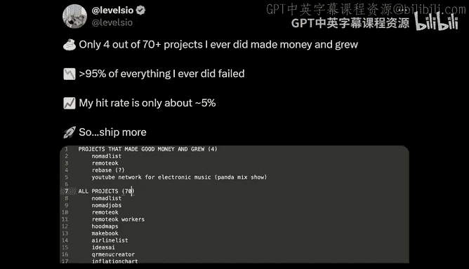

I think my philosophy is very different than most people in startups because most people in startups they build a company and they raise money and they hire people and then they build a product and they find something that makes money。

 and I don't really raise money， I don't use VC funding I do everything myself。

 I'm a designer I'm the developer I make everything I make the logo。 So for me。

 I'm much more scrappy。 and because I don't have funding like I need to I need to go fast。

 I need to make things fast to see even I works I have an idea in my mind and I build it build like a mini startup and I launch it very quickly。

 like within two weeks or something of building it and I check if there's demand。

 if people actually sign up and not just sign up， but if people actually pay money right like they need to take out the credit cards pay me money and I can see if the idea is validated and most ideas don't work like as you say。

 most feel， So there's this rapid iterative phase。 We just build a prototype that works launch it。

 see if people like improving it really quickly。To see if people like it a little bit more enough to pay and all that that whole rapid process is how you think of I think it's like it's very rapid。

 And it's like if I compare it to， for example， Google。

 know like big tech companies especially Google right like they made like transformers。

 They made invented old AI stuff years ago and they never really shipped they could have shipped GT I heard in 2019 never shipped because were so stuck in bureaucracy but they had everything had the data they to tech had engineers and they't do it and it's because these big organizations it can make you very slow being alone by myself on my laptop likewear in room or I can ship very fast and I don't need to like I don't need to ask legal can youvouch for this I can just go and always coding your underwear your profile picture like slouching couch and your underwear chilling a laptop no but would do wear shorts lot and I usually just wear shorts I tshirts because I'm always too hot。

Like I'm always overheating。 thank you for showing up not just in your underwear， but wearing shorts。

 no， you know I still wearing this for you， but thank you thank you for dressing up I think it's because since I go to the gym。

 I'm always too hot。 what's your favorite actually in the gym man over at press overpress like shoulder press okay but it feels good because you're doing like do you win because when you like what is I do 60 kilos like120 or something like it's my only thing I can do well you know the gym and you said like this you like I did it you know。

 like a winner pose Victor pose I do bench press quads that lift。

Hence the the mug yeah talking to my therapist it's a deadlift Yeah because it act like therapy for me you know。

 yeah yeah it is she's controversial to say like if I say it isn't way that people get angry physical hardship is a kind of therapy I just rewatched happy people year in the tiga that weren a Herzog film where they document。

People that are doing trapping， they're essentially just working for survival in the wilderness year round and there's a deep happiness to their way of life because they're so busy。

In it， in nature， like there's something about that physical physical yeah toil Yeah my dad told me that my dad always does like construction in the house like he's always renovating the house he breaks through one room and then he goes to the next room and he's just going in a circle around the house for like the last 40 years so but so he's always doing construction the house and it's his hobby and he like he taught me when when I'm depressed or something he says like get a big like what he called like a big mountain of sands or something from construction and just get a shovel and bring to the other side and just you know do like physical labor。

 do like hard work and do something like set a goal do something and I。

I kind of did that with startups too Yeah， construction is not about the destination。 man。

 it's about the journey that yeah， sometimes I wonder people who are always remodeling their house。

 is it really about the remodeling or no， no， it's not I it about the the puzzle of it No。

 he doesn't care about the results。 Well he shows。's like it's amazing。 like， yeah， it's amazing。

 but。Then he wants to go to the next room， you know， but I think。

It's very metaphorical for work because I also， I never stop work。

 I go to the next website where I make a new one， right， or I make a new startup。 So I'm always like。

Like gives you something to wake up in the morning and like， you know。

 have coffee and then kiss your girlfriend and then。Yeah， I have like a goal。 Not today。

 I'm gonna fix this feature。 Today， I'm gonna fix this bug or something。 I'm gonna to do something。

 You have something to wake up to， you know， And I think maybe especially as a man， also women。

 but you need， you need a hard work。 You know， you need like endeavor。

 I think how much of the building that you do is about money。

 How much is it about just a deep internal happiness。 It's really about fun because I was。

 because I was doing it when I didn't make money right， That's the point。 So I was always coding。

 I was always， I was making music。 I made electronic music drawing music like 20 years ago。

 And I was always making stuff。 So I think。😊，creativereative expression is like a meaningful work that's so important it's so fun。

 it's so fun to have like a daily challenge where you try to figure stuff out but the interesting thing is youve built a lot of successful products and you never really wanted to take it to that。

😊，Level where you scale real big and sell it to a company or something like this Yeah the problem is I don't dictate that right like if more people start using it movies people suddenly start using it and it becomes big I'm not gonna say oh stop signing up to my website I'm pay me money but I never raise funding for it and I think because I don't like the stressful life that comes with it like I have a lot of founder friends。

And they tell me secretly like with hundreds of millions of dollars in funding and stuff and they tell me like next time if I'm going to do it。

 I'm going to do it like you because it's， it's more fun， it's more indie，'s more chill。

 it's more creative， they don't like this， they don't like to be manager。

 right you become like a CEO， you become a manager。I think a lot of people that start startups。

When they become a CEO， they don't like that job， actually， but they can't really exit it， you know？

But they like to do the groundwork， the coding。 So I think that keeps you happy。

 like doing something creative。Yeah， it's interesting how people are pulled towards that to scale to go really big。

And you don't have that honest reflection with yourself like what actually makes you happy because for a lot of great engineers what makes them happy is the building the the quote unquote individual contributor like where you're actually still coding or you're actually still building and they let go of that and then they become unhappy but some of that is the sacrifice needed。

To have a impact the scale。 if you truly believe in a thing you're doing。 But like look at Elon。

 he's doing things million times bigger than me right， And would I want to do that， I don't know。

 you can really choose these things， But I really respect that。

 I think Elon is very different from Vc founders right V C start is like software。

 There's a lot of bullshit in this world。 I think there's a lot of like dodgy finance stuff happening there。

 I think And I never have like concrete evidence about it。

 but your gut tells you something's going on with like companies getting sold to friends and Vcs and then they do reciprocity and shady financial dealings。

 with Elon is's not。 He's just raising money from investors and he's actually building stuff。

 He needs the money to build stuff。 know， hardware stuff。 And that I really respect。

You said that there's been a few low points in your life。

 you've been depressed and the building is one of the ways you， you get out of that。

 But can you talk to that， can you take me to that place to that time when you were you at a low point。

So I was in Holland and I graduated university and I didn't want to like get a normal job and I was making some money with YouTube because I had this music career and I uploaded my music to YouTube and YouTube started to pay me like with ad cents like $2000 a month。

$2000 a month。And all my friends got like normal jobs and we stopped hanging out because people like in university。

 you hang out， you know， utilities at each other's houses， you go party。

 but even when people get jobs， they only party like in the weekend and they don't hang anymore in the weekca you need to be at the office and I was like it' is not for me。

 I want to do something else。And I was starting getting this like， I think it's like Saturn return。

 is， you know， when youre turning 27， it's like some concept where Saturn returns to the same place in the orbit that it was when you're born。

I'm learning so many things some astrology thing， you know so many truly special artists died when they were 27。

 exactly something with 27 men。 And it was for me like I started going crazy because I didn't really see like my future in Holland buying a house going living in the suburbs and stuff So it flew out I went to Asia I started digital nomading and did that for a year。

 And then that made me feel even worse know because I was like alone in hotel rooms like looking at the ceiling like what am I doing in my life like this is like I was working on startups and stuff on YouTube。

 But like what is the future here， you know， like this is this something while my friends in Holland were doing really well and with a normal life。

 you know So it was getting depressed and like I'm like a outcast know my money was was shrinking。

 I wasn't making money anymore lot making $500 a month for something。

 and it was looking at the ceiling thinking like now I'm like $27。

 I'm a loser and that's the moment when I started building like startups And it was because my dad said like if you're depressed。

 You need to。

At sand， get a shovel， start sovveelling， do something， you can't just sit still。

Which is kind of like a interesting way to deal with depression。 You know， like it's not like， oh。

 let's talk about it。 It's more like， let's go do something。

And and I started doing a project called 12 startups in 12 months where every month I would make something like a project and I would launch it with Strie so people could pay for it So the basic format is try to build a thing put it online and put Se to where you can pay money at a strippe check I'm not sponsored by Se but at a strippe checkout button is that still like the easiest way to just like pay for stuff Spe 100% like I think so yeah it's a cool company they just made it so easy you can just click and yeah。

And they're really nice like the CEO Patrick is really nice behind the scenes。

 it must be difficult to like actually make that happen because that used to be a huge problem like merchant just adding a thing a button where you can like pay for a thing I know this because when I was trustworth9 years old。

 I was making website also and I tried to open a merchant accounts。 it was like before S。

 you would have like if it was called world pay。 So had to like fill out all these forms and then I had to fax them to America from Holland with my dad's f And my dad had to it wasn't my dad's name。

 and he to sign for this。 and he started reading these terms and conditions。

 which was like he's live before like100 million in damages and he's like I don't want to sign this。

 I'm like dad come on， I need merchant account and need to make money on the Internet and he signed it and we effects it to America and I had a merchant accounts but then never nobody paid for anything。

 So that was a problem。But it's much easier to know。 You can sign up。

 you add some codes and yeah so 12 startups in 12 months。

 Yeah so what how do you start number one was that what were you were you sit behind the computer like how much do you actually know about building stuff that I could call little bit because did the YouTube channel made websites I would make website for like the YouTube was called pan show and it was like electronic music mixes likestep or or tech number house saw one of them flash using flash my album flash my is like grandpa flash was it called should remember this action script' some kind of programming like back then that was the jascript and I thought' gonna that's supposed to be the dynamic thing that takes over the Internet so many hours and Steve。

You job said flash suck， stop using it， everyone's like， okay。That guy was right though， right Yeah。

 I don't know。 Yeah well it was it was a closed platform。

 I think and close thiss ironic because Apple， you know。

 they're not very open right but back then Steve was like this is closed。

 we should not use it and it security problems I think which sounded like a cop out like just wanted to say that to make it look kind of bad The flash was cool it was cool for time listen animated gifts were cool for time too they came back in a different way as a meme though I mean。

 like I even remember when gifts were actually cool not ironically cool。

 Yeah like like on the Internet， you would have like a dancing rabbit or something like this and that was really exciting had like Lex homepage everything was centered had like Peter's homepage and on the construction which was like a helmet and the lights was amazing banners that's before like Google had you would have like banners advertising It was amazing and a lot of links。

😊，The porn， I think， yeah， or porn that was where the merchant accounts people would use for people would make money a lot。

 only money made on In was like porn or a lot of it。Yeah it was it was a dark place。

 It's still a dark place。 and but there's beauty in the darkness。 anyway。

 so you were you did some basic HTML。 Yeah Yeah， but I had to learn the actual like coding so this was good。

 it was a good idea to like every month launch a startup so I could learn the code learn basic stuff and but it was still very scrappy because it didn't have time to which was on purpose I could't have time to spend lot I had a month to do something so I couldn't spend more than a month and it was pretty strict about that and I published it as a blog post so people I think I put it on hacker news and people would check like kind like oh did you actually you know。

 I felt like accountability because I put it public that actually had to do it do you remember the first one you did。

I think it was play my inbox， Cause back then， my friends， we would send。We would send like cool。

 was before Spotify。 I think we would send like 2013。 we would send music to each other。

 like YouTube links。😊，Like this is a cool song。 This is a cool song。

 And it was these giant email threads on Gmail and they were like unnavigable。

 So I made an app that would log into your Gmail， get them emails and find amount of YouTube links and then make like kind like a gallery of your your songs like essentially Spotify and my friends loved it was it scraping it like no it uses like P like pop or imm you know it would actually check your email So that like privacy concerns because it would get all your emails to find YouTube links but then I I wouldn't save anything but it was fun that was like and。

😊，The first product already would get like press。 like it when I think like。

Some tech media and stuff。 And I was like， this cool。 Like， it didn't make money。

 There was no payment button， but it was， it was actually people using it。 I think。

 tens of thousands people used it。 That's a great idea。 I wonder why。😊，Like。

 why why don't we have that， why don't we have things that access Gmail？

And extract some useful aggregate information。 Yeah， you could tell G like don't give me old emails。

 Just give me the ones with YouTube links know something like that。 Yeah I mean。

 there is a whole ecosystem of like apps you can build on top of the Google but people don't never do this like I've seen a few like boomerang there's a few apps that are like good I maybe it's not easy to make money I think it's hard to get people to pay for these like extensions and plugins。

 know because it's not like a real app So it's not like people don't value it a plugin should be free know when I want to use a plug in Google sheets or something。

 I'm not gonna pay for it like it should be free which is but if you go to a website and you I need this product。

 I'm gonna pay for this because it's a real product。 So even though it's the same code in the back。

 It's a plugin， you know。Yeah， I mean， you can do it through like extensions like Chrome extensions through from the browser side Yeah。

 but who pays for Chrome extensions right like barely anybody so that's not a good place to make money probably yeah。

 that sucks like Chrome extension should be a extension for your startup you know。

 you have a product oh we also have a Chrome extension。You know。

 I wish the Chrome extension would be the product I wish Chrome would support that like where you could pay for it easily because like imagine I can imagine a lot of products that would just live as extensions like improvements for social media like I Gs you know G yeah like these G they gonna charge money for now。

 you get a ref share I think for opening eye I made a lot of them also we'll talk about it let's rewin back it's a pretty cool idea to do 12 startups in 12 months what what's it take to build a thing in in 30 days。

Like at that time， how hard was that？I think it the hard part is like figuring out what you shouldn't add。

 right， what you shouldn't build because you don't have time So you need to build a landing page。

Well， you need you know you need to build a product actually because it need to be something they pay for do you need to build a login system like maybe no。

 you know like maybe you can build some scrappy login system like for photo you sign up S checkout and you get a login link And when I started there was only a login link with a hash and that's just a static link So it's very easy to login it's not so safe what if you leak the link and now I have real Google login but that took like a year So keeping it very scrappy。

 it's very important to because you don't have time know you need to focus on what you can build fast so money stripe build a product。

 build a landing page you need to think about how are people gonna find this so are you gonna put it on Reddit or something how are you gonna put it on Reddit without being looked at as a spammer if you say hey it is my new startup。

 you should use it nobody gets deleted know maybe if you find a problem that a lot of people on Reddit already have sub Reddas and you solved that problem say。

Some people I made this thing that might solve your problem and maybe it's free for now， you know。

 like that could work， you know， but you need to be very， you know。

 narrow it down what you're building time is limited Yeah。

 actually can we go back to the you laying in a room feeling like a loser Yeah I still feel like a loser sometimes。

What's， what can you， can you speak to that feeling to that place of just like。

Feeling like a loser And because I think a lot of people in this world are laying in a room right now listening to this and feeling like a loser。

 Okay， so I think it's normal if you're young that you feel like a loser， first of all。

 especially when you're 27 Yes， yeah， especially there's like a peak yeah， I think to the peak。

 And so I would not kill yourselves， It's very important just。Get truth， you know。

 but because you have nothing。 you have't probably no money。 You have no business。 You have no job。

 Yeah， like Jeremy Peterson said this。 I saw it somewhere like the reason people are depressed because they have nothing。

 they don't have a girlfriend。 They don't have or boyfriend。 They don't have， you need stuff。

 You need like or family。 You need things around you。 You need to build a life for yourself。

 You don't build a life for yourself。 You'll be depressed。

So if you're alone in Asia in a hostel looking at the ceiling and you don't have any money coming in。

 you know't have a girlfriend， you don't， of course， you're depressed， is logic。 But back then。

 if you're in a moment you think there's not logic， there's something wrong with me， you know。Um。

 and and also I think I started going， I started getting like anxiety and I think I started going a little crazy where。

I think travel can make you insane and I know this because I know that there's like digital nomas that they kill themselves and I dont I haven't checked like this the comparison with like baseline people like suicide I。

 but I have a hunch。Especially in the beginning， when it was a very new thing like 10 years ago。Das。

 it can be very psychological texting and。You're alone a lot back then， when you travel alone。

 there was no other digital moments back then a lot so。You're in a strange culture。

 you look different than everybody like you're I was in Asia。

 like everybody's really nice in Thailand， but you're not part of the culture。

 you're traveling around， you're hopping from city to city。You don't have a home anymore。

You feel dis rooted and you're constantly in the outcast in that you're different from everybody else Yes exactly。

 but people treat like Thailand， people so nice， but you still feel like outcast and。

And then I think the the digital momentss I met then were all kind of like its like shady business。

 you know， they were like vigilantes because it was a new thing。

 And like one guy was selling illegal drugs。 This was American guy was selling illegal drugs via U to Americans。

 you know， on this website， they were like a lot of drop shippers doing shady stuff。😊。

There's love chaseise， things going on there and they were they didn't look like very balanced people。

 They didn't look like people I wanted to hang with， you know。

 so I also felt outcasts from other foreigners in Thailand， other digital nomads。And I was like， man。

 I made a big mistake and then I went back to Holland and then I got even more depressed。

 you said digital nomad， what is digital nomad， what is that way of life。

 what is the philosophy there and the history of the movement I struck upon it on ex because I was like I'm gonna graduate university then I'm gonna I need to get out of here I'll fly to Asia because I've been before in Asia I studied in Korea in 2009 like study exchange I was like Asia easy Thailand's easy just go there figure things out and it's cheap it's very cheap Chiang Mai I would live like $150 per month friends for like private room pretty good So I struck upon this on exit。

 I was like okay there's other people on laptops working on their startup working remotely back then nobody work remotely。

 but they worked on their businesses and they would you know live in like Colombia or Thailand or Vietnam or Bali they would live kind of like a more cheap places and it looked like a very adventurous life like you travel around you build your business There's no pressure from like your home society like you're American so you get pressure from American society telling you kind of what to do like you need to buy a house。

you need to do this stuff， I add this in Holland too。And you can get away from depression。

 You can find it kind of feel like you're free。 You're kind of。There's nobody telling you what to do。

 but that's also why you start feeling like you go crazy because you are， you are free。

 you're dis attachedtached from anything and anybody。You're disintached from your culture。

 you're disintached from the culture you're probably in because you're staying very short。

 I think France Kaafka said， I'm free。 therefore I'm lost man， that's so true。 Yeah。

 that's exactly the points。 And yeah， freedom is like it's the definition of no constraints， right。

 like anything is possible can go anywhere。And everybody's like， oh， that must be super nice。

 You know， like freedom， you must be very happy。 And it's the opposites， like。

 I don't think that makes you happy。 I think constraintss strange probably makes you happy。

 And that's a big lesson I learned then。😊，But what were they making for money。

 what so you just saying they were doing shady stuff at that time？For me。

 you know because I was more like a developer， I wanted to make startups kind and it was like it was like drugs being shipped to America like diet pills and stuff like non FDA proof stuff。

 you know， and they would like there was no like were like would beers and they would laugh about like all the dodgy shit kind theyre doing you know that part vibe know like kind of sleazy ecom vibe。

 I'm not saying all ecom， you know， you know this vibe it could be a vibe and your vibe was mores ethical guys with sports cars and Dubai people you know ecom like bro you got a drop you make1 million there people was this shit I was like this is not my people there's nothing wrong with any of those individual but there's a foundation。

That's not quite ethical。 I what is that。 I don't know what that is。 But yeah， I get you。 No。

 I don't want to judge。 It was more。 I know for me。 It wasn't my world。 It wasn't my stop culture。

 I want to make cool shits。 You know， but they also think they're cool shit is cool。 So you know。

 but I wanted to make like real like startups。 And there was my thing。 I would read hackcker news。

 you know， like white combminator。 And they were making cool stuffs。 So I wanted to make cool stuff。

 I mean， that's a pretty cool way of life， just if you romanticize it for a moment。

 it's very romantic man。 It's very， it's colorful。 you know， like if I think about the memories。

 I what is some happy memories， just like working， working cafes or working and。😊。

Just the freedom that。That envelos you for with that way of life because anything is possible。

 you can just get off that was amazing。 Like we would work like you wouldn't。

 I would make friends and we would work until， you know，6 AM in Bali， for example， with like。

With Andre， my best friend， was still my best friend。 and we another friend。

 and we would work until like the morning when the sun came up because at night。

 the cowork space was silent。 You know， there was nobody else and。I would wake up like 6 PM or 5 PM。

 I would drive to the conference space on a motorbike。

 I would buy like 30 hot lattes from a cafe30 because there was like there was like six people coming or we didn't know。

 sometimes people would come in and we would say3030 Yeah。

 nice and we would drink like four per person or something you know man I don't know if there were powerful lattes。

 you know， but there were lattes and we would put them in plastic bag and I would drive there and all the coffee was like falling you know and then we'd go into grocery and have these coffees here and would work all night。

 we'd play like techno music and。😊，Everybody would just work their like this would literally you like business people。

 they would work in their startup and we would all try and make something。

And then the sun would come up and the morning people。

 you know the yoga yoga girls and yoga guys would come in you know after the yoga class of six and they say。

 hey， good morning and we're like， we look like this， you know。

 and we're like we still up how are you doing and we didn't know how bad we looked you know。

 but it was very bad And then wed go home sleep in like a hostel or a hotel and do the same thing and again and again and again and what's this lock in mold。

 you know， like working。😊，U and that was very fun， so it's just a bunch of you techno music blasting。

All through the that， yeah more like。Like like it's easy I got for me。

It's such an interesting thing because the speed of the beat affects how I feel about a thing so the faster it is。

 the more anxiety I feel， but that anxiety is channeled into productivity。

 but if it's a little too fast I start the anxiety overpower don' like drawing bass music probably not's too fast I mean for working I have to I have to play with it it's like you can actually like I can adjust my level of anxiety it's must be a better word than anxiety it's like。

Productive anxiety that like whatever that is It also depends what kind of work are you right。

 Like if you're writing， you probably don't want your bass music。

 I think for codes like industrial techno， this kind of stuff kind of fast。

 It works well cause you really get like locked in and。Commind with caffeine， you know， you， you go。

 you go deep， you know， And， and I think you balance on this edge of anxiety because this caffeine is also hitting your anxiety。

 And you wanna be on the edge of anxiety with this techno running。 Sometimes it gets too much。 like。

 stop the techno stop the music。 It's like。😊，But but those are good memories， you know。

 and also like travel memories， like you go from city to city。 Yeah。

 and it feels like it's kind of like jethead life like it'， it feels very beautiful like you're。

 you're seeing a lot of cool cities。 And what was your favorite place Do you remember he visited。

 I think still like Bangkok is。😊，The best place and back in Chiang Mai。

 I think Thailand is very special。 Like I've been to the other place。

 like I've been to Vietnam and I've been to South America and stuff。

 I still think Thailand wins in how nice people are， how easy of life。 People have their。

 everything is cheap。😊，Yeah， good。 Well， Bangkok is getting expensive now。

 But Chiang Mai is still cheap。 I think when you're starting out， it's a great place。 man。

 the air quality socks。 it's a big problem。 So， and it's quite hot， But it's a very cool place。

 Pros and cons。 I love Brazil also， My girlfriend is Brazil， but I do， I not just because of that。

 but I like Brazil。😊，The problem still is the safety issue。 You know， like it's like in America。

 like it's localized。 it's hard for Europeans to understand like safety is localized to specific areas。

 So if you go to the right areas， it's amazing。 Brazil's amazing。

 if you go to the wrong areas like maybe you die。 I mean， that's true。 but's not true in Europe。

 when Europe is much That's true。 That's you're right， you're right， it's more averaged out Yeah。

 I like one they're strong neighborhoods when you're like you cross a certain street and you're in a dangerous part of town。

 man yeah， I like it。 I like there's certain cities in the United States like that。 Yeah I like that。

 And you're saying Europe you don't feel scared。😊，Well， I don't I like BJJ。No， not even just that。

 I think danger is interesting。 So danger reveals something about yourself about others。

 Also I like the full range of humanity。 Yeah so I don't like the mellow out aspects of humanity I I friends like these are not much friends that are exactly like this like they go to like the the kind of broken areas you know。

 like they like this reality。 they like authenticity more they don't like luxury。

 they don't like oh yeah， I hate luxury Yeah it's very European of like what was that that's a whole not conversation So you you quoted Fya Stark。

Quote to awaken quite alone in  strange town is one of the most pleasant sensations in the world。

 Do you remember a time you awoke in an a strange town and felt like that。

 We're talking about small towns or big towns or man， anywhere。

 I think I wrote it in some blog post and like。

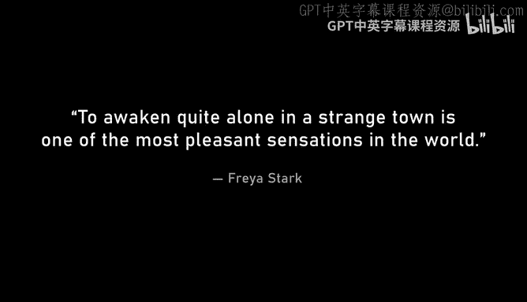

It was a common thing when you would wake up and this was like because I have this website I started a website about this digital nomas like called nomaist do co and it was a community So it was like 30000 other digital nomads because I was feeling lonely so I built this website and I stopped feeling lonely like I started organizing meetups and making friends and and it was very common that people would say they would wake up and they would forget where they are like for the first half minute and I had to look outside like where am I which country which sounds really like privileged it was more like funny like you literally you don't know where you are because you're so disroed But there's something。

Man， it's like Anthony Ban， you know， there's something pure about this kind of。Vabbons。Travel thing。

 you know， like it's behind me。 I think I don't like now I travel with my girlfriend， right。

 It's very different， but it is romantic， like memories of this kind of like。Vagabbon。

 individualistic solo life。 But the thing didn't make me happy， but it was very cool。

 but it didn't make me happy。 right， It made me anxious。

 There's something about it that made me anxious。 I don't know。 I still feel like that。

 It's a cool feeling。 It's scary at first。 But then you realize where you are。😊。

And you and I don't know， it's like youll awaken to the possibilities of this place you see like that it's like it's great and it's even when you're doing basic travel like go to San Francisco or something else Yeah you have like the novelty effect like you're in a new place like here things are possible you know you're you don't get bored yet and。

And that's why people get addicted to traveling， you know， back to startups， you were a book。

On how to do this thing and gave a great talk on it， how to do startups， the book's called make。

Bootrappers handbook Yeah， I was wondering if you can go through some of the steps idea， build。

 launch， grow， monetize， automate and exit There's a lot of fascinating ideas in each one， so。

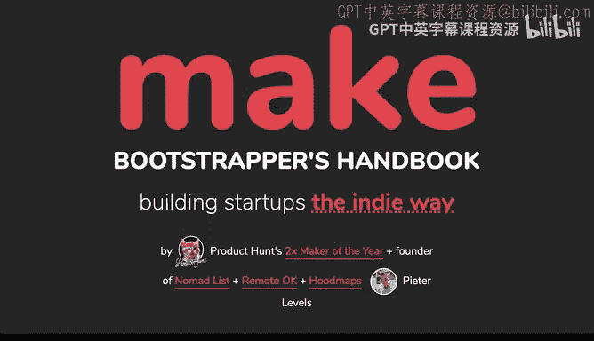

Idea stage Yeah how do you find a good idea So I think you need to be able to spot problems So for example。

 you can go in your daily life like when you wake up and you're like what are stuff that I'm really annoyed with that's like in my daily life that doesn't function well and that's a problem that you can see okay maybe that's something I can write code about know code for and it will make my life easier So I would say make like a list of all these problems you have and like idea to solve it and I see which one is like viable you can actually do something and then start building it So that's that's a really good place to start。

Become open to all the problems in your life like actually started noticing them I think that's actually not a trivial thing to do to realize that some aspects of your life could be done way。

 way better Yeah because we kind of very quickly get accustomed to discomforts exactly like for example。

 like doork knobs Yeah like design of certain things。

Like you like door know that one I know how much。Incredible design work has gone into it's a really interesting doors and door knobs just the design of everyday things forks and spoons it's going be hard to come up with a fork that's better than the current fork designs and the other aspect of it is you're saying like in order to come up with interesting ideas you got to。

Try to live a more interesting life Yeah， but that's where travel comes in because when I started traveling。

 I started seeing stuff in other countries that you didn't have in Europe。

 for example or America even like if you go to Asia。Like， dude， especially 10 years ago。

 nobody knew about this like Wechats， all these apps that they already had before we had them。

 these everything apps， right， like now， Elon's trying to make X， this everything app， like wechat。

 the same thing like。In Indonesia T you have one app that you can order food。

 if you can order groceries， you can order massage， you can order car mechanic。

 anything you can think of is in the app and that stuff for example you know that's called like arbitrage。

 you can go back to your country and build that same app for your country for example。

 so you start seeing problems you start seeing solutions that other countries already other people already did in the rest of the world and also traveling in general just gives you more problems。

Cause travels uncomfortable， you know， airports are horrible airplanes are not comfortable either there's a lot of problems you start seeing just getting out of your house。

 you know but also you can， I mean， in the digital world。

 you can just go into different communities and see what can be improved by the and that yeah。

But what specifically is your process of generating ideas。

 do you like do idea dumps like do you have a document where you just keep writing Yeah。

 used to have like a because when I was when I wasn't making money。

 I was trying to like make this list of ideas to see like so I need to build。

I was thinking statistically already like I need to build all these things and one of these will work out probably you know so I need to have a lot of things to try and I did that right now I think like because I already have money I can do more things based on technology So for example AI when I found out about when stable diffusion came or chatTT and stuff all this things all these things where like。

😊，I didn't start working with them because I had a problem， I had no problems。

 but I was very curious about technology。And I was like playing with it and figuring out like first just playing with it and and then you find something like。

 okay， this generates sta fusion generates house is very beautiful and interiors， you know。

 just that's about problem solving。 it's more about the possibilities of new things you can create。

 Yeah， but that's very risky because that's the famouss like solution trying to find a problem。

And usually it doesn't work， and that's very common with startupfos， I think they have tech。

 but actually people don't need to tech， right？Can you actually explain？

It'd be cool to talk about some of the stuff you created， can you explain？

This photoaiI so it's like fire your photographer。 The idea like you don't need a photographer anymore。

 you can train yourself as an AI model and you can take as many photos you want anywhere and any clothes facial expressions like happy or sad or poses all the stuff how how does it work is so you can link to a gallery of ones on the left you have the prompt so you can write like so model is your model Lex Freeman so you can write like model as bh whatever you want then press the button and it will take like one minute what are you using for the hosting for the compute replicate replicate good Okay it's cool like this interface wise it's cool that you're showing how long it's gonna take this is amazing。

 So it's taking presumably you just load in a few pictures from the Internet。

 Yeah so I went to Google images type in Lex Friman I added like 10 or 20 images you can open them in the gallery。

😊，And you can use your cur source to， yeah。So some don't look like you。

 So the the hidden missread is like， I don't know， say like。50，50 or something。

 But when I was watching a tweet， like it's been getting better and better and better。

 it was very bad in the beginning。 It was so bad， but still people sign up to his， you know。

There's there's two lues iss great its getting more and more sexual and it's making me very uncomfortable man。

 but that's a problem with these models because no we need to talk about this because the models and superfusion sort of photorealistic models that are like fine tunes they were all trained and born in the beginning and there was a guy called Hassan。

So I was trying to figure out how to do photoreistic AI photos and it was stable diffussion by itself is not doing that well。

 like the faces look all mangled。And it doesn't have enough resolution or something to do that well so but I started seeing these base models。

 these function models and people would train them porn and I would try them and they would be very photorealistic。

 they would have bodies that actually made sense like body anatomy。

But if you look at the photore models that people use now still。

 there's still core porn there like of naked people。

 So I need to prompt out the naked and everyone needs to do this with AI startups with imaging。

 you need to prompt out the naked stuff。 you need to put naked keep reminding the model Yeah don't put naked because it's very risky。

 I have Google vision that checks every photo before it's shown to the user like because you get the journalist get very angry if they was a journalist I think that angry to use this and was like made like a nipple because Google vision didn't detect it So there's like these kind of problems you need to deal with that's what I'm talking about。

 This is with cats。But look at the cat face， it's also kind of mangled。You know， I'm， I'm， I'm。

 I'm a little bit disturbed。 Ca zoom in on the cat if you want， like like。Yeah。

 this is a very sad cause。It doesn't have nose。 It doesn't have nose。 But this man。

 But this is the problem with AI starters because they all act like it's perfect。

 like this is groundbreaking and， but it's not perfect。 It's like really bad， you know。

 half the time。 So if I wanted to sort of update model as yeah。

 so you remove this stuff and he writes like。😊，Whatever you want like in Thailand or something or in Tokyo in Tokyo。

 yeah。And you could say like at night with neon lights。

 like you can add more detail Michel I'll go in Austin。 Do you think I'll know Yeah， in Texas。

 in Austin， Texas， cowboy hat in Texas， Yeah， as a， as a cowboy。As a cowboy。

 it's gonna go so towards the porn direction its it's。

 I hope not the end of my career or the beginning。 it depends。

 We can send you a push notification when your photos are done。 Yeah， right cool。😊，LOh wow。

 so this whole interface you've built， this is really well jry。

I still use Jcurry the only one after this day you're not the only one the entire the web is PhP the Ph and Jcurry and SQL lights you're just like one of the top performers from a programming perspective that are still like openly talking about it but everyone's using PhP like if you look mostly of the web is still probably PhP and7% it's because of WordPress right because the blogs that's true's true I'm seeing a revival now people are getting sick of frameworks。

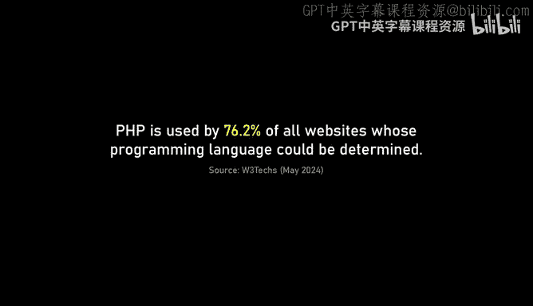

Um， like all the jascript frames are so like what he called like wdy。

 like they're so it's takes so much work to just maintain this code。

And then it updates to a new version and you need to change everything PhP just stays the same and works yeah and can you actually speak to that stack you build all your websites。

 apps startups projects all of that with mostly vanillal HTML JavaScriptscript with JQury PhP and light so that's a really simple stack and you get stuff done really fast like can you just speak to the philosophy behind that I think it's accidental because that's the thing I knew like I new PhP I new H CSS you know because you make websites and。

When my startups started taking off， I didn't have time to。

 I remember putting on my to do list like learn No JS because it's important to switch， you know。

 because this obviously is much better language than PP and I never learned it。

 I never did it because at the end have time these things were growing like this and I was launching more project and I never had time it's like one day you know I'll start coding properly and I never got to it。

I sometimes wonder if I need to learn that stuff， it's still to do happen for me to really learn no Js or or flask or these kind of react Yeah。

 react and it'ss。It feels like a responsible software engineer。Know how to use these。

 but you can get stuff done。So fast with vanilla versions of stuff。 Yeah。

 just like software developers if you want to get a job and there's like， you know。

 people making stuff like startups and if you want to be entrepreneur probably。

You maybe shouldn't I wonder if there's like I really want to measure performance and speed I think there's a deep wisdom in that I do think that frameworks and just constantly wanting to learn the new thing this complicated way of software engineering gets in the way I'm not sure what to say about that because definitely like you shouldn' build everything from just vanilla JavaScriptscript or vanilla C。

 for example， C++ when you're building systems engineering is like there's a lot of benefits。

For a pointer safety all that kind of stuff。 So I I don't know， but it just feels like。

You can get so much more stuff done if you don't care about how you do it。 man。

 this is my most controversial take， I think。 and maybe I'm wrong， but I feel like。

There's frameworks now that raise money， they raise a lot of money like they raise $50 million。

10 million3 million and the idea is that you need to make the developers and new developers like when you're 18 or 20 years old right。

 get them to use this framework。And then add a platform to it like where the framework can it is open source。

 but you probably should use the platform which is paid to use it and the cost of the platforms to host it are a thousand times higher than just hosting it on a simple AWS server or VPS on Digital oceance So there's obviously like a monetary incentive here like we want to get a lot of developers to use this technology and then we need to charge them money because they're going to use it in startups and then the starters can pay for the bills but what it kind of destroys the。

The information out there about learning to code because they you know they pay YouTubeubrs。

 they pay influencers， developing influencers a big thing to like and same thing what happens with like nutrition and fitness or something same thing happens in developing they pay this influence to promote this stuff use it。

 make stuff with it make demo products with it and then a lot of people like wow uses this and I started noticing this because when I was ship my stuff people would ask me what are using I would say just PhP why doesn't matter and people would start kind of attacking me like why are you not using this new technology this new framework this new thing and I say I don't know because this PhP thing works and I don't really I'm optimizing for anything just it just works。

And I never understood like why， like I understand there's new technologies that are better and it should be improvement。

 but I'm very suspicious of money， just like lobbying。

 there's money in this developer framework scene there's hundreds of millions。

That goes to ads or influence or whatever， it can't all go to developers。

 you don't need so many developers for a framework， and it's open source。

To make a lot more money on these startups， so that's a really good perspective。

 but in addition to that it is like when you say better。s。

Can we get some data on the better because like I want to know from the individual developer perspective and then from a team of five。

 team of 10， team of 20 developers？Measure how productive they are in shipping features。

 how many bugs they create。How many security holes。Uh， Php was not good at the security for a while。

 but now' in theory， in theory， is it though， how good no， no now as as you're saying it？

I want to know if that's true because PhP was just the majority of websites on the internet could be true is it just overrepresented same with WordPresspress。

 yes， there's a reputation that WordPresspress has a gigantic number of security holes。

I don't know if that's true I I know it gets attacked a lot because it's so popular。

 It definitely does have security holes， but maybe a lot of other systems have security holes as well anyway I just sort of questioning the convention of the wisdom that keeps wanting to push software engineers towards frameworks towards complex like super complicated sort of software engineering approaches that stretch out the time it takes to actually build a thing 100% and it's the same thing with big corporation 80% of the people don't do anything It's like right's not efficient and。

And if you， if your your your benchmark is like people building stuff that actually gets done and like for society。

 right， like if we want to save time， we should probably use technologies as。It's simple。

 that's pragmatic， that's like that works that's not overly complicated。

 It doesn't make your life life like a living hell， you know。

 and use a framework when it obviously solves a problem。

 a direct problem that you do of course yeah of course I'm not saying you code without a framework'm you should use whatever you want。

 but。Yeah， I think it's suspicious， you know， and， and I think it's speech when I talk about on the Twitter。

 like there's a lot， this this army comes out， you know， there's this this framework armies。 Yeah。

 this man， something my God tells me。😊，I want to ask the framework army what to have they built this week It's the Elon question。

 what did you do this week and did you make money with it， you know， did you charge users。

 I it a real business and yeah。So going back to the cowboy first of all。

 I' never look like you right， but some do every aspect of this isn't pretty incredible well I'm also just looking at the interface is really well done so this is all just jaQu and yeah this is really well done so like tell take me through the journey of photo AI like。

You don't know Most of the world doesn't know much about stable diffusion or any of this any of the geneative AI stuff and so you're thinking okay how can I build cool stuff with this what was the origin story of photo AI I think it started because stable di fusion came out so stable di fusion like the first like geneative image model A model and I started playing with like you could install on your Mac like somebody forked it and made it work for MacBooks so I download it and cloned to repo and started using it to generate images。

And it was like amazing。 like it would I found it on Twitter because you see things to happen on Twitter and I would post what I was making on Twitter as well and you could make any image you could write a prompt So essentially write a prompt and then it generates a photo of that or image of that in any style like they would use like artist names to make like a Picasso kind of style and stuff。

😊，And I was trying to see like what is it good at， is it good at people， no。

 it's really bad at people。But it was good at houses。 So architecture， for example。

 would generate like architecture houses。 So I made a website called this House does notexist dot org and it generated like they called like house porn at that one。

Like house porn is like a subd。 So and this was stable using like the first version。

 so it looks really， you can click for another photo。

So it generates like all these kind of nonex houses， it is house Point， but it look kind of good。

 you know， like especially back then， really how things look much better。

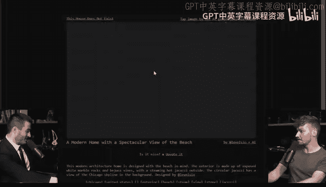

It's really， really well done。Wow， and it also are generous is like a description。And you can upvote。

 Is it nice。 Upvote it。 Yeah， man， there's so much to talk to you about。 like the choices here。

 It's really well。 It very scrappy。 in the bottom is like a ranking of the most uped houses。

 So these are the top photo。 And if you go to old time， you see quite beautiful ones。😊。

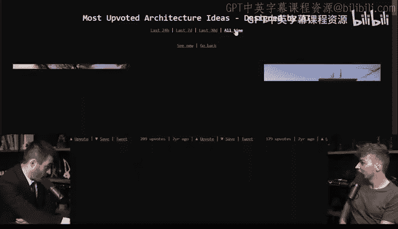

Yeah， so this one is my favourite。 The number one is like kind of like a。😊。

How is this not more popular？It was really popular for like a while。

 but then people got so bored of it， I thinkca I was getting bored of it too like just continues houseborn like everything starts looking the same。

 but then I thought it was really good at interior so I pivoted to interioraiI。com where。

I tried to like upload first generate interior designs and then I tried to do like there was a new technology called image to image where you can input an image like a photo and it would kind of modify the thing。

😊，So you see it looks almost the same as photo has the same code essentially。😊，Nice， so I would。

 I would upload a photo of my interior where I lived。 and I would ask like， change this into like。😊。

I don't know like maximalist design， you know， and it worked。 and it worked really well。

 So I was like， okay， this is a startup'ca obviously interior design， AI and nobody's doing that yet。

So I launched this and I was successful and made like in within in a week， made 10 k，20 k a month。😊。

And now still makes like 40 k 50k a month and it's been like two years。

 So then I was like how can I improve this interior design。

 I need to start learning fine tuning and fine tuning is where you have existing AI model and you fine tune it on a specific goal you wanted to do So I would find really beautiful interior design。

 make a gallery and train a new model that was very good at interior design and it works and I use that as well。

😊，And then for fun， I uploaded photos of myself。And here's where it happened and to train myself like and this would never work obviously and it worked and actually it started understanding me as a concept so my face worked and and you could do like different styles like me as a like very cheesy medieval warrior。

 all this stuff。So it was like this is another startup。 So now I did avatar AI dot me。

 I couldn't get the dot com and this was this was yeah， AvatarI dot me。 Well。

 now it's forwards to photo I because I pivoted got it， but this was more like cheesy。😊，Thing。

 so this is very interesting because this went so viral。 it made like。

I think like 150 k in a week or something。 the most of mine I ever made。 And and I'm big。

 this is very big V companies like Lnza， which are much better at ios and stuff than me。

 I didn't have ios app They quickly build ios app that does the same。 And they found technology。

 And it's all open technology。 So it's good。 And I think they made like 30 million with it they became like the top grossing app after that And it was feel about that。

 I think it's amazing honestly， And it's not like didn't have like a feeling like No it was a little bit like sad。

 because all my price would work out。 And I never had like real fierce competition。

 And now I have like fierce competition from like a very。😊，Skilled， high talent。

 like I was developer studio or something that。And and they already had an app。

 They had an app and app store for like， I think retouching in your face or something。

 So they were very smart。 They add these avatars to their The feature。

 they had the users They do push notification to everybody。 We have this avatars。 Yeah， man。

 they made create， I think they made， they made so much money and。😊。

I think they did a really great job and I also made a lot of money with it。

 but that was I I quickly realized it wasn't my thing because it was so cheesy， it was like kids。

 you know， it's kind of like。😊，Me as a barbie or me as a， you know it was cheesy。

 I wanted to go for like what's a real problem we can solve because this is gonna be a hype。

 it gonna be and it was a hype aars It's like let's do real photography like how can you make people look really photoistic and that was difficult and that's why these officerss work because they were all like in a cheesy Picasso style and art is easy because you interpret the all the problems that AI has with your face are like artistic know if you call it Picasso but if you make a real photo。

 all the problems with your face you look wrong know。So I started making photo AI。

 which was like a pivot of it， where it was like a photo studio where you could take photos without actually needing a photographer needing a studio。

 you don't just， you know， you just type it。And I've been working on for like the last， yeah。

 it's really incredible。 that journey is really incredible。

Let's go to the beginning of photo AI though， because I remember seeing a lot of really hilarious photos。

 I think you were using yourself as a case study， right？Yeah， so what， u there's a tweet here sold。

$100000 in AI generated avatars。 And it's a lot。 like， it's a lot for anybody。

 It's a lot for me like I 10 k a day on this， you know， that's amazing。That's amazing。

And then the NAA tweet， like this's a launch tweet。

And then the before there is like the me hacking on it。Oh， I see so that。Okay， so October 26， 2022。

 I trained an ML model on my face。Yeah。because my eyes are quite far apart。

 I learned when I did YouTube I would put like a photo of like my DJ photo， you know。

 my make and people would say I look like a hammerade shark it's like a top comment so then I realized my eyes are far apart Yeah the internet helps you Yeah helps you realize who how you look you know boy do I love first first trip。

Well， what is is this wait， is this water from the waterfall， but the waterfalls in the back。

 you know， so what's going on？So this is how much of this is real， it's all AI， it's all AI。

That's pretty good though for the early days exactly so but this was hit or miss so you had to do love curation because 99% of it was really bad so these are the photos are uploaded how many photos did you use only these I will try more up to date ps later these are these are the only photos you uploaded yeah wow。

Wow， okay， so like you were learning all this super quickly what what are some like interesting details you remember from that time for like what you have to figure out to make it work。

 And for people were just listening， he uploaded just just a handful of photos that don't really have a good capture the face and he's able to biggest crop it's like crop but the layout but they're square photos theyre 512 by 512 because a say fusion but nevertheless not great capture of the face like it's not it's not like a collection of several hundred photos that is like exactly I would imagine that too when I started was like must be like some trees scan technology so I think the cool thing with it trains the concept of you So it's literally like learning just like any AI model learns it learns how you look。

So I， I did this and then I was getting so much。 I， I was getting DMms like Telegram messages like。

 how can I do the same thing， I want these photos， My girlfriend wants these photos。 So I was like。

 okay， this is obviously business。But I didn't have time to code it， make a whole like app about it。

 so I made an HTML page register the domain name。And this was not even it was a Spe payment link。

 which means you have a lit link to Stripe to pay， but there's no code in the back。

 So all you know is you have customers that paid money。And then I added like some a type form link。

 so type form is a site where you can create like your own input form like Google Form。

 so they would get an email with a link to the type form or actually just a link after the checkout and they could upload their photos。

😊，So enter their email， upload the photos and I launched it and I was like here first seal。

 so it's October 2022。And I think within like the first 24 hours was like。

 I'm not sure it was like 10 customers or something。

 but the problem was I didn't have code to automate this。 so I had to do manually。

 so the first few hundred I just literally took their photos。

 trained them and then I would generate the photos with the problems and had this text file with the problems and I would do everything manually and it quickly became way too much。

 So but that's another constraint like I was forced to。C something up。 that would do that。

 And that was essentially making it into a real website right So the first one was the type form and they uploaded through the type check and then you were like that image is downloaded。

 you write a scripted export download images myself a zip un zip and you unzip it Yeah and then because know do things don't skill Paul G So and then I would and then would email them the photos my personal email say here's here's your avatar and they liked it they were like。

 its amazing。😊，You email them with your personal email didn't have email address on this domain and this is like  a00 people Yeah。

 and then you know who signed up。Like a man， I cannot say， but really famous people like really。

 really like billionaires famous tech billionaires did it。 And I was like， wow， this is crazy。

 And I sent I was like so scared to mess them。 So I said， thanks so much for using my sight。

 you know， he's like yeah， amazing app Cr work。 So it's like this is different and normal reaction。

 you know， its Bill Gates， isn't it。😊，Cant say anything。Just like shirtless GDPPR， you know。

 they privacy European regulation cannot share anything。 But I was very， I was like， wow， and。😊。

But this shows like， so you make something and then if it takes off very fast。

 you're like it's validated， you know， you're like， here's something that people really want。

But then also I thought this is hype。 this is gonna die down very fast。 and I didca it's too cheesy。

But you have to automate the whole thing。 How do you automate it？ So like what's the AI component。

 Like how hard was that to figure out Okay， so that's actually in many ways。

 the easiest thing because there is all these platforms already back then there was platforms for fine tune stable di fusion like now I use replicates back then I use different platforms which was funny because that platform when this thing took off I would tweet because I tweet always like how much money these websites make。

😊，And then so he called vendor， right， the platform that did the GPUs。

 they increased the price for training from $3 to $20 after they saw that I was making so much money so immediately my profit is gone because I was selling them for $30。

And I was in a slack with them like saying what is this like can you just put it back to$ three and say yeah。

 maybe in the future， we're looking at it right now， I'm like。

 what are you talking about like you just took all my money， you know， and they're smart Well。

 they're not that smart because like you also have a large。

platformform and a lot of people respect you so you can literally come out and say that I think it's like kind of dirty to cancel a company or something I prefer just bringing my business elsewhere but there was no elsewhere back then so I started talking to other AI model Ml platforms so replicate on those platforms and I started DMing the CEO say can you please creates like it's called dream this fine tuning of yourself he add this to your site because I need this because I'm being price god and he said no because it takes too long to run takes half an hour to run and we don't have the GPS for it I say please as week said。

We're doing it。 We're launching this。And then this company became， it was like not very famous。

 company became very famous with this stuff because suddenly everybody was like， oh。

 we can build similar apps like after our apps and everybody started building off their apps and everybody started using replicate for it。

 And it was from these early DM Ms with like the CEO， like Ben first， very nice guy。😊。

And he was like。They never prize Gar media They never treated me bad。 They always been very nice。

 it's a very cool company So you can run any M model。

 any AI model Lms you can run on air and you can scale Yes they Yeah yeah and I mean。

 you can do now you can click on the model and just run it already。 it's like super easy。

 logging with Github。 That's great。 And by running it on the website then you can automate with the API you can make a website that runs the model generate images。

 generate text generate video generate music， generate video like they two models They do anything。

 Yeah it's very cool company and you're like growing with them essentially they grew because of you because it's like a big use case。

 Yeah like。😊。

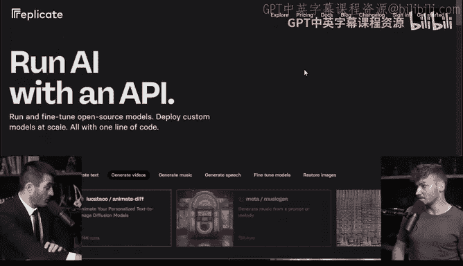

The website even looks weird now it it started as like a machine learning platform that was like。

 I didn't even understand what it did。 It was just two。To M， you know。

 like you would understand because you're in ML world， I wouldn't know it's new friendly， Yeah。

 exactly。And I didn't know how it worked and but I knew that they could probably do this and they did it they built the models and now I used them for everything and we trained like I think now like 36000 models。

 46000 people already but is there some tricks to fine tuning to like the collection of photos that are provided like how do you like so many hes the hacks it's like honored hecks to make it work what what what are my secrets and I what not not the secrets。

 but the more like insights maybe about the human face and the human body like what kind of stuff get messed up on？

I think people， well man， it's laughing people don't know how they look。

 so yeah they generate photos of themselves and then they say， it doesn't look like me but。

Then you know， you can check the training for us， it does look like you。

 but you don't know how you look。So there's a face dysmorphia of yourself that you haven't known any look yeah that's hilarious I mean i've got to one one of the least pleasant activities in my existence is having to listen to my voice and look at my face so I get to like really。

Really have to sort of come into terms with the reality of how I look and how I and everybody and but people often don't right like you have a distorted view perspective。

 I know that like I would if I would make a selfie how I think I look that that's nice other people think that's not nice。

 But then they make a photo of me like that's super ugly。 But then're like no。

 that's how you look and you look nice。 You know so how other people see you is nice。

 So you need to ask other people to choose your photos。 Yeah。

 you shouldn't choose them yourself if you don't know how you look。Yeah。

 you don't know what makes you interesting， what makes you attractive or all this kind of stuff And a lot of us。

 this is dark aspect of psychology。 We focused on some small flaws。

 Yeah this is way I hate plastic surgery， for example。

 people tried to remove the flaws when the flaws the thing that makes you interesting and attractive。

 I learned from the hammerhead shark eyes this the stuff about you that looks ugly to you and it's probably that what makes you original makes you nice and people like it about you and it's not like oh my god。

And people notice it， people notice your hammer had ice， you know， but it's like that's me。

 that's my face so I I love myself and that's confidence and confidence attractive Yes。

 right confidence is attractive， but yes， understanding what makes you beautiful。

 it's the breaking of symmetry makes you beautiful。

 It's the breaking of the the average face makes you beautiful， all that yeah。

And obviously different from men and women a different ages， all this kind of stuff。

 but be underneath it all， the personality， all of that when when they face。Comes alive。

 That also is the thing that makes you beautiful。 anyway， you have to figure all that out with AI。

 Yeah one thing that worked was like people would upload full body photos of themselves So I would crop the face because the model knew better that we're training mostly the face here。

 but then I started losing resemblance of the body because some people are skinny mucular or whatever so you want to have that too So now I mix full body photos in the training with face photos face crops and it's all automatic like and I know that other people they use again AI models to detect like what are the best photos in this training set and then train on those but it's it's all about training data and that's everything in AI like how good your training data is。

Is in many ways more important than how many steps you train for。

 like how many months or whatever with the GPUs like。The gold。

 do you have any guidelines for people of like how to get good data。

 how to give good data to you know like the photos should be diverse。 So for example。

 if I only upload photos with a brown shirt or green shirts。

The multiple think that I'm training the green shirts。

So the things that are the same every photo are the concepts that are traineds。

 what you want is your face to be the concept that trains。And everything else to be diverse。

 like different so diverse lighting as well， diverse everything outside inside。

 but there's no like this is a problem， there's no like manual for this and nobody knew we were all just。

 especially two years because we're all heing， trying to test anything anything you can think of and it's frustrating。

 it's one of the most frustrating and also fun and challenging things to do because with AI because。

It's a black box and like Carpati， I think， says this like we didn't really know how this thing works。

But it does something， but nobody really knows why， right。

 like we cannot look into the the model of an LLM。 like what is actually in there。

 We just know it's like a 3D matrix of numbers， right。嗯。

So it's very frustrating because some things you that would be。

 you think theyre obvious that it will improve things will make them worse and there's so many parameters you can tweak so you're testing everything to you know。

 improve things。I mean there's a whole field of mechanistic interpretability that like studies that tries to figure out tries to break things apart not how it works。

 but you know there's also the data outside and the actual like consumer facing product side of figuring out how you get it to generate a thing that's beautiful or interesting or naturalistic all that kind of stuff and you're like at the forefront of figuring that out about the human face and humans really care about the human face very va like me you know like I want to look good in your podcast for example yeah for sure and one of the things actually would love to like rigorously used photoaiI because for the thumbnails I take portraits of people' I don't know shit about photography I basically used your approach for photography like Google how do you take photographs？

Camera lighting and also it's tough because。Maybe maybe you could speak to this also。

 but like with photography。No offense Danny， they're true artists， grief photographers。

 but like people like take themselves way too seriously think you need a whole lot of equipment。

 you definitely don't want one light， you need like five lights and like and you have to have like the lenses and I talk to to a guy and expert of shaping the sound in a room okay。

 because I was thinking I'm gonna to do a podcast studio， whatever。

I should probably like treat do a sound treatment on the room and like when he showed up and analyzed the room。

 he thought everything I was doing was horrible and that's when I realized like，You know what。

 I don't need experts in my life out I didn mean， I said thank you， Thank you very much。 tips I just。

 I just felt like theres。😊，You know， focus on whatever the problems are， use your own judgment。

 use your own instincts， don't listen to other people and only consult other people when there's a specific problem and you consult them not。

To offload the problem onto them， but to gain wisdom from their perspective。

 even if their perspective is ultimately one you don't agree with。

 you're going to gain wisdom from that and just I ultimately come up with like a PhP solution。

 PhP and J query solution towards watch the PhP studio， I have a little suitcase。

 I use like just the basic sort of consumer type of stuff， one light。It's great。 Yeah。

 and look at you。 You're like one of the top podcasts in the world。

 and you get millions of views and it works。 And the people that spend so much money on optimizing for the best sound。

 for the best studio， they get like 300 views， You know， so what is this about， This is about that。😊。

Either you do really well or also that a lot of these things don't matter like what matters is probably the content of the podcast like you get the interesting guests focus on stuff that matters Yeah。

 and I think that's very common they called gear acquisition syndrome like gas like people in any industry do this they just buy all the stuff what's the mean recently like you buy what's the name for the guy that buys all the stuff before he even started doing the hobby right。

Marketing， you know， marketing does that to people they want to buy this stuff but。Like man。

make you can make a Hollywood movie on an iPhone， you know， if the content is good enough。

It and it would probably be original because you would be using an iPhone for it， you know。

 so that said I so the reason I brought that up was photography。

 there is wisdom from people and one of one of the things I realized you probably also realized this。

But how much power light has？To to convey motion， take one light and move it around and say。

 you're sitting in the darkness， move it around your face。

The different positions are having a second life potentially you can play with how a person feels just from a generic face it's interesting like you can make people attractive。

 you can make them ugly， you can make them scary， you can make them lonely all of this and so you kind of real start to realize this and I would definitely love AI help in creating great。

Porraits of people guest photos guest photos， for example， that's a small use case。

 but for me that's a。I suppose it's an important use case because like I want people to look good。

 but I also want to。Capture who they are， maybe my conception of who they are。

 what makes them beautiful， what makes their appearance powerful in some ways。

 sometimes it's the eyes， oftentimes it's the eyes。

 but there's certain features of the face can sometimes be really powerful and I can't it's it's also kind of awkward for me to take yeah photographs So I'm not collecting enough。

Yeah， photographs for myself to do it with just those photographs if I can load that off onto AI and then start to play with like lighting you should do this and you should probably do it yourself like you can use photo。

 but it's even more fun if you do it yourself so you train the models。

 you can learn about like control net control net where for example。

 your photos in your podcast are usually like from the angle right so you can create a control net。

Face post that's always like this。 So every model， every 40 generate uses this control net pose。

 for example， I think would be very fun for you to try out that。

 Do you play with lighting at all Do you play with lighting with pose with man actually this like this week or recently there's a new model came out that can adjust the light of any photo but also AI image with stable diffusion I think it's called relight and。

😊，It's amazing， like you can， you can uploads。Kind of like a light map， so for example， red， purple。

 blue， and use the light map to change the light on the fault you input， it's amazing。😊。

So this for sure， a lot of stuff you can do what's your advice for people in general on how to learn？

All the state of the art AI tools available， like you mentioned the new models coming out all the time Yeah like what the how do you pay attention。

 how do you stay。On top of everything， I think you need to join Twitter X， you know。

 X is amazing now and the whole AI industry is on X and they're all like anime avatars so。

It's funny because u my friends asked me this like what。

 who should I follow to stay stay up to date and I say go to X and follow all the AI anime models that this person。

Is following or follows and I send them something URL and they all start laughing like what is this but they're real like people hacking around in AI they get hired by big companies and they're on X and most of them are anonymous it is very funny they use anime ofts I don't but those people hackck around and they publish what they're discovering they took about papers for example。

 so yeah definitely X it's great almost exclusively all the people I follow are AI people Yeah it's a good time now well but also just brings happiness to my。

To my soul because there's so much turmoil on Twitter Yeah， like politics and stuff。

 there's battles going on。 It's like a war zone。 and it's nice to just go into this happy place to where people are building stuff Yeah I like Twitter that for that most like building stuff like seeing other because it inspires you to build and it's just fun to see other people share what they are discovering and then you're like。

 okay I'm gonna make something to it's just super fun and so if you want to start going X and then I would go to replicate and start trying play models And when you have something that kind of you manually enter stuff you set the parameters something that works。

 you can make an app out of it or website can you speak a little bit more to the process of like becoming better and better and better photo Yeah so I had this photo and a lot of people using it there was like a million or more photos a month being generated and I discovered I was testing。

Prameters like increase the step counts of generating photo or changing the sampler。

 like a scheduler， like you have DPM2 car all these things I don't know anything about。

 but I know you can choose them when you generate an image and they have different resulting images But I didn't know which one was were better。

 So I would do it myself test it。 But then I was like why don't I test on these users because I have a million photos generate anyway So unlike 10% of the users I would randomly test parameters and then I would see if they would because you can favor the photo or you can download it I would measure if they favorite or like the photo。

And then with A B test and you test for significance and stuff which parameters where were better and which were worse。

 So you start starting to figure out which which models are actually working exactly then if it's significant enough data you switch to that for the whole you know all users and so that was that was like the breakthrough to make it better just use the users to improve it themselves and I tell them when they sign up we do sampling we do testing on your photos with random parameters and that worked really well I don't do a lot of testing anymore because it's like I kind of reached like a diminishing point where it's like it's kind of good。

Um， but that's there was a breakthrough， so it's really about the parameters of the models that choose in letting the users。

Help do the search in the space of models and parameters for you Yeah but actually。

 so like stable diffusion， I use 1。520ic came out as stable diusion Excel came out。

 all these new versions and they're all worse。And so the core scene of people are still using 1。

5 because it's like it's also not like what called nuuterd。

 like the nuuterd like to make it super like with safety features and stuff so most of the people are still on stable 1。

5 and，Meanwhile， stable diffusion the company when like the CEO left a lot of drama happens because they couldn't make money and yeah。

 so they gave it's very interesting。 they gave us this open source model that everybody uses。

 they raised like hundreds of millions of dollars， they didn't make any money with they're not a lot and they did an amazing job and now ever to use this open source model for free and you know it's amazing it's amazing United in the latest one No and the strange thing is that this company raise hundreds of millions。

 but the people that are benefiting from it really small like people like me who make these small apps that are using the model and now they's starting to charge money for the new models。

 but the new models are not so good for people did not sell open source it's interesting because open source。

It's so impactful in the AI space， where you wonder like what is the business model behind that。

 But it's enabling in this whole ecosystem of companies that yeah。

 they're using the open source model。 It's kind of like those frameworks， but then they didn't。

 you know， bribe enough influence to use it and they didn't charge money for the platform， you know。

 Okay， so back to your book and the ideas。W didn't you even get to the first step？

Uh generatingrating ideas so you had the notebook and you're filling it up。

 how do you know when idea is a good one？Like what you， you have this just flood of ideas。

 How do you pick the one that you actually try to build man， mostly you don't know。 Like mostly。

 I choose the ones that are most viable for me to build like。

 I cannot build a space company now right， would be quite challenging。

 but I can build structure right down like space company。 No。

 I think asteroid mining would be very cool because like you， you go to an asteroid。

 You take some stuff from there。 you bring it back。 You sell it you know it's。😊。

But then you need to do and you can hire someone to launch the thing so all you need is like the robot that goes to the asteroid。

 you know， and the robotics interesting like I want to also learn robotics so maybe that could be I think both the asteroid mining and the robotics yeah together。

like， no， exactly。 this is it。 This is we do this not because it's easy。

 but because we thought it would be easy。 exactly。 That's me with， that's me with asteroid mining。😊。

Exactly， that's why I should do this。 it's not nomadist dot com。 It'ss it's not mining。

 you have to like build stuff。 you have to gravity is really hard to overcome。Yeah， but it seems。

 man， I sounds like idiot probably now， but it sounds quite approachable like relatively approachable。

 You don't have to build a rock oh you use something like space you SpaceX to send your you know this dog robot or whatever is there actually exist in notebook where you wrote downtro back then use trello trello but now I don't really use telegram rather than like messages have idea type yourself you use whatsapp so you have like message yourself on telegram。

 Yeah， use like a not not forget stuff and then pin I love you're not using super complicated systems or whatever people use upset now there's a lot of notion have systems for note taking're notad notX those user I saw some YouTubeubers doing this like。

This is a lot of these productivity gurus also and they do this whole like iPad with a pencil and then I also had an iPad and I also got the pencil and I got this app where you can like draw on paper like draw like a calendar。

 you know， like like people's students use this and you coloring and stuff。And I'm like dude。

 I did this for a week and I'm like what am I doing my life like I can just write it as a message to myself and it's good enough。

 you know， speaking of ideas， you shared a tweet explaining why the first idea sometimes might be a brilliant idea The reason for this you think is the first idea submerges from your subconscious and was actually boiling in your brain for weeks most sometimes years in the background。

The eight hours of thinking can never compete with a perpetual subconscious background job。

 so this is the idea that if you think about an idea for eight hours versus like the first idea that pops into your mind and sometimes there is subconscious。

Like stuff that you've been thinking about for many years。 That's I mean like emerges。

 I wrote it wrong because I don't know I'm not native English but it emerges from your subcons it comes from the like a water subcons in here boiling and then when it's ready it's like ding's like a microwave comes out and there you have your idea you think you have ideas like all the time1 its just stuff that's been like and I also it comes up and send it back send it back to the kitchen boil more it's like a soup of ideas it's cooking0 this is how my brain works and I think most people but it's also about the timing sometimes you have to send it back just because you're not ready but the world is not ready so many times like start violence are too early with their idea1 robotics is an interesting one for that because there's been a lot of robotics companies that failed because it's been very difficult to build a robotics company make money because there's the manufacturing like the cost of everything。

llenges of the robots enough is not sufficient to create a compelling enough product from wish to make money。

 so all there's this long line of robotics companies thatve tried their big dreams and they failed Yeah like Boston dynamics I still don't know what they're doing but they always upload YouTube videos and it's amazing but I feel like a lot of these companies don't have it's like a solution looking for problem for now you know military obviously uses but like。

And do I do I need like a robotic dog now for my house， I don't know， like it's fun。

 but it doesn't really solve anything yet。I feel the same kind of with VR， like it's really cool。

 like Apple Vi Pro is very cool。 It doesn't really solve something for me yet。

 And that's kind of the the tech looking for a solution， right。

 But one day will when the personal computer， when the Mac came along， there's a big。😊。

Switch that happened， it somehow captivated everybody's imagination and you could like the application。

 the killer apps became。A parent you can type in a computer but they became apparent like immediately back then they also had like this thing were like we don't need these computers they're like a hype and and it also went like in kind of like you know ways。

 yeah， but the hype is the thing that allowed the thing to proliferate sufficiently to where people whose minds would start opening up to it a little bit the possibility of right now。

 for example， with the robotics， there's very few robots。

In the homes of people exactly yeah the the robots that are there are Roomba sort of vacuum cleaners or their Amazon Alexa dishwasher I mean it's essentially a robot Yes。

 but the the intelligence is very limited， I guess is one way we can summarize all of them except Alexa。

 which is pretty intelligent， but。U is is limited with the kind of ways it interacts with you let's。

 you know， that that's just one example。 Yeah， I sometimes think about that as like if some people in this world were。

Kind of born in the whole existence is like。They were meant to build the thing， you know？

Like I sometimes wonder like what what I was meant to do。If you have these plans for your life。

 you have these dreams。I feel I meant to build robots， okay， me personally， maybe， maybe。

That's the sense I've had， but it could be other things。

Like could hilarious enough be the thing I was meant to be is to talk to people， yeah。

 which is weird because I always was anxious about talking to people it's like a really。Yeah。

 I'm scared of this， Im scared。Yeah， exactly it's just anxiety throughout social interaction in general。

 I'm an introvert that hides from the world so yeah。It's really strange Yeah。

 but that's that's also kind of life like life brings you to it's very hard toum super intently kind of choose what you're gonna do with your life it it it's more like surfing。

 you're surfing the waves， you go on the in the ocean， you see where you end up， you know， yeah。Yeah。

 and theres universe has a kind of sense of humor， yeah。I guess you have to just yeah。

 allow yourself to be carried away by the way， exactly。Have you felt that way in your life。 Yeah。

 all the time， Like， yeah， that's like， I think that's the best way to live your life。

 So allow whatever to happen。 Like， do you know what you're doing the next few years。

 Is it possible that itll be completely like， changed。Possibly， I。

 I think relationships like you wanna hold the relationships right， You wanna hold your girlfriend。

 You wanna become wife and all this stuff， but。You should。

 I think you should stay open to where like， like， for example， where you want to live。 Like。

 I don't know。 we don't know where we want to live， for example。

 That's something that will figure itself out。 It will crystallize where， you know。

 you will get you will get sent by the waves to somewhere where you want to live， for example。

 where you're gonna to do。 I think that's a really good way to live your life。 Its I。

 I think most stress comes from trying to control like hold things。 Like。It's kind of Buddh。

 You know， you need to like lose control。 let it lose。

 And things will happen like when you do mushrooms， when you do drugs， like psychedelic drugs。

 the people that starts that are like control freak get bad trips right。

 because you need to let go like I'm pretty control freak actually。

 and when I did mushrooms when I was 17 I I it was very good And at the end wasn't so good because I tried to control。

 Its like now it's going too much。 You know， now I need to let's stop。Pro。

 you can't stop but you need to go through with it， you know？

And I think it's a good metaphor for life。 I think that's。You know。

 very tranquil way to lead your life。 Yeah， actually， when I took hiyaasa。That lesson is deeply。

Within me already that you can't control anything I think I probably learned that the most injijitsu so just let go and relax yeah and that's why I had just an incredible experience there's like literally no negative aspect of my ayahuca experience or any psychedelic I've ever had。

Some of that could be with my biology， my genetics， whatever。

 but some of it was just not trying to control and yeah， just surf the way for sure。

 I think most stress in life comes from trying to control。So once you have the idea step two build。

 how do you think about building the thing once you have the idea I think you should build with the technology that you know So for example。

 Nomad list， which is like this website I made to figure out the best cities to live and work as digital Nomads it wasn't a website it launched as a Google spreadsheets so it was a public Google spreadsheet anybody could edit and I was like I'm collecting like cities where we can live as these nomas with the internet speeds。

The cost of living， know， other stuff。 And I would I tweeted it。 I would and back then。

 I didn't have a lot of followers。 Id like a few thousand followers or something。

 And it went like viral for my skill viral back then。

 which was like five retweets and and a lot of people started editing it。

 And there was like hundreds of cities in this list like from all over the world with all the data was very crowdsourced。

 And then I made that into a website。 So figuring out like what technology can use that you already know。

 So if you cannot code， you can use a spreadsheet if you cannot use a spreadsheet。

 like whatever you can always use for example， a website generated like weeks or something squarespace like you don't need to code to build a startup all you need is a。

Idea for products， build something like a landing page or something。

 put a subscribe button on there and then make it and if you can use the language that you already know and start calling with that and see how far you can get。

😊，You can always rewrite the code later。 Like the text stack is not excuse It's not the most important of a business when you're starting on a business。

 The important thing is that you validate that there's a market that there's a product that people want to pay for。

 So use whatever you can use。 if you cannott code use。You know， spreadsheets。

 landing page generators， whatever， Yeah， and the crowdsurcing element is fascinating。It's cool。

 It's cool when a lot of people start using it， you get to learn so fast。 Yeah， like've。

 I've actually did the spreadsheet thing You share a spreadsheet publicly。And I made it editable。

 Yeah， it's so cool things started happening Yeah I did it for like a workout thing because I was doing a large amount of pushouts and pull ups that remember this and like and well Google sheets is pretty limited in that everything's allowed so people could just write anything in any sell and they can create new sheets new tabs and just exploded and one of the things that I really enjoyed is there's very few trolls。

Um because actually other people would delete the trolls。

 there would be like this weird war like oh they they want like to protect the thing。

 it's an immune system that's inherent to the thing it comes to society you know in the spreadsheets and then there's the outcast will go to the bottom of the spreadsheet and they would try to hide messages and they like I don't want to be with the cool kids up at the top of the spreadsheet I at the bottom of it yes。

 its I mean， but that kind of crowdsourcing element is really powerful and if you can create a product that used that as a。

To his benefit that's that's really nice like any kind of voting system any kind of rating system for a and B testing is really really really fascinating so anyway so no list is great I would love for you to talk about that but one sort of way to talk about it is。

Uh， through you building uh hood maps， yeah， you you did an awesome thing which is document yourself building the thing。

And doing so in just a handful of days like three， four or five days so people should definitely check out the video in the blog post can you explain what hood maps is and what this whole like this so I was traveling and I was still trying to find like problems right and I would go I would discover that like everybody's experience of a city is different because they say in different areas so I'm from Amsterdam and when I grew up in Amsteram or they didn't grow up but I live there university I knew that center is like in Europe the centers are always tourist areas so they're super busy they're not very authentic they' not really Dutch culture it's Amsterdam tourist culture you know so when people would travel to Amsam would say don't go to the center go to know southeast of the center you're done or the pipe or something more hipster areas like they would more authentic culture of Amsterdam that's where I would live you know I would go and I thought this could be like app where you can have like a Google Maps and you put colors over it you have like areas that are like color color。

Like red is tourist， green is rich， you know， green money。

 yellow is hipster you can figure out where you need to go in the city when you travel because I was traveling a lot。

 I wanted to go through the cool spots so just use color color yeah， yeah。

 and I would use a canvas so I thought like okay whatever I need I need to did you know that you would be using a canvas？

No， I didn't know what was possible because I didn't know this is the cool。

 this is the cool thing people should really check is how it started because like。

 you're honestly capture so beautifully the the humbling aspects of the embarrassing aspects of like not knowing what to do。

 It's like， how do I， how do I do this and you like document yourself， Yeah， you're right， dude。

 I feel embarrassed about myself。It's called being alive nice so you're like you don't know any about so canvas is way H Hml5。

Thing that allows you to draw draw images。 just draw pixels essentially。 so yeah。

 and that's there was special back then because before you could only have like elements， right。

 So you want to draw pixel user a converses and I knew I needed to draw pixels because I need to draw these colors and I felt like okay。

 I'll get like a Google mapps Iframe em beds and then I put it Dave on top of it。

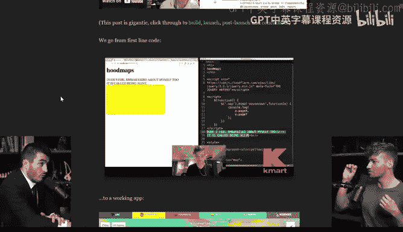

With the colors and I'll do like opacity 50， you know， so it kind of shows。😊。

So I did that with conos and then I started drawing。😊，And then I thought like。

 obviously other people need to edit this because I cannot draw all these things myself。

So I crosssource it again and you would draw on the map and then it would send the pixel data to the server。

 it would put it in the database。And then I would have a robot running like a cr job。

 which every week would calculate or every day would calculate like okay so Ems center。

 there's like six people say it's tourists this part of the center。

 but two people say it's like hipster so the tourist part wins It's an array So find the most common value in a little pixel area on a map so that most people say it's tourist is tourist and it becomes red and I would do that for you know all the GPS coordinates in the world can just clarify you have to be as a human that's contributing to this you have to be in that location to make the label or no people just type the cities and go like go beerk and start drawing everywhere would they draw shapes would they draw pixel man it drew like crazy stuff like offensive symbols。

 I cant mention they would draw penises I mean thats obviously would do the same thing draw penises That's the first thing when I show up to Mars and there's no cameras I'm drawing penis on the same man I do it in the snow know but the penises did not become a problem because I knew that not everybody would draw penis and not in the。

place so most people would use it fairly so just if I had enough crowd first data so you have all these pixels on top of it it's like a layer of pixels and you choose the most common pixel。

 So yeah it's just like a pole but in visual format and it works and within didn't a week got enough data and。

And it was like cities that did really well like Los Angeles。

A lot of people started using it like most data in Los Angeles because Los Angeles has defined neighborhoods and not just in terms of the the official labels。

 but like what they're known for what are the du did you provide the categories that they were allowed to use as labels。

 colors yeah as colors so it's used like I think you could see they there's like hipster tourists rich？

Business， there's always a business area right then there's a residential because this was gray。

 I thought those were the most common things in the city kind of and a little bit mimi like it's almost fun to label it Yeah。

 I mean， obviously it's simplified but you need to simplifyim it stuff。 you know。

 you don't want have too many categories and it's essentially just like like using a you know。

 paintb where you you select the color in the bottle and you select the category you start drawing。

 There's no instruction， there's no manual。😊，And then I also added tagging so people could like write something on a specific location so don't go here or like here's like nice cafes and stuff and man the memes that came from that and I also added uploading so that the tags could be uploaded so the memes that came from that is like amazing like people in Los Angeles would write crazy stuff it would go viral in all these cities you can allow allow your location。

And I will probably send you to Austin， okay， so we're looking。Oh boy， drunk hipsters。呃。Airb bros。

 airbro bros，s hipster girls who do cocaine， I saw a guy in a fishing costume get beaten up here。

 yep。That seems also overpri and unwhelming。😀Mmhh。😊，U，Let me see， let me make sure this is accurate。

 oh， let's see。Dirty6 for people who know Austin know that that's important to label the sixth treat is famous in Austin。

Dirty6 drunk fatadbo， accurate drunk fatad bros continued on six。

 very well known bros was six drunk douche bros f to douche douche， I mean。

 it's very accurate so far。They only let hot people live here。 that's。

 I think that might be accurate。It's like the district exerciseci freaks on the river。 Yeah。

 that's true。 Dog runners is accurate。Saw a guy in the fish costume get beat up here I w to know this story like so that's that's all user contributed Yeah。

 and this's like stuff， I couldn't come up with it because I don't know Austin。

 I don't know the memes here the stuff cultures and then me as a user can upload or down both this。

So this is completely cross because I Radit， you know。

 up for downvo took it from there and that's really， really， really powerful。

Single people with dog is accurate at which point did it go from colors to the actually showing the text。

I think I added the text like a week， a week after， and。

So here's like the pixels So that's really cool the pixels。

 how do you go from that that's a huge amount of data so there's we're not looking at an image where it's just。

A sea of pixels that call it different colors in a city。

 So how do you combine that to be a thing that actually makes it some sense I think here the problem was that you have this data。

 but it's like it's not。lockock to one location so I had to normalize it。

 So when you click when you draw on the map， it will show you the specific pixel location。

 and then you can convert the pixel location to a GPS coordinate like longitude but the number will have a lot of comms or a lot of decimals because it's very specific like this specific part of the table So what you want do is you want to take that pixel and you want to normalize it by removing like decimals which I discovered so that you're talking about this neighborhoods or this street so that's what I did I just took the decimals off and then I saved it like this。

 and then it starts going to like a grid。 and then you have like a grid of data you get like a pixel map kind and you said it looks kind of ugly then you smooth it。

 Yeah I started adding blurring and stuff。 I think now it's not smooth again because I people like the pixel look Yeah a lot of people use it and it keeps going viral And every time my maps bill like mapbox。

 I had to stop using first use Google Maps it went viral and Google Maps it was out of。😊。

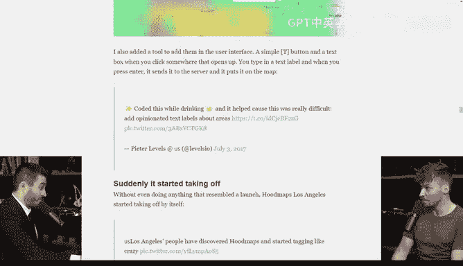

So and I had to so find it during when I launched it went viral Google Maps。

 the map didn't load anymore， it says over the limits， you need to contact enterprise sales。

And I'm like， I， but I need now like a map。 So， and I don't want to contact the enterprise sales。

 I don't want go and call schedule with some calendar。

 So I switched to Matbox and then had Matbox for years and then。

It went viral and I had a bill of $20，000 was like last year。

So they helped me with the bill they said you know you can pay less and then I now switch to like an open source kind of map platform。

 so it's very expensive for and never made any dollar money， but it's very fun。

 but it's very expensive， what do you learn from that？So like。

From that experienceca when you leverage somebody else's sort of through the API yeah， I mean。

 I don't think a map hosting service should cost this much， you know。

 but I could host it myself but that would be I don't know how to do that you know。

 but I could do that it's super complicated I think the thing is more about like you can't make money with this project I tried to do many things to make money with it than it's it's it hasn't worked you talked about like possibly doing advertisements on it or somehow but or people sponsoring it's really surprising to me that people don't want to。

Advertise on it。 I think map apps are very hard to like monetize like Google Maps also doesn't really make money。

 like sometimes you see these ads， but I don't think there's a lot of money there。

 you could put like a banner ad that's kind of ugly。

 And the product is kind of like it's kind of cool。

 So its it's kind of fun to like subsidize it it's kind of a little part of normalma list like I put it on normalma list in the cities as well。

😊，But I also realize like you don't need to monetize everything like some products are just cool and you know。

 it's like it's cool to have Ho maps exist。 I want this to exist right Yeah there's a bunch of stuff you've created that I'm just glad exists in this world is's true It it's a whole other puzzle and I'm surprised to figure out how to make money off of it I'm surprised maps don't make money but you're right it's hard It's hard to make money because' there's a lot of computer required to actually bring it to life also where do you put the ad right like if you have a website。

 you can put like a ad box or you can do like a product placement or something but you're talking about a map app that where 90% of the interface is a map。

So what are you gonna do， you're gonna like like it's hard to figure out where is this yeah and people don't want to pay for it No exactly because if you make people pay for it you lose 99% of the user base and you lose the crosssource data so it's not fun anymore it stops being accurate right so you kind of。

They pay for it by crowdsourcing the data。 But then， yeah， it's fine。 you know。

 it doesn't make money， but it's， it's cool。 But that said， noma list makes money。 Yeah。

 so what was the story behind No mad list。 So noma list started because I was in Chiang Mai in Thailand。

 which is now like the second city here。😊，And I was you know working on my laptop。

 I met like other momentss there and I was like okay。

 this seems like a cool thing to do like working on a laptop in a different country kind of travel around but back then the internet everywhere was very slow so the internet was fast and for example。

 Holland or United States， but in a lot of parts in you South America or Asia was very slow like 0。

5 megabits so you couldn't watch a YouTube video。Thailand weirdly had like quite fast internets。

 but I wanted to find like other cities where I could go to like work on my laptop or whatever and travel but we needed like fast internets。

I was like let's you know crowdsource this information with a spreadsheet and I also needed to know the cost of living because I didn't have a lot of money I at $500 a month。

 so I had to find a place where like the rent was like you know $200 per month or somewhere where I had you know some money that I could actually rent something and。

And there was noma list and it still runs now I think it's now almost 10 years。

 so it just to describe how it works like yeah， I'm looking at Chiang Mai here。

 there's a total score right number two， Yeah that's like a noma score 4。2 like by membersmb。

 but it's it's looking at the internet。In this case， it's fast， yet fun， temperature， humidity。

 air quality， safety， food safety。Cme racism or lack of crime， lack of racism， educational level。

 power grid， vulnerability to climate change， income level， it's little much， you know。

 English student it's awesome。It's awesome walkability keep stuff because for certain groups of people。

 certain things really matter and this is really cool happiness I'd love to ask about that that life。

Free Wifi AC。femalele friendly freedom of speech not so good inhailand。

 you know values derived from national statistics like how that one I need to do it because the data sets are using national they're not on city level right So I don't know about the freedom of speech between Bangkok or Chiang Mai I know it in Thailand。

 I mean， this is really fascinating。 So this is for city Yeah is basically rating all the different things that matter to in Internet and this is all crowdsourced Well so start crowdsourced。

 but then I realize that。You can download more accurate data sets from like public source like World Bank。

 they have a lot of public data sets United Nations， and you can download a lot of data there。

 which you can you know freely use like I started getting from across the data where， for example。

 people from India， they really love India and they would submit。

The best scores for everything in India and not just like one person but like a lot of people they would love to pump India and I'm like I love India too you know but that's not valid ofada so you started getting discrepancies in the data between where people wear from and stuff So I started switching to datas and and now it's mostly data sets but one thing that's still crowdsource is so people at where they are at their travels to their profile and I use that data to see which plays are upcoming and which places are popular now so about half the ranking you see here is based on actual digital nomas who are there you can click on the city you can click on people you can see the people。

 the users that are actually there and it's like 30。

000 or 40000 members so these people are in Austin now and 1800 remote work is in awesome now which8 plus members checked in members who be here soon so we have meetups so people organize their own meetups and we have about I think like 030 per month so it's like one meet up a day。

Don't do anything。 They organize themselves so I just。It's the whole black box。

 it just runs and I don't do a lot on it， it pulls data from everywhere and it just works。

Cons of Austin is too expensive， very sweat and humid now difficult to make difficult to make friends interesting。

 right， didn't know that difficult to make friends but this's all crowd。

 but mostly it's pros Austin pretty safe faster and I don't understand why it says not safe for women to check the data set it's still safe。

The problem with a lot plays like the United States is that it depends per area right so if you get like city level data or nation level data it's like Brazil is the worst because the range in like safe and wealthy and not safe is like huge so you can't say many things about Brazil so once they actually show up to the city。

How do you figure out what， what area like where to get fast internet， for example。

 like for me is oh it's consistently a struggle to figure out my cool hotels with fast wifi。

 for example， like a place， okay， okay， I show up to a city。

There's a lot of fascinating puzzles and I haven't figured out a way to actually solve this puzzle。

When I show up to a city figuring out where I can get fast internet connection。

And u for podcasting purposes where I can find a place with a table that's quiet， right。

 that's not easy structure sounds， all kinds of sounds。

 you get to learn about all the sources of sounds in the world。

And also like the the quality of the room because the more。

If the empty of the room and like if it's just walls without any curtains or any of this kind of stuff then there's echoes in the room anyway but you figure out that a lot of hotels don't have tables they don't have like normal it weird desk right Yeah it's not a center tableep and if you want to get a nicer hotel where it's more spacious and so on they usually have these like boutique like fancy looking like modernist annoying tables they don't to design these to design they're not real tables what if you get here。

Byy Ikea yeah， before you arrive， you order Ikea yeah like nomas do this， they get desks。

 I feel like you should be able to show up to a place and have have the desk like it's not unless you stay there for a long time。

 just the entire assembly， all that Airbnb is so unreliable it's the the range in quality that you get is is is huge。

Hotels have a lot of problems， pros and cons like hotels have the problem that the pictures somehow never have good representative pictures of what's actually going to be in the room and that's a problem like。

And you fake photos， man if I could have the kind of data you have I nomad list for hotels。

 Yeah and I feel like you can make a lot of money on that too。 Yeah。

 the booking fees feel is right I thought about this idea because we have the same problem like I go to hotels and there's specific ones that are very good and I know now the chains and stuff and but even if even if you go some chains are very bad in a specific city and very good in other cities and each individual hotel has a lot of kinds of rooms Yeah like some more expensive。

 some are cheaper and so on， but you can get the details of what's in the room。

 like what's the actual layout of the room， what is the view of I feel like as a hotel you can win a lot So first you create a service。

That allows you to have like high resolution data about a hotel。 Then one hotel signs up for that。

 I would 100% use that website to look for a hotel instead of the crappy alternatives that don't give any information。

 And I feel like there would be this pressure for all the hotels to join that site。

 And you can make a shit ton of money because hotels make a lot of money， I think it's true。

 But the problem is with these hotels like it's same airline industry。

 Why does every airline website suck when you try book a flight。

 Yeah like very strange like why does it have to suck obviously just competition here。

 Why doesn't the best website。 What's the explanation of that man， I thought about this for years。

 So I think it's like。I have to book the flight anyway。

 like I know there's a route that they take and I need to but book for example。

 Qatar airlines and I I need to get through this process so。The and with a hotel similar。

 you need a hotel anyway， So do you have time to like figure out the best one。

 Not really you kind of just need to get the place booked and you know。

 you need to get the flight and you'll go through the pain of this process And that's why this process always sucks so much with hotels and airline websites and stuff because they don't have any incentive to improve it。

Because generally only for like a super upper segment of the market， I think like super high luxury。

 it affects the actual booking right I don't know I think that's a interesting theory I think that must be a different theory my theory would be that great engineers like great software engineers are not allowed to make changes basically like there's some kind of bureaucracy there's way too many managers there's a lot of bureaucracy and great engineers show up to try to work there and they're not allowed to really make any contributions and then they leave and so you have a lot of mediocre software engineers they're not really interested in improving any other thing and like literally they would like to improve the stuff but the bureaucracy。

UmOf the place plus all the bosses all the high up people are not technical people probably they don't know much about what web dev they don't know much about programming so they just don't give any respect like you have to give the freedom and the respect to great engineers as they try to do great things that feels like an explanation like if you were a great programmer would you want to work at。

America Airlines are no。No，m， I'm torn on that because I actually。As somebody who lost program。

 we'd love to work at American Airlines。So I can make the thing better Yeah I would work there just a fix it for myself you know for yourself and then you just know how much suffering you alleviated society just imagine all the thousands maybe millions of people that go to that website and have to click like a million times it often doesn't work it's clunky all that kind of stuff you're making their life just so much better but there must be an explanation has to do with managers and bureaucracies like I don' I think it's money do you know booking it's the biggest booking website in the world it's Dutch actually and they have teams because my friend work they have teams for specific part of the website like 10 by10 pixels area where they run tests on this so they run tests like and they're famous for this stuff like oh there's only one room left which is letters like one room left book now know and they got to fine from the European Union about this kind so they have all these teams and they run the test for 24 hours they go to sleep they wake up next they come to the office and they see okay。

Perform better this website has become a monster， but it's the most revenue generating hotel booking website in the world number one。

So that shows that it's not about like user experience。 it's about like。Yeah。

 I don't know about making more money and， you know， not every company， but。

You know if they're optimizing it's a public comment。

 if they're optimizing for money but you can opt for money by disrupting like making it way better Yeah but it always starts they start with disrupting like booking all started start in 1997 and then they become like the old shit again like you know Uber now starts to become like a taxi again right it was very good in the beginning now it's kind of like taxis now in many places are better they're nicer than Ubers right so。

It's like this circle， I think some of it is also just。

It's hard to have ultra competent engineers like striptrie seems like a trivial thing。

 but it it's hard to pull off like why was it so hard for Amazon to have buy with one click。

 which I think is a genius idea， make buying easier like。make it as frictionless as possible。

 just click button one scene you bought the thing as opposed to most of the web was a lot of clicking and it often doesn't work like with the airlines remember if forms would delete you could click next submit and it would 404 or something or your internet would go down your modem Baman and I would have an existential crisis like the frustration would take over my whole body and I would just wanted to quit life for a brief moment there yeah I'm so happy to form stays in Google Chrome now when something goes wrong。

But Google somebody at Google and improved society with that， right？

Yeah and one of the challenges at Google is to have the freedom to do that they don't anymore there's a bunch of bureaucracy yeah so many brilliant brilliant people there。

 but it's just moves slowly Yeah and I wonder why that is that maybe that's the natural way of a company。

 but。You have people like Elon who rolls in and just fired most of the folks and always operate like push the company to operate as a startup even what it's already big。

 Yeah， but I mean， Apple does this like I started in business school。

 Apple does competing product teams that operate as startups so3 to5 people that make something they have multiple teams do make the same thing the best team wins So you need to I think you need to emulate like a free market inside a company to make it entrepreneurial you know you need entrepreneurial mentality in a company to come up with new ideas and do it better So one of the things you do really。

 really well。Is learn a new thing like you're trying to， you have an idea。

 you try to build it and then you learn everything you need to in order to build it。

 You have your current skills， but you need learn just the minimal model of stuff。

 So you're a good person to ask， like what。How do you learn？Yeah。

How how do you learn quickly and effectively in just the stuff you need you did just by way of example。

 you did a 30 days learning session on 3D where you documented yourself giving yourself only 30 days to learn everything you can about Yeah I tried to learn virtuality because I was like this was like same as AI it came up suddenly like 2016 2015 with I think HT5 this big VR glasses before Applevision Pro and I was like oh this is gonna be big so I need to learn this so I I know nothing about 3D I installed like I think unity and like blender and stuff and I started learning all this stuff。

Because I thought this was like a new， you know， nascent technology that was going to be big。

 And if I had the skills for it， I could use this to build stuff。

 And so if think it was learning from me it's like it。

I think learning is so funny because people always ask me like how how do I how do you learn the code。

 like， should I learn the code and I'm like。I don't know like I'm every day I'm learning it's kind cliche。

 but every I'm learning new stuff。 So every day I'm searching on Google or asking now chat GT how to do this thing。

 how to do this thing， Every day I'm getting better at my skill So you never stop learning。😊。

So the whole concept of like， how do you learn， Well， you never end。 So where do you want to be。

 Do you want to。Now， a little bit to the you want to know a lot。

 Do you want to do it for your whole life or so I think taking action is the best step to learn so making things。

Like， you know nothing。 Just start making things。 Okay， so like how to make a website， search。

 how to make a website or nowadays you ask GDPgBT， how do I make a website， where do I start。

 It generates code for you， right， copy the code， put it in a file， save it。

 open it in Google Chrome or whatever。 You have a website。

 And then you start tweaking with it and you start， how do I add a button and how do I。

Add AI features， right， like nowadays。 So it's like by taking action。

 you can learn stuff much faster than I reading books or。Likememorial， curious。

 let me ask perplexity， how do I make a website？I'm just curious what it would say。

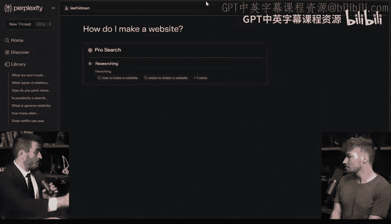

I hope it goes with like， really basic vanilla solutions。Toine your website's purpose。

 choose a domain name， select the web hosting provider， choose a website to builder or CMs website。

 build a platform Wix feels like Wix or Squarespace is what I said Yeah， landing page。What what do I。

 how do I say if I want to programming it， program it myself， design your website。

 create essential pages。 Yeah even tells you to launch it right like launch your website why mean you could do that Yeah。

 but this is literally is if you want to make basis like Google Analytic but you can't make nomas with this can with Wix like no。

 you can you can get pretty far I think you can website builds are pretty advanced。

 like only a great of images right that are clickable that open like another page you can get quite far。

How do I learn to program。😔，Choose a programming language to start with。Your free power is good。

Work through resources systematically。Practice calling regularly。For 30， 60 minutes a day。

 consistency is key join programming communities like Reddits yeah。Yeah， it's pretty。

 it's pretty good。 Yeah， it's pretty good。 So I think it's。

 it's a very good starting ground because imagine you know nothing and you want to make a website。

 you want to make a startup。This is like that' why the man the power of AI for education is gonna be insane like people anywhere can can ask this question and start building stuff Yeah。

 it clarifies it for sure and just start building like keep yeah build build like actually apply the thing whether it's AI or any of the programming for web development yeah just have a project in mind which I love the idea of like。

12 dis in 12 months or like。Build a project almost every day just build a thing and get it to work and finish it every single day that's a cool experiment I think that was an inspiration There was a girl who did 160。

Websites in 160 days or something like lit mini websites and。And she learned to code that way。

 So I think it's good to set yourself challenges， you know， like don't。

 you can go to some coding boot campm， but I don't think they actually work。

 I think it's better to do like for me LTD dark like self learning。😊。

And setting yourself like challenges and just。Getting in it， but you need discipline， you know。

 you need discipline to keep to keep doing it and coding， you know， coding is very。

 it's a steep learning curve to get in， it's very annoying working with computers is very annoying。

So it can be hard for people to keep doing it， you know？Yeah。

 that thing of just keep doing it and don't quit that urgency that's required to finish a thing that's why it's really powerful when you documented this。

 the creation of hood mapps or like a working prototype。That there is a。Just a constant frustration。

 I guess， is like a。How do I do this and then you look it up and you're like， okay。

 you have to interpret the different options you have you're like and then just try it and then and then there's a dopamine rush of likeoo it works cool man。

 it's amazing and it's something I live streamed it。It's on YouTube and stuff。

 people can watch it and it's amazing when things work。It's look。

 it's just like a meaning that you I look very not， I don't look far ahead， so I only look， okay。

 what's the next problem to solve and then the next problem？And at the end。

 you have a whole app or website or thing， you know， but I think most people look way too far ahead。

 you know， they look， it's like this poster again， like you shouldn't。

 you don't know how hard it's gonna be， so you should only look like for the next thing。

The next little challenge， the next step， and then see where you end up and assume it's going to be easy。

Yeah， exactly， be naive about it because's it's you're going to have very difficult problems。

A lot of the big problems won't be even tech will be like public， right。

 like maybe people don't like your website like you will get cancelled for a website， for example。

 like a lot of things can happen Was it like building in public like you do like openly。

We're just iterating quickly and you're getting people's feedback so there's the power of the crowdsourcing。

 but there's also the negative aspects of people being able to criticize。So man。

 I think haters are actually good because I think a lot of haters have good points and it takes like stepping away from the emotion of like your website sucks because blah。

 blah， blah， and're like okay， just remove this your website sucks because its personal you know。

 what did he say why did he didn't not like it and you figure out okay， you didn't like it because。

The sign up was difficult or something or it wasn't the data。

 they say no this data is not accurate or something right， okay， I need to improve the quality data。

 this hater has a point。I think it's dumb to completely ignore your haters， you know， and also yeah。

Man， I think I've been there when I was like 10 years old or some of you're on the internet just shouting crazy stuff that's like most of Twitter you know or the half Twitter So you have to take a of a grain of salt Yeah。

 man， you need to grow a very thick skin like on Twitter on X like people say but I'm mute a lot of people like I found out I'm muted already 15000 people recently I checked。

So in in 10 years， I moved 150，000 people， so it's like like that's one by one manual，15， yeah， oh。

 so 1500 people per year。And I don't like to block because then they get angry they make a screenshot and they say。

 ahh you block me， so I just mute and I disappear and it's amazing。See mentioned Reddit。

 so hood maps。That make it to the front page about it。 Yeah， yeah， did。 Yeah， yeah， yeah， it did。

 It was amazing。 And my server almost went down。 and I was checking like Google analyticslytic was like 5000 people on the website or something were crazy。

 And it was at night and was amazing。😊，I man， I think nowadays， honestly Tiktk YouTube reels。

 instant reels， a lot of apps get very big from people making Tiktok videos about it。

 So let's say you make your own app， you can make a video for yourself I made this app this is how it works bla blah and this is why I made it for example and this is why you should use it and if it's a good video will take off and you will get man I got like。

$20000 extra per month for something from a Tiktk from one Tiktok video like it made a photo I by you or somebody else by some random guy。

 So there's all these AI influences that that they write about they show AI apps and they and they ask money later like when abe video goes all I can do it do it again and send me $4000 or something I'm like okay I did that for example。

 but it works like。😊，Tiktok is a very big platform for user acquisition。 Yeah， and organic。

 like the best user acquisition， I think is organic。 You don't need to buy ads。

 You probably don't have money when you start to buy ads。 So use organic or write a bang or tweets。

 right that's。can make an app take off as well， well， I mean， yeah， fundamentally create cool stuff。

And have just a little bit of a following enough to like。

For for the cool thing to be noticed and then it becomes viral it's cool enough。 Yeah。

 and you don't need a lot of followers anymore because on X and a lot of platforms because Tiktok X I think it's real。

 Also they have the same algorithm now it's not about followers anymore。

 It's about they test your content on a small subset like 300 people if they like it it will get tested to00 people and on and on So if the thing is good it will rise anyway。

 It doesn't matter if you have half many followers or10 followers around What's your philosophy of monetizing how to make money from the thing you build Yeah so a lot of start they do like free users you could sign up you use an app for free which is。

It never worked for me well， because I。I think free users generally don't converts and I think if you have VC funding。

 it makes sense to get free users because you can spend your funding on ads and you can get like millions of people come in predictably how much they convert and give them like a free trial or whatever and then they sign up but you need to have that flow worked out so well for you to make it work that you need like it's very difficult I think it's best to start and just start asking people for money in the beginning so show your app like what are you doing in your landing page like make a demo or whatever video and if you want to use it。

 pay me money， pay $10，$20，$3。I would ask more than $10 per month， like Netflix is like$10 per month。

 but Netflix is a giant company。 They can， you know， they can afford to make it so cheap。

 relatively cheap。 if you're an individual like an in hackr， like you are making your own app。

You need to make like at least $30。Or more on a user to make it worthy for you。

 you need to make money， you know， and it builds a community of people that actually really care about the product。

 Also， yeah， making a community like making a discord is very normal Now。

 every AI app has a discord and you have the developers and the users together in like a discord and they talk about They ask for feature they build together is very normal now and。

And you need to imagine like if you're if you're starting out getting a thousand users is quite difficult。

 getting00 pages is quite difficult。If you charge them like 30。

 you have 30 k a month it's a lot of money that's enough to like live a good life Yeah live a pretty good life I mean that could be a lot of costs associated with host that's not a thing I make sure my profit margins are very high so I try to keep the cost very low。

 I don't hire people。I。I try to negotiate with like AI vendors now like can you make it cheaper you know。

 which is I discovered this you can just email companies and say can you give me discount because too expensive and they say sure。

 50% I'm like wow， very good and I didn't know this you can just ask and especially in like like now it's kind of recession you can ask companies like I need a discount or I kinda need to like you don't need to be asshole about it say know I kind of need a discount or I need to go maybe to in other companies maybe like there a discount like here and there and they say sure。

 a lot of them will say yes， like 25% discount，50% discounts。

Because you think the price on the website is the price of the API or something it's not。You know。

 and also， you're a public facing person。 that helps also。

 And there's love and good vibes that you put on into the world。 Like。

 you're actually legitimately trying to build cool stuff。

 So a lot of companies probably want to associate with you because you're trying to do。 Yeah。

 it's like a secret heck。 But I think even without heck。 they give person。

 the be how much discount they will give。 you know， they'll maybe give more。But， you know。

 that's why you should shit post on Twitter。 So you get， you know， discounts， maybe。Yeah， yeah。

 but and also the one is crowdsourced。I mean， paying does prevent spam or help prevent spam Also yeah。

 yeah it gives you high quality users high quality free users are。Sure。

 but they're horrible like it's just like millions of people， especially if AI startups。

 you get a lot of abuse， so you get millions of people from anywhere just abusing your app。

 just just hacking it and whatever like there's something on the Internet you mentioned like Forchan discovered hood maps but I love For I don't love For。

 but you know what I mean like they're so crazy especially back then like that's it's kind of funny what they do。

 you know actually what is it there's a new documentary on Netflix antisocial network or something like that that was really was fascinating just Forchan just。

You know， the spirit of the thing fortune misunder fortune is so much about freedom and also like the humor。

Involved in fucking with the system and fucking with the man it's just antiy， but for fun。

 the dark aspect of it is you're having fun， you're doing antiyem stuff。

 but like the Nazis always show up and its somehow that shit started happening and drifting somehow yeah it school shootings and stuff so。

It's a very difficult topic， but I do know。Especially early on， I think 2010。

 I would go to4n for fun。 And they would post like crazy offensive stuff。

 And this was just to scare off people。 So we show to other people say hey。

 do you know this Internet website 4 and just check it out and it what the fuck is I'm like， no， no。

 you don't understand。 to scare you away。 But actually when you go through。

 scroll there's like deep conversations。 and they they would already be。

 this was like a norm filter like to stop，😊，So kind of cool。 but yeah， goes dark。 it goes dark。

 And if you have those people show up， they'll for the fun of it。

 do a bunch of racist things and all that kind of stuff you're saying。

 But everything's I think it was never， man， I'm not fortunate。

 but like I it was always about provoking。 It's just procate you know。

 but the the provoking in the case of hood maps or something like this can can damage the。

A good thing like you know， a little poison in a town is always good。 It' like the Tom Waits thing。

 but you don't want too much otherwise it destroys the town it destroys this thing。

 they're kind of like pen testers you know like penetration testers hackers they just test your ad for you and then you add some stuff like I add like I had like NSFW word list they would say like bad word so when they would write like a bad words they would get forward to YouTube which was like a video was like a very relaxing video that like kind of AR with like glowing jelly streaming like this to relax them you know or cheese melting on the cheese chill I like it like。

But actually， a lot of stuff， I didn't realize how much originated in4chan in terms of memes I didn' Rick roll。

 I didn't understand， I didn't know the Rick roll originated in4chan like there's so many memes。

 like most of the memes that you think word role， I think comes4chan like not the word row。

 but like in this case in meme use like you would get like row doubles because every it was like post ids on4chan So they were they were kind of like random So if I get doubles like this happens for something So youd get like22。

Anyway， it's like a betting market kind of on these doubles on these post Is。

 this so much funny stuff。Yeah， I mean， that's the Internet that's purest， but yeah。

 again the dark stuff kind of seeps in Yeah and you you it's nice to keep the dark stuff to like some low amount。

 it's nice to have a bit of noise of the darkness but not too much Yeah and but again。

 like you have to pay attention to that with I mean I guess spam in general。

 you have to fight that with no mad list how do you fight spam man I use G4 now it's amazing so。

So I have like user input have reviews， people can review cities and I don't need to actually sign up it's anonymous reviews and they write like whole books about like Cs and what's good and bad so I run it through GPT for now and I ask like is this a you know is this a good review like is it offensive。

 is this racist or some stuff and and it send me message Telegram when it rejects reviews and I check it and it's man it's so on point it's automated yes and it's so accurate it understands double meanings？

I have G4 running on the on the chat community。 it's a community of 10000 people and they're chatting and they start fighting with each other。

 and I used to have human moderators was very good。

 but they would start fighting the human moderator like this guy's biased or something。

 now I have G4 and it's it's it's really， really， really， really good。 It understand humor。

 it understand like。Like you could say something bad。

 but it's kind of like a joke and it's kind of not like offensive so much so shouldn't be deleted right and understands that you know I would love to have a G4 based filter of like of different kinds for like X Yeah I thought this week like I tweet it like a fact check like you can click fact check and then G4 look G4 is not always right about stuff but it can give you a general fact check on a tweet like usually what I do now when I write something like difficult about economics or something AI I put in G4 say can you fact check it because I might have said something stupid and the stupid stuff always gets taken out by the reply like oh you said this wrong and then the whole tweet kind of doesn't make sense anymore so。

I asked GT for to fact check a lot of stuff。 So fact check is a tough one， Yeah。

 but it would be interesting to sort of。Rate a thing based on how well thought out it is and how well argued it is。

 Yeah， that that seems more doable。 That seems like more doable。

 Like it seems like a G thing because that it's less about the truth And it's more about the rigor of the thing。

 Exactly。 And you can ask that。 You can ask him to prompt like。I don't know， like， for， do you think？

Create like a ranking score X Twitter replies where I should dispose be if we rank on like。

 I don't know， integrity， reality， like fundamental deepness or something interestness。

 And it will give you that with a pretty good score probably。 I mean， Elon can do this with Cro。

 right， It can start doing using that to。To check replies because the reply section is like chaos Yeah。

 you know， and actually the ranking the reply not doesn't make any sense。

 doesn't make sense and I I like to sort in different kinds of ways。 Yeah。

 and you get too many replies now， if you have a lot of followers I get too many replies。

 I don't see everything。 And I I。I love stuff is I just miss and I don't I want to see the good stuff and also the notifications or whatever is's just complete chaos。

 Yeah， it'd be nice to be able to filter that in interesting ways， sort of in interesting ways。

Because like I feel like I miss a lot and I what's surfaced for me I just like a random comment by a person with no followers that's positive negative。

 it's like okay， if it's a very good comment it should happen。

 but it should probably look a little bit more like to these people are followers because they're probably more engaged in the platform right or no if it's I don't even care about how many followers if you're ranking by the quality of the comment great yeah but not just like randomly like chronological just the C of comments。

 it doesnt make sense， yeah， X could be very proof of that I think。One thing you you espouse a lot。

 which I love is the automation step。So like once you have a thing。

 once you have an idea and you build it and it actually starts making money and it's making people happy。

 there's a community of people using it。You want to take the automation step of automating the things you have to do as little work as possible for it to keep running indefinitely can you like explain your philosophy there what you mean by automate Yeah so the general theory of starters would be that when it starts like you start making money you start hiring people to do stuff right do stuff that you like marketing for example stuff that you would do in the beginning yourself and whatever community management and organizing meetups forOMma this for example there would be a job for example and I thought like I don't have the money for that and I don't really want to run like a big company with a lot of people because there's a lot of work managing these people。

So I've always tried to like automate these things as much as possible。And。

And this can literally you be like for nos it's literally you like it's not a different in other stars。

 it's like a web page where you can organize your own meetup， set a schedule a date。

 whatever you can see how many nomas will be there at that date so you know there will be actually enough nomas to meet up and then when it's done it sends a tweets out on the noist account there's a meetup here it sends a direct mess to everybody in the city who are there who are gonna be there and then people show up on a bar and there's a meetup and that's fully automated and for me it like it's so obvious to make this automatic would why would you have somebody organize this like。

It makes more sense to auto it。 And this with most of my things， like。

 I figure out like how to do it with codes。And I think especially now with AI like you can automate so much more stuff than before because AI understands things so well like before I would use if statements right now you ask GP。

 you put something in GP for and in the API and it sends back like this is good， this is bad Yeah。

 so you basically can now even automate。Sort of subjective type of things。

 This is the difference now。 that's very recent， right， But it's still difficult to。 I mean。

 that step of automation is difficult to。Figure out how to。

Is you're basically delegating everything to code and it's not trivial to take that step for a lot of people。

 So when you say automate， are you are you talking about like。Cn jobs， yes， you man。

 a lot of cr jobs， a lot of jobs it's like。I literally I log into the server and I do like pseudochroron tab E and then I go into editor and I write like hourly and then I write PhP you know。

 do this thing。phP and that's a script and that script does a thing and it does it then hourly that's it and that's how all my websites work。

 do you have a thing where it like emails you something like this or emails somebody managing a thing if something goes wrong。

I have these web pages I make they are called like health checks， so it's like healthche。

phP and then it has like emojis like has like a green check mark if it's good and I read one if it's bad and then it does like database curious for example。

 like what's the internet speed in for example， Amdam？

Okay it's a number it's like 27 point megabits so it's accurate number okay check good and it goes to the next and it goes on all the data points did people sign up in the last 24 hours it's important because maybe the sign up broke check something sign up and I have uptime robotbo co which is like for uptime but it can also check keywords it checks for an emoji which is like the red X which is if something is bad and so it opens that health check page every minute to check if something is bad then if it's bad it sends a message to me on telegram saying hey what's up or doesn't say hey。

 what's it sends me like alert this thing is down and then I check so within a minute of something breaking I know it and then I can open my laptop and fix it but the good thing is like the last few years things don't break anymore。

Like definitely 10 years ago when I started， everything was breaking all the time。

And now it's like almost it's last week， its like 100。0 or 0% uptime。

And these health checks are part of the uptime percentage。

 so it's like everything works you actually making me realize I should I should have a page for myself like one page that has all the health checks just so I can go to and see all the green check marks just feels good to look at me it just be like okay。

 yeah， all right like we're okay。Everything's okay， Yeah。

 and like you could see like when was the last time something wasn't okay and it'll say。

Like never or like meaning like you've you've you've you've checked since you've last cared to check。

 it was all been okay for sure， it' used to send me the the good health checks like yeah。

 you know it all works it all works but its it all works so often and I'm like it feels so good but then I'm like。

 okay， obviously it's not gonna mean to hide the good ones and show one the bad ones and now that's the case I need to integrate everything into one place that automate like everything yeah also just a large。

h set of cry jobs， a lot of the publication， this podcast is has done all that everything's just on automatically。

 it's all clipped up all all all this kind of stuff。But it would be nice to automate even more。

Like translation， all this kind of stuff would be nice to automate Yeah every JavaScript。

 every PhP error gets sent to my telegram as well， so every user。

 whatever user is doesn't have to be page user， if they run into an error。

 the JavaScript sends the JavaScript error to the server and then it sends to my telegram。

From all my websites。So you get like a message so get like a unco variable error， whatever blah。

 blah， blah， and then I'm like， okay interesting and then I go check it out and that's like a way to get to zero errors because you get flooded with errors in the beginning and now it's like nothing almost。

😊，So that's really cool but but that's really cool but this is the same stuff people they they pay like very big Sa companies like new relic for right like to manage the stuff so you can do that too you can use off the shelf I like to build myself it's easier it's nice it's nice to do that kind of automation。

I'm starting to think about like， what are the things in my life I'm doing myself that could be automated。

Uh in askgbT when you know like give your daily your day and then ask what parts you to automate well。

 one of the things I I would love to automate more is my consumption and social media， yeah。

 both the the output and the input。Man， that's very interesting I think there's some starters that do that like they they summarize the cool shit happening on Twitter。

 you know， like with AI I think the guy called S W Y X or something he does like a newsletter that's completely AI generated We have the cool the cool new stuff in A Yeah。

 I mean I would love to do that， but also like across Instagram。

 Facebook LinkedIn Yeah all this kind of stuff just like okay。

 can I can you summarize the internet for me。

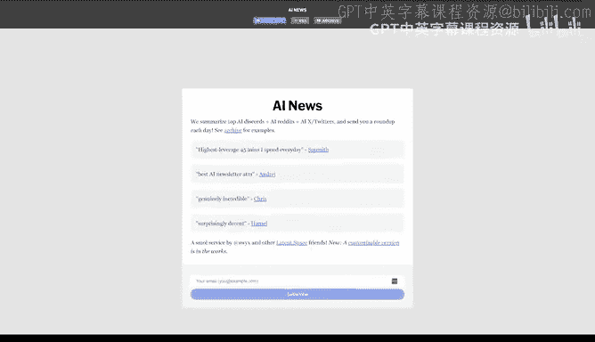

For today， summarize internet。com， yeah。com because I feel like it pulls't way too much。Time。

 but also like I don't like the effect that has some days on my psyche because like haters or or just general content just politics like no。

 no， no， just general， like for example， like Tiktk is a good examples of that for me I sometimes just feel dumber after I use Tiktk。

 I just feel like I don't use it anymore empty somehow and I'm like uninspired Yeah it's funny in the moment I'm like。

 I look at that cat doing a funny thing。And then you're like， oh。

 look at that person dancing in a funny way to that music And then you're like10 minutes later。

 you're like， I feel way dumber and I don't really want to do much for the rest of the day。

 My girlfriend S， she saw me like watching some dumb video。 She's like。

 dude your face look so dumb as well。 your whole face starts going like oh interesting， you know so。

I mean， with social media， with X sometimes for me too。

I think I'm probably naturally gravitating towards the drama Yeah aren we all yeah。

 and so following AI people， especially aI people that only post technical content has's been really goodca then I just look at them and and then I going down rabbit holes of like learning new papers have been published or good reoss or just any kind of cool demonstration of stuff and the kind of things that they wetweet and that's the rabbit hole I go and I'm learning and I'm inspired all that kind of stuff。

It's been tough， it's been tough and control difficult。

 you need to like manage your your your platforms， you know， I have a mute board list as well。

 so I mute like politics stuff because I don't really want it on my feet and。

I think I'm muted so much as now my feed is good， you know。

 I see like interesting stuff and but the fact that you need to modify。

 you need to like mod your app， your social media platform just to function and not be toxic for you for your mental health right That's like a problem like it should be doing that for you at some level of automation that would be interesting。

 I wish I could。😊，Access X and Instagram through API easier you need to spend $42000 a month which my friends do but still even if you do that that you're not getting。

 I mean， there's limitations that don't make it easy to do like automate because the thing they're trying to limit like abuse or for you to steal all the data from the app to then train an LLM or something like this。

 but if I just want to like figure out ways to automate my interaction with the X system or with Instagram they don't make that easy but I would love to sort of automate that and explore different ways to how to leverage LLMs to control the content I consume。

And maybe publish that， and maybe they themselves can see how that could be used to improve their system。

 so， but there's not enough。A you could screen up your phone right it can be an app that washees your screen with you you couldnt yeah but I don't even know like what it would do like maybe it's can hide stuff before you see it you know like I have I have Chrome extensions I write a lot of chromrome extensions that hide parts of different pages and so on for example for my own my main computer I hide all views and lights and all that on and。

YouTube content that I create so that I don't it doesn't yeah。

 so you don't pay attention to it I also high parts there I have a mode for X where I hide most of everything so like there's no。

It's same with YouTube I have this extension like well I wrote my own because it's easier because it keeps changing it's like it's it's not easy to keep it dynamically changing but they're really good at like getting you to be distracted and like starting related stuffm like I don't want related and like 10 minutes later you're like or something that's trending I have a weird amount of friends addicted to YouTube and I'm not addicted I cause my attention span is too short for YouTube but。

But I have this extension to like YouTube on Hook， which like it hides all the related stuff。

 I can just see the video and it's amazing。But sometimes I need to like like I need to search a video how to how to do something。

 and then I go to YouTube and then I had these YouTube shorts these YouTube shorts are like they're like algorithmally designed to just make you tap them and I tap and then I'm like five minutes later with this face and' you're just talking I need like what happened I was gonna。

Open， I was gonna play like the coffee mix， you know。

 like the music mix for drinking coffee together like in the morning a jazz。

 I didn't want to go to shorts。 So it's it's very it's very difficult。

I love how we're actually highlighting all kinds of interesting problems that all could be solved at a startup Okay。

 so what， what about the exit， when and how to exit？M。

 you shouldn't ask me because I never sold my company and've never all the successful stuff you've done。

 you never sold it。 Yeah it's kind of sad right like I've been in so I've been in in a lot of acquisition like deals and stuff and I learn a lot about finance people as well there like manipulation and due diligence and then changing the valuation like people change the evaluation after so a lot of people string you on to acquire you and then it takes like six months It's like classic It takes six to 12 months they want to see everything they want to see your stripe and your code and whatever。

And then in the end， they'll， they'll change the price to lower because you're already so invested。

 So it's like a negotiation tactic， right and I'm like， no。 And I I don't wantan to sell， right？

 And the problem with my companies is like they make。You know，90% profit margin。 So the multiple。

 the companies get sold with multiples kind of multiples of profit or revenue。

 and often the multiples like three times three times or four times or five times revenue or profit。

 So in my case。They're all automated。 so I might as well wait three years and I get the same money as when I sell。

 and then I can still sell the same company。 you know， I mean I can still sell for three five times。

 So financially， it doesn't really make sense to sell Yeah， unless the price high enough。

 like if the price gets select 6 or7 or 8， I don't want to wait six years for the money you know。

 but if you give me three like three years nothing like I can wait let mean the really valuable stuff about the companies you create is not just the interface and。

😊，And the crowdsource content， but the people themselves like the user base。 Yeah， it's a community。

 Yeah so I could see that being extremely valuable。

 is like it's like my babies like my first product it took off and I don't really know if I want to sell it's like something would be nice when you know when you're old to just still work in this it's like it has like a mission which is like people should travel anywhere and they can work from anywhere and they can meet different cultures and that's a good way to make the world get better if you if you go to China and live in China。

 you'll learn that they're nice people and a lot of stuff you hear about China's propaga。

 a lot of stuff is true as well。 but it's more you know you learn a lot from traveling and I think that's why it's like a cool product to like not sell AI products I have less emotional feeling with AI products like photo which I could sell thing you also mention is you have to price the fact that you're going to miss。

Yeah， the company and meaning it gives you right this's a very famous like depression after started on a solar company like they're like this was my this was me like who am I and they immediately start building another one you know。

 they can never stuff so I think it's it's good to keep working you know until you die just keep working cool stuff and you shouldn't retire you know。

 I think retirement is bad probably so you usually build this stuff solo and mostly work solo。

What's the thinking behind that， I think I'm not so good working with other people。

 not like I'm crazy， but like I， I don't trust other people to clarify。

 you don't trust other people to do a great job。Yeah。

 and I don't want to have like this consensus meeting where we all like。You know。

 you have like a meeting with three people and then you kind of get this compromise results。

 which is very European， like it's very ho we called Poder model where you put people in the room and you only let them out when they agree on the compromise right in politics and I don't think I think it breeds like averageness you know you get average idea average company。

 average culture。嗯。You need to have。Like a leader or you need to be solo and just do it， you know。

 do yourself， I think， and I trust some people。 like now I， like with my best friend， Andre。

 I'm making a new AI startup， but it's because we we know each other very long。

 And he's one of the few people I would build something with And but almost never。

 So what does it take to be successful when you have。😊。

More than one like how do you build together with Andre， how do you build together with other people。

 So he codes I should post on Twitter literally like I promoted it on Twitter。

 I we said like product strategy， like I said this should be better， this should be better。

 but I think you need to have one person coding it。 he codesing Ruby So I cannot do Ruby。

 I'm in PP literally So you had you ever coded with another person for prolonged periods of time。

 Never my life。So。what do you think is behind that I know I was always just me sitting on my laptop like like coding no like you've never had another developer who like rose in and like I've had a once whatever Photoi like there an AI developer Philip I hired him to do because I can't write pyon and AI stuff as pyon and I needed to get models to work and replicate and stuff and I needed to improve photoi and he helped me a lot for like 10 months he worked and man。

 I was trying pyon working with Ny and package manager and it was too difficult for me to figure this shit out and I didn't have time like。

I think 10 years ago， I would have time to like sit。You know。

 go do old nighters to figure this stuff out with Python。 I don't have the， and I don't have the。

It's not my thing It's not your thing， It's another programming language I get it AI new thing got it Well like you never had a developer role in look at your PhPJ query code and and yes。

 like you know like in conversation or probably talk about yes and like basically all right had for one week understand and then and because he wanted to rewrite everything in no that's the wrong guy I know you wanted to rewrite what you wanted to rewrite you said this j we can't do this I'm like okay he's like we need to rewrite everything in you you I'm like are you sure I just like you know like keep Jque like no man like and we need change a lot of stuff and I'm like okay and I was gonna like feeling it like you know we're gonna clean up shit but then after week it's not gonna it's gonna take way too much time I think I like working with people where like when I approach them。

I pretend in my head that they're the smartest person was ever existed so I look at their code or I look at the stuff they've created and try to see the genius of their way。

 Like you really have to understand people like really notice them like and then from that place have a conversation about what is the better approach Yeah。

 but those are the top tier developers Yeah and those are the ones that are on tech ambiguous so they can work with they can learn any tech tech they can that's like really few like like top5% because if you try Harry devs。

 like no offense to devs， but most devs are not man。

 most people in general jobs are not so good at the job。

 like even doctors and stuff when you realize this people are very average at the job especially with dev coding I think so sorry I think that's a really important skill for developer to roll in and like understand the musicality the style and like empath like both empathy code empathy Yeah new word。

 but that's it。 you need to understand like。Go over the code， get a holistic view of it。Mtt。

 you can suggest we we change stuff for sure but and look jquery is crazy。 crazy。 I'm using jquery。

 we can change that。 It's not crazy at all。 Jquery is also like beautiful and powerful and PhP is beautiful and powerful。

 especially as you said recently in as the versions evolved it's much more serious programming language now it's super fast like PhP is really fast now it's crazy jascript much Ru really fast now So if speed is something you care about it's super fast and like there's gigantic communities of people using those programming languages and there's frameworks if you like the framework So whatever it doesn't really matter what you use but like also。

You， if I was like a developer working with you， like you are extremely successful。

 you've shipped a lot so like。If I roll in， I'm going to be like， I don't assume you know nothing。

 assume Peter is a genius like the smartest developer ever and like learn learn from it and yes and like。

Notice parts in the code where like， okay， okay， I got it like here's how he's thinking。

And now if I want to add another like a little feature， definitely needs to have emoji。

Yeah man in front of it and then like just follow the same style and add it。

 And my goal is to make you happy， to make you smile， like to make you like fuck I get it。

 And now you're going to start respecting me and like trusting me and like you start working together in this way I don't know I don't know how hard is to find developers I think exist I think you need to I need to hire more people need to try more people but that costs a lot of my energy and time but it honestly impossible do I want it I don't know things kind of run fine for now and I mean。

 like okay you can say like okay normally looks kind of clunky like people say the design is okay I'll improve the design It's like。

Next am I to do list， for example， you know， like I can I'll get there eventually， but it's true。

 I mean， you're also extremely good at what you do Like I'm just looking at the interfaces of like photo AI like you would Jake like jquery。

 right， like how amazing is jaquery。 but like you can these cowboys are getting。😊。

These are there's these cowboys。This is a lot， this is a lot。

 but I'm glad they're all wearing shirts anyway， the interface here is just really， really nice。Like。

 I could tell you know what you're doing。 And with no mad list。Extremely nice。 The interface。

 Thank you， ma'am。 And that's all you。 Yeah， this everything is me。😊。

So all of this and every little feature， people say this looks kind of ADhD or ADD， you know。

 like it's so much。Because it has so many。Fs and designer's days is minimalist right right I hear you。

 but this is a lot of information and it's useful information and is delivered in a clean way while still stylish and fun to look at So like minimalist design is about like when you want to convey no information whatsoever and look cool very cool It's pretentious right pretentious or not the function is like is useless this is about a lot of information delivered to you in a clean and when it's clean。

 you can't be too sexy so it's sexy and enough Yeah this is I think how my brain looks， you know。

 like it's love shit going on like drawing based music it's like very。Yeah， but it's still。

 the spacing of everything is nice， the fonts are really nice。

Like very readable very I like it you know， but I made it so I don't trust my own judgment。 No。

 this is really nice。 Frank emojis are somehow like this is a style。 It's a thing。

 I need to pick the emoji It takes a while to pick them you know like there's some。

 something about emoji is a really nice， memorable like。😊，Placeholder for the idea。 Yeah。

 like if it was just text， it would actually be overwhelming if you was just text。

 the emoji really helps。 It's a brilliant addition。Like some people might look at it。

 Why do you have emojis everywhere。 It's actually really， for me。

 it's really difficult to remove the emo。 Yeah， what people don't know what they're talking about。

 And then theque。I'm sure people will tell you a lot of things。

 this is really nice and then using color is nice， small font but not too small and obviously you have to show maps which is really tricky。

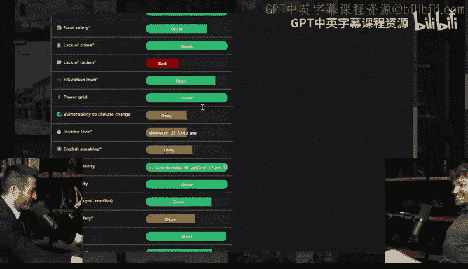

Yeah， this is this is written now， this is really， really， really nice and all of， I mean， like okay。

 like how this looks when you u hover over it like exist transitions now I understand that， but like。

I'm sure there's like how long does that take you to figure out how you wanted to look do you ever go down rabbit hole where you spent like two weeks No。

 it's so iterative it's like 10 years of。You know， at a CSs transition here or do days or what was say like see theses are all these rounded now。

 Yeah if you wanted to like round is probably the better way。

 but if if you wanted to be rectangular like sharp corners。

 what would you do so I go to the index at CSS and I do come on F and I search border Radius 12 px and then I replaced with border Radius 0。

And then I do command enter， and its Git deploys， it pushes to the Git hubub and then sends a webbook and then deploys to my server and it's。

Live in five seconds， Oh you often deploy to production you don't have like a testing ground。

 no so way。So I'm like famous for this。I'm too lazy to set up like a staging server on my laptop every time。

 So nowadays I just deploy to production and I'm gonna cancelled for this you know。

 but it works very well for me because I have a lot of have like PhP Li and Jay Li So it tells me in as error I don't deploy but literally I have like 37000 Gi commits in the last1 months or something So make like small fix and come on enter and sense to get Gi web to server server pulls it deploys the production and as there what's the latency from you pressing one second can be one two seconds make change and then you getting really good at like not making mistakes10 right people are like how can you do this you get good at not taking the server down because you need to code more carefully but it's。

😊，Look， it's idiotic in any big company， but for me， it works because it makes me so fast。

 like somebody will report a bug on Twitter。And I kind of did do like a stopwatch。

 like how fast can I fix this bug and then two minutes later， for example， it's fixed yeah。

And it's fun because it's because it's annoying for me to work with companies where you report a bug and it takes like six months。

 It's like horrible。 and it makes people really happy when you can。😊。

Really quickly solve the problems。 so but it's it's crazy。 I don't think it's crazy。

 I mean there's I'm sure there's a middle ground， but I think that whole thing where there's a phase of like testing and there's the staging and there's and then there's like multiple tables and databases that you use for the's's a mess there's different teams involved it's no good I'm like a funny extreme on other but just a little bit safer but not too much would be great Yeah and I'm sure that's actually like how how they doing rapid improvement more bugs complain about like oh look he bought this Twitter now it's full of bugs shipping stuff like things are happening now and it's a dynamic app now the bug is actually a sign of a good thing the because it shows that the team is actually building10 one of the problems is like I see with YouTube there's so much potential to build features but I just see how long。

so I've gotten the chance to interact with many other teams。

 but one of the teams is MLla multi language audio， I don't know if you know this。

 but in YouTube you can have audio tracks in different languages for overwhelminging。

And that there's a team and not many people are using it， but like every single feature。

 they have to meet and agree and like there's allocate resources， like engineers have to work on it。

 but I'm sure it's a pan the ask for the engineers to get approval to like because it has to not break the rest of the site。

 whatever they do。But like， if you don't have enough dictatorial， like top down。

 like we need this now， it's going to take forever to do anything multi language audio。

 but multi language audio is a good example of a thing that seems niche right now。

But it quite possibly could change the entire world when you have when I upload this this conversation right here。

 if instantaneously it dubs it into 40 languages and everybody consumed every single video can be watched and listen to in those differently it changes everything and YouTube is extremely well positioned to be the leader in this they got they got the compute they got the the user base。

 they got like they have the experience of how to do this So like multi languageguage audio should be high priority feature that's high priority like and it's a way you know Google is obsessed with AI right now they want to show off that they could be dominant in AI that's a way for Google to say like we use the AI like this is a way to to break down the walls that language creates the preferred outcome for for them is probably their career and not the overall result of the。

The cool product， you know， I think they， they're not like selfish or whatever。 they。

 they want to do good。 There's something about the maization。

 organizational stuff that she left is when I report bugs and like big companies I work with I talk to lot different people on DM M。

 And they're all really trying hard to do something。

 They're all really nice And I'm the one being kind of asshole because I'm like， guys。

 I'm talking to 20 people about this for six months。 nothing's happening and say， man， I know。

 but I'm trying my best and。😊，Yeah， so it's systemic yeah， what it requires。Again。

 I don't know if there must be a nice word， but like a dictatorial type of top down and the C rolls in。

And just says like for you to is like MLla get this done now this is the highest priority I think big companies especially in America。

 a lot of it is legal right you need to pass everything through legal and you can't like man the things I do it could never do it in a big corporation because everything has to be probably get deploy has to go through legal well again you basically say Steve jobs that this quite a lot I've seen a lot of leaders do this ignore the lawyers ignore ignore PRr ignore everybody give power to the engineers like listen to the people on the ground。

 get this shit done and get it done by Friday and the law can change like for some let's say you launch this AI dobbing and there's some legal promise with lawsuits okay so the law changes there will be appeals there will be some Supreme Court thing whatever and the law changes so just by shipping it you change society you change the legal framework by not shipping being scared of the legal framework all the time like you're not changing things。

Just out of curiosity， what what I do you use Let's talk about like your whole setup。

Given how ultra productive you are。I they you often programming your underwear。

 slouching in the couch。s thereDoes it matter to you？In general。

 is there like the specific ideas use V S code， Yeah， V S code before I use to blame text。

 I don't think it matters a lot。 I think I'm I'm very skeptical of like tools when people think it they say it matters。

 right， I don't think it matters， I think。Whatever tool you know very well。

 you can go very very fast and like you know the shortcuts。

 for example ID you know you like I love sublime text because I could use like multicursor you know you search something and then I could like make mass replaces in a file with the cursor thing and Visco doesn't really have that as well It's actually interesting sublime is the first editor where I've learned that and I think they just make that super easy So like what would that be called multi edit multi multi multicursor edit thing whatever。

So I'm sure like almost every editor can do that is just probably hard to set up say code is not so good I think or at least I tried but I would use that to like process data like data sets for example from World Bank I would just multicursor math change everything But yeah VS code man I was bullied into using VS code because Twitter would always see my screenshots of sublime text and say why are you still using sublime text boomer you need to use VS code and I'm like I'll try I got a new MacBook and then I never install like I never copy the old MacBook I just make it fresh like clean like format C Windows like clean start and I'm like okay I'll try VS code and it stuck but I don't really care it's not so important for me you know the format C reference you would install Windows and then after three or six months it would start breaking and everything was like get slow you would restart go to dolls format C you would delete your hard drive and then。

Install the Windows 95 again。With so good times and you would design everything like now I'm gonna install it properly。

 now I'm gonna design my desktop properly， you know， like， yeah， I don't know if it's peer pressure。

 but like I use Eax for many， many years。And I know， you know， I love Lisp。

 so a lot of the customization is done in LispP， it's a programming language。

 partially it was peer pressure， but part was realizing like you need to keep learning stuff。

Like same issue with JQury， like I still think I need to learn a know Js， for example。

 even though that's not my main thing or even close to the main thing。

 but I feel like you need to keep learning this stuff。And even if you don't choose to use it。

Long term， you need to give it a chance。 So you your understanding of the world expands。 He。

 you want to understand the new technological concepts and see if they can benefit you you know。

 it be stupid not to even try It's more about the concepts， I would say than the actual tools like。

Expanding and that could be a challenging thing。 So going to VS code and like really learning it like all the shortcuts。

 all the extensions and actually installing different stuff and playing with it。

That was interesting challenge。 It was uncomfortable at first。 Yeah， for me to， yeah， yeah。

 but you just dive in， it's like neuralleex like you keep your brain fresh， you know。

 like this kind of stuff， I got to do that more like have you given react a chance。No。

 but I want to learn it and I understand the basics， right？I don't really know where to start。

 but would you like， I guess you got to use your own model， which is like build the thing using it。

 No， man you So I I kind of did that。 Like I kind like the， the。

 the stuff I do in jquery is essentially a lot of it is like。

I start rebuilding whatever tech is already out there， not based on that， but just an accident。

 like I keep coding long enough that I built the same I start getting the same problems everybody else has and you start building the same frameworks kind of So I essentially I use my own kind of framework of you basically build a framework from scratch that's your all you understand kind yeahx calls but essentially it's the same same thing。

 Look， I don't have the time I this is。I think saying you don't have the time is like always a lie because you just don't prioritize it enough。

 my priority is still like the the running the businesses and improving that and AI。

 I think learning AI is much more valuable now than learning a front end framework Yeah like it's just more impact I guess you should be just learning。

Every single day a thing。 Yeah， you can learn a little bit every day。

 like a little bit of react or I think now like next is very big。 So learn a little bit of next。

 you know， but I call them the military industrial complex。

 So if I you need to know you need to know it anyway。

 So you gotta learn how to use the weapons of war and then and then you can be piecen。 Yeah yeah。

 I mean。But you got to learn it in the same exact way as we were talking about。

 which is learning by trying to build something with it and actually deploy it。

 The frameworks are so complicated and it changes so fast。 So it's like where do way I start。

 you know， And I guess it's the same thing when you're starting out making websites like where do you start G4。

 I guess， but。It yeah， it's just so dynamic it changes so fast that I don't know if it would be a good idea for me to learn it。

 you know， maybe some combination of like few nexts with PP Laral Laral is like a framework for PP。

 I think that would be it could benefit， you know， maybe tailwind for CSs like a styling engine。

that stuff could probably save me time。 Yeah， but like you won't know until you really give it a try and it feels like you have to build like if maybe I'm talking to myself but like I should probably recode like my personal one page in larval or and even though it might not have almost any dynamic elements maybe have one dynamic element。

 but it has to go end to end in that framework or like end to end build in no Js some of it I don't figuring out how to even deploy the thing stack all I know right now I would send it to gi up and it send it to my server。

 I don't know how to get jascript running I have no clue so I guess I need like a boss like like first all right or you know localku kind of those kind of platform actually kind of just gave myself the idea of like I kind of just want to build a single web page。

Like one web page that has like one dynamic element。And just do it in every single。

 like in a lot of frameworks like just on the same page same the same page kind of page。

s cool price like in all these frameworks。 Yeah， you can see the differences。 Yeah。

 that's interesting long it takes to do it。 Yeah， stop watch。 I have to figure out， actually。

 something sufficiently complicated because it it should probably do it should probably do some kind of。

😊，Thing where it accesses to the database and dynamically is changing stuff some AI stuff。

 some LLM stuff， yeah maybe some it doesn't have to be AI1。

 but maybe API call API call to something to replicate for example， then you have yeah。

 that would be very cool yeah yeah and like time it and also report on my happiness yeah。

I'm gonna totally do this because nobody benchmarks this。

 Nobody's benchmark developer happiness with frameworks。 Yeah nobody's benchmark the shipping time。

 I like just take like a month and do this how many frameworks are there there's how many many there's like five main ways of doing it So there's like is no there's backend front end and this stuff confused me to like react now apparently has become backend or something it used to be only front end and you're forced to do our backend also I don't know and then but there's not youre not really forced to do anything so like according to the internet So like there's no it's actually not trivial to find the canonical way of doing things like the standard vanilla like you go to the ice cream shop there's like a million flavors I want vanilla if I've never had ice cream in my life。

Can we just like learn about ice cream， Yeah， I want vanilla nobody actually sometimes they'll literally name it vanilla。

 but like I want to know what's the basic way， but not like dumb。

 but like the standard canonical kind of know the dominant way like the dominant 6% of developers do it like this Yeah it's hard to figure that out。

 you know， that's a problem。Yeah， maybe all alums can help。

 maybe you should explicitly ask what is the domin they usually know like the dominant。

 you know they they they give answers that are like the most probable kind of Yeah so that makes sense to ask them and not I think honestly maybe we would help is if if you want to learn or I would want to learn like a framework hire somebody that already does it and just sit with them and make something together like I've never done that。

 but I thought about it there would be a very fast way to you know。Take their knowledge。

 in my brain try these kinds of things what happens is depends what kind of if they're like a world class developer。

 yes。Oftentimes they themselves are used to that thing and they have not themselves explored in other options So they're have this dogmatic like talking down to you like this is the right way to do it It's like no no no。

 we're just like exploring together Okay， show me the cool thing you've tried。

Which is like it has to have open mindedness to like。You know。

 no JS is not the right way to do web development It's like one way and there's nothing wrong with the old lamp PhP J Corrry vanilla JavaScript way it's just has this pros and cons and like you need to know but those people exist you could find those people probably yeah if you want to learn AI imagine you have kpaati sitting next to you like he does this YouTube videos it's amazing he can teach it to like a five year old about how how to make LLM it's amazing like imagine this guy sitting next you and just teaching you like let's make LM together。

Like hold shit that would be amazing。 Yeah， I mean， will。

Has its own style and it's all like I'm not sure he he's for everybody， but for example。

 five year old it depends on five year old Yeah but he's like super technical。

 but he's amazing because he's super technical and he's the only one who can explain stuff in a simple way which shows his complete genius Yes because if you can explain without jargon you're like。

Wow， and build it from scratch， Yeah， it's like top ti， you know， like what a guy。

 but he might be anti framework。Because he put from scratch exactly， yeah， actually he probably is。

 Yeah， he's like you were for AI。Yeah， so maybe learning framework is a is a very bad idea for us。

 you know， maybe we should stay in VP and like script kitty and u but you have to maybe by learning the framework。

 you learn。😊，What you want to yourself build from scratch。 Yeah， maybe learn costumes。

 but you don't actually have to start using it for your life right？

 Yeah and you're still a Mac guy was a Mac Yeah yeah I switched to Mac in 2014 because it was because when I wanted to start traveling And my brother was like dude get a MacBook is like the standard now like I need to switch from Windows and I had like three screens know like Windows I this whole setup for music production I had to sell everything and then had a MacBook and I remember opening up this Macbook box like and it was so beautiful。

 was like thisluminium and then I opened removed the screen protector thing's so beautiful and I didn't touch it for two days It was just like looking at it and I was still in the Windows computer and then。

😊，When traveling with that。 So I and all my great things started when I switched to Mac。

 which sounds very dogmatic， right， But what great things are you talking about。

 all the businesses started working out。 like I started traveling。 I started building startups。

 I started making money。 It all started when I switched to Mac。 Listen， I， I kind of。😊。

You're making me want to switch to Mac， so I use either use Linux inside Windows with Wsl or just obuntu Linux。

 but Windows for most stuff like。Editing or any like any dont yeah well you could use。

 I guess you could do my stuff there。 I wonder if I just squ what what do you miss about Windows。

 What was the pros and cons。I think the finder is horrible meck， like it's like it's。

 it's the is horrible finder， oh you don't know so does the Windows Explorer。

This is super amazing Finder is strange man this' like strange things this is bug where if if you send like attach a photo and Whatsapp or telegram。

 it just selects the whole folder and you almost accidentally can click enter and you send all your photos all your files to this chat group happen to my girlfriend start sending me photo photo photo photo so finder is very unusual but it has Linux like the whole thing is like it's Uni base right so you use the command all the time like all the time and the cool thing is you can run things like Uni like Debbie or whatever you can run most Linux stuff on MacOS which makes it very good for development like I have my En X server if I'm not lazy and set up my staging on my laptop it's just EngineX server the same as I have on my cloud server the same where the website has run and I can use almost everything the same confi files configuration files。

And it just works。 And that makes Mac a very good platform for Linux stuff， I think。Yeah， yeah。

 realbutu is like better， of course， but yeah， I'm in this weird situation where。

Somewhat of a power user in Windows and let's say Android。

And all the much smarter friends I have all using Mac and iPhone。 And it's like。

 if you don't want to go through the peer pressure you know， it's not peer pressure， it's like。

Like one of the reasons I want to have kids is that there's a lot of like I would love to have kids as a base as a baseline。

 but you know there's like a concern maybe there's going to be a trade off for all this kind of stuff。

 but you see like these extremely successful smart people who are friends of mine who have kids and are really happy to have kids so that's it's not peer pressure that's just like a strong signal this for people they work and the same thing with Mac it's like。

Like the the fun like I don't see fundamentally I don't like closed systems。

 so like fundamentally I like Windows more because there's much more freedom， same with Android。

 there's much more freedom it's much more customizable， but。Like all the。The cool kids。

 the smart kids are using Mac and iPhones like all right。

 I need to really I need to give it a real chance， especially for development since more and more stuff is done in the cloud anyway well anyway。

 but it's funny to hear you say all the good stuff started happening Maybe I'll be like that guy too when I switch to Mac all the good stuff started happening I think it's about the hardware' so much about the software the hardware so well built right the keyboard and yeah。

 but look at the keyboard I use so that is pretty cool。That's one word for it。Oh。

 what's your favorite place to work on the couch？Does the couch matter Does the couch at home or is it any couch No any like hotel couch also like in the room right in the。

 but I used to work like very ergonomally with like a standing desk Yeah and everything like perfect like eye hide screen blah。

 blalah and I felt like。Man， this has to do with lifting to， I started getting RsI。

 like reetitive strain injury， like tingling stuff and it would go all the way my back and I was sitting in the coworkerwork space like 6 am sun comes up。

And I'm working and I'm coding。 And I hear like a sound or something。 So I do like。

 I look left and my next gets stuck like， and I'm like， wow， fuck and I'm。

I'm like what am I dying you know and I I'm probably dying I don't want to die in the coworkerwork space I'm gonna go home and die in like you know peace and honor so I close my laptop and I put it in my backpack and I walked to the street I got on my motorbike。

 went home and I lieed down on like a pillow like with my legs up and stuff。

To get rid of this like'cause it was my whole back and I。

 it was because I was working like this all the time。 Yeah， so I started getting like a laptop stand。

 everything economically correct。But then I started lifting and since then like it seems like everything gets straightened out your posture kind of you're more straight and I never have R I anymore repetitive injury I never tingling anymore no pains and stuff So then I started working on the sofa and it's great like it feels。

You're close to the I I'll sit like I sit like this。

 likes together in an a pillow and then laptop and then I work， I feel like lean back。间力。Together。

 like the legs and then where's the mouse using using the No no So everything's track be on the Mac OS。

 on the MacBook。I used to have the Logitech MX mouse， the perfect economic mouse。

 these doing like this little thing， two thing， Yes， one screen。

 one screen and I used to have three screen so I come from the I know where people come from。

 I had had all this stuff。AndBut then I realized that having it all condensed in one laptop。

 it's a 16" MacBook So it's quite big。 But having it all there is amazing because you're so close to the tools。

 You're so close to what's happening。 You know， iss like working on a car or something。 It's like so。

😊，Like man， if you have three screen to look here， look there。

 you can also neck injury actually so it's I don't know。

 this sounds like you're part of a cult and you're just trying to convince me I mean。

 but it's good to hear that you can be ultraproduct and a single screen's that's crazy come on all top like when it's all top Mac command you switch very fast So you have like one the entire screen is taken up by VS code say you look it at the code and then and then like if you deploy like a website you switch screen to Chrome I used to have this swipe screen you know you could do like different screen spaces。

I was like it's too difficult。 Let's just put it on one screen on the MacBook and then he'd be productive that way。

 Yeah， very productive Yeah more productive than before interesting because I have three screens and two of them are vertical code for code you can see I love it I love seeing it with friends like they have amazing like battle stations called it's amazing I want it。

 but I don't want it right like you like the constraints's that's it There's some aspect of the constraints which like once you get good at it you can focus your mind and you can I'm of like more you know really need all the stuff like it might slow me down actually it's a good way to put it I'm suspicious of more too suspicious of more all in all ways because you can defend more you can defend Yeah my developer I make I need need more screens I need to be more efficient and then you read stuff about like mythical man mom where like hiring more people slows down a software project project that's famous think you can use that metaphor。

😊，For， you know， tools as well， and I see friends just with G accusation syndrome buying so much stuff。

But they're not that productive， they have the best most beautiful battle stations， desktops。

 everything。 they're not that productive and it's also like kind of fun like it's all for my laptop in a backpack。

 right， it's kind of nomad minimalmalist take me through like the perfect ultra productive day in your life。

Like， say like where you get a lot of shit done， are you u。And it's all focused on getting shit done。

When are you waking up， is it a regular time？Super early yes。

 so I go sleep like 2 a usually something like that and before 4 but my girlfriend would go sleep midnight so we did a compromise like 2 a。

 you know， so wake up around 10， 11 then morning like 10。Shower， make coffee， I make coffee。

 like drip coffee like the V60 you know the filter and I pour a water and I put the coffee in and then chill'll live with my girlfriend and then open laptops or coding check what's going on like bugs or whatever how long are you like stretches of time are you able to just say behind computer coding So I used to need like really long stretches where I would do like old nights and stuff to get you done but I've gotten trained to like have more interruptions where I can like because you have to This is life like there's a lot of distractions like your girlfriend asked off people come over whatever So I'm very fast now I can lock in and lock out quite fast and heard people developers or entrepreneurs with kids have the same thing like before they like I can have work but they get used to it and they get really productive in like short time because they only have like 20 minutes and then shit goes crazy again So another constraint right funny So think they works for me yeah and then you know？

Cook food and stuff。 like have lunch steak and chicken。 And we eat a bunch of times a day。

 So you say coffee。 Yeah， what are you doing。 Yeah， so a few hours later， cook foods。

 we get like locally stores like meat and stuff and vegetables and cook that。

And then second coffee and then go some more， maybe go outside for lunch like you can you can mix fun stuff。

 you know， how many hours are you saying a perfectly productive day Are you doing programming like if you were like to kill it。

Are you doing like all day basically， you mean like the special days where like special girlfriend leaves to like Paris or something and you're alone for a week at home。

 which is amazing。 you can just's like and you stay up all night and eat chocolate and yeahs like yeah okay。

 let's remove girlfriend from picture， social life from picture。

 It's just you man then shit goes crazy like because when shit goes now shit goes crazy Okay so' let's her wine Are you still waking up。

 there's coffee， there's no girlfriend to talk to there's no how we wake up。😊，Like 1 pm。At 2 PM。

Because you went' to bed at6 Yeah because I was coding。

 I was finding some new AI shit and I was studying it and it was amazing and I cannot sleep because it's too important。

 we need to stay awake。 We need to see all of this。 we need to make something now。

 And but that's the time I do make like new stuff more So I think I got a friend he actually books a hotel for like a week to like leave his and he has a kid too and his girlfriend and his kids stay in house and he goes to another hotel。

😊，Sounds a little suspicious right going to hotel， but all he does is like writing or coding。

 He's a writer and he needs like this alone time， this silence。 And I think for this flow state。

 it's true， you know， I'm better maintaining stuff when there's a lot of disruptions than like creating new stuff I need this and it's common it's flow state this uninterrupted period of time。

😊，See， I wake up like1，2 PM， you know， still coffee shower。 we still shower， you know。

 and then this code like nonstop。 maybe my friend comes over， comes over some distraction。 Yeah。

 you also Andre he。 So he comes over。 We code together。 listen， you know。

 it starts going back to like the Ba days， you know。

 like cowork days like youre not really working with him。

 but you just both working because it's nice to have like vibe where you both sit together on the couch and coding on something。

 And you actually， it's mostly silent or there's music， you know。

 sometimes you ask something and but generally like you really locked in and what what music you listening to。

😊，I think like like techno， like YouTube techno， there's there's a channel called HOR with a Umla like HO。

 like double dot， it's it's Berlin techno， whatever it looks like it's they filmed in like a toilet with like white tiles and stuff and it's very cool。

And they always have like very good， like kind of industrial like kind of aggressive， you know， like。

Yeah， that's not distracting to you brain that's amazing like I think distracting man jazz。

 like I listen coffee jazz with my girlfriend when I wake up and it's kind of like this piano starts getting annoying it's like tu too many tos it's like too many things go on this industrial techno is like you know。

 these African like rain dance it like。It's this coincidental trans that's interesting because I actually mostly now listen to brown noise noise yeah wow like pretty loud wow and one of the things you learn is your brain gets used to whatever so I'm sure to tech them if I actually give it a real chance my brain will get used to it but like with with noise what happens is something happens to your brain I think there's a science to it。

 but I don't really care you just have to be a scientist of one like study yourself your own brain for me it like it does something。

I discovered it right away when I tried it for the first time。After about like a couple minutes。

 you're everything。Every distraction just like disappears and it goes like。You can like hold。

Focus on things like really well。 It's weird。 like ge。Really focus on a thing。

 It doesn't really matter what that。 I think that's what people achieve with like meditation。

 you can like， like focus on your breath， for example， normal brown is's not like binarural。No。

 it' is normal bro like。Yeah white noise I think its same as make noise。

 white noise u brown noise I think is when it's like baseier like yeah， it's more diffus。

 dampened dampened Yeah， Casita's no sharp Yeah sharp brightness Yeah yeah Caita and you use a headphone right Yeah headphones actually like walk around in life often with brown noise it like sacrifice shit。

 but it's cool Yeah， yeah， yeah when I murder people it helps。It drums out their screams， Jesus。

I said too much no， and I'm gonna try brown noise with a murder over the coat Yeah for the coding Okay。

 good try it， try it， but you have to like with everything else you give it a real chance Yeah。

 I find I also like I said do u。Technnoly type stuff， electronic music on top of the brown noise。

But then control the speed。Because the faster goes the more anxiety so if I really need to get shit done。

 especially with programming， I'll have a beat and it's great and it's cool I say it's cool to play those little tricks with your mind to study yourself I usually don't like to have people around because when people even if they're working。

I don't know。 I like people too much。 They're like interesting。

 No this might be yeah in coworkerworkspace， I would just start talking too much。 Yeah， yeah。

 so there's social distraction。 Yeah， we would do in the coworkerworkspace。

 we would do like a money like pot like a mug。 So if you would would work for 45 minutes。

 And then if you would say one pair war， you would get a fine， which is like $1。 you'd put $1 to say。

 hey， what's up。 So$3， youd put in the mug and then115 minutes free time like we can like part。

 you would have 45 minutes again I'm working。And that worked。

 but you need to shut people up where they， you know， I think there's。There's an intimacy。

In being silent together， that I maybe I'm uncomfortable with。Like。But you。

 if you need to make yourself vulnerable and actually do it like with close friends to just sit there in silence for long periods of time and like doing a thing dude I watched thisum this video of this podcast。

 it was like this Buddhism podcast with people meditating and they were interviewing each other or whatever and like a podcast and suddenly after a question it' like。

 yeah， yeah。And then we just silent for like three minutes。And then they said that was amazing， you。

 that was amazing。 I was like， wow， pretty cool， know， elons like that。

And I really like that when you'll ask a question。Like I don't know。

What's a perfectly productive day for you。 Like I had just asked and you just sit there for like 30 seconds thinking。

 yeah， he thinks。Yeah， I don't know。 It's so cool。 I wish I was。I wish I could think more about。

 but I w to like， I want to show you my heart， you know。

 I want to show go straight from my heart to my mouth to like saying the real thing。

 And the more I think the more I start like filtering myself right and I want to just throw it out there immediately I do that more with I think he has a lot of practice in that I do that as well in a team setting when you're thinking brainstorming and you allow yourself to just like think in silence Yeah just like because even in meetings people want to talk Yeah It's like no you think before you speak and just guess's okay to be silent together if you allow yourself to the room to do that。

 you can actually come up with really good ideas Yeah it's okay this perfect day。

How much caffeine are you consuming in this day man too much rightca normally like two cups of coffee but on this perfect day like we go to like four maybe so we're starting to hit like the anxiety levels so four cups is a lot for you Well I think my coffees are quite strong when I make them it's like 20 grams of coffee powder in the V60 so。

Like my friends call them like nuclear coffee because it's heavy's quite strong。

 but it's nice to hit that anxiety level where you're like almost panic attack。

 but you're not there yet so。That's like， man， it's like super locked in， just like。It's amazing。

 but I mean that's that's a space for that， you know in my life。

 but it's I think it's great for making new stuff it's amazing starting from scratch。

 creating anything。 Yes， I think girlfriends should let their guys go away for like two weeks every few know every year at least you know maybe every quarter I don't know and just sit and make some shits without。

 you know， they're amazing， but like no the services just be alone and then you know people can make something very very amazing just wearing Kabo hats in the mountains like we showed exactly we can do that there's a movie about that with the laptops they didn't do much programming now Yeah you can do a little bit of dads and then a little bit of shipping you know do both。

It's a different bro but they need to allow us to go， you know， you need like a man cave， right。

 Yeah to ship， Yeah to ship it shit done。 Yeah， it's a balance， Okay， cool。😊。

What about sleep naps and all that。 You're not sleeping much。 I don't think naps in the day。

 I think it's power naps are good， but I't， I'm never tired anymore in the day。 also because of Jim。

 I'm not tired。 I'm tired when I want to know when it's night， I need to sleep。

 Yeah where I love naps。 Yeah care I don't know， I don't know why brain shuts off turns on。

 I don't know if it's healthy or not， it just works。 yeah。I think with anything mental， physical。

 you have to be a student of your own body and like no know what the limits are like you have to be skeptical taking advice from the internet in general because a lot of advice is just like a good baseline for the general population。

 but then you have to become a student of your own like of your own body of your own self of how you work。

That's I've I've done a lot like for me， fasting was an interesting one because I used to you know。

 eat a bunch of meals a day， especially when I was lifting heavy like because everybody says that you have to eat kind of a lot。

 you know， multiple meals a day， but。I realize I can get much stronger， feel much butterf。

Once or twice a day me too yeah it's crazy。 I never understood this small mule thing didn't work for me let me just ask you'd be interesting if you can comment on some of the other products you've created We talked about Nomad list interior AI photo AI therapist AI What's remote okay it's a job board for remote jobs because back then like 10 years ago there was job boards but it was not really specifically remote job job boards So I made one made like first all nomas made like nomad jobs like a page and a lot of companies started hiring and it pay for job posts So it spin off to remote okay and I was like number one or number two biggest remote job boards and it's also fully automated people just post a job and people apply it has like profiles as well like it's kind of like LinkedIn for remote work just focused on remote only's essentially like a simple job boards I discovered job boards are way more complicated than you think but it's a job board for remote jobs。

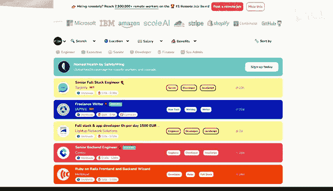

But the nice thing is you can charge a lot of money for jobos， it's man， it's good money， B2 B。

 you can charge like you start with 299， but。At the peak during when the Fed started printing money like 2021。

 I was making like 140 k a month with remote K with just job posts。

And I started like adding crazy upses like rainbow color its job posts。

 you can add your background name it's just upses， man， and you charge$000 for an upsell。

 It was crazy。 And every all these companies upse up so yeah， we want everything。

 job post would cost $3400$4000。😊，And I was like this is good。

 good business and then the Fed stopped printing money and I all went down and it went down to like 10 k a month from 140 now it's back is I think it's like 40 was good times。

 you know？I got to ask you about back to the digital nomad life。

 you you wrote a blog post on the reset。And in general， like just giving away everything。

 living a minimalist life， yeah， what did it take to do that？

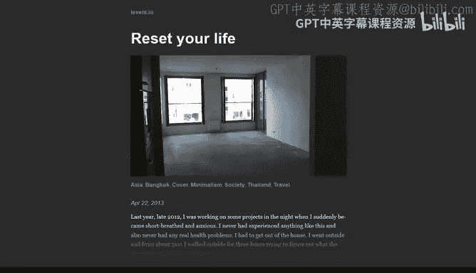

Like to get rid of everything。 10 years ago was like this trend in the blog。

 back then blogs were so popular。 It was like a bloggerpher and it was like 100 things challenge。

 What is that10 I mean， it's ridiculous， but like you write down every object you have in your house and you count it make like a spreadsheet and you're like okay I have 500 things you need to get it down to 100 Why know this was the trend So I did it I started like selling stuff started throwing away stuff and I did like Mma an ecstasy like 2012 kind and after that trip I felt so different and I felt like I had to start throwing shit away like I swear and I started throwing shit away and I felt that was like it was almost like the drug sending me to a path of like you need to throw shit you start you go on a journey you need to get out of here。

And。And that's what the M may did。 I think， yeah， how hard is it to get down to 100 items。

 Well you need to like sell your PC and stuff you need to go on ebay and then man ebay where stuff was very because you discovered society。

 you meet the craz people you meet every range everybody comes to your house to buy stuff It's so funny It's interesting I recommend everybody do this just to meet people that want your shit Yeah was I didn't know I was living in Amsterdam and I didn't know have my own subculture or whatever And I discovered the Dutch people like as they are from ebay you know So I sold everything was like the weirdest thing you had to sell and you had to find a buyer for not the weird but like it's memorable So back then I was I was making music and we would make music videos with like a canon 5D camera back then everybody's making films and music and we bought up with my friends and stuff and。

It was kind of like I had to sell this thing too because it was like it was very expensive。

 like 6 k or something。And but it meant that selling this meant that we wouldn't make music videos anymore I would leave Holland this kind of like stuff we were working on with end and I was kind of saying this music creative stuff。

 we're not getting big we're not getting famous in this or successful。

 we need to stop doing this this music production also， it's not really working。

And it was kind of like felt very bad， you know， for my friends because we would work together on this and to sell this like camera that wed make stuff with。

 And it was a hard goodbye It was just a camera。 but it was like it felt like。

Threerry guys doesn't work and I need to go， you know， who who bought it， do you remember。

 was some guy who couldn't possibly understand that？

The journey of it yeah he just showed up here here's the money thanks yeah but it was like it was like cutting your life like this shit ends now now we gonna do new stuff and I think it's beautiful I did that twice a mile I give away everything everything everything like Danto just pants underwear backpack。

I think I think it's important to do。 It shows you what's important。 Yeah。

 I think that's what I learned from it。 Like you， you learn that you can live a very little objects for little stuff。

 And but there's， there's a counter to it。 like you。

 you lean more on this on the stuff on the surface， right， Like， for example， you don't need a car。

 you use Uber， right， where you don't need。Kitchen stuff because you go to restaurants。

 you know when you're traveling， So you lean more on other people's services。

 but you spend money on that as well。 So that's good Yeah but just letting go of material possessions。

 which it gives a kind of freedom to how you move about the world Yeah it gives you complete freedom to go into another city to if your backpack with a backpack there's a kind of freedom to it。

 there's something about material possessions and having a place and all that that ties you down a little bit Yeah next spiritually it's good to take a leap out into the world。

 especially when you're younger to like Matt， I recommend if you' 18 you get out of high school duties this go travel。

And you， build some internet stuff， whatever if you're your laptop and it's。

 it's an amazing experience。😊，5ive years ago， Is still going to university。

 but now I'm thinking like no， maybe maybe skipip university， just go first。

 like travel around a little bit， figure some stuff out。

 you can go back to university when you're 25。 you can like okay now I learn be successful in business you have money at least now you can choose what you really want to study you know because people at 18 they go study what's probably good for the job market right So it probably makes more sense like if you want that go travel。

 build some businesses and go back to university if you want so one of the biggest uses of university is the networking you gain friends。

 you gain like you meet people， it's a for function to meet people but if you can meet people out into the world by travel and you meet so many different cultures I mean the problem for me is like if I travel at that young age。

 I'm attracted to people at the outskirts of the world like for me like where not geographically like the subcul sub yeah like the weirdest the darkness Yeah me too but that might not be the best networking at 18 years。

No， but man， if you， if you're smart about it， you can stay safe and I met so many weirdos from traveling you meet this how travel works。

 if you really let loose， you meet the craziest people。 and it's the most interesting people and。

It's just， I can of recommend it enough， but the other thing is that when you're 18。

 I feel like depending on your personality， you have to learn both how to be a weirdo and how to be a normmy。

Like you still have to learn how to fit into society like for a person like me， for example。

 who's always an outcast。 like there's always a danger for going full outcast。 Yeah。

 and that's a harder life。 if you like if you go to like go full artist and full like darkness。

 It's just a harder life。 you can come back， you can come back to normal that's a skill。

 that's like I think you have to learn how to how to fit into like polite society。

 but I was very strange outcast as well。 and then I'm more adaptable to normal now。

 I learned after 30s。 you know， you're like yeah， but you means a skill。 you have to learn。 Yeah。

 I man， I feel also。You start us outcast， but the more you're work on yourself。

 the less like shit you have， you kind of start becoming more normaly because you become more chill of yourself and more happy and。

It kind of makes you uninteresting， right， a little Yes。

 like the the most the the crazy people are always the most interesting if you've solved your internal struggles and your your therapy and stuff and you kind of become kind of。

 you know， it's not so。Interesting anymore， maybe you don't have to be broken to be interesting。

 I guess is what I'm saying。What kind of things were left when you minimalized So the backpack MacBook toothbrush。

 some clotheswear socks， you don't need a lot of clothes in Asiaca it's hot so you just wear swimp swim shorts he woke around flip flos so very basic Tshirt and go to the laundromat and wash my stuff and I think it was like 50 things for something yeah。

Yeah， it's nice。 there's， as I mentioned to you， there's the the show alone。Yeah。

 they really test you because they only only get 10 items and you have to survive out in the wilderness and it acts like everybody brings an axe。

Some people。Also， have a saw。Wow， but usually ax does the job you basically have to。

 in order to build a shelter， you have to cut down and cut the trees and make and like minecraft。

You know， everything I learned about life I mycraft bro。Yeah， yeah。

 you can it's a it's it's nice to create those constraints for yourself to understand what matters to you and also how to be in this world and one one of the ways to do that is just to live a minimalist life but like some people like I've met people that really enjoy material possessions and that brings them happiness and that's that's a beautiful thing like for me it doesn't。

But people are different。 It gives me happiness for like two weeks。 Yeah。

 I'm very quickly adapting to like baseline hedon hedonistic adaptation very fast。 Yeah， but man。

 if you look at the studies， most people like。😊，Like a get a new car six months， you know。

 get a new house， six months。 you just feel the same。 She like， wow。

 should I buy all the stuff that studying Hedonistic adaptation made me think a lot about minimalism And so that you don't even need to go through the whole journey of getting it just just focus on the。

😊，The thing that's more permanent。Yeah， like building shit， Yeah。

 like people around you like people love nice food， nice experiences， meaningful work。

 those things exercise， you know， those things make you happy， I think， make me happy for sure。

You're at a blog post。 Why I'm unreachable and maybe you should be， too。

 What's your strategy in communicating with people。 Yeah， so when I wrote that。

 I was getting so many Dms。As you probably have， you have a million ton more。

 But and people were getting angry that I wasn't responding。 And I was like， okay。

 I'll just close down this DM Ms completely。 Then people got angry that I closed my DM Ms down that I'm not like。

Man of the people， you know， like you changed man。 Yeah， you changed， you got， you know， like this。

And I'm like， I'll explain why I just don't have the time in a day to。You know。

Answer every question and also people send you like crazy shitman like stalkers and like people write like that whole life story for you and then ask you advice like man。

 I have no idea I'm not a therapist I don't know and know this stuff but also beautiful stuff No absolutely like life story I've posted a coffee for like if you wanted to have a coffee with me and I've gotten an extremely large number of submissions And when I look at them there's just like beautiful people in there like beautiful human beings theres really powerful stories and like break my heart that I won't get to meet those people you know like。

And so this part of it is just like there's only so much bandwidth to truly see other humans and help them or like understand them or hear them or yeah see them Yeah I have this problem that I I try I want to try help people and like also like oh。

 let's make startups and whatever and it's。I've learned over the years that generally， for me。

And it sounds maybe bad， right， But like I help my friend Andre， for example。

 he was he came up to me in a coworkerwork space。 That's how I met him。 he said。

 I want to learn the code。 I wanted to do startups。 How do I do it。 I said， okay。

 let's go install N X Let's start coding。 And he has this self energy that he actually。😊。

He doesn't need to be pushed， he just goes and he just goes he asks questions and he doesn't ask too many questions he just goes goes and learns it and now he has a company and makes a lot of money has his own startups so and the people that that I have to kind of like that ask me for help but then I gave help and then they they started debating it you know do you have that like people ask your advice and they go against you say no you're wrong because I'm like okay bro I don't want to debate you ask me for advice right and the people need this push generally it doesn't happen you need to have this energy for yourself well they're searching they're searching and they're trying to figure it out but oftentimes their search。

If they successfully find what they're looking for， it'll be within sounds very like spiritual Sony。

 but it's really like figuring that shit out on your own， but they're reaching。

 they're trying to ask the world around them like how do I live this life。

 how do I figure this out but ultimately the answer is going be from them working on themselves and like literally。

It's a stupid thing but like googling and doing like yeah sort thing procrastination I think sending messages to people is a lot of procrastination like Le how to you become successful podcaster bro just you know。

 start like just go and just go I would never ask you how to be successful podcaster like I would just start it and then I would copy your methods you know say this guy is a black background we probably need this as well try it。

And then you realize it's not about the black background。 It's about something else。

 So you find your own voice like keep trying to exactly annotation is a difficult thing。

 like a lot of people copy and they don't move past it。 Yeah。

 you should understand their methods and then move past it， like find yourself。

 find your own voice on you imitate and then you put your own spin to it， you know。

 and that's like creative process that's like literally the whole everybody always builds on the previous work。

You shouldn't get stuck 24 hours in a day， eight hours of sleep。

 you like break it down into a math equation。N0 minutes of showering， clean up coffee。

It just keeps whittling down into zero。 man， it's not this specific， but I had to make like a。

 you know， an average just on firefighting， all like that， one hours of groceries and errands。

I've tried breaking down a minute by minute what I do in a day， yeah。

 especially when my life was simpler， it's really refreshing to understand where you waste a lot of time and what you enjoy doing like。

How many minutes it takes to be happy？Doing the thing that makes you happy and how many minutes it takes to be productive and you realize there's a lot of hours in the day if you spend it right。

 yeah， a lot of his was for me has been the biggest battle for for the longest time is finding stretches of timework and deeply focus into really。

 really deep work。Just like zoom in and completely focus cutting away all the distractions too that's the battle but unpleasant。

 it's extremely unpleasant we need to fly to an island， you know。

 make a a man cave island where we can just can just code and for a week， you know。

 and just get shit done make new projects。Yeah， yeah， but man。

 they called me psychopathphphers because it says like one hours of sex huggs love， you know？M。

 I to write something， you know， and they were like， all this guy suck up but he plans his sex。

 you know， in specific hour， like hugs。 bro， I don't， but you have a counter for hugs。 Yeah， exactly。

 like， yeah， like click， click， click。😊，It's just a numerical representation of what life is， yeah。

It's like one of those like when you draw out how many weeks you have in a life， I'll do it。

 This is like dark。 Yeah， don't want to look at that much。 Yeah。

 man how many times you see your parents，s like。 Yeah， scary man。 that's right。 It might be only。

 you know， a handful more times。 You just look at the math of it if you see him once a year or twice a year。

 FaceTime today， yeah yeah。Me mean it。ThatThat's like dark when you。

I see somebody you like like seeing like a friend that's on the outskirts of your friend group。

And then you realize like， well， wait， I haven't really seen him for like three years。

So like how many more times do we have that we see each other Yeah。

 do you believe that like friends just slowly disappear from your life like they？

Kind of your friend group evolves， right， So like it does like you don't wantna theres a problem with Facebook。

 you get all these old friends from school like when you were 10 years old back when Facebook started like you don't really add friend them and then you're like。

 why are we in touch again and just keep the memories there， you know， like it's different life now。

Yeah， I have， you know， I don't that might be a guy thing or I don't know。

 there's certain friends I have that like we don't interact often， but we're still friends， yeah。

Like I every time I see him。I think it's because we have a foundation of many shared experiences and many memories。

 I guess it's like nothing has changed like we've been almost like we've been talking every day。

 even if we haven't talked for a year so that it's like yeah， that's deep。

 yeah so that so I don't have to be interacting with them for them to be in a friend group。

 And then there's some people I interact with a lot。 So's it it depends。

 but there's just this network of。Good human beings they can。

Yeah have like a real love for them I I knows。Ct on them it like if any of them called me。

In the middle of the night， I'll get rid of a body I'm there。

I like how that's a definition of friendship， but it's true， it's true， it's true， friend。

You've become more and more famous recently， how' does that affect you Its not recently because it's like this gradual thing。

 right， like it keeps keeps going。And。And I also don't know why it keeps going。

 does that put pressure on you to because you're pretty open on Twitter and you're just like basically building shit in the open Yeah and just。

Not really caring if it's too technical if there's any of this just being out there。

 does it put pressure on you you become more popular to be a little bit more。Like。Collected and。Man。

 I think the opposite， right， like。Cause the people I follow are interesting because they say whatever they think and they and they ship or whatever。

 It's so boring that people start tweeting only about one topic。 Yeah。

 I don't know anything about their personal。 I w to know about their personal life。

 Like you do podcast。 you ask about life stuff of personality。

 That's the most interesting part of like business or sports。 like what's the behind the sport。

 the athlete right behind the entrepreneur。 That's interesting stuff to be human。 Yeah， like you。

 you share that， you know。Like I shared a tweet went too far。

 but like we were cleaning the toilet because the toiletr was clogged。

 you know but like it's just real stuff because Janen W the Nvidia guy。

 he says he started cleaning toilets， you know that was cool。

 tweet is something about the Dennys thing I forget Yeah。

 it was recent Nvi started in a Dannyny diner table and you made it somehow profound。

 this one this one Nvidia3 trillion company what started in a Dens and American diner people need a third space to work on their laptops to build the next billion or trillion dollar company。

 What's the first and second space the home office and then in between I guess the island you need a space to like con man and I found history on this。

 So 400 years ago in the coffee house of Europe。😊，Like the scientific revolution。

 the Enlightenment happened because they would go to coffee houses， they would sit there。

 they would drink coffee， and they would walk， they would work。

 they would write or would and they would do debates and they would organize marine routes。

 right they would do all the stuff in coffee houses in Europe in France in Austria and UK。

 in Holland。So we would always be going to we were always going to cafes to work and to have serendipputous conversations with other people and start businesses and stuff。

And when I like you asked me to come on here and we flew to America and the first thing I realized was that I've been into America before。

 but we were in this cafe and like there's a lot of laptops everybody's working on something。

 and I made I took this photo。And then when you're in Europe。

 like large parts of Europe now you cannot use a laptop anymore， its like no laptop。

 which are in a sense， but that is to you a fundamental place to create shits in a natural organic co-working space of for a lot of people a lot of people have very small homes and coworking spaces are kind of boring。

 they're not very they're private， they're not serendipitous kind of boring cafes are amazing because they random people can come in and ask you what are you working on or you know and not just laptops people are also having conversations like they did 40 years ago debates or whatever things are happening。

And man， I understand the aesthetics of it like。It's like， oh， startup bro。

 shipping is a bullshit startup， you know， like？But there's something more there like there's people actually making stuff。

 making new companies that the society benefits from like're we're benefiting from NviDdia。

 I think it the US GDP for sure is benefiting from Nvidia。

 European GDP could benefit if we build more companies and I feel in Europe there's this vibe in this。

You have to connect things but not allowing laptops and cafes is kind of like part of the vibe。

 which is like yeah， we're not really here to work。

 we're here to like enjoy life I agree with this Anthony Bin like this tweet was quote tweet Anthony Bdain photo with him of cigarettes and a coffee in France and he said this is what cafes are for I agree but there is some element of like entrepreneurship。

Like you have to allow people to dream big and work their ass off towards that dream and feel each other's energy as they interact with like that's one of the things I liked in Silicon Valley when I was working there is like cafes like there's a bunch of dreamers you can make fun of them for like everybody thinks they're gonna build a Tri dollar company but like yeah and it's odd not everybody wins 90% of people will be bullshit but they're working their ass off and you're doing something and you need to pass this startup bro like oh startup growing level no it's not people making cool shits and this will benefit you because this will create jobs for your country in your region and I think in Europe。

That's a big problem。 Like we have a very anti。Um， entrepreneur entrepreneurial dream big and build shit this is really inspiring。

 this is pin tweeter yours， all the projects that you've tried and the ones that succeeded。

Its very few mute life。It was for Twitter to mute to share the mute list。Mth worth fire calculator。

 no more Google maker rank， How much is my site project worth climate finder ideas AI airline list still runs。

 but it doesn't make money airline list like compare the safety of airlinesca I was nervous to fly So I was like。

 let's collect all the data crashes for all airplanes whileow he see cable nice that's awesome make village noma gear3D and virtual reality dev play play my inbox like you mentioned。

 there's a lot of stuff。 Yeah trying to find some embarrassing tweets yours you can go to the highlights step has all like the good shits kind of。

There you go， this was D by POv building an AI startup。Wow， you're a real influencer。

And if people copy this photo now， they change the screenshot， it becomes like a meme。Of course。

 you know？This is good。And that's how Dubai looks it's insane that's beautiful architectureurized it's crazy the story behind this the story behind for sure。

 it is about the European economy where like European economy landscape is ran by dinosaurs and today I studied it so I can produce。

You with my evidence， 80% of top EU companies were founded before 1950。

 only 36% of top US companies were founded before 1950。

 Yeah so the median founding of companies in US is something like 1960 and median the top companies right and a median in Europe is like 1900 or something so it's here 1913 and 1963。

 so there's a 50 odd difference。It's a good。Representation of the very thing you were talking about the different difference in the cultures。

 entrepreneurial spirit of the peoples but Europe used to be entrepreneurial like there was companies founded in 1800。

 1850， 1900， it flipped like around 1950 where America took the lead and I guess my point is like I hope that Europe gets back to because I'm Europe and I hope that Europe gets back to being an entrepreneurial culture where they build big companies again because。

Right now， the。All the old dinosaur companies control the economies。

 they're lobbying with the government。 Europe is also that's like they're infiltrated with the government where they create so much regulation like I think it's called regulatory capture right where it's very hard for a newcomer to join to enter an industry because there's too much regulation So actually regulation is very good for big companies because they can follow it。

 I can't follow it if I want to start AI startup in Europe now I cannot because there's an AI regulation that makes it very complicated for me I probably need to get like no theoriesies involved I need to get certificates licenses。

Whereas in America， I can just open my laptop， I can start a AI started right now mostly， you know。

 what do you think about EAC effective accelerationist movement man you had Beth Jesus on I I love Beth Jesus and he's amazing And if think Ech is。

😊，Is very needed to similarly create a more positive outlook on the future， like because people。

People have been very pessimistic about society， about the future of society， climate change。

 all this stuff。EOk is like is' a positive outlook in the future like technology can make us you know we spend more energy。

 we should find ways to of course get like clean energy。

 but we need to spend more energy to make cooler stuff and you know go into space and build more technology that can improve society and we shouldn't shy away from technology technology can be the answer for many things Yeah build more don't spend so much time on fearmongering and cautiousness and all this kind of stuff some is okay some is good but most of the time should be spent on building and creating on like doing so unapologeticallys it's a refreshing reminder what made the United States great is all the builders like you said the entrepreneurs like we can't forget that in all this sort of discussions of how things could go wrong with technology and all this kind of stuff Yeah it goes to get look at China China is now at the stage of like America what like 1900 or something they're building rapidly like insane and obviously China's massive problems but that comes with the whole thing。

That comes to American in it beginning all the massive problems， right？But。

I think it's very very dangerous for a country or region like Europe to you get to this point where you're kind of complacent and you're kind of comfortable。

And then， you know， you can either go this or you can go this way， right you're you're from here。

 you go like this and then you can go this with this I think you should go this way and I'll yeah。

 go up and and。😊，I think it's the problem is the the， the the mind culture。 So E Och， I made E U O。

 which is like the European kind of version。 I made like hoodies and stuff。

 So a lot of people wear like this this make your Gry again hats。 I made it red first。

 but it became too like Trump。 So now it's more like European blue， you know， make Europe Gr again。😊。

All right。Okay， so you had a incredible life。Very successful， built a lot of cool style。

 so what advice would you give to young people about how to do the same？Man。

 I would listen to like nobody just do what you think is good and follow your heart， right。

 like everybody peer pressure you into doing stuff you don't want to do。And like they tell you。

 like parents or family and society and tell you， but like try your own thing， you know。

 because it probably it might work out。 You can， you can steer the ship。 You know。

 it probably doesn't work out immediately。 You probably go into very bad times like I did as well relatively right。

 But in the end， if you're smart about it， you can make things work and you you can create your own little life of things as you did。

 you know， as I did and。I think that should be more promoted， like do your own thing。

 their's space in the economy and in society for do your own thing， you know， it's like， you know。

 like little villages， everybody would sell， I would sell bread， you would sell meat。

 Everybody can do their own little thing。 You don't need to。You knowBe Nor， as you say。

 you can be what you really want to be， you know？And like go all out doing that Yeah。

 you got to go all out because if you do， if you have assets， you cannot succeed。

 you need to go lean into the。To the outcast stuff leaning to the being different and and just doing whatever it is that you want to do。

 right， you got a whole asset。 Yeah， whole asset， yeah， this was an incredible conversation。

 It was an honor to finally meet you。 It was an honor to be your legs to talk to you and keep doing your thing。

 keep inspiring me and the world with all the cool stuff you're building Thank you， Matt。😊。

Thanks for listening to this conversation with Peter levelss to support this podcast。

 please check out our sponsors in the description， and now let me leave you with some words from Drew Houstonton。

 Dropbox co foundunder。By the way， I love Dropbox。Anyway， Drew said， don't worry about failure。

 You only have to be right once。Thank you for listening and hope to see you next time。

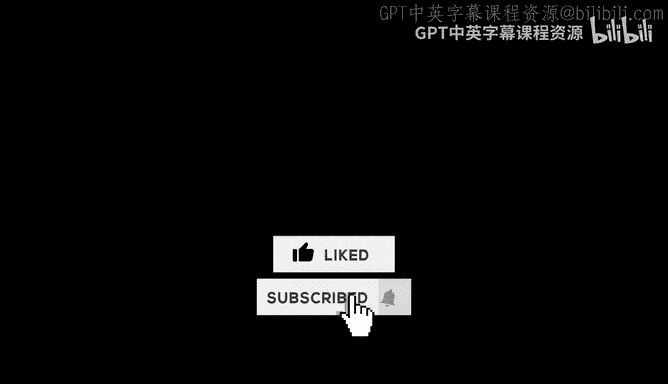