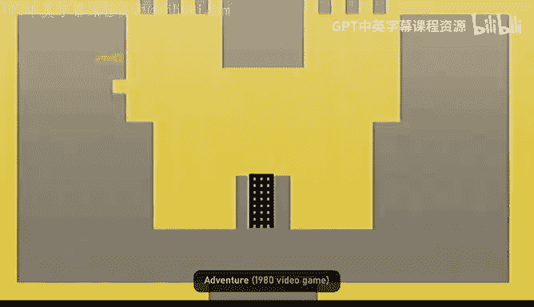
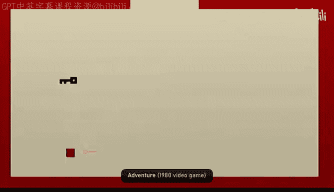
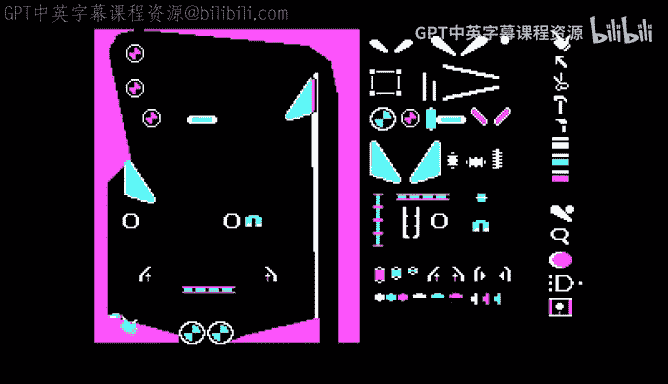
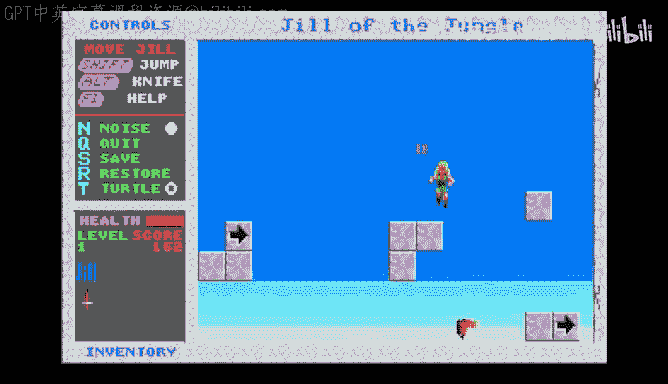
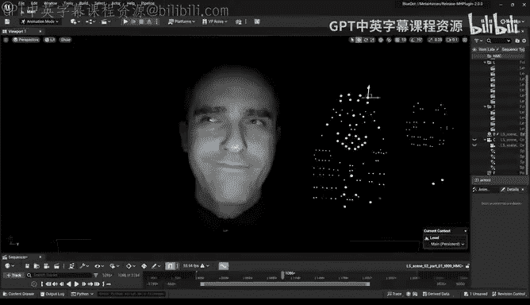
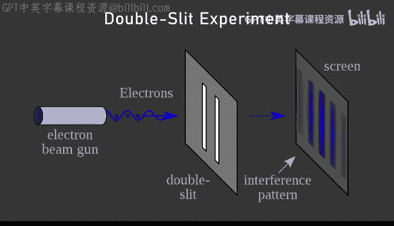
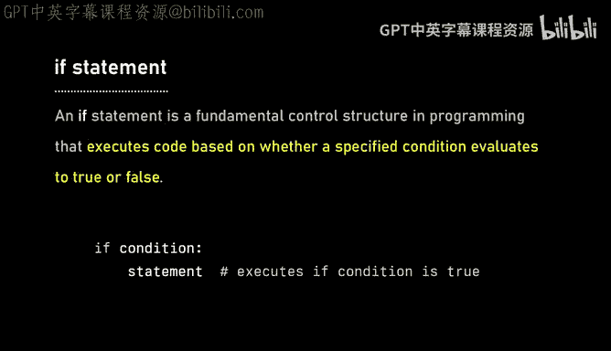

# Lex Fridman Podcast #467《提姆・史威尼：Fortnite、《虚幻引擎》和游戏的未来》中英字幕 - P1 - GPT中英字幕课程资源 - BV1bsC4BAExE

Humans are by far the hardest part of computer graphics because millions of years of evolution have given us dedicated brain systems to detect patterns and faces and infer emotions and intent。

 because cavemen had to when they see a stranger determine whether they were likely friendly or they might be trying to kill them and so people in the world have extraordinarily detailed expectations of a face and we can notice imperfections。

 especially perfects arising from computer graphics limitations， one part is capturing humans。

 and so they felt really advanced dedicated hardware that puts a human in a capture sphere with dozens of cameras in them taking high resolution high-frame rate video of them as they go through a range of motions。

And then capturing the human face is complicated because the nuanced detail of our faces and how the muscles and sinews and fat work together to give us different expressions。

 So it's not only about the shape of a person's face。

 but it's also about the entire range of motion that they might go through So that's the data problem。

 There's a lot of other problems of computer graphics。

 you know there's technology for rendering hair， which is really hard because you can't render every again。

 we know the laws of physics。 it would be easy to just render every hair。

 It would just be a billion times too slow。 So you need approximations that capture the net effect of hair on rendering and on pixels without calculating every single interaction of every light with every strand of hair。

 So's one part of it。 there's detailed features for different parts of faces。

 There subsurface scattering because。We think of humans as opaque。

 but really our skin as light travels through it， it's not completely opaque and the way in which light travels through skin has a huge impact on our appearance you know this is why there's no way you can paint a manic and to look realistic for a human you know it's just a solid surface and will' never have the sort of detail。

 you see that kind of blew my mind like thinking through that。

I think I heard that sort of the oillinesiness of the skin creates very specific， nuanced。

 complex reflections， and then some light is absorbed and travels through the skin and that creates textures that are humanized able to perceive and it creates the thing that we consider。

Human， whatever that is， all of that while considering all the muscles involved in making the nuos expression。

 just the subtle。Squiinting of the eyes or the subtle formation of a smile is the subtlety of human faces that you have to capture。

 like the difference， in a real smile and a fake smile。

 But the way to show like beginning of a formation of a smile that actually reveals a deep sadness。

 All of that， Like when I watch a human face， I can like read that。 I could see that。

 you have to have the tools that in real time can render something like that。

 And that's incredibly difficult。 That's right。 getting faces right requires interplay literally dozens of different systems and aspects of computer graphics。

 And if any one of them is wrong。 your eye is completely drawn to that。

 and you find it on the wrong side of uncanny valley。

The following is a conversation with Tim Sweeney， a legendary video game programmer。

 founder and CEO of Epic Game， that created many incredible games and technologies including the Unal Engine and Fortnite。

 which both revolutionized the video game industry and the experience of playing and creating video games。

This is the Le Ruman podcast to support it。 please check on our sponsors in the description。

 and now dear friends， here's Tim Sweeney。When did you first fall in love with computers and maybe with programming。

 I had a brother Steve Sweeney， who 16 years older than me。

 And at some point when I was a little kid。 He went off to work in California for a tech company。

 And he'd gotten one of the first IBM PCs。 And so for one summer， I think I was about 11。

 I went to visit him in California。 my first trip away from my family just to hang out with him。

 and he had this brand new IBM computer， and I learned to program over the course of a few days and basic。

 I was just blown away but the capabilities of computers at the time。

 I was unbelievable they could accomplish。 And I was hooked from that point onward。

 and very much wanted to be a programmer。Do you remember what you wrote in basic。

 they said a video game type things， Is it like for loop， some numerical thing。

 What do you remember Yeah， it's funny， I have a perfectly vivid memory of all of the first things I learned to program。

 I have a hard time remembering people's names。 but like code really sticks with me every step and every challenge。

 there are lessons learned you know， some of which I've come to realize we' just like me getting over some learning her。

 but other things were actually shortcomings of programming languages and the realization that they're actually better ways and what programmers learning to program for the first time。

 you know， a lot of what they're facing isn't the challenge of learning a new art。

 It's friction introduced by failures of programming language design。

 And so I've I've constantly come back to those early lessons there as I've as I've progressed and done more and more things。

 including building programming languages。 Yeah， the friction and the pain。

Is is the guide to learning in programming like， if I were to describe programming journey。

That would be marked by pain and that pain you shouldn't escape to pain。

 The pain is instructive for you to understand programming languages。

 but do you remember what kind of stuff you were writing at that time just the early programs。

 Yeah in the early days I wrote a little bit of everything I wrote some games the first game I wrote on the Apple I was since I only knew how to program in text mode the computer would throw asterisks across the screen they'd flow from left to right and you'd have a print I used on the righthand side of the screen and looks like a baseball。

 and you're supposed to catch to asterisks that was my very first game it took about a couple hours to build and tune and I went from there。

 but I built a lot of things I built。Databases at different points。

 I built a programming language in a full compiler for a language like Pascal because like I couldn't I didn't know where you went to buy one of those。

 So I made my own and one of the things of。One of the fun things of that time was bulletin boards before we had the internet in the hands of consumers。

 you used your modem and you dialed into a local phone number and connected to whoever was running the computer there and every town or city had hundreds of these bulletin boards run by different people with their own personalities and teams and so I spent a lot of time building a boardin board program and learning how to deal with database management and user interface and dealing with multiplepo users concurrently and things and so I probably found about 1 or 15。

000 hours writing code just on my own as a kid between like age10 and。

And you know age age 20 before I actually shipped a program to the outside world 10 to 15，000 hours。

 what was the value of the hours as a kid you put in in programming that led to the success you've had in later life。

 maybe this is by way of advice to younger people in terms of how they allocate the hours of their early life。

Yeah， you know， it's not just our， it's really striving to learn。

To understand what knowledge you have， what knowledge you lack。

 and to continually do experiments and work on projects that improve your knowledge base。

And I didn't do this with a great amount of structure or planning。

 I was rather just going from project to project doing things that I thought would be fun and cool and with each project I learned new things。

 learning about how to store and manage data， learning how to deal with advanced data structures。

 how to write complex programs that have deeply nested data and control though。

 each one of those youna provide a lesson which。😊，Were later essential。 You know， when in 1991。

 I released my first game。 And over the the course of that decade， we went from。you know。

 zero commercial releases to the first generation on Real Engine。

 but you know this was largely just using the knowledge that I'd built up over the previous decade。

 just doing fun hobby projects and if I hadn't done all of that work。

 there's no way I could have ever built the things that came later。

 all the experimentation and all the exploration。Somehow。Contributed somehow made sense later on。

 like all of that is integrated somehow in the stuff you build， it's funny how life works。

The pieces kind of come together。Eventually， yeah， you know。

 there are definitely karate good moments because all this time I was learning math in high school and in college I studied mechanical engineering and so you learn all kinds of math。

 vector calculus and vector math and matrices you know all these related fields physics and stress and strain and how to you deal with complex physical systems and I wasn't really sure how engineers would actually make use of that knowledge just like forget about it when you actually go off to do work or is do you write down equations on paper was actually not clear as an early engineering student what you do。

But when I started writing the first generation on Ri Engine and I was dealing with 3D math。

 I was like， wait， I know this stuff I learned this and yeah so you， suddenly like the kar you kid。

 you know you get to paint the fence and wax the car and suddenly put all the pieces together into a 3D engine based on a whole lot of accumulated programming language and math knowledge often often knowledge gained without ever anticipating that I might use it in that way Also I think what's useful is over and over learning a hard thing。

And then showing to yourself， you know， that you can do it。You can learn a hard thing。

 so then when you come to having to write a 3D engine that in ways that haven't been done before。

You're like I've I've been here I've been here in this experience like I don't know what to do。

 but we'll figure it out， we'll learn I'll learn all the necessary components。

 So just not being afraid of something new that's right and constantly striving to make connections between these fields and look for their applications long after Id chip on on real Engine。

 It was like going back to an engineering textbook and looking at oh yeah。

 use that I use that use that and then I got to this section on eigenvalue something like don't know what the hell this is。

But you know it turns out eigenvectors and eigenvalues were the critical breakthrough that made the Google search engine technology work and stand apart from the rest because they found if you threw all the links that existed in the web and you know links from into two different sites and you put them a giant matrix and you conclude it you found a dominant eigenvalue then those eigenvectors described the best search results for different things and so constantly。

😊，Picking up knowledge and looking for ways to put it together is is the thing to do and。

If you aspire to be a programmer， you've got to write a lot of code and you've got to continually learn new things and improve。

 and if you want to be an artist， you've got to continually draw artwork of all styles and all kinds and constantly push yourself to learn more and more。

Because you never know exactly what you're going to end up doing in the long run。

 but the more knowledge you have and the more skills。

 the more chance you have putting it together and being successful and whether you're a programmer or an artist。

 you should probably take linear algebra， even though it doesn't make sense at the time I found getting engineering an engineering degree and then never working in an engineering field you know just being a computer programmer was immensely valuable。

I went to University of Maryland which for some disciplines。

 it's kind of known as a party school but they work the engineers to death where it's really hard。

 And if you learn any engineering discipline， you learn massive amounts of math and you learn the rigor of problem solving you know not just what you find for the Wikipedia article but going through all the exercises of solving complex problems and dawning up series of solutions to derive in an answer it's valuable and it embodies the knowledge that you need as a programmer and you know people often go to university and think。

 okay my goal here is to get good grades so I get a diploma and I prove to an employer they're unvaluable like no that just kind of the superficial bookkeeping of the university the real purpose of。

All of this is to learn。 and whether you learn formally or you learn on your own。

 it's the learnings that are really valuable in a career。

 And especially if you're going to be entrepreneurial。

 it's really knowing the stuff that matters and not having the， the diplomas into。

Yeah there's ever more pressure to make a build rebuild society more and more around credentials。

 do you have this certificate， do you have that proof， but like， you know。

 companies that are focused on just building great products and doing great things gravitate towards people who do the great work Yeah。

 one of the great things about youth。Is there's more freedom， there's just more time to learn。

And people when they go to high school， they sometimes thinkWow。

 I can't wait to get out of this and be an adult and be free。

 but it's not quite freedom when you get a job and you start a family。

 all wonderful things you get less more and more busy and less and less time to learn。

In the general sense， learn whatever the hell you want that that is a wonderful time in life。

 the teenage years， the early 20s， the 20s when you could just learn random shit Yeah you know I think this is something that's kind of changing in America so much focus on grades and homework and structure around kids lives you know why' was growing up my mom would feed me and my neighbors my neighbors and moms would feed them breakfast andd be like well be back by dark and we'd go out and we'd play and we'd do all sorts of things we'd know explore the woods。

 we'd buildarts we'd you know salvaged old pieces of electronics and build we thought where our space spacecraft control panels for you know fake spaceships we were building his play and we'd have an enormous amount of freedom and you know from basically being a little kid through through the time I went off to college it had an enormous amount of free time。

Some people just used that and wasted and watch TV。

 some people socialized and some people really got into serious projects so many people at all times were doing cool things。

 you I was programming I was learning to build things before I was releasing games。

 the world would I be like having neighborhood folks over to play the things I was working on and check them out and sometimes they're impressed and sometimes they weren't and they'd have their own projects and often we'd have spare time jobs and everybody was entrepreneurial like everybody you know had a side gig sometimes youd go around in mow people's lawns or you'd you know rake the leaves up and earn money and there freedom there and the organic learning that occurred there I think it's something that is really critical to the American experience I worry is increasingly going away as the societys ever more protective and sheltering and makes it harder to get these experiences。

So on the video game side， when did you first fall in love with video games。

 I've had a funny relationship with games because。My real aspiration。

Has always been to program cool stuff and I get more enjoyment of programming than anything else in the world。

And so， you know that my first。Really too formative experience with games were playing the game called adventure for the hari 2600。

 It was like you moved this dot around the screen and picked up objects like swordwords and fought dragonagons and invaded castles and solved puzzleholes very very simple iconic stuff rather than realistic graphics And then the other game that really got immersed was Zork which was a text adventure game it would tell you where you are and what you see and you type in commands like go North or pick up swordword or open door and and explore a world that way So the game didn't have any graphics but in your mind you had this elaborate picture of what you were seeing there and。

It really brought in an inspired imagination more than other things and playing those games led me to cough and when I learned to program everything that I saw there and that drove a lot of my programming。

 I learned how to move a player around the screen I learned how to build a design tools。

 I could dog castles and save them off and play them in a game and I realized there was a separation between the tools that you used to build a game and the game itself and that if the more powerful tools you had。

 the more creativity you could unleash in yourself or others。嗯。

And I learned all the programming techniques that supported games， how to parse text， you know。

 pick up swordword and go north， how do you make that sentence into an actual series of commands on the computer。

 and that was really， really exciting。I have to say until the time that Fortnite came out。

 I played video games primarily to learn what they were doing so I could go off and do it myself。

Yeah I'd sit down yeah when Wolfin's time came out and then doom came out， yeah。

 I'd go through and look at pixel by pixel I' the mouse very slightly and look exactly what was happening to figure out that's great what technique was being used there that was a puzzle thoughting at grand scale and it' was so fun so so take me there in the early 90s so you launched epic Game in 1991。

So you' the writing of your first big video game， ZZT， what was it like。

 what was the technical challenges， what were the psychological challenges of building that？

It was a funny project because I didn't start out to build a video game。

 I just moved from an Apple I that so my brother bought my family in Apple2 right after I'd visited him in California。

 so I've been programming on that for a few years， learned a lot of techniques， but。

Weren't many Apple II users around still by the time that cycle came to an end so I just gotten an IBM PC of my own and was learning to program and I realized I needed to text editor。

 so I started writing a text editor。You know， a text editor is a programme to edit text files。

 You have logic to move the cursor around and let people type things and packspace and delete。

 And do all of those you mundane actions。 And one night it was like it finished it up and I was like。

 well have a text editorer， but this pretty boring。

 And so I made the cursor into a smilelyface character。

 And I had different characters you could place in this document， perform different gameplay actions。

 Some would be walls。 and some would kill you and some would be moving objects that could fly around the screen。

 And so this text editorer I made evolved into little game editor So I was building these levels for a game。

 I put a lot of time into like building an editor and a primitive set of objects about 20 or 30 different objects enough to build a really cool and compelling game。

 but not so many that players would lose track of what they're seeing。

 I started off just building different game levels。 the ideas you'd be on a series of board。

 they'd be connected by going north the end of the current board would take you to a new one if it was open or maybe it was blocked and you couldn't go there。

The whole game world around debt and you know， this was the game that became ZZT。

And I was having fun with it， building it and playing it， but I didn't know if it really worked。

 So I did this experiment。 I started inviting neighbors over like some adults。

 some kids of all different ages and satAT them down from it and say。

 like here's a game I made figure it out， and you know。

 I had to force myself not to tell them what they needed to do right because I really wanted to learn if they were able to。

😊，You know discover it all for themselves you know today we would call this you know user experience test and there's a whole field of research around user experience research but back then it was just inviting some kids over to play the game I took notes about what they got stuck on and what they enjoyed and where they felt bored and just iteratively polished the game until I felt it was good and I put it out and released it on this was before the internet so there were board and boards I upload to a bunch of local bulletin boards and。

From there it started spreading because the way to build up CRed for bulletin board users was to upload new files and to claim that hey。

 I was the first that brought this to you and you know there was a natural tendency of the software to spread I decided to use the share or model know so I didn't just build this one game I built a trilogy of three games and I released the first one for free and I said。

 hey if you like this by the two sequels and I included my parents mailing address and said you know send us $30 and you can get the sequels to this game and the check started coming in within a few days and I was making like getting three or four orders a day I was making like $100 this day I'm like。

oo I'm rich because you know being a 20 year old that was like a pretty big deal what did that feel like just getting money and probably feeling this immense success from something you've created Well。

 I looked at money always just as a tool to help you fund accomplishing cool things。And， you know。

 having enough to do the things you want to do is the critical thing。

 it's always been just very utilitarian。 But the knowledge that other people all around the country and then。

 you know， and a month later， all around the world were playing the game。 that was。

 that was mind boggling。You know that me like the So kid who'd put out a game on a local boardton board could be doing international business and chip discs all over the world to players because the software is spreading on its own。

 it's just magical and that was a new thing for software like that did not happen with mechanical devices like you manufactured one。

 you sold it to somebody and they had it and that was it but software could spread that was just really cool to see and it made me realize there's really no upward limit on the peninsula for business like that。

 we saw Microsoft is a big jugger and not company it at the time， but it was like。

 hey you know if that does games good enough we could accomplish what they have accomplished what's operating systems。

 and the sky was the limit and I think this is the age we live in now you don't have to be an industrialist manufacturing physical products anybody who builds anything digitally if it's good enough。

 you can reach the entire world and build X Microsoft or Matt or Apple or Google or epic games。

It's such a cool origin story though， as you start out building a text editor。

 so you're looking at this project， you're playing around with it， you're building up the tools。

 it's such an inspiring moment。Because a lot of us start out building a project and。

Allow yourself to see the potential。Pivots， the potential trajecties that can go is really nice to sit back allow yourself to be bored and like I'm gonna go this way I mean that's like a crossroads you came to a crossroads I mean you built you know compilers you you design you a programming language you built compilers databases。

 all these things you mentioned。And we started building a tax editor and they here came to this crossroad。

 I'm going to make this fun。And then from there， you know。

 one of the most legendary gaming companies where created is kind of cool like that that that's an inspiring thing for sort of developers。

 like be open to the possibility of creating something you didn't plan to create and just go with it。

 right？That's cool。 Yeah， And it was a bunch of learnings emerged really quickly there。

 that the neat thing I did with CT was I didn't just release the game。

 I also released the editor with it。 I built this tool so I could make these ZT boards that people could play。

 but I also gave it to all of the players themselves and。😊，You know， like 30 years later。

 I still run into people you know when I go to a game industry event， it was like。

 you know I grew up playing ZZT and you know there's an adult who grew up playing my game and it was because it enabled anybody to become a creator too had。

 you know to so bored editor and it also had a little scripting language he could learn a little bit of programming in it too and。

It kind of impressed and it really set a formative principle of E， which was that。

 you know the company's mission is to make awesome entertainment。

 but also awesome tools and to share those tools with everybody so that they can build their own amazing things too。

And when we got into Andre Engine a few years later。

 the interplay between us building a game and us building tools that were widely used by others was a critical part of that。

 and I think that's the sole reason that E has been massively successful and actually the reason that we've survived all this time is that by serving both creators and gamers we've been able to weather the ups and downs of the game industry。

 it's a brutal place for companies， we've been able to survive very financial downturn and sometimes engine's been funding the business because we didn't have a game and sometimes games have been funding the business and it really set a principle in our culture that's persevered and is continually brought to their forefront。

 but on the editor front， the decision fascinating philosophy that you always allow people to create their own worlds。

You have an engine from which you simulate the world that the game is in。

 you have the actual game and you also have the freedom for creators to create。Various， you know。

 in Fortnite islands。Of their own， it's like with with everything you ship。

 that that freedom to create is always there， that's really interesting。Yeah。

 and something we we aim to do more and more fully over time， you know。

 in the course of building Fortnite， we've built a lot of other tools they're useful for us too because it's not just a game powered by Unre Engine。

 but it's also，Yeah， a social ecosystem where people can make friends and voice chat and get together in parties and we've opened up all of those social features into epic online services and we give them away to all developers for free because we all benefit from growth in that user base。

And you know， our ourgo is ultimately to build the company's products and the same technology that we share with everybody else and to help that foster a bigger and bigger ecosystem over time where everybody benefits。

If we could just linger on the 90s， so you said bullet in boards。

 maybe you can explain what that's like and also explain the birth of the internet。

 what that was like， what was the what' was the internet like in the 90s？

So the under is a funny thing， it started out as this defense department research project called the ApanE。

 the Advanced Research Project Agency Network。It's kind of like this reverered secret thing they became more and more open as they connected universities universities connected to the internet and mid-1980s and so if you were at a prestigious institution with access to computers you could get on there but a consumer back then we just had these modems this thing you plug into your phone line and it dials up on phone number and then you it sends wild sound effects over over the telephone line to send digital signals back and forth and these were really slow you know the first modem I had was 300 bos that means 30 characters per second of data so you're like sitting there watching a sense like slowly emerge character by characters you're going online。

But you know that's how we got online and we talked with each other See you dial up to a local bulletin board it'll be run by a person usually they have a computer or two sitting in their kitchen or something that's running the bulletin board and you have a small community of a few hundred users all competing to connect to that one phone line it was often busy and you couldn't get in and more popular wooden boards were hard to get to but yet all kinds of communities developed know and you could see like there was the programming communities where people talked about programming there was news and events I was lived in the outskirts of Washington DCs so that was like a big thing but then there was like the pirate community where they're sharing pi at Apple II games and very different community ethos and mantra is out there but all you know all really nice and also very small these things these wooden boards couldn't grow to the size of Facebook because your phone line couldn't take that many calls。

And you know， then later in the 1990s， the internet。

 which had been fostered and these colleges started opening up for the public and anybody could connect to it。

 and suddenly the world took on in life of its own， it became much。

 much easier to reach a global audience faster。And you would start shipping games to the Internet。

 which is。A bit of a crazy thing to do because you're supposed to have like a。You know。

 a physical copy， but to post on the internet is pretty innovative。

 even shareware is pretty innovative。Yeah， yeah， it's been a funny transition for the game business。

 you know， E started out making sharero games distributed digitally， but you know。

 it the first 3D games took off like Wolfenstein and Doom from Edofft and then unreal from us took off know。

 to reach a huge audience of millions of users we had to go into retail stores。

 So we worked with a retail publisher and they made a box and he put CD Rus in the box and。😊。

And you know then the world started transitioning back to digitally like and that transition didn't start well right。

 the initial transition of gaming to digital was all but torrent all piracy and the other horror stories about games that would you know。

 sell like 100，000 copies but have two million users because most people pirated it。

And then you Steam came along and introduced digital distribution and made digital distribution of legit games so convenient that most players moved away from piracy towards that。

And you know， their practices were then followed by others and the early digital industry took form Yeah。

 it's fascinating， I mean， pirates do lead the way for innovation。The same as the story of Spotify。

 you basically， I think most people， when they derive value from things like video games want to pay。

For those video games， they just want it to be easy and so that the same thing with music with Spotify。

But maybe just staying on the 90s， there are going to be a lot of indie game developers who listen to us talking today。

Can you go back to that mindset and try to derive some wisdom and advice？

To those folks when you were just a solo developer， maybe just a small group of people。U。

 creatingreating your early games that eventually became this。U huge gaming company。

 but in the early days， what， what， u what were you going through over the ups and downs。

 what did it take to sort of stay strong and persevere？Well， you know。

 one of the critical things that E always worked hard to do was to make something different that nobody else was doing and to。

You tried to satisfyy a small audience rather than competing globally with the game jugger nots。

 You know， back in the 1990s， Epic was new， but electronic arts and Activis and the other big publishers had been around for a decade。

 and they were。Huge companies had giant retail distribution networks。 And。

 if I tried to make a game and then convince Sim to publish it， I doubt I could have had a chance。

 and I doubt that if even if I made a successful game that I would have made much money from it。

 though they might have。And yet， so the really unique angle to E then was Shaware。

 And that was just the idea that if we distribute our game differently。

 then we can reach a much larger audience than these bigger competitors by virtue of this first episode of the game being free。

😊，It was kind of the advent of what later became free to play and the logic of that is just as true now as it was then it's if the thing is free and anybody can get into it and it's kind of spread from friend to friend as people bring you they real world friends into into the games they're playing and have the opportunity to build up a community around that。

so the other lesson there was minimize the friction of people getting anterior game。

 make it easy to get into and make it fun。And I think the other， well I was very fortunate。

 ZZT was a funny game。 It was not like。Much like any other game it had much worse graphics because it was all just text characters。

 spy faces and you know other Greek letters and things participating in this game simulation。

 they were kind of iconic representations of characters rather than real ones and this was decades into the age of real graphical games with interesting graphics and so it wasn't even trying to compete in that area。

 but it was able to compete in a different area which is that it wasn't just my the three games I'd made and shipped as a trilogy。

That were successful and drove the success of the product。 was the fact I really an at。

 and there's a whole community around it。 And you see that that that trend has repeated itself。

 like there is。😊，ZZT was one of it before that there was Bill Budge's pininball construction set that was a 1980s Apple game that let users build their pinball tables。

 and since then you've had some of the world's most successful games follow that path like Minecraft。

 you can build your own stuff， Robblx， now Fortnite， creative and under editor for Fortnite。

You know， gameses that become platforms for other people to build stuff was a real opportunity。

I think the big thing to realize as for N developers right now is there's massive massive competition in every major genre and。

It's very unlikely that unless you just happen to be the world's best at a particular thing that you're going to release a game and an existing highly competitive genre and when a much better chance of success is an releasing something that hasn't been done before。

 being really unique and reaching an audience， even if big or mediumn size or small reaching an audience and becoming really popular with that。

 making some money from being able to reinvest and then expand towards your ultimate dream I think the one shot go from idea to commercial success at massive scale is a lot less likely than the multistep process of continually build better and better stuff over time until you get into a possession of excellence。

And constantly try to do something that others aren't doing。Yeah。

 that's right because if you look at every market， there's a few markets where the current leader。

Came late to this pace， usually because the prior leader failed so horribly。

 but most of the time the company that's succeeding and winning in a market is the first or second entrant there。

 they've just continually buoyed their success。Great advice and fascinating， but on a human level。

Was it lonely， Was it scary。You sit there as a developer。

 I'd say it was It was the opposite of lonely， because。You know。

The thing that spurred me to actually release this was seeing kids playing the game in my neighborhood and having fun。

 I mean like this is really good。 and seeing them enjoying it and laughing and pointing at the screen and you know getting together and just wanting to play more and the human element was always pervasive know because I did not only receive orders。

 but people would actually write letters we wrote letters back then in the 1990s people would say how much they were enjoying the game and how their kids were playing the game and so on and so on。

 So felt very connected。😊，And you know I think a lot of businesses have to make scary decisions because you're spending。

 you potentially all of the money you have to take a shot at something that you're not sure well succeed。

 I was very fortunate at starting a business like this because it didn't really need any capital。

 the capital was， well the several thousand dollars in computers I'd bought by mowing lawn and it wasn't much risk if that hadn't succeeded。

 I guess I could have figured out how people get mechanical engineering jobs and pursued that。

 but once it took off and once the orders started coming in and people started writing letters saying they're enjoying the game。

 I knew I was going to go all out and try to build a company there and succeed and that was like going to be my big goal。

So I'm sure people know， but Epic Games was created in 1991 and went on to transform the gaming industry several times。

 one of which is unreal engine。So let's talk to the origin story of that。

 you said that when Wolfenstein。And doom came out that changed everything， so take me to that moment。

Yeah that was a very interesting time Epic after my first couple of games that had recruited developers。

 usually college students， high school students who are just working on their own had real skills but didn't have an out for their work Epic had been match making the best artists and programmers together from all over the world like Jazz Jack Rabbtt was Cliff Luzzenski。

 a high school kid in California had made a really cool adventure game together with Ariannne Brucecy a demo coder from Holland who would make amazing graphical stuff and had built a 2D game engine connected them together and a musician。

 Robert Elen in California and by telephone and Mom and so on we were building these little 2D games and having quite a lot of success there are a bunch of people making thousands of dollars a month while they were still students and royalties from the games that Epic was kind of producing and by coordinating people with people and publishing through Shaware and that was all going great the company had a little office and。

you know， copyingpp flopppy disks and mailing them out， But when Wolfenstein came out。

 we realized like the future of gaming is gonna be 3D there had been a lot of experiments in 3D before that it hadn't been great you know there were there were 3D renderings of mazes that were not in real time and you were always looking north southea or West and then there were vector graphics with little wire frames moving around and things but Wolftenstein was the first game that was fast enough you know running at 30 frames per second it really felt immersive。

 it felt like you were there like you were you know in this castle Wolfenstein fighting Nazis and it was a really amazing and immersive experience 3D graphics were pretty primitive then it software followed shockingly fast with doom which was much much more capable 3D and Jen which had。

You know， stairs and though it was still what we saw two and a halffty。

 it was environments that were very realistic textures that were very realistic， you know。

 a form of lighting that was approximate but incredibly realistic and just such great artistry and sound effects。

 it filled completely visceral and real might you might look at it today from you point of view of a modern you know。

 gameplay with you know 20 terops of computing power in your device and say， oh。

 that's not very impressive， but it was amazing at the time。

 I mean for me just decide to pause on that。 I think Wolfstein。

Was one of the most amazing moments of my own life。Just being able to， like you said， in real time。

 move about a thediional world， I just remember just like just moving around。Just in like。

 what is that feeling like。I mean， you feel transported into another world。

 You feel that you're there。 especially when you turn the lights down in your room and you turn the sound up on your speakers and。

It will scare you and you'll you'll feel like you know。

 that fireball that's coming at you is going to kill you that was an amazing time because we hadn't experienced that before。

 There was nothing like that。呃。Yeah， you'd watch a movie， a scary movie or whatever， you know。

 it was just。This thing that was happening， this was you， this was you in a 3D world。So how did that。

 how did that change epic this realization that the future of gaming is going to be 3D Well。

 at first， I was really depressed， I think as yeah， the wizardry of。Doooom， especially。

 was so incredible that I gave up on programming for like six months。

 I was like I don't to be able to compete with this。 I have no idea what we're going to do。

 We just keep making 3D2D games and hope that the business goes on， but。😊。

Like that was the nature of Carmax Wiizardry， he had done things that were like not just one innovation leap ahead。

 but like a dozen simultaneously interplaying in a way that you couldn't pick them apart into their component pieces。

 but funny thing happened Michael Abrash， longtimer in computer graphics wrote a book。And。

The techniques for 3D graphics and texture mapping and he wrote some articles in one of the programming magazines of the day and explained it and showed assembly code to do texture mapping drawing these CD graphics on the screen and it was actually really simple stuff I was like。

 oh， I can do that。And。And so a bunch of us Epic independently went off and wrote started writing our own 3D graphics code to figure it out and we found at one point we had a number of people dabbling in this doing different parts of it and at that point we decide okay this is 3D graphics in 3D gaming is going to completely change the world we need to go all in on this and so we took the best people from our best 2D game development teams and put them all together to make a 3D game we didn't really know what we' were doing at the time none of this it ever a shipped to 3D game and most of us were still learning but every was like trying different disciplines to see what they were best at。

It was a combination of a bunch of people who came together to make unrealre I'd initially volunteered to make the 3D editor for the thing and James Schmotz who made epic pinball Epic pinball now that wasn't a crazy game。

 this was one of the 2D sharero games he made it always in college and he was making like $30。

000 a month from you know the royalties from this game because everybody had wanted an awesome pinball game massively successful but it was。

He was a multidisciplinary person he wrote the code for the game。

 the art for the game and did basically everything and the code was 30。

000 lines of assembly language and so he was initially going to write the 3D engine and I was going to write the editor and he sent me his code so I could integrate into the editor and it was like just a giant pile of assembly code and I was why don't I just write this myself and so James instead started going off and point 3D models and 3D animations using the tools at the time and so Cliff had done a lot of design work and built the levels on jazz Jara went off and started learning basics of level design and so I was writing this editor and Cliff Blazinsky was customer number one for it。

 starting to go off and build levels and James Schmtz was doing awesome creatures sending them to me I get them in employment and game and then we brought an animator to bring them into life and we brought in more and more people until the peak of unreal one development we had about 20 people working which was a huge team for the time and was really stretching epics finances nearly to the breaking。

We barely survived and almost ran out of money a number of times。

 but somehow we always pulled through and it was a crazy project because it was three and a half years of development and a game that we always thought was six months from shipping。

And。Yeah， its like three and a half years of 70 or 80 hour weeks for most everybody working on the project。

Not even knowing what problems we'd need to solve next because we are seller immersed in the current ones were there moments when you were losing hope that this might。

Take too long and the company will run out of money。was we were always very financially stressed。

 so I was continually worried about that I had total confidence so that we'd work out all the technical and artistic problems because yeah。

 we knew the pieces and it was largely a matter of typing code and solving some problems。

And kind of like we knew we could ship a version of it。The thing that was continually。

Really interesting was the ongoing discovery of new new techniques as we went， you know。

ca at the time Quake had shipped it had a little bit of dynamic lighting。

 and really pushed dynamic lighting much higher than anybody else had done before in colored dynamic lights with some shadow casting capabilities statically or moving lights without shadows and figured out how to do volumeotric fog so you could have foggy areas that were full of lights and you get the kind of glow of the lights standing out in the fog and affecting the appearance of the level。

A whole lot of amazing techniques came together to build a game。

 it made a number of leaps ahead of the stay of the art at the time。😊，嗯。Yeah， it was really crazy。

 but like I think most companies wouldn't have survived that。

 but the sheer talent of the people involved made it possible and that's E has often done things that。

Most companies will have failed at， and we succeed like not because of awesome management or awesome planning or awesome financing。

 but because of the sheer talent and willpower of the people involved to make it happen。

 What about the interdisciplinary aspect of it， like you said。😊，Sot of artists。

Engineers or programmers， designers， all of them working together。 What， what。

 what was that the 20 people， What was the dynamic they're like working in saying hours。

 like what was it like to sort of。Make a team like that work together well as an orchestra to actually deliver the game。

Yeah， that's one of the really unique things that exist in gaming， not in normal big tech companies。

 which are just engineering and business driven， but gaming really does require。

All of the best people across all the creative disciplines working together。

And you know I think could grown organically by recruiting people with awesome talent。

 we were we always had a limited budget we could never pay to you know bid up people's salaries and hire them away by paying them more。

 we just had to find awesome people who were at the beginning of their career and put them together。

So everybody was very new to this and didn't have any assumptions about how companies worked and so you know you put all these people together and。

You know it was really a constant interplay of talent as people were learning how to work together as a team。

 like nobody had management experience， most people hadn't chip at a game before they worked with Epic。

 and we were figuring out as we went。But it was a constant iterative cycle。

 you know we'd make several new versions of the game every day， read a new compile。

 introduce a new feature or fixes some bugs， get it to artists， artists， improve their levels。

 continue building stuff， and then we see what they're doing in their level like oh I see what you need now。

 we to constantly be improving the tools and's just the iterative process and the speed at which that improves products is the critical element to success in games。

 to slower the iteration cycle if you make a build every week。

And you prove you go through one iteration every week， you're going to be way， way。

 way worse by the end of your project than a game company that makes， you know， new stuff every day。

And that was the magic that happened together and it wasn't。

There was really nothing but passion in everybody's individual dedication to it that made it work。

I heard you still program， but how much programming were you doing back then you mentioned the hours。

 probably insane hours， so like it'd be almost fun to talk about your setup。What a。

 what a day in life of Tim Sweeeney in the 90s when youre building on look like， well。

 we'd all gravit head towards。A schedule， a work schedule that maximized productivity。

 And that usually meant waking up late。 I get to like， usually get to work around noon。

 It work usually work till like 2 AM or or so3 AM sometimes。And you know。

 I didn't have anything else going on in my life， so there was really just working sleep and occasional eating。

And I found I always need。8 or 9 hours of sleep a night。 without good sleep， I。

 I would just become a zombie and wouldn't be nearly at my best。 I always needed to get sleep。

 but I didn't need anything else going on。 So I just the the programming itself was so energizing and thraling。

Yeah， so it was a， you， three and a half years of that during the project mostly spent programming。

 I would say probably 60 hours a week of programming five hours a week of coordinating with other people and iterating and you know sitting down with them and looking at what's going on in screen and figuring out what they needed。

 five hours of business stuff and know， there's a good division at labor of labor then if I didn't have a big executive team。

 but it was like basically myself running the technical and development part of the company in Markrain running the business part of it doing deals and。

You know maxing out his credit card and going around the world doing bringing in sources of revenue to keep the company funded。

 what programming language are we talking about C because you mentioned there's this pile of assembly did you what what was your decision in choosing the programming language that would？

That unreal engine would be written in。I'd grown up learning with Pascal as my favorite language in order to just get maximum performance and get the latest operating system features I had to move to C for my second game Joel of the jungle。

 little Nintendo style platformer and so when I started on Real Engine and it was on 16 B Windows using the C programming language and over the course of the first year it moved to 302bit 302bit using these DoOSs extenders and then using Windows in T and I moved to the C++ language and just because it simplified the code so much went from a really complicated pile of code to a much simpler one making that transition。

And so the almost the entirety of under engine development。

 about two and a half years of it was all on C plus plus 30 ti Bs， completely state of the art。

 Then like 30 ti B protected mode was kind of a magical thing。

 having come from the days when computers were much less reliable and crashed all the time。 Yeah。

 and turned out to be a pretty good bet because C plus plus out of all those languages。😊。

Ended up being the， the dominant sort of。Performance oriented in language that survives to this day。

Yeah， yeah， it's because it solves all the problems。At scale， often through manual pain。

 but always solves them。A lot of other languages do better and a lot of like theoretical aspects and are better for some usage cases。

 but you can't do everything ands that's really， very limiting。All right so。Ridiculous questions。

 but like did you have one monitor， two monitors。Were you picking on the keyboard？

Okay picky on the chair。 What are we talking about，'s let's paint paint a picture Okay。

 I went through a big transition there， So I started out great being pretty lazy。

 I'd had a bunch of like I bought used as computers because you'd often get them at half the price of a new one they'd be good enough So I had this old 46 I was developing on I guess it was a 15"ch monitorter at the time was it was a poor workstation setup。

 but it was very economical。😊，And so as we started on unrealal。

 I realized that like I had to write a ton of code， I had to write at absolute maximum productivity。

 so I had to rearrange my entire life around delivering maximum output and so at that point I realized like actually spending money on getting good equipment was a good investment and we're not talking about millions of dollars here or billions if you're building a GPU farm we're just talking about buying some basic hardware。

And so I bought the biggest CRT you could buy at the time because this was the CRt or it was 24 inches it weighed like 100 pounds I had back pain for a week after I installed it。

 but it got me 1920 by 1200 w in 1996 in 1996 that was pretty cool so I'd upgraded to a 90 megahertz penny and Mandela programming on that it was on the 90 meherhertz these were the main consumer computers at the time and I'd optimized the undereng and software render on that which was。

Yeah the penium was the first superscalealr architecture in consumer computing。

 it could run up to two instructions at a time and if you wrote your assembly code very carefully you could get absolute maximum throughput so I gotten my texture mapping code down to six CPU cycles comprising 11 instructions and you know that was required for every pixelix on the screen and that was just enough performance to deliver that but I Dll came out with these new workstations and until I just launched the penium Pro the first out of order processor and so。

I like basically bought the absolute maximum configuration that money can buy， it cost $7，000。

 I had a gigabyte of memory in 1996 and a 200 mehertz CPU。

So it like tripled the speed of compiles and just made me massively more productive。

 so that's why I was using throughout unrealre Engine development and chip with that by the way。

 people in the 90s would have been blown away by this horse。I love it， yeah， yeah。

 were you in writing were you considering the hardware much？Was there a sense like so you know。

 for people I don't know on real Engine rendering， I guess is' all software doesn't use the hardware。

 but were you trying to optimize as I understand， maybe you can correct me。

 but like were you trying to optimize to the hardware at all Well at the time。

 So we did most on real engine development before the first real GPUus came out and you know the 3D effects Vo1 the first GPU that actually delivered serious performance compared to software rendering the first GPU there was really gainful came at the end of the development and we supported really quickly。

 but it was not the target all along and so development was focused on just building。

There are two parts of the engine， right there's all the gameplay systems that manage the simulation and physics and so on。

 that's all written in very high level C++ code and maintainability is as much of a goal as performance because we had to build massive amounts of systems over time。

 but there were one thing that was really about on equiquis graphics。

The cost of rendering a single pixel was really high。

 and so you had to do everything you possibly could to optimize the rendering of pixels on screen。

And you know so we were talking about how many CPU cycles， you。

 when you say your a CPU runs at a gigahertz or whatever。

 it's you know a billion instructions per second， how many instructions do you need to run to get aPix Sw screen and so theres a constant challenge to optimize that down。

And you know， there was also a competition among all of the graphics programmers who often send emails。

 you know like bragging to each other about what new technique they've discovered。

 you know to try to get the cost down and Abrash's original articles took like 12 CPU cycles to render a pixel and you everybody else had figured out how to get to like down to six or sometimes even four cycles and that involved lots of different trade-offs of caching and memory hierarchy and so on it was just like a magical time where a human could actually understand exactly what the CPU was doing under the hood and could write code that exactly targeted that。

And that's largely lost now when we talk about optimization and software now it's largely about heuristics and statistically you this memorymory access is likely to hit the cache and you know this algorithm is faster than that algorithm because CPUUs now have such advanced out-of order execution that you really can't micromanage what's happening on an instruction by instruction that basis you can only manage the aggregate performance of code and so there's kind of this lost art some people miss it。

 some people don't in which the programmer had absolute control over the machine and could work miracles in special cases if you tried。

 it seems like there's still value to that art when it comes to GPUs and AsIs so basically trying to understand。

The nuances that the hardware and how to truly， truly optimize it。

 whether it's for machine learning applications or for ultra realistic real time graphics applications。

 is that true？Yeah， that's absolutely so。You know， the optimization problems have just moved around in a system like Naannite。

 the virtualized micropolilygon geometry system that Brian Karis。

 a brilliant engineer with E Bel was just one of those motier。

Optimization efforts that required understanding him understanding everything from the highest levels to the lowest levels of the hardware to figure out how to make the breakthrough technique work in a way that was actually maximally performant on GPs。

And so Nani is the system will jump around in time that takes us to today with Unreal Engine 5。

This the system that does the geometry。 Yeah， so rendering the world the geometric。

 there's many layers to this。 will'll probably talk sneak up to each of those。 But one。

 you have to actually create the geometry of the world around you and do that in real time and really efficiently。

 There's a bunch of different ways to optimize that。 Can you just speak to it。 Yeah。

 you know what the advanced art tools we have to， it's really easy to create a scene with billions of polygons。

 The hard part is how to render it efficiently。 because you can't render billions of polygonons in a frame。

 Basically you want to render an image that's indistinguishable from the four detailed geometry。

 if you rendered it at ridiculous cost。 And so the challenge is how to simplify every component of the rendering the geometry。

 the lighting and so on down to real time techniques， they're efficient。

 They capture realistic view of what's surround you。

And so when an object is up close to you you want to render it with a lot more polygons than when it's far away。

 but one of the cool principles of mathematics is the NCquis sampling theorem it says if you're trying to reconstruct a signal there's a limit to the amount of data you need to bother capturing if you want to render a texture at a certain resolution then you never need more than twice the pixels then in the texture that you have on the screen。

 and that's called the NCquist limit， and so one of the challenges of computer graphics is given the need to render objects at extreme closeup distances and extreme faraway distances。

 you always want to be able to generate the right amount of geometry。

 so that you have enough to be indistinguishable from reality but not any more than necessary。And。

 with geometry， the idea is that if if you render two triangles per pixel。

 you should get an image that is indistinguishable from thousands of triangles per pixel。

 if you render less than two triangles per pixel， you're going to start to see visible artifacts of the loss。

And GPUs have this amazing hardware in a lot of different pipelines。

 but it's all very fixed function， there's pixel shader hardware there's geometry processing hardware。

 and then there's triangle rasterization hardware One limits of GPUs is that the triangle rasterizers are built for pretty large triangles if you're building a triangle or rendering a triangle with 10 pixels that's pretty efficient but if you're or rendering a triangle with one pixel it's very inefficient So one of the breakthroughs Brian made was to design an entire pipeline for avoiding therasterization hardware in the GPU。

And just going straight to pixels and calculating what should be done with that pixel as a result of some ray tracing and。

geometryometry intersection calculation is done in a pixel shader。

 so instead of using the triangle pipeline， we're just using the pixel pipeline and getting a better result because of the limitations of the triangle reststerizer in the GPUs that's fascinating because。

As you describe， you need the tiny triangles for the for the detail for the self that's up close I。

Might seem obvious to people， but it's not just stuff up close。

It's like it depends on where you're looking。Like the human eye and the human focus and the human attention mechanism。

Um defines how much detail you want to show because the thing that the human is likely to be a。

givingiving attention to you want that to be super high resolution and everything else。

 including due to distance， can have less geometrytry， less texture， less information in it。

 Yeah yeah that's right but there's a lot of challenges like that。

 it turns out it's a lot easier to render one frame that looked perfect than it is to render a series of frames and motion that look perfect a lot of the problems with earlier algorithms that aspired to do this sort of things was popping know you'd be wondering some number of triangles for a while and then you'd switch to a different number of triangles and you'd see a visible transition and screen would look like it got shaken up know it's as disturbing artifact that distracts you from the game and so one of the magical tradeoffs of Danite was how to avoid all of the visible transitions and get them down to a point where though they exist statistically they're not really perceptible to a person looking at it you look at something like9ite I mean there's a nice blog posts。

 there's nice descriptions about the details but you can tell even under the D。

There's just incredible engineering that goes on。 It's so cool。 It's so cool how underneath this。

You know， the actual experience of beautiful detailed scenery。

 there's just incredible engineering to bring to you simulation。

 ultra realisticistic simulation of reality in real time like lights changing everything and then。

 you know， it just takes you back to that feeling I had with Wolfenstein，But like more。

 and you can completely lose yourself in that world and you would forget that this real world exists。

What is the real world anyway， you know， so that coupling of great engineering and great storytelling in terms of just feeling is super cool。

 it's great to know it's great to know that these these teams behind it and it it's cool that you're also releasing a bunch of details around it。

 at least for folks like me it's inspiring to see。So， unreal engine。Is this fascinating creation。

 It's a big， bold， crazy bet that you've made Maybe it's good to actually explain what unreal engine is for people sort of。

Outside this world， I would say。It had transformed the gaming industry。

 but that was a big bet in 1985。That most of the effort would be on creating the gaming engine。

 not the game。Yeah， Ne Engine is a big bundle of code and tools。

 a huge software package that provides all the functions you need to build any sort of a 3D graphics application。

Came toul use it to make games and that's the predominant use。

 but it's also used in Hollywood film and television production to create 3D scenery in real time for production sets。

 to do previsization， it's used by car makers to visualize their cars before they're constructed or manufactured。

 it's used by architects to preview buildings before they're made and industrial designers of all sorts。

And it provides， you know the all of the。3D simulation features you need both for creating highly realistic 3D graphics。

 but also physics and interactions between objectss and making things happen like you might see in the real world and supports a huge variety of styles from Pixar stylized movies to associating to photorealism and it can be used for anything that needs needs real- time 3D graphics including humans that populate those three dimensional worlds and will probably talk a bunch of。

The details involved in the process of creating ultra realisticistic humans because we humans care about how other humans look and how can they emotion and express how they speak all that kind of stuff。

 but so yes it，The 3D objects that are static， the 3D objects that are dynamic and。

On the dynamic front， including humans that are ultra dynamic。So all of that。

 you have to create this engine that simulates that world。

 the world we this beautiful world that we know and love。Okay， so that， but you know， you're early。

So here you see doom and you're trying to create this world and trying to create an engine that would not just power unreal the video game。

 but future video games， so how do you go about it。

 what are you thinking and that that I should sort of linger on that that it is a crazy bet that we're going to build an engine as a company。

Yeah， well， you know， the philosophy began with ZZT and continued onward。

 we're not just building a game for players to play。

 we're also building tools that could be used for building that game or any other game and catering to all of the artists and designers who had used the tool。

And so that philosophy started it the very early parts of unusual development。

 I was building the tools for level designers like Cliff Poinski and artists like James Schwtz。And。

Yeah as we began marketing the game， thinking it was six months away oh we were constantly releasing screenshots and things like that。

 other companies started calling us and saying they wanted to build 3D games too but they didn't have the expertise for that and they wanted to license our 3D engine and this was one of the coolest pivots in Es history microcropros called up Marraane or vicece president and longtime business guy and said they wanted to license our engine Markraane was like what you want to license an engine。

 what's what engine and they explained to them what they wanted to license he's like oh that engine。

 yeah yeah， that's very expensive。But this was one of the critical things that kept epic going through that three and a half years。

 we were starting to license our engine out to other developers。

 microcropros took two licenses and we got in half a million dollars from that and company GT interactiveactive licensed our engine to build another game and we got paid for that and so we had this revenue stream funding the development of Unre Engine from other games that were being built by other developers。

Because they were the lifeline for the company we took the engine business very seriously from the start。

 we set up mailing lists so that our partners could ask us questions and all the developers and artists working on our games we're participating and helping customers everybody took that very seriously because it was our funding source and that's kind of set this dual spirit of epic of boat technology and supporting game developers simultaneouslyimultaneous with boating games and supporting gamers that's continued onward and just grown over time Can you just go back to that you programming。

What what are some interesting technical challenges yet to overcome you mentioned dynamic lighting like create？

You know， create this three dimensional world and try to figure out the puzzle of how you actually do that at a time when nobody should Karmack and you。

Doing this kind of thing's it's a totally open Wild west so what are some interesting technical challenges you had to you have to try to solve There's a lot some of them are visible on screen and some are behind the scenes still require a lot of innovation all the graphical techniques were really interesting challenges and on real engine in those early days when a lot further than the quake engine and bo environments using constructive solid geometry with a realtime editor。

And that was a， that was a really interesting technical challenge， you know， the idea。え。

Building is extremely tedious if you are only adding objects to the world。

 if you want to build a door then you need to add like a dozen different pieces of door frames and add a bunch of different walls together to fit together in the right shape。

 but sure would be easier if you could just start with a wall and subtract the door out and so we had this way of adding geometry to the world and subtracting geometry and the engine would perform all of the calculations on that。

And this is something that I'd been anticipating was possible for a long time but when I finally got around to it。

 it took this 30 hour coding session to like figure out all of the special cases of the code that needed to be implemented to make that work but in the course of 30 hours I got constructive solid geometry up and running I started doing like handed it to James Schmtz the next time we were together and it's like okay I think you're cheating here so you create a giant tous and then add another giant tourus interlocked with it and then subtracted a cylinder from it and like created this really advanced composite object what's just three operations he was like whoa I can't believe this it's like yeah we figured it out and that was cool to see for the first time it was probably the first time somebody had done constructive solid geometry in real time but it was also really useful it is tool that all the artists appreciated immediately began making use of can you actually speak to that the 30 hour session I mean this is not from everything I know about computational geometry doing this kind of。

Thing from your perspective is not， that's not easy that's。What is it， the uncertainty。

 the open questions involved the。Like， I mean， even just on the algorithm front。

 how to do that efficiently。And then plus the usual programming thing of debugging。

Like suffering through the trickiness of it and we don't have really at that time you don't have the tooling to really visualize everything that's going on really well and you probably like using some crappy editor I mean there's just a lot of like friction here So the the 30 hour session is one that's probably。

Rough， it's a rough one。Your brain works in different ways。Depending on your state， right。

 there are some things that require really working on a problem fresh where you've put together a bunch of logical pieces and now you just need to write a whole lot of code to make it all work together and plum a whole lot of data between a whole lot of different algorithms。

But you know， I think our brains have vastly more horsepower than we're able to。

directly access by thinking of what code to type next and you know after you've been working for a very long time。

 you can get into a sleep deprived state where you have much。

 much more direct access to that low-le knowledge that's great you know because you know there sometimes they're well studied of sleep deprivation。

 one of them is shortterm memory loss and so you're working without like the easy recall of the code you just typed but your brain is then freed to think about other problems and。

And I brought up this intuition over a very long period of time so the foundation for the subject is the binary space partitioning tree。

 this data structure invaded by a computer graphic researcher Bruce Nalor。

 Cararmack had picked up on that and had used the technique in doom to really great effect and I'd picked up on that and only engine was using this technique for all its graphics and rendering but it was just additive geometry everywhere and it had a lot of overlapping polygons and was pretty inefficient。

So I had the idea that if we had a BSP tree there was a really efficient way to do constructive solid geometry and to do that you had to break down the ways that different pieces of geometry can fit together and broke it down into like 14 different cases and most of them are pretty simple cranked them out anyways I got towards the end there were some pretty complicated things like how do you do with coplan or polygons they're in the same plane and pointing in the same direction versus the other direction what cases should you keep them when what cases should you eliminate them and so on and so on to create really efficient geometry output and。

You know just plowing through it eventually through mostly deduction but some trial and error to like sometimes you just have to try the possibilities and see what works yeah I cranked it out and it worked and the next day I came in like kind of weary and it wass like oh wow this actually did work it wasn't just a dream so you're considering the edge cases also I mean that's the problem of geometry like there's probably just gonna be all kinds of weird polygons that you have to see you're like thinking you're imagining the edge cases and trying to see how do。

I not create inefficiencies in in this algorithm while still considering the edge cases allowing for the edge cases yeah。

 you know， it's pretty easy to write software that's like 99% correct it's the 1% that's the really hard part and where the devil lies in the details。

What about like lighting is there other interesting Oh。

 the funny answer is like we know the laws of physics。

 So it's actually really easy to do everything in computer graphics。

 but the direct solution of the laws of physics is。😊，Immensely so。

 and so what we're finding are approximations rather than complete solutions。

Cause you need something that's a million times faster than to brute force answer。

 We should say that the， the physics of。The see is you just take a bunch of photons to bounce them around that's how light works。

 that's going to be very inefficient because there's it's a lot of bouncing and a lot of photons。

 Yeah， yeah， photon tracing is the subject matter that does brute force calculation of pixels on a screen from of the light in the scene and it。

😊，It works and it's correct and it just as an implementation as laws of physicss and it's millions or billions of times slower than what we do。

 but Carmac had have figured out how to do really cool lighting algorithms including real time lighting with objects moving around and I hadn't taken it very far。

With under Engine， I， I'd realize like it's， we don't have nearly enough。

Computing performance on our CPUu to compute the light of every pixel on the screen from all of the light sources that affect it。

 Yeah， we were at a six cycle texture mapper， and we couldn't afford 30 more cycles for lighting。

 And so the answer had to be some approximation。 And the one that Carmac had picked up on in the quake engine was light mapping if we instead of calculating all the lighting on every pixel。

 Well if we。made a big texture that we placed over all of the walls in the scene that was like wallpaper and what if we say every foot we're going to compute a lighting value for just that one foot grid on the object rather than computing it everywhere and then if well if we just linear and trippolate that over the course of it you you get a lighting solution that actually works pretty well and is fast enough to work and so have on neuro engines lighting techniques were based on light mapping we introduced colored lighting you could have colored light sources then we realized oh since we're doing this and we're doing it on light maps we can actually do some pretty expensive calculations。

 hundreds of cycles since we're only calculating it for every one foot of world space rather than every pixel and so we introduced a whole bunch of elaborate lighting effects like torch flickering and the caustic effects of water bouncing off of a surface and so on and pulsing lights and blinking lights and everything else and created a system I created a system for compositing them together so if you had an arbitrary number of light sources。

They could all do that。And then I implant a shadowing algorithm， know。

 if you cast away from a point on a light， from a light to a point on a surface and see whether it intersects in the other geometry。

 if it doesn't intersect and the light hits the object and if it does intersect and the light hits something else first and that pixel on the object should be dark。

So I built a real time version of this and it ran at about half a frame a second。

 so I was running around it half a frame a second like shooting out light projectiles and looking at dynamic lighting and it's like someday computers will be fast enough for this。

 but not today。So I made a non neuralural time version that that precalculates all the lighting and realized。

 oh wait， if you've pre calculatedculated the shadowing in an object。

 you can still apply the lighting dynamically as long as the light's not moving so you could do torch flickering with shadows。

😊，And you figured it out all of the cases of dynamic and static lighting that were actually practical on a computer at the time and exposed them to artists。

This was the wonderfulrousful thing I was just like typing in these all features exposing them to artists and every day they'd find like a drop down with some more lighting options they all go to them and they'd start using them and they do things that I never thought possible and this was always the coolest thing as a programmer building an engine you。

😊，You might think， you know， the implications of the feature you're building。

 but artistsris are so clever that you always find that you built the capability of doing vastly more than you ever anticipate as they start to use combinations of features together in concert to do ever more amazing things。

 That's the genius of artists， I there given constraints。

 And within those constraints they create something you could have never possibly imagined。

 given the constraints。 That is such a beautiful coupling between engineering and no。

Artistry and art。 That's right。 And it's timeless。 You know。

 what do the Renaissance painters do with paints and what to。

 what do the early game artists do with early engines， You know。

 everybody's figuring out to keep Phil in their medium。 And you're seeing a revolution。

 This is blowing my mind。 This is all fun。 What about fog。

 You mentioned fog that how do you even know， how do you even do fog。 So you mentioned unreal。

 to the first version at fog。 Yeah， was a funny thing。😊。

So this graphics hardware company had just started up in Finland and they released a screenshot of what their GPU was doing and they showed a scene photo volumetric fog so how a foggy room with some light sources in it and when that happens in the real world what you see are glows around the lights as the light brightens the fog around it but the brightening of the fog diminishes over time because the fog absorbs some lighting and so the further you get away from the light。

 the more the more fogoff there is and you they have a bunch of colored lights overlapping together in a space like that。

 the effect is just absolutely magical you know like being out on a foggy light with street lamps above it's something that's surreal and just beautiful so it's like oh my god they figured out how do real-time volumetric fog I have to figure it out myself。

And so that was another like 30 hour coding section but like at the court。

 I realized okay what's happening here is we have this lighting function saying the light at a particular point in space is like you know falling off with the inverse square of the light light the distance from the light source right the inverse square is from Isaac Newton which applies to lighting what I had to realize was that the way the fog interacted with the light was that you calculate the view from your eye's position to a point on a surface in the world it's going through fog and you're accumulating more and more light as a function of the amount of light illuminating the fog at that point in time and so well you know I'd studied that in mechanical engineering without even knowing it that's the line integral you know you have an integral over a line of some function。

 Well this is exactly what it's for it's for accumulating values of a function over a continuous space and time and you I did a bunch of math and realized that oh wow the integral and I looked in a reference book of all of the integrals。

😊，You know， thankfully people have solved them all and you realized the integral of this transformed one over R squared is turns out to be solved by the arc tangent of R and so you know if you calculate the some parameters based on the position of the eye and the position of the surface point you're at oly seeing then you calculate exactly how much fog you can accumulate from that but of course you can't do that per pixel because that's hundreds of cycles CPU time and so what we had to do is calculate volumetric fog on。

😊，on something equivalent to a light map but calculating fog every square meter in the world and so you we had enough performance for that built volumemetricric lighting and gave it to the artists and they started building magically detailed levels with volumetric fog and in real time and then decades later I was talking to one of the engineers who'd worked on that hardware and asked about their valuetric fog and told them how it inspired me to。

Uh to you figure out how to do it in real time myself and I was like， oh no， we cheated。

 we just rendered at our 3D studio Matt that's awesome。

 that is so awesome that is so inspiring on so many levels。

 yay that you saw that maybe it's possible even if it was kind of smoke and mirrors。

Um and then you actually made it happen it's so it's so inspiring to hear these kind of stories when when there's so much uncertainty and you figure out and so many constraints and you figure out how to bring it to life in real time and create this this world that unreal're did maybe if we could just pause since you mentioned John Cararmack a few times。

As a fellow pioneer in the game industry at that time， what do you admire by John？将。

Singrely has this intense dedication。to。Getting the best result from his code and having absolutely no attachment to pass code。

 And some of the legendary things he did。The end result was an absolute breakthrough in real time computer graphics。

 We't his first try。 They were like。His seventh or eighth try after he'd done something time and time again。

 tried it， found a better approach， thrown out the old one， built it again。

 and continually re out his code until he found the absolute best solution to a problem。And you know。

 I think that that stands as a lesson for every programmer to pick up on when something is really。

 really important， its performance is absolutely critical to the product or its quality or its capabilities is just。

Iterate on it until you achieve perfection and don't settle for to first or second solution is good enough。

And it's， you know， the result of that， both you and him sort of define the future of gaming of gaming worlds。

 it's so beautiful to see。 it's like it's just fascinating it's inspiring because like。

Under so much uncertainty， under so many constraints， you figure out。

 you figure out a way and that you know actually continues to this day because， yes。

 the hardware is improved incredibly but。In order to create an ultra realisticistic。

 highly dynamic real time rendering of the world around us。

 it's still really really difficult and there's all these kinds of optimization like you mentioned。

 maybe you can speak to that。Unreal Engine one journey from1 to 5。5 or 0。6 now or what for 30 years？

You've been creating virtual worlds， what's it like evolving a game engine for those 30 years when when the hardware under you is improving exponentially。

 what are some things that changed and what are some universal truths that have not changed？

It's been an asishing experience nobody 30 years ago had anticipated that we'd see the performance gains in hardware that we've actually seen in the timeframe。

 it's something like 100，000 times higher CPU performance between multiple cores and higher clock rates and more parallelism。

Take。You know， if we had that in aviation， then we'd be like taking a trip to neighboring stars。

 office and sorry， yeah， exactly， and in graphics， it's been even more so it's something like literally 10 million times more net usable GP performance than we had a back running on a penium 90 CP all in 30 years。

And。You knowIt's really made me appreciate that over the generations some areas of our engine development have absolutely kept up with tech technology and you know the rendering team that works on Unre Engine are the real miracle workers there。

Just about every generation of Un， we've replaced most of the rendering code and the different leaders in different points and times and the different luminaries have built systems that were absolutely rethought and optimized for the latest generation of hardware。

You know， under Engine1 was built for software rendering。

 and then the voodoo 1 came along late in the cycle and we headed support for it， but wasn't fully。

Ffully capable and utilized under your Engine2 is about bringing all the AS GPPU hardware acceleration features to the engine and keeping forward and wanting some new features like vehicles。

 a few other capabilities。And this was in the early GPU era before GPUus had really broken out of everybody's expectations of Moores all。

But that breakcode occurred with DirectX9 and the capabilities of programmable shaders。

 once you had control of writing code running on the GPO that could color every pixel on the screen。

 and that GPU code was literally a factor of 100 times faster than the equivalent code I wrote a few years earlier on the pennyium 90。

And so that DirectX9 generation was a godsson and Andrew Schiderer。

 longtime epic luminary wrote the core of the Unroll Engine Gen 3 render around realtime pixel shading。

 realtime lighting being able to do dynamic shadows using several different techniques and multith the render to support bits of the early dual core CPs that were starting to show up at the time。

 and there was a massive massive graphical upgrade。

Under Engine form made a number of improvements and just continued to add features to make more and more give artists more and more options for lighting and for geometry that created realism。

but then I think probably our our biggest single level of u leap came with Un Engine 5 with a nanoite microple geometry solution and with lu and global illumination lighting solution which I think really bridged the gap gap from you know。

 game gameish computer graphics to，You， total observable photo realism for artists who wanted to create that。

And so that's been the evolution and the progress on the graphic side is absolutely astonishing as it is on the audio side in a number of other areas。

 but parts of the engine also haven't changed all that much since the version I wrote and shipped in 1998 you know。

 the file management system has been optimized a number of times but it hasn't been completely rethought and the networking system。

 the ways that，😊，Clients and servers talk together and negotiate game state is still an evolution of the thing I wrote and you know it's feeling kind of dated now you still see networking bugs in Fortnite where like for some reason when you're spectating you're not seeing some parameters update。

 well， that's because of the lossful nature of that networking model。And you know。

 the biggest limitation that's built up over time is the single traded nature of game simulation in unrealre Engine。

We run a single threaded simulation， yeah， if you have a 16 core CPU。

 we're using one core for game simulation and running with the complicated game logic because single thread programming is orders of magnitude easier than multi threadread programming。

And we didn't want to burden either ourselves or our partners or the community with the complications of multi thread。

And you know， over time that becomes increasing limitation， you know。

 so we're really thinking about and working on the next generation generation of technology and that。

 you know， being on your Engine 6， and that's the generation we're actually going to go and address a number of the really core limitations that have been with us over the history of on your Engine。

And get those on a better foundation that in the modern world deserves given everything that's been learned in the field of computing in that timeframe。

 that's a terrifyingly challenging engineering problem and it seems like every version of Unreal Engine。

Um， the amazing teams behind it are willing to just throw away most of the code。

 or maybe I'm being a little bit too dramatic， but basically throw away the the old approaches I you mentioned with Karmac。

And start again like like with that night and Lumen just keep keep optimizing to the current hardware。

 but even like rethinking how it's all done， but going from single threaded to multi threaded boy that's terrifying and that's in part we'll talk about it why maybe you have to。

Rethink the even the programming language that's being used to rethink a lot of things that's fascinating can we just stick on on real Engine5 so I watched I watched a bunch of stuff but the state of Unal and GC 2024 can't I was just giggling with excitement watching some of this stuff so just if we can talk about different things here just to nerd out a little bit so。

And people should go watch this video， they talked about the dirt。呃。

Just the ultra realistic and this is for Marvel 1943。

Which is kind of putting the Marvel universe into Nazi occupied France。

h in the winter so there's snow and you know that that's a moment in history that's a very intense moment in history and it really creates a feeling and puts you there and there's so much to that including the snow。

 but just you know looking at the dirt is a really nice way to show like how do you。

Add a lot of details to the scene。In real time， that like hat gives this experience。

Like infinite detail like this is real， this is super real。 And then I think in the talk。

 they describe like what what's entailed in the the generation of the geometry。

 what's entailed in the lighting， all that kind of stuff Maybe can you speak about dirt。

 what's what what are what are the components for people who might not know in like creating this ultra realisticistic the texture。

 the lighting， the geometry， all of that， like how nano how lumen all come together in this beautiful orchestra to paint in real time。

 the dirt in Nazi occupied France。1943， Yeah， well there's a lot happening here on screen and u。

 you know， the real hero of of this image isn't epic。

 it's the artists and technical artists who work together to build this environment because it。

And the reason we showed it at GDC was it went way。

 way beyond what we realized the system was capable of doing you know largely because of their rerilliance and this is the magic of computer graphics there's not one feature that makes us cool there's a dozen technical features that each interplay and because of the ways that they interplay with each other you really don't it's hard to actually identify the individual components of it one thing that's happening here that's really critical oh yeah now we're seeing it being turned off is the lighting happening the Lum and lighting system that's powering the scene is doing different kinds of lighting calculations at different scales this was the work of Daniel Wright following a decade of moving the state of the art of lighting forward but his theory which was rather controversial at the time was that if you have enough。

Levels of lighting calculation then you can get everything global elimination working everywhere from the absolute highest levels of a scene。

 you know that buildings are casting crack shadows all the way down to details like you see on the dirt here all working in concert and without distinguishable boundaries so there' is a good decade of foundational work there to make the lighting work and particular when you see that。

😊，Very detailed shadows interplaying between the you know the ice and the dirt there that's screen space sing there's actually shadow calculation going on。

Not based on the world， but on the pixels on the screen。

 because that is the only way that we could possibly do those calculations fast enough running them in a pixel shader。

 Yeah watch this watch the when you add the objects， when you add the textures。

 the different layering， all the shadows that have to be computed boy。

 that shadowing's the amazing thing， but you know， the reason that works is counterintuitive when somebody first explained it to me。

 I was like，That's really clever but I don't think that will work but it does work because if you observe the positions of incoming lights and you know the Z coordinates of the different pixels on the screen。

 you can figure out how geometry there is likely to occlude other geometry and even though it's only an approximation and not isn't perfect it looks perfectly good to the human eye and gives you the subtle shadowing that you see in a scene like this that it makes it look highly realistic and the shadowing influences other things。

 there's also some really interesting things happening with the color here and I'm not even sure what's causing it looks like color is bleeding from some parts of the snow onto other parts of the snow it looks like there's。

Subsurface scattering going on。 I'm not even sure if that's being used。In the scene。

And then there's a material layering system for laying down。

 layers of material dirt and snow and other things。All making that work。

 and then there's the light mountuncing off of。The geometry which is another system for lighting on top of the global elimination system what about reflections too is that is that column does the light there's the light bouncing off of stuff to light it up in different interesting ways but then there's also actually literal reflections in like we're looking at a puddle in the dirt yeah yeah that's right well the engine supports a number of different reflection techniques one is calculating basically textures that reflect the capture all the lighting in the scene and then bouncing that off of texture maps so you can see different lights bouncing off of different pixels in different ways and then there's individual lighting casting reflections off of things too and a lot of this is under the control of designers and one of the things that's yet to do problem for the future is you don't just like press a few buttons and this kind of scene magically appears this is a lot of work some highly skilled people not only building out this particular scene but in setting up the material layers so that you get。

with the ice layered on top and all the reflections working and they ended up make a number of technical art decisions to make this work and if a novice who hadn't worked very hard built the kind of scene like this。

 it wouldn't look nearly as good。So one of the challenges we have is to make building this kind of quality level even easier and more seamless and automatic。

 you'd like to just build a scene and say， use this material here and have this appearance come out of it。

Yeah， and I mean， once you create the scene， you could do things， I remember where they said like。

 can you turn off the headlights？I forget you could control the lighting。

 I mean all of this we should say like this is dynamic so you could change the position of the light。

 you could turn on the lights and off the lights that's incredible so this is all real time。嗯。

The geometry， the lighting， the textures， all of it real time This is this is the power of awesome technical art。

 three decades of feature development and like you have to credit also to the 20 terraops of graphics performance in video delivering thanks saidvi。

90 megahertz to this 90 megahertz is 90 megaphps this is 20 terofphps that's a big change that's a lot so one of the other things that they talk about in the presentation is about snow so you have to if you're talking about 1943 in Nazi Germany in the winter you know。

 there's a you have to create a feeling one of which is the season the winter， the cold。

And you can control the， you know， you have to cover everything in snow and here shown is the ability to control how much snow covers snow objects so this the that you know。

 the the ability to do that for the artist is incredible like just to control how much snow is in the scene dynamically like that。

That's cool。 Yeah， yeah， that's really cool。 There's a cool system for material layering。

 And a dozen pieces coming together here。 You also noticeicing there's a foginess and there's some hot objects emanating foggy。

 an artist did that that that didn't just arise automatically。😊。

So that's called material layering so an artist creates a different materials and are able to。

Like layer the scene would it yet， layer materials on top of each other and say how much of each material should be protruding in different places with the engine handling transitions and things like that。

 And that's on top of the sort of the geometry that creates that creates the structure of the scene。

 and all the occlusions that have to be computed。 I man。 Okay， I got to go to the other one。

 that was just blowing my mind， which is smoke。Let me see that look at that， yeah。呃。The the。

 there's a fire， there's a fire in in it。In a trash can with the smoke and the shadows。

The lighting and the shadows interplaying on the smoke。Is it this is real time Yeah。

 that's all real time What the hell how do you do that was that how do you do the smoke Well there's a really powerful particle system underneath it's providing the technological foundations for this sort of thing but there's our awesome artistry on top of that and an awesome physics engine powering it it's hard to tell exactly which piece is doing what but you have several different particle systems there there's one for the fire and then there's another one for the smoke coming out of it the really interesting thing happening with a smoke here is that it's occlud light you know there's calculation of how the light should diminish as it travels through smoke and so you're seeing the lighting on the smoke being the really interesting thing。

And there have been a lot of attempts， but this is。

 this was the first demo where I feel felt like this kind of smoke had really。

It no longer looked like a video game， it looked like just a burning trash can。Bowing out dark smoke。

And you know， it's the it's the artist sophistication。 it's a very， very， very large part of it。

 So yeah， again， it's the interplay between the tooling and the and and the artists。 But yeah。

 like that I could， I could watch that for a long time。 I there's there's something magical。U。

 sittingitting around a fire in in real life and just watching the fire and the smoke， I mean。

 humans have been doing that for， I don't know。Um， hundreds of thousands of years， maybe， uh。

 and then that same， I was， I was just staring at that。

And I wish the people would just stop talking and I could just watch the fire Inly and that， I mean。

 that's immersion。 that's like， I want to be in that I want to sit around that trash can with a fire and the smoke and and watch and maybe you warm my because I was also feeling cold because of the snow You're like you really get immersed into the thing。

 I mean it's so beautiful it's true art it's true art。 It's just really wonderfully done but okay。

 so I got to ask you about the humans we we talked about。Was it like to create the scenes， but。

 you know creating realistic humans is really tough can you speak to that how to create ultra realistic humans so you have an actor behind this。

to convey emotion， show the nuances and details of the faces and maybe this is a good opportunity to also mention metahu creator that's part of unreal Engine Yeah that's right humans are by far the hardest part of computer graphics because millions of years of evolution have given us dedicated brain systems to detect patterns and faces and inferr emotions and intent because cavemen had to when they see a stranger determine whether they were likely friendly or they might be trying to kill them and so humans we people in the world have extraordinarily detailed expectations of a face and we can notice imperfections especially perfectctions arising from computer graphics limitations。

But it becomes by far the hard problem， so the Mehumans effort is part of a decades long initiative that Vladmostlovic。

 the most talented digital humans visionary in the world has been working on for generations and generations of games serving individual clients around the game industry for a while and enjoying joining epic as part of the three lateral team and that leading now a worldwide effort to build all of the technologies required to make digital humans realistic。

 one part is capturing humans and so they really advanced dedicated hardware that put a human and a capture sphere with dozens of cameras in them taking high resolution。

 highframe rate video of them as they go through a range of motions。

And then capturing the human face is complicated because the nuanced detail of our faces and how the muscles and sinews and fat work together to give us different expressions。

 so it's not only about the shape of a person's face。

 but it's also about the entire range of motion that they might go through capturing one human requires a few hours of capture work in a decade environment like that then thousands of hours of processing work to capture a precise and real-time repplable version of that human in the environment and so one of the things it's done is just capturing an actor or actress in the real world and then using them in a video game。

 but the much more interesting thing going on is capturing thousands of humans to form a data set whose goal is to encompass the entire range of faces in all of humanity。

 so going around every culture， every continent， every and every of variety and capturing representative people so the entire range of faces is represented and then being able to combine and merge those together。

To enable recreating an arbitrary face that the system's never seen before so you know one of the idea is capture giant amounts of this high precision data and then you use it to reconstruct a face at a consumer level。

 like maybe take an iPhone photo of somebody's face and then capture a very accurate depiction of that。

 not by synthesizing it then and there on that device。

 but by combining all of the known details of human faces to accurately capture the most accurate representation of that。

So that's the data problem。 there's a lot of other problems of computer graphics。

 you know there's technology for rendering hair which is really hard because you can't render every again。

 we know the laws of physics it would be easy to just render every hair。

 it would just be a billion times to slow So you need approximations that capture the net effect of hair on rendering and on pixels without calculating every single interaction of every light with every strand of hair That's one part of it there's detailed features for different parts of faces。

 there's subsurface scattering because。We think of humans as opaque。

 but really our skin as light travels through it， it's not completely opaque and the way in which light travels through skin has a huge impact on her appearance。

 you know this is why there's no way you can paint a mannequ and to look realistic for a human you it's just a solid surface and well never have the sort of detail。

 you see we wish I actually just linger on that that kind of blew my mind like thinking through that。

I think I heard that sort of the oillineiness of the skin creates very specific， nuanced。

 complex reflections， and then some light is absorbed and travels through the skin and that creates would it be fair to say like microshadows or something it creates like textures that are humanized able to perceive and it creates the thing that we consider。

Human， whatever that is， and so like you have to compute both that， the reflection。

 how light interacts with the oilsiness of the skin。

And how it is also absorbed and all of that while considering the all the muscles involved in making the nuance expression just a subtle。

Squiinting of the eyes or the subtle formation of a smile is the stupid。

 annoying subtlety of human faces that you have to capture。 like the difference。

 in a real smile and a fake smile。 man， I love human faces。 I love humans in general。

 But the way to show like beginning of a formation of a smile that actually reveals a deep sadness。

 All of that。 Like when I watch a human face， I can like read that。 I could see that。 Again。

 this is the engineering and the artist。 You have to have the tools that in real time can render something like that。

 And that's incredibly difficult。 anyway， sorry。 So yes。

 So there's a lot of this kind of complexity in even just a lighting of a face。 That's right。

 Getting faces right requires the interplay literally dozens of different systems and aspects of computer graphics。

 And if any one of them is wrong， your eye is。😊，Completely drawn to that。

 And you find it on the wrong side of Uncan Valley。

 So the level of perfection needed in this area is vastly， vastly higher than。

You worldor rendering or grass or any of these other things。 you know， if the shadow is on a。

And in work of architecture slightly wrong， you're pretty pro with actually your brain doesn't really care that much with anything wrong with a human and it's it's totally jarring Can you speak more to the creation of digital humans with Matthu both on the editor side and sort of bringing it to life side。

It seems like because I've watched a bunch of videos， a bunch of individual developers。Doing it。

 it's not too difficult to bring a human to life。Using the tooling that。

Unreal Engine editor provides。There are two main tools compared to the old days where every face was created by hand by an artist from scratch。

 one is a metahuman creator tool for creating faces where you have a huge number of parameters you can adjust to create a unique human by adjusting all the different capabilities of them and you can then get that of metahuman creator into an unreal engine and then you can add all kinds of computer graphics features there are in the engine。

 you could add clothing using the cloth simulation system and you can adjust the hair and。

All these other parameters on the thing， and then there's meta a human animator。

 a tool for animating a human based on a facial capture which can be done on a device as simple as like an iPhone。

And transfers the captured animation to the human you want。

 which is not straightforward if the actor has one face shape and the character on screen has another face shape。

 the translation that needs to be done from the actor。

 the face is actually really sophisticated and non-ob and if you just applied it literally。

 then it would be completely wrong from your point of view。

So those are the main tools that people are using now。

 and then went in on Reing and then you have a face and you can do absolutely anything you want to it。

And you could also， you know， if you decide to go outside of the manyhuman geometry pipeline。

 you could build your own face like any creature of any sort and then use the animation tools to animate it。

But yeah this is 30 years into a project that's probably like 50 years in total to get to absolute photo realism and controllability for absolutely everything so there's vast amounts of work still to do and we don't feel like we've solved the problem at all we've just given are a big productivity multiplier and a quality multiplier but this is not in a state that we would say is done。

 but nevertheless I've seen people use it really effectively， I saw that almost like plugins。

 maybe external services where you can get the faces to approximate the mouth movements required to speak a thing。

So like that's a really useful feature。Yeah， that's right。

 When you have an artist or actor in your studio in you're recording a specific performance。

 you can just capture their facial motion and apply it。

 but if all you have is a voice recording or you're generating a voice recording or it's parametric or procedure or AI generate yeah。

 then you need the system to translate that speech。

 not only to movement of the mouth and lips but also to facial expressions and the whole intent when we're speaking it's our whole face that's active and emotting in different ways and not it's not just a mechanical motion of the pieces。

 So we spoke a bit about nu so the magic behind the virtualized geometry system but can you speak a little bit to lumen and in general what it takes to dynamically light in all the complicated ways the faces。

 the scenes that we discuss like what are some interesting things to you that made the magic of it happen Lumen is a system for global illumination it's supposed to calculate the interaction of light with the entire scene in a way that mimics reality。

The first generation of engines that did lighting just said， well。

 the light cast light and the surfaces it hits are lit and the surfaces it doesn't directly hit are dark and that's just all the techniques we have See to have。

😊，An area that wasn't hit by any light being completely black， but in reality。

 light mounts around the entire scene dynamically when a light hits a red wall then。

Most of the blue and green light is absorbed， but the red light reflects off and now is hitting other things。

 And so if you have red wall with a white floor light is bouncing off of the red wall into the floor。

 now that the floor is being turned red。And so the entire bouncing of light around the scene through multiple bounces is a critical challenge to solve here and again laws of physics are known and so the complete solution to this。

 it was written down in the 1950s I think。The real magic here in Lumen is this system that Daniel Wright developed over the course of many years based on ideas formed over a longer period of time to calculate the way lighting bounces around at different scales。

 ranging from the scale of miles or kilometers down to the scale of pixels and millimeters。

 and to dominantly calculate it at each level but integrate it seamlessly at each level。

To give the appearance of completely seamless and accurate lighting。

And previous techniques were highly specialized， and artists had to make a decision for each light about exactly what it did the coal。

Yeah， and a lot of the practice with right now is you build a scene and you play lights and and it just works to make it that much easier Yeah I mean we're watching so I recommend people go to this blog post like look at that so dynamically I mean we should say that so there's the indoors in the outdoors and to be able to dynamically compute the the impact of outdoor light just look at that。

Look how gorgeous that is yeah， just the lighting like， look。

 we're looking now at an image of a cave。So external light lighting this。

 the the intricate complexity of insides of a cave that light in the real world goes through a lot of bounces and the effect of it are very。

 very subtle， but when they're not there， you miss them。Often。

 a person can't point out why a scene is wrong， but they know it looks wrong。

 And it's the lack of the subtle lighting cues that we're seeing here。 And， you know， for great。

 because we mentioned for great video games， but also for great films， lighting can make a film。

 And we're just looking at sort of a very dramatic lighting of a scene。

 They can imagine stepping into the scene。 at your， It's exciting is terrifying。

 and all of that has to doled light。 The interplay between light and darkness。 It's incredible。

 It's really truly， truly incredible。 Like light is everything。

 And then to put the power of the tooling in the hands of an artist。😊，That is really special。 Yeah。

 the industry's gone through a massive evolution and。

Theres so many supporting systems to make us awesome， and always artists。

We're looking at reflections on smooth surfaces， oh boy。Oh boy， look at how gorgeous that is。

Yeah that's right and you have to appreciate the algorithms that are doing quite a lot here but you can have a scene with a huge number of not just lights but also bright objects that reflect light off of them every one of those has to be captured in the reflections in order for it to be realistic and you can't calculate every photon in the scene and so you need really detailed approximations and that's the field of computer graphics it's about increasingly effective approximations of the laws of physics which are just totally intractable。

😊，But the result of that graphics is a feelings and experienced by the viewer and it's just to me as a fan of。

Well， let's say beauty in the world it's exciting that we can create that synthetically。

 artificially via graphics and that just。It blows wide open the possibilities of storytelling。

So outside of video games， a lot of people are using Unre Engine for movies， for films。

And big congrats， I saw wars over， short film。That was made with unreal Engine one an Oscar so you can add that to the to the resume of me so that's huge。

 you know， an Oscar winning film made with unreal engine so what what do you see is the future of。

The use of unreal Engine and creating stories in the film industry。

Increasing capabilities and productivity， the limiting factor in every one of these businesses is cost and the more the engine can make their jobs easier。

 the more power that brings them one of the big revolutions we've seen in Hollywood is that moving away from doing computer graphics integration into a human scene with green screens to moving to these large LED wall panels with they're displaying real-time computer graphics powered by the under Engine and that's a massive improvement in quality。

 you can recognize the old green screen movies because the lighting on the characters is just wrong。

And you know as much as they try to fix it up， it never really works when you're filming in front of an LED panel with LED light emitters in front of you as well。

 the actor not only picks up all the lighting from the actual natural scene that they're supposed to appear in in the movie。

 but they also can look around and see it and they're aware of exactly what set they're acting in and just the overall end result is that much higher。

 It's as much because the actors are able to do their jobs better。

 seeing the scene they're in because the technology is enabling a better lighting calculation and a better interplay of virtual light and real worldor light to make the end result awesome。

 So there's a lot of excitement around generative AI。

 What do you think is the future of the interplay between。😊。

What a human artist creates and what an AI system can create in onre Engine I think a lot of people in the industry are overly optimistic about the rate of progress of AI for video and other things like that。

 the real problem is consistency like spurting out an image is really high quality but with video over the course of seeing you know all the AI approaches have consistency issues going from one place to another and I don't think that those will just be remedied easily。

 I fundamentally，AI just doesn't have anything resembling an understanding of the entire scene theyrein。

 the entire arc of the movie or plot therein and the entirety of the world around them and how it might affect a scene whereas game engines have that exactly where they need to be and so I think what we're going to see in the space of world class high quality productions isn't just everybody moves to AI and a large part of the human creatives contributing to that are obsolete。

 I think what we're going to see is AI becoming multiplying force on the power of human creatives making them able to create better stuff more quickly and with higher quality and results I think。

Unlike the fields of generative 2D art and generative text iron。

 I think the future of AI is much more complex and nuanced and I think your interview with Mark Zuckerberg conducting and VR was a really good first example of this。

So you did this VR discussion， it was capturing your faces and then rendering a completely 3D computer graphics model of your faces。

 and then the end result was patched up by an AI image enhancer。

 it was able to add an off of the missing subtleties that are lost by normal computer graphics rendering。

And that's the first step， you know， you can imagine the output of Un Engine being enhanced by an AI pixel shading post processor is one thing。

 you can imagine creation of objects being enhanced。

 and especially mashing up high quality objects have already been created like Epics Quixel team went around the world and scanned tens of thousands of real world objects at extremely high levels of quality。

 day of everything from rocks to trees to archaeological finds and so on， all captured there。

 and we have an awesome library of them on the fab content site。

What it's missing is the ability to create arbitrary amounts of new content and I think using data like that and AI to create completely new trees that meet your specification from all the knowledge that has built up of highqu scan trees is going to be a really valuable thing but you know I don't see this reducing the need for people or the role of people。

 rather I think it actually is probably an enhancer on that。

 I can't help but think when I go on Amazon and Netflix to watch a movie。

 there's an awful lot of linear content and it isn't very good because you know of the limitations of the media and a budgets and of other things if we is AI is an enhancer on that。

 then everybody's going to have even more opportunity than they have now and every single technological revolution that has changed the way that people work。

 but it's created more opportunity for people and there pun it's predicting that this might be last。

 I think just the opposite， I'm an optimist on this and the optimist and an optimist that it's going。

To create opportunity for everyone， do you think it will be possible to generate。

 so use generative AI to create。Dynamic objects， like you mentioned trees in the unreal engine world equate meshes and textures and。

Empower the creator to create faster use metanobs like hyperparameters versus very nuanced where you can control much faster the look of a face。

 the look of a tree， all that kind of stuff。 Yeah， I think that's the central challenge of the next decade of game engines and AI for you know。

 content creation of all sorts。Because you have two very different models of the world that are emerging。

 there's the scene graph， the technical term we use describe the set of all of the objects in the world and a3y world maintained by Unre Engine or another engine you know so in the videos you saw it's the rocks and the trees and the snow and the bridge and the people and all of these things and each one has enormous amounts of data attached to it some are like texture maps some are sound files。

 some are animation files and enormous amounts of detail all stored there in that procedurecedural in this computer precise computer graphics representation that enables rendering it from any perspective with any settings and so on it's completely general。

System that has complete context about the state of the world at any point and so you can always precisely reproduce it if you play the same team 10 times in a row it's always the same。

 it's never randomly changing you're like， oh no why it that this character's face change midste but it's also rather limited because you have to build everything manually and it's costly and it's time consuming it requires expertise and then this other model of the world which is what AI sees or things if we could peer into what's really happening in its parameters。

 there's something like the mushy connections of neurons in a brain it has a vast amount of knowledge about the world and about graphics and about images and about people and about everything else it's stored in a human incomprehensible form but it can be extracted through queries like asking it to produce an image from a prompt or video from a prompt or who。

ButThe huge problem with that is。It's very mushy data。

 we don't know how to give how to give it a command that will give us a precise result and if it produces one image one time and we change our prompt slightly。

 it might produce something completely different and we are unable to Arch it and so it's this completely untamed tool。

I think when we figure out more and more ways to merge these and connect these two together。

 you can imagine AI enhancing the process of content creation in a traditional scene representation。

 you can imagine the scene representation being cared what the AI so the AI not only sees the prompt but also here's the list of all of the objects in the world and a characteristics and so on and it can learn more about how those objects should move and interact and see if you get a constant feedback cycle going back and forth between an engine and AI。

 and I can get the best of both worlds， stable scenes but also the higher productivity of being able to get content out and the ability to like select specific parts of it in A direct does。

And to have those art directions stick and be recognized as part of this permanent scene representation。

 I can't wait until AI can operate not in the space of pixels， but in the space of scenem graphs。

Creating objects in the scene graph， whether it's like you mentioned audio or any of the things that you mentioned about that empower the creator。

Yeah， that's a super exciting future。 I wonder if you could speak to a fear that people have on this topic of。

Artists， engineers。Fear losing their jobs being replaced by AI other awards of hope that you could offer them This is certainly the most extreme example of it because AI is just so far ahead of prior technologies but similar fears were had in every other industry there's a fear that digital music synthesis would obsolete musicians and there's a very brief period of time in which songs with digital music instruments like there are any early mini mugs and Yamaha synthesizers weren't allowed to when certain music industry awards because they weren't considered drill music and then you know over time the people were educated and realized oh these are just instruments people are playing and they're controlling them the same way they did before there are similar questions about is you know computer artbo and Photoshop really art or is it just you goofy computer stuff and you know I think nowadays digital artists of game respect and I think。

Yeah， if you look at just the tools that existing Photoshops。

 I' they pretty sophisticated and nowadays they have AI features。

 but I think AI is ultimately going to be another tool in the artist tool set。And know。

 I think it's going to become a more powerful， deable and human serving tool in the future。

And I think a lot of the alienation comes from the prompt either being immensely powerful。

 giving you an entire creation， but then being completely unwelling to let you control the nuances of it that feels alienating。

 You give it an image， but you're like。You know， replace the image of replace this part of it with this thing or make that object green and it just like it can't do it often it can't be convinced with any number of words in the product and that makes it feel like the computer has taken control away from us you know。

 humans and artists and is refusing to do what we want and has its own opinions right it feels like a competitor where I think when。

When we have much， much， much more nuanced control of it and our is can join and just see like。

 yeah know， let's enhance this object do this to that to that， I'll feel it's a。

 you know like some of the tools that exist in Photoshop。

 which are in some ways compared to a paintbrush or superpowers already。

 AI will come to feel like that too and will increasingly serve creators creating and enhancing a work in a way that feels just a natural extension of their own。

😊，Yeah， their own bodies and， and minds。And of course。

 there is a real human pain to layoffs and there is a hype around AI and then companies might try to implement。

AI systems and in so doing layoff a bunch of folks and that the pain that those folks feel is real。

 I think there's always going to be pain with these kinds of transformation that's happening and it's a terrible pain。

Pain in general in the human experience is terrible。But I think。

I'm personally excited by the human AI collaboration as you've described in this whole process。

 so I think if you just keep being open to using the tools， constantly trying the cutting edge tools。

 how they can make you more productive， how can they empower you。

 as a creator as an artist or as an engineer， I think you're going to just keep winning。Yeah。

 there's a lot of complicated。Trends underway and it can be hard to break them down and distinguish。

 and I think a lot of people like the theories that get the biggest traction on social media often don't capture the real underlying。

Motive forces at play there。 But yeah， I think AI involved in code production will probably create a net benefit for the need for humanity to be involved in coding。

 it may change parts of jobs。 So I don't think it's going to obsolete anybody who's willing to learn new ways of doing things。

 And it's always been this way。 And I think that there's also a lot of overhye in AI。

 AI is really great at spewing out code that does something that a million Gitthub repositories already do because it kind of learned the underlying pattern。

 It's notoriously hard to get to do something new。 It hasn't been done before。

 especially when it's a complex task。 and。You know the bigger amount of code you ask AI for。

 the more it leaves you with just a mess code that sort of works right。

 and that's the problem with code like 99% works， but the 1% might be harder to get to 100% with AI than with hand coding and everybody who's looking at this topic should actually try using the coding assistance and hard problems and see how they do there。

Yeah， I think its for me personally。It makes it more fun and faster to generate boiler play code。

So I can focus on the harder decisions， harder big picture decisions and harder innovative decisions and all that kind of stuff。

And just makes programming more fun for me because I feel less lonely。Yeah。

 I have u like even when it gives the wrong code， I get like。Oh， okay， well， that's a way to do it。

 that's interesting。 And then you could talk to it maybe maybe that shows something about the the programming experience that it is in part sometimes a bit lonely。

 The topic of boilerp code is an interesting one because like。

The meriad distance of boiler platelate code is a failure of programming language and end of the idea of creating software modules。

 right， you know， you ask AI to create a sorting function， great。

 Now you have another sorting function that might be buggy alongside the million others that different people have written。

 it would be better to have a sorting function that's been written and tested and optimized and everybody relies on it。

 and more modular software， I think。Will actually reduce the opportunity of AI because people doing programming will largely be solving unique problems。

 They're actually hard problems in themselves and not just。Connecting other widgets， yeah。

 I think as in many cases， AI will just help improve the human systems by shining a mirror to ourselves。

I have to apologize for the pothead question ahead of time。

 but you've been let's talk about the metaverse broadly。

 you've been a big proponent of the idea the metaverse we'll talk more specifically what that means today。

 but。We've been talking about simulating reality better and better and better。は。

So the pothead question is， what does it take to simulate reality？

To the level we see around us today， how far away from that are we。

To simulate this ultra realisticistic， immersive。Fun reality that earth is。

What does it take We're going to get shockingly close over the coming years。

 certainly less than 20 years， if you look at the progress。

 what areas where we have achieved total photo realism and what areas where we fall short。

 we' getting very close in awe non-human interactions you see in the world walking through jungle or city。

 all the lighting， it's very close and that might be just a few years away。

 but then all the problems that involve humans， human dialogue and intent have a much， much。

 much higher bar that they need to meet to satisfy our brains and convince us that they're realistic and or real。

And yeah I think that's going to be the primary challenge of graphics development and simulation development over the coming decade。

 so the realistic humans， that's going to be the bottleneck。Yeah， so and visual and behavior too。

 So everything。 Yeah， I was asked about this about 10 years ago。

 And I said that even if you gave us an infinite amount of computing power。

 we couldn't simulate realistic humans because we simply don't have the algorithms。

 We have no idea how to simulate human intelligence。 And that was absolutely the case then， but。

It's not really true anymore you know what we're seeing with generative text AI is not only at a level that you could say that it's actually doing a pretty good job of simulating human at least at humans at the text level。

 not at the emotional level yet but at least at the level of words spoken and find more and more ways of training on more and more scenario is that you know you might have a very。

 very compelling human simulation going on in the next five years even I'm not saying it's a good idea but I like think the arc of the technology is inexricably heading in that way and it's heading a shocking shocking rate you know we don't all say this is enough。

 but the current state of all alums。I mean。If you put Alan touring。In conversation with Chad GT。

 I mean， it really passes the touring test， like almost definitively passes the touring test。

Of course we like keep raising the bar， well， the To does， not real test， it's not useful to。

 whatever， we just keep raising the bar for AI where it's always going to be less。

 lesser than than but。Yeah， you have increasingly ultra realistic faces and bodies。

Combined with increasingly moving and powerful， full of emotion， speech， text。

You know I work with this amazing company called levelvel Labs that does text the speechch well。

 there's companies that specialize in bringing text to life right that that's going to increase different companies do that very well。

And so you and then all of a sudden you have this synthetically created。

Seecene where human is speaking。 and you're moved to the point of tears。Because of this scene。

 beautifully lit face。In the full darkness， the emotion， the drama of the scene。Yeah， I think， u。

 so you're saying five， 10 years， maybe 20， yeah， absolutely。

 we'll definitely see it in our lifetimes。Increasing level of potheadness， in my question。

Do you think we might live in as simulation？And if we do or don't。

 how hard would it be to build such a simulation where we're fully convinced we're in it， Well。

 I don't think that these questions are necessarily unanswerable。

 I think I'd like to see a more actual effort to to ascertain like what is the underlying mechanism of the universe。

And I don't think we're here for no reason at all， I think the world's a pretty cool place and the fact that we can exist and you know the laws of physics and especially the standard model of physics and all the parameters that lead to these atoms and life evolving and the presence of thermordynamic gradients sets。

Really cool and I think it's a worthy field to study more about that holistically I don't know the question of are we living in a simulation ourselves always boils down to a well if we are living in simulation。

 what are they living in because at some point there has to be some base reality or you know one of the philosophical theories that was put forth seriously was that there is no physical reality if you have a system of equations such as the laws of physics then all possible evolutions of dynamical systems under those equations kind of have a physical reality so we just are kind of a manifestation of laws of math rather than needing an actual universe around us I don't know。

 I like dabbling in that philosophy and as we get CAI becoming smarter and smarter and we get closer and closer to really capturing the full laws of physics these questions become quite a lot more compelling you know you start to think if we're not living in a simulation。

What are the things about this reality that are not stable， so what are the big mysteries around us？

It feels like the physics is simtable， it feels like a lot of the incredible stuff that we talked about while super nice。

 seems simtable， but then there's the flame of consciousness， the feeling of it。

 whatever that is that lights up in our eyes as humans。Maybe that's not simtable。

 maybe that is the thing， maybe， maybe that's a thread that connects to the explanation of the mechanism。

 as you said of the universe， that's really important to understand and we're completely clue about that mechanism。

Well， I mean， a lot of the religious texts sneak up on what that mechanism is。

 but we're still mostly coolest we only have these like leaps of faith in believing what that mechanism might be so you know the whole idea of nested simulations perhaps。

given a sufficiently advanced technology is kind of moed such that if you wanted to simulate another reality。

 you're kind of just actually creating the reality。

 you're doing quantum mechanical operations that would produce the same result anyway and you're running them at full performance so it's not really a nested simulation it's just another thing that's happening in the universe so that would be interesting but I think it's ultimately a theological question and because it's no longer cool to deal with theology as part of science there's not been much work on that you can't publish results on those topics in a respected physics journal so I think it's kind of been set aside but it's interesting to note that the laws of quantum mechanics themselves have a place for you know God or souls or whatever external source of input you might want to attach to such a thing。

And know that there's this idea of quantum waves function collapse that when we you know look at a quantum system evolving and perfect superposition of any possibilities and you go to observe it。

 you actually just see a specific possibility in a maltus slit experiment。

 the light ultimately ends up being observed going through one slit or the other and that's a place where there's this random number being injected and everything around us you know trillions of trillions of trillions of timess per second and everything we're observing and if you want to attach some external input。

 well there's a place。

Yeah， it could be seriously accessible to the rigors of science， but we just know so little there。

 Yeah， it's funny。 and in that area， we know nothing more than Caveman knew whatsoever。

 We know the laws of quantum mechanics and we have。

Computers that may be soon more advanced than we are。

 but we just don't have any answers to the fundamental questions about。Life。

 the universe and everything。Do you think sort of more practically。

 do you think do you think we'll create video games？videoideo game worlds。

Of the metaverse variety in which humans will want to stay。So。I mean， to me。

 this kind of discussion of a simulated reality， the real test of immersion is like。

Not wanting to go back to the real world。As a perfectly healthy， excited， normal human being。

Choosing to stay in that world。How hard is that， do you think？

WellI think the technology is coming and then there's a human question of should we should we go that far。

 should we yeah， know， certainly as a game developer。

 a it doesn't aspire to that we we make fun games and you know the ultimate manifestation that we found is fun games that people play together to have fun in between。

 you know， working in the other things in their real lives。

But as the simulations get more and more realistic and the capabilities become more and more real。

 and I think we have to ask ourselves some hard questions about how should humanity operate in that space。

 what are the limits that we should go to and are the limits we should set？Yeah。

 I think there's there's going to be some hard questions and I think。Maybe I'm just being a。😔。

Human centric here。 But there should probably be some legal bounds on。On two things。

 sort of not creating a reality in which humans would want to stay too long。Sort of， yeah。

 focusing more on the game side。And， more importantly。Not creating。

Simulations of humans that could suffer。To me， you know。

 as we talked about creating ultra realisticistic humans。

 eventually that means creating humans that can suffer。

 that can fall in love and experience heartbreak and loss。They can fear death。

And the more you simulate that to the full reality of the human condition。

The more you get to this place we have assimilated humans that is able to suffer。

And I think legally speaking， I think you have to get to a place where that's not allowed。

Like there is a lawn and you can't cross。And that's a hard thing for humans to。To deal with。

 that's going to be some interesting Supreme Court cases。

Once you create a human sufficiently realistic to where they can suffer means that human can be tortured and do you know。

 terrible things to that human。That's artificial， quote unquote， but boy， that's a。

That still feels wrong， I don't know what that is， but you feels wrong to torture。

To torture a simulated human。Uh， now when you play a video game and it's a shooter and everybody's having fun。

 that doesn't feel wrong。But there's a line。And that's gonna be a fascinating wine for the Supreme Court to explore。

 Oh man， what an exciting future we're living inhu Yeah， you know。

 I think the thing to appreciate is like game developers have just generally been on the good spirited side of things if you look at the worst things that people do and in popular video game today it's like what yourraba Bank and GTA but it's clearly fictional and awe and fun and not serious and over the top。

Yeah， I think as things get more realistic especially simulation of humans， yeah。

 there are some hard questions that will have to be answered there。

 but I think the thing that all games all present need to remember is we're here to make people's lives better by entertaining them。

 providing them with fun and a diversion from other things and being apart。Other lives and not。

 not trying to。Be too big or being too much and not trying to provide an alternate to reality。

 but to just provide a fun source of entertainment。

 like the many other things that people do do for fun。

So you've spoken like I mentioned about the metaverse for many years。Let's step back。

 what is the metaverse and speaking of fun。Uh， you know， fortnite。You know。

 just hundreds of millions of people just enjoying themselves in this huge scale。Social game。

 you could call it a metaverse， maybe you can describe the different flavors。

 the layers of how you see what the metaverse is。You know。

 the metaverse an idea whose Christ goes up and down depending on who says what on what day and some have an ability to drive it way down。

By opening their mouths， but ultimately this is about multiplayer social gaming experiences。

 you and your friends getting together in a 3D world and having fun together in any way you want you know if you're playing Fortnite Ba Oral。

 in my view that is capturing the essence of the Meverse and it's especially in Fortnite when we got Sony on board so that all players on all platforms and Fortnite could play together could voice chat together and could be part of a single game experience。

It really took on a new nature， which was not just like a multiplayer game and you know。

 with heritage from Doom， but also。A true social experience between you and your friends。 And yeah。

 Fortnight battle or I was just one manifestation of that。 Another one is like rec room Vr。

 where you're standing around in Vr with friends playing billiards and or shooting hoops and or doing other like light entertainment things。

 I think every game that has。😊，A huge number of players who play together socially as part of their。

 know， entertainment lives， I think is。iss really getting at decor essence of the aspiration for the metaverse and you know we're still in the very early days of it。

 you know， I was on the internet in like 1992 or so and you know it was a pretty bare bones thing I think when we look back at the state of gaming A realize that there's a lot further to go to get to the O。

Version of it， but you know， I think it's all on track I think。

It was the time we released Fortnite battle and started playing together all of the people at E and squads and experiencing that world that we realized that this trend was afoot and that we needed to do everything we could to give。

To bring in other creators so that anybody could you know pile on to the work we were doing by creating their own worlds through Fortnite creative and Ufn and creating more games and more genres that people could play and ever expanding the repertoire of fun。

 Yeah， I would love to sort of talk about different aspects of that a little bit more because you know。

 Epicus created a lot of amazing games on real tournament gears of war。

 but the game that I think it's fair to say that transformed the gaming industry was Fortnite Fortnite battle Ri。

 especially can you explain the origin story of Fortnite。 Well Fortnite has humble beginnings。

 in 2011， we just。😊，Been in the final days of finishing one of the gears of four games。

We like to explore ideas for new games。We had a general idea that we would like to build some smaller games。

 online games in order to learn more about that space and not just have one single massive game in production at all times and only one and so everybody in the company was given a week to form a team and work with which co-workers they wanted and build a game using unrealre Engine and so you can actually build something pretty interesting in a week and one of the teams built the very first version of what became Fortnite。

 The very first version of it， had a different art style。

 but it had the idea at the core that you're going to build forts by day using this building system then night would come and youd defend the forts against zombies and the longer you could go。

 the more elaborate forts you could build and the more survival waves you could withstand and it would get cooler and cooler with time。

And you know， that game was in development for a very long time。 we always saw the potential。

 just the building aspect of it was incredibly fun， but we made different pivots at different times。

 at one point， we moved to the current fortnight art style away from kind of more of a realistic style。

 made it， you know， more in the Pixar vein of， you know， cool stized characters。

 What was that decision like， as we should mentioned， gears of wars this like。😊。

Incredible like shows off the graphics to the fullest different than the artistic style of Fortnite。

 it's amazing that the same company would make this like fun silly。Graphic style of Fortnite。

 you know， people come to E because they want to work with the best people in the world and the artists bring a lot of different personal art aspirations and style capabilities and many of them are very multi talented can British photoreal content or highly stylized content and a lot of the best artists on Fortnite were a lot of the best artists on gears of war to chain styles but continue doing awesome work。

We'd realized that Fortnite could be really mainstream and it could be a game people play for a long time and so having a more visually pleasing art style that's not as stressful as like a call of duty game where youre constantly like pixel hunting you know a dark scene for you know somebody's rifle scope that was the goal so you know a few of the artists got through and defined new art style and we moved to it and at different points evolved towards being kind of like a light Imamo like destiny with rather complex RPG and stat systems and that evolved into a Kevin Umo like tower defense game Imo only in that persistence of items and stats which became Fortnite saved the world mode which we launched in an early 2017 and it was a moderate success know it paid its budget and we'd come out ahead and then at the same time battle or hell genre was booming pububge had just come out tons of people at E were playing that they're like oh this would be so cool if it had Fortnite building。

And so we assembled a team in a war room， like 30 people in one big room and you know they worked insanely hard for four weeks to build battle royal。

 So the nice thing is all the content for Fortnight had been built over the previous seven years。

 they had a huge library of content but no gameplay of the type they wanted they had to build at all in that four weeks and ship it and that put epic on an exponential growth curve where we went from 300 employees to to thousands of employees and went from about 100 million in revenue to billions of dollars in revenue and became the center of the gaming world at the time。

 he actually speak to the technical challenge of。Going from most in not online large scale。

Gaming platform to。Being able to support with battle Royal a huge number of people playing with each other at the same exact time like what's the technically four weeks。

 what's the technical challenges there that had to be overcome since 2012 we'd been building online backend system to support player accounts and login。

And all of the different systems there needed to make a multiplayer game。

 and we'd boating them to be scalable。And by some miracle。

 you built them stably enough that they were able to scale up and so the online team who was responsible for patching that code spent a year of intense work getting it to scale from like 40。

000 concurrent users to 15 million。Concurrent users。 Yeah， I mean， they're scaling。 They're scaling。

 That's a lot。 It's， it's immense， but they'd done such an awesome job of building the foundations that。

😊，It was tractable， it was doable。If it， if they hadn't done that。

 then the company would have died that you know， Fortnight just wouldn't have been playable and the whole thing would have failed I mean。

 there's just so much detail there。That makes all the difference because， I mean。

 that's what Spotify has talked about that。Like the latency。

It's like how quickly you can deliver the song。Changes the product from being this shitty thing that I'd rather pirate the songs to like this is good enough to where I really enjoy the experience I want to use it and so like。

Yeah that's really important to create an experience for 15 million concurrent users to where they're not where it's not lagging where it actually works。

Right， is there something you could say to the sort of。Like how difficult that is to pull off。

You know， the trend nowadays for going online services is microservices。

 There's not one big server that handles。All of the interactions with Fortnite。

 there's game servers running100 player game instances for each Pat royalal session。

 and then there's。An account server and many instances of it all talking to a shared database and there's hundreds of different microservices talking to each other。

 and so scaling is a matter of identifying what are the bottlenecks in that system and making sure that each one can scale and has enough reundancy to be able to handle to load。

W， thank God for Amazon Web services and cloud hosting because Epic went to 15 million concurrent users without buying any server hardware。

 We were able to just call up Amazon and say we need more。

 And there was a period of time there where Fortnite was undergoing this exponential growth。

 and we'd find like。😊，One week werian out of servers in Brazil during a heavy weekend of play and next week we had an even heavier weekend of play and there were servers to handle it like somebody at Amazon had dropshipped you know。

 millions of dollars of server hardware into Brazil and turned it on just in time for Fortnite to need it and know there are a lot of unsung heroes in that story many of whom we've never heard of。

 yeah， I mean behind AWS， many unsung heroes。There's like so so much of those folks who run the modern。

 the modern internet， all the incredible services， the games。

 the services that we take for granted are currently being run on AWS or were originally and Google Cloud and so on。

Yeah， can you speak to how much money fort nine made？は。😊。

So this is like one of the greatest successes in the history of video games also for Fortnight makes billions of dollars a year and。

It's the majority of Es revenue that we have a robust business around on real engine licensing。

 Rock League and Fall guys， and some other tools like the Fab content marketplace。

 but the majority of it is fortnite。Because we've chosen to reinvest heavily in building what we think is the future of technology。

 we're spending more every year than we're making。And for a bit of time we were spending over a billion dollars a year more than we were making and we found that to be unsustainable and we went through some painful layoffs at that time。

 and then we stabilized and now we're spending several hundred million dollars a year more than we were making which we can very well afford to do because we have billions of dollars in the bank thanks to a combination of the profits we made when were a very small company with a very big game and because of investment we've raised。

We're not an oil well pumping oil out of the ground where we discovered oil we are growing to be a future technology powerhouse and we think the 3D space and the future real time 3D simulations is going to be one of the major facets of technology for humanity and we're all in investing in that Yeah it's exciting to see that investing in a longterm future sort of taking the risk of doing the research and defining the next chapter of E so using the successes of the day to investing into the successes of tomorrow might look very different like completely different and part of that is investing in the developments the research and the innovation in the unreal engine。

That's right。 We're a company that can start working on a project， knowing that we won't。

Reach fruition or make any money from it at all for three years， four years， five years。

 we're totally okay with that。And， you know， that's the cycle that's fuel or growth over time。

 It's constantly investing in the future and being a serious company that's doing serious R And D side by side with shipping and maintaining products and earning money from them。

 So can you speak to I mean， there's several directions here。 So one of them， sort of the future。

Evolution of this idea of the metaverse， so。Potentiialally creating communities so Fortnite is。

Incredible， huge community of humans interacting。But your vision is to go outside of just one game。

So what is the kinds of standards that you're thinking about？

Building such that people can sort of have an identity to almost travel between games and that kind of thing Let me start with the present of gaming and whyyatt Hs like that's a good start Sure Fortnite is an awesome thing You go into Fortnite there's you know。

100 million monthly active users there a huge number of your own friends are there you can play with them go from experience to experience seamlessly without leaving the app there are 100000 different islands you can play on and so really awesome and they're constant new ones coming out and constant things to do if you want to play robots all right。

 you quit out of the Fortnight app you launch the robot app different program。

Different friend system， different account names， your username and fortnight and your username and robots are different names and they're not connected to each other so you have to remake all your friends and then find different。

You knowT to play and now if the controls are different。

 you have to relearn how you know the Jostick mouse keyboard controller works in that experience and you have to go from place to place and you buy some stuff in Fortnite and it's really cool and you can use it anywhere in Fortnite and then you go in Robblox and you don't have that stuff you have to buy different stuff and that stuff only works in Robblx and same with call of duty it's another isolated place and same with World of Warcraft and same with legal legends and every other every place you go is its own unique place。

 different friends， different account names， different people and there's no social cohesion between them at all and a long time ago Constable is set out to solve this problem by creating their consoles-wide friend system and account So your friend on PlayStation in one game is your friends on PlayStation and another game but only on PlayStation if you're on Xbox you can't see PlayStation friends and so you have two basically orthogonal and cross-cutting divisions of the world into fiefdoms you know which were not created with bad intentions but arose and are you know。

Separated isolated islands， one is the platforms and their social services， Xbox， PlayStation。

 Nintendo， it steam， E， if you added it to the list。

 and the other is these different games people play and you know because of this weird historical artifact we're left in the world where people can't seamlessly move from games to games。

 bringing their friends and their stuff。So the solution to this is to federate and connect all of the systems together all the players on all the different platforms can be recognized by their name and put the at sign in it so your Xbox names and your fortnight or epic names and your steam names can all live together and operate together in a single space So unifying the social ecosystem is one thing that needs to happen next and bigger challenge is to unify the economies too No I'm not talking about like a sword you have in World of Warcraft should work in fortnite every game every games going to have its own gameplay rules in a lot of games are going to have stuff that only works in them but you know there's a huge set of games that have in common and the idea of a cosmetic system that does not affect gameplay outcomes but is you know purely cool looks and cool appearances。

Most of the major multiplayer games have them and you know， if you look at games。

 you could probably bundle together about 70% of them and say they're similar enough that they could actually underoperate that you could own an outfit in Fortnite。

 own an outfit in Roblox and own the same outfit and maybe call of duty and maybe you 100 or 200 other games and actually expect they would work together。

And you find other kinds of items are probably underopable too。

 like Fortnite has car outfit so you can。you know， buy different appearances of a car and when you find a physical car in the world a fortnight if you're the first person to get into it in that session。

 boom， it takes on your you know， your chosen car cosmetic and now you have a cool car that's identifiable as yours you know。

We realized early on with Fortnite that the key to making Fortnite work as a creator economy was to open up the revenue from the item shop to all of those sources of engagement right they' are two big things happening in Fortnite that make it work as a product and as a business one is the game modes Fortnite Ba Oral and all of the user modes and everything else are sources of engagement。

 people play there because it's super fun and because they're playing there。

 they're willing to buy cool stuff to make their character look cooler。

And so you have all of these sources of engagement。

 but the sources of engagement don't make money directly。

 you can't spend money in Fortnite Ba Oal to buy a game item like everything's the gameplay is not paid to win and it's all just a game so we make money from the item shop in the item shop only just because of the sources of engagement if you weren't playing bad Oiel trust me and nobody you would want to buy a fortnight outfit if you weren't playing any fortnite games why would you buy fortnite outfits and so you have all the revenue in this item shop economy and all of the engagement in this engagement economy and the thing that magically makes the fortnite creator economy works is revenue sharing item shop spending according to sources of engagement by engagement if you buy an item and you've played you know 40% of your time in bad Oal and 60% of your time in these user modes the amount you spent。

The portion of that that's profit can be separated out and paid out to all the different creators who participate in that economy and that's why Fortnite scale it up to a $400 million creator economy soOR and is growing。

 it's amazing One of the really critical things we aim to do in designing that is ensure it's a creator economy that could scale to other companies。

 other ecosystems and say you know right now we have many industry standards bodies。

 one standardized game ratings， you know age ratings of games and other standardized file formats for the web and another standardizing file formats for 3D like Chronos groups and the meta standards form。

If we had a standards body standardize what are portable outfits in games。

 game outfits you could buy in one game that work in another。

 what are their dimensions and what are their capabilities and what are what can you do and what can't you do and so on then you could have an item economy where every game agrees to respect each other's item purchases of that sort and revenue is shared between ecosystems as well that would be incredible that would be so amazing is there first of all。

 just it seems silly。Maybe for people who don't play video games。

 but an outfit is an important if an outfit can be persistent across video games。

I mean I don't know what what's the purpose of life like why do we wear clothing clothing is a part of our identity。

 it's how we present ourselves to the world it's you know， I wear this stupid suit and tie。

 it feels good， feels good when I put it on and and even like the other outfit。

 I have two outfits this and then a black t-shirt and jeans。And it feels good to wear that。

 it feels like me when I look in the mirror， okay， I know that guy and to be able to have that outfit go from game to game to game。

 maybe across years， that would be wonderful。I wonder if you could just even comment。

 could there also be another standardization about the value？Sort of for more complicated items。

 so you know， take a sword from Diablo and transfer to a gun in fortnite。

 but based on the value some， you know， some generic concept of money so the value of a thing in one game versus the value of a thing in another game where you're almost operating in in in the space of value versus the actual items or is that already getting to。

Too general。 I think this can be done。 we did a lot of analysis of the fortnite economy and found that。

Some fortnight。Experiences lead to。Or it correlate with higher spending than others。And， you know。

 bad or ill。Is relatively strong in that area because you see your character from behind and see all of your other characters from the front and you have lots of opportunities to really see who you are and to emote and to interact with other players。

And a lot of games have that characteristic one funny anomaly stood out。

 there was this game that was one of the big breakthroughs in Fortnite only up it's a game where you're just climbing up up by following pads of stacks of objects and things it was just stupid fun everybody love but we found people weren't spending a lot of money on outfits when they were playing only up and it's kind of intuitive actually like you're not seeing other players like if you see anything and like you're seeing their butt as you're like trying to catch up to them jumping from object to object and they're above you and so you know it wasn't a mode that show off outfits very much。

 but you can determine the economic correlation between a game mode and spending that's so fascinating I mean you fortize this gigantic economy where you could do those kinds of studies you can understand markets digital markets as they emerge amongst humans and what they value and from that value you can probably have a very stable kind of money that emerges。

Yeah， I think so you don't need like an alternate currency system。 you know， unfortunately。

 a bunch of ideas have been completedflated because people were trying to hype up different things。

 but you know， this idea of large scale multiplayer social gaming， you know。

 that notion of the metaverse， you know， there's，600s to 800 million people playing that kind of game every month so like you know。

 that's real one that's happening and it's， you know very much underway。

 Vr has a much smaller audience。 I don't think you need Vr to have anything like this。

 VRs hardware that may or may not enhance the experience for some usage cases for some it will probably be better And for some it will probably be worse。

 but certainly there's not any set of battle or players flocking to。

Flocking to VR and the other thing is in FT is it's like， you know。

 trying to equate digital or cryptocurrency to to the metaverse， it's like， well， you know。

It's just a way of denoting money or value exchange。

 you can do that with money or you can do it with FTs or whatever。

 but there's nothing about this future digital economy that fundamentally requires cryptocurrency here or however。

 what you need is interoperability interoperability can happen through a blockchain。

 it can happen through a database it can happen through standards， bodies。

 what defining standards and protocols and we've been doing it for hundreds of years since the railroads were standardized and you know it's not something that totally requires a novel technological solution。

Yeah。I mean， even on the topic of cryptocurrency， it's， it's very frustrating。You know。

 blockchain and crypos is a really powerful。Technology， that I think。

Can enable a lot of the things that we're talking about。

 but so many people use it to try to try to make money to create these bubbles and the hype and the meme coins and the so on and so forth that becomes much less about。

That drifts far away and rapidly from things that are actually of value。

 which is the experience of playing Fortnite and how you look when you play battle or that's I mean it sounds ridiculous to say。

 but it's true， that's valuable， that's that's like， you know。

 you have like gold in the physical space， we know， that holds value。How。

 how your outfit looks like in Fortnite that as as you're saying。

 provably holds value and so you want to connect。Like a standard definition of money value to that and not let it become this hype thing。

 which Nfts that you mentioned are just become that like it quickly drifts away into the land of when people trying to buy and sell and trying to make money versus like staying close to the thing that people actually value。

 forget the money。It's more about exchanging valuable experiences or things of value so you can play Fortnite and then go to another video game and continue the valuable experience and then come back to Fortnite and do that kind of thing so you're saying。

ThereThere might be a way to do that and to basically create standards the way the web has different standards。

For for displaying websites and all this kind of stuff or the the communication that's required on the networking side。

 so all the different standards that make the web work。

There need to be those kinds of standards like what would those standards look like to enable the metaverse We need a lot of different things the one area where the standards by have been very successful in creating working standards implemented by all of the major engines today is in low-level file formats for data interchange know the web has PNG files for 2D images and MP3 files for audio and 3D has the Pixar USD file format。

 the universal scene description which is a description of the scene graph。

 the entire set of objects in the scene and all of their parameters so that any the engine that supports those features could import that and then render the same scene as the engine they came from you know large parts of this work across unrealre Engine and Unity and Ber and all these 3D package of different sorts。

Then there's the G OTF texture format， which stores textures and geometry and other low level data for 3D objects。

 you know， when you see a fortnite character， that file format together with the image file formats can store their static appearance there。

The shape of their body， even their animations and their different poses， and the appearance of them。

 different standard file formats could store their all of the sounds they make in their remotes。

 but we're still missing a bunch of pieces。The biggest missing piece is a programming language that's at the center of standardizing the Mattverse。

 Now if you look at the web， the web is a combination of a bunch of different technologies。

 the two biggest ones are HTML， which describes。The 2D scene graph or the you know 2D layout of controls and objects on the webp page but that's just static data it's just a non-mov non animating web page and then you have the JavaScript programming language which is used to manipulate that to display things to the user and to implement anything you could implement and code so it's a little programming language that runs in your web browser。

And the metaverse needs something that performs at similar role。

 But the metaverse and 3D gaming in general needs something that's rather more powerful， more safe。

 more scalable and more capable than Javascript， because the metaverse is actually more difficult technical problem than a web page。

 A web page like an app is just。A single bundle of。

Coode and content that somebody a company has prepared， and they release it。

 and it stays exactly what it is until they release a new version and it's upgraded from version to version as it goes。

 But the matterverse needs to be a composite of。Code and content built by millions of different people that could potentially form a seamless world together Yes it's fully distributed collaborative。

 first of all， also the the amount of data。I mean， it doesn't have to be that way。

 but websites are showing very little information。Uh， the metaverse。

 even when it looks like something like fortnite， just the amount of information that's conveyed in the scenem graph。

As the individual players are collaborating is a huge， huge， huge amount， yeah。

 the highest detail of fortnite updates amount to about 60 gigabytes of data。And you know。

 that's just a small part of what exists in the Fortn Nightight creativeative economy and if you look at what this might be in a decade as standards emerge。

 you might have exabytes of data。Out there fortnight Better Oral is。

 I don't think the ultimate manifestation of gameplay that will， you know， ever be invented。

 What we've seen time and time again is that as。We gain more technical capabilities。

 graphics gets more capable， CPUs become more performant。Web services become ever more scalable。

 weve seen new genres of games that emerged that weren't possible before。And， you know。

Doom muhered in the era of death match。 And the first time 3D multiplayer game was even possible at all。

You know， they're early bad OL games starting about 10 years or 15 years ago。

Only became possible back then you couldn't built one 20 years ago because you just couldn't have rendered an environment that's as large as a BR game with that many players with that level of interaction and performance。

 it was just not possible to run it。So you got a certain level of technical capabilities and a genre came out that proved to be by far the best shooter genre ever invented。

 but I think there are numerous numerous more genres。

 some of which are better than any of the existing ones that will be invented as we get more and more capabilities。

You know some of the capabilities we're lacking now are the ability to build environments and game simulations that span more than work than a single company can possibly create。

 and you know you see the kind of the birth of that idea in fortnight and Robblx where there are tens of thousands of creators each building content and users are playing meaningful amounts of it all and so there's an ecosystem that's scaled larger than company but it's still very much you go into one island and you play that creator's work the other direction of its scalability is putting more and more of people's work together in a seamless continuous play space for a games where that makes sense。

 you can imagine a game taking place in an environment is the size of a continent or Earth in which you can go from place to place and see different areas which are maintained by different people and so you go into different spaces。

 the game rules are customized according to that and you can go from experience to experience。

And instead of having just one company's authorship ever present wherever you are。

 you know you'd see you'd be driving a car built by one person。

 carrying weapons built by 20 other people and you know taking place in as simulation and an environment that's built by thousands of other people working for separate companies or their own entrepreneurs or indies are enthusiasts all working together simultaneously and we totally lack the programming foundations for that the kinds of code you would need to right now to make that happen are just not practical and so we're investing massively in building new programming language technologies around verse and are proposed standards for future metaverse programming that we hope will solve those kinds of problems and make。

That kind of were possible so first of all， that's a super exciting future。Where。You know。

 it's not hundreds or thousands。 It's millions of creators that can just create different small or big elements of a world as big as earth。

Just if you sort or close your eyes and imagine that world， that's really exciting。

Where it's not a centralized company controlling the release of a particular island or so on。

 it's people constantly dynamically modifying all the islands of reality in this digital world。

 so if you could speak to，Some of the technology that can enable that you mentioned the verse programming language。

 firstt of all also how legit is it for you， CEO of E Games， to be a co-author。

 the programming language theorists that are losing their mind so a co-author in a paper that's describing some of the sort of nuanced details of a programming language。

 so maybe you could speak to this programming language called verse。

 it's a functional logic language， what is it what is some cool features of verse。

First is the programming language that we're building for large scale simulation programming it's designed to make it easy to write code that can scale up to a。

Not only you building a Fortnite island， but you building modules or components that can be used by millions of other programmers and codeest in a huge environment。

And also can scale up to a huge scale simulation。 Some games will be small。

 Ba Oral might might find that， you know， the10 players is actually optimal。

 It might be the1 thousand player version of Ba Oal will be worse， but I bet there are。

Thousandand million and tens of million player experiences。

 they're even better than that that will yet to be discovered。

 and so a minute tens of millions of players together。Sure。

 we've had fortnite events that have attracted 15 million concurrent users。

 but you the fact that they're all divided up into servers with 100 players each for those events isn't really a positive。

 it's just a limitation of the technology。Ting back to unrealre Engine one and it singlething decisions。

 you know if we could build a concert that where all the concert participants。

 potentially tens of millions of them could participate together simultaneously and see that there's that massive of a crowd and they could all do interesting things and interact with each other。

 that would be way cool just if we just sorry， I'm just loading it in just imagining together。

In one scene graph， 10 million people。😔，Interacting what a cool world that is。 Sure， well。

 yeah 10 million people。 you have less than 10 million pixels on your screen。

 So was the Iquist sampling theorem say it says that you don't need full overhead for every player。

 you need to render the players here around you and some approximation of everything else but there's also a networking component。

 like yeah you're speaking to the rendering。 But like oh boy。

 there's lot of work that has to happen there。 But you know， this is what we do for a living。

 We solve hard problems understand because if they're easy。

 then other people could have solve them already that's really cool just sort of the possibility division of that is really cool even just。

 you know， even 10000 people are like 10000 together。 just I mean。😊。

there's a reason in the physical world when you go to a concert and you have all those people around you that energy or you go to a football game。

 that energy is unlike anything else and if you can bring that energy to the digital world that's amazing but anyway。

 so sorry so what on the technology side of bringing that to life on the programming language side can you continue as I rudely interrupt you talking about verse。

 verse is a functional logic language because we think that that's the way to make the most。

Simple and powerful language， simultaneously。Back in the 1970s。

 the programming language designer who built Pascal。

 one of the early programming languages Nightlaus Fth or Nicholas Wth。

 as Americans might call them stated this principle。

 their programming language should achieve a high degree of power。

 not by having a lot of features by having a small number of features that work together and can be composed together arbitrarily。

 so that you have to learn a relatively small set of things。

Then the real knowledge comes as you learn ways to combine them to achieve bigger and bigger programs。

 and so there's a long history to the field of programming languages， but in the 1950s the first。

Programming language designers got together in both the first standardized language called AlG goal。

There was this meeting in 1956 very few people even know about it。

 but it's where all the major foundations of modern programming languages were decided on that the C family of languages inherited and so we're very much living in a world that was defined by them and thankfully they got a whole lot of things right they defined how functions should work。

 how variable should work and how recursion should work and and thank God they got those things right but they got a few things wrong and versus trying to fix those and that's the functional logic part of it the interesting thing about functional logic languages is that in an old school language an expression produces a value in a functional logic language an expression can produce zero1 or multiple values and if it produces zero values we might say it fails and if it produces one value we say it succeeds and if it produces multiple values and it's kind of providing a set of values you could iterate over。

And so there are a bunch of features in today's programming languages that were defined in an ad hoc way without really thinking this through this 01 or many values way and that's the problem that functional logic languages address。

the most basic example is an if statement in a programming language， if some condition holds。

 then do this thing， otherwise do that thing。

And in the language today this is done with variables of type boolean or expressions that produce booleans。

 you have boolean variables that are either true or false。

 we have expressions that evaluate to Booles and so you can express the condition as a bunch of these features together but you've lost any computation you've done in doing that Boolean expression evaluation so in a functional logic language your condition wouldn't do that。

 it would either succeed and produce a value or it would fail if it succeeds it goes to the then branch your operation succeeds now running this one batch of code and if your expression fail then you'd go to the else branch。

 but the exciting thing about that is your expression that succeeds or fails can produce values and bind variables that are then access by the then branch you can write a conditional where you can only get to the inside of the condition to then if a bunch of variables have successfully been bound to variables so it lets you at testest if some conditions hold and。

Use the results of those tests and that gives you a much higher level of reliability and then a for loop in a traditional language it's just a bunch of imperative code that's soven together to produce a bunch of values iteratively it's rather awkward to do complicated things in for loops and so you often end up with these ever more complicated constructs built to work around that like iterators and other things the idea of functional logic languages is your for loop can just produce multiple values and if it produces zero values。

 you got to iterate zero iterations and it produces a bunch of values you go to through all of those as your iterations。

Rather than having a bunch of nested loops， you can write arbitrary things that look like SQL queries in a condition or in a for loop that bind a bunch of variables do a bunch of tests。

 produce a bunch of a series of results and in some order that you're iterating over and then you can handle all of them and produce result so you kind of gain the power of SQL queries you know large complex queries of data structures in a language that is much simpler in which your code is just performing simple iterative operations and so kind of gives you the best of databases and of regular programming in a much more uniform way and the power of this is now users can write functions that not only。

Produce a value， you can write functions that might fail and so you can write a function that answers a question。

 the answer can be either yes， and my value is this or no。

And you can climb these together into arbitrary。Querries， and if you'd like。

The funny thing is that this is not how C++ works， and so when we have E programmers moving over from C++ and writing their first verse code。

 they try to write C++ code and verseile and it actually ends up being convoluted code that's worse than good C++ or Goodverse when we see but after a few months they get up to speed and they're writing really awesome code that's tight and more compact than before and with users who've never programmed before but learning programming for the first time in the context of Fortnite。

It's really fascinating。 You see these users are learning this kind of as it it becomes their intuition。

 They just assume programming works this way and they write they're writing way more advanced and interesting for loops and conditions than we're often writing internally because they've kind of gred the core concepts。

 Yeah I mean you said a lot of really interesting stuff。 First of all。

 it's very interesting that there's a bunch of people， a lot of people learning programming。😊。

For the first time， was verse。which is a very different way to look at programming and in some deep sense。

 as you're saying， a very intuitive way to learn programming。

 but there's a lot of properties about this being a logical language。Now， one of which。

I maybe speak also about confluence， but also correctness。So。

Being able to prove the correctness of a code。So is's basically easier to write bug free code。

Can you just speak to that and the importance of that when you're building the metaverse？Yeah， right。

 so the challenge with the metaverse is first of all。

 that it's a huge base of code that's evolving over time and written by many authors you might see every second a new a modules updated somewhere。

 and you expect in this live ever running simulation that never shuts down for everything to upgrade live in place。

And so one critical component， that is the ability to。

Release an update to something you've already published and be sure that it's backwards compatible with the one that you've already released and that's essentially a type checking problem checking that your new interfaces backwards compatible with your old one and that comes down to the type system of the language there's been a lot of very interesting research on type systems over the years most of which hasn't ever made it into the C plus plus programming language unfortunately。

 but you see several branches of that whole field one of the really interesting things that Java and C sharpharp did in the early days and then later abandoned and didn't bother update was defining a very rigorous set of rules for if you publish a module with one set of types today then what changes can you make to that module for your future updates to it that don't break backwards compatibility and that's a problem for type checking like say you have a function that promises to return some integer when the future you could say that returns some natural number because every natural numbers and integer so that's a backwards compatibleat change but you can't say it returns。

Because some rational numbers are not inanggers， so the system ought to reject that kind of change。

but the much， much， much more interesting thing about type checking it was the realization it was actually made in the 1930s if you design a programming language type system in a very particular way。

 then it becomes not，😊，Only useful for expressing types of variables。

The traditionalal thing every type system does is say like variable X is of type integer。

 but if you design a type system in a certain way， then your types can express theorems like mathematical theorems。

 the Pythagorean theorem as a colon but one theorem you might have in a program is like the theorem that this function takes an array of integers and returns an array of the same integers。

 but the result is sorted。If you express that as a theorem and you follow this system of type theory。

 then you can actually require that anybody who writes that sorting function to prove that it has actually sorted its result。

 and so you have types or theorems and values constructed a certain way can be proofs of those theorems and nowadays in mathematical literature you see more and more theorems are being proven mechanically mathematicians are proving theorems in a way that is verified by computer to be a correct proof in those old days of math。

 people would write down like language。 If you look at all of Euclid's theorems。

 it was just language， it was just writing in ancient Greek to say the steps of proof to convince the reader that the thing is true。

Starting in the 1930s mathematicians move towards rigorous formal proofs in which there is a series of steps that can be mechanically verified they proving things and when mathematicians say they've done a computer proof of a theorem and what they really mean is they've written a program in a proof language like leanan as a theem prover。

 a COQ is a theorem prover and there are several others。

 means they've written a mechanical proof in that language， a computer is checked so that。

It's impossible to lie if you say that you've proven a thing and the computer verifies it。

 then it's definitely true And you know this is a feature of mathematical proof languages。

 but it's also way think an idea that's making its way into programming languages gradually over time and our aim perverse is to be the first mainstream programming language that fully adopts that approach and that technique and not only adopts it。

 but it opts it in a way that's really user friendly so you don't have to do that and the idea of this is that you want gradually more information to be incorporated in the types of variables。

 the property you want of a programming language is that if your compiler accepts your program and doesn't beep and tell you there is an error then your program should work。

Now， there are all kinds of ways humans can make mistakes there so that we'll never achieve that ideal。

 but we can get closer and closer to it by having more and more language features that enable the compiler to catch more human coding errors and tell the user what went wrong。

And you know， that becomes extremely important in the metaverse。

 the cost of fixing a bug that's made it through to runtime and is in user hands。

 the cost of fixing a bug in a shipping program is。

Hundreds of times higher than fixing a bug that you've just observed as you're running your code yourself you just when it's running on your computer。

 you just fix a line of code and your bug's fixed when you have to fix it live。

 you have to release a patch， you have to release patch notes， you have to test the patch。

 you have to check for all the other bugs that might have been introduced and everything becomes vastly。

 vastly more expensive。So you know the the real aim of the verse program and approach is to catch all of these errors at compile time and make the metaverse a very reliable place do you see a world where like as compile time you could prove that the program is correct and some sense of correctness proving things becomes commentatorarily harder as they get larger right and so the really important thing about this whole field is that。

you should be able to adopt these capabilities gradually and apply it where you really need it like if you're writing something like a cryptography algorithm。

 that's a good place to prove stuff you're writing a data decompressor that's going to be used by an entire ecosystem like proving that that doesn't overrun memory is's actually really important and a lot of the reason that security vulnerabilities happen today is because。

In a different language a compiler could have caught。

 were not caught and C because it just doesn't have this feature。But we shouldn't see this as scary。

 everybody working in a type language like C or C or Java is proving theorems all the time if you have a variable of type integer and you assign some value to it。

 you've proven to compile compiler that that value is an integer because otherwise it would have rejected it and so you know as we add more and more advanced proofs we'll get compositional properties falling out of our systems that they're easy to use and people prefer to use。

😊，If we might think in a future where we have AI helping us write certain kinds of code。

 the big problem with AI is you ask it to do something and ask you to write a fragment of code that does something。

 it might give you a perfectly valid fragment of code that compiles but does the wrong thing and if we had languages where you could say write a function that sorts thisarray and prove that it did that。

 it could actually write the proof and。You could if the compiler didn't be with it。

 you could trust it was actually sorting the array。

 and otherwise you could go back to the AI and say， well， that didn't work。But you know。

 getting to the point where we know that our programs do what we say they're going to do or think they're going to do is a very important thing and by the way。

 you mention that you sent me a note about Curry Howard correspondence。

 which I went down a rabbit hole and that that's a whole fascinating field。

 which shows the mathematical relationship between programs and proofs。That's right。

 This is a result from the 1930s。 It's one of the most important results of computer science that almost nobody knows about but they did this rigorous breakdown of type systems and the 1930s formulation of programming and established。

That everything you can prove in mathematical logic。

 you can prove within a type system if it has certain features。

And you know if you break down what is a proof， well proof that integers exist is some integer like5 is a proof that integers exist So when you have you know something like var x and you say x equals5 well you're proving to the compiler that5 is an integer know that comes as a secondhand nature but you can prove more advanced things if you want to prove that a pair of things are true that like theorem A is true and theorem b is true then you need to provide a pair of values。

 one that proves theorem A and one that proves theorem B and that's the conjunctive law of proofs and there's a disjunctive law too and then there's an implication law for proofs and it turns out that that's really satisfied by functions when you write a function of programming language you're saying if you give me this thing I will give you that thing if you give given me a parameter of type something then I'll give you a result of some other type and if write that by writing that function you're proving that given one of these things you can produce another thing and that's a proof of an implication and with only like seven laws you can construct。

all of mathematical logic in a type system。 And you know。

 one of the important thing for programming languages that hasn't been given enough attention is。

Some aspects of programming languages are just subjective。

 they're just machinations of the programming language designer。

 you knowguo Van Russum decided that Python should support indentation a certain way and know as long as you're doing with things like human notation and naming of things there's always going to be that subjective layer but there are other parts of programming languages there are not subjective but should be fundamental and when you look at type systems。

 there is a way to do type systems that gives you mathematical proofs and every other way of type systems that doesn't give you mathematical proofs is just worse and should ultimately be rejected and so I think one of the jobs of computing is to identify what have we actually done right in the past and what have we done wrong and for everything we've done wrong actually going back and fixing it otherwise we just keep accumulating so much trust that our systems eventually。

arere crushed under their own complexity and you there have been massive announcements of horrible vulnerabilities and software and services over the past year。

 it turns out like some nation state backdoor a bunch of teleco's surveillance systems for wirets like huge problem there。

 but you know， ultimately when you break it down， it's probably because of some buffer overrun and some C program like these decisions about programming languages have long-term implications。

 it's really fascinating that。

In building these systems that hundreds of millions of people use。

 you're rethinking about like how do you actually build it from first principles。

 so I should mention that versus primary design goals it should be simple enough to learn as a first time programmer general enough for writing any kind of code and data productive in the context of building。

 iterating and shipping a project in a team setting。

Statically verified to catch as many categories of runtime problems as possible compile time as we were talking about performance for realtime open world multiplayer games。

 we didn't really quite talk about performance maybe I could ask you about that in a second。

 complete so that every feature of the languageguage supports program are abstraction over that feature。

 timeless built for the needs of today and for foreseeable future needs yet。

 and then there's some design goals that we talked about that is strongly typed。

Multi paradigm use the best of function of programming。

 object oriented programming imperative programming， so it's as deterministic as possible， you know。

 if you run it over and over， it runs in the exact same way。

You know f expressions as you talked about is super fascinating。

 is there so many cool features in this speculative execution， concurrency。

 maybe can you talk about concurrency like。What is it about verse that allows for concurrency at the scale that you need This is the one biggest technical problem that we're working to solve in this generation and that is。

Taming concurrency so that。Any ordinary programmer can achieve it by just writing ordinary code It's hard。

 you know yeah programming on a singleth computer is hard enough。

 but it is completely predictable if you have a language that's deterministic and you're on the same code over and over。

 it's always going to do exactly the same thing and there's no unpredictability about what might happen right you're reading and writing variables in some order and you're always going to see it。

Behave the same the problem is when you introduce multiple threads or multiple nodes in a data center all working together on a single problem is that they each want to read and write different pieces of data and change the state of the world as they go and。

Still， almost all concurrency in real world programs today is achieved manually。

 programmemerrs are writing this code that。Might run in multiplewe threads very。

 very carefully so that they are negotiating among each thread to get access to data in a way that's going to give them predictable results。

U。And it's incredibly hard。 It's so hard that we've。In five generations of unrealreal Engine。

 every single generation decided we're not going to try to scale up all of our gameplay code to multiple threads manually。

 it's just much， much， much too likely to go wrong， not only for ourselves。

 but for every partner company who licenses unrealre Engine and tries to use it for boating a game。

 it's，A massive foot gunn。There's a variety of solutions to concurrency that are all rather suboptimal one attempted solution was like oh just don't try to solve this problem at all let's break our program down into microservices and almost all online websites of massive scale like Amazon's。

com work with the hundreds of microservices where different servers negotiate with each other by sending messages to each other and by programmers writing those things very carefully they eventually get to being able to take your orders and not make a mess of them reliably but you know this is totally not scalable to the metaverse where you have millions of programmers who are like mostly not going to be computer scientists they're mostly going to be hobbyist and enthusiasts and first time programmers things tough or fun it's never going to work for them because they'll never be able to envision all of the different dependencies between different computations that' are running in parallel。

But it turns out that there was some amazing foundational work done in the 1980s that was made very real by paper on Haskell concurrency。

 composable memory transactions is the name of the paper， and it describe the system for。

Transactal updates to programs and the idea of a transaction is。

A transaction is a block of code that does a bunch of operations on memory might read might write。

 it might process an order， it might accept an order or reject an order if it might transfer money between one bank account and another it might make conditional decisions like oh you asked to transfer $100 from your account to this guy's account。

 we're going to see if you have $100 if you don't we're going to reject it and if you have $100 we're going to take 100 out of your account and add it to this other guy's account without transactions if everybody's just randomly adding and subtracting each other's bank balances。

 then you might have somebody read a bank balance， subtract 100 and write it out。

 but in the meantime somebody is written something else in the meantime and see you might get。

Inconsistent bank balances arising if you don't have a way of ensuring that these all run in a specific order。

So the idea of transactions is its way of dividing an entire program into updates。You know。

Self contained updates that do an arbitrary amount of computation。

 but must run in a single threaded manner， and in the case of a game engine。

 that's a gameplay object update when you're playing fortnite。You see gameplay object。

 every other player is a gameplay object， every enemy is in gameplay object。

 every rocket and projectile and car and thing you see moving around and interacting。

 it's not just a fixed static part of the world。 that's a separate game object and each of those objects is updated at a rate of one update per frame at 60 frames per second and so then in the course of Fortnite battle Oral gameplay you have tens of thousands of object updates happening every frame with 100 players and simulation with billions of players you'd have a whole lot more than that So right now that's done single threaded Yeah that's done single threadedly in each game session。

 this is why Fortnite is100 players limitation。 if you absolutely maxed Alice server。

 maybe today you could get it up to 1040 or something but it's not going to thousands or millions or billions。

 and so what we need is a technique for magically automatically scaling or code。

To that and the transactions of the idea and the idea is a transaction is a grannule of code that runs its entirety。

 And so the idea of this transactional memory concept is that we're going to have programmers write completely ordinary code reads and writes variables in the completely ordinary way and they're not going to have to worry about concurrency at all。

 and then the system like today a program a computer just runs your program。

 there's no amount of speculation going on at the programming language level。

 the idea of transactions is since we have a bunch of operations we need to know we apply we apply a large set of them concurrently。

 but instead of each one reading and writing from global memory shared by all in which case they might be reading and writing and in contending with each other for the same data and might be doing contradictory things to it。

 we're going。😊，Track all of our rights locally。 we're not going to write data we're not going to write changes out to global memory。

 We're going to keep track of it in a buffer that's just for that one transaction So we're going to be it's going to look to that code exactly as if it's running on the global system affecting global game state but it's going to be isolated to this that one transaction and it's going to be set aside and buffered up for consideration later we're going to run tens or hundreds or thousands of the updates concurrently we're going to see which ones had readr conflicts because if two transactions don't read and write any of the same data then you could have run them in either order or simultaneously and it wouldn't have changed the end result。

 Yeah， the order doesn't matter I this is so fascinating to imagine this kind of system and arbitrarily concurrent running。

Millions。Of updates and parallel of gameplay objects。 That's。

 that's the thing that enables the thing that we're talking about， which is， you know。

 tens of millions of people together in one scene。 Yeah， exactly。

 And the key is that you're running these updates speculatively and you're not committing their changes to memory until you're sure that they're free of conflict。

 So you might update 10000 objects。 You might find。9。

000 of them were conflict free so you apply those 9。

000 objects updates to memory and they could have run in any order and it wouldn't have changed the result now there's a0 left over now you have to run those again。

 try them may interlave in a different way to get them to eventually commit to memory and in the meantime you just throw all their computations away and redo them later and by doing this like removing this from being a programme problem for the programmer to deal with to being a language problem for us language designers to deal with and we're moving a vast amount of pain it would be imposed on a million people instead to a vast amount of pain imposed on a small number people have to actually make this work。

That's amazing that's really incredible So what's the state of things with verse and I guess what you're outlining is if and hopefully it is successful。

 this would be a big part of Unreal Engine 6 So what's the timeline where do we stand today Well there's a lot going on in parallel the key thing with verse is that we have been specifying what we think is the ultimate version of the language with all the features we want whereas we've been shipping more modest versions of the language over time and we've released dozens of updates to it over the past a year and a half and the idea is that the shipping version that we gains more and more features over time。

 but each maintaining backwards compatibility with old versions and each continuing to improve approach the ultimate version of it as we go and we've been doing this experiment entirely within the world of unreal Ed for Fortnite for now We want to test this in it with Fortnite creators in just the metaverse usage case before we。

Makeake it available to all of our partners using Unreal Engine for all of their projects and the idea is to iteratively improve it and build it out because right now UEFN has relatively few features for programming。

 it needs a lot more and everything we add makes the world a much better place for fortnite creators and we're adding major major new APIs every few months throughout the course of this year。

 whereas Unreal Engine licensees who are building standalone games already have access to the full Engine through C++ they have massive massive expectations of an API and so we can't release this to them until we've built up all of the essential features that they'll need for building their gameplay in the future。

And so you know we have these two different tendrils of progress。

 there's Unre Engine 5 for game developers and there's Unre Engine5 targeting the Fortnite community and there's different bits of development that are only in one area of it they aren't applied to birth like not all of the Unre Engine 5 features are actually available in fortnite because some of them we haven't figured out or haven't gotten to the point where we can deploy them to all seven platforms in a platform independent way and so the place where all of these different threads of development come together is onre Engine6 and it's a few years away we don't have an exact timeframe but。

You know， we could be seeing preview versions of it perhaps two to three years from now and we're making continuous progress towards it so that's really nice so there's this ultimate version of a language that you're constantly working on and thinking through then there's the shift。

Version of the language that's used by a large number of people。

 but still in the constrained environment of the Unal editor for Fortnite， so for the Fortnite game。

 and then there awaits the more general unreal editor on real Engine。

For the for the lessons learned in the fortnite context to be integrated in the more general context of creating simulated worlds for all kinds of games。

 including Fortnite， it's really nice setup because you're you're both it's a testing ground of the language and fortnite and you're keeping an eye on what the ultimate thing will look like also necessary to deliver all the features that we mention brilliant you know the aim for U6 is to bring the best of both worlds together a much easier gameplay programming for the fortnite community and for licensees more scalability to largescale simulations of all sorts greater ease of use。

 meaning it will be easier to hire programmers who are familiar with and experience with a thing but also ensure that every game developer has the full deployment capabilities。

So they can build a game once and then ship it anywhere like the alternate version of this enables a game developer to build a game of any sort either or simultaneously both ship it into Fortnite as a Fortnite Island that players can go into bring their fortnite items and cosmetics and interoperate properly or ship as a standalone game or both and if they ship as a standalone game。

 they shouldn't be missing out on the open economy either because in this timeframe will have opened up the Fortnite item economy to third-party developers of all sort hopefully through a standards body but there might be multiple phases of it so that if you choose to ship a standalone game。

 you can still choose to have Fortnite items work in your game and have your game items work in fortnight and have your item economy integrated with the overall metaverse economy and make。

And solve of the really core problem of the game industry that Matthew Ball has been documenting over the past few years。

 yeah， by the way， Matthew Ball has been really helpful， it's a great。

 he wrote a really great book that I recommend people。Check out thiss an updated version。

Let me just ask for it because again， there's a bunch of indie developers listening to this。

 I saw that a lot of solo developers out there that were using unrealreal Engine that they're basically creating video games solo I saw。

U can highly recommend as great cho choo Charles。It's a great video game。

 Gavin Eisenby he a great guy， he solo created this game that's， I think， quite popular。

I believe he says he used visuals he didn't even use C++ he used visual scripting he used blueprints to create it okay。

 so I mean all that to say people should go check it out， support Indiandie developers。

 support Gavin support everybody like that I think it's important to say because there's so much genius and artistry out there that we want to support the crazy dreamers out there anyway。

 all that to say what are the ways you think epic。Can support indie developers like that。

 people like Gavin like give them superpowers to create games from which they can make at the very least enough money that they can keep doing their art。

Yeah， well， that's really about productivity because to be successful with a game。

 you have to have a great game， if you're targeting if you're building a type of game that nobody's ever built before。

 you might be able to build a smaller， simpler game than if you're competing in a massive genre that has huge expectations。

But it's all about enabling somebody to do that in a reasonable amount of time that they can spend and to be able to finish it and chip it and maintain it successfully。

 the tools are a big part of that， having the tools be as productive as possible。

 but there are a lot of other facets as well like having a content marketplace is a big thing。

You know， just off the shelf piles of content， some free。

 some paid built by other creators can enable a small indie team to。

To build a big game and just be able to focus on the unique content of the game。

 being able to write their gameplay and lay out their environments the way they want but not have to build every tree and rock yeah because somebody's already built one and there's is probably。

 perfectly suitable for your game。And over time， there'll be more and more， you know。

 there's also a lot of indy。Developers living as content creators。

 they'll be releasing content on Fab Market or the Unity asset store and earn living for that。

 but specialization of labor is a really really valuable thing in the early days pretty much one person would build one game like that's how a lot of the games were built in the 1980s over time you had a separation where artists became specialized and then programmers and then gameplay programmers and engine programmers now you have techno chorus and you have know dozens of different specialties contributing to aAA。

3D game now and the more we can modularize those bits of content so you could get something off the shelf rather than having to build it or have to engine synthesize it for you。

 the more we can enable creators to create stuff fast and successfully so we should talk about the the fact that amongst many other things you've been。

啊。Philosophically and spiritually battling monopolies in general。

Sort of one of which is sort of the apple。A Marketplace that charges 30% from developers。気にス speak。啊。

About this， this idea that you believe that Apple and other companies vow should not be charging that kind of revenue cut。

Sure，s let's start from a very basic principle of computing。

 The first computer I owned was an Apple 2 plus， designed by Steve Wozniak and marketed by Apple and then an IBM PC。

 And in those days， anybody could write code。 Your computer literally turned on with a programming language prompt in front of you。

 You had to actually do work。 to not write a program and to instead run somebody else's program that was incredibly empowering and anybody could write a program。

 anybody could play on a floppy disk， anybody could share it with their friends。

Anybody could make copies of that， put it in a store， they could sell it。

 they could build a business around it， and they were completely able to without seeking any big tech corporation's permission。

 do whatever they want， even from IBM， remember IBM was the dominant computer company on Earth at the time that they released IBM PC as an open platform。

And yeah， so it's really been firmly implanted in my mind that this is this was a magical and wonderful time of。

Unmatched economic progress for technology in the entire world and you know over time the big companies have realized that they could shut down and just。

Buck。Software makers from releasing software on their own and block software makers from doing business with customers directly。

 And I've always viewed this practice as terribly abusive because when you buy a computer。

 you spend or a phone， you spend good money on it。 It's your money you spent on that phone and now you own that phone。

 and there's absolutely no reason that Apple should block you from installing apps。

From other developers directly if you want， going to their web page or writing your own apps without their permission and running them yourself without having to get a developer account without having to go through their bureaucracy。

And there's no reason that any consumer who gets an app shouldn't be able to do business directly with the developer of the consumer you already bought that phone。

 why should Apple be adding a 30% junk fee to all commerce you do and why do they selectively apply it to some things and not others I've always viewed this as deeply abusive and that it shuts down the competitive engine that once fueled the app and software economy it's still a vibrant competitive engine on Windows and on the internet but it's no longer with mobile apps because these stores have popped up。

And they don't provide any useful value to the user。 Yes， they're a search function to find software。

 but there's no reason other companies couldn't build a better one and I bet if you had steam or if you had Val build Ste for iPhone。

 I bet steam for iPhone would be a much better app store than the I App store and a lot of people would use it and that Apple would be forced to build a better app store and competition and that everybody would improve their products as a result。

 but you know Apple and Google shutting down the competitive engine that drives the software economy has massive implications for everything。

And， you know， one of them is reshaping the nature of mobile apps to be。

Really offensive to game or sensibilities yeah， if you call console the best console games you see listed in the store on the storefronts and the best console games that you see reviewed are awesome games that really have a lot of creative merit。

 the ones that sell the best are really。Enormous values for their money and are their product of an immense amount of work。

 you don't see that on iPhone the top apps on iPhone or the top games on iPhone at almost all times are these ridiculously greedy high monetizing whale games which are pervaded with pay to win and lootbox practices they have a sort of aized form of gambling and these games are not driven by fun。

 they're driven by manipulation of the players to greedy ends and it's very hard for the fund based games to actually succeed there and the costs of operating these online games now are enormously high。

 so you have a game that's based on fun。 It's not lootbox heavy you have to pay 30% of your revenue to Apple in order to just get access to the platform and 30% is way。

 way， way more than most going companies making profits right now and so if the chart that fee is more than the profit from a natural company than they can only。

Stay in business by raising prices。 So these 30% fees are raising prices of all digital goods。

 It's just inflationary as a force in the economy。 That's just the first drag tax。

 but then to reach users when a user searches for like when before Apple blocked Fortniteight on ios。

 when a user searched for Fortnite， the first result was always some competing game like that's utterly antius like you search for steam for game。

 And if that game's on steam， it's the first result always because steam's not getting inified with advertising。

 Apple is。And you know they do that so they can make even more than 30%。

 So if you want to be the search first search result for your game。

 you're probably paying more like 45%。 If you want to reach users on social media。

 you're putting another 20% so literally something like 70% of the revenue for a game is just going into junk fees to acquire users and get them in your game and the money that'sed over is only enough to fund these you know games with rather abusive practices that do not look to normal gamers like games for the most part Now there are some exceptions。

 there are some great games on iOS and there are some games with good practices but the engine has been really corrupted in a way that competition would fix if you unleash lots of competing stores on iOS and you'd have lots of awesome options and you'd have much better deals and much better prices。

I had a quick chat with Matthew， and he asked me to ask you this question of。

Why don't more companies fight Apple in the way openly and totally as E has been what makes you what makes E so unique in this regard and I should say I think everything you said I agree with fully。

 I think what Apple is doing is just，Wrong， I think Apple in many dimensions is an incredible company。

 they have brought。So much good for the world in this regard。

 I just think it's straight up wrong what they're doing they're not providing the value of 30% and even if they were the monoppoliization。

 the centralized control without competition is wrong anyway。

 why are you fearlessly fighting Apple on this and other companies don't seem to want to step up。

All companies are terrified of Apple because Apple can destroy their business。嗯。

Epic was in a unique position with Fortnight， first of all， having the。You know。

 the biggest game in the world at the time we started the fight with Apple and second of all。

 having a majority of re users playing on PC and console meant that if we lost access to I during a fight。

 then we would still be able to survive that set pick apart。Spotify， Facebook。

You name the top 10 mobile apps。 I think none of them would be able to survive without Apple。

 like literally， their business would be destroyed if Apple boughted access to them。

 and Apple was incredibly。Clear with developers that they're willing to deprive all users of access to any app if they get in a fight and if you look at how they dealt with E。

We're not just legally maneuvering with the intent of winning the court case against us。

 They are also sending a message to all developers in the world。 We will destroy your business。

 or we will try our best if you fight us。And a very small number of local developers have been willing to speak up。

 and Apple was actually refrained from crushing their businesses when they weren't violating any Apple policies。

And that took a bit of discipline， which I think is also an amount of calculation by Apple that they couldn't survive being seen as the company killer。

 that if you criticize this， we'll cross your company。Um but。

The other thing that Apple has that they can and well readily deploy against every developer is soft power when they take 30% cent and advertising is so expensive。

 soft power by Apple， like approving your updates faster or slowing down all of your updates by a couple of weeks can also have a dramatic effect on your ability to compete successfully。

In Apple it's a very long history of playing cat and mouse games with developers。

 it's like a developer。Isn't an Apple's good graces， or just sew down on the updates。

 so they've been sewing down updates for several major tech companies sometimes for weeks。

 sometimes for months without all going under the radar because everybody's afraid to challenge them publicly。

 And so Apple is wielding a soft power can change a company's economics for the worse enough to deter almost any public company。

 And you know， Epic is in the fight because。I firmly believe that something like the metaverse will only arise that something like a。

Billion plus user， you know， real time 3D social ecosystem that it grows to encompass。

Potentially all or most major games by all major developers tied together into an open economy where they all participate as peers and they all compete to give users the best deals and they grow and do business with their customers directly thing can only exist if the Apple and Google gatekeeping monopolies are lifted。

And it's not just the 30% fees30% fees are economically ruinous。

 but they impose other levels of control。 Apple prevents all web browsers on iOS from implementing web standards better than Apple does。

 So Apple has really limited data storage capabilities and 3D graphics capabilities the iOS web APIs so As you can access from web apps running within a web browser and know that's to inentialally cripple those apps so to ensure that they can't possibly compete with native apps and by depriving web apps of those features they prevent web apps from being competing with native apps well Apple if they treat the metaverse the way they treat the web。

 they'll say you can only use Apple's metaverse engine on your engine is disallowed and then they can impose all of their own limitations on the metaverse to force allcom through Apple or force it to be。

So uncomparative and lousy that can't compete。And they have this giant array of these anticompetitive techniques that they use to disadvantage other app developers。

 saying only Apple can build certain kinds of apps or only Apple can integrate certain features in Europe even where the DMA law requires Apple to allow competing stores。

 they say a store can only be a store， you can't build a store into Facebook。

 you can't build a social network into a store， a store must only be a store because a store that's more than a store might be able to compete with us more effectively。

It's just a giant you know to use the Soviet term， it's a defense and depth strategy where they've constructed a massive series of barriers。

 each are fatal to any attempt to compete so that even if one barriers overcome。

 the others remain in place and shut down the whole scheme and that's playing out in Europe where Apple has enabled us to launch the Epic Game store。

 but has made it so difficult and uncompetitive both for E and for clients who we want to do business with that has no chance of the success until the European Union and starts to really enforce the DMA law and impose。

Hish and serious penalties on Apple to force compliance。 I think it should be said。 once again。

 I think it's wrong。What they're doing there， and I hope there's public pressure and government pressure for them to open up the platform。

And I believe as a person who loves Apple， I believe this is also good for Apple。

There's the natural thing in companies to want to close and control and crush competition。

 but like Apple is full of brilliant engineers， open it up and win。

It's going to create the right kind of competitive incentive to make the Apple store better to make you know because they're great at creating great interfaces。

 but competition will sharpen the sort I mean it's just going make everything everything much better so I do hope there's a lot of public pressure and I deeply appreciate that you're speaking out in this way sort of putting that pressure and letting people know like it's okay to say that this is wrong thanks competition makes everybody better you have a monopoly that's forced to compete suddenly the monopoes products get much better offerings to consumers get much better you see so many areas where Apple。

😊，Could be the best， but what they have is just really really lousy and it's this old guard of leadership who is clinging to these old policies。

 turning themselves into the enemy of every developer， every regulator。

 and I think it's ultimately massively to their detriment and I can't wait for a new generation to come in and you know paint a bright path to the future。

 we were E was an awesome partnership to Apple for more than a decade of demos and partnership and technology usage together。

 and we did amazing things together， love nothing more than to have that Apple。

You know bringing back Steve Wozniak's original views the Apple to was such an amazing thing。

 It's a completely open platform the manual to the Apple to included a listing for all the rumms。

 the source code to the real so you could understand exactly what was happening there and you could learn from it included a hardware is schematic of the entire computer so you could learn how to make a peripheral and plug it in and an open ecosystem and that's the awesome Apple that company would be the best company in the world again I think the current one。

Is just on the wrong side of history and needs to change。Well。

 I hope I and Apple find a path forward together and flourishing together and Apple embraces competition better。

One of the things I admire about this conversation that you mentioned steam a bunch。

With kind words supportive and basically never mentioned at a game store。 I love that。

 So I really love that。 It really embodies the fact that you want variety。 you want freedom。😊。

For people to choose the best thing and and and in so doing create this large network of humans interacting freely with each other Okay。

 that said one of the competitive pressures。That Epiccus created a few years ago was by launching the Epic Game store。

 and instead of Ste's 30% revenue cut， you went with 12% revenue cut。

Creating the competitive pressure saying， you know， listen。This shouldn't be that high of a cut。

And which I thought was like amazing this is brilliant idea and I think it still is a brilliant idea。

 it's wonderful now in preparing for this conversation。

 I looked on the internet and I saw there's a lot of criticism of EgS epic Game store first of all。

 I should say the Internet。嗯。It's full of drama and criticism like there's just not enough celebrating of awesome shit that let's if I can ask the internet as a blob one request。

 can we just celebrate。Awesome shit and also criticized。

 but just like there's not enough celebration anyway， the the two directions of criticism。

Is just straight up to launch your interface is clunky and lacks a lot of the features of steam。

And then the second set of criticism is the exclusive contracts。

Which were made with some of the games that are on Epic Game store。So first， huge props on the 12%。

 maybe you could speak to the vision of that and second。

 can you comment on those two criticisms sure yeah I think。Yeah。

 one of the reasons that people characterize the E Games launchcher as clunky is because the E Games launcher is clunky and we need to improve this。

There's a lot of work going on there。I wish we'd gotten better at addressing quality of life features and prioritize them above all of the other features。

 because STEam has 15 years of built up work by many of the best programmers in the whole industry working on that。

 a much larger team working on steam and a lot more time working on it and so we've had to make a lot of prioritization decisions about what do we support with the epic Game store and when。

of the time it's been supporting commercial features like merchandising。

 offering multiple versions of a game for sale and offering upgrades from the regular edition to the Deluxe edition and other things that partners work and other priorities have been quality of life and launcher load times and other things and we've not put enough emphasis on the quality of life features。

 we've recognized this very clearly multiple times and we've gone through multiple refactorings but you know that's definitely been a disappointment to us and to a lot of users。

And I think one thing we had took us a while to realize was'。

It's not uniform depending on your proximity to a CDN and the size of your game collection。

 it can be either awesome or really clunky and the users for whom it's really clunky are the people like。

I thinkre a large part of the complaints they're going to speak up。

 and I should also say that the steam launcher for a long time for my memory。

 but also just looking online was also very clunky in the beginning。

 Yeah and you one of the the criticisms of epic Game store from the beginning was you don't have all of the features of steam but we very much don't want to have all of these features of steam like steam has forums to your game and we decide we don't want to create forums and our partners when we talk to them generally didn't want us to create epic game store forums for their games because there's already channels that they prefer to them there's social media and a number of platforms and there's Reddit and there's lots of places for gamers to discuss their game and they prefer those discussions to be there。

 and so it's very much not our goal to mimic everything of steam。

 but we do want to have all of the convenience features that makes it easy and fun to use is steam So there's a long journey ahead。

 But we continue to reinvest in and we're working to build a multiy-bill dollar business there and think。

He had。Ary a at Game store。Yeah supports an immense amount of epic games commerce in Fortnite on PC now on Android and Ios and the European Union too。

 So it's a forever facet of the industry， and we are never losing heart in it。

 And when you think at some point， I really feel that the benefits of the epic games approach are going to outweigh the benefits of the steam approach。

 especially as gaming becomes multiplatform。 one of the things that really sucks for all gamers is that you have a lot of friends in the real world。

 everyone has different platforms。 your steam friends aren't connected to your Xbox friends and they're not connected。

 your PlayStation friends， you're Nintendo friends。

 and so you're very much bottdling up PC gaming into kind a hard core group of PC only folks and making all the other aspects of it difficult。

 know a lot of games have flocked towards discord， which is a mess in itself。 Canll。

 your steam name is not your discord name， and that's not your PlayStation name。

 And so now you have two people in a game and they have four different identities。 and that sucks。

You know， our aim for that is you know with Epic online services and the social systems that we built for Fortnite opened up to all developers to have crossca platform social features be super easy and free for all developers。

 this is not something we're trying to gateke or rentse on or lock people into it's just a way that we're making social gaming easier for everybody as more and more games follow the Fortnite approach of being multity platform。

 especially multi playerer games。You know Mecastsl is a very real phenomena in the industry。

 it's the thing that's upending some games and causing growth in other games。

 It is the number one trend for pervading the world of gaming today and it says that you know your game is quadraically more valuable the more percentage of a user's real- worldl friends they can connect to your game vastly benefits by connecting all of its players together and not segregating them off to different online platform populations and so on and so I think the future trend is in that direction I wish Velvet opened up Steamworks to just work on all platforms。

 they could have easily done it we did it but you know they seem to be using it as a lever to keep people locked into this SteP game store and you know that's going to be a long-running battle because there's always a very toxic group of steam users who like they even and create an entire subredit dedicated to criticizing E on our store and they create know basically harassment。

Campaigns at times against developers who use epic online services， you know。

 well developers do that so they can connect their players across platforms and have friends across platforms and voices across platforms。

 that you know，Suddenly that that's trying to be turned into a negative。

 it's clear that Epic wants developers to win wants gamers to win and wants steam to do awesome also and in the competition between steam and epic Game store like create awesome stuff together。

 I mean there's just it's like it's obvious to me if you don't read this stuff online。

 but online it's like there is this just negativity that I don't think is constructive in general。

And should give a big sort of。Positive。Thank you and props for the push to multiplatform that was always there with for fortnight。

Perhaps before the pressure that E createdated on breaking the barriers of Xbox and PlayStation and PC。

And being multi platformat， like I got a chance to play with Fortnite a little bit with you and all the people in the group。

 by the way， awesome interface， audio chat， really fun， but you could see like a couple of PC folks。

 a PlayStation person， Xbox person all together。We can't really tell what they're using except for a little icon and it's nice。

 it's like all those barriers that we've graded with these platforms。A gone。

And you creating the pressure with Apple Game store and just everything you're doing with Fortm platform。

It's really nice， there's no reason to create these silos because ultimately you should put the gamer first and let everybody interact。

With with actual real life friends and make new friends across the entire network of humans So anyway thank you for that thank you for creating that pressure thanks that was an interesting time Sony had her long-run policy preventing crossplatform play and we had a long series of conversations which got pretty harsh towards the end。

 but Sony Sony ultimately came around and they opened up PlayStation and through a series of private conversations they did the right thing and not only that her partnership with Sony has increased since that argument back in 2018 and we've gotten closer and closer and done ever more things with you know Sony you know Brand I like a character and God of war and other games coming into Fortnite and all kinds of crossovers。

 massive unrealre engine adoption and Sony for making games for making movies at Sony Pture。

 music partnerships with Sony Music that's been an absolutely wonderful relationship I think that stands。

An awesome example of a company that because of historic reasons got stuck with a policy that no longer made sense for the future and you following a serious discussion with a close partner righted it and did an awesome thing and now Sony's much better off and that picks better off and all game developers are better off and the coalcons industry。

 I think it's a lot stronger now than it would have been if you these silos that can playing out and despite the kind of potential concern that like maybe blocking platform play with Xbox gave Sony advantage。

 Sony's actually grown in market share relative to Xbox since that time and so you can't say that anything but goodness came of that time and I think a better version of Apple would have received。

The email I sent to senior Apple management and been like， there's an issue here。

 We should have a discussion。 We should reconsider this。 We should listen。 and， you know。

 they didn't。And that's why we're in the midst of a five year battle with Apple and in you know the。

hopefullype still the early days of a 15 plus year partnership with Tony， Come on， Apple。

 we love you， Apple， do a little bit better。The second line of criticism that I mentioned。

 the exclusive contracts with some of the games。 can you just speak to that because in so much of the journey of E。

 you've been sort of against exclusivity。 let's back up and talk about the principless at work here。

Apple forcing other companies to use their payment service is a curive decision by Apple。But。

If Apple。Convinced other developers to use their payment service by offering benefits or a better deal or funding or any other positive incentive than that would be perfectly fine。

 one is。Preventing competition。 And the other is actual competition。

 Epic has never forced any developer into any sort of exclusivity relationship。 Rather。

 we've offered developers。Payment or incentives or marketing or any number of things of value to them in exchange forcoming tourists or exclusively。

 And it's their game。 So it's entirely。AndRightfully up to them to decide how to distribute it and to make decisions about their business。

 it's their game， if they want to distribute it through steam， they can。

 if they want to distribute it through E exclusively they can。

 if they want to distribute it through both， then they could do that as well。

And if we pay them money or other things of value in exchange for them coming exclusively to the epic game store。

 I think that's their right。 And this is， this isn't an example of E。

An underdog with a tiny fraction of Steven's market share working to。

Proactiveively compete with steam by offering a better supply of games and some consumers who prefer Steam might prefer that the game beyond Ste。

 but the do per in each case has decided that they believed they would benefit more by doing this exclusive deal in its exchange for benefits than by being on steam and you like one of the key exhibits in it dead Epic Google trial was its opening as exhibit which was trying to point out to the jury in the trial。

 the benefits of its exclusives， like imagine a new store popping up。

The store has a big sign outside of it worse than a store。

We have everything that the other store has and it's at the same price Are you going to go to the new store No。

 you know nobody's going to switch from steam if Steam has all of the same games as the competing store and everything's price to just the same And so we looked at initially two ways of competing with steam strongly we wanted to sell games at a better price than steam by agreeing on the amount of money。

 we pay each game developerper， you know if we're going if the game's going to sell for $50 and we take $12%。

 we'd actually lower the price and potentially even lose some money to offer a better deal well。

You know， we we tried to pursue this， but very quickly every developer told us that they wouldn't agree to better pricing because if they did then steam would stop giving them you know marketing featuring and benefits and the console makers would be mad and all their relationships would be would be harmed you know。

 so there there's an undercurrent of，Powerful platforms and ecosystems encouraging developers not to compete on price So not being able to compete on price。

 we decided to compete on supply by doing exclusive deals and we signed a lot of them paid developers lots and lots of money I think we distributed over a billion dollars in net expenditures to developers beyond the money。

 the revenue we actually made from games in order to get a whole lot of exclusive games Some are successful。

 Some weren't Blands did awesomely on the Epic Game store and we and gearearboxs felt that did just as well through E as it would have done in steam because。

You know， the players who wanted Boerlands wanted bordererlands and they came and got it。

 whereas all of other games， you know， some smaller games。

 especially that didn't have a dedicated audience that was absolutely going to play the game。

 typically benefited from exposure on steam。 They were reaching an audience。

 They wouldn't have reach organically。 And so some of them in the end， we。

 and they concluded that they did worse by being on the epic games exclusively in terms of reaching fewer customers。

 And so， you know， we had the limited time exclusives when they ran out。

 They put their games on steam and you know， lots of data was gathered to understand what worked。

 And so this worked well for some games didn't work for other games。 But。You know。Companies。

Seeking to compete， especially underdogs seeking to， have to offer some unique value。

 have to offer something that's not available through the competitors。

And I get that steam users who just prefer using steam and buying games on Ste want to have the library in one place don't like this。

 but you're never going to have competition for better deals if you don't support the competitive mechanisms that allow competitors to come about。

 I think if valve were forced through E Game store success to compete with E Game store than developers would be getting a better deal。

 consumers be getting a better deal。 and these 30% fees would be driven down quite a lot towards the actual costs that are required to support the stores。

 Yeah， I mean， there's a lot to be said there。You know。

 I've gotten to watch Spotify try to do this with podcasts。You know。

 enter the underdog into the space and try to attract， you know， they made exclusive deals with。

 for example， with Joe Rogan， where the podcast would only be published on Spotify。

I personally think long term， what I would love to see for EGS for E Game store is to not do any exclusivity。

Similar to what Spotify is doing now， even with Joe Rogan， they let go， it's op wide open。

And instead compete on the space of just。The non clunkkiiness of the interface。

Because the foundation of what E Game still represent with 12%。It's just philosophically。

 So you're also competing on the sort of spiritual realm of like what it stands for ethically。

 that's also a really powerful way to win。 So now that there's enough。

A number of people using epic Game store like to drift away to move away from exclusivity。

 it's understandable that it's needed the competition for the underdog to enter the scene。

But it goes against the sort of the freedom。The the free spirit of choice that I think you represent a lot of the decisions you've made。

 which is making the Game Cross platform。And。Just yes， giving freedom to the developers。

 giving freedom to the gamers to choose， so in that way I think exclusivity a little bit goes against that。

Well， here's the conundrum， The exercise of soft power by all of the competing stores。Has。

Made it intractable for almost any developer to offer a better price through the Epic Game store than through a steam you can imagine that if the effect of E revenue sharing 12% to developers was that games just cost 22% less on E games sorry。

 18% less on E Game store that that would actually start to reshape consumer behavior significantly people would start coming here for the better deals but like steam giving developers nasty phone calls and so on when they proposed to do that prevents developers from passing on savings to consumer。

Then what's the， what's the mechanism that drives。Users away from the incumbent store to the store that offers a better deal if basically basically developers are fearful of competing on price through stores。

what can possibly be done to get a dominant store with something like 90% of revenue share from among multi publisher stores？

You know， in line do so that a much， much smaller store can compete。

 I think some answer is required there。 A better U I is great。

 like steam is super polished up at game store and， you know， time will hopefully be as polished。

how does that overcome the fact that your entire library over the past 15 years is there if developers have been afraid to exercise their own economic interests because there's no developer' interest to sell an E and get 12m。

Yeah， 18% more of the revenue。You know。I think there's a real power to incumbents。

 it's very hard to overcome through just being there and being as good。

 ultimately where I hope it converges to is less exclusivity and where the competition can be the kind I love the most。

 which is on the。呃。On the UI， on the experience on the just。And then on the steam side on the 12%。

 so it can go from 30% and start to support the developer by lowering it from 30% closer to 12%。

 so anyway， I'm a big supporter and I don't like the criticism of E Game store。

 but I also have to say that I don't love the exclusivity， but I understand。

I understand the reality of the world is that you have to have some mechanism。

To get people to switch or not to switch， but to at least get some of their games to try out to experience。

 to allocate some of their library to the underdog。

 so I totally understand and hope the UI keeps improving。Thanks。😊。

One more bit on that exclusivity point is that when we told Google that we were going to launch Fortnite outside of Google Play and go into competition with them。

They viewed exclusivity as such a powerful competitive force that they went around to the top 30 publishers and paid out hundreds of millions of dollars to them in order to agree not to do exclusive deals with competitors。

And that was called a Project Tg。HUG， hold developers close。And that was one of the major。呃。

Pieces of evidence on which the jury found their practices to be illegal and anticomp。

And the one more data point on that， you know we talk about 30% and there's always a people defending steam well of course they have more costs because they have more features than epic we have data on that that's very detailed。

 the all in cost of operating the Google Play store， stocking it， maintaining it， the software。

 the entire E system is around 6% of revenue。So， you know， in a competitive market。

 what a company whose cost is 6%， people to charge 30%。absolutely not， and Apple's costs are similar。

 Apple runs an even more efficient and lean operation than Google。

 so their costs are also likely in the range of 6% all in。

They market it up from 6% to 30% like only a monopoly can do that look at competitive businesses。

 they have a margin of a few percentage there the numbers there are strikingly。

Sportive of just outright anti competitive market distortions Okay what do you think is the future of the gaming industry so we we've said to me a bunch of exciting stuff about indie developers So you know do a what are called AAa video game companies so these big。

Gaming companies， do they have a future， what is their role， how do you see like in the next 5， 10。

 20 years， the evolution of these big。Companies and indie developers。 Yeah。

 there's one constant in gaming that I think the industry manages to lose sight of from time to time。

 astonishingly。 And， and that's fun。 And people play games for fun。 Yes。

 our whole job is to deliver fun。 And when you look of the games that failed recently。😊。

They just didn't deliver fun or they didn't deliver fun in a manner that was nearly competitive with the other sources of fun did just in people's lives and so。

 you know，At a basic level， we don't need a terribly complicated theory to explain a lot of the malise in the game industry。

 there's been a degradation of the capabilities of a lot of publishers。

Partly because of competition for talent， companies like really vibrant game businesses like E or Riot or others are hiring the best developers and accumulating them and big tech companies are hiring the best game developers because there's super talent there and。

In some cases， companies aren't competing robust， they're getting worse。

 they're making games that are less fun。You know， I think everything else that's happened is kind of a sideshow to that。

 you know， there's always political drama and so on。

 but I think they just the core is of failure to deliver fun。And， you know。

 the nature of fun is changing， it turns out that playing a game together with your friends in a really socially and engaging way with voice chat is just way more fun。

than playing a solitary game for the most part。 And there exceptions to that。

 but I think we're seeing much， much more playtime shifting towards games you're playing together with your friends and not just random internet strangers who happen to play that game too。

 but people actually know in the real world and that certainly have been the case with me and what almost everybody I know who's playing fortnite or similar games and that has really significant effects in reshaping the whole game business because like a single playerer game。

 if you have 20 people with 20 different opinions of which game to play。

 each one might buy a different single player game but in a multiplayer game if there are 20 games out and each one might have their own completely individual preference and each one we independently choosing which game to play each one might buy a different game but they're all realizing that they want to play together and what players are doing increasingly is playing。

The a game they like and accept together with their friends。

 even if it's not the game that every one of them might be preferring to play themselves like if you have。

And yeah， that's certainly the case in， you know different fortnight groups I play with from time to time。

 it's like， you know， one player might have been preferring to play cod。

 one might have been preferring League legends， somebody else stling completely random。

 but it's just so fun to play together that we're doing that。

And that means that there's really strong MetC law effect in which games which are able to attract a large percentage of your friends。

 are more able to attract you and not only a track but also retain。

And so you know I think Matthew Ball's analysis of this over the years has really documented the trend towards you know you can call it the metaverse or you can call it largescale multiplayer social gaming he's really documented this trend and you know over the past year or so it's taken a really really strong turn towards increasing rate of change。

 increasing numbers of players coming to Fortnite you know we hit an all time high of 110 brilliantll monthly active users about a year ago and another like close to peak this time Robx is bigger than ever and you know this trend is players consolidating until multiplayer experiences they play together。

And we're seeing another trend overlaid with that， which is like when an awesome single player game comes out or a small and multi player game comes out。

 people often will like treat it as a vacation， they'll go off and play that game for a while。

 then come back。And I think Wu Kongong was an awesome example of that。

 a wonderful game from a brilliant team in China， they made a game that's like。😊。

No Western players had really seen that type of thing done before and it was awesome and it did well。

 but most players play it for a while and move back on and that could be lucrative。

 but a business that's goinging that kind of games it's going to have to build a new one every few years and build a business around that while the other games。

Continue to accrete users。 But， you know， when you have a small。

 a large number of gamers migrating to a small number of games， the effect of that is。

Increasing revenue for those games， increasing reinvestment and you know there are things that Epi can do with a team of thousands of people building Fortnite internally and tens of thousands contributing to Fortnite as independent creators you know there are just things that can happen with that level of investment that can't happen in a smaller game and so there is somewhat of an increasing win or take all dynamic where the biggest games reinvest more to make their games more fun to gain fun at a faster rate than other games and you know the industry is changing around that。

And you know so I think the lesson for the game industry now is that there are really two big opportunities being pursued。

 there's big games or games that have the potential to be really big multiplayer experiences that keep players around you indefinitely for very long periods of time。

And then they're just really good single player and small scale games that people are taking a break from their big games for and you know the trend there is going to be towards efficiently developing those games。

 you can't build one of those games with a $300 million budget but if you can do it with a $40 million budget。

 you can make a lot of money。So I think that's the main reshaping going on and I think that it creates a rather bleak outlook for a lot of the category of like single player games that don't have a huge audience to reach。

And， you know， but this is just one of the really trends of restructuring the business around。

The technology and changes of the day。Okay， this is going to be a ridiculous question。

Aside from the games you've created， what are some of the greatest video games ever created to you？

Like what what video games have been like？Either impactful to you in your life or maybe you've seen created and you're like。

  ahu。That's a beautiful art piece。 Like it could be in a totally different realm。 Like， obviously。

 for me， I， I returned to often to the single player domain of role playing games of the Elder scroll series。

 Skyrom。 That was like a world they created。Re game， Balgers G 3。

That was really incredible piece of work and art and doing a lot of innovative stuff again in the single player domain。

Is there games like that outside the ones you've  created？I'm most impressed with the games that of。

Create what appears to be a full living breathing world。Yeah。

 games that give you the sense that they're。You're just a part of it。

 And there's a lot more happening。 And there's， you， always more and。It， you know。

 gives you the sense that you go anywhere and do anything。

 even though these games really do have finite limitations in their places you can't go， it really。

Creating that sense of wonder is just a magical thing like so the breath of the wild Oh yeah yeah。

 Skyram， red dead redemption red dead is great。 Yeah like there's an entire ecology simulator in there。

 I have a high school classmate got into studying river ecology and he was commenting on like that like this this is one of the very few games that's hydrologically sound like yeah。

😊，The way like they actually went to the effort of shaping the rivers to follow like erosion dynamics and so on is the attention to detail and there's something there that's big and it's been funny during through that。

Industry， like， I last designed a game in 1992。 I'm not a game designer。Yeah。

 I have a very open minded hear that like the best game genre that will ever exist has not yet been invented and as we get more。

Technological capabilities and creatives people use that and hopefully empowered by higher productivity tools and so on that we'll see more and more cool things emerge that we've never dreamed possible。

And the idea of a world simulator is actually really interesting there。It's been tried a lot， it's。

 you， usually extremely slow and expensive to create。

 but over time maybe we'll get better at that and that will be a thing too and you said so many interesting things there you city builders yeah civilization that it's mindbuggling they are built a again with that depth that can evolve so dependent on your actions to do that that scale of world but to where you can step into it。

And be in it。You know， I think red Dead is a great example， but to do red dead redemption and I'm。

In a way where you can walk around with friends。At a large scale。And。

And I guess what you have given so many years to creatinging the tools that enable the artist to give that attention to detail that Red Dead does on several of the things。

And once you do， there's something magical about that。嗯。We want to give that attention to detail。

Like， I don't know what what it is， but the love of the artist comes through somehow and you could feel。

The care that they put into it。 That's right。 The best games have a soul。 You can really sense it。

 And it' like Call of dutyty has a very different soul than fortnite。

 and it just kind of exudes not only in what you see in the game。

 but also in how players interact with it and interact with each other online。

That's a really fascinating thing I wish would be studied more。

I think we talked about the soul on several fronts， right， I wish we would be studied more。 Yeah。

 Yeah， these all game design decisions the designers make。

Of a profound impact on what players think of the game and see the game。

 Fortnight battle Real always had a sense of mystery to you're on the island。

 but you're not sure exactly what's happening here， there are all these houses that abandoned why。

And。Yeah， I'm not the secret holder。 I'm， I'm， you know， I'm not on the design team。

 I experience fortnight as a player， but it really had do to a lot of that and a good spiritedness as well。

Becauseuse even when you're eliminateating and fortnite。

 you know there's not like blood spurts and there's not good jobsbs。

 you're just you know teleported out of the simulation and often you you end up losing the game in a way that's hilarious enough to like actually you're laughing at it or you're like respect to that player who just won because that was clever。

And you know it creates a very different dynamic than these other games where players tend to be very very positive towards each other and one of the things I like to do in fortnite just to kind of gauge how the game is going is like play Phil squad get match made with。

 you know three other random players and play a game together sometimes they have voice chat。

 sometimes they don't and。You know， back when matchmaking regions were bigger。

 I learned a little bit of like battlefield Spanish so I could speak with the people who were down as far south as you know。

 Mexico city and you know， the the positivity of the interactions there among every kind of person you might ever meet online were were really quite impressive and completely unlike what you would see in a game like Call of Didty where it's always。

 you know。😊，You know， everybody's got to be an edge Lordd。はは。😊，I love online gaming culture。

I have to ask it because it's kind of like one of the legendary games is Grant theft Auto speaking of the worlds that are just like。

I mean， that's a whole it's that's its own thing， right， that's u that world， the characters。

 the style， the edginess， all of that。But the the interesting thing about Grant theft Auto06 to me that I want to ask you about is they took forever。

 it's the six month thing that you mentioned before， you know。

 there's some games like that just take years。To bring to the conclusion。

What can you say about that process that？You know， you eventually were able to。

Take unreal to completion。If you were to look from the outside。

Why does it take Gr Eft Autoto that long or other companies to take the games to the conclusion and what。

 I mean， just insight into what that process is like？

Making games is very hard and especially when you're pushing the boundaries of something。You know。

 with Grand theft Auto， it's just the realism and feeling that you're in this huge city and that anything can happen and it's all living and reading and you're just a part of it。

The level with which rock star has brought quality to that genre is astonishing and when you're building something at a level of quality and detail that's never been achieved before。

 you can't predict how long it will take whatever problems you're solving today to get to the next iteration of quality on it you don't know what new problems that will unlock and often you fix one thing and that make it super realistic and that just highlights the unrealism of other things that you then need to fix I I think that the thing always comes to mind is that。

Chhiiping a game is easy if you don't have a high quality standard。

 we also won't have much success what we've seen from rock star is they take a long time。

 but they ship amazing games and it's worth it in the end right a bad game is bad forever the late good game is eventually is released and is good。

Do you ever feel like Ros does a good example of that？The pressure of delivering quality。You know。

 you know， E has not missed recently that I'm aware of in terms of delivering quality。

 you feel the pressure of that。You're not allowed， missus。 we certainly do。

Everybody's often working with very much the last minute to make something excellent。

It's really hard with these fast delivery timeframes because。

You really have to get a lot of stuff up and running before you can judge it like a new fortnight season holistically。

 You know， it's not until like the met last month or so that you really know what you you've built and you really understand it。

 And if any late breaking problems emerge in like balance or anything else， it's。

 is usually towards the end。 And that usually leads to a rapid push to。

To fix it and then other lessons you can only learn live。And， you know， from experience。

 and that means accepting a game that like。It's a live experience and it's also an experiment and it's going to continually be improving and at any time there's some things that some people don't like and you learn from it and you improve it and you move on。

Let me ask you a big philosophical question so you've created these gigantic worlds。

That brings so much fun。To humanity。But you also get to learn about humanity， what gives you hope？

About us humans。About the future of humans。Of the future of humanity。You know。

I see two contrasting worlds that have been brought about in the digital age。

 one is the world of social networks and people typing at each other。Just， you know。

 massive negativity in politics and， you know， hsterism and you know。

Engagement curation by engagement often promoting negativity and toxicity that's a harsh world that I think is a step backwards in many ways。

 like I think the foundation of the world is actually a little bit shaky because of。

Just the social dynamic that those platforms have brought on。

 but I compare that with the good spiritedness of of what's happening online when you're connected to real people。

 like actually playing fortnight， playing fortnight Phil squads with people you've never met before and never talked to and just judging what。

 you know， human connections developed there and whether they're positive。

 I've found those to be really， really。Excellent and endearing。

 I think the lesson from all of that is that。Humans talking to humans and being together in assimilate a world real。

 the real world or or a virtual world is。A naturally empathetic medium which naturally leads to bonding。

 and though conflict sometimes occurs， it's just generally。

So much more promoting of our social norms and good。

 good interactions between people and positivity promoting， whereas kind of the。You know。

 typing angry message thing at each other as a self-reinforcing negative dynamic that's that's negative in that I think you though you look at social media and you look at gaming that is increasingly social and I couldn't see a bigger divide between any two medium as as I see there in terms of the actual social dynamics。

 one super positive one super toxic at times， yeah， that's actually really。

The text based medium Now that could even be around gaming。

 you could look at discourse that could be a real toxic in text。

 but you place humans together in the real world here in the room。

 I' literally have never I very rarely see humans not get along in the physical space。

And the degree to which you can create a digital space。

 like a metaverse type of space where it's sufficiently immersive where you feel the other person。

The empathy comes out， and then the joy that's derived from the empathy comes out。

 And it's just a reminder that humans like。I don't know。

 The humans are good and they want to see the good in others。 they want to share the goodness。

And then， you know， like when they get in that group together。There's love there now they might。

Talk shit about some other group this is the dark side of humans but together in terms of the dynamics of that group is joyful so yeah that that gives me hope as well and the more degree we can create those worlds online that make it super easy for us to connect in that empathic way the better and。

I am grateful that you are pushing the boundaries of what's possible in creating such worlds。

 and I'm grateful that you would talk with me today too this is amazing it's an honor to talk to you。

 Oh， thank you very much。 It's been fun。Thanks for listening to this conversation with Tim Swweeeney to support this podcast。

 please check out our sponsor in the description， and now let me leave you some words from Benjamin Franklin。

We do not stop playing because we grow old。We grow old because we stop playing。

Thank you for listening。 I hope to see you next time。

