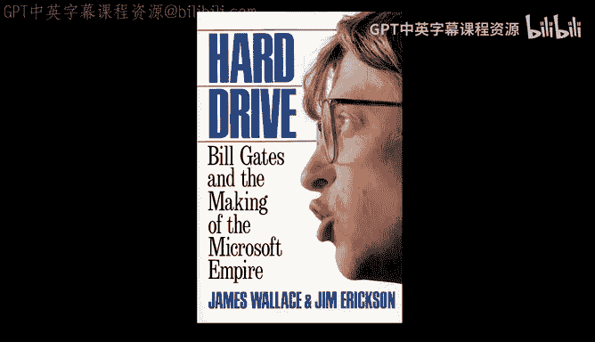
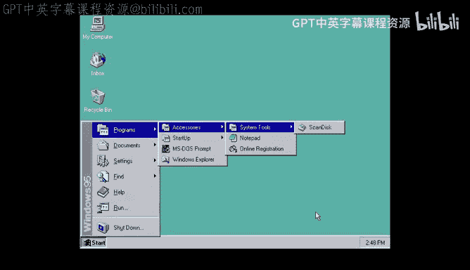
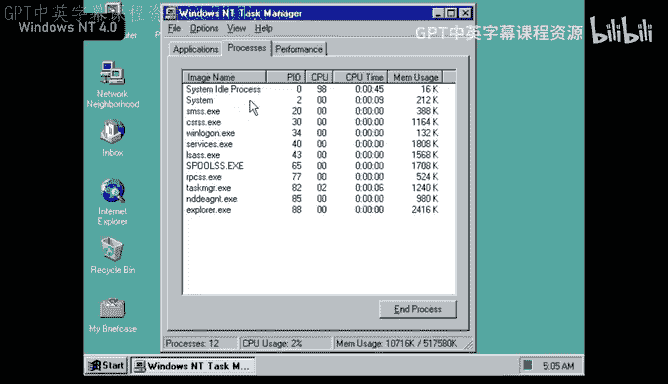
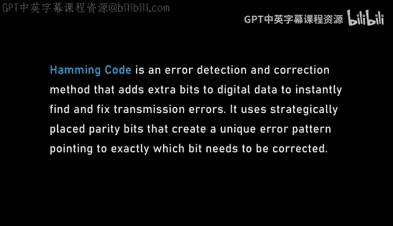
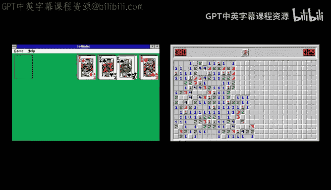
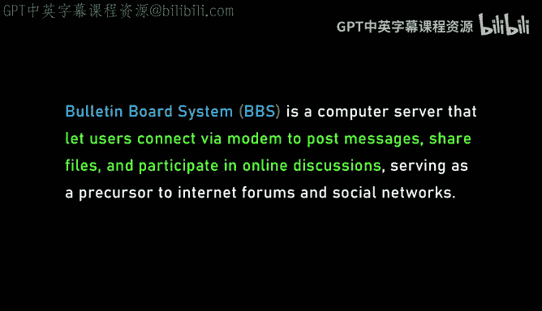
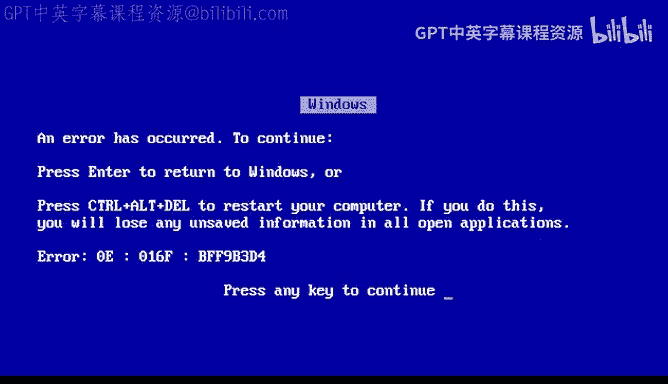
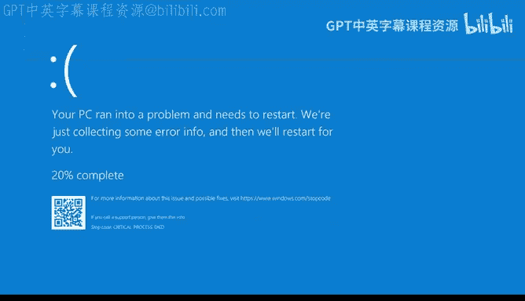
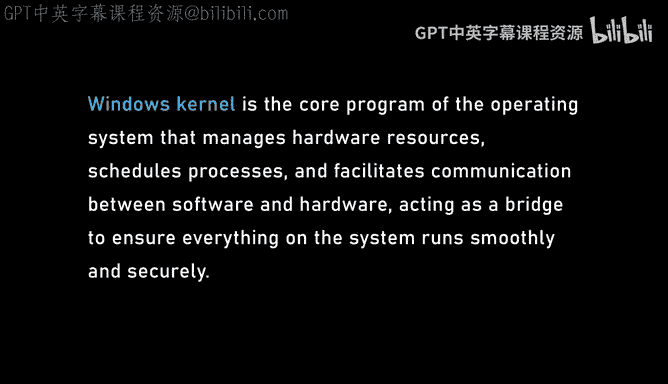
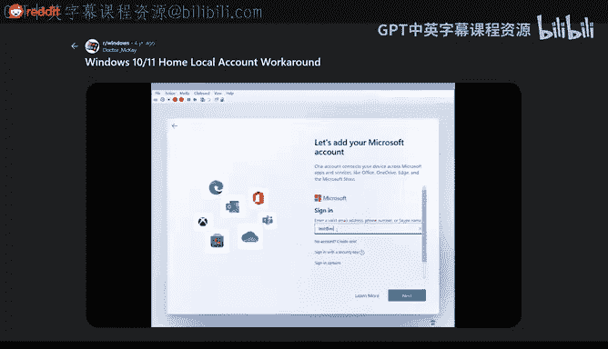

# Lex Fridman Podcast #479《Dave Plummer：编程、自闭症，以及老派微软的故事》中英字幕 - P1 - GPT中英字幕课程资源 - BV1UuvdB4EZX

The following is a conversation with Dave Plummer， programmer and an old school Microsoft software engineer who helped work on Windows 95 and T and XP。

 building a lot of incredible tools， some of which have been continuously used by hundreds of millions of people like the famed Windows task manager。

 Yes， the Windows task manager， and the Zip on Zip compression Support Windows。

 and he port the code for Spacecadeadet pinmball， Aka 3D pinmball to Windows。

Today he's loved by many programmers and engineers for his amazing YouTube channel calledDa's Garage。

 you should definitely go check out。Also， he wrote a book on autism and about his life story called Secrets of the Autistic Millionaire。

 where he gives really interesting insights about how to navigate relationships。

 career and day to day life with autism。All this taken together。

 this was a super fun conversation about the history and future of programming， computing。

 technology， and just building cool stuff in the proverbial garage。

This is Alex Friman podcast to support it， please check on our sponsors in the description， and now。

 dear friends， here's Dave Plumber。Tell me about your first computer。 Do you remember， I do。

 I didn't own my first computer for a long time， but the first computer ever used was a T S 80 Model 1 level 1。

4K machine。 And I rode my bike in fifth or  sixth grade。 So I was about 11 to the local radio shack。

And you know， they had the standard component stereo systems and everything else radioiosh had。

 but they had a stack of boxes that was labeled computer。

 and so I was asking the people that worked there about it and they said they just got it and they hadn't set it up yet。

And so I was rather precocious and I figured we all set it up for you and they say， okay。

 have a shot， did you know what you were doing Abs not， I mean。

 it's no worse than that component stereo。 The only thing is that tandy and their infinite wisdom use the same five pinned in connector for power video and I think cassettes so they're all identical and if you plug them in wrong。

 you'd build up。So I read the label。And got it working and wanted to playing with it and not knowing anything about computers。

 so I'mtyping English commands into it and you know， print 2 plus2 works perfectly yet。

More simple in English did you enter into a basic level one interpreter。

 not going to get you very far， so you're trying to talk to it in English， yeah。

Didn't know any better， and I still have an old fullcap that I wrote in sixth grade of a program that's kind of logically correct。

 but has no chance of working on any interpreter that existed at the time so。

It took me a while to figure what was actually going on with him。

 but I rode my bike down there every Thursday and Saturday and they had gracious to let me use the machines。

 when was this 7980 okay what was the state of the art of computing back then So what are we talking about Well。

 the big three had come out There was a TRS80 Model1 there was the pet 2001 and the Apple 2 came out roughly simultaneous Apple 2 would you say that's the greatest computer ever built Probably in retrospect。

Well， I would probably give that to the Com 64。 Yeah， you and I agree on this。

 that was my first computer。Probably many years after it was released。 But yeah。

 Commodore 64 is incredible， but yes， Apple2 had a huge impact on the history of personal computers。

 right， it's hard to gauge the long- termm impact。 but I think the 64 itself probably influence more people。

 So that's my reason for picking that one。 You think so。 the sales are certainly higher。

 So Commodore 64 sold a lot。 Yeah， I mean， the numbers are hard to believe it depends which numbers you believe。

 but even the medium estimates are pretty high。All right， cool。

 so you eventually graduated to the Commodore 64。Like tell me about that machine。

 What did you do on the Comore 64。 Well， the first thing I did was overheat the floppy drive on us。

 which was unfortunate because it wasn't a warranty machine。

 We had my parents didn't have a lot of money。 So we bought it from computer house as opposed to one of the major retailers。

 which meant when it died。 It had to go back to Germany or something to be fixed。

 So I was left with no floppy。 And so I had a cassette deck。

 which was the best you could do at the time。 And so I was writing small things。

 And I had a machine language monitor that you could load from cassette。

 didn't have an asemler built in， but a disassembers to get into the op codes and 6502 in Hex。

 And if you were careful planning， you'd be able to write some basic programs。

 So that's kind of how I learned。And。The first thing I ever wrote on it was a clone of Galaga， No。

 it's a bad clone of Galaga， but it has the major enemies that attack over time and it's all written in hand codeed machine language and you can't relocate 6502 so if you need to add code in the middle you need to manually and sort of jump to somewhere else。

 do your work， jump back to where you were it's just hideous spaghetti code。

But it all worked eventually。And I went to make a backup of it to preserve it for future scholars or whatever hell I was doing。

I copied my blank floppy onto my data floppy。So that was my first experience with data management and so I don't have a copy of my first program anymore What was I feeling like you remember of just doing something if I may say so like stupid you know。

 which is a part of the programming experience Yeah there was a huge amount of guilt because right you destroyed several weeks of work and you know it was because you rushed or you did something stupid or you made it unwise choice can you tell me about the programming involved know so it's literally machine language so machine not not as yet because there was no as built in so I should have run an as written an as is my first task but I wasn't that clever so how hard is that to do trivial and it's one of those things that sticks I think you do so many times。

You know， if I give you a C issue， there are certain syntactic issues and see that you're never going to forget and get wrong。

 Yeah， and it's just one of those。 I think what are the limitations of programming a machine code as a programmer。

 The biggest issue is you have to write completely sequentially Because at least in that variant 6502。

 you can't add things later， You can only add things on the end。

 So it's like programming tape in a way， What was the most complicated thing you've built with a machine language。

That game would be， I mean， in assembly language， I've done a fair bit of complicated stuff。

 but in actual machine language， I think that game would be the only thing I've actually literally built a game。

 not a great game， but it worked All right， and then you erased it。 I did All right。

 When did you first fall in love with programming When you figured out like this is a this is something special I think there was two stages for me。

 I always knew immediately that I was fascinated with these machines from the ti Sta Model1。

 It's all I wanted to do is ride my bike back there and have more time with it。And I did that。

 you know， to wear up my welcome as much as I could。 And the other revelation came。

 I think about second or third year university when I realized I love programming。

 but I have no idea what I'm going to do。 am I going to make the 12 flash on a VCR somewhere or am I going to go work on our operating system。

 I have absolutely no idea what I'm going to do post graduation。But I love what I do。

And so I think that was a lot of consolation。 It's like。

 it doesn't really matter what I'm doing at this point because I kind of love doing it。

 So so you'll figure it out Yeah， as long as you're following this kind of feeling I knew I was in the right area funny。

All right， you dropped out of high school。 Yeah， not the smart move。 Okay。

 but you ended up going back to school and being very successful at school and just in general。

 successful as a programmers and developers a creator of software how are you able to find your way Can you tell that journey of dropping out and then finding your way back There's no moment when I dropped out you just go less and less and less and until you realize it's gonna be embarrassing if I show up because I haven't been there in a long time and then pretty soon you're just not going and that's how you drop out of high school。

 So if you find yourself on that path， Stop doing that。Um but that's precisely what I did。

 and so now I'm not at school and I have to get a job。

 so I'm working at 711 in a paint warehouse and stuff like that。

And 711 is actually kind of an interesting job because it's a job I think they keep rotating for people that are smart enough to do the night shift with all the accounting and the administration and stuff they make the night shift do。

 but that have reasons personally that they need to work at 7 11。Um。

 then I was one of those people because I had no high school diploma。

What are some memorable moments from that time at 711 maybe。

What do you appreciate about the difficulty of that job， Probably the worst moment for me， I mean。

 I got held up at knife point stuff and that's all entertaining， but the worst is the most。

The suckiest part for me was doing the gas dips。 you've got a long it's like a 15 or 20 foot wooden stick。

 and it's measured in gradients of inches and feet， and you drop it into the gasoline tanks。

 and then you bring it up and you measure where the gasoline sit because there's no electronic sensor。

 So I'm doing that。 And the first time I do it， I'd drop the pull and I rerab it。 Well。

 that's about 1000 splinters of wood into your hands and it's 40 below oath and that really sucked。

 Oh wow I realize I don't want to do this whole life。 I knew that。

 So okay so you stand there frozen with splinters in your hand。 And at some point。

 I have a revelation about my life。 that next time I'm gonna to do it differently。

And then how ludicrous that is hits me about three seconds later， right？

And I think that was really the moment for me where I realized that I've got to do something different and so even though I was 21 I went and I talked to the principal of my local high school and I was like。

 can you let me back in and he's" no you're too old？"，And we don't have room， it was his main reason。

And I said， well between now and then somebody's gonna drop up， so you'll have room。

 so let's assume you have room kind of come back and he was gracious and let me come back and so I did the three or four classes that I needed Yeah。

 you know， just if you can linger on that the slow dropping out that's a weird thing that you can do with your brain。

 you realize to yourself that you don't have to do the thing that everybody else is doing and that's a dangerous realization because like you kind of have to to be part as how you do certain things right and if you realize like you don't have to do what everybody else is doing。

You can either have an incredible life or a really difficult life Well the problem in that process is you're making a much smaller decision I'm just not gonna go to class today yeah and that's all you're deciding but you do that enough times you're making a much bigger decision and that's the problem so it's better to make if you want to live life in a nonstand way it's better to make the big decision explicitly and then you can stop going yeah don't allow yourself to make the the it'll be made for you。

Okay， well， you got back and you eventually went to college and were very successful as a student and you weren't that good of a student before no I was a terrible student in high school and even my first semester of。

College， I still wasn't taking it quite serious because I got Mer passed in geometrytry 90。

 which is like the makeup class for the geometry  fourthth grade class that I didn't have。

And that scared me because I realized by 1% or the grace of the professor that let me through。

I just what ended my entire university career here。

 so fortunately those marks don't count any transcript because ofre remedial classes。

 and so I got kind of a fresh start the next semester and did it for real and did it for me。

And that made all the difference Well can you speak to him maybe by way of advice on how to be successful as a student Well ideally。

 there's some aspect of school that you do enjoy， whether it's arts， whether it's computer science。

 whether it's shop class， whatever， so go for those classes and。

Just put up with and do the hard stuff because it's way easier than having to do it later and that's easy to say when you're 50 something it's harder to say when you're 15 something but yeah it makes a lot of sense。

 All right， what's the story of you joining Microsoft How do we get to there from 711 to Microsoft Yeah that's a big jump So I had gone back to school and I think it was my third year of university。

 I was working for the phone company for the summer as a summer job and I'm doing conversions of their UBNe to TCPIP and modern networking。

Which really ams these swapping cars， but then figuring out why they're confid out cis doesn't allow Lotus to run anymore because it's got 10k less than I used to and it's just a horrible time to be working in computers。

 but I was doing it。And at lunch I'm sitting in the food court with the old and the board and I'm reading a book that I had bought called Microsoft or Bill Gates in the Ma of Microsoft hard drive。

 I think is the title。And it's a great book， it's just sort of a matter of fact history of how Microsoft came to be。

 what it's like， how it operates， what the people are like there。

And I'm reading this book and I become really intst by and fascinated because it sounds like exactly the place that I want to be。

 but I'm in Saskatchewans what am I going to do about it？

And what I wound up doing was I had put myself through school with a program called hyperperCash。

 which is a file system cache for the Umiga because Umiga didn't have any out of the box。

And it had done reasonably well。 And so I went through my registration cards because in those days。

 you had a4 by6 card that people had to fill out with their name and their address。

 And if they had an email， their email and they send it in。

 they get notifications of updates and so on when it shareer。

And I went through the whole stack looking for anybody with a Microsoft email address。

 and I found maybe three or four people and I just cold emailed them and said，  hey。

 I'm an operating system student in Saskatchewan looking for an opportunity。

 I don't remember exactly what I said。But one guy， Aair。Helster Banks， he wrote back， and he said。

 I know somebody that I can put in contact with。 and he put me in contact。

 I with a guy named Ben Sifka， who did a phone interview who eventually went to pi me to work in M。

 S。 Dos for the summer。 So last time I got there， You put yourself to school by。

Tell him about Hycash， he build a piece of software， it's the weight loss program for hard drives。

That was sufficiently useful to a large number of people that would somehow give you money。 Yeah。

 it made decent money。 I mean， I sold a couple thousand copies 20 bucks a copy or 40 bucks copy what languages that written in see So there was some assembly the actual really tight code to do the real work of transfer data to and from the cache with 68000 assembly everything else was C Okay this is like file system I owe device block I owe So any block that gets service from the drive would go through my cache first and it was an anyway associative cache and so it would try to match the geometry of the drive and do prefetch based on you trying to read a whole track at one time that kind of thing whats it like。

Trying to get your software out there at that time， like where， how are you able to find customers？

Yeah， it's interesting。 I think I started on UseNe and some of the Amiga forums posted。

 here's my trial version tried it out for 30 days to what you like。

And eventually got picked up by a few retailers and I remember I was with my now wife in her car and she had a cell phone because her dad was concerned about her safety and so this is late 80s and she' got you know the antenna on the roof and the big box in the trunk the whole deal but we got a call from one of the software retailers that wanted to buy 50 copies at 20 bucks which to me is  a thousand0 bucks which in 1989 or whatever year it is was a big deal and so eventually a number of companies just bought an inventory Let's go to that time It's such an interesting time with Bill Gates and Microsoft。

Why do you think Microsoft was dominating the software in the personal computing space at that time and really for many。

 many， many years after at the time， it was the single most potent assemblage of smart people that I've ever been a part of。

 and I've been an academia and I've been an industry to a certain extent and。

You know that when you're working at a regular computer company。

 the one guy who actually knows what he's doing， his smarter friend， he probably works at Microsoft。

 So when you get there， you're the big chief from your small town and you think you know it lot and all of a sudden you're just in an environment where you' like。

 oh， I'm not gonna speak because I don't want to look stupid。Okay。

 u what are what about Bill Gates himself， what are some qualities of Bill Gates that you think contribute to the success of Microsoft I think he was relentless in the pursuit of his one dream。

 which was his old slogan of a computer in every home and a computer in every desk。

It was his special interest。 And he was a smart guy， super determined。

 And he hired people that were as smart or smarter than him to help him execute it。

 And he built an almost unstoppable machine of intellect to go forth and make。

Let's say very simple products。 M Dos is not a complicated product by any stretch。

 but it's exactly what the market needed at that time。 Yeah， I mean， M Dos changed the game。

And that's actually the team you joined， that Mosdo's team。

 and I think you joined before1095 was released。So tell me about the story of MS Dos。

 it's successive and MS Dos is probably pivotal to the success of Microsoft Yeah before DoOSs。

 they were largely a language company， so they had made basic for a lot of computers they had a fourran compiler and a Pascalel compiler。

 that kind of thing， but their deal to have MS Dos included with every version or every instance of the PC effectively set them as a standard and they were able to leverage for decades going forward。

And to certain extent， they luck into that。 and on the other hand。

 they were smart to have done it so。Ca they didn't charge at IBM a lot of money for it。

 but making it a standard。Really play out to their advantage over time So at that time， Emmas Dos。

 no graphical interface。 Can you just speak to what the heck Emmas Doss is。

 It's largely a command launcher， So you type in a name of a command it looks up to see if that's in the current directory or run a special pass of folders and it loads it into memory and executes it if it's there。

And that's 90% of what MSDOS does now it has environment variables and some complexity and a small scripting language built in。

 but it is basically just an operating system shell that allows you to use the resources of the computer like the hard drive or the CPU and it doesn't allow you to multitask。

 there's no graphical interface now Microsoft did add a textbased graphical interface for things like an editor and Quickbasic。

In DoOS5， I believe and it was a DoOShell， which was sort of a graphical file manager in MSdoOS 4。

 so they experimented with it， but it's largely a command prompt does it have ability to communicate with external devices so drivers and all that kind of stuff like how expansive of an operating system was almost DoOSs Well。

 it was limited by the original X86 instruction set which limited it to 640k and then there was various bandais on top of that to do highM and then extended memory beyond that。

And。A lot of hoops have to be jumped through to make anything work without a consuming base Ram。

 Yeah， I mean so you programmed on MSsdos。 what's it like， what are some interesting details there。

 like you said， there's the memory constraints of 640 Kbys。

640 is the maximum that's ever gonna be available So it's not what's available to you as an operating system developer because whatever you use is what the user won't get So if you use 10k needlessly。

 you're gonna every machine in the world and that has 10 less。 that's kind of a big responsibility。

 I that a true quote from Bill Gates he said nobody will ever need more than 640 it's not him。

 it's been attributed to him but not real so I mean。

 what are some interesting aspects of that you were able to do as an intern And when you joined on MSs Dos and beyond one of the first things I did was to take smart driveri。

 the disk because I had familiar with thisc is and to add C Rom Caching into it because I was new C Roms were。

Just coming out， Microsoft Bookhelf is one of the few products you could run for it。

 and as you can imagine， caching a CD speeds it up by dozens of times if you're smart about it。

 so it was a big performance win and a nice thing to work on。Um。

 a bigger part of that was moving a bunch of smart drive and eventually the double space compression engine up into what's known in as high memory。

And without rat holding on the technical aspect of it， on the X86。

 there's something I believe called the A20 line， and I probably have this backwards or I got a 5050 shot at it。

If you've got the A20 line asserted， then your memory pointers wrap at the1 megabyte mark。And if not。

 they don't， so you continue going up in memory so you can rewrite memory above by combining your segments and offset registers to a number bigger than one megabyte and you get an extra 64K。

And you put your code in there and then you just put stubs to jump to it from low memory and so you can get another 64K out of the machine that way and we did that for a couple of the products and's I had no idea what highM was because I was an a Miga programmer and I'd never written any X86 code before I got there so。

So that was like a cool optimization that you got to be a part of Yeah so what about Windows there was a parallel development of Windows 95 right at that time you get you get a chance to interact with those folks I actually worked on Windows 95 for about three or four months I was on the commal8 team doing the presentation cache which is when you insert a say a word or an Excel spreadsheet or chart into a word document。

You don't want Excel to have to be loaded the rendered every time。

 so there's a presentation cache of enhanced metaes and I was working on that。

So that' shipped in Windows 95， but I moved to the She team about six months after getting to Microsoft and so I worked on Nt from there forward Okay。

 and what's 95， what's Nt Windows 95 is an evolution of the original 16 bit Windows 31。

 which was the very first popular version of Windows。

And it adds 32 bit supports and VXD drivers and a bunch of new technology and an entirely new user interface。

 and it's something that at the time was revolutionary。

 that people lined up at night to wait in line to buy the thing。Can you just。

Take us back to that time and describe why 95 was such a big leap from 3，1。

 So Apple already had a graphical interface。 Windows 3，1 had a graphical interface。

 Well w was when 95 such a gigantic leap。 I don't want to make it as basic as the start menu。

 But I think it's a big part of it。 I know when I first saw it。

 I couldn't quantify what about it was different and awesome。

 But I realized that I wanted to be a part of it。 And that's why I started writing a shell extension。

 which became zip folderers at some point。 But I was just fascinated by the new shell。

 And that's why I went up working on the team that brought that shell over to the N T and what's Windows today。

😊。

Would you say that's the greatest？Operating system ever。

 What's the most impactful operating system ever， When is I if I would be number two for me。

 I think O S 360 is going be number one。 Okay， interesting。

 Did you take a machine and write a co ball program forward it in 1962， jump in your time machine。

 go to Poughkeeppsie and boot up an IBMZ 17 mainframe and run it today。

And they've been doing it for however many years that is。And it's all in the business side。

 so we as consumers don't have much access to it， but I think it was probably as influential in the commercial side as Windows 95 was in the home side。

 and then probably Linux would be number three for me。I put Linux as bigger than Mux。

 which doesn't work because you can't have one without the other， but the impact of Mux。

 BSD and so forth is largely in the academic space。It's five programmers， for programmers。 So yeah。

 Linux created。I mean， it was the embodiment of the open source spirit。At its largest scale。

 all right， so this almost created a community。And it created a spirit of programming that propagates this day。

That's true。 That's true。 Like scale matters。 Yeah。

 and as' penetration on the server side of things now is。

I don't know it's equivalent to what system 360 achieved， but it's almost ubiquitous So yeah。

 the world， this is the quiet secret of the universe is it runs on Linux Okay。

 so tell me about the days your work days what were they like back then back back in the Ams Dos Windows 95 days Take me through a productive day well your day starts。

Come in in and you got to download the address book。

 which is Microsoft has between 10 and 15000 employees at this point。 and we're all on MSmail。

 We're just getting off of the PDp 11 called Miss Pigy。

 which ran Wizma and we' run an MSmail but MSmail has a fixed address book that every user must download every morning and when there's 10000 people downloading 10000 people it gets pretty messy and I think we're on 10 mebit networking at the time。

 So your first hour is downloading the address book， which was always frustrating。

 But you'd use that time to look at the crashes that would have happened overnight from a process we called stress which is an Nt all the machines that are unused run tests all night long and they try to crash themselves。

 and if they managed to crash themselves， it will drop into a debugger where the serial cable to another machine and you can connect that other machine and remotely debu the crashed machine So you come in and they will have triage bugs know there was a crash in the start menu So we'll assign that to Dave and so you come in and that's your first thing is to connect because you gotta get that machine back to the guy that owns it and unlock the machine。

So。That's your first hour of your day is basically treeage for bugs that have come up from stress overnight。

And then at that point is probably back to coding which unfortunately 80% of the time is fixing bugs。

 especially in my career， it was porting code and fixing bugs， I wasn't writing a lot of new code。

 there were exceptions I wrote a lot of new code on the side。

To get it out of my system from a day day to day grind of always fixing bugs in other people's code。

 which is amazing learning experience。 So you did a lot of the at Microsofts stuff。

 you did a lot of the porting of what is it Windows 95 code to Nt Yeah。

 we took the entire Windows 95 user interface and we port to Nt which me man making a Unicode for one thing So everything that was 8 bits is now 16 bits so pointers it's quite a mess when you switch the code over you can imagine Can you give us insights and what is involved importing So like breaking it into somebody's house and going through all their stuff and seeing the stuff in their drawers that they didn't want you to see you find all the good stuff the pretty pictures hanging on the wall and you find some disturbing stuff in the nightstand。

I saw a code that was like 200 some characters wide with， you know。

 profanity and swears in it and let's eventually got it all cleaned up over the years by the time I left。

 but。It was not always the most professional code in the world， right。

 because every single piece of code you have to go through line by line， you see it all。 Yeah， yeah。

 I mean， that's the that's the story of programmers。

 you think you write a piece of code and you think you'll never。

They'll never be seen by anybody and sometimes oftentimes that code is going to be seen by a very large number of people that come after you。

 including you five years later。You yourself looking at your own code， Okay。

 so tell me about Windows and T。That was a giant leave too。 It was。

 was basically a clean sheet design， so they went and they got Dave Cutler from digital equipment who had done operating systems for them VMS and Rsx 11。

 he had done and so he came over after I believe it was prism and Mah were some projects at deck West that got canceled and so he had a whole team of guys whether their projects canceled and basically they took a whole bunch of them and came to Microsoft。

 and I don't know the specifically with the deal， but they all showed up so that Dave Culer and Marklowski and all these really smart guys from De and they did basically a clean sheet。

 but they also had OS2 as a starting point， but OS2 is of course written in assembly language and N T is going to be written in C So to what extent they were able to leverage any of that I don't actually know。

But at least they had a system to start with。 He said that Dave Coler is the man。

The mind behind windows， can you can you explain， So Dave color is the architect of the colonel。

 So he is Linus。In the Linux world， it's Dave C in the Windows world Dave C and it's not that there weren't other people that contributed。

 of course， huge pieces to it， but I think he's the driving force behind it and always largely has been。

 and he's still I think he's 85 now he still codes every day He's a Microsoft fellows far as I know still goes in the work。

 So can you speak to the genius of that guy like' what's interesting about his mind having walking with him having interacted with Dave Well。

 the dude's wicked smart。 but he's also like a farmer He's like the guy that will follow you around and make sure that stuff gets done and gets done right to make sure that you're not checking any crap into his operating system and he won't tolerate it。

 And he's a real taskmaster in that regard。 but I think it really paid off because it was a very big paradigm shift for Microsoft developers to be subjected to the。

Dave Cutler digital equipment style of leadership。what did you learn from that about successful software teams where there's a large number of people collaborating？

So Microsoft's had a lot of brilliant engineers back then and like you said， Dave Col， they had to。

They had to create completely new systems， many of which it were still used today。

What have you learned about great software engineering teams from that time， Tos are everything。

 I think， for one， preparing people or everything。 We'll just give that as a granted。

 But the tool set is a huge fact。 If we would head gi， it would have been immensely easier。

 We were using diff and。You know manual deltas to do the sporting and stuff so being able to fork a branch of source code would be a luxury that is new to me so。

At the time it would have been really handy， what were some memorable conversations from that time when you walked over next door but what I was not present for was somebody was complaining new hire came into the team and was working on what I believe was called Cairo and Cairo was going to be the next future operating system was going to be beautiful and have a whole new user interface newer than when he was 95。

And it never materialized， but while they were working on it。

 one of the guys was working on Cairo was kind of flaming on the open anti devb alias。

 which is thousands of people how shitty the anti boot experience was。

And the response that came back was an epic flame that I wish I would have saved。

 and I won't name the guy who wrote it。 He knows who he is， but。

It was the work of art of angry F mail kind of like the one you see Lion ofcent you now and then about kernel stuff so it's a very similar sentiment where there like kind of intellectual debates like oh there's some heated stuff it was engineers yeah it got contentious so you've got intellects competing and eventually the technical merits for some people are second area and it's about besting the other person in that argument。

And it's no longer productive at that point half the time， but there was a fair bit of that。Yeah。

 I've seen those kind of debates in like programming language design communities。

And like Guto Vanrassum， the leaders of those communities that can wear them down does people get。

You almost like forget the mission you're on and start being very nitpicy about the details。

 I mean engineering minds。Get together and you just go to war over the stupidest like syntax subtlety right was I shouldn't say stupid。

 but it's a small syntax subtlety for it that's for programming language I'm sure there's internal battles about specific kernel components Yeah I mean there was one that I lost that still bugs me to this day I think。

It still like I was right well when we were doing the shell。

 we were reporting everything from acidD Unicode， so every character that was8 bits now becomes 16 bits now the problem is I'm on a MIPS box because I'm porting it to risk。

And you can't have unaligned addresses， but if you take two IDistss。

 which are basically pass components， you take the one for C Co and backslash。

 take the one for Windows， take the one for system 32 and you add them together。

 but if you've got an odd number of characters， now you're at an odd address in this thing and it takes me an immense amount of work to turn on exception handlers to do unaligned byte access to pull the string out and copy it manually it's just it's literally like 100 to10 times the amount of work to read a string out of this ID list。

On a Mips machine because it's unlineed。 So I'm having the argument that even though it's late in the when it's 95。

 they've already shipped to one beta that we should now just guarantee that I needless there are always an even number bytes or do some hack to just make sure this never happens。

 So the code that references among other hard work can just blaze through it。

And it became a shouting match and sort of a personal match and I lost that one。

 and I still think that I know today that that code running on Windows is thousands of times slower than it has to be and it nobody cares because it's plenty faster。

 but it could be a lot faster。Yeah， so I I mean， you mentioned mips and risk。

 how deeply did you have to understand the lowest level？

Sot of the lowest level of the software and even the hardware with the stuff you are building。

 like what are the layers of the abstractions you have to understand to be successful with all the stuff you're doing with Nt and before that with the as Well。

 but half your day is going to be spent debugging and and most of the time is going to be spent in call stacks that are in pure assembly language because there's no source level of debugging。

So it's not like we're in visual studio and you hit a breakpoint and it pops up and there's the source code you can go look at the source code but you're looking at the raw assembly dump from the machine or the even if you're programming in see the debugging is in assembly 100% man so it's a little cumbersome better yeah we're doing four instruction sets because we're doing Intel MIps and power PC so depending on which machine it crashes on you've got an entirely different instruction set the registers and so you get reasonably adapted debugging all four but I had more experience in MIps MIPS stuff would come my way that's a real endurance I mean can you speak to that the torture there's debugging especially that kind of debugging without without the tooling associated with it I mean that's you know programming。

Kids these days programming isn't all about creating beautiful things， right， it's also about。

Fixing things。 Yeah， I would say that 20% of my professional life has been creating and 80% has been debugging and fixing。

 Yeah， and I mean， I got a bit of reputation as somebody could fix stuff。

 And so stuff like that would flow to me。 And so I would spend more time doing that。

 I wasn't renowned as a creative UI genius where I'm following all these new ideas。

 So I got to fix ugly stuff。 But you get really good at that。

 So I don't mind it until it's one of those things where you've been chasing it for so long that you don't know what to do next。

 And you can't understand why it doesn't work or how it ever worked or whatever situation you happen to be in。

And。You know， after a day of it， it can get pretty trying yeah debugging can be real torture can be really really difficult there's a psychological component I think。

 of perseverance。 I think the ones that you know take you a day， they resolve one of two ways。

 either it's like， oh extra semico and then you finally see it or it's sung horrible manifestation of cross-threaded department nonsense that was really hard。

 but it can go both ways。I had a bug， it wasn't my bug actually。

 but it was a manifestation of a bug in task Manager。

 where every now and then it would say greater than 100% total CPUU usage。

And this looks pretty silly for a task manager。I had tried to resolve it for a long time。

 and I'd talked to the colonel guys about my issue and they were unsympathetic。

 let's say because the colonel guys are a special breed and they weren't interested in my user land problems。

 It's probably some issue in my code right， And they're probably right。 But it wasn't in this case。

 And I was sure of it。 And so I kept adding asserts all through the code to make sure that that the preparatory steps of adding the stuff together were never more than 100 and that the final sum was never more than 100。

 And finally。It never asserted。But occasionally we would get this bug where people would still see it。

 and so I finally put my phone number in the assert。And I was like。

 if you see this message called APL at 425836， my phone number。嗯。And finally。

 we did get a catch in the actual stress debugger that I was talking about earlier where it happened to somebody with a debugger connected。

 we were able to go through and it was actually a kernel accounting issue and it wasn't a task manager issue so they just text it in the kernel once I was able to prove that it was。

 in fact， the kernel issue。And youd think we would then remove my phone number。

 but we just commented it out。 So it's shipped and it's in all the damn source code leaks for and that are out there。

 So that's how I find task manager code is I search for my phone number on Google and it will。

Reverse file the empty source code can speaks to the assert thing， by the way， I saw。

 I think he tweeted or he said somewhere that if you want to take your search really seriously you add your your home phone number in there it's true it's so facetious because it's probably not the smartest thing。

 but no you will find out， but I mean assert by itself is already a serious thing because it stops at all execution this is one of the reasons that really。

 really love asserts because they。They stop everything and force you to take care of the problem。

 Yeah， I'm a little religious about my asserts， too。 I don't assert things that I hope aren't true。

 I assert things that I know cannot be true。And I think that's really the intent of an assertion。

 so I'm overstating the obvious， but when it does occur， it's a bug plain and simple。

 it's not a warning。It's kind of fascinating how often it can really help you figure out the problem because if you put asserts everywhere。

 you can get very quickly to the source of the problem。 Yeah。

 I tend to it's not something that I want to suggest you go back and add later。

 it's something you should do organically as you build your code So for each function。

 if you've got assumptions like I know that this point there is never no。

 well that if you know this count is always less than twice the bite with assert that。

 and don't be afraid because if it asserts， it's doing you a favor。 I think some people are afraid。

 it's like when you turn out of an intersection and you think maybe there's somebody coming and you don't look left。

 or maybe I want to do that。 But it's like that， people don't assert because they're afraid they're gonna fire。

 Well though you want to know。You mentioned task manager。Obviously， we have to talk about this。

 the legendary program that you created。 the Windows task manager。

 Tell me every detail of how you built it。 What is Windows task manager。

 So what is task Manager is a way to go in and find out which apps on your system are using the computer。

 using the hardware using the CPU using the memory and which ones might be using too much or locked up or。

Going crazy。 And it gives you the ability to terminate and kill those ones。

 So it's an inspection and a fixing tool。 Yeah， it list all the processes。 I mean。

 it's a legendary piece of software。 It's crazy you just take it for granted。

 It's like the start menu right Yeah， it's like genius Why had the great fortune of working on on a lot of things that people are familiar with and task manager is one of those side projects that I started as something that I wanted for myself。

😊，And eventually came in house， so I started writing it at home。

And I got kind of the basics up and running and I was using。

 I think it' H key current perform H key performance in the registry to get the stats because I didn't have access to the internal APIs because I was working from home and I don't call those if I'm working from home and when I brought it in house then I was able to call things like antiquery system information or antique process information and get the real。

Answers very quickly， which enabled it to become a very fast responsive app so people have come to rely on it because I wrote it to be as reliable as possible。

 I wasn't worried about features。 it was a basic set of functionality that I wanted in there。

 and I got everything I wanted。But I wanted it to be really robust。

 And so that and small and the original was like 87 k。 Okay。

 can you speak to what it takes to build a piece of software like that that doesn't freeze。

You don't assume much right if you're going to call the shell to run an app well that could be a network path that's on a TCP share that takes 90 seconds to time out so anytime you do any kind of API colgue that that could take time you're going to wind up doing it on a separate thread and so the app becomes a little bit more complex because everything is multithreaded Okay so what programming language where you're working in see。

So this was for Windows and and T Yes， Okay， so this shipped initially in N4。 Okay。

 so what is mentioning details about this program because you have to get it as simple as possible。

But also as robust as possible。Now， what are some interesting optimizations， for example。

 you had to implement。 There's a couple things I there a little hardcore now。 I'm surprised I did。

 Like I didn't want to link to the C runtimes at all。 So I made sure never to call a runtime call。

 and I didn't link to them。 And that saved me whatever the C runtime is 96 k or something。

 So you it' almost double the size of the app。 If you just touched any C call。

 So I was careful not to do that。 But then I was actually writing a C plus plus。

 which is C with objects more than anything， but。In order to get it to work。

 I had to go through and call all the object instructors manually from the dispatch table and stuff because you don't have the runtime to do it for you。

 so you're working with a compiler that doesn't have its runtime and I don't want to rahole on the technical issues。

 but it's a lot of extra work to get it to work but when you do it's incredibly small and tight that's about the size the program what is the mission aspects of tracking down like every process and how much CPUU usage。

One of the cool things that I saw is。I don't want to say I invented hammon code。

 but I kind of invented havinging code without knowing havingming code existed。

 so every column and every row and task manager has a bit on whether it's become dirty or not and then I can look basically the same way Hamming code looks in your X and Y columns to find out which rows have changed。

 go through and find out which ones actually need to be repainted so task manager is super efficient and it works in concert with the list view control which provides that functionality to go through and repaint as little as an individual cell。

That changes from frame to frame。 So it can paint very fast。 It can resize very smoothly。

 and resizing was probably my biggest。Personal goal with that app so you can size it to any size and it still works and。

Even if you have 32 CPUs， which wasn't possible in the day， a little draw。

 I think only eight graphs and then it wraps， but it still works today， som kind of proud of that。

It's just incredible。 You've gotten the chance to sort of observe the evolution of task manager。

 In some ways， it really hasn't changed much。 Maybe there's some prettier aspects to it that fit into the whatever version of Windows it's in。

 but it's really basically the same thing。 The functionality is very same。

 The reporting is more because they've added a GPU and thermals and things like that。

 which is really nice to have we didn't have that ability in the day， So I mean。

 what can you say do you know about like it was there any refactoring done or is it basically the same code。

 as far as I know， the original code still mostly all there。

 So there are layers of drawing code and dark mode code and whatever else Xml schema code that goes on top of that that makes it 4 MBbytes instead 87 k。

 but that's the world we live And so。Yes， one of those pieces of software you create and just state what once it's there。

 it is really like the start menu and then I'm sure if you remove it。

People would just lose their mind， Yeah， I might be locked in for a while on that one。

 it might be good。Yeah， I thought that would be true for Clipy， but。Oh。

 clip you will make it back one day。😔，All right， what， what are some？

Other pieces of software you created at the time that are legendary。

 So you were part of space cadet pinball at least porting Yeah so they came into my office and said what you doing And I told what I to do and said。

  do you want to spend your next three months I said I have no idea and  you want to port pinball and I'd seen basically that pinball as a game standalone for the 195 platform and I had a couple different tables and it was a cool game so I was kind of excited what they wanted was some visual splash for N to show that Nque can do for that and highpe graphics and or at least responsive graphics and so I took a shot and unfortunately a lot of the code was in assembly and I was on a MIps so I had to rewrite the code in C so I could then port it to all the different platforms。

And at the heart of the game is a huge state engine。

 it it's like a giant switch statement with if I remember like 50 entries in it， yeah。

 and it's got an Easter egg built in。And decoding the state。

 it's like running an neural network through this thing as you hit it with different states and I just put it aside and treated it as a black box and so my code runs on top of that and does the drawing and the sound and everything else。

 but the original game is still running。And somebody recently asked me why is it slightly different。

 the physics are slightly different from when it was 95 version but it should be the same code because I'm trying very hard to preserve that。

 but what it is is I had a bug where I will draw as many frames per second as I can。

 which on a modern computer could be 5，000 frames a second for pinball because it's a pretty basic game。

 and so all your physics are interpolated 5，000 times per second instead of 30 times a second or whatever you would have got in the old ones you're getting arguably better at least different physics。

But they fixed that sense。 So why is that game so awesome， I think it's a great design。 I mean。

 I take no credit for that。 That's all totally the guys it's symimatronics。

 But the original game is a great design。 It's very similar to Black Knight 2000。

 which I own as an actual physical pinball machine。 And the layout is actually very similar。

 I don't know if it was inspired by it or not。 So it's a good game。 Yeah。

 Sometimes I think about like Tetras about certain games of pretty primitive graphics。😊。

That captivate the excitement of a large number of people。

And maybe it's the excitement of a large number of people that contributes to the awesomeness of the game。

 So when many people together get excited and talk about it that sort of gets implanted into your head。

 but that's one of the great games。 mean even like solitary mindsweer。 I mean。

 there's just a generation of people they've gone to war and Minsweer right well those things were included in the US not as games。

 but as educational tools to get you to use a mouse Oh a solitres there to show you how to do drag and droprop Yeah and Minsweer probably right click I think you put in a flag or something not a Minweer guy but so each one of them teaches you science sweeper guy that's funny。

 Yeah， wow， I didn't know that that's interesting。 and that's true。

 when I don't know how many hours I've spent on these games in like millions of people spent millions of hours in these games。

 I used to volunteer teaching computer science and my kids school， for the third graders and stuff。

 So it's more like logging in than computer science but。

The kids， of course， all their dads work at Microsoft， So nobody's impressed by anything you do。

 but some of the kids found out that I worked on pinball and then they were like， whoa。

 you worked on pinball because they all knew that in those days now the kids are probably aged out。

 they don't know it anymore， but for a brief period。Uh， you're behind the windows activation。

 you're saying like it's a bad thing。U everything's a matter of perspective so tell the story of that what's Windows activation what u how'd you get involved So they came to be late in the XP ship process I don't know if the beta had gone out。

 I don't think the beta had gone out yet， but they had intended to take the office activation code and then adapt it to Windows and add activation to Windows。

But whoever was responsible for doing it had slipped at enough times that it wasn't going to happen and so I had kind of reputation for being able to fix things quickly so they came to me and said。

 can you get this done in time for XP？I don't know， but I'll try。

 so with the help of the guys that were doing the DRM stuff on the DRM side and the research guys doing the math for the product keys and everything else。

We cranked it out in time for Xp， and I don't know what an actual impact is for revenue。

 but I imagine it's substantial when you started forcing license keys。I wonder what it is。

 I don't know， because it's also。Annoying it is， especially if you have the phone activate。

 and that was just the case that we had to carry with us as an albatross around our neck where you've got to pass data up to the clearinghouse。

 the backend systems that are going to approve your key。

 you've got to tell all your hardware parameters like how much memory and hard drive space and the various things the hardware key is bound to as well as the product key and you've got encoded in letters and numbers that somebody's willing to read in over a phone。

And if you think doing product activation is painful over the phone。

 could you imagine being the person that worked on the other end of that line？I mean。

 that's just got to be mind numbing job to listen to product keys for eight hours a day Yeah。

 one of the challenges with Windows and it's been a frustration point。For me。

 but I understand from a design perspective， it's very difficult。

Is so many different kinds of people use windows， but it's been frustrating how over time Windows has more and more leaned into the direction of like。

The not not the power user， I should say， just why sort of Linux has always been really wonderful。

 But from the activation perspective or from any kind of configuration。

 its been it's been it's been a source of a lot of frustration。

 Now one of my more popular episodes of late has been why you can't move the Windows taskbar。

I had no idea but the outrage is palpable amongst people that put on the left or top and you can't act anymore and it is an affront of their resistance and I understand it to a certain extent。

 what's one of the main reasons I really just dislike there's a lot of aspects about Windows 11 I dislike one of which is like you can't customize things as much about the position of the taskbar just basic customization can we just configure stuff because there's going to be a small contingent of power users they're just gonna enjoy the hell out of this operating system if you just give them that option it costs you nothing just give them that freedom Well it does cost right because you have freedom to put the start menu on the left or the top or the right。

Really increases the complexity of the code that renders the start menu and lays out the tabs and does all the things。

 and now it's a much larger surface for bugs， and it's a much larger piece of code to maintain。

 so you probably need more developers or any another developer or some portion of a developer's time So the question becomes at what point。

 is it still worth it to satisfy the niche needs of a small set of users。

And I didn't know those decisions weren't mine to make， but I could see it from both sides。

 I think just like the people who make movies。And insert very nuanced details that only a small number of people will realize are there。

 that's going to really pay off。There's the kind of reputation that builds over time。

That has a very powerful ripple effect。That I think it has so many benefits。

Including for hiring great software engineers， it's like you create this aura of。A place。哇。

That puts love into every detail。That puts。That really takes care of the power users。

 that takes care of the developers， I think Microsoft has more and more moved in that direction with GiHub and acquiring Gitthub and just taking care of the developers。

 but on the Windows interface side，Come on， some customization with， you know， with VS code。

 you can customize everything， why can't we customize the start menu，Anyway。

 in the taskbar and really every aspect of the Windows interface， I don't。

 I don't I maybe you're right， maybe increases the complexity of the code。

I suspect that's just not the case。 I bet it was， I bet it was a scheduling decision when they rewrote the start menu。

 I think they rewrote it because it's different than the old taskbar and somebody was tasked with。

 you've got to deliver this set of functionality and if I cut out putting it on a left in the top and the right and two rows of tabs and all the other cool features。

 I can deliver it four months sooner。And I'm not saying that's the right decision。

 but I'm guessing that might be the kind of thing that motivates it。

 And they're on such a different release schedule Now。 it used to be。

You won't see much craftsmanship unless somebody owns a component for a long time and it settles to a point at the end you can work on a polish right。

 but if it's always churnin and the UIs change in every release。

 it's never going to get that level of polish， although I think the UI' is pretty nice。

 but it is nice， but I I think I just don't think it's a scheduling thing I think it's a craftsmanship thing just like you with a task manager if there's a guy or a girl in there who take ownership of it who have passionate like for them it's a thing。

That they take pride in over a period of time， they can like by themselves in a short amount of time。

 create something truly wonderful right and like I think if you have large software engineering teams with managers and scheduling of meetings and all this kind of stuff Yeah。

 okay then then your argument applies but if if you allow the flourishing of individuals that create cool shit and like their own sort of the side project。

 which Google is very good that right Google yeah yeah like have fun with it。

 like do some crazy stuff and then we'll integrate it will will try to integrate into the whole ecosystem I don't know because like to me。

There's it's such a great joy from an individual developer to create something like customization of the ceremony money of the taskbar because you know that millions of people are going to use it the the taskbar and then you know that thousands。

 tens of thousands of developers might be using to customize even little subtle aspects of the taskbar。

 you know how much joy you create，You give to people to customize to have some kind of Json thing where you customize something about the taskbar。

 Okay， how do you respond to the Steve Jobs aspect of。

Giving you customization implies that we couldn't figure out the right answer for you。

Or maybe there is no right answer and all four answers are equally right， I have no idea。

 but right I think I've always that I'm glad Apple exists。 It's a beautiful thing and。

That ideal of design is wonderful， but I always thought that the Windows creates the contrast。

 like the point of Windows is to be the operating system that works on all kinds of devices that is supposed to be much more open and they've moved towards that direction more and more with Windows subsystems for Linux。

 it's just this whole developer friendly ecosystem。the interface should be in the spirit of that。

 I think right but I do think that there could also be security vulnerabilities that created with that it's not just the complexity of the code because Windows is just under attack Yeah it's very difficult to keep it secure anyway taking that that tangent you also developed a zip file support for Windows creating visual zip like mentioned zip folders that eventually evolved into zip folders tell the story of that So that was a piece of software that I wrote it home again and what happened was I was out with my wife and I think it was a Sunday afternoon we're driving around this is 1993 and we're living in our apartment and we're just seeing what the housing market is like out there。

AndThere's a guy he's got this beautiful three bedroom house and a Corvk convertible 93 red tor red parked in the driveway and houses for sale and it's like 300 k I think。

 and there's no chance I'm coming up with 300 k at that point or even the down payment on that。

I took the flyer and I cut the picture of the house out and I taped it to my monitorator。

 and that was my incentive to just write something at night because when I came home。

 I was doing two things， I was one expressing a creativity that I couldn't get out at work when I was just fixing bugs。

And I was trying to make some extra money， and so I wrote a shell extension before I actually went to the shell team I started it and that's what led to my interest in going to the shell team based on an MSDN sample or MSJ at the time MSJ sample that I saw on how to like bring up a folder well once I had the very basic bring up a folder template adding a zip file support to it was just incremental all the way。

And I released it as a shareware product， I think it was 1995 or 2995。

 and I sold whatever a couple hundreds or thousands of copies。

One day I'm getting ready for work and I get a call and it's a lady and she says。

" are you Dave Plummer and I said yeah， and she， are you the guy that wrote Mill zipip and said。

 yeah， and she said， " well， this is Betsy from Microsoft and we'd like you to come by and come in and talk about an acquisition of it。

"，I said， okay， what're building you in， thiss like what do you mean， I said， well， I'll come by。"。

And said， well， no， you gotta talk to travel and you got to talk to legal。

 And this all has to be set up。 And I'm like， I don't get it。 We both work at the same place。

 Why can't I just stop by。 I don't know if I said that literally。

 but it's a few minutes to back and forth where we both realized that she didn't know I work there。

 Yeah， They just cold called the author and then found out that it was me and。

So they may be an offer on it， and it's the kind of thing where if I don't accept the offer。

 and now my choices are I can keep selling my own version and quit Microsoft。

 or I can stop selling my own version and work for Microsoft。Neither of those is great。

 I mean like keep my job of course， but I'd like to still have this income stream and the other options accept their offer。

 which is what I did。 so then I bought a used 93 red Corvette and。😀Ha。😊。

And you got to continue building it internally I did so we took a lot of features out right to simplify it because it had encryption and it had a number of features that were common in zip programs of the day。

 but probably weren't appropriate for Windows and at the time encryption was like immunition so you couldn't just add encryption really anniilly to various parts of the operating system so we took out some things like that multivolume support I think was taken out just to simplify it can you speak to zip in general just the history of zip and。

You know， compression， that whole thing。 He was really born out of the Bbs era when people were dialing in on modems to download trialware and Shaware and other things from Bbss。

Online and to compress them， executables compressed about half their size。

 other stuff compresses much more， but a guy named Phil Cass came up with a command line program for MSto called PK Zip。

 which was able to do compression of programs。

He has a rather tragic arc， but it became ubiquitous in the entire PC industry and pretty much everybody was using it so when Windows came out。

 there was no way to open up a zip file but everybody had been creating them for a decade and so that really drove the desire to have the zips support right into windows Yeah and that's another piece of software just kind of。

With us to this day， and it could be vastly improved， but you know。

 it was written in a single core days， so it doesn't do anything multi threaded and you've got a 96 core 7995。

 well it uses one of them to unz zipip your file。What other awesome things were you part of at。

 Microsoft， Well， other pieces of software， I worked on the initial prototypes of Windows Media sensor。

 So we did that in 96， I believe， and we didn't have。At the time， any sources。

 so we had like a CD of MPG video files of raging Rudolph and I think the original South Park video the Christmas one。

Wwhichch is all wildly inappropriate in the workplace today。

 but its all the content we had until we got actually we had them put a satellite dish on the roof of DSS。

 whatever the U teenage" dishes because we couldn't get cable to the building and so we built up this thing that would eventually look a lot like media center and it was distance viewing UI for Windows so you could sit with a remote control on a desktop and have you the current start menu was not great at 20 feet away so。

Tell me the story of the infamous blue screen of death。

 What it is is when Windows has no other option when the colonel gets into a state where something illegal has happened。

 So let's say a device driver is trying to write to a piece of memory it doesn't own or is trying to free a memory piece of memory twice。

 something that just cannot happen。 And the colonel has no other option。

 It will shut the machine down to save your work and will not save it prevent further damage。

And it puts up a blue screen and it prints out the stack information。

 depending how your settings are sometimes it's just a sad face in the current windows Yeah。

 I wonder what the first version of Windows or the blue screen came to be so Windows 3 had a blue screen。

 but it's completely unrelated to the blue screen and Windows Nt。

And I talked to the guy that wrote the blue screen and went his Nee his name's John Vert。

 And the reason he picked white on blue， I had thought I'd always heard it because in the labs。

 you could walk through a lab where we have 50 pieces all running stress。

 All that one's that got a blue screen。 It's crashed。 It wasn't that simple。

 It was just the MIPS firmware that he was building it on was blue on white and visual slick at it that he was using his editor was also the same color scheme And so you could code boot crash and reboot all in the same color scheme。

 Why do you think so many problems with computers can be solved by turning it off and turning it on。

Back again， I think there's two major things that happen with computers as you run them over time。

 One is memory gets used and not freed。 And so it accumulates on the heap or in the swap file or wherever。

 and things get sluggish。 And the other is， code gets into a state that the developers didn't anticipate or didn't test very well。

And maybe that's a rare state， but now that nopa or word or Excel is in that state。

 your system is goofy， so if you just reboot the thing or shut it down and restart it。

 you're getting a fresh state and there's no memory leaks， so it covers a lot of sins basically。

And the intricate ways that。Several pieces of software in the goofy state interact with each other creates sort of a metagoofy state。

That just kind of had just the entire system starts acting a little weird Yeah， and somehow fixes it。

WhatWhat's some of the best and the worst code you've seen？During that time， Microsoft。

 what's some beautiful code and what some ugly code that pops to memory？In terms of beautiful code。

 there's two that stand up for me one is。The kernel in general。

 when you get down into the Windows kernel in the actual NT As and stuff is very well written and is' written to a standard that you don't see on the user side。

 or at least is uncommon on the user side。

On the user side， probably the coolest code I remember seeing was a guy named Bob Day wrote a named piped implementation to eliminate the use of shared memory。

 so Windows 95 had a big shared segment amongst all the shell processes where it would store stuff was common to all the shells。

We didn't want to do that。 Shed memory is a bad idea on N and an industrial level。

 so he came up with a way to do it with name pipes。

 and I remember doing the code review on it and it was。Very impressive to walk through the code。

 It was one of those things I was like， oh， I don't think I could have done that if I was trying。

 Who's the greatest programmer you've ever encountered。😊，You know what。

 I don't think there is anyone， I've met a number of great programmers。

 but I'll tell you in one story that impressed me a lot was when I was brand new at the company。

 I've been there like six weeks and I'm working on this OL presentation cache that I mentioned earlier。

And I'm on Windows 95 and I've got Excel inserted into Word and I'm in the kernel the bugger and something's going wrong in the scheduler and I've been there。

 you know， I've barely written any X86 code and I'm looking at the Windows scheduler trying to figure out why my thing is deadlocked。

And eventually I get stuck so I'm kind of out of my element and I send an email to the Windows 95 kernel team and say could you send somebody by and so about 10 minutes later this developer strolls in and they're just holding a null modem cable which is to connect my two machines together so they can debuggle with the other in case I didn't have it but it was already set up。

And so they sit down and they're using windbug， which is just a horrible debugger。

 it's it's the curseed， but they're very very competent with it and they are just blasting through the call stacks and they're checking all these objects in the kernel and trying to find out who's waiting on what and why things are deadlocked and what things are signaling what's not and it's just this quickil ballet of call stacks flying by and I'm watching this and I'm pretty blowing away because I'm a good programmer but this person is an amazing debuger and I've never seen a performance like this。

And。But five minutes in， I just hear， oh， I see。And then they disconnected and got up and left。

 And that with Laura Butler， who became a distinguished engineer at Microsoft， I think she may still。

 I'm not sure if she's retired or not， but。So she kind of set my template for。

You know what Microsoft developers were like when they were debugging and what kernel developers were like and even what female developers were like。

 because I had such a small sample set。But its very high standard。

 so there's a few things I love in life， more than people who are ultra competent at anything really。

 but the lower level， the better in the engineering space， they're able to， for example。

 like run or maintain the infrastructure， the infrastructure， so not the individual computer。

 but the computers communicating together and working together。

Those people are just magicians right it's so inspiring to make it's like watching a great。

Carpenter or I love anything done really， really well。 Yeah， it's beautiful to see。

 it's beautiful to see that humans are able to accomplish that even in civil engineering space when I look at like bridgess like the number of people that had to come together to build that and now millions of people use it every single day with software sometimes you don't get to see visually just the number of people impacted by a thing imagine how many people are impacted by Linux and all the different open source open source systems that make up Linux。

It's incredible and task manager is an example of a piece of software。

Just how many people use that over the years how many times It's crazy It's probably billions。

 billions of Yeah2 billion a month or something billion something like that。

 I have seen the metrics and it's up to crazy to you It is what I love about it though。

 and I'm sure you've had this experience where sometimes you design a piece of software and it's complex and you get it working in your head and you get the plumbing working And you know how it's gonna to run and flow and then eventually write the code and the code does that thing that you pictured in your head And now there are billions of copies of that thing that I had in my head running on millions of people or billions of peoples of machines and that in itself is really cool to me。

 It's not a vanity thing so much as a I'm impressed by it I guess how's your programming evolved over the years。

I take a lot more care and complexity these days， so it used to be you would write code and just keep writing code and writing code and then at some point I go back and clean it up well I write the other way now I try to write really clean initial skeletal code and then flesh it out。

Because。I have been involved in too many projects of my own and of other people's makings where things get so messed up that they're just not fixable。

And so sometimes the work you put in up front pays off。 You know。

 what programming languages have you used over the years Whats been your main go tos for me。

 it's been C plus plus and assembly language。 And still to this day。

 C plus plus is really what you lean on。 Yeah， right now， I'm 100% Lua and Python。

 But that's just side project I'm working on。 So Can you speak to the Lua and the Python。

Detour that you took and what do you love a boss C plus plus What I'm doing is I wanted to build an AI to play the game tempempest。

 That's the old Atari game tempempest。 And this is a game that I actually hold the world record on。

And he take me to this Atari game tempest， okay， Atari。Tempest， what kind of game is this。

It's a 3D vector game。From 1980 it's a very complex game， you got full 3 60 degrees of motion。

 you have eight shots on the screen， there's like 11 enemies。Or spikes， so it's a very complex game。

 it's not like trying to， you know， do pong or something okay。

And what I wound up doing was first taking the roOMs out of the machine and reverse engineering the code。

So I got a sense of where all the code in temp lives and what it does。

 where the zero page variables are， where things live， the other one。So what oh， wow。

 that's a very geometric。Okay， can you explain to me the game me playing the game right there？

This is literally you please me， Dave iss high school you'll see。

The top center can you explain to me what I'm looking at Well it's a 3 d geometric world。

 it's basically 3 d space invaders。Wpped into a shape and the enemies descend from the center of the tube towards the outside。

 and they all have different behaviors and。Wow， so a long story short。

 it's a fairly complicated game to play well。And I wanted to see if I could get an AI to do it。

 and so once I had figured out where all the interesting parts of the game lived in memory。

 I added them as parameters and built a LuA app to extract everything from the game's memory as it's running。

And puts them together those parameters which sends it to the Python side over a socket and then the Python side does RL learning I'm using a dueling deep queue and I believe with two head and tail and they chase each other and it can play up to about level 36 now which is way better than most humans。

 but that's level 96， so it's got a waste to go yet but。

And you're the red thing shooting you're controlling the right thing that's shooting Okay。

 what are the options you can just move clockwise or kind ofclockwise and then you could shoot Yeah。

 so you have a rotating knob which is an optical spinner and you have a fire button and a superzaaper for emergencies but that's it fire and rotate basically all right let's get back to your favorite C++ what do you love about C++ why have you stayed with it for all these years because it allows me to encapsulate my favorite C code in classes I'm not a big well you're really a C guy Okay I'm really a C guy although I write two kinds of C++ I write really modern C+ plus20。

Using no pointers， no string or no character strings so there， you know。

 it's basically as safe as rust as far as I'm concerned or I write， see with classes。

 which is standard C， but you know with polymorphism andcapsulation and that's most of what my code is but I try to do both let me ask you about the whole stretch of time that kind of skipped over you put a lot of software over the years after Microsoft on the side while at Microsoft and afterwards a lot of successful pieces of software one of your companies was software online。

And he got into trouble for nagging users too much。 I guess Yep， to upgrade。 That's why I saw。

 What was all that about。 And what did you learn from that experience。

 that was other than like family health scares， you know， when kids are sick。

 That was the scariest time of my life。 And the period leading up to it was one of the most invigorating and exciting because what had happened was while I was at Microsoft。

 I had written all these shareware utilities and I was selling them on the side and sold one to Microsoft as we talked about。

They started to do really well， and then I discovered banner advertising online。

 and so I signed up with my credit card for a site I think it was called fast click and you could say。

I will't pay this much for a banner I impression。 Here's my banner and would rotate it in。

And I didn't set a cap on it I came back on Monday and I saw Id spent like $10。

000 in batter ads I was like holy crap on how I explain this to my wife this is a bug it's a mistake it was my fault and I looked at the sales and it just made like $38。

000 worth the sales。And I was like， holy cow， so all I have to do is scale that at some point and basically did that for the next several years。

And the reason we got trouble was the AG came in and they had， well。

 I was blowning away because they had like 12 court claims of action and 10 of them were。Outrageous。

 which to me as a person with autism， I couldn't get past。

 It's like I know these 10 things are absolutely not true。

 Why are we even here talking about them and and all they car is two things that might be true and the two things that might be true were that。

It was a 30 day trial version。 And after your 30 days were up。

 it would then if you continued to run it and not buy it or uninstall it。

 it would remind you once a day， not like every 1 minutes。

 but once a day or every time you booted your computer bed most once a day。

And the AG contended that that was too often it amounted the spam。

 and so we agreed with them to limit it to once a week， I believe。

And you know there had to be a button to just uninstallled with one click。

 So we did those kinds of things。 The other one was in those days when somebody bought a piece of software。

 even though they bought it online and got a download。

 they fully expected there would be media showing up with their house。

 So in the year 2001 which 2001，2003 they were talking about if you bought software there was an expectation that a disc would show up。

 And so we made that the default was to fulfill by disk and it was 395 or 495 extra and it was very obvious but it was a checkbox and it was turned on to ship the disk to your house。

Ca we found if we didn't do that。 We got all these calls。 people would wait order two weeks later。

 callvo my disk。 and we'd we didn an order disk。 Well， cancel it all。

 I don't want it because I'm not waiting for it。 And so we got a lot of returns。

 and we didn't include the disk because we decided to include the disk。

 But that is a priority violation of negative affirmation billing in Washington State。

 because you're giving them a default higher purchase price。 What about on。Software。😔。

User relationship， It's interesting like how often to annoy the user with a thing。Right。

 if you never mention anything。They might never discover。Like something they actually want。

 but if you mention it too much。Then they can get annoyed。Yeah。

 and what you don't want is you don't want them to have to do it or buy it or do something to get rid of it。

 It's one of the things that bothers me with I think Windows does that a little bit still to this day where it bothers me by asking me certain questions like do you want this like it for example。

 I really don't like use my Microsoft account to log into Windows right I think now it's like basically it requires I think there's just no error opt it。

But like， they make it so difficult。To not do that， it's almost like。

They think they could just trick me into they it really does feel like I'm getting tricked into。

Not doing what I want to do right like it' I have to like think， okay， I need to click skip。

And then it'll do something， are you sure like I have to like use too much of my brain to do the thing I like。

 you know， as an as an interface， you know what I'm trying to do。

 you're trying to trick me into not doing the thing I want to do And what I hate about that is like。

It's probably effective， sure for converting people but。It's really。

Not good long term for taking care of the interests of the user。 Yeah。

 the one that really throws me is the use recommended settings。 So I just said when I wass upgrade。

 I went through the steps and I'm going through this new dialogue or wizard and use recommended settings。

 Sounds like the thing you should do。 But I'm pretty sure that resets you to using the edge browser and all this other stuff。

 So yeah， recommended by them。 But not recommended for me。 And that's the difficulty。

 That's a really good example。What effect do you think that does in resetting the default browser to Edge。

 do you think you're going to really earn the loyalty？Of a user， if you do that。Don't you。

 don't you think that they're actually what you're going to create， you're going to create some。

Passive loyalty from some user base so on the metrics it might actually look like you've increased the number of edge users。

 but really it's that reputation hit you take over time where it just forms where the edge is the thing that you can't quite trust unfairly because I think edge is a really gray browser。

 but just this unpleasant feeling。I don't know what that is in the well。

 you don't want your your operating system to be operating system to be an adversary， right。

 and sometimes that windows can feel adversarial like it doesn't have your best interest the heart。

And that bugs me to a certain extent。 I mean， we have this feeling。

 I think we just have general distrust when somebody is super nice to you and is basically selling something。

 There's a certain aura about that kind of interaction。

 And when an operating system was interacting you with you in that way。

 It's like I would much rather pay 199 for Windows pro per year or 20 bucks a month or whatever the fee schedule would be and not be up any further and not have my data monetized and those kinds of things。

 So did you learn about finding the right balance from that。 Yeah， I mean。

 I'm way more selfa aware now， there's things I would do much differently。

 particularly in terms of the advertising， I was figured there's kind named David Ogglevy。

 And he did this ad long ago for the Volkswagen beetle where it did a picture of a beetle black and white。

 and I just said lemon。 and there was a block of text below it。

 So it was clickba and then informational。And I always tried to follow that pattern。

 but there's three ways to sell something I think， and you can use sex。

 fear or greed and sex doesn't work really well for software。

 Fear works well for antivirus and stuff， but not so much for optimization and make your computer fast utilities。

 and so I always tried to cater to the greed aspect。You know make your computer faster。

 get more RAM available whatever the value proposition is。

 but I realize now that I'm looking at that with my knowledge and as an autistic person。

 I now have an appreciation that other people are going to look at it with their background knowledge and may conclude something different。

 so I might be scaring people where I was just trying to incentivize or get their greed instinct going so I'd be more sensitive about that kind of thing today。

Ridiculous question， but what do you think is。The top three Windows operating systems。

 the different versions。I'm a fan of Windows 2000 server that's what really yeah， okay。

 that's what I ran my business on and I ran my brother's business。

 we set up multiple salons all VpN to one another and using the SQL server and I don't know if I ever gotten to experience Windows 2000 server so when was XP 2001。

What was before X P 20002000， was that good， Yeah， I liked it。 I mean。

 it doesn't have the visual flash that came with X P， but as a system。

 and especially as a server operating system， it was great for the day。 But an X P was。

I would say probably。From a completeness perspective an impact and how long it lasted it was probably the greatest。

Windows from from consumers the operating system I would think so it's certainly got the longevity for it if people was still run it。

 I mean， I'd still run around stuff if you get security updates because it does 98% of what I need a Windows to do。

 but yeah， that was incredible I mean9 so Windows 95 I'll probably put Windows X P is number one for me And then Windows 95 to what's your metric personal preference or industry impact or industry impact stability just。

That there's certain like just like with programming you have code smell。

 there's like how well all the features were orchestrated together， how there's a。

Design philosophy that permeated the whole thing and was consistent， not too many features。

 not dumbed down too much。 right， but not over complicated how often it crashes the blue screen。

 all those things。 I don't know if it's a very apt description， but I think of it as crisp。

 So it's not a lot of rough edges。 It does what it does。 It Does It's snappy。 and yeah。

You said you play slot machines。And given that you love hardware and software。

 you're the perfect person to ask how does slot machines work well I'm happy to ruin them for you Okay so it's ironic to me that I play slot machines because I know it's a losing bed overall。

 but there's a whole dopamine feast there bright lights and high contrast colors that I enjoy so I do play them。

But what happens is internally there's basically a black box mechanism that does nothing more than generate the next random number and what the outcome is in terms of probability and payout。

 and then the game says I've got to make up a movie to go along with that and maybe it's three bars or whatever it is。

 but there's no correlation。 It's not spinning the reels。

 seeing where they land and looking that up to see what you won it's completely the other direction。

 it determines whether or not or if you won and then make something up to fit that scenario that indeed is ruining it forever a little bit。

What kind of code runs them。 I don't really know。 I tried to get down and get inside access to one。

 and it was very hard。 They don't want to tell you a lot about them。

 And I'm sure it's not that deep of a secret， but yeah because they're all basic windows PCs but they're basic Windows PCcs on top of a very secure enclave of some kinds that I don't know a lot about Yeah it has to be extremely secure Yeah in the 70s or 80s there was a tech in Vegas went around and he was burning his own ras for the slot machines and with the backdo in them。

 And so when he serviced the machine he would just put his ram in and he'd come back six months later and invoke the backdo I love humans so much anyway do have do other favorite kinds of file systems like that I like a lot of old hardware。

 I restore cars So I do a lot of 1960s muscle cars cars and trucks and。Old computers。

 so I restore PDP 11s has been my fascination and my special interest for the last six months or so。

 and I've built a number of those。 Yeah， you I seen like you posting videos about it， the PDP 1183。

what's that whole project So basically what it is is I had built a number PDP 11s and so over the years I had acquired all these parts。

And I decided， well let me build the best PDP 11 that I can and so it was kind of a quest to just like youd try to max out of PC。

 I tried a max out of PDP11 so it's got four megabytes of memory which would be massive in the day and yeah that's it there。

Is got lots of blinking lights and I had to rewrite the BSD kernel to make the lights work and what are we looking at here what is what'？

So the very top is a PDB1170 control panel which we can largely ignore and then there's two chassis below that one has what are the different knobs sorry Ja dumb questions here the knobs in control what view you get of the LEDs so normally you see the data bus and you can see the address bus and you can pause the machine and you can edit the address on the bus and you can deposit it stuff into memory with the switches man the haptic plus the LEDs。

That's what you like imagine a computer to be。 That's so cool That's so cool these are what what are these these it D1 D2 Yeah。

 it's a weird floppy drive a dual floppy drive with one stepper motor So both heads seek together like Siamese's twins Okay。

 so what what kind of stuff are you doing with this what are you are you trying to restore them Yeah。

 so I restore them and actually run Yeah all the blinking lights are real Yeah it's all real。Wow。

 then I had to rebuild the kernel and all that way to learn the BSD kernel。

 I'm pretty familiar with it now。because you can't just add a device driver right。

 you've got to rebuild the kernel to add support for whatever device so you add a your disk controllerroller it's time to build the kernel so you got to go find the source and find the code and you can run code on this。

You've written a couple of books on autism， being autistic yourself。

 I was wondering if you could tell me about like fundamental differences about the mind of a person with autism versus let's say a neurotypical individual Well the fundamental theory of thought for autism is called monotroism and basically what that means is that my brain does one thing and does it very intensely and then when it's done I can move on and do something else。

 but I'm not a multitasker I'm a serial single tasker by any stretch。Um。

 autism usually brings with it sensory sensitivities and repetitive behaviors。

 behavioral issues that compound it， and if they rise to the level where an individual can't moderate or accommodate them in their life。

 it becomes a disorder。And that's probably 1% to 2% of the population。

 What's the biggest benefit of life with autism， I can bring to bear an incredible amount of focus and dedication on a particular task。

 if it's， and it has to be something I love。 that to be something that's rewarding。

 And has be something I can make progress on。 And there has to be all these things that are true about it。

 and it can be like a kid playing with trains， I get that same feeling。

That said you also said that you struggled with ADHD。 Yeah， a fair bit。

 so that's part of the component like。Maintaining the focus。

 or actually acquiring the focus is the issue。 So I'm very easily distracted。

 I fall asleep with noise cancelling headphones or I can't fall asleep， that kind of thing。

 But once I get locked in， I'm very hard to distract。 So it's kind of a paradox。 that's fascinating。

 It's hard to get into that state。 Okay， what's the biggest challenge of life with an autistic mind that I don't know what anybody else' is thinking。

 So I know what I would think about this interaction。 If I was in your position and I was you。

 And that's the best I can do。 But I think most neurotypical people have a sense。

 severals probably feels this way or that way because he's acting this way in his reactions with this and his facial expression say this。

 And that's all kind of lost on me。 So I run a little proxy and PC game。For everybody I deal with。

 So I guess that makes social interaction a little bit complicated。 It can be。 yeah。

 telephone is especially hard because I rely on a lot of other cues And when somebody is just on the phone and I just have their voice。

 There's so much that's implied between people。That I miss。

And so I'm much better on Facetime where if somebody makes a joke。

 they might smile after we're on the phone。 I don't know if you're being sarcastic or serious and that kind of thing。

 so that's probably gotten you into trouble over the years a bit。 Yeah。

 there's lost times with my wife too where well too there's a certain literalism that comes with autism And we spent years where she would say something and I'd say。

 but that doesn't make sense you know what I mean。 like no。

 I know what you said and I'm not being just combative here。

 I literally only know what you said and I don't have that。

And I remember we've been in meetings with people and you。

 if there's three or four people in the meeting and I'm the only autistic person。

 I'll tell that they've got this communication loop going on and I feel like you can't got to tell me what's going on because I really don't know what's being。

Seid here， so you told me related to this that there was an early。

 somewhat awkward encounter with Bill Gates。h， can you share this the story of that u interaction and how autism comes into play here Yeah。

 my very first summer Microsoft when I got the internship。

 Bill had all the interns over and I guess it was 20 or maybe 25 of us that's got hired that year over over to this house for burgers and beers and just chatting the backyard。

And of course， it's still Bill Gates and he's a big enough deal。

 even men that you're a little nervous。And so my manager， Ben。

 who was sort of my mentor and at the time， took me over to introduce me to Bill because he knew him。

 and he's explaining this to Dave， he's our intern from Canada and in the space of four months。

 he's done this feature and just copying smart drive and listed off all the stuff I was doing。

 but I stopped because in' like， well， actually， it was three months。

I had to interrupt them and they both kind of what and they looked at each other and I realized that was the wrong time。

Correct the guy， but yeah， so you they bought like little inaccuracy Oh drive me crazy， yeah。

And then， of course， you don't。The impact that might have on a casual social interaction。

It's not trivial for you to be aware of that。Yeah， I'm much better than I used to be before I didn't know。

 and I didn't know how injecting a correction meaninglessly into a conversation could impact to make the other person feel。

 Now， I got a better sense of it。 But what advice would you have for folks who have。

An artistic mind on how to flourish in this world。In terms of prosperity and finances。

 the biggest thing I can say is sell what you can do and not yourself because if you go into a job interview and you try to wow them with your personality and how amazing you are。

 It may or may not go well。 if you can go in with your portfolio of work and say， look。

 here's my Github history and here are the awesome projects I contributed to。

 And here's the actual algorithm I wrote。 and this is what I do。

 I think you get a lot further with that。 So whether you're playing the piano or writing code。

 that said so much of software engineering on large teams has a social component to it， right。

 It does。 And that was a liability for me， do how do， I mean。

 what had you learn about how to solve that little puzzle。

 I think the biggest deficit for me was when I start to manage people because now you're。😊。

Concerned about their hope dreamss aspirations， what motivates them。

 they have entire lives that are kind of a mystery to me because I assume they want to be motivated and LED and encouraged and compensated exactly as I would。

 And that's not always the case。 Some people need a lot more affirmation。

 Some people just want money。 Some people want to be in the important meetings and make decisions。

But I was largely oblivious to that。And so eventually I had to learn that everybody that you're managing has their own set of incentives and priorities。

 and they're completely different from what I think they probably are。So you could I guess。

 make things more explicit and just communicate better about like ask them about what their interests are and that's something I started doing is overtly asking because it's hard for me to nudge somebody there I'm not good with that kind of social dance so yeah。

 part of the social dances， there's a lot of stuff that's unsaid you can kind of figure out you can read people。

But if that's， you know， with autism， it might be a little bit difficult to do that and so you have to make things more explicit。

 plus like sarcasm and satire and humor might be difficult。

How it would love to be a fly in the wall some of your earlier interactions with Microsoft？

I mean some of the greatest engineers have in mind like this I've had laptop throwing at me and stuff and I'm sure it would be my own fault so you write about the 10 second autism test because you explained how this works Yeah now there of course。

 anything that has two answers has a high air rate but。

So what's more important to society as a whole from the people is a cooperation of creativity。

 and if you had to pick one， which is the most important。

And most neurotypical people will generally lean towards cooperation。

 whereas people on the spectrum tend to lean towards creativity as individual problem solvers。

 of course there's some kind of error rate there， so if you want to double your precision you can use the second test which is you ask。

 there's a room with 10 chairs and six people come in and sit down in those chairs。

 how much chair are left。Now， some people are going to say four。

 but I'm going to say 10 because that's how many chairs are till they're literally true。

And I'm not being a dick， I'm not trying to be complicated， but that is how my mind works。

 and so when I see that question， it's like trans how you answer it。

So you're how literally you take things。Yeah， everything is very literal for me。 remember as a kid。

 my grandfather was building a planter holder in the kitchen for my mom。

 And he was just these big angle brackets that I thought were a little overkill。 And I said。

 do you think that'll be big enough to hold the plant。 He says it'll be big enough to hold a horse。

And I was only five， but I was very confused about A why you would bring a horse into your kitchen。

 why you would put a horse up on a plant or and all of these things that didn't make any sense to me。

 but obviously it was a figure of speech but。For a lot of my life。

 I took figures of speech as literal。You've mentioned emotional post processing as a strategy。

You used to replace social interactions so you can sort of reverse engineer and to help you understand the your typical world I think this is gonna be useful to a lot of people like what does that entail。

 how does that help you So if I meet somebody particularly somebody new and it's my first couple of interactions with them is's not even meeting you today then I will go home later and replay all of the moments where I had choices to make and probably the most uncomfortable ones first to find out what did I do wrong in that moment。

 what did I miss what was the other person thinking how can I improve that kind of situation next time and do I need to go fix it or make a phone call that kind of thing in a bad know extreme case。

But and that's happened a couple times in my life like I had a car restored that my dad had bought new in 69。

 I still have it， so we've had it 50 years and about 20 years ago I had it restored and it was like a threey process of craftsmen working on this car for thousands of hours and I go out to pick it up。

And I'm inspecting the car and I'm very impressed with the work， and I'm saying， oh。

 this is nice and this is great and everything else。

Then I fly home and write the check and the car gets delivered。

And then I realized probably 10 years later that I had a whole bunch of craftsmen that had worked on my car for three years。

 and I probably should have blown some smoke up their butts， but what a great job they did。

 But I never did that because it's not what I wanted or needed in that moment。

 And I was completely oblivious to that。 So I sent an email to the manager or to the owner of the place。

 And I said， I didn't know if you remember this。 But 10 years ago， I picked up my car。

 And I probably looked onimpressed， but I want you to know that I was very impressed with everything and the quality of everything else。

 And they wrote back。He's like， I've thought of that moment often。😀は。😊。

So I'm like now I'm going to it up there's subtle things about human interaction that mean a lot to people and if you ask them straight up。

 they might not be able to sort of articulate that。

 but it means a lot and when it's off when something is off， it bothers them， right。

 but to reverse engineer that to figure that out for a person who might not sense those little subtleties of human interaction。

It's tough。That's a good point to jump in there too on empathy because there is some perception in the community that people with autism lack empathy。

 and I don't think that's the case at all。 I can only speak for myself， I feel fairly empathetic。

 but I think the problem is a communication one and it works in both directions whereas I don't know how you're feeling so it's hard for me to be empathetic with it until you communicate to me what it is you're experiencing。

 And then once I know once I' have an understanding what's going on in your head。

 I can feel incredibly sorry for you。 but until then I'm going to assume you're going to handle it just like I would in your position in my case with what I know now。

 What advice would you give to people like on the other side。

How they can help you be a better friend or better partner or better colleague。

 like how they should communicate with you to help give more information， Yeah， be really specific。

And don't assume I'm going to pick up on clues of nuance and subtlety。

So if you're trying to nudge me into particular behavior， you're much better off say， Dave。

 this is what you need to do。 Have I failed in any way today， No， not yet， All right。

What what score would you give me1 to 10 minus six seven？Other communication seven，5。Floating point。

 nice， I'm asking， you got to tell me what that is。

It's a significant experience for any on the spectrum。

 What is masking and tell me about any of the experiences you've had with masking So masking is。

 and it's probably not the right way to describe it， but it's the act of acting normal。 And that is。

 how do I conduct myself。In a social situation in a way that other neurotp people are going to or that other people that who are new or typical。

Are going to receive and accept it the right way and。

Everything you do in a social interaction from waving my hands to taking facial expressions to tone of voice。

 to posture。It's a huge contrivance。And it's work， yeah。

 that was natural to most people it's just what they do and cool people do it really well。

 but for somebody on the spectrum， you've got to fake it all。Uh yeah， acting normal。

 there's a song by Rush， you know， the band， yes， u lime White and it's written by Neil Pit。

 and I I only speculated what people have passed on。

 so I've got a sense he was probably on the spectrum。

But the line is something like all the world's indeed a stage and we are merely players。

 performers and portrayers， each and another's audience。

 and he talks at length in the song about you know not being able to treat strangers as friends and being able to fake an affect and all that so it seems like he's struggling with masking a lot in the song and I have no idea but that was what I took from it Yeah。

You describe meltdowns as an overwhelming experience。 You describe meltdowns。What。

 what typically triggers a meltdown。 generally， it is。

 It's when you're emotionally overwhelmed to the points you can't manage your behavior anymore。

 And so you see it in the movie， Raman when he's trying to get on the airplane and he's kind of forced。

 he starts bluesing it。 That's a meltdown。 Or I've seen it on。 They did kind of a。Actually。

 probably the best portrayal I've seen in media is what's the TV show where the doctor is autistic？

Anyway， there's a TV show where a doctor is at this and he's a surgeon and he is eventually banned from surgery because of his autism。

 and he's always wanted to be a surgeon， and he has a complete meltdown。

 and it's a pretty good portrayal on television。 So what is actually happening like there's the threshold you cross it's just like。

 yeah， a switch flips。 It's a blue screen。 essentially yeah kind of for the brain algorithm。

 So switch flips， you go kind of a primitive brain， your frontal cortex shuts down to an extent。

 I think so you don't have the benefit of decision making and filtering your very reptilian brain in that state。

 And it's really a panic state。 And so it's a panic and a fight or flight response to not being able to tolerate the current reality。

 and perhaps it's been so frustrating or you've been so randomized or you had a bad travel day or an argument at work or whatever it's added up to the point that something has now triggered you。

And your brain loses its ability to adequately moderate your haven。What about love and relationships。

 What are some of the challenges of that and you know there's a show love on the spectrum I've heard of it。

 I've not seen it， I've heard of it because certain aspects like literal interpretation of things it just makes the complexity of relationships of romantic relationships even more explicit in that in that context。

 you know， I've been married 31 years and together for 37。

 So the long history there and I think our first indication that we knew we were very different was。

We were sitting in the car one night of front of the house at dark。 And across the street。

 there's kind of a nice house。 and it has these big brick pillars that are linked by like anchor chains。

 and it forms a fence around the yard。 And I'm looking at these things because they're about 2 feet square。

 and they got a capstone。 And I'm like， no wonder if they're hollow or they backfilll。

 They film a concrete or what。And my now wife looks at me and she's like。

 what's wrong with you What you given a place in your head that cares about that Yeah and would you in the moment that I was passionately involved in caring and she was passionately involved and why would you even worry about that kind of thing knew or very different。

 So yeah， very specific， seemingly irrelevant details， But I was never good with people。

I don't get it when people like me， I guess And so I and my son is the same way because they all don't fall very far for and three and I got him a tshir that says if you're hitting on me。

 please let me know and be specific because I'm clueless and it's very similar for me I mean。

 I had to be around a long time and kind of grow on people because I had no game because I had no ability to do the social dance is that that whole thing requires So my only option is just be myself and that works for some people we able to say like like I love you that kind of stuff Yeah I mean her family was way more open with that kind of thing than mine was and so it was a growing period for me but yeah it's not a problem I have Okay all right but but it seems like unimportant I was like what does that actually accomplishing。

Well， now we do a lot of affirmation and checking like in the last couple of years。

 we do a thing where she'll just be like， you good I'm like， yeah。

 and there's two steps to that there's are you good and then there's my response because if I'm like。

 yeah。She knows something's up yeah and so there's always just pinging back and forth because there's not the ability to read people just from looking at them to know what's going on so we have this explicit check mechanism I think。

 where we've developed that So there's a vast chasm between yeah and yeah again that subtlety of human communication you've written about the experience that people have a feeling。

a little bit autistic。 Could you elaborate in this concept， Yeah， I think a lot of people。

 maybe 10 to 20% of the population is somewhere on the autism spectrum。

 but is it impacted by enough that rises the level of disorder。

 but they still have many of the characteristics that arise from autism。

 And I think if they can understand and identify and manage some of those behaviors in an optimal way。

 they can both leverage them to take advantage of some of the skills and mediate some of the deficits and problems they can with it。

And I wrote it mostly for my kids because none of them as far as I know have ASD。

 but they've all got certain aspects of my behavior that are particularly related to it。

Thought I'd write little manual for them basically why do you think so many programmers like excellent like great programmers and great engineers are on the spectrum I think it's that single minded focus and the ability to reduce the problem and to be ultimately curious about what's inside stuff that's been an obsession for me my whole life what's inside I got to take to my mom's oven and apart because I got to know how the flip clock works。

Um， and I think that's a good habit to have if you're going to be a programmer。And being willing。

 being excited again into the details。 Yeah， yeah what's a cool thing you hope to program to build this year。

 What are you working on。 So we got we've got the R learning how to play tempest Where are you on that。

 by the way's the Eta on success and dominance like victory。 Well， it's very close to working。

 I think now it's tweaking the model size and layers and stuff like that to get it to learn past the one threshold。

 But it's a couple lines to it's couple lines of python and they all interact and they all work。

 So it's like 95 of the work is done now it's tuning hyper hyperpar and hoping for the best。

 It's already is success in a sense。 but like now you're seeing like how fuck can this Yeah。

 my goal be able to beat me's the tough is but lots of games now you know they play them better than humans。

 but maybe not games is complex。 What other the cool things are you working on what you hope to build this year。

 the P11 I'm trying to get it what's called an R 82 drive。 It's the big。

14 inch monster that spins at 3，600 RPpm and sounds like a washing machine。

Then I'll find the controller card and write the code and integrate it into the driver and try to get that all working we'll kind of cl each trying to run on it I'm going have get the driver stack to work。

So I have to incorporate the driver for it into the kernel。

You built a machine recently with one terabyte of Ram。

How did that happen and why So we have a project called GiHub Primes if you just search for Gitthub Primes you'll find it and it is a single set of prime number algorithms implemented in about 1 hundred different languages so it's the exact same algorithm and we require that you follow certain rules to make it fair and then you express that algorithm in whatever language you choose to the best of your ability and we run a benchmark every night and we compile the results and find out which languages are fastest is this the one yeah oh so this is so yeah you got it and this is what that you're using this for yeah。

Oh， so this machine runs that those tests，Okay， you got to tell me about this project because is an epic project。

 you're comparing the performance of the different programming languages it's all these languages。

 so they all get built into an individual docker container and then they all run。

 This is an incredible project。 This is really， really cool。

 It's really measuring the performance of the different languages。

 So what what have you learned about which languages。😊，like which language usually wins Zig。

 I think right now， Zig it does， it varies， people will make an improvement to the C++ and it'll pass for a while and then the zig guys will get angry and come back and make it faster Zig rust C plus plus C。

 yeah， and what kind of code is being run What's the piece of code。

That they're trying to run to measure the performance。

 So what they're doing is they're solving the primes up to 100 million as many times per second as they can in a five secondcond loop。

 So it's a loop got it over and over and over and over over。 Yeah in all course。

 So across all CPUs What about like how the program is written Does that vary。 No。

 so you can do anything you want， but has to be a prime sve。

 you're allowed to use one bit per in at most。 you can't use a byte which is cheaper and easier。

 There are a number of rules like that that you have to allocate the memory within your timed loop and so we have a set of rules。

 and we have some solutions that don't follow the rules like the 6502 because you've only got 64 you can't do 100 million s So there's a lot of solutions like that that we run as exhibition projects。

 but among the main languages they all follow the same rules。

 and so it really should just be how the algorithm is expressed in that language。

 and many of them use the same backend compiler。 So really is how you're expressing in a limitations or the benefits of that language。

 there are a allowed to be multiple submissions per language。Yeah， yeah， so if you're look in to see。

 there's like five， I think okay， and they they some of them might use different compilers or no yeah。

 some are Gcc， some are sea laying LOVM I'm looking at a snapshot here from a couple years ago Zig was at the top and Ru the Nim Hasco。

Oh no， this is not， this is not ordered by u slowness or is it yep so CB 1。5 times as long as Iig。

W okay， fascinating。 What's a super cool project。 we've got crazy languages like Powerhell。

 There's a version of Powerhell and stuff like that。

 so this is automated like in terms of organization of like the submissions are done。

 there's a structure to it。 That's cool。 Yeah， there's two guys over in Europe。

 Ruer and Tutor basically own this Now， I started as just three language I did Python C sharpp and C plus plus and I checked them in and I published the episode。

 And then people started throwing more solutions in there。 and I just got out of hand。

 So I had to get somebody to manage that one。 And they've been great doing that for me。😊。

What's the happiest moment for you in your programming and building a thing like what do you enjoy most？

I think the most fun for me is when I build something complex and I thought through how it should work。

 and then I run it and it does work that way， that creates intense satisfaction。

So seeing the results come out the way that I plan them and have it work。

Ca it rarely does the first time， but yeah， or especially if it does work the first time。

 I never trust that， I always feel like I'm missing somethings true。but， you know。

 with compiled languages like um with C plus， that's always a good feeling。

 you write a bunch of code， you compile in all compiles without warnings without errors。

 it's a cool feeling。What do you think is the future of programming so now？

I don't know how much you've got to really experience the impact of L Las with cogeneration。

Do you have you used cursor much cursor or VS code with with cogen。 Yeah。

 I've done a ton of it for this the Python side because I'm not great with Python and I'm kind of new to it。

 So I've found it very helpful because I've learned a lot from watching the code that it generates if I don't know how to do something because if I write Python from scratch。

 it's gonna be about four times as long as what the AI can crank out because Python can be pretty tourist if you're good at it。

 Oh， that's cool。 So just youre essentially learned Python for this project。 Yeah。

So this is a good case study of like a great programmer in C++ quickly learning a language。 Yeah。

 I'm vibe coding my way through it vibe coding your way through it I mean that is a really powerful use case to learn a language for if you're already a good programmer to learn either a new language or a new way to approach a problem by having it generate because you you probably understand that Python coder generates。

 yeah。Like without actually looking up any of the syntax， Yeah。

 it's all pretty self explanatory once you see it， But you know。

 creating it from whole cloth is a little different。

 So yeah but you still have to learn how to program in order to use it in that way。 Oh。

 and to read it tends to know what to tell it to do next and all that， yeah。

 I don't think you can vibe code yourself if you just new and heaven coded。

 But if you're a good programmer， hey， I can make you incredibly powerful。

 What do you think is the future of programming like 5，1020 years from now， this whole process。Now。

 vibe coat is kind of a fun meme thing。Because you still have to be。

The people that don't know how to program it are just vibe coding are almost entirely creating systems that are not usable in production。

 they're not， you can't it's very difficult to create a product。

And the people who are already great programmers kind of vibe code just for any way that you're doing it。

 they're basically， it's just a fancy autocomp and they end up editing it or it's a way to learn a new API or a new language or a whatever。

 a new specific use case or maybe a different kind of like a goUI component or something like that。

But as they get smarter and smarter， we don't know where the ceiling is。

 that might change the nature of what it means to be a programmer。

So do you think about that I do I think I don't want to say prompt engineer。

 but I think it's going to be something like that in the sense that if you're an architect building a bridge at some point。

 guys were down there welding beams together， but now you're dragging things around in autoCD and assembling from big prem with freeform sections and I assume that's what programming will be like you won't be in there throwing individual lines of code around you'll be moving components and interfaces。

And describing to the AI what those interactions should be and letting it build the components。

 But I think we're still quite a ways from it being able to whole cloth generate。

 you can't say give me a Linux kernel as compatible with Linux one day we'll be able to then'll cranken out or we're not there yet。

 This make you sad that we're climbing the layers of abstraction so quickly。

 So use somebody that used to do machine code and an assembly and C and C+ plus that we're getting to a point where。

We vibe coding with natural language。 Yeah， I kind of came up at a really fortunate time， I think。

 because I had to come up with the technology over the co course of 30 or 40 years。

 So I understand T T L logic。 And I can use AI to write code。

 And I kind of know all the pieces in between are certainly are holes in my knowledge。

 But I think the only way to have got that level of knowledge or the completeness of that picture is to have lived it for that long。

 And it's going to be hard to duplicate that for people starting now。

 leadingings and meaning of this whole thing。😊，Of existence of life。Whatever is going on here。

Making cool stuff。I guess fundamentally what I care about is being able to make complex things that are useful to other people。

 which leverages my abilities in a way that allows me to be creative and to create things that other people couldn use in a way that if I was limited to painting or sculping or whatever in the classic arts。

 I would be hopeless。嗯。And so for me， that's really the meaning of life。

And then maybe you raise a couple good kids to hand the batlon off to。Yeah。

 and you've created a lot of cool stuff over your life that impacted。Millions。

 probably billions of people and now you're inspiring， you're creating cool stuff。

For everyone to see on your YouTube and you're inspiring people in that way so for everything you've done in the past and everything you're doing now I'm a big fan。

 I'm really grateful for what you're doing and grateful that we've got a chance to talk today Thank you brother Thank you。

Thanks for listening to this conversation with Dave Plummer to support this podcast。

 please check out our sponsors in the description， and now let me leave you with some words from Brn Straustrop。

 creatorator C++， and somebody who， by the way， I interviewed a long， long time ago。

 episode 48 of the podcast。He said。There are only two kinds of languages。

 the ones people complain about， and the ones nobody uses。

Thank you for listening and hope to see you next time。

