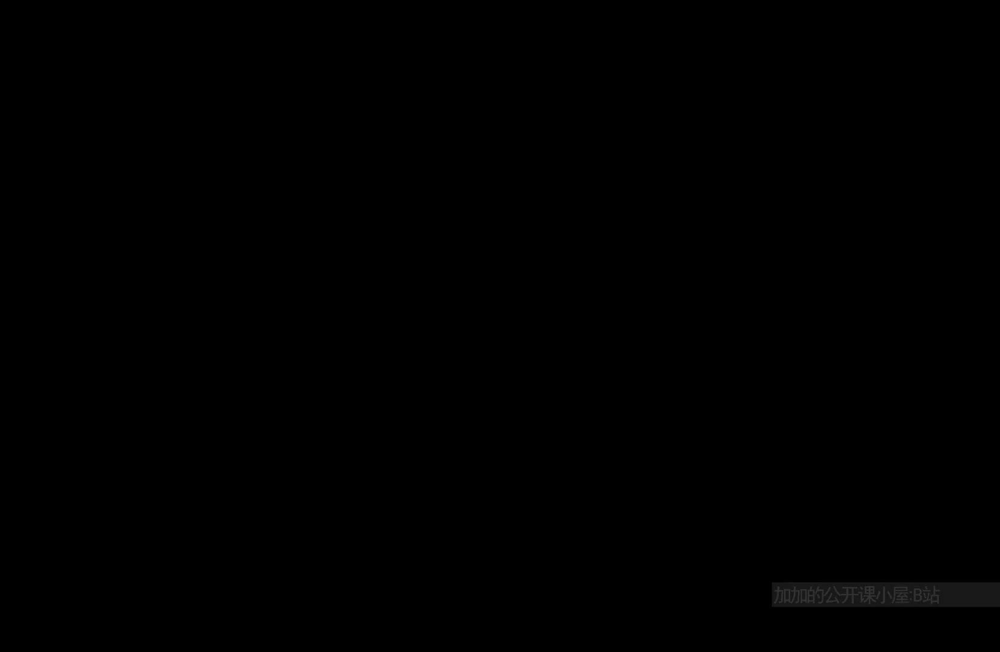

# Mike Shah【中英⚡OpenGL导论｜Introduction to OpenGL】 p01 P1 -Episode 1- Learning OpenGL - Modern OpenGL -BV1pTvFz3Eqh_p1-

Hey， what's going on， folks。 It's Mike here。 and welcome to a very exciting introduction to the Open GL programming series。

 Now in this series， I'm going be discussing the Open GL programming API。 So if you're not aware。

 Open G is one of the most popular graphics programming APIs alongside direct 3D metal and Vulcan。

 for instance， that allows you to create different gaming applications， virtual reality。

 Cad software 3D modeling as well as a multitude of other 2D software as well。 So in this series。

 what I'm going to cover is open GL programming from scratch。

 So that means if you're just getting started， this is a series for you。😊。

We're gonna be using the C plus plus programming language for the lessons in this series。

 So feel free to check out my other series if you'd like to ramp up on those skills as well。

 And the other thing that we're gonna to be covering specific to OpengL is modern open G。

 So that means version 3。3 and beyond so that you're doing the latest and greatest stuff that you would likely be doing if you're working on the job and Open G or just progressing further。

 Now lot of the materials that again， we're gonna be showing are applicable to C plus plus and Openg。

 But if you're going to use another language like Python， for instance， or even webg。

 you'll still be learning the fundamentals of how the API works。

 And I like to cover things from scratch。 So you really get to see how things work。

 what documentation I'm using and so on as we learn Openg。

 So I'm excited to take this journey with you。 Wecom to this series and with that said。

 let's go ahead and hop onto the next video so you can go ahead and get started learning。

 We'll see you soon folks。😊。