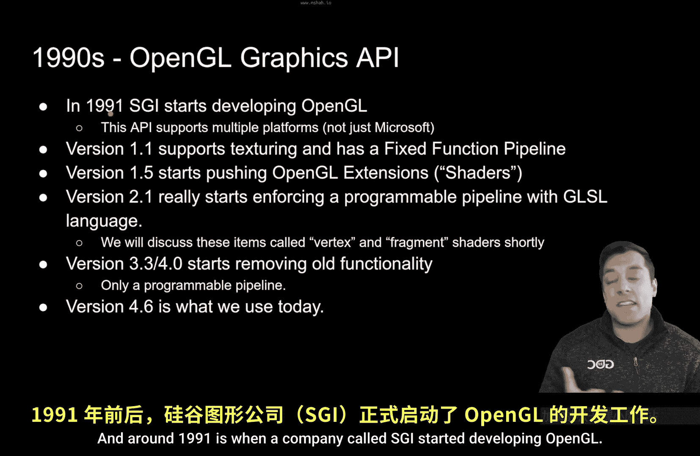
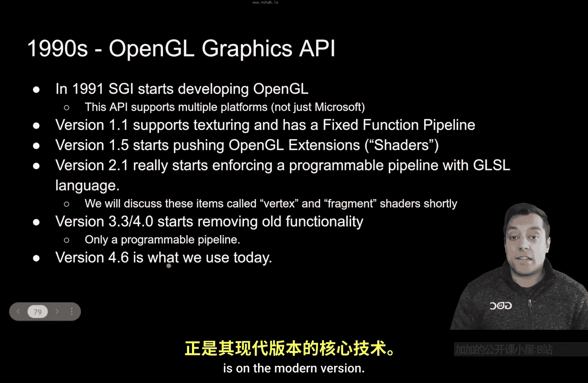

# Mike Shah【中英⚡OpenGL导论｜Introduction to OpenGL】 p03 P3 -Episode 3- A Short OpenGL History Lesson - Modern OpenGL -BV1pTvFz3Eqh_p3-

A， what's going on， folks is Mike here and welcome to the Learning Open GL series。 This lesson。

 we're going to continue learning a little bit about the history of Open GL just to give you an understanding of how we got to modern Open GL。

So with that said， let's go ahead and dive into the lesson。

 So this lesson itself deserves a slide because we're going to be doing a little bit of history。 Now。

 Open G L has a very rich history because it's been around since the 90s。

 And around 1991 is when a company called SGI started developing Open G L。😊。

And what the real key or the killer feature of Open GL was initially is that it ran on multiple platforms。

 So that meant Windows， Linux， Mac machines， gaming consoles， you name it， Open GL could run on it。

 And today， that's still one of the key reasons to be learning Open GL and following in this series。

 for example， so。😊，During its inception， OpenGL starts getting developed and then in version 1。

1 and 1。2， we started getting new features added things like texturing and so on that started making our graphics applications more interesting。

 You can probably see this evolution if you'd been following video games for a long time that as the graphic APIs got better。

 the games and their graphics got better along with the hardware and so on。

 But one of the major leaps was around version 1。5 where OpenGL started having extensions。

 this is where we start getting into things like shaders。

 but basically something called the architecture review board allowed companies to start sending in extensions based off of their hardware so it could do cooler things with OpenGL。

😊，Now， where Open GL starts getting really interesting and into the sort of modern stage is around version 2。

1 where we get something known as a programmable pipeline。

 That is that we as programmers can actually write programs that compile on your graphics card and execute on your graphics card。

 So now all of a sudden you've got your CPU which you're used to compileiling and running programs on and your GP which can also compile and run programs on and that gave us as programmers the ability to create neat graphical effects and just offload a lot of the work from the CPU onto the GPU to do even more things which it was good at。

 and that's where you see the leap in graphics around version 2。1。😊，Now， as we will in this series。

 we'll be working with version 3。3 and beyond here。

 this is really the modern version of OpenGL because we start removing some of this old functionality that's been around all the way since the 90s which involves a fixed function pipeline which we couldn't change or couldn't really program So that's what we're gonna to be working on in this series here all the way up to version 4。

6。 So we get things like compute shaders for general purpose computation geometry shaders for generating new geometry testlation shaders for adding more detail all these new things here in the last couple years that have been added to open GL。

 So there's really a lot of power in opengL and it's been involving continuously API that is getting better and better for us as programmers。

 So that's just a little bit of a history lessons we understand where OpengL has come from and that has this rich history and where we're gonna be focusing and where you should be focusing if you're learning OpenGL today is on the modern version。

😊。

Right， folks， with that said， I hope you enjoyed this lesson and again。

 are just getting a little bit of the culture and the history of OpenGL because I think that's also an important part of becoming a graphics programmer as you're following this series and because you're following this series by now。

 I hope you are subscribed so you don't miss any of the future lessons and with that said。

 let's go ahead and end it here and we'll see you in the next one。

