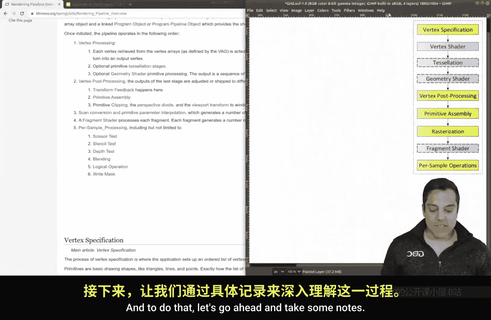
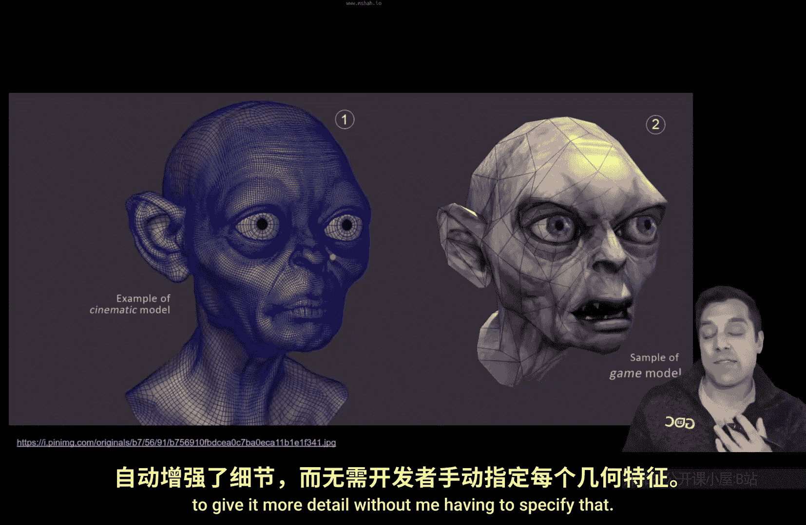

# Mike Shah【中英⚡OpenGL导论｜Introduction to OpenGL】 p04 P4 -Episode 4- -Theory- The Programmable Graphics Pipeline (Interview Question) -BV1pTvFz3Eqh_p4-

Hey， what's going on folks since Mike here and welcome to the next lesson in our openGL programming series in this lesson we're going to talk about something incredibly important and that is the graphics pipeline。

I'm going talk about it specifically related to OpenGL because that's what this series is about。

 but of course this applies to other API so you might still want to pay attention to it。 In fact。

 understanding the graphics pipeline is important for a multitude of reasons it's going to set us up for the rest of this series for how we can just understand the mental model of what it means to actually draw something in OpenGL and I say it's also important because it's a very frequent interview question that you're going to have to explain and by understanding it you will of course be able to explain it So with that said。

 let's go ahead and take a look at the graphics rendering pipeline。

Now where I want to start first though， is just with this here we've got this triangle here that's spinning and for the most part。

 when we think about computer graphics， we're going to think about rendering triangles and representing geometry that way Now of course we can draw points and lines and these sort of things。

 but let's just focus on triangles for now as they're the most interesting。😊。

So for example， given enough triangles， we can represent some sort of shape here like this bunny that I've showed。

And using more triangles， we can get a better approximation of the shape here so for example。

 you might recognize this character here， this is Golum from Lord of Rings。

 you can see the various triangles here that have been used to estimate this character's geometry and actually render this model and we've got a texttra on top of it which we'll eventually talk about。

😊，But on the left side， you'll see that if we add more geometry。

 then we can actually represent the shape in more detail and you can see the smoother edges。

 So the question is though how do we get this type of model here rendered on our scene Well。

 this process of rendering each of these triangles or whatever primitive that we're trying to draw again goes through the rendering pipeline So let's go ahead and take a look at the graphics pipeline So what I've done is gone ahead and shown the rendering pipeline here from the Chronos OpenGL Wiiki page。

Now the figure of importance or what I'm going to draw your attention to is this figure here。

 and this is what I want to walk through this lesson so that we again understand what happens。

 so let me give you the short answer of what the graphics rendering pipeline is。And to do that。

 let's go ahead and take some notes So what I've got here is the pipeline。

And I'll go ahead and scale that up for you。But what we really want to do or keep track of in today's lesson is what this pipeline is。

 so let me go ahead and just summarize here the graphics pipeline for you。So the rendering。

Or graphics pipeline。And the way I would start off if I was going to teach somebody this as I'm doing or answer in an interview is。

诶。Primitive， or let's just say a vertex。Wine。Or triangle， and there exist other primitives。Journey。

From。3D data。2。Your're 2D。Screen。Because again， remember the screen that we're actually looking at is a 2D plane。

 at least most screens are today that I've seen here， maybe someday we'll have 3D ones。

But this idea that we're able to just create some vertex data is what we're going to be doing in our program。

 So， for example， we might have some primitive here， and I'm just going to call it a point3。

 Let's imagine we have this structure here。 and I could just create it。😊，That's say 1。

0 in the x axis。0。0 and the y and maybe negative 5。0 and the z。

 and that would put some point in data into our scene。

But how does that actual point get projected in 3D space when I have it here on a 3D axis here with X。

 y， and z， for instance？And。Let me go ahead and label these。

 we're going to talk a little bit about coordinate systems as we understand transformations。

But I am giving。The positive and negative directions here。

 but if we take our point here that would approximately put it somewhere。

 well on the x axis about here， on the y， it's at zero and in the Z axis， perhaps somewhere here。

But again， when we view this on our 2D screens， where does that point or a collection of points actually show up so if you'll allow me to for a moment just draw a few more primitive shapes here。

Let me actually just draw them here。And connect a few of these points together。

And maybe we have something like a box。We want to make sure that we can also project in 3D on our monitor here。

Of our， you know， computer， maybe this is a tower desktop or whatever here。

That we get this cube shape that would also show up the same way that we are specifying in 3D coordinates so what is now this pipeline here in relation to what we've just done here and my claim that I can specify these points and eventually project this 3D looking shape onto my 2D looking monitor here okay。

 let's go ahead and start from the top here at the vertex specification。The vertex specification is。

 well， as I've pretty much said here， so again the vertex specification is what we've done here。

 we've specified some vertex or a series of vertices and really our geometry data。

 this point here with an X， Y and z。And of course， as we have more complicated geometry。

 we send more geometry in we might also have other sort of attributes that are part of this actual data here for instance we might have texture data normal information and perhaps other information that we might want to send in with our geometry so that's essentially this step here so vertex specification is where。

And let me do this in the same font where。We set up。On the CPU。A geometry。

And you can imagine this pragmatically as a 3D artist creates a model in Ber 3D and then you have your CPU program。

 load and parse that data， bring in that data and then ultimately say here's all the vertices。

 here's how they're connected and so on so that's the vertex specification Okay now let's go ahead and move on to the next part of the pipeline here。

 this vertex shader。Now this is a new term here shader which has to do with the modern openGL pipeline。

 in fact， you're going to see it pop up a few times shader here。

 the testlation actually has two shader portions here that we could draw out and fragmentish shader。

And even more what's interesting is you're going to notice some of these boxes are in green and some of these boxes are in blue here。

 so there must be something different going on in this actual pipeline。

 Well let me go ahead and just slow down and explain this term shader here So let's go ahead and give ourselves some definitions here So shader。

Is a programmable。Part。Of our pipeline。Okay， so let's break that down for a moment and just try to understand again what's going on because when I say pipeline。

 that again implies that we're moving one step to the next step here。 It's a pipeline。

 you follow one step after the other。Okay。But what's interesting is that we can change how this behavior is during the pipeline。

And this is a feature of modern open GL feature。Of modern。Open。Ziao。That。We can。Right。Programs。On。

Our GPU。wo。Control。Graphics。Pipeline。Okay， so this might seem something almost intuitive。

 but for a long time and looking back at some of the history of OpenGL。

 we weren't able to reprogram things。 we simply sent some data to the GPU maybe toggled a few things for how the GPU behaved with that data and that was it but now we have a responsibility as programmers to write or control how our geometry from their first step actually behaves Okay so with that in mind and we're going to dive into this as we go further into the series。

 let's just understand the job of the vertex shader。😊。

And the vertex Shar has a relatively simple job in a way。

 but it's mandatory that we have one here and its job is to execute。On each。Vertex。So in this case。

 if I have one point here。This special GPU program will run on that vertex and if I have a thousand more of these points here。

 then it will run a thousand more times executing on each vertex positioning。That。Vertex。Okay。

 so that's really the job of the vertex shader， Okay， so let's go ahead and check that one off here。

Now once we have a point here in space and then that's from our vertex specification and then we position it using the vertex shader。

 now we can do other maybe perhaps interesting things here like teslation and this is the idea that we might want to have more geometry here so for instance if I have this shape here。

 this is just a quad here with four points it's two triangles well I could actually subdivide this further using a teslation shader。

And the reason of doing that is that it gives me more detail in my scene， so again。

 allow me to give a reminder here if we go back to our slideshow。😊。

That if I look at this character here on the left， it has more detail versus the one on the right。

 In fact， it's been subdivided or perhaps even testd in some way to give it more detail without me having to specify that。

 So this is， again a。

Part of the pipeline here in OpenGL Now this part here is actually optional， the teslation shader。

 okay， so I'm not going to go super into detail on it。

 but it's this idea that we can testeslate or add more triangles into our actual geometry。Okay。

 so with that said， then we have the geometry shader。

 which is another optional part of the pipeline here， so I'm just going。

Put a little reminder here that these are optional。

And the geometry shaders's goal is well we can actually generate more geometry so for instance。

 let's say I only specify one point here in my actual program here like I have here but what I can actually do with a geometry shader is on the GPU generate more geometry from this point here so maybe I would generate a bunch of other points here and actually make a quad and that could be useful for instance。

 for particle systems where you just want to have one point and then generate a bunch of other interesting data this isn't typically where you would model something in 3D but you could generate again more geometry Another example of this is if you wanted to create a sort of explosion effect。

 maybe you'd want to dynamically create some geometry and have more triangles in your scene。😊。

Okay now once we've done that in our geometry shader。

 which is again an optional part of this pipeline， then we can also do some additional post processing if we want with some of the data that we have generated so for instance if I've done something in this geometry shader I might want to go modify this data in some way in this postpro step I'm not going to get to fixated on that and I want to move to the next step here which is related which is the primitive assembly and this says。

 okay what is all the geometry that we have here from all of our vertices。

 how do we assemble those are those going to be lines are they going to be triangles are they going to be points are they going to be something else like a triangle fan but how are we assembling all these primitives。

 especially if I've generated some new geometry so that's this step here。All right。

 and then the next step here。Is well let me summarize this， so I'm just going to write this as。

Assembling。The final。Gometry。And this could include other phases which isn't captured here。

 but what if I have a triangle in our scene here？And it's outside of the screen。 Well。

 it gets clipped away Or what if I don't want to draw some of these faces that aren't showing in our cube here。

 Well， then they could get cold away in a phase called callinging。

 So that's essentially what the primitive assembly is doing It saying， hey。

 here's all the stuff that's within view。 Let's assemble those triangles or lines or points and display them to us。

Okay， but now we get into the rasterization phase and what this says is if I've got my screen here。😊。

And I'll go ahead and just draw it as a grid here。And let's go ahead and and I'm representing each of the pixels here。

 let's say I've got some of these pixels filled in here。

And what I'm doing here is the actual process of rasterization here as I fill in each of these little boxes here。

And you can see based off the number of pixels that I have here in this shape。

 I'm raizing or filling in it。And if you look very carefully like this or squint。

 or if I trace around it， you'll see that I'm approximating a triangle here。

And that's the idea of rasterization， this idea that I am determining which pixels actually get filled in。

Now there's some other steps that go into rasterization。

 such as what if I have one shape in front of the other， which one actually gets strong？And for this。

 there is something known as a depth test， which stores some additional data。

 which again we'll talk about this depth buffer and Z buffer as the other term it goes by。

 which shape actually gets drawn in front of the other but the end result of this phase is that we have some filled in pixels。

 perhaps of different colors as well。All right， now once we've done rasterization。

 then we have our final shader step here in most modern open GL pipelines。

 and that is the fragment shader。And the fragment shader's job， sort of similar to the vertex shader。

It has a job of executing。Once。On each fragment。And you can think of a fragment sort of like a pixel。

 a pixel is sort of a sample， but a fragment would sort of be what actually gets filled in。

 but let's just call executing once on each fragment and I'll put it in quotations pixel。

Because that's how most of us are going to think about this。When I move out of the way here。

 and that's its job to determine the final color of each of these pixels here that we rasterized。

 okay， so that's the idea here。😊，All right， and then least。

 and I'll hop out of here so you can see the whole pipeline。

 there might be some additional per sample operations that you would like to do。

And these could include things like depth testing again， as I mentioned here。

You could do things like a scissor test to just again clip away maybe half of the screen if you don't need something。

 these types of things come into effect when you do reflections or maybe shadows and some of these things。

 but that would be the idea okay。So let's go ahead and just for a moment。

 look at this pipeline here what we sort of understand and recap from the graphics rendering pipeline okay so starting from the top left here。

 the rendering pipeline is a vertexs journey as I like to say from 3D to 2D so we usually specify some geometry data here we can imagine it on some sort of coordinate system as it's been shown and we eventually need to project it onto our screen on some sort of 2D coordinate system here that's usually related to our monitors width and its height okay so how do I project this point here onto a 2D screen。

And again， the process that it goes through is we specify our geometry。

We position our geometry in a program called a vertex shader。

 and then we optionally might modify that geometry in two steps here by testesulating it to add more detail or using a geometry shader to create even more geometry after that。

And then we do some post processing steps here。That relates to perhaps modifying some of the data that lives in some buffer here in the post processing step or perhaps doing some operations there。

 and then we finally assemble our primitive。 So this is where we get our final set of triangles that we need to move to the next step。

 which is rasterization， which involves coloring things in。And then finally。

 we have control over things how get colored in by writing a fragment shader。

 which is responsible for executing one time on each fragment that is going to get filled in during the raurization process。

Okay。So folks， with that said， I hope that's a helpful overview of the rendering pipeline for you Now I know I'm throwing sort of a lot to at you。

 but the takeaways here are one that our data in open GL every time that we do some sort of draw call so for example。

 GL draw arrays which we'll learn about GL draw elements and so on has to go through this pipeline in an ordered manner。

In a way， it's actually kind of comforting that we know this process。

 it's a known process that we can understand and we'll be able to walk through each of these pipeline stages together as we learn computer graphics on modern OpenGL in this series and as you continue to study graphics you're going to be able to dive even deeper in each of these stages as oftentimes there are a few interesting things that you can do each of these stages as well as a few steps that we're gonna to want to talk about in a little bit more detail so make sure that you don't miss those lessons and subscribe to this series so that you can go ahead and follow along as we actually do some of these things when we start programming in OpenGL Now we will get to openGL shortly but I want to continue doing a few lessons just to help us get set up and again have the right mental framework of what's going on really。

 really understanding that there's a pipeline a series of steps that need to take place in order to get our information from our CPU onto our graphics card because we're doing graphics programming in this series。

All right folks I'm going to go ahead and stop there。

 I hope you're as excited as I am about this series and all the graphics that you're going to learn and make sure you give this video a like if it was helpful in uncovering or unraveling some detail of the graphics pipeline you might not have known and with that said I'll go ahead and see in the next one folks take care。

