# Mike Shah【中英⚡OpenGL导论｜Introduction to OpenGL】 p05 P5 -Episode 5- -Code- Setup SDL2 and OpenGL and first OpenGL function (glGetStri -BV1pTvFz3Eqh_p5-

Hey， what's going on folks is' Mike here and welcome to our OpenGL series in this lesson we're gonna to start off by setting up our openGL application Now in this lesson I'm going be using a framework called SDL2 and I'm gonna to be demonstrating on Linux Michigan how to do this but don't worry I have a bunch of playlists on how to get set up with an openGL application on many different platforms and I can also add those into this series at some future point But now I want to go ahead and get us started So in order to get us started let's go ahead and look at the SDL framework here So I've gone ahead and pulled up the page here for the simple direct media layer Now what is simple direct media layer it's a platform that will work on Windows。

 Linux Mac， even gaming console so it's one that I like to use because professionals use it as demonstrated by these games you can see here。

😊，So in order to get set up with SDL， I'm going to defer you to some of those videos on the setup later on in the STL series playlist that I have so you can go ahead and check out that so once you are set up with those though let's go ahead and talk about the role that SDL to plays。

So in looking at SDL2， here we've got this framework here that does various input output events here。

So here's SDL2， which is one of our dependencies that we're going to have here and the basic idea or what we're going to use it for primarily is to render a window。

Okay。And the goal of this window is going to be able to hold or display。

The output from an open GL context。And what an openGL context is is basically the large object that holds onto OpenGL。

 this sort of graphics library that we're learning about and is going to be communicating between our GPU and our CPU if you'd like to take a few moments to get an understanding of the OpenGL context。

 Well this is basically what it is It's a context that stores all the associated state with OpenGL so you can think of it as one big object if you're used to object oriented programming that basically holds everything。

The important part of it is this thing called a frame buffer that holds a lot of the rendering commands and can display the information ultimately to our SDL window that we have here。

SDL is also going to be responsible for doing some other things for us such as handling。

Input and output。So I'll just re that as IO。And even setting up other subsystems。Such as sound。

Or even networking。And images。And STL as well。Provides additional functionality such as threading support。

In general， compatibility layers for working with different operating systems as previously stated。

 but again， the primary use for us for having SDL is for launching this window here。Now。

How do we build a graphics application？ Well， typically， there's a few stages that we want。

 So we need to initialize。Our scene here。Which is usually the first part。

And then most of our graphics applications are going to have some sort of main loop。

And which will handle input。Again， that'll be the IO portion here from SDL。Maybe do some updates。

Based off that input。And then eventually render。And render itself can be broken up into perhaps multiple stages such as a pre render or a predraw。

That would take place again before rendering and might be responsible for setting up some state。

 for instance。And then finally， we need to have a cleanup function。

Which removes all of the stuff that has been initialized， such as STL。

 any memory that we've allocated and so on， so let's work with this to go ahead and start setting up from scratch our STL application。

So what I'm going to go ahead and do is start a blank project。

 I'll keep our outline here so we can keep this in mind。

 but let's go ahead and start coding together our first SDL application。 We'll get open GL set up。

 but we won't be rendering anything quite yet。 we're not quite ready for that and I want to take some time to explain the open GL things but this will be the first stage in our process。

 So the first thing I'm going to do again is just open up。

A empty file here。And I'm going to go ahead and include SDL2。

And the Sl header that gives us all the SL functions and makes them available for us。

 And let's just go ahead and have a main here。And this is our entry point into the program Now。

 as I mentioned， I roughly want to break out this program into a few stages here where I'm going to initialize things。

 have a main loop and then clean things up and usually a nice way to do that just to break things into functions and it's a nice way to start breaking our program into these modular pieces that could either be swapped or otherwise just organize our program So I'm going to go ahead and just call this initialize。

😊，Programs。We'll have a method for that， and let's just call it main loop and something called cleanup function。

So I'll have these three functions here。Which I need to declare and define。And set up here。Now。

 one caveat with the code that I'm going to be writing right now。One。

 I'll go ahead and say that it's probably not going to be perfect， we'll have to fix some errors。

 but we're going to do things as simple as possible and leave it a little bit up to you to add some abstraction if you'd like。

 maybe in later lessons we can add some abstraction together。

 but for now we want to just be able to understand things。

Okay， so let's go ahead and。Create these different functions here。And I'll leave this as such。Now。

 anytime I write any amount of code I like to compile relatively frequently。

 so how am I going to compile this G plus plus the file， the output here？

Let's go ahead and see what happens and it compiles fine。

Now we are going to eventually get some errors when we link in SDL2。

 but we are going to need to do something like link SDL2 here。

And on Linux I need to link in this dynamic linking library so I can load libraries at runtime。

 so let's go ahead and see if that works， seems to take care of the problem and will be in good shape going forward。

Okay， now let's go ahead and start off with this initialized program here。And in order to do this。

 the first thing that we're going to need to do is just initialize SDL。

 So I'm going to do something like if SDL in it。And the subsystem that we need to initialize is the video subsystem。

This value returns less than zero than it's an error， so I'm just going to exit。

And it's usually nice to print off some sort of message here I'm going to use C out。

 you could use C air to retrieve the message or even SDL log if you want。

But I'll go ahead and just say SDL2 could not initialize video subsystem。

Now note that it might also take some shortcuts here as far as handling every condition for possible errors and air detection again just to make this code simple okay。

 so let's assume that we're able to initialize SDL here。

There's also going to be when we initialize something。

 some sort of cleanup function that we would also want to take care of here。

 so let's go ahead and look at our cleanup function。

And what we're going to need to do is equivalently call。SDL， quit。Okay。

 so let's just go ahead and start with that much， I'll go ahead and compile now and now that we're actually using some SDL commands we'll see if it's properly linking here now I am missing the IO streamam library。

😊，SoLet's go ahead and put that in。And then I'll recompile see if I get any errors， nothing。

And if I run my program， it doesn't do much of anything。

 so our next stage is actually going to be to create a window here。Now again。

 this is where we're going to take some shortcuts and just create some global variables for us。

And let's just lay the below globals and start setting up our window and our open GL context。

 So let's just create an inteature here。I like to prefix my variables with Lacase G if they're global。

 if I must use them。And we're going to crate。Some things for our window here。

 such as the width and the height， we'll need an SDL window。And that's a pointer to one。

And I'm just going to call this the graphics application window， and we'll set it to null pointer。

And we are going to need a open GL context， and I'll just prefix that again with a G。Open GL context。

And this is going to also be a null pointer for the object。Okay。

 so let's go ahead and just tidy things up， just a tiny bit here。

And let's go ahead and create our window Now before I get too far into this。

 let's go ahead and see what or how to create a window。Again。

 I happen to have some SDL experience so some of these things I can remember and some of them might just have notes to be honest。

 so let's go ahead and look for SDL create a window。And we can go ahead and find this function here。

And I'm just going to go ahead and copy this so that I don't make any mistakes。

Let's leave it over here。And leave our window here and let's create our window。Okay， so the title。

Let's just go ahead and make this open GL first program。Our first window。

 however you'd like to name it。

I make this a little bit bigger just so I can indent it a little bit easier。Oops， okay。

 let's try that again。Open yell window。The x in the y is going to be the starting position。

 so I'm just going to make those zero， the width is going to be R G screen width。

Our height G screen height。So I can get rid of this flag here。And the actual flags here， Okay。

 so what are those going to be here and again， let me kind of have this out just to be a little bit neater。

But what are the actual flags， well， if we look at our window here。

We have to figure out what type of window that we create and what it's going to support and this is going to be very familiar or very similar if you've used other frameworks like GLFW。

But we can go ahead and see one of the flags here SDL window openGL again if you're going to use Vulcan or metal。

 perhaps and at a later time we'll do a series on that。

 but this creates a window usable with an open GL context and that's what we want we want to be communicating with openGL graphics hardware so let's go ahead and use SDL window OpenGL。

So that's going to be SDL window， open NGL。There might be other flags that we want to use with this。

 there's a common one that I'll also use。😊，Or SDL window shown， for instance。

 let's go ahead and see if that one is here SDL window shown。And it says it's ignored here。

 but know because it's implicitly done， so let's just go ahead and use SDL window Open She。Now。

 just out of curiosity， let's go ahead and see if this worked and one way to do that before running it is again to see。

For our window here， well we've got to assign it here。

 our G graphics application window is just to test if this was null or not。

So I'll say if our G graphics application window。It's equal to an note pointer。

Then it did not set up， unfortunately， so we'll go ahead and exit。

And have some sort of error message。诶。SDL window was not able to be created again。

 you could get as creative as you want with air handling or put logs or custom object so only you see them in debug builds or whatever and that would be fine。

So let's go ahead and just start with this much and again we're not going to see anything yet and that's for a few reasons。

 one our program doesn't have a loop that's going to run on an infinite loop， the application loop。

 so even if a window did pop up it is already gone。And secondly。

 we still have to set up our openGL graphics context， so let's go ahead and do that。

 and again that is this G OpenGL context here。So let's go ahead and see how we set that up。And again。

 G open GL context。There is a function openGL， SDL， GL， create context。

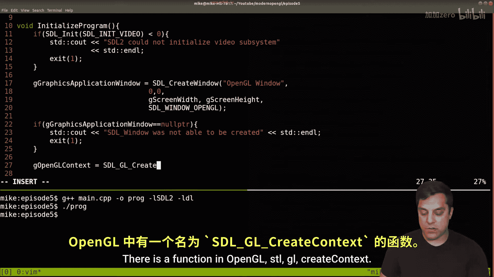

And let's go ahead and find it in the documentation。

Let's see if we can find it here in create context， sometimes there's useful documentation down here。

 but let's go ahead and see the categories for video and let's see if there's a createate context here and here it is for OpenGL okay and similarly there PriB context for other things。

 but we just need to specify the window for which we are creating the context in。

And that's our graphics application window。And we'll again check if this is null。

They could be null for a variety of reasons such as the window not being created。

Or perhaps the OpenGL driver is not working on your system or perhaps other reasons。

 and we could use SDL get there to query some of these things if you wanted。

 so we'll just say openGL context not available。

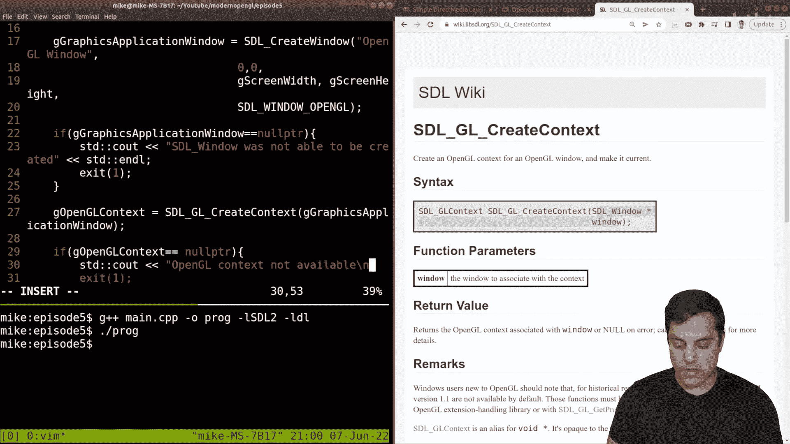

And I's put an end line here。Okay， so here's what our code looks like， let's go ahead and compile。

 see if we've made any mistakes and so far so good。Now。

 before we get into writing the main application loop。

 what I actually want to do is specify some properties of our OpenGL context。

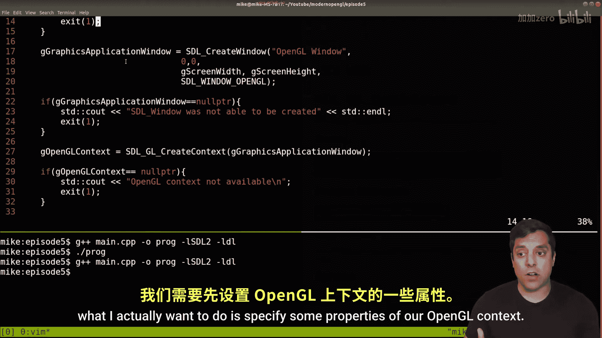

And we can actually do these with something。Let's go ahead and look here again， SDL。

 GL set attribute。And there's some different attributes that we are going to want to set here for our particular openGL version。

 so allow me to just scroll down here， you can see some of these related to the sort of double buffering。

 the depth buffer size， these sort of things， what I actually want to do here。😊。

It sets some attributes and I'm going to even do them before I create the window。

 but after I initialize SDL。Here。And the sort of important ones。

 So one is going to be SDL GL context， major version。And I'm going to do version four。Back。

 I'm going to set a few attributes here。The minor version that I'm going to set is version1。

And basically what I have here， this means that we're going to be using openGL version 4。

1 and this should be available on folks who have Mac， Windows or Linux machines Mac。

 unfortunately at this time for the most part doesn't support beyond version 4。

1 Linux and Windows you should be fine if for some reason this doesn't work on your machine。

 you can try version 33 and be able to do pretty much everything in this series。

 but I'm going to leave it at 4。1 so we have modern features available to us。

The second thing that I've going to actually set up here。For this next attribute。

 it's going to be called SDL， GL context。Profile， mask。And what I'm going to set here。

 and let's actually see if we can search for it。😊。

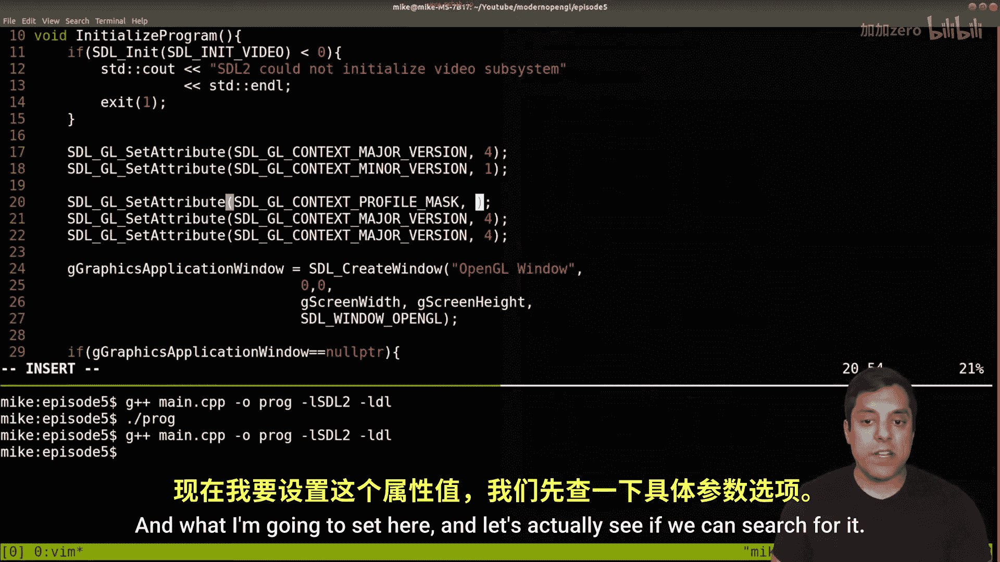

We could actually query here， but let's actually just search here。

Just so I can show you a little bit about how to find the STL documentation。And of course。

 follow my SDL series if you want to see more of this stuff， but let's do SDL GL context。

 let's see what shows up here so I can find some of these things like the major version minor version。

 these are all the GL attributes， but this is the one that I want to set here。

 the profile max mask here， excuse me。And theL SDL GL context that we're going to actually set is going to be the profile core here。

 okay， so we can see these attributes all listed here by searching here， okay。

So let me search for that word core here。And that is the type here。

 so if I see SDL geo compatibility here。And let's go ahead and just zoom in on this because this is an important thing to keep in mind with working through this series and this being a modern OpenGL series。

The core profile here as mentioned saysDeprecated functions are disabled。

 so that means all the old functionality， even if your graphics， hardware and driver supports it。

 is just not going to be available。And that's what we want to do。

 we want to get rid of the old stuff and force us to use the new modern stuff that's going to be supported on later hardware。

 so let's go ahead and grab that here。

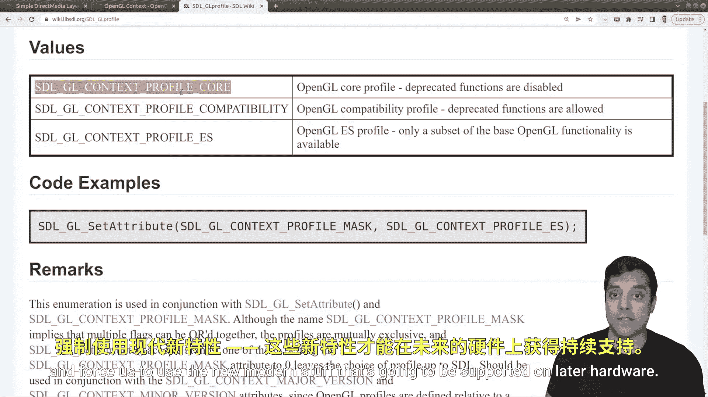

Go into our source code and set up the core profile in this manner。All right。

 now some other settings that I'm going to set here。Again， I won't look for all of them。

 but you get an idea of how to search， I'm going to turn on double buffering。

Which allows for smoother transition of things。 We'll talk about double buffering a few times。

 or at least mention it so you can search on your own and the。诶。

Depth of our depth buffer will be 24 bits so we get more precision when determining of objects or overlapping。

Okay， let's go ahead and compile see if I made any mistakes and miraculously none so far Allright。

 so with that in mind， let's go ahead and continue and see what we have here so I'm pretty happy with this initialization function here I think we've initialized all the things that we need we have a window and we have some way to communicate with openGL we'll verify if that works so our initialization in that sense is done。

😊，And we're even starting to clean up our program here in fact。

 it's probably a good idea at this point do not forget to destroy our window because that's something else that will be allocated。

And for that， there is a function called SDL， destroy。Wdow。

And this is our G application window Now notice by prefixing everything with G it makes it a little bit easier for your In。

 so that's just another tip for free All right， so that should destroy our SDL window here。😊，Okay。

 now let's actually get into writing the main application loop here。

And what I'm actually going to do here is create another global variable here。And again。

 I know it's not the best thing to do here， but I'm just going to call it's a boolean here and I'm just going to call it quit。

 and I'll just say if true， we quit。And basically， the idea is。For our main loop here。

 I'm going to have some wild loop here。Where I'm saying wow， not G quit。

So we initialized this to false， then just keep running forever， forever and forever Okay。

 so that's the basic idea。Okay， and now what I'm going to actually do is have a input function。😊。

I'll have a predraw function， as I mentioned。I'll have a draw function which will actually do our drawing。

And then I'm going to have a function for SDL， GL swap window。

And this is going to be for our graphics application window。

And this is essentially what's going to update the screen。

So the way that double buffering works is when we're actually drawing a graphic scene。

 you can sort of imagine it like a flipbook that's playing if you've ever played with one of those toys。

And basically the idea is we draw to the back and as soon as we're finished drawing。

 we send that information to the front buffer and then we start drawing something else on the back while the front is displayed to the user and then we just keep clipping So that's essentially what this command is doing Okay All right so let's just handle one of these functions at a time first by creating them here。

😊，I'll create input。And these are all just going to be void functions for now。We need a。Pre draw。

We need a draw function here。And last but not least。That's， that's actually it， okay。

So for pre drawraw and draw， we're actually not going to do anything with these because these will be related to OpenGL today again it's just about setting up and understanding our sort of graphics framework。

😊，So for handling input in SDL。What we're going to do is have some event。SDL event is a type E。

And I'm going to sayWow， and we're constantly basically just going to poll and see if there are any events here。

 so I'll pass in that event。And if there is some event to look at。

 we will handle it and for now the only event that I really want to handle is if the user exits our program。

 I'm just going to say if the event type is a quit event。

Then we'll go ahead and terminate our program。Hey， so we'll just do。That's out， you know， goodbye。

And that's the idea here。And I'm not actually terminating the program here because I want to actually run through this input。

And then terminate out of my main loop here so that I complete this function and then go into the cleanup function that's at least going to be our structure for this sort of sandbox application where we're learning OpenGL。

😊，Okay， so revisiting this。I just need to set my toggle equal to true。Okay。

 so now we're essentially handling in an infinite loop， any events that happen。

 so if I'm holding a key down， those would be handled here。😊。

We're drawing or otherwise displaying our window and we should actually have some window here so let's actually try our program because we have an infinite loop here。

 let's see if I made any mistakes looks like I made one spelling mistake here。On SDL， destroy window。

m，Let's see if I just spelled something wrong， one extra underscore。I'll recompile， we'll rerun。

And it popped up on my other screen， but here we have a window here。

 that looks like I flip the dimensions in sort of a weird way。You know。

 we have a very long window here， so let's actually change our。Dimenssions here。

I tend to like at least on a desktop application， something that's 640 by or 80 to test。

And recompile， Rayrun and just like that， we have a empty window that should be compatible with OpenGL Now。

 how do we know though， I want to go one step further and actually query some of this information here。

So what I'm going to go ahead and do here is let's go ahead and run some openGL functions here to see if our program is properly set up here。

😊，So where do I want to do that， well， the initialization probably makes the most sense here。

But I'll actually write another function here。I'm just going to call it Git open GL version info。

 something like that。And we'll just have a bunch of see out statements and some of the strings that we can query again。

 these are ones that I have in front of me。😊。

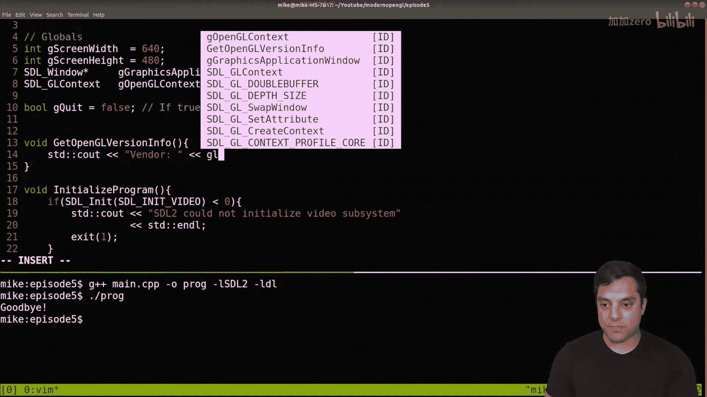

But we can search GL Git stringing， and let's actually do it。GL get string。

Just so you can see the different enumerations， the things like the vendor， the render。

 the version and the shading language version， and you can query for individual extensions which we'll talk about I actually want to just do these for here just so you can see that OpenGL is working and it's also useful if it's not if you can you know report back this information to you know whoever is helping you debug this whether that's me in the comment section below somebody that you're working with or the World web right so let's go ahead and set some of these up here。

😊。

So again， these are going to be， you know， version。And the shading language。

 which we will talk about here。Which I believe again was just GL shading language。

And let's go ahead and compile see if we made any mistakes。 O。

 it looks like I made a few mistakes here。 And well， that's actually somewhat intentional because。

 well， we don't know about OpenGL。 Where is the library included， It's not an SDL。

 So how do we know about these functions here。 In fact。

 let's go ahead and take a closer look at these errors。😊。

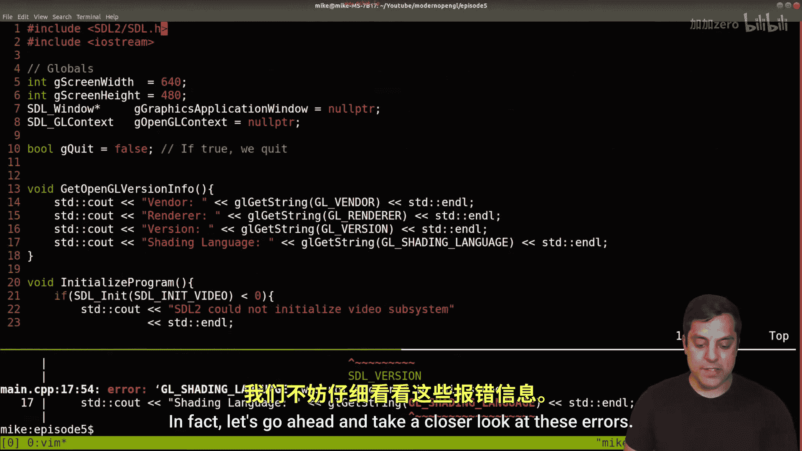

And see if they gave us anything know， more useful here， if I go ahead and scroll up here。😊。

And we don't even know about GL Gistr Okay， so how do we figure out about GL Gi string Well in order to understand this function name。

 I'm going to need to download a library here the G open GL。😊。

A tool is one way that we can have a header that has all the open GL functions provided。

So I like using this tool， some other folks will point you to glue or other tutorials。

 Glu is spell GL， EW， all lowercase， but I like using GlaAD here。

 so let's go ahead and run through this process and get a header file that will set up OpenGL essentially。

Or the functions， so I'm going to use the language for C++。I'm interested in OpenGL。

 we've said version 4。1 here。And this is all the different features that we have here。

 so I'm just going to add all of them。😊，And let's go ahead and see what the options we have here。

 generate loader， okay？We want to use the core profile which only gives us the new functions again we're working with openGL。

 not anything else。So let's go ahead and hit generate。

And this will just take a few moments to generate a zip file for us。You could use this link here。

 but' go go ahead and just download the zip。Let me open it up。

And I'm going to go ahead and just copy this zip file here in my directory where I'm working。

 let's go ahead and extract it here。😊，And I'm just going to name this folder G。

 I must have already had it here， and you're going to go ahead and see that there is some source here。

And there's an include directory。And in fact， in order to build this。

 just to make things a little bit easier。Well， I'll just go ahead and lead a bit。Well， let's see。

 let me go ahead and。I can go ahead and。Just move these two out。Here。

And we'll have a source directory with our source file。

And the include directory with the Glad header file now just to take a moment to look at these tools here or what we have here。

Again， here's the actual header file here now let's actually search for GL Gi string here。

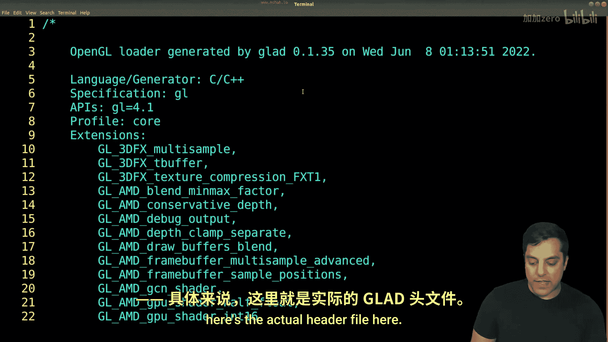

And eventually you'll see that there's something called GlaD underscore GL get string。

So all this header file is doing is declaring and saying， hey， this function is available。

The actual implementation of this GL Gi string function。

 well that's on your driver or your operating system somewhere， okay？

So we need to include this file into our program。As well as， well。

 let's go ahead and see what was in the source director here。

And let's just go ahead and open this up in Vim as well。

And if we go ahead and make this a little bit bigger here。

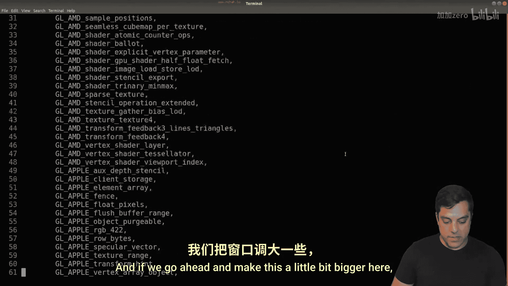

Let's just go ahead and scroll down for a bit， scroll for a bit we can actually see some of these。

Settings that were set up， some declarations of variables so that they're in memory and again。

 all these objects essentially just being set to nules so that they exist somewhere here。

 Let's actually see if we can find GL。Get string anywhere。It looks like we can， and again。

 we could probably search for this forever， but again， it exists there。All right。

 so let's modify our compilation line， I'm going to keep this structure here just so we can see what's going on here to see if we can get glad up and running here。

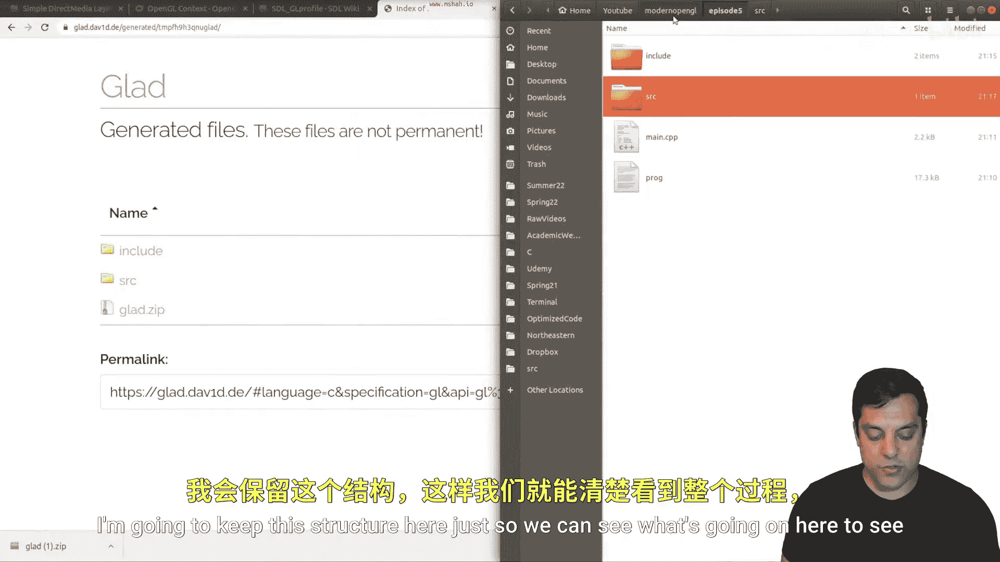

Now this is where it takes a little bit of practice if you're new to C++ to understand everything that's going on so again。

 here's sort of our hierarchy here。And right now we're just compiling the main CPP program。

But we also need to compile。In the source directory， GlaD。c。

And then we also need to include that's capital I here。Our include directory。

And I'm just going to include that here and then in our source file， our C++ source file。

We will include。Glad， G dot H。 Okay， so again， glad。Or rather。

 since we are saying here in our include path to look for header files somewhere in this folder here。

 I'll double click on it。And then within that folder， I'll look at GlaD which is here。

 and then I'll find the GlaD dot H file， which is here， okay， so that is what's going on here。

Now I'm going to go ahead and compile this， let's see if it works。

And it looks like it is essentially working， I just misspelled a。

SDL GL shading language here at line 18， so let's go ahead and fix that one。

Because it's actually GL shading language。Version。Okay。

 let me show you in the full screen just so you can see if that's what it is。All right。

And now let's try to compile。And it should compile now this GLA library does have one more setup step。

And we're going to do this in our initialization like we were previously doing when we were setting up SDL。

 So if you're using the glue library or something else， this has a similar step here。😊。

And it's going to be a little bit of a weird step， but let's go to our initialized program here。

And I'm going to go ahead and set up here， initialize the glad。Library。

And I'll do this in a similar way， I'm going to say if not， and there's a G load GL loader function。

And this SDL， GL。Get proc。Address function。Okay， and we're going to take a little bit of a look at these。

 but if it doesn't work， we want to exit。And I'll do a see out ti。

 glad was not you know initialize something like that， and we can fix up the output later if we want。

But let's go ahead and look at the SDL documentation here。

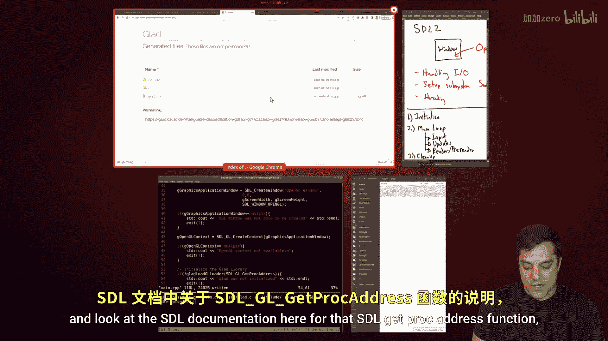

For that SDL Gi ProC address function just so we can understand again what's going on。

So let's go ahead and search。SDL。Get。Proc address。Let's see。Proc。

Let's see if we get gett Proc address here。There we are。All right。

 and let's go ahead and just look at this function here。

And basically it gets an open GL function by name Okay。

 so basically what this is or basically what we're doing with our Glad library is just。😊。

Loading up a bunch of function pointers Now if you don't know what function pointers are we just saw some in the Gla header file essentially。

 so it's enough to just understand for now that this is just loading up all the open GL functions and retrieving their addresses okay so that's what's going on with the GL or the G load GL loader function here okay we could actually do this manually as it's saying here and sort of work with it ourselves。

 but it's a little bit nicer to just use the GlaD library okay。😊。

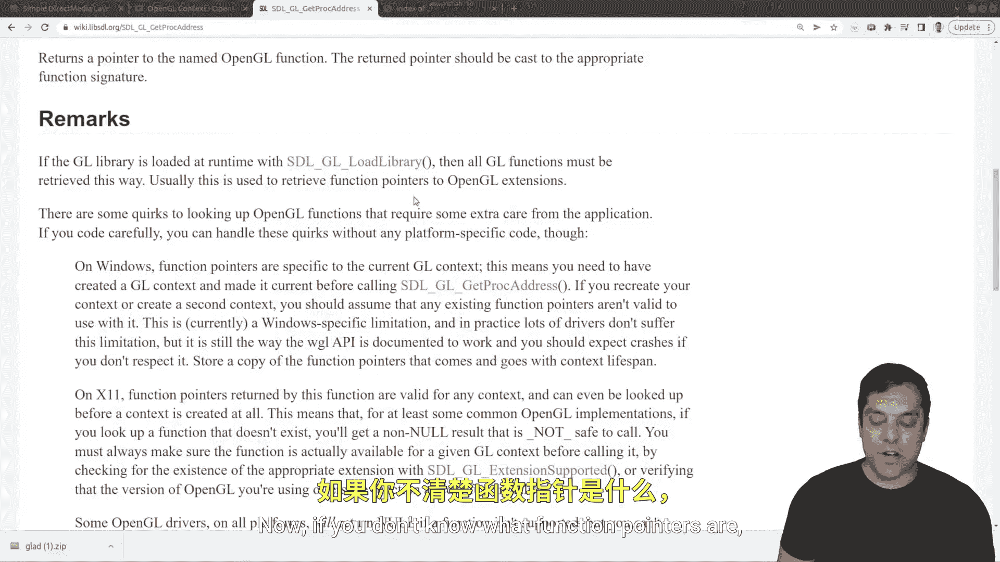

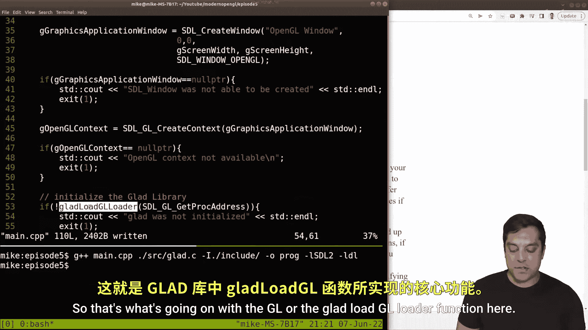

All right， now some things that you could do as well just to make your life easier is to move the Gla source file out here or rearrange your project again I'll leave that up to you but you've seen a version that works here。

All right， now let's go ahead and just compile this one more time。And run our program。And well。

 it compiled this time and we've got our window。Now let's just go ahead and once everythings set up。

 let's call our function for Gett openGL version In and we'll see if our first OpenGL commands are working。

So I'll recompilele this。I'll rerun it and immediately we see some information here。

From our GL Get string function so you can see what video card I have here。

 the version of openGL that we've set up in our shading language。

 So it looks like it's working just fine。 So again， congratulations if you've made it to this step。

 your first open GL functions GL get string。😊，If they're working。

 that means your openGL is configured， hopefully in this series youre seeing a version greater than 3。

3 for the version information here， so 4。1 is great， 4。6 is even better， but at least 3。

3 you'll be in pretty good shape， if it's at least 2。

1 you'll be able to follow along with this series and get some value。Okay。

 now before we wrap up the lesson let's go ahead and do a quick code review because we have written a lot of code here and of course you can always go back here but let's start from the beginning our entry point so we wrote an initialized program function that basically sets up our SDL window and OpenGL。

So if we go back here to our initialized program。And I'll walk through this slowly。

 we initialized SDL， set up some attributes for the OpenGL version context that we want to set up。

 created our window。😊，Create our OpenGL context， and then we set up using the GlaD Library a way to have all those OpenGL functions available to us。

And then after that， we looked at our main loop here。And in our main loop， we are handling input。

And right now that's just one event。 We're going to implement predrawl and draw once we get an openGL stuff and then we're able to update the window every single frame right now it's just a black window right folks so with that said I think that's a pretty good place to stop and that's a good code review I know this has been a pretty in-depth lesson but really at this point you're ready to go do whatever openGL programming you want if you're following along in a book if you're going to make sure that you like and subscribe and follow along with wrestle lessons here then you'll be able to program an openGL because we've already proved that we have one openGL command that works So any of the other ones in the core profile should work now。

😊。

All right folks so with that said I'm going to go ahead and close this lesson。

 we'll go ahead and see in the next one， thanks for your time and I hope you're enjoying learning this stuff in depth and how it works and we'll see you soon。

