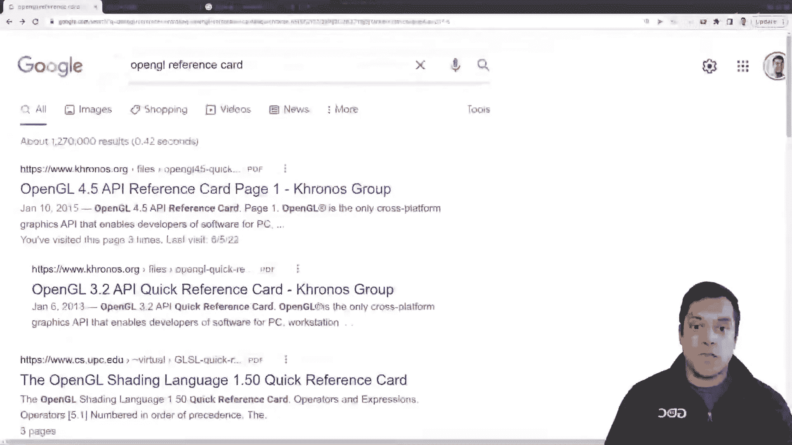
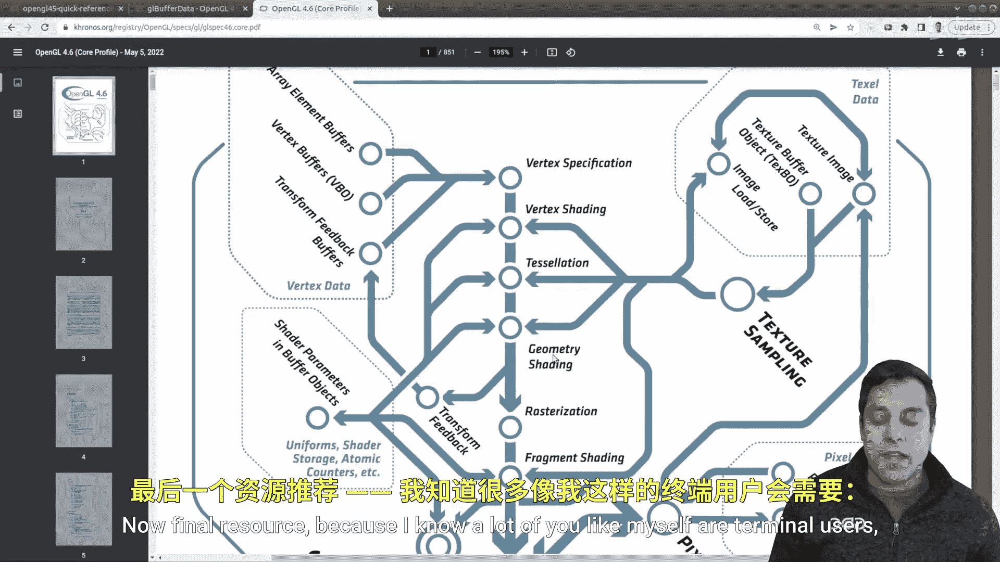
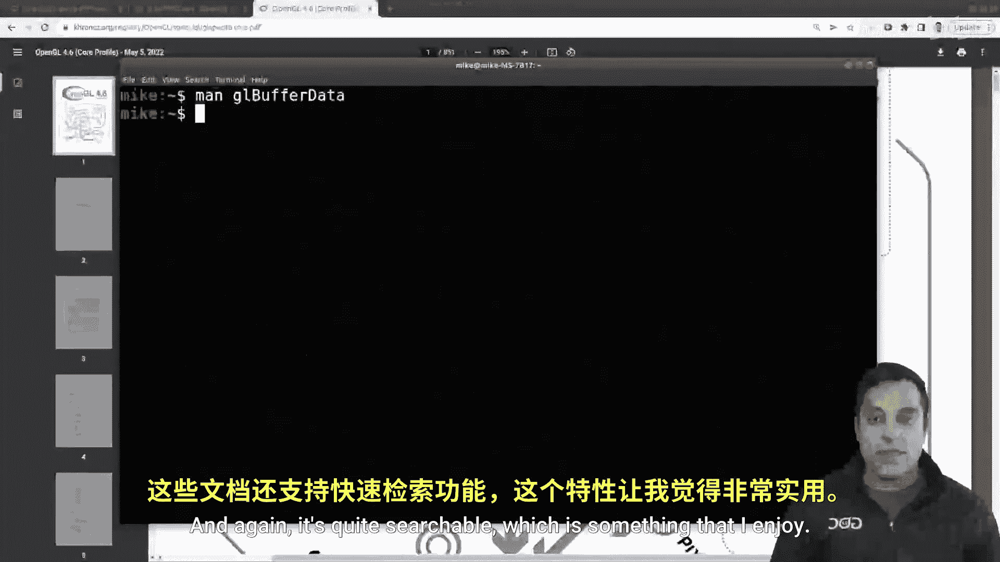

# Mike Shah【中英⚡OpenGL导论｜Introduction to OpenGL】 p08 P8 -Episode 8- -Help- Docs.gl, the Spec, and the OpenGL man pages  - Modern Open -BV1pTvFz3Eqh_p8-

Hey， what's going on folks， it's Mike Karen and welcome to the next lesson in our OpenGL series in this lesson I'm going to give you some tools that are going to help you with programming in OpenGL。

 not tools as far as IDEs or editors， but rather some documentation so as we get ready to program。

 let's go ahead and take it a few resources that'll be useful。

So the very first one that I want you to look at is the OpenGL API Ref card。

But go ahead and click on it and maybe zoom in a little bit。

Now it's going to be a little bit intimidating to say because we have all the OpenGL functions listed here。

But I just want you to know that this can be a useful tool as we run into various openGL commands that you can do a control F and then search for things like vertex array object。

I like this card because it sort of categorizes things so I can have an understanding of API。

 That is what vertex arrays are what vertices and other sorts of things that maybe I didn't even know about in opengl like what all can I do with a frame buffer object when we learn about frame buffer objects but this probably isn't gonna to be your go to source。

 So let me go ahead and give you your go to source which is going to be docs do Gl Now this is almost equivalent to the Chronoss help page。

 but it's just a little bit friendlier to search So for example。

 we have a bunch of commands listed here。 In fact， we have all of them。

 but what I can do is type in something like Gl buffer data。

 And as I type it will sort of simplify what's going on or what commands match and then I can click on the Gl version that we want which is gonna to be for for most of these folks here。

And we can actually see the function call， the arguments。

 and descriptions of the actual parameters that go in here。

 I find this very helpful along with the description that gives me an idea of what's going on。😊。

Even more what I like here is we on to the notes， the errors， there's even examples。

 and sometimes links to other tutorials and maybe mine will be here someday。

 but who knows I really like doc。gL and it's a reference that we'll be using throughout this series and you occasionally might see me pop it。

Now， of course as you look up these commands if you want。

 you can look at the OpenGL specification here， which we saw in one of the first videos here。

 and this could be another resource for searching through and understanding OpenGL and again。

 as we revisit this picture on the cover， some of these things are going to become much more familiar like maybe we're even seeing the graphics pipeline going down the middle here。

Now a final resource because I know a lot of you like myself are terminal users and you might want some man pages for OpenGO So if you're on an airplane or just don't have internet access or like me just like to search things and gr through things quickly。

 you can install Man pages for OpenG so command like this if you're on a Linux system or Mac should work。

So go ahead and type in your password， Give it just a few moments to download here。And。

Once it finishes， let's go ahead and try for our manual page here， GL。But for data。

 which we looked at andvoila， now we can have access or at the tip of our fingers wherever we are。

These manual pages describing how the command actually works， and again， it's quite searchable。

 which is something that I enjoy。

So folks with these tools you're now equipped to do some openGL programming。

 of course you're going to need a little bit of guidance because this is an API that's quite wide and again that's what my purpose is to help you in this series so make sure you like and subscribe and of course now it's time to get programming。

