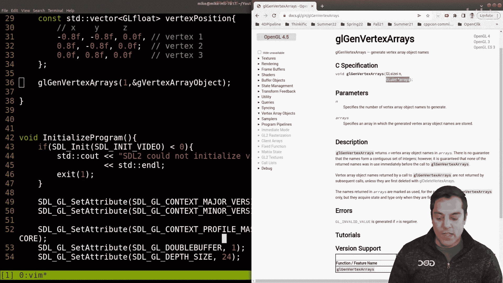
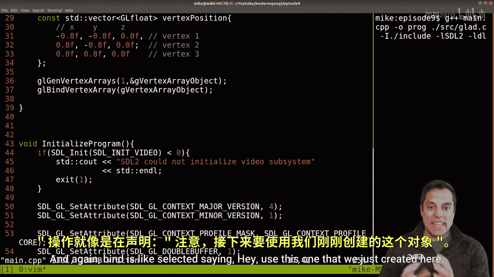
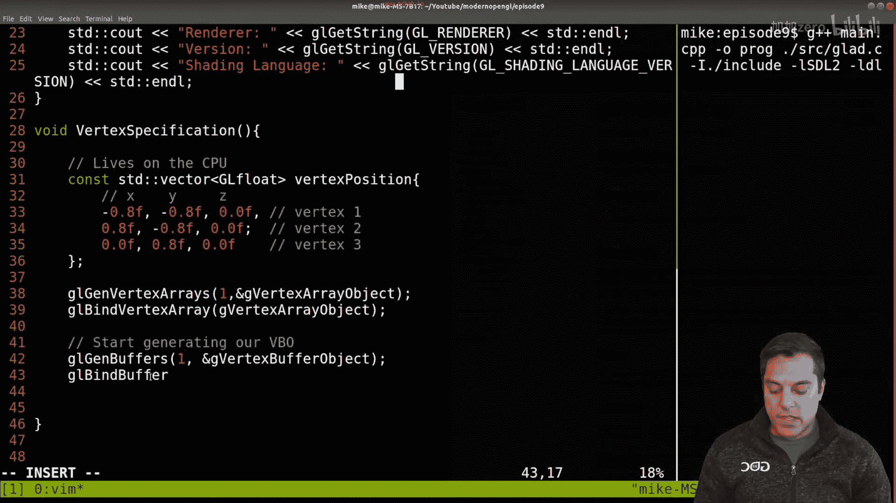
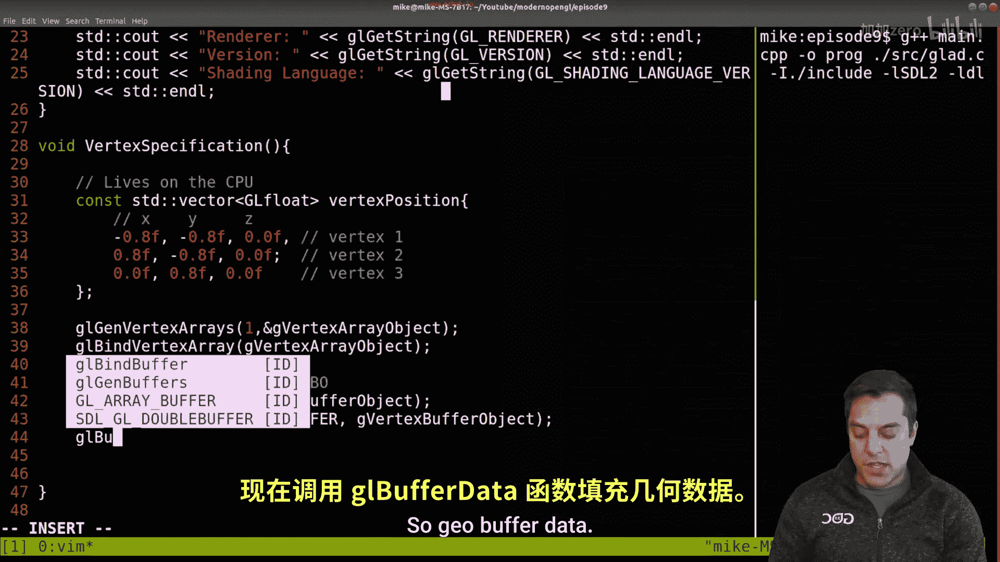
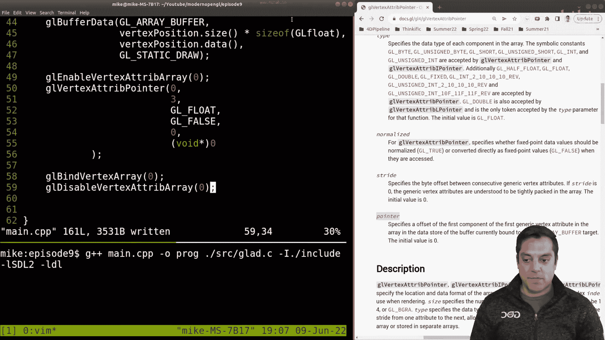
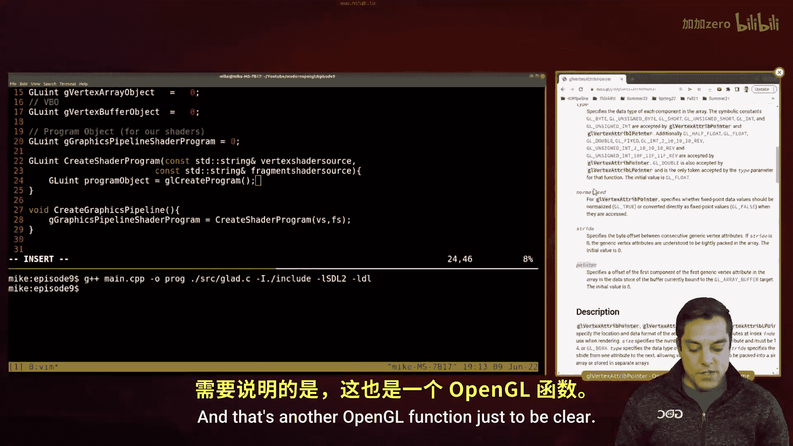
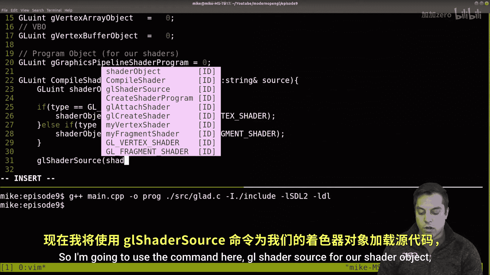
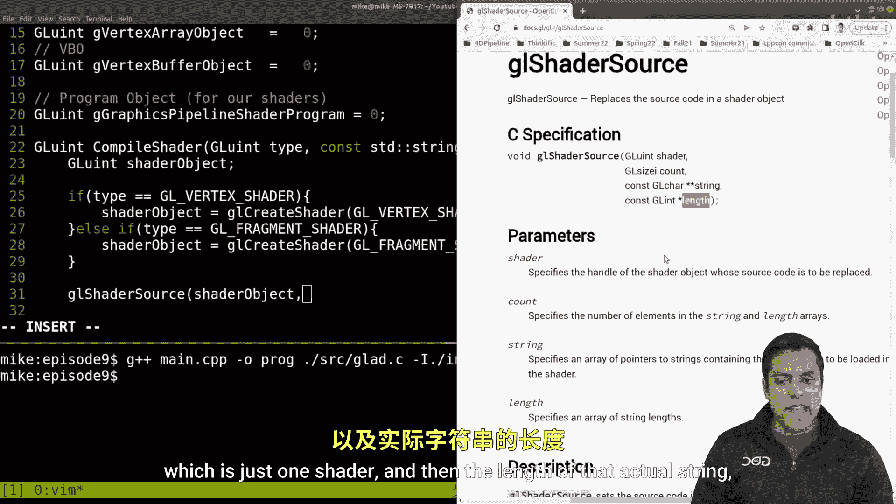
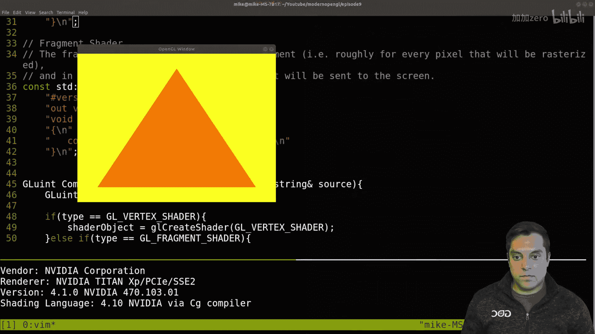

# Mike Shah【中英⚡OpenGL导论｜Introduction to OpenGL】 p09 P9 -Episode 9- -Code- First OpenGL Triangle - Modern OpenGL -BV1pTvFz3Eqh_p9-

A， what's going on folks。 It's Mike here。 And welcome back to our modern open Gl lesson。

 In this lesson， we're going to do a little bit of coding and actually get a triangle to show up。

 So it's gonna pick up from the code that I wrote in lesson 5。

 So make sure that you go back there if you'd like to take a look。 Otherwise。

 let's go ahead and dive in。 So I'll go ahead and do a quick code review of our actual project here Here' is the structure here and recall that we use Gd you could use blue if you want to wrangle or bring in our opengl functions。

 we have our main here and the Gla C， which has some implementation details。

re primarily gonna be working just in the main here。 So again。

 I'm using the SDl2 framework to get us set up here。

 you need to bring in G and maybe we'll want to do some input and output for debugging。

 So let's go ahead and just compile this program to see that it works。 in order to compile it。

 We've got to sort remember some things here。 G plus plus I need my main do cP file。

 let me go ahead and leave the structure here。 I need to compile in that source directory。

 the Gd file。😊，And then I need any includes， so capital I for the includes and the include directory。

 and then I need to link in my STL2 and on Linux， the DL library here。

So this looks like it is almost working here， oh just forgot 1 L here and let's actually give our program and output name here。

 I'll just do Prague。And let's just go ahead and review what we see here what we see the strings from our openGL get string and we have a SDL2 window capable of rendering here Now our goal today is just going to be to render a simple triangle Okay so what pieces are we going to need now that we have a way to compile I'll leave that compilation command here。

Open up our source code and let's dive in。So where I want to start here or where I want to start thinking about things is。

We've actually set up or initialized our program that was the SDL and OpenGL part。

 and we have our main loop。But before we get to our main loop。

 we're actually going to be doing the work of drawing our triangle。

 what we really want to do is the vertex specification。

 So allow me for a moment to go ahead and write that function， which I'm just going to specify here。

As the vertex specification。And this function essentially is going to be responsible for getting some vertex data on our GPU。

And then I'm going to actually have another step here called Cate Gras Piline。

 which is going to be responsible for once we have our actual geometry creating a pipeline with a vertex and a fragment shader。

 so thatll mean compiling some source code， shipping into the GPU and then we will eventually get into our main loop and actually draw some stuff。

So let's go ahead and start with our vertex specification。So somewhere above this function here。

And let's go somewhere reasonable here， perhaps before we initialize a program just because I like to have things sort of in order。

I'll create our vertex specification here。Now again。

 the goal of this is just to create some vertices， so I can do this on the CPU side and I'm just going to use a vector to do this。

Now I could use a float here because these are going to store X Y and Z positions。

 but would try to prefer open GL floats just because across different architectures they'll be more uniform in reality this probably isn't going to make a difference on desktop or even console development。

 but this is just good practice。So here I have my vertex positions Now let's actually specify them。

 I'll use a initializer list to do that and I'm just going to get some vertex positions。

 Now these ones I happen to have on a document in front of me but basically what this is is the X。

 Y and Z positions here So let me label those X Y and z positions of our first vertex Now let's go ahead and create another So I'll put a comment here。

😊，And another reasonable location here now I'm doing these between a value of zero and one in general or negative one in one excuse because that's what our actual open Ge coordinate system is It's not some range of say zero to 800 or anything like that Okay。

 so we'll have to talk a little bit more about coordinates later。But for now。

 these are our three vertices here， and let's just go ahead and say vertex1。Vtex 2。And。

Vertex number three， okay， and this is on the actual CPU， so lives on the CPU。

Okay now how do we get this on our actual GPU Well， there's a few things that we need to do。

 we need to set up a vertex array object first and then a vertex buffer object which will actually contain this data。

Okay， so in order to create the vertex array object， GL， gen， vertex arrays， how many do we want。

 well， just one for now， and then I need somewhere to place it。

And the common way that OpenGL works with this is by using an integer that's sort of a handle into some object here。

I'm just going to call this G vertex array object。 Okay， and we need to clear this somewhere。

 and this is going to be a open GL unsigned int。 So GL U for。GL unsigned。

And then it's just simply into。 So G vertex。Array object。

You'll notice I actually didn't give this any default value， let's just give it zero。

And I'm actually going to make this a global variable and again。

 sorry for making this a global that's just how it is to get started。

 we can think about what data structure or manager classes we want later on。

 so this is our vertex array object。😊，And actually， while I'm at it， let's go ahead and well。

 let's just focus on our vertex array object for now。And finish generating this。

So after I generated it， what's the next step here Well again。

 it's one thing to watch me do this but let me again give you a little bit of an assist here， so GL。

 Gen， vertex arrays， I'm using Docs GL here， which often has some useful examples here。

So again， just to understand those parameters， how many things that we want and then the actual arrays where they're going to be specified in this case I just have one integer here so that's okay if I had two or three I would actually make this an integer here。

But in general， the next step is once we have one of these objects is's defined to it。

 a GL bind vertex array。Okay， and which array do we want to bind to， well。

 this one that we just rendered。And again， bonding does like select saying， hey。

 use this one that we just created here。

So let's go ahead again into our search， GL B vertex。Aray。Version4。

 although it's usually not different in version  three。

 but we want to be specific and we can see that we're just binding to or selecting a specific array here okay。

All right， so now that we've done that and that's going to be important for our layout for what information we're accessing。

 so we'll get to that in a moment。But now I'm going to start generating our vertex buffer object。

Okay， so how do we do this， Well， again， GL Gen buffers， another generate band。

 one buffers what we want to generate and G vertex buffer object。

And we're using an Ampersand because again this is a C based API so we're passing in addresses of these things。

 and I need to again create a global variable for this vertex buffer object。Again。

 I know folks don't love this， but for our VBO， this is what we'll have GL U。

int g vertex buffer for object，Equals zero。And these types， just so I don't mess this up here。

 need to be uppercase， so these should be G capital L oops。hop back here。Cample GL。You a't。And ge。

 there we are。Okay， now let's go ahead and hop back to our vertex specification。

 so we've generated a buffer and now， as we typically do， we want to select that buffer Okay。

 so GL bind buffer。

Okay， now let's go ahead and look at this on GL docs here， GL buying buffer。

And here will you open GL version four。And go。And let's go ahead and take a look at the parameters here。

It says here we bind to some object and we've got a target， okay。

 so there's many different targets that we can have depending on what information this buffer is going to store。

If we're accessing vertex attributes， we just need a GL array buffer。

 So these are the things that make up vertices， positions， texture coordinates， colors。

 all the things that we've put into this buffer here。 So let's go ahead and do GL array。😊，发盆儿。

I don't need to specify in a sense， anything beyond that because the next parameter is， well。

 which buffer am I working with， that's the vertex buffer object。Vertex buffer object there。

 so now we've selected it。And now we're going to populate it with some data here， so geo buffer data。

Okay， let's go ahead and look at that in the docks。Fia buffer data。And here it is。And again。

 you'll get quicker at these various commands， but it is helpful to sort of look them up one at a time and try to understand what they are doing here so let me go ahead and just leave up this documentation and I'll leave up this window here so we can see。

So again， we have a target so what kind of information are we working with what is our actual buffer well that's going to match the thing that we have bound to the GL array buffer。

And then we have the size here， well， that's the size of our data in bytes Okay。

 so how big is this buffer here？Well， if I actually look at the information that we're trying to store in this buffer。

 which is from this vector here， vertex positions， I can count here that there's nine floats okay。

 now I'm going to do one better and use the actual data structure here， vertex position do size。

So that'll be nine and then we need the size in bytes here so if you actually go down to the size it's a specified size in bytes。

 so you have to be careful。Now how big is each one of these floats here， well。

 just make it easy on yourself， size of GL float here， okay， and then on to the next parameter。

So try to make things easy on yourself as best you can here。Okay。

 now what is the next parameter that follows there， go ahead and put on a new line here。

That is the actual data here or the pointer to it so the pointer to this data Now if you're using a data structure like a vector。

 we can actually get the data here， which returns the pointer to the raw array If you just had a regular array。

 you could just pass in the array in that way。And then the final parameter is how how are we going to use this data。

 Well， we're actually just going to draw the triangle Now there's many ways that you can sort of hint to the openGl driver。

 What is going to happen。 Are these triangles going to change a lot。

 are they going be streamed in We're just going to use for now GL static draw because we're just trying to draw a triangle so we've got that much so far and are now able to load some data into a vertex buffer object And now this is where the vertex array object comes back into play because we've said。

 hey， we're got this layout that we want to work with and we're going to start kind of working with it and we've generated some vertex buffer object but how do we actually get to that data here and that's where we're going to enable an attribute So G enable。

A verertex， a Tri array。Okay， and the zero attribute Okay， so let's go ahead and paste that in。

And see what that brings up in the documentation。GL4。And I'll hit the search。

And you'll see that this has to do with enabling or disabling some generic vertex attribute。

 Now again， we've only got one attribute associated with these vertices and that's their position， X。

 Y and Z， so we've just enabled it。Now how do we use it Well then we're going to need something called GL vertex。

 a Tri。Pointer okay， before I get to that， let me see there are some examples here so you can kind of take a peek。

 but I'm going to walk you through anyway。And let's go ahead to it。

You're going to see that there's quite a few parameters。

 but it might be easy if I just for now walk you through them。 So let's go ahead and do GL， vertex。

 a Tri pointer。And the first well attribute that we're working with， that's right here， the index。

 make this a little bit bigger for you。All right here。That's the index well， this is zero。

 so that matches exactly what we have here。Okay， what's the actual size of this。

 how many things are part of this collection Well， if I have a X， Y in Z position。

 that's three things X， Y and Z， Okay， so that'll be three。And then the next number the type。

 what type of information are we working with， floating point information。

 so there's a no for that as it normalized， I'll assume it's not， although in this case it really is。

 I guess we could do either。The stride is how much- well。

 let's actually see how the stride is described here。

But it's the biked offset between consecutive attributes， meaning is there X， Y。

 Z and then a space before we get to say color data RGB。

 well we don't have any other attributes here so for now this is just going to be zero as well。

And then likewise， the next parameter here， the pointer for the offset， well there is no offset here。

 so the initial value is zero， but you could just specify some pointer as such here okay and then we'll just go ahead and close that。

Okay， now now that we've done that， we've essentially said， okay。

 our vertex array object here knows how to work with vertex buffer objects that have basically x y and z position or one attributes Okay so now I'm just going to do some cleanup to close these things so the way that we close things when we're done vertex will bind to vertex array。

 well， previously we had vertex array object this one but we're done with it。

 we don't want to bind into anything so typically we just bind to0。

And then we also disable typically anything that we do enable， so disable。Our vertex。A trip array。

Okay， and it was the zero one here。 Okay， now at this point。

 we've set up our vertex specification here。 I'll go ahead and make this a little bit smaller。

Yes， so you can see。What this looks like， again on the CPUU， we start setting things up。And then。😊。

We start setting things up。On the GPU， Okay， simple as that。

Now let's go ahead and take a moment here。And see how good I've done as far as making any compilation errors。

And there's a few here， we need to include vector。Atline four。So let's go ahead and do that。

And let's see， it looks like we're missing something before line 51。Which is。

And let's just go ahead and look at this quickly here。Up。

 looks like I messed up something around line 35。So you folks probably saw that before I did and I stuck in a semicolon here。

 which is going to cause lots of chaos。 Okay， so now we're just missing our Cate graphics pipeline function。

 Okay， so I'm pretty confident that this is going to work because I've coded it before。

 but let's go ahead and start looking at creating that graphics pipeline here and then we'll debug further as needed。

So for our C graphics pipeline function， let's come up somewhere towards the top of our code here where we might want to do this。

Let's just go ahead and create the function create Gs pipeline。And if I save this and recompile。

It should be working now because we have our function here。

Now what I'm actually going to do in this function here is I need somewhere to hold the actual graphics pipeline and again you're going to notice some theme in openGL that these are usually just unsigned integers。

 those are sort of the identifiers for some object because again this is a C- based API。

So this is going to be my program object。Or our shaders and that's going to be another way to say this our graphics pipeline。

 something that has a handle to a pipeline that we can pile that has the vertex shader and the fragment shader。

Okay， so let's just go ahead and get this， this is going to be another GLU in and for a name。

 I will just call this G graphics pipeline Shar program。Again。

 you'll come up with better names yourself， but I just want to be very， very specific here。All right。

 so this is going to be where we store our object。Now how do we exactly create this shader Well。

 what I'm going to do is kind of work backwards a little bit to create some abstraction here I'm just going to write a function here called Cate shader program and it's going to take in some sort of vertex shader and a fragment shader okay。

 so we'll have to get to those parts here。But let's go ahead and start creating this Cate shader program。

And again， the idea is that this is going to be a function that takes in some string here。

 perhaps by a reference here and the vertex shader。And the。String for the fragment shader Okay。

 now I don't like these short names， so I'm actually going to name this fragment shader and the source code Okay because these are actually going to be the strings that we have it vertex shader source Okay so let's just go ahead and leave it as such here。

Okay， and this is actually going to return some GLU into us and again that's going to be the handle to the actual GPU Shar program again。

 it's just an integer that I'll specify it。Okay， so what do we do in this create shader program thing here Well。

 we have to create an excuse to be an unsign int or GLU int here。Some program object again。

 this is going to be our pipeline， so I'm going to call this GL Cate program。

And that's another openGL function just to be clear so you know if I'm making up these things or not。

GL Cate program， let's look at version four here。And this creates a program object and essentially as if you want to read this an empty program and then we're going to fill in the vertex in the fragment shader part of it Another name for this is just be Cate graphics pipeline GL Cate graphics pipeline maybe is a better name for this okay。

So I can go ahead and abstract this as much as I want。

 but I'm going to go ahead and do this for our my vertex shader。

And then again for my fragment shader， I'm going to create another function and I'm just going to call it。

 and this is common what you'll see in libraries， something like compile shader。Okay。

 and we're going to pass in the type of shader that we want to build。

And then the actual vertex shader of source code。Okay， so compile。The shader， GL fragment。

Shader and these are just aumoms that I'm going to pass into this function。

And essentially compile these things Okay， so let me go ahead and give myself。Another function here。

GLU int， and it's is going to be called compile shader。And as far as the arguments go。

 it's going to take in a。T。And then the actual source code for the shader that we want to compile。

Okay， and we'll work on this abstraction in a moment。

 but I want to go ahead and finish what the rest of our shader program here is going to do。 Again。

 its job is to take whatever the result of compiling a vertex shader again。

 this is happening while our program runs in our fragment shader and then assembling them in some way So okay。

 what happens during that assembly process。 Well in order to get everything into this program object。

 we have to attach those shaders Okay we'm going to do GL attach。Shader。To our program object。

 and this is going to be my vertex shader， and I'll patch another shader。

To our program object and this can to be our fragment shader， Okay， so now they're attached。

And you could kind of think of this like when you compile source code。

 when you can pile multiple files together， and then we're going to link those。Together， okay。

 so let's link in our program object here。And now we might also do some things like validate our program to make sure that it's valid。

Sort of an error checking stage here program object and so on。 and this ultimately is what we return。

From this function。Now there's some other things that I can do， for instance。

 that I'm going to admit for the length this， but I also do want to detach these shaders and do a GL delete shader for my vertex and my fragmentgma shader。

 I'm going to do that in the next lesson when I show you a complete and commented piece of code here。

Okay， but now let's go ahead and compile our shaders here Okay， so what we're going to do here。

In our compile shader command， and this is where the actual compilation happens。

 I'm going to just go ahead and say if it's one of these anums here。嗯。Else if。ZL， we said。

 fragment shader。We're going to do one of two different things。

 what's the shader that we're going to create here？So we want to create some shader object， again。

 GLU int。Shader。Object， let's call。 And that's what we're actually returning here。

 Okay turn the shader。Object。Okay， so our shader object， if we're trying to。

Pass in a vertex shader here。It's going to be too。Well， create a shader， thatll be GL。

Great shader and a vertex shader here。This isn't strictly necessary。

 in fact you could probably get rid of this step here。

 but I do like to have some additional debugging later so if I know if the type was the fragment shader or geometry shader I can actually kind of output this。

 but for now this is。Fine here， okay， in case somebody passes in a legal value or something。

I'll create a shader and this will be the GL fragment shader here。Okay。

 now what do we do at this stage here Well， when we have this source code here now this is what we need to actually compile and we'll get ready to compile it based off of it it' a vertex shader or fragment shader in this case Okay so I'm going to use the command here GL shader source for our shader object。

And let's actually take a look at this command here。GL Shar。Source。And let's see what's going on。

And I'll hit go。So it takes in the shader。The number of elements here that we are compiling。

 which is just one shader and then the length of that actual string。

 which we only really have one so I could pass in null here if I want。

Okay， soll be one and our source that we want to pass in。 Now。

 this source needs to be passed in as a constant cha array because we don't have string types here。

 So just to be clear about what that is constant cha。

This would be the equivalent of getting the C string version of our C++ string here。

 so I can actually just pass that in here。And then no pointer for the last thing。Okay。

And then once I have that shader here， I can compile。The actual shader object itself。

 now that we have the source code there。Now at this point this is enough to actually compile our shader。

 in fact this can really be a simple three line function here， create the shader。

 set up this source code， and then compile it， and then return that shader object。

Now I've added a few additional things here just for error checking later on， and in fact。

 if our shader doesn't compile， we would actually want to be able to log that and I'll show how to do that in the next lesson and at least the code to do so。

Okay， so at this point， let's go ahead and save， let's take a pause， see if I've made any mistakes。

 a few mistakes here。Line 58 here。And 59 here， let's see if there were any other ones。Okay。

 no other errors because we're missing our vertex shader source code and our fragment shader source code。

 so where does that actually come from？And depending on your implementation and how fancy you want to get and what we will eventually do is we want to load these from files now because shaders themselves are just text information that we're going to compile again let's take a look at where we're doing this compilation here with our shader source and then compiling it these are really just strings so for now I'm just going to create two strings they're going to be globals which I know we don't care for but we're just learning right now。

So let's go ahead and paste in two strings for us shaders here oops let me undo this， do acent paste。

And here's two shaders。Okay。Now these I admittedly have already written。

 so I'm going to just leave them up on the screen for a moment and I described these in the previous video。

 but the form of shader is usually you start with the version of the shader that you're using。

 any data that you're bringing in which for our vertex shader we're starting to bring information in。

And then our main function， which is the entry point and again。

 the goal of or what the vertex shader must do is position the final vertex so you'll have this geo underscore position。

 which is a built-in variable where you position the vertex' position X Y and z， for instance。

 is the information from our vertex specification which is by default what we're bringing it again that's these vertices here that we shipped into a buffer okay。

Now for our fragment shader to look at this for a moment， again。

 we start off with a version and it's one job for a fragment shader is to have one out because it's the final step as far as the shaders are concerned that outputs the final color of a fragment or a pixel if you want to think about it that way so we have our entry point and for this shader we're just going to output a specific color here so let's go ahead and pass in our vertex shader source and our fragment shader source into our function here。

And this is。Down a few lines right here。Fine 81。and this is g vertex，Shader source and G。

Pragment shaders。Okay， so let's go ahead and give this a compile。

It looks like it compiles at least on the CPU side， we know things are running。

 and if I go ahead and run this program， let's see what happens。Well。

 nothing at this point why not well again， it's not quite enough for us to just specify the data and the pipeline we actually need to issue some sort of draw call。

So again， just to refresh on our actual program here。

We have after we've successfully created the graphics pipeline。

 we need to look into our main loop here。And in our main loop， we handle input。

Which we have an input function that will just loop and listen for user key presses。

A predraw function and a draw function。 So those are the two that I've actually got to implement here。

 So predraw is actually going to be responsible for setting open GL state。

 At least that's the way I'm going to structure。 You could put all of this in draw if you want。

 But this is gonna be functions like what we want to disable or enable。

 So I'm going to disable a few things here just to make our scene very simple。😊，DL， Disable。

 and a lot of these things you're welcome to look up， but we will talk about as necessary。

And let's set up our GL viewport。Thishich is essentially just the size of the screen here。

 the screen width and the screen height。And then the background color。Of our scene here。

 let's try something like this， one in the red， one in the blue and0 in the green and fully opaque。

Now if I actually。Do this much， let's see if our program runs here。Oops one extra。There get here。

Let's see if it does anything different。And so it compiles。And still a black screen。

 So we're almost there。 We're actually missing one step here。

And what we really need to do is say use program and which program are we using， well。

 our GL graphics shader。Program here。 that's our pipeline。 So let's go ahead and try this now。

And if we run it， well， let's see， well， we're almost there。

 but at least now we have our graphics pipeline， we have state set up。

And we're using the appropriate pipeline here。 Okay， so let's actually get into drawing。

 And when we actually issue our draw call， then the pipeline will be activated。 Allright。

 so in order to draw。We've got to figure out which vertex array object are we going to be using。Okay。

 so let's go ahead and set that up。And draw。EDL and how do we do this Well we bind to the vertex array that we want vertex array object。

Now， which buffer do we want to draw from？Well， let's go ahead and do GL bind。Bffer。

And select the array buffer for our one vertex buffer object。

And then now we'll issue our GL draw arrays， which is our draw call we're drawing triangles。

 how many， well we're going to start from zero and we have three here Okay。

 let's go ahead and try to compile this see if I any syntax errors and now try to draw。And now。

 if I actually draw here， we are， in fact， getting a triangle here。

 So that's also our first triangle。Now one mistake that I've made and maybe some folks have seen this is our background color is still black here。

 so I've got to actually call one other function here。

 which is going to be in our predraw function there is a GL clear command and we're going to clear the depth。

B， which we've got to talk about and the more important one is the color background bit here Okay。

 so let me go ahead and just rerun this。And now we should see some sort of yellowish color here for our triangle。

Allright， so again， because we didn't explicitly say， hey， open GL clear this part of the pipeline。

 we didn't get our actual clear color that we said here。

 but we are now raizing our actual orange color now where did that orange color come from just in case you know it was very subtle well where are our pixels actually being filled in our triangle well that is again in the fragment shader here so this tends to be orangeish color so the pixel fragments that we are coloring in。

Again， in our fragment shader that ones once per fragment，1。0 in the red intensity。

 and these values range from 0 to 1 and the green 0。5 and then 0 in the blue channel and then 1。0。

 So it's fully opaque。 Allright， So let's go ahead and bring up this triangle one more time here and end the lesson here。

So folks， this was a monster lesson just to be able to get this triangle to show up。

 But the good news is once we get the triangle to show up now we just need to create more triangles and then start transforming them。

 And before you know， we can start adding different vertex attributes like textures and you'll be able to write your own game in these sort of things Now some of the organization and logistics of the actual program as far as maybe building a graphics framework。

 those things will also come at a later time。 and feel free to experiment with and add your own abstractions as you like or as you learned from this series。

 So folks， I hope you learned a lot from getting this structured and getting this program up and running in open Gl here and congratulations if you did get a triangle up and running。

 I think this will be good video for supplementing and just showing how I organize or think about things if you agree go ahead and comment below or if you find other useful resources comment below and help out the community So with the headset folks I really appreciate all the likes and a thumbs up make sure you subscribe because we're gonna be getting into even more cool stuff as we。

😊，See further in this open GL series， we'll see you soon。

