# Mike Shah【中英⚡OpenGL导论｜Introduction to OpenGL】 p10 P10 -Episode 10- -Code Review- First OpenGL Triangle - Modern OpenGL -BV1pTvFz3Eqh_p10-

Yeah。Hey， what's going on， folks。 This is Mike here。

 and welcome to our next lesson in the Open GL series。 In this lesson。

 we're going to do a little bit of a code review。 So I've gone ahead in the past lesson that we've seen where we wrote the code from scratch。

 added some comments， and we're going to do just a little bit of overview just again to make sure that we understand each of the individual parts。

 Again， I'm going a little bit slow at the start of this series so that we can gain some momentum later on and then we'll move a little bit faster as needed。

 But again， this is an indepth series。 I want to go ahead and take time earlier on to understand all the parts before we get lost。

 So with that said， let's go ahead and look at our code。😊。

So what I've got here again is our basic program and I always like to start from the main here and kind of investigate what's going on。

 So just to recap what we've done， we're following the graphics pipeline essentially。

 we're initializing our program which was setting up the SDL window setting up the vertex specification which set up the vertices on our CPU whether that was loading the data and then transferring those to the GPU using commands like Gel gen buffer and so on and then we created our graphics pipeline which was responsible for setting up our vertex and fragment shaders which means loading the shaders from some source。

 whether it's a string or loading from some file compiling them linking them together and then creating that graphics pipeline and then finally we can get into our main loop where we use that graphics pipeline to ultimately draw a triangle So going to go ahead and just jump through this code and again walk through the pipeline here So again if it's useful you might want to go ahead and have a copy of the graphics pipeline next to you just so you can see that。

This code is structured to follow this as closely as possible。Anyway， this is a code review。

 so let's go ahead and just make the code a little bit bigger。

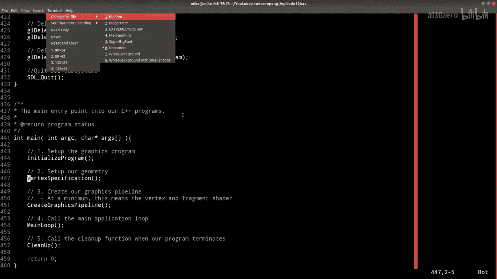

And let's go ahead and do a little bit of a review here。 So again。

 where I want to start here is just at the top of the file。 And again。

 I'm going to set up some global variables。 And this is something that will commonly do in these sort of introductory series until we can better write classes or ways to capture these global variables。

 General， folks don't like global variables because they clutter the global namespace in these things。

 but I don't care for now as we're learning。 So anyway。

 most of these have to deal with setting up our SL。 So if you see something prefix with a G。

 that means it's a global variable， and it has global scope。😊。

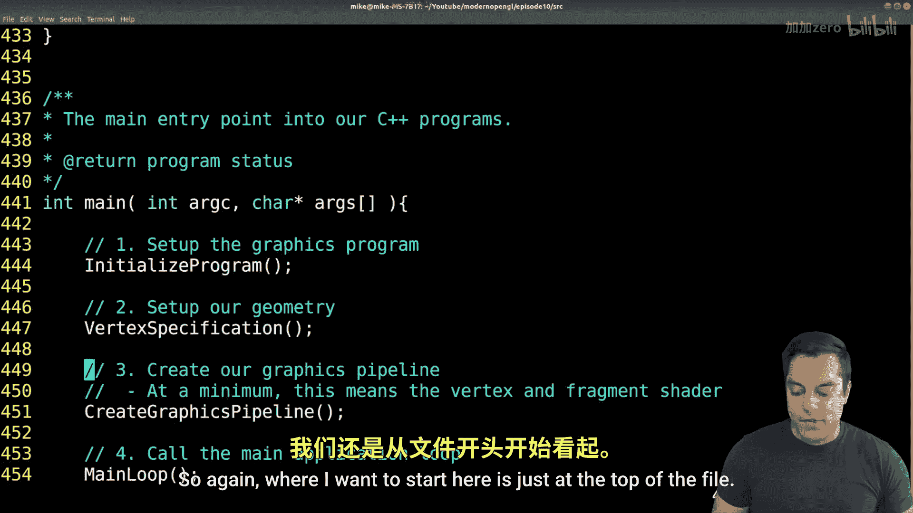

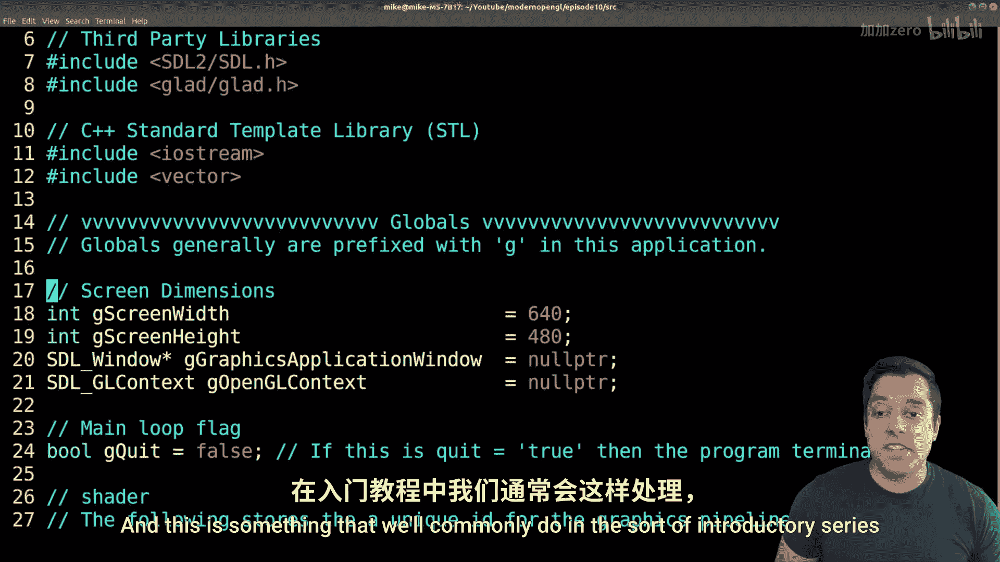

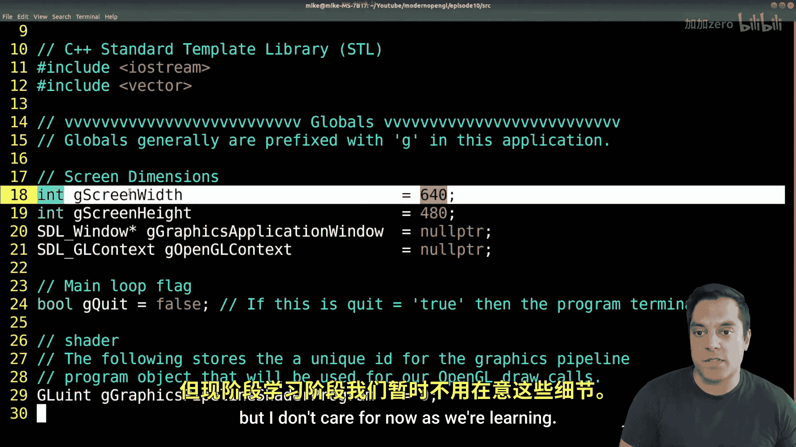

So then we also have some globals for our pipeline。

 some of the objects that we're going to use in open GL， and then ultimately the shaders， again。

 I was a little bit lazy here and just store the strings here for our fragment shader and our vertex shader as follows Okay and then we actually get into the code here so let's hop back down to the main and as mentioned。

 go to where we initialize our program。

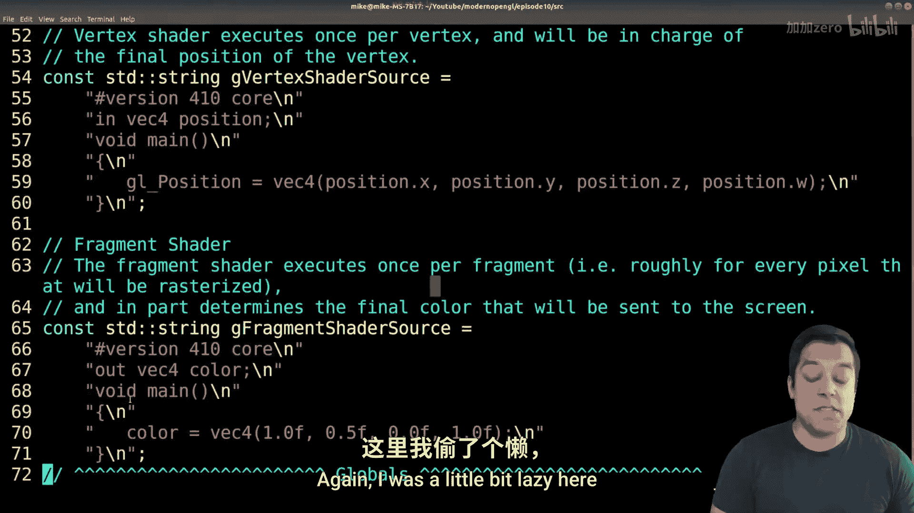

So what we're gonna go ahead and do， let's hop here to the function。 and again。

 initialize program is all about just setting up SDl here， initializing the video subsystem。

 Now I know folks who are following the series might be using GFw Gs。

 free gls or any of these other frameworks and that's totally fine。

 you're probably doing something similar in some initialized function here。

 So that's perfect if what you're doing is setting up open GL Now some of the key parts here where again selecting the version of open GL we're using at least 4。

1 in this series so can follow along on Linux Windows or Mac and that I'm setting up the core profile here。

 so that gets rid of all the old stuff which is found in the compatibility profile。😊。

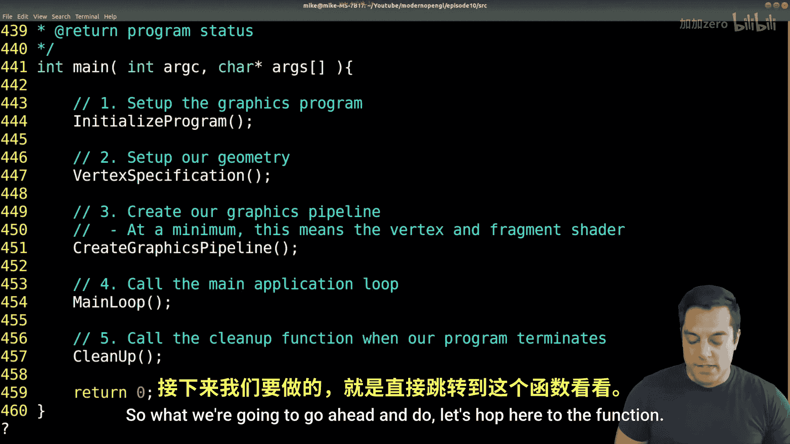

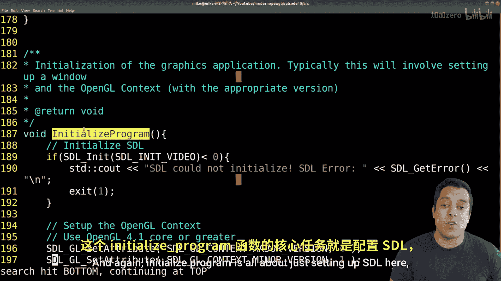

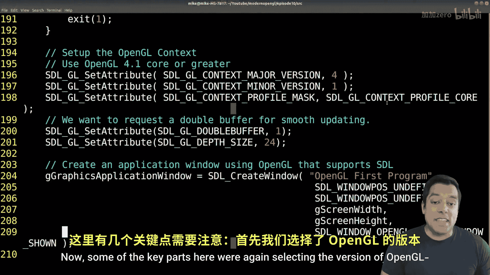

Set up some settings here for the depth buffer and so on。 And then ultimately， we create our window。

 do some checks if it's created。 Now， most other windowing frameworks that you'll use will also set up a context or have some function。

 And again， a graphics context is well， that big open GL object that just encapsulates well everything。

 So that's the idea here。

And then finally， the final step that you'll need to do is use some function wrangling library like glue。

 or as I've done in this series， use the GlaA library。

 which basically brings in all the openGL functions for us Okay so with that said。

 let's go ahead and hop back to the next part。

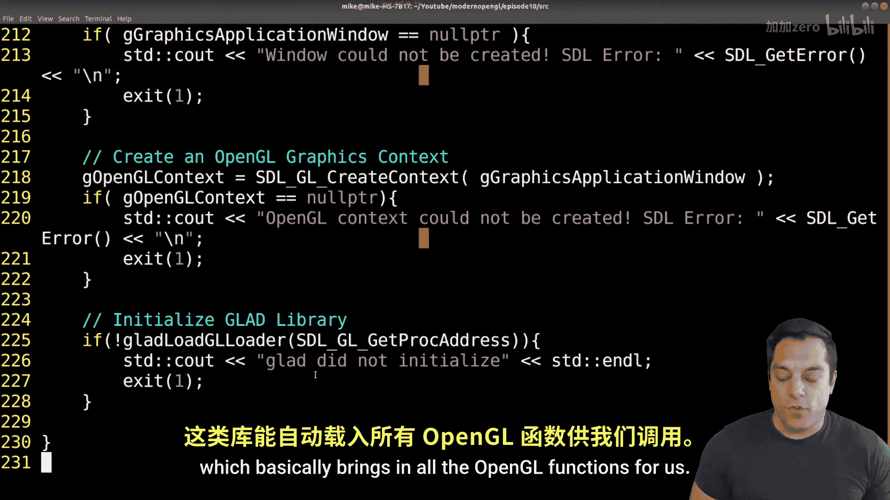

So now we want to go ahead and start specifying some vertices。 We want some 3D data here。

 so that's what this function in the vertex specification is all about setting up our geometry data here so you can go ahead and at times I'll pause here so you can read the notes or you can pause the video but essentially what we've done here is set up our vertex positions。

 These are the vertex data and sometimes it's going to be just purely geometry that is X Y in z positions or sometimes it's going to be other things like normals texture coordinates and so on set up here。

After we've set up the positions， then we want to start setting up。

How our informations can be processed on the GPU。We looked at two different buffers to do this and in a sense。

 the vertex array， which I should say is not exactly a buffer。

 but an array that basically describes how is the data actually going to be set up。

A previous lesson in this series goes over the theory of that if you want to go ahead and check that out。

And then finally， here we get to our vertex buffer object， where we go ahead and generate one buffer。

 which is going to store all of our vertex positions for us。

And we describe what that actual data is here by generating or rather copying the data using the GL buffer data function from our CPU to our GPU。

 Now again， we had to be a little bit careful here with how we specify the size in terms of bytes of the information that we're sending over。

 remember we're sending over X Y and Z positions so that's however many bytes afloat is times however many of those individual vertices that we have。

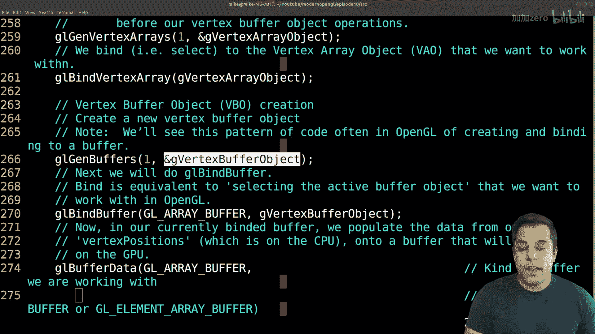

And we actually need to point to the actual data here on the CPU Now this vertex positions here is a vector so we can get access to that underlying array through the dot data function。

Allright， and then we set up now that we've got this actual buffer of data。 So again。

 it looks something like this where I'll have。

A collection of data here， these to be my X， Y and Z positions， X， Y， and Z， etc。

And these would be the first set， the second set and so on。

 But I need to be able to point to this collection of data。

 these three pieces of information and be able to。Tao。Open GL through our vertex array object that。

 yes， this is some data here， position followed by another set of positions， etc cea。Okay。

 so that is the idea with。Working with our vertex attribute arrays here。

 okay which is basically saying， hey， we have this collection of data in a vertex buffer object and how do I point to or which section of data do I point to to get to the next vertex because remember a vertex mathematically is just an X Y in a Z position。

 But when working with open GL， we think of it as having different attributes。

 the X Y and Z position maybe a color maybe a texture coordinate maybe a normal， etc cetera。

 etc ce Okay so that's the idea here。

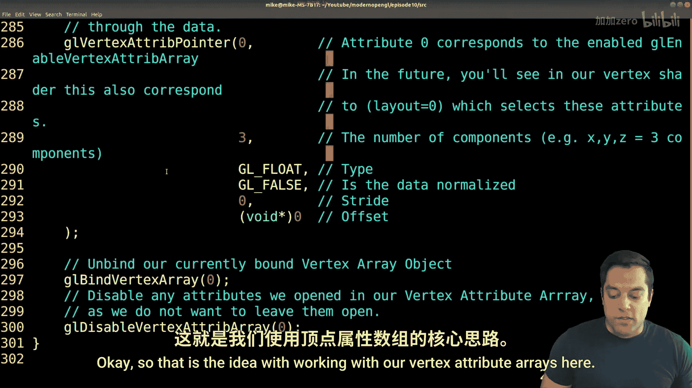

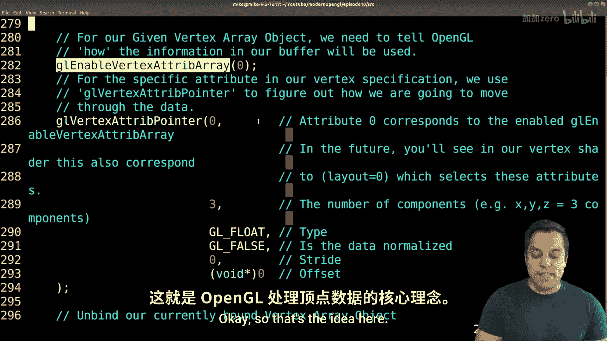

And then we just do a little bit of cleanup here。By。Un selectlecting our vertex array。

 usually that sum just passing again zero and disabling any attributes here。

Okay， so now that we've set up the vertex specification。

 Now we'll go ahead and set up the graphics pipeline。 We've got some vertices。 Now。

 what do we do with them。 So we created our graphics pipeline here。 Now。

 this was a series of function calls， essentially to create our shader program here。

 So let's go ahead and dive into that here。😊。

Which again， this function。Basically took our vertex shader and our fragment shader。

 those strings and compiled them through this compile shader function。

 The actual functions themselves aren't that interesting。

 I'll go ahead and hop into them so that you can see what they look like and the actual documentation that I have here of our compile shader。

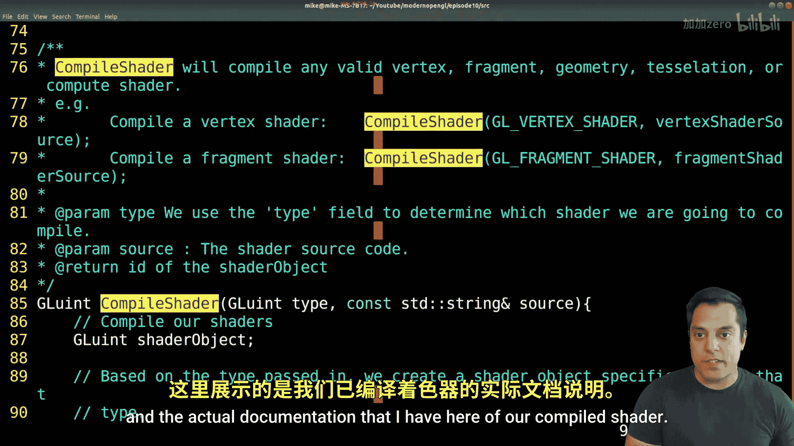

But basically， we just figure out how to create a shader。

 We specify if it's a vertex shader or a fragment shader and then just go through the compilation process。

 Now there's some additional functions here that I've added regarding some error checking。

 So I'll just briefly leave this on the window here。

 if you want to go ahead and have some error checking。

 It's incredibly helpful to have a little bit of logging here because if you make a spelling mistake。

 forget a semicolon or just make some other error in your Glsl shader， you'll want that reported。

 and I'll report it at runtime after your program actually running。

 So that's an important distinction to have。 let's go ahead back for a moment here into our GL create shader program。

 So after we've compiled both our shaders now we attach them together and ultimately link everything together in this one program object。

 and that's what makes up our graphics pipeline。 So at this point in time。😊。

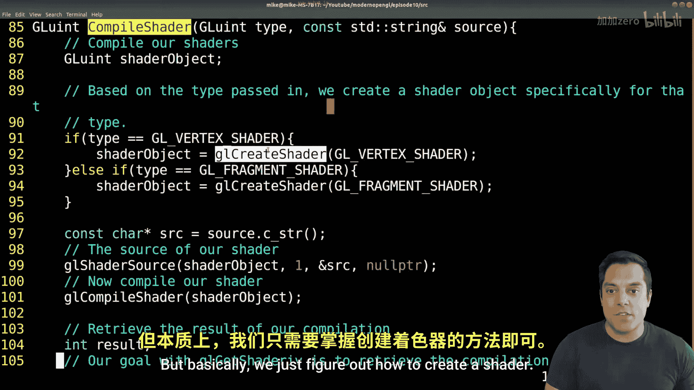

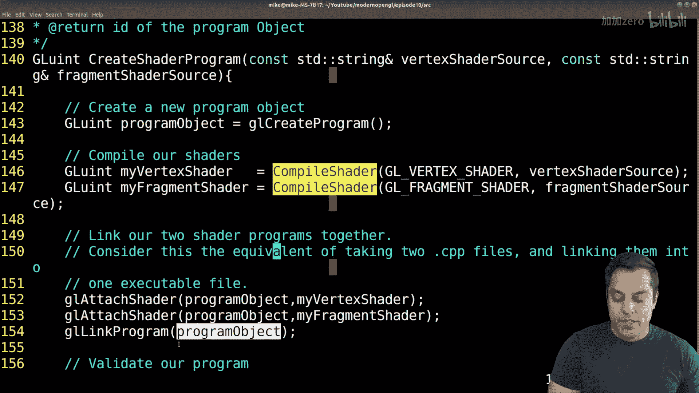

We have a working graphics pipeline assuming no syntax errors in ourGLSL program。

So if I go ahead and rewind us back here。

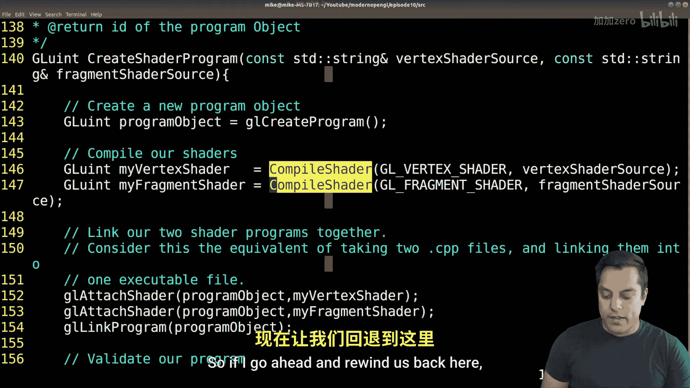

We've created our graphics pipeline and now it's time for our main loop。

 so we'll go ahead and jump into that。

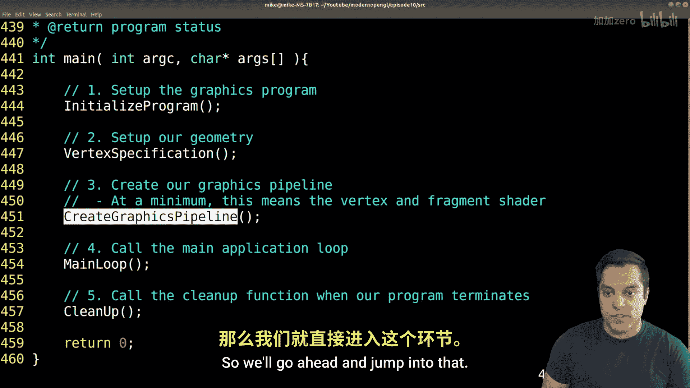

And again， the structure of a graphics application typically and many other real applications is to have some sort of input。

 then draw and then do the actual display of the image here I've included a pre-draw step which is going to set up the sort of state in openGL。

 but let's go ahead and look at these one at a time starting with input here。

So input again is just running through SDL's input loop here。 if any events have occurred。

 we pull for those Even could be things like keyboard presses， mouse presses， touchpas， etctera。

 etc ce。 so that's the idea there。

So going back here to our main loo， let's go ahead and look at the predraw step。

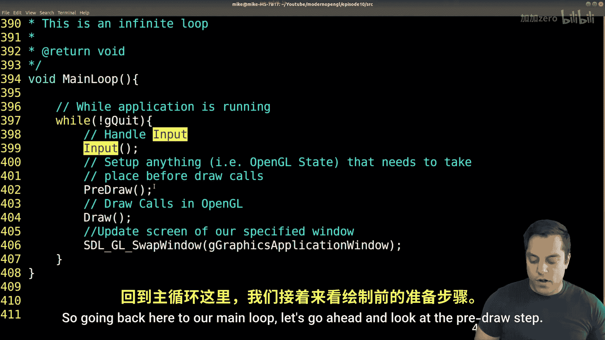

And again， the predrwl step is setting up some sort of state here。

 so usually in this function you'll see me doing things like GL disable， enable。

 maybe setting up some different colors， viewports。

 and then ultimately doing some things like clearing the screen and ultimately choosing which part of our pipeline we want to use。

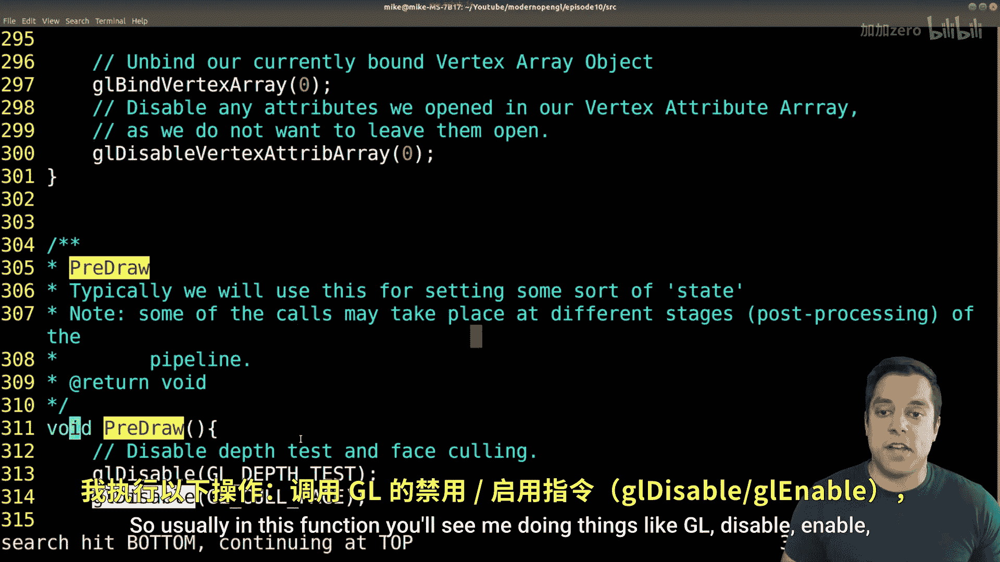

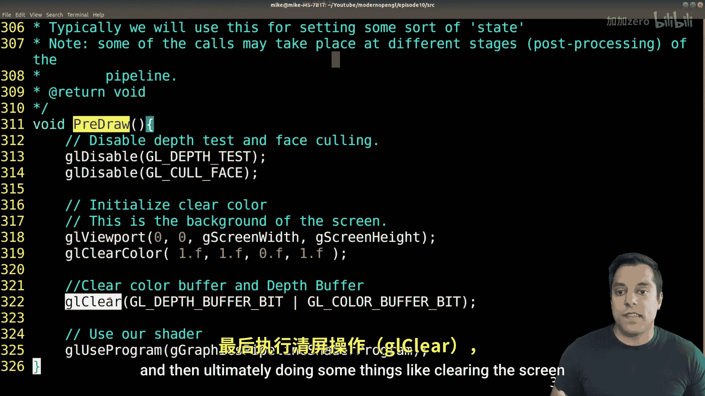

Now， as you have a more complicated graphics application。

 you might separate this out into different steps， but that will be up to you as you provide your own abstraction later on in this series。

 Okay， so let's go ahead and hop back for a little bit。

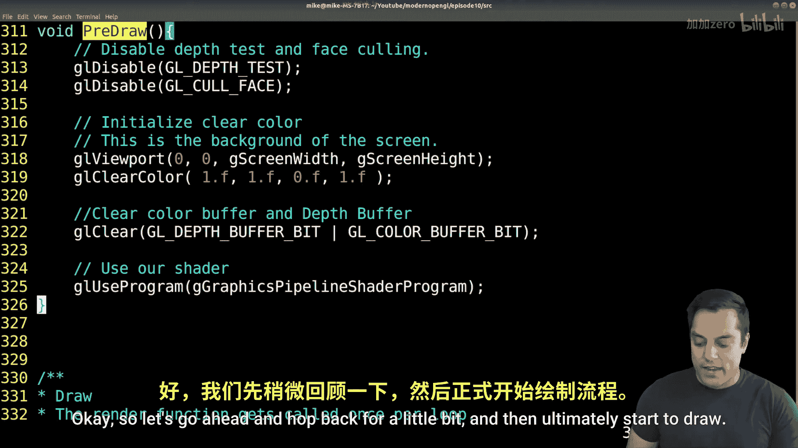

And then ultimately start to draw。

And here during our draw is when we're going to set up。What we actually want to draw。 So again。

 the real key function here or how I try to think about it。

 at least when I'm learning Open GL is this GL draw arrays function。

 we're going to look at some other draw functions like GL draw elements。

 but basically when we issue a draw call that's saying， hey， open GL。

 we're ready to kick off the graphics pipeline。 So before we do this。

 we need to bind to the actual vertex array object that says， hey。

 we have this collection of data in this vertex buffer object， here's how it's structured。

 So prepare in that way。😊，And then we bind to the particular vertex buffer object that we want to take this data from。

 So again， the vertex array object says you've got some， we're ready to interpret data that has X。

 Y and z positions。 here's the actual data and now draw from that data starting from the range of zero and the first three vertices here。

😊，And what I've also set up， I could also put it in here， I suppose， the draw。

 but I could put GL use program that was done in the predraw function if I scroll up here。

For using our graphics pipeline， but then typically I like to clean up and turn this off again。

 if you only have one pipeline or only going to have one pipeline this strictly isn't necessary。

 but again it's just noted here that I like to clean up after myself here。

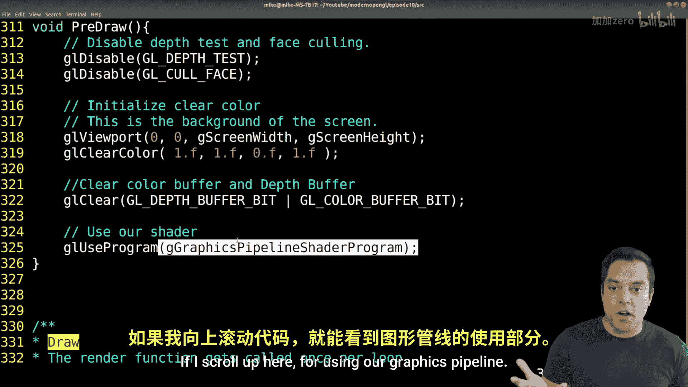

Okay， so let's go ahead and rewind back here。So we did our draw call and then ultimately what happens is。

😊，Open GL， or rather SDL2 has a double buffering strategy。

 that is that it's drawn our scene here when we call the GL draw arrays to some back buffer。

 and then I'll call this SDL swap window function which you'll see something similar swap window。

 swap buffers， something of this sort depending on what framework you're using that takes what was drawn in the back buffer presents it to the screen。

 that's what you and I see on the front buffer and this repeats itself over and over again okay。

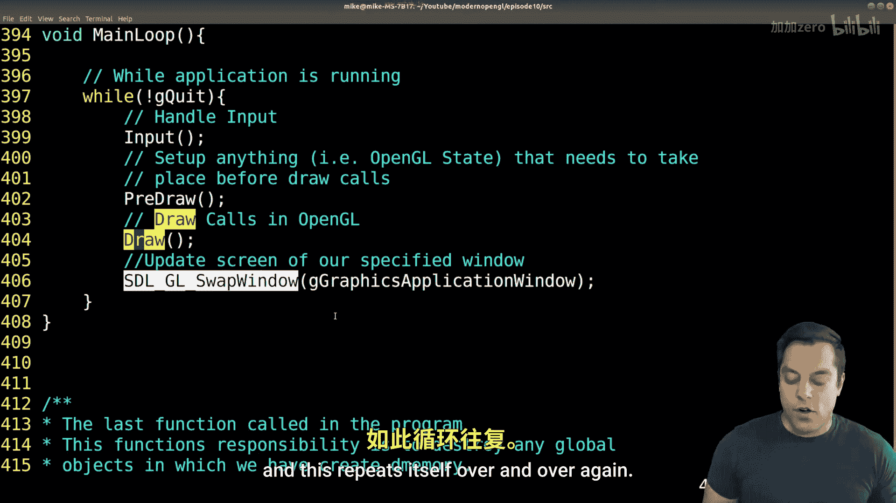

Allright， so let me go ahead and rewind us here actually that's the very end of our sort of code review。

 So again， this is a video you can take a look at， pause as you need to look at the various comments have've added some error checking and then in the next lesson we'll go ahead and proceed forward in this series。

So I hope you enjoyed this， I hope this was nice to sort of do a little bit of a review and it gives you a refresh of what we did in the previous lesson。

 again， taking your time especially early on when learning some API。

 especially like OpenGL can be valuable。And with that said folks。

 I hope you'll join me in the next lesson， make sure that you like and subscribe if you haven't so that you can give some feedback。

 the likes are always appreciated the subscription so you don't miss any other previous lessons and I'll see in the comments or in the next video Thanks for your time folks。

