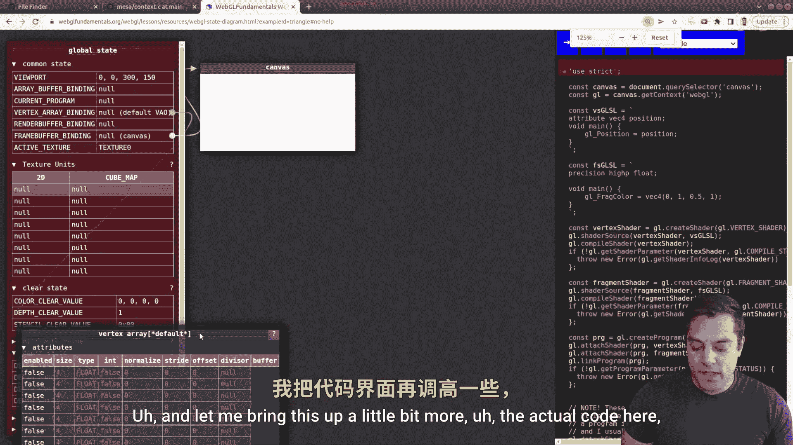

# Mike Shah【中英⚡OpenGL导论｜Introduction to OpenGL】 p11 P11 -Episode 11- OpenGL Objects, Context (through Mesa), and State Machine - Mod -BV1pTvFz3Eqh_p11-

Hey， what's going on， folks。 It's Mike here and welcome to the next lesson in our modern Open GL series。

 In this lesson， we're going to continue building our intuition about Open G。

 I'm going to go ahead and talk about objects in openg。

 but not the type that you're used to if you're coming from a Java background where you've been forced objects。

 no matter what you do。 We're gonna be talking about this in sort of the C based way because Openg after all is a Cbased programming API。

 So I want to build your intuition there。 And then we're gonna talk about something known is the open G context。

 I'm actually going show you some source code so you can actually see what that is in an actual implementation of Openg called Mesa then finally。

 I'm going provide some intuition as to the openg state machine。

 giving you a demo that you can play with。 So this is a jampack lesson。

 but I think it'll really help your intuition as you understand Openg。 And again。

 taking the time to learn now will make the rest of your open GL journey much， much easier to learn。

 So with that said， let's go ahead and dive in first look at some source code。😊。

So here I've got all the source code on a screen here。 There's three different files here。

 objectject dot C， objectject do H and main dot C。 Now。

 if you have some C programming or you've been following my C programming series。

 this is going to look relatively familiar。 So here's a screenshot with everything on the screen。

 and I'm just going take a moment to indent this just so you can break apart the different pieces just a little bit more easy。

 Now I can still see that everything's still there。

So what I want you to take away from this is that OpenGL is a C based API and that's for many reasons。

 one being portability， some being historical， but it means that we don't have object in the terms that we have C+ plus so just to refresher of what an object sort of looks like or object oriented programming in a C library So I'm going to start you off by looking in the top right corner here at object do H。

 you'll notice that I have astruct here that've defined this object is named program object underscore T。

 this is just some type that we have created here。 It's got some attributes or member variables if you prefer the name and some function pointers here。

 which would be your methods or member functions depending on what language you use。

And the idea again， is if we look at our implementation object C is we would have functions like a constructor here where we in the program object。

 pass in some object and set these values。 and the function pointers would point to various methods that would do something interesting So again to actually use this object we would have we create one here some example Pass in that object to our sort of constructor and then maybe use these member functions here I'll go ahead and compile this and run it just so you can see what happens here。

 So it does in fact print hello if you want to take a moment to pause here and follow this program。

 you can go ahead and do that。 but that's not the main point here。 The main point is that again。

 we just have structures that open GL is sort of passing around and maintaining So this I hope provides a little of intuition as to why we have so many of these functions here where we're doing GL gen buffers G bind buffer buffer data and these sort of three functions instead of。

😊，Having one object created and calling some member function。Now。

 you're welcome to implement that abstraction if you want for things like vertex buffer objects and so on。

 And that's probably a good idea for a lot of folks。

 Of course there's different tradeoffs with performance and APIs and these kind of things but I'll leave that to you for now。

 we just want to go for understanding。 but I just want to give you an intuition as to why we have these different objects like again vertex buffer objects or vertex array objects and why they' are set up this way because it goes back to a C background。

 Allright so with that in mind， let's go ahead and take a little bit of a look at some source code。

 So I'm gonna to go ahead and flip to my browser here and search for mesa source code。

 Now Mesa is an open source implementation of opengL itll run on software for instance。

 So what I like to do every once in a while and what we'll do in this series is just check out a Github repository here and we can do some searching of Mesa code and in particular。

 what I want to do if I hit T and then search for context is look at the open GL context here。😊。

And we'll actually see this dot H file here and I'll zoom in a bit and you'll see that there are some structures related to say the context。

 maybe our configuration or something we'll eventually talk about called the frame buffer so it can be helpful to later download this code and sort of gr through and see whatstruct GL context actually looks like。

 In fact， if I do a little bit of a control F here， we can see some of these functions here。

 that might be say equivalent to a constructor call here。

 where we're initializing our context and if we actually go into the equivalent context do C file。

 which let's go ahead and do context do C。Let's go ahead and see if we can find that initialized function here。

 so I'll go ahead and search for it and here it is and you can see that we pass in this context and we are setting up all of the attributes of this context Now the context is in particular the sort of important thing here so again if I scroll up to the help here you can see we initialize astruct here and this includes kind of allocating everything here。

😊，The open GL context is the sort of important object or global object that's available and has all these states or stores all the state in openGL so we can go ahead and just scroll through this just very briefly just so you can see the different things that are initialize some onetime initializations and this can be a great way to just understand what exactly is going on in openGL maybe not to start but later if you want sort of more definitive answers again。

 this could be a useful exercise but again if your goal is to just work on open GL don't worry。

 just wait for the next videos in the series where we dive into some coding and then you can come back into this Okay now with that said。

 I've mentioned this idea of our open GL context， this sort of massive structure here。

 the GL context。😊。

And again， it's a state machine， which we can just think of as having different knobs and levers that a user would pull here。

 and that would essentially or dials or whatever you want to draw here， that would change state。

 so it manages。Our state。And again， what is the actual state that we're managing。

 well that's our pipeline where we start off with the vertex specification。Vertex spec。

And then we move down our pipeline， the vertex shader through the fragment shader。

 and then ultimately displaying our actual object in something called the frame。Buffffer。Now。

 I don't want to draw the entire pipeline like I did。 That's done in a previous video。 Instead。

 I want to give you intuition about this， the GL context and how it works。

 And I've actually got a better example than this drawing here that I'm going borrow from web GL fundamentals。

 So you can go ahead and search for their website and search something like state diagram and you'll get something like this。

 Now this is done in jascript So the source codes going to look a little bit different。

 But you're given an actual window here that you're drawing。

 And then you'll see this thing here called the global state。

 which essentially we can think of as like our open GL context here that keeps track of all the information And there'll be some other familiar things here like this vertex array object that keeps track of various attributes。

😊，So what I'm going to go ahead and do is just zoom in a little bit so you have a chance of seeing this and just walk through and let me bring this up a little bit more the actual code here。

 and you can kind of step one line at a time and see what's going on in openGL here。

 So I'm just going to step through here we're loading our shaders here。😊。

Vertex shader and fragment shader creating the shaders。 and as soon as I start creating this shader。

 you'll notice that I have this shader object here。 again。

 that would be some sort ofstruct that was allocated。And then I continue on。

 you'll see it's actually got the Shar source code here。And it's going to compile。

 keep track of its status， it's true。And we're going to do the same thing for the fragment shader。

 walking through here， let me scroll down the source so you can see。And then eventually。

 we're going to create our graphics pipeline from this shader object and this fragment shader here。

 So let's go ahead and keep walking on。 Here is our actual graphics pipeline。

And we attach the vertex shader。And fragment Har here。And then we're going to link these together。

 so there they are。😊，And then eventually detach these shaders because we don't need them anymore and delete those shaders。

 And now we have this new object that's available。 this new graphics pipeline。

 And this is some open GL object that's going to exist for us。 Okay。

 so if I keep walking through here， you'll notice that I then specify some vertices here。😊。

And then I start creating some buffers here again here's a vertex buffer object I'm going to bind to it and as soon as I bind to it。

 you'll notice that this link has been noted here and that's coming from our open GL context here or our global state that's saying。

 hey， here is the current one buffer that you're allowed active and you're going to bind to this one here and then I'm going to do something similar for our vertex array here shortly after I get the data into my vertex buffer you notice that just populated。

We'll set up some of our attributes， let me move this out of the way here。

 so here we're setting this up here。Walking through， we have X and Y positions。

And eventually using our pipeline here。 So here it is， let me pop out here。

And as soon as I select this program here， you'll notice that the current program that we have available here for GLU's program。

 well it's linking up to this guy here okay， so I can move it here okay so that's the state here that's being captured it's saying hey。

 we're linking into this data rendering in this way and this is how we're going to interpret the data and as soon as I hit the next advance here。

Then I'm going to GL draw arrays， which will draw our triangle。

 So go ahead and play around with this example and hopefully it'll give you a little bit of an intuition of these things that we've learned about vertex buffer objects。

 vertex array objects and so on。 And I'm using the triangle example here because that's what we've done so far and feel free to use the other examples。

 I think again， this will give you again， intuition about how open GL works。 We have this giant。😊。

Data structure here called the openGL context， which has all the state。

 you can think of it like a giant scoreboard at a sporting arena that's keeping track of everything and telling you what's active。

 one vertex buffer at a time， one graphics pipeline at a time and one way to look through that data。

 one vertex array object at a time， and then when we hit draw。

 we run through our pipeline using our state to generate a shape here。So folks。

 I hope that was useful， I think this is an introduction that I could have used when I was first learning OpenGL。

 so I'm happy to provide these things to hopefully help you on your OpenGL journey That said if you found this helpful。

 make sure to subscribe so that when we dive into some more code in future lessons。

 you'll be able to see those lessons， hit the like button if this was helpful and comment below so I can get more feedback on ideas or things that you might have trouble understanding and we'll create some more videos for that With that said folks thanks for your time and we'll see it in the next one。

😊。

