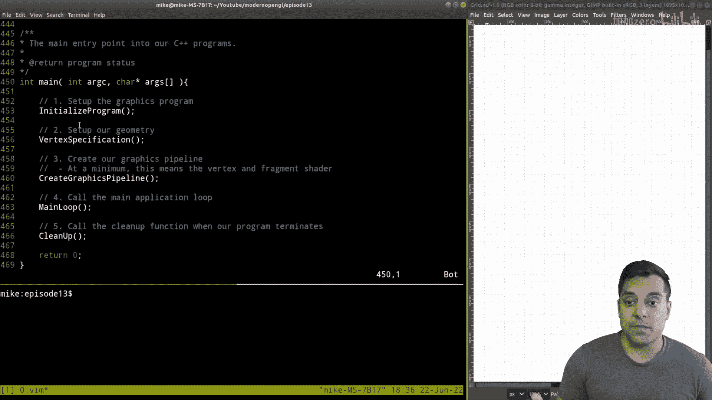
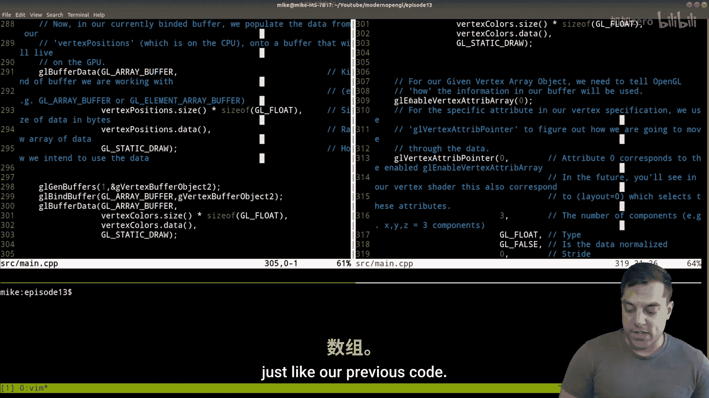
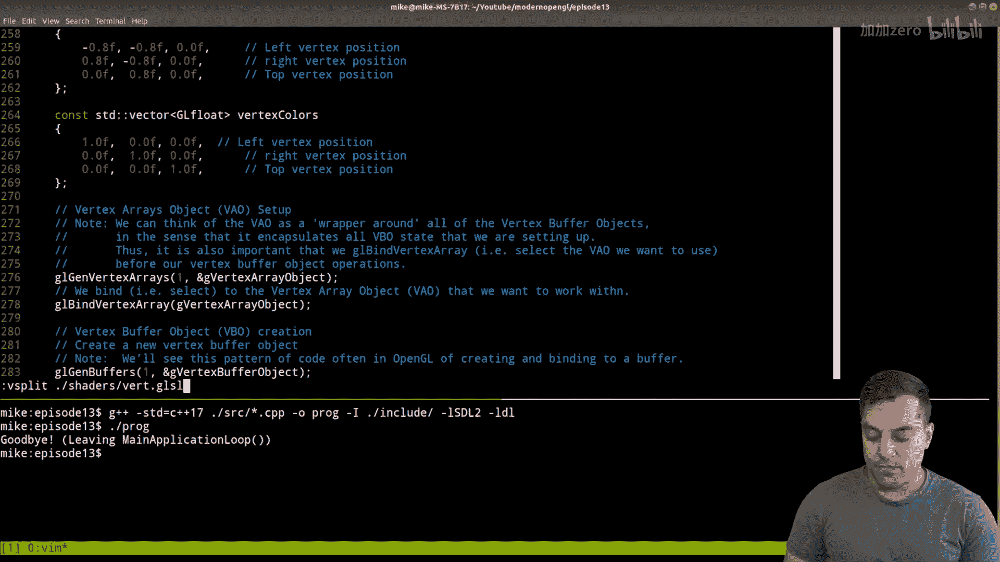
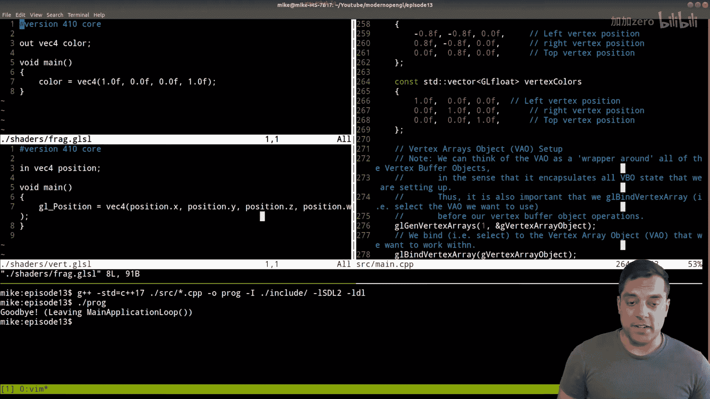
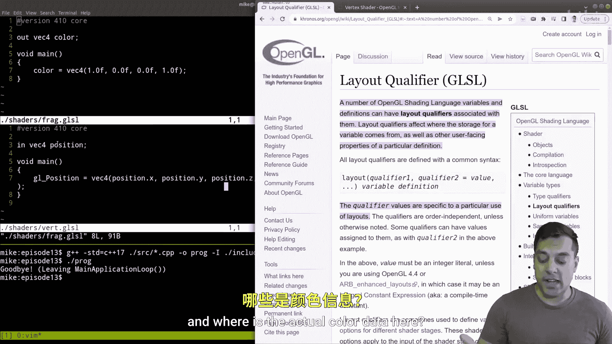
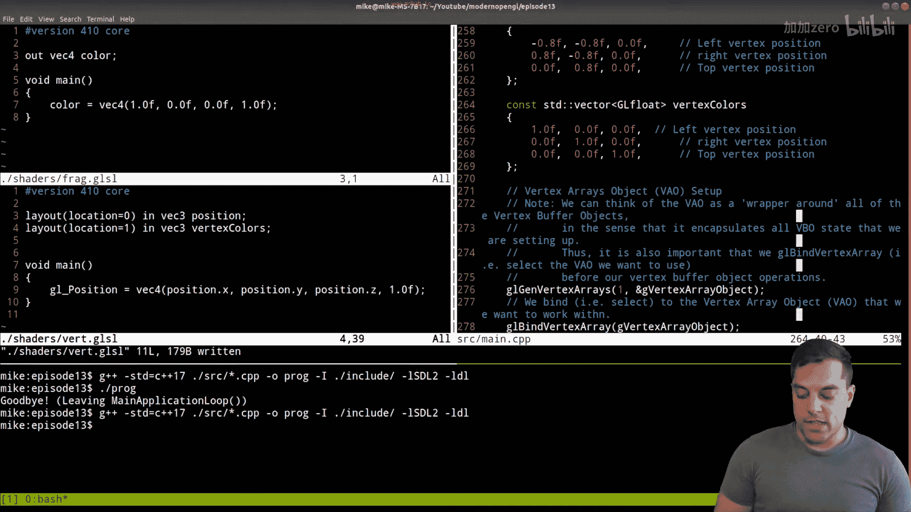
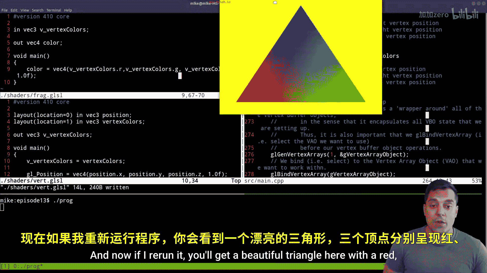

# Mike Shah【中英⚡OpenGL导论｜Introduction to OpenGL】 p13 P13 -Episode 13- Drawing a colored triangle (using multiple vertex buffer object -BV1pTvFz3Eqh_p13-

Hey， what's going on， folks。 It's Mike here and welcome to next lesson in our modern openGL C++ series In this lesson。

 we're gonna to be looking at triangles again。 but this time adding multiple attributes to our triangle。

 that is we're going to be using multiple vertex buffer objects to create a triangle that now has multiple colors on So with that said。

 let's go ahead and take a look here。 So just to give you an idea of our project structure in case youre just joining us and haven't been following along with series。

 we've got our shaders in a different file， which we're going to be loading and running at runtime here so you can see our vertex in our fragment shader needed in our pipeline and then our main source file here which we're going to be modified。

 So let's go ahead and jump into that here。 Now what I want to go ahead and do here is just take a quick look at our main function which is how I've structured our graphics programs again the initialization setting up your SDl2 or whatever window that you're using the vertex specification which is responsible for creating our geometrytry and then creating the graphics pipeline。

 which ultimately tells us how。😊。

We do every draw call in our program and then finally the main application loop。

 which is what's running over and over and over again and then any cleanup that we have to do so where I want to focus today is on the actual vertex specification and then we'll modify some of the shaders to get multiple attributes so with that said。

 let's go ahead and jump into our vertex specification here。So in this function here。

 if we go ahead and take a look you'll remember that we first create the vertex positions so that is to say that every triangle here。

 which in this case we just have one has some X Y and Z position associated with it so X Y Z X Y Z and X Y Z and we can label these and so on and we ultimately get our triangle here。

 but these are the attributes that we have in our particular triangle now what I want to do today is add different attributes for color so for instance from each of these vertices we'll have a different color that'll get interpolated and sort of blend together to make our final triangle here right so how are we going to do that well first let's just go ahead and review the mechanism that we had previously which we had our vertex array here so what was our vertex array object or our V AO。

😊，Well again that was our specification and it's essentially this array that says what attributes do we have so for instance in the zeroth position here。

 I'll just put the zeroth position we have well position data。😊，And that was the X。

 Y and z of each of our vertices。 And again， that information is being read from， well。

 this vector here I have called vertex positions Okay so that was the idea here of our vertex array object So I generated that here we can see that we're binding to it to mean that yes。

 this is the active vertex array object that we want to work with。

 And then we had our actual buffer data here， which stored those vertex positions So again。

 what we have here。😊，Is well when we create our vertex array object， we generate a buffer。

 so that is all of our X， Y and z positions here， I'm just going to label them you know X Y，z， X， Y。

 Z， X， Y， z， etc for however many triangles you have here and this was a vertex buffer object number one here。

Okay， so if I scroll down just a little bit more in our code。

 you'll see that then I enable a vertex Tri array here for index 0。 So again。

 that was this zeroth index here。 And that's where the actual linking happens where I say， okay。

 we want for all of our triangles we want to link these things together here。

 So we enable the attribute， and then we specify what kind of data lives inside of this vertex buffer object essentially having three vertices here。

 So our goal today or what I'm going to do is set up another vertex buffer object here。

 So VBO number two。 and it's going to store R Gb data， red。

 green and blue colors for each of the vertices。 So that's R gene and B。

 And then we'll have our color here。😊，At the you know first index and then I'll link it up here。

 So anyone or any person who's using this graphics framework who' is using this vertex array object is now going to expect to be using both position and color data。

 Okay， so with that said， let's go ahead and modify our vertex specification here。

 and of course we're going to need some colors。 So I'm going to go ahead and just duplicate this vertex positions vector here。

And I'm just going to call it vertex colors here。 So vertex。Colors。

And these have to be in a range between 0。0 and one。

 So let's just go ahead and make everything zero to start。Just to clean things up a little bit。

And that seems pretty reasonableable。 And just to make this somewhat interesting。

 I'm going to make the first。Vertex position， the one at the left here， a red color。

 The next one's going to be blue and the next ones going to be green。 Okay。

 so now we have our actual vertex colors here。 and again。

 this is setting or we're getting ready to set up vertex buffer object number two here。😊，Okay。

 now let's go ahead and scroll down a little bits here。

 and we're essentially going to copy the same pattern。😊。

That we had before here for creating this vertex buffer object here。 So what's that going to mean。

 Well， we're going need to have some other handle to this vertex buffer object here。

 So let's go ahead and scroll to the top。 And I know globals are evil， but they make things easy。

 So let's just go ahead and create vertex buffer object number two。😊。

And let's go ahead and jump down to where we were。 Let's here we go。

We back to our vertex specification here。Sorry for the scroll。Here we are Okay。

 and now let's just go ahead and essentially do the same thing here。

 So I'm going to do GL Gen buffers， GL bind and then set up our data here。 Okay。

 now there's multiple ways that I could go about doing this and I'm going to take a sort of simpler approach here。

Actually， one way to do this， I'm just going to split our window here so I can see on both sides and essentially just copy this process here again for our vertex buffer object here Okay。

 so let's go ahead and do this。😊，And I'll actually do this well below the where we set up our other attribute here just to make it a little bit easier here。

Okay， so let's go ahead about here。Okay， so I'm going to do GL Jan buffers。

Now I could do this in two steps if I wanted， or I could actually。

 since the first parameter of GeLG buffers is how many I wanted to create。

 I'm just creating one here for our second vertex buffer object。

 I could actually pass this in as an array and generate two buffers here that would be another way to do this。

 we're going to look at multiple strategies here。Okay。

 and then I want to bind to this buffer that I've just created here。

Vertex buffer for object number two。And then start populating it with the data here， So G。

But for data。And again， this is a GL array buffer。And then we have our arguments that we need to add here。

 Now， again， if we go ahead and scroll down here。What are the actual attributes here that we need？

Well， we need to know what type of buffer we're working with。The number of bytes that we have。

Where that data is coming from and a hint to openGL of how we're going to use that data here。Okay。

 so let's just go ahead and add that here。 It's going to look almost identical except this time we're going to use the vertex colors here。

 the size of that vector times the size of each of the elements in that vector that they give us the number of bytes。

 the vertex colors data。And we're not going to be changing this data。

 so it's going to be GL static draw。 Okay， so this will essentially generate our second buffer here。

And now what we need to do is again do something very similar where we enable another attribute array here。

 just like our previous code， so let me go ahead and just scroll down here and we're essentially going to be doing the same exact thing here。

😊。

Okay， so let's go ahead and just scroll down here。And。This is where I'll actually want to。

 let me actually just separate out this code that I want to make sure when we bind to the buffer and set up everything。

😊，We just do all these steps at once here。Okay， so this is。Setting up our。Colors。Now。

Liinking up the attributes in our BAO。Okay， so GL enable vertex a Tri array。

 but this time the first index and then setting up the pointer to that particular data here。

 so VX a Tri pointer。And this is attribute number one。

 we're going to have three components this time be R， G and B。

The type of these components still remain float。GL false。

 I'm not going to assume the data is normalized。 the stride there's no the data is packed together。

And there's no offset from the actual start of the data。Okay。

 so then let me go ahead and just close this and now we've set up this attribute here。

Now I'm going to want to also make sure to disable this attribute。

 we just don't want to leave them open here。Okay， so now I've got those closed off here。

 So now let me just go ahead and close this window so you can see it all on one screen a little bit easier。

 This is essentially what we've set up here for setting up our colors。

 We've created a new buffer here。 and now we are linking in that attribute。

 So it's not really that many lines of code here and then we essentially just created some data here。

 Now if I go ahead and let's go ahead and give this a compile just to see if I've made any mistakes here。

😊，I hope one must take it line 269 here looks like I have。Introduced one extraneous semico there。

 so let's get rid of that here so the list initializer can work。

 and let's actually go ahead and run this and just see what happens here。 if I run this code here。

Now， if you follow along with the last lesson， I left it off as a red triangle and this is essentially what we're getting。

 so I'm not seeing the actual color attributes here。

So this is where we're actually going to have to go into our shaders here。

 so let me go ahead and split this window here， let's open up our shaders。

 let's open up the vertex shader and let's split this again to have our fragment shader open as well。

Now where we're actually going have to do the work is in our vertex shader here and I want to go ahead and just give you a little bit of guidance here by looking at the how we're going to set this up here So in openGL we have something known as a layout qualifier and again you can kind of think about or remember layout as we're laying out or specifying the actual vertex data here So inside of our fragment or both our fragment but in this particular case or we care is in our vertex shader。

 the actual vertex data and we have to tell openGL well where are the actual position data and where is the actual color data here because you'll notice last time I sort of got away with this cheat here of just taking in a bunch of position data here So what I'm going to have to do is fix this here。

😊。

And this time， since we have multiple attributes， if we don't do this sort of layout specifyifier。

 open GL well try to guess， but it might not get things right depending on what your assumptions are。

 So inside our vertex shader and again make sure you're working on the vertex shader。

 Let me go ahead and just rid of that position there。 and I'm going to specify with the layout here。

 location equals0。 And then our input really， we just have three things our position here。

 So I'll actually get rid of this。😊，Last position value here， position W， and just put in 1。0 F here。

Okay， and then let's go ahead and add our second layout qualifier here。

Which is going to be the colors here。And let's just call these vertex colors。Okay。

 so now we have our two attributes。 So let's go ahead and run this and see if we get any further here。

 or at least check for compilation errors。 So again。

 I only make changes to the programs so I didn't really have to run anything。 but again。

 nothing quite yet。 Well， why nothing。 Well， that's because we're working in the fragment shader。

 that's where we actually get the different colors。 Okay。

 so what we have to do inside of our vertex shader now。😊。

Is go ahead and say， hey， we're bringing in our input。

 but we want to send out to the next stage of the pipeline。And it's going to be a V3。

 and I'll just call it vertex or let me actually give it a sort of underscore vertex colors。

 Sometimes you'll see these conventions where you use a V underscore if it's coming from the vertex pipeline here okay。

 so what this is going do is pass from the vertex shader into the fragment shader， some colors here。

 Okay， so let's go ahead and take in now in our fragment shader。 So what's coming in。 Well。

 it's a V3 and it is the vertex colors here。 Okay。😊。

Now we still have a job to do in our fragment shader and that is just to output some color here and that's exactly what we're doing here with our out vector。

 but this time we're going to inform what that output color is by our input here so let's go ahead and modify this now。

😊，To take in V vertex color， it's a vector。 So R value here， V vertex color G。

And the vertex color B here。 Okay， so it'll look something like that here。

 and actually I'll get rid of these spaces because no one usually writes code like that as much in the vertex shaders It's just getting a little bit long here so。

😊，That's essentially what we have in our vertex shader here。

 so let's get rid of these spaces just to make it look a little bit nicer。There we are Okay。

 so now let's go ahead and see if this makes a difference here and again I don't need to recompile。

 but I can just rerun our program。Alright， so let's see what our result is and well we're getting closer。

 our triangle did change colors， but it looks like I've forgotten something here and again。

 this is where we have to be a little bit careful in understanding the pipeline here and let me explain before I fix it again in our pipeline here。

 remember our vertex shader here， the stuff that's coming in from this box。

 So this is our code here needs be coming into our fragment shader。😊。

In our code over here。Now what I've actually done here is， well， from my vertex shader。

 I have specified that I'm sending out these vertex colors here， but I haven't assigned them。

 so even if they came in you know whatever the values happen to be。

 I'm not assigning them here in our fragment shader。😊。

So this is something that's kind of common when you're first learning these things here。

 but I actually need to say， hey， what are the values are the things that are coming into my pipeline here。

 but from my vertex shader， I want to pass out this information that I'm bringing in here to my vertex shader。

Okay so let's go ahead and get that a try and now if I rerun it。

 you'll get a beautiful triangle here with a red green and blue point here and this is pretty cool for a few reasons one is just more interesting to look at sure but the real power in this lesson is the ability to add or attach more information to these vertices and what we're going to find is that other information like normal information or texture information is really going to allow us to add more scenes to our graphics programs as we proceed here so let me go ahead and get rid of this here I'll go ahead and leave these shaders here just so you can see all the code on one screen and a quick scroll through the actual area where we made some changes here just in our vertex specification to again add this additional attribute here generating another vertex buffer object and enabling that attributes and in disabling it here。

😊。

So folks， I hope you found that a useful lesson and again this one's kind of fun because we're starting to see some of the power with openGL and some things that we can do in triangles now there's much more to come so make sure that you hit the subscribe button if you haven't already if you found this lesson useful go ahead and hit the like button and soon enough I'll see you very soon。

