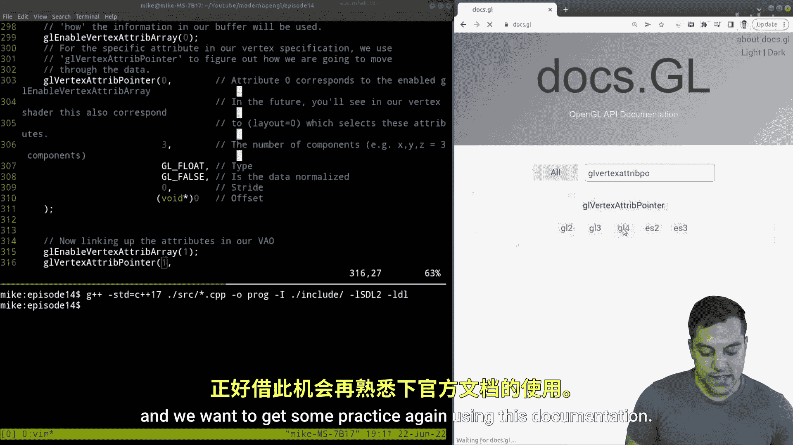
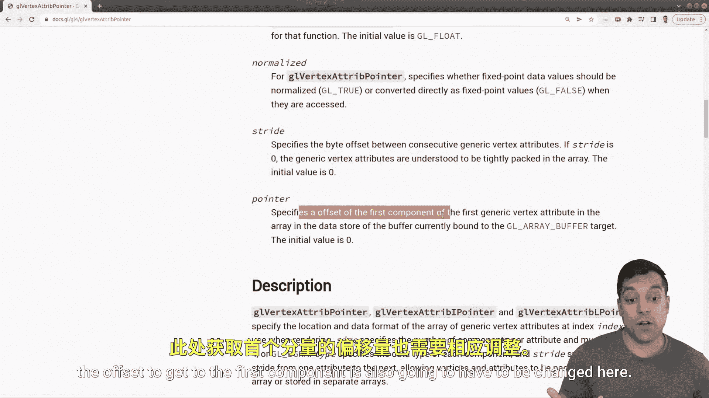
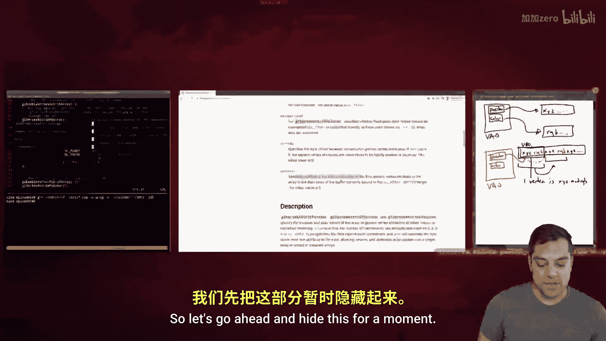
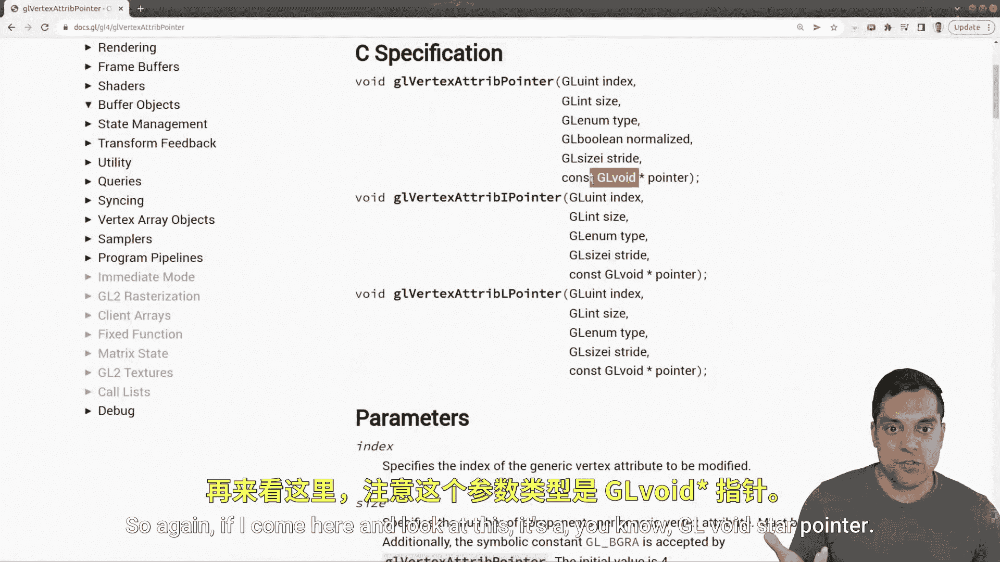
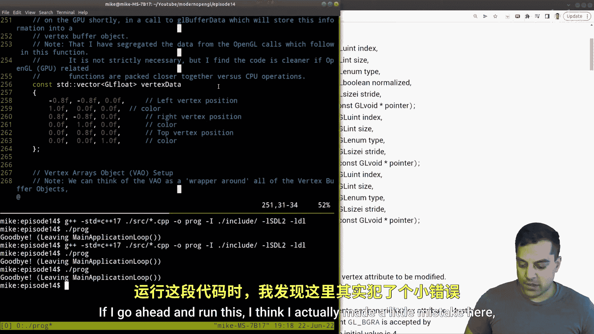
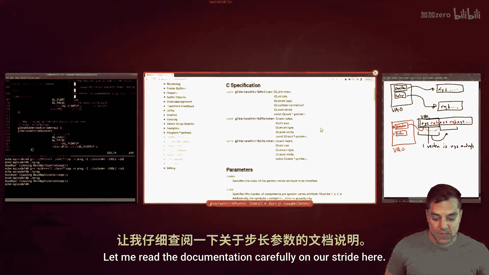
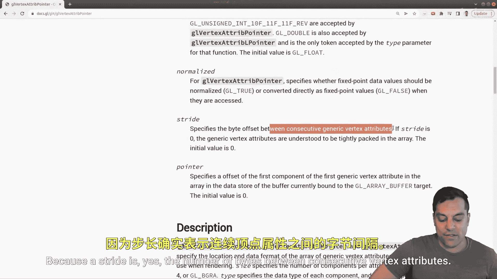

# Mike Shah【中英⚡OpenGL导论｜Introduction to OpenGL】 p14 P14 -Episode 14- Drawing a colored triangle (using single vertex buffer object) -BV1pTvFz3Eqh_p14-

Hey， what's going on， folks。 It's Mike Karen and welcome to the next lesson in our open Gl series。

 in this lesson I'm gonna go ahead and backtrack a little bit in a way。

 but I want to go ahead and talk about what I'm backtracking about。

 And previously we learned about using multiple vertex buffer objects。

 But this time I'm gonna show you how to get multiple attributes but just in one vertex buffer object。

 And the way that we're gonna do this is by interleaving the actual attributes in a single vector。

 Now， reasons you might want to do this are arguable and you'd always have to measure but it can sometimes be nice to only have to manage one vertex buffer object and avoid lots of different state changes for instance。

 we can just pack all of your information in one place。 Again。

 it's going to vary on what you want to do， but it's helpful to know about and sometimes it can simplify your code or just make it a little bit easier to pack data into one place and read all the information So with that said。

 let's go ahead and take a look at this lesson here and get started So what I'm going ahead and do here is just go ahead and show you the layout of the code here and we're gonna be working in the main do cP。

😊，And where we're going to be working here in our source directory is specifically the vertex specification。

 Now for those of you who haven't been following along here。

 this is how I have structured the actual programs here where we set up our window then we set up the vertices and the actual geometry that we want ship to the GPU create our graphics pipeline that's with our shader code and then run our application and clean things up。

 So again， let's go ahead and focus on the vertex specification part of our code here and see how we can clean things up。

 So again， last time we created two different vectors here for setting up our data here。😊。

And this might be fine to do， but what I'm actually going to do is get rid of one of these vectors here。

 and I'm essentially just going to interleave this data here。

 so I'm just going to put in color information here。😊。

And I'll just label it just so it's a little bit more clear for me to remember。

And just copy and paste it in here。I'm going to copy this in here and paste it in here。

 being a little bit careful。And just setting things up that way。 So again。

 what we previously had was one vertex array object。 This was our V AO。 and we had a position。😊。

Attribute and color。And those pointed to separate buffers that had X， Y， z position。

And another separate buffer that had R G and B information。

 But this time what we're going to do is still have R VAO。 It's still going to have position here。

And it's still going to have color。But it's going to look a little bit different in the sense that the position data is all going to be stored alongside the color data in one vertex buffer object here。

 so I'll have x Y and z followed by R G and B X， Y and Z again followed by R G and B X， Y， Z， etc。

 So the position data will point to this block here and then it'll know to offset to the next piece of data here。

 so essentially what I've got here is all the attribute data here，1 vertex。😊，Is RGB。

And or let me write this in order here。Is X， Y， Z and R GB data here and be six floats。

 And then we know to hop to the next set of data here， which is our next vertex here。 Okay。

 so that's the idea。 And the real trick or key to this is going to be here with our actual。

Attri pointer here。 So here we're actually going to have to set up the stride here。

 So last time we said well， there is no sort of jump that we had to make。

 but this time we're going to have to take into consideration where that jump is and where our offset is。

 So with that said， let's go ahead and dive into it again。

 just looking at our code from the top if you're falling along。

 I have interleavethe our position and our color information。 and again。

 this is going be for the first vertex。 this is the information for the second vertex and this is the information for the third vertex。

 and now we can actually simplify our buffers here a little bit。

 so we just need to generate one buffer。 In fact， I'm going to go ahead and get rid of our second buffer in the code here And we also had a global up here for our second buffer and now I can delete that。

 So we just have one here Okay so let me go ahead and hop back here。😊，Okay， so again。

 just walking through this from our vertex positions。 again。

 we're going to set up our vertex array object just as we have previously。

 that hasn't changed because that again， this is our goal here to still create this thing that has position and color information so we're still going to use the same vertex array object set up。

 we're still going to just generate one buffer this time except again。

 it's going to have all of our position and color data we'll bind to that buffer and because we're using the vertex or excuse me the vector container in C++ it makes it really convenient because we don't really have to change any of this code here。

 although I might want to rename this vertex positions to something else like vertex data just because it's now not just position data here。

 So let's go ahead and just make that change here just for clarity I think that'll be useful in future lessons as well。

 So now this is just our vertex data。😊，Or vertex spec or however you want to label it would be fine here。

 Okay， so again， this stays the same。 We're going to have， well， we have R G and B， X， Y， and Z。

 So six floats per vertex。 So 18 of those and then half our many bytes are in af floatat usually for。

 So 72 bytes of information。 This is our actual array and how we're going to use this。 Well。

 we're just going have a static triangle。😊，Okay， now let's get into the interesting part。

 which is our attributes here， so again for our zero attributes or the first one position here。

 again， we have three components because I have X， Y and z。😊，And the stride。

 So how do I get to the next component Well， let's actually look on docs。

gL because we haven't opened that for a while to see what that means。

 So go ahead and just bring in another window here。

 Let's look at GL vertex a Tri pointer and we want to get some practice again using this documentation。

😊。

And let's go ahead and make this bigger here just because we want to see the actual stride。

 So this is the byte offset between consecutive generic vertex attributes。 Okay， if the stride is0。

 the attributes are understood to be tightly packed together。 That would mean that we just have X。

 Y and z followedawed by x y and Z， but in this case， again， we have x， Y and z。

 and then we need to jump past Rg and b data。 Okay， so we are going to have to change this。

 and likewise， the offset to get to the first component is also going to have to be changed here。

 Okay， so let's go ahead and hide this for a moment， let's keep our picture again。

 what is our stride going be well， we have to hop three floats here Okay so how do we do that in code。

 Well， typically we just say size of our type which is Gl float。

 That's what's in our vector and three items that we have to hop。😊。

And on the offset for our very first component， well it starts at the very beginning here。

 I would call this you position zero or byte zero， so we don't really have to do anything here for tribute zero。

All right， now let's go ahead and look at our next attribute here， which is our color information。

And let's go ahead and just label this color information。And it's the next attribute。

 so again we've got to attribute zero here and attribute1。And still three things， R gene and B。

 the information I'm saying is not going to be to be normalized。

 but now we need to actually think about our stride here。 How do I get to the next R G and B value。

 Okay， so how many bytes would I have to hop here once I get to the end of my R G and B。 Okay。

 so here again， I need to hop， well， the same amount here。

 and it's possible that you would have you know， gaps in between here or maybe even other information。

 But in this case， it happens to be that we have，The same hop to make。Zou。

3 floats or very likely this is 12 bytes。 Now， the offset this time we do actually have to pay attention to because we're not starting at the zeroth position here so。

We again， just need to figure out， well， how many bytes do we have to jump here to get to our first R G and B data。

 So that is how do I get to this position here， Well， I need to jump past three floats here。

 So I'll go ahead and just。Pause it for a second if you want to quiz yourself and see how if you can do this。

 and if you've paused it and done the exercise， Well， what is our offset going to be， Well。

 similarly， GL float。😊，The size of that。Okay， times 3。 let's go ahead and try to run this here。

 So I'll go ahead and compile it and looks like I got a little bit of an error here。

 So let me go ahead and take a look at this。And I think I need to wrap these in parentheses。

And if I compile， it compiles。 And I actually want to talk about this last line in a moment here from the documentation here because it says we need an actual pointer here。

 Okay， so specifies an offset。And that's how many sort of bytes。

 So it's it's an address that we're actually working with。 So again， if I come here and look at this。

 it's a， you know GL void star pointer， In fact， let's go ahead and and prove our code just a little bit here and use GL void here and I think that should do the same trick here。

And now I can run it and now I should get pretty much the same thing here。 Now， oops。

 looks like I moved one of my triangles or maybe swap something。

 but our code is actually running here。 So let's just go ahead and play with our vertex data here a little bit just to get things more in order。

😊，And let's see here， if I go ahead and run this，op I think I actually made a little mistake here。

 which is a good mistake to make here on our actual。

 let me read the documentation carefully on our stride here。😊。

Because the stride is yes， the number of bytes between consecutive vertex attributes so not individual attributes so actually I've got to make a correction here to our illustration here how many things are we actually jumping you know from the start to the end here。

 well from this x I've actually got to jump over six floats here so that's the actual stride and if I have my offset here for our second attribute well if I jump you know six things here to get to the next sort of vertex then then I'll put me in the correct position so let's go ahead and make a fix for that。

😊。

Let's go ahead and make this a six and both these are sixes。

Recompile because I'm making changes to my C plus plus code。

 And if I rerun this now we get our actual triangle here。

 So a little bit of a mistake on my end and just how he is explaining that。 But again。

 the stride is how many things do you have packed together X。

 Y and Z R gene and B then that makes it easy because then all we have to do is really worry about the offset。

 And if we were to add a third attribute here we'd have to come update this strides of each of our pointers here to each of our attributes And again。

 that's how do we jump through all this information and then just change the offsets if everything's packed together as it is illustrated here。

 So I'll just go ahead and run that one more time because it's nice to look at here。

 and that's it for this lesson folks。 So this is a fun one。

 This is another way to look at how we can just pack things together in one vertex buffer object again。

 Open GL gives us a lot of flexibility to do this。 and there might be different tradeoffs again regard。

😊，Performance or just how you're reading in your information for why you might want to do this。

 I'll leave that up to the pros to benchmark。 but for now you can do it either way as you're learning Open GL and now you know how you can do it。

 So with that said， make sure that you subscribe so you don't miss the future lessons that are coming and we'll see it soon in the next video。

😊。

