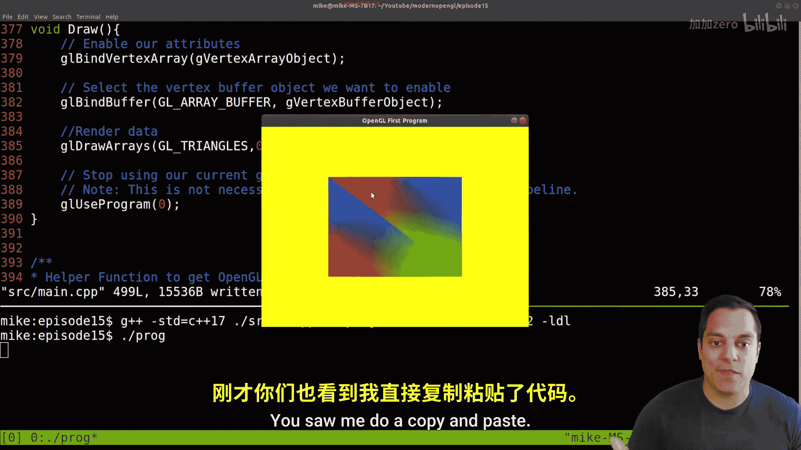
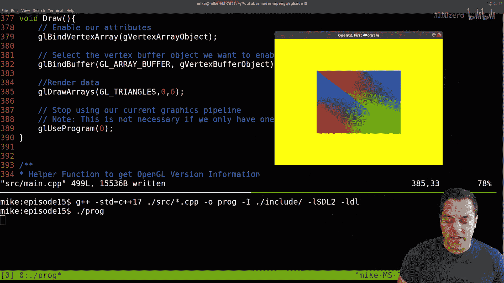
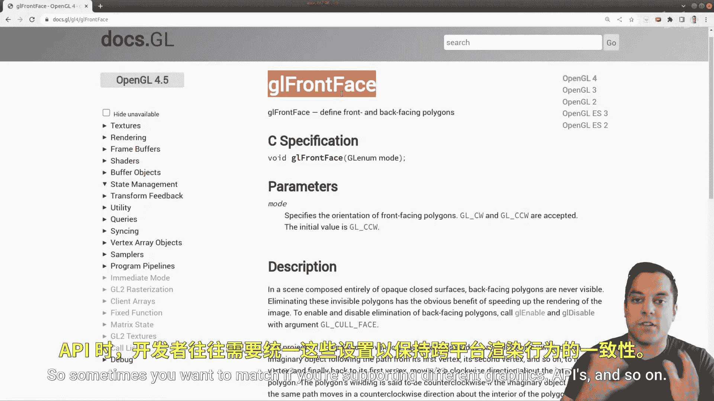

# Mike Shah【中英⚡OpenGL导论｜Introduction to OpenGL】 p15 P15 -Episode 15- Rendering a Quad (And Understanding Winding Order) - Modern Ope -BV1pTvFz3Eqh_p15-

Hey， what's going on folks， it's Mike here and welcome to the next lesson in our modern Open GL series where we're using C++ to use modern Open GL versions 3。

3 or beyond to do some cool graphic stuff Now this lesson we're gonna to be advancing some of the cool graphic stuff we can be doing by not just rendering triangles but this time quas or a square。

But in order to do this， I want to go ahead and talk a little bit about the geometry of what actually makes up a quad and something specific that we have to do in order to render things correctly and that has to do with the winding order of the vertices so if those things are new to you this is lesson for you to watch and let's go ahead and dive in。

So just to go ahead and orient this a little bit， I'm going go ahead and just recompile this example where we left off in the previous episode and run our code here and let me just bring into this screen our triangle。

 so you should have something like this if you've been following along or if you're following along in some other framework。

 just at least know how to render a triangle at this point in the series Okay so with that said let's go ahead and take a peek at the code。

And I'm going to go into our source director。And'll make this a little bit bigger so you can see our main directory and to the bottom here Now again。

 we're essentially emulating the graphics pipeline here。 we initialize our program。

 which sets up SDL， OpenGL， the Glad library or glue or associated libraries then this is where we specify our geometry which is where we're going to be working today we set up our shaders and then ultimately have a main loop throw application So if you need to review this from previous lessons。

 please go ahead and do so but otherwise I'm going to go ahead and dive into our vertex specification here。

So with that said， let me highlight over this in Vim and jump into our code here。Now。

 recall the actual triangle that we had had different colors in it。And that were different。

 or to say it's different attributes， one attribute for the position of the vertex and then one attribute for that specific color and so on。

 so this repeats in an alternating fashion and you can interleave this data in a single buffer if you like or separate it out into two buffers again that's covered in previous lessons if you haven't seen。

But what I want to do today is actually add a little bit of additional information here。

 So the first thing that I'm going to do just to make things a little bit simpler is just change these 0。

8 to 0。5s。 I want our triangle to be just a little bit smaller and I'll talk about that and why in a little bit here。

 So let's just go ahead and rerun the program here。

And go ahead and recompile and while we changed the positions to be just a little bit closer。

 I just want a little bit more room in my program。And let's go ahead and just change this top triangle here and kind of shift it over because essentially what I want to do here is draw a triangle that looks like this instead of this。

 okay， which is what we currently have。So。😊，Let's go ahead and make this slight update here。

And let's go ahead back into our source code。And I've got to go down to the vertex specification。

And here we are。Alright， and again， I've labeled these here with the left vertex position。

 right vertex position and the top one。 So it made me a little bit easier to see what's going on here。

 So let's go ahead and align it here， our top vertex。

That's the one here with our left vertex position， which was the one down here。Okay。

 so I'm just going to make this。Negative。0。5 here。And let's go ahead and recompile this。And again。

 I'm doing this on a Linux platform。😊，And now we've got our triangle that looks like this。 Al right。

 so how do we get ourselves to the actual quad？ Well， again。

 I'm going to slow us down here for just a moment because I want to actually lay out this geometry on it a little bit of a grid here。

 So what we can do is just draw a little Cartesian。😊，coordinateorant system here。

 which you likely remember from your days in geometry class， so again， I've got my Y axis。My X axis。

 and I'll label it here positive。Positive and so on and we do have a Z axis that runs through this as well right because we're doing things on 3D Now I'm going to admit this for this particular lesson because well。

 we just have a flat triangle so that doesn't really matter。

 but don't worry we are going to get into 3D shapes eventually here。

So let's go ahead and just plot out this triangle where it exists。

 So I've got negative 05 and negative 。5 that's this first vertex down here。

 let's just label it somewhere here， the right vertex， which is somewhere let's see 0。

5 in the x axis so somewhere positive here and then in the negative coordinatet system so it's somewhere here and then our top vertex which falls into this quadricrant here so make sure that you can go ahead and draw this out。

Just we understand where our triangle is， and I'll go ahead and just put a little dotted line here。

And again， that's representative of the shape that we have in our open jail scene。Now。

 what's actually important here or why am I doing this， Well。

 our goal is going to be to draw another triangle here and effectively make a quad Okay， so a quad。

Is essentially a rectangle。Okay by definition a square is also a rectangle so you know if these sides are equal。

 it's a square， but a quad is just a rectangle， it's short for quadrilateral and it's a sort of shape that you're going to use all the time in graphics because they're very useful Okay and anyways。

 the point of having a quad is this four sided shape oftentimes we might render an image on top of it when we get de texturing so again you need two triangles to do that。

😊，Now let's go ahead back to our first triangle here that we have and there's something kind of interesting about the order that I laid things out in this particular program here。

 the way I have the left vertex， the right vertex and then the top vertex here Okay so let me go ahead and just sort of assign those as they are labeled here so this was my left vertex and I'll just label LV。

And then my right vertex， which is this one RV， and then the top vertex。

 which is the top one here Okay， so hopefully everyone can see that again I'm just following along from the comments that I've left here left。

 right and top and maybe even better names are these are the you know bottom left。

 bottom right and top left or whatever， but do you get the point。Now， again。

 the order that I labeled them in and again， this was the first one， the second one。

 and the third one， and again， I'm usually indexing from 0， so 0。

1 and2 here notice the order here or the direction I'm going from here to here。To here。

 and then I would go back here。And what we call this and another way to draw it is the winding order。

 So notice again how I went from this side to this side to this side。

 and if I was following this like the face of a clock。

 we would say this is going in a counterclockwise direction Okay， so the winding。Order。

Is the direction？That。Are veres。A laid。Out okay， and they can be in counterclockwise or clockwise order。

Okay and what the winding order tells us is which direction is the front of the triangle that is that this triangle here is facing out towards us as the user okay so that's the idea now I haven't done this as much in this lesson but again if you're taking a graphics class and I will talk about this little bit more in the math by default open GL follows what's known as a right handeded coordinate system So if you go with your right hand your thumb is the X axis your index finger is the Y and the Z axis is your middle finger and notice how it's pointing towards me in the z axis so that's the positive direction where the front is。

And then the way to also tell the windining order would be to take your right hand and the direction that your fingers curl。

 the direction that your thumb faces would be the front facing direction。Because again。

 we can maybe intuitively think about this triangle that we are drawing here right this one that I have here on our coordinate system as being you know double sided。

 but we don't know that in graphics， so we either have to enable sort of a double sided triangle or by default pick which side is the front and the back and the front side is the side that we can view okay so that's the idea with winding order。

Now again why is this going to be important well when I'm drawing this other triangle here right the other part of my quad。

 I also want it to be front facing so I need to make sure that I also lay out the vertices。

 the three that I'm going to add to our vertex data so again in this structure here we need three more vertices to represent this vertex。

 this vertex in this vertex of our triangle and again those have to be laid out in a counterclockwise manner so with that in mind I think we understand the theory。

 let's go ahead and do it in the code and see if we get a quad here。

Now I'm just going to go ahead and reason through this， let me go ahead and terminate our program。

And we're going to need。Three more vertices， so here's a vertex。

 but remember a vertex also has a color associated with it。So that's these two lines here。

 so I'm simply just going to copy these。Okay。And let's go ahead and paste these here。

And I am going to do a better job labeling this as the top left vertex。 Okay。

 and let's give ourselves some comments here。The second triangle。Okay， and this will be the。

Let's even label it a little bit better here first triangle。And again。

 always use indentation to your advantage。Second triangle， all right。Okay， so what we need here is。

 well， essentially a repeat of whatever our right vertex is。

 you're going to see me shift things around here， so I don't have to guess that's this one。And again。

 it doesn't really matter which one I start with， I could start from here， I could start from here。

 I could start from here， but the important thing is the order that I go next。

 So if I start from here， if I'm going counterclockwise。

 remember I have to follow along here so I'm going from here。

 I must go and label this top right vertex next Okay so let's go ahead and do that。

 let's go ahead and label this here。Or rather I should say just copy the vertex。

And then the top right vertex， and I'm going to ship things around here。And relabel it as top。Right。

 vertex。This position is going to be positive 0。5 in the x axis and positive 0。5 in the Y axis。Okay。

 so let's go ahead and update this here。And then again。

 so we're going from this direction to here and then to here。

 and we already have another top left vertex here。So let me go ahead and。Just label this here。Again。

 this is going to be a repeat of what we actually already have here。

So I just want to make sure that these coordinates match。

 and I don't so much care for the colors right now， just that I have enough data for two triangles。

 Okay， so two triangles， they each have。Our vertex。 So that's our first triangle。

 And then our other one going in this direction。 That's our second triangle。 Okay。

 and then we should have a quad。 now let's go ahead and just look through our code a little bit to see if this is going to satisfy everything。

 So again， we have our vertex data。😊，Okay， and then in our vertex array object。

 which is going to set up the attributes and how we're actually going to render this thing again with colors and vertex data。

 so we've set this up here。😊，We generate our buffers， we bind our buffer that we're working with。

 and because we're using this convenient vector structure， I don't really have to change anything。

 My buffer size is already coming from the vertex Okay so when we're setting up the size and how big the actual buffer is that's set up correctly each of our vertex buffers our range correctly。

 we haven't added any attributes so this stride and all that stuff's the same。 In fact。

 let me make this a little bit bigger just so we can parse it a little bit easier。

And then again， nothing has changed there。Now， when we actually draw this。

 let's actually look at our draw routine here。How many triangles are we drawing now。

 or rather how many vertices， I it three or is it6。 Well， theres actually six now。

 so let's go ahead and modify this here。In fact， let's go ahead and just run this without modifying that line。

I probably should have done that and given me a chance to debug。 but again， I've added some data。

 our program still work， so that's a good test to do。 So let's go ahead and stop this。 But again。

 we're only drawing from our0 to third triangle here。Or excusee me vertex。

 So let's go ahead and make that a6。Re and pile， rerun。Andvoila， we've got our second triangle here。

And together， these make up a quad。 Now， why isn't it perfectly square。 Well。

 that has to do with our aspect ratio of our window。

 So that's something that we're gonna to have to think about and take care of very， very soon。

 And again， why don't a colors match。 Well， I just sort of pick the colors at random you saw me do a copy and paste。

 So here is our sort of quad here。 Now that's actually a pretty good exercise to do。

 So let's go ahead and fix this here。😊。

And let me go ahead and。Go to our colors here。Just for the sake of completeness or for folks who might look at this code example later。

 you might want to do that here and I'm going to just go ahead and keep this。

 it looks like our top left one should be blue here， R G and B。

 so let's make sure that our top left one here。And I should label it。

Appropriately here should be blue。Okay， so I'm just going to correct these one at a time and then recompile and rerun because again。

 that's kind of a nice way to do it。 so let's go ahead and see if that changed and indeed it made it blue。

And that looks pretty good because this one can be whatever color we want because it's unique and this one's good in our greens matched here。

 So this is a pretty nice looking quad here that we can now render。

 So I want to go ahead and just show you a few other things here going into the documentation here on this idea of the front faces and whining order。

 So again， open GL is a relatively flexible API。 so it doesn't really matter if counterclockwise or clockwise is the front face。

 You can actually change it with this function called GL front face and you have your options。

 G underscore CW for clockwise or GL underscore CCW for counterclockwise that allows you to change the direction。

 So here's some examples here and the associate documentation depending on what API you're using。

 for example， if you use direct X or maybe metal or Vulcan or whatever is out there in the future。😊。

You can they all have different defaults， so sometimes you want to match if you're supporting different graphics APIs and so on。

 so I just thought I would show you that。

All right， folks with that said， I hope you've enjoyed this lesson and now you know how to draw a quad which really you can do a lot of with OpenGL if your goal is to just make 2D games for instance。

 then essentially you're done at this point because now you can render a quad and you just have to render a lot of them for some 2D game。

Now， just to recap， we learned a little bit about winding order。

 we learned about adding more data to our buffers， why the vector data structure is really helpful for that。

 and then we had to go and change in our actual program。

 which let me just go ahead and show you again。In our GL draw arrays command。

 how many actual or how much of the active buffer that we have binded to here that we actually want to draw。

Right， folks， I'll go ahead and leave a lesson there。

 we're going to continue on with this and add some more detail and some more optimizations in the upcoming lessons here。

 So with that said folks， if you enjoyed this comment below。

 make sure that you subscribe so you don't miss the other open GL lessons and we'll see you in those very soon。

😊。

