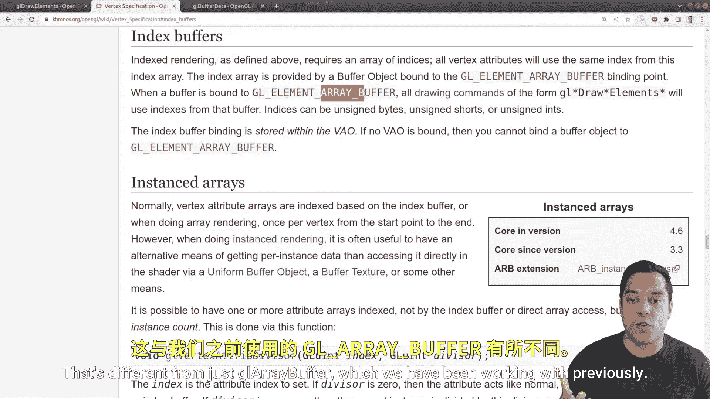
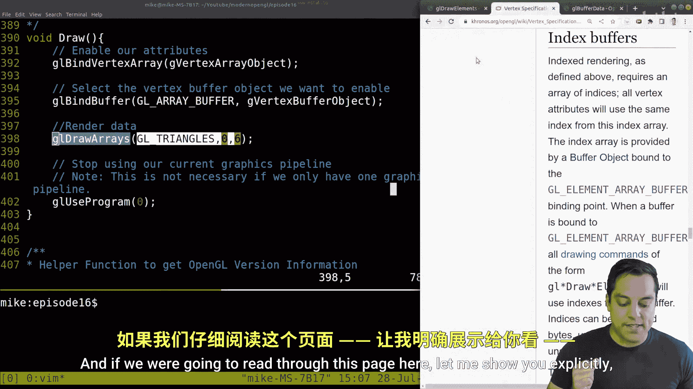
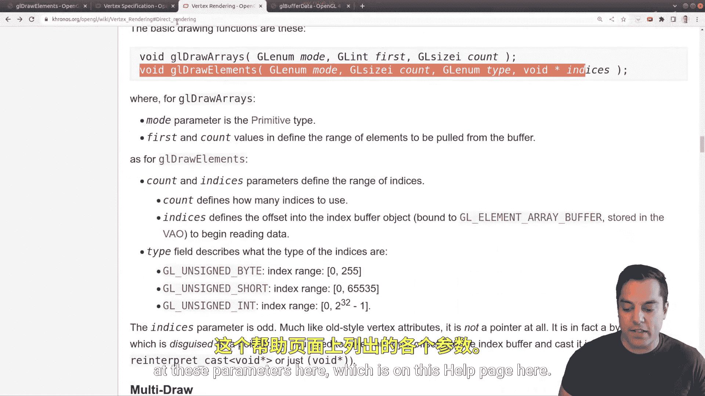
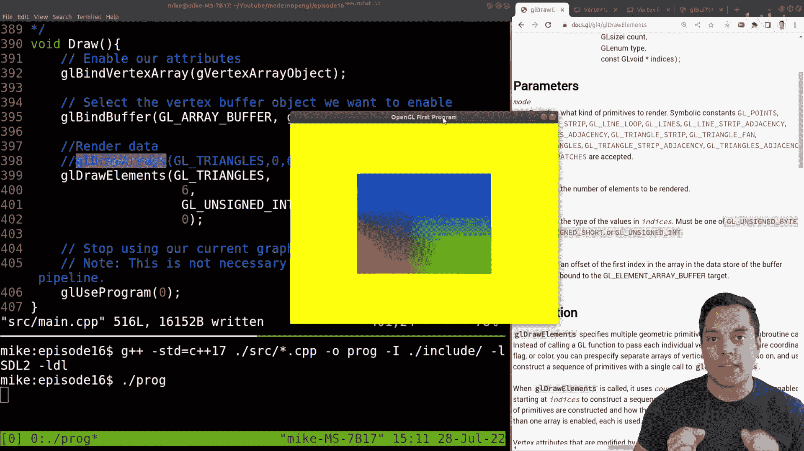

# Mike Shah【中英⚡OpenGL导论｜Introduction to OpenGL】 p16 P16 -Episode 16- Rendering a Quad Again! (More efficient Indexed-Buffer Strategy -BV1pTvFz3Eqh_p16-

Hey， what's going on folks It's Mike here and welcome to the next lesson in our modern OpenGL series and which I'm going to be showing you in C++ how to use OpenGL。

 although really any programming language is fine， but the OpenGL part is the important part that we're doing it in a modern style using the modern API So with that said though。

 let's go ahead and dive into our lesson and talk a little bit about what we're going be learning today So this lesson picks up from a previous lesson in which we learned how to draw a quad and we were able to draw the first triangle and then the second triangle listed here So every individual vertex had a position and a color。

😊，But for those of you who might have paid close attention。

 you might have noticed something a little bit odd here， something inefficient。

 and at some point we've got to start doing things efficiently because that's how we render such beautiful things such as games with great graphics and movies in an efficient way。

So just looking at this diagram here， which I have from a previous lesson。

 you'll notice that this vertex here and this vertex is actually shared between these two triangles here that make up our quad so wouldn't it be nice if we could just get rid of this actual data here that repeats and if we look carefully through here we'll actually find some repeats that we can get rid of。

😊，So for instance， this vertex here in the top left。

 let's go ahead and see if we can find the repeat data。 Well， I found it once here。

 same color and same position minus5 in the 0。5 in the x axis in 0。

5 in the y and we've got that same data here so really I only need four vertices to represent this actual picture here So that's what our goal is going to be and we're going to do this using something known as an index buffer object so just to get us started here。

 let's go ahead and just get rid of the actual repeat data and then we'll dive into the actual programming so we can figure out how to do this so that was one repeat and the second repeat we need to look for is this vertex in the bottom right corner here。

😊，So let's go ahead and see if we can find that here。

 I believe that's this right vertex position here and we've got the right vertex position。

 So let's just go ahead and get rid of it。And now we can actually comment and label this a little bit more appropriately。

 we can just label this as the zero vertex。And then let's just go ahead and add in the first vertex here。

And then the second vertex。And this will be the third vertex here。Okay， third vertex。Okay。

 now of course you don't have to label this， but again， I just like to organize things。Now again。

 why does this matter to even be efficient though， So imagine I had a object that I was trying to render and I'll draw it in the corner here that had one shared vertex here。

 and then it sort of came out like a fan or some sort of shape like this。

Now it wouldn't really make sense for us to just continuously duplicate this center point here。

 we would want to be able to use this position and perhaps color or any of the other attributes over and over and over again。

 and that again saves us a lot of data so we don't have to send as much data to the GPU and when we render our objects we can also be a little bit more efficient in different ways as well。

 so that's the main idea here so。Go ahead and get rid of that shape here。

 And let's get to the main idea here。 So now what we're going to have is a vertex buffer object。

 VB O。That consists of our vertices。 So whatever the vertex。

 and I'll start with 0 and whatever that color is， C is 0。 And then our next vertex and。

Continuing on and on。 Okay， so now we've significantly reduced the amount of data in this vertex buffer object here to just four things instead of 6。

 And I'm going to have a separate index。😊，Bffer。Object。And this could be labeled as I。B， O。

And I'm also going to write it with another name here， element。Element。Buffffer。Object。

Because you might see it labeled that way in different literature or APIs as well。

 but it's the same thing。Now in this one。Our goal is going to be to just reference the index into this array here。

 So index 0，1，2， and 3。 Okay， so let's go ahead and just draw this again a little。

 well I'll just expand this down here。Let's draw our vertices again。And how I have them labeled here。

 so the zero vertex， for instance， that's at position negative 0。5 in the x and negative 05 in the y。

 so that's down here somewhere。So zero， the first vertex is positive x axis， negative y axis here。

 and then this one is positioned。According， here， negative x axis， positive y axis， and then here。

 these are our vertex positions。And again， the goal in our element buffer object here is to select。

One of these， or rather for doing triangles， three vertex positions。

 and it can be any of them in any sort of order so long as we are respecting the winding order。

 which we learned about in a previous lesson that we can draw these， right。

 So our goal is going to be able to draw。A triangle here using these indices and a triangle here。

 So for example， we could do two。0，1。And then this is sort of implied here that one connects to2 here。

 So 2，0，1。 that would be the first triangle。 And then I can also do。

 as long as I'm going in a counterclockwise order， say 3。2。One， okay。

 that would also work because I'd be going in this direction。

And then this direction here and this direction。And again， we can see that we have saved our。

Selves from having to store extra information in this vertex buffer object。

 I suppose we're storing a little bit of information here。 But again。

 if our vertex buffer object contain other information。

 which we'll talk about later like normals and texture coordinates。 Again。

 we really start to save the amount of information that we're transferring to the GPU and working with quite a bit here。

 Okay， so this is our strategy， let's go ahead and see how we implement this。 Okay。

So like all things， we are going to be working with some sort of buffer that we need to send to the OpenGL。

In order to just sort of orient you a little bit here。 and I can go back here。 again。

 we need some open G object。 Now， Again， we've been working with vertex buffer objects。

 So let's go ahead and take a quick look here。And let's see if I go ahead and just。

Dive in a little bit more here。So what we have， you know， we've read about vertex buffer objects。

 I'm going to go ahead and just scroll up a little bit。

 This took me to the page for our vertex specification， where we've been looking。

And if I look carefully through the contents， and I'm going to help you。

 there is a category for something known as a index buffer。 So if I click on that。

 you'll see that this is what we want to work with today， index buffers。

 And this is a buffer object that has a GL element array buffer。 That's the actual enumeration。

 That's different from just GL array buffer， which we have been working with previously。

 So I want to keep that in mind。 I'm just going to take a little note of this here。😊。

And I'll put it here， GL。Element。Aray。Buffffer。Okay， just like that。

 That's the actual enumeration we're going to use when we're binding to a particular buffer。

 Allright， so I think that's enough on the theory here。 let's go ahead and get to coding here。

 Now we've gone ahead and set up our actual vertex data。

 now we need to set up our index buffer data here and I've got a valid ordering here。

 many different orderings will work， but this one should be just fine here。😊，Okay。

 now we don't need to do anything with the VAO setup here quite yet。

 but we do need to go through this process of creating other buffers。

 that means GL gen buffers bind to the buffer we want and then set up the appropriate data here Okay so let's go ahead and do this at some point here in our vertex specification I'll actually do it right after we set up our vertex buffer object and let's go ahead and give ourselves some comments。

 set up the index buffer object， our IBO。😊，Or。I。e。 the EBO，1 name or the other will be fine。

 Allright， so let's go ahead and set start with G L Gen buffers。 How many buffers do you want。

 one for this index buffer。 And we need some place to store it here。 So something like again。

 we're just going to use a global because globals are fine in this series。 indexex buffer object。

 Okay， and let's go ahead and create this。😊，At the top of our program in our list of globals here。

 again， we can see where we're setting up the vertex buffer object。 but we need also our。

Index buffer object here， okay。And let's just call it index but for object as I did there。All right。

 perfect。Okay。All right， and just some comments here， index buffer object。This is used to store。

The indices， the。A list of indices， I should say， or the array of indices。

That's we want to draw from。When we do indexed draw。Okay。Al right。

 let's go back to our vertex specification here。Back to where we were here， setting things up here。

Okay， so now that we've got or have generated our buffer here。Let's go ahead and bind to it。

 the GL bind buffer。And again， sometimes I get confused， so I need to use our helpful help page here。

And let me go ahead and go to GL bind buffer。 again， we need the target and the buffer。 again。

 I try to work from the documentation so I don't make silly mistakes here。 But again。

 what buffer are we working with， not the array buffer this time， but the element array buffer。 Okay。

 so our target GL element。Aray。Butffer。And then the actual buffer that we want here。

 that's the G index buffer object。 Okay， that's the one that we just generated。Okay。

 and now we need to populate the actual buffer with some data here。

 Now you'll notice I already had the help page here， but let's go ahead and bring up GL buffer data。

 And again， we can see the target， the size， where our data is coming from and our usage。

 at this point， we don't have any data。 we need to create that。 Okay。

 I'm going to do sort of similar to what I did previously。Where we set up our vertex data again。

 just to orient you。That's this one here。 And I'm going to use a vector structure。

 A lot of folks just like to use raw arrays， but vectors are a little bit more convenient to work with。

 They're also very efficient and can help us write better code。

 So let's just go ahead and use this vertex。 do what we did for the。

Index buffer as we did for the index buffer here。Okay， so it's going to be constant。Standard vector。

 And since we're storing indices， these are going to be positive things。 So GL unsigned int， Okay。

 and let's call this index buffer data。Okay， and we can actually just make things a little bit more convenient for us。

 just use an initializer list here okay and C+ plus so that I can populate it with essentially these values。

 the vertices that I want here to01， that was our first triangle and then three，2 and one。

 which would be our second triangle Okay， so let's go ahead and fit that there。😊。

And I'll add a semi cllon， and we should be good to go here。 Okay， so now we can populate。

Our index buffer， which is essentially shipping this data to the GPU。

 This set of values is what it's sending and saying， hey， you know。

 look into some vertex buffer object when we're bound to it， and that's our actual data okay。

So again， from our help pages， what's the target， well that's going to be this same thing here。

The GL element or buffer。The actual size。 Well， let's see what's the size is going to be。

 And this is why I like using vector because I can just do this to。you know， if I change this later。

 I just have all the values here， so there's six of them here。

 but let's again double check the actual parameter size means the size in bytes so again this means the actual bytes so size of and then whatever the type of this vector is that it's storing here unsed integers okay。

Now the data again just comes directly from the vector and we have this handy data function and again this is essentially pointing to the underlying array that's stored within the vector here okay。

 so we're describing grabbing that information here that's just a pointer to that data。

And then the actual usage。 Well， this is going to mimic the same thing that we had above static draw。

 You know， we're not going be changing this information while our program's running or anything like that。

 Okay， so let's go ahead and save this much and let's just try to run this， let's see what happens。

 Let's see if I made any silly compilation errors。 surprisingly not， but if I go ahead and run this。

 And if I bring in the screen here。😊，Well， I actually just have one triangle So what's going on。

 you know I set up the index buffer。 I bound to it， I you know sent the information to the GPU。

 but it's not drawing now。 Well， we still have to do one different step here because we're doing index drawing okay so let me go ahead and clear that off and again。

 the reason we only got one triangle this time instead of a quad is well。

 we erase some of the data here and then again， we're drawing it improperly。

So let's go to GL draw arrays in our draw function and this is where we are actually doing the draw。

 So remember when we do the draw call that's what kicks off the entire rendering pipeline。

 our whole graphics pipeline and runs through the shaders and everything。

 but we actually have a different function that we want to use here。😊。

And if we were going to read through this page here。

Let me show you explicitly just so you know if you get to this help page here that we have to use this draw command GL draw elements。

 In fact there's lots of different drawing commands here for open GL depending on how we are actually drawing here so let me go to the different ways of direct rendering Well we're familiar with this one GL draw arrays。

 but this is the one for index drawing here GL draw elements and we're going to go ahead and take a look at these parameters here。

Which is on this help page here。Okay， so。Since we're doing GL draw elements。

 I can actually just get rid of GL draw rays。And let's do- actually。

 let me leave that in just so I can reference it。GL draw elements here。Now， again。

 the mode that we're drawing things。 well， we're drawing triangles。 Okay。

 and that's what tells us essentially to sample three indices at a time。 Okay。

 so this is the same as before。 GL draw triangles。 Okay， then the count。

 how many specifyize the number of elements to be rendered。 to write two triangles。 Well。

 let's try that out。 I don't know I'm not sure but let's see。😊。

And then the actual type here specifies the type of values or the indices。 Okay。

 what information we restoring before here。 Let me move this so you can see it。 Well。

 we had unsigned integers。 Okay， so I'll just try that one out G L。Unsigned int， okay？

And then any sort of offset。 Okay， again， this is this final parameter。 Well。

 I didn't have any data before my vector。 It was just purely all the indices。

 So I'm just going to put in 0 here，Now let's go ahead and try to run this。

 I'll go ahead and compile it compile。 So that's good news and I'll run it。 Andoo。

 I get an empty screen here。 What happened here。 See if you can try to figure out what I've messed up and I've left GL draw arrays as a reference。

😊，Well， similarly， maybe you've spotted this。 and I promise I made this mistake on purpose because I want you to realize this thing here。

 the count specifies the elements to be rendered。 Well， we want to go through six indices。

 Okay6 indices will actually give us the two triangles here。 so that's the fix that we had to make。

 And I often see folks make。 So that's how we'll fix this。 And nowvoila， we have our quad here。

 which is awesome。 So it's super awesome to see this and we're doing this efficiently。 And of course。

 it's always exciting when you get something rendering properly in open GL， that's worth selfbray。

 So with that said， we now have our quad successfully drawn on here。😊，Now。

 a couple of other things to pay attention to before I wrap us up。

 we do have to be very careful and there was a point to why I'm always working off the documentation and frequently doing that in the series。

 If I just change one of these parameters here to say GL int and then I try to run it。😊，Well， again。

 I won't get any compilation errors。 My program doesn't even crash。

 but I do get an empty program here， which is always a little bit startling when you're doing graphics programming。

 And the issue is here， again， that we have to be sure that we're following the documentation and putting in the correct nume type in here so this is unsted Now there are ways and I will talk about this in the series of how to capture errors like that in a future lesson So of course。

 make sure you subscribe so you don't miss those but I just wanted to draw that to your attention specifically。

 But with that said， let's go ahead and end this lesson viewing our awesome quad one more time using an index buffer strategy and again。

 this is a really really cool and powerful technique that allows you to be more efficient。

 especially when you're generating again， really huge game scenes or whatever you're trying to draw or you're starting to draw tens of thousands or hundreds of thousands of triangles this really。

 really makes a difference because you're sharing data a lot sharing vertices a lot in the geometry data。

😊。

All right folks， I hope you enjoyed that lesson， I hope you're able to follow along。

 go ahead and give it a like if you enjoyed the lesson。

 comment below if there's something else you'd like to see and with that said。

 we'll see you in the next lesson very， very soon。

