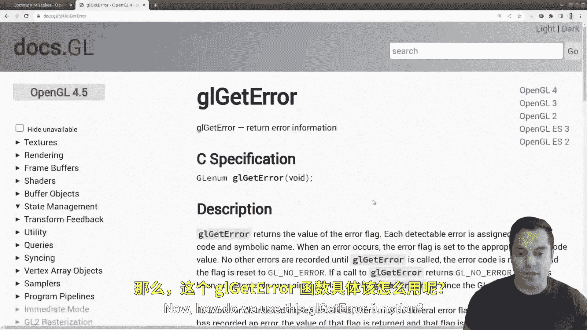
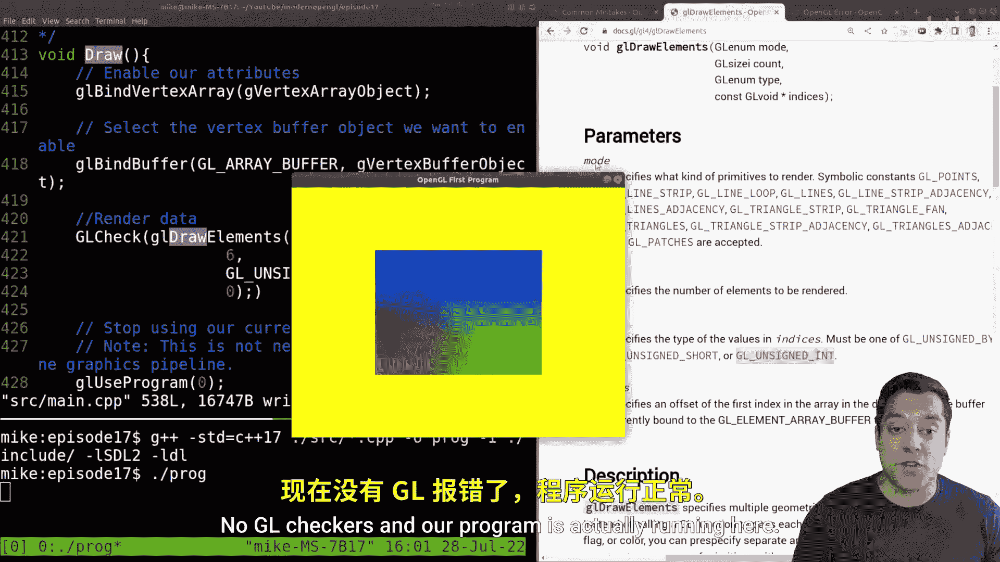
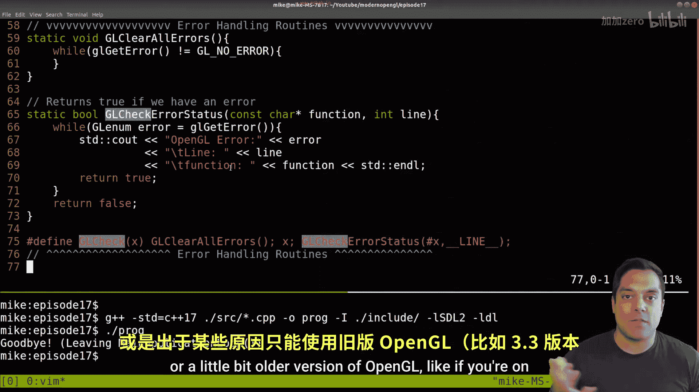

# Mike Shah【中英⚡OpenGL导论｜Introduction to OpenGL】 p17 P17 -Episode 17- glError - Debug errors in OpenGL State Machine - Modern OpenGL -BV1pTvFz3Eqh_p17-

Hey， what's going on， folks。 It's Mike here and welcome to the next lesson in our modern open GL series。

 In this lesson， we're going to talk about something that's relatively important in your programming career。

 And that's how do you handle errors or how do you even detect them because I think it's quite funny that an open Gl where we do graphics programming。

 We don't exactly have a sort of print F command that we can just print from the GPU what the status is or exactly wine errors happening And maybe later on in the series will talk about profilers and some of these tools that can help us。

 But for now I want to go ahead and show a tool in open GL that's built into the API that can help us。

 In fact， there are some handy function calls we can abstract to try to get this information。

 But with that said though， let's do a little bit of a bug hunt first。

 And for those who've been following along in the series， you'll probably notice the bug right away。

 And for those who haven't， this is a good test of if you need to go watch some of the previous videos to see what it is。

😊，And I'll go ahead and give you a hint that it's somewhere on this actual screen here that there's a bug。

 but I'm going to go ahead and just compile the program and I'll go ahead and run it。

And if you just give me a moment， I'll bring in the window here and I don't see anything。

 Now the yellow is not there。 that's just the background color。

 but I should be seeing a quad on the screen here， and I don't see it。

 so we could stare at this for a while and try to figure out what's going on even worse if you haven't written this code。

 you can try to figure out what's going on。 but we don't really have any tools that can help us。

 But what we do have is this really handy function here called GL gett Air。

 and we can use this to help us identify some errors。

Now your other alternatives， and I'll just go ahead and bring this to your attention here。

 and this is the reason why I sort of thought about this lesson is we have this handy page for common mistakes on OpenGL and well you can go ahead and see there's a bunch of them。

We don't really have a way to sort of enumerate through all these different errors here。So again。

 that's where this function GL get air is very handy as it can usually give us a hint as to one which functions causing the error and maybe some idea of what type of error it is So for example。

 we're going to be able to get these air codes back like maybe an inval enumeration。

 some value that's not working， maybe we ran out of memory， etc， etc ce。 So again。

 we have some sort of hints Now， how do we use this GL Gi air function。

Well， what I can go ahead and do is just go ahead and well， let's go ahead and write a function here。

 I'm going to go ahead and do it at the top of our program here and just sort of abstract a little bit around this function here。

 So I'm going to go ahead to the top of our source here。

And let's just go ahead and give ourselves an air handling routine here。Now， again。

 we could probably abstract this out to a different file or do these types of things。

 but I'm just going to。Put this in the same file right now because I don't want to introduce any abstraction quite yet in this series in order to keep things as simple as possible。

So let me go ahead and just set this up， this is the sort of style that I like to use here for just separating out my code here。

😊，And basically what I want to use is that。😊，G L get air function here。 that returns air information。

 but I do need to abstract around it a little bit。 So let me go ahead and try to explain this。

 So how this function works is it returns an air flag。 Okay， simple enough here。Now。

 what's sort of interesting about this function is that each detectable error that you get gets some code in a symbol name here。

😊，Now， what's sort of interesting in the next few lines here is it says when the error occurs。

 the air flagag is set to the appropriate air code value， Okay。

 so that seems simple enough that I could just call this function and get an air hair。

But what really makes it useful for us to have some abstraction is this next slide says no other errors are recorded until GL error is called。

 So that means if you have a bunch of errors， a bunch of errors that are cascading。

 it can be a little bit tricky to just call this function and know that some error occurred somewhere in your actual program。

So we're going to need to write some routine that clears the sort of air state， okay。

 so that's where I'm going to start writing this function here。

I'm going to use it as a static void function， so it's just limited to this file that's not strictly necessary。

But I'm just going to call it GL here， all errors。 and it'll just be that simple。

 So what this function is going to do is just consecutively call GL get error over and over and over again until you're in a state that is clear。

 That is there's no errors here。So that'll be the first of these enumerations here， GL， no error。

 so no errors have been recorded at this point Okay。

 so that's really all this functions doing it's kind of a silly function。

 but that's how it's going to work here。And then we'll actually use our function here。

And I can make this a bullin to return true or false if some error occurred。

 and I'll just call it GL。Why don't I just call it GL check Air status， something like that。

And let's just go ahead and start with this much here， Okay。

 so I'll go ahead and just use my wall loop here。😊。

And what this function returns here is some GL aum here。 So while GL nu error equals GL get error。

And then I'll go ahead and say， well， if we retrieved an error。

 then we want to return our status here that we， in fact， had an error here。

 and maybe I'll just kind of name this even。And I'll just return true that we got an error。

 otherwise we'll return false， okay。Returns true if we have an error。Okay。

Now let's go ahead and just start with this information here。Now again。

 GL Git Air is actually returning some interesting information to us， for example。

 the actual enumeration here or the error code here。

 so we probably want to at least print that out here somewhere so let's go ahead and just do a see out here。

😊，And let's say open GL Air。And maybe the code here error。Okay。Let's start with this much here， okay？

So what I would have to do is use these two functions together。

 I need to call GL clear the error state and then I would have to check the error status。

 but I'm only checking the error status after I make a function call。

 So something that programmers will often do is they'll create different types of macros to handle this Okay so I'm going to actually just write a little macro here。

 And again， we're going to improve on this in a future lesson here。

And let's just say open GL call and the function that we want to call here。

And then what we want to do in between here is call our geo clear all the errors。

Then do our function call X， whatever it happens to be， and then check for our errors， GL。

 check error status， so essentially this thing here。So GL check error status。Okay。

 and we don't have any arguments and then I'll just put a semico in here Okay。

 so let me go ahead and put this on a line here。So essentially what I built is a little air checker here。

嗯。And maybe we could give us some better name here， like GL check or something here。Okay。

 so macros are sort of good and。Well， bad， depending on your actual use case。

 so we do want to be careful with this feature and OpenGL does improve upon it。

 I'm doing this in sort of a openGL 3。3 away that way so Mac。

 Windows and Linux users can all use this function and then I'll show you something else shortly。

In in another lesson， Okay， so let's go ahead and use this GL check and go back to our original problem and see。

In our actually， is our draw command， where an error was occurring because well， nothing was drawing。

 So the way that I would use this function here。Over this macro is use GL check and then just wrap our function here。

 Okay， let's go ahead and do GL check。And I'll just go ahead and wrap this and maybe even this one here。

 because I said it was somewhere on this screen here。

And we can essentially just wrap all of our functions in this way here。Okay。

 so let's go ahead and recompile this oops， looks like I made a little error here。

 it's GL lowercase here。Go line 66。And fix this here。只要。Get air， okay。And hoops， one more error。

These are again， lowercase。I tend to write a lot of uppercase functions， okay。

 and now we can go ahead and run it。Now let's go ahead and just run this program here。

 knowing we have our air checker， and I am getting some error here。Oh， open GL Air 1280。 Well。

 of course， Air 1280， everybody knows what that is not quite。 Okay。

 so we still have to improve our error checker here， but we are still getting our window here。

 That's empty。 but now we at least know that there's some sort of error。

 So how could I improve upon this function here to actually get some information here。

 That is you know maybe a line number for example， or the actual function call。

 So let's actually improve upon our GL checker status function here。😊。

And we can actually pass in the function and the line here。 Now。

 most compilers that support this will actually put the we can actually use this other macro known as line here。

😊，And I'll just go put。Put in line。And then it's usually to underscores and then line like this。

 Okay， so let's go ahead and just improve our function here a little bit， the line and again。

 as mentioned， we can actually put the function as well here。So me function。

And let's do just a little bit of maybe indentation here。And then the functioning here。Okay。

 so here's our actual air checking function。Now， of course， when I actually use this here。

 when I am checking the error status， I need to update our little macro here。And in order to pass in。

The function， just as a literal string， you use the pound symbol。 Okay， and then again。

 line here as our second argument。 Okay， so let's try to recompile this。 Oops， looks like a missed。

One extra。Mark there， okay， and now we should compile and I should be able to run here。Okay。

 now now what I'm running， no matter where I am， and let's go ahead and make this just a little bit bigger。

 I see that I'm consistently getting this error over and over and over again because our program isn in a loop here。

 so I'm just running it all the time and that's at line 68 here okay so let's go ahead and see what happened here。

😊，Now I have made one little goof here because well line 68 here is not actually what I want to pass in here。

 this macro。 I want the actual line at which GL draw elements was。 So again， let me fix this up here。

Just a little bit here。And you can see I'm just sort of playing around with this air handling function to get it right。

 Okay， that's a little bit more helpful line 421 and specifically GL draw elements here Okay。

 so if I go to the line 421。😊，This is our culprit。 Okay。

 so I can go ahead and clean up our code here。 And again。

 you could literally write a little GL check function or whatever you want to call it around every sort of function that had a call around it。

 your program would run smaller， but you'd ideally have a debug or release mode here。 Okay。

 Now what is open GL Air 1280， though， That's what is still confusing us here。

 So let's go ahead and take 1280 here。 And what I'm gonna go ahead and do is open up Google here。

 And if you search for open GL Air。😊。

Or open GL Air enumeration codes， and you'll get a bunch of different lists here， aha IDC1 for 1280。

 let's just go ahead and open that one up here。And there's some form here now it does give me a invalid a num thing here。

 but let's go back to the documentation。😊，And then we can go ahead and see the error codes here。

 Okay now I do have to sort of figure out in hex what this value is here。 So unfortunately。

 they just report the errors here。 So let's go ahead and just open up a calculator in case you you know can't do that decimal to x decimal conversion in your head。

 which if you can that's great or you can Google this however you need to and let's just look through the different enumeration codes here So why don't I go do programming here。

 let's go to hex decimal。 And if I put in 500 here， that is in fact， Air 1280 Okay。

 so it is an invalid enumeration。 Okay， so how do I sort of debug this here。

 Okay so I know what the error is， I put in some invalid enumeration here So if I go to GL docs here and let's go ahead and find our function here。

 our fing function here GL draw elements。😊。

And I'll go ahead and do a search for this， let's go for it。

There's two places where I have enumerations here for the mode and the type here Okay。

 so let's go ahead and test this out， maybe I wrote GL triangle instead set of triangles。

 for example， that could be a common problem。And let's go ahead and see if I look carefully here。

 here's GL triangles， so that one's probably okay Okay， and then just by process of elimination。

 I can go through the types here and see unsigned byte no， no， no， okay。

 I don't see GL underscore in here So that's actually where the error happens to be I should have typed in GL unsigned into here So let's go ahead and just correct that unsigned in。

😊，Let's save， I'll rerun it。And now， oh， that's good news， no GL checkerss。

 and our program is actually running here。

So let's go ahead and just do a little recap of this sort of helper function that we've written and now that my error is gone。

 I can go ahead and get rid of it。Here， but let's go ahead and see GL check。And again。

 the first idea is that this function GL get error is essentially going look at the openGL state machine and within of it report any errors to us now we have to sort of in a sense pop off all the errors if we're gonna wrap every function around this and that's essentially what this function does and then we're actually able to get some information here that basically it says hey。

 while there's an error if we find it go ahead and please return it to us and then the rest of this is just customization for how we want to use it and it can be very useful to write some sort of macro if you're limited to see programming for instance or a little bit older version of openGL like if you're on version 3。

3 or version2 for whatever reason this is how you can get some help So folks this has been an important lesson on air handling。

 I hope it helps you out in catching these troublesome errors and the good news is modern openGL provides some other air handling functions and we'll go ahead and check those out just to make life a little bit more easy。

So folks， we'll see you in that next lesson， stay tuned and make sure you subscribe so you don't miss it and I'll talk to you shortly。

