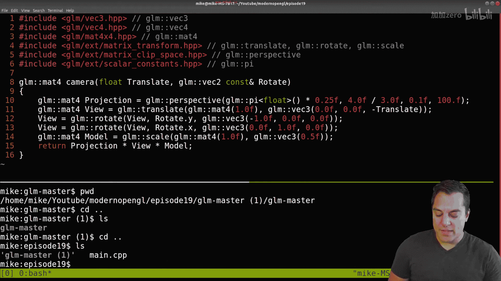
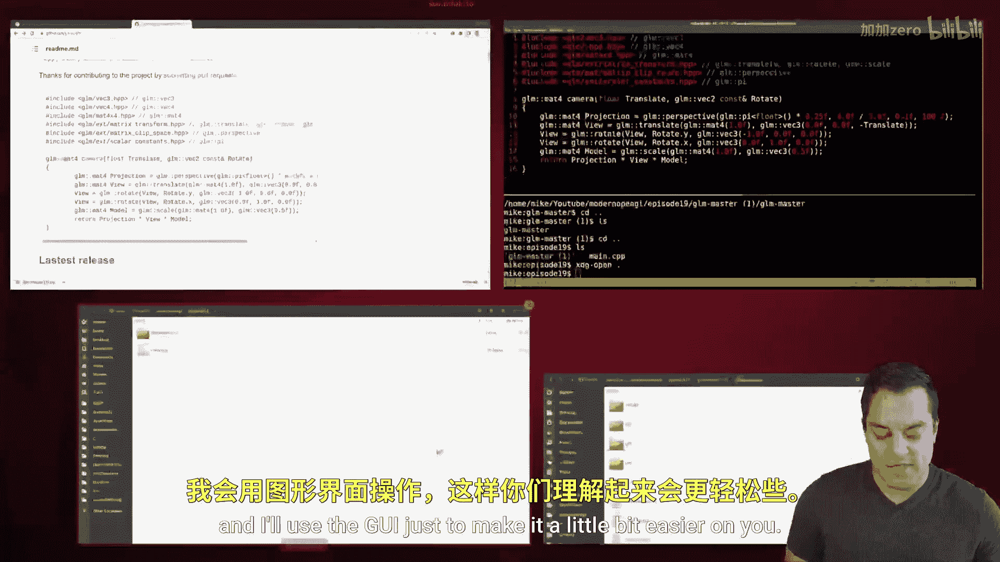
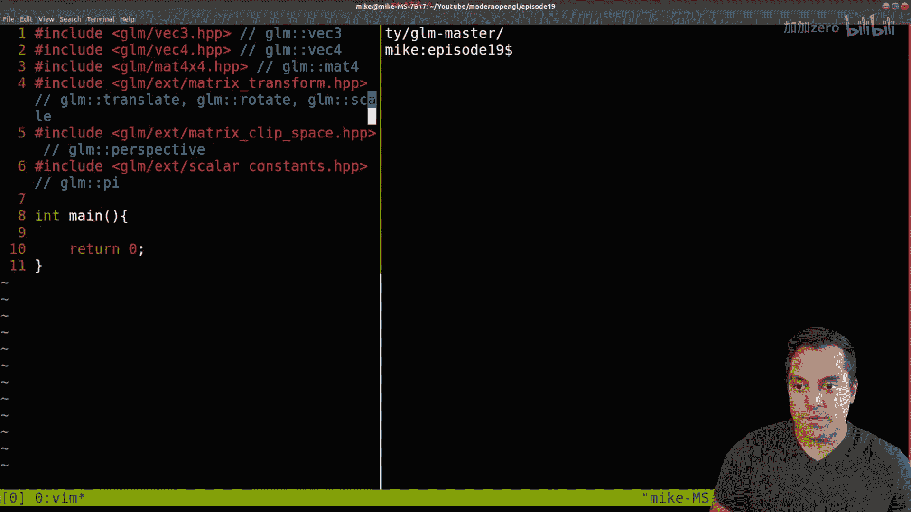
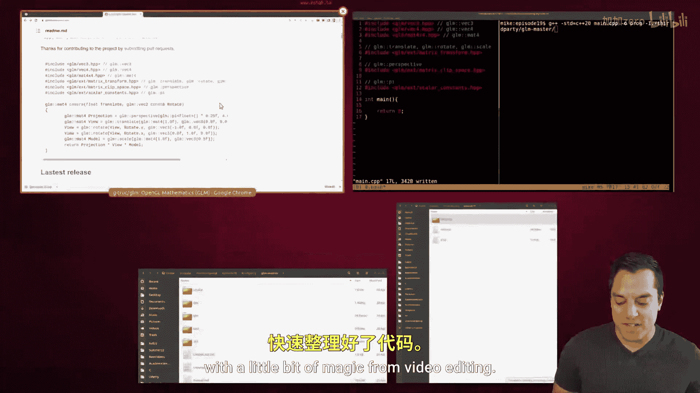
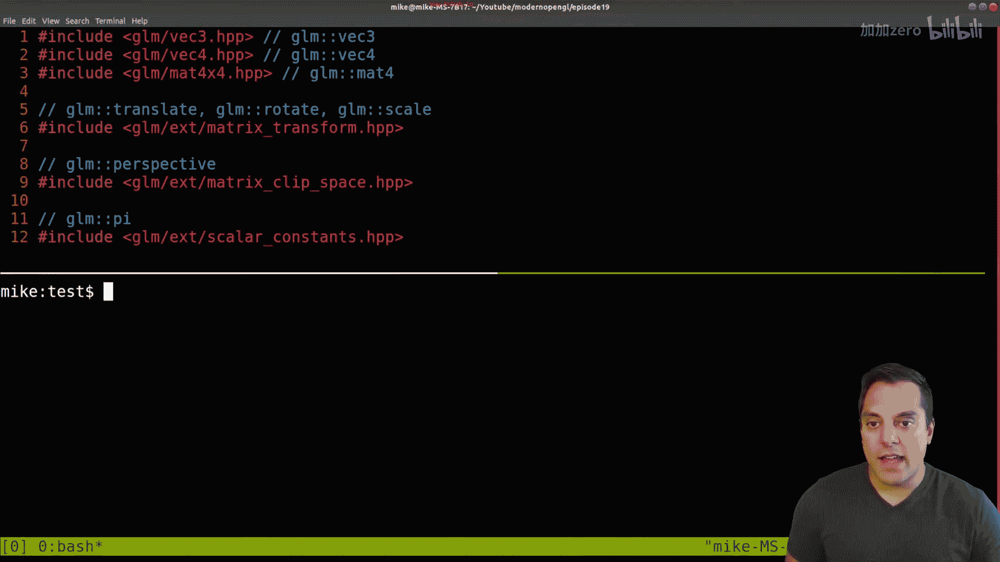
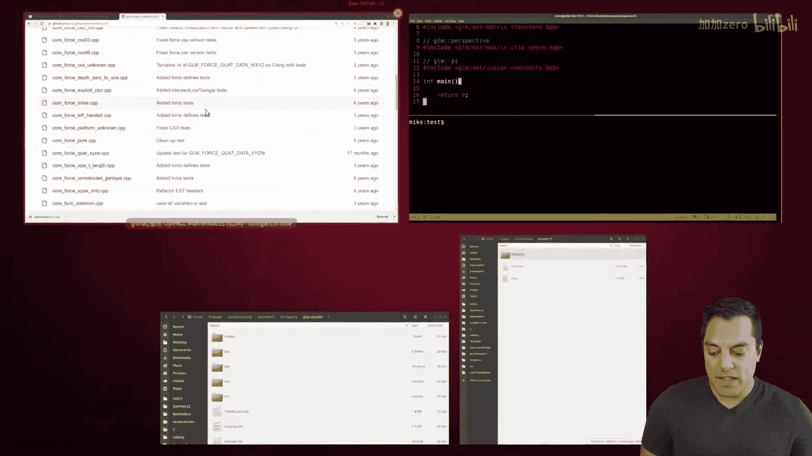
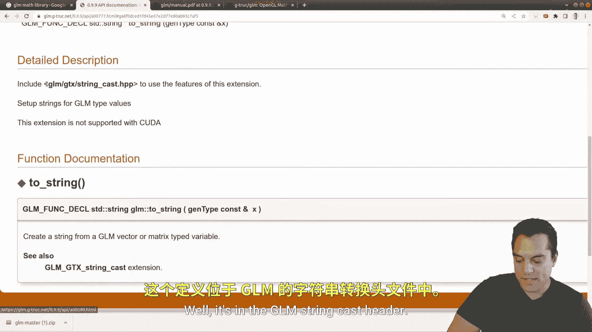
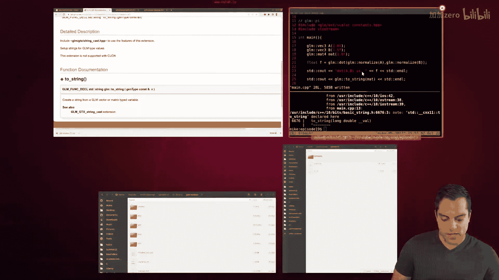
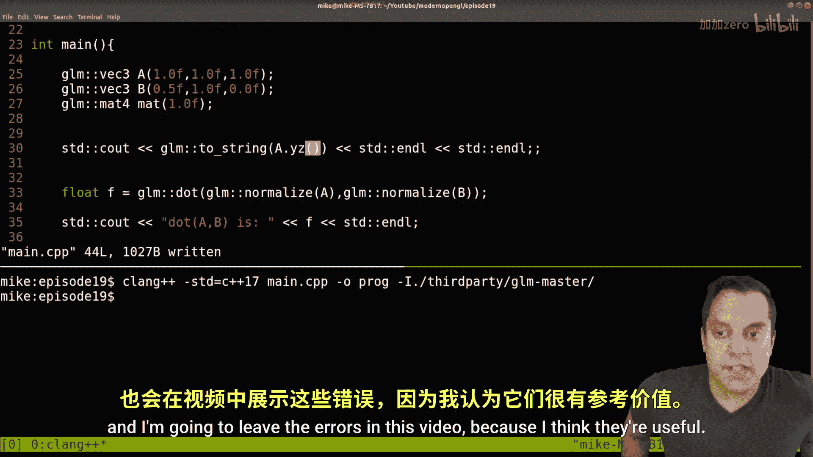
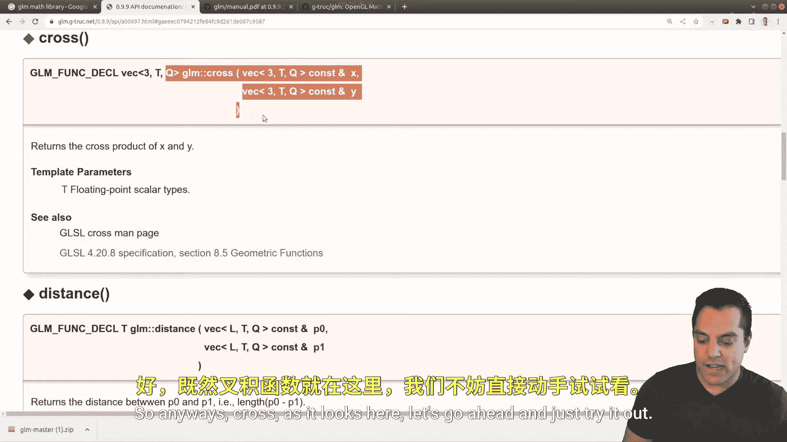

# Mike Shah【中英⚡OpenGL导论｜Introduction to OpenGL】 p18 P18 -Episode 18- OpenGL Math - Introduction to the GLM Library - Modern OpenGL -BV1pTvFz3Eqh_p18-

Hey， what's going on， folks is Mike here and welcome to next lesson in our modern Open GL series In this lesson。

 we're going look at a special library called the GLM library。

 And this stands for the GL maththematics library。 It's a free open source library。

 It's going to let you do a lot of the things that we need to do in computer graphics like working with vectors。

 matrices， Quaernians and some of the other mathematics that we're going to need in this series。 Now。

 you're welcome to use your own math library if you'd like。

 But GLM happens to be a really nice library to use。 And let's go ahead and look at why。😊。

So here's the web page for Open GL mathematics and you can go ahead and do a Google search for GLM math library。

 you'll go ahead and see it's usually the second link here to get the website and then we're gonna to visit the Gitthub library shortly to see this Now on this page we're going to see here is that this is for specifically openGL mathematics I'm sure you could use this with other As as well but that's where the name comes from for GL mathematics and why we like this library if you read the description here I'll go ahead and just zoom in a little bit more is because it's really related to GLSl the GL shading language that we've been looking at in this series and what that means is that the function names for instance are the same as this math library things are for instance when we get into matrix multiplication and these sort of operations that we're going need to do for transformations column orderedder and so on so the defaults sort of align nicely with GLSl So it's just sort one less thing that you have to keep track ofright。

😊，With that said， let's just go ahead and get started with this library。

 let's get things set up so that you'll be able to start using GLM and I want to actually practice a little bit going through the documentation so you'll be able to learn things without having to search for lots of tutorials and just know how to navigate the documentation So with that said。

 let's go ahead to that Github page here I'm just going go ahead to the code here I'm going to download the zip file here。

😊，And just give me a moment to open this up。And once you've got the zip file in a directory that you want。

 go ahead and just extract the contents within that directory and you'll go ahead and see we have the GLM library here and just exploring this you'll see that we have everything in the repository Okay now let's go ahead and just take a look at this page here on the Gitthub to see how we can get started。

So if you scroll down here， you'll go ahead and see it has most of the same opening as the website here。

 so we can go ahead and see that。 And again， we can see that this library is supported on a wide variety of compilers and using modern C plus plus thats C plus plus 11。

 which we use in this series as well as my other YouTube series。 So you can go ahead and see that。

 So let's go ahead and just start with this basic example here and see how we can use the library here。

 So what I'm gonna go ahead and do is just copy this example here。

 And let's just make sure that we have things set up and make sure that we're able to create a project where we can include the correct files here。

 So going to go ahead and switch into my episode directory here。 Let's go ahead and。😊。

Go ahead and create a source file here。 I'll just go ahead and call it main。

And let's just go ahead and paste in our example。From the GLM page here。

 I'm just going to go ahead and resize things a little bit just so it looks a little bit nicer。

 I think this will do here。 And there we are。 Okay， so here's our actual project here。 Now， again。

 let's just go ahead and try to compile this and see if it runs。 So run G plus plus。

We want to use a modern version of C++， so usually I'm using 20 these days。Our main file and output。

 And of course， we are going get the no file or directory found here。 So again。

 looking at our directory structure here within GLM master。

 let's just go ahead and take a look at that。 We have the other folder that we extracted and then we have our particular files。

 So anytime that you install some library。 You're usually gonna want to see some of the examples and how they're used。

 So we have this sort of simple example here。 and we'll actually look at some of the tests so we can learn how to use this library as well。

 So you can go ahead and see that this GLM folder， it looks like that's gonna to be our route here。

 So sometimes I like to just explore these things here。

 just a little bit to see if I can kind of match up and see， okay， is there Vc3 HPP here。

 and I can indeed see that that file is there。 So I have some idea that that's the folder that we want to include Okay So if I go ahead back here。

 let's just go ahead and take a look at this path。 So for us。

 it's gonna be this include path from our current directory。😊。

And let's just go ahead and go back here and go back。 Now。

 just to clean up this project a little bit。 and I'll use the Gui just to make it a little bit easier on you。

 I usually just like to extract these contents here。

 or actually probably leave them in GLM master here。 Let me go ahead and paste this here。

 delete this empty folder。 And then usually what I do whenever I download some other library that I haven't created。

 It's just call it third party or you could sort of you know movies around as you like。

 But that's sort of the idea。 So it makes it a little bit easier just to know how I have included things。

 So again， here's my current structure here。😊。

And what I want to do here， again， if I list out what's in the third party， I have GLM master。

And then this GM page， so let's go ahead and retry our compile here just with a little bit of this new structure。

So I'll go up here and I want to include dot slash。Third party。Third party。And GLM master。

And let's just go ahead and hit enter here。And looks like we are almost ready to go from our sample where we have this project here and anytime。

 of course， you're getting this undefined reference to Ma just means， well。

 we need somewhere to start our code here int main。😊，And just return zero。And that's it。 Okay。

 so now if we go ahead and compile， we'll go ahead and see that we are set up with GLM and we can include anything that's in the GLM library。

 Okay， so that's it。 if you want to go ahead and stop this video。

 because you are pretty familiar with libraries。 then you're welcome to。

 but let's go ahead and just take a look at some of the examples in the library and kind of navigating from the help page here。

 Now we can already see from some of these examples。

 how to use a decent amount of the actual functionality。 So we've got matrices。

 which we're gonna to need to learn about and V3s， for instance。

 So let's just go ahead and get rid of this and maybe start with something relatively simple here。😊。

And let's just go ahead， and。Simplify this just a little bit。

 and I'm just going to clean up the comments that they're on a different line here。

All right， so I've just cleaned things up there quickly with a little bit of magic from video editing。

And let's go ahead and explore this page a little bit。 Now。

 one way that we can go ahead and try to learn any library like this is from the source code。

 So usually we can go ahead and take a look， say at the test library。

 if there are test libraries or functions or unit tests available and kind of poke around here。

 So that is one way that I can do this。 I like to personally use tools like Gr。 So for instance。

 let's just go ahead and navigate into third party here or GLM master。

 and then into the test directory just to make our Grs a little bit easier。

 And then I'm just gonna wrap around for， say V3。 let's just go ahead and see what kind of examples that we can find here。

 And things are in the GLM namespace。 So that'll help you also just search for functions as opposed to files and comments where V3 might come up。

 So we can see that we get quite a few different examples here。

 the reason I'm showing you this way or this strategy here is。😊。

It can be useful just to see the different context in which， say， a vector 3 is used， because。

 for instance， in GLM， it's a very heavily templated library。

 So for those who have done a lot of C plus plus programming， that'll be pretty meaningful。

 But you can go ahead and see， you know， just how GLM's being used here。

 We're pushing things back into a vector。 It looks like this is a way to construct a vector 3。

 all the values are initialized to one。 etc cetera， etc cetera， etc cetera。

 We're using vector3 as a type for different colors here。😊。

And that looks like we even have something for integer vectors here。 Here's IV3 So again。

 just a few things to be aware of。 and this is again one way that you can sort of search around and try to figure out how the actual librarys working so let me just go ahead and back out of that and let's go ahead and go into our documentation and look at some other functions in GLM to do that let's go ahead to the web page and towards the top on the left here we have the API documentation we also have a manual here and the manual is pretty useful if you download this it's also got a bunch of useful。

 let's go ahead and load up a few more pages here。 examples of just how to use the library。

 some of the functions that are available and just some more code examples so anyways。

 let's go ahead and look at the API here now one that I think might be useful might be to know about if there's a dot product function so let's go ahead and search this。

😊。

Let's go ahead into the API documentation and now let's go ahead and try that search here。

 So for dot， for instance， there we go it showing up a little bit better。😊。

This would be for dot product。 and I can again see that we have two different overloads。

 So I'm going to do the one that has to do with vector。

 Let's go ahead and click on that so we can see dots here。😊，And how it's used here Now again。

 this name is looking a little bit scary because of all the template magic that's going on here so let's just go ahead and see how to read sort of this vector here parameter here and I promise that's not as scary and there's all sorts of overloads but we've got a vector here and it looks like the parameter would be between one and4 for the vector here so Vec12 or let's say we're interested in3 for now the type so it looks like the types of vectors that we have in the GL and library are things like integer vectors floating point vectors and so on and then the queue here。

 well it doesn't seem to be labeling it here but we could probably look at the template to see what that is I'm not sure if that's the actual how to say it's the qualifier so it's not label down here a quick search if we look at the actual qualifier for Q we can actually do things like the precision。

😊，For instance， whether we want a really highly precise floating point value。

 medium or low I believe that's what that is here for our particular type so that's how we read this And again there's going to be overloads or rather what this evaluates to is just using you know GLM V3 as the name here Al right so that's the idea let's go ahead and figure out how to use this here。

So this dot function here， so let's go ahead and keep it up here。

 we'll go ahead and just try GLM dot， it's a function call here and we need two vectors to compute the dot product of so let's go ahead and give ourselves two vectors here。

And just keep everything in view。And we'll go to say vector 3， and we'll just call this a。

 initialize it with a float tier。And let's just go ahead and do another one here。

 I don't know something like 0。5 and let's take the dot product of vectors A and vectors B。

And let's go ahead and see what it returns for us。 So it returns the dot product of x and y。

 so this should be some sort of scalar value here。That's a float and let's go ahead and see what we get here。

 so we've got to recompile our project。Let's go ahead and see if this works here， oop。

 it's got to go back one more directory。😊，Recompile it runs。

And let's go ahead and see what our result is。You do see out。A dot of A B is。

And let's just go ahead and put the value here with an end line。

And just make this a little bit bigger so folks can see。And rerun。And oops， of course。

 need I streamre。And let's just go ahead and see what a result is。 Well。

 it looks like our dot product is 1。5。 Okay so if you know what dot product is。

 it's taking each to the individual components of the x here and the y here。

 and it's giving us one times 。5 plus 1 times5 plus 1 times 。5。 So this looks like it works here。

 So again， why am I showing you this。 Well this is just to again。

 sort of show you how to peak around or poke some function here。

 But let's go just a little bit further here。 Now let's go ahead and see something that we might want to actually do here。

 Now let's look at another function here that willll probably want。

 And that's to maybe normalize our values here。 So it looks like we have a normalized function and let's look at the one that again。

 sorry， this is as big as little zoom here。 click on normalizedize here。 So this function here。

 and it takes in a vector。 So let's go ahead and use this。😊，And let's normalize our vectors。A and B。

Normalize。Make sure I spell it right。And let's go ahead and just put everything on one line。

 It's a little bit easier to see。 And let's go ahead and reevaluate。 rerun。 And well。

 these vectors are already， apparently these are normal lines。

 So let's go ahead and maybe choose some more interesting numbers here。

Let's go ahead and do something like 12， 2。0。And 1。5。Go ahead and rebuild this， rerun it。 and again。

 we can go ahead and see that。 well， the dot product again is going to give us a value of one here。

Alright， so that's the idea here。 Now let's go ahead and look at a few other functions here。

Let's go ahead and create a mat4 for a matrix 4。 Let's go ahead and rebuild this。

Let's go ahead and see what's actually in that matrix。

 so we have a handy way of printing out that actual matrix here。 we have a two string function here。

 let's go ahead and see if it works with what we've got here and usually we just call it something like mat 4。

 something of that nature。😊，Let's go ahead and just print that out here。

 Now I might need to include some other functionality here， but let's just go ahead and see。And yeah。

 it looks like it's oh， just a little typo again with my typing today。And actually。

 let's give it a better name here because it might get， oh I guess that's that's okay。

 I'm just going to call it Matt here for short。Just to avoid any naming collisions as I'm doing this。

 And yeah， it looks like we are missing something。 So it is complaining about this。

 So let's go ahead and see if we have two string and where that exists in our documentation。

And it looks like it's here to string。And it's saying， okay。

 so we know that this is going to take in some GLM vector or matrix typed variable and well where are we actually finding this。

 well it's in the GLM Strcast header， so let's go ahead and include this and I'll have to go into my files here。

And again， when we find some useful functionality here。We want to include。

This GLM stream cast function。And let's go ahead and rebuild that now and let's go ahead and print it out。

 and maybe if I make this terminal a little bit bigger。

 we can see that this is actually a matrix 4 by 4。And it prints it out as such。

 And you can see along the diagonals R1， which is our identity matrix。 Now， unfortunately。

 this isn't formatable with spaces。 Maybe there's another way to do it in GLM。

 but let's go ahead and take a look at that。 Now， want to actually try this printout here with our vectors A and B as well。

 just to show you something。 So let's go ahead and do。A here and B as well。

 let's go ahead and take a look at their values。And if I run this， I can see that here's vector 2。

 here's vector 3。 so you'll notice that the normalized function isn't actually modifying anything when we're using it for our dot product。

 So let's go ahead and see how that works here， when we do the GLM oops。

 let's go ahead and do here GLM normalize a。😊，And。GLM normalize B。

And let's see what those results are when we print this out now。

Then you can actually see the normalized form of each of these vectors。

 So the example that I've chosen here were these vectors and we're going to have to talk a little bit about what a vector is in future lessons。

 their lengths are or rather their these vectors are sort of moving in the same direction they're just different lengths here So something that we can do just to make things a little bit more interesting here。

😊，With our V 3 is to say， okay， let's actually specify all three the dimensions here。

 So let's actually do one here。 And again， I'm usually being pretty careful to specify the F after the number because we want to work with floats here。

Let's actually try this one here，0。5 F 1。0 F and 0。0 F， something like that here。 Okay。

 so now if I run this example， it'll be a little bit more interesting。

As far as what the dot product is giving us， again， we can see the vectors that are printed out here。

 what they are when they're normalized， meaning they're a unit length here。And then， of course。

 our matrix is unchanged here。 Okay， so just some different examples that we can see here。 Now。

 the GLM library is pretty useful again， as far as some other basic functionality that we have here。

 Let's go ahead and。😊，Just show you a few more of the。

 I guess things that we can do that are going to be familiar with us to GL S L here。

 Let's go ahead and just print out。And I'll go ahead and do it after it here， actually。

 let me do it up here just to give us a little bit of room。

 and I'll go ahead and break this up by one more line。What I want to do is just print out。Two string。

 let's just do a， and I'll do dot x。 So let's go ahead and see if that works here。

And we can go ahead and see if I scroll up a little bit。 Well， the first component is one here。

 So again， with our vectors， we can sort of access them。

 Now let's see if we could do the sort of swizzling that we could do in GLSL， like if I do a dot X。

 Y Z here。😊，Well， it looks like there is no way to do this or is there， well。

 if we go ahead and look at the documentation， we can actually add in and I'll put this at the top here。

Let's go ahead and put define GLM for Swwizzle， if I want or just GLM Swwizzle。

 Let's try it a little less strong here。 Let's see if it finds a member for it here。

So now I'm getting a whole bunch of errors here on this expansion。

 I believe I need to include just the。GLM header。Let's see if this gets us as far as we need here。

Let's try that。And we're getting a little bit further。

Alright， so what do we need to do at this point。 Well， go to the documentation again。

 I'm just kind of showing you how I learned these things。

 So if I type in GLM Swwizzle just so you know how to do this。 Here's our advanced usage page。

 And again， we want to be able to do things like setting these different vectors to each other。

 So let's say we tried Swwizzle， the header here。😊。

And it looks like that's partially enabling things here， so let's go ahead and add a swizzl for X Y。

 Z W here and again， because vectors are going to be overloaded for things like color we're using RGBA or for texture coordinates with ST QP often let's just go ahead and start with this let's see if we can actually get this working and match the example because I think it's just a handy feature to have here。

😊。

So to find it。 Let's go ahead and see if that works here。 again。

 just getting a little bit closer each time here， let me actually try to read some of these errors and see what we're doing here。

 I think it just doesn't like printing this out here。

 which actually might have been the problem the whole time。 So let's see if we can。

 I believe this will just treat it as a new vector giving us the X， Y and Z。

 So I think I can treat it as a string。 Let's see if that works。 Nope， not quite。😊，But I think I can。

Let's just print out a here， let's just go ahead and see if I can use on a A dot X Yz equals B do Z Y X。

 Let's go ahead and try something like that and see if that works。U， not quite。

 Let me try to just add in。Both of the swizzles here。And it's still not happy。 Oh。

 GLM Swwizzle is deprecated， use GLM for Swwizzle instead， okay。

So let's go ahead and do four swizzle。And I'll get rid of this here。

And let's go ahead and see if that gets us what we need。Almost， okay？

And let's go ahead and try one or two more things here。Let me go ahead and see。

 I think this will work depends on the compiler， yes。

 it's saying I forgot might have forgotten the qualifier here。

I'm not sure if this is going to do the assignment like I'd like in GLSL。 Okay。

 so there it is happy here。 So now let's go ahead and print this out。😊，And we can go ahead and see。

 let's see what did we assign X， Y z to Well it's going to be B dot Z Y X here。

 let's go ahead and see if it actually made that change。

 So I don't think it's actually making a preserving change here or actually doing anything with it which is kind of interesting。

 but let's go ahead and just see what it prints us out。

 Let's just try something like print out Yz here。 So I'll get rid of that' here。

And now we should actually see， well， just the Y in Z components here。 So depending on your compiler。

 you may or may not need the parentheses。 I'm actually curious。

 I just want to do one more sort of live experiment here。

Let's try this with clang and see if it works here。And I don't have a newer version of clangs。

 so I can， I think 17。Yeah， so this one's still gonna to want the parentheses as well。 So again。

 use your compiler。 I'm leaving the errors and I'm going leave the errors in this video because I think they're useful The other things I want to show you in GLM that you can do。

 you can do this sort of dynamic swizzling at runtime which might be a little bit more flexible。

 I think this is something closer that you want to be doing again。

 right if you're this is actually showing you。😊。

You know， L values and R values and doing some reassignment here。

 let's see B GRA2 just kind of swizzling things around here。 Yeah。

 so this is kind of interesting stuff that you can do here。

 I think the main time that I'm using this actual type of feature in GLM is just to get you know X Y and Z or whatever。

 So make sure that if you're using the newer GLM， you're doing four swizzle。

 if you have an older one you I think and just use GL swizzle here。 let's see if I solve things。

 Yeah， I guess we don't need the extra stuff here。😊。

So we can actually just run it as is。 Allright， so one other feature that I have to also show you whenever we're doing math because we're going to be using it probably more so actually on the GLSl side。

 but occasionally for things like camera if we want to produce a third vector vector3 let's call it C and that's going to be the cross product Okay。

 something that gives us a parallel or excuse me a third vector that is perpendicular to the two other vectors here。

 So I just want to go ahead and search crossprod， let's see here product。😊。

And I believe it's just cross。 So again， this is how you' use documentation， try some searches here。

 and we've got a variety of different things here。 So cross product is defined for a few dimensions。

2 and three here， I believe is what it defines here。

I believe those are the only ones that we're really going to use in graphics and then I think you're can do a cross product of。

😊，Five or seven dimensions or something like that， and that's it， or at least that's all I've seen。

And so anyways， cross as it looks here， let's go ahead and just try it out。 So GLM cross of A and B。

And let's go ahead and print that out and give ourselves a little bit of help here just to print this out。

 GLM to string C。And I'll go ahead and end it right there。And let's go ahead and compile。

 Let's go ahead and run。 And you can see what the cross product is a vector that's perpendicular to both A and B。

 Now the order does matter here。 So be careful that'll be a common bug later when we learn a little bit about the mathematics。

 but is something useful。 Aly folks， I think this video is getting long enough。

 and we have done enough interesting stuff with GLM as far as looking ahead to add some functionality things like swizzling。

 including some of the different headers here to give us different functionality and even having a little bit of a debug tool here。

 like two string that can help us see what our actual values are when we start using vectors and matrices。

 Now I'll try to do some more examples later on as we learn a little bit of math here so that we can again。

 revisit some of these functions either in the context of a separate lesson or within the context of open GL So folks。

 I hope you enjoyed that。 I hope that was useful just to explore a little bit in the GLM See me make some mistakes And as I fix them again。

 GLMs are pretty solid library I a lot of folks who use it。😊。

And it does have even more power for doing some of these operations using SD intrinsics you can play around with the precision levels and so on if you'd like different performance。

 so keep that in mind or if you'd like a specific lesson on those types of things I'll consider it at some point I do want to do a math sort of library or building one from scratch or doing maybe a math course or these types of things So if those are things you're interested in let me know and I'd look forward to building those lessons otherwise I'll look forward to seeing you in the next lesson in this series make sure you subscribe so don't miss it and we'll see you soon folks。

😊。