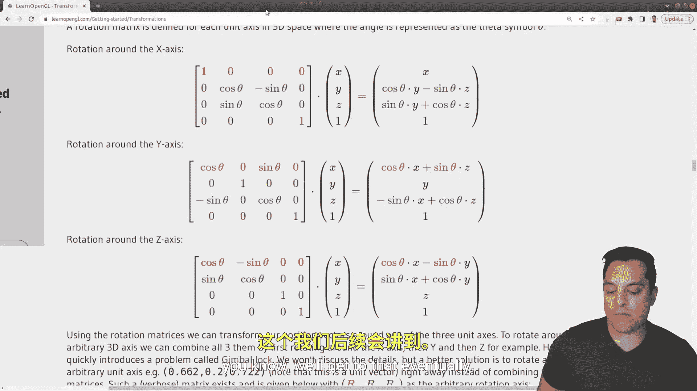
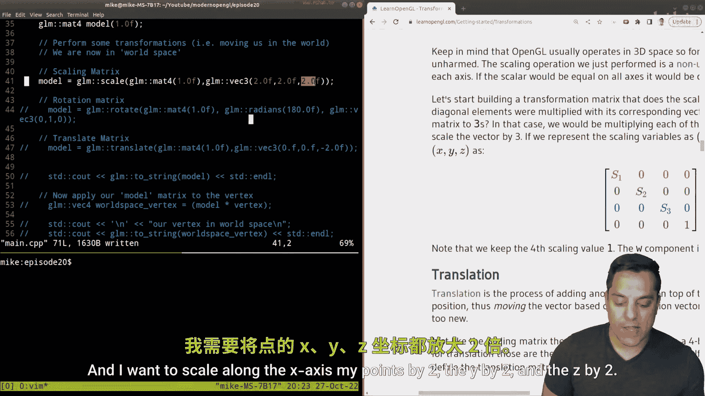

# Mike Shah【中英⚡OpenGL导论｜Introduction to OpenGL】 p20 P20 -Episode 20- OpenGL Math 2 - Matrix Transformations (with GLM code demonstra -BV1pTvFz3Eqh_p20-

Hey， what's going on， folks。 This's Mikeke here and welcome to the next lesson in our modern open GL series In this lesson。

 we're gonna to be continuing our discussion about mathematics and Open GL and talking about a little bit more linear algebra in the context of the GLM library。

 That's the Open GL mathematics library， which is freely available。

 We set this up in previous lessons so make sure that you go ahead and check those out if you haven't in the playlist in the description below and make sure you subscribe so you don't miss these future lessons that we have。

 So with that said， let's go ahead and take a look here。

 So I'm gonna go ahead and show you GLm the mathematics library in the context of the C plus plus code and teach you a little bit about the math。

 This is gonna be a full derivation if you want to see something like that comment below and then I'll consider doing a separate series on that。

 But I think this will give you enough intuition that you can go ahead and dive into some other resources。

 All right with that said， we've set up GLM here again。

 check out the previous video if you want to go ahead and see where those headers are in my directory here。

 what I've done is I've gone ahead。😊，And set up a little structure here。

 I've got a note here that I've got set up in a directory back here。

 the third party and then the GLM library。 So it is available。 You'll see how I compile in a moment。

 Okay， with that said， let's go ahead and get started here from our main。

And where we want to start from is just this idea of a vertex。

 some piece of data that we want to plot here。 So I'm going to go ahead and use a V4 to plot this information。

 and you'll see why in a moment here。 But in the x。

 I'm going to go ahead and plot at about the one coordinate on the y axis around the5 and on the z a positive Z coming towards us around here。

 So this points going sort of take us up here to the to the y axis and then out a little bit to the Z maybe somewhere around here is where our actual vertex would be in 3D space。

 I know it's hard to represent without having multiple points。 but this is what we've got here。

 So let me go ahead and just kind of clear this up here and I'll just label our point just about here and let's go ahead and annotate it one comma 5 comma1 So that's just some vertex。

 And as we know in graphics we're gonna have at least three vertices to draw triangles as we've already done previously in this series。

 But again， let's just focus on one point。And the point here and where we use linear algebra is that we're going to apply some operation to this point to translate it or rotate it or scale that point。

 And if we apply that same operation to a series of points that make up a triangle such that maybe we want to translate this object backwards here like I'm doing so that's how we'll move our objects。

 So again， we're just applying some mathematical transformation to each individual vertex and that's what moves an object。

 Okay so that's what we're going to learn how to do in our shaders and so on。

 but let's go ahead and try to understand the mathematics okay。So I've got this point here， 1。0，5。

0 and 1。0。 Now you'll notice there's a fourth coordinate here。 This is the W coordinate。

 and I haven't explicitly labeled it here。But it actually plays an important part。

 an important role in computer graphics for determining if this is a point that' representing with this vector or a direction。

 Now， as you know， points and directions are different concepts。 a vector is by default。

 something that has a magnitudea direction。 There's no real location。

 but a point is something that's in space。 So we use this one at the end to delineate that this is a point here。

 there's actually some nice mathematical properties of this。 say if I have two points here。

 and I'll actually add the one in our diagram。 So let me go ahead and just put it here so that we know this is a point here。

 And if I create some other point here。 and let's go ahead and guess where this location is。

 something like1，5， maybe in the z axis， it looks like it's maybe negative 3 and also one here。

 If I try to add these points together。 What's going to happen is I'll have a two Again。

 I'm just adding each of the components up10 negative 3。1 would give me negative2。

 and then I'll get a2 in this last spot here， so hopefully everyone can see I'm just adding up each component here of X。

 Y， z in this fourth coordinate， which is W here。Now， if I end up with a two here。

 that's sort of nonsensical in the sense of what operation I've done with this point here。 Okay。

 so that's how we're able to， you know， it doesn't make sense to add two points together。

 We can subtract two points， and that'll give us a direction。

 So if I was going to subtract these two points。 let's go ahead and do the same exercise。

 I'll do this point and subtract from it this point。 I would get something like 0，5 minus5 is 0。

 negative3-1 is negative 4 and11 gives me a 0。 And this last value here。 W so w equals 0 here。

 indicates that we have a direction。 so that's the idea here。 So this gives us an actual vector。

 negative 4 along the z axis。 So here and as I sort of mark this here。

 you can kind of see that's how I get from this point to this point here right when I did this subtraction。

 So that tells us。😊，If we have a value of zero at the end， it's a vector， if we have one。

 it's a point and based off the mathematical operations that we do， things like a point。

Minus a point。That yields us a vector， and again， mathematically。

 we can see at the end it just sort of ends up that way where we get a zero at the end。

And if I do something like a point。Plus a point。We see that that is just nonsense。 It doesn't work。

 but I can also do things like vector minus vector， which we saw in the previous lesson。 And。

 of course， if I just pay attention to the last coordinate， it will just be 0 minus0。

 So that is also yielding us a new vector or vector plus a vector， etc cetera， etc ce。 So again。

 I didn't want to do deep dive into the math， but that's just what that last point means。

 Okay and as you know， as folks you have been watching this channel。

 I tend to like to just tell you how things work。 Alright。

 so let's go ahead and just back up this example here。

 I'm going to go ahead and get rid of our W coordinate here。

 and you'll just have to trust me that again， that's the math that works out W equals1 means we're working with a point。

😊，W equals 0 means we're working with a vector。 So I'll just leave that as our cheat sheet there。

 Okay， so this is a vertex。 And we say that this is just its local space or local coordinates。 Okay。

 I've just specified exactly on line 29 where this vertex is。

 And by now you sort of understand this and get the point here。 Okay。

 so let's go ahead and move down a little bit in our code here。

So this next chunk of what I'm doing here， and I'll indicate this here。These next few lines here。

Is I'm creating what we call a model， okay， what I actually want to do or how I want to transform this point here。

And this is going to be something where we move from local。

To something known as world space Okay and if you read text on computer graphics。

 this is going to be the idea moving from local space to world space Okay because again。

 my goal is I want to transform this point somewhere， whether I translate it。

 maybe rotate it somewhere or I can scale it which again is a sort of form of it's similar to like a translation it's going to adjust this point。

 this vertex in space。So what I'm doing here though。

 with the actual type that I'm creating this GLM mat 4 is what's called a matrix okay。

 and as it stands for， it's a 4 by4 matrix。 So let's go ahead and take a look at this and I'm going to draw it down here。

And specifically this is an identity matrix， I'm specifying 1。0 here to make this identity。

 so that means along the diagonal of my matrix there are ones in every other location there are zeros。

Okay， so I'm just going to quickly fill in the zeros here。And this is a matrix， that is4。By four。

 so it's four rows by four columns or an open GL。 we are a column major。

 so we have four columns here going up and down。And the four rows。 Okay。

 if you're in drag deck or some other API， direct 3D， Vulcan metal， et cetera。

 you might have some different adjustment。 But in open G， we are column major。 Okay， All right。

 so what does this Give me。 Well， basically， my idea is I'm going to take this matrix here。

And I can apply it to this point here。 Okay， so what does that mean when I say apply。 Well。

 this means multiply this matrix by this actual point here， Okay， which I'm representing with a V4。

 So I'm going to do a matrix multiplication by this vector here。 Okay， now。

 how does that actually transform this point。 Well， if I have the identity here。

 which let me go ahead and label identity。Then it's not going to change anything， right。

 the identity when you learn in math is1 times some value7 yield2 7 or7 times1 equals0 7， you know。

 it doesn't change anything。 I've got ones down the diagonal here so it doesn't multiply anything okay。

So what I want to do here again is take this matrix and multiply by some point here。

 Let's go ahead and label our point，1，5，1。 And since this is a point。 I've got a one here。 Okay。

 How do I do matrix multiplication。 Well， I take the row。By the column and that will yield me， Well。

 I take the dot product like we learned from last lesson， one times one plus0。Times 5。

 which will give me a01 times 0， which gives me a0 and0 times1， which also gives me a0。 Okay。

 so I end up just getting one here in this first column here and that sort of makes sense right And if I go through this math here again。

 I'm going to get a one a and let me just go ahead and I'll complete the math here but this yields me a new vector here and since I'm multiplying by the identity。

 I just get one，5，1，1 here Okay， so we get a new vector。 this is the new location Okay。😊。

And after this transformation here， this is my world coordinate or world space。Okay。

 and that's our goal today to understand this transformation。

 There's other transformations that we're going to do。

 and we introduce a camera to get us in view space and so on。 But this is the idea。 Okay。

 so now that we've got this idea that we have these matrices that are going to move somehow this point。

 Let's look at some。 Okay This is the identity matrix。 So it doesn't do anything for us。

 I'm going to go ahead and just point you to a great resource learn opengl do co。

 which shows the matrices that I'm going to demonstrate in code with GLM。

 So there's a scaling matrix and it looks like this along the diagonal。 So where our identity was。

 we have the terms S1， S2， S3， and that's scaling us in the X， Y and Z dimension。 Okay。

 so how exactly is that working。 Well， let's go ahead and look at our example here。

 This column here is how much we're affecting X。 So it's sort of the X。

 This is how we're affecting Y。😊，And this is how we're affecting Z on the fourth column。 Well。

 we've got these special values here again， for the purpose of helping us with translation。

 And again， that's a sort of you can look up how that's derived or I can make a video that's useful。

But anyways， this is how we're affecting the X of this point here。

 So how far am I moving here that's in this first column of our matrix y in z so that's the way to read this and I wish they would have labeled here S of x S of y S of Z here but' that's what's going on here but they do show the corresponding points here。

 Okay so that's one of our special transformations that's going to scale。

 which means to either grow or shrink where our point is and this could be done uniformly or non uniformformly。

Okay， then we've got a special another special matrix for translation。

 which is how we're going to move our point okay now for those of you who are linear algebra fans。

 essentially what this is doing， T of X， T Y and T of Z here at the center of my screen here。

 these three points here， go ahead and click out of that。

It's effectively moving our origin point and that's how we do translation and computer graphics okay。

 don't need to drive that right now， but this is how we translate or move a point。😊，And then finally。

 for rotation， I'll go ahead and scroll down。 we have three special rotation matrices for rotating about the x。

 the Y or the z axis。 Okay， so that's the idea。 And again。

 you can go ahead and look at how these are derived For now。

 we're just going to know that we can rotate about some particular axis。

 And we can actually define what this axis is。 I'll show you what I mean in a moment。😊，Okay。

 and there are other ways to rotate if you've done stuff and say Unity 3D with Quaernians， you know。

 we'll get to that eventually， okay， so just take for grantedite that we have these special matrices already built into us in GLM and that's why we're going to start with this library。

Okay， so let's go ahead and perform some transformations to move this point here into worldspace or in general。

 just move it。 Okay， so let me go ahead and start by just compiling this program here and I'll go ahead and bring in some stuff and what I'm going to be showing you is just where is our point here Okay in a moment。

 but let's go ahead and start with scaling here Okay， so in GLM what I'm going to do here is again。

 I have my identity matrix that's here just sort of the default here。

But notice that I've given this this name model。 And again。

 the model is just sort of how we talk about things in world space。

 It's how or where are actual objects going to be。 So of taking our model to world space。

And what I want to do is perform a scale operation。 So I've got GLM scale here。 Os。

 let me bring back my I。Bring back my operation， there we are。

And the idea is what scale' is doing is it saying， okay。

 what kind of scale matrix do we want to build here， that special transformation matrix。 Okay。

 so I'll go ahead and scroll up here。To show you scale， again。

 that was one with the diagonals right here。And I want to scale along the x axis my points by  two。

 the y by 2 and the z by  two。 So I'm effectively doubling my。

X， Y and Z here。 Okay， this doesn't have to be uniform， but that's what I'm doing here。 Okay。

 and that's going to take you know， this along the diagonal for our scaling matrix and multiply each of these by 2。

 Okay， and I specified those floating point values。Okay， all right。

 so let's go ahead and see what happens when I do this。 Now， I've got this， again。

 matrix here that I'm going to multiply by my point and get a new value for my point that effectively。

Moves it in the world in some way， so this is a scaling operation。Okay。

 so what I'm going to go ahead and do to capture this is go ahead and first I just want to print off the actual scale matrix that's generated so I can show you that。

 Okay， so let's go ahead and run our program here。So I've got it here。

 Now this is a bit of a mess here。 You can just print out the matrix。

 I'm going to show you how to just print off every column just to make this a little bit cleaner。

 This is something I wanted to show you last time， right so I could just grab the first column here。

😊，And let's just grab and print off each of the columns and then it'll line up a little bit nicer。

Okay， so this is just a little trick you can do in GLM。

And you could you should probably write a function for this， but trick to print off each column。

OkayThis is why you watch this stuff to learn these tricks and then we can see our matrix here。

 right， they are V fours because they have four values here。😊，But here's our actual matrix here。

 Okay， and sorry， this is actually printing off the rows。 All right。

 so anyways you can see that this is laid out like our diagram。

 And you can see where the actual two shows up here。 Now。

 let's go ahead and just change one of these。 And again。

 this is how you can kind of debug and play around with this。 Let's change this to three。Okay。

And the first value， and I'll go ahead and rerun it and you can see that， well。

 part of our vector here， we want to multiply by three， whatever our first point is okay。All right。

Okay， so let me just leave these as twos here。 And now let's actually do something with our matrix here。

 Okay， we want to actually multiply this。 Okay， so in order to apply our model matrix to the vertex。

 we're going to again， multiply the model by the vertex here。 Okay。

 so I've created this what I'm calling in world space Now vertex。 Okay。

 it's actually been transformed here。😊，Okay， and then we can actually print this off。

And let's see what the result is here。 Okay， go ahead and run it。 We can see what our matrix is。

 And then our vertex in world space。 Well， if I've scaled it by two in each dimension， it's now 2，10。

2。 it could verify that if you multiply1 by two，5 by2 and also one by2 here in this point that those are the correct coordinates here。

 Okay and then also， you know that this is a point in space because I have a1 in the last dimension。

 Okay so we know that again， we've moved this thing。 So again， by scaling this。

 I've moved this and again， it's gonna to be kind of hard to represent， but you know。

 in our x by 2 in our y by bit in by our z。 So it ends up I don't know somewhere out。😊。

Here and space， but， you know， closer to the X axis。 So anyway， that's where our point is。

 Maybe I wonna actually shift it over here a bit， but。That's the idea， okay。Okay。

 so let's go ahead and look at our other operations。 So that's scale。

 Now I'm going to go ahead and just comment this out and let's look at rotation。

 We'll do the same thing essentially。 So in GLM， we have GLM rotate again， we build a matrix here。

 just the identity for the first parameter。 And then the angle that we want to rotate。

 Now it's important to note that in GLM we use radance， that's what's accepted。

 So there's a GLM radance command。 and this would be the angle as you would sort of think of it in degrees。

 So 180 degrees。 So again， it's sort of half turn now in radians。

 you can again think about what it is it's sort of half around。😊，And then the next parameter。

 which I'm going to go ahead and make this just a little bit bigger so you can see everything on the screen here。

Is what axis do we want to actually rotate about So if I put in 010。

This is the vector that I'm rotating about， and I'll draw it on the screen here。

It's just a vector that's pointing up along the Y axis。 Okay so 01 would come up something like this。

 but that's what I'm rotating about。 So you can go ahead and do this experiment if you just sand straight right。

 point your arm up into the air。 And that's sort of making this vector here，0，1，0。

 just a vector pointing up one in the Y axis。 And then if you spin you should be you know turning like I'm going to do here。

 just turning one direction or the other depending on how many degrees you are rotating from rotating 180 degrees。

 that should be a half turn， you should be facing the opposite direction。

 so let's go ahead and see what this looks like。😊，So where does this land us， well， here's the， well。

 I guess I'm just printing off the model matrix here。嗯。But if you look very carefully， right。

 it's not the identity with ones cross the diagonal。 Some of these values are negative。

 and some of them are positive。 Now， notice the one in the y axis is just a one。 So it's unchanged。

 right， when you're spinning around， you're not moving up or down， you're changing on the Y axis。

 And this will be true if you're rotating about the X axis or the Z axis。 again。

 you might have to do a little bit more work just to see how that's looking。

 But you will see there are some negative values here。

 And that has to do with how we are rotating right So what we are effectively doing when we're rotating about the y axis。

 And I'm just going to visualize it here is we're rotating about the Y axis here。

 right around this point here。😊，now I know my drawing's getting a little bit messy。

 So I'll just go ahead and draw the point up here。 draw a blue point and say that we're rotating around here。

 So we could make a full circle around this point here。 that's in by 0，10。

 that's the axis that we're rotating about。 that's what GLM allows us to do relatively easy。

 and then if we multiply that by our vertex again， we're moving。 So we're at negative15， again。

 the y dimension isn't changed and negative 1 again。 Okay， so this sort of makes sense。

 And if you look at the math here， if we're at 1，1， we would sort of do a half turns。

 So we would end up at negative1 and the x axis in negative 1 and z so we can play around with it。

 That's the purpose of this video to have this code available you can learn from。😊，All right。

 let's look at the last one， which is probably the most intuitive， which is translation here。

And again， doing the sort of the same idea building a matrix here。

 this is building a translation matrix。 This is what this is doing when I have these GLM mat 1。

0 here， I'm just saying， okay， give me a a density matrix to start from and then build me a translation matrix where I'm going to go negative2 in the Z direction。

 so I'm going to be on our drawing over here， I'm going to be moving back here。 Okay， two units。😊。

And store that here in this model and then multiply that translation matrix by our vertex。

 such that it will push it back into our world two units here， negative2。 Okay。

 so let's go ahead and try this again。I'll recompile。And， let me make sure I save。

 rate and and rerun。And if we look carefully here， we will see that we have a negative one here。

Before we are positive one in the axis。 So we have effectively moved this point backwards。 Okay。

 so now it's negative here。 so to be 1，5 negative1 as indicated。 it's still point。

 So there's a one in R W coordinates。 right， So with that said。

 that's the code that I've got set up here。 now， something that's important to keep in mind I've given you a relatively simplistic view here。

 let's go ahead and build this up just a tiny bit here。😊。

And what I want to go ahead and do is let's go ahead and do something with our scale rotation and our translation。

 Okay， so I'm going to actually build these as separate matrices here。Okay。

 so let's actually just call this GLM。And matrix 4 here。

 I'm going to make this S because we're doing scaling GLM matrix 4 R for our rotation。

And let's go ahead and do GLM matrix for T for our translation。 Okay。

 so I'm able to create a scale matrix， rotation matrix in a translation matrix。 Okay。

 now what I want to actually do here。😊，And let's go ahead and。From our model matrix。

Let's go ahead and store these operations。 Okay， now let's go ahead and think about what we want to do。

 So what I'm basically doing is compounding these operations here。

 So let's go ahead and translate to move our point。And then I'm going to rotate my point。

And then I'm going to scale it， okay。So translate。First， then rotate， then scale。

Now if you notice carefully how I was speaking here。For these operations。

And I'll go ahead and let me actually capture these before I print things off。

Notice that I sort of wrote them backwards right to left， okay。

 that's the order that we apply our matrix transformations in。Okay。

 so let's go ahead and just try this off， try this and see what this is。 Oops。

 so I add an extra R here。Make sure our code compiles。And we can go ahead and see， you know。

 where did our vertex land in space， okay， negative2， 10 and positive 2 here。

Let's try to change these so that I will do a different operation just to show you or to see if we land at negative 2。

10，2 and one here。 Okay， this time， maybe let's scale first rotate and then translate Okay。

 I'll go ahead and rerun this。And this time we end at negative 2， 10 and negative 4。

 which was different again， just to highlight above here， negative 2， 10 and 2。So the takeaway here。

Is that the order of operations matters。 So let me go ahead and just slow us down。 So order。

Of operations。Matterters， okay？And we think right to left， okay， when applying our actual operation。

 so we scale first rotate and then translate Okay， so that's really all you need to know to get started with moving stuff around。

Now， in practice， what we'll probably end up doing on our actual graphics programs is we'll create these matrices and then the actual operations。

 the actual multiplications， those are going to be offloaded onto our GPU because it's a little bit more efficient to do that。

 Okay but we can go ahead and see and play around with this little playground and GLM to see what we're actually doing。

 Okay， so hopefully that makes sense， folks， hopefully you enjoyed this lesson。

 I'll go ahead and just scroll through the code。😊，One time here。Just so you can see， again。

 we set up GLM。Here we set up our vertex， we talked about W equal to 1 this last coordinate here。

The identity matrix， which ultimately leads to our result， scale。

 rotation and translation are three special matrices。

 how we apply these in order from right to left in that order of matrix multiplication matters and you can check this by doing matrix multiplication by hand。

A little trick here for printing off your matrix for debug and then applying to your vertex。

 this matrix or series of multiplications to transform a individual vertex。 And again。

 we'll do this for every single vertex in our program that's how we get things to move。

 and then just ultimately printing out the result。 And here was， of course， our little drawing board。

 which got a little bit messy， but hopefully was useful to illustrate the points here。Al right folks。

 that was a bit of a monster lesson on the mathematics， some of the mathematics on OpenGL。

 so hopefully it was useful。 hopefully it helps you get a little bit of an intuition to how things work here and hopefully enjoyed this if you want more lessons on the math and how things work again。

 I think they're important。 I think this is the key to becoming a good graphics programmer understanding the math。

 please let me know in the comments， please make sure you subscribe so you don't miss those lessons if I build those and thank you as always for your time。

 make sure you join our community forum they're free and in the description below and if you can go ahead and support as a member and you occasionally get some secret posts for that and discount。

 So go ahead and check out this lesson， try out some of the code and we'll see you very。

 very soon folks。😊。